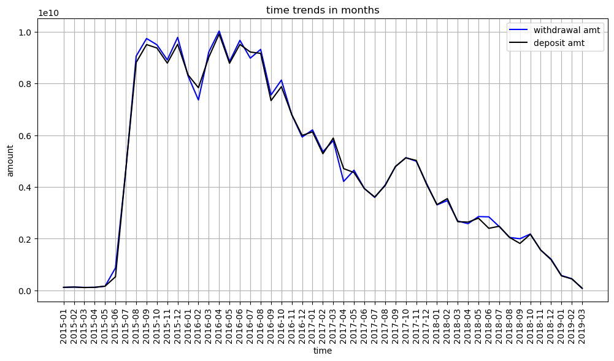

```python
import pandas as pd
```


```python
import dask.dataframe as dd
```


```python
from dask import delayed
```


```python
# Load Excel using pandas (delayed execution for scalability)
@delayed
def load_excel(file_path):
     return pd.read_excel(file_path,sheet_name=0,dtype={'account no':'str'})
```


```python
df= dd.from_delayed([load_excel("C:/Users/user/Downloads/bank.xlsx")])
print(df.head())
```

          Account No       DATE               TRANSACTION DETAILS  CHQ.NO.  \
    0  409000611074' 2017-06-29  TRF FROM  Indiaforensic SERVICES      NaN   
    1  409000611074' 2017-07-05  TRF FROM  Indiaforensic SERVICES      NaN   
    2  409000611074' 2017-07-18        FDRL/INTERNAL FUND TRANSFE      NaN   
    3  409000611074' 2017-08-01   TRF FRM  Indiaforensic SERVICES      NaN   
    4  409000611074' 2017-08-16        FDRL/INTERNAL FUND TRANSFE      NaN   
    
      VALUE DATE  WITHDRAWAL AMT  DEPOSIT AMT  BALANCE AMT  .  
    0 2017-06-29             NaN    1000000.0    1000000.0  .  
    1 2017-07-05             NaN    1000000.0    2000000.0  .  
    2 2017-07-18             NaN     500000.0    2500000.0  .  
    3 2017-08-01             NaN    3000000.0    5500000.0  .  
    4 2017-08-16             NaN     500000.0    6000000.0  .  
    


```python
# Find Top 10 Accounts with Highest Transactions
agg_df = df.groupby("Account No")[["WITHDRAWAL AMT","DEPOSIT AMT"]].sum().compute()
agg_df["Net Amount"] = agg_df["DEPOSIT AMT"]- agg_df["WITHDRAWAL AMT"]
top_trans = agg_df.sort_values("Net Amount", ascending=False).head(10)
print("top 10 trans:\n",top_trans)
```

    top 10 trans:
                    WITHDRAWAL AMT   DEPOSIT AMT    Net Amount
    Account No                                               
    409000438620'    1.719608e+10  1.720243e+10  6.351519e+06
    409000493210'    1.006049e+08  1.022096e+08  1.604689e+06
    409000611074'    1.453974e+08  1.458596e+08  4.622000e+05
    409000438611'    4.705551e+09  4.705899e+09  3.481297e+05
    409000493201'    9.537793e+07  9.565931e+07  2.813833e+05
    1196428'         6.848283e+10  6.838251e+10 -1.003184e+08
    409000405747'    4.203179e+08  2.287852e+08 -1.915327e+08
    409000362497'    1.019351e+11  1.017209e+11 -2.141830e+08
    409000425051'    3.845102e+08  2.703186e+07 -3.574784e+08
    1196711'         4.692584e+10  4.587889e+10 -1.046952e+09
    


```python
# Extract Year-Month for trend analysis
df["Year_Month"]=df["DATE"].dt.to_period("M").astype(str)
trends = df.groupby("Year_Month")[["WITHDRAWAL AMT","DEPOSIT AMT"]].sum().compute()
```


```python
import matplotlib.pyplot as plt

# Plot trend analysis
plt.figure(figsize=(12,6))
plt.plot(trends.index,trends["WITHDRAWAL AMT"],label="withdrawal amt",color='blue')
plt.plot(trends.index,trends["DEPOSIT AMT"],label="deposit amt",color='black')
plt.xticks(rotation=90)
plt.grid()
plt.legend()
plt.xlabel("time")
plt.ylabel("amount")
plt.title("time trends in months")
plt.show()         
```


    

    


```python
deposit_value=df["DEPOSIT AMT"].compute()
withdrawal_value=df["WITHDRAWAL AMT"].compute()
```


```python
# Compute IQR for deposit amounts
q1_dv=deposit_value.quantile(0.25)
q3_dv=deposit_value.quantile(0.75)
iqr_dv=q3_dv-q1_dv
lb_dv=q1_dv-1.5*iqr_dv
up_dv=q3_dv+1.5*iqr_dv
# Compute IQR for withdrawal amounts
q1_wv=withdrawal_value.quantile(0.25)
q3_wv=withdrawal_value.quantile(0.75)
iqr_wv=q3_wv-q1_wv
lb_wv=q1_wv-1.5*iqr_wv
up_wv=q3_wv+1.5*iqr_wv
```


```python
# Filter outliers
dep_out=df[(df["DEPOSIT AMT"]<lb_dv)|(df["DEPOSIT AMT"]>up_dv)].compute()
with_out=df[(df["WITHDRAWAL AMT"]<lb_wv)|(df["WITHDRAWAL AMT"]>up_wv)].compute()
# Display results
print("unusual dep trans:\n  ",dep_out.to_string(index=False))
```

    unusual dep trans:
          Account No       DATE                     TRANSACTION DETAILS  CHQ.NO. VALUE DATE  WITHDRAWAL AMT  DEPOSIT AMT   BALANCE AMT . Year_Month
    409000425051' 2018-10-26        TRF FROM  Indiaforensic SERVICES      NaN 2018-10-26             NaN  15000000.00  4.592003e+05 .    2018-10
    409000405747' 2016-05-03        TRF FROM  Indiaforensic SERVICES      NaN 2016-05-03             NaN 202100000.00 -3.566520e+08 .    2016-05
    409000438611' 2016-02-25               GOLD LABEL INVESTMENTS (P      NaN 2016-02-25             NaN 170250000.00 -3.780175e+08 .    2016-02
    409000438611' 2016-03-01        NEFT/FDRL401250221/Indiaforensic      NaN 2016-03-01             NaN  15000000.00 -5.330175e+08 .    2016-03
    409000438611' 2016-03-01        NEFT/FDRL401250220/Indiaforensic      NaN 2016-03-01             NaN  15000000.00 -5.180175e+08 .    2016-03
    409000438611' 2016-03-03            RTGS/ICICH16063341652/Indfor      NaN 2016-03-03             NaN  15000000.00 -5.030175e+08 .    2016-03
    409000438611' 2016-03-03            RTGS/ICICH16063341657/Indfor      NaN 2016-03-03             NaN  15000000.00 -4.880175e+08 .    2016-03
    409000438611' 2016-03-30             RTGS/YESBH16064937495/RMCPL      NaN 2016-03-30             NaN  15000000.00 -5.330176e+08 .    2016-03
    409000438611' 2016-03-30          RTGS/YESBH16064937475/Risk Pro      NaN 2016-03-30             NaN  15000000.00 -5.180176e+08 .    2016-03
    409000438611' 2016-03-30           RTGS/YESBH16064937486/Riskpro      NaN 2016-03-30             NaN  15000000.00 -5.030176e+08 .    2016-03
    409000438611' 2016-03-30          RTGS/YESBH16064937487/Risk Pro      NaN 2016-03-30             NaN  15000000.00 -4.880176e+08 .    2016-03
    409000438611' 2016-03-30            RTGS/YESBH16064937985/Riskpo      NaN 2016-03-30             NaN  15000000.00 -4.730176e+08 .    2016-03
    409000438611' 2016-03-30            RTGS/YESBH16064937485/Indfor      NaN 2016-03-30             NaN  15000000.00 -4.580176e+08 .    2016-03
    409000438611' 2016-03-30            RTGS/YESBH16064937485/Indfor      NaN 2016-03-30             NaN  15000000.00 -4.430176e+08 .    2016-03
    409000438611' 2016-03-30            RTGS/YESBH16064937485/Indfor      NaN 2016-03-30             NaN  15000000.00 -4.280176e+08 .    2016-03
    409000438611' 2016-03-30            RTGS/YESBH16064937485/Indfor      NaN 2016-03-30             NaN  15000000.00 -4.130176e+08 .    2016-03
    409000438611' 2016-03-30            RTGS/YESBH16064937485/Indfor      NaN 2016-03-30             NaN  15000000.00 -3.980176e+08 .    2016-03
    409000438611' 2016-03-30            RTGS/YESBH16064937485/Indfor      NaN 2016-03-30             NaN  15000000.00 -3.830176e+08 .    2016-03
    409000438611' 2016-03-30            RTGS/YESBH16064937485/Indfor      NaN 2016-03-30             NaN  15000000.00 -3.680176e+08 .    2016-03
    409000438611' 2016-03-30            RTGS/YESBH16064937485/Indfor      NaN 2016-03-30             NaN  15000000.00 -3.530176e+08 .    2016-03
    409000438611' 2016-03-30            RTGS/YESBH16064937485/Indfor      NaN 2016-03-30             NaN  15000000.00 -3.380176e+08 .    2016-03
    409000438611' 2016-03-30            RTGS/YESBH16064937485/Indfor      NaN 2016-03-30             NaN  15000000.00 -3.230176e+08 .    2016-03
    409000438611' 2016-03-30          RTGS/YESBH16064937485/Riks pro      NaN 2016-03-30             NaN  15000000.00 -3.080176e+08 .    2016-03
    409000438611' 2016-06-30        TRF FROM  Indiaforensic SERVICES      NaN 2016-06-30             NaN  15000000.00 -5.329944e+08 .    2016-06
    409000438611' 2016-06-30        TRF FROM  Indiaforensic SERVICES      NaN 2016-06-30             NaN  15000000.00 -5.179944e+08 .    2016-06
    409000438611' 2016-06-30        TRF FROM  Indiaforensic SERVICES      NaN 2016-06-30             NaN  15000000.00 -5.029944e+08 .    2016-06
    409000438611' 2018-04-03        Indiaforensic VISA ACQ DOM 01041      NaN 2018-04-03             NaN  38525273.35 -5.096819e+08 .    2018-04
    409000438611' 2018-04-04         TRF FROM Indiaforensic SERVICES      NaN 2018-04-04             NaN  15000000.00 -5.332002e+08 .    2018-04
    409000438611' 2018-04-04         TRF FROM Indiaforensic SERVICES      NaN 2018-04-04             NaN  15000000.00 -5.182002e+08 .    2018-04
    409000438611' 2018-10-08        Indiaforensic MASTER ACQ DOM0810      NaN 2018-10-08             NaN  12243224.61 -5.358936e+08 .    2018-10
    409000438611' 2018-10-15        Indiaforensic MASTER ACQ DOM1510      NaN 2018-10-15             NaN  14607747.66 -5.336256e+08 .    2018-10
    409000438611' 2018-10-15        Indiaforensic VISA ACQ DOM151018      NaN 2018-10-15             NaN  12028184.93 -5.147921e+08 .    2018-10
    409000438611' 2018-10-22        Indiaforensic MASTER ACQ DOM2210      NaN 2018-10-22             NaN  12664093.19 -5.323976e+08 .    2018-10
    409000438611' 2018-10-29        Indiaforensic MASTER ACQ DOM2910      NaN 2018-10-29             NaN  12939624.30 -5.238612e+08 .    2018-10
    409000438611' 2018-11-05        Indiaforensic MASTER ACQ DOM0511      NaN 2018-11-05             NaN  15546792.38 -5.290210e+08 .    2018-11
    409000438611' 2018-11-05        Indiaforensic VISA ACQ DOM051118      NaN 2018-11-05             NaN  15859883.17 -5.131612e+08 .    2018-11
    409000438611' 2018-11-09        Indiaforensic MASTER ACQ DOM07-0      NaN 2018-11-09             NaN  14539365.82 -5.327530e+08 .    2018-11
    409000438611' 2018-11-12        Indiaforensic MASTER ACQ DOM10-1      NaN 2018-11-12             NaN  15264703.21 -5.184670e+08 .    2018-11
    409000438611' 2018-11-12        Indiaforensic VISA ACQ DOM121118      NaN 2018-11-12             NaN  12901419.90 -5.055656e+08 .    2018-11
    409000438611' 2018-11-19        ICA 17825 Indiaforensic MC DOM 1      NaN 2018-11-19             NaN  12671255.85 -5.353664e+08 .    2018-11
    409000438611' 2018-11-19        Indiaforensic VISA ACQ DOM191118      NaN 2018-11-19             NaN  12121648.00 -5.332448e+08 .    2018-11
    409000438611' 2018-11-22        ICA 17825 Indiaforensic MC DOM 2      NaN 2018-11-22             NaN  15140655.54 -5.327533e+08 .    2018-11
    409000438611' 2018-11-26        ICA 17825 Indiaforensic MC DOM 2      NaN 2018-11-26             NaN  16419259.12 -5.317640e+08 .    2018-11
    409000438611' 2018-12-03        ICA 17825 Indiaforensic MC DOM 0      NaN 2018-12-03             NaN  13683158.10 -5.333452e+08 .    2018-12
    409000438611' 2018-12-03        Indiaforensic VISA ACQ DOM031218      NaN 2018-12-03             NaN  11949030.72 -5.362961e+08 .    2018-12
    409000438611' 2018-12-10        ICA 17825 Indiaforensic MC DOM 1      NaN 2018-12-10             NaN  14926188.87 -5.199889e+08 .    2018-12
    409000438611' 2018-12-10        Indiaforensic VISA ACQ DOM101218      NaN 2018-12-10             NaN  12098346.17 -5.358905e+08 .    2018-12
    409000438611' 2018-12-17        ICA 17825 Indiaforensic MC DOM 1      NaN 2018-12-17             NaN  12202546.59 -5.215088e+08 .    2018-12
    409000493210' 2018-02-15              FDRL/INTERNAL FUND TRANSFE      NaN 2018-02-15             NaN  15000000.00 -5.315204e+08 .    2018-02
    409000493210' 2018-02-15              FDRL/INTERNAL FUND TRANSFE      NaN 2018-02-15             NaN  15000000.00 -5.165204e+08 .    2018-02
    409000493210' 2018-02-15              FDRL/INTERNAL FUND TRANSFE      NaN 2018-02-15             NaN  15000000.00 -4.948730e+08 .    2018-02
    409000493210' 2018-02-15              FDRL/INTERNAL FUND TRANSFE      NaN 2018-02-15             NaN  15000000.00 -4.798730e+08 .    2018-02
    409000438620' 2016-02-25               GOLD LABEL INVESTMENTS (P      NaN 2016-02-25             NaN 544800000.00 -1.514640e+06 .    2016-02
    409000438620' 2016-02-29        NEFT/FDRL401249529/Indiaforensic      NaN 2016-02-29             NaN  15000000.00 -8.651464e+07 .    2016-02
    409000438620' 2016-02-29        NEFT/FDRL401249530/Indiaforensic      NaN 2016-02-29             NaN  15000000.00 -7.151464e+07 .    2016-02
    409000438620' 2016-02-29        NEFT/FDRL401249531/Indiaforensic      NaN 2016-02-29             NaN  15000000.00 -5.651464e+07 .    2016-02
    409000438620' 2016-02-29        NEFT/FDRL401249532/Indiaforensic      NaN 2016-02-29             NaN  15000000.00 -4.151464e+07 .    2016-02
    409000438620' 2016-02-29        NEFT/FDRL401249533/Indiaforensic      NaN 2016-02-29             NaN  15000000.00 -2.651464e+07 .    2016-02
    409000438620' 2016-02-29        NEFT/FDRL401249534/Indiaforensic      NaN 2016-02-29             NaN  15000000.00 -1.151464e+07 .    2016-02
    409000438620' 2016-03-11               709002333825 : Closure Pr      NaN 2016-03-11             NaN 100000000.00 -4.454147e+08 .    2016-03
    409000438620' 2016-03-11               709002333849 : Closure Pr      NaN 2016-03-11             NaN 100000000.00 -3.454147e+08 .    2016-03
    409000438620' 2016-03-14            RTGS/ICICH16074260960/Indfor      NaN 2016-03-14             NaN  15000000.00 -5.304147e+08 .    2016-03
    409000438620' 2016-03-14            RTGS/ICICH16074260949/Indfor      NaN 2016-03-14             NaN  15000000.00 -5.154147e+08 .    2016-03
    409000438620' 2016-03-14            RTGS/ICICH16074260996/Indfor      NaN 2016-03-14             NaN  15000000.00 -5.004147e+08 .    2016-03
    409000438620' 2016-03-14            RTGS/ICICH16074261000/Indfor      NaN 2016-03-14             NaN  15000000.00 -4.854147e+08 .    2016-03
    409000438620' 2016-03-14            RTGS/ICICH16074260975/Indfor      NaN 2016-03-14             NaN  15000000.00 -4.704147e+08 .    2016-03
    409000438620' 2016-03-14            RTGS/ICICH16074260989/Indfor      NaN 2016-03-14             NaN  15000000.00 -4.554147e+08 .    2016-03
    409000438620' 2016-03-14        NEFT/FDRL401353407/Indiaforensic      NaN 2016-03-14             NaN  15000000.00 -4.404147e+08 .    2016-03
    409000438620' 2016-03-14        NEFT/FDRL401353408/Indiaforensic      NaN 2016-03-14             NaN  15000000.00 -4.254147e+08 .    2016-03
    409000438620' 2016-03-18               Repayment credit [7090023      NaN 2016-03-18             NaN 100150685.00 -4.452640e+08 .    2016-03
    409000438620' 2016-03-18               Repayment credit [7090023      NaN 2016-03-18             NaN 100150685.00 -3.451133e+08 .    2016-03
    409000438620' 2016-11-22         TRF FRM  Indiaforensic SERVICES      NaN 2016-11-22             NaN  15000000.00 -5.239751e+08 .    2016-11
    409000438620' 2017-04-11         Indiaforensic AEPS NPCI WDL SET      NaN 2017-04-11             NaN  13572775.00 -5.182387e+08 .    2017-04
    409000438620' 2017-04-12         Indiaforensic AEPS NPCI WDL SET      NaN 2017-04-12             NaN  14051707.00 -5.320214e+08 .    2017-04
    409000438620' 2017-04-15         Indiaforensic AEPS NPCI WDL SET      NaN 2017-04-15             NaN  28590307.00 -5.175709e+08 .    2017-04
    409000438620' 2017-04-15         Indiaforensic AEPS NPCI WDL SET      NaN 2017-04-15             NaN  16163369.00 -5.014075e+08 .    2017-04
    409000438620' 2017-04-17         Indiaforensic AEPS NPCI DEP SET      NaN 2017-04-17             NaN  13985222.00 -5.161875e+08 .    2017-04
    409000438620' 2017-04-17         Indiaforensic AEPS NPCI DEP SET      NaN 2017-04-17             NaN  12008218.00 -4.962657e+08 .    2017-04
    409000438620' 2017-04-26         Indiaforensic AEPS NPCI WDL SET      NaN 2017-04-26             NaN  12926812.00 -5.332625e+08 .    2017-04
    409000438620' 2017-04-27         Indiaforensic AEPS NPCI WDL SET      NaN 2017-04-27             NaN  12667344.00 -5.335234e+08 .    2017-04
    409000438620' 2017-05-03         Indiaforensic AEPS NPCI WDL SET      NaN 2017-05-03             NaN  12896244.00 -5.332311e+08 .    2017-05
    409000438620' 2017-05-05         Indiaforensic AEPS NPCI WDL SET      NaN 2017-05-05             NaN  12366957.00 -5.337924e+08 .    2017-05
    409000438620' 2017-05-06         Indiaforensic AEPS NPCI WDL SET      NaN 2017-05-06             NaN  12066554.00 -5.340694e+08 .    2017-05
    409000438620' 2017-05-08         Indiaforensic AEPS NPCI WDL SET      NaN 2017-05-08             NaN  12586350.00 -5.334853e+08 .    2017-05
    409000438620' 2017-05-09         Indiaforensic AEPS NPCI WDL SET      NaN 2017-05-09             NaN  13701640.00 -5.324836e+08 .    2017-05
    409000438620' 2017-05-11         Indiaforensic AEPS NPCI WDL SET      NaN 2017-05-11             NaN  15495496.00 -5.305440e+08 .    2017-05
    409000438620' 2017-05-11         Indiaforensic AEPS NPCI WDL SET      NaN 2017-05-11             NaN  16994833.00 -5.135475e+08 .    2017-05
    409000438620' 2017-05-12         Indiaforensic AEPS NPCI WDL SET      NaN 2017-05-12             NaN  18531427.00 -5.275637e+08 .    2017-05
    409000438620' 2017-05-15         Indiaforensic AEPS NPCI WDL SET      NaN 2017-05-15             NaN  17756199.00 -5.284577e+08 .    2017-05
    409000438620' 2017-05-15         Indiaforensic AEPS NPCI WDL SET      NaN 2017-05-15             NaN  11906771.00 -5.066542e+08 .    2017-05
    409000438620' 2017-05-16         Indiaforensic AEPS NPCI WDL SET      NaN 2017-05-16             NaN  17500067.00 -5.111273e+08 .    2017-05
    409000438620' 2017-05-17         Indiaforensic AEPS NPCI WDL SET      NaN 2017-05-17             NaN  18966339.00 -5.272781e+08 .    2017-05
    409000438620' 2017-05-18         Indiaforensic AEPS NPCI WDL SET      NaN 2017-05-18             NaN  15721302.00 -5.304139e+08 .    2017-05
    409000438620' 2017-05-19         Indiaforensic AEPS NPCI WDL SET      NaN 2017-05-19             NaN  16112873.00 -5.300684e+08 .    2017-05
    409000438620' 2017-05-20         Indiaforensic AEPS NPCI WDL SET      NaN 2017-05-20             NaN  16122558.00 -5.300136e+08 .    2017-05
    409000438620' 2017-05-22         Indiaforensic AEPS NPCI WDL SET      NaN 2017-05-22             NaN  13894471.00 -5.314587e+08 .    2017-05
    409000438620' 2017-05-23         Indiaforensic AEPS NPCI WDL SET      NaN 2017-05-23             NaN  15486317.00 -5.306417e+08 .    2017-05
    409000438620' 2017-05-24         Indiaforensic AEPS NPCI WDL SET      NaN 2017-05-24             NaN  15029432.00 -5.311507e+08 .    2017-05
    409000438620' 2017-05-25         Indiaforensic AEPS NPCI WDL SET      NaN 2017-05-25             NaN  15320351.00 -5.264535e+08 .    2017-05
    409000438620' 2017-05-26         Indiaforensic AEPS NPCI WDL SET      NaN 2017-05-26             NaN  15625575.00 -5.305668e+08 .    2017-05
    409000438620' 2017-05-29         Indiaforensic AEPS NPCI WDL SET      NaN 2017-05-29             NaN  14502449.00 -5.317995e+08 .    2017-05
    409000438620' 2017-05-30         Indiaforensic AEPS NPCI WDL SET      NaN 2017-05-30             NaN  16931051.00 -5.285039e+08 .    2017-05
    409000438620' 2017-05-31         Indiaforensic AEPS NPCI WDL SET      NaN 2017-05-31             NaN  16624083.00 -5.296288e+08 .    2017-05
    409000438620' 2017-06-01         Indiaforensic AEPS NPCI WDL SET      NaN 2017-06-01             NaN  16658404.00 -5.279832e+08 .    2017-06
    409000438620' 2017-06-02         Indiaforensic AEPS NPCI WDL SET      NaN 2017-06-02             NaN  18194071.00 -5.280541e+08 .    2017-06
    409000438620' 2017-06-03         Indiaforensic AEPS NPCI WDL SET      NaN 2017-06-03             NaN  16913569.00 -5.293258e+08 .    2017-06
    409000438620' 2017-06-05         Indiaforensic AEPS NPCI WDL SET      NaN 2017-06-05             NaN  14664985.00 -5.316338e+08 .    2017-06
    409000438620' 2017-06-06         Indiaforensic AEPS NPCI WDL SET      NaN 2017-06-06             NaN  15927474.00 -5.302935e+08 .    2017-06
    409000438620' 2017-06-07         Indiaforensic AEPS NPCI WDL SET      NaN 2017-06-07             NaN  19241312.00 -5.270526e+08 .    2017-06
    409000438620' 2017-06-08         Indiaforensic AEPS NPCI WDL SET      NaN 2017-06-08             NaN  18984251.00 -5.272804e+08 .    2017-06
    409000438620' 2017-06-09         Indiaforensic AEPS NPCI WDL SET      NaN 2017-06-09             NaN  21627846.00 -5.246551e+08 .    2017-06
    409000438620' 2017-06-12         Indiaforensic AEPS NPCI WDL SET      NaN 2017-06-12             NaN  21453000.00 -5.248293e+08 .    2017-06
    409000438620' 2017-06-12         Indiaforensic AEPS NPCI WDL SET      NaN 2017-06-12             NaN  19917681.00 -5.049117e+08 .    2017-06
    409000438620' 2017-06-12         Indiaforensic AEPS NPCI WDL SET      NaN 2017-06-12             NaN  13814477.00 -5.324628e+08 .    2017-06
    409000438620' 2017-06-13         Indiaforensic AEPS NPCI WDL SET      NaN 2017-06-13             NaN  23156661.00 -5.231309e+08 .    2017-06
    409000438620' 2017-06-14         Indiaforensic AEPS NPCI WDL SET      NaN 2017-06-14             NaN  23015604.00 -5.190136e+08 .    2017-06
    409000438620' 2017-06-15         Indiaforensic AEPS NPCI WDL SET      NaN 2017-06-15             NaN  24894725.00 -5.214090e+08 .    2017-06
    409000438620' 2017-06-16         Indiaforensic AEPS NPCI WDL SET      NaN 2017-06-16             NaN  22221994.00 -5.240103e+08 .    2017-06
    409000438620' 2017-06-17         Indiaforensic AEPS NPCI WDL SET      NaN 2017-06-17             NaN  20561833.00 -5.256551e+08 .    2017-06
    409000438620' 2017-06-19         Indiaforensic AEPS NPCI WDL SET      NaN 2017-06-19             NaN  17963610.00 -5.277722e+08 .    2017-06
    409000438620' 2017-06-19         Indiaforensic AEPS NPCI WDL SET      NaN 2017-06-19             NaN  12637877.00 -5.151343e+08 .    2017-06
    409000438620' 2017-06-20         Indiaforensic AEPS NPCI WDL SET      NaN 2017-06-20             NaN  20262490.00 -5.259653e+08 .    2017-06
    409000438620' 2017-06-21         Indiaforensic AEPS NPCI WDL SET      NaN 2017-06-21             NaN  17464964.00 -5.287538e+08 .    2017-06
    409000438620' 2017-06-22         Indiaforensic AEPS NPCI WDL SET      NaN 2017-06-22             NaN  19013187.00 -5.272200e+08 .    2017-06
    409000438620' 2017-06-23         Indiaforensic AEPS NPCI WDL SET      NaN 2017-06-23             NaN  17856735.00 -5.283972e+08 .    2017-06
    409000438620' 2017-06-27         Indiaforensic AEPS NPCI WDL SET      NaN 2017-06-27             NaN  21837636.00 -5.244139e+08 .    2017-06
    409000438620' 2017-06-27         Indiaforensic AEPS NPCI WDL SET      NaN 2017-06-27             NaN  19563446.00 -5.048457e+08 .    2017-06
    409000438620' 2017-06-29         Indiaforensic AEPS NPCI WDL SET      NaN 2017-06-29             NaN  22142530.00 -5.241653e+08 .    2017-06
    409000438620' 2017-06-30         Indiaforensic AEPS NPCI WDL SET      NaN 2017-06-30             NaN  18947906.00 -5.273374e+08 .    2017-06
    409000438620' 2017-07-01         Indiaforensic AEPS NPCI WDL SET      NaN 2017-07-01             NaN  19500267.00 -5.267821e+08 .    2017-07
    409000438620' 2017-07-03         Indiaforensic AEPS NPCI WDL SET      NaN 2017-07-03             NaN  14673020.00 -5.150320e+08 .    2017-07
    409000438620' 2017-07-04         Indiaforensic AEPS NPCI WDL SET      NaN 2017-07-04             NaN  16163031.00 -5.286988e+08 .    2017-07
    409000438620' 2017-07-05         Indiaforensic AEPS NPCI WDL SET      NaN 2017-07-05             NaN  15595093.00 -5.303497e+08 .    2017-07
    409000438620' 2017-07-06         Indiaforensic AEPS NPCI WDL SET      NaN 2017-07-06             NaN  19662234.00 -5.264750e+08 .    2017-07
    409000438620' 2017-07-07         Indiaforensic AEPS NPCI WDL SET      NaN 2017-07-07             NaN  19950035.00 -5.252873e+08 .    2017-07
    409000438620' 2017-07-10         Indiaforensic AEPS NPCI WDL SET      NaN 2017-07-10             NaN  17440432.00 -5.285688e+08 .    2017-07
    409000438620' 2017-07-10         Indiaforensic AEPS NPCI WDL SET      NaN 2017-07-10             NaN  21718961.00 -5.068499e+08 .    2017-07
    409000438620' 2017-07-10         Indiaforensic AEPS NPCI WDL SET      NaN 2017-07-10             NaN  14682733.00 -4.921610e+08 .    2017-07
    409000438620' 2017-07-11         Indiaforensic AEPS NPCI WDL SET      NaN 2017-07-11             NaN  22647272.00 -5.235326e+08 .    2017-07
    409000438620' 2017-07-12         Indiaforensic AEPS NPCI WDL SET      NaN 2017-07-12             NaN  22130548.00 -5.240577e+08 .    2017-07
    409000438620' 2017-07-13         Indiaforensic AEPS NPCI WDL SET      NaN 2017-07-13             NaN  20714774.00 -5.254414e+08 .    2017-07
    409000438620' 2017-07-14         Indiaforensic AEPS NPCI WDL SET      NaN 2017-07-14             NaN  24112028.00 -5.221644e+08 .    2017-07
    409000438620' 2017-07-15         Indiaforensic AEPS NPCI WDL SET      NaN 2017-07-15             NaN  24719388.00 -5.214168e+08 .    2017-07
    409000438620' 2017-07-17         Indiaforensic AEPS NPCI WDL SET      NaN 2017-07-17             NaN  22680563.00 -5.233696e+08 .    2017-07
    409000438620' 2017-07-17         Indiaforensic AEPS NPCI WDL SET      NaN 2017-07-17             NaN  18811238.00 -5.045584e+08 .    2017-07
    409000438620' 2017-07-18         Indiaforensic AEPS NPCI WDL SET      NaN 2017-07-18             NaN  22736236.00 -5.228945e+08 .    2017-07
    409000438620' 2017-07-19         Indiaforensic AEPS NPCI WDL SET      NaN 2017-07-19             NaN  23400982.00 -5.227828e+08 .    2017-07
    409000438620' 2017-07-20         Indiaforensic AEPS NPCI WDL SET      NaN 2017-07-20             NaN  18664624.00 -5.275661e+08 .    2017-07
    409000438620' 2017-07-21         Indiaforensic AEPS NPCI WDL SET      NaN 2017-07-21             NaN  19106971.00 -5.270835e+08 .    2017-07
    409000438620' 2017-07-24         Indiaforensic AEPS NPCI WDL SET      NaN 2017-07-24             NaN  21894603.00 -5.242454e+08 .    2017-07
    409000438620' 2017-07-24         Indiaforensic AEPS NPCI WDL SET      NaN 2017-07-24             NaN  19109138.00 -5.051347e+08 .    2017-07
    409000438620' 2017-07-24         Indiaforensic AEPS NPCI WDL SET      NaN 2017-07-24             NaN  13194924.00 -4.919398e+08 .    2017-07
    409000438620' 2017-07-25         Indiaforensic AEPS NPCI WDL SET      NaN 2017-07-25             NaN  17087717.00 -5.264771e+08 .    2017-07
    409000438620' 2017-07-26         Indiaforensic AEPS NPCI WDL SET      NaN 2017-07-26             NaN  24163704.00 -5.220239e+08 .    2017-07
    409000438620' 2017-07-27         Indiaforensic AEPS NPCI WDL SET      NaN 2017-07-27             NaN  23135740.00 -5.230898e+08 .    2017-07
    409000438620' 2017-07-28         Indiaforensic AEPS NPCI WDL SET      NaN 2017-07-28             NaN  23935709.00 -5.162432e+08 .    2017-07
    409000438620' 2017-07-29         Indiaforensic AEPS NPCI WDL SET      NaN 2017-07-29             NaN  24216368.00 -5.213527e+08 .    2017-07
    409000438620' 2017-07-31         Indiaforensic AEPS NPCI WDL SET      NaN 2017-07-31             NaN  22068374.00 -5.239886e+08 .    2017-07
    409000438620' 2017-07-31         Indiaforensic AEPS NPCI WDL SET      NaN 2017-07-31             NaN  18764648.00 -5.052240e+08 .    2017-07
    409000438620' 2017-08-01         Indiaforensic AEPS NPCI WDL SET      NaN 2017-08-01             NaN  25007612.00 -5.211251e+08 .    2017-08
    409000438620' 2017-08-02         Indiaforensic AEPS NPCI WDL SET      NaN 2017-08-02             NaN  24209449.00 -5.213763e+08 .    2017-08
    409000438620' 2017-08-03         Indiaforensic AEPS NPCI WDL SET      NaN 2017-08-03             NaN  22482724.00 -5.236634e+08 .    2017-08
    409000438620' 2017-08-04         Indiaforensic AEPS NPCI WDL SET      NaN 2017-08-04             NaN  28178778.00 -5.180648e+08 .    2017-08
    409000438620' 2017-08-05         Indiaforensic AEPS NPCI WDL SET      NaN 2017-08-05             NaN  31410774.00 -5.144489e+08 .    2017-08
    409000438620' 2017-08-07         Indiaforensic AEPS NPCI WDL SET      NaN 2017-08-07             NaN  33359459.00 -5.127589e+08 .    2017-08
    409000438620' 2017-08-07         Indiaforensic AEPS NPCI WDL SET      NaN 2017-08-07             NaN  23605495.00 -4.891514e+08 .    2017-08
    409000438620' 2017-08-08         Indiaforensic AEPS NPCI WDL SET      NaN 2017-08-08             NaN  21357861.00 -5.247534e+08 .    2017-08
    409000438620' 2017-08-09         Indiaforensic AEPS NPCI WDL SET      NaN 2017-08-09             NaN  30216246.00 -5.140997e+08 .    2017-08
    409000438620' 2017-08-10         Indiaforensic AEPS NPCI WDL SET      NaN 2017-08-10             NaN  31461719.00 -5.146747e+08 .    2017-08
    409000438620' 2017-08-11         Indiaforensic AEPS NPCI WDL SET      NaN 2017-08-11             NaN  29386344.00 -5.166943e+08 .    2017-08
    409000438620' 2017-08-14         Indiaforensic AEPS NPCI WDL SET      NaN 2017-08-14             NaN  27440816.00 -5.184480e+08 .    2017-08
    409000438620' 2017-08-14         Indiaforensic AEPS NPCI WDL SET      NaN 2017-08-14             NaN  28885494.00 -4.895625e+08 .    2017-08
    409000438620' 2017-08-14         Indiaforensic AEPS NPCI WDL SET      NaN 2017-08-14             NaN  19151034.00 -4.704114e+08 .    2017-08
    409000438620' 2017-08-16         Indiaforensic AEPS NPCI WDL SET      NaN 2017-08-16             NaN  28067460.00 -5.174658e+08 .    2017-08
    409000438620' 2017-08-16         Indiaforensic AEPS NPCI WDL SET      NaN 2017-08-16             NaN  18649276.00 -4.988115e+08 .    2017-08
    409000438620' 2017-08-18         Indiaforensic AEPS NPCI WDL SET      NaN 2017-08-18             NaN  32628193.00 -5.136508e+08 .    2017-08
    409000438620' 2017-08-18         Indiaforensic AEPS NPCI WDL SET      NaN 2017-08-18             NaN  32123757.00 -4.815250e+08 .    2017-08
    409000438620' 2017-08-19         Indiaforensic AEPS NPCI WDL SET      NaN 2017-08-19             NaN  33461970.00 -4.902369e+08 .    2017-08
    409000438620' 2017-08-21         Indiaforensic AEPS NPCI WDL SET      NaN 2017-08-21             NaN  30230526.00 -5.150081e+08 .    2017-08
    409000438620' 2017-08-21         Indiaforensic AEPS NPCI WDL SET      NaN 2017-08-21             NaN  21417242.00 -4.935909e+08 .    2017-08
    409000438620' 2017-08-22         Indiaforensic AEPS NPCI WDL SET      NaN 2017-08-22             NaN  31930115.00 -5.143445e+08 .    2017-08
    409000438620' 2017-08-23         Indiaforensic AEPS NPCI WDL SET      NaN 2017-08-23             NaN  31240557.00 -5.144476e+08 .    2017-08
    409000438620' 2017-08-24         Indiaforensic AEPS NPCI WDL SET      NaN 2017-08-24             NaN  30908804.00 -5.152479e+08 .    2017-08
    409000438620' 2017-08-28         Indiaforensic AEPS NPCI WDL SET      NaN 2017-08-28             NaN  29435834.00 -5.167963e+08 .    2017-08
    409000438620' 2017-08-28         Indiaforensic AEPS NPCI WDL SET      NaN 2017-08-28             NaN  32428432.00 -4.843678e+08 .    2017-08
    409000438620' 2017-08-28         Indiaforensic AEPS NPCI WDL SET      NaN 2017-08-28             NaN  31761198.00 -4.526066e+08 .    2017-08
    409000438620' 2017-08-28         Indiaforensic AEPS NPCI WDL SET      NaN 2017-08-28             NaN  16761275.00 -4.358444e+08 .    2017-08
    409000438620' 2017-08-29         Indiaforensic AEPS NPCI WDL SET      NaN 2017-08-29             NaN  33446366.00 -5.121499e+08 .    2017-08
    409000438620' 2017-08-30         Indiaforensic AEPS NPCI WDL SET      NaN 2017-08-30             NaN  35390690.00 -5.106561e+08 .    2017-08
    409000438620' 2017-08-31         Indiaforensic AEPS NPCI WDL SET      NaN 2017-08-31             NaN  35370831.00 -5.108619e+08 .    2017-08
    409000438620' 2017-09-01         Indiaforensic AEPS NPCI WDL SET      NaN 2017-09-01             NaN  29788445.00 -5.161341e+08 .    2017-09
    409000438620' 2017-09-04         Indiaforensic AEPS NPCI WDL SET      NaN 2017-09-04             NaN  36073200.00 -5.094375e+08 .    2017-09
    409000438620' 2017-09-04         Indiaforensic AEPS NPCI WDL SET      NaN 2017-09-04             NaN  23537554.00 -4.858999e+08 .    2017-09
    409000438620' 2017-09-04         Indiaforensic AEPS NPCI WDL SET      NaN 2017-09-04             NaN  20145281.00 -4.657526e+08 .    2017-09
    409000438620' 2017-09-05         Indiaforensic AEPS NPCI WDL SET      NaN 2017-09-05             NaN  36264272.00 -5.035857e+08 .    2017-09
    409000438620' 2017-09-06         Indiaforensic AEPS NPCI WDL SET      NaN 2017-09-06             NaN  34001155.00 -5.120912e+08 .    2017-09
    409000438620' 2017-09-07         Indiaforensic AEPS NPCI WDL SET      NaN 2017-09-07             NaN  32806169.00 -5.132795e+08 .    2017-09
    409000438620' 2017-09-08         Indiaforensic AEPS NPCI WDL SET      NaN 2017-09-08             NaN  41573471.00 -5.045595e+08 .    2017-09
    409000438620' 2017-09-11         Indiaforensic AEPS NPCI WDL SET      NaN 2017-09-11             NaN  49173912.00 -4.968711e+08 .    2017-09
    409000438620' 2017-09-11         Indiaforensic AEPS NPCI WDL SET      NaN 2017-09-11             NaN  39321651.00 -4.575494e+08 .    2017-09
    409000438620' 2017-09-11         Indiaforensic AEPS NPCI WDL SET      NaN 2017-09-11             NaN  31304036.00 -4.262444e+08 .    2017-09
    409000438620' 2017-09-12         Indiaforensic AEPS NPCI WDL SET      NaN 2017-09-12             NaN  50450593.00 -4.952747e+08 .    2017-09
    409000438620' 2017-09-13         Indiaforensic AEPS NPCI WDL SET      NaN 2017-09-13             NaN  38570138.00 -5.076528e+08 .    2017-09
    409000438620' 2017-09-14         Indiaforensic AEPS NPCI WDL SET      NaN 2017-09-14             NaN  46474689.00 -4.998231e+08 .    2017-09
    409000438620' 2017-09-15         Indiaforensic AEPS NPCI WDL SET      NaN 2017-09-15             NaN  47181604.00 -4.988546e+08 .    2017-09
    409000438620' 2017-09-16         Indiaforensic AEPS NPCI WDL SET      NaN 2017-09-16             NaN  47067366.00 -4.992159e+08 .    2017-09
    409000438620' 2017-09-18         Indiaforensic AEPS NPCI WDL SET      NaN 2017-09-18             NaN  43222050.00 -5.019421e+08 .    2017-09
    409000438620' 2017-09-18         Indiaforensic AEPS NPCI WDL SET      NaN 2017-09-18             NaN  27870435.00 -4.740716e+08 .    2017-09
    409000438620' 2017-09-19         Indiaforensic AEPS NPCI WDL SET      NaN 2017-09-19             NaN  45895021.00 -5.000074e+08 .    2017-09
    409000438620' 2017-09-20         Indiaforensic AEPS NPCI WDL SET      NaN 2017-09-20             NaN  43512718.00 -5.025642e+08 .    2017-09
    409000438620' 2017-09-21         Indiaforensic AEPS NPCI WDL SET      NaN 2017-09-21             NaN  43111824.00 -5.029422e+08 .    2017-09
    409000438620' 2017-09-22         Indiaforensic AEPS NPCI WDL SET      NaN 2017-09-22             NaN  42050758.00 -5.039718e+08 .    2017-09
    409000438620' 2017-09-25         Indiaforensic AEPS NPCI WDL SET      NaN 2017-09-25             NaN  44731666.00 -5.010589e+08 .    2017-09
    409000438620' 2017-09-25         Indiaforensic AEPS NPCI WDL SET      NaN 2017-09-25             NaN  37079209.00 -4.639797e+08 .    2017-09
    409000438620' 2017-09-25         Indiaforensic AEPS NPCI WDL SET      NaN 2017-09-25             NaN  27441379.00 -4.365383e+08 .    2017-09
    409000438620' 2017-09-26         Indiaforensic AEPS NPCI WDL SET      NaN 2017-09-26             NaN  49715527.00 -4.963578e+08 .    2017-09
    409000438620' 2017-09-27         Indiaforensic AEPS NPCI WDL SET      NaN 2017-09-27             NaN  46460212.00 -4.995592e+08 .    2017-09
    409000438620' 2017-09-28         Indiaforensic AEPS NPCI WDL SET      NaN 2017-09-28             NaN  48944001.00 -4.971273e+08 .    2017-09
    409000438620' 2017-09-29         Indiaforensic AEPS NPCI WDL SET      NaN 2017-09-29             NaN  44653527.00 -5.014433e+08 .    2017-09
    409000438620' 2017-10-03         Indiaforensic AEPS NPCI WDL SET      NaN 2017-10-03             NaN  35254860.00 -5.110514e+08 .    2017-10
    409000438620' 2017-10-03         Indiaforensic AEPS NPCI WDL SET      NaN 2017-10-03             NaN  26854921.00 -4.841964e+08 .    2017-10
    409000438620' 2017-10-03         Indiaforensic AEPS NPCI WDL SET      NaN 2017-10-03             NaN  20825862.00 -5.254051e+08 .    2017-10
    409000438620' 2017-10-03         Indiaforensic AEPS NPCI WDL SET      NaN 2017-10-03             NaN  29010760.00 -4.963943e+08 .    2017-10
    409000438620' 2017-10-04         Indiaforensic AEPS NPCI WDL SET      NaN 2017-10-04             NaN  43789463.00 -5.022550e+08 .    2017-10
    409000438620' 2017-10-05         Indiaforensic AEPS NPCI WDL SET      NaN 2017-10-05             NaN  47827714.00 -4.984018e+08 .    2017-10
    409000438620' 2017-10-06         Indiaforensic AEPS NPCI WDL SET      NaN 2017-10-06             NaN  47835230.00 -4.981816e+08 .    2017-10
    409000438620' 2017-10-07         Indiaforensic AEPS NPCI WDL SET      NaN 2017-10-07             NaN  49869477.00 -4.961763e+08 .    2017-10
    409000438620' 2017-10-09         Indiaforensic AEPS NPCI WDL SET      NaN 2017-10-09             NaN  47009929.00 -4.834416e+08 .    2017-10
    409000438620' 2017-10-09         Indiaforensic AEPS NPCI WDL SET      NaN 2017-10-09             NaN  36387289.00 -4.470543e+08 .    2017-10
    409000438620' 2017-10-10         Indiaforensic AEPS NPCI WDL SET      NaN 2017-10-10             NaN  54685480.00 -4.907568e+08 .    2017-10
    409000438620' 2017-10-11         Indiaforensic AEPS NPCI WDL SET      NaN 2017-10-11             NaN  47544059.00 -4.987554e+08 .    2017-10
    409000438620' 2017-10-12         Indiaforensic AEPS NPCI WDL SET      NaN 2017-10-12             NaN  58007186.00 -4.880802e+08 .    2017-10
    409000438620' 2017-10-13         Indiaforensic AEPS NPCI WDL SET      NaN 2017-10-13             NaN  57472034.00 -4.883653e+08 .    2017-10
    409000438620' 2017-10-16         Indiaforensic AEPS NPCI WDL SET      NaN 2017-10-16             NaN  44276831.00 -5.020126e+08 .    2017-10
    409000438620' 2017-10-16         Indiaforensic AEPS NPCI WDL SET      NaN 2017-10-16             NaN  54879921.00 -4.471327e+08 .    2017-10
    409000438620' 2017-10-16         Indiaforensic AEPS NPCI WDL SET      NaN 2017-10-16             NaN  37945382.00 -4.091873e+08 .    2017-10
    409000438620' 2017-10-17         Indiaforensic AEPS NPCI WDL SET      NaN 2017-10-17             NaN  66391337.00 -4.782062e+08 .    2017-10
    409000438620' 2017-10-18         Indiaforensic AEPS NPCI WDL SET      NaN 2017-10-18             NaN  78375799.00 -4.674644e+08 .    2017-10
    409000438620' 2017-10-21         Indiaforensic AEPS NPCI WDL SET      NaN 2017-10-21             NaN  73566983.00 -4.726726e+08 .    2017-10
    409000438620' 2017-10-21         Indiaforensic AEPS NPCI WDL SET      NaN 2017-10-21             NaN  42298793.00 -4.303738e+08 .    2017-10
    409000438620' 2017-10-21         Indiaforensic AEPS NPCI WDL SET      NaN 2017-10-21             NaN  33038069.00 -3.973358e+08 .    2017-10
    409000438620' 2017-10-23         Indiaforensic AEPS NPCI WDL SET      NaN 2017-10-23             NaN  40673897.00 -5.044782e+08 .    2017-10
    409000438620' 2017-10-23         Indiaforensic AEPS NPCI WDL SET      NaN 2017-10-23             NaN  33744990.00 -4.707332e+08 .    2017-10
    409000438620' 2017-10-24         Indiaforensic AEPS NPCI WDL SET      NaN 2017-10-24             NaN  60058374.00 -4.855038e+08 .    2017-10
    409000438620' 2017-10-25         Indiaforensic AEPS NPCI WDL SET      NaN 2017-10-25             NaN  55712944.00 -4.905867e+08 .    2017-10
    409000438620' 2017-10-26         Indiaforensic AEPS NPCI WDL SET      NaN 2017-10-26             NaN  44538047.00 -5.016903e+08 .    2017-10
    409000438620' 2017-10-27         Indiaforensic AEPS NPCI WDL SET      NaN 2017-10-27             NaN  35536909.00 -5.106352e+08 .    2017-10
    409000438620' 2017-10-30         Indiaforensic AEPS NPCI WDL SET      NaN 2017-10-30             NaN  33938494.00 -5.123533e+08 .    2017-10
    409000438620' 2017-10-30         Indiaforensic AEPS NPCI WDL SET      NaN 2017-10-30             NaN  36282953.00 -4.760703e+08 .    2017-10
    409000438620' 2017-10-30         Indiaforensic AEPS NPCI WDL SET      NaN 2017-10-30             NaN  27331958.00 -4.487384e+08 .    2017-10
    409000438620' 2017-10-31         Indiaforensic AEPS NPCI WDL SET      NaN 2017-10-31             NaN  48675765.00 -4.968038e+08 .    2017-10
    409000438620' 2017-11-01         Indiaforensic AEPS NPCI WDL SET      NaN 2017-11-01             NaN  46112114.00 -4.999100e+08 .    2017-11
    409000438620' 2017-11-02         Indiaforensic AEPS NPCI WDL SET      NaN 2017-11-02             NaN  44396253.00 -5.016647e+08 .    2017-11
    409000438620' 2017-11-03         Indiaforensic AEPS NPCI WDL SET      NaN 2017-11-03             NaN  47301760.00 -4.987427e+08 .    2017-11
    409000438620' 2017-11-06         Indiaforensic AEPS NPCI WDL SET      NaN 2017-11-06             NaN  49135047.00 -4.970833e+08 .    2017-11
    409000438620' 2017-11-06         Indiaforensic AEPS NPCI WDL SET      NaN 2017-11-06             NaN  42840450.00 -4.902784e+08 .    2017-11
    409000438620' 2017-11-06         Indiaforensic AEPS NPCI WDL SET      NaN 2017-11-06             NaN  30051298.00 -5.148187e+08 .    2017-11
    409000438620' 2017-11-07         Indiaforensic AEPS NPCI WDL SET      NaN 2017-11-07             NaN  48560099.00 -4.964249e+08 .    2017-11
    409000438620' 2017-11-08         Indiaforensic AEPS NPCI WDL SET      NaN 2017-11-08             NaN  51256727.00 -4.947558e+08 .    2017-11
    409000438620' 2017-11-09         Indiaforensic AEPS NPCI WDL SET      NaN 2017-11-09             NaN  52191352.00 -4.940309e+08 .    2017-11
    409000438620' 2017-11-10         Indiaforensic AEPS NPCI WDL SET      NaN 2017-11-10             NaN  52552138.00 -4.936710e+08 .    2017-11
    409000438620' 2017-11-13         Indiaforensic AEPS NPCI WDL SET      NaN 2017-11-13             NaN  54485471.00 -4.917389e+08 .    2017-11
    409000438620' 2017-11-13         Indiaforensic AEPS NPCI WDL SET      NaN 2017-11-13             NaN  51029577.00 -4.761280e+08 .    2017-11
    409000438620' 2017-11-13         Indiaforensic AEPS NPCI WDL SET      NaN 2017-11-13             NaN  36743881.00 -4.393842e+08 .    2017-11
    409000438620' 2017-11-14         Indiaforensic AEPS NPCI WDL SET      NaN 2017-11-14             NaN  54952658.00 -4.910454e+08 .    2017-11
    409000438620' 2017-11-15         Indiaforensic AEPS NPCI WDL SET      NaN 2017-11-15             NaN  56176205.00 -4.898400e+08 .    2017-11
    409000438620' 2017-11-16         Indiaforensic AEPS NPCI WDL SET      NaN 2017-11-16             NaN  52958444.00 -4.933124e+08 .    2017-11
    409000438620' 2017-11-17         Indiaforensic AEPS NPCI WDL SET      NaN 2017-11-17             NaN  48338306.00 -4.972367e+08 .    2017-11
    409000438620' 2017-11-18         Indiaforensic AEPS NPCI WDL SET      NaN 2017-11-18             NaN  52714317.00 -4.933108e+08 .    2017-11
    409000438620' 2017-11-20         Indiaforensic AEPS NPCI WDL SET      NaN 2017-11-20             NaN  44907751.00 -5.013219e+08 .    2017-11
    409000438620' 2017-11-20         Indiaforensic AEPS NPCI WDL SET      NaN 2017-11-20             NaN  27389398.00 -4.739325e+08 .    2017-11
    409000438620' 2017-11-21         Indiaforensic AEPS NPCI WDL SET      NaN 2017-11-21             NaN  26623853.00 -5.185984e+08 .    2017-11
    409000438620' 2017-11-22         Indiaforensic AEPS NPCI WDL SET      NaN 2017-11-22             NaN  30571315.00 -5.155109e+08 .    2017-11
    409000438620' 2017-11-23         Indiaforensic AEPS NPCI WDL SET      NaN 2017-11-23             NaN  28315092.00 -5.179515e+08 .    2017-11
    409000438620' 2017-11-24         Indiaforensic AEPS NPCI WDL SET      NaN 2017-11-24             NaN  36060570.00 -5.101556e+08 .    2017-11
    409000438620' 2017-11-27         Indiaforensic AEPS NPCI WDL SET      NaN 2017-11-27             NaN  37283734.00 -5.089642e+08 .    2017-11
    409000438620' 2017-11-27         Indiaforensic AEPS NPCI WDL SET      NaN 2017-11-27             NaN  37862206.00 -4.711020e+08 .    2017-11
    409000438620' 2017-11-27         Indiaforensic AEPS NPCI WDL SET      NaN 2017-11-27             NaN  27541291.00 -4.435607e+08 .    2017-11
    409000438620' 2017-11-28         Indiaforensic AEPS NPCI WDL SET      NaN 2017-11-28             NaN  42018820.00 -5.026670e+08 .    2017-11
    409000438620' 2017-11-29         Indiaforensic AEPS NPCI WDL SET      NaN 2017-11-29             NaN  41838914.00 -5.033027e+08 .    2017-11
    409000438620' 2017-11-30         Indiaforensic AEPS NPCI WDL SET      NaN 2017-11-30             NaN  39070586.00 -5.069641e+08 .    2017-11
    409000438620' 2017-12-02         Indiaforensic AEPS NPCI WDL SET      NaN 2017-12-02             NaN  37529327.00 -5.087058e+08 .    2017-12
    409000438620' 2017-12-02         Indiaforensic AEPS NPCI WDL SET      NaN 2017-12-02             NaN  32640685.00 -4.760652e+08 .    2017-12
    409000438620' 2017-12-04         Indiaforensic AEPS NPCI WDL SET      NaN 2017-12-04             NaN  34170088.00 -5.112975e+08 .    2017-12
    409000438620' 2017-12-04         Indiaforensic AEPS NPCI WDL SET      NaN 2017-12-04             NaN  25047758.00 -4.862497e+08 .    2017-12
    409000438620' 2017-12-05         Indiaforensic AEPS NPCI WDL SET      NaN 2017-12-05             NaN  36416574.00 -5.095153e+08 .    2017-12
    409000438620' 2017-12-06         Indiaforensic AEPS NPCI WDL SET      NaN 2017-12-06             NaN  39736727.00 -5.059603e+08 .    2017-12
    409000438620' 2017-12-07         Indiaforensic AEPS NPCI WDL SET      NaN 2017-12-07             NaN  41540136.00 -5.045686e+08 .    2017-12
    409000438620' 2017-12-08         Indiaforensic AEPS NPCI WDL SET      NaN 2017-12-08             NaN  45158759.00 -5.011151e+08 .    2017-12
    409000438620' 2017-12-11         Indiaforensic AEPS NPCI WDL SET      NaN 2017-12-11             NaN  48857863.00 -4.973573e+08 .    2017-12
    409000438620' 2017-12-11         Indiaforensic AEPS NPCI WDL SET      NaN 2017-12-11             NaN  43841696.00 -4.535156e+08 .    2017-12
    409000438620' 2017-12-11         Indiaforensic AEPS NPCI WDL SET      NaN 2017-12-11             NaN  30459280.00 -4.230563e+08 .    2017-12
    409000438620' 2017-12-12         Indiaforensic AEPS NPCI WDL SET      NaN 2017-12-12             NaN  47055982.00 -4.985749e+08 .    2017-12
    409000438620' 2017-12-13         Indiaforensic AEPS NPCI WDL SET      NaN 2017-12-13             NaN  46891414.00 -4.980663e+08 .    2017-12
    409000438620' 2017-12-16         Indiaforensic AEPS NPCI WDL SET      NaN 2017-12-16             NaN  45185132.00 -5.010934e+08 .    2017-12
    409000438620' 2017-12-16         Indiaforensic AEPS NPCI WDL SET      NaN 2017-12-16             NaN  42202206.00 -4.909425e+08 .    2017-12
    409000438620' 2017-12-16         Indiaforensic AEPS NPCI WDL SET      NaN 2017-12-16             NaN  46857240.00 -4.737669e+08 .    2017-12
    409000438620' 2017-12-18         Indiaforensic AEPS NPCI WDL SET      NaN 2017-12-18             NaN  37659354.00 -5.070205e+08 .    2017-12
    409000438620' 2017-12-18         Indiaforensic AEPS NPCI WDL SET      NaN 2017-12-18             NaN  32184436.00 -4.748360e+08 .    2017-12
    409000438620' 2017-12-19         Indiaforensic AEPS NPCI WDL SET      NaN 2017-12-19             NaN  44129420.00 -5.009501e+08 .    2017-12
    409000438620' 2017-12-20         Indiaforensic AEPS NPCI WDL SET      NaN 2017-12-20             NaN  46691183.00 -4.995715e+08 .    2017-12
    409000438620' 2017-12-21         Indiaforensic AEPS NPCI WDL SET      NaN 2017-12-21             NaN  36917590.00 -5.093648e+08 .    2017-12
    409000438620' 2017-12-22         Indiaforensic AEPS NPCI WDL SET      NaN 2017-12-22             NaN  44254870.00 -5.017448e+08 .    2017-12
    409000438620' 2017-12-26         Indiaforensic AEPS NPCI WDL SET      NaN 2017-12-26             NaN  46928719.00 -4.988448e+08 .    2017-12
    409000438620' 2017-12-26         Indiaforensic AEPS NPCI WDL SET      NaN 2017-12-26             NaN  45065270.00 -4.537796e+08 .    2017-12
    409000438620' 2017-12-26         Indiaforensic AEPS NPCI WDL SET      NaN 2017-12-26             NaN  26893194.00 -4.268864e+08 .    2017-12
    409000438620' 2017-12-26         Indiaforensic AEPS NPCI WDL SET      NaN 2017-12-26             NaN  31164048.00 -3.957223e+08 .    2017-12
    409000438620' 2017-12-27         Indiaforensic AEPS NPCI WDL SET      NaN 2017-12-27             NaN  42040430.00 -5.039649e+08 .    2017-12
    409000438620' 2017-12-28         Indiaforensic AEPS NPCI WDL SET      NaN 2017-12-28             NaN  41423300.00 -5.040617e+08 .    2017-12
    409000438620' 2017-12-29         Indiaforensic AEPS NPCI WDL SET      NaN 2017-12-29             NaN  47877493.00 -4.982897e+08 .    2017-12
    409000438620' 2017-12-30         Indiaforensic AEPS NPCI WDL SET      NaN 2017-12-30             NaN  45612373.00 -5.000154e+08 .    2017-12
    409000438620' 2018-01-01         Indiaforensic AEPS NPCI WDL SET      NaN 2018-01-01             NaN  42220056.00 -5.033223e+08 .    2018-01
    409000438620' 2018-01-01         Indiaforensic AEPS NPCI WDL SET      NaN 2018-01-01             NaN  28842441.00 -4.744799e+08 .    2018-01
    409000438620' 2018-01-02         Indiaforensic AEPS NPCI WDL SET      NaN 2018-01-02             NaN  26281758.00 -5.197327e+08 .    2018-01
    409000438620' 2018-01-03         Indiaforensic AEPS NPCI WDL SET      NaN 2018-01-03             NaN  45304997.00 -5.007016e+08 .    2018-01
    409000438620' 2018-01-04         Indiaforensic AEPS NPCI WDL SET      NaN 2018-01-04             NaN  46421066.00 -4.998031e+08 .    2018-01
    409000438620' 2018-01-05         Indiaforensic AEPS NPCI WDL SET      NaN 2018-01-05             NaN  44256042.00 -5.020031e+08 .    2018-01
    409000438620' 2018-01-06         Indiaforensic AEPS NPCI WDL SET      NaN 2018-01-06             NaN  44583319.00 -5.008776e+08 .    2018-01
    409000438620' 2018-01-08         Indiaforensic AEPS NPCI WDL SET      NaN 2018-01-08             NaN  44107979.00 -5.013195e+08 .    2018-01
    409000438620' 2018-01-08         Indiaforensic AEPS NPCI WDL SET      NaN 2018-01-08             NaN  31469794.00 -4.698497e+08 .    2018-01
    409000438620' 2018-01-09         Indiaforensic AEPS NPCI WDL SET      NaN 2018-01-09             NaN  52353572.00 -4.936810e+08 .    2018-01
    409000438620' 2018-01-10         Indiaforensic AEPS NPCI WDL SET      NaN 2018-01-10             NaN  52483897.00 -4.934970e+08 .    2018-01
    409000438620' 2018-01-11         Indiaforensic AEPS NPCI WDL SET      NaN 2018-01-11             NaN  51467187.00 -4.948269e+08 .    2018-01
    409000438620' 2018-01-12         Indiaforensic AEPS NPCI WDL SET      NaN 2018-01-12             NaN  49056114.00 -4.972158e+08 .    2018-01
    409000438620' 2018-01-15         Indiaforensic AEPS NPCI WDL SET      NaN 2018-01-15             NaN  51879422.00 -4.941214e+08 .    2018-01
    409000438620' 2018-01-15         Indiaforensic AEPS NPCI WDL SET      NaN 2018-01-15             NaN  56096135.00 -4.380253e+08 .    2018-01
    409000438620' 2018-01-15         Indiaforensic AEPS NPCI WDL SET      NaN 2018-01-15             NaN  31238902.00 -4.067864e+08 .    2018-01
    409000438620' 2018-01-16         Indiaforensic AEPS NPCI WDL SET      NaN 2018-01-16             NaN  45552955.00 -4.996086e+08 .    2018-01
    409000438620' 2018-01-17         Indiaforensic AEPS NPCI WDL SET      NaN 2018-01-17             NaN  54673592.00 -4.913562e+08 .    2018-01
    409000438620' 2018-01-18         Indiaforensic AEPS NPCI WDL SET      NaN 2018-01-18             NaN  50683424.00 -4.953031e+08 .    2018-01
    409000438620' 2018-01-19         Indiaforensic AEPS NPCI WDL SET      NaN 2018-01-19             NaN  52569402.00 -4.935400e+08 .    2018-01
    409000438620' 2018-01-20         Indiaforensic AEPS NPCI WDL SET      NaN 2018-01-20             NaN  50722252.00 -4.953983e+08 .    2018-01
    409000438620' 2018-01-22         Indiaforensic AEPS NPCI WDL SET      NaN 2018-01-22             NaN  48774494.00 -4.971287e+08 .    2018-01
    409000438620' 2018-01-22         Indiaforensic AEPS NPCI WDL SET      NaN 2018-01-22             NaN  34183203.00 -4.629455e+08 .    2018-01
    409000438620' 2018-01-23         Indiaforensic AEPS NPCI WDL SET      NaN 2018-01-23             NaN  43031762.00 -5.028102e+08 .    2018-01
    409000438620' 2018-01-24         Indiaforensic AEPS NPCI WDL SET      NaN 2018-01-24             NaN  47422584.00 -4.988415e+08 .    2018-01
    409000438620' 2018-01-25         Indiaforensic AEPS NPCI WDL SET      NaN 2018-01-25             NaN  46775650.00 -4.992978e+08 .    2018-01
    409000438620' 2018-01-29         Indiaforensic AEPS NPCI WDL SET      NaN 2018-01-29             NaN  50378654.00 -4.958077e+08 .    2018-01
    409000438620' 2018-01-29         Indiaforensic AEPS NPCI WDL SET      NaN 2018-01-29             NaN  30452545.00 -4.653552e+08 .    2018-01
    409000438620' 2018-01-29         Indiaforensic AEPS NPCI WDL SET      NaN 2018-01-29             NaN  37976662.00 -4.953263e+08 .    2018-01
    409000438620' 2018-01-29         Indiaforensic AEPS NPCI WDL SET      NaN 2018-01-29             NaN  23114189.00 -4.722121e+08 .    2018-01
    409000438620' 2018-01-30         Indiaforensic AEPS NPCI WDL SET      NaN 2018-01-30             NaN  50599453.00 -4.948523e+08 .    2018-01
    409000438620' 2018-01-31         Indiaforensic AEPS NPCI WDL SET      NaN 2018-01-31             NaN  55267077.00 -4.909024e+08 .    2018-01
    409000438620' 2018-02-01         Indiaforensic AEPS NPCI WDL SET      NaN 2018-02-01             NaN  50398191.00 -4.954585e+08 .    2018-02
    409000438620' 2018-02-02         Indiaforensic AEPS NPCI WDL SET      NaN 2018-02-02             NaN  52178089.00 -4.940447e+08 .    2018-02
    409000438620' 2018-02-03         Indiaforensic AEPS NPCI WDL SET      NaN 2018-02-03             NaN  57623175.00 -4.886823e+08 .    2018-02
    409000438620' 2018-02-05         Indiaforensic AEPS NPCI WDL SET      NaN 2018-02-05             NaN  49350092.00 -4.967395e+08 .    2018-02
    409000438620' 2018-02-05         Indiaforensic AEPS NPCI WDL SET      NaN 2018-02-05             NaN  31255805.00 -4.654837e+08 .    2018-02
    409000438620' 2018-02-06         Indiaforensic AEPS NPCI WDL SET      NaN 2018-02-06             NaN  50733603.00 -4.955733e+08 .    2018-02
    409000438620' 2018-02-07         Indiaforensic AEPS NPCI WDL SET      NaN 2018-02-07             NaN  51793950.00 -4.944355e+08 .    2018-02
    409000438620' 2018-02-08         Indiaforensic AEPS NPCI WDL SET      NaN 2018-02-08             NaN  49461865.00 -4.965265e+08 .    2018-02
    409000438620' 2018-02-09         Indiaforensic AEPS NPCI WDL SET      NaN 2018-02-09             NaN  44810047.00 -5.011932e+08 .    2018-02
    409000438620' 2018-02-12         Indiaforensic AEPS NPCI WDL SET      NaN 2018-02-12             NaN  48920526.00 -4.972963e+08 .    2018-02
    409000438620' 2018-02-12         Indiaforensic AEPS NPCI WDL SET      NaN 2018-02-12             NaN  43275348.00 -4.540210e+08 .    2018-02
    409000438620' 2018-02-12         Indiaforensic AEPS NPCI WDL SET      NaN 2018-02-12             NaN  32702156.00 -4.213188e+08 .    2018-02
    409000438620' 2018-02-14         Indiaforensic AEPS NPCI WDL SET      NaN 2018-02-14             NaN  53385122.00 -4.928781e+08 .    2018-02
    409000438620' 2018-02-14         Indiaforensic AEPS NPCI WDL SET      NaN 2018-02-14             NaN  50798694.00 -4.420794e+08 .    2018-02
    409000438620' 2018-02-15         Indiaforensic AEPS NPCI WDL SET      NaN 2018-02-15             NaN  43524087.00 -5.021672e+08 .    2018-02
    409000438620' 2018-02-16         Indiaforensic AEPS NPCI WDL SET      NaN 2018-02-16             NaN  57349007.00 -4.885828e+08 .    2018-02
    409000438620' 2018-02-17         Indiaforensic AEPS NPCI WDL SET      NaN 2018-02-17             NaN  61261248.00 -4.845286e+08 .    2018-02
    409000438620' 2018-02-20         Indiaforensic AEPS NPCI WDL SET      NaN 2018-02-20             NaN  49158374.00 -4.971155e+08 .    2018-02
    409000438620' 2018-02-20         Indiaforensic AEPS NPCI WDL SET      NaN 2018-02-20             NaN  33452643.00 -5.117007e+08 .    2018-02
    409000438620' 2018-02-20         Indiaforensic AEPS NPCI WDL SET      NaN 2018-02-20             NaN  50181992.00 -4.961054e+08 .    2018-02
    409000438620' 2018-02-21         Indiaforensic AEPS NPCI WDL SET      NaN 2018-02-21             NaN  48056598.00 -4.977574e+08 .    2018-02
    409000438620' 2018-02-22         Indiaforensic AEPS NPCI WDL SET      NaN 2018-02-22             NaN  46239397.00 -4.995406e+08 .    2018-02
    409000438620' 2018-02-23         Indiaforensic AEPS NPCI WDL SET      NaN 2018-02-23             NaN  46491287.00 -4.995385e+08 .    2018-02
    409000438620' 2018-02-26         Indiaforensic AEPS NPCI WDL SET      NaN 2018-02-26             NaN  51133300.00 -4.948196e+08 .    2018-02
    409000438620' 2018-02-26         Indiaforensic AEPS NPCI WDL SET      NaN 2018-02-26             NaN  44314891.00 -4.882146e+08 .    2018-02
    409000438620' 2018-02-26         Indiaforensic AEPS NPCI WDL SET      NaN 2018-02-26             NaN  28735201.00 -4.594794e+08 .    2018-02
    409000438620' 2018-02-27         Indiaforensic AEPS NPCI WDL SET      NaN 2018-02-27             NaN  45133262.00 -5.004299e+08 .    2018-02
    409000438620' 2018-02-28         Indiaforensic AEPS NPCI WDL SET      NaN 2018-02-28             NaN  50159903.00 -4.960494e+08 .    2018-02
    409000438620' 2018-03-01         Indiaforensic AEPS NPCI WDL SET      NaN 2018-03-01             NaN  55082193.00 -4.909710e+08 .    2018-03
    409000438620' 2018-03-03         Indiaforensic AEPS NPCI WDL SET      NaN 2018-03-03             NaN  51740260.00 -4.942056e+08 .    2018-03
    409000438620' 2018-03-03         Indiaforensic AEPS NPCI WDL SET      NaN 2018-03-03             NaN  15529786.00 -4.786758e+08 .    2018-03
    409000438620' 2018-03-05         Indiaforensic AEPS NPCI WDL SET      NaN 2018-03-05             NaN  34865811.00 -5.108758e+08 .    2018-03
    409000438620' 2018-03-05         Indiaforensic AEPS NPCI WDL SET      NaN 2018-03-05             NaN  29068134.00 -4.818077e+08 .    2018-03
    409000438620' 2018-03-06         Indiaforensic AEPS NPCI WDL SET      NaN 2018-03-06             NaN  37731963.00 -5.081492e+08 .    2018-03
    409000438620' 2018-03-07         Indiaforensic AEPS NPCI WDL SET      NaN 2018-03-07             NaN  47868779.00 -4.981597e+08 .    2018-03
    409000438620' 2018-03-08         Indiaforensic AEPS NPCI WDL SET      NaN 2018-03-08             NaN  41676252.00 -5.043425e+08 .    2018-03
    409000438620' 2018-03-09         Indiaforensic AEPS NPCI WDL SET      NaN 2018-03-09             NaN  43617351.00 -5.024035e+08 .    2018-03
    409000438620' 2018-03-12         Indiaforensic AEPS NPCI WDL SET      NaN 2018-03-12             NaN  45067199.00 -5.010140e+08 .    2018-03
    409000438620' 2018-03-12         Indiaforensic AEPS NPCI WDL SET      NaN 2018-03-12             NaN  40399392.00 -4.979011e+08 .    2018-03
    409000438620' 2018-03-12         Indiaforensic AEPS NPCI WDL SET      NaN 2018-03-12             NaN  28450812.00 -4.694503e+08 .    2018-03
    409000438620' 2018-03-13         Indiaforensic AEPS NPCI WDL SET      NaN 2018-03-13             NaN  43179311.00 -5.027263e+08 .    2018-03
    409000438620' 2018-03-14         Indiaforensic AEPS NPCI WDL SET      NaN 2018-03-14             NaN  37372930.00 -5.086365e+08 .    2018-03
    409000438620' 2018-03-15         Indiaforensic AEPS NPCI WDL SET      NaN 2018-03-15             NaN  46709286.00 -4.990482e+08 .    2018-03
    409000438620' 2018-03-16         Indiaforensic AEPS NPCI WDL SET      NaN 2018-03-16             NaN  41581722.00 -5.044766e+08 .    2018-03
    409000438620' 2018-03-17         Indiaforensic AEPS NPCI WDL SET      NaN 2018-03-17             NaN  42154001.00 -5.038757e+08 .    2018-03
    409000438620' 2018-03-19         Indiaforensic AEPS NPCI WDL SET      NaN 2018-03-19             NaN  39474500.00 -5.061412e+08 .    2018-03
    409000438620' 2018-03-19         Indiaforensic AEPS NPCI WDL SET      NaN 2018-03-19             NaN  26672000.00 -4.794692e+08 .    2018-03
    409000438620' 2018-03-20         Indiaforensic AEPS NPCI WDL SET      NaN 2018-03-20             NaN  44626000.00 -5.010274e+08 .    2018-03
    409000438620' 2018-03-21         Indiaforensic AEPS NPCI WDL SET      NaN 2018-03-21             NaN  41395000.00 -5.046009e+08 .    2018-03
    409000438620' 2018-03-22         Indiaforensic AEPS NPCI WDL SET      NaN 2018-03-22             NaN  41773000.00 -5.042238e+08 .    2018-03
    409000438620' 2018-03-23         Indiaforensic AEPS NPCI WDL SET      NaN 2018-03-23             NaN  40965000.00 -5.050397e+08 .    2018-03
    409000438620' 2018-03-26         Indiaforensic AEPS NPCI WDL SET      NaN 2018-03-26             NaN  40808000.00 -5.052344e+08 .    2018-03
    409000438620' 2018-03-26         Indiaforensic AEPS NPCI WDL SET      NaN 2018-03-26             NaN  32745500.00 -4.724889e+08 .    2018-03
    409000438620' 2018-03-26         Indiaforensic AEPS NPCI WDL SET      NaN 2018-03-26             NaN  14313500.00 -4.581754e+08 .    2018-03
    409000438620' 2018-03-27         Indiaforensic AEPS NPCI WDL SET      NaN 2018-03-27             NaN  21974500.00 -5.239372e+08 .    2018-03
    409000438620' 2018-03-28         Indiaforensic AEPS NPCI WDL SET      NaN 2018-03-28             NaN  22461500.00 -5.234055e+08 .    2018-03
    409000438620' 2018-03-29         Indiaforensic AEPS NPCI WDL SET      NaN 2018-03-29             NaN  22042500.00 -5.238133e+08 .    2018-03
    409000438620' 2018-03-31         Indiaforensic AEPS NPCI WDL SET      NaN 2018-03-31             NaN  19777500.00 -5.264664e+08 .    2018-03
    409000438620' 2018-03-31         Indiaforensic AEPS NPCI WDL SET      NaN 2018-03-31             NaN  20281000.00 -5.061854e+08 .    2018-03
    409000438620' 2018-04-03         Indiaforensic AEPS NPCI WDL SET      NaN 2018-04-03             NaN  15327000.00 -5.307372e+08 .    2018-04
    409000438620' 2018-04-03         Indiaforensic AEPS NPCI WDL SET      NaN 2018-04-03             NaN  17674000.00 -5.103093e+08 .    2018-04
    409000438620' 2018-04-04         Indiaforensic AEPS NPCI WDL SET      NaN 2018-04-04             NaN  26856000.00 -5.193350e+08 .    2018-04
    409000438620' 2018-04-05         Indiaforensic AEPS NPCI WDL SET      NaN 2018-04-05             NaN  28451000.00 -5.177739e+08 .    2018-04
    409000438620' 2018-04-06         Indiaforensic AEPS NPCI WDL SET      NaN 2018-04-06             NaN  27538000.00 -5.186544e+08 .    2018-04
    409000438620' 2018-04-07         Indiaforensic AEPS NPCI WDL SET      NaN 2018-04-07             NaN  24265500.00 -5.219030e+08 .    2018-04
    409000438620' 2018-04-09         Indiaforensic AEPS NPCI WDL SET      NaN 2018-04-09             NaN  25527000.00 -5.203501e+08 .    2018-04
    409000438620' 2018-04-09         Indiaforensic AEPS NPCI WDL SET      NaN 2018-04-09             NaN  17816500.00 -5.025336e+08 .    2018-04
    409000438620' 2018-04-10         Indiaforensic AEPS NPCI WDL SET      NaN 2018-04-10             NaN  26619000.00 -5.195049e+08 .    2018-04
    409000438620' 2018-04-11         Indiaforensic AEPS NPCI WDL SET      NaN 2018-04-11             NaN  28279000.00 -5.177259e+08 .    2018-04
    409000438620' 2018-04-12         Indiaforensic AEPS NPCI WDL SET      NaN 2018-04-12             NaN  25751000.00 -5.202849e+08 .    2018-04
    409000438620' 2018-04-13         Indiaforensic AEPS NPCI WDL SET      NaN 2018-04-13             NaN  25977500.00 -5.202516e+08 .    2018-04
    409000438620' 2018-04-16         Indiaforensic AEPS NPCI WDL SET      NaN 2018-04-16             NaN  31464000.00 -5.147284e+08 .    2018-04
    409000438620' 2018-04-16         Indiaforensic AEPS NPCI WDL SET      NaN 2018-04-16             NaN  25383000.00 -4.893454e+08 .    2018-04
    409000438620' 2018-04-17         Indiaforensic AEPS NPCI WDL SET      NaN 2018-04-17             NaN  28248500.00 -5.179554e+08 .    2018-04
    409000438620' 2018-04-18         Indiaforensic AEPS NPCI WDL SET      NaN 2018-04-18             NaN  27638000.00 -5.185281e+08 .    2018-04
    409000438620' 2018-04-19         Indiaforensic AEPS NPCI WDL SET      NaN 2018-04-19             NaN  37473500.00 -5.087257e+08 .    2018-04
    409000438620' 2018-04-20         Indiaforensic AEPS NPCI WDL SET      NaN 2018-04-20             NaN  33964500.00 -5.121440e+08 .    2018-04
    409000438620' 2018-04-21         Indiaforensic AEPS NPCI WDL SET      NaN 2018-04-21             NaN  25689200.00 -5.204844e+08 .    2018-04
    409000438620' 2018-04-23         Indiaforensic AEPS NPCI WDL SET      NaN 2018-04-23             NaN  25149900.00 -5.210190e+08 .    2018-04
    409000438620' 2018-04-23         Indiaforensic AEPS NPCI WDL SET      NaN 2018-04-23             NaN  18170800.00 -5.028482e+08 .    2018-04
    409000438620' 2018-04-24         Indiaforensic AEPS NPCI WDL SET      NaN 2018-04-24             NaN  31002300.00 -5.147553e+08 .    2018-04
    409000438620' 2018-04-25         Indiaforensic AEPS NPCI WDL SET      NaN 2018-04-25             NaN  28689300.00 -5.174675e+08 .    2018-04
    409000438620' 2018-04-26         Indiaforensic AEPS NPCI WDL SET      NaN 2018-04-26             NaN  27061600.00 -5.191135e+08 .    2018-04
    409000438620' 2018-04-27         Indiaforensic AEPS NPCI WDL SET      NaN 2018-04-27             NaN  28401000.00 -5.179062e+08 .    2018-04
    409000438620' 2018-04-30         Indiaforensic AEPS NPCI WDL SET      NaN 2018-04-30             NaN  28639700.00 -5.175760e+08 .    2018-04
    409000438620' 2018-04-30         Indiaforensic AEPS NPCI WDL SET      NaN 2018-04-30             NaN  24446700.00 -4.931293e+08 .    2018-04
    409000438620' 2018-04-30         Indiaforensic AEPS NPCI WDL SET      NaN 2018-04-30             NaN  12961800.00 -4.801675e+08 .    2018-04
    409000438620' 2018-05-01         Indiaforensic AEPS NPCI WDL SET      NaN 2018-05-01             NaN  19262800.00 -4.607456e+08 .    2018-05
    409000438620' 2018-05-02         Indiaforensic AEPS NPCI WDL SET      NaN 2018-05-02             NaN  24817400.00 -5.213673e+08 .    2018-05
    409000438620' 2018-05-03         Indiaforensic AEPS NPCI WDL SET      NaN 2018-05-03             NaN  27620500.00 -5.186468e+08 .    2018-05
    409000438620' 2018-05-04         Indiaforensic AEPS NPCI WDL SET      NaN 2018-05-04             NaN  30402600.00 -5.158176e+08 .    2018-05
    409000438620' 2018-05-05         Indiaforensic AEPS NPCI WDL SET      NaN 2018-05-05             NaN  29166700.00 -5.167448e+08 .    2018-05
    409000438620' 2018-05-07         Indiaforensic AEPS NPCI WDL SET      NaN 2018-05-07             NaN  26882600.00 -5.192830e+08 .    2018-05
    409000438620' 2018-05-07         Indiaforensic AEPS NPCI WDL SET      NaN 2018-05-07             NaN  15156200.00 -5.041268e+08 .    2018-05
    409000438620' 2018-05-08         Indiaforensic AEPS NPCI WDL SET      NaN 2018-05-08             NaN  26789800.00 -5.193137e+08 .    2018-05
    409000438620' 2018-05-09         Indiaforensic AEPS NPCI WDL SET      NaN 2018-05-09             NaN  29566900.00 -5.166684e+08 .    2018-05
    409000438620' 2018-05-10         Indiaforensic AEPS NPCI WDL SET      NaN 2018-05-10             NaN  27216700.00 -5.190669e+08 .    2018-05
    409000438620' 2018-05-11         Indiaforensic AEPS NPCI WDL SET      NaN 2018-05-11             NaN  25588400.00 -5.205996e+08 .    2018-05
    409000438620' 2018-05-14         Indiaforensic AEPS NPCI WDL SET      NaN 2018-05-14             NaN  24988000.00 -5.213179e+08 .    2018-05
    409000438620' 2018-05-14         Indiaforensic AEPS NPCI WDL SET      NaN 2018-05-14             NaN  22863500.00 -4.984544e+08 .    2018-05
    409000438620' 2018-05-14         Indiaforensic AEPS NPCI WDL SET      NaN 2018-05-14             NaN  12178400.00 -4.862760e+08 .    2018-05
    409000438620' 2018-05-15         Indiaforensic AEPS NPCI WDL SET      NaN 2018-05-15             NaN  22762100.00 -5.233545e+08 .    2018-05
    409000438620' 2018-05-16         Indiaforensic AEPS NPCI WDL SET      NaN 2018-05-16             NaN  25537700.00 -5.207225e+08 .    2018-05
    409000438620' 2018-05-17         Indiaforensic AEPS NPCI WDL SET      NaN 2018-05-17             NaN  24547800.00 -5.216300e+08 .    2018-05
    409000438620' 2018-05-18         Indiaforensic AEPS NPCI WDL SET      NaN 2018-05-18             NaN  23393800.00 -5.227660e+08 .    2018-05
    409000438620' 2018-05-19         Indiaforensic AEPS NPCI WDL SET      NaN 2018-05-19             NaN  20343600.00 -5.258981e+08 .    2018-05
    409000438620' 2018-05-21         Indiaforensic AEPS NPCI WDL SET      NaN 2018-05-21             NaN  21258100.00 -5.245789e+08 .    2018-05
    409000438620' 2018-05-21         Indiaforensic AEPS NPCI WDL SET      NaN 2018-05-21             NaN  13316800.00 -5.112621e+08 .    2018-05
    409000438620' 2018-05-22         Indiaforensic AEPS NPCI WDL SET      NaN 2018-05-22             NaN  20959900.00 -5.252669e+08 .    2018-05
    409000438620' 2018-05-23         Indiaforensic AEPS NPCI WDL SET      NaN 2018-05-23             NaN  23292700.00 -5.229122e+08 .    2018-05
    409000438620' 2018-05-24         Indiaforensic AEPS NPCI WDL SET      NaN 2018-05-24             NaN  20514400.00 -5.256428e+08 .    2018-05
    409000438620' 2018-05-25         Indiaforensic AEPS NPCI WDL SET      NaN 2018-05-25             NaN  20628200.00 -5.256452e+08 .    2018-05
    409000438620' 2018-05-28         Indiaforensic AEPS NPCI WDL SET      NaN 2018-05-28             NaN  21378100.00 -5.248099e+08 .    2018-05
    409000438620' 2018-05-28         Indiaforensic AEPS NPCI WDL SET      NaN 2018-05-28             NaN  18407100.00 -5.064028e+08 .    2018-05
    409000438620' 2018-05-28         Indiaforensic AEPS NPCI WDL SET      NaN 2018-05-28             NaN  11986800.00 -4.944160e+08 .    2018-05
    409000438620' 2018-05-29         Indiaforensic AEPS NPCI WDL SET      NaN 2018-05-29             NaN  21538200.00 -5.246782e+08 .    2018-05
    409000438620' 2018-05-30         Indiaforensic AEPS NPCI WDL SET      NaN 2018-05-30             NaN  20843100.00 -5.252171e+08 .    2018-05
    409000438620' 2018-05-31         Indiaforensic AEPS NPCI WDL SET      NaN 2018-05-31             NaN  20946700.00 -5.251988e+08 .    2018-05
    409000438620' 2018-06-01         Indiaforensic AEPS NPCI WDL SET      NaN 2018-06-01             NaN  18806500.00 -5.273570e+08 .    2018-06
    409000438620' 2018-06-02         Indiaforensic AEPS NPCI WDL SET      NaN 2018-06-02             NaN  22445200.00 -5.237521e+08 .    2018-06
    409000438620' 2018-06-04         Indiaforensic AEPS NPCI WDL SET      NaN 2018-06-04             NaN  18390200.00 -5.277775e+08 .    2018-06
    409000438620' 2018-06-04         Indiaforensic AEPS NPCI WDL SET      NaN 2018-06-04             NaN  13472900.00 -5.143046e+08 .    2018-06
    409000438620' 2018-06-05         Indiaforensic AEPS NPCI WDL SET      NaN 2018-06-05             NaN  20267200.00 -5.259422e+08 .    2018-06
    409000438620' 2018-06-06         Indiaforensic AEPS NPCI WDL SET      NaN 2018-06-06             NaN  19181800.00 -5.267159e+08 .    2018-06
    409000438620' 2018-06-07         Indiaforensic AEPS NPCI WDL SET      NaN 2018-06-07             NaN  20080100.00 -5.260802e+08 .    2018-06
    409000438620' 2018-06-08         Indiaforensic AEPS NPCI WDL SET      NaN 2018-06-08             NaN  19505400.00 -5.268083e+08 .    2018-06
    409000438620' 2018-06-11         Indiaforensic AEPS NPCI WDL SET      NaN 2018-06-11             NaN  22173100.00 -5.241366e+08 .    2018-06
    409000438620' 2018-06-11         Indiaforensic AEPS NPCI WDL SET      NaN 2018-06-11             NaN  20183900.00 -5.039527e+08 .    2018-06
    409000438620' 2018-06-11         Indiaforensic AEPS NPCI WDL SET      NaN 2018-06-11             NaN  11853000.00 -4.920997e+08 .    2018-06
    409000438620' 2018-06-12         Indiaforensic AEPS NPCI WDL SET      NaN 2018-06-12             NaN  23390600.00 -5.227470e+08 .    2018-06
    409000438620' 2018-06-13         Indiaforensic AEPS NPCI WDL SET      NaN 2018-06-13             NaN  25480600.00 -5.207005e+08 .    2018-06
    409000438620' 2018-06-14         Indiaforensic AEPS NPCI WDL SET      NaN 2018-06-14             NaN  22831100.00 -5.233389e+08 .    2018-06
    409000438620' 2018-06-15         Indiaforensic AEPS NPCI WDL SET      NaN 2018-06-15             NaN  22893600.00 -5.232671e+08 .    2018-06
    409000438620' 2018-06-18         Indiaforensic AEPS NPCI WDL SET      NaN 2018-06-18             NaN  16291500.00 -5.298361e+08 .    2018-06
    409000438620' 2018-06-18         Indiaforensic AEPS NPCI WDL SET      NaN 2018-06-18             NaN  12921000.00 -5.169151e+08 .    2018-06
    409000438620' 2018-06-18         Indiaforensic AEPS NPCI WDL SET      NaN 2018-06-18             NaN  21409400.00 -5.245057e+08 .    2018-06
    409000438620' 2018-06-19         Indiaforensic AEPS NPCI WDL SET      NaN 2018-06-19             NaN  20585700.00 -5.253362e+08 .    2018-06
    409000438620' 2018-06-20         Indiaforensic AEPS NPCI WDL SET      NaN 2018-06-20             NaN  22099300.00 -5.240767e+08 .    2018-06
    409000438620' 2018-06-21         Indiaforensic AEPS NPCI WDL SET      NaN 2018-06-21             NaN  19624600.00 -5.266889e+08 .    2018-06
    409000438620' 2018-06-22         Indiaforensic AEPS NPCI WDL SET      NaN 2018-06-22             NaN  18803400.00 -5.273584e+08 .    2018-06
    409000438620' 2018-06-25         Indiaforensic AEPS NPCI WDL SET      NaN 2018-06-25             NaN  19558700.00 -5.266714e+08 .    2018-06
    409000438620' 2018-06-25         Indiaforensic AEPS NPCI WDL SET      NaN 2018-06-25             NaN  16619500.00 -5.100519e+08 .    2018-06
    409000438620' 2018-06-26         Indiaforensic AEPS NPCI WDL SET      NaN 2018-06-26             NaN  18813700.00 -5.273184e+08 .    2018-06
    409000438620' 2018-06-27         Indiaforensic AEPS NPCI WDL SET      NaN 2018-06-27             NaN  19526600.00 -5.266545e+08 .    2018-06
    409000438620' 2018-06-28         Indiaforensic AEPS NPCI WDL SET      NaN 2018-06-28             NaN  16865100.00 -5.293323e+08 .    2018-06
    409000438620' 2018-06-29         Indiaforensic AEPS NPCI WDL SET      NaN 2018-06-29             NaN  16653600.00 -5.295704e+08 .    2018-06
    409000438620' 2018-06-30         Indiaforensic AEPS NPCI WDL SET      NaN 2018-06-30             NaN  19723400.00 -5.263988e+08 .    2018-06
    409000438620' 2018-07-02         Indiaforensic AEPS NPCI WDL SET      NaN 2018-07-02             NaN  17213700.00 -5.286162e+08 .    2018-07
    409000438620' 2018-07-03         Indiaforensic AEPS NPCI WDL SET      NaN 2018-07-03             NaN  14566600.00 -5.314853e+08 .    2018-07
    409000438620' 2018-07-04         Indiaforensic AEPS NPCI WDL SET      NaN 2018-07-04             NaN  21993000.00 -5.242465e+08 .    2018-07
    409000438620' 2018-07-05         Indiaforensic AEPS NPCI WDL SET      NaN 2018-07-05             NaN  19312500.00 -5.268671e+08 .    2018-07
    409000438620' 2018-07-06         Indiaforensic AEPS NPCI WDL SET      NaN 2018-07-06             NaN  18632000.00 -5.276104e+08 .    2018-07
    409000438620' 2018-07-07         Indiaforensic AEPS NPCI WDL SET      NaN 2018-07-07             NaN  18843900.00 -5.273979e+08 .    2018-07
    409000438620' 2018-07-09         Indiaforensic AEPS NPCI WDL SET      NaN 2018-07-09             NaN  17365500.00 -5.285014e+08 .    2018-07
    409000438620' 2018-07-09         Indiaforensic AEPS NPCI WDL SET      NaN 2018-07-09             NaN  12625100.00 -5.158763e+08 .    2018-07
    409000438620' 2018-07-10         Indiaforensic AEPS NPCI WDL SET      NaN 2018-07-10             NaN  18969000.00 -5.273215e+08 .    2018-07
    409000438620' 2018-07-11         Indiaforensic AEPS NPCI WDL SET      NaN 2018-07-11             NaN  20547500.00 -5.256158e+08 .    2018-07
    409000438620' 2018-07-12         Indiaforensic AEPS NPCI WDL SET      NaN 2018-07-12             NaN  18954100.00 -5.271982e+08 .    2018-07
    409000438620' 2018-07-13         Indiaforensic AEPS NPCI WDL SET      NaN 2018-07-13             NaN  17435700.00 -5.288641e+08 .    2018-07
    409000438620' 2018-07-16         Indiaforensic AEPS NPCI WDL SET      NaN 2018-07-16             NaN  19193300.00 -5.269871e+08 .    2018-07
    409000438620' 2018-07-16         Indiaforensic AEPS NPCI WDL SET      NaN 2018-07-16             NaN  16914600.00 -5.100725e+08 .    2018-07
    409000438620' 2018-07-17         Indiaforensic AEPS NPCI WDL SET      NaN 2018-07-17             NaN  17007300.00 -5.290797e+08 .    2018-07
    409000438620' 2018-07-18         Indiaforensic AEPS NPCI WDL SET      NaN 2018-07-18             NaN  18409200.00 -5.277972e+08 .    2018-07
    409000438620' 2018-07-19         Indiaforensic AEPS NPCI WDL SET      NaN 2018-07-19             NaN  20714779.00 -5.255077e+08 .    2018-07
    409000438620' 2018-07-19         Indiaforensic AEPS NPCI WDL SET      NaN 2018-07-19             NaN  18216700.00 -5.255194e+08 .    2018-07
    409000438620' 2018-07-20         Indiaforensic AEPS NPCI WDL SET      NaN 2018-07-20             NaN  15327400.00 -5.308911e+08 .    2018-07
    409000438620' 2018-07-21         Indiaforensic AEPS NPCI WDL SET      NaN 2018-07-21             NaN  16702700.00 -5.292732e+08 .    2018-07
    409000438620' 2018-07-23         Indiaforensic AEPS NPCI WDL SET      NaN 2018-07-23             NaN  12744100.00 -5.334660e+08 .    2018-07
    409000438620' 2018-07-24         Indiaforensic AEPS NPCI WDL SET      NaN 2018-07-24             NaN  16437300.00 -5.297826e+08 .    2018-07
    409000438620' 2018-07-25         Indiaforensic AEPS NPCI WDL SET      NaN 2018-07-25             NaN  16227500.00 -5.300152e+08 .    2018-07
    409000438620' 2018-07-26         Indiaforensic AEPS NPCI WDL SET      NaN 2018-07-26             NaN  14891800.00 -5.313423e+08 .    2018-07
    409000438620' 2018-07-27         Indiaforensic AEPS NPCI WDL SET      NaN 2018-07-27             NaN  14254200.00 -5.319343e+08 .    2018-07
    409000438620' 2018-07-30         Indiaforensic AEPS NPCI WDL SET      NaN 2018-07-30             NaN  14060200.00 -5.321468e+08 .    2018-07
    409000438620' 2018-07-30         Indiaforensic AEPS NPCI WDL SET      NaN 2018-07-30             NaN  12802800.00 -5.193440e+08 .    2018-07
    409000438620' 2018-07-31         Indiaforensic AEPS NPCI WDL SET      NaN 2018-07-31             NaN  13265300.00 -5.329045e+08 .    2018-07
    409000438620' 2018-07-31               NPCI/PUNBR520180723127283      NaN 2018-07-31             NaN  24000000.00 -5.221897e+08 .    2018-07
    409000438620' 2018-08-01         Indiaforensic AEPS NPCI WDL SET      NaN 2018-08-01             NaN  14351900.00 -5.141749e+08 .    2018-08
    409000438620' 2018-08-02         Indiaforensic AEPS NPCI WDL SET      NaN 2018-08-02             NaN  14598400.00 -5.140436e+08 .    2018-08
    409000438620' 2018-08-03         Indiaforensic AEPS NPCI WDL SET      NaN 2018-08-03             NaN  15348300.00 -5.132408e+08 .    2018-08
    409000438620' 2018-08-04         Indiaforensic AEPS NPCI WDL SET      NaN 2018-08-04             NaN  15358000.00 -5.131642e+08 .    2018-08
    409000438620' 2018-08-06         Indiaforensic AEPS NPCI WDL SET      NaN 2018-08-06             NaN  13440900.00 -5.151579e+08 .    2018-08
    409000438620' 2018-08-07         Indiaforensic AEPS NPCI WDL SET      NaN 2018-08-07             NaN  14060800.00 -5.144202e+08 .    2018-08
    409000438620' 2018-08-08         Indiaforensic AEPS NPCI WDL SET      NaN 2018-08-08             NaN  14792500.00 -5.137840e+08 .    2018-08
    409000438620' 2018-08-09         Indiaforensic AEPS NPCI WDL SET      NaN 2018-08-09             NaN  16820200.00 -5.117319e+08 .    2018-08
    409000438620' 2018-08-10         Indiaforensic AEPS NPCI WDL SET      NaN 2018-08-10             NaN  15830300.00 -5.126865e+08 .    2018-08
    409000438620' 2018-08-13         Indiaforensic AEPS NPCI WDL SET      NaN 2018-08-13             NaN  17341500.00 -5.111571e+08 .    2018-08
    409000438620' 2018-08-13         Indiaforensic AEPS NPCI WDL SET      NaN 2018-08-13             NaN  14579700.00 -4.965723e+08 .    2018-08
    409000438620' 2018-08-14         Indiaforensic AEPS NPCI WDL SET      NaN 2018-08-14             NaN  15837200.00 -5.122665e+08 .    2018-08
    409000438620' 2018-08-16         Indiaforensic AEPS NPCI WDL SET      NaN 2018-08-16             NaN  15454900.00 -5.130479e+08 .    2018-08
    409000438620' 2018-08-17         Indiaforensic AEPS NPCI WDL SET      NaN 2018-08-17             NaN  14622300.00 -5.138343e+08 .    2018-08
    409000438620' 2018-08-18         Indiaforensic AEPS NPCI WDL SET      NaN 2018-08-18             NaN  13022400.00 -5.154924e+08 .    2018-08
    409000438620' 2018-08-23         Indiaforensic AEPS NPCI WDL SET      NaN 2018-08-23             NaN  14982100.00 -5.136320e+08 .    2018-08
    409000438620' 2018-08-27         Indiaforensic AEPS NPCI WDL SET      NaN 2018-08-27             NaN  12078100.00 -5.163713e+08 .    2018-08
    409000438620' 2018-08-27         Indiaforensic AEPS NPCI WDL SET      NaN 2018-08-27             NaN  12473800.00 -5.040009e+08 .    2018-08
    409000438620' 2018-09-05         Indiaforensic AEPS NPCI WDL SET      NaN 2018-09-05             NaN  11870700.00 -5.164504e+08 .    2018-09
    409000438620' 2018-09-13         Indiaforensic AEPS NPCI WDL SET      NaN 2018-09-13             NaN  13092900.00 -5.151174e+08 .    2018-09
    409000438620' 2018-09-15        Indiaforensic AEPS NPCI WDL SET1      NaN 2018-09-15             NaN  12001100.00 -5.162324e+08 .    2018-09
         1196711' 2015-06-22            RTGS/ICICH15173034057/Indfor      NaN 2015-06-22             NaN  15000000.00 -8.913787e+08 .    2015-06
         1196711' 2015-06-22            RTGS/ICICH15173034066/Indfor      NaN 2015-06-22             NaN  15000000.00 -8.763787e+08 .    2015-06
         1196711' 2015-06-22            RTGS/ICICH15173034075/Indfor      NaN 2015-06-22             NaN  15000000.00 -8.613787e+08 .    2015-06
         1196711' 2015-06-22            RTGS/ICICH15173034041/Indfor      NaN 2015-06-22             NaN  15000000.00 -8.463787e+08 .    2015-06
         1196711' 2015-06-22            RTGS/ICICH15173034084/Indfor      NaN 2015-06-22             NaN  15000000.00 -8.313787e+08 .    2015-06
         1196711' 2015-06-22            RTGS/ICICH15173034089/Indfor      NaN 2015-06-22             NaN  15000000.00 -8.163787e+08 .    2015-06
         1196711' 2015-06-22            RTGS/ICICH15173034072/Indfor      NaN 2015-06-22             NaN  15000000.00 -8.013787e+08 .    2015-06
         1196711' 2015-06-22            RTGS/ICICH15173034052/Indfor      NaN 2015-06-22             NaN  15000000.00 -7.863787e+08 .    2015-06
         1196711' 2015-06-23        Indiaforensic USA, INC./USD/1925      NaN 2015-06-23             NaN  12225608.01 -7.703445e+08 .    2015-06
         1196711' 2015-06-26        Indiaforensic USA, INC./USD/6928      NaN 2015-06-26             NaN  43960557.14 -6.963866e+08 .    2015-06
         1196711' 2015-06-29            RTGS/ICICH15180016300/Indfor      NaN 2015-06-29             NaN  15000000.00 -8.475730e+08 .    2015-06
         1196711' 2015-06-29            RTGS/ICICH15180016283/Indfor      NaN 2015-06-29             NaN  15000000.00 -8.325730e+08 .    2015-06
         1196711' 2015-06-29            RTGS/ICICH15180016307/Indfor      NaN 2015-06-29             NaN  15000000.00 -8.175730e+08 .    2015-06
         1196711' 2015-06-29            RTGS/ICICH15180016273/Indfor      NaN 2015-06-29             NaN  15000000.00 -8.025730e+08 .    2015-06
         1196711' 2015-06-29            RTGS/ICICH15180016291/Indfor      NaN 2015-06-29             NaN  15000000.00 -7.875730e+08 .    2015-06
         1196711' 2015-06-30        Indiaforensic USA, INC./USD/3553      NaN 2015-06-30             NaN  22610963.13 -7.545516e+08 .    2015-06
         1196711' 2015-07-03        Indiaforensic USA, INC./USD/3074      NaN 2015-07-03             NaN  19422146.74 -9.050622e+08 .    2015-07
         1196711' 2015-07-06        NEFT/FDRL319593725/Indiaforensic      NaN 2015-07-06             NaN  15000000.00 -9.363056e+08 .    2015-07
         1196711' 2015-07-06        NEFT/FDRL319593726/Indiaforensic      NaN 2015-07-06             NaN  15000000.00 -9.213056e+08 .    2015-07
         1196711' 2015-07-07        Indiaforensic USA, INC./USD/2565      NaN 2015-07-07             NaN  16220522.93 -8.772676e+08 .    2015-07
         1196711' 2015-07-10        NEFT/FDRL315907477/Indiaforensic      NaN 2015-07-10             NaN  15000000.00 -9.891111e+08 .    2015-07
         1196711' 2015-07-14        Indiaforensic USA, INC./USD/2944      NaN 2015-07-14             NaN  18663756.06 -9.873231e+08 .    2015-07
         1196711' 2015-07-14            NEFT/SBIN515195572286/Indfor      NaN 2015-07-14             NaN  14900000.00 -9.543228e+08 .    2015-07
         1196711' 2015-07-16        NEFT/FDRL319593718/Indiaforensic      NaN 2015-07-16             NaN  15000000.00 -9.548359e+08 .    2015-07
         1196711' 2015-07-17        Indiaforensic USA, INC./USD/2473      NaN 2015-07-17             NaN  15659345.17 -1.026677e+09 .    2015-07
         1196711' 2015-07-17            NEFT/AXISF15198030217/Indfor      NaN 2015-07-17             NaN  28000000.00 -1.086189e+09 .    2015-07
         1196711' 2015-07-20            RTGS/SBINH15201710839/Indfor      NaN 2015-07-20             NaN  14000000.00 -1.095733e+09 .    2015-07
         1196711' 2015-07-20            RTGS/SBINH15201710640/Indfor      NaN 2015-07-20             NaN  14900000.00 -1.080833e+09 .    2015-07
         1196711' 2015-07-20            RTGS/SBINH15201710892/Indfor      NaN 2015-07-20             NaN  14000000.00 -1.066833e+09 .    2015-07
         1196711' 2015-07-20            RTGS/SBINH15201710867/Indfor      NaN 2015-07-20             NaN  14000000.00 -1.052833e+09 .    2015-07
         1196711' 2015-07-20            RTGS/SBINH15201710647/Indfor      NaN 2015-07-20             NaN  14000000.00 -1.038833e+09 .    2015-07
         1196711' 2015-07-20            RTGS/SBINH15201737100/Indfor      NaN 2015-07-20             NaN  14000000.00 -1.081861e+09 .    2015-07
         1196711' 2015-07-20            RTGS/SBINH15201737117/Indfor      NaN 2015-07-20             NaN  14000000.00 -1.067861e+09 .    2015-07
         1196711' 2015-07-20            RTGS/SBINH15201737158/Indfor      NaN 2015-07-20             NaN  14000000.00 -1.053861e+09 .    2015-07
         1196711' 2015-07-20            RTGS/ICICH15201054587/Indfor      NaN 2015-07-20             NaN  15000000.00 -1.038861e+09 .    2015-07
         1196711' 2015-07-20            RTGS/ICICH15201054610/Indfor      NaN 2015-07-20             NaN  15000000.00 -1.023861e+09 .    2015-07
         1196711' 2015-07-20            RTGS/ICICH15201054598/Indfor      NaN 2015-07-20             NaN  15000000.00 -9.988606e+08 .    2015-07
         1196711' 2015-07-20            NEFT/AXISF15201068869/Indfor      NaN 2015-07-20             NaN  22300000.00 -1.005716e+09 .    2015-07
         1196711' 2015-07-21            RTGS/SBINH15202762156/Indfor      NaN 2015-07-21             NaN  14000000.00 -9.754160e+08 .    2015-07
         1196711' 2015-07-21            RTGS/SBINH15202778530/Indfor      NaN 2015-07-21             NaN  14000000.00 -1.058239e+09 .    2015-07
         1196711' 2015-07-21            RTGS/SBINH15202778559/Indfor      NaN 2015-07-21             NaN  14000000.00 -1.034239e+09 .    2015-07
         1196711' 2015-07-21            RTGS/SBINH15202795852/Indfor      NaN 2015-07-21             NaN  14000000.00 -9.927394e+08 .    2015-07
         1196711' 2015-07-21            RTGS/SBINH15202795897/Indfor      NaN 2015-07-21             NaN  14000000.00 -9.787394e+08 .    2015-07
         1196711' 2015-07-21            RTGS/SBINH15202795923/Indfor      NaN 2015-07-21             NaN  14000000.00 -9.647394e+08 .    2015-07
         1196711' 2015-07-21            NEFT/SBIN215202626219/Indfor      NaN 2015-07-21             NaN  14900000.00 -1.000907e+09 .    2015-07
         1196711' 2015-07-22            RTGS/SBINH15203828776/Indfor      NaN 2015-07-22             NaN  14000000.00 -1.028229e+09 .    2015-07
         1196711' 2015-07-22            RTGS/SBINH15203834003/Indfor      NaN 2015-07-22             NaN  14000000.00 -1.014229e+09 .    2015-07
         1196711' 2015-07-22            NEFT/SBIN315203279793/Indfor      NaN 2015-07-22             NaN  14900000.00 -1.033329e+09 .    2015-07
         1196711' 2015-07-22            NEFT/SBIN315203280265/Indfor      NaN 2015-07-22             NaN  12000000.00 -1.021329e+09 .    2015-07
         1196711' 2015-07-23            NEFT/AXISF15204069778/Indfor      NaN 2015-07-23             NaN  27400000.00 -1.048382e+09 .    2015-07
         1196711' 2015-07-23        NEFT/FDRL319593722/Indiaforensic      NaN 2015-07-23             NaN  15000000.00 -1.019382e+09 .    2015-07
         1196711' 2015-07-24        Indiaforensic USA, INC./USD/2077      NaN 2015-07-24             NaN  13234449.59 -9.899642e+08 .    2015-07
         1196711' 2015-07-24            NEFT/SBIN415205730770/Indfor      NaN 2015-07-24             NaN  14900000.00 -1.046786e+09 .    2015-07
         1196711' 2015-07-24            NEFT/AXISF15205003514/Indfor      NaN 2015-07-24             NaN  16800000.00 -1.029986e+09 .    2015-07
         1196711' 2015-07-25            RTGS/SBINH15206962789/Indfor      NaN 2015-07-25             NaN  14000000.00 -1.094886e+09 .    2015-07
         1196711' 2015-07-25            RTGS/ICICH15206064477/Indfor      NaN 2015-07-25             NaN  15000000.00 -1.079886e+09 .    2015-07
         1196711' 2015-07-25            RTGS/ICICH15206064464/Indfor      NaN 2015-07-25             NaN  15000000.00 -1.064886e+09 .    2015-07
         1196711' 2015-07-25            RTGS/SBINH15206962766/Indfor      NaN 2015-07-25             NaN  14000000.00 -1.050886e+09 .    2015-07
         1196711' 2015-07-25            RTGS/SBINH15206974797/Indfor      NaN 2015-07-25             NaN  14000000.00 -1.036567e+09 .    2015-07
         1196711' 2015-07-25            RTGS/UTIBH15206021229/Indfor      NaN 2015-07-25             NaN  30200000.00 -1.006367e+09 .    2015-07
         1196711' 2015-07-27            RTGS/ICICH15208029505/Indfor      NaN 2015-07-27             NaN  15000000.00 -9.974721e+08 .    2015-07
         1196711' 2015-07-27            RTGS/SBINH15208019933/Indfor      NaN 2015-07-27             NaN  14000000.00 -9.874731e+08 .    2015-07
         1196711' 2015-07-27        NEFT/FDRL324873874/Indiaforensic      NaN 2015-07-27             NaN  15000000.00 -1.003473e+09 .    2015-07
         1196711' 2015-07-27            NEFT/AXISF15208059353/Indfor      NaN 2015-07-27             NaN  15900000.00 -1.024222e+09 .    2015-07
         1196711' 2015-07-27            NEFT/SBIN615208591963/Indfor      NaN 2015-07-27             NaN  14900000.00 -1.009322e+09 .    2015-07
         1196711' 2015-07-28        Indiaforensic USA, INC./USD/2987      NaN 2015-07-28             NaN  19085136.95 -1.024535e+09 .    2015-07
         1196711' 2015-07-28            RTGS/SBINH15209066655/Indfor      NaN 2015-07-28             NaN  14000000.00 -1.036538e+09 .    2015-07
         1196711' 2015-07-28            RTGS/SBINH15209066528/Indfor      NaN 2015-07-28             NaN  14000000.00 -1.022538e+09 .    2015-07
         1196711' 2015-07-28            RTGS/SBINH15209066526/Indfor      NaN 2015-07-28             NaN  14000000.00 -1.008538e+09 .    2015-07
         1196711' 2015-07-28            NEFT/AXISF15209091110/Indfor      NaN 2015-07-28             NaN  12800000.00 -1.000738e+09 .    2015-07
         1196711' 2015-07-28            NEFT/SBIN715209175213/Indfor      NaN 2015-07-28             NaN  14900000.00 -9.676381e+08 .    2015-07
         1196711' 2015-07-29            RTGS/SBINH15210113221/Indfor      NaN 2015-07-29             NaN  14000000.00 -1.020496e+09 .    2015-07
         1196711' 2015-07-29            NEFT/AXISF15210025703/Indfor      NaN 2015-07-29             NaN  33500000.00 -1.006076e+09 .    2015-07
         1196711' 2015-07-29            NEFT/SBIN715210717068/Indfor      NaN 2015-07-29             NaN  14900000.00 -9.811761e+08 .    2015-07
         1196711' 2015-07-30            RTGS/SBINH15211161657/Indfor      NaN 2015-07-30             NaN  14000000.00 -9.973995e+08 .    2015-07
         1196711' 2015-07-30            RTGS/SBINH15211162460/Indfor      NaN 2015-07-30             NaN  14000000.00 -9.833995e+08 .    2015-07
         1196711' 2015-07-30            NEFT/SBIN815211495191/Indfor      NaN 2015-07-30             NaN  14900000.00 -9.751118e+08 .    2015-07
         1196711' 2015-07-30            NEFT/AXISF15211057606/Indfor      NaN 2015-07-30             NaN  14500000.00 -9.594118e+08 .    2015-07
         1196711' 2015-07-31        Indiaforensic USA, INC./USD/2436      NaN 2015-07-31             NaN  15546027.97 -9.833880e+08 .    2015-07
         1196711' 2015-07-31            NEFT/SBIN215212009342/Indfor      NaN 2015-07-31             NaN  12000000.00 -9.949911e+08 .    2015-07
         1196711' 2015-08-01            RTGS/SBINH15213256005/Indfor      NaN 2015-08-01             NaN  14000000.00 -1.121784e+09 .    2015-08
         1196711' 2015-08-01            RTGS/SBINH15213256250/Indfor      NaN 2015-08-01             NaN  14000000.00 -1.107784e+09 .    2015-08
         1196711' 2015-08-01            RTGS/SBINH15213256626/Indfor      NaN 2015-08-01             NaN  14000000.00 -1.093784e+09 .    2015-08
         1196711' 2015-08-01            RTGS/UTIBH15213015678/Indfor      NaN 2015-08-01             NaN  34800000.00 -1.078203e+09 .    2015-08
         1196711' 2015-08-01            RTGS/ICICH15213066368/Indfor      NaN 2015-08-01             NaN  15000000.00 -1.063203e+09 .    2015-08
         1196711' 2015-08-03            RTGS/SBINH15215311706/Indfor      NaN 2015-08-03             NaN  14000000.00 -1.083219e+09 .    2015-08
         1196711' 2015-08-03            RTGS/SBINH15215311713/Indfor      NaN 2015-08-03             NaN  14000000.00 -1.069219e+09 .    2015-08
         1196711' 2015-08-03            RTGS/SBINH15215312085/Indfor      NaN 2015-08-03             NaN  14000000.00 -1.055219e+09 .    2015-08
         1196711' 2015-08-03            RTGS/SBINH15215312345/Indfor      NaN 2015-08-03             NaN  14000000.00 -1.041219e+09 .    2015-08
         1196711' 2015-08-03            RTGS/SBINH15215312508/Indfor      NaN 2015-08-03             NaN  14000000.00 -1.027219e+09 .    2015-08
         1196711' 2015-08-03            RTGS/SBINH15215312556/Indfor      NaN 2015-08-03             NaN  14000000.00 -1.013219e+09 .    2015-08
         1196711' 2015-08-03            RTGS/SBINH15215312516/Indfor      NaN 2015-08-03             NaN  14000000.00 -9.992188e+08 .    2015-08
         1196711' 2015-08-03        NEFT/FDRL319593716/Indiaforensic      NaN 2015-08-03             NaN  15000000.00 -1.026471e+09 .    2015-08
         1196711' 2015-08-03        NEFT/FDRL319593714/Indiaforensic      NaN 2015-08-03             NaN  15000000.00 -1.011471e+09 .    2015-08
         1196711' 2015-08-03        NEFT/FDRL319593712/Indiaforensic      NaN 2015-08-03             NaN  15000000.00 -9.964715e+08 .    2015-08
         1196711' 2015-08-03            NEFT/AXISF15215056531/Indfor      NaN 2015-08-03             NaN  13944000.00 -1.014527e+09 .    2015-08
         1196711' 2015-08-03            NEFT/SBIN715215314477/Indfor      NaN 2015-08-03             NaN  14900000.00 -9.911800e+08 .    2015-08
         1196711' 2015-08-03            NEFT/SBIN715215313440/Indfor      NaN 2015-08-03             NaN  14900000.00 -9.762800e+08 .    2015-08
         1196711' 2015-08-03            NEFT/SBIN715215315268/Indfor      NaN 2015-08-03             NaN  14900000.00 -9.613800e+08 .    2015-08
         1196711' 2015-08-04            NEFT/SBIN815216455800/Indfor      NaN 2015-08-04             NaN  14900000.00 -9.752015e+08 .    2015-08
         1196711' 2015-08-04        NEFT/FDRL324872427/Indiaforensic      NaN 2015-08-04             NaN  15000000.00 -9.783693e+08 .    2015-08
         1196711' 2015-08-04        NEFT/FDRL324872426/Indiaforensic      NaN 2015-08-04             NaN  15000000.00 -9.633693e+08 .    2015-08
         1196711' 2015-08-04            NEFT/AXISF15216094869/Indfor      NaN 2015-08-04             NaN  18314000.00 -9.330553e+08 .    2015-08
         1196711' 2015-08-05        Indiaforensic USA, INC./USD/3406      NaN 2015-08-05             NaN  21680836.63 -9.591025e+08 .    2015-08
         1196711' 2015-08-05            RTGS/SBINH15217423133/Indfor      NaN 2015-08-05             NaN  14000000.00 -9.789842e+08 .    2015-08
         1196711' 2015-08-05            NEFT/AXISF15217031041/Indfor      NaN 2015-08-05             NaN  28000000.00 -9.390842e+08 .    2015-08
         1196711' 2015-08-05            NEFT/SBIN115217007383/Indfor      NaN 2015-08-05             NaN  12000000.00 -9.270842e+08 .    2015-08
         1196711' 2015-08-05            NEFT/SBIN115217006274/Indfor      NaN 2015-08-05             NaN  12000000.00 -9.150842e+08 .    2015-08
         1196711' 2015-08-07            RTGS/SBINH15219527057/Indfor      NaN 2015-08-07             NaN  14000000.00 -1.109378e+09 .    2015-08
         1196711' 2015-08-07            RTGS/SBINH15219527036/Indfor      NaN 2015-08-07             NaN  14000000.00 -1.095378e+09 .    2015-08
         1196711' 2015-08-07        NEFT/FDRL324872421/Indiaforensic      NaN 2015-08-07             NaN  15000000.00 -1.106378e+09 .    2015-08
         1196711' 2015-08-07        NEFT/FDRL324872420/Indiaforensic      NaN 2015-08-07             NaN  15000000.00 -1.085378e+09 .    2015-08
         1196711' 2015-08-07            NEFT/SBIN315219584022/Indfor      NaN 2015-08-07             NaN  14900000.00 -1.070478e+09 .    2015-08
         1196711' 2015-08-08            RTGS/UTIBH15220023885/Indfor      NaN 2015-08-08             NaN  33000000.00 -1.075683e+09 .    2015-08
         1196711' 2015-08-10            RTGS/SBINH15222572718/Indfor      NaN 2015-08-10             NaN  14000000.00 -1.115684e+09 .    2015-08
         1196711' 2015-08-10            RTGS/SBINH15222572748/Indfor      NaN 2015-08-10             NaN  14000000.00 -1.101684e+09 .    2015-08
         1196711' 2015-08-10            RTGS/SBINH15222572752/Indfor      NaN 2015-08-10             NaN  14000000.00 -1.077684e+09 .    2015-08
         1196711' 2015-08-10            RTGS/SBINH15222572744/Indfor      NaN 2015-08-10             NaN  14000000.00 -1.053684e+09 .    2015-08
         1196711' 2015-08-10            RTGS/SBINH15222594871/Indfor      NaN 2015-08-10             NaN  14000000.00 -1.163684e+09 .    2015-08
         1196711' 2015-08-10            RTGS/SBINH15222595272/Indfor      NaN 2015-08-10             NaN  14000000.00 -1.149684e+09 .    2015-08
         1196711' 2015-08-10            RTGS/SBINH15222594876/Indfor      NaN 2015-08-10             NaN  14000000.00 -1.135684e+09 .    2015-08
         1196711' 2015-08-10            RTGS/SBINH15222595132/Indfor      NaN 2015-08-10             NaN  14000000.00 -1.121684e+09 .    2015-08
         1196711' 2015-08-10            RTGS/SBINH15222595510/Indfor      NaN 2015-08-10             NaN  14900000.00 -1.106784e+09 .    2015-08
         1196711' 2015-08-10            RTGS/SBINH15222595216/Indfor      NaN 2015-08-10             NaN  14000000.00 -1.092784e+09 .    2015-08
         1196711' 2015-08-10            RTGS/SBINH15222595482/Indfor      NaN 2015-08-10             NaN  14900000.00 -1.077884e+09 .    2015-08
         1196711' 2015-08-10            NEFT/SBIN515222067873/Indfor      NaN 2015-08-10             NaN  14900000.00 -1.113420e+09 .    2015-08
         1196711' 2015-08-10            NEFT/SBIN515222068034/Indfor      NaN 2015-08-10             NaN  14900000.00 -1.098520e+09 .    2015-08
         1196711' 2015-08-11            RTGS/SBINH15223626919/Indfor      NaN 2015-08-11             NaN  14900000.00 -1.109620e+09 .    2015-08
         1196711' 2015-08-11            RTGS/SBINH15223626969/Indfor      NaN 2015-08-11             NaN  12000000.00 -1.145620e+09 .    2015-08
         1196711' 2015-08-11            RTGS/SBINH15223646838/Indfor      NaN 2015-08-11             NaN  14000000.00 -1.128249e+09 .    2015-08
         1196711' 2015-08-11            RTGS/SBINH15223646554/Indfor      NaN 2015-08-11             NaN  14000000.00 -1.114249e+09 .    2015-08
         1196711' 2015-08-11        Indiaforensic USA, INC./USD/4359      NaN 2015-08-11             NaN  27838126.87 -1.086412e+09 .    2015-08
         1196711' 2015-08-11            RTGS/ICICH15223091525/Indfor      NaN 2015-08-11             NaN  15000000.00 -1.141371e+09 .    2015-08
         1196711' 2015-08-11            RTGS/SBINH15223664564/Indfor      NaN 2015-08-11             NaN  14000000.00 -1.127371e+09 .    2015-08
         1196711' 2015-08-11            RTGS/ICICH15223092470/Indfor      NaN 2015-08-11             NaN  15000000.00 -1.112371e+09 .    2015-08
         1196711' 2015-08-11            NEFT/AXISF15223099422/Indfor      NaN 2015-08-11             NaN  17000000.00 -1.048271e+09 .    2015-08
         1196711' 2015-08-11            NEFT/SBIN515223703003/Indfor      NaN 2015-08-11             NaN  14900000.00 -1.033371e+09 .    2015-08
         1196711' 2015-08-12            RTGS/ICICH15224042681/Indfor      NaN 2015-08-12             NaN  15000000.00 -1.081412e+09 .    2015-08
         1196711' 2015-08-12            RTGS/SBINH15224708671/Indfor      NaN 2015-08-12             NaN  14900000.00 -1.110597e+09 .    2015-08
         1196711' 2015-08-12            RTGS/SBINH15224708783/Indfor      NaN 2015-08-12             NaN  14000000.00 -1.096597e+09 .    2015-08
         1196711' 2015-08-12            RTGS/SBINH15224708709/Indfor      NaN 2015-08-12             NaN  14900000.00 -1.071697e+09 .    2015-08
         1196711' 2015-08-12            NEFT/AXISF15224033510/Indfor      NaN 2015-08-12             NaN  19000000.00 -1.074597e+09 .    2015-08
         1196711' 2015-08-12            NEFT/SBIN615224951574/Indfor      NaN 2015-08-12             NaN  14900000.00 -1.059697e+09 .    2015-08
         1196711' 2015-08-12        NEFT/FDRL330169534/Indiaforensic      NaN 2015-08-12             NaN  15000000.00 -1.044697e+09 .    2015-08
         1196711' 2015-08-13            RTGS/SBINH15225749375/Indfor      NaN 2015-08-13             NaN  14000000.00 -1.160685e+09 .    2015-08
         1196711' 2015-08-13            RTGS/SBINH15225749017/Indfor      NaN 2015-08-13             NaN  14000000.00 -1.136685e+09 .    2015-08
         1196711' 2015-08-13            RTGS/SBINH15225749013/Indfor      NaN 2015-08-13             NaN  14000000.00 -1.122685e+09 .    2015-08
         1196711' 2015-08-13            RTGS/SBINH15225751495/Indfor      NaN 2015-08-13             NaN  14000000.00 -1.083600e+09 .    2015-08
         1196711' 2015-08-13            RTGS/SBINH15225751883/Indfor      NaN 2015-08-13             NaN  14000000.00 -1.069600e+09 .    2015-08
         1196711' 2015-08-13            RTGS/SBINH15225749013/Indfor      NaN 2015-08-13             NaN  15000000.00 -1.054600e+09 .    2015-08
         1196711' 2015-08-13            RTGS/SBINH15225756756/Indfor      NaN 2015-08-13             NaN  14000000.00 -1.040600e+09 .    2015-08
         1196711' 2015-08-13            RTGS/SBINH15225756830/Indfor      NaN 2015-08-13             NaN  14000000.00 -1.026600e+09 .    2015-08
         1196711' 2015-08-13        NEFT/FDRL330169538/Indiaforensic      NaN 2015-08-13             NaN  15000000.00 -1.041400e+09 .    2015-08
         1196711' 2015-08-14            NEFT/SBIN715225981616/Indfor      NaN 2015-08-14             NaN  12000000.00 -1.017400e+09 .    2015-08
         1196711' 2015-08-14        Indiaforensic USA, INC./USD/2035      NaN 2015-08-14             NaN  13194011.83 -1.096434e+09 .    2015-08
         1196711' 2015-08-14            RTGS/SBINH15226807084/Indfor      NaN 2015-08-14             NaN  14000000.00 -1.150312e+09 .    2015-08
         1196711' 2015-08-14            RTGS/SBINH15226807189/Indfor      NaN 2015-08-14             NaN  14000000.00 -1.136312e+09 .    2015-08
         1196711' 2015-08-14            RTGS/ICICH15226099272/Indfor      NaN 2015-08-14             NaN  15000000.00 -1.111312e+09 .    2015-08
         1196711' 2015-08-14            RTGS/ICICH15226099287/Indfor      NaN 2015-08-14             NaN  15000000.00 -1.096312e+09 .    2015-08
         1196711' 2015-08-14            RTGS/SBINH15226807116/Indfor      NaN 2015-08-14             NaN  14000000.00 -1.082312e+09 .    2015-08
         1196711' 2015-08-14            NEFT/AXIC152264410460/Indfor      NaN 2015-08-14             NaN  15000000.00 -1.132312e+09 .    2015-08
         1196711' 2015-08-14            NEFT/SBIN815226520793/Indfor      NaN 2015-08-14             NaN  14900000.00 -1.159412e+09 .    2015-08
         1196711' 2015-08-17            RTGS/ICICH15229047230/Indfor      NaN 2015-08-17             NaN  15000000.00 -1.167021e+09 .    2015-08
         1196711' 2015-08-17            RTGS/SBINH15229850705/Indfor      NaN 2015-08-17             NaN  14000000.00 -1.180021e+09 .    2015-08
         1196711' 2015-08-17            RTGS/SBINH15229850634/Indfor      NaN 2015-08-17             NaN  14000000.00 -1.166021e+09 .    2015-08
         1196711' 2015-08-17            RTGS/SBINH15229850588/Indfor      NaN 2015-08-17             NaN  14000000.00 -1.152021e+09 .    2015-08
         1196711' 2015-08-17            RTGS/SBINH15229850749/Indfor      NaN 2015-08-17             NaN  14000000.00 -1.138021e+09 .    2015-08
         1196711' 2015-08-17            RTGS/SBINH15229850545/Indfor      NaN 2015-08-17             NaN  14000000.00 -1.124021e+09 .    2015-08
         1196711' 2015-08-17            RTGS/SBINH15229871830/Indfor      NaN 2015-08-17             NaN  14000000.00 -1.139310e+09 .    2015-08
         1196711' 2015-08-17            RTGS/SBINH15229872414/Indfor      NaN 2015-08-17             NaN  14000000.00 -1.125310e+09 .    2015-08
         1196711' 2015-08-17            RTGS/SBINH15229872367/Indfor      NaN 2015-08-17             NaN  14000000.00 -1.111310e+09 .    2015-08
         1196711' 2015-08-17        NEFT/FDRL330169539/Indiaforensic      NaN 2015-08-17             NaN  15000000.00 -1.143310e+09 .    2015-08
         1196711' 2015-08-17            NEFT/SBIN115229149592/Indfor      NaN 2015-08-17             NaN  14900000.00 -1.128410e+09 .    2015-08
         1196711' 2015-08-17            NEFT/SBIN115229150007/Indfor      NaN 2015-08-17             NaN  14900000.00 -1.113510e+09 .    2015-08
         1196711' 2015-08-17            NEFT/AXISF15229040996/Indfor      NaN 2015-08-17             NaN  15000000.00 -1.098510e+09 .    2015-08
         1196711' 2015-08-17            NEFT/SBIN115229149304/Indfor      NaN 2015-08-17             NaN  14900000.00 -1.054210e+09 .    2015-08
         1196711' 2015-08-17            NEFT/SBIN115229147655/Indfor      NaN 2015-08-17             NaN  14900000.00 -1.039310e+09 .    2015-08
         1196711' 2015-08-18            RTGS/SBINH15230885550/Indfor      NaN 2015-08-18             NaN  14900000.00 -1.054410e+09 .    2015-08
         1196711' 2015-08-18            RTGS/SBINH15230885553/Indfor      NaN 2015-08-18             NaN  14900000.00 -1.039510e+09 .    2015-08
         1196711' 2015-08-18            RTGS/SBINH15230904291/Indfor      NaN 2015-08-18             NaN  14900000.00 -1.080848e+09 .    2015-08
         1196711' 2015-08-18            RTGS/SBINH15230914105/Indfor      NaN 2015-08-18             NaN  14900000.00 -1.031948e+09 .    2015-08
         1196711' 2015-08-18            RTGS/SBINH15230914121/Indfor      NaN 2015-08-18             NaN  14900000.00 -1.017048e+09 .    2015-08
         1196711' 2015-08-18            NEFT/SBIN115230896524/Indfor      NaN 2015-08-18             NaN  14900000.00 -1.039548e+09 .    2015-08
         1196711' 2015-08-19            RTGS/ICICH15231074822/Indfor      NaN 2015-08-19             NaN  15000000.00 -1.135653e+09 .    2015-08
         1196711' 2015-08-19            RTGS/ICICH15231074832/Indfor      NaN 2015-08-19             NaN  15000000.00 -1.120653e+09 .    2015-08
         1196711' 2015-08-19            RTGS/SBINH15231957452/Indfor      NaN 2015-08-19             NaN  14000000.00 -1.099661e+09 .    2015-08
         1196711' 2015-08-19            RTGS/SBINH15231957374/Indfor      NaN 2015-08-19             NaN  14000000.00 -1.085661e+09 .    2015-08
         1196711' 2015-08-19            RTGS/SBINH15231957314/Indfor      NaN 2015-08-19             NaN  14000000.00 -1.071661e+09 .    2015-08
         1196711' 2015-08-19            RTGS/SBINH15231957411/Indfor      NaN 2015-08-19             NaN  14000000.00 -1.056761e+09 .    2015-08
         1196711' 2015-08-19            RTGS/SBINH15231957497/Indfor      NaN 2015-08-19             NaN  14000000.00 -1.042761e+09 .    2015-08
         1196711' 2015-08-19            RTGS/SBINH15231960734/Indfor      NaN 2015-08-19             NaN  14000000.00 -1.028161e+09 .    2015-08
         1196711' 2015-08-19            RTGS/SBINH15231960651/Indfor      NaN 2015-08-19             NaN  14000000.00 -1.014161e+09 .    2015-08
         1196711' 2015-08-19        Indiaforensic USA, INC./USD/2172      NaN 2015-08-19             NaN  14129924.22 -9.800338e+08 .    2015-08
         1196711' 2015-08-19            NEFT/AXISF15231005784/Indfor      NaN 2015-08-19             NaN  23000000.00 -9.726338e+08 .    2015-08
         1196711' 2015-08-20            RTGS/SBINH15232001701/Indfor      NaN 2015-08-20             NaN  14900000.00 -1.061835e+09 .    2015-08
         1196711' 2015-08-20            NEFT/SBIN415232099463/Indfor      NaN 2015-08-20             NaN  14900000.00 -9.908874e+08 .    2015-08
         1196711' 2015-08-21        Indiaforensic USA, INC./USD/1975      NaN 2015-08-21             NaN  12917458.76 -1.141298e+09 .    2015-08
         1196711' 2015-08-21            RTGS/SBINH15233055946/Indfor      NaN 2015-08-21             NaN  14900000.00 -1.105285e+09 .    2015-08
         1196711' 2015-08-21            NEFT/SBIN515233233227/Indfor      NaN 2015-08-21             NaN  14900000.00 -1.158785e+09 .    2015-08
         1196711' 2015-08-21            NEFT/SBIN515233232043/Indfor      NaN 2015-08-21             NaN  14900000.00 -1.143885e+09 .    2015-08
         1196711' 2015-08-21            NEFT/AXISF15233073744/Indfor      NaN 2015-08-21             NaN  14000000.00 -1.083885e+09 .    2015-08
         1196711' 2015-08-21            NEFT/AXISF15233073765/Indfor      NaN 2015-08-21             NaN  16000000.00 -1.067885e+09 .    2015-08
         1196711' 2015-08-22            RTGS/SBINH15234079215/Indfor      NaN 2015-08-22             NaN  14900000.00 -1.067985e+09 .    2015-08
         1196711' 2015-08-22            RTGS/SBINH15234079220/Indfor      NaN 2015-08-22             NaN  14900000.00 -1.053085e+09 .    2015-08
         1196711' 2015-08-22            RTGS/SBINH15234094624/Indfor      NaN 2015-08-22             NaN  14900000.00 -1.017418e+09 .    2015-08
         1196711' 2015-08-22            RTGS/SBINH15234094704/Indfor      NaN 2015-08-22             NaN  14900000.00 -1.002518e+09 .    2015-08
         1196711' 2015-08-22            RTGS/UTIBH15234092088/Indfor      NaN 2015-08-22             NaN  29000000.00 -1.125318e+09 .    2015-08
         1196711' 2015-08-24            RTGS/SBINH15236110190/Indfor      NaN 2015-08-24             NaN  14900000.00 -1.142418e+09 .    2015-08
         1196711' 2015-08-24            RTGS/SBINH15236109979/Indfor      NaN 2015-08-24             NaN  14900000.00 -1.127518e+09 .    2015-08
         1196711' 2015-08-24            RTGS/SBINH15236110218/Indfor      NaN 2015-08-24             NaN  14900000.00 -1.112618e+09 .    2015-08
         1196711' 2015-08-24            RTGS/SBINH15236109981/Indfor      NaN 2015-08-24             NaN  14900000.00 -1.097718e+09 .    2015-08
         1196711' 2015-08-24            RTGS/SBINH15236110251/Indfor      NaN 2015-08-24             NaN  14900000.00 -1.075818e+09 .    2015-08
         1196711' 2015-08-24            RTGS/ICICH15236048865/Indfor      NaN 2015-08-24             NaN  15000000.00 -1.135818e+09 .    2015-08
         1196711' 2015-08-24            RTGS/ICICH15236049731/Indfor      NaN 2015-08-24             NaN  15000000.00 -1.110818e+09 .    2015-08
         1196711' 2015-08-24            RTGS/ICICH15236049723/Indfor      NaN 2015-08-24             NaN  15000000.00 -1.095818e+09 .    2015-08
         1196711' 2015-08-24            RTGS/SBINH15236145209/Indfor      NaN 2015-08-24             NaN  14900000.00 -1.080918e+09 .    2015-08
         1196711' 2015-08-24        Indiaforensic SERVICES INDIA PVT      NaN 2015-08-24             NaN  11797485.00 -1.059120e+09 .    2015-08
         1196711' 2015-08-24            NEFT/SBIN615236595372/Indfor      NaN 2015-08-24             NaN  14900000.00 -1.104220e+09 .    2015-08
         1196711' 2015-08-24            NEFT/AXISF15236030459/Indfor      NaN 2015-08-24             NaN  11900000.00 -1.089820e+09 .    2015-08
         1196711' 2015-08-24            NEFT/AXISF15236030440/Indfor      NaN 2015-08-24             NaN  18500000.00 -1.071320e+09 .    2015-08
         1196711' 2015-08-24            NEFT/SBIN615236595900/Indfor      NaN 2015-08-24             NaN  14900000.00 -1.056420e+09 .    2015-08
         1196711' 2015-08-25            RTGS/SBINH15237160170/Indfor      NaN 2015-08-25             NaN  14900000.00 -1.089520e+09 .    2015-08
         1196711' 2015-08-25        Indiaforensic USA, INC./USD/2776      NaN 2015-08-25             NaN  18394274.74 -1.125861e+09 .    2015-08
         1196711' 2015-08-25        NEFT/FDRL330169528/Indiaforensic      NaN 2015-08-25             NaN  15000000.00 -1.095569e+09 .    2015-08
         1196711' 2015-08-25        NEFT/FDRL330169527/Indiaforensic      NaN 2015-08-25             NaN  15000000.00 -1.087569e+09 .    2015-08
         1196711' 2015-08-25            NEFT/AXISF15237064278/Indfor      NaN 2015-08-25             NaN  12000000.00 -1.071569e+09 .    2015-08
         1196711' 2015-08-25            NEFT/SBIN715237449104/Indfor      NaN 2015-08-25             NaN  14900000.00 -1.056669e+09 .    2015-08
         1196711' 2015-08-25            NEFT/SBIN715237448301/Indfor      NaN 2015-08-25             NaN  14900000.00 -1.041769e+09 .    2015-08
         1196711' 2015-08-25            NEFT/SBIN715237449926/Indfor      NaN 2015-08-25             NaN  14900000.00 -1.026869e+09 .    2015-08
         1196711' 2015-08-25            NEFT/AXISF15237064288/Indfor      NaN 2015-08-25             NaN  28000000.00 -9.838687e+08 .    2015-08
         1196711' 2015-08-26            NEFT/AXISF15238096569/Indfor      NaN 2015-08-26             NaN  12000000.00 -1.126775e+09 .    2015-08
         1196711' 2015-08-26            NEFT/AXISF15238096579/Indfor      NaN 2015-08-26             NaN  14000000.00 -1.112775e+09 .    2015-08
         1196711' 2015-08-26            NEFT/SBIN815238464589/Indfor      NaN 2015-08-26             NaN  14900000.00 -1.097875e+09 .    2015-08
         1196711' 2015-08-27            NEFT/AXISF15238096589/Indfor      NaN 2015-08-27             NaN  54000000.00 -1.033875e+09 .    2015-08
         1196711' 2015-08-27            RTGS/ICICH15239026802/Indfor      NaN 2015-08-27             NaN  15000000.00 -1.061875e+09 .    2015-08
         1196711' 2015-08-27            RTGS/ICICH15239026808/Indfor      NaN 2015-08-27             NaN  15000000.00 -1.046875e+09 .    2015-08
         1196711' 2015-08-27            RTGS/SBINH15239282367/Indfor      NaN 2015-08-27             NaN  14900000.00 -1.070169e+09 .    2015-08
         1196711' 2015-08-27            RTGS/SBINH15239282394/Indfor      NaN 2015-08-27             NaN  14900000.00 -1.055269e+09 .    2015-08
         1196711' 2015-08-27            RTGS/SBINH15239282435/Indfor      NaN 2015-08-27             NaN  14900000.00 -1.040369e+09 .    2015-08
         1196711' 2015-08-27            NEFT/SBIN915239046395/Indfor      NaN 2015-08-27             NaN  14900000.00 -1.041769e+09 .    2015-08
         1196711' 2015-08-27            NEFT/AXISF15239029401/Indfor      NaN 2015-08-27             NaN  25000000.00 -9.957689e+08 .    2015-08
         1196711' 2015-08-28        Indiaforensic USA, INC./USD/1973      NaN 2015-08-28             NaN  12995837.29 -1.123232e+09 .    2015-08
         1196711' 2015-08-28            NEFT/SBIN915240916303/Indfor      NaN 2015-08-28             NaN  14900000.00 -1.156335e+09 .    2015-08
         1196711' 2015-08-28            NEFT/SBIN915240916419/Indfor      NaN 2015-08-28             NaN  14900000.00 -1.141435e+09 .    2015-08
         1196711' 2015-08-28        NEFT/FDRL330169537/Indiaforensic      NaN 2015-08-28             NaN  15000000.00 -1.111435e+09 .    2015-08
         1196711' 2015-08-28            NEFT/AXISF15240062928/Indfor      NaN 2015-08-28             NaN  12000000.00 -1.099435e+09 .    2015-08
         1196711' 2015-08-28            NEFT/AXISF15240062957/Indfor      NaN 2015-08-28             NaN  13000000.00 -1.079435e+09 .    2015-08
         1196711' 2015-08-29            RTGS/SBINH15241356966/Indfor      NaN 2015-08-29             NaN  14900000.00 -1.209535e+09 .    2015-08
         1196711' 2015-08-29            RTGS/SBINH15241356963/Indfor      NaN 2015-08-29             NaN  14900000.00 -1.194635e+09 .    2015-08
         1196711' 2015-08-29            RTGS/ICICH15241068643/Indfor      NaN 2015-08-29             NaN  15000000.00 -1.189635e+09 .    2015-08
         1196711' 2015-08-29            RTGS/UTIBH15241076052/Indfor      NaN 2015-08-29             NaN  27000000.00 -1.157235e+09 .    2015-08
         1196711' 2015-08-31            RTGS/SBINH15243379012/Indfor      NaN 2015-08-31             NaN  14900000.00 -1.142335e+09 .    2015-08
         1196711' 2015-08-31            RTGS/SBINH15243379216/Indfor      NaN 2015-08-31             NaN  14900000.00 -1.127435e+09 .    2015-08
         1196711' 2015-08-31            RTGS/SBINH15243379241/Indfor      NaN 2015-08-31             NaN  14900000.00 -1.112535e+09 .    2015-08
         1196711' 2015-08-31        Indiaforensic SERVICES INDIA PVT      NaN 2015-08-31             NaN  11955499.09 -1.176597e+09 .    2015-08
         1196711' 2015-08-31        NEFT/FDRL334294213/Indiaforensic      NaN 2015-08-31             NaN  15000000.00 -1.178597e+09 .    2015-08
         1196711' 2015-08-31            NEFT/SBIN215243585469/Indfor      NaN 2015-08-31             NaN  12000000.00 -1.138597e+09 .    2015-08
         1196711' 2015-08-31            NEFT/SBIN215243585278/Indfor      NaN 2015-08-31             NaN  14900000.00 -1.123697e+09 .    2015-08
         1196711' 2015-08-31            NEFT/AXISF15243016319/Indfor      NaN 2015-08-31             NaN  15000000.00 -1.098697e+09 .    2015-08
         1196711' 2015-09-01            RTGS/SBINH15244441158/Indfor      NaN 2015-09-01             NaN  14900000.00 -1.123363e+09 .    2015-09
         1196711' 2015-09-01            RTGS/SBINH15244441131/Indfor      NaN 2015-09-01             NaN  14900000.00 -1.108463e+09 .    2015-09
         1196711' 2015-09-01        Indiaforensic USA, INC./USD/2687      NaN 2015-09-01             NaN  17779712.99 -1.090684e+09 .    2015-09
         1196711' 2015-09-01            RTGS/SBINH15244469495/Indfor      NaN 2015-09-01             NaN  14900000.00 -1.140606e+09 .    2015-09
         1196711' 2015-09-01            NEFT/SBIN415244280211/Indfor      NaN 2015-09-01             NaN  12000000.00 -1.115606e+09 .    2015-09
         1196711' 2015-09-01            NEFT/AXISF15244053498/Indfor      NaN 2015-09-01             NaN  14000000.00 -1.101606e+09 .    2015-09
         1196711' 2015-09-02            RTGS/SBINH15245488724/Indfor      NaN 2015-09-02             NaN  14900000.00 -1.108706e+09 .    2015-09
         1196711' 2015-09-02            RTGS/SBINH15245503798/Indfor      NaN 2015-09-02             NaN  14900000.00 -1.126597e+09 .    2015-09
         1196711' 2015-09-02            RTGS/SBINH15245503976/Indfor      NaN 2015-09-02             NaN  14900000.00 -1.111697e+09 .    2015-09
         1196711' 2015-09-02            NEFT/AXISF15245077897/Indfor      NaN 2015-09-02             NaN  28000000.00 -1.095297e+09 .    2015-09
         1196711' 2015-09-02            NEFT/SBIN615245090129/Indfor      NaN 2015-09-02             NaN  14900000.00 -1.072397e+09 .    2015-09
         1196711' 2015-09-03        NEFT/FDRL334293990/Indiaforensic      NaN 2015-09-03             NaN  15000000.00 -1.137896e+09 .    2015-09
         1196711' 2015-09-03            NEFT/SBIN715246357072/Indfor      NaN 2015-09-03             NaN  14900000.00 -1.131096e+09 .    2015-09
         1196711' 2015-09-03            NEFT/SBIN715246357355/Indfor      NaN 2015-09-03             NaN  14900000.00 -1.116196e+09 .    2015-09
         1196711' 2015-09-03            NEFT/SBIN715246358705/Indfor      NaN 2015-09-03             NaN  14900000.00 -1.101296e+09 .    2015-09
         1196711' 2015-09-03            NEFT/SBIN715246356509/Indfor      NaN 2015-09-03             NaN  14900000.00 -1.086396e+09 .    2015-09
         1196711' 2015-09-04            RTGS/SBINH15247580765/Indfor      NaN 2015-09-04             NaN  14900000.00 -1.186981e+09 .    2015-09
         1196711' 2015-09-04            RTGS/SBINH15247580804/Indfor      NaN 2015-09-04             NaN  14900000.00 -1.172081e+09 .    2015-09
         1196711' 2015-09-04        Indiaforensic USA, INC./USD/1849      NaN 2015-09-04             NaN  12226862.04 -1.252506e+09 .    2015-09
         1196711' 2015-09-04            NEFT/SBIN815247653203/Indfor      NaN 2015-09-04             NaN  14900000.00 -1.209834e+09 .    2015-09
         1196711' 2015-09-04        NEFT/FDRL334265616/Indiaforensic      NaN 2015-09-04             NaN  15000000.00 -1.194834e+09 .    2015-09
         1196711' 2015-09-04            NEFT/AXISF15247052955/Indfor      NaN 2015-09-04             NaN  26200000.00 -1.181934e+09 .    2015-09
         1196711' 2015-09-05            RTGS/ICICH15248038051/Indfor      NaN 2015-09-05             NaN  15000000.00 -1.235934e+09 .    2015-09
         1196711' 2015-09-05            RTGS/SBINH15248623545/Indfor      NaN 2015-09-05             NaN  12000000.00 -1.207934e+09 .    2015-09
         1196711' 2015-09-05            RTGS/ICICH15248048334/Indfor      NaN 2015-09-05             NaN  15000000.00 -1.192934e+09 .    2015-09
         1196711' 2015-09-05            RTGS/SBINH15248623477/Indfor      NaN 2015-09-05             NaN  14900000.00 -1.278034e+09 .    2015-09
         1196711' 2015-09-07            RTGS/SBINH15250642579/Indfor      NaN 2015-09-07             NaN  14900000.00 -1.285134e+09 .    2015-09
         1196711' 2015-09-07            RTGS/SBINH15250642610/Indfor      NaN 2015-09-07             NaN  14900000.00 -1.270234e+09 .    2015-09
         1196711' 2015-09-07            RTGS/SBINH15250642644/Indfor      NaN 2015-09-07             NaN  14900000.00 -1.255334e+09 .    2015-09
         1196711' 2015-09-07            RTGS/SBINH15250642676/Indfor      NaN 2015-09-07             NaN  14900000.00 -1.240434e+09 .    2015-09
         1196711' 2015-09-07            RTGS/SBINH15250642714/Indfor      NaN 2015-09-07             NaN  14900000.00 -1.225534e+09 .    2015-09
         1196711' 2015-09-07            RTGS/SBINH15250642568/Indfor      NaN 2015-09-07             NaN  14900000.00 -1.210634e+09 .    2015-09
         1196711' 2015-09-07            RTGS/SBINH15250642777/Indfor      NaN 2015-09-07             NaN  14900000.00 -1.195734e+09 .    2015-09
         1196711' 2015-09-07            RTGS/SBINH15250642513/Indfor      NaN 2015-09-07             NaN  14900000.00 -1.220834e+09 .    2015-09
         1196711' 2015-09-07            RTGS/SBINH15250676126/Indfor      NaN 2015-09-07             NaN  14900000.00 -1.211934e+09 .    2015-09
         1196711' 2015-09-07        Indiaforensic SERVICES INDIA PVT      NaN 2015-09-07             NaN  12780704.00 -1.199154e+09 .    2015-09
         1196711' 2015-09-07        NEFT/FDRL334265612/Indiaforensic      NaN 2015-09-07             NaN  15000000.00 -1.242954e+09 .    2015-09
         1196711' 2015-09-07            NEFT/SBIN115250664625/Indfor      NaN 2015-09-07             NaN  14900000.00 -1.218654e+09 .    2015-09
         1196711' 2015-09-08            RTGS/ICICH15251041878/Indfor      NaN 2015-09-08             NaN  15000000.00 -1.258654e+09 .    2015-09
         1196711' 2015-09-08            RTGS/SBINH15251691166/Indfor      NaN 2015-09-08             NaN  14900000.00 -1.273754e+09 .    2015-09
         1196711' 2015-09-08            RTGS/SBINH15251705094/Indfor      NaN 2015-09-08             NaN  14900000.00 -1.274247e+09 .    2015-09
         1196711' 2015-09-08            RTGS/SBINH15251726864/Indfor      NaN 2015-09-08             NaN  14900000.00 -1.284347e+09 .    2015-09
         1196711' 2015-09-08            RTGS/SBINH15251726660/Indfor      NaN 2015-09-08             NaN  14900000.00 -1.269447e+09 .    2015-09
         1196711' 2015-09-08            RTGS/SBINH15251726746/Indfor      NaN 2015-09-08             NaN  14900000.00 -1.254547e+09 .    2015-09
         1196711' 2015-09-08        NEFT/FDRL334294211/Indiaforensic      NaN 2015-09-08             NaN  15000000.00 -1.284547e+09 .    2015-09
         1196711' 2015-09-08        NEFT/FDRL334294215/Indiaforensic      NaN 2015-09-08             NaN  15000000.00 -1.253547e+09 .    2015-09
         1196711' 2015-09-08            NEFT/SBIN215251923811/Indfor      NaN 2015-09-08             NaN  14900000.00 -1.242647e+09 .    2015-09
         1196711' 2015-09-08            NEFT/AXISF15251044615/Indfor      NaN 2015-09-08             NaN  12000000.00 -1.230647e+09 .    2015-09
         1196711' 2015-09-08            NEFT/AXISF15251044648/Indfor      NaN 2015-09-08             NaN  20000000.00 -1.210647e+09 .    2015-09
         1196711' 2015-09-09            RTGS/SBINH15252745052/Indfor      NaN 2015-09-09             NaN  12000000.00 -1.261647e+09 .    2015-09
         1196711' 2015-09-09        Indiaforensic USA, INC./USD/2749      NaN 2015-09-09             NaN  18164043.68 -1.237543e+09 .    2015-09
         1196711' 2015-09-09            NEFT/AXISF15252080300/Indfor      NaN 2015-09-09             NaN  15000000.00 -1.223900e+09 .    2015-09
         1196711' 2015-09-10            NEFT/SBIN415252076559/Indfor      NaN 2015-09-10             NaN  14900000.00 -1.254000e+09 .    2015-09
         1196711' 2015-09-10            NEFT/SBIN415252076927/Indfor      NaN 2015-09-10             NaN  14900000.00 -1.239100e+09 .    2015-09
         1196711' 2015-09-10            RTGS/ICICH15253000874/Indfor      NaN 2015-09-10             NaN  15000000.00 -1.237969e+09 .    2015-09
         1196711' 2015-09-10            RTGS/ICICH15253000868/Indfor      NaN 2015-09-10             NaN  15000000.00 -1.222969e+09 .    2015-09
         1196711' 2015-09-10            RTGS/SBINH15253819169/Indfor      NaN 2015-09-10             NaN  14900000.00 -1.245449e+09 .    2015-09
         1196711' 2015-09-10            RTGS/SBINH15253819210/Indfor      NaN 2015-09-10             NaN  14900000.00 -1.230549e+09 .    2015-09
         1196711' 2015-09-10        NEFT/FDRL334294207/Indiaforensic      NaN 2015-09-10             NaN  15000000.00 -1.245549e+09 .    2015-09
         1196711' 2015-09-10        NEFT/FDRL334294205/Indiaforensic      NaN 2015-09-10             NaN  15000000.00 -1.214549e+09 .    2015-09
         1196711' 2015-09-10            NEFT/SBIN515253019696/Indfor      NaN 2015-09-10             NaN  12000000.00 -1.202549e+09 .    2015-09
         1196711' 2015-09-10            NEFT/AXISF15253017369/Indfor      NaN 2015-09-10             NaN  39000000.00 -1.155549e+09 .    2015-09
         1196711' 2015-09-11            RTGS/SBINH15254854097/Indfor      NaN 2015-09-11             NaN  14900000.00 -1.265724e+09 .    2015-09
         1196711' 2015-09-11            RTGS/SBINH15254854126/Indfor      NaN 2015-09-11             NaN  14900000.00 -1.241824e+09 .    2015-09
         1196711' 2015-09-11            RTGS/SBINH15254869567/Indfor      NaN 2015-09-11             NaN  14900000.00 -1.259003e+09 .    2015-09
         1196711' 2015-09-11        NEFT/FDRL334294203/Indiaforensic      NaN 2015-09-11             NaN  15000000.00 -1.244003e+09 .    2015-09
         1196711' 2015-09-11            RTGS/SBINH15254869544/Indfor      NaN 2015-09-11             NaN  14900000.00 -1.229103e+09 .    2015-09
         1196711' 2015-09-11            NEFT/SBIN515254838212/Indfor      NaN 2015-09-11             NaN  14900000.00 -1.268203e+09 .    2015-09
         1196711' 2015-09-11            NEFT/SBIN515254894242/Indfor      NaN 2015-09-11             NaN  14900000.00 -1.237303e+09 .    2015-09
         1196711' 2015-09-14            RTGS/ICICH15257027855/Indfor      NaN 2015-09-14             NaN  15000000.00 -1.282303e+09 .    2015-09
         1196711' 2015-09-14            RTGS/ICICH15257027847/Indfor      NaN 2015-09-14             NaN  15000000.00 -1.267303e+09 .    2015-09
         1196711' 2015-09-14            RTGS/ICICH15257027840/Indfor      NaN 2015-09-14             NaN  15000000.00 -1.252303e+09 .    2015-09
         1196711' 2015-09-14            RTGS/SBINH15257890336/Indfor      NaN 2015-09-14             NaN  14900000.00 -1.284403e+09 .    2015-09
         1196711' 2015-09-14            RTGS/SBINH15257890364/Indfor      NaN 2015-09-14             NaN  14900000.00 -1.269503e+09 .    2015-09
         1196711' 2015-09-14            RTGS/SBINH15257890291/Indfor      NaN 2015-09-14             NaN  14900000.00 -1.254603e+09 .    2015-09
         1196711' 2015-09-14            RTGS/SBINH15257890296/Indfor      NaN 2015-09-14             NaN  14900000.00 -1.239703e+09 .    2015-09
         1196711' 2015-09-14            RTGS/SBINH15257890371/Indfor      NaN 2015-09-14             NaN  14900000.00 -1.224803e+09 .    2015-09
         1196711' 2015-09-14            RTGS/SBINH15257890398/Indfor      NaN 2015-09-14             NaN  14900000.00 -1.209903e+09 .    2015-09
         1196711' 2015-09-14            RTGS/SBINH15257890379/Indfor      NaN 2015-09-14             NaN  14900000.00 -1.195003e+09 .    2015-09
         1196711' 2015-09-14            RTGS/SBINH15257890429/Indfor      NaN 2015-09-14             NaN  14900000.00 -1.180103e+09 .    2015-09
         1196711' 2015-09-14            RTGS/SBINH15257890412/Indfor      NaN 2015-09-14             NaN  14900000.00 -1.165203e+09 .    2015-09
         1196711' 2015-09-14            RTGS/SBINH15257890432/Indfor      NaN 2015-09-14             NaN  14900000.00 -1.140303e+09 .    2015-09
         1196711' 2015-09-14            RTGS/SBINH15257890458/Indfor      NaN 2015-09-14             NaN  14900000.00 -1.125403e+09 .    2015-09
         1196711' 2015-09-14            RTGS/SBINH15257907128/Indfor      NaN 2015-09-14             NaN  14900000.00 -1.278508e+09 .    2015-09
         1196711' 2015-09-14            RTGS/SBINH15257907246/Indfor      NaN 2015-09-14             NaN  14900000.00 -1.263608e+09 .    2015-09
         1196711' 2015-09-14            RTGS/SBINH15257907263/Indfor      NaN 2015-09-14             NaN  14900000.00 -1.241708e+09 .    2015-09
         1196711' 2015-09-14            RTGS/SBINH15257907174/Indfor      NaN 2015-09-14             NaN  14900000.00 -1.226808e+09 .    2015-09
         1196711' 2015-09-14                              TRF TO6711      NaN 2015-09-14             NaN  12000000.00 -1.287448e+09 .    2015-09
         1196711' 2015-09-14            RTGS/SBINH15257926264/Indfor      NaN 2015-09-14             NaN  14900000.00 -1.262288e+09 .    2015-09
         1196711' 2015-09-14            RTGS/SBINH15257926375/Indfor      NaN 2015-09-14             NaN  14900000.00 -1.247388e+09 .    2015-09
         1196711' 2015-09-14            RTGS/SBINH15257926070/Indfor      NaN 2015-09-14             NaN  14900000.00 -1.232488e+09 .    2015-09
         1196711' 2015-09-14            RTGS/SBINH15257926073/Indfor      NaN 2015-09-14             NaN  14900000.00 -1.217588e+09 .    2015-09
         1196711' 2015-09-14            RTGS/ICICH15257095110/Indfor      NaN 2015-09-14             NaN  15000000.00 -1.201188e+09 .    2015-09
         1196711' 2015-09-14            RTGS/ICICH15257095121/Indfor      NaN 2015-09-14             NaN  15000000.00 -1.180188e+09 .    2015-09
         1196711' 2015-09-14        Indiaforensic SERVICES INDIA PVT      NaN 2015-09-14             NaN  12620023.75 -1.219568e+09 .    2015-09
         1196711' 2015-09-14            NEFT/AXISF15257099292/Indfor      NaN 2015-09-14             NaN  36000000.00 -1.252568e+09 .    2015-09
         1196711' 2015-09-15            NEFT/SBIN715257324422/Indfor      NaN 2015-09-15             NaN  14900000.00 -1.258818e+09 .    2015-09
         1196711' 2015-09-15            NEFT/SBIN715257324802/Indfor      NaN 2015-09-15             NaN  14900000.00 -1.243918e+09 .    2015-09
         1196711' 2015-09-15            NEFT/SBIN715257323909/Indfor      NaN 2015-09-15             NaN  14900000.00 -1.229018e+09 .    2015-09
         1196711' 2015-09-15            RTGS/ICICH15258023790/Indfor      NaN 2015-09-15             NaN  15000000.00 -1.274018e+09 .    2015-09
         1196711' 2015-09-15            RTGS/SBINH15258950981/Indfor      NaN 2015-09-15             NaN  14900000.00 -1.271478e+09 .    2015-09
         1196711' 2015-09-15            NEFT/SBIN815258041561/Indfor      NaN 2015-09-15             NaN  14900000.00 -1.206411e+09 .    2015-09
         1196711' 2015-09-16            RTGS/SBINH15259005766/Indfor      NaN 2015-09-16             NaN  14900000.00 -1.281511e+09 .    2015-09
         1196711' 2015-09-16            RTGS/SBINH15259005836/Indfor      NaN 2015-09-16             NaN  14900000.00 -1.266611e+09 .    2015-09
         1196711' 2015-09-16            RTGS/SBINH15259005974/Indfor      NaN 2015-09-16             NaN  14900000.00 -1.251711e+09 .    2015-09
         1196711' 2015-09-16            RTGS/SBINH15259006005/Indfor      NaN 2015-09-16             NaN  14900000.00 -1.236811e+09 .    2015-09
         1196711' 2015-09-16            RTGS/SBINH15259006016/Indfor      NaN 2015-09-16             NaN  14900000.00 -1.221911e+09 .    2015-09
         1196711' 2015-09-16            RTGS/SBINH15259006208/Indfor      NaN 2015-09-16             NaN  14900000.00 -1.207011e+09 .    2015-09
         1196711' 2015-09-16            RTGS/SBINH15259002673/Indfor      NaN 2015-09-16             NaN  14900000.00 -1.192111e+09 .    2015-09
         1196711' 2015-09-16            RTGS/SBINH15259002705/Indfor      NaN 2015-09-16             NaN  14900000.00 -1.177211e+09 .    2015-09
         1196711' 2015-09-16            RTGS/SBINH15259020586/Indfor      NaN 2015-09-16             NaN  14900000.00 -1.242314e+09 .    2015-09
         1196711' 2015-09-16            RTGS/SBINH15259020616/Indfor      NaN 2015-09-16             NaN  14900000.00 -1.227414e+09 .    2015-09
         1196711' 2015-09-16            RTGS/SBINH15259039679/Indfor      NaN 2015-09-16             NaN  14900000.00 -1.226149e+09 .    2015-09
         1196711' 2015-09-16            RTGS/SBINH15259039737/Indfor      NaN 2015-09-16             NaN  14900000.00 -1.211249e+09 .    2015-09
         1196711' 2015-09-16            NEFT/SBIN915259001014/Indfor      NaN 2015-09-16             NaN  14900000.00 -1.253349e+09 .    2015-09
         1196711' 2015-09-16            NEFT/AXISF15259077549/Indfor      NaN 2015-09-16             NaN  19000000.00 -1.229849e+09 .    2015-09
         1196711' 2015-09-17            RTGS/SBINH15260052852/Indfor      NaN 2015-09-17             NaN  14900000.00 -1.208949e+09 .    2015-09
         1196711' 2015-09-17            RTGS/SBINH15260054178/Indfor      NaN 2015-09-17             NaN  14900000.00 -1.194049e+09 .    2015-09
         1196711' 2015-09-17            RTGS/SBINH15260054156/Indfor      NaN 2015-09-17             NaN  14900000.00 -1.179149e+09 .    2015-09
         1196711' 2015-09-17            RTGS/SBINH15260071181/Indfor      NaN 2015-09-17             NaN  14900000.00 -1.196134e+09 .    2015-09
         1196711' 2015-09-17            NEFT/AXISF15260092133/Indfor      NaN 2015-09-17             NaN  13000000.00 -1.258134e+09 .    2015-09
         1196711' 2015-09-17            NEFT/SBIN915260558646/Indfor      NaN 2015-09-17             NaN  14900000.00 -1.233234e+09 .    2015-09
         1196711' 2015-09-17            NEFT/SBIN915260558663/Indfor      NaN 2015-09-17             NaN  14900000.00 -1.218334e+09 .    2015-09
         1196711' 2015-09-18            RTGS/SBINH15261090541/Indfor      NaN 2015-09-18             NaN  14900000.00 -1.287460e+09 .    2015-09
         1196711' 2015-09-18        Indiaforensic USA, INC./USD/1875      NaN 2015-09-18             NaN  12331175.80 -1.277442e+09 .    2015-09
         1196711' 2015-09-18            RTGS/ICICH15261046194/Indfor      NaN 2015-09-18             NaN  15000000.00 -1.265789e+09 .    2015-09
         1196711' 2015-09-18            RTGS/ICICH15261046186/Indfor      NaN 2015-09-18             NaN  15000000.00 -1.250789e+09 .    2015-09
         1196711' 2015-09-18            RTGS/SBINH15261106797/Indfor      NaN 2015-09-18             NaN  14900000.00 -1.235889e+09 .    2015-09
         1196711' 2015-09-18            RTGS/SBINH15261106743/Indfor      NaN 2015-09-18             NaN  14900000.00 -1.220989e+09 .    2015-09
         1196711' 2015-09-18            RTGS/SBINH15261106799/Indfor      NaN 2015-09-18             NaN  14900000.00 -1.206089e+09 .    2015-09
         1196711' 2015-09-18            NEFT/SBIN115261209524/Indfor      NaN 2015-09-18             NaN  14900000.00 -1.212060e+09 .    2015-09
         1196711' 2015-09-19            RTGS/SBINH15262127744/Indfor      NaN 2015-09-19             NaN  14900000.00 -1.242160e+09 .    2015-09
         1196711' 2015-09-19            RTGS/SBINH15262137981/Indfor      NaN 2015-09-19             NaN  14900000.00 -1.234260e+09 .    2015-09
         1196711' 2015-09-19            RTGS/SBINH15262154491/Indfor      NaN 2015-09-19             NaN  14900000.00 -1.288379e+09 .    2015-09
         1196711' 2015-09-19            RTGS/SBINH15262154328/Indfor      NaN 2015-09-19             NaN  14900000.00 -1.273479e+09 .    2015-09
         1196711' 2015-09-19            NEFT/SBIN215262438580/Indfor      NaN 2015-09-19             NaN  14900000.00 -1.303579e+09 .    2015-09
         1196711' 2015-09-19            NEFT/AXISF15262052549/Indfor      NaN 2015-09-19             NaN  29000000.00 -1.256679e+09 .    2015-09
         1196711' 2015-09-21            RTGS/SBINH15264171789/Indfor      NaN 2015-09-21             NaN  14900000.00 -1.245779e+09 .    2015-09
         1196711' 2015-09-21            RTGS/SBINH15264171841/Indfor      NaN 2015-09-21             NaN  14900000.00 -1.230879e+09 .    2015-09
         1196711' 2015-09-21            RTGS/SBINH15264171779/Indfor      NaN 2015-09-21             NaN  14900000.00 -1.215979e+09 .    2015-09
         1196711' 2015-09-21            RTGS/SBINH15264171785/Indfor      NaN 2015-09-21             NaN  14900000.00 -1.201079e+09 .    2015-09
         1196711' 2015-09-21            RTGS/SBINH15264206601/Indfor      NaN 2015-09-21             NaN  14900000.00 -1.273983e+09 .    2015-09
         1196711' 2015-09-21            RTGS/SBINH15264206551/Indfor      NaN 2015-09-21             NaN  14900000.00 -1.259083e+09 .    2015-09
         1196711' 2015-09-21            RTGS/SBINH15264206329/Indfor      NaN 2015-09-21             NaN  14900000.00 -1.244183e+09 .    2015-09
         1196711' 2015-09-21        Indiaforensic SERVICES INDIA PVT      NaN 2015-09-21             NaN  16648843.00 -1.290534e+09 .    2015-09
         1196711' 2015-09-21            NEFT/SBIN315264044028/Indfor      NaN 2015-09-21             NaN  14900000.00 -1.287634e+09 .    2015-09
         1196711' 2015-09-21        NEFT/FDRL334265620/Indiaforensic      NaN 2015-09-21             NaN  15000000.00 -1.267634e+09 .    2015-09
         1196711' 2015-09-21        NEFT/FDRL334265621/Indiaforensic      NaN 2015-09-21             NaN  15000000.00 -1.252634e+09 .    2015-09
         1196711' 2015-09-22            RTGS/SBINH15265220715/Indfor      NaN 2015-09-22             NaN  14900000.00 -1.236074e+09 .    2015-09
         1196711' 2015-09-22            RTGS/ICICH15265095574/Indfor      NaN 2015-09-22             NaN  15000000.00 -1.248463e+09 .    2015-09
         1196711' 2015-09-22            RTGS/SBINH15265235053/Indfor      NaN 2015-09-22             NaN  14900000.00 -1.268571e+09 .    2015-09
         1196711' 2015-09-22            RTGS/SBINH15265234716/Indfor      NaN 2015-09-22             NaN  14900000.00 -1.253671e+09 .    2015-09
         1196711' 2015-09-22            RTGS/SBINH15265250387/Indfor      NaN 2015-09-22             NaN  14900000.00 -1.311771e+09 .    2015-09
         1196711' 2015-09-22            RTGS/SBINH15265250332/Indfor      NaN 2015-09-22             NaN  14900000.00 -1.296871e+09 .    2015-09
         1196711' 2015-09-22            NEFT/AXISF15265019926/Indfor      NaN 2015-09-22             NaN  12000000.00 -1.248529e+09 .    2015-09
         1196711' 2015-09-23            RTGS/ICICH15266092351/Indfor      NaN 2015-09-23             NaN  15000000.00 -1.319529e+09 .    2015-09
         1196711' 2015-09-23            RTGS/SBINH15266288821/Indfor      NaN 2015-09-23             NaN  13000000.00 -1.298529e+09 .    2015-09
         1196711' 2015-09-23            RTGS/SBINH15266295849/Indfor      NaN 2015-09-23             NaN  14900000.00 -1.283629e+09 .    2015-09
         1196711' 2015-09-23            RTGS/SBINH15266296240/Indfor      NaN 2015-09-23             NaN  14900000.00 -1.268729e+09 .    2015-09
         1196711' 2015-09-23        Indiaforensic USA, INC./USD/2153      NaN 2015-09-23             NaN  14128321.20 -1.236888e+09 .    2015-09
         1196711' 2015-09-23            NEFT/SBIN415266635098/Indfor      NaN 2015-09-23             NaN  14900000.00 -1.276991e+09 .    2015-09
         1196711' 2015-09-24            RTGS/ICICH15267030594/Indfor      NaN 2015-09-24             NaN  15000000.00 -1.237991e+09 .    2015-09
         1196711' 2015-09-24            RTGS/ICICH15267030598/Indfor      NaN 2015-09-24             NaN  15000000.00 -1.222991e+09 .    2015-09
         1196711' 2015-09-24            RTGS/ICICH15267030600/Indfor      NaN 2015-09-24             NaN  15000000.00 -1.207991e+09 .    2015-09
         1196711' 2015-09-24            RTGS/ICICH15267060088/Indfor      NaN 2015-09-24             NaN  14900000.00 -1.363465e+09 .    2015-09
         1196711' 2015-09-24            RTGS/SBINH15267343069/Indfor      NaN 2015-09-24             NaN  14900000.00 -1.358565e+09 .    2015-09
         1196711' 2015-09-24            RTGS/SBINH15267343025/Indfor      NaN 2015-09-24             NaN  14900000.00 -1.343665e+09 .    2015-09
         1196711' 2015-09-24            RTGS/SBINH15267342984/Indfor      NaN 2015-09-24             NaN  14900000.00 -1.328765e+09 .    2015-09
         1196711' 2015-09-24            RTGS/SBINH15267343040/Indfor      NaN 2015-09-24             NaN  14900000.00 -1.313865e+09 .    2015-09
         1196711' 2015-09-24            RTGS/SBINH15267342925/Indfor      NaN 2015-09-24             NaN  14900000.00 -1.298965e+09 .    2015-09
         1196711' 2015-09-24            RTGS/SBINH15267342993/Indfor      NaN 2015-09-24             NaN  14900000.00 -1.284065e+09 .    2015-09
         1196711' 2015-09-24        NEFT/FDRL342280632/Indiaforensic      NaN 2015-09-24             NaN  15000000.00 -1.333331e+09 .    2015-09
         1196711' 2015-09-24        NEFT/FDRL342280633/Indiaforensic      NaN 2015-09-24             NaN  15000000.00 -1.318331e+09 .    2015-09
         1196711' 2015-09-24            NEFT/AXISF15267090255/Indfor      NaN 2015-09-24             NaN  16000000.00 -1.389331e+09 .    2015-09
         1196711' 2015-09-24            NEFT/SBIN515267250688/Indfor      NaN 2015-09-24             NaN  14900000.00 -1.367631e+09 .    2015-09
         1196711' 2015-09-25            RTGS/ICICH15268006498/Indfor      NaN 2015-09-25             NaN  15000000.00 -1.524631e+09 .    2015-09
         1196711' 2015-09-25            NEFT/AXISF15268099966/Indfor      NaN 2015-09-25             NaN  28000000.00 -1.496741e+09 .    2015-09
         1196711' 2015-09-28            RTGS/SBINH15271387719/Indfor      NaN 2015-09-28             NaN  14900000.00 -1.478641e+09 .    2015-09
         1196711' 2015-09-28            RTGS/SBINH15271388152/Indfor      NaN 2015-09-28             NaN  14900000.00 -1.463741e+09 .    2015-09
         1196711' 2015-09-28            RTGS/SBINH15271388109/Indfor      NaN 2015-09-28             NaN  14900000.00 -1.448841e+09 .    2015-09
         1196711' 2015-09-28            RTGS/SBINH15271388204/Indfor      NaN 2015-09-28             NaN  14900000.00 -1.433941e+09 .    2015-09
         1196711' 2015-09-28            RTGS/SBINH15271388246/Indfor      NaN 2015-09-28             NaN  14900000.00 -1.419041e+09 .    2015-09
         1196711' 2015-09-28            RTGS/SBINH15271388127/Indfor      NaN 2015-09-28             NaN  14900000.00 -1.404141e+09 .    2015-09
         1196711' 2015-09-28            RTGS/SBINH15271388303/Indfor      NaN 2015-09-28             NaN  14900000.00 -1.389241e+09 .    2015-09
         1196711' 2015-09-28            RTGS/SBINH15271388264/Indfor      NaN 2015-09-28             NaN  14900000.00 -1.374341e+09 .    2015-09
         1196711' 2015-09-28        Indiaforensic USA, INC./USD/4817      NaN 2015-09-28             NaN  31653277.79 -1.372465e+09 .    2015-09
         1196711' 2015-09-28            RTGS/SBINH15271409912/Indfor      NaN 2015-09-28             NaN  14900000.00 -1.337570e+09 .    2015-09
         1196711' 2015-09-28            RTGS/SBINH15271410199/Indfor      NaN 2015-09-28             NaN  14900000.00 -1.312670e+09 .    2015-09
         1196711' 2015-09-28            RTGS/SBINH15271421037/Indfor      NaN 2015-09-28             NaN  14900000.00 -1.292770e+09 .    2015-09
         1196711' 2015-09-28            RTGS/SBINH15271420996/Indfor      NaN 2015-09-28             NaN  14900000.00 -1.277870e+09 .    2015-09
         1196711' 2015-09-28            RTGS/SBINH15271420984/Indfor      NaN 2015-09-28             NaN  14900000.00 -1.262970e+09 .    2015-09
         1196711' 2015-09-28        NEFT/FDRL334265604/Indiaforensic      NaN 2015-09-28             NaN  15000000.00 -1.254320e+09 .    2015-09
         1196711' 2015-09-28        Indiaforensic SERVICES INDIA PVT      NaN 2015-09-28             NaN  16724292.00 -1.237596e+09 .    2015-09
         1196711' 2015-09-28            NEFT/AXISF15271044761/Indfor      NaN 2015-09-28             NaN  12000000.00 -1.374596e+09 .    2015-09
         1196711' 2015-09-28            NEFT/SBIN615271375083/Indfor      NaN 2015-09-28             NaN  14900000.00 -1.359696e+09 .    2015-09
         1196711' 2015-09-28            NEFT/SBIN615271375148/Indfor      NaN 2015-09-28             NaN  14900000.00 -1.338296e+09 .    2015-09
         1196711' 2015-09-29            NEFT/AXISN15272000069/Indfor      NaN 2015-09-29             NaN  46000000.00 -1.290296e+09 .    2015-09
         1196711' 2015-09-29        Indiaforensic USA, INC./USD/4316      NaN 2015-09-29             NaN  28443564.91 -1.277218e+09 .    2015-09
         1196711' 2015-09-29            RTGS/ICICH15272067897/Indfor      NaN 2015-09-29             NaN  15000000.00 -1.246602e+09 .    2015-09
         1196711' 2015-09-29            RTGS/SBINH15272491099/Indfor      NaN 2015-09-29             NaN  14900000.00 -1.226915e+09 .    2015-09
         1196711' 2015-09-29            RTGS/SBINH15272491025/Indfor      NaN 2015-09-29             NaN  14900000.00 -1.203015e+09 .    2015-09
         1196711' 2015-09-29            NEFT/SBIN715272670928/Indfor      NaN 2015-09-29             NaN  14900000.00 -1.269615e+09 .    2015-09
         1196711' 2015-09-30            RTGS/ICICH15273012777/Indfor      NaN 2015-09-30             NaN  15000000.00 -1.311613e+09 .    2015-09
         1196711' 2015-09-30            RTGS/SBINH15273560827/Indfor      NaN 2015-09-30             NaN  14900000.00 -1.336049e+09 .    2015-09
         1196711' 2015-09-30        NEFT/FDRL342280631/Indiaforensic      NaN 2015-09-30             NaN  15000000.00 -1.365049e+09 .    2015-09
         1196711' 2015-10-01            RTGS/ICICH15274015416/Indfor      NaN 2015-10-01             NaN  15000000.00 -1.390203e+09 .    2015-10
         1196711' 2015-10-01        Indiaforensic USA, INC./USD/2348      NaN 2015-10-01             NaN  15360127.84 -1.364843e+09 .    2015-10
         1196711' 2015-10-01        NEFT/FDRL342280628/Indiaforensic      NaN 2015-10-01             NaN  15000000.00 -1.402280e+09 .    2015-10
         1196711' 2015-10-01        NEFT/FDRL342280629/Indiaforensic      NaN 2015-10-01             NaN  15000000.00 -1.387280e+09 .    2015-10
         1196711' 2015-10-01        NEFT/FDRL342280630/Indiaforensic      NaN 2015-10-01             NaN  15000000.00 -1.472280e+09 .    2015-10
         1196711' 2015-10-01        NEFT/FDRL342280627/Indiaforensic      NaN 2015-10-01             NaN  15000000.00 -1.447280e+09 .    2015-10
         1196711' 2015-10-03            RTGS/ICICH15276079150/Indfor      NaN 2015-10-03             NaN  15000000.00 -1.512780e+09 .    2015-10
         1196711' 2015-10-03            RTGS/SBINH15276649690/Indfor      NaN 2015-10-03             NaN  14900000.00 -1.497880e+09 .    2015-10
         1196711' 2015-10-03            RTGS/SBINH15276650034/Indfor      NaN 2015-10-03             NaN  14900000.00 -1.482980e+09 .    2015-10
         1196711' 2015-10-03            RTGS/SBINH15276650038/Indfor      NaN 2015-10-03             NaN  14900000.00 -1.468080e+09 .    2015-10
         1196711' 2015-10-03            RTGS/SBINH15276650170/Indfor      NaN 2015-10-03             NaN  14900000.00 -1.453180e+09 .    2015-10
         1196711' 2015-10-03            RTGS/SBINH15276650096/Indfor      NaN 2015-10-03             NaN  14900000.00 -1.438280e+09 .    2015-10
         1196711' 2015-10-03            RTGS/SBINH15276650230/Indfor      NaN 2015-10-03             NaN  14900000.00 -1.423380e+09 .    2015-10
         1196711' 2015-10-03            RTGS/SBINH15276650124/Indfor      NaN 2015-10-03             NaN  14900000.00 -1.408480e+09 .    2015-10
         1196711' 2015-10-03            RTGS/SBINH15276650252/Indfor      NaN 2015-10-03             NaN  14900000.00 -1.393580e+09 .    2015-10
         1196711' 2015-10-03            RTGS/SBINH15276650303/Indfor      NaN 2015-10-03             NaN  14900000.00 -1.378680e+09 .    2015-10
         1196711' 2015-10-03            RTGS/SBINH15276650327/Indfor      NaN 2015-10-03             NaN  14900000.00 -1.363780e+09 .    2015-10
         1196711' 2015-10-03            RTGS/SBINH15276650135/Indfor      NaN 2015-10-03             NaN  14900000.00 -1.348880e+09 .    2015-10
         1196711' 2015-10-03            NEFT/AXISF15276010395/Indfor      NaN 2015-10-03             NaN  14000000.00 -1.499006e+09 .    2015-10
         1196711' 2015-10-03            NEFT/AXISF15276010408/Indfor      NaN 2015-10-03             NaN  45000000.00 -1.454006e+09 .    2015-10
         1196711' 2015-10-05            RTGS/SBINH15278690651/Indfor      NaN 2015-10-05             NaN  14900000.00 -1.439106e+09 .    2015-10
         1196711' 2015-10-05            RTGS/SBINH15278690514/Indfor      NaN 2015-10-05             NaN  14900000.00 -1.424206e+09 .    2015-10
         1196711' 2015-10-05            RTGS/SBINH15278690692/Indfor      NaN 2015-10-05             NaN  14900000.00 -1.409306e+09 .    2015-10
         1196711' 2015-10-05            RTGS/SBINH15278690780/Indfor      NaN 2015-10-05             NaN  14900000.00 -1.394406e+09 .    2015-10
         1196711' 2015-10-05            RTGS/SBINH15278690736/Indfor      NaN 2015-10-05             NaN  14900000.00 -1.371506e+09 .    2015-10
         1196711' 2015-10-05            RTGS/SBINH15278726552/Indfor      NaN 2015-10-05             NaN  14900000.00 -1.426706e+09 .    2015-10
         1196711' 2015-10-05            RTGS/SBINH15278726620/Indfor      NaN 2015-10-05             NaN  14900000.00 -1.411806e+09 .    2015-10
         1196711' 2015-10-05        Indiaforensic SERVICES INDIA PVT      NaN 2015-10-05             NaN  18942514.00 -1.383507e+09 .    2015-10
         1196711' 2015-10-05            NEFT/SBIN515278779021/Indfor      NaN 2015-10-05             NaN  14900000.00 -1.413607e+09 .    2015-10
         1196711' 2015-10-06            NEFT/SBIN615279745176/Indfor      NaN 2015-10-06             NaN  14900000.00 -1.450157e+09 .    2015-10
         1196711' 2015-10-06            NEFT/SBIN615279745932/Indfor      NaN 2015-10-06             NaN  14900000.00 -1.435257e+09 .    2015-10
         1196711' 2015-10-06            NEFT/SBIN615279744409/Indfor      NaN 2015-10-06             NaN  14900000.00 -1.414157e+09 .    2015-10
         1196711' 2015-10-07            RTGS/ICICH15280016715/Indfor      NaN 2015-10-07             NaN  15000000.00 -1.465153e+09 .    2015-10
         1196711' 2015-10-07            RTGS/ICICH15280016720/Indfor      NaN 2015-10-07             NaN  15000000.00 -1.450153e+09 .    2015-10
         1196711' 2015-10-07            RTGS/SBINH15280809398/Indfor      NaN 2015-10-07             NaN  12000000.00 -1.459193e+09 .    2015-10
         1196711' 2015-10-07            RTGS/SBINH15280826115/Indfor      NaN 2015-10-07             NaN  14900000.00 -1.434293e+09 .    2015-10
         1196711' 2015-10-07            NEFT/SBIN715280720258/Indfor      NaN 2015-10-07             NaN  14900000.00 -1.477606e+09 .    2015-10
         1196711' 2015-10-08            RTGS/SBINH15281865637/Indfor      NaN 2015-10-08             NaN  14900000.00 -1.475954e+09 .    2015-10
         1196711' 2015-10-08            RTGS/SBINH15281865638/Indfor      NaN 2015-10-08             NaN  14900000.00 -1.461054e+09 .    2015-10
         1196711' 2015-10-08            RTGS/SBINH15281877826/Indfor      NaN 2015-10-08             NaN  14900000.00 -1.485154e+09 .    2015-10
         1196711' 2015-10-08            RTGS/SBINH15281877880/Indfor      NaN 2015-10-08             NaN  14900000.00 -1.470254e+09 .    2015-10
         1196711' 2015-10-08        NEFT/FDRL342280624/Indiaforensic      NaN 2015-10-08             NaN  15000000.00 -1.455254e+09 .    2015-10
         1196711' 2015-10-08            NEFT/SBIN815281554975/Indfor      NaN 2015-10-08             NaN  12000000.00 -1.503254e+09 .    2015-10
         1196711' 2015-10-08            NEFT/SBIN815281554720/Indfor      NaN 2015-10-08             NaN  14900000.00 -1.488354e+09 .    2015-10
         1196711' 2015-10-09            RTGS/SBINH15282906497/Indfor      NaN 2015-10-09             NaN  14900000.00 -1.502954e+09 .    2015-10
         1196711' 2015-10-09            RTGS/SBINH15282906510/Indfor      NaN 2015-10-09             NaN  12000000.00 -1.490954e+09 .    2015-10
         1196711' 2015-10-09            RTGS/SBINH15282925842/Indfor      NaN 2015-10-09             NaN  14900000.00 -1.497325e+09 .    2015-10
         1196711' 2015-10-09            RTGS/SBINH15282925844/Indfor      NaN 2015-10-09             NaN  14900000.00 -1.482425e+09 .    2015-10
         1196711' 2015-10-09        Indiaforensic USA, INC./USD/3050      NaN 2015-10-09             NaN  19702151.23 -1.462722e+09 .    2015-10
         1196711' 2015-10-09        NEFT/FDRL348340233/Indiaforensic      NaN 2015-10-09             NaN  15000000.00 -1.494826e+09 .    2015-10
         1196711' 2015-10-09        NEFT/FDRL348340234/Indiaforensic      NaN 2015-10-09             NaN  15000000.00 -1.479826e+09 .    2015-10
         1196711' 2015-10-09        NEFT/FDRL348340235/Indiaforensic      NaN 2015-10-09             NaN  15000000.00 -1.464826e+09 .    2015-10
         1196711' 2015-10-09            NEFT/SBIN115282719447/Indfor      NaN 2015-10-09             NaN  14900000.00 -1.432626e+09 .    2015-10
         1196711' 2015-10-09            NEFT/SBIN115282720139/Indfor      NaN 2015-10-09             NaN  14900000.00 -1.417726e+09 .    2015-10
         1196711' 2015-10-12            RTGS/SBINH15285950812/Indfor      NaN 2015-10-12             NaN  14900000.00 -1.692847e+09 .    2015-10
         1196711' 2015-10-12            RTGS/SBINH15285950436/Indfor      NaN 2015-10-12             NaN  14900000.00 -1.677947e+09 .    2015-10
         1196711' 2015-10-12            RTGS/SBINH15285950859/Indfor      NaN 2015-10-12             NaN  14900000.00 -1.663047e+09 .    2015-10
         1196711' 2015-10-12            RTGS/SBINH15285950865/Indfor      NaN 2015-10-12             NaN  14900000.00 -1.648147e+09 .    2015-10
         1196711' 2015-10-12            RTGS/ICICH15285088821/Indfor      NaN 2015-10-12             NaN  15000000.00 -1.613177e+09 .    2015-10
         1196711' 2015-10-12        Indiaforensic SERVICES INDIA PVT      NaN 2015-10-12             NaN  12939308.26 -1.590238e+09 .    2015-10
         1196711' 2015-10-12            RTGS/SBINH15285976341/Indfor      NaN 2015-10-12             NaN  14900000.00 -1.575338e+09 .    2015-10
         1196711' 2015-10-12            RTGS/SBINH15285976175/Indfor      NaN 2015-10-12             NaN  14900000.00 -1.560438e+09 .    2015-10
         1196711' 2015-10-12            RTGS/SBINH15285976395/Indfor      NaN 2015-10-12             NaN  14900000.00 -1.545538e+09 .    2015-10
         1196711' 2015-10-12            RTGS/SBINH15285976381/Indfor      NaN 2015-10-12             NaN  14900000.00 -1.530638e+09 .    2015-10
         1196711' 2015-10-12            RTGS/SBINH15285976335/Indfor      NaN 2015-10-12             NaN  14900000.00 -1.515738e+09 .    2015-10
         1196711' 2015-10-12            RTGS/SBINH15285976400/Indfor      NaN 2015-10-12             NaN  14900000.00 -1.500838e+09 .    2015-10
         1196711' 2015-10-12            RTGS/SBINH15285976364/Indfor      NaN 2015-10-12             NaN  14900000.00 -1.485938e+09 .    2015-10
         1196711' 2015-10-12            RTGS/SBINH15285976356/Indfor      NaN 2015-10-12             NaN  14900000.00 -1.471038e+09 .    2015-10
         1196711' 2015-10-12        TRF FROM  Indiaforensic SERVICES      NaN 2015-10-12             NaN  15000000.00 -1.545038e+09 .    2015-10
         1196711' 2015-10-12        TRF FROM  Indiaforensic SERVICES      NaN 2015-10-12             NaN  15000000.00 -1.585038e+09 .    2015-10
         1196711' 2015-10-12            NEFT/SBIN315285596302/Indfor      NaN 2015-10-12             NaN  14900000.00 -1.570138e+09 .    2015-10
         1196711' 2015-10-12            NEFT/SBIN315285595831/Indfor      NaN 2015-10-12             NaN  14900000.00 -1.549938e+09 .    2015-10
         1196711' 2015-10-12            NEFT/SBIN315285596980/Indfor      NaN 2015-10-12             NaN  14900000.00 -1.550038e+09 .    2015-10
         1196711' 2015-10-12            NEFT/SBIN315285596040/Indfor      NaN 2015-10-12             NaN  14900000.00 -1.526138e+09 .    2015-10
         1196711' 2015-10-12            NEFT/SBIN315285596846/Indfor      NaN 2015-10-12             NaN  14900000.00 -1.511238e+09 .    2015-10
         1196711' 2015-10-12            NEFT/SBIN315285596477/Indfor      NaN 2015-10-12             NaN  14900000.00 -1.496338e+09 .    2015-10
         1196711' 2015-10-13            RTGS/ICICH15286033316/Indfor      NaN 2015-10-13             NaN  15000000.00 -1.497338e+09 .    2015-10
         1196711' 2015-10-13            RTGS/SBINH15286033962/Indfor      NaN 2015-10-13             NaN  14900000.00 -1.491153e+09 .    2015-10
         1196711' 2015-10-13            RTGS/SBINH15286034025/Indfor      NaN 2015-10-13             NaN  14900000.00 -1.476253e+09 .    2015-10
         1196711' 2015-10-13            RTGS/SBINH15286033965/Indfor      NaN 2015-10-13             NaN  14900000.00 -1.461353e+09 .    2015-10
         1196711' 2015-10-13            RTGS/ICICH15286063860/Indfor      NaN 2015-10-13             NaN  15000000.00 -1.487353e+09 .    2015-10
         1196711' 2015-10-13            RTGS/SBINH15286055331/Indfor      NaN 2015-10-13             NaN  14900000.00 -1.464520e+09 .    2015-10
         1196711' 2015-10-13            RTGS/SBINH15286055436/Indfor      NaN 2015-10-13             NaN  14900000.00 -1.449620e+09 .    2015-10
         1196711' 2015-10-13            RTGS/SBINH15286055469/Indfor      NaN 2015-10-13             NaN  14900000.00 -1.434720e+09 .    2015-10
         1196711' 2015-10-13            NEFT/AXISF15286090034/Indfor      NaN 2015-10-13             NaN  15600000.00 -1.483120e+09 .    2015-10
         1196711' 2015-10-13            NEFT/SBIN615286428408/Indfor      NaN 2015-10-13             NaN  14900000.00 -1.464820e+09 .    2015-10
         1196711' 2015-10-13            NEFT/AXISF15286089981/Indfor      NaN 2015-10-13             NaN  16300000.00 -1.448520e+09 .    2015-10
         1196711' 2015-10-13            NEFT/SBIN615286429234/Indfor      NaN 2015-10-13             NaN  14900000.00 -1.433620e+09 .    2015-10
         1196711' 2015-10-14            RTGS/SBINH15287082785/Indfor      NaN 2015-10-14             NaN  14900000.00 -1.483720e+09 .    2015-10
         1196711' 2015-10-14            RTGS/SBINH15287082725/Indfor      NaN 2015-10-14             NaN  14900000.00 -1.468820e+09 .    2015-10
         1196711' 2015-10-14        Indiaforensic USA, INC./USD/2849      NaN 2015-10-14             NaN  18505423.84 -1.482612e+09 .    2015-10
         1196711' 2015-10-14            RTGS/SBINH15287110103/Indfor      NaN 2015-10-14             NaN  14900000.00 -1.455115e+09 .    2015-10
         1196711' 2015-10-14            RTGS/SBINH15287110153/Indfor      NaN 2015-10-14             NaN  14900000.00 -1.440215e+09 .    2015-10
         1196711' 2015-10-14                              TRF TO6711      NaN 2015-10-14             NaN  15000000.00 -1.500568e+09 .    2015-10
         1196711' 2015-10-14        NEFT/FDRL348340226/Indiaforensic      NaN 2015-10-14             NaN  15000000.00 -1.479768e+09 .    2015-10
         1196711' 2015-10-14        NEFT/FDRL348340229/Indiaforensic      NaN 2015-10-14             NaN  15000000.00 -1.458768e+09 .    2015-10
         1196711' 2015-10-14            NEFT/SBIN815287873427/Indfor      NaN 2015-10-14             NaN  14900000.00 -1.438068e+09 .    2015-10
         1196711' 2015-10-14            NEFT/SBIN815287873703/Indfor      NaN 2015-10-14             NaN  14900000.00 -1.415668e+09 .    2015-10
         1196711' 2015-10-15            RTGS/SBINH15288148184/Indfor      NaN 2015-10-15             NaN  14900000.00 -1.476893e+09 .    2015-10
         1196711' 2015-10-15            RTGS/SBINH15288148194/Indfor      NaN 2015-10-15             NaN  14900000.00 -1.461993e+09 .    2015-10
         1196711' 2015-10-15        NEFT/FDRL348340230/Indiaforensic      NaN 2015-10-15             NaN  15000000.00 -1.481992e+09 .    2015-10
         1196711' 2015-10-15            NEFT/SBIN915288698943/Indfor      NaN 2015-10-15             NaN  14900000.00 -1.495122e+09 .    2015-10
         1196711' 2015-10-15            NEFT/SBIN915288699265/Indfor      NaN 2015-10-15             NaN  14900000.00 -1.480222e+09 .    2015-10
         1196711' 2015-10-15            NEFT/SBIN915288698995/Indfor      NaN 2015-10-15             NaN  14900000.00 -1.465322e+09 .    2015-10
         1196711' 2015-10-15            NEFT/AXISF15288067094/Indfor      NaN 2015-10-15             NaN  12000000.00 -1.452322e+09 .    2015-10
         1196711' 2015-10-16            RTGS/SBINH15289202476/Indfor      NaN 2015-10-16             NaN  14900000.00 -1.461439e+09 .    2015-10
         1196711' 2015-10-16            RTGS/SBINH15289209686/Indfor      NaN 2015-10-16             NaN  14000000.00 -1.437439e+09 .    2015-10
         1196711' 2015-10-16                              TRF TO6711      NaN 2015-10-16             NaN  15000000.00 -1.492155e+09 .    2015-10
         1196711' 2015-10-16            NEFT/AXISF15289004171/Indfor      NaN 2015-10-16             NaN  13000000.00 -1.479155e+09 .    2015-10
         1196711' 2015-10-16        NEFT/FDRL348340232/Indiaforensic      NaN 2015-10-16             NaN  15000000.00 -1.448155e+09 .    2015-10
         1196711' 2015-10-17            RTGS/ICICH15290140054/Indfor      NaN 2015-10-17             NaN  15000000.00 -1.601155e+09 .    2015-10
         1196711' 2015-10-17            RTGS/SBINH15290233035/Indfor      NaN 2015-10-17             NaN  14900000.00 -1.573255e+09 .    2015-10
         1196711' 2015-10-17            RTGS/SBINH15290233023/Indfor      NaN 2015-10-17             NaN  14900000.00 -1.558355e+09 .    2015-10
         1196711' 2015-10-17            RTGS/SBINH15290233049/Indfor      NaN 2015-10-17             NaN  14900000.00 -1.543455e+09 .    2015-10
         1196711' 2015-10-17            RTGS/UTIBH15290027008/Indfor      NaN 2015-10-17             NaN  22500000.00 -1.489957e+09 .    2015-10
         1196711' 2015-10-17            RTGS/SBINH15290265946/Indfor      NaN 2015-10-17             NaN  14900000.00 -1.534074e+09 .    2015-10
         1196711' 2015-10-17            RTGS/SBINH15290265472/Indfor      NaN 2015-10-17             NaN  14900000.00 -1.519174e+09 .    2015-10
         1196711' 2015-10-17            RTGS/SBINH15290266052/Indfor      NaN 2015-10-17             NaN  14900000.00 -1.504274e+09 .    2015-10
         1196711' 2015-10-17            RTGS/SBINH15290266172/Indfor      NaN 2015-10-17             NaN  14900000.00 -1.489374e+09 .    2015-10
         1196711' 2015-10-17            RTGS/SBINH15290266091/Indfor      NaN 2015-10-17             NaN  14900000.00 -1.474474e+09 .    2015-10
         1196711' 2015-10-17            RTGS/SBINH15290266223/Indfor      NaN 2015-10-17             NaN  14900000.00 -1.459574e+09 .    2015-10
         1196711' 2015-10-19            RTGS/SBINH15292284887/Indfor      NaN 2015-10-19             NaN  14900000.00 -1.579774e+09 .    2015-10
         1196711' 2015-10-19            RTGS/SBINH15292284964/Indfor      NaN 2015-10-19             NaN  14900000.00 -1.564874e+09 .    2015-10
         1196711' 2015-10-19            RTGS/SBINH15292284997/Indfor      NaN 2015-10-19             NaN  14900000.00 -1.549974e+09 .    2015-10
         1196711' 2015-10-19            RTGS/ICICH15292227485/Indfor      NaN 2015-10-19             NaN  15000000.00 -1.528976e+09 .    2015-10
         1196711' 2015-10-19            RTGS/SBINH15292304498/Indfor      NaN 2015-10-19             NaN  14900000.00 -1.514076e+09 .    2015-10
         1196711' 2015-10-19            RTGS/SBINH15292304247/Indfor      NaN 2015-10-19             NaN  14800000.00 -1.499276e+09 .    2015-10
         1196711' 2015-10-19            RTGS/SBINH15292318612/Indfor      NaN 2015-10-19             NaN  14900000.00 -1.484376e+09 .    2015-10
         1196711' 2015-10-19            RTGS/SBINH15292318655/Indfor      NaN 2015-10-19             NaN  14900000.00 -1.469476e+09 .    2015-10
         1196711' 2015-10-19        Indiaforensic SERVICES INDIA PVT      NaN 2015-10-19             NaN  13058459.00 -1.456418e+09 .    2015-10
         1196711' 2015-10-19                              TRF TO6711      NaN 2015-10-19             NaN  15000000.00 -1.511418e+09 .    2015-10
         1196711' 2015-10-19                              TRF TO6711      NaN 2015-10-19             NaN  15000000.00 -1.496418e+09 .    2015-10
         1196711' 2015-10-19                              TRF TO6711      NaN 2015-10-19             NaN  15000000.00 -1.481418e+09 .    2015-10
         1196711' 2015-10-19        NEFT/FDRL348340231/Indiaforensic      NaN 2015-10-19             NaN  15000000.00 -1.474418e+09 .    2015-10
         1196711' 2015-10-19            NEFT/SBIN315292731984/Indfor      NaN 2015-10-19             NaN  14900000.00 -1.504047e+09 .    2015-10
         1196711' 2015-10-19            NEFT/SBIN315292733102/Indfor      NaN 2015-10-19             NaN  14900000.00 -1.489147e+09 .    2015-10
         1196711' 2015-10-20            RTGS/ICICH15293308589/Indfor      NaN 2015-10-20             NaN  15000000.00 -1.492567e+09 .    2015-10
         1196711' 2015-10-20            RTGS/SBINH15293358953/Indfor      NaN 2015-10-20             NaN  14900000.00 -1.469667e+09 .    2015-10
         1196711' 2015-10-20            RTGS/SBINH15293358986/Indfor      NaN 2015-10-20             NaN  14900000.00 -1.454767e+09 .    2015-10
         1196711' 2015-10-20            RTGS/SBINH15293379126/Indfor      NaN 2015-10-20             NaN  14900000.00 -1.490627e+09 .    2015-10
         1196711' 2015-10-20            RTGS/SBINH15293379305/Indfor      NaN 2015-10-20             NaN  14900000.00 -1.475727e+09 .    2015-10
         1196711' 2015-10-20            NEFT/SBIN415293550945/Indfor      NaN 2015-10-20             NaN  14900000.00 -1.470127e+09 .    2015-10
         1196711' 2015-10-21            RTGS/SBINH15294419510/Indfor      NaN 2015-10-21             NaN  14900000.00 -1.485538e+09 .    2015-10
         1196711' 2015-10-21            NEFT/SBIN515294336473/Indfor      NaN 2015-10-21             NaN  14900000.00 -1.632038e+09 .    2015-10
         1196711' 2015-10-21            NEFT/AXISF15294042799/Indfor      NaN 2015-10-21             NaN  27000000.00 -1.605038e+09 .    2015-10
         1196711' 2015-10-23            NEFT/SBIN515296621062/Indfor      NaN 2015-10-23             NaN  14900000.00 -1.650138e+09 .    2015-10
         1196711' 2015-10-23            NEFT/SBIN515296619440/Indfor      NaN 2015-10-23             NaN  14900000.00 -1.635238e+09 .    2015-10
         1196711' 2015-10-23            RTGS/ICICH15296460820/Indfor      NaN 2015-10-23             NaN  15000000.00 -1.615238e+09 .    2015-10
         1196711' 2015-10-23            NEFT/SBIN515296851306/Indfor      NaN 2015-10-23             NaN  14900000.00 -1.596728e+09 .    2015-10
         1196711' 2015-10-23        NEFT/FDRL352518209/Indiaforensic      NaN 2015-10-23             NaN  15000000.00 -1.570728e+09 .    2015-10
         1196711' 2015-10-23        NEFT/FDRL352518208/Indiaforensic      NaN 2015-10-23             NaN  15000000.00 -1.545728e+09 .    2015-10
         1196711' 2015-10-23            NEFT/AXISF15296071516/Indfor      NaN 2015-10-23             NaN  23000000.00 -1.522728e+09 .    2015-10
         1196711' 2015-10-26        Indiaforensic SERVICES INDIA PVT      NaN 2015-10-26             NaN  13302078.00 -1.680019e+09 .    2015-10
         1196711' 2015-10-26            RTGS/SBINH15299506906/Indfor      NaN 2015-10-26             NaN  14900000.00 -1.665119e+09 .    2015-10
         1196711' 2015-10-26            RTGS/SBINH15299506925/Indfor      NaN 2015-10-26             NaN  14900000.00 -1.650219e+09 .    2015-10
         1196711' 2015-10-26            RTGS/SBINH15299506903/Indfor      NaN 2015-10-26             NaN  14900000.00 -1.635319e+09 .    2015-10
         1196711' 2015-10-26            RTGS/SBINH15299506999/Indfor      NaN 2015-10-26             NaN  14900000.00 -1.620419e+09 .    2015-10
         1196711' 2015-10-26            RTGS/SBINH15299507015/Indfor      NaN 2015-10-26             NaN  14900000.00 -1.605519e+09 .    2015-10
         1196711' 2015-10-26            NEFT/SBIN615299588521/Indfor      NaN 2015-10-26             NaN  12500000.00 -1.646309e+09 .    2015-10
         1196711' 2015-10-26            NEFT/SBIN615299586656/Indfor      NaN 2015-10-26             NaN  14900000.00 -1.631409e+09 .    2015-10
         1196711' 2015-10-26            NEFT/SBIN615299586964/Indfor      NaN 2015-10-26             NaN  14900000.00 -1.596509e+09 .    2015-10
         1196711' 2015-10-26            NEFT/SBIN615299587350/Indfor      NaN 2015-10-26             NaN  14900000.00 -1.581609e+09 .    2015-10
         1196711' 2015-10-26            NEFT/SBIN615299587768/Indfor      NaN 2015-10-26             NaN  14900000.00 -1.566709e+09 .    2015-10
         1196711' 2015-10-26            NEFT/AXISF15299011217/Indfor      NaN 2015-10-26             NaN  27000000.00 -1.539709e+09 .    2015-10
         1196711' 2015-10-26        NEFT/FDRL352518217/Indiaforensic      NaN 2015-10-26             NaN  15000000.00 -1.524709e+09 .    2015-10
         1196711' 2015-10-26         TRF FROM Indiaforensic SERVICES      NaN 2015-10-26             NaN  15000000.00 -1.589721e+09 .    2015-10
         1196711' 2015-10-26         TRF FROM Indiaforensic SERVICES      NaN 2015-10-26             NaN  15000000.00 -1.574721e+09 .    2015-10
         1196711' 2015-10-27            RTGS/SBINH15300541392/Indfor      NaN 2015-10-27             NaN  14900000.00 -1.559821e+09 .    2015-10
         1196711' 2015-10-27            RTGS/SBINH15300541488/Indfor      NaN 2015-10-27             NaN  14900000.00 -1.524921e+09 .    2015-10
         1196711' 2015-10-27            RTGS/SBINH15300541552/Indfor      NaN 2015-10-27             NaN  14900000.00 -1.510021e+09 .    2015-10
         1196711' 2015-10-27                              TRF TO6711      NaN 2015-10-27             NaN  12000000.00 -1.500621e+09 .    2015-10
         1196711' 2015-10-27            RTGS/SBINH15300555976/Indfor      NaN 2015-10-27             NaN  14900000.00 -1.492999e+09 .    2015-10
         1196711' 2015-10-27            NEFT/SBIN715300053201/Indfor      NaN 2015-10-27             NaN  14900000.00 -1.486134e+09 .    2015-10
         1196711' 2015-10-27            NEFT/SBIN715300053243/Indfor      NaN 2015-10-27             NaN  14900000.00 -1.471234e+09 .    2015-10
         1196711' 2015-10-28        Indiaforensic USA,INC/USD/182572      NaN 2015-10-28             NaN  11821597.87 -1.483715e+09 .    2015-10
         1196711' 2015-10-28            RTGS/SBINH15301610847/Indfor      NaN 2015-10-28             NaN  14900000.00 -1.498262e+09 .    2015-10
         1196711' 2015-10-28            RTGS/SBINH15301610893/Indfor      NaN 2015-10-28             NaN  14900000.00 -1.483362e+09 .    2015-10
         1196711' 2015-10-28        NEFT/FDRL352518215/Indiaforensic      NaN 2015-10-28             NaN  15000000.00 -1.508783e+09 .    2015-10
         1196711' 2015-10-28            NEFT/SBIN715301557388/Indfor      NaN 2015-10-28             NaN  14900000.00 -1.515883e+09 .    2015-10
         1196711' 2015-10-29            RTGS/ICICH15302754213/Indfor      NaN 2015-10-29             NaN  15000000.00 -1.501093e+09 .    2015-10
         1196711' 2015-10-29            RTGS/SBINH15302668798/Indfor      NaN 2015-10-29             NaN  14900000.00 -1.486194e+09 .    2015-10
         1196711' 2015-10-29            RTGS/SBINH15302668815/Indfor      NaN 2015-10-29             NaN  14900000.00 -1.471294e+09 .    2015-10
         1196711' 2015-10-29            RTGS/ICICH15302784813/Indfor      NaN 2015-10-29             NaN  15000000.00 -1.498294e+09 .    2015-10
         1196711' 2015-10-29            NEFT/SBIN815302384139/Indfor      NaN 2015-10-29             NaN  14900000.00 -1.503474e+09 .    2015-10
         1196711' 2015-10-30            RTGS/ICICH15303812254/Indfor      NaN 2015-10-30             NaN  15000000.00 -1.488474e+09 .    2015-10
         1196711' 2015-10-30            NEFT/SBIN915303785267/Indfor      NaN 2015-10-30             NaN  12000000.00 -1.520824e+09 .    2015-10
         1196711' 2015-10-31            RTGS/ICICH15304931013/Indfor      NaN 2015-10-31             NaN  15000000.00 -1.550092e+09 .    2015-10
         1196711' 2015-10-31            RTGS/ICICH15304930705/Indfor      NaN 2015-10-31             NaN  15000000.00 -1.535092e+09 .    2015-10
         1196711' 2015-10-31            RTGS/ICICH15304930713/Indfor      NaN 2015-10-31             NaN  15000000.00 -1.520092e+09 .    2015-10
         1196711' 2015-10-31            RTGS/ICICH15304930718/Indfor      NaN 2015-10-31             NaN  15000000.00 -1.505092e+09 .    2015-10
         1196711' 2015-10-31            RTGS/ICICH15304930723/Indfor      NaN 2015-10-31             NaN  15000000.00 -1.490092e+09 .    2015-10
         1196711' 2015-10-31            NEFT/AXISF15304086763/Indfor      NaN 2015-10-31             NaN  13000000.00 -1.529092e+09 .    2015-10
         1196711' 2015-10-31            NEFT/SBIN415304926430/Indfor      NaN 2015-10-31             NaN  14900000.00 -1.502192e+09 .    2015-10
         1196711' 2015-10-31            NEFT/SBIN415304926156/Indfor      NaN 2015-10-31             NaN  14900000.00 -1.487292e+09 .    2015-10
         1196711' 2015-11-02            RTGS/SBINH15306803456/Indfor      NaN 2015-11-02             NaN  14900000.00 -1.469467e+09 .    2015-11
         1196711' 2015-11-02        Indiaforensic SERVICES INDIA PVT      NaN 2015-11-02             NaN  14609726.89 -1.534857e+09 .    2015-11
         1196711' 2015-11-02            RTGS/SBINH15306832311/Indfor      NaN 2015-11-02             NaN  14900000.00 -1.519957e+09 .    2015-11
         1196711' 2015-11-02            RTGS/SBINH15306832288/Indfor      NaN 2015-11-02             NaN  14900000.00 -1.505057e+09 .    2015-11
         1196711' 2015-11-02        NEFT/FDRL352518205/Indiaforensic      NaN 2015-11-02             NaN  15000000.00 -1.481347e+09 .    2015-11
         1196711' 2015-11-02        NEFT/FDRL352518206/Indiaforensic      NaN 2015-11-02             NaN  15000000.00 -1.466347e+09 .    2015-11
         1196711' 2015-11-03            NEFT/SBIN815306114001/Indfor      NaN 2015-11-03             NaN  14900000.00 -1.539447e+09 .    2015-11
         1196711' 2015-11-03            NEFT/SBIN815306114552/Indfor      NaN 2015-11-03             NaN  14900000.00 -1.524547e+09 .    2015-11
         1196711' 2015-11-03            RTGS/SBINH15307867965/Indfor      NaN 2015-11-03             NaN  14900000.00 -1.534483e+09 .    2015-11
         1196711' 2015-11-03            RTGS/SBINH15307867849/Indfor      NaN 2015-11-03             NaN  14900000.00 -1.519583e+09 .    2015-11
         1196711' 2015-11-03            RTGS/SBINH15307882220/Indfor      NaN 2015-11-03             NaN  14500000.00 -1.551831e+09 .    2015-11
         1196711' 2015-11-03            NEFT/AXISF15307065843/Indfor      NaN 2015-11-03             NaN  17000000.00 -1.516677e+09 .    2015-11
         1196711' 2015-11-03            NEFT/SBIN915307161403/Indfor      NaN 2015-11-03             NaN  14900000.00 -1.491977e+09 .    2015-11
         1196711' 2015-11-04            RTGS/ICICH15308125591/Indfor      NaN 2015-11-04             NaN  15000000.00 -1.476977e+09 .    2015-11
         1196711' 2015-11-04            RTGS/SBINH15308938745/Indfor      NaN 2015-11-04             NaN  14900000.00 -1.492294e+09 .    2015-11
         1196711' 2015-11-04        NEFT/FDRL352518212/Indiaforensic      NaN 2015-11-04             NaN  15000000.00 -1.535294e+09 .    2015-11
         1196711' 2015-11-04        NEFT/FDRL352518213/Indiaforensic      NaN 2015-11-04             NaN  15000000.00 -1.520294e+09 .    2015-11
         1196711' 2015-11-04            NEFT/SBIN115308241628/Indfor      NaN 2015-11-04             NaN  13700000.00 -1.499594e+09 .    2015-11
         1196711' 2015-11-05            RTGS/SBINH15309957243/Indfor      NaN 2015-11-05             NaN  14900000.00 -1.463694e+09 .    2015-11
         1196711' 2015-11-05        NEFT/FDRL352518219/Indiaforensic      NaN 2015-11-05             NaN  15000000.00 -1.509137e+09 .    2015-11
         1196711' 2015-11-05            NEFT/SBIN215309278693/Indfor      NaN 2015-11-05             NaN  14900000.00 -1.533437e+09 .    2015-11
         1196711' 2015-11-05            NEFT/SBIN215309279764/Indfor      NaN 2015-11-05             NaN  14900000.00 -1.518537e+09 .    2015-11
         1196711' 2015-11-05            NEFT/SBIN215309280696/Indfor      NaN 2015-11-05             NaN  14800000.00 -1.503737e+09 .    2015-11
         1196711' 2015-11-06            RTGS/ICICH15310298906/Indfor      NaN 2015-11-06             NaN  15000000.00 -1.503945e+09 .    2015-11
         1196711' 2015-11-06            RTGS/ICICH15310336118/Indfor      NaN 2015-11-06             NaN  15000000.00 -1.505602e+09 .    2015-11
         1196711' 2015-11-06            RTGS/SBINH15310049065/Indfor      NaN 2015-11-06             NaN  12000000.00 -1.493602e+09 .    2015-11
         1196711' 2015-11-07            RTGS/ICICH15311366253/Indfor      NaN 2015-11-07             NaN  15000000.00 -1.551802e+09 .    2015-11
         1196711' 2015-11-07            RTGS/SBINH15311075615/Indfor      NaN 2015-11-07             NaN  14900000.00 -1.546902e+09 .    2015-11
         1196711' 2015-11-07            RTGS/SBINH15311075666/Indfor      NaN 2015-11-07             NaN  14900000.00 -1.532002e+09 .    2015-11
         1196711' 2015-11-07            RTGS/SBINH15311075705/Indfor      NaN 2015-11-07             NaN  14900000.00 -1.517102e+09 .    2015-11
         1196711' 2015-11-07            RTGS/SBINH15311075752/Indfor      NaN 2015-11-07             NaN  14900000.00 -1.502202e+09 .    2015-11
         1196711' 2015-11-07            RTGS/SBINH15311075871/Indfor      NaN 2015-11-07             NaN  13000000.00 -1.489202e+09 .    2015-11
         1196711' 2015-11-07            RTGS/ICICH15311413486/Indfor      NaN 2015-11-07             NaN  15000000.00 -1.534215e+09 .    2015-11
         1196711' 2015-11-07            RTGS/ICICH15311413477/Indfor      NaN 2015-11-07             NaN  15000000.00 -1.519215e+09 .    2015-11
         1196711' 2015-11-07            RTGS/SBINH15311108820/Indfor      NaN 2015-11-07             NaN  14900000.00 -1.539315e+09 .    2015-11
         1196711' 2015-11-07            RTGS/SBINH15311109070/Indfor      NaN 2015-11-07             NaN  14900000.00 -1.524415e+09 .    2015-11
         1196711' 2015-11-07            RTGS/SBINH15311109277/Indfor      NaN 2015-11-07             NaN  14900000.00 -1.509515e+09 .    2015-11
         1196711' 2015-11-07            NEFT/AXISF15311022368/Indfor      NaN 2015-11-07             NaN  35000000.00 -1.528015e+09 .    2015-11
         1196711' 2015-11-07            NEFT/AXISF15311022233/Indfor      NaN 2015-11-07             NaN  15000000.00 -1.513015e+09 .    2015-11
         1196711' 2015-11-07            NEFT/SBIN415311969342/Indfor      NaN 2015-11-07             NaN  14900000.00 -1.532115e+09 .    2015-11
         1196711' 2015-11-09            RTGS/SBINH15313130324/Indfor      NaN 2015-11-09             NaN  14900000.00 -1.545715e+09 .    2015-11
         1196711' 2015-11-09            RTGS/SBINH15313130287/Indfor      NaN 2015-11-09             NaN  14900000.00 -1.530815e+09 .    2015-11
         1196711' 2015-11-09            RTGS/SBINH15313143629/Indfor      NaN 2015-11-09             NaN  14900000.00 -1.545915e+09 .    2015-11
         1196711' 2015-11-09            RTGS/SBINH15313143626/Indfor      NaN 2015-11-09             NaN  14900000.00 -1.531015e+09 .    2015-11
         1196711' 2015-11-09            RTGS/SBINH15313143796/Indfor      NaN 2015-11-09             NaN  14900000.00 -1.516115e+09 .    2015-11
         1196711' 2015-11-09            RTGS/SBINH15313143813/Indfor      NaN 2015-11-09             NaN  14900000.00 -1.501215e+09 .    2015-11
         1196711' 2015-11-09            RTGS/SBINH15313163248/Indfor      NaN 2015-11-09             NaN  14900000.00 -1.551797e+09 .    2015-11
         1196711' 2015-11-09            RTGS/SBINH15313163180/Indfor      NaN 2015-11-09             NaN  14900000.00 -1.536897e+09 .    2015-11
         1196711' 2015-11-09            RTGS/SBINH15313163289/Indfor      NaN 2015-11-09             NaN  14900000.00 -1.521997e+09 .    2015-11
         1196711' 2015-11-09            RTGS/SBINH15313162715/Indfor      NaN 2015-11-09             NaN  14900000.00 -1.507097e+09 .    2015-11
         1196711' 2015-11-09        Indiaforensic SERVICES INDIA PVT      NaN 2015-11-09             NaN  15032866.00 -1.492064e+09 .    2015-11
         1196711' 2015-11-09        NEFT/FDRL352518221/Indiaforensic      NaN 2015-11-09             NaN  15000000.00 -1.548284e+09 .    2015-11
         1196711' 2015-11-09        NEFT/FDRL352518220/Indiaforensic      NaN 2015-11-09             NaN  15000000.00 -1.533284e+09 .    2015-11
         1196711' 2015-11-09            NEFT/SBIN615313818389/Indfor      NaN 2015-11-09             NaN  14900000.00 -1.533384e+09 .    2015-11
         1196711' 2015-11-09            NEFT/SBIN615313818892/Indfor      NaN 2015-11-09             NaN  14900000.00 -1.518484e+09 .    2015-11
         1196711' 2015-11-09            NEFT/SBIN615313817856/Indfor      NaN 2015-11-09             NaN  14900000.00 -1.499784e+09 .    2015-11
         1196711' 2015-11-09            NEFT/AXISF15313072283/Indfor      NaN 2015-11-09             NaN  14400000.00 -1.532384e+09 .    2015-11
         1196711' 2015-11-09        NEFT/FDRL352518210/Indiaforensic      NaN 2015-11-09             NaN  15000000.00 -1.517384e+09 .    2015-11
         1196711' 2015-11-10            RTGS/ICICH15314543943/Indfor      NaN 2015-11-10             NaN  15000000.00 -1.540780e+09 .    2015-11
         1196711' 2015-11-10            RTGS/ICICH15314570184/Indfor      NaN 2015-11-10             NaN  15000000.00 -1.515780e+09 .    2015-11
         1196711' 2015-11-10            RTGS/ICICH15314570186/Indfor      NaN 2015-11-10             NaN  15000000.00 -1.500780e+09 .    2015-11
         1196711' 2015-11-10            RTGS/ICICH15314570195/Indfor      NaN 2015-11-10             NaN  15000000.00 -1.485780e+09 .    2015-11
         1196711' 2015-11-10            RTGS/SBINH15314223894/Indfor      NaN 2015-11-10             NaN  14900000.00 -1.629080e+09 .    2015-11
         1196711' 2015-11-10            NEFT/AXISF15314004260/Indfor      NaN 2015-11-10             NaN  13000000.00 -1.611565e+09 .    2015-11
         1196711' 2015-11-10            NEFT/AXISF15314004219/Indfor      NaN 2015-11-10             NaN  25000000.00 -1.567565e+09 .    2015-11
         1196711' 2015-11-10            NEFT/SBIN815314979780/Indfor      NaN 2015-11-10             NaN  11800000.00 -1.675765e+09 .    2015-11
         1196711' 2015-11-10            NEFT/SBIN815314977268/Indfor      NaN 2015-11-10             NaN  14900000.00 -1.660865e+09 .    2015-11
         1196711' 2015-11-12            RTGS/ICICH15316619943/Indfor      NaN 2015-11-12             NaN  15000000.00 -1.636165e+09 .    2015-11
         1196711' 2015-11-12            RTGS/SBINH15316252097/Indfor      NaN 2015-11-12             NaN  14900000.00 -1.621266e+09 .    2015-11
         1196711' 2015-11-12            RTGS/SBINH15316252144/Indfor      NaN 2015-11-12             NaN  14900000.00 -1.606366e+09 .    2015-11
         1196711' 2015-11-12            RTGS/SBINH15316252225/Indfor      NaN 2015-11-12             NaN  14900000.00 -1.591466e+09 .    2015-11
         1196711' 2015-11-12            RTGS/SBINH15316252258/Indfor      NaN 2015-11-12             NaN  14900000.00 -1.576566e+09 .    2015-11
         1196711' 2015-11-12            RTGS/SBINH15316259185/Indfor      NaN 2015-11-12             NaN  14900000.00 -1.591682e+09 .    2015-11
         1196711' 2015-11-12            RTGS/SBINH15316259359/Indfor      NaN 2015-11-12             NaN  14900000.00 -1.576782e+09 .    2015-11
         1196711' 2015-11-12            RTGS/SBINH15316259334/Indfor      NaN 2015-11-12             NaN  14900000.00 -1.561882e+09 .    2015-11
         1196711' 2015-11-12            NEFT/SBIN115316117721/Indfor      NaN 2015-11-12             NaN  14900000.00 -1.661682e+09 .    2015-11
         1196711' 2015-11-12            NEFT/SBIN115316117591/Indfor      NaN 2015-11-12             NaN  14900000.00 -1.646782e+09 .    2015-11
         1196711' 2015-11-12            NEFT/SBIN115316117738/Indfor      NaN 2015-11-12             NaN  13400000.00 -1.633382e+09 .    2015-11
         1196711' 2015-11-12            NEFT/AXISF15316026816/Indfor      NaN 2015-11-12             NaN  18000000.00 -1.613382e+09 .    2015-11
         1196711' 2015-11-13            RTGS/SBINH15317286592/Indfor      NaN 2015-11-13             NaN  14900000.00 -1.666343e+09 .    2015-11
         1196711' 2015-11-13            RTGS/SBINH15317286646/Indfor      NaN 2015-11-13             NaN  14900000.00 -1.651443e+09 .    2015-11
         1196711' 2015-11-13            RTGS/ICICH15317679001/Indfor      NaN 2015-11-13             NaN  15000000.00 -1.627943e+09 .    2015-11
         1196711' 2015-11-13            RTGS/ICICH15317679008/Indfor      NaN 2015-11-13             NaN  15000000.00 -1.612943e+09 .    2015-11
         1196711' 2015-11-13            RTGS/ICICH15317679017/Indfor      NaN 2015-11-13             NaN  15000000.00 -1.597943e+09 .    2015-11
         1196711' 2015-11-13            RTGS/ICICH15317679023/Indfor      NaN 2015-11-13             NaN  15000000.00 -1.582943e+09 .    2015-11
         1196711' 2015-11-13            NEFT/AXISF15317052653/Indfor      NaN 2015-11-13             NaN  14400000.00 -1.692243e+09 .    2015-11
         1196711' 2015-11-13            NEFT/SBIN115317616060/Indfor      NaN 2015-11-13             NaN  14900000.00 -1.700943e+09 .    2015-11
         1196711' 2015-11-13            NEFT/SBIN115317616943/Indfor      NaN 2015-11-13             NaN  14900000.00 -1.686043e+09 .    2015-11
         1196711' 2015-11-13            NEFT/SBIN115317616439/Indfor      NaN 2015-11-13             NaN  14900000.00 -1.671143e+09 .    2015-11
         1196711' 2015-11-13            NEFT/SBIN115317616539/Indfor      NaN 2015-11-13             NaN  14900000.00 -1.656243e+09 .    2015-11
         1196711' 2015-11-16            RTGS/SBINH15320323191/Indfor      NaN 2015-11-16             NaN  14900000.00 -1.689516e+09 .    2015-11
         1196711' 2015-11-16            RTGS/SBINH15320323228/Indfor      NaN 2015-11-16             NaN  14900000.00 -1.674616e+09 .    2015-11
         1196711' 2015-11-16            RTGS/SBINH15320323259/Indfor      NaN 2015-11-16             NaN  14900000.00 -1.659716e+09 .    2015-11
         1196711' 2015-11-16            RTGS/SBINH15320323312/Indfor      NaN 2015-11-16             NaN  14900000.00 -1.644816e+09 .    2015-11
         1196711' 2015-11-16            RTGS/SBINH15320323296/Indfor      NaN 2015-11-16             NaN  14900000.00 -1.629916e+09 .    2015-11
         1196711' 2015-11-16            RTGS/SBINH15320323270/Indfor      NaN 2015-11-16             NaN  14900000.00 -1.615016e+09 .    2015-11
         1196711' 2015-11-16            RTGS/SBINH15320323362/Indfor      NaN 2015-11-16             NaN  14900000.00 -1.600116e+09 .    2015-11
         1196711' 2015-11-16            RTGS/SBINH15320323319/Indfor      NaN 2015-11-16             NaN  14900000.00 -1.585216e+09 .    2015-11
         1196711' 2015-11-16            RTGS/SBINH15320323437/Indfor      NaN 2015-11-16             NaN  14900000.00 -1.570316e+09 .    2015-11
         1196711' 2015-11-16            RTGS/SBINH15320323434/Indfor      NaN 2015-11-16             NaN  14900000.00 -1.555416e+09 .    2015-11
         1196711' 2015-11-16            RTGS/SBINH15320343947/Indfor      NaN 2015-11-16             NaN  14900000.00 -1.675516e+09 .    2015-11
         1196711' 2015-11-16            RTGS/SBINH15320343911/Indfor      NaN 2015-11-16             NaN  14900000.00 -1.660616e+09 .    2015-11
         1196711' 2015-11-16            RTGS/SBINH15320343855/Indfor      NaN 2015-11-16             NaN  14900000.00 -1.645716e+09 .    2015-11
         1196711' 2015-11-16        Indiaforensic SERVICES INDIA PVT      NaN 2015-11-16             NaN  27747688.00 -1.617969e+09 .    2015-11
         1196711' 2015-11-16            RTGS/ICICH15320755891/Indfor      NaN 2015-11-16             NaN  15000000.00 -1.589969e+09 .    2015-11
         1196711' 2015-11-16            RTGS/SBINH15320362434/Indfor      NaN 2015-11-16             NaN  14900000.00 -1.565069e+09 .    2015-11
         1196711' 2015-11-16            RTGS/SBINH15320362935/Indfor      NaN 2015-11-16             NaN  14900000.00 -1.550169e+09 .    2015-11
         1196711' 2015-11-16            RTGS/SBINH15320362430/Indfor      NaN 2015-11-16             NaN  14900000.00 -1.529569e+09 .    2015-11
         1196711' 2015-11-16            NEFT/SBIN215320186843/Indfor      NaN 2015-11-16             NaN  14900000.00 -1.589669e+09 .    2015-11
         1196711' 2015-11-16            NEFT/SBIN215320186942/Indfor      NaN 2015-11-16             NaN  14900000.00 -1.574769e+09 .    2015-11
         1196711' 2015-11-16            NEFT/AXISF15320094047/Indfor      NaN 2015-11-16             NaN  17000000.00 -1.548969e+09 .    2015-11
         1196711' 2015-11-17            RTGS/SBINH15321400457/Indfor      NaN 2015-11-17             NaN  14900000.00 -1.642079e+09 .    2015-11
         1196711' 2015-11-17            RTGS/SBINH15321400498/Indfor      NaN 2015-11-17             NaN  14900000.00 -1.627179e+09 .    2015-11
         1196711' 2015-11-17            RTGS/SBINH15321400516/Indfor      NaN 2015-11-17             NaN  14900000.00 -1.612279e+09 .    2015-11
         1196711' 2015-11-17            RTGS/UTIBH15321019781/Indfor      NaN 2015-11-17             NaN  25000000.00 -1.570439e+09 .    2015-11
         1196711' 2015-11-17            RTGS/SBINH15321414669/Indfor      NaN 2015-11-17             NaN  14900000.00 -1.550816e+09 .    2015-11
         1196711' 2015-11-17            RTGS/SBINH15321414747/Indfor      NaN 2015-11-17             NaN  14900000.00 -1.535916e+09 .    2015-11
         1196711' 2015-11-17            NEFT/SBIN215321809360/Indfor      NaN 2015-11-17             NaN  14900000.00 -1.535620e+09 .    2015-11
         1196711' 2015-11-18            RTGS/SBINH15322443498/Indfor      NaN 2015-11-18             NaN  14900000.00 -1.529821e+09 .    2015-11
         1196711' 2015-11-18            RTGS/SBINH15322443482/Indfor      NaN 2015-11-18             NaN  14900000.00 -1.514921e+09 .    2015-11
         1196711' 2015-11-18            RTGS/ICICH15322012756/Indfor      NaN 2015-11-18             NaN  15000000.00 -1.477021e+09 .    2015-11
         1196711' 2015-11-19            RTGS/SBINH15323499427/Indfor      NaN 2015-11-19             NaN  14900000.00 -1.526574e+09 .    2015-11
         1196711' 2015-11-19            RTGS/SBINH15323499396/Indfor      NaN 2015-11-19             NaN  14900000.00 -1.511674e+09 .    2015-11
         1196711' 2015-11-19            RTGS/SBINH15323505402/Indfor      NaN 2015-11-19             NaN  14900000.00 -1.492674e+09 .    2015-11
         1196711' 2015-11-19            NEFT/AXISF15323093936/Indfor      NaN 2015-11-19             NaN  22500000.00 -1.519013e+09 .    2015-11
         1196711' 2015-11-20            RTGS/SBINH15324547535/Indfor      NaN 2015-11-20             NaN  13000000.00 -1.539293e+09 .    2015-11
         1196711' 2015-11-20            RTGS/SBINH15324547526/Indfor      NaN 2015-11-20             NaN  14900000.00 -1.524393e+09 .    2015-11
         1196711' 2015-11-20            NEFT/SBIN415324880147/Indfor      NaN 2015-11-20             NaN  14900000.00 -1.543453e+09 .    2015-11
         1196711' 2015-11-21            RTGS/SBINH15325583517/Indfor      NaN 2015-11-21             NaN  15000000.00 -1.525953e+09 .    2015-11
         1196711' 2015-11-21            RTGS/ICICH15325212403/Indfor      NaN 2015-11-21             NaN  15000000.00 -1.540983e+09 .    2015-11
         1196711' 2015-11-21            RTGS/ICICH15325212400/Indfor      NaN 2015-11-21             NaN  15000000.00 -1.525983e+09 .    2015-11
         1196711' 2015-11-21            RTGS/SBINH15325607634/Indfor      NaN 2015-11-21             NaN  14900000.00 -1.511083e+09 .    2015-11
         1196711' 2015-11-21            RTGS/SBINH15325608438/Indfor      NaN 2015-11-21             NaN  14900000.00 -1.496183e+09 .    2015-11
         1196711' 2015-11-21            RTGS/UTIBH15325054851/Indfor      NaN 2015-11-21             NaN  28500000.00 -1.466683e+09 .    2015-11
         1196711' 2015-11-21            NEFT/SBIN515325732586/Indfor      NaN 2015-11-21             NaN  14900000.00 -1.543783e+09 .    2015-11
         1196711' 2015-11-21            NEFT/SBIN515325732672/Indfor      NaN 2015-11-21             NaN  14900000.00 -1.528883e+09 .    2015-11
         1196711' 2015-11-21            NEFT/SBIN515325732948/Indfor      NaN 2015-11-21             NaN  14900000.00 -1.513983e+09 .    2015-11
         1196711' 2015-11-23            RTGS/ICICH15327244972/Indfor      NaN 2015-11-23             NaN  15000000.00 -1.540987e+09 .    2015-11
         1196711' 2015-11-23        Indiaforensic SERVICES INDIA PVT      NaN 2015-11-23             NaN  14147109.00 -1.546840e+09 .    2015-11
         1196711' 2015-11-23            RTGS/SBINH15327651677/Indfor      NaN 2015-11-23             NaN  12300000.00 -1.534540e+09 .    2015-11
         1196711' 2015-11-23            NEFT/SBIN615327797826/Indfor      NaN 2015-11-23             NaN  14900000.00 -1.541540e+09 .    2015-11
         1196711' 2015-11-24            RTGS/SBINH15328694014/Indfor      NaN 2015-11-24             NaN  14900000.00 -1.538816e+09 .    2015-11
         1196711' 2015-11-24            RTGS/SBINH15328694091/Indfor      NaN 2015-11-24             NaN  14900000.00 -1.523916e+09 .    2015-11
         1196711' 2015-11-24            RTGS/SBINH15328701897/Indfor      NaN 2015-11-24             NaN  12700000.00 -1.502716e+09 .    2015-11
         1196711' 2015-11-25            RTGS/ICICH15329375901/Indfor      NaN 2015-11-25             NaN  15000000.00 -1.551388e+09 .    2015-11
         1196711' 2015-11-25            RTGS/ICICH15329375907/Indfor      NaN 2015-11-25             NaN  15000000.00 -1.536388e+09 .    2015-11
         1196711' 2015-11-25            RTGS/SBINH15329725245/Indfor      NaN 2015-11-25             NaN  13000000.00 -1.523388e+09 .    2015-11
         1196711' 2015-11-26            RTGS/SBINH15330754508/Indfor      NaN 2015-11-26             NaN  14900000.00 -1.541088e+09 .    2015-11
         1196711' 2015-11-26            RTGS/SBINH15330754558/Indfor      NaN 2015-11-26             NaN  14900000.00 -1.526188e+09 .    2015-11
         1196711' 2015-11-26            RTGS/SBINH15330754620/Indfor      NaN 2015-11-26             NaN  14900000.00 -1.511288e+09 .    2015-11
         1196711' 2015-11-26            RTGS/SBINH15330773272/Indfor      NaN 2015-11-26             NaN  14900000.00 -1.524343e+09 .    2015-11
         1196711' 2015-11-26            NEFT/AXISF15330075144/Indfor      NaN 2015-11-26             NaN  14000000.00 -1.506843e+09 .    2015-11
         1196711' 2015-11-27            RTGS/ICICH15331482629/Indfor      NaN 2015-11-27             NaN  15000000.00 -1.544343e+09 .    2015-11
         1196711' 2015-11-27               RTGS/SBINH15331811174/FOR      NaN 2015-11-27             NaN  39750000.00 -1.564823e+09 .    2015-11
         1196711' 2015-11-27            RTGS/ICICH15331529603/Indfor      NaN 2015-11-27             NaN  15000000.00 -1.644923e+09 .    2015-11
         1196711' 2015-11-27            RTGS/SBINH15331826131/Indfor      NaN 2015-11-27             NaN  12200000.00 -1.632723e+09 .    2015-11
         1196711' 2015-11-27            RTGS/SBINH15331826088/Indfor      NaN 2015-11-27             NaN  14900000.00 -1.617823e+09 .    2015-11
         1196711' 2015-11-27            NEFT/SBIN915331545498/Indfor      NaN 2015-11-27             NaN  13400000.00 -1.704427e+09 .    2015-11
         1196711' 2015-11-27            NEFT/SBIN915331545112/Indfor      NaN 2015-11-27             NaN  14900000.00 -1.689527e+09 .    2015-11
         1196711' 2015-11-27            NEFT/AXISF15331014019/Indfor      NaN 2015-11-27             NaN  23000000.00 -1.675527e+09 .    2015-11
         1196711' 2015-11-30            RTGS/SBINH15334866111/Indfor      NaN 2015-11-30             NaN  14900000.00 -1.676996e+09 .    2015-11
         1196711' 2015-11-30            RTGS/SBINH15334866457/Indfor      NaN 2015-11-30             NaN  14900000.00 -1.662096e+09 .    2015-11
         1196711' 2015-11-30            RTGS/SBINH15334866507/Indfor      NaN 2015-11-30             NaN  14900000.00 -1.647196e+09 .    2015-11
         1196711' 2015-11-30            RTGS/SBINH15334866116/Indfor      NaN 2015-11-30             NaN  14900000.00 -1.632296e+09 .    2015-11
         1196711' 2015-11-30            RTGS/SBINH15334866521/Indfor      NaN 2015-11-30             NaN  14900000.00 -1.617396e+09 .    2015-11
         1196711' 2015-11-30            RTGS/SBINH15334866421/Indfor      NaN 2015-11-30             NaN  14900000.00 -1.602496e+09 .    2015-11
         1196711' 2015-11-30            RTGS/SBINH15334866591/Indfor      NaN 2015-11-30             NaN  14900000.00 -1.587596e+09 .    2015-11
         1196711' 2015-11-30            RTGS/SBINH15334866524/Indfor      NaN 2015-11-30             NaN  14900000.00 -1.572696e+09 .    2015-11
         1196711' 2015-11-30            RTGS/SBINH15334866657/Indfor      NaN 2015-11-30             NaN  14900000.00 -1.557796e+09 .    2015-11
         1196711' 2015-11-30            RTGS/SBINH15334866526/Indfor      NaN 2015-11-30             NaN  14900000.00 -1.542896e+09 .    2015-11
         1196711' 2015-11-30            RTGS/SBINH15334882177/Indfor      NaN 2015-11-30             NaN  14900000.00 -1.543004e+09 .    2015-11
         1196711' 2015-11-30            RTGS/SBINH15334882110/Indfor      NaN 2015-11-30             NaN  14900000.00 -1.528104e+09 .    2015-11
         1196711' 2015-11-30            RTGS/SBINH15334882197/Indfor      NaN 2015-11-30             NaN  14900000.00 -1.513204e+09 .    2015-11
         1196711' 2015-11-30            RTGS/SBINH15334882136/Indfor      NaN 2015-11-30             NaN  14900000.00 -1.498304e+09 .    2015-11
         1196711' 2015-11-30        Indiaforensic SERVICES INDIA PVT      NaN 2015-11-30             NaN  14657442.00 -1.543647e+09 .    2015-11
         1196711' 2015-11-30            RTGS/SBINH15334904207/Indfor      NaN 2015-11-30             NaN  14900000.00 -1.523970e+09 .    2015-11
         1196711' 2015-11-30            RTGS/SBINH15334904412/Indfor      NaN 2015-11-30             NaN  14900000.00 -1.509070e+09 .    2015-11
         1196711' 2015-12-01            NEFT/SBIN215334896862/Indfor      NaN 2015-12-01             NaN  14900000.00 -1.575875e+09 .    2015-12
         1196711' 2015-12-01            NEFT/SBIN215334895834/Indfor      NaN 2015-12-01             NaN  14900000.00 -1.557775e+09 .    2015-12
         1196711' 2015-12-01            RTGS/SBINH15335950600/Indfor      NaN 2015-12-01             NaN  14900000.00 -1.534561e+09 .    2015-12
         1196711' 2015-12-01            RTGS/SBINH15335965704/Indfor      NaN 2015-12-01             NaN  14900000.00 -1.544234e+09 .    2015-12
         1196711' 2015-12-01            RTGS/SBINH15335965468/Indfor      NaN 2015-12-01             NaN  13900000.00 -1.530334e+09 .    2015-12
         1196711' 2015-12-01        NEFT/FDRL362542871/Indiaforensic      NaN 2015-12-01             NaN  15000000.00 -1.530334e+09 .    2015-12
         1196711' 2015-12-02            NEFT/SBIN515335125680/Indfor      NaN 2015-12-02             NaN  14900000.00 -1.541434e+09 .    2015-12
         1196711' 2015-12-02            RTGS/SBINH15336014022/Indfor      NaN 2015-12-02             NaN  14900000.00 -1.529078e+09 .    2015-12
         1196711' 2015-12-02        NEFT/FDRL362542872/Indiaforensic      NaN 2015-12-02             NaN  15000000.00 -1.536853e+09 .    2015-12
         1196711' 2015-12-02        NEFT/FDRL362542870/Indiaforensic      NaN 2015-12-02             NaN  15000000.00 -1.521853e+09 .    2015-12
         1196711' 2015-12-03            RTGS/ICICH15337875727/Indfor      NaN 2015-12-03             NaN  15000000.00 -1.524180e+09 .    2015-12
         1196711' 2015-12-03            RTGS/ICICH15337875719/Indfor      NaN 2015-12-03             NaN  15000000.00 -1.509180e+09 .    2015-12
         1196711' 2015-12-03            NEFT/SBIN715337800486/Indfor      NaN 2015-12-03             NaN  14900000.00 -1.540290e+09 .    2015-12
         1196711' 2015-12-04            RTGS/ICICH15338051230/Indfor      NaN 2015-12-04             NaN  15000000.00 -1.543954e+09 .    2015-12
         1196711' 2015-12-04            RTGS/ICICH15338051241/Indfor      NaN 2015-12-04             NaN  15000000.00 -1.499454e+09 .    2015-12
         1196711' 2015-12-04            RTGS/SBINH15338111926/Indfor      NaN 2015-12-04             NaN  14800000.00 -1.484654e+09 .    2015-12
         1196711' 2015-12-04            NEFT/SBIN915338081170/Indfor      NaN 2015-12-04             NaN  14900000.00 -1.526864e+09 .    2015-12
         1196711' 2015-12-05            RTGS/SBINH15339136163/Indfor      NaN 2015-12-05             NaN  14000000.00 -1.541664e+09 .    2015-12
         1196711' 2015-12-05            RTGS/SBINH15339144084/Indfor      NaN 2015-12-05             NaN  14900000.00 -1.551810e+09 .    2015-12
         1196711' 2015-12-05            RTGS/SBINH15339144129/Indfor      NaN 2015-12-05             NaN  14900000.00 -1.536910e+09 .    2015-12
         1196711' 2015-12-05            RTGS/ICICH15339113959/Indfor      NaN 2015-12-05             NaN  15000000.00 -1.521910e+09 .    2015-12
         1196711' 2015-12-05            RTGS/ICICH15339113953/Indfor      NaN 2015-12-05             NaN  15000000.00 -1.506910e+09 .    2015-12
         1196711' 2015-12-05            NEFT/AXISF15339039546/Indfor      NaN 2015-12-05             NaN  25000000.00 -1.503910e+09 .    2015-12
         1196711' 2015-12-05            NEFT/SBIN915339926193/Indfor      NaN 2015-12-05             NaN  14900000.00 -1.549010e+09 .    2015-12
         1196711' 2015-12-05            NEFT/SBIN915339927550/Indfor      NaN 2015-12-05             NaN  14900000.00 -1.534110e+09 .    2015-12
         1196711' 2015-12-05            NEFT/SBIN915339928260/Indfor      NaN 2015-12-05             NaN  13800000.00 -1.520310e+09 .    2015-12
         1196711' 2015-12-07            RTGS/SBINH15341183414/Indfor      NaN 2015-12-07             NaN  14900000.00 -1.550447e+09 .    2015-12
         1196711' 2015-12-07            RTGS/SBINH15341183540/Indfor      NaN 2015-12-07             NaN  14900000.00 -1.529547e+09 .    2015-12
         1196711' 2015-12-07            RTGS/SBINH15341194618/Indfor      NaN 2015-12-07             NaN  14900000.00 -1.544647e+09 .    2015-12
         1196711' 2015-12-07            RTGS/SBINH15341194547/Indfor      NaN 2015-12-07             NaN  14900000.00 -1.529747e+09 .    2015-12
         1196711' 2015-12-07        Indiaforensic SERVICES INDIA PVT      NaN 2015-12-07             NaN  17255200.00 -1.542517e+09 .    2015-12
         1196711' 2015-12-07            RTGS/SBINH15341211925/Indfor      NaN 2015-12-07             NaN  14900000.00 -1.542617e+09 .    2015-12
         1196711' 2015-12-07            NEFT/SBIN115341976482/Indfor      NaN 2015-12-07             NaN  14900000.00 -1.549117e+09 .    2015-12
         1196711' 2015-12-07            NEFT/SBIN115341976097/Indfor      NaN 2015-12-07             NaN  14900000.00 -1.534217e+09 .    2015-12
         1196711' 2015-12-08            RTGS/SBINH15342242502/Indfor      NaN 2015-12-08             NaN  14900000.00 -1.545120e+09 .    2015-12
         1196711' 2015-12-08            NEFT/SBIN315342164063/Indfor      NaN 2015-12-08             NaN  11800000.00 -1.547324e+09 .    2015-12
         1196711' 2015-12-08            NEFT/SBIN315342162881/Indfor      NaN 2015-12-08             NaN  14900000.00 -1.542424e+09 .    2015-12
         1196711' 2015-12-09            RTGS/SBINH15343308166/Indfor      NaN 2015-12-09             NaN  14900000.00 -1.528293e+09 .    2015-12
         1196711' 2015-12-09            NEFT/SBIN415343103573/Indfor      NaN 2015-12-09             NaN  14900000.00 -1.526993e+09 .    2015-12
         1196711' 2015-12-09            NEFT/SBIN415343103825/Indfor      NaN 2015-12-09             NaN  14900000.00 -1.512093e+09 .    2015-12
         1196711' 2015-12-10            RTGS/SBINH15344348039/Indfor      NaN 2015-12-10             NaN  14900000.00 -1.542689e+09 .    2015-12
         1196711' 2015-12-10            RTGS/ICICH15344405670/Indfor      NaN 2015-12-10             NaN  15000000.00 -1.527689e+09 .    2015-12
         1196711' 2015-12-10            RTGS/SBINH15344348073/Indfor      NaN 2015-12-10             NaN  14900000.00 -1.512789e+09 .    2015-12
         1196711' 2015-12-10            RTGS/SBINH15344348103/Indfor      NaN 2015-12-10             NaN  14900000.00 -1.497889e+09 .    2015-12
         1196711' 2015-12-10            NEFT/SBIN515344075217/Indfor      NaN 2015-12-10             NaN  14900000.00 -1.543497e+09 .    2015-12
         1196711' 2015-12-11        Indiaforensic USA, INC./USD/1781      NaN 2015-12-11             NaN  11846433.69 -1.601099e+09 .    2015-12
         1196711' 2015-12-11            RTGS/ICICH15345491645/Indfor      NaN 2015-12-11             NaN  15000000.00 -1.599732e+09 .    2015-12
         1196711' 2015-12-11            RTGS/ICICH15345491637/Indfor      NaN 2015-12-11             NaN  15000000.00 -1.584732e+09 .    2015-12
         1196711' 2015-12-11            RTGS/ICICH15345491650/Indfor      NaN 2015-12-11             NaN  15000000.00 -1.559732e+09 .    2015-12
         1196711' 2015-12-11            RTGS/SBINH15345412018/Indfor      NaN 2015-12-11             NaN  14900000.00 -1.539309e+09 .    2015-12
         1196711' 2015-12-11            RTGS/SBINH15345412137/Indfor      NaN 2015-12-11             NaN  14000000.00 -1.525309e+09 .    2015-12
         1196711' 2015-12-11            RTGS/SBINH15345412249/Indfor      NaN 2015-12-11             NaN  14900000.00 -1.510409e+09 .    2015-12
         1196711' 2015-12-11            NEFT/SBIN515345995527/Indfor      NaN 2015-12-11             NaN  14900000.00 -1.609509e+09 .    2015-12
         1196711' 2015-12-11            NEFT/SBIN515345996296/Indfor      NaN 2015-12-11             NaN  14400000.00 -1.595109e+09 .    2015-12
         1196711' 2015-12-11            NEFT/SBIN515345994341/Indfor      NaN 2015-12-11             NaN  14900000.00 -1.562709e+09 .    2015-12
         1196711' 2015-12-14            RTGS/SBINH15348462568/Indfor      NaN 2015-12-14             NaN  15000000.00 -1.747764e+09 .    2015-12
         1196711' 2015-12-14            RTGS/SBINH15348462711/Indfor      NaN 2015-12-14             NaN  15000000.00 -1.732764e+09 .    2015-12
         1196711' 2015-12-14            RTGS/SBINH15348462862/Indfor      NaN 2015-12-14             NaN  15000000.00 -1.717764e+09 .    2015-12
         1196711' 2015-12-14            RTGS/SBINH15348462974/Indfor      NaN 2015-12-14             NaN 205000000.00 -1.512764e+09 .    2015-12
         1196711' 2015-12-14        Indiaforensic SERVICES INDIA PVT      NaN 2015-12-14             NaN  13545158.00 -1.619219e+09 .    2015-12
         1196711' 2015-12-14            NEFT/AXISF15348069734/Indfor      NaN 2015-12-14             NaN  12000000.00 -1.597219e+09 .    2015-12
         1196711' 2015-12-14            NEFT/AXISF15348069760/Indfor      NaN 2015-12-14             NaN  26000000.00 -1.561219e+09 .    2015-12
         1196711' 2015-12-15            NEFT/SBIN815348005616/Indfor      NaN 2015-12-15             NaN  15000000.00 -1.696219e+09 .    2015-12
         1196711' 2015-12-15            NEFT/SBIN815348006241/Indfor      NaN 2015-12-15             NaN  15000000.00 -1.681219e+09 .    2015-12
         1196711' 2015-12-15            NEFT/SBIN815348007386/Indfor      NaN 2015-12-15             NaN  15000000.00 -1.656219e+09 .    2015-12
         1196711' 2015-12-15            NEFT/SBIN815348007670/Indfor      NaN 2015-12-15             NaN  15000000.00 -1.641219e+09 .    2015-12
         1196711' 2015-12-15                                TRF FROM      NaN 2015-12-15             NaN  15000000.00 -1.622212e+09 .    2015-12
         1196711' 2015-12-15         TRF FROM Indiaforensic SERVICES      NaN 2015-12-15             NaN  15000000.00 -1.607212e+09 .    2015-12
         1196711' 2015-12-15         TRF FROM Indiaforensic SERVICES      NaN 2015-12-15             NaN  15000000.00 -1.592212e+09 .    2015-12
         1196711' 2015-12-15         TRF FROM Indiaforensic SERVICES      NaN 2015-12-15             NaN  15000000.00 -1.577212e+09 .    2015-12
         1196711' 2015-12-15         TRF FROM Indiaforensic SERVICES      NaN 2015-12-15             NaN  15000000.00 -1.562212e+09 .    2015-12
         1196711' 2015-12-15            RTGS/SBINH15349498624/Indfor      NaN 2015-12-15             NaN  14900000.00 -1.547312e+09 .    2015-12
         1196711' 2015-12-15            RTGS/SBINH15349498562/Indfor      NaN 2015-12-15             NaN  14900000.00 -1.532412e+09 .    2015-12
         1196711' 2015-12-15            RTGS/SBINH15349534565/Indfor      NaN 2015-12-15             NaN  14900000.00 -1.548531e+09 .    2015-12
         1196711' 2015-12-15            RTGS/SBINH15349534607/Indfor      NaN 2015-12-15             NaN  14900000.00 -1.533631e+09 .    2015-12
         1196711' 2015-12-16            RTGS/SBINH15350570920/Indfor      NaN 2015-12-16             NaN  14900000.00 -1.531475e+09 .    2015-12
         1196711' 2015-12-16            RTGS/SBINH15350588398/Indfor      NaN 2015-12-16             NaN  14900000.00 -1.541551e+09 .    2015-12
         1196711' 2015-12-16        NEFT/FDRL362542873/Indiaforensic      NaN 2015-12-16             NaN  15000000.00 -1.520851e+09 .    2015-12
         1196711' 2015-12-16        NEFT/FDRL362542874/Indiaforensic      NaN 2015-12-16             NaN  15000000.00 -1.505851e+09 .    2015-12
         1196711' 2015-12-16            NEFT/AXISF15350052915/Indfor      NaN 2015-12-16             NaN  14000000.00 -1.551851e+09 .    2015-12
         1196711' 2015-12-16            NEFT/SBIN915350535067/Indfor      NaN 2015-12-16             NaN  14900000.00 -1.536951e+09 .    2015-12
         1196711' 2015-12-17            RTGS/SBINH15351636140/Indfor      NaN 2015-12-17             NaN  14900000.00 -1.547963e+09 .    2015-12
         1196711' 2015-12-17            RTGS/SBINH15351637420/Indfor      NaN 2015-12-17             NaN  14900000.00 -1.513063e+09 .    2015-12
         1196711' 2015-12-17            NEFT/SBIN115351498731/Indfor      NaN 2015-12-17             NaN  14900000.00 -1.552163e+09 .    2015-12
         1196711' 2015-12-18            RTGS/ICICH15352885598/Indfor      NaN 2015-12-18             NaN  15000000.00 -1.526482e+09 .    2015-12
         1196711' 2015-12-18            RTGS/SBINH15352684279/Indfor      NaN 2015-12-18             NaN  15000000.00 -1.511482e+09 .    2015-12
         1196711' 2015-12-18            RTGS/ICICH15352885592/Indfor      NaN 2015-12-18             NaN  15000000.00 -1.496482e+09 .    2015-12
         1196711' 2015-12-19            NEFT/SBIN315352641249/Indfor      NaN 2015-12-19             NaN  13700000.00 -1.551782e+09 .    2015-12
         1196711' 2015-12-19            NEFT/SBIN315352641488/Indfor      NaN 2015-12-19             NaN  14900000.00 -1.536882e+09 .    2015-12
         1196711' 2015-12-19            RTGS/SBINH15353702738/Indfor      NaN 2015-12-19             NaN  14900000.00 -1.551982e+09 .    2015-12
         1196711' 2015-12-19            RTGS/SBINH15353702969/Indfor      NaN 2015-12-19             NaN  14900000.00 -1.537082e+09 .    2015-12
         1196711' 2015-12-19            RTGS/SBINH15353737642/Indfor      NaN 2015-12-19             NaN  14900000.00 -1.536182e+09 .    2015-12
         1196711' 2015-12-19            RTGS/SBINH15353737315/Indfor      NaN 2015-12-19             NaN  14900000.00 -1.521282e+09 .    2015-12
         1196711' 2015-12-19            RTGS/SBINH15353737571/Indfor      NaN 2015-12-19             NaN  14900000.00 -1.506382e+09 .    2015-12
         1196711' 2015-12-19            NEFT/AXISF15353051982/Indfor      NaN 2015-12-19             NaN  24000000.00 -1.535082e+09 .    2015-12
         1196711' 2015-12-19            NEFT/SBIN515353007287/Indfor      NaN 2015-12-19             NaN  14900000.00 -1.510682e+09 .    2015-12
         1196711' 2015-12-19            NEFT/SBIN515353007170/Indfor      NaN 2015-12-19             NaN  14900000.00 -1.495782e+09 .    2015-12
         1196711' 2015-12-21            RTGS/SBINH15355757006/Indfor      NaN 2015-12-21             NaN  14900000.00 -1.545555e+09 .    2015-12
         1196711' 2015-12-21        Indiaforensic SERVICES INDIA PVT      NaN 2015-12-21             NaN  14368569.00 -1.552286e+09 .    2015-12
         1196711' 2015-12-21            RTGS/SBINH15355787067/Indfor      NaN 2015-12-21             NaN  14900000.00 -1.541386e+09 .    2015-12
         1196711' 2015-12-21            RTGS/SBINH15355788741/Indfor      NaN 2015-12-21             NaN  14900000.00 -1.526486e+09 .    2015-12
         1196711' 2015-12-21            RTGS/SBINH15355789186/Indfor      NaN 2015-12-21             NaN  14900000.00 -1.511586e+09 .    2015-12
         1196711' 2015-12-21            NEFT/SBIN615355194901/Indfor      NaN 2015-12-21             NaN  14900000.00 -1.537686e+09 .    2015-12
         1196711' 2015-12-22            RTGS/SBINH15356824375/Indfor      NaN 2015-12-22             NaN  14900000.00 -1.552786e+09 .    2015-12
         1196711' 2015-12-22            RTGS/SBINH15356855088/Indfor      NaN 2015-12-22             NaN  14900000.00 -1.509985e+09 .    2015-12
         1196711' 2015-12-22            NEFT/SBIN715356172747/Indfor      NaN 2015-12-22             NaN  14900000.00 -1.533785e+09 .    2015-12
         1196711' 2015-12-23        NEFT/FDRL362542885/Indiaforensic      NaN 2015-12-23             NaN  15000000.00 -1.672823e+09 .    2015-12
         1196711' 2015-12-23        NEFT/FDRL362542886/Indiaforensic      NaN 2015-12-23             NaN  15000000.00 -1.657823e+09 .    2015-12
         1196711' 2015-12-23        NEFT/FDRL362542887/Indiaforensic      NaN 2015-12-23             NaN  15000000.00 -1.642823e+09 .    2015-12
         1196711' 2015-12-23        NEFT/FDRL362542888/Indiaforensic      NaN 2015-12-23             NaN  15000000.00 -1.627823e+09 .    2015-12
         1196711' 2015-12-23        NEFT/FDRL362542889/Indiaforensic      NaN 2015-12-23             NaN  15000000.00 -1.612823e+09 .    2015-12
         1196711' 2015-12-23        Indiaforensic USA, INC./USD/1839      NaN 2015-12-23             NaN  12126945.61 -1.590696e+09 .    2015-12
         1196711' 2015-12-24            NEFT/SBIN815357553361/Indfor      NaN 2015-12-24             NaN  14900000.00 -1.590799e+09 .    2015-12
         1196711' 2015-12-24            NEFT/SBIN815357553677/Indfor      NaN 2015-12-24             NaN  14900000.00 -1.564999e+09 .    2015-12
         1196711' 2015-12-24            RTGS/SBINH15358937822/Indfor      NaN 2015-12-24             NaN  14900000.00 -1.565099e+09 .    2015-12
         1196711' 2015-12-28            RTGS/SBINH15362965632/Indfor      NaN 2015-12-28             NaN  14900000.00 -1.749499e+09 .    2015-12
         1196711' 2015-12-28            RTGS/SBINH15362965763/Indfor      NaN 2015-12-28             NaN  14900000.00 -1.734599e+09 .    2015-12
         1196711' 2015-12-28            RTGS/SBINH15362965781/Indfor      NaN 2015-12-28             NaN  14900000.00 -1.719699e+09 .    2015-12
         1196711' 2015-12-28            RTGS/SBINH15362965808/Indfor      NaN 2015-12-28             NaN  14900000.00 -1.704799e+09 .    2015-12
         1196711' 2015-12-28            RTGS/SBINH15362965843/Indfor      NaN 2015-12-28             NaN  14900000.00 -1.689899e+09 .    2015-12
         1196711' 2015-12-28            RTGS/SBINH15362983580/Indfor      NaN 2015-12-28             NaN  14900000.00 -1.749999e+09 .    2015-12
         1196711' 2015-12-28            RTGS/SBINH15362983667/Indfor      NaN 2015-12-28             NaN  14900000.00 -1.735099e+09 .    2015-12
         1196711' 2015-12-28            RTGS/SBINH15362983626/Indfor      NaN 2015-12-28             NaN  14900000.00 -1.720199e+09 .    2015-12
         1196711' 2015-12-28            RTGS/SBINH15362983651/Indfor      NaN 2015-12-28             NaN  14900000.00 -1.705299e+09 .    2015-12
         1196711' 2015-12-28        Indiaforensic SERVICES INDIA PVT      NaN 2015-12-28             NaN  17971022.20 -1.659928e+09 .    2015-12
         1196711' 2015-12-28            RTGS/SBINH15362016451/Indfor      NaN 2015-12-28             NaN  14900000.00 -1.705028e+09 .    2015-12
         1196711' 2015-12-28            RTGS/SBINH15362016667/Indfor      NaN 2015-12-28             NaN  14900000.00 -1.690128e+09 .    2015-12
         1196711' 2015-12-28            RTGS/SBINH15362016890/Indfor      NaN 2015-12-28             NaN  14900000.00 -1.675228e+09 .    2015-12
         1196711' 2015-12-28            NEFT/SBIN115362076045/Indfor      NaN 2015-12-28             NaN  14900000.00 -1.747328e+09 .    2015-12
         1196711' 2015-12-28            NEFT/SBIN115362074879/Indfor      NaN 2015-12-28             NaN  14900000.00 -1.737928e+09 .    2015-12
         1196711' 2015-12-29            RTGS/SBINH15363047716/Indfor      NaN 2015-12-29             NaN  14900000.00 -1.712028e+09 .    2015-12
         1196711' 2015-12-29            RTGS/SBINH15363047698/Indfor      NaN 2015-12-29             NaN  14900000.00 -1.688028e+09 .    2015-12
         1196711' 2015-12-29            RTGS/SBINH15363047678/Indfor      NaN 2015-12-29             NaN  14900000.00 -1.673128e+09 .    2015-12
         1196711' 2015-12-29            RTGS/SBINH15363078831/Indfor      NaN 2015-12-29             NaN  14900000.00 -1.716193e+09 .    2015-12
         1196711' 2015-12-29            RTGS/SBINH15363079072/Indfor      NaN 2015-12-29             NaN  14900000.00 -1.701293e+09 .    2015-12
         1196711' 2015-12-29            RTGS/SBINH15363079221/Indfor      NaN 2015-12-29             NaN  14900000.00 -1.686393e+09 .    2015-12
         1196711' 2015-12-30            NEFT/SBIN315363658690/Indfor      NaN 2015-12-30             NaN  12500000.00 -1.697168e+09 .    2015-12
         1196711' 2015-12-30            NEFT/SBIN315363658442/Indfor      NaN 2015-12-30             NaN  14900000.00 -1.682268e+09 .    2015-12
         1196711' 2015-12-30        Indiaforensic USA, INC./USD/2248      NaN 2015-12-30             NaN  14869707.90 -1.667401e+09 .    2015-12
         1196711' 2015-12-30            RTGS/ICICH15364595383/Indfor      NaN 2015-12-30             NaN  15000000.00 -1.722685e+09 .    2015-12
         1196711' 2015-12-30            RTGS/SBINH15364134508/Indfor      NaN 2015-12-30             NaN  14900000.00 -1.707785e+09 .    2015-12
         1196711' 2015-12-30            RTGS/SBINH15364134591/Indfor      NaN 2015-12-30             NaN  14900000.00 -1.692885e+09 .    2015-12
         1196711' 2015-12-30            RTGS/ICICH15364595395/Indfor      NaN 2015-12-30             NaN  15000000.00 -1.667885e+09 .    2015-12
         1196711' 2015-12-31            NEFT/SBIN615364217833/Indfor      NaN 2015-12-31             NaN  14900000.00 -1.687981e+09 .    2015-12
         1196711' 2015-12-31            NEFT/SBIN615364218841/Indfor      NaN 2015-12-31             NaN  14900000.00 -1.673081e+09 .    2015-12
         1196711' 2015-12-31            RTGS/ICICH15365680624/Indfor      NaN 2015-12-31             NaN  15000000.00 -1.748081e+09 .    2015-12
         1196711' 2015-12-31            RTGS/ICICH15365680603/Indfor      NaN 2015-12-31             NaN  15000000.00 -1.733081e+09 .    2015-12
         1196711' 2015-12-31            RTGS/SBINH15365216498/Indfor      NaN 2015-12-31             NaN  14900000.00 -1.713240e+09 .    2015-12
         1196711' 2015-12-31            RTGS/ICICH15365680616/Indfor      NaN 2015-12-31             NaN  15000000.00 -1.678240e+09 .    2015-12
         1196711' 2015-12-31            NEFT/SBIN815365422002/Indfor      NaN 2015-12-31             NaN  14900000.00 -1.738340e+09 .    2015-12
         1196711' 2016-01-01            RTGS/SBINH16001239293/Indfor      NaN 2016-01-01             NaN  14900000.00 -1.724672e+09 .    2016-01
         1196711' 2016-01-01            RTGS/SBINH16001239297/Indfor      NaN 2016-01-01             NaN  14900000.00 -1.709772e+09 .    2016-01
         1196711' 2016-01-01            RTGS/SBINH16001239514/Indfor      NaN 2016-01-01             NaN  14900000.00 -1.694872e+09 .    2016-01
         1196711' 2016-01-01            RTGS/SBINH16001256152/Indfor      NaN 2016-01-01             NaN  14900000.00 -1.735472e+09 .    2016-01
         1196711' 2016-01-01            RTGS/UTIBH16001068889/Indfor      NaN 2016-01-01             NaN  25500000.00 -1.709972e+09 .    2016-01
         1196711' 2016-01-01            RTGS/SBINH16001256192/Indfor      NaN 2016-01-01             NaN  14900000.00 -1.695072e+09 .    2016-01
         1196711' 2016-01-02            NEFT/SBIN116001733944/Indfor      NaN 2016-01-02             NaN  14000000.00 -1.723572e+09 .    2016-01
         1196711' 2016-01-02            RTGS/SBINH16002299847/Indfor      NaN 2016-01-02             NaN  14900000.00 -1.709175e+09 .    2016-01
         1196711' 2016-01-02            RTGS/SBINH16002299850/Indfor      NaN 2016-01-02             NaN  14900000.00 -1.694275e+09 .    2016-01
         1196711' 2016-01-02            RTGS/SBINH16002299923/Indfor      NaN 2016-01-02             NaN  14900000.00 -1.679375e+09 .    2016-01
         1196711' 2016-01-02            RTGS/SBINH16002299856/Indfor      NaN 2016-01-02             NaN  14900000.00 -1.664475e+09 .    2016-01
         1196711' 2016-01-02            RTGS/SBINH16002299915/Indfor      NaN 2016-01-02             NaN  14900000.00 -1.649575e+09 .    2016-01
         1196711' 2016-01-04            RTGS/SBINH16004321257/Indfor      NaN 2016-01-04             NaN  14900000.00 -1.725675e+09 .    2016-01
         1196711' 2016-01-04            RTGS/SBINH16004321326/Indfor      NaN 2016-01-04             NaN  14900000.00 -1.710775e+09 .    2016-01
         1196711' 2016-01-04            RTGS/SBINH16004321350/Indfor      NaN 2016-01-04             NaN  14900000.00 -1.695875e+09 .    2016-01
         1196711' 2016-01-04            RTGS/SBINH16004335247/Indfor      NaN 2016-01-04             NaN  14900000.00 -1.665977e+09 .    2016-01
         1196711' 2016-01-04            RTGS/SBINH16004335261/Indfor      NaN 2016-01-04             NaN  14900000.00 -1.651077e+09 .    2016-01
         1196711' 2016-01-04            RTGS/SBINH16004335115/Indfor      NaN 2016-01-04             NaN  14900000.00 -1.636177e+09 .    2016-01
         1196711' 2016-01-04                                TRF FROM      NaN 2016-01-04             NaN  15000000.00 -1.621177e+09 .    2016-01
         1196711' 2016-01-04                                TRF FROM      NaN 2016-01-04             NaN  15000000.00 -1.606177e+09 .    2016-01
         1196711' 2016-01-04                                TRF FROM      NaN 2016-01-04             NaN  15000000.00 -1.591177e+09 .    2016-01
         1196711' 2016-01-04                                TRF FROM      NaN 2016-01-04             NaN  12000000.00 -1.579177e+09 .    2016-01
         1196711' 2016-01-04        Indiaforensic SERVICES INDIA PVT      NaN 2016-01-04             NaN  22770676.00 -1.556406e+09 .    2016-01
         1196711' 2016-01-04            NEFT/AXISF16004047325/Indfor      NaN 2016-01-04             NaN  30000000.00 -1.586406e+09 .    2016-01
         1196711' 2016-01-04            NEFT/AXISF16004047283/Indfor      NaN 2016-01-04             NaN  16000000.00 -1.570406e+09 .    2016-01
         1196711' 2016-01-04        TRF FROM  Indiaforensic SERVICES      NaN 2016-01-04             NaN  15000000.00 -1.645406e+09 .    2016-01
         1196711' 2016-01-04        TRF FROM  Indiaforensic SERVICES      NaN 2016-01-04             NaN  15000000.00 -1.660406e+09 .    2016-01
         1196711' 2016-01-04        TRF FROM  Indiaforensic SERVICES      NaN 2016-01-04             NaN  15000000.00 -1.645406e+09 .    2016-01
         1196711' 2016-01-04            NEFT/SBIN516004856120/Indfor      NaN 2016-01-04             NaN  14900000.00 -1.630506e+09 .    2016-01
         1196711' 2016-01-04            NEFT/SBIN516004855442/Indfor      NaN 2016-01-04             NaN  14900000.00 -1.615606e+09 .    2016-01
         1196711' 2016-01-04            NEFT/SBIN516004855532/Indfor      NaN 2016-01-04             NaN  14900000.00 -1.595206e+09 .    2016-01
         1196711' 2016-01-04            NEFT/SBIN516004855946/Indfor      NaN 2016-01-04             NaN  14900000.00 -1.580306e+09 .    2016-01
         1196711' 2016-01-04            NEFT/SBIN516004855488/Indfor      NaN 2016-01-04             NaN  14900000.00 -1.565406e+09 .    2016-01
         1196711' 2016-01-05            RTGS/ICICH16005242758/Indfor      NaN 2016-01-05             NaN  15000000.00 -1.545406e+09 .    2016-01
         1196711' 2016-01-06            NEFT/SBIN716005098839/Indfor      NaN 2016-01-06             NaN  14900000.00 -1.609841e+09 .    2016-01
         1196711' 2016-01-06            NEFT/SBIN716005097865/Indfor      NaN 2016-01-06             NaN  14900000.00 -1.594941e+09 .    2016-01
         1196711' 2016-01-06            NEFT/SBIN716005097278/Indfor      NaN 2016-01-06             NaN  14900000.00 -1.580041e+09 .    2016-01
         1196711' 2016-01-06            RTGS/SBINH16006452702/Indfor      NaN 2016-01-06             NaN  14900000.00 -1.548841e+09 .    2016-01
         1196711' 2016-01-06            RTGS/SBINH16006463283/Indfor      NaN 2016-01-06             NaN  14900000.00 -1.542027e+09 .    2016-01
         1196711' 2016-01-06            RTGS/SBINH16006463424/Indfor      NaN 2016-01-06             NaN  14900000.00 -1.527127e+09 .    2016-01
         1196711' 2016-01-06        NEFT/FDRL330169535/Indiaforensic      NaN 2016-01-06             NaN  15000000.00 -1.547827e+09 .    2016-01
         1196711' 2016-01-06        NEFT/FDRL330169536/Indiaforensic      NaN 2016-01-06             NaN  15000000.00 -1.532827e+09 .    2016-01
         1196711' 2016-01-07            NEFT/SBIN816006711771/Indfor      NaN 2016-01-07             NaN  14900000.00 -1.543427e+09 .    2016-01
         1196711' 2016-01-07            NEFT/SBIN116007085123/Indfor      NaN 2016-01-07             NaN  14900000.00 -1.738088e+09 .    2016-01
         1196711' 2016-01-07            NEFT/SBIN116007084941/Indfor      NaN 2016-01-07             NaN  14900000.00 -1.723188e+09 .    2016-01
         1196711' 2016-01-07            NEFT/SBIN116007085365/Indfor      NaN 2016-01-07             NaN  13800000.00 -1.709388e+09 .    2016-01
         1196711' 2016-01-08            RTGS/SBINH16008541659/Indfor      NaN 2016-01-08             NaN  14900000.00 -1.746653e+09 .    2016-01
         1196711' 2016-01-08            RTGS/SBINH16008563898/Indfor      NaN 2016-01-08             NaN  14900000.00 -1.731753e+09 .    2016-01
         1196711' 2016-01-08            RTGS/SBINH16008563935/Indfor      NaN 2016-01-08             NaN  14900000.00 -1.711945e+09 .    2016-01
         1196711' 2016-01-08            RTGS/ICICH16008529129/Indfor      NaN 2016-01-08             NaN  15000000.00 -1.696945e+09 .    2016-01
         1196711' 2016-01-08            RTGS/ICICH16008529135/Indfor      NaN 2016-01-08             NaN  15000000.00 -1.681945e+09 .    2016-01
         1196711' 2016-01-11            NEFT/SBIN216008613880/Indfor      NaN 2016-01-11             NaN  14900000.00 -1.746545e+09 .    2016-01
         1196711' 2016-01-11            NEFT/SBIN216008614286/Indfor      NaN 2016-01-11             NaN  14900000.00 -1.731645e+09 .    2016-01
         1196711' 2016-01-11            RTGS/SBINH16011577914/Indfor      NaN 2016-01-11             NaN  14900000.00 -1.707645e+09 .    2016-01
         1196711' 2016-01-11            RTGS/SBINH16011577908/Indfor      NaN 2016-01-11             NaN  14900000.00 -1.692745e+09 .    2016-01
         1196711' 2016-01-11            RTGS/SBINH16011577852/Indfor      NaN 2016-01-11             NaN  14900000.00 -1.677845e+09 .    2016-01
         1196711' 2016-01-11            RTGS/SBINH16011577890/Indfor      NaN 2016-01-11             NaN  14900000.00 -1.662945e+09 .    2016-01
         1196711' 2016-01-11            RTGS/SBINH16011599470/Indfor      NaN 2016-01-11             NaN  14900000.00 -1.753048e+09 .    2016-01
         1196711' 2016-01-11            RTGS/SBINH16011599651/Indfor      NaN 2016-01-11             NaN  14900000.00 -1.738148e+09 .    2016-01
         1196711' 2016-01-11            RTGS/SBINH16011599668/Indfor      NaN 2016-01-11             NaN  14900000.00 -1.723248e+09 .    2016-01
         1196711' 2016-01-11            RTGS/SBINH16011600093/Indfor      NaN 2016-01-11             NaN  14900000.00 -1.708348e+09 .    2016-01
         1196711' 2016-01-11            RTGS/SBINH16011600235/Indfor      NaN 2016-01-11             NaN  14900000.00 -1.693448e+09 .    2016-01
         1196711' 2016-01-11            RTGS/ICICH16011575316/Indfor      NaN 2016-01-11             NaN  15000000.00 -1.678448e+09 .    2016-01
         1196711' 2016-01-11            RTGS/ICICH16011575325/Indfor      NaN 2016-01-11             NaN  15000000.00 -1.653448e+09 .    2016-01
         1196711' 2016-01-11            RTGS/SBINH16011619850/Indfor      NaN 2016-01-11             NaN  14900000.00 -1.739649e+09 .    2016-01
         1196711' 2016-01-11            RTGS/SBINH16011620011/Indfor      NaN 2016-01-11             NaN  14900000.00 -1.724749e+09 .    2016-01
         1196711' 2016-01-11            RTGS/SBINH16011620121/Indfor      NaN 2016-01-11             NaN  14900000.00 -1.709849e+09 .    2016-01
         1196711' 2016-01-11            RTGS/SBINH16011620169/Indfor      NaN 2016-01-11             NaN  14900000.00 -1.694949e+09 .    2016-01
         1196711' 2016-01-11            NEFT/AXISF16011044773/Indfor      NaN 2016-01-11             NaN  12000000.00 -1.720750e+09 .    2016-01
         1196711' 2016-01-11            NEFT/SBIN416011807552/Indfor      NaN 2016-01-11             NaN  14900000.00 -1.696550e+09 .    2016-01
         1196711' 2016-01-12            RTGS/SBINH16012646833/Indfor      NaN 2016-01-12             NaN  14900000.00 -1.746650e+09 .    2016-01
         1196711' 2016-01-14            RTGS/SBINH16014778072/Indfor      NaN 2016-01-14             NaN  14900000.00 -1.687974e+09 .    2016-01
         1196711' 2016-01-14         TRF FROM Indiaforensic SERVICES      NaN 2016-01-14             NaN  15000000.00 -1.672974e+09 .    2016-01
         1196711' 2016-01-14         TRF FROM Indiaforensic SERVICES      NaN 2016-01-14             NaN  15000000.00 -1.657974e+09 .    2016-01
         1196711' 2016-01-14         TRF FROM Indiaforensic SERVICES      NaN 2016-01-14             NaN  15000000.00 -1.642974e+09 .    2016-01
         1196711' 2016-01-14         TRF FROM Indiaforensic SERVICES      NaN 2016-01-14             NaN  15000000.00 -1.627974e+09 .    2016-01
         1196711' 2016-01-15        TRF FROM  Indiaforensic SERVICES      NaN 2016-01-15             NaN  14000000.00 -1.593474e+09 .    2016-01
         1196711' 2016-01-15            RTGS/SBINH16015822252/Indfor      NaN 2016-01-15             NaN  14900000.00 -1.578574e+09 .    2016-01
         1196711' 2016-01-15            RTGS/SBINH16015822245/Indfor      NaN 2016-01-15             NaN  14900000.00 -1.563674e+09 .    2016-01
         1196711' 2016-01-15            NEFT/SBIN916015657347/Indfor      NaN 2016-01-15             NaN  13900000.00 -1.544932e+09 .    2016-01
         1196711' 2016-01-15            NEFT/SBIN916015657210/Indfor      NaN 2016-01-15             NaN  14900000.00 -1.520032e+09 .    2016-01
         1196711' 2016-01-16            NEFT/AXISF16016008973/Indfor      NaN 2016-01-16             NaN  20000000.00 -1.731037e+09 .    2016-01
         1196711' 2016-01-18        Indiaforensic SERVICES INDIA PVT      NaN 2016-01-18             NaN  13348505.00 -1.744548e+09 .    2016-01
         1196711' 2016-01-18            NEFT/SBIN216018819106/Indfor      NaN 2016-01-18             NaN  14900000.00 -1.707948e+09 .    2016-01
         1196711' 2016-01-18            NEFT/SBIN216018819052/Indfor      NaN 2016-01-18             NaN  14900000.00 -1.693048e+09 .    2016-01
         1196711' 2016-01-19            NEFT/SBIN316019737567/Indfor      NaN 2016-01-19             NaN  14900000.00 -1.748347e+09 .    2016-01
         1196711' 2016-01-20            NEFT/AXISF16020015411/Indfor      NaN 2016-01-20             NaN  13500000.00 -1.743654e+09 .    2016-01
         1196711' 2016-01-20            NEFT/SBIN416020565005/Indfor      NaN 2016-01-20             NaN  12500000.00 -1.729154e+09 .    2016-01
         1196711' 2016-01-20            NEFT/SBIN416020564655/Indfor      NaN 2016-01-20             NaN  14900000.00 -1.714254e+09 .    2016-01
         1196711' 2016-01-21            NEFT/AXISF16021049235/Indfor      NaN 2016-01-21             NaN  34500000.00 -1.711829e+09 .    2016-01
         1196711' 2016-01-22            NEFT/SBIN516021917837/Indfor      NaN 2016-01-22             NaN  14900000.00 -1.748929e+09 .    2016-01
         1196711' 2016-01-22            NEFT/SBIN516021918340/Indfor      NaN 2016-01-22             NaN  14900000.00 -1.734029e+09 .    2016-01
         1196711' 2016-01-22            NEFT/SBIN516021918631/Indfor      NaN 2016-01-22             NaN  14900000.00 -1.719129e+09 .    2016-01
         1196711' 2016-01-22            NEFT/SBIN716022264244/Indfor      NaN 2016-01-22             NaN  14900000.00 -1.745757e+09 .    2016-01
         1196711' 2016-01-22            NEFT/SBIN716022264407/Indfor      NaN 2016-01-22             NaN  13800000.00 -1.719607e+09 .    2016-01
         1196711' 2016-01-22            NEFT/AXISF16022089002/Indfor      NaN 2016-01-22             NaN  13000000.00 -1.706607e+09 .    2016-01
         1196711' 2016-01-25            NEFT/SBIN816025412725/Indfor      NaN 2016-01-25             NaN  14900000.00 -1.739034e+09 .    2016-01
         1196711' 2016-01-25            NEFT/SBIN816025413093/Indfor      NaN 2016-01-25             NaN  14900000.00 -1.724134e+09 .    2016-01
         1196711' 2016-01-27            NEFT/AXISF16027079272/Indfor      NaN 2016-01-27             NaN  28000000.00 -1.734113e+09 .    2016-01
         1196711' 2016-01-28            NEFT/SBIN916027783077/Indfor      NaN 2016-01-28             NaN  14900000.00 -1.709158e+09 .    2016-01
         1196711' 2016-01-28            NEFT/SBIN916027703841/Indfor      NaN 2016-01-28             NaN  13410000.00 -1.695748e+09 .    2016-01
         1196711' 2016-01-28            NEFT/SBIN916027782801/Indfor      NaN 2016-01-28             NaN  14900000.00 -1.680848e+09 .    2016-01
         1196711' 2016-01-28        Indiaforensic SERVICES INDIA PVT      NaN 2016-01-28             NaN  12668615.00 -1.743182e+09 .    2016-01
         1196711' 2016-01-28            NEFT/SBIN116028929643/Indfor      NaN 2016-01-28             NaN  14900000.00 -1.737482e+09 .    2016-01
         1196711' 2016-01-28            NEFT/SBIN116028929485/Indfor      NaN 2016-01-28             NaN  14900000.00 -1.722582e+09 .    2016-01
         1196711' 2016-01-30            NEFT/SBIN316029250673/Indfor      NaN 2016-01-30             NaN  14900000.00 -1.753001e+09 .    2016-01
         1196711' 2016-01-30            NEFT/SBIN316029250939/Indfor      NaN 2016-01-30             NaN  13400000.00 -1.739601e+09 .    2016-01
         1196711' 2016-01-30         TRF FROM Indiaforensic SERVICES      NaN 2016-01-30             NaN 170000000.00 -1.563001e+09 .    2016-01
         1196711' 2016-02-01                     TR FRM 409000362497      NaN 2016-02-01             NaN  14110805.00 -1.550214e+09 .    2016-02
         1196711' 2016-02-01            NEFT/SBIN616032272707/Indfor      NaN 2016-02-01             NaN  14900000.00 -1.542614e+09 .    2016-02
         1196711' 2016-02-01            NEFT/SBIN616032272939/Indfor      NaN 2016-02-01             NaN  12300000.00 -1.530314e+09 .    2016-02
         1196711' 2016-02-02            NEFT/SBIN716033422991/Indfor      NaN 2016-02-02             NaN  14900000.00 -1.544229e+09 .    2016-02
         1196711' 2016-02-02            NEFT/SBIN716033423685/Indfor      NaN 2016-02-02             NaN  14100000.00 -1.530129e+09 .    2016-02
         1196711' 2016-02-03            NEFT/SBIN816034525705/Indfor      NaN 2016-02-03             NaN  14900000.00 -1.538914e+09 .    2016-02
         1196711' 2016-02-05            NEFT/SBIN916035599781/Indfor      NaN 2016-02-05             NaN  14900000.00 -1.542639e+09 .    2016-02
         1196711' 2016-02-05            NEFT/SBIN116036471012/Indfor      NaN 2016-02-05             NaN  14900000.00 -1.552934e+09 .    2016-02
         1196711' 2016-02-05            NEFT/SBIN116036471511/Indfor      NaN 2016-02-05             NaN  12800000.00 -1.540134e+09 .    2016-02
         1196711' 2016-02-05            NEFT/AXISF16036079786/Indfor      NaN 2016-02-05             NaN  12000000.00 -1.523634e+09 .    2016-02
         1196711' 2016-02-06            NEFT/SBIN216037320005/Indfor      NaN 2016-02-06             NaN  14900000.00 -1.527134e+09 .    2016-02
         1196711' 2016-02-08        Indiaforensic SERVICES INDIA PVT      NaN 2016-02-08             NaN  12091193.00 -1.545095e+09 .    2016-02
         1196711' 2016-02-08            NEFT/AXISF16039051523/Indfor      NaN 2016-02-08             NaN  14000000.00 -1.544595e+09 .    2016-02
         1196711' 2016-02-08            NEFT/AXISF16039051584/Indfor      NaN 2016-02-08             NaN  20000000.00 -1.524595e+09 .    2016-02
         1196711' 2016-02-08            NEFT/SBIN316039124252/Indfor      NaN 2016-02-08             NaN  14900000.00 -1.509695e+09 .    2016-02
         1196711' 2016-02-08            NEFT/SBIN316039124044/Indfor      NaN 2016-02-08             NaN  14900000.00 -1.494795e+09 .    2016-02
         1196711' 2016-02-09            NEFT/AXISF16040091408/Indfor      NaN 2016-02-09             NaN  12000000.00 -1.534297e+09 .    2016-02
         1196711' 2016-02-09            NEFT/SBIN416040132269/Indfor      NaN 2016-02-09             NaN  14900000.00 -1.514397e+09 .    2016-02
         1196711' 2016-02-09            NEFT/SBIN416040132589/Indfor      NaN 2016-02-09             NaN  14900000.00 -1.499497e+09 .    2016-02
         1196711' 2016-02-10            NEFT/SBIN516041102084/Indfor      NaN 2016-02-10             NaN  14900000.00 -1.541274e+09 .    2016-02
         1196711' 2016-02-11            NEFT/SBIN616042165909/Indfor      NaN 2016-02-11             NaN  14900000.00 -1.525971e+09 .    2016-02
         1196711' 2016-02-11            NEFT/SBIN616042166336/Indfor      NaN 2016-02-11             NaN  14900000.00 -1.511071e+09 .    2016-02
         1196711' 2016-02-12            RTGS/SBINH16043954184/Indfor      NaN 2016-02-12             NaN  14900000.00 -1.549151e+09 .    2016-02
         1196711' 2016-02-12            RTGS/SBINH16043954133/Indfor      NaN 2016-02-12             NaN  14900000.00 -1.534251e+09 .    2016-02
         1196711' 2016-02-15            NEFT/SBIN716043245541/Indfor      NaN 2016-02-15             NaN  14900000.00 -1.552651e+09 .    2016-02
         1196711' 2016-02-15            NEFT/SBIN716043244513/Indfor      NaN 2016-02-15             NaN  14900000.00 -1.537751e+09 .    2016-02
         1196711' 2016-02-15            NEFT/SBIN816046259622/Indfor      NaN 2016-02-15             NaN  14900000.00 -1.549407e+09 .    2016-02
         1196711' 2016-02-15            NEFT/AXISF16046050143/Indfor      NaN 2016-02-15             NaN  30000000.00 -1.508907e+09 .    2016-02
         1196711' 2016-02-15            NEFT/SBIN816046259268/Indfor      NaN 2016-02-15             NaN  14900000.00 -1.494007e+09 .    2016-02
         1196711' 2016-02-16            NEFT/SBIN916047145748/Indfor      NaN 2016-02-16             NaN  14900000.00 -1.537462e+09 .    2016-02
         1196711' 2016-02-16            NEFT/SBIN916047145742/Indfor      NaN 2016-02-16             NaN  14900000.00 -1.518562e+09 .    2016-02
         1196711' 2016-02-17            NEFT/SBIN916048838465/Indfor      NaN 2016-02-17             NaN  14900000.00 -1.526750e+09 .    2016-02
         1196711' 2016-02-18            NEFT/SBIN116049561734/Indfor      NaN 2016-02-18             NaN  14900000.00 -1.547427e+09 .    2016-02
         1196711' 2016-02-19            NEFT/SBIN216050349494/Indfor      NaN 2016-02-19             NaN  14900000.00 -1.552517e+09 .    2016-02
         1196711' 2016-02-20            NEFT/AXISF16051024817/Indfor      NaN 2016-02-20             NaN  18000000.00 -1.538715e+09 .    2016-02
         1196711' 2016-02-20            NEFT/SBIN216051919959/Indfor      NaN 2016-02-20             NaN  14900000.00 -1.533515e+09 .    2016-02
         1196711' 2016-02-22        Indiaforensic SERVICES INDIA PVT      NaN 2016-02-22             NaN  22230058.67 -1.541285e+09 .    2016-02
         1196711' 2016-02-22            NEFT/SBIN316053421589/Indfor      NaN 2016-02-22             NaN  14900000.00 -1.546385e+09 .    2016-02
         1196711' 2016-02-23        Indiaforensic SERVICES INDIA PVT      NaN 2016-02-23             NaN  12178375.10 -1.549207e+09 .    2016-02
         1196711' 2016-02-23            NEFT/SBIN316054902075/Indfor      NaN 2016-02-23             NaN  12100000.00 -1.526892e+09 .    2016-02
         1196711' 2016-02-23            NEFT/SBIN316054901649/Indfor      NaN 2016-02-23             NaN  14900000.00 -1.504992e+09 .    2016-02
         1196711' 2016-02-24            NEFT/SBIN416055527752/Indfor      NaN 2016-02-24             NaN  14900000.00 -1.538577e+09 .    2016-02
         1196711' 2016-02-25            NEFT/SBIN516056153808/Indfor      NaN 2016-02-25             NaN  14900000.00 -1.544089e+09 .    2016-02
         1196711' 2016-02-26            NEFT/SBIN516057833505/Indfor      NaN 2016-02-26             NaN  14900000.00 -1.543721e+09 .    2016-02
         1196711' 2016-02-29        Indiaforensic SERVICES INDIA PVT      NaN 2016-02-29             NaN  15281624.77 -1.546139e+09 .    2016-02
         1196711' 2016-03-02            NEFT/SBIN916061272268/Indfor      NaN 2016-03-02             NaN  14900000.00 -1.542509e+09 .    2016-03
         1196711' 2016-03-02            NEFT/AXISF16062039431/Indfor      NaN 2016-03-02             NaN  16000000.00 -1.525839e+09 .    2016-03
         1196711' 2016-03-03            NEFT/SBIN216063782837/Indfor      NaN 2016-03-03             NaN  11900000.00 -1.530036e+09 .    2016-03
         1196711' 2016-03-05            NEFT/AXISF16065054036/Indfor      NaN 2016-03-05             NaN  15000000.00 -1.550321e+09 .    2016-03
         1196711' 2016-03-05            NEFT/AXISF16065054057/Indfor      NaN 2016-03-05             NaN  32500000.00 -1.517821e+09 .    2016-03
         1196711' 2016-03-05            NEFT/SBIN416065802555/Indfor      NaN 2016-03-05             NaN  14900000.00 -1.502921e+09 .    2016-03
         1196711' 2016-03-05            NEFT/SBIN416065802978/Indfor      NaN 2016-03-05             NaN  14900000.00 -1.488021e+09 .    2016-03
         1196711' 2016-03-07            NEFT/SBIN516067294283/Indfor      NaN 2016-03-07             NaN  14900000.00 -1.548125e+09 .    2016-03
         1196711' 2016-03-08        Indiaforensic SERVICES INDIA PVT      NaN 2016-03-08             NaN  20315407.80 -1.544436e+09 .    2016-03
         1196711' 2016-03-08            NEFT/SBIN616068082463/Indfor      NaN 2016-03-08             NaN  14900000.00 -1.514036e+09 .    2016-03
         1196711' 2016-03-09            NEFT/AXISF16069053270/Indfor      NaN 2016-03-09             NaN  20000000.00 -1.522659e+09 .    2016-03
         1196711' 2016-03-09            NEFT/SBIN716069095239/Indfor      NaN 2016-03-09             NaN  14900000.00 -1.507759e+09 .    2016-03
         1196711' 2016-03-09            NEFT/SBIN716069095600/Indfor      NaN 2016-03-09             NaN  14900000.00 -1.492859e+09 .    2016-03
         1196711' 2016-03-10            NEFT/SBIN816070134363/Indfor      NaN 2016-03-10             NaN  14900000.00 -1.546983e+09 .    2016-03
         1196711' 2016-03-11            NEFT/SBIN916071075075/Indfor      NaN 2016-03-11             NaN  14900000.00 -1.530600e+09 .    2016-03
         1196711' 2016-03-14        Indiaforensic SERVICES INDIA PVT      NaN 2016-03-14             NaN  17245233.18 -1.534855e+09 .    2016-03
         1196711' 2016-03-14            NEFT/SBIN116074321148/Indfor      NaN 2016-03-14             NaN  14900000.00 -1.527755e+09 .    2016-03
         1196711' 2016-03-14            NEFT/SBIN116074320916/Indfor      NaN 2016-03-14             NaN  14900000.00 -1.512855e+09 .    2016-03
         1196711' 2016-03-15            NEFT/SBIN216075444247/Indfor      NaN 2016-03-15             NaN  14900000.00 -1.547658e+09 .    2016-03
         1196711' 2016-03-15            NEFT/SBIN216075443652/Indfor      NaN 2016-03-15             NaN  14900000.00 -1.532758e+09 .    2016-03
         1196711' 2016-03-15            NEFT/SBIN216075444277/Indfor      NaN 2016-03-15             NaN  14900000.00 -1.517858e+09 .    2016-03
         1196711' 2016-03-15            NEFT/SBIN216075444458/Indfor      NaN 2016-03-15             NaN  14900000.00 -1.502958e+09 .    2016-03
         1196711' 2016-03-15            NEFT/AXISF16075033866/Indfor      NaN 2016-03-15             NaN  25000000.00 -1.477958e+09 .    2016-03
         1196711' 2016-03-16        NEFT/FDRL392042688/Indiaforensic      NaN 2016-03-16             NaN  15000000.00 -1.543083e+09 .    2016-03
         1196711' 2016-03-16            NEFT/SBIN316076588619/Indfor      NaN 2016-03-16             NaN  14900000.00 -1.497183e+09 .    2016-03
         1196711' 2016-03-17            NEFT/SBIN416077423180/Indfor      NaN 2016-03-17             NaN  14900000.00 -1.537482e+09 .    2016-03
         1196711' 2016-03-17            NEFT/AXISF16077015858/Indfor      NaN 2016-03-17             NaN  17500000.00 -1.519982e+09 .    2016-03
         1196711' 2016-03-18        TRF FROM  Indiaforensic SERVICES      NaN 2016-03-18             NaN 200000000.00 -1.352038e+09 .    2016-03
         1196711' 2016-03-18            NEFT/SBIN516078302087/Indfor      NaN 2016-03-18             NaN  14900000.00 -1.318738e+09 .    2016-03
         1196711' 2016-03-19            NEFT/SBIN616079231548/Indfor      NaN 2016-03-19             NaN  14900000.00 -1.438970e+09 .    2016-03
         1196711' 2016-03-19            NEFT/SBIN616079231634/Indfor      NaN 2016-03-19             NaN  14900000.00 -1.424070e+09 .    2016-03
         1196711' 2016-03-19            NEFT/AXISF16079093712/Indfor      NaN 2016-03-19             NaN  14000000.00 -1.405570e+09 .    2016-03
         1196711' 2016-03-19            NEFT/AXISF16079093776/Indfor      NaN 2016-03-19             NaN  34000000.00 -1.371570e+09 .    2016-03
         1196711' 2016-03-21        Indiaforensic SERVICES INDIA PVT      NaN 2016-03-21             NaN  16939025.06 -1.399632e+09 .    2016-03
         1196711' 2016-03-21            NEFT/SBIN716081113344/Indfor      NaN 2016-03-21             NaN  14900000.00 -1.393232e+09 .    2016-03
         1196711' 2016-03-21            NEFT/AXISF16081036620/Indfor      NaN 2016-03-21             NaN  12500000.00 -1.380732e+09 .    2016-03
         1196711' 2016-03-21            NEFT/AXISF16081036690/Indfor      NaN 2016-03-21             NaN  25000000.00 -1.355732e+09 .    2016-03
         1196711' 2016-03-22            NEFT/SBIN816082340236/Indfor      NaN 2016-03-22             NaN  14900000.00 -1.463584e+09 .    2016-03
         1196711' 2016-03-23            RTGS/SBINH16083648913/Indfor      NaN 2016-03-23             NaN  14900000.00 -1.437484e+09 .    2016-03
         1196711' 2016-03-23            RTGS/SBINH16083648918/Indfor      NaN 2016-03-23             NaN  14900000.00 -1.422584e+09 .    2016-03
         1196711' 2016-03-23            RTGS/SBINH16083648896/Indfor      NaN 2016-03-23             NaN  14900000.00 -1.407684e+09 .    2016-03
         1196711' 2016-03-23            RTGS/SBINH16083668997/Indfor      NaN 2016-03-23             NaN  14900000.00 -1.551084e+09 .    2016-03
         1196711' 2016-03-23            RTGS/SBINH16083668968/Indfor      NaN 2016-03-23             NaN  14900000.00 -1.536184e+09 .    2016-03
         1196711' 2016-03-23            NEFT/AXISF16083023851/Indfor      NaN 2016-03-23             NaN  34500000.00 -1.522278e+09 .    2016-03
         1196711' 2016-03-28        Indiaforensic SERVICES INDIA PVT      NaN 2016-03-28             NaN  28157788.85 -1.534316e+09 .    2016-03
         1196711' 2016-03-28            NEFT/AXISF16088097679/Indfor      NaN 2016-03-28             NaN  16000000.00 -1.517316e+09 .    2016-03
         1196711' 2016-03-29            RTGS/SBINH16089865657/Indfor      NaN 2016-03-29             NaN  14900000.00 -1.492501e+09 .    2016-03
         1196711' 2016-03-29            RTGS/SBINH16089866308/Indfor      NaN 2016-03-29             NaN  14900000.00 -1.477601e+09 .    2016-03
         1196711' 2016-03-29            RTGS/SBINH16089866580/Indfor      NaN 2016-03-29             NaN  14900000.00 -1.462701e+09 .    2016-03
         1196711' 2016-03-29            RTGS/SBINH16089854873/Indfor      NaN 2016-03-29             NaN  13700000.00 -1.449001e+09 .    2016-03
         1196711' 2016-03-29            NEFT/SBIN216089926371/Indfor      NaN 2016-03-29             NaN  14900000.00 -1.432801e+09 .    2016-03
         1196711' 2016-03-29            NEFT/SBIN216089927156/Indfor      NaN 2016-03-29             NaN  13600000.00 -1.419201e+09 .    2016-03
         1196711' 2016-03-30            NEFT/AXISN16090002529/Indfor      NaN 2016-03-30             NaN  22000000.00 -1.380701e+09 .    2016-03
         1196711' 2016-03-31            RTGS/UTIBH16091058541/Indfor      NaN 2016-03-31             NaN  16000000.00 -1.456064e+09 .    2016-03
         1196711' 2016-03-31            RTGS/UTIBH16091058492/Indfor      NaN 2016-03-31             NaN  82500000.00 -1.373564e+09 .    2016-03
         1196711' 2016-04-02            RTGS/SBINH16093085478/Indfor      NaN 2016-04-02             NaN  14900000.00 -1.513160e+09 .    2016-04
         1196711' 2016-04-02            RTGS/SBINH16093085577/Indfor      NaN 2016-04-02             NaN  14900000.00 -1.498260e+09 .    2016-04
         1196711' 2016-04-02            RTGS/SBINH16093085581/Indfor      NaN 2016-04-02             NaN  14900000.00 -1.483360e+09 .    2016-04
         1196711' 2016-04-02            RTGS/SBINH16093086572/Indfor      NaN 2016-04-02             NaN  14900000.00 -1.467460e+09 .    2016-04
         1196711' 2016-04-02            RTGS/SBINH16093086607/Indfor      NaN 2016-04-02             NaN  14900000.00 -1.452560e+09 .    2016-04
         1196711' 2016-04-02            RTGS/SBINH16093086478/Indfor      NaN 2016-04-02             NaN  14900000.00 -1.437660e+09 .    2016-04
         1196711' 2016-04-02            RTGS/SBINH16093086652/Indfor      NaN 2016-04-02             NaN  14900000.00 -1.422760e+09 .    2016-04
         1196711' 2016-04-02            RTGS/ICICH16093261506/Indfor      NaN 2016-04-02             NaN  15000000.00 -1.505760e+09 .    2016-04
         1196711' 2016-04-02            RTGS/ICICH16093261515/Indfor      NaN 2016-04-02             NaN  15000000.00 -1.490760e+09 .    2016-04
         1196711' 2016-04-02            RTGS/ICICH16093261482/Indfor      NaN 2016-04-02             NaN  15000000.00 -1.475760e+09 .    2016-04
         1196711' 2016-04-02            RTGS/ICICH16093261493/Indfor      NaN 2016-04-02             NaN  15000000.00 -1.460760e+09 .    2016-04
         1196711' 2016-04-02            RTGS/ICICH16093261524/Indfor      NaN 2016-04-02             NaN  15000000.00 -1.445760e+09 .    2016-04
         1196711' 2016-04-02            RTGS/SBINH16093121193/Indfor      NaN 2016-04-02             NaN  14900000.00 -1.435860e+09 .    2016-04
         1196711' 2016-04-02            RTGS/SBINH16093121104/Indfor      NaN 2016-04-02             NaN  14900000.00 -1.420960e+09 .    2016-04
         1196711' 2016-04-02            RTGS/SBINH16093121220/Indfor      NaN 2016-04-02             NaN  14900000.00 -1.406060e+09 .    2016-04
         1196711' 2016-04-02            RTGS/SBINH16093121282/Indfor      NaN 2016-04-02             NaN  14900000.00 -1.391160e+09 .    2016-04
         1196711' 2016-04-02            RTGS/SBINH16093121336/Indfor      NaN 2016-04-02             NaN  13000000.00 -1.378160e+09 .    2016-04
         1196711' 2016-04-02            NEFT/AXISF16093010519/Indfor      NaN 2016-04-02             NaN  20000000.00 -1.358160e+09 .    2016-04
         1196711' 2016-04-04            RTGS/ICICH16095315627/Indfor      NaN 2016-04-04             NaN  15000000.00 -1.327160e+09 .    2016-04
         1196711' 2016-04-04            RTGS/ICICH16095315634/Indfor      NaN 2016-04-04             NaN  15000000.00 -1.312160e+09 .    2016-04
         1196711' 2016-04-04            RTGS/ICICH16095315613/Indfor      NaN 2016-04-04             NaN  15000000.00 -1.297160e+09 .    2016-04
         1196711' 2016-04-04            RTGS/ICICH16095315620/Indfor      NaN 2016-04-04             NaN  15000000.00 -1.282160e+09 .    2016-04
         1196711' 2016-04-05            RTGS/ICICH16096454926/Indfor      NaN 2016-04-05             NaN  15000000.00 -1.329378e+09 .    2016-04
         1196711' 2016-04-05            RTGS/ICICH16096454909/Indfor      NaN 2016-04-05             NaN  15000000.00 -1.304378e+09 .    2016-04
         1196711' 2016-04-05            RTGS/ICICH16096454918/Indfor      NaN 2016-04-05             NaN  15000000.00 -1.289378e+09 .    2016-04
         1196711' 2016-04-05            RTGS/ICICH16096454937/Indfor      NaN 2016-04-05             NaN  15000000.00 -1.274378e+09 .    2016-04
         1196711' 2016-04-06        NEFT/FDRL387159888/Indiaforensic      NaN 2016-04-06             NaN  15000000.00 -1.276114e+09 .    2016-04
         1196711' 2016-04-06            NEFT/AXISF16097033867/Indfor      NaN 2016-04-06             NaN  65000000.00 -1.210055e+09 .    2016-04
         1196711' 2016-04-06            NEFT/AXISF16097033993/Indfor      NaN 2016-04-06             NaN  33500000.00 -1.176555e+09 .    2016-04
         1196711' 2016-04-07        NEFT/FDRL387159898/Indiaforensic      NaN 2016-04-07             NaN  15000000.00 -1.509083e+09 .    2016-04
         1196711' 2016-04-07        NEFT/FDRL387159900/Indiaforensic      NaN 2016-04-07             NaN  15000000.00 -1.494083e+09 .    2016-04
         1196711' 2016-04-07        NEFT/FDRL387159907/Indiaforensic      NaN 2016-04-07             NaN  15000000.00 -1.479083e+09 .    2016-04
         1196711' 2016-04-07        NEFT/FDRL387159910/Indiaforensic      NaN 2016-04-07             NaN  15000000.00 -1.464083e+09 .    2016-04
         1196711' 2016-04-07        NEFT/FDRL387159884/Indiaforensic      NaN 2016-04-07             NaN  15000000.00 -1.449083e+09 .    2016-04
         1196711' 2016-04-07        NEFT/FDRL387159902/Indiaforensic      NaN 2016-04-07             NaN  15000000.00 -1.434083e+09 .    2016-04
         1196711' 2016-04-07        NEFT/FDRL387159904/Indiaforensic      NaN 2016-04-07             NaN  15000000.00 -1.419083e+09 .    2016-04
         1196711' 2016-04-07        NEFT/FDRL387159913/Indiaforensic      NaN 2016-04-07             NaN  15000000.00 -1.404083e+09 .    2016-04
         1196711' 2016-04-07        NEFT/FDRL387159882/Indiaforensic      NaN 2016-04-07             NaN  15000000.00 -1.389083e+09 .    2016-04
         1196711' 2016-04-07        NEFT/FDRL387159886/Indiaforensic      NaN 2016-04-07             NaN  15000000.00 -1.374083e+09 .    2016-04
         1196711' 2016-04-07        NEFT/FDRL387159890/Indiaforensic      NaN 2016-04-07             NaN  15000000.00 -1.359083e+09 .    2016-04
         1196711' 2016-04-07        NEFT/FDRL387159893/Indiaforensic      NaN 2016-04-07             NaN  15000000.00 -1.344083e+09 .    2016-04
         1196711' 2016-04-07        NEFT/FDRL387159896/Indiaforensic      NaN 2016-04-07             NaN  15000000.00 -1.329083e+09 .    2016-04
         1196711' 2016-04-07        NEFT/FDRL387159892/Indiaforensic      NaN 2016-04-07             NaN  15000000.00 -1.314083e+09 .    2016-04
         1196711' 2016-04-07            NEFT/AXISF16098077219/Indfor      NaN 2016-04-07             NaN  44000000.00 -1.295083e+09 .    2016-04
         1196711' 2016-04-07            NEFT/AXISF16098077327/Indfor      NaN 2016-04-07             NaN  51000000.00 -1.244083e+09 .    2016-04
         1196711' 2016-04-07            NEFT/AXISF16098077142/Indfor      NaN 2016-04-07             NaN  14000000.00 -1.230083e+09 .    2016-04
         1196711' 2016-04-07            NEFT/SBIN216098591266/Indfor      NaN 2016-04-07             NaN  14900000.00 -1.215183e+09 .    2016-04
         1196711' 2016-04-07            NEFT/SBIN216098591743/Indfor      NaN 2016-04-07             NaN  14900000.00 -1.197983e+09 .    2016-04
         1196711' 2016-04-07            NEFT/SBIN216098591907/Indfor      NaN 2016-04-07             NaN  14900000.00 -1.183083e+09 .    2016-04
         1196711' 2016-04-07            NEFT/SBIN216098592076/Indfor      NaN 2016-04-07             NaN  14900000.00 -1.168183e+09 .    2016-04
         1196711' 2016-04-11            RTGS/SBINH16102435206/Indfor      NaN 2016-04-11             NaN  14900000.00 -1.552943e+09 .    2016-04
         1196711' 2016-04-11            RTGS/SBINH16102435218/Indfor      NaN 2016-04-11             NaN  14900000.00 -1.538043e+09 .    2016-04
         1196711' 2016-04-11            RTGS/SBINH16102434899/Indfor      NaN 2016-04-11             NaN  14900000.00 -1.523143e+09 .    2016-04
         1196711' 2016-04-11            RTGS/SBINH16102435388/Indfor      NaN 2016-04-11             NaN  14900000.00 -1.508243e+09 .    2016-04
         1196711' 2016-04-11            RTGS/SBINH16102435292/Indfor      NaN 2016-04-11             NaN  14900000.00 -1.493343e+09 .    2016-04
         1196711' 2016-04-11            RTGS/SBINH16102435365/Indfor      NaN 2016-04-11             NaN  14900000.00 -1.478443e+09 .    2016-04
         1196711' 2016-04-11            RTGS/SBINH16102435342/Indfor      NaN 2016-04-11             NaN  14900000.00 -1.463543e+09 .    2016-04
         1196711' 2016-04-11            RTGS/SBINH16102435259/Indfor      NaN 2016-04-11             NaN  14900000.00 -1.448643e+09 .    2016-04
         1196711' 2016-04-11            RTGS/SBINH16102435484/Indfor      NaN 2016-04-11             NaN  14900000.00 -1.433743e+09 .    2016-04
         1196711' 2016-04-12            RTGS/SBINH16103498788/Indfor      NaN 2016-04-12             NaN  14900000.00 -1.544039e+09 .    2016-04
         1196711' 2016-04-12            RTGS/SBINH16103498822/Indfor      NaN 2016-04-12             NaN  14900000.00 -1.529139e+09 .    2016-04
         1196711' 2016-04-12            RTGS/SBINH16103498871/Indfor      NaN 2016-04-12             NaN  14900000.00 -1.514239e+09 .    2016-04
         1196711' 2016-04-12            RTGS/SBINH16103498956/Indfor      NaN 2016-04-12             NaN  14900000.00 -1.499339e+09 .    2016-04
         1196711' 2016-04-12            RTGS/SBINH16103498998/Indfor      NaN 2016-04-12             NaN  14900000.00 -1.484439e+09 .    2016-04
         1196711' 2016-04-12            RTGS/SBINH16103499045/Indfor      NaN 2016-04-12             NaN  14900000.00 -1.469539e+09 .    2016-04
         1196711' 2016-04-12            RTGS/SBINH16103499048/Indfor      NaN 2016-04-12             NaN  14900000.00 -1.447539e+09 .    2016-04
         1196711' 2016-04-12            RTGS/ICICH16103865090/Indfor      NaN 2016-04-12             NaN  15000000.00 -1.457939e+09 .    2016-04
         1196711' 2016-04-12            RTGS/ICICH16103865100/Indfor      NaN 2016-04-12             NaN  15000000.00 -1.442939e+09 .    2016-04
         1196711' 2016-04-12            RTGS/ICICH16103865079/Indfor      NaN 2016-04-12             NaN  15000000.00 -1.427939e+09 .    2016-04
         1196711' 2016-04-12            NEFT/AXISF16103091182/Indfor      NaN 2016-04-12             NaN  40000000.00 -1.424481e+09 .    2016-04
         1196711' 2016-04-12            NEFT/AXISF16103091303/Indfor      NaN 2016-04-12             NaN  21000000.00 -1.403481e+09 .    2016-04
         1196711' 2016-04-13            RTGS/ICICH16104270433/Indfor      NaN 2016-04-13             NaN  15000000.00 -1.497079e+09 .    2016-04
         1196711' 2016-04-15            NEFT/SBIN516106740883/Indfor      NaN 2016-04-15             NaN  14900000.00 -1.549147e+09 .    2016-04
         1196711' 2016-04-15            NEFT/SBIN516106742677/Indfor      NaN 2016-04-15             NaN  14900000.00 -1.534247e+09 .    2016-04
         1196711' 2016-04-15            NEFT/SBIN516106743148/Indfor      NaN 2016-04-15             NaN  14900000.00 -1.519347e+09 .    2016-04
         1196711' 2016-04-15            NEFT/SBIN516106743075/Indfor      NaN 2016-04-15             NaN  14900000.00 -1.499947e+09 .    2016-04
         1196711' 2016-04-15            NEFT/AXISF16106052410/Indfor      NaN 2016-04-15             NaN  20000000.00 -1.467947e+09 .    2016-04
         1196711' 2016-04-16            RTGS/ICICH16107397437/Indfor      NaN 2016-04-16             NaN  15000000.00 -1.533306e+09 .    2016-04
         1196711' 2016-04-16            NEFT/SBIN616107106233/Indfor      NaN 2016-04-16             NaN  14900000.00 -1.515956e+09 .    2016-04
         1196711' 2016-04-16            NEFT/SBIN616107104942/Indfor      NaN 2016-04-16             NaN  14900000.00 -1.490256e+09 .    2016-04
         1196711' 2016-04-16            NEFT/SBIN616107104703/Indfor      NaN 2016-04-16             NaN  14900000.00 -1.475356e+09 .    2016-04
         1196711' 2016-04-16            NEFT/SBIN616107105298/Indfor      NaN 2016-04-16             NaN  14900000.00 -1.460456e+09 .    2016-04
         1196711' 2016-04-16            NEFT/SBIN616107105751/Indfor      NaN 2016-04-16             NaN  14900000.00 -1.445556e+09 .    2016-04
         1196711' 2016-04-16            NEFT/SBIN616107104018/Indfor      NaN 2016-04-16             NaN  14900000.00 -1.418156e+09 .    2016-04
         1196711' 2016-04-16            NEFT/SBIN616107104390/Indfor      NaN 2016-04-16             NaN  14900000.00 -1.403256e+09 .    2016-04
         1196711' 2016-04-16            NEFT/SBIN616107105067/Indfor      NaN 2016-04-16             NaN  14900000.00 -1.388356e+09 .    2016-04
         1196711' 2016-04-16            NEFT/AXISF16107093301/Indfor      NaN 2016-04-16             NaN  36000000.00 -1.352356e+09 .    2016-04
         1196711' 2016-04-18            RTGS/ICICH16109478340/Indfor      NaN 2016-04-18             NaN  15000000.00 -1.533487e+09 .    2016-04
         1196711' 2016-04-18            NEFT/AXISF16109035351/Indfor      NaN 2016-04-18             NaN  59000000.00 -1.441880e+09 .    2016-04
         1196711' 2016-04-18            NEFT/AXISF16109035213/Indfor      NaN 2016-04-18             NaN  17500000.00 -1.418880e+09 .    2016-04
         1196711' 2016-04-19            RTGS/SBINH16110758946/Indfor      NaN 2016-04-19             NaN  14900000.00 -1.463980e+09 .    2016-04
         1196711' 2016-04-19            RTGS/SBINH16110758894/Indfor      NaN 2016-04-19             NaN  14900000.00 -1.449080e+09 .    2016-04
         1196711' 2016-04-19            RTGS/SBINH16110758940/Indfor      NaN 2016-04-19             NaN  14900000.00 -1.426580e+09 .    2016-04
         1196711' 2016-04-19            RTGS/SBINH16110763603/Indfor      NaN 2016-04-19             NaN  14900000.00 -1.470680e+09 .    2016-04
         1196711' 2016-04-19            RTGS/SBINH16110763658/Indfor      NaN 2016-04-19             NaN  14900000.00 -1.455780e+09 .    2016-04
         1196711' 2016-04-19            RTGS/SBINH16110763259/Indfor      NaN 2016-04-19             NaN  14900000.00 -1.440880e+09 .    2016-04
         1196711' 2016-04-20            RTGS/SBINH16111776655/Indfor      NaN 2016-04-20             NaN  14900000.00 -1.447480e+09 .    2016-04
         1196711' 2016-04-20            RTGS/SBINH16111776662/Indfor      NaN 2016-04-20             NaN  14900000.00 -1.432580e+09 .    2016-04
         1196711' 2016-04-20            RTGS/SBINH16111776699/Indfor      NaN 2016-04-20             NaN  14900000.00 -1.417680e+09 .    2016-04
         1196711' 2016-04-20            RTGS/SBINH16111813518/Indfor      NaN 2016-04-20             NaN  14900000.00 -1.488677e+09 .    2016-04
         1196711' 2016-04-20            RTGS/SBINH16111813588/Indfor      NaN 2016-04-20             NaN  14900000.00 -1.473777e+09 .    2016-04
         1196711' 2016-04-20            RTGS/SBINH16111813638/Indfor      NaN 2016-04-20             NaN  14900000.00 -1.458877e+09 .    2016-04
         1196711' 2016-04-20            RTGS/SBINH16111813318/Indfor      NaN 2016-04-20             NaN  14900000.00 -1.443977e+09 .    2016-04
         1196711' 2016-04-20            RTGS/SBINH16111813736/Indfor      NaN 2016-04-20             NaN  14900000.00 -1.429077e+09 .    2016-04
         1196711' 2016-04-20            NEFT/AXISF16111095959/Indfor      NaN 2016-04-20             NaN  24000000.00 -1.437976e+09 .    2016-04
         1196711' 2016-04-20            NEFT/SBIN716111742495/Indfor      NaN 2016-04-20             NaN  14900000.00 -1.393576e+09 .    2016-04
         1196711' 2016-04-20            NEFT/SBIN716111742784/Indfor      NaN 2016-04-20             NaN  12800000.00 -1.380776e+09 .    2016-04
         1196711' 2016-04-21            RTGS/SBINH16112863975/Indfor      NaN 2016-04-21             NaN  14900000.00 -1.509278e+09 .    2016-04
         1196711' 2016-04-21            RTGS/SBINH16112864300/Indfor      NaN 2016-04-21             NaN  14900000.00 -1.494378e+09 .    2016-04
         1196711' 2016-04-21            RTGS/SBINH16112863980/Indfor      NaN 2016-04-21             NaN  14900000.00 -1.479478e+09 .    2016-04
         1196711' 2016-04-21            NEFT/SBIN816112370621/Indfor      NaN 2016-04-21             NaN  14900000.00 -1.438579e+09 .    2016-04
         1196711' 2016-04-21            NEFT/AXISF16112031536/Indfor      NaN 2016-04-21             NaN  13000000.00 -1.417379e+09 .    2016-04
         1196711' 2016-04-21            NEFT/AXISF16112031544/Indfor      NaN 2016-04-21             NaN  39000000.00 -1.378379e+09 .    2016-04
         1196711' 2016-04-21            NEFT/AXISF16112031558/Indfor      NaN 2016-04-21             NaN  13000000.00 -1.362379e+09 .    2016-04
         1196711' 2016-04-22            NEFT/AXISF16113070693/Indfor      NaN 2016-04-22             NaN  15000000.00 -1.549147e+09 .    2016-04
         1196711' 2016-04-22            NEFT/AXISF16113070679/Indfor      NaN 2016-04-22             NaN  32500000.00 -1.516647e+09 .    2016-04
         1196711' 2016-04-25            NEFT/SBIN116116446774/Indfor      NaN 2016-04-25             NaN  14900028.62 -1.538063e+09 .    2016-04
         1196711' 2016-04-25            NEFT/SBIN116116473746/Indfor      NaN 2016-04-25             NaN  14900028.62 -1.523163e+09 .    2016-04
         1196711' 2016-04-25            NEFT/SBIN116116438708/Indfor      NaN 2016-04-25             NaN  14900028.62 -1.502263e+09 .    2016-04
         1196711' 2016-04-25            NEFT/SBIN116116443681/Indfor      NaN 2016-04-25             NaN  14900028.62 -1.483163e+09 .    2016-04
         1196711' 2016-04-25            NEFT/SBIN116116445316/Indfor      NaN 2016-04-25             NaN  14900028.62 -1.468263e+09 .    2016-04
         1196711' 2016-04-25            NEFT/SBIN116116441371/Indfor      NaN 2016-04-25             NaN  14900028.62 -1.453363e+09 .    2016-04
         1196711' 2016-04-25            NEFT/AXISF16116017748/Indfor      NaN 2016-04-25             NaN  18000000.00 -1.425363e+09 .    2016-04
         1196711' 2016-04-26            NEFT/AXISF16117055454/Indfor      NaN 2016-04-26             NaN  20000000.00 -1.476139e+09 .    2016-04
         1196711' 2016-04-26            NEFT/SBIN216117360888/Indfor      NaN 2016-04-26             NaN  14900000.00 -1.445239e+09 .    2016-04
         1196711' 2016-04-26            NEFT/SBIN216117361161/Indfor      NaN 2016-04-26             NaN  14900000.00 -1.430339e+09 .    2016-04
         1196711' 2016-04-26            NEFT/SBIN216117361846/Indfor      NaN 2016-04-26             NaN  14900000.00 -1.415439e+09 .    2016-04
         1196711' 2016-04-26            NEFT/SBIN216117362647/Indfor      NaN 2016-04-26             NaN  14900000.00 -1.400539e+09 .    2016-04
         1196711' 2016-04-26            NEFT/AXISF16117055417/Indfor      NaN 2016-04-26             NaN  35000000.00 -1.360539e+09 .    2016-04
         1196711' 2016-04-26            NEFT/SBIN216117364262/Indfor      NaN 2016-04-26             NaN  14900000.00 -1.375639e+09 .    2016-04
         1196711' 2016-04-27            RTGS/ICICH16118346677/Indfor      NaN 2016-04-27             NaN  15000000.00 -1.509447e+09 .    2016-04
         1196711' 2016-04-27            RTGS/ICICH16118346667/Indfor      NaN 2016-04-27             NaN  15000000.00 -1.494447e+09 .    2016-04
         1196711' 2016-04-27            RTGS/ICICH16118346689/Indfor      NaN 2016-04-27             NaN  15000000.00 -1.479447e+09 .    2016-04
         1196711' 2016-04-27            RTGS/ICICH16118346697/Indfor      NaN 2016-04-27             NaN  15000000.00 -1.464447e+09 .    2016-04
         1196711' 2016-04-27            NEFT/SBIN316118117072/Indfor      NaN 2016-04-27             NaN  14400000.00 -1.462880e+09 .    2016-04
         1196711' 2016-04-27            NEFT/SBIN316118116765/Indfor      NaN 2016-04-27             NaN  14900000.00 -1.447980e+09 .    2016-04
         1196711' 2016-04-27            NEFT/SBIN316118116265/Indfor      NaN 2016-04-27             NaN  14900000.00 -1.433080e+09 .    2016-04
         1196711' 2016-04-27            NEFT/SBIN316118116423/Indfor      NaN 2016-04-27             NaN  14900000.00 -1.403180e+09 .    2016-04
         1196711' 2016-04-27            NEFT/SBIN316118116571/Indfor      NaN 2016-04-27             NaN  14900000.00 -1.388280e+09 .    2016-04
         1196711' 2016-04-27            NEFT/AXISF16118091834/Indfor      NaN 2016-04-27             NaN  23500000.00 -1.359780e+09 .    2016-04
         1196711' 2016-04-28            RTGS/SBINH16119145319/Indfor      NaN 2016-04-28             NaN  14900000.00 -1.523798e+09 .    2016-04
         1196711' 2016-04-28            RTGS/SBINH16119145483/Indfor      NaN 2016-04-28             NaN  14900000.00 -1.508898e+09 .    2016-04
         1196711' 2016-04-28            RTGS/SBINH16119145230/Indfor      NaN 2016-04-28             NaN  14900000.00 -1.493998e+09 .    2016-04
         1196711' 2016-04-28            NEFT/AXISF16119028590/Indfor      NaN 2016-04-28             NaN  44000000.00 -1.417749e+09 .    2016-04
         1196711' 2016-04-29            NEFT/AXISF16120066709/Indfor      NaN 2016-04-29             NaN  38500000.00 -1.427263e+09 .    2016-04
         1196711' 2016-04-30            NEFT/AXISF16121099833/Indfor      NaN 2016-04-30             NaN  15000000.00 -1.545716e+09 .    2016-04
         1196711' 2016-04-30            NEFT/AXISF16121099846/Indfor      NaN 2016-04-30             NaN  27000000.00 -1.512716e+09 .    2016-04
         1196711' 2016-05-02            RTGS/SBINH16123297555/Indfor      NaN 2016-05-02             NaN  14900000.00 -1.503516e+09 .    2016-05
         1196711' 2016-05-02            RTGS/SBINH16123297552/Indfor      NaN 2016-05-02             NaN  14900000.00 -1.488616e+09 .    2016-05
         1196711' 2016-05-02            RTGS/SBINH16123297821/Indfor      NaN 2016-05-02             NaN  14900000.00 -1.473716e+09 .    2016-05
         1196711' 2016-05-02            RTGS/SBINH16123297561/Indfor      NaN 2016-05-02             NaN  14900000.00 -1.458816e+09 .    2016-05
         1196711' 2016-05-02            RTGS/SBINH16123297560/Indfor      NaN 2016-05-02             NaN  14900000.00 -1.443916e+09 .    2016-05
         1196711' 2016-05-02            NEFT/AXISF16123036462/Indfor      NaN 2016-05-02             NaN  90000000.00 -1.349619e+09 .    2016-05
         1196711' 2016-05-03            RTGS/SBINH16124358930/Indfor      NaN 2016-05-03             NaN  14700000.00 -1.544000e+09 .    2016-05
         1196711' 2016-05-04            NEFT/AXISF16125011553/Indfor      NaN 2016-05-04             NaN  45500000.00 -1.510168e+09 .    2016-05
         1196711' 2016-05-05            RTGS/SBINH16126442759/Indfor      NaN 2016-05-05             NaN  13900000.00 -1.752268e+09 .    2016-05
         1196711' 2016-05-05            RTGS/SBINH16126442854/Indfor      NaN 2016-05-05             NaN  14900000.00 -1.737368e+09 .    2016-05
         1196711' 2016-05-05            NEFT/AXISF16126049222/Indfor      NaN 2016-05-05             NaN  15000000.00 -1.661535e+09 .    2016-05
         1196711' 2016-05-06            NEFT/AXISF16127086920/Indfor      NaN 2016-05-06             NaN  39000000.00 -1.710756e+09 .    2016-05
         1196711' 2016-05-06            NEFT/AXISF16127086937/Indfor      NaN 2016-05-06             NaN  30000000.00 -1.680756e+09 .    2016-05
         1196711' 2016-05-07            NEFT/AXISF16128017033/Indfor      NaN 2016-05-07             NaN  32500000.00 -1.715256e+09 .    2016-05
         1196711' 2016-05-09            NEFT/AXISF16130052663/Indfor      NaN 2016-05-09             NaN  24000000.00 -1.701640e+09 .    2016-05
         1196711' 2016-05-10            NEFT/AXISF16131090829/Indfor      NaN 2016-05-10             NaN  20000000.00 -1.726422e+09 .    2016-05
         1196711' 2016-05-11            NEFT/AXISF16132027409/Indfor      NaN 2016-05-11             NaN  25500000.00 -1.726737e+09 .    2016-05
         1196711' 2016-05-12            NEFT/AXISF16133063007/Indfor      NaN 2016-05-12             NaN  14000000.00 -1.722304e+09 .    2016-05
         1196711' 2016-05-13            NEFT/AXISF16134003764/Indfor      NaN 2016-05-13             NaN  13500000.00 -1.747135e+09 .    2016-05
         1196711' 2016-05-16            NEFT/AXISF16137042232/Indfor      NaN 2016-05-16             NaN  43500000.00 -1.703633e+09 .    2016-05
         1196711' 2016-05-17            NEFT/AXISF16138080412/Indfor      NaN 2016-05-17             NaN  23500000.00 -1.701044e+09 .    2016-05
         1196711' 2016-05-18            NEFT/AXISF16139017078/Indfor      NaN 2016-05-18             NaN  44000000.00 -1.720010e+09 .    2016-05
         1196711' 2016-05-18            NEFT/AXISF16139017045/Indfor      NaN 2016-05-18             NaN  12000000.00 -1.703010e+09 .    2016-05
         1196711' 2016-05-18            NEFT/SBIN216139092073/Indfor      NaN 2016-05-18             NaN  14500000.00 -1.688510e+09 .    2016-05
         1196711' 2016-05-19         TRF FROM Indiaforensic SERVICES      NaN 2016-05-19             NaN  15000000.00 -1.744716e+09 .    2016-05
         1196711' 2016-05-19         TRF FROM Indiaforensic SERVICES      NaN 2016-05-19             NaN  15000000.00 -1.729716e+09 .    2016-05
         1196711' 2016-05-19         TRF FROM Indiaforensic SERVICES      NaN 2016-05-19             NaN  15000000.00 -1.714716e+09 .    2016-05
         1196711' 2016-05-19         TRF FROM Indiaforensic SERVICES      NaN 2016-05-19             NaN  15000000.00 -1.699716e+09 .    2016-05
         1196711' 2016-05-19         TRF FROM Indiaforensic SERVICES      NaN 2016-05-19             NaN  15000000.00 -1.684716e+09 .    2016-05
         1196711' 2016-05-19         TRF FROM Indiaforensic SERVICES      NaN 2016-05-19             NaN  15000000.00 -1.669716e+09 .    2016-05
         1196711' 2016-05-19         TRF FROM Indiaforensic SERVICES      NaN 2016-05-19             NaN  15000000.00 -1.654716e+09 .    2016-05
         1196711' 2016-05-19         TRF FROM Indiaforensic SERVICES      NaN 2016-05-19             NaN  15000000.00 -1.639716e+09 .    2016-05
         1196711' 2016-05-19         TRF FROM Indiaforensic SERVICES      NaN 2016-05-19             NaN  15000000.00 -1.624716e+09 .    2016-05
         1196711' 2016-05-19         TRF FROM Indiaforensic SERVICES      NaN 2016-05-19             NaN  15000000.00 -1.609716e+09 .    2016-05
         1196711' 2016-05-19         TRF FROM Indiaforensic SERVICES      NaN 2016-05-19             NaN  15000000.00 -1.594716e+09 .    2016-05
         1196711' 2016-05-19         TRF FROM Indiaforensic SERVICES      NaN 2016-05-19             NaN  15000000.00 -1.579716e+09 .    2016-05
         1196711' 2016-05-19         TRF FROM Indiaforensic SERVICES      NaN 2016-05-19             NaN  15000000.00 -1.564716e+09 .    2016-05
         1196711' 2016-05-23            RTGS/SBINH16144100177/Indfor      NaN 2016-05-23             NaN  12600000.00 -1.745240e+09 .    2016-05
         1196711' 2016-05-23            NEFT/AXISF16144039499/Indfor      NaN 2016-05-23             NaN  35000000.00 -1.720069e+09 .    2016-05
         1196711' 2016-05-23            NEFT/AXISF16144039533/Indfor      NaN 2016-05-23             NaN  13000000.00 -1.707069e+09 .    2016-05
         1196711' 2016-05-24            NEFT/AXISF16145075287/Indfor      NaN 2016-05-24             NaN  40000000.00 -1.696270e+09 .    2016-05
         1196711' 2016-05-24            NEFT/SBIN516145015690/Indfor      NaN 2016-05-24             NaN  14000000.00 -1.675270e+09 .    2016-05
         1196711' 2016-05-25            NEFT/SBIN516146490924/Indfor      NaN 2016-05-25             NaN  14900000.00 -1.749160e+09 .    2016-05
         1196711' 2016-05-25            NEFT/AXISF16146009876/Indfor      NaN 2016-05-25             NaN  24000000.00 -1.663160e+09 .    2016-05
         1196711' 2016-05-26            NEFT/AXISF16147042729/Indfor      NaN 2016-05-26             NaN  38000000.00 -1.708066e+09 .    2016-05
         1196711' 2016-05-26            NEFT/AXISF16147042725/Indfor      NaN 2016-05-26             NaN  25000000.00 -1.683066e+09 .    2016-05
         1196711' 2016-05-26            NEFT/SBIN616147046493/Indfor      NaN 2016-05-26             NaN  14900000.00 -1.668182e+09 .    2016-05
         1196711' 2016-05-26            NEFT/SBIN616147046636/Indfor      NaN 2016-05-26             NaN  14900000.00 -1.653282e+09 .    2016-05
         1196711' 2016-05-27               RTGS/SCBLH16148000580/VIS      NaN 2016-05-27             NaN  13230740.00 -1.637052e+09 .    2016-05
         1196711' 2016-05-30            RTGS/SBINH16151388662/Indfor      NaN 2016-05-30             NaN  14900000.00 -1.742177e+09 .    2016-05
         1196711' 2016-05-30            NEFT/SBIN716151704288/Indfor      NaN 2016-05-30             NaN  14900000.00 -1.706277e+09 .    2016-05
         1196711' 2016-05-31            NEFT/SBIN816152754337/Indfor      NaN 2016-05-31             NaN  14900000.00 -1.748467e+09 .    2016-05
         1196711' 2016-06-01            RTGS/SBINH16153496539/Indfor      NaN 2016-06-01             NaN  14900000.00 -1.748199e+09 .    2016-06
         1196711' 2016-06-01            NEFT/AXISF16153004189/Indfor      NaN 2016-06-01             NaN  20000000.00 -1.722499e+09 .    2016-06
         1196711' 2016-06-01        NEFT/FDRL387159922/Indiaforensic      NaN 2016-06-01             NaN  15000000.00 -1.698646e+09 .    2016-06
         1196711' 2016-06-01        NEFT/FDRL387159920/Indiaforensic      NaN 2016-06-01             NaN  15000000.00 -1.683646e+09 .    2016-06
         1196711' 2016-06-02            NEFT/SBIN116153593793/Indfor      NaN 2016-06-02             NaN  14900000.00 -1.662846e+09 .    2016-06
         1196711' 2016-06-02            NEFT/AXISF16154041788/Indfor      NaN 2016-06-02             NaN  15000000.00 -1.642029e+09 .    2016-06
         1196711' 2016-06-02            NEFT/SBIN216154866225/Indfor      NaN 2016-06-02             NaN  14900000.00 -1.620129e+09 .    2016-06
         1196711' 2016-06-03            RTGS/SBINH16155567134/Indfor      NaN 2016-06-03             NaN  12400000.00 -1.599274e+09 .    2016-06
         1196711' 2016-06-03            NEFT/AXISF16155077765/Indfor      NaN 2016-06-03             NaN  25000000.00 -1.622054e+09 .    2016-06
         1196711' 2016-06-03        NEFT/FDRL387159915/Indiaforensic      NaN 2016-06-03             NaN  15000000.00 -1.607054e+09 .    2016-06
         1196711' 2016-06-03        NEFT/FDRL387159918/Indiaforensic      NaN 2016-06-03             NaN  15000000.00 -1.592054e+09 .    2016-06
         1196711' 2016-06-04            NEFT/AXISF16156009580/Indfor      NaN 2016-06-04             NaN  20000000.00 -1.543955e+09 .    2016-06
         1196711' 2016-06-06            NEFT/SBIN516158814927/Indfor      NaN 2016-06-06             NaN  14900000.00 -1.468721e+09 .    2016-06
         1196711' 2016-06-07            RTGS/ICICH16159784563/Indfor      NaN 2016-06-07             NaN  15000000.00 -1.542126e+09 .    2016-06
         1196711' 2016-06-08            NEFT/AXISF16160020343/Indfor      NaN 2016-06-08             NaN  14000000.00 -1.530207e+09 .    2016-06
         1196711' 2016-06-09            NEFT/AXISF16161055854/Indfor      NaN 2016-06-09             NaN  18000000.00 -1.535053e+09 .    2016-06
         1196711' 2016-06-10            RTGS/SBINH16162845228/Indfor      NaN 2016-06-10             NaN  14600000.00 -1.544453e+09 .    2016-06
         1196711' 2016-06-10            RTGS/ICICH16162368583/Indfor      NaN 2016-06-10             NaN  15000000.00 -1.534796e+09 .    2016-06
         1196711' 2016-06-13            NEFT/SBIN116165135795/Indfor      NaN 2016-06-13             NaN  14900000.00 -1.736141e+09 .    2016-06
         1196711' 2016-06-14            RTGS/SBINH16166987433/Indfor      NaN 2016-06-14             NaN  14900000.00 -1.697679e+09 .    2016-06
         1196711' 2016-06-14            RTGS/SBINH16166987582/Indfor      NaN 2016-06-14             NaN  14900000.00 -1.682779e+09 .    2016-06
         1196711' 2016-06-14            NEFT/SBIN116166839417/Indfor      NaN 2016-06-14             NaN  14900000.00 -1.666843e+09 .    2016-06
         1196711' 2016-06-15            NEFT/SBIN216167688703/Indfor      NaN 2016-06-15             NaN  14900000.00 -1.694227e+09 .    2016-06
         1196711' 2016-06-16            RTGS/SBINH16168086856/Indfor      NaN 2016-06-16             NaN  14900000.00 -1.737799e+09 .    2016-06
         1196711' 2016-06-16            RTGS/SBINH16168086990/Indfor      NaN 2016-06-16             NaN  14900000.00 -1.722899e+09 .    2016-06
         1196711' 2016-06-16            NEFT/AXISF16168056566/Indfor      NaN 2016-06-16             NaN  18000000.00 -1.672899e+09 .    2016-06
         1196711' 2016-06-16            NEFT/SBIN316168450691/Indfor      NaN 2016-06-16             NaN  14900000.00 -1.651999e+09 .    2016-06
         1196711' 2016-06-16            NEFT/SBIN316168478463/Indfor      NaN 2016-06-16             NaN  14900000.00 -1.622099e+09 .    2016-06
         1196711' 2016-06-17            RTGS/SBINH16169131823/Indfor      NaN 2016-06-17             NaN  14600000.00 -1.740099e+09 .    2016-06
         1196711' 2016-06-17        NEFT/FDRL387159925/Indiaforensic      NaN 2016-06-17             NaN  15000000.00 -1.724116e+09 .    2016-06
         1196711' 2016-06-17            NEFT/AXISF16169092517/Indfor      NaN 2016-06-17             NaN  25000000.00 -1.643116e+09 .    2016-06
         1196711' 2016-06-17            NEFT/AXISF16169092537/Indfor      NaN 2016-06-17             NaN  15000000.00 -1.604616e+09 .    2016-06
         1196711' 2016-06-18            NEFT/AXISF16170023062/Indfor      NaN 2016-06-18             NaN  46000000.00 -1.670618e+09 .    2016-06
         1196711' 2016-06-20            NEFT/SBIN416172886809/Indfor      NaN 2016-06-20             NaN  14900000.00 -1.725171e+09 .    2016-06
         1196711' 2016-06-20            NEFT/SBIN416172886780/Indfor      NaN 2016-06-20             NaN  14900000.00 -1.710271e+09 .    2016-06
         1196711' 2016-06-20            NEFT/SBIN416172886745/Indfor      NaN 2016-06-20             NaN  14900000.00 -1.695371e+09 .    2016-06
         1196711' 2016-06-20            NEFT/SBIN416172886694/Indfor      NaN 2016-06-20             NaN  14900000.00 -1.680471e+09 .    2016-06
         1196711' 2016-06-20            NEFT/SBIN416172886925/Indfor      NaN 2016-06-20             NaN  14900000.00 -1.665571e+09 .    2016-06
         1196711' 2016-06-20            NEFT/AXISF16172058775/Indfor      NaN 2016-06-20             NaN  25000000.00 -1.640571e+09 .    2016-06
         1196711' 2016-06-20            NEFT/SBIN416172887144/Indfor      NaN 2016-06-20             NaN  14900000.00 -1.625671e+09 .    2016-06
         1196711' 2016-06-20            NEFT/SBIN416172887308/Indfor      NaN 2016-06-20             NaN  14900000.00 -1.610771e+09 .    2016-06
         1196711' 2016-06-21            NEFT/SBIN516173432831/Indfor      NaN 2016-06-21             NaN  14900000.00 -1.690797e+09 .    2016-06
         1196711' 2016-06-21            NEFT/SBIN516173432555/Indfor      NaN 2016-06-21             NaN  14900000.00 -1.675897e+09 .    2016-06
         1196711' 2016-06-21            NEFT/SBIN516173432934/Indfor      NaN 2016-06-21             NaN  14900000.00 -1.660997e+09 .    2016-06
         1196711' 2016-06-21            NEFT/SBIN516173432717/Indfor      NaN 2016-06-21             NaN  14900000.00 -1.646097e+09 .    2016-06
         1196711' 2016-06-21            NEFT/SBIN516173433024/Indfor      NaN 2016-06-21             NaN  12000000.00 -1.634097e+09 .    2016-06
         1196711' 2016-06-21            NEFT/AXISF16173094474/Indfor      NaN 2016-06-21             NaN  12000000.00 -1.609097e+09 .    2016-06
         1196711' 2016-06-21            NEFT/AXISF16173094483/Indfor      NaN 2016-06-21             NaN  40000000.00 -1.567097e+09 .    2016-06
         1196711' 2016-06-22            NEFT/SBIN516174955589/Indfor      NaN 2016-06-22             NaN  14900000.00 -1.686191e+09 .    2016-06
         1196711' 2016-06-22            NEFT/SBIN516174953532/Indfor      NaN 2016-06-22             NaN  14900000.00 -1.671291e+09 .    2016-06
         1196711' 2016-06-22            NEFT/SBIN516174953252/Indfor      NaN 2016-06-22             NaN  14900000.00 -1.656391e+09 .    2016-06
         1196711' 2016-06-22            NEFT/SBIN516174952921/Indfor      NaN 2016-06-22             NaN  14900000.00 -1.600091e+09 .    2016-06
         1196711' 2016-06-22            NEFT/AXISF16174029533/Indfor      NaN 2016-06-22             NaN  22000000.00 -1.578091e+09 .    2016-06
         1196711' 2016-06-27        TRF FROM  Indiaforensic SERVICES      NaN 2016-06-27             NaN  15000000.00 -1.723630e+09 .    2016-06
         1196711' 2016-06-27        TRF FROM  Indiaforensic SERVICES      NaN 2016-06-27             NaN  15000000.00 -1.708630e+09 .    2016-06
         1196711' 2016-06-27        TRF FROM  Indiaforensic SERVICES      NaN 2016-06-27             NaN  15000000.00 -1.693630e+09 .    2016-06
         1196711' 2016-06-27        TRF FROM  Indiaforensic SERVICES      NaN 2016-06-27             NaN  15000000.00 -1.678630e+09 .    2016-06
         1196711' 2016-06-27            NEFT/SBIN716179753366/Indfor      NaN 2016-06-27             NaN  14900000.00 -1.637730e+09 .    2016-06
         1196711' 2016-06-27            NEFT/SBIN716179754067/Indfor      NaN 2016-06-27             NaN  14900000.00 -1.622830e+09 .    2016-06
         1196711' 2016-06-27            NEFT/SBIN716179753130/Indfor      NaN 2016-06-27             NaN  14900000.00 -1.607930e+09 .    2016-06
         1196711' 2016-06-27            NEFT/SBIN716179753501/Indfor      NaN 2016-06-27             NaN  14900000.00 -1.575030e+09 .    2016-06
         1196711' 2016-06-27            NEFT/SBIN716179754958/Indfor      NaN 2016-06-27             NaN  14900000.00 -1.560130e+09 .    2016-06
         1196711' 2016-06-27            NEFT/SBIN716179754456/Indfor      NaN 2016-06-27             NaN  14900000.00 -1.545230e+09 .    2016-06
         1196711' 2016-07-01            NEFT/AXISF16183002375/Indfor      NaN 2016-07-01             NaN  41000000.00 -1.694367e+09 .    2016-07
         1196711' 2016-07-01            NEFT/AXISF16183002404/Indfor      NaN 2016-07-01             NaN  16000000.00 -1.678367e+09 .    2016-07
         1196711' 2016-07-02            NEFT/AXISF16184037072/Indfor      NaN 2016-07-02             NaN  36700000.00 -1.709181e+09 .    2016-07
         1196711' 2016-07-04        TRF FROM  Indiaforensic SERVICES      NaN 2016-07-04             NaN  15000000.00 -1.665966e+09 .    2016-07
         1196711' 2016-07-04        TRF FROM  Indiaforensic SERVICES      NaN 2016-07-04             NaN  15000000.00 -1.650966e+09 .    2016-07
         1196711' 2016-07-04        TRF FROM  Indiaforensic SERVICES      NaN 2016-07-04             NaN  15000000.00 -1.635966e+09 .    2016-07
         1196711' 2016-07-04            NEFT/AXISF16186074943/Indfor      NaN 2016-07-04             NaN  26000000.00 -1.597966e+09 .    2016-07
         1196711' 2016-07-11            NEFT/AXISF16193055029/Indfor      NaN 2016-07-11             NaN  19400000.00 -1.733262e+09 .    2016-07
         1196711' 2016-07-11            NEFT/AXISF16193055068/Indfor      NaN 2016-07-11             NaN  16600000.00 -1.711162e+09 .    2016-07
         1196711' 2016-07-12            NEFT/AXISF16194094742/Indfor      NaN 2016-07-12             NaN  13000000.00 -1.752262e+09 .    2016-07
         1196711' 2016-07-12            NEFT/AXISF16194094723/Indfor      NaN 2016-07-12             NaN  43000000.00 -1.700262e+09 .    2016-07
         1196711' 2016-07-13            NEFT/AXISF16195033120/Indfor      NaN 2016-07-13             NaN  15000000.00 -1.668801e+09 .    2016-07
         1196711' 2016-07-16            NEFT/AXISF16198034318/Indfor      NaN 2016-07-16             NaN  32500000.00 -1.696852e+09 .    2016-07
         1196711' 2016-07-18            RTGS/SBINH16200293616/Indfor      NaN 2016-07-18             NaN  14900000.00 -1.679452e+09 .    2016-07
         1196711' 2016-07-18            RTGS/SBINH16200293585/Indfor      NaN 2016-07-18             NaN  14900000.00 -1.664552e+09 .    2016-07
         1196711' 2016-07-18        TRF FROM  Indiaforensic SERVICES      NaN 2016-07-18             NaN  15000000.00 -1.646601e+09 .    2016-07
         1196711' 2016-07-18        TRF FROM  Indiaforensic SERVICES      NaN 2016-07-18             NaN  15000000.00 -1.631601e+09 .    2016-07
         1196711' 2016-07-20            NEFT/AXISF16202041164/Indfor      NaN 2016-07-20             NaN  19000000.00 -1.532883e+09 .    2016-07
         1196711' 2016-07-21            NEFT/AXISF16203075321/Indfor      NaN 2016-07-21             NaN  27000000.00 -1.531273e+09 .    2016-07
         1196711' 2016-07-25            NEFT/AXISF16207056155/Indfor      NaN 2016-07-25             NaN  12500000.00 -1.744856e+09 .    2016-07
         1196711' 2016-07-27            RTGS/SBINH16209613811/Indfor      NaN 2016-07-27             NaN  14900000.00 -1.585321e+09 .    2016-07
         1196711' 2016-07-27            RTGS/SBINH16209613915/Indfor      NaN 2016-07-27             NaN  14900000.00 -1.570421e+09 .    2016-07
         1196711' 2016-07-27            RTGS/SBINH16209613884/Indfor      NaN 2016-07-27             NaN  14900000.00 -1.555521e+09 .    2016-07
         1196711' 2016-07-27            NEFT/AXISF16209027973/Indfor      NaN 2016-07-27             NaN  14000000.00 -1.537281e+09 .    2016-07
         1196711' 2016-07-28            NEFT/AXISF16210062991/Indfor      NaN 2016-07-28             NaN  16500000.00 -1.530684e+09 .    2016-07
         1196711' 2016-08-02               IW CHQ RETURN/874512/FUND      NaN 2016-08-02             NaN  12628714.00 -1.553759e+09 .    2016-08
         1196711' 2016-08-02               IW CHQ RETURN/874511/FUND      NaN 2016-08-02             NaN  11760000.00 -1.553759e+09 .    2016-08
         1196711' 2016-08-03            NEFT/AXISF16216028626/Indfor      NaN 2016-08-03             NaN  20000000.00 -1.540313e+09 .    2016-08
         1196711' 2016-08-03            NEFT/AXISF16216028657/Indfor      NaN 2016-08-03             NaN  24000000.00 -1.516313e+09 .    2016-08
         1196711' 2016-08-04            NEFT/SBIN616217527224/Indfor      NaN 2016-08-04             NaN  14900000.00 -1.546874e+09 .    2016-08
         1196711' 2016-08-05            NEFT/AXISF16218096300/Indfor      NaN 2016-08-05             NaN  20000000.00 -1.527751e+09 .    2016-08
         1196711' 2016-08-06        NEFT/FDRL387159428/Indiaforensic      NaN 2016-08-06             NaN  15000000.00 -1.527751e+09 .    2016-08
         1196711' 2016-08-06            NEFT/AXISF16219026495/Indfor      NaN 2016-08-06             NaN  12000000.00 -1.755751e+09 .    2016-08
         1196711' 2016-08-06            NEFT/AXISF16219026457/Indfor      NaN 2016-08-06             NaN  13000000.00 -1.738751e+09 .    2016-08
         1196711' 2016-08-08            NEFT/AXISF16221061492/Indfor      NaN 2016-08-08             NaN  14000000.00 -1.739802e+09 .    2016-08
         1196711' 2016-08-09            NEFT/AXISF16222095429/Indfor      NaN 2016-08-09             NaN  12000000.00 -1.734068e+09 .    2016-08
         1196711' 2016-08-09            NEFT/AXISF16222095452/Indfor      NaN 2016-08-09             NaN  29000000.00 -1.705068e+09 .    2016-08
         1196711' 2016-08-10            NEFT/SBIN216223448796/Indfor      NaN 2016-08-10             NaN  14900000.00 -1.747813e+09 .    2016-08
         1196711' 2016-08-10            NEFT/SBIN216223449043/Indfor      NaN 2016-08-10             NaN  14900000.00 -1.732913e+09 .    2016-08
         1196711' 2016-08-10            NEFT/AXISF16223029893/Indfor      NaN 2016-08-10             NaN  32000000.00 -1.700913e+09 .    2016-08
         1196711' 2016-08-11            RTGS/SBINH16224216348/Indfor      NaN 2016-08-11             NaN  14900000.00 -1.746013e+09 .    2016-08
         1196711' 2016-08-11            RTGS/SBINH16224216517/Indfor      NaN 2016-08-11             NaN  14500000.00 -1.731513e+09 .    2016-08
         1196711' 2016-08-11            RTGS/SBINH16224216332/Indfor      NaN 2016-08-11             NaN  14900000.00 -1.716613e+09 .    2016-08
         1196711' 2016-08-11            RTGS/SBINH16224216465/Indfor      NaN 2016-08-11             NaN  14900000.00 -1.701713e+09 .    2016-08
         1196711' 2016-08-11            NEFT/SBIN316224204276/Indfor      NaN 2016-08-11             NaN  14900000.00 -1.680031e+09 .    2016-08
         1196711' 2016-08-11        TRF FROM  Indiaforensic SERVICES      NaN 2016-08-11             NaN  15000000.00 -1.653531e+09 .    2016-08
         1196711' 2016-08-11        TRF FROM  Indiaforensic SERVICES      NaN 2016-08-11             NaN  15000000.00 -1.638531e+09 .    2016-08
         1196711' 2016-08-11            NEFT/AXISF16224063062/Indfor      NaN 2016-08-11             NaN  14000000.00 -1.592431e+09 .    2016-08
         1196711' 2016-08-18            NEFT/AXISF16231096516/Indfor      NaN 2016-08-18             NaN  35000000.00 -1.729443e+09 .    2016-08
         1196711' 2016-08-19            NEFT/AXISF16232032794/Indfor      NaN 2016-08-19             NaN  29000000.00 -1.711603e+09 .    2016-08
         1196711' 2016-08-22        TRF FROM  Indiaforensic SERVICES      NaN 2016-08-22             NaN  15000000.00 -1.730228e+09 .    2016-08
         1196711' 2016-08-22        TRF FROM  Indiaforensic SERVICES      NaN 2016-08-22             NaN  15000000.00 -1.715228e+09 .    2016-08
         1196711' 2016-08-22        TRF FROM  Indiaforensic SERVICES      NaN 2016-08-22             NaN  15000000.00 -1.700228e+09 .    2016-08
         1196711' 2016-08-22        TRF FROM  Indiaforensic SERVICES      NaN 2016-08-22             NaN  15000000.00 -1.685228e+09 .    2016-08
         1196711' 2016-08-22        TRF FROM  Indiaforensic SERVICES      NaN 2016-08-22             NaN  15000000.00 -1.670228e+09 .    2016-08
         1196711' 2016-08-22        TRF FROM  Indiaforensic SERVICES      NaN 2016-08-22             NaN  15000000.00 -1.655228e+09 .    2016-08
         1196711' 2016-08-22        TRF FROM  Indiaforensic SERVICES      NaN 2016-08-22             NaN  15000000.00 -1.640228e+09 .    2016-08
         1196711' 2016-08-22        TRF FROM  Indiaforensic SERVICES      NaN 2016-08-22             NaN  15000000.00 -1.625228e+09 .    2016-08
         1196711' 2016-08-22        TRF FROM  Indiaforensic SERVICES      NaN 2016-08-22             NaN  15000000.00 -1.610228e+09 .    2016-08
         1196711' 2016-08-22        TRF FROM  Indiaforensic SERVICES      NaN 2016-08-22             NaN  15000000.00 -1.595228e+09 .    2016-08
         1196711' 2016-08-22        TRF FROM  Indiaforensic SERVICES      NaN 2016-08-22             NaN  15000000.00 -1.580228e+09 .    2016-08
         1196711' 2016-08-22        TRF FROM  Indiaforensic SERVICES      NaN 2016-08-22             NaN  15000000.00 -1.565228e+09 .    2016-08
         1196711' 2016-08-22            NEFT/AXISF16235098826/Indfor      NaN 2016-08-22             NaN  12500000.00 -1.552728e+09 .    2016-08
         1196711' 2016-08-29            NEFT/AXISF16242045659/Indfor      NaN 2016-08-29             NaN  19000000.00 -1.734635e+09 .    2016-08
         1196711' 2016-08-30            NEFT/AXISF16243079916/Indfor      NaN 2016-08-30             NaN  13500000.00 -1.731713e+09 .    2016-08
         1196711' 2016-08-31            NEFT/AXISF16244011832/Indfor      NaN 2016-08-31             NaN  14000000.00 -1.737131e+09 .    2016-08
         1196711' 2016-09-01            NEFT/AXISF16245046813/Indfor      NaN 2016-09-01             NaN  18000000.00 -1.733289e+09 .    2016-09
         1196711' 2016-09-01            NEFT/AXISF16245046767/Indfor      NaN 2016-09-01             NaN  19000000.00 -1.710289e+09 .    2016-09
         1196711' 2016-09-02            NEFT/AXISF16246067582/Indfor      NaN 2016-09-02             NaN  20000000.00 -1.742582e+09 .    2016-09
         1196711' 2016-09-05            NEFT/AXISF16249013346/Indfor      NaN 2016-09-05             NaN  20000000.00 -1.740927e+09 .    2016-09
         1196711' 2016-09-06            NEFT/AXISF16250044353/Indfor      NaN 2016-09-06             NaN  27000000.00 -1.729903e+09 .    2016-09
         1196711' 2016-09-06            NEFT/AXISF16250044329/Indfor      NaN 2016-09-06             NaN  20000000.00 -1.709903e+09 .    2016-09
         1196711' 2016-09-07            NEFT/SBIN916251692483/Indfor      NaN 2016-09-07             NaN  14900000.00 -1.717077e+09 .    2016-09
         1196711' 2016-09-07            NEFT/AXISF16251076457/Indfor      NaN 2016-09-07             NaN  21500000.00 -1.685577e+09 .    2016-09
         1196711' 2016-09-08            NEFT/AXISF16252007483/Indfor      NaN 2016-09-08             NaN  13000000.00 -1.746250e+09 .    2016-09
         1196711' 2016-09-08            NEFT/AXISF16252007454/Indfor      NaN 2016-09-08             NaN  45000000.00 -1.701250e+09 .    2016-09
         1196711' 2016-09-29         TRF FRM  Indiaforensic SERVICES      NaN 2016-09-29             NaN  15000000.00 -1.737689e+09 .    2016-09
         1196711' 2016-09-29         TRF FRM  Indiaforensic SERVICES      NaN 2016-09-29             NaN  15000000.00 -1.722689e+09 .    2016-09
         1196711' 2016-09-29         TRF FRM  Indiaforensic SERVICES      NaN 2016-09-29             NaN  15000000.00 -1.707689e+09 .    2016-09
         1196711' 2016-09-29         TRF FRM  Indiaforensic SERVICES      NaN 2016-09-29             NaN  15000000.00 -1.692689e+09 .    2016-09
         1196711' 2016-09-29         TRF FRM  Indiaforensic SERVICES      NaN 2016-09-29             NaN  15000000.00 -1.677689e+09 .    2016-09
         1196711' 2016-09-29         TRF FRM  Indiaforensic SERVICES      NaN 2016-09-29             NaN  15000000.00 -1.662689e+09 .    2016-09
         1196711' 2016-09-29         TRF FRM  Indiaforensic SERVICES      NaN 2016-09-29             NaN  15000000.00 -1.647689e+09 .    2016-09
         1196711' 2016-09-29         TRF FRM  Indiaforensic SERVICES      NaN 2016-09-29             NaN  15000000.00 -1.632689e+09 .    2016-09
         1196711' 2016-09-29         TRF FRM  Indiaforensic SERVICES      NaN 2016-09-29             NaN  15000000.00 -1.617689e+09 .    2016-09
         1196711' 2016-09-29         TRF FRM  Indiaforensic SERVICES      NaN 2016-09-29             NaN  15000000.00 -1.602689e+09 .    2016-09
         1196711' 2016-09-29         TRF FRM  Indiaforensic SERVICES      NaN 2016-09-29             NaN  15000000.00 -1.587689e+09 .    2016-09
         1196711' 2016-09-29         TRF FRM  Indiaforensic SERVICES      NaN 2016-09-29             NaN  15000000.00 -1.572689e+09 .    2016-09
         1196711' 2016-09-29         TRF FRM  Indiaforensic SERVICES      NaN 2016-09-29             NaN  15000000.00 -1.557689e+09 .    2016-09
         1196711' 2016-10-03            NEFT/SBIN716277327877/Indfor      NaN 2016-10-03             NaN  14900000.00 -1.999460e+09 .    2016-10
         1196711' 2016-10-04               FUNDS REVERSE TO BR100/OX      NaN 2016-09-30             NaN  80000000.00 -1.890299e+09 .    2016-10
         1196711' 2016-10-04            NEFT/SBIN816278044708/Indfor      NaN 2016-10-04             NaN  14900000.00 -1.862399e+09 .    2016-10
         1196711' 2016-10-05            NEFT/SBIN916279125091/Indfor      NaN 2016-10-05             NaN  14900000.00 -2.006119e+09 .    2016-10
         1196711' 2016-10-06            NEFT/SBIN116280342113/Indfor      NaN 2016-10-06             NaN  14900000.00 -1.983118e+09 .    2016-10
         1196711' 2016-10-13            NEFT/SBIN516287116938/Indfor      NaN 2016-10-13             NaN  14900000.00 -2.018288e+09 .    2016-10
         1196711' 2016-10-14            NEFT/SBIN516288907930/Indfor      NaN 2016-10-14             NaN  14900000.00 -1.963359e+09 .    2016-10
         1196711' 2016-10-20            NEFT/SBIN916294517415/Indfor      NaN 2016-10-20             NaN  14900000.00 -2.009206e+09 .    2016-10
         1196711' 2016-10-20            NEFT/SBIN916294517393/Indfor      NaN 2016-10-20             NaN  14900000.00 -1.994306e+09 .    2016-10
         1196711' 2016-10-20            NEFT/SBIN916294517266/Indfor      NaN 2016-10-20             NaN  14900000.00 -1.979406e+09 .    2016-10
         1196711' 2016-10-26            NEFT/N300160199914053/Indfor      NaN 2016-10-26             NaN  15000000.00 -2.019591e+09 .    2016-10
         1196711' 2016-10-26            NEFT/N300160199910920/Indfor      NaN 2016-10-26             NaN  12000000.00 -2.007591e+09 .    2016-10
         1196711' 2016-10-26            NEFT/N300160199915099/Indfor      NaN 2016-10-26             NaN  15000000.00 -1.992591e+09 .    2016-10
         1196711' 2016-10-26            NEFT/SBIN316300776561/Indfor      NaN 2016-10-26             NaN  14900000.00 -1.977691e+09 .    2016-10
         1196711' 2016-10-26            NEFT/SBIN316300776853/Indfor      NaN 2016-10-26             NaN  14900000.00 -1.962791e+09 .    2016-10
         1196711' 2016-10-27            NEFT/N301160200378466/Indfor      NaN 2016-10-27             NaN  15000000.00 -2.007461e+09 .    2016-10
         1196711' 2016-10-27            NEFT/SBIN516301471213/Indfor      NaN 2016-10-27             NaN  14900000.00 -1.992561e+09 .    2016-10
         1196711' 2016-10-27            NEFT/N301160200379183/Indfor      NaN 2016-10-27             NaN  15000000.00 -1.977561e+09 .    2016-10
         1196711' 2016-10-27            NEFT/SBIN516301467085/Indfor      NaN 2016-10-27             NaN  14900000.00 -1.962661e+09 .    2016-10
         1196711' 2016-10-27            NEFT/SBIN516301467767/Indfor      NaN 2016-10-27             NaN  14900000.00 -1.947761e+09 .    2016-10
         1196711' 2016-10-27            NEFT/N301160200362288/Indfor      NaN 2016-10-27             NaN  15000000.00 -1.932761e+09 .    2016-10
         1196711' 2016-11-02            NEFT/N307160202539014/Indfor      NaN 2016-11-02             NaN  15000000.00 -2.007551e+09 .    2016-11
         1196711' 2016-11-02            NEFT/SBIN216307630619/Indfor      NaN 2016-11-02             NaN  14900000.00 -1.992651e+09 .    2016-11
         1196711' 2016-11-02            NEFT/N307160202536469/Indfor      NaN 2016-11-02             NaN  15000000.00 -1.977651e+09 .    2016-11
         1196711' 2016-11-03            NEFT/N308160202939662/Indfor      NaN 2016-11-03             NaN  15000000.00 -2.015929e+09 .    2016-11
         1196711' 2016-11-03            NEFT/N308160202935893/Indfor      NaN 2016-11-03             NaN  15000000.00 -2.000929e+09 .    2016-11
         1196711' 2016-11-03            NEFT/SBIN316308258092/Indfor      NaN 2016-11-03             NaN  12500000.00 -1.980513e+09 .    2016-11
         1196711' 2016-11-04            RTGS/HDFCH16309765163/Indfor      NaN 2016-11-04             NaN  15000000.00 -1.960852e+09 .    2016-11
         1196711' 2016-11-04            RTGS/HDFCH16309767147/Indfor      NaN 2016-11-04             NaN  15000000.00 -1.945852e+09 .    2016-11
         1196711' 2016-11-04            NEFT/SBIN316309939749/Indfor      NaN 2016-11-04             NaN  14900000.00 -1.924150e+09 .    2016-11
         1196711' 2016-11-07            NEFT/AXIC163127982413/Indfor      NaN 2016-11-07             NaN  15000000.00 -2.012315e+09 .    2016-11
         1196711' 2016-11-07            NEFT/AXIC163127982414/Indfor      NaN 2016-11-07             NaN  15000000.00 -1.990415e+09 .    2016-11
         1196711' 2016-11-07            NEFT/SBIN516312272571/Indfor      NaN 2016-11-07             NaN  14900000.00 -1.969215e+09 .    2016-11
         1196711' 2016-11-10            NEFT/SBIN616315899964/Indfor      NaN 2016-11-10             NaN  14900000.00 -2.001792e+09 .    2016-11
         1196711' 2016-11-10            NEFT/SBIN616315900246/Indfor      NaN 2016-11-10             NaN  14900000.00 -1.986892e+09 .    2016-11
         1196711' 2016-11-13            NEFT/SBIN716318895784/Indfor      NaN 2016-11-13             NaN  14900000.00 -2.018880e+09 .    2016-11
         1196711' 2016-11-13            NEFT/SBIN716318895770/Indfor      NaN 2016-11-13             NaN  14900000.00 -2.003980e+09 .    2016-11
         1196711' 2016-11-14            NEFT/SBIN816319336597/Indfor      NaN 2016-11-14             NaN  14900000.00 -1.978880e+09 .    2016-11
         1196711' 2016-11-15        Indiaforensic SERVICES INDIA PVT      NaN 2016-11-15             NaN  11862464.97 -2.022317e+09 .    2016-11
         1196711' 2016-11-15            NEFT/SBIN816320742403/Indfor      NaN 2016-11-15             NaN  14900000.00 -2.015415e+09 .    2016-11
         1196711' 2016-11-15            NEFT/SBIN816320742705/Indfor      NaN 2016-11-15             NaN  14900000.00 -2.000515e+09 .    2016-11
         1196711' 2016-11-16            NEFT/SBIN916321420211/Indfor      NaN 2016-11-16             NaN  14900000.00 -1.976333e+09 .    2016-11
         1196711' 2016-11-16            NEFT/SBIN916321421341/Indfor      NaN 2016-11-16             NaN  14900000.00 -1.961433e+09 .    2016-11
         1196711' 2016-11-16            NEFT/SBIN916321420811/Indfor      NaN 2016-11-16             NaN  14900000.00 -1.946533e+09 .    2016-11
         1196711' 2016-11-17            NEFT/SBIN916322971561/Indfor      NaN 2016-11-17             NaN  14900000.00 -1.938504e+09 .    2016-11
         1196711' 2016-11-17            NEFT/SBIN916322971721/Indfor      NaN 2016-11-17             NaN  14900000.00 -1.923604e+09 .    2016-11
         1196711' 2016-11-17            NEFT/SBIN916322972127/Indfor      NaN 2016-11-17             NaN  14900000.00 -1.908704e+09 .    2016-11
         1196711' 2016-11-17            NEFT/SBIN916322972930/Indfor      NaN 2016-11-17             NaN  14900000.00 -1.893804e+09 .    2016-11
         1196711' 2016-11-17            NEFT/AXIC163220473465/Indfor      NaN 2016-11-17             NaN  14500000.00 -1.879304e+09 .    2016-11
         1196711' 2016-11-17            NEFT/SBIN916322973273/Indfor      NaN 2016-11-17             NaN  14200000.00 -1.857104e+09 .    2016-11
         1196711' 2016-11-19            NEFT/SBIN116324897467/Indfor      NaN 2016-11-19             NaN  14900000.00 -2.010256e+09 .    2016-11
         1196711' 2016-11-19            NEFT/SBIN116324897658/Indfor      NaN 2016-11-19             NaN  14900000.00 -1.985356e+09 .    2016-11
         1196711' 2016-11-19            NEFT/SBIN116324897928/Indfor      NaN 2016-11-19             NaN  14900000.00 -1.970456e+09 .    2016-11
         1196711' 2016-11-19            NEFT/SBIN116324897800/Indfor      NaN 2016-11-19             NaN  14900000.00 -1.955556e+09 .    2016-11
         1196711' 2016-11-19            NEFT/SBIN116324898032/Indfor      NaN 2016-11-19             NaN  14900000.00 -1.940656e+09 .    2016-11
         1196711' 2016-11-21            NEFT/SBIN216326443617/Indfor      NaN 2016-11-21             NaN  14900000.00 -1.923659e+09 .    2016-11
         1196711' 2016-11-21            NEFT/SBIN216326443570/Indfor      NaN 2016-11-21             NaN  14900000.00 -1.908759e+09 .    2016-11
         1196711' 2016-11-21            NEFT/AXIC163261148380/Indfor      NaN 2016-11-21             NaN  15000000.00 -1.890759e+09 .    2016-11
         1196711' 2016-11-23            NEFT/SBIN316328482723/Indfor      NaN 2016-11-23             NaN  14900000.00 -1.971557e+09 .    2016-11
         1196711' 2016-11-23            NEFT/SBIN316328482661/Indfor      NaN 2016-11-23             NaN  14900000.00 -1.949257e+09 .    2016-11
         1196711' 2016-11-24            NEFT/SBIN416329054976/Indfor      NaN 2016-11-24             NaN  14900000.00 -1.933341e+09 .    2016-11
         1196711' 2016-11-24            NEFT/SBIN416329054310/Indfor      NaN 2016-11-24             NaN  14900000.00 -1.918441e+09 .    2016-11
         1196711' 2016-11-28            RTGS/SBINH16333022971/Indfor      NaN 2016-11-28             NaN  14900000.00 -2.022507e+09 .    2016-11
         1196711' 2016-11-28            RTGS/SBINH16333022995/Indfor      NaN 2016-11-28             NaN  14900000.00 -2.007607e+09 .    2016-11
         1196711' 2016-11-28            RTGS/SBINH16333023012/Indfor      NaN 2016-11-28             NaN  14900000.00 -1.992707e+09 .    2016-11
         1196711' 2016-11-28            RTGS/SBINH16333022916/Indfor      NaN 2016-11-28             NaN  14900000.00 -1.977807e+09 .    2016-11
         1196711' 2016-11-28            NEFT/SBIN516333492791/Indfor      NaN 2016-11-28             NaN  14900000.00 -2.010407e+09 .    2016-11
         1196711' 2016-11-28            NEFT/SBIN516333492037/Indfor      NaN 2016-11-28             NaN  14900000.00 -1.995507e+09 .    2016-11
         1196711' 2016-11-28            NEFT/SBIN516333491458/Indfor      NaN 2016-11-28             NaN  14900000.00 -1.962907e+09 .    2016-11
         1196711' 2016-11-29            NEFT/SBIN616334362370/Indfor      NaN 2016-11-29             NaN  14900000.00 -1.921782e+09 .    2016-11
         1196711' 2016-11-29            NEFT/SBIN616334363378/Indfor      NaN 2016-11-29             NaN  14900000.00 -1.906882e+09 .    2016-11
         1196711' 2016-12-02        FUND TRF FROM  Indiaforensic ONL      NaN 2016-12-02             NaN  15000000.00 -2.019903e+09 .    2016-12
         1196711' 2016-12-02        FUND TRF FROM  Indiaforensic ONL      NaN 2016-12-02             NaN  15000000.00 -2.004903e+09 .    2016-12
         1196711' 2016-12-02            NEFT/SBIN116337813796/Indfor      NaN 2016-12-02             NaN  14900000.00 -1.990003e+09 .    2016-12
         1196711' 2016-12-02            NEFT/SBIN116337813850/Indfor      NaN 2016-12-02             NaN  14000000.00 -1.966003e+09 .    2016-12
         1196711' 2016-12-03        FUND TRF FROM  Indiaforensic ONL      NaN 2016-12-03             NaN  15000000.00 -2.020647e+09 .    2016-12
         1196711' 2016-12-03        FUND TRF FROM  Indiaforensic ONL      NaN 2016-12-03             NaN  11800000.00 -2.008847e+09 .    2016-12
         1196711' 2016-12-05            RTGS/SBINH16340016391/Indfor      NaN 2016-12-05             NaN  14900000.00 -2.011047e+09 .    2016-12
         1196711' 2016-12-05            RTGS/SBINH16340016428/Indfor      NaN 2016-12-05             NaN  14900000.00 -1.996147e+09 .    2016-12
         1196711' 2016-12-05            NEFT/AXIC163404767971/Indfor      NaN 2016-12-05             NaN  14200000.00 -1.979365e+09 .    2016-12
         1196711' 2016-12-05         TRF FRM  Indiaforensic SERVICES      NaN 2016-12-05             NaN  15000000.00 -2.016365e+09 .    2016-12
         1196711' 2016-12-05            NEFT/SBIN416340067003/Indfor      NaN 2016-12-05             NaN  14900000.00 -2.013465e+09 .    2016-12
         1196711' 2016-12-20                       FROM RBL BANK LTD      NaN 2016-12-20             NaN  56250000.00 -1.981046e+09 .    2016-12
         1196711' 2016-12-22            NEFT/AXIC163579256161/Indfor      NaN 2016-12-22             NaN  15000000.00 -2.011190e+09 .    2016-12
         1196711' 2016-12-22            NEFT/SBIN916357573550/Indfor      NaN 2016-12-22             NaN  14900000.00 -1.996290e+09 .    2016-12
         1196711' 2016-12-22            NEFT/SBIN916357574078/Indfor      NaN 2016-12-22             NaN  14900000.00 -1.981390e+09 .    2016-12
         1196711' 2016-12-23        Indiaforensic SERVICES INDIA PVT      NaN 2016-12-23             NaN  39200849.98 -1.993969e+09 .    2016-12
         1196711' 2017-01-03        Indiaforensic SERVICES INDIA PVT      NaN 2017-01-03             NaN  14266770.70 -2.029262e+09 .    2017-01
         1196711' 2017-01-03            NEFT/AXIC170032569114/Indfor      NaN 2017-01-03             NaN  15000000.00 -2.004595e+09 .    2017-01
         1196711' 2017-01-03            NEFT/SBIN217003016096/Indfor      NaN 2017-01-03             NaN  14900000.00 -1.972895e+09 .    2017-01
         1196711' 2017-01-03            NEFT/SBIN217003017213/Indfor      NaN 2017-01-03             NaN  14900000.00 -1.957995e+09 .    2017-01
         1196711' 2017-01-05            NEFT/SBIN417005386268/Indfor      NaN 2017-01-05             NaN  14900000.00 -2.010649e+09 .    2017-01
         1196711' 2017-01-05            NEFT/SBIN417005387357/Indfor      NaN 2017-01-05             NaN  13400000.00 -1.997249e+09 .    2017-01
         1196711' 2017-01-11            NEFT/SBIN117011592285/Indfor      NaN 2017-01-11             NaN  14900000.00 -2.002860e+09 .    2017-01
         1196711' 2017-01-11            NEFT/SBIN117011594232/Indfor      NaN 2017-01-11             NaN  14900000.00 -1.987960e+09 .    2017-01
         1196711' 2017-01-24            NEFT/SBIN117024350094/Indfor      NaN 2017-01-24             NaN  14900000.00 -1.988108e+09 .    2017-01
         1196711' 2017-01-30        Indiaforensic SERVICES INDIA PVT      NaN 2017-01-30             NaN  16975386.58 -2.018095e+09 .    2017-01
         1196711' 2017-02-01            NEFT/SBIN817032274965/Indfor      NaN 2017-02-01             NaN  12700000.00 -2.023192e+09 .    2017-02
         1196711' 2017-02-02            NEFT/SBIN917033538686/Indfor      NaN 2017-02-02             NaN  14500000.00 -2.016257e+09 .    2017-02
         1196711' 2017-02-02            NEFT/AXIC170331518339/Indfor      NaN 2017-02-02             NaN  13900000.00 -2.002357e+09 .    2017-02
         1196711' 2017-02-03                       FROM RBL BANK LTD      NaN 2017-02-03             NaN  56250000.00 -1.970244e+09 .    2017-02
         1196711' 2017-02-08            NEFT/AXIC170393549586/Indfor      NaN 2017-02-08             NaN  12000000.00 -2.023973e+09 .    2017-02
         1196711' 2017-02-09            NEFT/SBIN717040663958/Indfor      NaN 2017-02-09             NaN  14900000.00 -2.012812e+09 .    2017-02
         1196711' 2017-02-17            NEFT/AXIC170485906925/Indfor      NaN 2017-02-17             NaN  15000000.00 -2.017572e+09 .    2017-02
         1196711' 2017-02-17            NEFT/SBIN417048567046/Indfor      NaN 2017-02-17             NaN  13900000.00 -1.992172e+09 .    2017-02
         1196711' 2017-02-20            NEFT/SBIN617051056154/Indfor      NaN 2017-02-20             NaN  14900000.00 -2.021252e+09 .    2017-02
         1196711' 2017-02-20            NEFT/SBIN617051056233/Indfor      NaN 2017-02-20             NaN  14900000.00 -2.006352e+09 .    2017-02
         1196711' 2017-02-21            NEFT/AXIC170526771364/Indfor      NaN 2017-02-21             NaN  15000000.00 -2.020352e+09 .    2017-02
         1196711' 2017-02-23            NEFT/AXIC170547230171/Indfor      NaN 2017-02-23             NaN  15000000.00 -2.014606e+09 .    2017-02
         1196711' 2017-02-23            NEFT/AXIC170547231644/Indfor      NaN 2017-02-23             NaN  13000000.00 -1.998606e+09 .    2017-02
         1196711' 2017-02-23            NEFT/AXIC170547230176/Indfor      NaN 2017-02-23             NaN  15000000.00 -1.974806e+09 .    2017-02
         1196711' 2017-02-23            NEFT/SBIN817054484864/Indfor      NaN 2017-02-23             NaN  14900000.00 -1.953906e+09 .    2017-02
         1196711' 2017-03-06            NEFT/SBIN117065401995/Indfor      NaN 2017-03-06             NaN  14900000.00 -2.014859e+09 .    2017-03
         1196711' 2017-03-08            NEFT/SBIN417067020040/Indfor      NaN 2017-03-08             NaN  14900000.00 -2.021119e+09 .    2017-03
         1196711' 2017-03-09            NEFT/AXIC170681564349/Indfor      NaN 2017-03-09             NaN  14900000.00 -2.019208e+09 .    2017-03
         1196711' 2017-03-09            NEFT/AXIC170681564347/Indfor      NaN 2017-03-09             NaN  12500000.00 -2.004208e+09 .    2017-03
         1196711' 2017-03-21            NEFT/SBIN417080863684/Indfor      NaN 2017-03-21             NaN  13000000.00 -2.021592e+09 .    2017-03
         1196711' 2017-04-12         TRF FRM  Indiaforensic SERVICES      NaN 2017-04-12             NaN  15000000.00 -2.014166e+09 .    2017-04
         1196711' 2017-04-12               GOLD LABEL INVESTMENTS (P      NaN 2017-04-12             NaN  98546168.00 -1.937037e+09 .    2017-04
         1196711' 2017-04-18            RTGS/SBINH17108041272/Indfor      NaN 2017-04-18             NaN  12000000.00 -2.019989e+09 .    2017-04
         1196711' 2017-04-19            RTGS/SBINH17109007963/Indfor      NaN 2017-04-19             NaN  14900000.00 -2.019953e+09 .    2017-04
         1196711' 2017-04-19               CHQ DEP/884954/OWDEL1/SBI      NaN 2017-04-19             NaN  13906296.00 -2.006047e+09 .    2017-04
         1196711' 2017-04-28               909000039501 Draw Down Cr      NaN 2017-04-28             NaN 500000000.00 -1.536160e+09 .    2017-04
         1196711' 2017-05-01            RTGS/SBINH17121014670/Indfor      NaN 2017-05-01             NaN  14900000.00 -1.572004e+09 .    2017-05
         1196711' 2017-05-29               Loan Payment Reversal For      NaN 2017-05-26             NaN 448207223.14 -1.587987e+09 .    2017-05
         1196711' 2017-05-30         TRF FRM  Indiaforensic SERVICES      NaN 2017-05-30             NaN  15000000.00 -1.576407e+09 .    2017-05
         1196711' 2017-05-30         TRF FRM  Indiaforensic SERVICES      NaN 2017-05-30             NaN  15000000.00 -1.561407e+09 .    2017-05
         1196711' 2017-05-30         TRF FRM  Indiaforensic SERVICES      NaN 2017-05-30             NaN  15000000.00 -1.546407e+09 .    2017-05
         1196711' 2017-06-06               909000040774 Draw Down Cr      NaN 2017-06-06             NaN  96300000.00 -1.440454e+09 .    2017-06
         1196711' 2017-06-22            NEFT/AXIC171739607801/Indfor      NaN 2017-06-22             NaN  13800000.00 -1.522114e+09 .    2017-06
         1196711' 2017-07-03              FDRL/INTERNAL FUND TRANSFE      NaN 2017-07-03             NaN  15000000.00 -1.525603e+09 .    2017-07
         1196711' 2017-07-03            NEFT/AXIC171842074544/Indfor      NaN 2017-07-03             NaN  13400000.00 -1.502703e+09 .    2017-07
         1196711' 2017-07-03            NEFT/AXIC171842074489/Indfor      NaN 2017-07-03             NaN  15000000.00 -1.487703e+09 .    2017-07
         1196711' 2017-07-03            NEFT/AXIC171842074487/Indfor      NaN 2017-07-03             NaN  15000000.00 -1.489535e+09 .    2017-07
         1196711' 2017-07-03            NEFT/AXIC171842074491/Indfor      NaN 2017-07-03             NaN  15000000.00 -1.474535e+09 .    2017-07
         1196711' 2017-07-04            RTGS/UTIBH17185636042/Indfor      NaN 2017-07-04             NaN  15000000.00 -1.506103e+09 .    2017-07
         1196711' 2017-07-14            RTGS/UTIBH17195682558/Indfor      NaN 2017-07-14             NaN  15000000.00 -1.520687e+09 .    2017-07
         1196711' 2017-07-14            RTGS/UTIBH17195682556/Indfor      NaN 2017-07-14             NaN  14000000.00 -1.506687e+09 .    2017-07
         1196711' 2017-07-14            RTGS/UTIBH17195682557/Indfor      NaN 2017-07-14             NaN  15000000.00 -1.491687e+09 .    2017-07
         1196711' 2017-07-14            RTGS/SBINH17195044670/Indfor      NaN 2017-07-14             NaN  14900000.00 -1.476787e+09 .    2017-07
         1196711' 2017-07-15            RTGS/UTIBH17196684644/Indfor      NaN 2017-07-15             NaN  15000000.00 -1.517866e+09 .    2017-07
         1196711' 2017-07-21               909000042549 Draw Down Cr      NaN 2017-07-21             NaN  93700000.00 -1.442047e+09 .    2017-07
         1196711' 2018-02-16        TRF FROM  Indiaforensic SERVICES      NaN 2018-02-16             NaN  15000000.00 -1.515371e+09 .    2018-02
         1196711' 2018-02-16        TRF FROM  Indiaforensic SERVICES      NaN 2018-02-16             NaN  15000000.00 -1.500371e+09 .    2018-02
         1196711' 2018-02-16        TRF FROM  Indiaforensic SERVICES      NaN 2018-02-16             NaN  15000000.00 -1.482371e+09 .    2018-02
         1196711' 2018-02-26               Loan Payment Reversal For      NaN 2018-02-23             NaN  50937571.04 -1.479257e+09 .    2018-02
         1196711' 2018-02-27               Loan Payment Reversal For      NaN 2018-02-26             NaN  50147671.53 -1.486053e+09 .    2018-02
         1196711' 2018-03-27            RTGS/ICICH18086733451/Indfor      NaN 2018-03-27             NaN  15000000.00 -1.469881e+09 .    2018-03
         1196711' 2018-03-27            RTGS/ICICH18086733461/Indfor      NaN 2018-03-27             NaN  15000000.00 -1.454881e+09 .    2018-03
         1196711' 2018-03-31               Loan Payment Reversal For      NaN 2018-03-28             NaN  50319950.24 -1.485806e+09 .    2018-03
         1196711' 2018-05-02            NEFT/AXIC181223594275/Indfor      NaN 2018-05-02             NaN  15000000.00 -1.466814e+09 .    2018-05
         1196711' 2018-05-02        TRF FROM  Indiaforensic SERVICES      NaN 2018-05-02             NaN  15000000.00 -1.446814e+09 .    2018-05
         1196711' 2018-07-21               709004012162 : Closure Pr      NaN 2018-07-21             NaN  14988093.00 -1.922978e+09 .    2018-07
         1196711' 2018-10-05               Repayment credit [7090030      NaN 2018-10-05             NaN  90905785.47 -1.834388e+09 .    2018-10
         1196711' 2018-10-31        TRF FROM  Indiaforensic SERVICES      NaN 2018-10-31             NaN 354000000.00 -1.568781e+09 .    2018-10
         1196428' 2015-10-05               RTGS/CITIH15278701895/PAY      NaN 2015-10-05             NaN  14853338.56 -1.571006e+09 .    2015-10
         1196428' 2015-10-05               NEFT/CITIN15589729657/PAY      NaN 2015-10-05             NaN  11919659.00 -1.570677e+09 .    2015-10
         1196428' 2015-10-06               NEFT/CITIN15590272849/PAY      NaN 2015-10-06             NaN  12687220.20 -1.567077e+09 .    2015-10
         1196428' 2015-10-12               RTGS/CITIH15285704343/PAY      NaN 2015-10-12             NaN  26949035.44 -1.551579e+09 .    2015-10
         1196428' 2015-10-13               RTGS/CITIH15286703380/PAY      NaN 2015-10-13             NaN  19443366.36 -1.563105e+09 .    2015-10
         1196428' 2015-10-14               RTGS/CITIH15287703102/PAY      NaN 2015-10-14             NaN  14304808.64 -1.569336e+09 .    2015-10
         1196428' 2015-10-15               RTGS/CITIH15288703949/PAY      NaN 2015-10-15             NaN  13070083.68 -1.573700e+09 .    2015-10
         1196428' 2015-10-19               RTGS/CITIH15292702151/PAY      NaN 2015-10-19             NaN  15182411.68 -1.539637e+09 .    2015-10
         1196428' 2015-10-20               RTGS/CITIH15293702850/PAY      NaN 2015-10-20             NaN  15340905.48 -1.564970e+09 .    2015-10
         1196428' 2015-10-21               RTGS/CITIH15294702916/PAY      NaN 2015-10-21             NaN  13116543.28 -1.561429e+09 .    2015-10
         1196428' 2015-10-23               RTGS/CITIH15296703087/PAY      NaN 2015-10-23             NaN  15462215.48 -1.552522e+09 .    2015-10
         1196428' 2015-10-26               RTGS/CITIH15299704010/PAY      NaN 2015-10-26             NaN  20132681.56 -1.548677e+09 .    2015-10
         1196428' 2015-10-27               RTGS/CITIH15300702719/PAY      NaN 2015-10-27             NaN  16090238.20 -1.571575e+09 .    2015-10
         1196428' 2015-10-29               RTGS/CITIH15302702996/PAY      NaN 2015-10-29             NaN  12831212.72 -1.565297e+09 .    2015-10
         1196428' 2015-11-02               RTGS/CITIH15306702502/PAY      NaN 2015-11-02             NaN  19276212.08 -1.641372e+09 .    2015-11
         1196428' 2015-11-03               RTGS/CITIH15307703283/PAY      NaN 2015-11-03             NaN  15759251.44 -1.611927e+09 .    2015-11
         1196428' 2015-11-04               RTGS/CITIH15308703353/PAY      NaN 2015-11-04             NaN  13263986.88 -1.657437e+09 .    2015-11
         1196428' 2015-11-05               RTGS/CITIH15309703118/PAY      NaN 2015-11-05             NaN  12758762.48 -1.642699e+09 .    2015-11
         1196428' 2015-11-07               NEFT/CITIN15601286108/PAY      NaN 2015-11-07             NaN  14718913.24 -1.663836e+09 .    2015-11
         1196428' 2015-11-09               NEFT/CITIN15601716321/PAY      NaN 2015-11-09             NaN  28309035.64 -1.635040e+09 .    2015-11
         1196428' 2015-11-10               RTGS/CITIH15314703357/PAY      NaN 2015-11-10             NaN  30802051.40 -1.640465e+09 .    2015-11
         1196428' 2015-11-13               RTGS/CITIH15317702782/PAY      NaN 2015-11-13             NaN  56506062.36 -1.591422e+09 .    2015-11
         1196428' 2015-11-16               NEFT/CITIN15603263665/PAY      NaN 2015-11-16             NaN  45726154.13 -1.602198e+09 .    2015-11
         1196428' 2015-11-17               RTGS/CITIH15321703127/PAY      NaN 2015-11-17             NaN  33178383.86 -1.633207e+09 .    2015-11
         1196428' 2015-11-18               RTGS/CITIH15322703421/PAY      NaN 2015-11-18             NaN  21169832.98 -1.645180e+09 .    2015-11
         1196428' 2015-11-19               RTGS/CITIH15323702854/PAY      NaN 2015-11-19             NaN  14131358.23 -1.666987e+09 .    2015-11
         1196428' 2015-11-20               RTGS/CITIH15324702798/PAY      NaN 2015-11-20             NaN  16183449.30 -1.669882e+09 .    2015-11
         1196428' 2015-11-21               NEFT/CITIN15604691415/PAY      NaN 2015-11-21             NaN  16229929.25 -1.653590e+09 .    2015-11
         1196428' 2015-11-23               RTGS/CITIH15327702357/PAY      NaN 2015-11-23             NaN  21216153.03 -1.653115e+09 .    2015-11
         1196428' 2015-11-24               RTGS/CITIH15328702865/PAY      NaN 2015-11-24             NaN  19939522.19 -1.661115e+09 .    2015-11
         1196428' 2015-11-26               RTGS/CITIH15330703945/PAY      NaN 2015-11-26             NaN  31634542.33 -1.644770e+09 .    2015-11
         1196428' 2015-11-27               RTGS/CITIH15331703754/PAY      NaN 2015-11-27             NaN  19855203.23 -1.658819e+09 .    2015-11
         1196428' 2015-11-30               NEFT/CITIN15607919404/PAY      NaN 2015-11-30             NaN  41550204.85 -1.642311e+09 .    2015-11
         1196428' 2015-12-01               RTGS/CITIH15335704015/PAY      NaN 2015-12-01             NaN  24179565.51 -1.659081e+09 .    2015-12
         1196428' 2015-12-02               RTGS/CITIH15336703113/PAY      NaN 2015-12-02             NaN  20006974.60 -1.657396e+09 .    2015-12
         1196428' 2015-12-03               RTGS/CITIH15337702941/PAY      NaN 2015-12-03             NaN  20374710.89 -1.751701e+09 .    2015-12
         1196428' 2015-12-04               RTGS/CITIH15338702926/PAY      NaN 2015-12-04             NaN  15593621.84 -1.772457e+09 .    2015-12
         1196428' 2015-12-05               NEFT/CITIN15610267536/PAY      NaN 2015-12-05             NaN  15654807.25 -1.755395e+09 .    2015-12
         1196428' 2015-12-07               RTGS/CITIH15341702845/PAY      NaN 2015-12-07             NaN  26004111.41 -1.746690e+09 .    2015-12
         1196428' 2015-12-08               RTGS/CITIH15342703749/PAY      NaN 2015-12-08             NaN  27497127.40 -1.733731e+09 .    2015-12
         1196428' 2015-12-09               RTGS/CITIH15343702440/PAY      NaN 2015-12-09             NaN  22973831.98 -1.742372e+09 .    2015-12
         1196428' 2015-12-10               RTGS/CITIH15344704262/PAY      NaN 2015-12-10             NaN  23082913.57 -1.744288e+09 .    2015-12
         1196428' 2015-12-11               RTGS/CITIH15345703645/PAY      NaN 2015-12-11             NaN  23895528.33 -1.742720e+09 .    2015-12
         1196428' 2015-12-14               RTGS/CITIH15348704804/PAY      NaN 2015-12-14             NaN  65359632.26 -1.667968e+09 .    2015-12
         1196428' 2015-12-15               RTGS/CITIH15349703398/PAY      NaN 2015-12-15             NaN  41257885.54 -1.728815e+09 .    2015-12
         1196428' 2015-12-16               NEFT/CITIN15613484670/PAY      NaN 2015-12-16             NaN  30901736.82 -1.734040e+09 .    2015-12
         1196428' 2015-12-17               RTGS/CITIH15351702725/PAY      NaN 2015-12-17             NaN  26184775.92 -1.745621e+09 .    2015-12
         1196428' 2015-12-18               RTGS/CITIH15352703012/PAY      NaN 2015-12-18             NaN  26115122.40 -1.742531e+09 .    2015-12
         1196428' 2015-12-19               NEFT/CITIN15614302499/PAY      NaN 2015-12-19             NaN  28256139.56 -1.740097e+09 .    2015-12
         1196428' 2015-12-19        TRF FROM  Indiaforensic SERVICES      NaN 2015-12-19             NaN  15000000.00 -1.734961e+09 .    2015-12
         1196428' 2015-12-21               RTGS/CITIH15355702685/PAY      NaN 2015-12-21             NaN  31678658.84 -1.741539e+09 .    2015-12
         1196428' 2015-12-22               RTGS/CITIH15356703223/PAY      NaN 2015-12-22             NaN  31702333.23 -1.740917e+09 .    2015-12
         1196428' 2015-12-23               RTGS/CITIH15357703191/PAY      NaN 2015-12-23             NaN  26095999.73 -1.738624e+09 .    2015-12
         1196428' 2015-12-28               NEFT/CITIN15616294575/PAY      NaN 2015-12-28             NaN  73725962.59 -1.696306e+09 .    2015-12
         1196428' 2015-12-29               RTGS/CITIH15363703349/PAY      NaN 2015-12-29             NaN  35352123.60 -1.724135e+09 .    2015-12
         1196428' 2015-12-30               RTGS/CITIH15364703126/PAY      NaN 2015-12-30             NaN  23197340.12 -1.730607e+09 .    2015-12
         1196428' 2015-12-31               RTGS/CITIH15365704154/PAY      NaN 2015-12-31             NaN  22687576.53 -1.735584e+09 .    2015-12
         1196428' 2016-01-02               NEFT/CITIN16600732191/PAY      NaN 2016-01-02             NaN  41194414.87 -1.710730e+09 .    2016-01
         1196428' 2016-01-04               NEFT/CITIN16601213085/PAY      NaN 2016-01-04             NaN  34776862.70 -1.717914e+09 .    2016-01
         1196428' 2016-01-05               RTGS/CITIH16005703010/PAY      NaN 2016-01-05             NaN  34295766.27 -1.719021e+09 .    2016-01
         1196428' 2016-01-06               RTGS/CITIH16006704471/PAY      NaN 2016-01-06             NaN  27583995.72 -1.732553e+09 .    2016-01
         1196428' 2016-01-07               RTGS/CITIH16007703022/PAY      NaN 2016-01-07             NaN  25996864.85 -1.726983e+09 .    2016-01
         1196428' 2016-01-08               RTGS/CITIH16008703982/PAY      NaN 2016-01-08             NaN  26708488.65 -1.723567e+09 .    2016-01
         1196428' 2016-01-11               RTGS/CITIH16011704698/PAY      NaN 2016-01-11             NaN  54724236.04 -1.680723e+09 .    2016-01
         1196428' 2016-01-12               RTGS/CITIH16012703080/PAY      NaN 2016-01-12             NaN  49258729.08 -1.680910e+09 .    2016-01
         1196428' 2016-01-13               RTGS/CITIH16013703393/PAY      NaN 2016-01-13             NaN  42179935.04 -1.697147e+09 .    2016-01
         1196428' 2016-01-14               RTGS/CITIH16014703013/PAY      NaN 2016-01-14             NaN  40623458.93 -1.708619e+09 .    2016-01
         1196428' 2016-01-15               RTGS/CITIH16015703399/PAY      NaN 2016-01-15             NaN  29225521.29 -1.732577e+09 .    2016-01
         1196428' 2016-01-16               RTGS/CITIH16016701366/PAY      NaN 2016-01-16             NaN  32778799.55 -1.716243e+09 .    2016-01
         1196428' 2016-01-18               RTGS/CITIH16018702590/PAY      NaN 2016-01-18             NaN  39919826.39 -1.710188e+09 .    2016-01
         1196428' 2016-01-19               RTGS/CITIH16019703364/PAY      NaN 2016-01-19             NaN  37578882.30 -1.708700e+09 .    2016-01
         1196428' 2016-01-20               RTGS/CITIH16020703161/PAY      NaN 2016-01-20             NaN  28278986.01 -1.726089e+09 .    2016-01
         1196428' 2016-01-21               RTGS/CITIH16021703496/PAY      NaN 2016-01-21             NaN  24360890.18 -1.732845e+09 .    2016-01
         1196428' 2016-01-22               RTGS/CITIH16022702570/PAY      NaN 2016-01-22             NaN  24560413.07 -1.727895e+09 .    2016-01
         1196428' 2016-01-25               RTGS/CITIH16025704852/PAY      NaN 2016-01-25             NaN  54091973.50 -1.686348e+09 .    2016-01
         1196428' 2016-01-27               RTGS/CITIH16027703989/PAY      NaN 2016-01-27             NaN  51535931.07 -1.689785e+09 .    2016-01
         1196428' 2016-01-28               RTGS/CITIH16028702770/PAY      NaN 2016-01-28             NaN  32945840.97 -1.714960e+09 .    2016-01
         1196428' 2016-01-29               RTGS/CITIH16029704167/PAY      NaN 2016-01-29             NaN  25233715.97 -1.731545e+09 .    2016-01
         1196428' 2016-01-30               NEFT/CITIN16609902905/PAY      NaN 2016-01-30             NaN  23647484.04 -1.719727e+09 .    2016-01
         1196428' 2016-02-01               RTGS/CITIH16032702458/PAY      NaN 2016-02-01             NaN  33845570.34 -1.714370e+09 .    2016-02
         1196428' 2016-02-02               RTGS/CITIH16033702934/PAY      NaN 2016-02-02             NaN  37359431.75 -1.721309e+09 .    2016-02
         1196428' 2016-02-03               RTGS/CITIH16034702510/PAY      NaN 2016-02-03             NaN  29517565.90 -1.720896e+09 .    2016-02
         1196428' 2016-02-04               RTGS/CITIH16035703202/PAY      NaN 2016-02-04             NaN  27951522.00 -1.721261e+09 .    2016-02
         1196428' 2016-02-05               RTGS/CITIH16036703952/PAY      NaN 2016-02-05             NaN  28441002.83 -1.727441e+09 .    2016-02
         1196428' 2016-02-06               NEFT/CITIN16612672817/PAY      NaN 2016-02-06             NaN  27727706.57 -1.726322e+09 .    2016-02
         1196428' 2016-02-08               RTGS/CITIH16039702966/PAY      NaN 2016-02-08             NaN  39164305.21 -1.715813e+09 .    2016-02
         1196428' 2016-02-09               RTGS/CITIH16040702921/PAY      NaN 2016-02-09             NaN  43099763.61 -1.714174e+09 .    2016-02
         1196428' 2016-02-10               RTGS/CITIH16041704393/PAY      NaN 2016-02-10             NaN  38583849.11 -1.710087e+09 .    2016-02
         1196428' 2016-02-11               RTGS/CITIH16042703335/PAY      NaN 2016-02-11             NaN  33948311.88 -1.726069e+09 .    2016-02
         1196428' 2016-02-12               RTGS/CITIH16043703175/PAY      NaN 2016-02-12             NaN  37738972.79 -1.716195e+09 .    2016-02
         1196428' 2016-02-15               RTGS/CITIH16046704221/PAY      NaN 2016-02-15             NaN  71397475.36 -1.694471e+09 .    2016-02
         1196428' 2016-02-16               NEFT/CITIN16615392243/PAY      NaN 2016-02-16             NaN  57408155.13 -1.704253e+09 .    2016-02
         1196428' 2016-02-17               RTGS/CITIH16048703046/PAY      NaN 2016-02-17             NaN  43384162.68 -1.708336e+09 .    2016-02
         1196428' 2016-02-18               RTGS/CITIH16049703304/PAY      NaN 2016-02-18             NaN  35865440.87 -1.720009e+09 .    2016-02
         1196428' 2016-02-19               NEFT/CITIN16616260247/PAY      NaN 2016-02-19             NaN  18297860.22 -1.754865e+09 .    2016-02
         1196428' 2016-02-20               NEFT/CITIN16616500710/PAY      NaN 2016-02-20             NaN  46199263.52 -1.722043e+09 .    2016-02
         1196428' 2016-02-22               NEFT/CITIN16616809757/PAY      NaN 2016-02-22             NaN  42547617.99 -1.723971e+09 .    2016-02
         1196428' 2016-02-23               RTGS/CITIH16054703178/PAY      NaN 2016-02-23             NaN  35778769.18 -1.742445e+09 .    2016-02
         1196428' 2016-02-24               RTGS/CITIH16055703052/PAY      NaN 2016-02-24             NaN  34923969.72 -1.735286e+09 .    2016-02
         1196428' 2016-02-25               RTGS/CITIH16056703753/PAY      NaN 2016-02-25             NaN  28405964.52 -1.744794e+09 .    2016-02
         1196428' 2016-02-26               RTGS/CITIH16057704353/PAY      NaN 2016-02-26             NaN  26694715.26 -1.738494e+09 .    2016-02
         1196428' 2016-02-29               RTGS/CITIH16060705053/PAY      NaN 2016-02-29             NaN  65910215.35 -1.707096e+09 .    2016-02
         1196428' 2016-03-01               RTGS/CITIH16061703153/PAY      NaN 2016-03-01             NaN  40453559.62 -1.728429e+09 .    2016-03
         1196428' 2016-03-02               RTGS/CITIH16062702743/PAY      NaN 2016-03-02             NaN  33878122.26 -1.733779e+09 .    2016-03
         1196428' 2016-03-03               RTGS/CITIH16063702644/PAY      NaN 2016-03-03             NaN  31504738.58 -1.742367e+09 .    2016-03
         1196428' 2016-03-04               RTGS/CITIH16064703225/PAY      NaN 2016-03-04             NaN  28860441.15 -1.744948e+09 .    2016-03
         1196428' 2016-03-05               NEFT/CITIN16622262411/PAY      NaN 2016-03-05             NaN  30278764.46 -1.748244e+09 .    2016-03
         1196428' 2016-03-08               RTGS/CITIH16068703741/PAY      NaN 2016-03-08             NaN  74470236.96 -1.697460e+09 .    2016-03
         1196428' 2016-03-09               RTGS/CITIH16069703776/PAY      NaN 2016-03-09             NaN  48829687.42 -1.698396e+09 .    2016-03
         1196428' 2016-03-10               RTGS/CITIH16070703510/PAY      NaN 2016-03-10             NaN  36217758.32 -1.728402e+09 .    2016-03
         1196428' 2016-03-11               RTGS/CITIH16071702937/PAY      NaN 2016-03-11             NaN  36942950.74 -1.745162e+09 .    2016-03
         1196428' 2016-03-14               RTGS/CITIH16074704362/PAY      NaN 2016-03-14             NaN  89406546.57 -1.684329e+09 .    2016-03
         1196428' 2016-03-15               RTGS/CITIH16075703716/PAY      NaN 2016-03-15             NaN  59785132.01 -1.694332e+09 .    2016-03
         1196428' 2016-03-15        TRF FROM  Indiaforensic SERVICES      NaN 2016-03-15             NaN  15000000.00 -1.667655e+09 .    2016-03
         1196428' 2016-03-15        TRF FROM  Indiaforensic SERVICES      NaN 2016-03-15             NaN  15000000.00 -1.652655e+09 .    2016-03
         1196428' 2016-03-15        TRF FROM  Indiaforensic SERVICES      NaN 2016-03-15             NaN  15000000.00 -1.637655e+09 .    2016-03
         1196428' 2016-03-15        TRF FROM  Indiaforensic SERVICES      NaN 2016-03-15             NaN  15000000.00 -1.622655e+09 .    2016-03
         1196428' 2016-03-15        TRF FROM  Indiaforensic SERVICES      NaN 2016-03-15             NaN  15000000.00 -1.607655e+09 .    2016-03
         1196428' 2016-03-15        TRF FROM  Indiaforensic SERVICES      NaN 2016-03-15             NaN  15000000.00 -1.592655e+09 .    2016-03
         1196428' 2016-03-15        TRF FROM  Indiaforensic SERVICES      NaN 2016-03-15             NaN  15000000.00 -1.577655e+09 .    2016-03
         1196428' 2016-03-15        TRF FROM  Indiaforensic SERVICES      NaN 2016-03-15             NaN  15000000.00 -1.562655e+09 .    2016-03
         1196428' 2016-03-16               RTGS/CITIH16076702981/PAY      NaN 2016-03-16             NaN  46981492.87 -1.548356e+09 .    2016-03
         1196428' 2016-03-17               RTGS/CITIH16077702822/PAY      NaN 2016-03-17             NaN  41197148.01 -1.531278e+09 .    2016-03
         1196428' 2016-03-18               RTGS/CITIH16078703854/PAY      NaN 2016-03-18             NaN  43086335.71 -1.611762e+09 .    2016-03
         1196428' 2016-03-19               NEFT/CITIN16626402025/PAY      NaN 2016-03-19             NaN  33789982.50 -1.645311e+09 .    2016-03
         1196428' 2016-03-21               RTGS/CITIH16081703061/PAY      NaN 2016-03-21             NaN  52497469.21 -1.567878e+09 .    2016-03
         1196428' 2016-03-22               RTGS/CITIH16082703076/PAY      NaN 2016-03-22             NaN  46617167.27 -1.722825e+09 .    2016-03
         1196428' 2016-03-23               RTGS/CITIH16083704712/PAY      NaN 2016-03-23             NaN  43652611.68 -1.725952e+09 .    2016-03
         1196428' 2016-03-28            RTGS/SBINH16088741689/Indfor      NaN 2016-03-28             NaN  14900000.00 -1.728377e+09 .    2016-03
         1196428' 2016-03-28            RTGS/SBINH16088741507/Indfor      NaN 2016-03-28             NaN  14900000.00 -1.713477e+09 .    2016-03
         1196428' 2016-03-28            RTGS/SBINH16088741643/Indfor      NaN 2016-03-28             NaN  14900000.00 -1.698577e+09 .    2016-03
         1196428' 2016-03-28            RTGS/SBINH16088741728/Indfor      NaN 2016-03-28             NaN  14900000.00 -1.683677e+09 .    2016-03
         1196428' 2016-03-28            RTGS/SBINH16088741632/Indfor      NaN 2016-03-28             NaN  12000000.00 -1.671677e+09 .    2016-03
         1196428' 2016-03-28            RTGS/SBINH16088741536/Indfor      NaN 2016-03-28             NaN  14900000.00 -1.656152e+09 .    2016-03
         1196428' 2016-03-28            RTGS/SBINH16088741197/Indfor      NaN 2016-03-28             NaN  14900000.00 -1.641252e+09 .    2016-03
         1196428' 2016-03-28            RTGS/SBINH16088741392/Indfor      NaN 2016-03-28             NaN  14900000.00 -1.626352e+09 .    2016-03
         1196428' 2016-03-28            RTGS/SBINH16088741474/Indfor      NaN 2016-03-28             NaN  14900000.00 -1.611452e+09 .    2016-03
         1196428' 2016-03-28            RTGS/SBINH16088741576/Indfor      NaN 2016-03-28             NaN  14900000.00 -1.596552e+09 .    2016-03
         1196428' 2016-03-28            RTGS/SBINH16088741763/Indfor      NaN 2016-03-28             NaN  14900000.00 -1.581652e+09 .    2016-03
         1196428' 2016-03-28            RTGS/SBINH16088741430/Indfor      NaN 2016-03-28             NaN  14900000.00 -1.566752e+09 .    2016-03
         1196428' 2016-03-28               NEFT/CITIN16628496560/PAY      NaN 2016-03-28             NaN  92054616.45 -1.496638e+09 .    2016-03
         1196428' 2016-03-29               RTGS/CITIH16089704643/PAY      NaN 2016-03-29             NaN  41757755.93 -1.486513e+09 .    2016-03
         1196428' 2016-03-30               RTGS/CITIH16090704381/PAY      NaN 2016-03-30             NaN  36265802.39 -1.502720e+09 .    2016-03
         1196428' 2016-03-31               NEFT/CITIN16631011191/PAY      NaN 2016-03-31             NaN  28915410.76 -1.749747e+09 .    2016-03
         1196428' 2016-03-31            NEFT/SBIN516091714536/Indfor      NaN 2016-03-31             NaN  14900000.00 -1.734847e+09 .    2016-03
         1196428' 2016-03-31            NEFT/SBIN516091715110/Indfor      NaN 2016-03-31             NaN  14900000.00 -1.719927e+09 .    2016-03
         1196428' 2016-04-02               NEFT/CITIN16631750536/PAY      NaN 2016-04-02             NaN  41056370.67 -1.708891e+09 .    2016-04
         1196428' 2016-04-04            RTGS/SBINH16095190429/Indfor      NaN 2016-04-04             NaN  14900000.00 -1.681919e+09 .    2016-04
         1196428' 2016-04-04            RTGS/SBINH16095191567/Indfor      NaN 2016-04-04             NaN  14900000.00 -1.657019e+09 .    2016-04
         1196428' 2016-04-04               RTGS/CITIH16095703049/PAY      NaN 2016-04-04             NaN  54805537.39 -1.631094e+09 .    2016-04
         1196428' 2016-04-05            RTGS/SBINH16096232174/Indfor      NaN 2016-04-05             NaN  14900000.00 -1.700077e+09 .    2016-04
         1196428' 2016-04-05            RTGS/SBINH16096232188/Indfor      NaN 2016-04-05             NaN  14900000.00 -1.685177e+09 .    2016-04
         1196428' 2016-04-05            RTGS/SBINH16096232211/Indfor      NaN 2016-04-05             NaN  14900000.00 -1.670277e+09 .    2016-04
         1196428' 2016-04-05               RTGS/CITIH16096703340/PAY      NaN 2016-04-05             NaN  46154040.31 -1.619826e+09 .    2016-04
         1196428' 2016-04-06               RTGS/CITIH16097702822/PAY      NaN 2016-04-06             NaN  38827279.87 -1.734552e+09 .    2016-04
         1196428' 2016-04-07        TRF FROM  Indiaforensic SERVICES      NaN 2016-04-07             NaN 150000000.00 -1.622723e+09 .    2016-04
         1196428' 2016-04-07               RTGS/CITIH16098704031/PAY      NaN 2016-04-07             NaN  33884452.62 -1.581099e+09 .    2016-04
         1196428' 2016-04-11            RTGS/SBINH16102469287/Indfor      NaN 2016-04-11             NaN  14900000.00 -1.728312e+09 .    2016-04
         1196428' 2016-04-11            RTGS/SBINH16102469833/Indfor      NaN 2016-04-11             NaN  14900000.00 -1.713412e+09 .    2016-04
         1196428' 2016-04-11            RTGS/SBINH16102470134/Indfor      NaN 2016-04-11             NaN  14900000.00 -1.698512e+09 .    2016-04
         1196428' 2016-04-11            RTGS/SBINH16102470246/Indfor      NaN 2016-04-11             NaN  14900000.00 -1.683612e+09 .    2016-04
         1196428' 2016-04-11            RTGS/SBINH16102470320/Indfor      NaN 2016-04-11             NaN  14900000.00 -1.668712e+09 .    2016-04
         1196428' 2016-04-11            RTGS/SBINH16102470399/Indfor      NaN 2016-04-11             NaN  14900000.00 -1.653812e+09 .    2016-04
         1196428' 2016-04-11            RTGS/SBINH16102470821/Indfor      NaN 2016-04-11             NaN  14900000.00 -1.638912e+09 .    2016-04
         1196428' 2016-04-11               NEFT/CITIN16634581550/PAY      NaN 2016-04-11             NaN 116580417.52 -1.519769e+09 .    2016-04
         1196428' 2016-04-12               RTGS/CITIH16103703465/PAY      NaN 2016-04-12             NaN  62819906.79 -1.660131e+09 .    2016-04
         1196428' 2016-04-12            NEFT/SBIN416103394811/Indfor      NaN 2016-04-12             NaN  14900000.00 -1.625234e+09 .    2016-04
         1196428' 2016-04-12            NEFT/SBIN416103394475/Indfor      NaN 2016-04-12             NaN  14900000.00 -1.610334e+09 .    2016-04
         1196428' 2016-04-13               RTGS/CITIH16104703191/PAY      NaN 2016-04-13             NaN  50186784.85 -1.710214e+09 .    2016-04
         1196428' 2016-04-13            RTGS/SBINH16104583778/Indfor      NaN 2016-04-13             NaN  14900000.00 -1.686970e+09 .    2016-04
         1196428' 2016-04-13            RTGS/SBINH16104583726/Indfor      NaN 2016-04-13             NaN  14900000.00 -1.672070e+09 .    2016-04
         1196428' 2016-04-13            RTGS/SBINH16104583865/Indfor      NaN 2016-04-13             NaN  14900000.00 -1.657170e+09 .    2016-04
         1196428' 2016-04-13            RTGS/SBINH16104583802/Indfor      NaN 2016-04-13             NaN  14900000.00 -1.642270e+09 .    2016-04
         1196428' 2016-04-13            NEFT/SBIN516104210751/Indfor      NaN 2016-04-13             NaN  14900000.00 -1.651204e+09 .    2016-04
         1196428' 2016-04-13            NEFT/SBIN516104210237/Indfor      NaN 2016-04-13             NaN  14900000.00 -1.636304e+09 .    2016-04
         1196428' 2016-04-15            NEFT/SBIN516106743251/Indfor      NaN 2016-04-15             NaN  14900000.00 -1.751734e+09 .    2016-04
         1196428' 2016-04-15               NEFT/CITIN16635883468/PAY      NaN 2016-04-15             NaN  37666827.34 -1.714067e+09 .    2016-04
         1196428' 2016-04-16               NEFT/CITIN16636127531/PAY      NaN 2016-04-16             NaN  72975428.84 -1.702153e+09 .    2016-04
         1196428' 2016-04-18               RTGS/CITIH16109703009/PAY      NaN 2016-04-18             NaN  71979541.61 -1.642855e+09 .    2016-04
         1196428' 2016-04-18            NEFT/SBIN616109698564/Indfor      NaN 2016-04-18             NaN  14900000.00 -1.611501e+09 .    2016-04
         1196428' 2016-04-18            NEFT/SBIN616109699035/Indfor      NaN 2016-04-18             NaN  14900000.00 -1.596601e+09 .    2016-04
         1196428' 2016-04-18            NEFT/SBIN616109699203/Indfor      NaN 2016-04-18             NaN  14900000.00 -1.573001e+09 .    2016-04
         1196428' 2016-04-18            NEFT/SBIN616109698995/Indfor      NaN 2016-04-18             NaN  14900000.00 -1.558101e+09 .    2016-04
         1196428' 2016-04-18            NEFT/SBIN616109698678/Indfor      NaN 2016-04-18             NaN  14900000.00 -1.543201e+09 .    2016-04
         1196428' 2016-04-18            NEFT/SBIN616109698850/Indfor      NaN 2016-04-18             NaN  14900000.00 -1.528301e+09 .    2016-04
         1196428' 2016-04-20               RTGS/CITIH16111703787/PAY      NaN 2016-04-20             NaN  75391981.43 -1.566904e+09 .    2016-04
         1196428' 2016-04-20               NEFT/CITIN16637035375/PAY      NaN 2016-04-20             NaN  13094608.72 -1.590628e+09 .    2016-04
         1196428' 2016-04-21               RTGS/CITIH16112703120/PAY      NaN 2016-04-21             NaN  43595486.25 -1.567356e+09 .    2016-04
         1196428' 2016-04-22               RTGS/CITIH16113702996/PAY      NaN 2016-04-22             NaN  33020964.10 -1.727466e+09 .    2016-04
         1196428' 2016-04-22            NEFT/SBIN916113266120/Indfor      NaN 2016-04-22             NaN  14900000.00 -1.759516e+09 .    2016-04
         1196428' 2016-04-22            NEFT/SBIN916113266574/Indfor      NaN 2016-04-22             NaN  14900000.00 -1.744163e+09 .    2016-04
         1196428' 2016-04-25            RTGS/SBINH16116949681/Indfor      NaN 2016-04-25             NaN  14900000.00 -1.710306e+09 .    2016-04
         1196428' 2016-04-25            RTGS/SBINH16116949994/Indfor      NaN 2016-04-25             NaN  14900000.00 -1.695406e+09 .    2016-04
         1196428' 2016-04-25            RTGS/SBINH16116949872/Indfor      NaN 2016-04-25             NaN  14900000.00 -1.680506e+09 .    2016-04
         1196428' 2016-04-25            RTGS/SBINH16116949932/Indfor      NaN 2016-04-25             NaN  14900000.00 -1.665606e+09 .    2016-04
         1196428' 2016-04-25            RTGS/SBINH16116950027/Indfor      NaN 2016-04-25             NaN  14900000.00 -1.650706e+09 .    2016-04
         1196428' 2016-04-25            RTGS/SBINH16116950066/Indfor      NaN 2016-04-25             NaN  14900000.00 -1.635806e+09 .    2016-04
         1196428' 2016-04-25            RTGS/SBINH16116949818/Indfor      NaN 2016-04-25             NaN  14900000.00 -1.620906e+09 .    2016-04
         1196428' 2016-04-25            RTGS/SBINH16116949744/Indfor      NaN 2016-04-25             NaN  14900000.00 -1.606006e+09 .    2016-04
         1196428' 2016-04-25            RTGS/SBINH16116949894/Indfor      NaN 2016-04-25             NaN  14900000.00 -1.591106e+09 .    2016-04
         1196428' 2016-04-25               RTGS/CITIH16116704254/PAY      NaN 2016-04-25             NaN  76892029.41 -1.506972e+09 .    2016-04
         1196428' 2016-04-26               RTGS/CITIH16117702882/PAY      NaN 2016-04-26             NaN  52364671.25 -1.593131e+09 .    2016-04
         1196428' 2016-04-27               RTGS/CITIH16118703432/PAY      NaN 2016-04-27             NaN  39051624.23 -1.597466e+09 .    2016-04
         1196428' 2016-04-28               NEFT/CITIN16639349712/PAY      NaN 2016-04-28             NaN  35894617.42 -1.580396e+09 .    2016-04
         1196428' 2016-04-28            NEFT/SBIN316119957019/Indfor      NaN 2016-04-28             NaN  14900000.00 -1.565496e+09 .    2016-04
         1196428' 2016-04-29               RTGS/CITIH16120704210/PAY      NaN 2016-04-29             NaN  32089586.27 -1.649323e+09 .    2016-04
         1196428' 2016-04-29            NEFT/SBIN516120353062/Indfor      NaN 2016-04-29             NaN  14900000.00 -1.619320e+09 .    2016-04
         1196428' 2016-04-30               NEFT/CITIN16641136235/PAY      NaN 2016-04-30             NaN  26512459.17 -1.701738e+09 .    2016-04
         1196428' 2016-05-02               RTGS/CITIH16123702548/PAY      NaN 2016-05-02             NaN  28669234.45 -1.683128e+09 .    2016-05
         1196428' 2016-05-03            NEFT/SBIN816123645900/Indfor      NaN 2016-05-03             NaN  14900000.00 -1.664830e+09 .    2016-05
         1196428' 2016-05-03               RTGS/CITIH16124702531/PAY      NaN 2016-05-03             NaN  25972196.71 -1.712330e+09 .    2016-05
         1196428' 2016-05-03            NEFT/SBIN916124481952/Indfor      NaN 2016-05-03             NaN  14900000.00 -1.688640e+09 .    2016-05
         1196428' 2016-05-03            NEFT/SBIN916124482660/Indfor      NaN 2016-05-03             NaN  14900000.00 -1.673740e+09 .    2016-05
         1196428' 2016-05-03            NEFT/SBIN916124483751/Indfor      NaN 2016-05-03             NaN  14900000.00 -1.658840e+09 .    2016-05
         1196428' 2016-05-04               RTGS/CITIH16125702993/PAY      NaN 2016-05-04             NaN  37945081.18 -1.695419e+09 .    2016-05
         1196428' 2016-05-04            NEFT/SBIN116125565557/Indfor      NaN 2016-05-04             NaN  14900000.00 -1.724528e+09 .    2016-05
         1196428' 2016-05-04            NEFT/SBIN116125565167/Indfor      NaN 2016-05-04             NaN  14900000.00 -1.709628e+09 .    2016-05
         1196428' 2016-05-05        TRF FROM  Indiaforensic SERVICES      NaN 2016-05-05             NaN  15000000.00 -1.745925e+09 .    2016-05
         1196428' 2016-05-05        TRF FROM  Indiaforensic SERVICES      NaN 2016-05-05             NaN  15000000.00 -1.730925e+09 .    2016-05
         1196428' 2016-05-05        TRF FROM  Indiaforensic SERVICES      NaN 2016-05-05             NaN  15000000.00 -1.715925e+09 .    2016-05
         1196428' 2016-05-05        TRF FROM  Indiaforensic SERVICES      NaN 2016-05-05             NaN  15000000.00 -1.700925e+09 .    2016-05
         1196428' 2016-05-05        TRF FROM  Indiaforensic SERVICES      NaN 2016-05-05             NaN  15000000.00 -1.685925e+09 .    2016-05
         1196428' 2016-05-05        TRF FROM  Indiaforensic SERVICES      NaN 2016-05-05             NaN  15000000.00 -1.670925e+09 .    2016-05
         1196428' 2016-05-05        TRF FROM  Indiaforensic SERVICES      NaN 2016-05-05             NaN  15000000.00 -1.655925e+09 .    2016-05
         1196428' 2016-05-05        TRF FROM  Indiaforensic SERVICES      NaN 2016-05-05             NaN  15000000.00 -1.640925e+09 .    2016-05
         1196428' 2016-05-05               RTGS/CITIH16126703217/PAY      NaN 2016-05-05             NaN  28372665.14 -1.611805e+09 .    2016-05
         1196428' 2016-05-06               RTGS/CITIH16127703231/PAY      NaN 2016-05-06             NaN  29310452.17 -1.700958e+09 .    2016-05
         1196428' 2016-05-07               RTGS/CITIH16128701952/PAY      NaN 2016-05-07             NaN  31477275.99 -1.730209e+09 .    2016-05
         1196428' 2016-05-07            RTGS/SBINH16128541589/Indfor      NaN 2016-05-07             NaN  14900000.00 -1.711349e+09 .    2016-05
         1196428' 2016-05-07            RTGS/SBINH16128541592/Indfor      NaN 2016-05-07             NaN  14900000.00 -1.696449e+09 .    2016-05
         1196428' 2016-05-07            RTGS/SBINH16128541735/Indfor      NaN 2016-05-07             NaN  14900000.00 -1.681549e+09 .    2016-05
         1196428' 2016-05-07            RTGS/SBINH16128541798/Indfor      NaN 2016-05-07             NaN  14900000.00 -1.666649e+09 .    2016-05
         1196428' 2016-05-07            RTGS/SBINH16128541837/Indfor      NaN 2016-05-07             NaN  14900000.00 -1.651749e+09 .    2016-05
         1196428' 2016-05-09               RTGS/CITIH16130702645/PAY      NaN 2016-05-09             NaN  49963095.45 -1.659642e+09 .    2016-05
         1196428' 2016-05-09            NEFT/SBIN516130412688/Indfor      NaN 2016-05-09             NaN  14900000.00 -1.711306e+09 .    2016-05
         1196428' 2016-05-09            NEFT/SBIN516130411627/Indfor      NaN 2016-05-09             NaN  14900000.00 -1.686547e+09 .    2016-05
         1196428' 2016-05-09            NEFT/SBIN516130412359/Indfor      NaN 2016-05-09             NaN  14900000.00 -1.671647e+09 .    2016-05
         1196428' 2016-05-09            NEFT/SBIN516130412004/Indfor      NaN 2016-05-09             NaN  14900000.00 -1.656747e+09 .    2016-05
         1196428' 2016-05-09            NEFT/SBIN516130412244/Indfor      NaN 2016-05-09             NaN  14900000.00 -1.641847e+09 .    2016-05
         1196428' 2016-05-09            NEFT/SBIN516130412601/Indfor      NaN 2016-05-09             NaN  14900000.00 -1.626947e+09 .    2016-05
         1196428' 2016-05-10               RTGS/CITIH16131703733/PAY      NaN 2016-05-10             NaN  48052634.03 -1.675747e+09 .    2016-05
         1196428' 2016-05-10            NEFT/SBIN516131960750/Indfor      NaN 2016-05-10             NaN  14900000.00 -1.669049e+09 .    2016-05
         1196428' 2016-05-10            NEFT/SBIN516131961046/Indfor      NaN 2016-05-10             NaN  14900000.00 -1.654149e+09 .    2016-05
         1196428' 2016-05-10            NEFT/SBIN516131946220/Indfor      NaN 2016-05-10             NaN  14900000.00 -1.639249e+09 .    2016-05
         1196428' 2016-05-10            NEFT/SBIN516131960189/Indfor      NaN 2016-05-10             NaN  14900000.00 -1.613849e+09 .    2016-05
         1196428' 2016-05-11               RTGS/CITIH16132702767/PAY      NaN 2016-05-11             NaN  37667902.61 -1.662427e+09 .    2016-05
         1196428' 2016-05-11            RTGS/SBINH16132687209/Indfor      NaN 2016-05-11             NaN  14900000.00 -1.640219e+09 .    2016-05
         1196428' 2016-05-11            RTGS/SBINH16132686595/Indfor      NaN 2016-05-11             NaN  14900000.00 -1.625319e+09 .    2016-05
         1196428' 2016-05-11            RTGS/SBINH16132686678/Indfor      NaN 2016-05-11             NaN  14900000.00 -1.610419e+09 .    2016-05
         1196428' 2016-05-11            RTGS/SBINH16132687127/Indfor      NaN 2016-05-11             NaN  14900000.00 -1.595519e+09 .    2016-05
         1196428' 2016-05-11            RTGS/SBINH16132687071/Indfor      NaN 2016-05-11             NaN  14900000.00 -1.580619e+09 .    2016-05
         1196428' 2016-05-12               RTGS/CITIH16133703202/PAY      NaN 2016-05-12             NaN  42064039.39 -1.664914e+09 .    2016-05
         1196428' 2016-05-12            NEFT/SBIN716133704080/Indfor      NaN 2016-05-12             NaN  14900000.00 -1.649635e+09 .    2016-05
         1196428' 2016-05-12            NEFT/SBIN716133704955/Indfor      NaN 2016-05-12             NaN  14900000.00 -1.634735e+09 .    2016-05
         1196428' 2016-05-12            NEFT/SBIN716133704668/Indfor      NaN 2016-05-12             NaN  14900000.00 -1.619835e+09 .    2016-05
         1196428' 2016-05-12            NEFT/SBIN716133703584/Indfor      NaN 2016-05-12             NaN  14900000.00 -1.604935e+09 .    2016-05
         1196428' 2016-05-12            NEFT/SBIN716133703631/Indfor      NaN 2016-05-12             NaN  14900000.00 -1.590035e+09 .    2016-05
         1196428' 2016-05-13               RTGS/CITIH16134702886/PAY      NaN 2016-05-13             NaN  36108110.22 -1.734303e+09 .    2016-05
         1196428' 2016-05-13            RTGS/SBINH16134789173/Indfor      NaN 2016-05-13             NaN  14900000.00 -1.713637e+09 .    2016-05
         1196428' 2016-05-13            RTGS/SBINH16134789150/Indfor      NaN 2016-05-13             NaN  14900000.00 -1.698737e+09 .    2016-05
         1196428' 2016-05-13            RTGS/SBINH16134789226/Indfor      NaN 2016-05-13             NaN  14900000.00 -1.683837e+09 .    2016-05
         1196428' 2016-05-16            RTGS/SBINH16137810751/Indfor      NaN 2016-05-16             NaN  14900000.00 -1.750380e+09 .    2016-05
         1196428' 2016-05-16            RTGS/SBINH16137810766/Indfor      NaN 2016-05-16             NaN  14900000.00 -1.735480e+09 .    2016-05
         1196428' 2016-05-16            RTGS/SBINH16137810941/Indfor      NaN 2016-05-16             NaN  14900000.00 -1.715380e+09 .    2016-05
         1196428' 2016-05-16            RTGS/SBINH16137810933/Indfor      NaN 2016-05-16             NaN  14900000.00 -1.700480e+09 .    2016-05
         1196428' 2016-05-16               RTGS/CITIH16137703750/PAY      NaN 2016-05-16             NaN  72966153.71 -1.686399e+09 .    2016-05
         1196428' 2016-05-16            RTGS/SBINH16137841938/Indfor      NaN 2016-05-16             NaN  14900000.00 -1.666184e+09 .    2016-05
         1196428' 2016-05-16            RTGS/SBINH16137841982/Indfor      NaN 2016-05-16             NaN  14900000.00 -1.651284e+09 .    2016-05
         1196428' 2016-05-16            RTGS/SBINH16137841910/Indfor      NaN 2016-05-16             NaN  14900000.00 -1.636384e+09 .    2016-05
         1196428' 2016-05-16            NEFT/SBIN916137547599/Indfor      NaN 2016-05-16             NaN  14900000.00 -1.692260e+09 .    2016-05
         1196428' 2016-05-17               RTGS/CITIH16138703148/PAY      NaN 2016-05-17             NaN  73961926.67 -1.653923e+09 .    2016-05
         1196428' 2016-05-17            RTGS/SBINH16138894314/Indfor      NaN 2016-05-17             NaN  14900000.00 -1.637541e+09 .    2016-05
         1196428' 2016-05-17            RTGS/SBINH16138894088/Indfor      NaN 2016-05-17             NaN  14900000.00 -1.622641e+09 .    2016-05
         1196428' 2016-05-17            RTGS/SBINH16138893888/Indfor      NaN 2016-05-17             NaN  14900000.00 -1.607741e+09 .    2016-05
         1196428' 2016-05-17            RTGS/SBINH16138894501/Indfor      NaN 2016-05-17             NaN  14900000.00 -1.590227e+09 .    2016-05
         1196428' 2016-05-17            NEFT/SBIN116138214572/Indfor      NaN 2016-05-17             NaN  14900000.00 -1.564070e+09 .    2016-05
         1196428' 2016-05-18               RTGS/CITIH16139702876/PAY      NaN 2016-05-18             NaN  44967447.38 -1.613088e+09 .    2016-05
         1196428' 2016-05-18            RTGS/SBINH16139950316/Indfor      NaN 2016-05-18             NaN  14900000.00 -1.626291e+09 .    2016-05
         1196428' 2016-05-18            RTGS/SBINH16139950145/Indfor      NaN 2016-05-18             NaN  14900000.00 -1.600591e+09 .    2016-05
         1196428' 2016-05-18            RTGS/SBINH16139950217/Indfor      NaN 2016-05-18             NaN  14900000.00 -1.585691e+09 .    2016-05
         1196428' 2016-05-19               RTGS/CITIH16140702828/PAY      NaN 2016-05-19             NaN  35699539.79 -1.635078e+09 .    2016-05
         1196428' 2016-05-19            RTGS/SBINH16140995755/Indfor      NaN 2016-05-19             NaN  14900000.00 -1.605804e+09 .    2016-05
         1196428' 2016-05-19            RTGS/SBINH16140995900/Indfor      NaN 2016-05-19             NaN  14900000.00 -1.590904e+09 .    2016-05
         1196428' 2016-05-19            RTGS/SBINH16140995777/Indfor      NaN 2016-05-19             NaN  14900000.00 -1.576004e+09 .    2016-05
         1196428' 2016-05-20        TRF FROM  Indiaforensic SERVICES      NaN 2016-05-20             NaN  15000000.00 -1.752990e+09 .    2016-05
         1196428' 2016-05-20        TRF FROM  Indiaforensic SERVICES      NaN 2016-05-20             NaN  15000000.00 -1.738990e+09 .    2016-05
         1196428' 2016-05-20        TRF FROM  Indiaforensic SERVICES      NaN 2016-05-20             NaN  15000000.00 -1.723990e+09 .    2016-05
         1196428' 2016-05-20        TRF FROM  Indiaforensic SERVICES      NaN 2016-05-20             NaN  15000000.00 -1.710990e+09 .    2016-05
         1196428' 2016-05-20        TRF FROM  Indiaforensic SERVICES      NaN 2016-05-20             NaN  15000000.00 -1.695990e+09 .    2016-05
         1196428' 2016-05-20        TRF FROM  Indiaforensic SERVICES      NaN 2016-05-20             NaN  15000000.00 -1.680990e+09 .    2016-05
         1196428' 2016-05-20        TRF FROM  Indiaforensic SERVICES      NaN 2016-05-20             NaN  15000000.00 -1.709845e+09 .    2016-05
         1196428' 2016-05-20        TRF FROM  Indiaforensic SERVICES      NaN 2016-05-20             NaN  15000000.00 -1.694845e+09 .    2016-05
         1196428' 2016-05-20        TRF FROM  Indiaforensic SERVICES      NaN 2016-05-20             NaN  15000000.00 -1.694845e+09 .    2016-05
         1196428' 2016-05-20        TRF FROM  Indiaforensic SERVICES      NaN 2016-05-20             NaN  15000000.00 -1.694845e+09 .    2016-05
         1196428' 2016-05-20        TRF FROM  Indiaforensic SERVICES      NaN 2016-05-20             NaN  15000000.00 -1.694845e+09 .    2016-05
         1196428' 2016-05-20        TRF FROM  Indiaforensic SERVICES      NaN 2016-05-20             NaN  15000000.00 -1.679845e+09 .    2016-05
         1196428' 2016-05-20        TRF FROM  Indiaforensic SERVICES      NaN 2016-05-20             NaN  15000000.00 -1.664845e+09 .    2016-05
         1196428' 2016-05-20               RTGS/CITIH16141703226/PAY      NaN 2016-05-20             NaN  33477909.79 -1.683405e+09 .    2016-05
         1196428' 2016-05-20            RTGS/SBINH16141043888/Indfor      NaN 2016-05-20             NaN  14900000.00 -1.660336e+09 .    2016-05
         1196428' 2016-05-20            RTGS/SBINH16141044066/Indfor      NaN 2016-05-20             NaN  14900000.00 -1.645436e+09 .    2016-05
         1196428' 2016-05-21            RTGS/SBINH16142058221/Indfor      NaN 2016-05-21             NaN  14900000.00 -1.677010e+09 .    2016-05
         1196428' 2016-05-21            RTGS/SBINH16142058232/Indfor      NaN 2016-05-21             NaN  14900000.00 -1.662110e+09 .    2016-05
         1196428' 2016-05-21            RTGS/SBINH16142058328/Indfor      NaN 2016-05-21             NaN  14900000.00 -1.705310e+09 .    2016-05
         1196428' 2016-05-21               RTGS/CITIH16142701382/PAY      NaN 2016-05-21             NaN  12627578.34 -1.692622e+09 .    2016-05
         1196428' 2016-05-21            NEFT/SBIN316142836049/Indfor      NaN 2016-05-21             NaN  14900000.00 -1.716564e+09 .    2016-05
         1196428' 2016-05-21            NEFT/SBIN316142836106/Indfor      NaN 2016-05-21             NaN  14900000.00 -1.699564e+09 .    2016-05
         1196428' 2016-05-21            NEFT/SBIN316142836208/Indfor      NaN 2016-05-21             NaN  14900000.00 -1.684664e+09 .    2016-05
         1196428' 2016-05-23               RTGS/CITIH16144703136/PAY      NaN 2016-05-23             NaN  64820866.86 -1.674339e+09 .    2016-05
         1196428' 2016-05-23            RTGS/SBINH16144120920/Indfor      NaN 2016-05-23             NaN  14900000.00 -1.663550e+09 .    2016-05
         1196428' 2016-05-23            RTGS/SBINH16144120941/Indfor      NaN 2016-05-23             NaN  14900000.00 -1.648650e+09 .    2016-05
         1196428' 2016-05-23            NEFT/SBIN416144355262/Indfor      NaN 2016-05-23             NaN  14900000.00 -1.637812e+09 .    2016-05
         1196428' 2016-05-24               RTGS/CITIH16145703545/PAY      NaN 2016-05-24             NaN  47070833.11 -1.613888e+09 .    2016-05
         1196428' 2016-05-24            RTGS/SBINH16145170539/Indfor      NaN 2016-05-24             NaN  14900000.00 -1.589687e+09 .    2016-05
         1196428' 2016-05-24            RTGS/SBINH16145170687/Indfor      NaN 2016-05-24             NaN  14900000.00 -1.574787e+09 .    2016-05
         1196428' 2016-05-24            RTGS/SBINH16145170770/Indfor      NaN 2016-05-24             NaN  14900000.00 -1.559887e+09 .    2016-05
         1196428' 2016-05-24            NEFT/N145160155412615/Indfor      NaN 2016-05-24             NaN  12500000.00 -1.584302e+09 .    2016-05
         1196428' 2016-05-25               RTGS/CITIH16146703632/PAY      NaN 2016-05-25             NaN  32209561.07 -1.614879e+09 .    2016-05
         1196428' 2016-05-25            RTGS/SBINH16146213042/Indfor      NaN 2016-05-25             NaN  14900000.00 -1.595771e+09 .    2016-05
         1196428' 2016-05-25            RTGS/SBINH16146212979/Indfor      NaN 2016-05-25             NaN  14900000.00 -1.580871e+09 .    2016-05
         1196428' 2016-05-25            RTGS/SBINH16146212897/Indfor      NaN 2016-05-25             NaN  14900000.00 -1.565971e+09 .    2016-05
         1196428' 2016-05-26               RTGS/CITIH16147703157/PAY      NaN 2016-05-26             NaN  28315350.19 -1.616314e+09 .    2016-05
         1196428' 2016-05-26            NEFT/SBIN616147046197/Indfor      NaN 2016-05-26             NaN  14900000.00 -1.610901e+09 .    2016-05
         1196428' 2016-05-27               RTGS/CITIH16148703648/PAY      NaN 2016-05-27             NaN  26334700.95 -1.707719e+09 .    2016-05
         1196428' 2016-05-27            RTGS/HDFCH16148917617/Indfor      NaN 2016-05-27             NaN  15000000.00 -1.692130e+09 .    2016-05
         1196428' 2016-05-27            NEFT/SBIN616148526094/Indfor      NaN 2016-05-27             NaN  14900000.00 -1.741008e+09 .    2016-05
         1196428' 2016-05-30            RTGS/SBINH16151351062/Indfor      NaN 2016-05-30             NaN  14900000.00 -1.740618e+09 .    2016-05
         1196428' 2016-05-30            RTGS/SBINH16151351078/Indfor      NaN 2016-05-30             NaN  14900000.00 -1.725718e+09 .    2016-05
         1196428' 2016-05-30            RTGS/SBINH16151351098/Indfor      NaN 2016-05-30             NaN  14900000.00 -1.710818e+09 .    2016-05
         1196428' 2016-05-30            RTGS/SBINH16151351197/Indfor      NaN 2016-05-30             NaN  14900000.00 -1.695918e+09 .    2016-05
         1196428' 2016-05-30               RTGS/CITIH16151704649/PAY      NaN 2016-05-30             NaN  69112550.69 -1.681754e+09 .    2016-05
         1196428' 2016-05-30            RTGS/SBINH16151380450/Indfor      NaN 2016-05-30             NaN  14900000.00 -1.662955e+09 .    2016-05
         1196428' 2016-05-30            RTGS/SBINH16151380507/Indfor      NaN 2016-05-30             NaN  14900000.00 -1.648055e+09 .    2016-05
         1196428' 2016-05-30            RTGS/SBINH16151380379/Indfor      NaN 2016-05-30             NaN  14900000.00 -1.633155e+09 .    2016-05
         1196428' 2016-05-30            RTGS/SBINH16151380568/Indfor      NaN 2016-05-30             NaN  14900000.00 -1.618255e+09 .    2016-05
         1196428' 2016-05-30            RTGS/SBINH16151380487/Indfor      NaN 2016-05-30             NaN  14900000.00 -1.603355e+09 .    2016-05
         1196428' 2016-05-30            NEFT/N151160156596061/Indfor      NaN 2016-05-30             NaN  15000000.00 -1.608307e+09 .    2016-05
         1196428' 2016-05-31               RTGS/CITIH16152704206/PAY      NaN 2016-05-31             NaN  44811472.54 -1.607414e+09 .    2016-05
         1196428' 2016-05-31            NEFT/N152160157043677/Indfor      NaN 2016-05-31             NaN  15000000.00 -1.588512e+09 .    2016-05
         1196428' 2016-06-01            RTGS/SBINH16153465270/Indfor      NaN 2016-06-01             NaN  14900000.00 -1.675194e+09 .    2016-06
         1196428' 2016-06-01            RTGS/SBINH16153465343/Indfor      NaN 2016-06-01             NaN  14900000.00 -1.660294e+09 .    2016-06
         1196428' 2016-06-01            RTGS/SBINH16153465239/Indfor      NaN 2016-06-01             NaN  14900000.00 -1.645394e+09 .    2016-06
         1196428' 2016-06-01            RTGS/SBINH16153465296/Indfor      NaN 2016-06-01             NaN  14900000.00 -1.630494e+09 .    2016-06
         1196428' 2016-06-01               RTGS/CITIH16153703254/PAY      NaN 2016-06-01             NaN  33951927.10 -1.590946e+09 .    2016-06
         1196428' 2016-06-01            RTGS/SBINH16153496491/Indfor      NaN 2016-06-01             NaN  14900000.00 -1.574841e+09 .    2016-06
         1196428' 2016-06-02            RTGS/HDFCH16154124436/Indfor      NaN 2016-06-02             NaN  15000000.00 -1.697817e+09 .    2016-06
         1196428' 2016-06-02            RTGS/SBINH16154521175/Indfor      NaN 2016-06-02             NaN  14900000.00 -1.676136e+09 .    2016-06
         1196428' 2016-06-02            RTGS/SBINH16154521198/Indfor      NaN 2016-06-02             NaN  14900000.00 -1.661236e+09 .    2016-06
         1196428' 2016-06-02               RTGS/CITIH16154702954/PAY      NaN 2016-06-02             NaN  34054505.10 -1.622199e+09 .    2016-06
         1196428' 2016-06-02            RTGS/SBINH16154541124/Indfor      NaN 2016-06-02             NaN  14900000.00 -1.605605e+09 .    2016-06
         1196428' 2016-06-02            RTGS/SBINH16154541085/Indfor      NaN 2016-06-02             NaN  14900000.00 -1.590705e+09 .    2016-06
         1196428' 2016-06-03               RTGS/CITIH16155703387/PAY      NaN 2016-06-03             NaN  31193108.50 -1.676045e+09 .    2016-06
         1196428' 2016-06-03            RTGS/SBINH16155588105/Indfor      NaN 2016-06-03             NaN  14900000.00 -1.658238e+09 .    2016-06
         1196428' 2016-06-03            RTGS/SBINH16155588152/Indfor      NaN 2016-06-03             NaN  14900000.00 -1.643338e+09 .    2016-06
         1196428' 2016-06-04            NEFT/SBIN416155003076/Indfor      NaN 2016-06-04             NaN  14900000.00 -1.600375e+09 .    2016-06
         1196428' 2016-06-04            RTGS/SBINH16156611496/Indfor      NaN 2016-06-04             NaN  14900000.00 -1.658252e+09 .    2016-06
         1196428' 2016-06-04            RTGS/SBINH16156611500/Indfor      NaN 2016-06-04             NaN  14900000.00 -1.643352e+09 .    2016-06
         1196428' 2016-06-04            RTGS/SBINH16156611586/Indfor      NaN 2016-06-04             NaN  14900000.00 -1.628452e+09 .    2016-06
         1196428' 2016-06-04               RTGS/CITIH16156701681/PAY      NaN 2016-06-04             NaN  33921001.50 -1.661189e+09 .    2016-06
         1196428' 2016-06-04            NEFT/SBIN416156809712/Indfor      NaN 2016-06-04             NaN  14900000.00 -1.686797e+09 .    2016-06
         1196428' 2016-06-04            NEFT/SBIN416156809944/Indfor      NaN 2016-06-04             NaN  14900000.00 -1.671897e+09 .    2016-06
         1196428' 2016-06-06            RTGS/SBINH16158680321/Indfor      NaN 2016-06-06             NaN  14900000.00 -1.709683e+09 .    2016-06
         1196428' 2016-06-06            RTGS/SBINH16158680268/Indfor      NaN 2016-06-06             NaN  14900000.00 -1.694783e+09 .    2016-06
         1196428' 2016-06-06            RTGS/SBINH16158680362/Indfor      NaN 2016-06-06             NaN  13300000.00 -1.681483e+09 .    2016-06
         1196428' 2016-06-06            RTGS/SBINH16158680249/Indfor      NaN 2016-06-06             NaN  14900000.00 -1.666583e+09 .    2016-06
         1196428' 2016-06-06               NEFT/CITIN16653590298/PAY      NaN 2016-06-06             NaN  55282982.80 -1.605421e+09 .    2016-06
         1196428' 2016-06-06            NEFT/N158160159321423/Indfor      NaN 2016-06-06             NaN  15000000.00 -1.605034e+09 .    2016-06
         1196428' 2016-06-07               RTGS/CITIH16159703212/PAY      NaN 2016-06-07             NaN  50875925.66 -1.653588e+09 .    2016-06
         1196428' 2016-06-07            RTGS/SBINH16159725542/Indfor      NaN 2016-06-07             NaN  14900000.00 -1.637044e+09 .    2016-06
         1196428' 2016-06-07            RTGS/SBINH16159725604/Indfor      NaN 2016-06-07             NaN  14900000.00 -1.622144e+09 .    2016-06
         1196428' 2016-06-07            RTGS/SBINH16159725592/Indfor      NaN 2016-06-07             NaN  14900000.00 -1.607244e+09 .    2016-06
         1196428' 2016-06-07            RTGS/SBINH16159725581/Indfor      NaN 2016-06-07             NaN  14900000.00 -1.592344e+09 .    2016-06
         1196428' 2016-06-07            NEFT/SBIN616159578704/Indfor      NaN 2016-06-07             NaN  12300000.00 -1.616165e+09 .    2016-06
         1196428' 2016-06-07            NEFT/N159160159732336/Indfor      NaN 2016-06-07             NaN  14000000.00 -1.588995e+09 .    2016-06
         1196428' 2016-06-08               RTGS/CITIH16160703622/PAY      NaN 2016-06-08             NaN  40442029.50 -1.697445e+09 .    2016-06
         1196428' 2016-06-08            NEFT/SBIN716160389832/Indfor      NaN 2016-06-08             NaN  14900000.00 -1.718511e+09 .    2016-06
         1196428' 2016-06-08            NEFT/SBIN716160388009/Indfor      NaN 2016-06-08             NaN  14900000.00 -1.703611e+09 .    2016-06
         1196428' 2016-06-08            NEFT/SBIN716160389423/Indfor      NaN 2016-06-08             NaN  14900000.00 -1.688711e+09 .    2016-06
         1196428' 2016-06-08            NEFT/SBIN716160390369/Indfor      NaN 2016-06-08             NaN  12300000.00 -1.676411e+09 .    2016-06
         1196428' 2016-06-09               RTGS/CITIH16161702897/PAY      NaN 2016-06-09             NaN  38506437.90 -1.657624e+09 .    2016-06
         1196428' 2016-06-09            RTGS/SBINH16161820144/Indfor      NaN 2016-06-09             NaN  14900000.00 -1.658720e+09 .    2016-06
         1196428' 2016-06-09            RTGS/SBINH16161820209/Indfor      NaN 2016-06-09             NaN  12000000.00 -1.646720e+09 .    2016-06
         1196428' 2016-06-09            NEFT/SBIN816161295638/Indfor      NaN 2016-06-09             NaN  14900000.00 -1.689107e+09 .    2016-06
         1196428' 2016-06-10            RTGS/HDFCH16162498026/Indfor      NaN 2016-06-10             NaN  12000000.00 -1.753274e+09 .    2016-06
         1196428' 2016-06-10               RTGS/CITIH16162704227/PAY      NaN 2016-06-10             NaN  42108877.70 -1.710684e+09 .    2016-06
         1196428' 2016-06-10            NEFT/SBIN916162222050/Indfor      NaN 2016-06-10             NaN  14900000.00 -1.741142e+09 .    2016-06
         1196428' 2016-06-10            NEFT/SBIN916162222139/Indfor      NaN 2016-06-10             NaN  14900000.00 -1.726242e+09 .    2016-06
         1196428' 2016-06-13            RTGS/SBINH16165887431/Indfor      NaN 2016-06-13             NaN  14900000.00 -1.730186e+09 .    2016-06
         1196428' 2016-06-13            RTGS/SBINH16165908576/Indfor      NaN 2016-06-13             NaN  14900000.00 -1.733001e+09 .    2016-06
         1196428' 2016-06-13            RTGS/SBINH16165908637/Indfor      NaN 2016-06-13             NaN  14900000.00 -1.718101e+09 .    2016-06
         1196428' 2016-06-13            RTGS/SBINH16165908617/Indfor      NaN 2016-06-13             NaN  14900000.00 -1.703201e+09 .    2016-06
         1196428' 2016-06-13            RTGS/SBINH16165908739/Indfor      NaN 2016-06-13             NaN  14900000.00 -1.688301e+09 .    2016-06
         1196428' 2016-06-13            RTGS/SBINH16165908681/Indfor      NaN 2016-06-13             NaN  14900000.00 -1.673401e+09 .    2016-06
         1196428' 2016-06-13            RTGS/SBINH16165908729/Indfor      NaN 2016-06-13             NaN  14900000.00 -1.658501e+09 .    2016-06
         1196428' 2016-06-13            RTGS/SBINH16165908700/Indfor      NaN 2016-06-13             NaN  14900000.00 -1.643601e+09 .    2016-06
         1196428' 2016-06-13            RTGS/SBINH16165908714/Indfor      NaN 2016-06-13             NaN  14900000.00 -1.628701e+09 .    2016-06
         1196428' 2016-06-13            RTGS/SBINH16165908813/Indfor      NaN 2016-06-13             NaN  14900000.00 -1.613801e+09 .    2016-06
         1196428' 2016-06-13            RTGS/SBINH16165908777/Indfor      NaN 2016-06-13             NaN  14900000.00 -1.598901e+09 .    2016-06
         1196428' 2016-06-13            RTGS/SBINH16165908801/Indfor      NaN 2016-06-13             NaN  14900000.00 -1.584001e+09 .    2016-06
         1196428' 2016-06-13               NEFT/CITIN16655723026/PAY      NaN 2016-06-13             NaN 105892946.60 -1.622127e+09 .    2016-06
         1196428' 2016-06-13            RTGS/SBINH16165931761/Indfor      NaN 2016-06-13             NaN  14900000.00 -1.606615e+09 .    2016-06
         1196428' 2016-06-13            RTGS/SBINH16165931698/Indfor      NaN 2016-06-13             NaN  14900000.00 -1.591715e+09 .    2016-06
         1196428' 2016-06-13            RTGS/SBINH16165931662/Indfor      NaN 2016-06-13             NaN  14900000.00 -1.576815e+09 .    2016-06
         1196428' 2016-06-13            RTGS/SBINH16165931739/Indfor      NaN 2016-06-13             NaN  14900000.00 -1.561915e+09 .    2016-06
         1196428' 2016-06-14               RTGS/CITIH16166703796/PAY      NaN 2016-06-14             NaN  74287518.10 -1.576432e+09 .    2016-06
         1196428' 2016-06-14            RTGS/SBINH16166987380/Indfor      NaN 2016-06-14             NaN  14900000.00 -1.556039e+09 .    2016-06
         1196428' 2016-06-14            RTGS/SBINH16166987424/Indfor      NaN 2016-06-14             NaN  14900000.00 -1.541139e+09 .    2016-06
         1196428' 2016-06-14            RTGS/SBINH16166987335/Indfor      NaN 2016-06-14             NaN  14900000.00 -1.519196e+09 .    2016-06
         1196428' 2016-06-14            NEFT/N166160161454528/Indfor      NaN 2016-06-14             NaN  13500000.00 -1.505302e+09 .    2016-06
         1196428' 2016-06-15               RTGS/CITIH16167703375/PAY      NaN 2016-06-15             NaN  57318300.70 -1.513607e+09 .    2016-06
         1196428' 2016-06-15            RTGS/SBINH16167039042/Indfor      NaN 2016-06-15             NaN  14900000.00 -1.585904e+09 .    2016-06
         1196428' 2016-06-15            RTGS/SBINH16167038901/Indfor      NaN 2016-06-15             NaN  14900000.00 -1.571004e+09 .    2016-06
         1196428' 2016-06-15            RTGS/SBINH16167038976/Indfor      NaN 2016-06-15             NaN  14900000.00 -1.556104e+09 .    2016-06
         1196428' 2016-06-16               RTGS/CITIH16168702709/PAY      NaN 2016-06-16             NaN  45831371.10 -1.561115e+09 .    2016-06
         1196428' 2016-06-16            RTGS/HDFCH16168735156/Indfor      NaN 2016-06-16             NaN  15000000.00 -1.537934e+09 .    2016-06
         1196428' 2016-06-17               RTGS/CITIH16169703509/PAY      NaN 2016-06-17             NaN  44229866.00 -1.697668e+09 .    2016-06
         1196428' 2016-06-17            NEFT/SBIN416169016904/Indfor      NaN 2016-06-17             NaN  14900000.00 -1.669946e+09 .    2016-06
         1196428' 2016-06-17            NEFT/SBIN416169016743/Indfor      NaN 2016-06-17             NaN  14900000.00 -1.655046e+09 .    2016-06
         1196428' 2016-06-17            NEFT/SBIN416169016848/Indfor      NaN 2016-06-17             NaN  14900000.00 -1.640146e+09 .    2016-06
         1196428' 2016-06-17            NEFT/SBIN416169016534/Indfor      NaN 2016-06-17             NaN  14900000.00 -1.616746e+09 .    2016-06
         1196428' 2016-06-18            RTGS/SBINH16170159641/Indfor      NaN 2016-06-18             NaN  14900000.00 -1.718778e+09 .    2016-06
         1196428' 2016-06-18            RTGS/SBINH16170159669/Indfor      NaN 2016-06-18             NaN  14900000.00 -1.703878e+09 .    2016-06
         1196428' 2016-06-18               NEFT/CITIN16657190051/PAY      NaN 2016-06-18             NaN  42432878.10 -1.650159e+09 .    2016-06
         1196428' 2016-06-18            NEFT/SBIN416170366784/Indfor      NaN 2016-06-18             NaN  14900000.00 -1.621855e+09 .    2016-06
         1196428' 2016-06-18            NEFT/SBIN416170367212/Indfor      NaN 2016-06-18             NaN  14900000.00 -1.606955e+09 .    2016-06
         1196428' 2016-06-20               RTGS/CITIH16172702645/PAY      NaN 2016-06-20             NaN  62066673.00 -1.534291e+09 .    2016-06
         1196428' 2016-06-20            RTGS/HDFCH16172881921/Indfor      NaN 2016-06-20             NaN  15000000.00 -1.568014e+09 .    2016-06
         1196428' 2016-06-21               RTGS/CITIH16173703036/PAY      NaN 2016-06-21             NaN  58489659.90 -1.590278e+09 .    2016-06
         1196428' 2016-06-21            RTGS/HDFCH16173941836/Indfor      NaN 2016-06-21             NaN  15000000.00 -1.575278e+09 .    2016-06
         1196428' 2016-06-22            RTGS/HDFCH16174987355/Indfor      NaN 2016-06-22             NaN  15000000.00 -1.643341e+09 .    2016-06
         1196428' 2016-06-22               RTGS/CITIH16174702605/PAY      NaN 2016-06-22             NaN  47220416.50 -1.594951e+09 .    2016-06
         1196428' 2016-06-23               RTGS/CITIH16175702761/PAY      NaN 2016-06-23             NaN  39962381.10 -1.609915e+09 .    2016-06
         1196428' 2016-06-24               RTGS/CITIH16176703119/PAY      NaN 2016-06-24             NaN  36070806.00 -1.718628e+09 .    2016-06
         1196428' 2016-06-24        NEFT/FDRL428254180/Indiaforensic      NaN 2016-06-24             NaN  15000000.00 -1.733794e+09 .    2016-06
         1196428' 2016-06-24        NEFT/FDRL428254182/Indiaforensic      NaN 2016-06-24             NaN  15000000.00 -1.718794e+09 .    2016-06
         1196428' 2016-06-24        NEFT/FDRL428254183/Indiaforensic      NaN 2016-06-24             NaN  15000000.00 -1.703794e+09 .    2016-06
         1196428' 2016-06-24        NEFT/FDRL428254181/Indiaforensic      NaN 2016-06-24             NaN  15000000.00 -1.688794e+09 .    2016-06
         1196428' 2016-06-24            NEFT/SBIN716176045122/Indfor      NaN 2016-06-24             NaN  14900000.00 -1.670794e+09 .    2016-06
         1196428' 2016-06-24            NEFT/SBIN716176045134/Indfor      NaN 2016-06-24             NaN  14900000.00 -1.655894e+09 .    2016-06
         1196428' 2016-06-27            RTGS/SBINH16179454862/Indfor      NaN 2016-06-27             NaN  14900000.00 -1.700676e+09 .    2016-06
         1196428' 2016-06-27            RTGS/SBINH16179455143/Indfor      NaN 2016-06-27             NaN  14900000.00 -1.685776e+09 .    2016-06
         1196428' 2016-06-27            RTGS/SBINH16179455111/Indfor      NaN 2016-06-27             NaN  14900000.00 -1.670876e+09 .    2016-06
         1196428' 2016-06-27            RTGS/SBINH16179455259/Indfor      NaN 2016-06-27             NaN  14900000.00 -1.655976e+09 .    2016-06
         1196428' 2016-06-27            RTGS/SBINH16179455189/Indfor      NaN 2016-06-27             NaN  14900000.00 -1.641076e+09 .    2016-06
         1196428' 2016-06-27               RTGS/CITIH16179704488/PAY      NaN 2016-06-27             NaN  94359768.20 -1.595292e+09 .    2016-06
         1196428' 2016-06-27            NEFT/SBIN716179752348/Indfor      NaN 2016-06-27             NaN  14900000.00 -1.683189e+09 .    2016-06
         1196428' 2016-06-27            NEFT/SBIN716179752830/Indfor      NaN 2016-06-27             NaN  14900000.00 -1.668289e+09 .    2016-06
         1196428' 2016-06-28            RTGS/HDFCH16180225445/Indfor      NaN 2016-06-28             NaN  15000000.00 -1.728872e+09 .    2016-06
         1196428' 2016-06-28               RTGS/CITIH16180703996/PAY      NaN 2016-06-28             NaN  58896573.00 -1.668720e+09 .    2016-06
         1196428' 2016-06-28            RTGS/SBINH16180532072/Indfor      NaN 2016-06-28             NaN  14900000.00 -1.671559e+09 .    2016-06
         1196428' 2016-06-28            RTGS/SBINH16180532171/Indfor      NaN 2016-06-28             NaN  14900000.00 -1.656659e+09 .    2016-06
         1196428' 2016-06-28            NEFT/SBIN816180270025/Indfor      NaN 2016-06-28             NaN  14900000.00 -1.626213e+09 .    2016-06
         1196428' 2016-06-29            RTGS/HDFCH16181273920/Indfor      NaN 2016-06-29             NaN  12400000.00 -1.728207e+09 .    2016-06
         1196428' 2016-06-29               RTGS/CITIH16181703467/PAY      NaN 2016-06-29             NaN  48988755.20 -1.678382e+09 .    2016-06
         1196428' 2016-06-29            RTGS/SBINH16181585092/Indfor      NaN 2016-06-29             NaN  14900000.00 -1.660890e+09 .    2016-06
         1196428' 2016-06-29            RTGS/SBINH16181585170/Indfor      NaN 2016-06-29             NaN  14900000.00 -1.645990e+09 .    2016-06
         1196428' 2016-06-29            NEFT/SBIN816181962953/Indfor      NaN 2016-06-29             NaN  14900000.00 -1.636701e+09 .    2016-06
         1196428' 2016-06-30        TRF FROM  Indiaforensic SERVICES      NaN 2016-06-30             NaN  15000000.00 -1.716254e+09 .    2016-06
         1196428' 2016-06-30        TRF FROM  Indiaforensic SERVICES      NaN 2016-06-30             NaN  15000000.00 -1.701254e+09 .    2016-06
         1196428' 2016-06-30        TRF FROM  Indiaforensic SERVICES      NaN 2016-06-30             NaN  15000000.00 -1.686254e+09 .    2016-06
         1196428' 2016-06-30        TRF FROM  Indiaforensic SERVICES      NaN 2016-06-30             NaN  15000000.00 -1.671254e+09 .    2016-06
         1196428' 2016-06-30        TRF FROM  Indiaforensic SERVICES      NaN 2016-06-30             NaN  15000000.00 -1.656254e+09 .    2016-06
         1196428' 2016-06-30         TRF FRM  Indiaforensic SERVICES      NaN 2016-06-30             NaN  15000000.00 -1.641254e+09 .    2016-06
         1196428' 2016-06-30         TRF FRM  Indiaforensic SERVICES      NaN 2016-06-30             NaN  15000000.00 -1.626254e+09 .    2016-06
         1196428' 2016-06-30               RTGS/CITIH16182704036/PAY      NaN 2016-06-30             NaN  43862151.10 -1.576593e+09 .    2016-06
         1196428' 2016-07-01        TRF FROM  Indiaforensic SERVICES      NaN 2016-07-01             NaN  15000000.00 -1.746057e+09 .    2016-07
         1196428' 2016-07-01        TRF FROM  Indiaforensic SERVICES      NaN 2016-07-01             NaN  15000000.00 -1.731057e+09 .    2016-07
         1196428' 2016-07-01            RTGS/SBINH16183685766/Indfor      NaN 2016-07-01             NaN  14900000.00 -1.739360e+09 .    2016-07
         1196428' 2016-07-01            RTGS/SBINH16183685653/Indfor      NaN 2016-07-01             NaN  14900000.00 -1.716460e+09 .    2016-07
         1196428' 2016-07-01            RTGS/SBINH16183685804/Indfor      NaN 2016-07-01             NaN  14900000.00 -1.701560e+09 .    2016-07
         1196428' 2016-07-01            RTGS/SBINH16183685704/Indfor      NaN 2016-07-01             NaN  14900000.00 -1.686660e+09 .    2016-07
         1196428' 2016-07-01            RTGS/SBINH16183685754/Indfor      NaN 2016-07-01             NaN  14900000.00 -1.671760e+09 .    2016-07
         1196428' 2016-07-01            RTGS/SBINH16183685638/Indfor      NaN 2016-07-01             NaN  14900000.00 -1.656860e+09 .    2016-07
         1196428' 2016-07-01               NEFT/CITIN16662275777/PAY      NaN 2016-07-01             NaN  41690778.90 -1.670060e+09 .    2016-07
         1196428' 2016-07-01        NEFT/FDRL428254179/Indiaforensic      NaN 2016-07-01             NaN  15000000.00 -1.655648e+09 .    2016-07
         1196428' 2016-07-01        NEFT/FDRL428254178/Indiaforensic      NaN 2016-07-01             NaN  15000000.00 -1.640648e+09 .    2016-07
         1196428' 2016-07-01            NEFT/SBIN316183089759/Indfor      NaN 2016-07-01             NaN  14900000.00 -1.625748e+09 .    2016-07
         1196428' 2016-07-01            NEFT/SBIN316183090265/Indfor      NaN 2016-07-01             NaN  14900000.00 -1.605848e+09 .    2016-07
         1196428' 2016-07-01            NEFT/SBIN316183090702/Indfor      NaN 2016-07-01             NaN  14900000.00 -1.590948e+09 .    2016-07
         1196428' 2016-07-02               NEFT/CITIN16662730559/PAY      NaN 2016-07-02             NaN  41652270.00 -1.679596e+09 .    2016-07
         1196428' 2016-07-02            NEFT/SBIN416184146473/Indfor      NaN 2016-07-02             NaN  14900000.00 -1.700846e+09 .    2016-07
         1196428' 2016-07-02            NEFT/SBIN416184145672/Indfor      NaN 2016-07-02             NaN  14900000.00 -1.685946e+09 .    2016-07
         1196428' 2016-07-02            NEFT/SBIN416184148232/Indfor      NaN 2016-07-02             NaN  14900000.00 -1.671046e+09 .    2016-07
         1196428' 2016-07-04            RTGS/SBINH16186767130/Indfor      NaN 2016-07-04             NaN  14900000.00 -1.726392e+09 .    2016-07
         1196428' 2016-07-04            RTGS/SBINH16186767333/Indfor      NaN 2016-07-04             NaN  14900000.00 -1.711492e+09 .    2016-07
         1196428' 2016-07-04            RTGS/SBINH16186767305/Indfor      NaN 2016-07-04             NaN  14900000.00 -1.696592e+09 .    2016-07
         1196428' 2016-07-04            RTGS/SBINH16186767319/Indfor      NaN 2016-07-04             NaN  14900000.00 -1.681692e+09 .    2016-07
         1196428' 2016-07-04               RTGS/CITIH16186702681/PAY      NaN 2016-07-04             NaN  58738362.80 -1.619042e+09 .    2016-07
         1196428' 2016-07-04            RTGS/SBINH16186790182/Indfor      NaN 2016-07-04             NaN  14900000.00 -1.658930e+09 .    2016-07
         1196428' 2016-07-04            RTGS/SBINH16186789984/Indfor      NaN 2016-07-04             NaN  14900000.00 -1.644030e+09 .    2016-07
         1196428' 2016-07-04            RTGS/SBINH16186790196/Indfor      NaN 2016-07-04             NaN  14900000.00 -1.629040e+09 .    2016-07
         1196428' 2016-07-04            NEFT/SBIN516186438364/Indfor      NaN 2016-07-04             NaN  14900000.00 -1.695573e+09 .    2016-07
         1196428' 2016-07-04            NEFT/N186160166863403/Indfor      NaN 2016-07-04             NaN  14000000.00 -1.681573e+09 .    2016-07
         1196428' 2016-07-04        NEFT/FDRL428254176/Indiaforensic      NaN 2016-07-04             NaN  15000000.00 -1.655521e+09 .    2016-07
         1196428' 2016-07-04        NEFT/FDRL428254177/Indiaforensic      NaN 2016-07-04             NaN  15000000.00 -1.640521e+09 .    2016-07
         1196428' 2016-07-05               RTGS/CITIH16187705508/PAY      NaN 2016-07-05             NaN  63757355.30 -1.689094e+09 .    2016-07
         1196428' 2016-07-05            RTGS/SBINH16187841192/Indfor      NaN 2016-07-05             NaN  14900000.00 -1.672213e+09 .    2016-07
         1196428' 2016-07-05        NEFT/FDRL428254184/Indiaforensic      NaN 2016-07-05             NaN  15000000.00 -1.655723e+09 .    2016-07
         1196428' 2016-07-05        NEFT/FDRL428254186/Indiaforensic      NaN 2016-07-05             NaN  15000000.00 -1.633723e+09 .    2016-07
         1196428' 2016-07-05        NEFT/FDRL428254187/Indiaforensic      NaN 2016-07-05             NaN  15000000.00 -1.618723e+09 .    2016-07
         1196428' 2016-07-05        NEFT/FDRL428254185/Indiaforensic      NaN 2016-07-05             NaN  15000000.00 -1.600723e+09 .    2016-07
         1196428' 2016-07-05        NEFT/FDRL428254188/Indiaforensic      NaN 2016-07-05             NaN  15000000.00 -1.585723e+09 .    2016-07
         1196428' 2016-07-05        NEFT/FDRL428254189/Indiaforensic      NaN 2016-07-05             NaN  15000000.00 -1.570723e+09 .    2016-07
         1196428' 2016-07-06            RTGS/HDFCH16188606436/Indfor      NaN 2016-07-06             NaN  15000000.00 -1.718819e+09 .    2016-07
         1196428' 2016-07-06            RTGS/SBINH16188877713/Indfor      NaN 2016-07-06             NaN  14900000.00 -1.700772e+09 .    2016-07
         1196428' 2016-07-06            RTGS/SBINH16188877844/Indfor      NaN 2016-07-06             NaN  13000000.00 -1.687772e+09 .    2016-07
         1196428' 2016-07-06            RTGS/SBINH16188877810/Indfor      NaN 2016-07-06             NaN  14900000.00 -1.672872e+09 .    2016-07
         1196428' 2016-07-06            NEFT/SBIN716188411499/Indfor      NaN 2016-07-06             NaN  14900000.00 -1.652321e+09 .    2016-07
         1196428' 2016-07-07               RTGS/CITIH16189702510/PAY      NaN 2016-07-07             NaN  28106959.10 -1.738646e+09 .    2016-07
         1196428' 2016-07-07               RTGS/CITIH16189703799/PAY      NaN 2016-07-07             NaN  53837365.00 -1.684809e+09 .    2016-07
         1196428' 2016-07-08               RTGS/CITIH16190703938/PAY      NaN 2016-07-08             NaN  51685038.20 -1.699754e+09 .    2016-07
         1196428' 2016-07-08            RTGS/HDFCH16190681088/Indfor      NaN 2016-07-08             NaN  14000000.00 -1.684933e+09 .    2016-07
         1196428' 2016-07-11            RTGS/SBINH16193980901/Indfor      NaN 2016-07-11             NaN  14900000.00 -1.731693e+09 .    2016-07
         1196428' 2016-07-11            RTGS/SBINH16193980924/Indfor      NaN 2016-07-11             NaN  14900000.00 -1.716793e+09 .    2016-07
         1196428' 2016-07-11            RTGS/SBINH16193980938/Indfor      NaN 2016-07-11             NaN  14900000.00 -1.701893e+09 .    2016-07
         1196428' 2016-07-11            RTGS/SBINH16193981010/Indfor      NaN 2016-07-11             NaN  14900000.00 -1.686993e+09 .    2016-07
         1196428' 2016-07-11            RTGS/SBINH16193980970/Indfor      NaN 2016-07-11             NaN  14900000.00 -1.672093e+09 .    2016-07
         1196428' 2016-07-11            RTGS/SBINH16193980998/Indfor      NaN 2016-07-11             NaN  14900000.00 -1.657193e+09 .    2016-07
         1196428' 2016-07-11            RTGS/SBINH16193981051/Indfor      NaN 2016-07-11             NaN  14900000.00 -1.642293e+09 .    2016-07
         1196428' 2016-07-11            RTGS/SBINH16193981035/Indfor      NaN 2016-07-11             NaN  14900000.00 -1.627393e+09 .    2016-07
         1196428' 2016-07-11            RTGS/SBINH16193981113/Indfor      NaN 2016-07-11             NaN  14900000.00 -1.612493e+09 .    2016-07
         1196428' 2016-07-11            RTGS/SBINH16193981101/Indfor      NaN 2016-07-11             NaN  14900000.00 -1.597593e+09 .    2016-07
         1196428' 2016-07-11            RTGS/SBINH16193981061/Indfor      NaN 2016-07-11             NaN  14900000.00 -1.582693e+09 .    2016-07
         1196428' 2016-07-11            RTGS/HDFCH16193736173/Indfor      NaN 2016-07-11             NaN  15000000.00 -1.697057e+09 .    2016-07
         1196428' 2016-07-11               RTGS/CITIH16193705038/PAY      NaN 2016-07-11             NaN 121892242.70 -1.633431e+09 .    2016-07
         1196428' 2016-07-11            NEFT/SBIN916193552024/Indfor      NaN 2016-07-11             NaN  14900000.00 -1.663440e+09 .    2016-07
         1196428' 2016-07-11            NEFT/SBIN916193553188/Indfor      NaN 2016-07-11             NaN  14900000.00 -1.639540e+09 .    2016-07
         1196428' 2016-07-12            RTGS/SBINH16194033922/Indfor      NaN 2016-07-12             NaN  14900000.00 -1.729694e+09 .    2016-07
         1196428' 2016-07-12            RTGS/SBINH16194033976/Indfor      NaN 2016-07-12             NaN  14900000.00 -1.714794e+09 .    2016-07
         1196428' 2016-07-12            RTGS/SBINH16194034047/Indfor      NaN 2016-07-12             NaN  14900000.00 -1.699894e+09 .    2016-07
         1196428' 2016-07-12            RTGS/SBINH16194034080/Indfor      NaN 2016-07-12             NaN  14900000.00 -1.684994e+09 .    2016-07
         1196428' 2016-07-12               RTGS/CITIH16194704286/PAY      NaN 2016-07-12             NaN  80902828.70 -1.598955e+09 .    2016-07
         1196428' 2016-07-12            RTGS/HDFCH16194823475/Indfor      NaN 2016-07-12             NaN  15000000.00 -1.602273e+09 .    2016-07
         1196428' 2016-07-12            NEFT/SBIN116194456418/Indfor      NaN 2016-07-12             NaN  14900000.00 -1.590337e+09 .    2016-07
         1196428' 2016-07-13               RTGS/CITIH16195703017/PAY      NaN 2016-07-13             NaN  61200847.50 -1.682044e+09 .    2016-07
         1196428' 2016-07-13            NEFT/N195160169535136/Indfor      NaN 2016-07-13             NaN  15000000.00 -1.727299e+09 .    2016-07
         1196428' 2016-07-13        TRF FROM  Indiaforensic SERVICES      NaN 2016-07-13             NaN  15000000.00 -1.712299e+09 .    2016-07
         1196428' 2016-07-13        TRF FROM  Indiaforensic SERVICES      NaN 2016-07-13             NaN  15000000.00 -1.697299e+09 .    2016-07
         1196428' 2016-07-13            NEFT/SBIN216195214022/Indfor      NaN 2016-07-13             NaN  14900000.00 -1.681897e+09 .    2016-07
         1196428' 2016-07-13            NEFT/SBIN216195214562/Indfor      NaN 2016-07-13             NaN  14900000.00 -1.666997e+09 .    2016-07
         1196428' 2016-07-13            NEFT/SBIN216195214267/Indfor      NaN 2016-07-13             NaN  14900000.00 -1.652097e+09 .    2016-07
         1196428' 2016-07-13            NEFT/SBIN216195214861/Indfor      NaN 2016-07-13             NaN  14900000.00 -1.637197e+09 .    2016-07
         1196428' 2016-07-13        NEFT/FDRL428254298/Indiaforensic      NaN 2016-07-13             NaN  15000000.00 -1.622197e+09 .    2016-07
         1196428' 2016-07-13        NEFT/FDRL428254297/Indiaforensic      NaN 2016-07-13             NaN  15000000.00 -1.584797e+09 .    2016-07
         1196428' 2016-07-14               RTGS/CITIH16196703645/PAY      NaN 2016-07-14             NaN  53958795.30 -1.614563e+09 .    2016-07
         1196428' 2016-07-15               RTGS/CITIH16197703952/PAY      NaN 2016-07-15             NaN  52014598.90 -1.706909e+09 .    2016-07
         1196428' 2016-07-15            NEFT/SBIN316197918360/Indfor      NaN 2016-07-15             NaN  14900000.00 -1.699387e+09 .    2016-07
         1196428' 2016-07-15            NEFT/SBIN316197918230/Indfor      NaN 2016-07-15             NaN  14900000.00 -1.684487e+09 .    2016-07
         1196428' 2016-07-15            NEFT/SBIN316197918043/Indfor      NaN 2016-07-15             NaN  14900000.00 -1.669587e+09 .    2016-07
         1196428' 2016-07-15            NEFT/SBIN316197918409/Indfor      NaN 2016-07-15             NaN  14900000.00 -1.652687e+09 .    2016-07
         1196428' 2016-07-16            RTGS/SBINH16198220046/Indfor      NaN 2016-07-16             NaN  14900000.00 -1.670475e+09 .    2016-07
         1196428' 2016-07-16            NEFT/N198160170284950/Indfor      NaN 2016-07-16             NaN  15000000.00 -1.731827e+09 .    2016-07
         1196428' 2016-07-16               NEFT/CITIN16667199819/PAY      NaN 2016-07-16             NaN  46492730.60 -1.685334e+09 .    2016-07
         1196428' 2016-07-16            NEFT/N198160170278441/Indfor      NaN 2016-07-16             NaN  15000000.00 -1.669099e+09 .    2016-07
         1196428' 2016-07-16            NEFT/SBIN416198369742/Indfor      NaN 2016-07-16             NaN  14900000.00 -1.644199e+09 .    2016-07
         1196428' 2016-07-16            NEFT/SBIN416198369416/Indfor      NaN 2016-07-16             NaN  14900000.00 -1.629299e+09 .    2016-07
         1196428' 2016-07-16            NEFT/SBIN416198369598/Indfor      NaN 2016-07-16             NaN  14900000.00 -1.614399e+09 .    2016-07
         1196428' 2016-07-18               RTGS/CITIH16200702892/PAY      NaN 2016-07-18             NaN  58443970.00 -1.627408e+09 .    2016-07
         1196428' 2016-07-19            RTGS/HDFCH16201094655/Indfor      NaN 2016-07-19             NaN  15000000.00 -1.741043e+09 .    2016-07
         1196428' 2016-07-19               RTGS/CITIH16201703192/PAY      NaN 2016-07-19             NaN  61530226.90 -1.678866e+09 .    2016-07
         1196428' 2016-07-19            RTGS/SBINH16201337917/Indfor      NaN 2016-07-19             NaN  14900000.00 -1.711659e+09 .    2016-07
         1196428' 2016-07-19            RTGS/SBINH16201338034/Indfor      NaN 2016-07-19             NaN  14900000.00 -1.696759e+09 .    2016-07
         1196428' 2016-07-19            RTGS/SBINH16201337991/Indfor      NaN 2016-07-19             NaN  14900000.00 -1.681859e+09 .    2016-07
         1196428' 2016-07-19            RTGS/SBINH16201338019/Indfor      NaN 2016-07-19             NaN  14900000.00 -1.666959e+09 .    2016-07
         1196428' 2016-07-19            NEFT/SBIN516201376389/Indfor      NaN 2016-07-19             NaN  14900000.00 -1.685852e+09 .    2016-07
         1196428' 2016-07-20               RTGS/CITIH16202702695/PAY      NaN 2016-07-20             NaN  50420067.00 -1.687360e+09 .    2016-07
         1196428' 2016-07-20            RTGS/SBINH16202383400/Indfor      NaN 2016-07-20             NaN  14900000.00 -1.668739e+09 .    2016-07
         1196428' 2016-07-20            RTGS/SBINH16202383464/Indfor      NaN 2016-07-20             NaN  14900000.00 -1.653839e+09 .    2016-07
         1196428' 2016-07-20            RTGS/SBINH16202383516/Indfor      NaN 2016-07-20             NaN  12000000.00 -1.641839e+09 .    2016-07
         1196428' 2016-07-20            RTGS/HDFCH16202173390/Indfor      NaN 2016-07-20             NaN  15000000.00 -1.626839e+09 .    2016-07
         1196428' 2016-07-20            NEFT/SBIN616202022925/Indfor      NaN 2016-07-20             NaN  14900000.00 -1.689648e+09 .    2016-07
         1196428' 2016-07-21            RTGS/HDFCH16203205763/Indfor      NaN 2016-07-21             NaN  15000000.00 -1.743094e+09 .    2016-07
         1196428' 2016-07-21               RTGS/CITIH16203703417/PAY      NaN 2016-07-21             NaN  38636844.70 -1.704347e+09 .    2016-07
         1196428' 2016-07-22               RTGS/CITIH16204703731/PAY      NaN 2016-07-22             NaN  41896519.70 -1.696825e+09 .    2016-07
         1196428' 2016-07-22            NEFT/SBIN716204231627/Indfor      NaN 2016-07-22             NaN  14900000.00 -1.715029e+09 .    2016-07
         1196428' 2016-07-25            RTGS/SBINH16207501336/Indfor      NaN 2016-07-25             NaN  14900000.00 -1.696931e+09 .    2016-07
         1196428' 2016-07-25            RTGS/SBINH16207501485/Indfor      NaN 2016-07-25             NaN  14900000.00 -1.682031e+09 .    2016-07
         1196428' 2016-07-25            RTGS/SBINH16207501501/Indfor      NaN 2016-07-25             NaN  14900000.00 -1.667131e+09 .    2016-07
         1196428' 2016-07-25            RTGS/SBINH16207501491/Indfor      NaN 2016-07-25             NaN  14900000.00 -1.652231e+09 .    2016-07
         1196428' 2016-07-25            RTGS/SBINH16207501549/Indfor      NaN 2016-07-25             NaN  14900000.00 -1.637331e+09 .    2016-07
         1196428' 2016-07-25            RTGS/SBINH16207501556/Indfor      NaN 2016-07-25             NaN  14900000.00 -1.622431e+09 .    2016-07
         1196428' 2016-07-25            RTGS/SBINH16207501561/Indfor      NaN 2016-07-25             NaN  14900000.00 -1.607531e+09 .    2016-07
         1196428' 2016-07-25               RTGS/CITIH16207705251/PAY      NaN 2016-07-25             NaN  95285334.90 -1.598371e+09 .    2016-07
         1196428' 2016-07-25            RTGS/HDFCH16207354298/Indfor      NaN 2016-07-25             NaN  14300000.00 -1.584071e+09 .    2016-07
         1196428' 2016-07-25            RTGS/SBINH16207538455/Indfor      NaN 2016-07-25             NaN  14900000.00 -1.569171e+09 .    2016-07
         1196428' 2016-07-25            NEFT/SBIN716207867356/Indfor      NaN 2016-07-25             NaN  14900000.00 -1.570794e+09 .    2016-07
         1196428' 2016-07-25            NEFT/SBIN716207867692/Indfor      NaN 2016-07-25             NaN  14900000.00 -1.555894e+09 .    2016-07
         1196428' 2016-07-26            RTGS/SBINH16208567803/Indfor      NaN 2016-07-26             NaN  14900000.00 -1.725516e+09 .    2016-07
         1196428' 2016-07-26            RTGS/SBINH16208567880/Indfor      NaN 2016-07-26             NaN  14900000.00 -1.710616e+09 .    2016-07
         1196428' 2016-07-26            RTGS/SBINH16208567466/Indfor      NaN 2016-07-26             NaN  14900000.00 -1.688416e+09 .    2016-07
         1196428' 2016-07-26            RTGS/HDFCH16208388085/Indfor      NaN 2016-07-26             NaN  15000000.00 -1.673416e+09 .    2016-07
         1196428' 2016-07-26               RTGS/CITIH16208703454/PAY      NaN 2016-07-26             NaN  60080061.40 -1.607536e+09 .    2016-07
         1196428' 2016-07-26        NEFT/FDRL428254192/Indiaforensic      NaN 2016-07-26             NaN  15000000.00 -1.670309e+09 .    2016-07
         1196428' 2016-07-27            RTGS/HDFCH16209433935/Indfor      NaN 2016-07-27             NaN  12300000.00 -1.727009e+09 .    2016-07
         1196428' 2016-07-27            RTGS/HDFCH16209431879/Indfor      NaN 2016-07-27             NaN  15000000.00 -1.712009e+09 .    2016-07
         1196428' 2016-07-27               RTGS/CITIH16209703499/PAY      NaN 2016-07-27             NaN  49113934.30 -1.662895e+09 .    2016-07
         1196428' 2016-07-27            NEFT/SBIN816209809992/Indfor      NaN 2016-07-27             NaN  14900000.00 -1.722798e+09 .    2016-07
         1196428' 2016-07-27            NEFT/SBIN816209811861/Indfor      NaN 2016-07-27             NaN  14900000.00 -1.705598e+09 .    2016-07
         1196428' 2016-07-27            NEFT/SBIN816209810731/Indfor      NaN 2016-07-27             NaN  14900000.00 -1.690698e+09 .    2016-07
         1196428' 2016-07-28               RTGS/CITIH16210703408/PAY      NaN 2016-07-28             NaN  43877899.20 -1.693198e+09 .    2016-07
         1196428' 2016-07-28            RTGS/HDFCH16210512450/Indfor      NaN 2016-07-28             NaN  15000000.00 -1.678198e+09 .    2016-07
         1196428' 2016-07-28            RTGS/HDFCH16210511686/Indfor      NaN 2016-07-28             NaN  15000000.00 -1.663198e+09 .    2016-07
         1196428' 2016-07-28            NEFT/SBIN916210614284/Indfor      NaN 2016-07-28             NaN  14900000.00 -1.692517e+09 .    2016-07
         1196428' 2016-07-28        NEFT/FDRL428254196/Indiaforensic      NaN 2016-07-28             NaN  15000000.00 -1.669517e+09 .    2016-07
         1196428' 2016-07-28            NEFT/SBIN916210613699/Indfor      NaN 2016-07-28             NaN  14900000.00 -1.654334e+09 .    2016-07
         1196428' 2016-07-28        NEFT/FDRL428254199/Indiaforensic      NaN 2016-07-28             NaN  15000000.00 -1.639334e+09 .    2016-07
         1196428' 2016-07-29            RTGS/HDFCH16211536573/Indfor      NaN 2016-07-29             NaN  15000000.00 -1.722334e+09 .    2016-07
         1196428' 2016-07-29            RTGS/HDFCH16211536517/Indfor      NaN 2016-07-29             NaN  13800000.00 -1.708534e+09 .    2016-07
         1196428' 2016-07-29               RTGS/CITIH16211704396/PAY      NaN 2016-07-29             NaN  25877412.60 -1.707095e+09 .    2016-07
         1196428' 2016-07-29            RTGS/SBINH16211708058/Indfor      NaN 2016-07-29             NaN  14900000.00 -1.723195e+09 .    2016-07
         1196428' 2016-07-29            RTGS/SBINH16211708053/Indfor      NaN 2016-07-29             NaN  14900000.00 -1.708295e+09 .    2016-07
         1196428' 2016-07-30            RTGS/SBINH16212716025/Indfor      NaN 2016-07-30             NaN  14900000.00 -1.719266e+09 .    2016-07
         1196428' 2016-07-30               RTGS/CITIH16212702915/PAY      NaN 2016-07-30             NaN  43761986.70 -1.679593e+09 .    2016-07
         1196428' 2016-07-30            RTGS/SBINH16212747345/Indfor      NaN 2016-07-30             NaN  14900000.00 -1.664693e+09 .    2016-07
         1196428' 2016-07-30            NEFT/SBIN216212002308/Indfor      NaN 2016-07-30             NaN  14900000.00 -1.804476e+09 .    2016-07
         1196428' 2016-08-01            RTGS/SBINH16214784357/Indfor      NaN 2016-08-01             NaN  14900000.00 -1.783727e+09 .    2016-08
         1196428' 2016-08-01            RTGS/SBINH16214784389/Indfor      NaN 2016-08-01             NaN  14900000.00 -1.768827e+09 .    2016-08
         1196428' 2016-08-01            RTGS/HDFCH16214653739/Indfor      NaN 2016-08-01             NaN  15000000.00 -1.803801e+09 .    2016-08
         1196428' 2016-08-01               RTGS/CITIH16214703181/PAY      NaN 2016-08-01             NaN  60611834.20 -1.743189e+09 .    2016-08
         1196428' 2016-08-01            NEFT/SBIN316214606675/Indfor      NaN 2016-08-01             NaN  14900000.00 -1.712786e+09 .    2016-08
         1196428' 2016-08-01            NEFT/SBIN316214606731/Indfor      NaN 2016-08-01             NaN  14900000.00 -1.691686e+09 .    2016-08
         1196428' 2016-08-02            RTGS/HDFCH16215693622/Indfor      NaN 2016-08-02             NaN  15000000.00 -1.691278e+09 .    2016-08
         1196428' 2016-08-02            RTGS/HDFCH16215693547/Indfor      NaN 2016-08-02             NaN  15000000.00 -1.676278e+09 .    2016-08
         1196428' 2016-08-02            RTGS/SBINH16215857436/Indfor      NaN 2016-08-02             NaN  14300000.00 -1.720047e+09 .    2016-08
         1196428' 2016-08-02            RTGS/SBINH16215857416/Indfor      NaN 2016-08-02             NaN  14900000.00 -1.705147e+09 .    2016-08
         1196428' 2016-08-02               RTGS/CITIH16215703440/PAY      NaN 2016-08-02             NaN  55190975.70 -1.649956e+09 .    2016-08
         1196428' 2016-08-03            RTGS/HDFCH16216755365/Indfor      NaN 2016-08-03             NaN  15000000.00 -1.728380e+09 .    2016-08
         1196428' 2016-08-03            RTGS/HDFCH16216753701/Indfor      NaN 2016-08-03             NaN  15000000.00 -1.713380e+09 .    2016-08
         1196428' 2016-08-03               RTGS/CITIH16216703247/PAY      NaN 2016-08-03             NaN  43410279.40 -1.699917e+09 .    2016-08
         1196428' 2016-08-03            RTGS/SBINH16216904765/Indfor      NaN 2016-08-03             NaN  14900000.00 -1.650017e+09 .    2016-08
         1196428' 2016-08-03            RTGS/SBINH16216904824/Indfor      NaN 2016-08-03             NaN  14900000.00 -1.635117e+09 .    2016-08
         1196428' 2016-08-04            RTGS/HDFCH16217795901/Indfor      NaN 2016-08-04             NaN  15000000.00 -1.664375e+09 .    2016-08
         1196428' 2016-08-04               RTGS/CITIH16217703572/PAY      NaN 2016-08-04             NaN  41304781.30 -1.623071e+09 .    2016-08
         1196428' 2016-08-04            NEFT/SBIN616217527429/Indfor      NaN 2016-08-04             NaN  14900000.00 -1.663136e+09 .    2016-08
         1196428' 2016-08-05            RTGS/HDFCH16218827106/Indfor      NaN 2016-08-05             NaN  15000000.00 -1.682712e+09 .    2016-08
         1196428' 2016-08-05               RTGS/CITIH16218703758/PAY      NaN 2016-08-05             NaN  41796881.10 -1.683315e+09 .    2016-08
         1196428' 2016-08-05            RTGS/SBINH16218981206/Indfor      NaN 2016-08-05             NaN  14900000.00 -1.668415e+09 .    2016-08
         1196428' 2016-08-05            RTGS/SBINH16218994224/Indfor      NaN 2016-08-05             NaN  14900000.00 -1.693715e+09 .    2016-08
         1196428' 2016-08-05            RTGS/SBINH16218994163/Indfor      NaN 2016-08-05             NaN  14900000.00 -1.678815e+09 .    2016-08
         1196428' 2016-08-05            RTGS/HDFCH16218869642/Indfor      NaN 2016-08-05             NaN  15000000.00 -1.663815e+09 .    2016-08
         1196428' 2016-08-06            RTGS/SBINH16219008376/Indfor      NaN 2016-08-06             NaN  14900000.00 -1.650706e+09 .    2016-08
         1196428' 2016-08-06            RTGS/SBINH16219034844/Indfor      NaN 2016-08-06             NaN  14900000.00 -1.633005e+09 .    2016-08
         1196428' 2016-08-06            RTGS/SBINH16219034951/Indfor      NaN 2016-08-06             NaN  14900000.00 -1.618105e+09 .    2016-08
         1196428' 2016-08-06            RTGS/SBINH16219034879/Indfor      NaN 2016-08-06             NaN  14900000.00 -1.603205e+09 .    2016-08
         1196428' 2016-08-06               NEFT/CITIN16675093530/PAY      NaN 2016-08-06             NaN  39166770.80 -1.563696e+09 .    2016-08
         1196428' 2016-08-08            RTGS/HDFCH16221931501/Indfor      NaN 2016-08-08             NaN  13000000.00 -1.661344e+09 .    2016-08
         1196428' 2016-08-08            RTGS/HDFCH16221929721/Indfor      NaN 2016-08-08             NaN  15000000.00 -1.646344e+09 .    2016-08
         1196428' 2016-08-08            RTGS/HDFCH16221929047/Indfor      NaN 2016-08-08             NaN  15000000.00 -1.631344e+09 .    2016-08
         1196428' 2016-08-08               RTGS/CITIH16221703484/PAY      NaN 2016-08-08             NaN  68254944.90 -1.563089e+09 .    2016-08
         1196428' 2016-08-08            NEFT/SBIN916221538607/Indfor      NaN 2016-08-08             NaN  14900000.00 -1.645668e+09 .    2016-08
         1196428' 2016-08-09            RTGS/HDFCH16222991487/Indfor      NaN 2016-08-09             NaN  15000000.00 -1.723322e+09 .    2016-08
         1196428' 2016-08-09            RTGS/HDFCH16222993457/Indfor      NaN 2016-08-09             NaN  15000000.00 -1.700322e+09 .    2016-08
         1196428' 2016-08-09            RTGS/HDFCH16222993374/Indfor      NaN 2016-08-09             NaN  15000000.00 -1.685322e+09 .    2016-08
         1196428' 2016-08-09               RTGS/CITIH16222703398/PAY      NaN 2016-08-09             NaN  67288623.70 -1.618034e+09 .    2016-08
         1196428' 2016-08-09            RTGS/SBINH16222125877/Indfor      NaN 2016-08-09             NaN  14900000.00 -1.603079e+09 .    2016-08
         1196428' 2016-08-09            RTGS/SBINH16222125953/Indfor      NaN 2016-08-09             NaN  14900000.00 -1.588179e+09 .    2016-08
         1196428' 2016-08-09            NEFT/SBIN116222515676/Indfor      NaN 2016-08-09             NaN  14900000.00 -1.611679e+09 .    2016-08
         1196428' 2016-08-10            RTGS/HDFCH16223021788/Indfor      NaN 2016-08-10             NaN  15000000.00 -1.708930e+09 .    2016-08
         1196428' 2016-08-10            RTGS/HDFCH16223036038/Indfor      NaN 2016-08-10             NaN  15000000.00 -1.673930e+09 .    2016-08
         1196428' 2016-08-10               RTGS/CITIH16223704439/PAY      NaN 2016-08-10             NaN  54172911.60 -1.619757e+09 .    2016-08
         1196428' 2016-08-10            NEFT/SBIN216223476086/Indfor      NaN 2016-08-10             NaN  14900000.00 -1.601524e+09 .    2016-08
         1196428' 2016-08-10            NEFT/SBIN216223447406/Indfor      NaN 2016-08-10             NaN  14900000.00 -1.584624e+09 .    2016-08
         1196428' 2016-08-11            RTGS/HDFCH16224091986/Indfor      NaN 2016-08-11             NaN  15000000.00 -1.692100e+09 .    2016-08
         1196428' 2016-08-11            RTGS/HDFCH16224092241/Indfor      NaN 2016-08-11             NaN  15000000.00 -1.677100e+09 .    2016-08
         1196428' 2016-08-11            RTGS/SBINH16224205537/Indfor      NaN 2016-08-11             NaN  14900000.00 -1.662200e+09 .    2016-08
         1196428' 2016-08-11               NEFT/CITIN16676727417/PAY      NaN 2016-08-11             NaN  51488703.80 -1.600012e+09 .    2016-08
         1196428' 2016-08-12               RTGS/CITIH16225704260/PAY      NaN 2016-08-12             NaN  54750994.10 -1.690268e+09 .    2016-08
         1196428' 2016-08-16               NEFT/CITIN16677551431/PAY      NaN 2016-08-16             NaN 169961081.60 -1.555697e+09 .    2016-08
         1196428' 2016-08-16            NEFT/SBIN516229387531/Indfor      NaN 2016-08-16             NaN  14900000.00 -1.570457e+09 .    2016-08
         1196428' 2016-08-16            NEFT/SBIN516229388033/Indfor      NaN 2016-08-16             NaN  14000000.00 -1.556457e+09 .    2016-08
         1196428' 2016-08-17            RTGS/SBINH16230374843/Indfor      NaN 2016-08-17             NaN  14000000.00 -1.721828e+09 .    2016-08
         1196428' 2016-08-18               RTGS/CITIH16231701347/PAY      NaN 2016-08-18             NaN  46520526.50 -1.667123e+09 .    2016-08
         1196428' 2016-08-18               NEFT/CITIN16678211269/PAY      NaN 2016-08-18             NaN  95190635.40 -1.581882e+09 .    2016-08
         1196428' 2016-08-19               RTGS/CITIH16232703472/PAY      NaN 2016-08-19             NaN  46273107.80 -1.630219e+09 .    2016-08
         1196428' 2016-08-19            RTGS/HDFCH16232385196/Indfor      NaN 2016-08-19             NaN  15000000.00 -1.542819e+09 .    2016-08
         1196428' 2016-08-20            RTGS/HDFCH16233431476/Indfor      NaN 2016-08-20             NaN  15000000.00 -1.749151e+09 .    2016-08
         1196428' 2016-08-20            RTGS/HDFCH16233429026/Indfor      NaN 2016-08-20             NaN  15000000.00 -1.734151e+09 .    2016-08
         1196428' 2016-08-20            RTGS/HDFCH16233432643/Indfor      NaN 2016-08-20             NaN  15000000.00 -1.719151e+09 .    2016-08
         1196428' 2016-08-20            RTGS/SBINH16233500463/Indfor      NaN 2016-08-20             NaN  14900000.00 -1.704241e+09 .    2016-08
         1196428' 2016-08-20            RTGS/SBINH16233500281/Indfor      NaN 2016-08-20             NaN  14900000.00 -1.689341e+09 .    2016-08
         1196428' 2016-08-20            RTGS/SBINH16233500336/Indfor      NaN 2016-08-20             NaN  14900000.00 -1.674441e+09 .    2016-08
         1196428' 2016-08-20               NEFT/CITIN16678688689/PAY      NaN 2016-08-20             NaN  48450139.40 -1.625990e+09 .    2016-08
         1196428' 2016-08-22               RTGS/CITIH16235703455/PAY      NaN 2016-08-22             NaN  65294826.40 -1.558588e+09 .    2016-08
         1196428' 2016-08-23               RTGS/CITIH16236703329/PAY      NaN 2016-08-23             NaN  57349194.80 -1.690419e+09 .    2016-08
         1196428' 2016-08-23            RTGS/SBINH16236592276/Indfor      NaN 2016-08-23             NaN  14900000.00 -1.675519e+09 .    2016-08
         1196428' 2016-08-23            RTGS/SBINH16236592269/Indfor      NaN 2016-08-23             NaN  14900000.00 -1.650619e+09 .    2016-08
         1196428' 2016-08-24               RTGS/CITIH16237703578/PAY      NaN 2016-08-24             NaN  51857889.60 -1.707871e+09 .    2016-08
         1196428' 2016-08-24            NEFT/SBIN916237097575/Indfor      NaN 2016-08-24             NaN  14900000.00 -1.721315e+09 .    2016-08
         1196428' 2016-08-25               RTGS/CITIH16238703636/PAY      NaN 2016-08-25             NaN  44250131.70 -1.703748e+09 .    2016-08
         1196428' 2016-08-25            NEFT/SBIN916238352635/Indfor      NaN 2016-08-25             NaN  14900000.00 -1.743484e+09 .    2016-08
         1196428' 2016-08-25            NEFT/SBIN916238352653/Indfor      NaN 2016-08-25             NaN  14200000.00 -1.729284e+09 .    2016-08
         1196428' 2016-08-26            RTGS/SBINH16239701795/Indfor      NaN 2016-08-26             NaN  14900000.00 -1.741321e+09 .    2016-08
         1196428' 2016-08-26               RTGS/CITIH16239703358/PAY      NaN 2016-08-26             NaN  38935534.40 -1.702386e+09 .    2016-08
         1196428' 2016-08-29               RTGS/CITIH16242704763/PAY      NaN 2016-08-29             NaN 104015990.10 -1.652216e+09 .    2016-08
         1196428' 2016-08-30               RTGS/CITIH16243704295/PAY      NaN 2016-08-30             NaN  62880342.80 -1.638559e+09 .    2016-08
         1196428' 2016-08-30            RTGS/SBINH16243825390/Indfor      NaN 2016-08-30             NaN  14900000.00 -1.623659e+09 .    2016-08
         1196428' 2016-08-30            RTGS/SBINH16243825196/Indfor      NaN 2016-08-30             NaN  14900000.00 -1.608759e+09 .    2016-08
         1196428' 2016-08-30            RTGS/SBINH16243825323/Indfor      NaN 2016-08-30             NaN  14900000.00 -1.593859e+09 .    2016-08
         1196428' 2016-08-31            RTGS/HDFCH16244875363/Indfor      NaN 2016-08-31             NaN  15000000.00 -1.641328e+09 .    2016-08
         1196428' 2016-08-31            RTGS/HDFCH16244875226/Indfor      NaN 2016-08-31             NaN  15000000.00 -1.616328e+09 .    2016-08
         1196428' 2016-08-31               RTGS/CITIH16244704470/PAY      NaN 2016-08-31             NaN  54727586.20 -1.586600e+09 .    2016-08
         1196428' 2016-08-31            NEFT/SBIN316244526920/Indfor      NaN 2016-08-31             NaN  14500000.00 -1.700514e+09 .    2016-08
         1196428' 2016-08-31            NEFT/SBIN316244526772/Indfor      NaN 2016-08-31             NaN  14900000.00 -1.685468e+09 .    2016-08
         1196428' 2016-09-01               RTGS/CITIH16245704289/PAY      NaN 2016-09-01             NaN  46529384.90 -1.614722e+09 .    2016-09
         1196428' 2016-09-01            RTGS/SBINH16245935362/Indfor      NaN 2016-09-01             NaN  14900000.00 -1.719822e+09 .    2016-09
         1196428' 2016-09-01            RTGS/SBINH16245935410/Indfor      NaN 2016-09-01             NaN  12600000.00 -1.707222e+09 .    2016-09
         1196428' 2016-09-02               RTGS/CITIH16246703372/PAY      NaN 2016-09-02             NaN  46626445.10 -1.688589e+09 .    2016-09
         1196428' 2016-09-02            RTGS/SBINH16246975421/Indfor      NaN 2016-09-02             NaN  14900000.00 -1.663696e+09 .    2016-09
         1196428' 2016-09-02            RTGS/SBINH16246980284/Indfor      NaN 2016-09-02             NaN  14900000.00 -1.644062e+09 .    2016-09
         1196428' 2016-09-02            RTGS/SBINH16246975432/Indfor      NaN 2016-09-02             NaN  14900000.00 -1.628115e+09 .    2016-09
         1196428' 2016-09-02            NEFT/SBIN616246767720/Indfor      NaN 2016-09-02             NaN  14900000.00 -1.719781e+09 .    2016-09
         1196428' 2016-09-03               RTGS/CITIH16247701989/PAY      NaN 2016-09-03             NaN  37082745.90 -1.673111e+09 .    2016-09
         1196428' 2016-09-03            RTGS/SBINH16247022579/Indfor      NaN 2016-09-03             NaN  14900000.00 -1.650211e+09 .    2016-09
         1196428' 2016-09-03            RTGS/SBINH16247022667/Indfor      NaN 2016-09-03             NaN  14900000.00 -1.635311e+09 .    2016-09
         1196428' 2016-09-05            RTGS/SBINH16249036470/Indfor      NaN 2016-09-05             NaN  14900000.00 -1.719678e+09 .    2016-09
         1196428' 2016-09-05            RTGS/SBINH16249036462/Indfor      NaN 2016-09-05             NaN  12700000.00 -1.706978e+09 .    2016-09
         1196428' 2016-09-05               NEFT/CITIN16684853718/PAY      NaN 2016-09-05             NaN  18036738.70 -1.730285e+09 .    2016-09
         1196428' 2016-09-06            RTGS/SBINH16250090427/Indfor      NaN 2016-09-06             NaN  14900000.00 -1.701025e+09 .    2016-09
         1196428' 2016-09-06            RTGS/SBINH16250090550/Indfor      NaN 2016-09-06             NaN  14900000.00 -1.686125e+09 .    2016-09
         1196428' 2016-09-06            RTGS/SBINH16250090569/Indfor      NaN 2016-09-06             NaN  14200000.00 -1.671925e+09 .    2016-09
         1196428' 2016-09-06               NEFT/CITIN16685229018/PAY      NaN 2016-09-06             NaN 108527412.50 -1.607361e+09 .    2016-09
         1196428' 2016-09-06            NEFT/SBIN816250914854/Indfor      NaN 2016-09-06             NaN  14900000.00 -1.592050e+09 .    2016-09
         1196428' 2016-09-07               RTGS/CITIH16251704319/PAY      NaN 2016-09-07             NaN  57104896.50 -1.648857e+09 .    2016-09
         1196428' 2016-09-08               RTGS/CITIH16252703642/PAY      NaN 2016-09-08             NaN  59555046.80 -1.651797e+09 .    2016-09
         1196428' 2016-09-09               RTGS/CITIH16253704573/PAY      NaN 2016-09-09             NaN  57240009.90 -1.611315e+09 .    2016-09
         1196428' 2016-09-12               NEFT/CITIN16687046417/PAY      NaN 2016-09-12             NaN 151829055.20 -1.558484e+09 .    2016-09
         1196428' 2016-09-14               RTGS/CITIH16258705186/PAY      NaN 2016-09-14             NaN 131940336.10 -1.618082e+09 .    2016-09
         1196428' 2016-09-15               NEFT/CITIN16688088797/PAY      NaN 2016-09-15             NaN  78501752.00 -1.524090e+09 .    2016-09
         1196428' 2016-09-16               RTGS/CITIH16260703004/PAY      NaN 2016-09-16             NaN  58068792.80 -1.572968e+09 .    2016-09
         1196428' 2016-09-17               RTGS/CITIH16261702021/PAY      NaN 2016-09-17             NaN  53473186.90 -1.574398e+09 .    2016-09
         1196428' 2016-09-19               NEFT/CITIN16688932111/PAY      NaN 2016-09-19             NaN  85716938.30 -1.609964e+09 .    2016-09
         1196428' 2016-09-20               RTGS/CITIH16264703355/PAY      NaN 2016-09-20             NaN  70969465.60 -1.524313e+09 .    2016-09
         1196428' 2016-09-21               RTGS/CITIH16265703066/PAY      NaN 2016-09-21             NaN  57878245.60 -1.577143e+09 .    2016-09
         1196428' 2016-09-21            NEFT/SBIN816265705405/Indfor      NaN 2016-09-21             NaN  14900000.00 -1.621109e+09 .    2016-09
         1196428' 2016-09-21            NEFT/SBIN816265705478/Indfor      NaN 2016-09-21             NaN  14900000.00 -1.606209e+09 .    2016-09
         1196428' 2016-09-21            NEFT/SBIN816265705547/Indfor      NaN 2016-09-21             NaN  14900000.00 -1.591309e+09 .    2016-09
         1196428' 2016-09-22               RTGS/CITIH16266703697/PAY      NaN 2016-09-22             NaN  53639864.60 -1.568315e+09 .    2016-09
         1196428' 2016-09-23               RTGS/CITIH16267703788/PAY      NaN 2016-09-23             NaN  45658686.00 -1.597210e+09 .    2016-09
         1196428' 2016-09-26               NEFT/CITIN16690619846/PAY      NaN 2016-09-26             NaN 110262143.20 -1.636736e+09 .    2016-09
         1196428' 2016-09-27               RTGS/CITIH16271703475/PAY      NaN 2016-09-27             NaN  75702637.80 -1.680816e+09 .    2016-09
         1196428' 2016-09-28               RTGS/CITIH16272703832/PAY      NaN 2016-09-28             NaN  61386294.30 -1.610242e+09 .    2016-09
         1196428' 2016-09-29               RTGS/CITIH16273704471/PAY      NaN 2016-09-29             NaN  56246885.50 -1.544852e+09 .    2016-09
         1196428' 2016-09-30         TRF FROM Indiaforensic SERVICES      NaN 2016-09-30             NaN  15000000.00 -1.741256e+09 .    2016-09
         1196428' 2016-09-30         TRF FROM Indiaforensic SERVICES      NaN 2016-09-30             NaN  15000000.00 -1.726256e+09 .    2016-09
         1196428' 2016-09-30         TRF FROM Indiaforensic SERVICES      NaN 2016-09-30             NaN  15000000.00 -1.711256e+09 .    2016-09
         1196428' 2016-09-30         TRF FROM Indiaforensic SERVICES      NaN 2016-09-30             NaN  15000000.00 -1.696256e+09 .    2016-09
         1196428' 2016-09-30               NEFT/CITIN16693563344/PAY      NaN 2016-09-30             NaN  50022586.80 -1.641233e+09 .    2016-09
         1196428' 2016-10-01               RTGS/CITIH16275701866/PAY      NaN 2016-10-01             NaN  57373471.10 -1.627290e+09 .    2016-10
         1196428' 2016-10-03            RTGS/SBINH16277144260/Indfor      NaN 2016-10-03             NaN  14900000.00 -1.651499e+09 .    2016-10
         1196428' 2016-10-03            RTGS/SBINH16277144355/Indfor      NaN 2016-10-03             NaN  14900000.00 -1.636599e+09 .    2016-10
         1196428' 2016-10-03            RTGS/SBINH16277144332/Indfor      NaN 2016-10-03             NaN  14900000.00 -1.621699e+09 .    2016-10
         1196428' 2016-10-03               RTGS/CITIH16277702700/PAY      NaN 2016-10-03             NaN  76656697.10 -1.545042e+09 .    2016-10
         1196428' 2016-10-04               RTGS/CITIH16278703857/PAY      NaN 2016-10-04             NaN  70669812.20 -1.571011e+09 .    2016-10
         1196428' 2016-10-05               RTGS/CITIH16279703394/PAY      NaN 2016-10-05             NaN  56623718.20 -1.597503e+09 .    2016-10
         1196428' 2016-10-06               RTGS/CITIH16280703927/PAY      NaN 2016-10-06             NaN  63743089.20 -1.591996e+09 .    2016-10
         1196428' 2016-10-07            RTGS/SBINH16281346540/Indfor      NaN 2016-10-07             NaN  14900000.00 -1.625830e+09 .    2016-10
         1196428' 2016-10-07               RTGS/CITIH16281705207/PAY      NaN 2016-10-07             NaN  61344259.50 -1.591028e+09 .    2016-10
         1196428' 2016-10-10               NEFT/CITIN16697200795/PAY      NaN 2016-10-10             NaN  90367288.70 -1.575515e+09 .    2016-10
         1196428' 2016-10-13               NEFT/CITIN16697927307/PAY      NaN 2016-10-13             NaN 211959442.20 -1.473398e+09 .    2016-10
         1196428' 2016-10-14               RTGS/CITIH16288704486/PAY      NaN 2016-10-14             NaN  83119084.00 -1.553065e+09 .    2016-10
         1196428' 2016-10-15               RTGS/CITIH16289702853/PAY      NaN 2016-10-15             NaN  76635771.80 -1.572753e+09 .    2016-10
         1196428' 2016-10-17               RTGS/CITIH16291703927/PAY      NaN 2016-10-17             NaN  96496563.60 -1.580564e+09 .    2016-10
         1196428' 2016-10-17            NEFT/SBIN716291360371/Indfor      NaN 2016-10-17             NaN  14900000.00 -1.648075e+09 .    2016-10
         1196428' 2016-10-18               RTGS/CITIH16292703586/PAY      NaN 2016-10-18             NaN  89973287.00 -1.554053e+09 .    2016-10
         1196428' 2016-10-19            RTGS/SBINH16293727635/Indfor      NaN 2016-10-19             NaN  14900000.00 -1.654378e+09 .    2016-10
         1196428' 2016-10-19            RTGS/SBINH16293727604/Indfor      NaN 2016-10-19             NaN  14900000.00 -1.639478e+09 .    2016-10
         1196428' 2016-10-19               NEFT/CITIN16699733923/PAY      NaN 2016-10-19             NaN  73850330.90 -1.597023e+09 .    2016-10
         1196428' 2016-10-20               RTGS/CITIH16294703813/PAY      NaN 2016-10-20             NaN  61066344.70 -1.623342e+09 .    2016-10
         1196428' 2016-10-21               RTGS/CITIH16295704480/PAY      NaN 2016-10-21             NaN  55767126.00 -1.567460e+09 .    2016-10
         1196428' 2016-10-24               RTGS/CITIH16298704378/PAY      NaN 2016-10-24             NaN 128241704.10 -1.551707e+09 .    2016-10
         1196428' 2016-10-24            NEFT/SBIN216298168228/Indfor      NaN 2016-10-24             NaN  14900000.00 -1.604579e+09 .    2016-10
         1196428' 2016-10-24            NEFT/SBIN216298168345/Indfor      NaN 2016-10-24             NaN  14900000.00 -1.604679e+09 .    2016-10
         1196428' 2016-10-24            NEFT/SBIN216298167223/Indfor      NaN 2016-10-24             NaN  14900000.00 -1.589779e+09 .    2016-10
         1196428' 2016-10-24            NEFT/SBIN216298166279/Indfor      NaN 2016-10-24             NaN  14900000.00 -1.574879e+09 .    2016-10
         1196428' 2016-10-25               RTGS/CITIH16299705759/PAY      NaN 2016-10-25             NaN  85700765.40 -1.598280e+09 .    2016-10
         1196428' 2016-10-25            NEFT/SBIN316299049540/Indfor      NaN 2016-10-25             NaN  14900000.00 -1.595510e+09 .    2016-10
         1196428' 2016-10-26               RTGS/CITIH16300703814/PAY      NaN 2016-10-26             NaN  69809451.00 -1.619125e+09 .    2016-10
         1196428' 2016-10-27               RTGS/CITIH16301704083/PAY      NaN 2016-10-27             NaN  70590031.40 -1.613270e+09 .    2016-10
         1196428' 2016-10-28               RTGS/CITIH16302706273/PAY      NaN 2016-10-28             NaN  73984573.20 -1.530748e+09 .    2016-10
         1196428' 2016-10-29               RTGS/CITIH16303702435/PAY      NaN 2016-10-29             NaN  61023912.10 -1.606471e+09 .    2016-10
         1196428' 2016-11-01               RTGS/CITIH16306702919/PAY      NaN 2016-11-01             NaN 163697950.90 -1.505460e+09 .    2016-11
         1196428' 2016-11-02               RTGS/CITIH16307702603/PAY      NaN 2016-11-02             NaN  66310732.50 -1.610238e+09 .    2016-11
         1196428' 2016-11-03               RTGS/CITIH16308703009/PAY      NaN 2016-11-03             NaN  67562046.60 -1.613676e+09 .    2016-11
         1196428' 2016-11-04               RTGS/CITIH16309703374/PAY      NaN 2016-11-04             NaN  58807141.20 -1.626396e+09 .    2016-11
         1196428' 2016-11-05               NEFT/CITIN16706810798/PAY      NaN 2016-11-05             NaN  60578148.70 -1.596093e+09 .    2016-11
         1196428' 2016-11-07               RTGS/CITIH16312703449/PAY      NaN 2016-11-07             NaN  81784428.30 -1.599934e+09 .    2016-11
         1196428' 2016-11-08               RTGS/CITIH16313703796/PAY      NaN 2016-11-08             NaN  68056551.50 -1.601114e+09 .    2016-11
         1196428' 2016-11-09               RTGS/CITIH16314703642/PAY      NaN 2016-11-09             NaN  67252576.40 -1.610322e+09 .    2016-11
         1196428' 2016-11-10               NEFT/CITIN16708463761/PAY      NaN 2016-11-10             NaN  12524531.80 -1.587102e+09 .    2016-11
         1196428' 2016-11-11               NEFT/CITIN16708825921/PAY      NaN 2016-11-11             NaN  63554035.60 -1.525305e+09 .    2016-11
         1196428' 2016-11-14               NEFT/CITIN16709452961/PAY      NaN 2016-11-14             NaN  55015948.00 -1.629072e+09 .    2016-11
         1196428' 2016-11-15               NEFT/CITIN16709716522/PAY      NaN 2016-11-15             NaN 107501355.70 -1.565891e+09 .    2016-11
         1196428' 2016-11-16               RTGS/CITIH16321703197/PAY      NaN 2016-11-16             NaN  32372908.80 -1.629474e+09 .    2016-11
         1196428' 2016-11-17               NEFT/CITIN16710501050/PAY      NaN 2016-11-17             NaN  30565213.50 -1.609027e+09 .    2016-11
         1196428' 2016-11-18               RTGS/CITIH16323703877/PAY      NaN 2016-11-18             NaN  26386286.50 -1.600828e+09 .    2016-11
         1196428' 2016-11-19               NEFT/CITIN16711024981/PAY      NaN 2016-11-19             NaN  31878958.50 -1.650367e+09 .    2016-11
         1196428' 2016-11-21               RTGS/CITIH16326703771/PAY      NaN 2016-11-21             NaN  42829566.30 -1.592258e+09 .    2016-11
         1196428' 2016-11-22               RTGS/CITIH16327704117/PAY      NaN 2016-11-22             NaN  36442697.10 -1.648839e+09 .    2016-11
         1196428' 2016-11-23               RTGS/CITIH16328703577/PAY      NaN 2016-11-23             NaN  31290264.20 -1.641793e+09 .    2016-11
         1196428' 2016-11-24               RTGS/CITIH16329703280/PAY      NaN 2016-11-24             NaN  30918258.10 -1.635763e+09 .    2016-11
         1196428' 2016-11-25               RTGS/CITIH16330704497/PAY      NaN 2016-11-25             NaN  27448495.70 -1.615961e+09 .    2016-11
         1196428' 2016-11-28                        CASHDEP/GURGAON/      NaN 2016-11-28             NaN  12118500.00 -1.647997e+09 .    2016-11
         1196428' 2016-11-28               NEFT/CITIN16713395508/PAY      NaN 2016-11-28             NaN  57067079.50 -1.589396e+09 .    2016-11
         1196428' 2016-11-29               NEFT/CITIN16713987503/PAY      NaN 2016-11-29             NaN  34960523.60 -1.630537e+09 .    2016-11
         1196428' 2016-11-30               NEFT/CITIN16715538535/PAY      NaN 2016-11-30             NaN  35087721.80 -1.640469e+09 .    2016-11
         1196428' 2016-12-01               NEFT/CITIN16716305715/PAY      NaN 2016-12-01             NaN  30691330.60 -1.637844e+09 .    2016-12
         1196428' 2016-12-02               NEFT/CITIN16716774551/PAY      NaN 2016-12-02             NaN  25965336.50 -1.620795e+09 .    2016-12
         1196428' 2016-12-03               NEFT/CITIN16717149373/PAY      NaN 2016-12-03             NaN  29891976.20 -1.641288e+09 .    2016-12
         1196428' 2016-12-05               NEFT/CITIN16717663640/PAY      NaN 2016-12-05             NaN  41206632.90 -1.621404e+09 .    2016-12
         1196428' 2016-12-06               RTGS/CITIH16341703410/PAY      NaN 2016-12-06             NaN  36305502.60 -1.617702e+09 .    2016-12
         1196428' 2016-12-07               RTGS/CITIH16342703523/PAY      NaN 2016-12-07             NaN  33474888.60 -1.640207e+09 .    2016-12
         1196428' 2016-12-08               RTGS/CITIH16343704009/PAY      NaN 2016-12-08             NaN  30970053.10 -1.649237e+09 .    2016-12
         1196428' 2016-12-09               RTGS/CITIH16344704487/PAY      NaN 2016-12-09             NaN  33137699.60 -1.647021e+09 .    2016-12
         1196428' 2016-12-13               NEFT/CITIN16720392551/PAY      NaN 2016-12-13             NaN  60669847.70 -1.610315e+09 .    2016-12
         1196428' 2016-12-14               NEFT/CITIN16720824433/PAY      NaN 2016-12-14             NaN  59283227.20 -1.594827e+09 .    2016-12
         1196428' 2016-12-15               RTGS/CITIH16350704343/PAY      NaN 2016-12-15             NaN  37733773.80 -1.621200e+09 .    2016-12
         1196428' 2016-12-16               RTGS/CITIH16351703458/PAY      NaN 2016-12-16             NaN  37291586.70 -1.532502e+09 .    2016-12
         1196428' 2016-12-17               NEFT/CITIN16721829831/PAY      NaN 2016-12-17             NaN  37017088.90 -1.631249e+09 .    2016-12
         1196428' 2016-12-19               RTGS/CITIH16354703136/PAY      NaN 2016-12-19             NaN  48894585.40 -1.634408e+09 .    2016-12
         1196428' 2016-12-20            RTGS/SBINH16355019620/Indfor      NaN 2016-12-20             NaN  14900000.00 -1.672557e+09 .    2016-12
         1196428' 2016-12-20            RTGS/SBINH16355019832/Indfor      NaN 2016-12-20             NaN  12000000.00 -1.660557e+09 .    2016-12
         1196428' 2016-12-20            RTGS/SBINH16355020810/Indfor      NaN 2016-12-20             NaN  14900000.00 -1.659639e+09 .    2016-12
         1196428' 2016-12-20               RTGS/CITIH16355703299/PAY      NaN 2016-12-20             NaN  53264300.50 -1.625696e+09 .    2016-12
         1196428' 2016-12-20            RTGS/SBINH16355037183/Indfor      NaN 2016-12-20             NaN  14900000.00 -1.591946e+09 .    2016-12
         1196428' 2016-12-21               RTGS/CITIH16356703344/PAY      NaN 2016-12-21             NaN  40701949.70 -1.622847e+09 .    2016-12
         1196428' 2016-12-21            RTGS/SBINH16356040043/Indfor      NaN 2016-12-21             NaN  14900000.00 -1.640659e+09 .    2016-12
         1196428' 2016-12-22               RTGS/CITIH16357703080/PAY      NaN 2016-12-22             NaN  34006170.90 -1.640392e+09 .    2016-12
         1196428' 2016-12-22            RTGS/SBINH16357027972/Indfor      NaN 2016-12-22             NaN  14900000.00 -1.625492e+09 .    2016-12
         1196428' 2016-12-23               RTGS/CITIH16358704015/PAY      NaN 2016-12-23             NaN  33354009.40 -1.649195e+09 .    2016-12
         1196428' 2016-12-26               RTGS/CITIH16361704204/PAY      NaN 2016-12-26             NaN  66417118.10 -1.599686e+09 .    2016-12
         1196428' 2016-12-27               RTGS/CITIH16362703203/PAY      NaN 2016-12-27             NaN  54064790.80 -1.607526e+09 .    2016-12
         1196428' 2016-12-28               RTGS/CITIH16363703140/PAY      NaN 2016-12-28             NaN  40788063.50 -1.637670e+09 .    2016-12
         1196428' 2016-12-29            RTGS/SBINH16364029561/Indfor      NaN 2016-12-29             NaN  14900000.00 -1.672768e+09 .    2016-12
         1196428' 2016-12-29            RTGS/SBINH16364030413/Indfor      NaN 2016-12-29             NaN  14900000.00 -1.657868e+09 .    2016-12
         1196428' 2016-12-29            RTGS/SBINH16364038192/Indfor      NaN 2016-12-29             NaN  14900000.00 -1.653338e+09 .    2016-12
         1196428' 2016-12-29               RTGS/CITIH16364703770/PAY      NaN 2016-12-29             NaN  38974139.60 -1.603363e+09 .    2016-12
         1196428' 2016-12-30               RTGS/CITIH16365704179/PAY      NaN 2016-12-30             NaN  29811574.10 -1.654620e+09 .    2016-12
         1196428' 2016-12-30            NEFT/SBIN616365492361/Indfor      NaN 2016-12-30             NaN  14900000.00 -1.664031e+09 .    2016-12
         1196428' 2016-12-30            NEFT/SBIN616365493352/Indfor      NaN 2016-12-30             NaN  12700000.00 -1.651331e+09 .    2016-12
         1196428' 2016-12-31            RTGS/SBINH16366018258/Indfor      NaN 2016-12-31             NaN  14900000.00 -1.665688e+09 .    2016-12
         1196428' 2016-12-31               RTGS/CITIH16366701935/PAY      NaN 2016-12-31             NaN  36439861.60 -1.618913e+09 .    2016-12
         1196428' 2016-12-31            RTGS/SBINH16366040825/Indfor      NaN 2016-12-31             NaN  14900000.00 -1.603611e+09 .    2016-12
         1196428' 2016-12-31            RTGS/SBINH16366040885/Indfor      NaN 2016-12-31             NaN  14900000.00 -1.588711e+09 .    2016-12
         1196428' 2016-12-31            RTGS/SBINH16366040878/Indfor      NaN 2016-12-31             NaN  14900000.00 -1.573811e+09 .    2016-12
         1196428' 2016-12-31            RTGS/SBINH16366040931/Indfor      NaN 2016-12-31             NaN  12000000.00 -1.561811e+09 .    2016-12
         1196428' 2016-12-31            RTGS/SBINH16366042572/Indfor      NaN 2016-12-31             NaN  14500000.00 -1.544370e+09 .    2016-12
         1196428' 2017-01-02               RTGS/CITIH17002702938/PAY      NaN 2017-01-02             NaN  40746408.80 -1.640532e+09 .    2017-01
         1196428' 2017-01-03               RTGS/CITIH17003703570/PAY      NaN 2017-01-03             NaN  47010510.20 -1.623944e+09 .    2017-01
         1196428' 2017-01-04               RTGS/CITIH17004703217/PAY      NaN 2017-01-04             NaN  38892601.70 -1.641311e+09 .    2017-01
         1196428' 2017-01-05               RTGS/CITIH17005703561/PAY      NaN 2017-01-05             NaN  40972856.80 -1.643991e+09 .    2017-01
         1196428' 2017-01-06               RTGS/CITIH17006703664/PAY      NaN 2017-01-06             NaN  36867509.70 -1.594261e+09 .    2017-01
         1196428' 2017-01-09               RTGS/CITIH17009700721/PAY      NaN 2017-01-09             NaN  41214318.70 -1.644252e+09 .    2017-01
         1196428' 2017-01-09               RTGS/CITIH17009703523/PAY      NaN 2017-01-09             NaN  50663577.80 -1.614824e+09 .    2017-01
         1196428' 2017-01-10               NEFT/CITIN17731600466/PAY      NaN 2017-01-10             NaN  62421854.20 -1.624885e+09 .    2017-01
         1196428' 2017-01-11               RTGS/CITIH17011703865/PAY      NaN 2017-01-11             NaN  52476854.10 -1.633328e+09 .    2017-01
         1196428' 2017-01-12               RTGS/CITIH17012703596/PAY      NaN 2017-01-12             NaN  52309091.30 -1.622314e+09 .    2017-01
         1196428' 2017-01-13               RTGS/CITIH17013703882/PAY      NaN 2017-01-13             NaN  49806871.60 -1.622178e+09 .    2017-01
         1196428' 2017-01-16               NEFT/CITIN17733255051/PAY      NaN 2017-01-16             NaN  63635652.90 -1.621801e+09 .    2017-01
         1196428' 2017-01-17               RTGS/CITIH17017703887/PAY      NaN 2017-01-17             NaN  71438601.00 -1.611324e+09 .    2017-01
         1196428' 2017-01-18               RTGS/CITIH17018703237/PAY      NaN 2017-01-18             NaN  63456610.70 -1.623509e+09 .    2017-01
         1196428' 2017-01-19               NEFT/KKBK170191006448/Acc      NaN 2017-01-19             NaN  20000000.00 -1.646288e+09 .    2017-01
         1196428' 2017-01-19               RTGS/CITIH17019705279/PAY      NaN 2017-01-19             NaN  53751394.60 -1.618494e+09 .    2017-01
         1196428' 2017-01-20               RTGS/CITIH17020703725/PAY      NaN 2017-01-20             NaN  46837067.80 -1.639232e+09 .    2017-01
         1196428' 2017-01-20               NEFT/KKBK170201121551/Acc      NaN 2017-01-20             NaN  50000000.00 -1.630914e+09 .    2017-01
         1196428' 2017-01-21               NEFT/KKBK170211231021/Acc      NaN 2017-01-21             NaN  20000000.00 -1.660105e+09 .    2017-01
         1196428' 2017-01-21               NEFT/CITIN17734806334/PAY      NaN 2017-01-21             NaN  41934047.50 -1.642038e+09 .    2017-01
         1196428' 2017-01-23               RTGS/CITIH17023703342/PAY      NaN 2017-01-23             NaN  60964071.50 -1.618699e+09 .    2017-01
         1196428' 2017-01-24               RTGS/CITIH17024703489/PAY      NaN 2017-01-24             NaN  62668971.20 -1.620486e+09 .    2017-01
         1196428' 2017-01-25               RTGS/CITIH17025705137/PAY      NaN 2017-01-25             NaN  51718857.20 -1.627912e+09 .    2017-01
         1196428' 2017-01-27               NEFT/KKBK170271759671/Acc      NaN 2017-01-27             NaN  20000000.00 -1.669274e+09 .    2017-01
         1196428' 2017-01-27               NEFT/CITIN17736737269/PAY      NaN 2017-01-27             NaN  64059281.70 -1.620215e+09 .    2017-01
         1196428' 2017-01-30               NEFT/CITIN17737435264/PAY      NaN 2017-01-30             NaN  86978375.10 -1.592960e+09 .    2017-01
         1196428' 2017-01-31               RTGS/CITIH17031704627/PAY      NaN 2017-01-31             NaN  61154520.90 -1.597670e+09 .    2017-01
         1196428' 2017-02-01               RTGS/CITIH17032704193/PAY      NaN 2017-02-01             NaN  45072965.80 -1.637947e+09 .    2017-02
         1196428' 2017-02-02               RTGS/CITIH17033703639/PAY      NaN 2017-02-02             NaN  39518068.10 -1.641350e+09 .    2017-02
         1196428' 2017-02-03               NEFT/KKBK170342704506/Acc      NaN 2017-02-03             NaN  40000000.00 -1.640551e+09 .    2017-02
         1196428' 2017-02-03               RTGS/CITIH17034703973/PAY      NaN 2017-02-03             NaN  37024351.20 -1.597159e+09 .    2017-02
         1196428' 2017-02-04               NEFT/CITIN17741322188/PAY      NaN 2017-02-04             NaN  34853832.20 -1.646000e+09 .    2017-02
         1196428' 2017-02-06               RTGS/CITIH17037703698/PAY      NaN 2017-02-06             NaN  61407823.70 -1.616651e+09 .    2017-02
         1196428' 2017-02-07               RTGS/CITIH17038704239/PAY      NaN 2017-02-07             NaN  61524154.60 -1.618910e+09 .    2017-02
         1196428' 2017-02-08               RTGS/CITIH17039704158/PAY      NaN 2017-02-08             NaN  46419225.40 -1.631599e+09 .    2017-02
         1196428' 2017-02-09               RTGS/CITIH17040704227/PAY      NaN 2017-02-09             NaN  49673069.50 -1.625820e+09 .    2017-02
         1196428' 2017-02-10               NEFT/KKBK170413587298/Acc      NaN 2017-02-10             NaN  20000000.00 -1.650784e+09 .    2017-02
         1196428' 2017-02-10               RTGS/CITIH17041705171/PAY      NaN 2017-02-10             NaN  45594174.90 -1.603228e+09 .    2017-02
         1196428' 2017-02-13               NEFT/CITIN17744337264/PAY      NaN 2017-02-13             NaN  77454965.90 -1.596814e+09 .    2017-02
         1196428' 2017-02-14               RTGS/CITIH17045703777/PAY      NaN 2017-02-14             NaN  47420003.90 -1.634233e+09 .    2017-02
         1196428' 2017-02-15               RTGS/CITIH17046704407/PAY      NaN 2017-02-15             NaN  58766459.30 -1.626277e+09 .    2017-02
         1196428' 2017-02-15               NEFT/KKBK170464046587/Acc      NaN 2017-02-15             NaN  30000000.00 -1.595710e+09 .    2017-02
         1196428' 2017-02-16               RTGS/CITIH17047704086/PAY      NaN 2017-02-16             NaN  49521568.30 -1.631096e+09 .    2017-02
         1196428' 2017-02-17               RTGS/CITIH17048704656/PAY      NaN 2017-02-17             NaN  44948056.30 -1.631372e+09 .    2017-02
         1196428' 2017-02-17               NEFT/KKBK170484281578/Acc      NaN 2017-02-17             NaN  50000000.00 -1.581372e+09 .    2017-02
         1196428' 2017-02-18               RTGS/CITIH17049702246/PAY      NaN 2017-02-18             NaN  44623316.00 -1.637308e+09 .    2017-02
         1196428' 2017-02-20               RTGS/CITIH17051703939/PAY      NaN 2017-02-20             NaN  56523499.00 -1.622818e+09 .    2017-02
         1196428' 2017-02-21               RTGS/CITIH17052701956/PAY      NaN 2017-02-21             NaN  39832395.10 -1.642449e+09 .    2017-02
         1196428' 2017-02-21               NEFT/KKBK170524619303/Acc      NaN 2017-02-21             NaN  15000000.00 -1.675271e+09 .    2017-02
         1196428' 2017-02-22               RTGS/CITIH17053705720/PAY      NaN 2017-02-22             NaN  56178083.30 -1.629102e+09 .    2017-02
         1196428' 2017-02-22               NEFT/KKBK170534741878/Acc      NaN 2017-02-22             NaN  20000000.00 -1.666388e+09 .    2017-02
         1196428' 2017-02-23               RTGS/CITIH17054705323/PAY      NaN 2017-02-23             NaN  42130242.50 -1.630820e+09 .    2017-02
         1196428' 2017-02-23               NEFT/KKBK170544848848/Acc      NaN 2017-02-23             NaN  30000000.00 -1.642509e+09 .    2017-02
         1196428' 2017-02-23               NEFT/KKBK170544848844/Acc      NaN 2017-02-23             NaN  50000000.00 -1.592509e+09 .    2017-02
         1196428' 2017-02-27               RTGS/CITIH17058707023/PAY      NaN 2017-02-27             NaN  94257920.90 -1.587092e+09 .    2017-02
         1196428' 2017-02-28               RTGS/CITIH17059705760/PAY      NaN 2017-02-28             NaN  37824849.20 -1.644714e+09 .    2017-02
         1196428' 2017-03-01               RTGS/CITIH17060703850/PAY      NaN 2017-03-01             NaN  57715276.20 -1.623855e+09 .    2017-03
         1196428' 2017-03-02        TRF FROM  Indiaforensic SERVICES      NaN 2017-03-02             NaN  15000000.00 -1.667567e+09 .    2017-03
         1196428' 2017-03-02               RTGS/CITIH17061704132/PAY      NaN 2017-03-02             NaN  49054083.20 -1.617272e+09 .    2017-03
         1196428' 2017-03-02              FDRL/INTERNAL FUND TRANSFE      NaN 2017-03-02             NaN  14000000.00 -1.590635e+09 .    2017-03
         1196428' 2017-03-02              FDRL/INTERNAL FUND TRANSFE      NaN 2017-03-02             NaN  14000000.00 -1.576635e+09 .    2017-03
         1196428' 2017-03-03               RTGS/CITIH17062703881/PAY      NaN 2017-03-03             NaN  43463965.50 -1.622334e+09 .    2017-03
         1196428' 2017-03-03               NEFT/KKBK170626073943/Acc      NaN 2017-03-03             NaN  50000000.00 -1.558592e+09 .    2017-03
         1196428' 2017-03-04               NEFT/CITIN17752056494/PAY      NaN 2017-03-04             NaN  39260179.90 -1.629478e+09 .    2017-03
         1196428' 2017-03-06               RTGS/CITIH17065703897/PAY      NaN 2017-03-06             NaN  56348483.80 -1.622500e+09 .    2017-03
         1196428' 2017-03-07               RTGS/CITIH17066704499/PAY      NaN 2017-03-07             NaN  56614298.30 -1.614545e+09 .    2017-03
         1196428' 2017-03-08               RTGS/CITIH17067704368/PAY      NaN 2017-03-08             NaN  47488557.30 -1.630817e+09 .    2017-03
         1196428' 2017-03-08               NEFT/KKBK170676737566/Acc      NaN 2017-03-08             NaN  20000000.00 -1.654345e+09 .    2017-03
         1196428' 2017-03-09               RTGS/CITIH17068704954/PAY      NaN 2017-03-09             NaN  42291309.30 -1.634341e+09 .    2017-03
         1196428' 2017-03-09               NEFT/KKBK170686880370/Acc      NaN 2017-03-09             NaN  15000000.00 -1.617474e+09 .    2017-03
         1196428' 2017-03-10               RTGS/CITIH17069705519/PAY      NaN 2017-03-10             NaN  36845683.70 -1.628359e+09 .    2017-03
         1196428' 2017-03-10               NEFT/KKBK170696990416/Acc      NaN 2017-03-10             NaN  50000000.00 -1.632553e+09 .    2017-03
         1196428' 2017-03-14        TRF FROM  Indiaforensic SERVICES      NaN 2017-03-14             NaN  15000000.00 -1.657276e+09 .    2017-03
         1196428' 2017-03-14               NEFT/CITIN17755445241/PAY      NaN 2017-03-14             NaN  94231772.20 -1.589693e+09 .    2017-03
         1196428' 2017-03-15               NEFT/CITIN17755817847/PAY      NaN 2017-03-15             NaN  49917006.60 -1.629694e+09 .    2017-03
         1196428' 2017-03-16               RTGS/CITIH17075704296/PAY      NaN 2017-03-16             NaN  57483444.30 -1.628559e+09 .    2017-03
         1196428' 2017-03-16               NEFT/KKBK170757559370/Acc      NaN 2017-03-16             NaN  20000000.00 -1.661464e+09 .    2017-03
         1196428' 2017-03-17               RTGS/CITIH17076705415/PAY      NaN 2017-03-17             NaN  44047491.30 -1.638148e+09 .    2017-03
         1196428' 2017-03-17               NEFT/KKBK170767699759/Acc      NaN 2017-03-17             NaN  45000000.00 -1.635685e+09 .    2017-03
         1196428' 2017-03-18               NEFT/CITIN17757039621/PAY      NaN 2017-03-18             NaN  39221351.80 -1.646210e+09 .    2017-03
         1196428' 2017-03-20               NEFT/KKBK170798036797/Acc      NaN 2017-03-20             NaN  15000000.00 -1.663102e+09 .    2017-03
         1196428' 2017-03-20               NEFT/CITIN17757342534/PAY      NaN 2017-03-20             NaN  54693414.10 -1.630763e+09 .    2017-03
         1196428' 2017-03-21               RTGS/CITIH17080704449/PAY      NaN 2017-03-21             NaN  55084413.90 -1.608011e+09 .    2017-03
         1196428' 2017-03-21               NEFT/KKBK170808175182/Acc      NaN 2017-03-21             NaN  20000000.00 -1.662404e+09 .    2017-03
         1196428' 2017-03-22               RTGS/CITIH17081704026/PAY      NaN 2017-03-22             NaN  44625554.40 -1.635533e+09 .    2017-03
         1196428' 2017-03-22               NEFT/KKBK170818264092/Acc      NaN 2017-03-22             NaN  20000000.00 -1.663355e+09 .    2017-03
         1196428' 2017-03-23               RTGS/CITIH17082703616/PAY      NaN 2017-03-23             NaN  38124717.00 -1.637429e+09 .    2017-03
         1196428' 2017-03-23               NEFT/KKBK170828473171/Acc      NaN 2017-03-23             NaN  15000000.00 -1.669467e+09 .    2017-03
         1196428' 2017-03-24               RTGS/CITIH17083704285/PAY      NaN 2017-03-24             NaN  37726833.70 -1.642764e+09 .    2017-03
         1196428' 2017-03-24               NEFT/KKBK170838641525/Acc      NaN 2017-03-24             NaN  27500000.00 -1.658648e+09 .    2017-03
         1196428' 2017-03-24               NEFT/KKBK170838641533/Acc      NaN 2017-03-24             NaN  27500000.00 -1.631148e+09 .    2017-03
         1196428' 2017-03-27               NEFT/CITIN17759899145/PAY      NaN 2017-03-27             NaN  72338988.70 -1.602314e+09 .    2017-03
         1196428' 2017-03-28               RTGS/CITIH17087701766/PAY      NaN 2017-03-28             NaN  28086207.50 -1.653454e+09 .    2017-03
         1196428' 2017-03-29               RTGS/CITIH17088705683/PAY      NaN 2017-03-29             NaN  43759852.30 -1.637983e+09 .    2017-03
         1196428' 2017-03-30               RTGS/CITIH17089706676/PAY      NaN 2017-03-30             NaN  32031822.20 -1.640797e+09 .    2017-03
         1196428' 2017-03-30               NEFT/KKBK170899772257/Acc      NaN 2017-03-30             NaN  15000000.00 -1.624788e+09 .    2017-03
         1196428' 2017-03-31               RTGS/CITIH17090704741/PAY      NaN 2017-03-31             NaN  41456068.10 -1.634358e+09 .    2017-03
         1196428' 2017-03-31               NEFT/KKBK170901024220/Acc      NaN 2017-03-31             NaN  45000000.00 -1.640446e+09 .    2017-03
         1196428' 2017-04-03               RTGS/CITIH17093703836/PAY      NaN 2017-04-03             NaN  50654838.40 -1.630749e+09 .    2017-04
         1196428' 2017-04-04               RTGS/CITIH17094701708/PAY      NaN 2017-04-04             NaN  25554779.20 -1.658320e+09 .    2017-04
         1196428' 2017-04-05               RTGS/CITIH17095704727/PAY      NaN 2017-04-05             NaN  41461601.80 -1.643569e+09 .    2017-04
         1196428' 2017-04-05               NEFT/KKBK170951517433/Acc      NaN 2017-04-05             NaN  35000000.00 -1.608569e+09 .    2017-04
         1196428' 2017-04-06               RTGS/CITIH17096704138/PAY      NaN 2017-04-06             NaN  41234134.90 -1.643375e+09 .    2017-04
         1196428' 2017-04-07               NEFT/KKBK170971789655/Acc      NaN 2017-04-07             NaN  30000000.00 -1.655310e+09 .    2017-04
         1196428' 2017-04-07               RTGS/CITIH17097703861/PAY      NaN 2017-04-07             NaN  30343602.10 -1.617909e+09 .    2017-04
         1196428' 2017-04-10               RTGS/CITIH17100706768/PAY      NaN 2017-04-10             NaN  56152692.60 -1.627847e+09 .    2017-04
         1196428' 2017-04-10               NEFT/KKBK171002071693/Acc      NaN 2017-04-10             NaN  15000000.00 -1.660609e+09 .    2017-04
         1196428' 2017-04-11               RTGS/CITIH17101704423/PAY      NaN 2017-04-11             NaN  37141725.10 -1.636832e+09 .    2017-04
         1196428' 2017-04-12               RTGS/CITIH17102704785/PAY      NaN 2017-04-12             NaN  39886076.70 -1.643937e+09 .    2017-04
         1196428' 2017-04-13               RTGS/CITIH17103704651/PAY      NaN 2017-04-13             NaN  38218311.10 -1.641782e+09 .    2017-04
         1196428' 2017-04-13               NEFT/KKBK171032565825/Acc      NaN 2017-04-13             NaN  23000000.00 -1.660572e+09 .    2017-04
         1196428' 2017-04-15               RTGS/CITIH17105703922/PAY      NaN 2017-04-15             NaN  57799159.60 -1.625924e+09 .    2017-04
         1196428' 2017-04-17               NEFT/CITIN17768504388/PAY      NaN 2017-04-17             NaN  12716405.53 -1.672627e+09 .    2017-04
         1196428' 2017-04-17        TRF FROM  Indiaforensic SERVICES      NaN 2017-04-17             NaN  15000000.00 -1.668776e+09 .    2017-04
         1196428' 2017-04-17        TRF FROM  Indiaforensic SERVICES      NaN 2017-04-17             NaN  13900000.00 -1.654876e+09 .    2017-04
         1196428' 2017-04-17               NEFT/CITIN17768687610/PAY      NaN 2017-04-17             NaN  39146861.90 -1.614629e+09 .    2017-04
         1196428' 2017-04-17               NEFT/CITIN17768760323/PAY      NaN 2017-04-17             NaN  14770592.01 -1.670669e+09 .    2017-04
         1196428' 2017-04-17               NEFT/CITIN17768759864/PAY      NaN 2017-04-17             NaN  14200487.83 -1.656468e+09 .    2017-04
         1196428' 2017-04-18               RTGS/CITIH17108704218/PAY      NaN 2017-04-18             NaN  38644160.10 -1.637097e+09 .    2017-04
         1196428' 2017-04-19               RTGS/CITIH17109703612/PAY      NaN 2017-04-19             NaN  34669962.00 -1.650206e+09 .    2017-04
         1196428' 2017-04-20               RTGS/CITIH17110704124/PAY      NaN 2017-04-20             NaN  30366249.20 -1.652945e+09 .    2017-04
         1196428' 2017-04-20               NEFT/KKBK171103126702/Acc      NaN 2017-04-20             NaN  18000000.00 -1.667945e+09 .    2017-04
         1196428' 2017-04-21               NEFT/KKBK171113252726/Acc      NaN 2017-04-21             NaN  34000000.00 -1.643732e+09 .    2017-04
         1196428' 2017-04-21               RTGS/CITIH17111704601/PAY      NaN 2017-04-21             NaN  27355589.10 -1.616211e+09 .    2017-04
         1196428' 2017-04-24               NEFT/CITIN17770484174/PAY      NaN 2017-04-24             NaN  48274896.40 -1.637204e+09 .    2017-04
         1196428' 2017-04-24               NEFT/CITIN17770521006/PAY      NaN 2017-04-24             NaN  14406424.43 -1.671797e+09 .    2017-04
         1196428' 2017-04-25               RTGS/CITIH17115705081/PAY      NaN 2017-04-25             NaN  35061903.70 -1.650483e+09 .    2017-04
         1196428' 2017-04-26               NEFT/CITIN17771359121/PAY      NaN 2017-04-26             NaN  17250171.00 -1.661348e+09 .    2017-04
         1196428' 2017-04-27               NEFT/KKBK171173924955/Acc      NaN 2017-04-27             NaN  13000000.00 -1.668669e+09 .    2017-04
         1196428' 2017-04-27               NEFT/CITIN17771975792/PAY      NaN 2017-04-27             NaN  24337991.20 -1.644231e+09 .    2017-04
         1196428' 2017-04-28               NEFT/KKBK171184070199/Acc      NaN 2017-04-28             NaN  32000000.00 -1.647831e+09 .    2017-04
         1196428' 2017-04-28               NEFT/CITIN17773347178/PAY      NaN 2017-04-28             NaN  24692958.70 -1.659088e+09 .    2017-04
         1196428' 2017-04-29               NEFT/CITIN17774116415/PAY      NaN 2017-04-29             NaN  21207598.20 -1.656566e+09 .    2017-04
         1196428' 2017-05-02               NEFT/CITIN17775074305/PAY      NaN 2017-05-02             NaN  48535896.00 -1.637884e+09 .    2017-05
         1196428' 2017-05-03               RTGS/CITIH17123703983/PAY      NaN 2017-05-03             NaN  35298417.34 -1.649613e+09 .    2017-05
         1196428' 2017-05-04               NEFT/KKBK171244692458/Acc      NaN 2017-05-04             NaN  14000000.00 -1.659900e+09 .    2017-05
         1196428' 2017-05-04               RTGS/CITIH17124703925/PAY      NaN 2017-05-04             NaN  14507549.70 -1.671250e+09 .    2017-05
         1196428' 2017-05-04               RTGS/CITIH17124703932/PAY      NaN 2017-05-04             NaN  12821843.60 -1.658428e+09 .    2017-05
         1196428' 2017-05-05               NEFT/KKBK171254877213/Acc      NaN 2017-05-05             NaN  34000000.00 -1.652362e+09 .    2017-05
         1196428' 2017-05-05               NEFT/CITIN17776516826/PAY      NaN 2017-05-05             NaN  25773526.90 -1.656488e+09 .    2017-05
         1196428' 2017-05-06               NEFT/CITIN17776962669/PAY      NaN 2017-05-06             NaN  27148573.40 -1.651193e+09 .    2017-05
         1196428' 2017-05-08               RTGS/CITIH17128704228/PAY      NaN 2017-05-08             NaN  36223622.90 -1.649200e+09 .    2017-05
         1196428' 2017-05-09               RTGS/CITIH17129704250/PAY      NaN 2017-05-09             NaN  35805871.80 -1.648380e+09 .    2017-05
         1196428' 2017-05-09               NEFT/KKBK171295338353/Acc      NaN 2017-05-09             NaN  21000000.00 -1.663237e+09 .    2017-05
         1196428' 2017-05-11               NEFT/CITIN17778553672/PAY      NaN 2017-05-11             NaN  47289469.40 -1.638448e+09 .    2017-05
         1196428' 2017-05-12               RTGS/CITIH17132705595/PAY      NaN 2017-05-12             NaN  29012434.00 -1.646166e+09 .    2017-05
         1196428' 2017-05-12               NEFT/KKBK171325711103/Acc      NaN 2017-05-12             NaN  27000000.00 -1.656285e+09 .    2017-05
         1196428' 2017-05-15               NEFT/KKBK171355875730/Acc      NaN 2017-05-15             NaN  15000000.00 -1.667948e+09 .    2017-05
         1196428' 2017-05-15               NEFT/CITIN17779485501/PAY      NaN 2017-05-15             NaN  51139262.30 -1.631035e+09 .    2017-05
         1196428' 2017-05-16               NEFT/CITIN17779618338/PAY      NaN 2017-05-16             NaN  14256350.26 -1.656778e+09 .    2017-05
         1196428' 2017-05-16               NEFT/CITIN17779824222/PAY      NaN 2017-05-16             NaN  40674580.30 -1.644580e+09 .    2017-05
         1196428' 2017-05-16               NEFT/KKBK171366015074/Acc      NaN 2017-05-16             NaN  12000000.00 -1.632480e+09 .    2017-05
         1196428' 2017-05-17               RTGS/CITIH17137703564/PAY      NaN 2017-05-17             NaN  25342384.50 -1.624784e+09 .    2017-05
         1196428' 2017-05-18               RTGS/CITIH17138704026/PAY      NaN 2017-05-18             NaN  32903051.90 -1.643763e+09 .    2017-05
         1196428' 2017-05-19               NEFT/KKBK171396308805/Acc      NaN 2017-05-19             NaN  24000000.00 -1.655972e+09 .    2017-05
         1196428' 2017-05-19               NEFT/CITIN17780769568/PAY      NaN 2017-05-19             NaN  28767320.70 -1.657080e+09 .    2017-05
         1196428' 2017-05-20               NEFT/CITIN17781020779/PAY      NaN 2017-05-20             NaN  23909000.00 -1.656330e+09 .    2017-05
         1196428' 2017-05-22               NEFT/CITIN17781320376/PAY      NaN 2017-05-22             NaN  31371728.60 -1.652363e+09 .    2017-05
         1196428' 2017-05-23               RTGS/CITIH17143704662/PAY      NaN 2017-05-23             NaN  29325037.00 -1.633029e+09 .    2017-05
         1196428' 2017-05-23            NEFT/SBIN917143097396/Indfor      NaN 2017-05-23             NaN  14900000.00 -1.652895e+09 .    2017-05
         1196428' 2017-05-24               RTGS/CITIH17144703674/PAY      NaN 2017-05-24             NaN  31307399.10 -1.654897e+09 .    2017-05
         1196428' 2017-05-25               RTGS/CITIH17145705281/PAY      NaN 2017-05-25             NaN  23185430.00 -1.635687e+09 .    2017-05
         1196428' 2017-05-26               RTGS/CITIH17146703740/PAY      NaN 2017-05-26             NaN  21278067.60 -1.659140e+09 .    2017-05
         1196428' 2017-05-26               NEFT/KKBK171467013989/Acc      NaN 2017-05-26             NaN  25000000.00 -1.659520e+09 .    2017-05
         1196428' 2017-05-29               NEFT/KKBK171497347882/Acc      NaN 2017-05-29             NaN  19000000.00 -1.670106e+09 .    2017-05
         1196428' 2017-05-29               NEFT/CITIN17783476957/PAY      NaN 2017-05-29             NaN  39310321.30 -1.617700e+09 .    2017-05
         1196428' 2017-05-30               NEFT/CITIN17783654753/PAY      NaN 2017-05-30             NaN  11734688.61 -1.638725e+09 .    2017-05
         1196428' 2017-05-30               NEFT/CITIN17784119204/PAY      NaN 2017-05-30             NaN  32070883.00 -1.648426e+09 .    2017-05
         1196428' 2017-05-31               RTGS/CITIH17151705521/PAY      NaN 2017-05-31             NaN  22175357.40 -1.660652e+09 .    2017-05
         1196428' 2017-06-01               RTGS/CITIH17152705068/PAY      NaN 2017-06-01             NaN  20156719.80 -1.665522e+09 .    2017-06
         1196428' 2017-06-02               NEFT/KKBK171538083919/Acc      NaN 2017-06-02             NaN  33000000.00 -1.640800e+09 .    2017-06
         1196428' 2017-06-02               NEFT/CITIN17787015864/PAY      NaN 2017-06-02             NaN  21719684.60 -1.662857e+09 .    2017-06
         1196428' 2017-06-03               RTGS/CITIH17154701826/PAY      NaN 2017-06-03             NaN  21849744.90 -1.665134e+09 .    2017-06
         1196428' 2017-06-05               NEFT/CITIN17787852820/PAY      NaN 2017-06-05             NaN  28879528.30 -1.652852e+09 .    2017-06
         1196428' 2017-06-07               NEFT/CITIN17788465173/PAY      NaN 2017-06-07             NaN  34519639.60 -1.655049e+09 .    2017-06
         1196428' 2017-06-07            RTGS/SBINH17158041955/Indfor      NaN 2017-06-07             NaN  14900000.00 -1.668625e+09 .    2017-06
         1196428' 2017-06-07               NEFT/CITIN17788918632/PAY      NaN 2017-06-07             NaN  26566836.60 -1.660767e+09 .    2017-06
         1196428' 2017-06-08               NEFT/CITIN17789402021/PAY      NaN 2017-06-08             NaN  23457949.60 -1.662872e+09 .    2017-06
         1196428' 2017-06-08               NEFT/KKBK171598962033/Acc      NaN 2017-06-08             NaN  13000000.00 -1.649872e+09 .    2017-06
         1196428' 2017-06-09               RTGS/CITIH17160704582/PAY      NaN 2017-06-09             NaN  19634470.20 -1.664996e+09 .    2017-06
         1196428' 2017-06-09               NEFT/KKBK171609069689/Acc      NaN 2017-06-09             NaN  34000000.00 -1.629454e+09 .    2017-06
         1196428' 2017-06-12            RTGS/SBINH17163029468/Indfor      NaN 2017-06-12             NaN  14900000.00 -1.674741e+09 .    2017-06
         1196428' 2017-06-12            RTGS/SBINH17163029499/Indfor      NaN 2017-06-12             NaN  14900000.00 -1.659841e+09 .    2017-06
         1196428' 2017-06-12               NEFT/CITIN17790571145/PAY      NaN 2017-06-12             NaN  51149878.70 -1.605070e+09 .    2017-06
         1196428' 2017-06-12               NEFT/CITIN17790623223/PAY      NaN 2017-06-12             NaN  12473470.12 -1.676339e+09 .    2017-06
         1196428' 2017-06-13               NEFT/CITIN17790942529/PAY      NaN 2017-06-13             NaN  33114970.00 -1.638832e+09 .    2017-06
         1196428' 2017-06-13               NEFT/CITIN17790990920/PAY      NaN 2017-06-13             NaN  13073724.70 -1.675758e+09 .    2017-06
         1196428' 2017-06-13            NEFT/SBIN617164558220/Indfor      NaN 2017-06-13             NaN  14000000.00 -1.661758e+09 .    2017-06
         1196428' 2017-06-14               RTGS/CITIH17165703950/PAY      NaN 2017-06-14             NaN  34526709.00 -1.628375e+09 .    2017-06
         1196428' 2017-06-14         TRF FRM  Indiaforensic SERVICES      NaN 2017-06-14             NaN  12900000.00 -1.667136e+09 .    2017-06
         1196428' 2017-06-14            NEFT/SBIN717165734839/Indfor      NaN 2017-06-14             NaN  12000000.00 -1.649428e+09 .    2017-06
         1196428' 2017-06-15               NEFT/CITIN17791765183/PAY      NaN 2017-06-15             NaN  27074837.60 -1.611100e+09 .    2017-06
         1196428' 2017-06-16               RTGS/CITIH17167704084/PAY      NaN 2017-06-16             NaN  28757145.60 -1.657216e+09 .    2017-06
         1196428' 2017-06-16               NEFT/KKBK171679762640/Acc      NaN 2017-06-16             NaN  25000000.00 -1.659602e+09 .    2017-06
         1196428' 2017-06-16            NEFT/N167170314417239/Indfor      NaN 2017-06-16             NaN  15000000.00 -1.644602e+09 .    2017-06
         1196428' 2017-06-17               NEFT/CITIN17792428745/PAY      NaN 2017-06-17             NaN  27392416.50 -1.660710e+09 .    2017-06
         1196428' 2017-06-19               NEFT/CITIN17792759289/PAY      NaN 2017-06-19             NaN  35929540.60 -1.642196e+09 .    2017-06
         1196428' 2017-06-20               NEFT/CITIN17793123839/PAY      NaN 2017-06-20             NaN  39776913.80 -1.637926e+09 .    2017-06
         1196428' 2017-06-21               NEFT/CITIN17793517124/PAY      NaN 2017-06-21             NaN  26070493.30 -1.654377e+09 .    2017-06
         1196428' 2017-06-22               RTGS/CITIH17173702208/PAY      NaN 2017-06-22             NaN  20800000.00 -1.647161e+09 .    2017-06
         1196428' 2017-06-23               RTGS/CITIH17174702477/PAY      NaN 2017-06-23             NaN  19840000.00 -1.654016e+09 .    2017-06
         1196428' 2017-06-23               NEFT/KKBK171741532739/Acc      NaN 2017-06-23             NaN  24000000.00 -1.657064e+09 .    2017-06
         1196428' 2017-06-27               NEFT/KKBK171781627202/Acc      NaN 2017-06-27             NaN  31000000.00 -1.648709e+09 .    2017-06
         1196428' 2017-06-27               RTGS/CITIH17178704317/PAY      NaN 2017-06-27             NaN  13280000.00 -1.635429e+09 .    2017-06
         1196428' 2017-06-27               RTGS/CITIH17178704306/PAY      NaN 2017-06-27             NaN  18720000.00 -1.616709e+09 .    2017-06
         1196428' 2017-06-27               NEFT/CITIN17795105058/PAY      NaN 2017-06-27             NaN  26499815.10 -1.619903e+09 .    2017-06
         1196428' 2017-06-28               RTGS/CITIH17179703333/PAY      NaN 2017-06-28             NaN  38240000.00 -1.599332e+09 .    2017-06
         1196428' 2017-06-29               RTGS/CITIH17180703465/PAY      NaN 2017-06-29             NaN  13600000.00 -1.662248e+09 .    2017-06
         1196428' 2017-06-30               RTGS/CITIH17181703877/PAY      NaN 2017-06-30             NaN  15120000.00 -1.670242e+09 .    2017-06
         1196428' 2017-06-30               NEFT/KKBK171812425385/Acc      NaN 2017-06-30             NaN  39000000.00 -1.648991e+09 .    2017-06
         1196428' 2017-07-01               RTGS/CITIH17182701367/PAY      NaN 2017-07-01             NaN  14880000.00 -1.671257e+09 .    2017-07
         1196428' 2017-07-01              FDRL/INTERNAL FUND TRANSFE      NaN 2017-07-01             NaN  12000000.00 -1.658883e+09 .    2017-07
         1196428' 2017-07-03               RTGS/CITIH17184701686/PAY      NaN 2017-07-03             NaN  14880000.00 -1.665089e+09 .    2017-07
         1196428' 2017-07-03        TRF FROM  Indiaforensic SERVICES      NaN 2017-07-03             NaN  14400000.00 -1.675895e+09 .    2017-07
         1196428' 2017-07-04               RTGS/CITIH17185702030/PAY      NaN 2017-07-04             NaN  17760000.00 -1.657675e+09 .    2017-07
         1196428' 2017-07-05               RTGS/CITIH17186701883/PAY      NaN 2017-07-05             NaN  21280000.00 -1.654231e+09 .    2017-07
         1196428' 2017-07-06               RTGS/CITIH17187702635/PAY      NaN 2017-07-06             NaN  18720000.00 -1.667180e+09 .    2017-07
         1196428' 2017-07-06               NEFT/KKBK171873329859/Acc      NaN 2017-07-06             NaN  12000000.00 -1.655080e+09 .    2017-07
         1196428' 2017-07-07               RTGS/CITIH17188702710/PAY      NaN 2017-07-07             NaN  16880000.00 -1.670034e+09 .    2017-07
         1196428' 2017-07-07               NEFT/KKBK171883545218/Acc      NaN 2017-07-07             NaN  25000000.00 -1.663190e+09 .    2017-07
         1196428' 2017-07-10               RTGS/CITIH17191703607/PAY      NaN 2017-07-10             NaN  15120000.00 -1.663391e+09 .    2017-07
         1196428' 2017-07-10               NEFT/CITIN17801944562/PAY      NaN 2017-07-10             NaN  21191013.20 -1.668625e+09 .    2017-07
         1196428' 2017-07-11               RTGS/CITIH17192703017/PAY      NaN 2017-07-11             NaN  28000000.00 -1.637124e+09 .    2017-07
         1196428' 2017-07-12               RTGS/CITIH17193703318/PAY      NaN 2017-07-12             NaN  19120000.00 -1.649581e+09 .    2017-07
         1196428' 2017-07-13               RTGS/CITIH17194702214/PAY      NaN 2017-07-13             NaN  17040000.00 -1.670228e+09 .    2017-07
         1196428' 2017-07-14               RTGS/CITIH17195702938/PAY      NaN 2017-07-14             NaN  18080000.00 -1.667229e+09 .    2017-07
         1196428' 2017-07-14               NEFT/KKBK171954294639/Acc      NaN 2017-07-14             NaN  18000000.00 -1.663036e+09 .    2017-07
         1196428' 2017-07-15               RTGS/CITIH17196701632/PAY      NaN 2017-07-15             NaN  19040000.00 -1.665200e+09 .    2017-07
         1196428' 2017-07-17               RTGS/CITIH17198701607/PAY      NaN 2017-07-17             NaN  17440000.00 -1.666447e+09 .    2017-07
         1196428' 2017-07-17               NEFT/KKBK171984516876/Acc      NaN 2017-07-17             NaN  13000000.00 -1.660711e+09 .    2017-07
         1196428' 2017-07-18               RTGS/CITIH17199702756/PAY      NaN 2017-07-18             NaN  22160000.00 -1.656341e+09 .    2017-07
         1196428' 2017-07-19               RTGS/CITIH17200702628/PAY      NaN 2017-07-19             NaN  22240000.00 -1.667102e+09 .    2017-07
         1196428' 2017-07-20               RTGS/CITIH17201702550/PAY      NaN 2017-07-20             NaN  16800000.00 -1.668270e+09 .    2017-07
         1196428' 2017-07-21               NEFT/KKBK172025066280/Acc      NaN 2017-07-21             NaN  24000000.00 -1.663904e+09 .    2017-07
         1196428' 2017-07-21               NEFT/CITIN17805639434/PAY      NaN 2017-07-21             NaN  15000000.00 -1.631696e+09 .    2017-07
         1196428' 2017-07-24               NEFT/KKBK172055256605/Acc      NaN 2017-07-24             NaN  19000000.00 -1.652836e+09 .    2017-07
         1196428' 2017-07-25         TRF FRM  Indiaforensic SERVICES      NaN 2017-07-25             NaN  15000000.00 -1.666121e+09 .    2017-07
         1196428' 2017-07-25               RTGS/CITIH17206703075/PAY      NaN 2017-07-25             NaN  19600000.00 -1.637001e+09 .    2017-07
         1196428' 2017-07-25            NEFT/SBIN317206206022/Indfor      NaN 2017-07-25             NaN  14900000.00 -1.652984e+09 .    2017-07
         1196428' 2017-07-26               RTGS/CITIH17207703189/PAY      NaN 2017-07-26             NaN  14240000.00 -1.672990e+09 .    2017-07
         1196428' 2017-07-27               RTGS/CITIH17208703065/PAY      NaN 2017-07-27             NaN  14320000.00 -1.667533e+09 .    2017-07
         1196428' 2017-07-27            NEFT/SBIN417208952858/Indfor      NaN 2017-07-27             NaN  14900000.00 -1.675287e+09 .    2017-07
         1196428' 2017-07-28               RTGS/CITIH17209702695/PAY      NaN 2017-07-28             NaN  13680000.00 -1.663484e+09 .    2017-07
         1196428' 2017-07-28               NEFT/KKBK172095903654/Acc      NaN 2017-07-28             NaN  19000000.00 -1.653643e+09 .    2017-07
         1196428' 2017-07-29               RTGS/CITIH17210702658/PAY      NaN 2017-07-29             NaN  14080000.00 -1.669851e+09 .    2017-07
         1196428' 2017-07-31               RTGS/CITIH17212702773/PAY      NaN 2017-07-31             NaN  19440000.00 -1.663108e+09 .    2017-07
         1196428' 2017-08-01         TRF FRM  Indiaforensic SERVICES      NaN 2017-08-01             NaN  12800000.00 -1.670943e+09 .    2017-08
         1196428' 2017-08-01               RTGS/CITIH17213703187/PAY      NaN 2017-08-01             NaN  19600000.00 -1.647423e+09 .    2017-08
         1196428' 2017-08-02               NEFT/N214170342120400/PAY      NaN 2017-08-02             NaN  15200000.00 -1.649422e+09 .    2017-08
         1196428' 2017-08-03               RTGS/HDFCH17215068973/PAY      NaN 2017-08-03             NaN  14160000.00 -1.656871e+09 .    2017-08
         1196428' 2017-08-04               RTGS/HDFCH17216156633/PAY      NaN 2017-08-04             NaN  13680000.00 -1.665009e+09 .    2017-08
         1196428' 2017-08-04               NEFT/KKBK172166911543/Acc      NaN 2017-08-04             NaN  26000000.00 -1.656447e+09 .    2017-08
         1196428' 2017-08-05               RTGS/HDFCH17217202727/PAY      NaN 2017-08-05             NaN  13680000.00 -1.667889e+09 .    2017-08
         1196428' 2017-08-07               RTGS/HDFCH17219268232/PAY      NaN 2017-08-07             NaN  21280000.00 -1.660988e+09 .    2017-08
         1196428' 2017-08-07               NEFT/KKBK172197243868/Acc      NaN 2017-08-07             NaN  12000000.00 -1.660988e+09 .    2017-08
         1196428' 2017-08-08         TRF FRM  Indiaforensic SERVICES      NaN 2017-08-08             NaN  13800000.00 -1.669456e+09 .    2017-08
         1196428' 2017-08-08               RTGS/HDFCH17220321896/PAY      NaN 2017-08-08             NaN  15200000.00 -1.654256e+09 .    2017-08
         1196428' 2017-08-09               RTGS/HDFCH17221402325/PAY      NaN 2017-08-09             NaN  17280000.00 -1.667276e+09 .    2017-08
         1196428' 2017-08-09         TRF FRM  Indiaforensic SERVICES      NaN 2017-08-09             NaN  13400000.00 -1.648198e+09 .    2017-08
         1196428' 2017-08-10               RTGS/HDFCH17222477204/PAY      NaN 2017-08-10             NaN  16000000.00 -1.641344e+09 .    2017-08
         1196428' 2017-08-10            NEFT/SBIN217222949851/Indfor      NaN 2017-08-10             NaN  14900000.00 -1.612726e+09 .    2017-08
         1196428' 2017-08-11               RTGS/HDFCH17223563895/PAY      NaN 2017-08-11             NaN  16800000.00 -1.672350e+09 .    2017-08
         1196428' 2017-08-11               NEFT/KKBK172237836066/Acc      NaN 2017-08-11             NaN  26000000.00 -1.650072e+09 .    2017-08
         1196428' 2017-08-14               RTGS/HDFCH17226652349/PAY      NaN 2017-08-14             NaN  12160000.00 -1.677197e+09 .    2017-08
         1196428' 2017-08-14               RTGS/HDFCH17226652366/PAY      NaN 2017-08-14             NaN  40880000.00 -1.636317e+09 .    2017-08
         1196428' 2017-08-14               NEFT/KKBK172268059509/Acc      NaN 2017-08-14             NaN  12000000.00 -1.664377e+09 .    2017-08
         1196428' 2017-08-16               RTGS/HDFCH17228738915/PAY      NaN 2017-08-16             NaN  27840000.00 -1.644644e+09 .    2017-08
         1196428' 2017-08-16               NEFT/KKBK172288168762/Acc      NaN 2017-08-16             NaN  14000000.00 -1.668343e+09 .    2017-08
         1196428' 2017-08-16               NEFT/N228170350390648/PAY      NaN 2017-08-16             NaN  14255224.16 -1.645961e+09 .    2017-08
         1196428' 2017-08-18               RTGS/HDFCH17230902879/PAY      NaN 2017-08-18             NaN  38560000.00 -1.635982e+09 .    2017-08
         1196428' 2017-08-18               NEFT/KKBK172308429879/Acc      NaN 2017-08-18             NaN  25000000.00 -1.650131e+09 .    2017-08
         1196428' 2017-08-18            NEFT/SBIN117230550854/Indfor      NaN 2017-08-18             NaN  14900000.00 -1.668476e+09 .    2017-08
         1196428' 2017-08-18            NEFT/SBIN117230551594/Indfor      NaN 2017-08-18             NaN  12100000.00 -1.656376e+09 .    2017-08
         1196428' 2017-08-19               RTGS/HDFCH17231997644/PAY      NaN 2017-08-19             NaN  19760000.00 -1.663229e+09 .    2017-08
         1196428' 2017-08-21               RTGS/HDFCH17233063883/PAY      NaN 2017-08-21             NaN  24400000.00 -1.657196e+09 .    2017-08
         1196428' 2017-08-21               NEFT/KKBK172338653371/Acc      NaN 2017-08-21             NaN  15000000.00 -1.658348e+09 .    2017-08
         1196428' 2017-08-22               RTGS/HDFCH17234142301/PAY      NaN 2017-08-22             NaN  22000000.00 -1.657169e+09 .    2017-08
         1196428' 2017-08-22        TRF FROM  Indiaforensic SERVICES      NaN 2017-08-22             NaN  14500000.00 -1.642669e+09 .    2017-08
         1196428' 2017-08-23               RTGS/HDFCH17235224735/PAY      NaN 2017-08-23             NaN  14880000.00 -1.670080e+09 .    2017-08
         1196428' 2017-08-24               RTGS/HDFCH17236319795/PAY      NaN 2017-08-24             NaN  21440000.00 -1.652522e+09 .    2017-08
         1196428' 2017-08-24               NEFT/KKBK172369064279/Acc      NaN 2017-08-24             NaN  37000000.00 -1.635522e+09 .    2017-08
         1196428' 2017-08-25               RTGS/HDFCH17237395307/PAY      NaN 2017-08-25             NaN  25000000.00 -1.662065e+09 .    2017-08
         1196428' 2017-08-28               RTGS/HDFCH17240446674/PAY      NaN 2017-08-28             NaN  37100000.00 -1.652965e+09 .    2017-08
         1196428' 2017-08-28               RTGS/HDFCH17240446704/PAY      NaN 2017-08-28             NaN  15040000.00 -1.637925e+09 .    2017-08
         1196428' 2017-08-29               RTGS/HDFCH17241544521/PAY      NaN 2017-08-29             NaN  25840000.00 -1.650890e+09 .    2017-08
         1196428' 2017-08-29               NEFT/N241170356669708/PAY      NaN 2017-08-29             NaN  18026321.92 -1.645171e+09 .    2017-08
         1196428' 2017-08-30               RTGS/HDFCH17242639364/PAY      NaN 2017-08-30             NaN  21680000.00 -1.650157e+09 .    2017-08
         1196428' 2017-08-31               RTGS/HDFCH17243730758/PAY      NaN 2017-08-31             NaN  20400000.00 -1.663983e+09 .    2017-08
         1196428' 2017-09-01               RTGS/HDFCH17244829176/PAY      NaN 2017-09-01             NaN  25200000.00 -1.662243e+09 .    2017-09
         1196428' 2017-09-01               NEFT/KKBK172441103260/Acc      NaN 2017-09-01             NaN  23000000.00 -1.664759e+09 .    2017-09
         1196428' 2017-09-04               NEFT/N247170360217158/PAY      NaN 2017-09-04             NaN  15000000.00 -1.675411e+09 .    2017-09
         1196428' 2017-09-04               RTGS/HDFCH17247919845/PAY      NaN 2017-09-04             NaN  11920000.00 -1.673452e+09 .    2017-09
         1196428' 2017-09-04               RTGS/HDFCH17247919818/PAY      NaN 2017-09-04             NaN  54640000.00 -1.618812e+09 .    2017-09
         1196428' 2017-09-04               NEFT/KKBK172471265722/Acc      NaN 2017-09-04             NaN  13000000.00 -1.675598e+09 .    2017-09
         1196428' 2017-09-05               RTGS/HDFCH17248024999/PAY      NaN 2017-09-05             NaN  27200000.00 -1.656653e+09 .    2017-09
         1196428' 2017-09-06               RTGS/HDFCH17249082956/PAY      NaN 2017-09-06             NaN  26320000.00 -1.650317e+09 .    2017-09
         1196428' 2017-09-07               RTGS/HDFCH17250161613/PAY      NaN 2017-09-07             NaN  23040000.00 -1.651110e+09 .    2017-09
         1196428' 2017-09-07               NEFT/KKBK172501856549/Acc      NaN 2017-09-07             NaN  13000000.00 -1.675058e+09 .    2017-09
         1196428' 2017-09-08               RTGS/HDFCH17251246988/PAY      NaN 2017-09-08             NaN  17760000.00 -1.666307e+09 .    2017-09
         1196428' 2017-09-08               NEFT/KKBK172512026757/Acc      NaN 2017-09-08             NaN  29000000.00 -1.577233e+09 .    2017-09
         1196428' 2017-09-11               RTGS/HDFCH17254343486/PAY      NaN 2017-09-11             NaN  49790000.00 -1.637701e+09 .    2017-09
         1196428' 2017-09-11               RTGS/HDFCH17254346663/PAY      NaN 2017-09-11             NaN  15920000.00 -1.621781e+09 .    2017-09
         1196428' 2017-09-11               NEFT/N254170366014823/PAY      NaN 2017-09-11             NaN  17127789.64 -1.667481e+09 .    2017-09
         1196428' 2017-09-11        TRF FROM  Indiaforensic SERVICES      NaN 2017-09-11             NaN  15000000.00 -1.671297e+09 .    2017-09
         1196428' 2017-09-11        TRF FROM  Indiaforensic SERVICES      NaN 2017-09-11             NaN  15000000.00 -1.656297e+09 .    2017-09
         1196428' 2017-09-11        TRF FROM  Indiaforensic SERVICES      NaN 2017-09-11             NaN  15000000.00 -1.641297e+09 .    2017-09
         1196428' 2017-09-12               RTGS/HDFCH17255442538/PAY      NaN 2017-09-12             NaN  25040000.00 -1.638750e+09 .    2017-09
         1196428' 2017-09-12        TRF FROM  Indiaforensic SERVICES      NaN 2017-09-12             NaN  15000000.00 -1.653414e+09 .    2017-09
         1196428' 2017-09-13               RTGS/HDFCH17256543991/PAY      NaN 2017-09-13             NaN  18880000.00 -1.660930e+09 .    2017-09
         1196428' 2017-09-13        TRF FROM  Indiaforensic SERVICES      NaN 2017-09-13             NaN  14700000.00 -1.658859e+09 .    2017-09
         1196428' 2017-09-14               RTGS/HDFCH17257616716/PAY      NaN 2017-09-14             NaN  17280000.00 -1.667604e+09 .    2017-09
         1196428' 2017-09-14        TRF FROM  Indiaforensic SERVICES      NaN 2017-09-14             NaN  15000000.00 -1.654530e+09 .    2017-09
         1196428' 2017-09-15               RTGS/HDFCH17258712587/PAY      NaN 2017-09-15             NaN  16960000.00 -1.666452e+09 .    2017-09
         1196428' 2017-09-15               NEFT/KKBK172582865969/Acc      NaN 2017-09-15             NaN  27000000.00 -1.646116e+09 .    2017-09
         1196428' 2017-09-15        TRF FROM  Indiaforensic SERVICES      NaN 2017-09-15             NaN  15000000.00 -1.630116e+09 .    2017-09
         1196428' 2017-09-16               RTGS/HDFCH17259779269/PAY      NaN 2017-09-16             NaN  16640000.00 -1.665138e+09 .    2017-09
         1196428' 2017-09-18               RTGS/HDFCH17261847873/PAY      NaN 2017-09-18             NaN  22400000.00 -1.656380e+09 .    2017-09
         1196428' 2017-09-18         TRF FRM  Indiaforensic SERVICES      NaN 2017-09-18             NaN  15000000.00 -1.654463e+09 .    2017-09
         1196428' 2017-09-19            RTGS/SBINH17262013480/Indfor      NaN 2017-09-19             NaN  14900000.00 -1.666930e+09 .    2017-09
         1196428' 2017-09-19               RTGS/HDFCH17262941100/PAY      NaN 2017-09-19             NaN  21200000.00 -1.645730e+09 .    2017-09
         1196428' 2017-09-19              FDRL/INTERNAL FUND TRANSFE      NaN 2017-09-19             NaN  15000000.00 -1.647602e+09 .    2017-09
         1196428' 2017-09-19        TRF FROM  Indiaforensic SERVICES      NaN 2017-09-19             NaN  15000000.00 -1.673408e+09 .    2017-09
         1196428' 2017-09-20               RTGS/HDFCH17263024008/PAY      NaN 2017-09-20             NaN  15360000.00 -1.669083e+09 .    2017-09
         1196428' 2017-09-20        TRF FROM  Indiaforensic SERVICES      NaN 2017-09-20             NaN  13900000.00 -1.635444e+09 .    2017-09
         1196428' 2017-09-21               RTGS/HDFCH17264112207/PAY      NaN 2017-09-21             NaN  18400000.00 -1.662922e+09 .    2017-09
         1196428' 2017-09-22               RTGS/HDFCH17265187770/PAY      NaN 2017-09-22             NaN  15120000.00 -1.665088e+09 .    2017-09
         1196428' 2017-09-22               NEFT/KKBK172653641731/Acc      NaN 2017-09-22             NaN  24000000.00 -1.626351e+09 .    2017-09
         1196428' 2017-09-22               NEFT/N265170372868559/PAY      NaN 2017-09-22             NaN  15000000.00 -1.611351e+09 .    2017-09
         1196428' 2017-09-22         TRF FRM  Indiaforensic SERVICES      NaN 2017-09-22             NaN  12285000.00 -1.631487e+09 .    2017-09
         1196428' 2017-09-25               RTGS/HDFCH17268293023/PAY      NaN 2017-09-25             NaN  16320000.00 -1.673654e+09 .    2017-09
         1196428' 2017-09-25               RTGS/HDFCH17268293054/PAY      NaN 2017-09-25             NaN  42640000.00 -1.631014e+09 .    2017-09
         1196428' 2017-09-25         TRF FRM  Indiaforensic SERVICES      NaN 2017-09-25             NaN  15000000.00 -1.674064e+09 .    2017-09
         1196428' 2017-09-25         TRF FRM  Indiaforensic SERVICES      NaN 2017-09-25             NaN  15000000.00 -1.659064e+09 .    2017-09
         1196428' 2017-09-26               RTGS/HDFCH17269418293/PAY      NaN 2017-09-26             NaN  16920000.00 -1.668083e+09 .    2017-09
         1196428' 2017-09-27               RTGS/HDFCH17270517045/PAY      NaN 2017-09-27             NaN  17680000.00 -1.641029e+09 .    2017-09
         1196428' 2017-09-28               RTGS/HDFCH17271623014/PAY      NaN 2017-09-28             NaN  16640000.00 -1.668867e+09 .    2017-09
         1196428' 2017-09-28               NEFT/KKBK172714524247/Acc      NaN 2017-09-28             NaN  31000000.00 -1.656402e+09 .    2017-09
         1196428' 2017-09-29               RTGS/HDFCH17272713398/PAY      NaN 2017-09-29             NaN  16000000.00 -1.665085e+09 .    2017-09
         1196428' 2017-10-03               RTGS/HDFCH17276834854/PAY      NaN 2017-10-03             NaN  12720000.00 -1.677834e+09 .    2017-10
         1196428' 2017-10-03               RTGS/HDFCH17276833833/PAY      NaN 2017-10-03             NaN  19300000.00 -1.658534e+09 .    2017-10
         1196428' 2017-10-04               RTGS/HDFCH17277940112/PAY      NaN 2017-10-04             NaN  24480000.00 -1.659585e+09 .    2017-10
         1196428' 2017-10-04               NEFT/KKBK172775171526/Acc      NaN 2017-10-04             NaN  12000000.00 -1.674233e+09 .    2017-10
         1196428' 2017-10-04        TRF FROM  Indiaforensic SERVICES      NaN 2017-10-04             NaN  13400000.00 -1.668969e+09 .    2017-10
         1196428' 2017-10-05               RTGS/HDFCH17278028185/PAY      NaN 2017-10-05             NaN  19680000.00 -1.663779e+09 .    2017-10
         1196428' 2017-10-05               NEFT/KKBK172785393542/Acc      NaN 2017-10-05             NaN  12000000.00 -1.674460e+09 .    2017-10
         1196428' 2017-10-05         TRF FRM  Indiaforensic SERVICES      NaN 2017-10-05             NaN  15000000.00 -1.655070e+09 .    2017-10
         1196428' 2017-10-06               RTGS/HDFCH17279104501/PAY      NaN 2017-10-06             NaN  19520000.00 -1.623028e+09 .    2017-10
         1196428' 2017-10-06               NEFT/KKBK172795598353/Acc      NaN 2017-10-06             NaN  27000000.00 -1.614413e+09 .    2017-10
         1196428' 2017-10-06         TRF FRM  Indiaforensic SERVICES      NaN 2017-10-06             NaN  14500000.00 -1.673944e+09 .    2017-10
         1196428' 2017-10-07               RTGS/HDFCH17280222129/PAY      NaN 2017-10-07             NaN  18480000.00 -1.652855e+09 .    2017-10
         1196428' 2017-10-09               RTGS/HDFCH17282296559/PAY      NaN 2017-10-09             NaN  23440000.00 -1.655805e+09 .    2017-10
         1196428' 2017-10-09               NEFT/KKBK172826068917/Acc      NaN 2017-10-09             NaN  15000000.00 -1.668039e+09 .    2017-10
         1196428' 2017-10-09        FUND TRF FROM  Indiaforensic SER      NaN 2017-10-09             NaN  15000000.00 -1.653009e+09 .    2017-10
         1196428' 2017-10-10               RTGS/HDFCH17283398108/PAY      NaN 2017-10-10             NaN  22560000.00 -1.655785e+09 .    2017-10
         1196428' 2017-10-10         TRF FRM  Indiaforensic SERVICES      NaN 2017-10-10             NaN  15000000.00 -1.652867e+09 .    2017-10
         1196428' 2017-10-11               RTGS/HDFCH17284500351/PAY      NaN 2017-10-11             NaN  17600000.00 -1.668273e+09 .    2017-10
         1196428' 2017-10-12               RTGS/HDFCH17285586669/PAY      NaN 2017-10-12             NaN  19440000.00 -1.658663e+09 .    2017-10
         1196428' 2017-10-12        TRANSFER FROM  Indiaforensic SER      NaN 2017-10-12             NaN  15000000.00 -1.628523e+09 .    2017-10
         1196428' 2017-10-13               RTGS/HDFCH17286685679/PAY      NaN 2017-10-13             NaN  17200000.00 -1.664701e+09 .    2017-10
         1196428' 2017-10-13               NEFT/KKBK172866747289/Acc      NaN 2017-10-13             NaN  26000000.00 -1.655007e+09 .    2017-10
         1196428' 2017-10-13         TRF FRM  Indiaforensic SERVICES      NaN 2017-10-13             NaN  15000000.00 -1.669796e+09 .    2017-10
         1196428' 2017-10-16               RTGS/HDFCH17289818865/PAY      NaN 2017-10-16             NaN  22480000.00 -1.667358e+09 .    2017-10
         1196428' 2017-10-16               NEFT/N289170389941951/PAY      NaN 2017-10-16             NaN  34835976.16 -1.647376e+09 .    2017-10
         1196428' 2017-10-16        TRF FROM  Indiaforensic SERVICES      NaN 2017-10-16             NaN  15000000.00 -1.640682e+09 .    2017-10
         1196428' 2017-10-17         TRF FRM  Indiaforensic SERVICES      NaN 2017-10-17             NaN  12000000.00 -1.676482e+09 .    2017-10
         1196428' 2017-10-17               RTGS/HDFCH17290941719/PAY      NaN 2017-10-17             NaN  20400000.00 -1.647830e+09 .    2017-10
         1196428' 2017-10-18               RTGS/HDFCH17291056154/PAY      NaN 2017-10-18             NaN  14560000.00 -1.667301e+09 .    2017-10
         1196428' 2017-10-18               NEFT/KKBK172917458851/Acc      NaN 2017-10-18             NaN  25000000.00 -1.665001e+09 .    2017-10
         1196428' 2017-10-18               RTGS/HDFCH17291114298/PAY      NaN 2017-10-18             NaN  13684487.12 -1.646892e+09 .    2017-10
         1196428' 2017-10-18               NEFT/N291170392063803/PAY      NaN 2017-10-18             NaN  17500000.00 -1.671183e+09 .    2017-10
         1196428' 2017-10-21               RTGS/HDFCH17294194588/PAY      NaN 2017-10-21             NaN  17120000.00 -1.672431e+09 .    2017-10
         1196428' 2017-10-21               RTGS/HDFCH17294198127/PAY      NaN 2017-10-21             NaN  17680000.00 -1.654751e+09 .    2017-10
         1196428' 2017-10-21               NEFT/KKBK172947678671/Acc      NaN 2017-10-21             NaN  20000000.00 -1.664751e+09 .    2017-10
         1196428' 2017-10-21         TRF FRM  Indiaforensic SERVICES      NaN 2017-10-21             NaN  15000000.00 -1.652932e+09 .    2017-10
         1196428' 2017-10-21         TRF FRM  Indiaforensic SERVICES      NaN 2017-10-21             NaN  15000000.00 -1.637932e+09 .    2017-10
         1196428' 2017-10-23               RTGS/HDFCH17296257095/PAY      NaN 2017-10-23             NaN  20800000.00 -1.657215e+09 .    2017-10
         1196428' 2017-10-23               NEFT/N296170393876188/PAY      NaN 2017-10-23             NaN  13763915.16 -1.642295e+09 .    2017-10
         1196428' 2017-10-24        TRANSFER FROM  Indiaforensic SER      NaN 2017-10-24             NaN  12000000.00 -1.676907e+09 .    2017-10
         1196428' 2017-10-24               RTGS/HDFCH17297337468/PAY      NaN 2017-10-24             NaN  19520000.00 -1.658827e+09 .    2017-10
         1196428' 2017-10-24        TRANSFER FROM  Indiaforensic SER      NaN 2017-10-24             NaN  15000000.00 -1.643755e+09 .    2017-10
         1196428' 2017-10-25               RTGS/HDFCH17298420203/PAY      NaN 2017-10-25             NaN  18400000.00 -1.662944e+09 .    2017-10
         1196428' 2017-10-26               RTGS/HDFCH17299512343/PAY      NaN 2017-10-26             NaN  15680000.00 -1.653198e+09 .    2017-10
         1196428' 2017-10-27               RTGS/HDFCH17300606253/PAY      NaN 2017-10-27             NaN  12800000.00 -1.669254e+09 .    2017-10
         1196428' 2017-10-27               NEFT/KKBK173008400118/Acc      NaN 2017-10-27             NaN  25000000.00 -1.656366e+09 .    2017-10
         1196428' 2017-10-27               NEFT/N300170396773729/PAY      NaN 2017-10-27             NaN  12500000.00 -1.645866e+09 .    2017-10
         1196428' 2017-10-30               RTGS/HDFCH17303739015/PAY      NaN 2017-10-30             NaN  25760000.00 -1.663919e+09 .    2017-10
         1196428' 2017-10-30               RTGS/HDFCH17303739041/PAY      NaN 2017-10-30             NaN  14880000.00 -1.649039e+09 .    2017-10
         1196428' 2017-11-01               RTGS/HDFCH17305995846/PAY      NaN 2017-11-01             NaN  14720000.00 -1.665116e+09 .    2017-11
         1196428' 2017-11-02               RTGS/HDFCH17306088887/PAY      NaN 2017-11-02             NaN  13040000.00 -1.663980e+09 .    2017-11
         1196428' 2017-11-02               NEFT/KKBK173069195271/Acc      NaN 2017-11-02             NaN  12000000.00 -1.670059e+09 .    2017-11
         1196428' 2017-11-03               RTGS/HDFCH17307168892/PAY      NaN 2017-11-03             NaN  15440000.00 -1.674160e+09 .    2017-11
         1196428' 2017-11-03               NEFT/KKBK173079363768/Acc      NaN 2017-11-03             NaN  28000000.00 -1.660854e+09 .    2017-11
         1196428' 2017-11-06               RTGS/HDFCH17310288099/PAY      NaN 2017-11-06             NaN  25920000.00 -1.664086e+09 .    2017-11
         1196428' 2017-11-06               RTGS/HDFCH17310291348/PAY      NaN 2017-11-06             NaN  31200000.00 -1.632886e+09 .    2017-11
         1196428' 2017-11-06               NEFT/KKBK173109611777/Acc      NaN 2017-11-06             NaN  12000000.00 -1.678109e+09 .    2017-11
         1196428' 2017-11-07               RTGS/HDFCH17311391340/PAY      NaN 2017-11-07             NaN  19120000.00 -1.671292e+09 .    2017-11
         1196428' 2017-11-08               RTGS/HDFCH17312494409/PAY      NaN 2017-11-08             NaN  14000000.00 -1.654817e+09 .    2017-11
         1196428' 2017-11-08        TRF FROM  Indiaforensic SERVICES      NaN 2017-11-08             NaN  15000000.00 -1.672673e+09 .    2017-11
         1196428' 2017-11-09               RTGS/HDFCH17313585388/PAY      NaN 2017-11-09             NaN  12720000.00 -1.677190e+09 .    2017-11
         1196428' 2017-11-10               RTGS/HDFCH17314726085/PAY      NaN 2017-11-10             NaN  12800000.00 -1.672653e+09 .    2017-11
         1196428' 2017-11-10              FDRL/INTERNAL FUND TRANSFE      NaN 2017-11-10             NaN  15000000.00 -1.673724e+09 .    2017-11
         1196428' 2017-11-10              FDRL/INTERNAL FUND TRANSFE      NaN 2017-11-10             NaN  15000000.00 -1.658724e+09 .    2017-11
         1196428' 2017-11-10               NEFT/KKBK173141405160/Acc      NaN 2017-11-10             NaN  27000000.00 -1.639759e+09 .    2017-11
         1196428' 2017-11-10               NEFT/N314170408458082/PAY      NaN 2017-11-10             NaN  18000000.00 -1.628559e+09 .    2017-11
         1196428' 2017-11-13               RTGS/HDFCH17317839487/PAY      NaN 2017-11-13             NaN  26560000.00 -1.652816e+09 .    2017-11
         1196428' 2017-11-13        TRF FROM  Indiaforensic SERVICES      NaN 2017-11-13             NaN  15000000.00 -1.657292e+09 .    2017-11
         1196428' 2017-11-14         TRF FRM  Indiaforensic SERVICES      NaN 2017-11-14             NaN  12000000.00 -1.674366e+09 .    2017-11
         1196428' 2017-11-14               RTGS/HDFCH17318946774/PAY      NaN 2017-11-14             NaN  19440000.00 -1.670926e+09 .    2017-11
         1196428' 2017-11-14        TRF FROM  Indiaforensic SERVICES      NaN 2017-11-14             NaN  15000000.00 -1.659292e+09 .    2017-11
         1196428' 2017-11-15               RTGS/HDFCH17319042259/PAY      NaN 2017-11-15             NaN  14960000.00 -1.660066e+09 .    2017-11
         1196428' 2017-11-15        TRF FROM  Indiaforensic SERVICES      NaN 2017-11-15             NaN  15000000.00 -1.665267e+09 .    2017-11
         1196428' 2017-11-16               RTGS/HDFCH17320139445/PAY      NaN 2017-11-16             NaN  13840000.00 -1.661985e+09 .    2017-11
         1196428' 2017-11-17               RTGS/HDFCH17321246456/PAY      NaN 2017-11-17             NaN  12960000.00 -1.665122e+09 .    2017-11
         1196428' 2017-11-17               NEFT/KKBK173212219810/Acc      NaN 2017-11-17             NaN  23000000.00 -1.660817e+09 .    2017-11
         1196428' 2017-11-18               RTGS/HDFCH17322320615/PAY      NaN 2017-11-18             NaN  13200000.00 -1.676927e+09 .    2017-11
         1196428' 2017-11-18        TRF FROM  Indiaforensic SERVICES      NaN 2017-11-18             NaN  15000000.00 -1.671976e+09 .    2017-11
         1196428' 2017-11-20               RTGS/HDFCH17324413121/PAY      NaN 2017-11-20             NaN  18560000.00 -1.667005e+09 .    2017-11
         1196428' 2017-11-20               RTGS/HDFCH17324413126/PAY      NaN 2017-11-20             NaN  16640000.00 -1.650365e+09 .    2017-11
         1196428' 2017-11-21               RTGS/HDFCH17325525094/PAY      NaN 2017-11-21             NaN  16240000.00 -1.661813e+09 .    2017-11
         1196428' 2017-11-22               RTGS/HDFCH17326602900/PAY      NaN 2017-11-22             NaN  12480000.00 -1.664769e+09 .    2017-11
         1196428' 2017-11-23               RTGS/HDFCH17327685536/PAY      NaN 2017-11-23             NaN  13040000.00 -1.673240e+09 .    2017-11
         1196428' 2017-11-24               NEFT/N328170416585707/PAY      NaN 2017-11-24             NaN  12500000.00 -1.676901e+09 .    2017-11
         1196428' 2017-11-24               NEFT/KKBK173283038610/Acc      NaN 2017-11-24             NaN  23000000.00 -1.649351e+09 .    2017-11
         1196428' 2017-11-27               RTGS/HDFCH17331886726/PAY      NaN 2017-11-27             NaN  22880000.00 -1.667261e+09 .    2017-11
         1196428' 2017-11-27               RTGS/HDFCH17331885138/PAY      NaN 2017-11-27             NaN  17600000.00 -1.649661e+09 .    2017-11
         1196428' 2017-11-27               NEFT/KKBK173313230877/Acc      NaN 2017-11-27             NaN  13000000.00 -1.675862e+09 .    2017-11
         1196428' 2017-11-27         TRF FRM  Indiaforensic SERVICES      NaN 2017-11-27             NaN  15000000.00 -1.656232e+09 .    2017-11
         1196428' 2017-11-27         TRF FRM  Indiaforensic SERVICES      NaN 2017-11-27             NaN  15000000.00 -1.641232e+09 .    2017-11
         1196428' 2017-11-29               RTGS/HDFCH17333101768/PAY      NaN 2017-11-29             NaN  12960000.00 -1.675724e+09 .    2017-11
         1196428' 2017-11-30               NEFT/N334170420381889/PAY      NaN 2017-11-30             NaN  12500000.00 -1.672208e+09 .    2017-11
         1196428' 2017-11-30        FUND TRF FROM  Indiaforensic ONL      NaN 2017-11-30             NaN  15000000.00 -1.657208e+09 .    2017-11
         1196428' 2017-11-30        FUND TRF FROM  Indiaforensic ONL      NaN 2017-11-30             NaN  15000000.00 -1.642208e+09 .    2017-11
         1196428' 2017-12-01        FUND TRF FROM  Indiaforensic ONL      NaN 2017-12-01             NaN  15000000.00 -1.671927e+09 .    2017-12
         1196428' 2017-12-01        FUND TRF FROM  Indiaforensic ONL      NaN 2017-12-01             NaN  15000000.00 -1.656927e+09 .    2017-12
         1196428' 2017-12-01        FUND TRF FROM  Indiaforensic ONL      NaN 2017-12-01             NaN  15000000.00 -1.641927e+09 .    2017-12
         1196428' 2017-12-01        FUND TRF FROM  Indiaforensic ONL      NaN 2017-12-01             NaN  15000000.00 -1.626927e+09 .    2017-12
         1196428' 2017-12-01               NEFT/KKBK173354006538/Acc      NaN 2017-12-01             NaN  12000000.00 -1.646868e+09 .    2017-12
         1196428' 2017-12-02               RTGS/HDFCH17336387845/PAY      NaN 2017-12-02             NaN  19440000.00 -1.664649e+09 .    2017-12
         1196428' 2017-12-02               RTGS/HDFCH17336385047/PAY      NaN 2017-12-02             NaN  19760000.00 -1.644889e+09 .    2017-12
         1196428' 2017-12-02        FUND TRF FROM  Indiaforensic SER      NaN 2017-12-02             NaN  15000000.00 -1.674229e+09 .    2017-12
         1196428' 2017-12-04               RTGS/HDFCH17338434291/PAY      NaN 2017-12-04             NaN  16080000.00 -1.664423e+09 .    2017-12
         1196428' 2017-12-04               NEFT/KKBK173384198833/Acc      NaN 2017-12-04             NaN  20000000.00 -1.666917e+09 .    2017-12
         1196428' 2017-12-05               RTGS/HDFCH17339534258/PAY      NaN 2017-12-05             NaN  15200000.00 -1.664891e+09 .    2017-12
         1196428' 2017-12-06         TRF FRM  Indiaforensic SERVICES      NaN 2017-12-06             NaN  13500000.00 -1.673067e+09 .    2017-12
         1196428' 2017-12-07        TRF FROM  Indiaforensic SERVICES      NaN 2017-12-07             NaN  12300000.00 -1.658636e+09 .    2017-12
         1196428' 2017-12-08               NEFT/KKBK173425044736/Acc      NaN 2017-12-08             NaN  23000000.00 -1.662319e+09 .    2017-12
         1196428' 2017-12-08               NEFT/N342170428132298/PAY      NaN 2017-12-08             NaN  13000000.00 -1.647035e+09 .    2017-12
         1196428' 2017-12-08        TRFV FROM  Indiaforensic SERVICE      NaN 2017-12-08             NaN  12400000.00 -1.672635e+09 .    2017-12
         1196428' 2017-12-11               RTGS/HDFCH17345927593/PAY      NaN 2017-12-11             NaN  12920000.00 -1.677068e+09 .    2017-12
         1196428' 2017-12-11               RTGS/HDFCH17345927565/PAY      NaN 2017-12-11             NaN  17120000.00 -1.659948e+09 .    2017-12
         1196428' 2017-12-11               NEFT/KKBK173455352260/Acc      NaN 2017-12-11             NaN  15000000.00 -1.671766e+09 .    2017-12
         1196428' 2017-12-12        TRF FROM  Indiaforensic SERVICES      NaN 2017-12-12             NaN  15000000.00 -1.674338e+09 .    2017-12
         1196428' 2017-12-12        TRF FROM  Indiaforensic SERVICES      NaN 2017-12-12             NaN  15000000.00 -1.659338e+09 .    2017-12
         1196428' 2017-12-12               RTGS/HDFCH17346034463/PAY      NaN 2017-12-12             NaN  13440000.00 -1.674138e+09 .    2017-12
         1196428' 2017-12-13               RTGS/HDFCH17347132113/PAY      NaN 2017-12-13             NaN  13040000.00 -1.670815e+09 .    2017-12
         1196428' 2017-12-14               RTGS/HDFCH17348225785/PAY      NaN 2017-12-14             NaN  12320000.00 -1.654932e+09 .    2017-12
         1196428' 2017-12-14               NEFT/KKBK173485948724/Acc      NaN 2017-12-14             NaN  16000000.00 -1.664406e+09 .    2017-12
         1196428' 2017-12-15               NEFT/KKBK173496105510/Acc      NaN 2017-12-15             NaN  12000000.00 -1.669357e+09 .    2017-12
         1196428' 2017-12-16               NEFT/KKBK173506148806/Acc      NaN 2017-12-16             NaN  12000000.00 -1.672361e+09 .    2017-12
         1196428' 2017-12-18        TRF FROM  Indiaforensic SERVICES      NaN 2017-12-18             NaN  15000000.00 -1.651022e+09 .    2017-12
         1196428' 2017-12-18               RTGS/HDFCH17352477538/PAY      NaN 2017-12-18             NaN  15360000.00 -1.674905e+09 .    2017-12
         1196428' 2017-12-18               NEFT/KKBK173526278727/Acc      NaN 2017-12-18             NaN  18000000.00 -1.669300e+09 .    2017-12
         1196428' 2017-12-19        TRF FROM  Indiaforensic SERVICES      NaN 2017-12-19             NaN  15000000.00 -1.675122e+09 .    2017-12
         1196428' 2017-12-19               RTGS/HDFCH17353570867/PAY      NaN 2017-12-19             NaN  14320000.00 -1.668702e+09 .    2017-12
         1196428' 2017-12-19        TRF FROM  Indiaforensic SERVICES      NaN 2017-12-19             NaN  15000000.00 -1.670012e+09 .    2017-12
         1196428' 2017-12-26               RTGS/HDFCH17360977744/PAY      NaN 2017-12-26             NaN  13520000.00 -1.676562e+09 .    2017-12
         1196428' 2018-01-03        TRF FROM  Indiaforensic SERVICES      NaN 2018-01-03             NaN  13500000.00 -1.663465e+09 .    2018-01
         1196428' 2018-01-05               NEFT/AXISP18005050409/ACC      NaN 2018-01-05             NaN  15000000.00 -1.672504e+09 .    2018-01
         1196428' 2018-01-08        TRF FROM  Indiaforensic SERVICES      NaN 2018-01-08             NaN  15000000.00 -1.667821e+09 .    2018-01
         1196428' 2018-01-09        TRF FROM  Indiaforensic SERVICES      NaN 2018-01-09             NaN  15000000.00 -1.671144e+09 .    2018-01
         1196428' 2018-01-10        TRF FROM  Indiaforensic SERVICES      NaN 2018-01-10             NaN  12900000.00 -1.667016e+09 .    2018-01
         1196428' 2018-01-12               NEFT/AXISP18012066598/ACC      NaN 2018-01-12             NaN  25000000.00 -1.664266e+09 .    2018-01
         1196428' 2018-01-12        TRF FROM  Indiaforensic SERVICES      NaN 2018-01-12             NaN  12500000.00 -1.655187e+09 .    2018-01
         1196428' 2018-01-15        TRF FROM  Indiaforensic SERVICES      NaN 2018-01-15             NaN  15000000.00 -1.672648e+09 .    2018-01
         1196428' 2018-01-15        TRF FROM  Indiaforensic SERVICES      NaN 2018-01-15             NaN  15000000.00 -1.657648e+09 .    2018-01
         1196428' 2018-01-19               NEFT/AXISP18019058742/ACC      NaN 2018-01-19             NaN  15000000.00 -1.655484e+09 .    2018-01
         1196428' 2018-01-22        TRF FROM  Indiaforensic SERVICES      NaN 2018-01-22             NaN  13000000.00 -1.661651e+09 .    2018-01
         1196428' 2018-01-25               NEFT/AXISP18025035632/ACC      NaN 2018-01-25             NaN  26000000.00 -1.663807e+09 .    2018-01
         1196428' 2018-01-29        TRF FROM  Indiaforensic SERVICES      NaN 2018-01-29             NaN  13000000.00 -1.667420e+09 .    2018-01
         1196428' 2018-02-02               NEFT/AXISP18033059112/ACC      NaN 2018-02-02             NaN  15000000.00 -1.675118e+09 .    2018-02
         1196428' 2018-02-02        TRF FROM  Indiaforensic SERVICES      NaN 2018-02-02             NaN  15000000.00 -1.649777e+09 .    2018-02
         1196428' 2018-02-03        TRF FROM  Indiaforensic SERVICES      NaN 2018-02-03             NaN  15000000.00 -1.675060e+09 .    2018-02
         1196428' 2018-02-05        TRF FROM  Indiaforensic SERVICES      NaN 2018-02-05             NaN  14200000.00 -1.671933e+09 .    2018-02
         1196428' 2018-02-06        TRF FROM  Indiaforensic SERVICES      NaN 2018-02-06             NaN  14900000.00 -1.666380e+09 .    2018-02
         1196428' 2018-02-09               NEFT/AXISP18040137544/ACC      NaN 2018-02-09             NaN  18000000.00 -1.645407e+09 .    2018-02
         1196428' 2018-02-12               RTGS/HDFCH18043130925/PAY      NaN 2018-02-12             NaN  12080000.00 -1.673024e+09 .    2018-02
         1196428' 2018-02-12        TRF FROM  Indiaforensic SERVICES      NaN 2018-02-12             NaN  15000000.00 -1.674001e+09 .    2018-02
         1196428' 2018-02-12        TRF FROM  Indiaforensic SERVICES      NaN 2018-02-12             NaN  15000000.00 -1.659001e+09 .    2018-02
         1196428' 2018-02-14        TRF FROM  Indiaforensic SERVICES      NaN 2018-02-14             NaN  13500000.00 -1.654466e+09 .    2018-02
         1196428' 2018-02-14        TRF FROM  Indiaforensic SERVICES      NaN 2018-02-14             NaN  15000000.00 -1.639466e+09 .    2018-02
         1196428' 2018-02-15               GOLD LABEL INVESTMENTS (P      NaN 2018-02-15             NaN  66647330.40 -1.623227e+09 .    2018-02
         1196428' 2018-02-16        TRF FROM  Indiaforensic ONLINE S      NaN 2018-02-16             NaN  15000000.00 -1.671218e+09 .    2018-02
         1196428' 2018-02-16        TRF FROM  Indiaforensic ONLINE S      NaN 2018-02-16             NaN  15000000.00 -1.656218e+09 .    2018-02
         1196428' 2018-02-16        TRF FROM  Indiaforensic ONLINE S      NaN 2018-02-16             NaN  15000000.00 -1.636209e+09 .    2018-02
         1196428' 2018-02-16        TRF FROM  Indiaforensic SERVICES      NaN 2018-02-16             NaN  14700000.00 -1.671298e+09 .    2018-02
         1196428' 2018-02-17        TRF FROM  Indiaforensic SERVICES      NaN 2018-02-17             NaN  14000000.00 -1.675838e+09 .    2018-02
         1196428' 2018-02-20               RTGS/HDFCH18051251475/PAY      NaN 2018-02-20             NaN  16720000.00 -1.673367e+09 .    2018-02
         1196428' 2018-02-20         TRF FRM  Indiaforensic SERVICES      NaN 2018-02-20             NaN  15000000.00 -1.674610e+09 .    2018-02
         1196428' 2018-02-23               NEFT/AXISP18054027087/ACC      NaN 2018-02-23             NaN  17000000.00 -1.673177e+09 .    2018-02
         1196428' 2018-02-26               RTGS/HDFCH18057970667/PAY      NaN 2018-02-26             NaN  14480000.00 -1.675657e+09 .    2018-02
         1196428' 2018-02-26        TRF FROM  Indiaforensic SERVICES      NaN 2018-02-26             NaN  15000000.00 -1.666556e+09 .    2018-02
         1196428' 2018-02-26        TRF FROM  Indiaforensic SERVICES      NaN 2018-02-26             NaN  13600000.00 -1.652956e+09 .    2018-02
         1196428' 2018-02-28        TRF FROM  Indiaforensic SERVICES      NaN 2018-02-28             NaN  13300000.00 -1.673193e+09 .    2018-02
         1196428' 2018-03-01        TRF FROM  Indiaforensic SERVICES      NaN 2018-03-01             NaN  13200000.00 -1.675595e+09 .    2018-03
         1196428' 2018-03-03               NEFT/KKBK180628194821/Acc      NaN 2018-03-03             NaN  12000000.00 -1.662933e+09 .    2018-03
         1196428' 2018-03-09               NEFT/AXISP18068064567/ACC      NaN 2018-03-09             NaN  16000000.00 -1.674075e+09 .    2018-03
         1196428' 2018-03-12        TRF FROM  Indiaforensic SERVICES      NaN 2018-03-12             NaN  15000000.00 -1.674027e+09 .    2018-03
         1196428' 2018-03-16               NEFT/AXISP18075053706/ACC      NaN 2018-03-16             NaN  16000000.00 -1.668560e+09 .    2018-03
         1196428' 2018-03-20        TRF FROM  Indiaforensic SERVICES      NaN 2018-03-20             NaN  11900000.00 -1.678332e+09 .    2018-03
         1196428' 2018-03-23               NEFT/AXISP18082065206/ACC      NaN 2018-03-23             NaN  13000000.00 -1.676596e+09 .    2018-03
         1196428' 2018-03-26        TRF FROM  Indiaforensic SERVICES      NaN 2018-03-26             NaN  13800000.00 -1.670513e+09 .    2018-03
         1196428' 2018-03-26        TRF FROM  Indiaforensic SERVICES      NaN 2018-03-26             NaN  15000000.00 -1.644713e+09 .    2018-03
         1196428' 2018-03-26        TRF FROM  Indiaforensic SERVICES      NaN 2018-03-26             NaN  15000000.00 -1.629713e+09 .    2018-03
         1196428' 2018-03-27        TRF FROM  Indiaforensic SERVICES      NaN 2018-03-27             NaN  15000000.00 -1.665558e+09 .    2018-03
         1196428' 2018-03-28        TRF FROM  Indiaforensic SERVICES      NaN 2018-03-28             NaN  15000000.00 -1.675198e+09 .    2018-03
         1196428' 2018-03-28               NEFT/AXISP18087605974/ACC      NaN 2018-03-28             NaN  13000000.00 -1.668862e+09 .    2018-03
         1196428' 2018-03-31        TRF FRO Indiaforensic SERVICES I      NaN 2018-03-31             NaN  15000000.00 -1.675285e+09 .    2018-03
         1196428' 2018-03-31        TRF FRO Indiaforensic SERVICES I      NaN 2018-03-31             NaN  15000000.00 -1.660285e+09 .    2018-03
         1196428' 2018-04-03        TRF FROM  Indiaforensic SERVICES      NaN 2018-04-03             NaN  15000000.00 -1.674463e+09 .    2018-04
         1196428' 2018-04-03        TRF FROM  Indiaforensic SERVICES      NaN 2018-04-03             NaN  15000000.00 -1.659463e+09 .    2018-04
         1196428' 2018-04-03        TRF FROM  Indiaforensic SERVICES      NaN 2018-04-03             NaN  15000000.00 -1.674463e+09 .    2018-04
         1196428' 2018-04-03        TRF FROM  Indiaforensic SERVICES      NaN 2018-04-03             NaN  15000000.00 -1.659463e+09 .    2018-04
         1196428' 2018-04-03        TRF FROM  Indiaforensic SERVICES      NaN 2018-04-03             NaN  15000000.00 -1.644463e+09 .    2018-04
         1196428' 2018-04-04        TRF FROM  Indiaforensic SERVICES      NaN 2018-04-04             NaN  15000000.00 -1.669737e+09 .    2018-04
         1196428' 2018-04-04        TRF FROM  Indiaforensic SERVICES      NaN 2018-04-04             NaN  11800000.00 -1.657937e+09 .    2018-04
         1196428' 2018-04-05         TRF FROM Indiaforensic SERVICES      NaN 2018-04-05             NaN  13500000.00 -1.676424e+09 .    2018-04
         1196428' 2018-04-05         TRF FROM Indiaforensic SERVICES      NaN 2018-04-05             NaN  15000000.00 -1.661424e+09 .    2018-04
         1196428' 2018-04-06        TRF FROM  Indiaforensic SERVICES      NaN 2018-04-06             NaN  15000000.00 -1.674941e+09 .    2018-04
         1196428' 2018-04-06        TRF FROM  Indiaforensic SERVICES      NaN 2018-04-06             NaN  12600000.00 -1.662341e+09 .    2018-04
         1196428' 2018-04-07         TRF FROM Indiaforensic SERVICES      NaN 2018-04-07             NaN  15000000.00 -1.674345e+09 .    2018-04
         1196428' 2018-04-09        TRF FROM  Indiaforensic SERVICES      NaN 2018-04-09             NaN  15000000.00 -1.674994e+09 .    2018-04
         1196428' 2018-04-09        TRF FROM  Indiaforensic SERVICES      NaN 2018-04-09             NaN  15000000.00 -1.659994e+09 .    2018-04
         1196428' 2018-04-09        TRF FROM  Indiaforensic SERVICES      NaN 2018-04-09             NaN  13700000.00 -1.646294e+09 .    2018-04
         1196428' 2018-04-11        TRF FROM  Indiaforensic SERVICES      NaN 2018-04-11             NaN  15000000.00 -1.668038e+09 .    2018-04
         1196428' 2018-04-11        TRF FROM  Indiaforensic SERVICES      NaN 2018-04-11             NaN  13500000.00 -1.654538e+09 .    2018-04
         1196428' 2018-04-12        TRF FROM  Indiaforensic SERVICES      NaN 2018-04-12             NaN  15000000.00 -1.675197e+09 .    2018-04
         1196428' 2018-04-13        TRF FROM  Indiaforensic SERVICES      NaN 2018-04-13             NaN  15000000.00 -1.673730e+09 .    2018-04
         1196428' 2018-04-16        TRF FROM  Indiaforensic SERVICES      NaN 2018-04-16             NaN  15000000.00 -1.671750e+09 .    2018-04
         1196428' 2018-04-16        TRF FROM  Indiaforensic SERVICES      NaN 2018-04-16             NaN  15000000.00 -1.656750e+09 .    2018-04
         1196428' 2018-04-16        TRF FROM  Indiaforensic SERVICES      NaN 2018-04-16             NaN  15000000.00 -1.641750e+09 .    2018-04
         1196428' 2018-04-16        TRF FROM  Indiaforensic SERVICES      NaN 2018-04-16             NaN  15000000.00 -1.668656e+09 .    2018-04
         1196428' 2018-04-17        TRF FROM  Indiaforensic SERVICES      NaN 2018-04-17             NaN  15000000.00 -1.673015e+09 .    2018-04
         1196428' 2018-04-17        TRF FROM  Indiaforensic SERVICES      NaN 2018-04-17             NaN  13300000.00 -1.659715e+09 .    2018-04
         1196428' 2018-04-18        TRF FROM  Indiaforensic SERVICES      NaN 2018-04-18             NaN  15000000.00 -1.674543e+09 .    2018-04
         1196428' 2018-04-18        TRF FROM  Indiaforensic SERVICES      NaN 2018-04-18             NaN  12700000.00 -1.661843e+09 .    2018-04
         1196428' 2018-04-19        TRF FROM  Indiaforensic SERVICES      NaN 2018-04-19             NaN  15000000.00 -1.667692e+09 .    2018-04
         1196428' 2018-04-19        TRF FROM  Indiaforensic SERVICES      NaN 2018-04-19             NaN  15000000.00 -1.652692e+09 .    2018-04
         1196428' 2018-04-20        TRF FROM  Indiaforensic SERVICES      NaN 2018-04-20             NaN  15000000.00 -1.673011e+09 .    2018-04
         1196428' 2018-04-20        TRF FROM  Indiaforensic SERVICES      NaN 2018-04-20             NaN  15000000.00 -1.658011e+09 .    2018-04
         1196428' 2018-04-21        TRF FROM  Indiaforensic SERVICES      NaN 2018-04-21             NaN  15000000.00 -1.671431e+09 .    2018-04
         1196428' 2018-04-23        TRF FROM  Indiaforensic SERVICES      NaN 2018-04-23             NaN  15000000.00 -1.673562e+09 .    2018-04
         1196428' 2018-04-23        TRF FROM  Indiaforensic SERVICES      NaN 2018-04-23             NaN  15000000.00 -1.658562e+09 .    2018-04
         1196428' 2018-04-24        TRF FROM  Indiaforensic SERVICES      NaN 2018-04-24             NaN  15000000.00 -1.674337e+09 .    2018-04
         1196428' 2018-04-24        TRF FROM  Indiaforensic SERVICES      NaN 2018-04-24             NaN  15000000.00 -1.659337e+09 .    2018-04
         1196428' 2018-04-25        TRF FROM  Indiaforensic SERVICES      NaN 2018-04-25             NaN  15000000.00 -1.674854e+09 .    2018-04
         1196428' 2018-04-25        TRF FROM  Indiaforensic SERVICES      NaN 2018-04-25             NaN  13800000.00 -1.661054e+09 .    2018-04
         1196428' 2018-04-26        TRF FROM  Indiaforensic SERVICES      NaN 2018-04-26             NaN  12200000.00 -1.677635e+09 .    2018-04
         1196428' 2018-04-26        TRF FROM  Indiaforensic SERVICES      NaN 2018-04-26             NaN  15000000.00 -1.662635e+09 .    2018-04
         1196428' 2018-04-27               NEFT/AXISP18117046094/ACC      NaN 2018-04-27             NaN  13200000.00 -1.674762e+09 .    2018-04
         1196428' 2018-04-27        TRF FROM  Indiaforensic SERVICES      NaN 2018-04-27             NaN  15000000.00 -1.659762e+09 .    2018-04
         1196428' 2018-04-27        TRF FROM  Indiaforensic SERVICES      NaN 2018-04-27             NaN  13400000.00 -1.646362e+09 .    2018-04
         1196428' 2018-05-01        TRF FROM  Indiaforensic SERVICES      NaN 2018-05-01             NaN  15000000.00 -1.675739e+09 .    2018-05
         1196428' 2018-05-01        TRF FROM  Indiaforensic SERVICES      NaN 2018-05-01             NaN  15000000.00 -1.660739e+09 .    2018-05
         1196428' 2018-05-01        TRF FROM  Indiaforensic SERVICES      NaN 2018-05-01             NaN  15000000.00 -1.645739e+09 .    2018-05
         1196428' 2018-05-01        TRF FROM  Indiaforensic SERVICES      NaN 2018-05-01             NaN  15000000.00 -1.658020e+09 .    2018-05
         1196428' 2018-05-02        TRF FROM  Indiaforensic SERVICES      NaN 2018-05-02             NaN  15000000.00 -1.653412e+09 .    2018-05
         1196428' 2018-05-03        TRF FROM  Indiaforensic SERVICES      NaN 2018-05-03             NaN  15000000.00 -1.672359e+09 .    2018-05
         1196428' 2018-05-03        TRF FROM  Indiaforensic SERVICES      NaN 2018-05-03             NaN  12500000.00 -1.659859e+09 .    2018-05
         1196428' 2018-05-04        TRF FROM  Indiaforensic SERVICES      NaN 2018-05-04             NaN  15000000.00 -1.673807e+09 .    2018-05
         1196428' 2018-05-04        TRF FROM  Indiaforensic SERVICES      NaN 2018-05-04             NaN  15000000.00 -1.658807e+09 .    2018-05
         1196428' 2018-05-07        TRF FROM  Indiaforensic SERVICES      NaN 2018-05-07             NaN  12100000.00 -1.677428e+09 .    2018-05
         1196428' 2018-05-07        TRF FROM  Indiaforensic SERVICES      NaN 2018-05-07             NaN  15000000.00 -1.662428e+09 .    2018-05
         1196428' 2018-05-07        TRF FROM  Indiaforensic SERVICES      NaN 2018-05-07             NaN  15000000.00 -1.647428e+09 .    2018-05
         1196428' 2018-05-08        TRF FROM  Indiaforensic SERVICES      NaN 2018-05-08             NaN  15000000.00 -1.675051e+09 .    2018-05
         1196428' 2018-05-09        TRF FROM  Indiaforensic SERVICES      NaN 2018-05-09             NaN  15000000.00 -1.672938e+09 .    2018-05
         1196428' 2018-05-09        TRF FROM  Indiaforensic SERVICES      NaN 2018-05-09             NaN  14600000.00 -1.658338e+09 .    2018-05
         1196428' 2018-05-10        TRF FROM  Indiaforensic SERVICES      NaN 2018-05-10             NaN  15000000.00 -1.675220e+09 .    2018-05
         1196428' 2018-05-10        TRF FROM  Indiaforensic SERVICES      NaN 2018-05-10             NaN  12200000.00 -1.663020e+09 .    2018-05
         1196428' 2018-05-11               NEFT/AXISP18131075543/ACC      NaN 2018-05-11             NaN  13000000.00 -1.677071e+09 .    2018-05
         1196428' 2018-05-11        TRF FROM  Indiaforensic SERVICES      NaN 2018-05-11             NaN  15000000.00 -1.672946e+09 .    2018-05
         1196428' 2018-05-14        TRF FROM  Indiaforensic SERVICES      NaN 2018-05-14             NaN  15000000.00 -1.675115e+09 .    2018-05
         1196428' 2018-05-14        TRF FROM  Indiaforensic SERVICES      NaN 2018-05-14             NaN  15000000.00 -1.660115e+09 .    2018-05
         1196428' 2018-05-14        TRF FROM  Indiaforensic SERVICES      NaN 2018-05-14             NaN  15000000.00 -1.645115e+09 .    2018-05
         1196428' 2018-05-14        TRF FROM  Indiaforensic SERVICES      NaN 2018-05-14             NaN  15000000.00 -1.630115e+09 .    2018-05
         1196428' 2018-05-15        TRF FROM  Indiaforensic SERVICES      NaN 2018-05-15             NaN  15000000.00 -1.674988e+09 .    2018-05
         1196428' 2018-05-16        TRF FROM  Indiaforensic SERVICES      NaN 2018-05-16             NaN  15000000.00 -1.669431e+09 .    2018-05
         1196428' 2018-05-16               Repayment credit [7090032      NaN 2018-05-16             NaN  27087142.41 -1.655389e+09 .    2018-05
         1196428' 2018-05-17        TRF FROM  Indiaforensic SERVICES      NaN 2018-05-17             NaN  15000000.00 -1.645355e+09 .    2018-05
         1196428' 2018-05-18        TRF FROM  Indiaforensic SERVICES      NaN 2018-05-18             NaN  15000000.00 -1.656134e+09 .    2018-05
         1196428' 2018-05-21        TRF FROM  Indiaforensic SERVICES      NaN 2018-05-21             NaN  15000000.00 -1.673057e+09 .    2018-05
         1196428' 2018-05-21        TRF FROM  Indiaforensic SERVICES      NaN 2018-05-21             NaN  15000000.00 -1.653057e+09 .    2018-05
         1196428' 2018-05-23        TRF FROM  Indiaforensic SERVICES      NaN 2018-05-23             NaN  15000000.00 -1.673566e+09 .    2018-05
         1196428' 2018-05-24        TRF FROM  Indiaforensic SERVICES      NaN 2018-05-24             NaN  15000000.00 -1.674617e+09 .    2018-05
         1196428' 2018-05-25        TRF FROM  Indiaforensic SERVICES      NaN 2018-05-25             NaN  15000000.00 -1.671221e+09 .    2018-05
         1196428' 2018-05-25               NEFT/AXISP18145070819/ACC      NaN 2018-05-25             NaN  19000000.00 -1.664999e+09 .    2018-05
         1196428' 2018-05-28        TRF FROM  Indiaforensic SERVICES      NaN 2018-05-28             NaN  15000000.00 -1.668217e+09 .    2018-05
         1196428' 2018-05-28        TRF FROM  Indiaforensic SERVICES      NaN 2018-05-28             NaN  15000000.00 -1.653217e+09 .    2018-05
         1196428' 2018-05-28        TRF FROM  Indiaforensic SERVICES      NaN 2018-05-28             NaN  15000000.00 -1.638217e+09 .    2018-05
         1196428' 2018-05-28        TRF FROM  Indiaforensic SERVICES      NaN 2018-05-28             NaN  15000000.00 -1.673330e+09 .    2018-05
         1196428' 2018-05-29        TRF FROM  Indiaforensic SERVICES      NaN 2018-05-29             NaN  15000000.00 -1.674552e+09 .    2018-05
         1196428' 2018-05-30         TRF FRM  Indiaforensic SERVICES      NaN 2018-05-30             NaN  15000000.00 -1.673062e+09 .    2018-05
         1196428' 2018-05-31        TRF FROM  Indiaforensic SERVICES      NaN 2018-05-31             NaN  15000000.00 -1.674763e+09 .    2018-05
         1196428' 2018-06-01        TRF FROM  Indiaforensic SERVICES      NaN 2018-06-01             NaN  15000000.00 -1.674846e+09 .    2018-06
         1196428' 2018-06-04            RTGS/SBINH18155003453/Indfor      NaN 2018-06-04             NaN  14900000.00 -1.674589e+09 .    2018-06
         1196428' 2018-06-04        TRF FROM  Indiaforensic SERVICES      NaN 2018-06-04             NaN  15000000.00 -1.674467e+09 .    2018-06
         1196428' 2018-06-04        TRF FROM  Indiaforensic SERVICES      NaN 2018-06-04             NaN  15000000.00 -1.659467e+09 .    2018-06
         1196428' 2018-06-06        TRF FROM  Indiaforensic SERVICES      NaN 2018-06-06             NaN  15000000.00 -1.674629e+09 .    2018-06
         1196428' 2018-06-07         TRF FRM  Indiaforensic SERVICES      NaN 2018-06-07             NaN  15000000.00 -1.674422e+09 .    2018-06
         1196428' 2018-06-08         TRF FRM  Indiaforensic SERVICES      NaN 2018-06-08             NaN  15000000.00 -1.672895e+09 .    2018-06
         1196428' 2018-06-08               NEFT/AXISP18159056923/ACC      NaN 2018-06-08             NaN  13000000.00 -1.677383e+09 .    2018-06
         1196428' 2018-06-11         TRF FRM  Indiaforensic SERVICES      NaN 2018-06-11             NaN  15000000.00 -1.664189e+09 .    2018-06
         1196428' 2018-06-11         TRF FRM  Indiaforensic SERVICES      NaN 2018-06-11             NaN  15000000.00 -1.649189e+09 .    2018-06
         1196428' 2018-06-11         TRF FRM  Indiaforensic SERVICES      NaN 2018-06-11             NaN  15000000.00 -1.634189e+09 .    2018-06
         1196428' 2018-06-11         TRF FRM  Indiaforensic SERVICES      NaN 2018-06-11             NaN  15000000.00 -1.669700e+09 .    2018-06
         1196428' 2018-06-12        TRF FROM  Indiaforensic SERVICES      NaN 2018-06-12             NaN  15000000.00 -1.675102e+09 .    2018-06
         1196428' 2018-06-13        TRF FROM  Indiaforensic SERVICES      NaN 2018-06-13             NaN  15000000.00 -1.674610e+09 .    2018-06
         1196428' 2018-06-14        TRF FROM  Indiaforensic SERVICES      NaN 2018-06-14             NaN  15000000.00 -1.674401e+09 .    2018-06
         1196428' 2018-06-14               NEFT/AXISP18165140005/ACC      NaN 2018-06-14             NaN  17000000.00 -1.664070e+09 .    2018-06
         1196428' 2018-06-15        TRF FROM  Indiaforensic SERVICES      NaN 2018-06-15             NaN  15000000.00 -1.672933e+09 .    2018-06
         1196428' 2018-06-18        TRF FROM  Indiaforensic SERVICES      NaN 2018-06-18             NaN  15000000.00 -1.671029e+09 .    2018-06
         1196428' 2018-06-18        TRF FROM  Indiaforensic SERVICES      NaN 2018-06-18             NaN  15000000.00 -1.667280e+09 .    2018-06
         1196428' 2018-06-18        TRF FROM  Indiaforensic SERVICES      NaN 2018-06-18             NaN  15000000.00 -1.667777e+09 .    2018-06
         1196428' 2018-06-19        TRF FROM  Indiaforensic SERVICES      NaN 2018-06-19             NaN  15000000.00 -1.673107e+09 .    2018-06
         1196428' 2018-06-20        TRF  FROM Indiaforensic SERVICES      NaN 2018-06-20             NaN  15000000.00 -1.675242e+09 .    2018-06
         1196428' 2018-06-21        TRF FROM  Indiaforensic SERVICES      NaN 2018-06-21             NaN  14900000.00 -1.668725e+09 .    2018-06
         1196428' 2018-06-22        TRF FROM  Indiaforensic SERVICES      NaN 2018-06-22             NaN  15000000.00 -1.670370e+09 .    2018-06
         1196428' 2018-06-29        TRF FROM  Indiaforensic SERVICES      NaN 2018-06-29             NaN  15000000.00 -1.674678e+09 .    2018-06
         1196428' 2018-06-30        TRF FROM  Indiaforensic SERVICES      NaN 2018-06-30             NaN  15000000.00 -1.674278e+09 .    2018-06
         1196428' 2018-06-30               NEFT/AXISP00000976313/ACC      NaN 2018-06-30             NaN  13000000.00 -1.676479e+09 .    2018-06
         1196428' 2018-07-02        TRF FROM  Indiaforensic SERVICES      NaN 2018-07-02             NaN  15000000.00 -1.675104e+09 .    2018-07
         1196428' 2018-07-02        TRF FROM  Indiaforensic SERVICES      NaN 2018-07-02             NaN  14900000.00 -1.669828e+09 .    2018-07
         1196428' 2018-07-03        TRF FROM  Indiaforensic SERVICES      NaN 2018-07-03             NaN  14800000.00 -1.674780e+09 .    2018-07
         1196428' 2018-07-04        TRF FROM  Indiaforensic SERVICES      NaN 2018-07-04             NaN  15000000.00 -1.674532e+09 .    2018-07
         1196428' 2018-07-05        TRF FROM  Indiaforensic SERVICES      NaN 2018-07-05             NaN  15000000.00 -1.674535e+09 .    2018-07
         1196428' 2018-07-06        TRF FROM  Indiaforensic SERVICES      NaN 2018-07-06             NaN  15000000.00 -1.674366e+09 .    2018-07
         1196428' 2018-07-07               NEFT/AXISP00002425242/ACC      NaN 2018-07-07             NaN  14000000.00 -1.675759e+09 .    2018-07
         1196428' 2018-07-07        TRF FROM  Indiaforensic SERVICES      NaN 2018-07-07             NaN  15000000.00 -1.660759e+09 .    2018-07
         1196428' 2018-07-09        TRF FROM  Indiaforensic SERVICES      NaN 2018-07-09             NaN  15000000.00 -1.667252e+09 .    2018-07
         1196428' 2018-07-11        TRF FROM  Indiaforensic SERVICES      NaN 2018-07-11             NaN  15000000.00 -1.674679e+09 .    2018-07
         1196428' 2018-07-12        TRF FROM  Indiaforensic SERVICES      NaN 2018-07-12             NaN  15000000.00 -1.672816e+09 .    2018-07
         1196428' 2018-07-13        TRF FROM  Indiaforensic SERVICES      NaN 2018-07-13             NaN  15000000.00 -1.674919e+09 .    2018-07
         1196428' 2018-07-13               NEFT/AXISP00003215758/ACC      NaN 2018-07-13             NaN  15000000.00 -1.674552e+09 .    2018-07
         1196428' 2018-07-16            RTGS/SBINH18197009904/Indfor      NaN 2018-07-16             NaN  14600000.00 -1.673566e+09 .    2018-07
         1196428' 2018-07-16        TRF FROM  Indiaforensic SERVICES      NaN 2018-07-16             NaN  15000000.00 -1.673333e+09 .    2018-07
         1196428' 2018-07-16        TRF FROM  Indiaforensic SERVICES      NaN 2018-07-16             NaN  15000000.00 -1.657468e+09 .    2018-07
         1196428' 2018-07-16        TRF FROM  Indiaforensic SERVICES      NaN 2018-07-16             NaN  15000000.00 -1.642468e+09 .    2018-07
         1196428' 2018-07-16        TRF FROM  Indiaforensic SERVICES      NaN 2018-07-16             NaN  15000000.00 -1.670940e+09 .    2018-07
         1196428' 2018-07-17        TRF FROM  Indiaforensic SERVICES      NaN 2018-07-17             NaN  15000000.00 -1.673143e+09 .    2018-07
         1196428' 2018-07-18        TRF FROM  Indiaforensic SERVICES      NaN 2018-07-18             NaN  15000000.00 -1.674865e+09 .    2018-07
         1196428' 2018-07-19        TRF FROM  Indiaforensic SERVICES      NaN 2018-07-19             NaN  15000000.00 -1.674796e+09 .    2018-07
         1196428' 2018-07-21        TRF FROM  Indiaforensic SERVICES      NaN 2018-07-21             NaN  15000000.00 -1.671906e+09 .    2018-07
         1196428' 2018-07-23            RTGS/SBINH18204003802/Indfor      NaN 2018-07-23             NaN  14900000.00 -1.673102e+09 .    2018-07
         1196428' 2018-07-23        TRF FROM  Indiaforensic SERVICES      NaN 2018-07-23             NaN  15000000.00 -1.674987e+09 .    2018-07
         1196428' 2018-07-24        TRF FROM  Indiaforensic SERVICES      NaN 2018-07-24             NaN  15000000.00 -1.675357e+09 .    2018-07
         1196428' 2018-07-25        TRF FROM  Indiaforensic SERVICES      NaN 2018-07-25             NaN  15000000.00 -1.673908e+09 .    2018-07
         1196428' 2018-07-26        TRF FROM  Indiaforensic SERVICES      NaN 2018-07-26             NaN  14900000.00 -1.675374e+09 .    2018-07
         1196428' 2018-07-27        TRF FROM  Indiaforensic SERVICES      NaN 2018-07-27             NaN  14100000.00 -1.674446e+09 .    2018-07
         1196428' 2018-07-27               NEFT/AXISP00004513919/ACC      NaN 2018-07-27             NaN  15000000.00 -1.674677e+09 .    2018-07
         1196428' 2018-07-30         TRF FROM Indiaforensic SERVICES      NaN 2018-07-30             NaN  15000000.00 -1.674593e+09 .    2018-07
         1196428' 2018-07-30         TRF FROM Indiaforensic SERVICES      NaN 2018-07-30             NaN  15000000.00 -1.659593e+09 .    2018-07
         1196428' 2018-07-31        TRF FROM  Indiaforensic SERVICES      NaN 2018-07-31             NaN  13300000.00 -1.675491e+09 .    2018-07
         1196428' 2018-08-02         TRF FRM  Indiaforensic SERVICES      NaN 2018-08-02             NaN  14600000.00 -1.675685e+09 .    2018-08
         1196428' 2018-08-03         TRF FRM  Indiaforensic SERVICES      NaN 2018-08-03             NaN  15000000.00 -1.675311e+09 .    2018-08
         1196428' 2018-08-04        TRF FROM  Indiaforensic SERVICES      NaN 2018-08-04             NaN  15000000.00 -1.675316e+09 .    2018-08
         1196428' 2018-08-06            RTGS/SBINH18218005340/Indfor      NaN 2018-08-06             NaN  14900000.00 -1.675080e+09 .    2018-08
         1196428' 2018-08-06         TRF FRM  Indiaforensic SERVICES      NaN 2018-08-06             NaN  15000000.00 -1.674489e+09 .    2018-08
         1196428' 2018-08-07         TRF FRM  Indiaforensic SERVICES      NaN 2018-08-07             NaN  14200000.00 -1.676049e+09 .    2018-08
         1196428' 2018-08-09        TRF FROM  Indiaforensic SERVICES      NaN 2018-08-09             NaN  15000000.00 -1.674203e+09 .    2018-08
         1196428' 2018-08-10               NEFT/AXISP00006996764/ACC      NaN 2018-08-10             NaN  16000000.00 -1.673473e+09 .    2018-08
         1196428' 2018-08-10         TRF FRM  Indiaforensic SERVICES      NaN 2018-08-10             NaN  15000000.00 -1.672649e+09 .    2018-08
         1196428' 2018-08-13            RTGS/SBINH18225010582/Indfor      NaN 2018-08-13             NaN  14900000.00 -1.670934e+09 .    2018-08
         1196428' 2018-08-13         TRF FRM  Indiaforensic SERVICES      NaN 2018-08-13             NaN  15000000.00 -1.649649e+09 .    2018-08
         1196428' 2018-08-14        TRF FROM  Indiaforensic SERVICES      NaN 2018-08-14             NaN  15000000.00 -1.674265e+09 .    2018-08
         1196428' 2018-08-16            RTGS/SBINH18228004920/Indfor      NaN 2018-08-16             NaN  14900000.00 -1.675152e+09 .    2018-08
         1196428' 2018-08-17        TRF FROM  Indiaforensic SERVICES      NaN 2018-08-17             NaN  14600000.00 -1.673231e+09 .    2018-08
         1196428' 2018-08-20            RTGS/SBINH18232005992/Indfor      NaN 2018-08-20             NaN  14900000.00 -1.674117e+09 .    2018-08
         1196428' 2018-08-20         TRF FRM  Indiaforensic SERVICES      NaN 2018-08-20             NaN  14800000.00 -1.674741e+09 .    2018-08
         1196428' 2018-08-23            RTGS/SBINH18235012851/Indfor      NaN 2018-08-23             NaN  14600000.00 -1.675702e+09 .    2018-08
         1196428' 2018-08-23        TRF FROM  Indiaforensic SERVICES      NaN 2018-08-23             NaN  15000000.00 -1.667365e+09 .    2018-08
         1196428' 2018-08-27            RTGS/SBINH18239010031/Indfor      NaN 2018-08-27             NaN  14900000.00 -1.674985e+09 .    2018-08
         1196428' 2018-08-27         TRF FRM  Indiaforensic SERVICES      NaN 2018-08-27             NaN  15000000.00 -1.674738e+09 .    2018-08
         1196428' 2018-08-27         TRF FRM  Indiaforensic SERVICES      NaN 2018-08-27             NaN  14300000.00 -1.669798e+09 .    2018-08
         1196428' 2018-08-27         TRF FRM  Indiaforensic SERVICES      NaN 2018-08-27             NaN  15000000.00 -1.671059e+09 .    2018-08
         1196428' 2018-09-05        TRF FROM  Indiaforensic SERVICES      NaN 2018-09-05             NaN  12100000.00 -1.678218e+09 .    2018-09
         1196428' 2018-09-10        TRF FROM  Indiaforensic SERVICES      NaN 2018-09-10             NaN  15000000.00 -1.671810e+09 .    2018-09
         1196428' 2018-09-13         TRF FRM  Indiaforensic SERVICES      NaN 2018-09-13             NaN  13400000.00 -1.676935e+09 .    2018-09
         1196428' 2018-09-15               NEFT/AXISP00011835263/ACC      NaN 2018-09-15             NaN  17000000.00 -1.647297e+09 .    2018-09
         1196428' 2018-09-17         TRF FRM  Indiaforensic SERVICES      NaN 2018-09-17             NaN  15000000.00 -1.667223e+09 .    2018-09
         1196428' 2018-09-24        TRF FROM  Indiaforensic SERVICES      NaN 2018-09-24             NaN  11900000.00 -1.676721e+09 .    2018-09
         1196428' 2018-09-24        TRF FROM  Indiaforensic SERVICES      NaN 2018-09-24             NaN  15000000.00 -1.673965e+09 .    2018-09
         1196428' 2018-09-24        FUNDS FRM  Indiaforensic SERVICE      NaN 2018-09-24             NaN  15000000.00 -1.656364e+09 .    2018-09
         1196428' 2018-09-25        TRF FROM  Indiaforensic SERVICES      NaN 2018-09-25             NaN  15000000.00 -1.675063e+09 .    2018-09
         1196428' 2018-09-26        TRF FROM  Indiaforensic SERVICES      NaN 2018-09-26             NaN  13100000.00 -1.676720e+09 .    2018-09
         1196428' 2018-10-01         TRF FRM  Indiaforensic SERVICES      NaN 2018-10-01             NaN  15000000.00 -1.666698e+09 .    2018-10
         1196428' 2018-10-03        TRF FROM  Indiaforensic SERVICES      NaN 2018-10-03             NaN  12200000.00 -1.677012e+09 .    2018-10
         1196428' 2018-10-03        TRF FROM  Indiaforensic SERVICES      NaN 2018-10-03             NaN  12200000.00 -1.677848e+09 .    2018-10
         1196428' 2018-10-04        TRF FROM  Indiaforensic SERVICES      NaN 2018-10-04             NaN  13400000.00 -1.675620e+09 .    2018-10
         1196428' 2018-10-10        Indiaforensic USA, INC./USD/1932      NaN 2018-10-10             NaN  14245988.90 -1.675081e+09 .    2018-10
         1196428' 2018-10-15        TRF FROM  Indiaforensic SERVICES      NaN 2018-10-15             NaN  15000000.00 -1.658295e+09 .    2018-10
         1196428' 2018-10-15        TRF FROM  Indiaforensic SERVICES      NaN 2018-10-15             NaN  15000000.00 -1.643295e+09 .    2018-10
         1196428' 2018-10-20            RTGS/SBINH18293058982/Indfor      NaN 2018-10-20             NaN  12500000.00 -1.668394e+09 .    2018-10
         1196428' 2018-10-22        TRF FROM  Indiaforensic SERVICES      NaN 2018-10-22             NaN  15000000.00 -1.662790e+09 .    2018-10
         1196428' 2018-10-22        TRF FROM  Indiaforensic SERVICES      NaN 2018-10-22             NaN  15000000.00 -1.647790e+09 .    2018-10
         1196428' 2018-10-24        TRF FROM  Indiaforensic SERVICES      NaN 2018-10-24             NaN  14400000.00 -1.673035e+09 .    2018-10
         1196428' 2018-10-26        TRF FROM  Indiaforensic SERVICES      NaN 2018-10-26             NaN  15000000.00 -1.672181e+09 .    2018-10
         1196428' 2018-10-26        TRF FROM  Indiaforensic SERVICES      NaN 2018-10-26             NaN  15000000.00 -1.670885e+09 .    2018-10
         1196428' 2018-10-29        TRF FROM  Indiaforensic SERVICES      NaN 2018-10-29             NaN  15000000.00 -1.669506e+09 .    2018-10
         1196428' 2018-10-29        TRF FROM  Indiaforensic SERVICES      NaN 2018-10-29             NaN  15000000.00 -1.654506e+09 .    2018-10
         1196428' 2018-10-30        Indiaforensic USA, INC./USD/1941      NaN 2018-10-30             NaN  14241636.00 -1.665926e+09 .    2018-10
         1196428' 2018-10-31        TRF FROM  Indiaforensic SERVICES      NaN 2018-10-31             NaN  13300000.00 -1.672719e+09 .    2018-10
         1196428' 2018-11-05        TRF FROM  Indiaforensic SERVICES      NaN 2018-11-05             NaN  15000000.00 -1.666032e+09 .    2018-11
         1196428' 2018-11-05        TRF FROM  Indiaforensic SERVICES      NaN 2018-11-05             NaN  15000000.00 -1.651032e+09 .    2018-11
         1196428' 2018-11-06        TRF FROM  Indiaforensic SERVICES      NaN 2018-11-06             NaN  14300000.00 -1.675083e+09 .    2018-11
         1196428' 2018-11-09        Indiaforensic USA, INC./USD/1731      NaN 2018-11-09             NaN  12542274.96 -1.667266e+09 .    2018-11
         1196428' 2018-11-09         TRF FROM Indiaforensic SERVICES      NaN 2018-11-09             NaN  15000000.00 -1.671830e+09 .    2018-11
         1196428' 2018-11-12        TRF FROM  Indiaforensic SERVICES      NaN 2018-11-12             NaN  15000000.00 -1.666786e+09 .    2018-11
         1196428' 2018-11-12        TRF FROM  Indiaforensic SERVICES      NaN 2018-11-12             NaN  15000000.00 -1.651786e+09 .    2018-11
         1196428' 2018-11-16        TRF FROM  Indiaforensic SERVICES      NaN 2018-11-16             NaN  13300000.00 -1.676933e+09 .    2018-11
         1196428' 2018-11-19        TRF FROM  Indiaforensic SERVICES      NaN 2018-11-19             NaN  15000000.00 -1.673413e+09 .    2018-11
         1196428' 2018-11-20        Indiaforensic USA, INC./USD/2242      NaN 2018-11-20             NaN  15936349.24 -1.670219e+09 .    2018-11
         1196428' 2018-11-22        TRF FROM  Indiaforensic SERVICES      NaN 2018-11-22             NaN  15000000.00 -1.665931e+09 .    2018-11
         1196428' 2018-11-22        TRF FROM  Indiaforensic SERVICES      NaN 2018-11-22             NaN  15000000.00 -1.674579e+09 .    2018-11
         1196428' 2018-11-26            RTGS/SBINH18330082447/Indfor      NaN 2018-11-26             NaN  14200000.00 -1.649027e+09 .    2018-11
         1196428' 2018-11-26        TRF FROM  Indiaforensic SERVICES      NaN 2018-11-26             NaN  15000000.00 -1.672462e+09 .    2018-11
         1196428' 2018-11-26        TRF FROM  Indiaforensic SERVICES      NaN 2018-11-26             NaN  15000000.00 -1.657462e+09 .    2018-11
         1196428' 2018-11-27        Indiaforensic USA, INC./USD/1804      NaN 2018-11-27             NaN  12736240.00 -1.664575e+09 .    2018-11
         1196428' 2018-11-27            NEFT/SBIN718331222611/Indfor      NaN 2018-11-27             NaN  14900000.00 -1.658276e+09 .    2018-11
         1196428' 2018-11-28        TRF FROM  Indiaforensic SERVICES      NaN 2018-11-28             NaN  12600000.00 -1.670830e+09 .    2018-11
         1196428' 2018-11-29        TRF FROM  Indiaforensic SERVICES      NaN 2018-11-29             NaN  13700000.00 -1.674162e+09 .    2018-11
         1196428' 2018-12-03            RTGS/SBINH18337059211/Indfor      NaN 2018-12-03             NaN  14900000.00 -1.667976e+09 .    2018-12
         1196428' 2018-12-03        TRF FROM  Indiaforensic SERVICES      NaN 2018-12-03             NaN  14900000.00 -1.667712e+09 .    2018-12
         1196428' 2018-12-03        TRF FROM  Indiaforensic SERVICES      NaN 2018-12-03             NaN  15000000.00 -1.673403e+09 .    2018-12
         1196428' 2018-12-04            RTGS/SBINH18338053948/Indfor      NaN 2018-12-04             NaN  14100000.00 -1.665256e+09 .    2018-12
         1196428' 2018-12-05        TRF FROM  Indiaforensic SERVICES      NaN 2018-12-05             NaN  12800000.00 -1.672882e+09 .    2018-12
         1196428' 2018-12-06            RTGS/SBINH18340000807/Indfor      NaN 2018-12-06             NaN  14900000.00 -1.671000e+09 .    2018-12
         1196428' 2018-12-07        TRF FROM  Indiaforensic SERVICES      NaN 2018-12-07             NaN  13800000.00 -1.670003e+09 .    2018-12
         1196428' 2018-12-10        TRF FROM  Indiaforensic SERVICES      NaN 2018-12-10             NaN  15000000.00 -1.675437e+09 .    2018-12
         1196428' 2018-12-17         TRF FRM  Indiaforensic SERVICES      NaN 2018-12-17             NaN  14500000.00 -1.657930e+09 .    2018-12
         1196428' 2018-12-24        TRF FROM  Indiaforensic SERVICES      NaN 2018-12-24             NaN  15000000.00 -1.674297e+09 .    2018-12
    409000362497' 2015-07-16                                    <NA>      NaN 2015-07-16             NaN  12000000.00 -1.619234e+09 .    2015-07
    409000362497' 2015-07-16                                    <NA>      NaN 2015-07-16             NaN  12000000.00 -1.607234e+09 .    2015-07
    409000362497' 2015-07-17                                    <NA>      NaN 2015-07-17             NaN  12000000.00 -1.578805e+09 .    2015-07
    409000362497' 2015-07-17                                    <NA>      NaN 2015-07-17             NaN  12000000.00 -1.566805e+09 .    2015-07
    409000362497' 2015-07-17                                    <NA>      NaN 2015-07-17             NaN  12000000.00 -1.554805e+09 .    2015-07
    409000362497' 2015-07-17                                    <NA>      NaN 2015-07-17             NaN  12000000.00 -1.594290e+09 .    2015-07
    409000362497' 2015-07-17                                    <NA>      NaN 2015-07-17             NaN  12000000.00 -1.582290e+09 .    2015-07
    409000362497' 2015-07-17                                    <NA>      NaN 2015-07-17             NaN  12000000.00 -1.570290e+09 .    2015-07
    409000362497' 2015-07-17                                    <NA>      NaN 2015-07-17             NaN  12000000.00 -1.558290e+09 .    2015-07
    409000362497' 2015-07-17                                    <NA>      NaN 2015-07-17             NaN  12000000.00 -1.546290e+09 .    2015-07
    409000362497' 2015-07-17                                    <NA>      NaN 2015-07-17             NaN  12000000.00 -1.534290e+09 .    2015-07
    409000362497' 2015-07-17                                    <NA>      NaN 2015-07-17             NaN  15000000.00 -1.519290e+09 .    2015-07
    409000362497' 2015-07-17                                    <NA>      NaN 2015-07-17             NaN  15000000.00 -1.504290e+09 .    2015-07
    409000362497' 2015-07-17                                    <NA>      NaN 2015-07-17             NaN  15000000.00 -1.489290e+09 .    2015-07
    409000362497' 2015-07-17                                    <NA>      NaN 2015-07-17             NaN  15000000.00 -1.474290e+09 .    2015-07
    409000362497' 2015-07-17                                    <NA>      NaN 2015-07-17             NaN  15000000.00 -1.459290e+09 .    2015-07
    409000362497' 2015-07-17                                    <NA>      NaN 2015-07-17             NaN  15000000.00 -1.508111e+09 .    2015-07
    409000362497' 2015-07-17                                    <NA>      NaN 2015-07-17             NaN  12000000.00 -1.496111e+09 .    2015-07
    409000362497' 2015-07-17                                    <NA>      NaN 2015-07-17             NaN  15000000.00 -1.485171e+09 .    2015-07
    409000362497' 2015-07-17                                    <NA>      NaN 2015-07-17             NaN  15000000.00 -1.470171e+09 .    2015-07
    409000362497' 2015-07-17                                    <NA>      NaN 2015-07-17             NaN  15000000.00 -1.455171e+09 .    2015-07
    409000362497' 2015-07-17                                    <NA>      NaN 2015-07-17             NaN  12000000.00 -1.443171e+09 .    2015-07
    409000362497' 2015-07-20                                    <NA>      NaN 2015-07-20             NaN  15000000.00 -1.591047e+09 .    2015-07
    409000362497' 2015-07-20                                    <NA>      NaN 2015-07-20             NaN  15000000.00 -1.576047e+09 .    2015-07
    409000362497' 2015-07-20                                    <NA>      NaN 2015-07-20             NaN  15000000.00 -1.561047e+09 .    2015-07
    409000362497' 2015-07-20                                    <NA>      NaN 2015-07-20             NaN  15000000.00 -1.546047e+09 .    2015-07
    409000362497' 2015-07-20                                    <NA>      NaN 2015-07-20             NaN  12000000.00 -1.589303e+09 .    2015-07
    409000362497' 2015-07-21                                    <NA>      NaN 2015-07-21             NaN  15000000.00 -1.622213e+09 .    2015-07
    409000362497' 2015-07-21                                    <NA>      NaN 2015-07-21             NaN  15000000.00 -1.607213e+09 .    2015-07
    409000362497' 2015-07-21                                    <NA>      NaN 2015-07-21             NaN  15000000.00 -1.592213e+09 .    2015-07
    409000362497' 2015-07-21                                    <NA>      NaN 2015-07-21             NaN  15000000.00 -1.577213e+09 .    2015-07
    409000362497' 2015-07-21                                    <NA>      NaN 2015-07-21             NaN  12000000.00 -1.565949e+09 .    2015-07
    409000362497' 2015-07-21                                    <NA>      NaN 2015-07-21             NaN  12000000.00 -1.598764e+09 .    2015-07
    409000362497' 2015-07-21                                    <NA>      NaN 2015-07-21             NaN  12000000.00 -1.586764e+09 .    2015-07
    409000362497' 2015-07-21                                    <NA>      NaN 2015-07-21             NaN  12000000.00 -1.574764e+09 .    2015-07
    409000362497' 2015-07-21                                    <NA>      NaN 2015-07-21             NaN  12000000.00 -1.562764e+09 .    2015-07
    409000362497' 2015-07-22                                    <NA>      NaN 2015-07-22             NaN  15000000.00 -1.608994e+09 .    2015-07
    409000362497' 2015-07-22                                    <NA>      NaN 2015-07-22             NaN  12000000.00 -1.596994e+09 .    2015-07
    409000362497' 2015-07-22                                    <NA>      NaN 2015-07-22             NaN  12000000.00 -1.619426e+09 .    2015-07
    409000362497' 2015-07-22                                    <NA>      NaN 2015-07-22             NaN  12000000.00 -1.607426e+09 .    2015-07
    409000362497' 2015-07-22                                    <NA>      NaN 2015-07-22             NaN  12000000.00 -1.628816e+09 .    2015-07
    409000362497' 2015-07-22                                    <NA>      NaN 2015-07-22             NaN  12000000.00 -1.616816e+09 .    2015-07
    409000362497' 2015-07-22         TRF FROM Indiaforensic SERVICES      NaN 2015-07-22             NaN  15000000.00 -1.581816e+09 .    2015-07
    409000362497' 2015-07-22         TRF FROM Indiaforensic SERVICES      NaN 2015-07-22             NaN  15000000.00 -1.566816e+09 .    2015-07
    409000362497' 2015-07-23            RTGS/ICICH15204063572/Indfor      NaN 2015-07-23             NaN  15000000.00 -1.623903e+09 .    2015-07
    409000362497' 2015-07-23            RTGS/ICICH15204065387/Indfor      NaN 2015-07-23             NaN  15000000.00 -1.608903e+09 .    2015-07
    409000362497' 2015-07-23            RTGS/ICICH15204065806/Indfor      NaN 2015-07-23             NaN  15000000.00 -1.593903e+09 .    2015-07
    409000362497' 2015-07-23            RTGS/ICICH15204065652/Indfor      NaN 2015-07-23             NaN  15000000.00 -1.578903e+09 .    2015-07
    409000362497' 2015-07-23            RTGS/ICICH15204065533/Indfor      NaN 2015-07-23             NaN  15000000.00 -1.563903e+09 .    2015-07
    409000362497' 2015-07-24                                    <NA>      NaN 2015-07-24             NaN  15000000.00 -1.564572e+09 .    2015-07
    409000362497' 2015-07-24                                    <NA>      NaN 2015-07-24             NaN  15000000.00 -1.549572e+09 .    2015-07
    409000362497' 2015-07-24                                    <NA>      NaN 2015-07-24             NaN  15000000.00 -1.534572e+09 .    2015-07
    409000362497' 2015-07-24                                    <NA>      NaN 2015-07-24             NaN  15000000.00 -1.519572e+09 .    2015-07
    409000362497' 2015-07-24                                    <NA>      NaN 2015-07-24             NaN  15000000.00 -1.504572e+09 .    2015-07
    409000362497' 2015-07-24                                    <NA>      NaN 2015-07-24             NaN  15000000.00 -1.489572e+09 .    2015-07
    409000362497' 2015-07-24                                    <NA>      NaN 2015-07-24             NaN  15000000.00 -1.474572e+09 .    2015-07
    409000362497' 2015-07-25                                    <NA>      NaN 2015-07-25             NaN  15000000.00 -1.542342e+09 .    2015-07
    409000362497' 2015-07-25                                    <NA>      NaN 2015-07-25             NaN  15000000.00 -1.527342e+09 .    2015-07
    409000362497' 2015-07-25                                    <NA>      NaN 2015-07-25             NaN  15000000.00 -1.512342e+09 .    2015-07
    409000362497' 2015-07-25                                    <NA>      NaN 2015-07-25             NaN  15000000.00 -1.497342e+09 .    2015-07
    409000362497' 2015-07-25                                    <NA>      NaN 2015-07-25             NaN  15000000.00 -1.482342e+09 .    2015-07
    409000362497' 2015-07-25                                    <NA>      NaN 2015-07-25             NaN  15000000.00 -1.495827e+09 .    2015-07
    409000362497' 2015-07-25                                    <NA>      NaN 2015-07-25             NaN  15000000.00 -1.480827e+09 .    2015-07
    409000362497' 2015-07-25                                    <NA>      NaN 2015-07-25             NaN  15000000.00 -1.465827e+09 .    2015-07
    409000362497' 2015-07-25                                    <NA>      NaN 2015-07-25             NaN  15000000.00 -1.450827e+09 .    2015-07
    409000362497' 2015-07-25                                    <NA>      NaN 2015-07-25             NaN  15000000.00 -1.435827e+09 .    2015-07
    409000362497' 2015-07-25                                    <NA>      NaN 2015-07-25             NaN  15000000.00 -1.420827e+09 .    2015-07
    409000362497' 2015-07-25                                    <NA>      NaN 2015-07-25             NaN  12000000.00 -1.408827e+09 .    2015-07
    409000362497' 2015-07-25                                    <NA>      NaN 2015-07-25             NaN  12000000.00 -1.396827e+09 .    2015-07
    409000362497' 2015-07-27                                    <NA>      NaN 2015-07-27             NaN  12000000.00 -1.540446e+09 .    2015-07
    409000362497' 2015-07-27                                    <NA>      NaN 2015-07-27             NaN  12000000.00 -1.502272e+09 .    2015-07
    409000362497' 2015-07-27                                    <NA>      NaN 2015-07-27             NaN  12000000.00 -1.509198e+09 .    2015-07
    409000362497' 2015-07-27                                    <NA>      NaN 2015-07-27             NaN  15000000.00 -1.494198e+09 .    2015-07
    409000362497' 2015-07-27                                    <NA>      NaN 2015-07-27             NaN  15000000.00 -1.479198e+09 .    2015-07
    409000362497' 2015-07-27                                    <NA>      NaN 2015-07-27             NaN  12000000.00 -1.467198e+09 .    2015-07
    409000362497' 2015-07-27                                    <NA>      NaN 2015-07-27             NaN  12000000.00 -1.455198e+09 .    2015-07
    409000362497' 2015-07-28                                    <NA>      NaN 2015-07-28             NaN  15000000.00 -1.548857e+09 .    2015-07
    409000362497' 2015-07-28                                    <NA>      NaN 2015-07-28             NaN  12000000.00 -1.536857e+09 .    2015-07
    409000362497' 2015-07-28                                    <NA>      NaN 2015-07-28             NaN  12000000.00 -1.524857e+09 .    2015-07
    409000362497' 2015-07-28                                    <NA>      NaN 2015-07-28             NaN  12000000.00 -1.513610e+09 .    2015-07
    409000362497' 2015-07-28                                    <NA>      NaN 2015-07-28             NaN  12000000.00 -1.501610e+09 .    2015-07
    409000362497' 2015-07-28                                    <NA>      NaN 2015-07-28             NaN  12000000.00 -1.489610e+09 .    2015-07
    409000362497' 2015-07-29                                    <NA>      NaN 2015-07-29             NaN  12000000.00 -1.567953e+09 .    2015-07
    409000362497' 2015-07-29                                    <NA>      NaN 2015-07-29             NaN  12000000.00 -1.555953e+09 .    2015-07
    409000362497' 2015-07-29                                    <NA>      NaN 2015-07-29             NaN  12000000.00 -1.543953e+09 .    2015-07
    409000362497' 2015-07-29                                    <NA>      NaN 2015-07-29             NaN  12000000.00 -1.532759e+09 .    2015-07
    409000362497' 2015-07-29                                    <NA>      NaN 2015-07-29             NaN  12000000.00 -1.526005e+09 .    2015-07
    409000362497' 2015-07-29                                    <NA>      NaN 2015-07-29             NaN  12000000.00 -1.514005e+09 .    2015-07
    409000362497' 2015-07-31                                    <NA>      NaN 2015-07-31             NaN  15000000.00 -1.552628e+09 .    2015-07
    409000362497' 2015-07-31                                    <NA>      NaN 2015-07-31             NaN  15000000.00 -1.537628e+09 .    2015-07
    409000362497' 2015-07-31                                    <NA>      NaN 2015-07-31             NaN  15000000.00 -1.522628e+09 .    2015-07
    409000362497' 2015-07-31                                    <NA>      NaN 2015-07-31             NaN  15000000.00 -1.507628e+09 .    2015-07
    409000362497' 2015-08-01                                    <NA>      NaN 2015-08-01             NaN  15000000.00 -1.531909e+09 .    2015-08
    409000362497' 2015-08-01                                    <NA>      NaN 2015-08-01             NaN  15000000.00 -1.516909e+09 .    2015-08
    409000362497' 2015-08-01                                    <NA>      NaN 2015-08-01             NaN  15000000.00 -1.501909e+09 .    2015-08
    409000362497' 2015-08-01                                    <NA>      NaN 2015-08-01             NaN  15000000.00 -1.486909e+09 .    2015-08
    409000362497' 2015-08-01                                    <NA>      NaN 2015-08-01             NaN  15000000.00 -1.471909e+09 .    2015-08
    409000362497' 2015-08-01                                    <NA>      NaN 2015-08-01             NaN  15000000.00 -1.456909e+09 .    2015-08
    409000362497' 2015-08-01                                    <NA>      NaN 2015-08-01             NaN  15000000.00 -1.469962e+09 .    2015-08
    409000362497' 2015-08-01                                    <NA>      NaN 2015-08-01             NaN  15000000.00 -1.454962e+09 .    2015-08
    409000362497' 2015-08-01                                    <NA>      NaN 2015-08-01             NaN  15000000.00 -1.439962e+09 .    2015-08
    409000362497' 2015-08-01                                    <NA>      NaN 2015-08-01             NaN  15000000.00 -1.424962e+09 .    2015-08
    409000362497' 2015-08-01                                    <NA>      NaN 2015-08-01             NaN  15000000.00 -1.409957e+09 .    2015-08
    409000362497' 2015-08-01                                    <NA>      NaN 2015-08-01             NaN  15000000.00 -1.394957e+09 .    2015-08
    409000362497' 2015-08-03                                    <NA>      NaN 2015-08-03             NaN  12000000.00 -1.541091e+09 .    2015-08
    409000362497' 2015-08-03                                    <NA>      NaN 2015-08-03             NaN  12000000.00 -1.529091e+09 .    2015-08
    409000362497' 2015-08-03                                    <NA>      NaN 2015-08-03             NaN  15000000.00 -1.508328e+09 .    2015-08
    409000362497' 2015-08-03                                    <NA>      NaN 2015-08-03             NaN  15000000.00 -1.493328e+09 .    2015-08
    409000362497' 2015-08-03                                    <NA>      NaN 2015-08-03             NaN  15000000.00 -1.487226e+09 .    2015-08
    409000362497' 2015-08-03                                    <NA>      NaN 2015-08-03             NaN  15000000.00 -1.472226e+09 .    2015-08
    409000362497' 2015-08-03                                    <NA>      NaN 2015-08-03             NaN  15000000.00 -1.510973e+09 .    2015-08
    409000362497' 2015-08-03                                    <NA>      NaN 2015-08-03             NaN  12000000.00 -1.498973e+09 .    2015-08
    409000362497' 2015-08-03                                    <NA>      NaN 2015-08-03             NaN  12000000.00 -1.486973e+09 .    2015-08
    409000362497' 2015-08-04                                    <NA>      NaN 2015-08-04             NaN  12000000.00 -1.557300e+09 .    2015-08
    409000362497' 2015-08-04                                    <NA>      NaN 2015-08-04             NaN  12000000.00 -1.545300e+09 .    2015-08
    409000362497' 2015-08-04                                    <NA>      NaN 2015-08-04             NaN  12000000.00 -1.533300e+09 .    2015-08
    409000362497' 2015-08-04                                    <NA>      NaN 2015-08-04             NaN  12000000.00 -1.667114e+09 .    2015-08
    409000362497' 2015-08-04                                    <NA>      NaN 2015-08-04             NaN  12000000.00 -1.655114e+09 .    2015-08
    409000362497' 2015-08-04                                    <NA>      NaN 2015-08-04             NaN  12000000.00 -1.643114e+09 .    2015-08
    409000362497' 2015-08-04                                    <NA>      NaN 2015-08-04             NaN  15000000.00 -1.644350e+09 .    2015-08
    409000362497' 2015-08-05               TRF FROM DEPOSITS AC  DEP      NaN 2015-08-05             NaN  40000000.00 -1.616836e+09 .    2015-08
    409000362497' 2015-08-05                                    <NA>      NaN 2015-08-05             NaN  12000000.00 -1.639130e+09 .    2015-08
    409000362497' 2015-08-05                                    <NA>      NaN 2015-08-05             NaN  12000000.00 -1.627130e+09 .    2015-08
    409000362497' 2015-08-05                                    <NA>      NaN 2015-08-05             NaN  12000000.00 -1.631025e+09 .    2015-08
    409000362497' 2015-08-05                                    <NA>      NaN 2015-08-05             NaN  12000000.00 -1.619025e+09 .    2015-08
    409000362497' 2015-08-05                                    <NA>      NaN 2015-08-05             NaN  12000000.00 -1.607025e+09 .    2015-08
    409000362497' 2015-08-05                                    <NA>      NaN 2015-08-05             NaN  12000000.00 -1.645854e+09 .    2015-08
    409000362497' 2015-08-05                                    <NA>      NaN 2015-08-05             NaN  12000000.00 -1.633854e+09 .    2015-08
    409000362497' 2015-08-05                                    <NA>      NaN 2015-08-05             NaN  12000000.00 -1.621854e+09 .    2015-08
    409000362497' 2015-08-06                                    <NA>      NaN 2015-08-06             NaN  12000000.00 -1.668649e+09 .    2015-08
    409000362497' 2015-08-06                                    <NA>      NaN 2015-08-06             NaN  12000000.00 -1.656649e+09 .    2015-08
    409000362497' 2015-08-06                                    <NA>      NaN 2015-08-06             NaN  12000000.00 -1.644649e+09 .    2015-08
    409000362497' 2015-08-07                                    <NA>      NaN 2015-08-07             NaN  12000000.00 -1.645234e+09 .    2015-08
    409000362497' 2015-08-07                                    <NA>      NaN 2015-08-07             NaN  12000000.00 -1.633234e+09 .    2015-08
    409000362497' 2015-08-10                                    <NA>      NaN 2015-08-10             NaN  15000000.00 -1.633990e+09 .    2015-08
    409000362497' 2015-08-10                                    <NA>      NaN 2015-08-10             NaN  12000000.00 -1.621713e+09 .    2015-08
    409000362497' 2015-08-10                                    <NA>      NaN 2015-08-10             NaN  12000000.00 -1.609713e+09 .    2015-08
    409000362497' 2015-08-11                                    <NA>      NaN 2015-08-11             NaN  12000000.00 -1.649180e+09 .    2015-08
    409000362497' 2015-08-11                                    <NA>      NaN 2015-08-11             NaN  12000000.00 -1.637180e+09 .    2015-08
    409000362497' 2015-08-11                                    <NA>      NaN 2015-08-11             NaN  12000000.00 -1.625180e+09 .    2015-08
    409000362497' 2015-08-11                                    <NA>      NaN 2015-08-11             NaN  12000000.00 -1.660098e+09 .    2015-08
    409000362497' 2015-08-11                                    <NA>      NaN 2015-08-11             NaN  12000000.00 -1.648098e+09 .    2015-08
    409000362497' 2015-08-11                                    <NA>      NaN 2015-08-11             NaN  12000000.00 -1.636098e+09 .    2015-08
    409000362497' 2015-08-11                                    <NA>      NaN 2015-08-11             NaN  12000000.00 -1.624098e+09 .    2015-08
    409000362497' 2015-08-11                                    <NA>      NaN 2015-08-11             NaN  12000000.00 -1.632678e+09 .    2015-08
    409000362497' 2015-08-11                                    <NA>      NaN 2015-08-11             NaN  12000000.00 -1.620678e+09 .    2015-08
    409000362497' 2015-08-11                                    <NA>      NaN 2015-08-11             NaN  12000000.00 -1.608678e+09 .    2015-08
    409000362497' 2015-08-11                                    <NA>      NaN 2015-08-11             NaN  12000000.00 -1.596678e+09 .    2015-08
    409000362497' 2015-08-11                                    <NA>      NaN 2015-08-11             NaN  12000000.00 -1.584678e+09 .    2015-08
    409000362497' 2015-08-11                                    <NA>      NaN 2015-08-11             NaN  12000000.00 -1.572678e+09 .    2015-08
    409000362497' 2015-08-11                                    <NA>      NaN 2015-08-11             NaN  12000000.00 -1.633453e+09 .    2015-08
    409000362497' 2015-08-11                                    <NA>      NaN 2015-08-11             NaN  12000000.00 -1.621453e+09 .    2015-08
    409000362497' 2015-08-12                                    <NA>      NaN 2015-08-12             NaN  15000000.00 -1.643849e+09 .    2015-08
    409000362497' 2015-08-12                                    <NA>      NaN 2015-08-12             NaN  15000000.00 -1.628849e+09 .    2015-08
    409000362497' 2015-08-12                                    <NA>      NaN 2015-08-12             NaN  15000000.00 -1.613849e+09 .    2015-08
    409000362497' 2015-08-12                                    <NA>      NaN 2015-08-12             NaN  15000000.00 -1.598849e+09 .    2015-08
    409000362497' 2015-08-12                                    <NA>      NaN 2015-08-12             NaN  12000000.00 -1.586849e+09 .    2015-08
    409000362497' 2015-08-12                                    <NA>      NaN 2015-08-12             NaN  12000000.00 -1.574849e+09 .    2015-08
    409000362497' 2015-08-12                                    <NA>      NaN 2015-08-12             NaN  15000000.00 -1.632469e+09 .    2015-08
    409000362497' 2015-08-12                                    <NA>      NaN 2015-08-12             NaN  12000000.00 -1.620469e+09 .    2015-08
    409000362497' 2015-08-12                                    <NA>      NaN 2015-08-12             NaN  15000000.00 -1.605469e+09 .    2015-08
    409000362497' 2015-08-12                                    <NA>      NaN 2015-08-12             NaN  15000000.00 -1.590469e+09 .    2015-08
    409000362497' 2015-08-12                                    <NA>      NaN 2015-08-12             NaN  15000000.00 -1.648177e+09 .    2015-08
    409000362497' 2015-08-12                                    <NA>      NaN 2015-08-12             NaN  15000000.00 -1.633177e+09 .    2015-08
    409000362497' 2015-08-12                                    <NA>      NaN 2015-08-12             NaN  15000000.00 -1.618177e+09 .    2015-08
    409000362497' 2015-08-13                                    <NA>      NaN 2015-08-13             NaN  15000000.00 -1.684087e+09 .    2015-08
    409000362497' 2015-08-13                                    <NA>      NaN 2015-08-13             NaN  15000000.00 -1.669087e+09 .    2015-08
    409000362497' 2015-08-13                                    <NA>      NaN 2015-08-13             NaN  15000000.00 -1.654087e+09 .    2015-08
    409000362497' 2015-08-13                                    <NA>      NaN 2015-08-13             NaN  15000000.00 -1.639087e+09 .    2015-08
    409000362497' 2015-08-13                                    <NA>      NaN 2015-08-13             NaN  15000000.00 -1.624087e+09 .    2015-08
    409000362497' 2015-08-13                                    <NA>      NaN 2015-08-13             NaN  15000000.00 -1.632086e+09 .    2015-08
    409000362497' 2015-08-13                                    <NA>      NaN 2015-08-13             NaN  15000000.00 -1.617086e+09 .    2015-08
    409000362497' 2015-08-13                                    <NA>      NaN 2015-08-13             NaN  15000000.00 -1.602086e+09 .    2015-08
    409000362497' 2015-08-13                                    <NA>      NaN 2015-08-13             NaN  15000000.00 -1.657576e+09 .    2015-08
    409000362497' 2015-08-13                                    <NA>      NaN 2015-08-13             NaN  12000000.00 -1.645576e+09 .    2015-08
    409000362497' 2015-08-13                                    <NA>      NaN 2015-08-13             NaN  12000000.00 -1.633576e+09 .    2015-08
    409000362497' 2015-08-14                                    <NA>      NaN 2015-08-14             NaN  12000000.00 -1.662641e+09 .    2015-08
    409000362497' 2015-08-14                                    <NA>      NaN 2015-08-14             NaN  12000000.00 -1.650641e+09 .    2015-08
    409000362497' 2015-08-14                                    <NA>      NaN 2015-08-14             NaN  12000000.00 -1.638641e+09 .    2015-08
    409000362497' 2015-08-14                                    <NA>      NaN 2015-08-14             NaN  12000000.00 -1.626641e+09 .    2015-08
    409000362497' 2015-08-14                                    <NA>      NaN 2015-08-14             NaN  12000000.00 -1.614641e+09 .    2015-08
    409000362497' 2015-08-14                                    <NA>      NaN 2015-08-14             NaN  12000000.00 -1.652851e+09 .    2015-08
    409000362497' 2015-08-14                                    <NA>      NaN 2015-08-14             NaN  12000000.00 -1.640851e+09 .    2015-08
    409000362497' 2015-08-14                                    <NA>      NaN 2015-08-14             NaN  12000000.00 -1.628851e+09 .    2015-08
    409000362497' 2015-08-14                                    <NA>      NaN 2015-08-14             NaN  15000000.00 -1.631149e+09 .    2015-08
    409000362497' 2015-08-14                                    <NA>      NaN 2015-08-14             NaN  15000000.00 -1.616149e+09 .    2015-08
    409000362497' 2015-08-14                                    <NA>      NaN 2015-08-14             NaN  15000000.00 -1.601149e+09 .    2015-08
    409000362497' 2015-08-14                                    <NA>      NaN 2015-08-14             NaN  15000000.00 -1.586149e+09 .    2015-08
    409000362497' 2015-08-14                                    <NA>      NaN 2015-08-14             NaN  15000000.00 -1.571149e+09 .    2015-08
    409000362497' 2015-08-14                                    <NA>      NaN 2015-08-14             NaN  15000000.00 -1.556149e+09 .    2015-08
    409000362497' 2015-08-14                                    <NA>      NaN 2015-08-14             NaN  15000000.00 -1.541149e+09 .    2015-08
    409000362497' 2015-08-14                                    <NA>      NaN 2015-08-14             NaN  15000000.00 -1.526149e+09 .    2015-08
    409000362497' 2015-08-14                                    <NA>      NaN 2015-08-14             NaN  15000000.00 -1.511149e+09 .    2015-08
    409000362497' 2015-08-14                                    <NA>      NaN 2015-08-14             NaN  15000000.00 -1.557749e+09 .    2015-08
    409000362497' 2015-08-14                                    <NA>      NaN 2015-08-14             NaN  15000000.00 -1.542749e+09 .    2015-08
    409000362497' 2015-08-14                                    <NA>      NaN 2015-08-14             NaN  15000000.00 -1.527749e+09 .    2015-08
    409000362497' 2015-08-14                                    <NA>      NaN 2015-08-14             NaN  15000000.00 -1.512749e+09 .    2015-08
    409000362497' 2015-08-14                                    <NA>      NaN 2015-08-14             NaN  15000000.00 -1.535508e+09 .    2015-08
    409000362497' 2015-08-14                                    <NA>      NaN 2015-08-14             NaN  15000000.00 -1.515508e+09 .    2015-08
    409000362497' 2015-08-14                                    <NA>      NaN 2015-08-14             NaN  15000000.00 -1.500508e+09 .    2015-08
    409000362497' 2015-08-14                               TRF TOESC      NaN 2015-08-14             NaN  15000000.00 -1.489139e+09 .    2015-08
    409000362497' 2015-08-17                                    <NA>      NaN 2015-08-17             NaN  12000000.00 -1.642607e+09 .    2015-08
    409000362497' 2015-08-17                                    <NA>      NaN 2015-08-17             NaN  12000000.00 -1.630607e+09 .    2015-08
    409000362497' 2015-08-17                                    <NA>      NaN 2015-08-17             NaN  15000000.00 -1.635753e+09 .    2015-08
    409000362497' 2015-08-17                                    <NA>      NaN 2015-08-17             NaN  12000000.00 -1.623753e+09 .    2015-08
    409000362497' 2015-08-17                                    <NA>      NaN 2015-08-17             NaN  15000000.00 -1.608753e+09 .    2015-08
    409000362497' 2015-08-17                                    <NA>      NaN 2015-08-17             NaN  15000000.00 -1.605236e+09 .    2015-08
    409000362497' 2015-08-17                                    <NA>      NaN 2015-08-17             NaN  15000000.00 -1.590236e+09 .    2015-08
    409000362497' 2015-08-17                                    <NA>      NaN 2015-08-17             NaN  15000000.00 -1.575236e+09 .    2015-08
    409000362497' 2015-08-17                                    <NA>      NaN 2015-08-17             NaN  15000000.00 -1.645057e+09 .    2015-08
    409000362497' 2015-08-17                                    <NA>      NaN 2015-08-17             NaN  15000000.00 -1.630057e+09 .    2015-08
    409000362497' 2015-08-17                                    <NA>      NaN 2015-08-17             NaN  12000000.00 -1.618057e+09 .    2015-08
    409000362497' 2015-08-17                                    <NA>      NaN 2015-08-17             NaN  12000000.00 -1.606057e+09 .    2015-08
    409000362497' 2015-08-18                                    <NA>      NaN 2015-08-18             NaN  15000000.00 -1.698135e+09 .    2015-08
    409000362497' 2015-08-18                                    <NA>      NaN 2015-08-18             NaN  15000000.00 -1.683135e+09 .    2015-08
    409000362497' 2015-08-18                                    <NA>      NaN 2015-08-18             NaN  15000000.00 -1.668135e+09 .    2015-08
    409000362497' 2015-08-18                                    <NA>      NaN 2015-08-18             NaN  15000000.00 -1.670719e+09 .    2015-08
    409000362497' 2015-08-18                                    <NA>      NaN 2015-08-18             NaN  15000000.00 -1.655719e+09 .    2015-08
    409000362497' 2015-08-18                                    <NA>      NaN 2015-08-18             NaN  15000000.00 -1.640719e+09 .    2015-08
    409000362497' 2015-08-18                                    <NA>      NaN 2015-08-18             NaN  15000000.00 -1.625719e+09 .    2015-08
    409000362497' 2015-08-18                                    <NA>      NaN 2015-08-18             NaN  15000000.00 -1.683136e+09 .    2015-08
    409000362497' 2015-08-18                                    <NA>      NaN 2015-08-18             NaN  15000000.00 -1.668136e+09 .    2015-08
    409000362497' 2015-08-18                                    <NA>      NaN 2015-08-18             NaN  15000000.00 -1.653136e+09 .    2015-08
    409000362497' 2015-08-18                                    <NA>      NaN 2015-08-18             NaN  15000000.00 -1.638136e+09 .    2015-08
    409000362497' 2015-08-19                                    <NA>      NaN 2015-08-19             NaN  15000000.00 -1.696080e+09 .    2015-08
    409000362497' 2015-08-19                                    <NA>      NaN 2015-08-19             NaN  15000000.00 -1.681080e+09 .    2015-08
    409000362497' 2015-08-19                                    <NA>      NaN 2015-08-19             NaN  15000000.00 -1.666080e+09 .    2015-08
    409000362497' 2015-08-19                                    <NA>      NaN 2015-08-19             NaN  15000000.00 -1.651080e+09 .    2015-08
    409000362497' 2015-08-19                                    <NA>      NaN 2015-08-19             NaN  15000000.00 -1.653035e+09 .    2015-08
    409000362497' 2015-08-19                                    <NA>      NaN 2015-08-19             NaN  15000000.00 -1.638035e+09 .    2015-08
    409000362497' 2015-08-19                                    <NA>      NaN 2015-08-19             NaN  15000000.00 -1.623035e+09 .    2015-08
    409000362497' 2015-08-19                                    <NA>      NaN 2015-08-19             NaN  15000000.00 -1.674211e+09 .    2015-08
    409000362497' 2015-08-19                                    <NA>      NaN 2015-08-19             NaN  15000000.00 -1.659211e+09 .    2015-08
    409000362497' 2015-08-19                                    <NA>      NaN 2015-08-19             NaN  15000000.00 -1.644211e+09 .    2015-08
    409000362497' 2015-08-20                                    <NA>      NaN 2015-08-20             NaN  15000000.00 -1.696839e+09 .    2015-08
    409000362497' 2015-08-20                                    <NA>      NaN 2015-08-20             NaN  15000000.00 -1.681839e+09 .    2015-08
    409000362497' 2015-08-20                                    <NA>      NaN 2015-08-20             NaN  15000000.00 -1.666839e+09 .    2015-08
    409000362497' 2015-08-20                                    <NA>      NaN 2015-08-20             NaN  15000000.00 -1.663880e+09 .    2015-08
    409000362497' 2015-08-20                                    <NA>      NaN 2015-08-20             NaN  15000000.00 -1.648880e+09 .    2015-08
    409000362497' 2015-08-20                                    <NA>      NaN 2015-08-20             NaN  15000000.00 -1.633880e+09 .    2015-08
    409000362497' 2015-08-20                                    <NA>      NaN 2015-08-20             NaN  15000000.00 -1.618880e+09 .    2015-08
    409000362497' 2015-08-20                                    <NA>      NaN 2015-08-20             NaN  15000000.00 -1.659257e+09 .    2015-08
    409000362497' 2015-08-21                                    <NA>      NaN 2015-08-21             NaN  15000000.00 -1.672230e+09 .    2015-08
    409000362497' 2015-08-21                                    <NA>      NaN 2015-08-21             NaN  15000000.00 -1.657230e+09 .    2015-08
    409000362497' 2015-08-21                                    <NA>      NaN 2015-08-21             NaN  15000000.00 -1.642230e+09 .    2015-08
    409000362497' 2015-08-21                                    <NA>      NaN 2015-08-21             NaN  15000000.00 -1.627230e+09 .    2015-08
    409000362497' 2015-08-21                                    <NA>      NaN 2015-08-21             NaN  15000000.00 -1.612230e+09 .    2015-08
    409000362497' 2015-08-21                                    <NA>      NaN 2015-08-21             NaN  15000000.00 -1.597230e+09 .    2015-08
    409000362497' 2015-08-21                                    <NA>      NaN 2015-08-21             NaN  15000000.00 -1.685391e+09 .    2015-08
    409000362497' 2015-08-21                                    <NA>      NaN 2015-08-21             NaN  15000000.00 -1.670391e+09 .    2015-08
    409000362497' 2015-08-21                                    <NA>      NaN 2015-08-21             NaN  15000000.00 -1.655391e+09 .    2015-08
    409000362497' 2015-08-21                                    <NA>      NaN 2015-08-21             NaN  15000000.00 -1.640391e+09 .    2015-08
    409000362497' 2015-08-21                                    <NA>      NaN 2015-08-21             NaN  15000000.00 -1.625391e+09 .    2015-08
    409000362497' 2015-08-22                                    <NA>      NaN 2015-08-22             NaN  15000000.00 -1.668943e+09 .    2015-08
    409000362497' 2015-08-22        TRF FROM  Indiaforensic SERVICES      NaN 2015-08-22             NaN 150000000.00 -1.530328e+09 .    2015-08
    409000362497' 2015-08-24                                    <NA>      NaN 2015-08-24             NaN  12000000.00 -1.655180e+09 .    2015-08
    409000362497' 2015-08-24                                    <NA>      NaN 2015-08-24             NaN  15000000.00 -1.640180e+09 .    2015-08
    409000362497' 2015-08-24                                    <NA>      NaN 2015-08-24             NaN  15000000.00 -1.629692e+09 .    2015-08
    409000362497' 2015-08-24                                    <NA>      NaN 2015-08-24             NaN  15000000.00 -1.614692e+09 .    2015-08
    409000362497' 2015-08-24                                    <NA>      NaN 2015-08-24             NaN  12000000.00 -1.618039e+09 .    2015-08
    409000362497' 2015-08-24                                    <NA>      NaN 2015-08-24             NaN  12000000.00 -1.606039e+09 .    2015-08
    409000362497' 2015-08-24                                    <NA>      NaN 2015-08-24             NaN  12000000.00 -1.594039e+09 .    2015-08
    409000362497' 2015-08-24                                    <NA>      NaN 2015-08-24             NaN  12000000.00 -1.671734e+09 .    2015-08
    409000362497' 2015-08-24                                    <NA>      NaN 2015-08-24             NaN  12000000.00 -1.659734e+09 .    2015-08
    409000362497' 2015-08-24                                    <NA>      NaN 2015-08-24             NaN  12000000.00 -1.647734e+09 .    2015-08
    409000362497' 2015-08-24                                    <NA>      NaN 2015-08-24             NaN  12000000.00 -1.635734e+09 .    2015-08
    409000362497' 2015-08-24                                    <NA>      NaN 2015-08-24             NaN  12000000.00 -1.623734e+09 .    2015-08
    409000362497' 2015-08-25                                    <NA>      NaN 2015-08-25             NaN  12000000.00 -1.652839e+09 .    2015-08
    409000362497' 2015-08-25                                    <NA>      NaN 2015-08-25             NaN  12000000.00 -1.640839e+09 .    2015-08
    409000362497' 2015-08-25                                    <NA>      NaN 2015-08-25             NaN  12000000.00 -1.628839e+09 .    2015-08
    409000362497' 2015-08-25                                    <NA>      NaN 2015-08-25             NaN  12000000.00 -1.616839e+09 .    2015-08
    409000362497' 2015-08-25                                    <NA>      NaN 2015-08-25             NaN  12000000.00 -1.604839e+09 .    2015-08
    409000362497' 2015-08-25                                    <NA>      NaN 2015-08-25             NaN  12000000.00 -1.592839e+09 .    2015-08
    409000362497' 2015-08-25                                    <NA>      NaN 2015-08-25             NaN  12000000.00 -1.640393e+09 .    2015-08
    409000362497' 2015-08-25                                    <NA>      NaN 2015-08-25             NaN  12000000.00 -1.628393e+09 .    2015-08
    409000362497' 2015-08-25                                    <NA>      NaN 2015-08-25             NaN  12000000.00 -1.616393e+09 .    2015-08
    409000362497' 2015-08-25                                    <NA>      NaN 2015-08-25             NaN  12000000.00 -1.667219e+09 .    2015-08
    409000362497' 2015-08-25                                    <NA>      NaN 2015-08-25             NaN  12000000.00 -1.655219e+09 .    2015-08
    409000362497' 2015-08-26                                    <NA>      NaN 2015-08-26             NaN  15000000.00 -1.665038e+09 .    2015-08
    409000362497' 2015-08-26                                    <NA>      NaN 2015-08-26             NaN  12000000.00 -1.653038e+09 .    2015-08
    409000362497' 2015-08-26                                    <NA>      NaN 2015-08-26             NaN  12000000.00 -1.646475e+09 .    2015-08
    409000362497' 2015-08-26                                    <NA>      NaN 2015-08-26             NaN  15000000.00 -1.631475e+09 .    2015-08
    409000362497' 2015-08-26                                    <NA>      NaN 2015-08-26             NaN  12000000.00 -1.619475e+09 .    2015-08
    409000362497' 2015-08-26                                    <NA>      NaN 2015-08-26             NaN  12000000.00 -1.669147e+09 .    2015-08
    409000362497' 2015-08-26                                    <NA>      NaN 2015-08-26             NaN  15000000.00 -1.654147e+09 .    2015-08
    409000362497' 2015-08-27                                    <NA>      NaN 2015-08-27             NaN  12000000.00 -1.669745e+09 .    2015-08
    409000362497' 2015-08-27                                    <NA>      NaN 2015-08-27             NaN  12000000.00 -1.657745e+09 .    2015-08
    409000362497' 2015-08-27                                    <NA>      NaN 2015-08-27             NaN  12000000.00 -1.645745e+09 .    2015-08
    409000362497' 2015-08-27                                    <NA>      NaN 2015-08-27             NaN  12000000.00 -1.633745e+09 .    2015-08
    409000362497' 2015-08-27                                    <NA>      NaN 2015-08-27             NaN  12000000.00 -1.665131e+09 .    2015-08
    409000362497' 2015-08-27                                    <NA>      NaN 2015-08-27             NaN  12000000.00 -1.653131e+09 .    2015-08
    409000362497' 2015-08-27                                    <NA>      NaN 2015-08-27             NaN  12000000.00 -1.641131e+09 .    2015-08
    409000362497' 2015-08-27                                    <NA>      NaN 2015-08-27             NaN  12000000.00 -1.683787e+09 .    2015-08
    409000362497' 2015-08-27                                    <NA>      NaN 2015-08-27             NaN  12000000.00 -1.671787e+09 .    2015-08
    409000362497' 2015-08-27                                    <NA>      NaN 2015-08-27             NaN  12000000.00 -1.659787e+09 .    2015-08
    409000362497' 2015-08-27                                    <NA>      NaN 2015-08-27             NaN  12000000.00 -1.651740e+09 .    2015-08
    409000362497' 2015-08-28                                    <NA>      NaN 2015-08-28             NaN  12000000.00 -1.666420e+09 .    2015-08
    409000362497' 2015-08-28                                    <NA>      NaN 2015-08-28             NaN  12000000.00 -1.654420e+09 .    2015-08
    409000362497' 2015-08-28                                    <NA>      NaN 2015-08-28             NaN  12000000.00 -1.651905e+09 .    2015-08
    409000362497' 2015-08-31                                    <NA>      NaN 2015-08-31             NaN  12000000.00 -1.591572e+09 .    2015-08
    409000362497' 2015-09-01                                    <NA>      NaN 2015-09-01             NaN  12000000.00 -1.671906e+09 .    2015-09
    409000362497' 2015-09-01                                    <NA>      NaN 2015-09-01             NaN  12000000.00 -1.659906e+09 .    2015-09
    409000362497' 2015-09-01                                    <NA>      NaN 2015-09-01             NaN  12000000.00 -1.647906e+09 .    2015-09
    409000362497' 2015-09-01                                    <NA>      NaN 2015-09-01             NaN  12000000.00 -1.683274e+09 .    2015-09
    409000362497' 2015-09-01                                    <NA>      NaN 2015-09-01             NaN  12000000.00 -1.671274e+09 .    2015-09
    409000362497' 2015-09-02                                    <NA>      NaN 2015-09-02             NaN  15000000.00 -1.645802e+09 .    2015-09
    409000362497' 2015-09-02                                    <NA>      NaN 2015-09-02             NaN  15000000.00 -1.630802e+09 .    2015-09
    409000362497' 2015-09-02                                    <NA>      NaN 2015-09-02             NaN  15000000.00 -1.654059e+09 .    2015-09
    409000362497' 2015-09-02                                    <NA>      NaN 2015-09-02             NaN  15000000.00 -1.639059e+09 .    2015-09
    409000362497' 2015-09-02                                    <NA>      NaN 2015-09-02             NaN  15000000.00 -1.672265e+09 .    2015-09
    409000362497' 2015-09-03                                    <NA>      NaN 2015-09-03             NaN  15000000.00 -1.643918e+09 .    2015-09
    409000362497' 2015-09-03                                    <NA>      NaN 2015-09-03             NaN  15000000.00 -1.628918e+09 .    2015-09
    409000362497' 2015-09-03                                    <NA>      NaN 2015-09-03             NaN  15000000.00 -1.651656e+09 .    2015-09
    409000362497' 2015-09-04                                    <NA>      NaN 2015-09-04             NaN  15000000.00 -1.665916e+09 .    2015-09
    409000362497' 2015-09-04                                    <NA>      NaN 2015-09-04             NaN  15000000.00 -1.650916e+09 .    2015-09
    409000362497' 2015-09-04                                    <NA>      NaN 2015-09-04             NaN  15000000.00 -1.635916e+09 .    2015-09
    409000362497' 2015-09-04                                    <NA>      NaN 2015-09-04             NaN  15000000.00 -1.636635e+09 .    2015-09
    409000362497' 2015-09-04                                    <NA>      NaN 2015-09-04             NaN  15000000.00 -1.621635e+09 .    2015-09
    409000362497' 2015-09-04                                    <NA>      NaN 2015-09-04             NaN  15000000.00 -1.660353e+09 .    2015-09
    409000362497' 2015-09-05                                    <NA>      NaN 2015-09-05             NaN  15000000.00 -1.660731e+09 .    2015-09
    409000362497' 2015-09-05                                    <NA>      NaN 2015-09-05             NaN  15000000.00 -1.645731e+09 .    2015-09
    409000362497' 2015-09-05                                    <NA>      NaN 2015-09-05             NaN  15000000.00 -1.584215e+09 .    2015-09
    409000362497' 2015-09-05                                    <NA>      NaN 2015-09-05             NaN  15000000.00 -1.569215e+09 .    2015-09
    409000362497' 2015-09-05                                    <NA>      NaN 2015-09-05             NaN  15000000.00 -1.563793e+09 .    2015-09
    409000362497' 2015-09-05                                    <NA>      NaN 2015-09-05             NaN  15000000.00 -1.548793e+09 .    2015-09
    409000362497' 2015-09-07                                    <NA>      NaN 2015-09-07             NaN  15000000.00 -1.659904e+09 .    2015-09
    409000362497' 2015-09-07                                    <NA>      NaN 2015-09-07             NaN  15000000.00 -1.644904e+09 .    2015-09
    409000362497' 2015-09-07                                    <NA>      NaN 2015-09-07             NaN  15000000.00 -1.629904e+09 .    2015-09
    409000362497' 2015-09-07                                    <NA>      NaN 2015-09-07             NaN  15000000.00 -1.668250e+09 .    2015-09
    409000362497' 2015-09-07                                    <NA>      NaN 2015-09-07             NaN  15000000.00 -1.653250e+09 .    2015-09
    409000362497' 2015-09-07                                    <NA>      NaN 2015-09-07             NaN  15000000.00 -1.638250e+09 .    2015-09
    409000362497' 2015-09-08                                    <NA>      NaN 2015-09-08             NaN  15000000.00 -1.658899e+09 .    2015-09
    409000362497' 2015-09-08                                    <NA>      NaN 2015-09-08             NaN  15000000.00 -1.691417e+09 .    2015-09
    409000362497' 2015-09-08                                    <NA>      NaN 2015-09-08             NaN  15000000.00 -1.676417e+09 .    2015-09
    409000362497' 2015-09-08                                    <NA>      NaN 2015-09-08             NaN  15000000.00 -1.666674e+09 .    2015-09
    409000362497' 2015-09-08                                    <NA>      NaN 2015-09-08             NaN  15000000.00 -1.704749e+09 .    2015-09
    409000362497' 2015-09-08                                    <NA>      NaN 2015-09-08             NaN  15000000.00 -1.689749e+09 .    2015-09
    409000362497' 2015-09-08                                    <NA>      NaN 2015-09-08             NaN  15000000.00 -1.674749e+09 .    2015-09
    409000362497' 2015-09-08                                    <NA>      NaN 2015-09-08             NaN  15000000.00 -1.649779e+09 .    2015-09
    409000362497' 2015-09-09                                    <NA>      NaN 2015-09-09             NaN  15000000.00 -1.683654e+09 .    2015-09
    409000362497' 2015-09-09                                    <NA>      NaN 2015-09-09             NaN  15000000.00 -1.668654e+09 .    2015-09
    409000362497' 2015-09-09                                    <NA>      NaN 2015-09-09             NaN  15000000.00 -1.653654e+09 .    2015-09
    409000362497' 2015-09-09                                    <NA>      NaN 2015-09-09             NaN  15000000.00 -1.648333e+09 .    2015-09
    409000362497' 2015-09-09                                    <NA>      NaN 2015-09-09             NaN  15000000.00 -1.633333e+09 .    2015-09
    409000362497' 2015-09-09                                    <NA>      NaN 2015-09-09             NaN  15000000.00 -1.665034e+09 .    2015-09
    409000362497' 2015-09-09                                    <NA>      NaN 2015-09-09             NaN  15000000.00 -1.650034e+09 .    2015-09
    409000362497' 2015-09-10                                    <NA>      NaN 2015-09-10             NaN  15000000.00 -1.657276e+09 .    2015-09
    409000362497' 2015-09-10                                    <NA>      NaN 2015-09-10             NaN  15000000.00 -1.642276e+09 .    2015-09
    409000362497' 2015-09-10                                    <NA>      NaN 2015-09-10             NaN  15000000.00 -1.627276e+09 .    2015-09
    409000362497' 2015-09-10                                    <NA>      NaN 2015-09-10             NaN  15000000.00 -1.665663e+09 .    2015-09
    409000362497' 2015-09-10                                    <NA>      NaN 2015-09-10             NaN  15000000.00 -1.650663e+09 .    2015-09
    409000362497' 2015-09-10                                    <NA>      NaN 2015-09-10             NaN  15000000.00 -1.635663e+09 .    2015-09
    409000362497' 2015-09-10                                    <NA>      NaN 2015-09-10             NaN  15000000.00 -1.642223e+09 .    2015-09
    409000362497' 2015-09-10                                    <NA>      NaN 2015-09-10             NaN  15000000.00 -1.627223e+09 .    2015-09
    409000362497' 2015-09-11                                    <NA>      NaN 2015-09-11             NaN  15000000.00 -1.672535e+09 .    2015-09
    409000362497' 2015-09-11                                    <NA>      NaN 2015-09-11             NaN  15000000.00 -1.698834e+09 .    2015-09
    409000362497' 2015-09-11                                    <NA>      NaN 2015-09-11             NaN  15000000.00 -1.683834e+09 .    2015-09
    409000362497' 2015-09-11                                    <NA>      NaN 2015-09-11             NaN  15000000.00 -1.668834e+09 .    2015-09
    409000362497' 2015-09-11                                    <NA>      NaN 2015-09-11             NaN  15000000.00 -1.653834e+09 .    2015-09
    409000362497' 2015-09-11                                    <NA>      NaN 2015-09-11             NaN  15000000.00 -1.677517e+09 .    2015-09
    409000362497' 2015-09-11                                    <NA>      NaN 2015-09-11             NaN  15000000.00 -1.664452e+09 .    2015-09
    409000362497' 2015-09-11                                    <NA>      NaN 2015-09-11             NaN  15000000.00 -1.649452e+09 .    2015-09
    409000362497' 2015-09-11                                    <NA>      NaN 2015-09-11             NaN  15000000.00 -1.634452e+09 .    2015-09
    409000362497' 2015-09-11                                    <NA>      NaN 2015-09-11             NaN  12000000.00 -1.622452e+09 .    2015-09
    409000362497' 2015-09-14                                    <NA>      NaN 2015-09-14             NaN  12000000.00 -1.608452e+09 .    2015-09
    409000362497' 2015-09-14                                    <NA>      NaN 2015-09-14             NaN  15000000.00 -1.563452e+09 .    2015-09
    409000362497' 2015-09-14                                    <NA>      NaN 2015-09-14             NaN  15000000.00 -1.548452e+09 .    2015-09
    409000362497' 2015-09-14                                    <NA>      NaN 2015-09-14             NaN  15000000.00 -1.533452e+09 .    2015-09
    409000362497' 2015-09-14                                    <NA>      NaN 2015-09-14             NaN  15000000.00 -1.518452e+09 .    2015-09
    409000362497' 2015-09-14                                    <NA>      NaN 2015-09-14             NaN  15000000.00 -1.503452e+09 .    2015-09
    409000362497' 2015-09-14                                    <NA>      NaN 2015-09-14             NaN  15000000.00 -1.488452e+09 .    2015-09
    409000362497' 2015-09-14                                    <NA>      NaN 2015-09-14             NaN  12000000.00 -1.644728e+09 .    2015-09
    409000362497' 2015-09-14                                    <NA>      NaN 2015-09-14             NaN  15000000.00 -1.629728e+09 .    2015-09
    409000362497' 2015-09-14                                    <NA>      NaN 2015-09-14             NaN  12000000.00 -1.617728e+09 .    2015-09
    409000362497' 2015-09-14                                    <NA>      NaN 2015-09-14             NaN  15000000.00 -1.697169e+09 .    2015-09
    409000362497' 2015-09-14                                    <NA>      NaN 2015-09-14             NaN  15000000.00 -1.682169e+09 .    2015-09
    409000362497' 2015-09-14                                    <NA>      NaN 2015-09-14             NaN  15000000.00 -1.667169e+09 .    2015-09
    409000362497' 2015-09-14                                    <NA>      NaN 2015-09-14             NaN  15000000.00 -1.652169e+09 .    2015-09
    409000362497' 2015-09-14                                    <NA>      NaN 2015-09-14             NaN  15000000.00 -1.610912e+09 .    2015-09
    409000362497' 2015-09-14                                    <NA>      NaN 2015-09-14             NaN  15000000.00 -1.595912e+09 .    2015-09
    409000362497' 2015-09-14                                    <NA>      NaN 2015-09-14             NaN  15000000.00 -1.647128e+09 .    2015-09
    409000362497' 2015-09-14                                    <NA>      NaN 2015-09-14             NaN  15000000.00 -1.632128e+09 .    2015-09
    409000362497' 2015-09-15                                    <NA>      NaN 2015-09-15             NaN  15000000.00 -1.617123e+09 .    2015-09
    409000362497' 2015-09-15                                    <NA>      NaN 2015-09-15             NaN  15000000.00 -1.602123e+09 .    2015-09
    409000362497' 2015-09-15                                    <NA>      NaN 2015-09-15             NaN  15000000.00 -1.587123e+09 .    2015-09
    409000362497' 2015-09-15                                    <NA>      NaN 2015-09-15             NaN  15000000.00 -1.572123e+09 .    2015-09
    409000362497' 2015-09-15                                    <NA>      NaN 2015-09-15             NaN  15000000.00 -1.642408e+09 .    2015-09
    409000362497' 2015-09-15                                    <NA>      NaN 2015-09-15             NaN  15000000.00 -1.632408e+09 .    2015-09
    409000362497' 2015-09-15                                    <NA>      NaN 2015-09-15             NaN  15000000.00 -1.731302e+09 .    2015-09
    409000362497' 2015-09-15         TRF FROM Indiaforensic SERVICES      NaN 2015-09-15             NaN  15000000.00 -1.706302e+09 .    2015-09
    409000362497' 2015-09-15         TRF FROM Indiaforensic SERVICES      NaN 2015-09-15             NaN  15000000.00 -1.691302e+09 .    2015-09
    409000362497' 2015-09-15         TRF FROM Indiaforensic SERVICES      NaN 2015-09-15             NaN  15000000.00 -1.676302e+09 .    2015-09
    409000362497' 2015-09-15         TRF FROM Indiaforensic SERVICES      NaN 2015-09-15             NaN  15000000.00 -1.661302e+09 .    2015-09
    409000362497' 2015-09-16                  REV IMPS O/W 120915 1C      NaN 2015-09-16             NaN 120624519.70 -1.562738e+09 .    2015-09
    409000362497' 2015-09-16                                    <NA>      NaN 2015-09-16             NaN  15000000.00 -1.655766e+09 .    2015-09
    409000362497' 2015-09-16                                    <NA>      NaN 2015-09-16             NaN  15000000.00 -1.640766e+09 .    2015-09
    409000362497' 2015-09-16                                    <NA>      NaN 2015-09-16             NaN  15000000.00 -1.625766e+09 .    2015-09
    409000362497' 2015-09-16                                    <NA>      NaN 2015-09-16             NaN  15000000.00 -1.610766e+09 .    2015-09
    409000362497' 2015-09-16                                    <NA>      NaN 2015-09-16             NaN  15000000.00 -1.595766e+09 .    2015-09
    409000362497' 2015-09-17                                    <NA>      NaN 2015-09-17             NaN  15000000.00 -1.612257e+09 .    2015-09
    409000362497' 2015-09-17                                    <NA>      NaN 2015-09-17             NaN  15000000.00 -1.597257e+09 .    2015-09
    409000362497' 2015-09-17                                    <NA>      NaN 2015-09-17             NaN  15000000.00 -1.582257e+09 .    2015-09
    409000362497' 2015-09-17                                    <NA>      NaN 2015-09-17             NaN  15000000.00 -1.681543e+09 .    2015-09
    409000362497' 2015-09-17                                    <NA>      NaN 2015-09-17             NaN  15000000.00 -1.666543e+09 .    2015-09
    409000362497' 2015-09-17                                    <NA>      NaN 2015-09-17             NaN  15000000.00 -1.651543e+09 .    2015-09
    409000362497' 2015-09-17                                    <NA>      NaN 2015-09-17             NaN  15000000.00 -1.636543e+09 .    2015-09
    409000362497' 2015-09-17                                    <NA>      NaN 2015-09-17             NaN  15000000.00 -1.621543e+09 .    2015-09
    409000362497' 2015-09-18                                    <NA>      NaN 2015-09-18             NaN  15000000.00 -1.663681e+09 .    2015-09
    409000362497' 2015-09-18                                    <NA>      NaN 2015-09-18             NaN  15000000.00 -1.648681e+09 .    2015-09
    409000362497' 2015-09-18                                    <NA>      NaN 2015-09-18             NaN  15000000.00 -1.650499e+09 .    2015-09
    409000362497' 2015-09-18                                    <NA>      NaN 2015-09-18             NaN  15000000.00 -1.641179e+09 .    2015-09
    409000362497' 2015-09-18                                    <NA>      NaN 2015-09-18             NaN  15000000.00 -1.626179e+09 .    2015-09
    409000362497' 2015-09-18                                    <NA>      NaN 2015-09-18             NaN  15000000.00 -1.670412e+09 .    2015-09
    409000362497' 2015-09-18                                    <NA>      NaN 2015-09-18             NaN  15000000.00 -1.655412e+09 .    2015-09
    409000362497' 2015-09-19                                    <NA>      NaN 2015-09-19             NaN  12000000.00 -1.669446e+09 .    2015-09
    409000362497' 2015-09-19                                    <NA>      NaN 2015-09-19             NaN  12000000.00 -1.657446e+09 .    2015-09
    409000362497' 2015-09-19                                    <NA>      NaN 2015-09-19             NaN  12000000.00 -1.645446e+09 .    2015-09
    409000362497' 2015-09-19                                    <NA>      NaN 2015-09-19             NaN  12000000.00 -1.633446e+09 .    2015-09
    409000362497' 2015-09-19                                    <NA>      NaN 2015-09-19             NaN  12000000.00 -1.621446e+09 .    2015-09
    409000362497' 2015-09-19                                    <NA>      NaN 2015-09-19             NaN  15000000.00 -1.606446e+09 .    2015-09
    409000362497' 2015-09-19                                    <NA>      NaN 2015-09-19             NaN  15000000.00 -1.625211e+09 .    2015-09
    409000362497' 2015-09-19                                    <NA>      NaN 2015-09-19             NaN  15000000.00 -1.619429e+09 .    2015-09
    409000362497' 2015-09-19                                    <NA>      NaN 2015-09-19             NaN  12000000.00 -1.607429e+09 .    2015-09
    409000362497' 2015-09-19                                    <NA>      NaN 2015-09-19             NaN  12000000.00 -1.595429e+09 .    2015-09
    409000362497' 2015-09-19                                    <NA>      NaN 2015-09-19             NaN  15000000.00 -1.580429e+09 .    2015-09
    409000362497' 2015-09-19                                    <NA>      NaN 2015-09-19             NaN  15000000.00 -1.565429e+09 .    2015-09
    409000362497' 2015-09-19         TRF FROM Indiaforensic SERVICES      NaN 2015-09-19             NaN  15000000.00 -1.585247e+09 .    2015-09
    409000362497' 2015-09-19         TRF FROM Indiaforensic SERVICES      NaN 2015-09-19             NaN  15000000.00 -1.570247e+09 .    2015-09
    409000362497' 2015-09-19         TRF FROM Indiaforensic SERVICES      NaN 2015-09-19             NaN  15000000.00 -1.555247e+09 .    2015-09
    409000362497' 2015-09-20                      IB: T180915FT00737      NaN 2015-09-20             NaN  15000000.00 -1.572832e+09 .    2015-09
    409000362497' 2015-09-21                                    <NA>      NaN 2015-09-21             NaN  12000000.00 -1.565017e+09 .    2015-09
    409000362497' 2015-09-21                                    <NA>      NaN 2015-09-21             NaN  12000000.00 -1.553017e+09 .    2015-09
    409000362497' 2015-09-21                                    <NA>      NaN 2015-09-21             NaN  12000000.00 -1.541017e+09 .    2015-09
    409000362497' 2015-09-21                                    <NA>      NaN 2015-09-21             NaN  12000000.00 -1.529017e+09 .    2015-09
    409000362497' 2015-09-21                                    <NA>      NaN 2015-09-21             NaN  12000000.00 -1.517017e+09 .    2015-09
    409000362497' 2015-09-21                                    <NA>      NaN 2015-09-21             NaN  12000000.00 -1.621152e+09 .    2015-09
    409000362497' 2015-09-21                                    <NA>      NaN 2015-09-21             NaN  15000000.00 -1.606152e+09 .    2015-09
    409000362497' 2015-09-21                                    <NA>      NaN 2015-09-21             NaN  12000000.00 -1.669638e+09 .    2015-09
    409000362497' 2015-09-21                                    <NA>      NaN 2015-09-21             NaN  12000000.00 -1.657638e+09 .    2015-09
    409000362497' 2015-09-21                                    <NA>      NaN 2015-09-21             NaN  12000000.00 -1.645638e+09 .    2015-09
    409000362497' 2015-09-21                                    <NA>      NaN 2015-09-21             NaN  12000000.00 -1.633638e+09 .    2015-09
    409000362497' 2015-09-21                                    <NA>      NaN 2015-09-21             NaN  12000000.00 -1.621638e+09 .    2015-09
    409000362497' 2015-09-21                                    <NA>      NaN 2015-09-21             NaN  12000000.00 -1.609638e+09 .    2015-09
    409000362497' 2015-09-21                                    <NA>      NaN 2015-09-21             NaN  12000000.00 -1.615116e+09 .    2015-09
    409000362497' 2015-09-22                               TRF TOESC      NaN 2015-09-22             NaN  12000000.00 -1.639999e+09 .    2015-09
    409000362497' 2015-09-22                               TRF TOESC      NaN 2015-09-22             NaN  12000000.00 -1.627999e+09 .    2015-09
    409000362497' 2015-09-22                                    <NA>      NaN 2015-09-22             NaN  15000000.00 -1.612999e+09 .    2015-09
    409000362497' 2015-09-23                                    <NA>      NaN 2015-09-23             NaN  15000000.00 -1.691357e+09 .    2015-09
    409000362497' 2015-09-23                                    <NA>      NaN 2015-09-23             NaN  15000000.00 -1.676357e+09 .    2015-09
    409000362497' 2015-09-23                                    <NA>      NaN 2015-09-23             NaN  15000000.00 -1.661357e+09 .    2015-09
    409000362497' 2015-09-23                                    <NA>      NaN 2015-09-23             NaN  15000000.00 -1.646357e+09 .    2015-09
    409000362497' 2015-09-23                                    <NA>      NaN 2015-09-23             NaN  15000000.00 -1.631357e+09 .    2015-09
    409000362497' 2015-09-24                                    <NA>      NaN 2015-09-24             NaN  15000000.00 -1.645498e+09 .    2015-09
    409000362497' 2015-09-24                                    <NA>      NaN 2015-09-24             NaN  15000000.00 -1.630498e+09 .    2015-09
    409000362497' 2015-09-24                                    <NA>      NaN 2015-09-24             NaN  15000000.00 -1.615498e+09 .    2015-09
    409000362497' 2015-09-24                                    <NA>      NaN 2015-09-24             NaN  15000000.00 -1.658958e+09 .    2015-09
    409000362497' 2015-09-24                                    <NA>      NaN 2015-09-24             NaN  15000000.00 -1.643958e+09 .    2015-09
    409000362497' 2015-09-24                                    <NA>      NaN 2015-09-24             NaN  15000000.00 -1.628958e+09 .    2015-09
    409000362497' 2015-09-24                                    <NA>      NaN 2015-09-24             NaN  15000000.00 -1.613958e+09 .    2015-09
    409000362497' 2015-09-24                                    <NA>      NaN 2015-09-24             NaN  15000000.00 -1.598958e+09 .    2015-09
    409000362497' 2015-09-24                                    <NA>      NaN 2015-09-24             NaN  15000000.00 -1.638667e+09 .    2015-09
    409000362497' 2015-09-24                                    <NA>      NaN 2015-09-24             NaN  15000000.00 -1.623667e+09 .    2015-09
    409000362497' 2015-09-24                                    <NA>      NaN 2015-09-24             NaN  15000000.00 -1.608667e+09 .    2015-09
    409000362497' 2015-09-24                                    <NA>      NaN 2015-09-24             NaN  15000000.00 -1.593667e+09 .    2015-09
    409000362497' 2015-09-24                                    <NA>      NaN 2015-09-24             NaN  15000000.00 -1.578667e+09 .    2015-09
    409000362497' 2015-09-24                                    <NA>      NaN 2015-09-24             NaN  15000000.00 -1.563667e+09 .    2015-09
    409000362497' 2015-09-24        TRF FROM  Indiaforensic SERVICES      NaN 2015-09-24             NaN 154000000.00 -1.398607e+09 .    2015-09
    409000362497' 2015-09-28        TRF FROM  Indiaforensic SERVICES      NaN 2015-09-28             NaN  85000000.00 -1.646749e+09 .    2015-09
    409000362497' 2015-09-28        TRF FROM  Indiaforensic SERVICES      NaN 2015-09-28             NaN  60000000.00 -1.586749e+09 .    2015-09
    409000362497' 2015-09-29                               TRF TOESC      NaN 2015-09-29             NaN  12000000.00 -1.722360e+09 .    2015-09
    409000362497' 2015-09-30                               TRF TOESC      NaN 2015-09-30             NaN  12000000.00 -1.678652e+09 .    2015-09
    409000362497' 2015-09-30                               TRF TOESC      NaN 2015-09-30             NaN  12000000.00 -1.666652e+09 .    2015-09
    409000362497' 2015-09-30                                    <NA>      NaN 2015-09-30             NaN  15000000.00 -1.675702e+09 .    2015-09
    409000362497' 2015-09-30                                    <NA>      NaN 2015-09-30             NaN  15000000.00 -1.660702e+09 .    2015-09
    409000362497' 2015-09-30                                    <NA>      NaN 2015-09-30             NaN  15000000.00 -1.645702e+09 .    2015-09
    409000362497' 2015-09-30                                    <NA>      NaN 2015-09-30             NaN  15000000.00 -1.630702e+09 .    2015-09
    409000362497' 2015-09-30                                    <NA>      NaN 2015-09-30             NaN  15000000.00 -1.615702e+09 .    2015-09
    409000362497' 2015-09-30                                    <NA>      NaN 2015-09-30             NaN  15000000.00 -1.600702e+09 .    2015-09
    409000362497' 2015-09-30                                    <NA>      NaN 2015-09-30             NaN  15000000.00 -1.585702e+09 .    2015-09
    409000362497' 2015-10-01        TRF FROM  Indiaforensic SERVICES      NaN 2015-10-01             NaN 100000000.00 -1.592943e+09 .    2015-10
    409000362497' 2015-10-01        TRF FROM  Indiaforensic SERVICES      NaN 2015-10-01             NaN 100000000.00 -1.492943e+09 .    2015-10
    409000362497' 2015-10-03         TRF FROM Indiaforensic SERVICES      NaN 2015-10-03             NaN 200000000.00 -1.443498e+09 .    2015-10
    409000362497' 2015-10-05                                    <NA>      NaN 2015-10-05             NaN  15000000.00 -1.598888e+09 .    2015-10
    409000362497' 2015-10-05                                    <NA>      NaN 2015-10-05             NaN  15000000.00 -1.601288e+09 .    2015-10
    409000362497' 2015-10-05                                    <NA>      NaN 2015-10-05             NaN  15000000.00 -1.590572e+09 .    2015-10
    409000362497' 2015-10-05                                    <NA>      NaN 2015-10-05             NaN  15000000.00 -1.575572e+09 .    2015-10
    409000362497' 2015-10-05                                    <NA>      NaN 2015-10-05             NaN  15000000.00 -1.560572e+09 .    2015-10
    409000362497' 2015-10-05                                    <NA>      NaN 2015-10-05             NaN  15000000.00 -1.640225e+09 .    2015-10
    409000362497' 2015-10-05                                    <NA>      NaN 2015-10-05             NaN  15000000.00 -1.625225e+09 .    2015-10
    409000362497' 2015-10-05                                    <NA>      NaN 2015-10-05             NaN  15000000.00 -1.610225e+09 .    2015-10
    409000362497' 2015-10-06                                    <NA>      NaN 2015-10-06             NaN  15000000.00 -1.667411e+09 .    2015-10
    409000362497' 2015-10-06                                    <NA>      NaN 2015-10-06             NaN  15000000.00 -1.652411e+09 .    2015-10
    409000362497' 2015-10-06                                    <NA>      NaN 2015-10-06             NaN  15000000.00 -1.637411e+09 .    2015-10
    409000362497' 2015-10-07                                    <NA>      NaN 2015-10-07             NaN  15000000.00 -1.689661e+09 .    2015-10
    409000362497' 2015-10-07                                    <NA>      NaN 2015-10-07             NaN  15000000.00 -1.715290e+09 .    2015-10
    409000362497' 2015-10-07                                    <NA>      NaN 2015-10-07             NaN  15000000.00 -1.700290e+09 .    2015-10
    409000362497' 2015-10-07                                    <NA>      NaN 2015-10-07             NaN  15000000.00 -1.685290e+09 .    2015-10
    409000362497' 2015-10-07                                    <NA>      NaN 2015-10-07             NaN  15000000.00 -1.670290e+09 .    2015-10
    409000362497' 2015-10-07                                    <NA>      NaN 2015-10-07             NaN  15000000.00 -1.655290e+09 .    2015-10
    409000362497' 2015-10-08                                    <NA>      NaN 2015-10-08             NaN  15000000.00 -1.669899e+09 .    2015-10
    409000362497' 2015-10-08                                    <NA>      NaN 2015-10-08             NaN  15000000.00 -1.654899e+09 .    2015-10
    409000362497' 2015-10-08                                    <NA>      NaN 2015-10-08             NaN  15000000.00 -1.644133e+09 .    2015-10
    409000362497' 2015-10-08                                    <NA>      NaN 2015-10-08             NaN  12000000.00 -1.686349e+09 .    2015-10
    409000362497' 2015-10-08                                    <NA>      NaN 2015-10-08             NaN  12000000.00 -1.674349e+09 .    2015-10
    409000362497' 2015-10-08                                    <NA>      NaN 2015-10-08             NaN  15000000.00 -1.659349e+09 .    2015-10
    409000362497' 2015-10-08                                    <NA>      NaN 2015-10-08             NaN  15000000.00 -1.701200e+09 .    2015-10
    409000362497' 2015-10-08                                    <NA>      NaN 2015-10-08             NaN  15000000.00 -1.686200e+09 .    2015-10
    409000362497' 2015-10-09                                    <NA>      NaN 2015-10-09             NaN  15000000.00 -1.678885e+09 .    2015-10
    409000362497' 2015-10-09                                    <NA>      NaN 2015-10-09             NaN  15000000.00 -1.663885e+09 .    2015-10
    409000362497' 2015-10-09                                    <NA>      NaN 2015-10-09             NaN  15000000.00 -1.707542e+09 .    2015-10
    409000362497' 2015-10-09                                    <NA>      NaN 2015-10-09             NaN  15000000.00 -1.692542e+09 .    2015-10
    409000362497' 2015-10-09                                    <NA>      NaN 2015-10-09             NaN  15000000.00 -1.677542e+09 .    2015-10
    409000362497' 2015-10-09        TRF FROM  Indiaforensic SERVICES      NaN 2015-10-09             NaN 100000000.00 -1.608265e+09 .    2015-10
    409000362497' 2015-10-09        TRF FROM  Indiaforensic SERVICES      NaN 2015-10-09             NaN  90000000.00 -1.518265e+09 .    2015-10
    409000362497' 2015-10-09        TRF FROM  Indiaforensic SERVICES      NaN 2015-10-09             NaN 100000000.00 -1.418265e+09 .    2015-10
    409000362497' 2015-10-12        TRF FROM  Indiaforensic SERVICES      NaN 2015-10-12             NaN  80000000.00 -1.593896e+09 .    2015-10
    409000362497' 2015-10-12        TRF FROM  Indiaforensic SERVICES      NaN 2015-10-12             NaN  15000000.00 -1.689509e+09 .    2015-10
    409000362497' 2015-10-12        TRF FROM  Indiaforensic SERVICES      NaN 2015-10-12             NaN  15000000.00 -1.674509e+09 .    2015-10
    409000362497' 2015-10-12        TRF FROM  Indiaforensic SERVICES      NaN 2015-10-12             NaN  15000000.00 -1.659509e+09 .    2015-10
    409000362497' 2015-10-12        TRF FROM  Indiaforensic SERVICES      NaN 2015-10-12             NaN  15000000.00 -1.644509e+09 .    2015-10
    409000362497' 2015-10-12        TRF FROM  Indiaforensic SERVICES      NaN 2015-10-12             NaN  15000000.00 -1.629509e+09 .    2015-10
    409000362497' 2015-10-12        TRF FROM  Indiaforensic SERVICES      NaN 2015-10-12             NaN  15000000.00 -1.614509e+09 .    2015-10
    409000362497' 2015-10-12        TRF FROM  Indiaforensic SERVICES      NaN 2015-10-12             NaN  15000000.00 -1.589509e+09 .    2015-10
    409000362497' 2015-10-12                                    <NA>      NaN 2015-10-12             NaN  15000000.00 -1.651773e+09 .    2015-10
    409000362497' 2015-10-13                                    <NA>      NaN 2015-10-13             NaN  12000000.00 -1.695461e+09 .    2015-10
    409000362497' 2015-10-13                                    <NA>      NaN 2015-10-13             NaN  12000000.00 -1.695062e+09 .    2015-10
    409000362497' 2015-10-13                                    <NA>      NaN 2015-10-13             NaN  12000000.00 -1.683062e+09 .    2015-10
    409000362497' 2015-10-13                                    <NA>      NaN 2015-10-13             NaN  12000000.00 -1.675115e+09 .    2015-10
    409000362497' 2015-10-13                                    <NA>      NaN 2015-10-13             NaN  15000000.00 -1.666381e+09 .    2015-10
    409000362497' 2015-10-13                                    <NA>      NaN 2015-10-13             NaN  15000000.00 -1.651381e+09 .    2015-10
    409000362497' 2015-10-13                                    <NA>      NaN 2015-10-13             NaN  15000000.00 -1.636381e+09 .    2015-10
    409000362497' 2015-10-13                                    <NA>      NaN 2015-10-13             NaN  15000000.00 -1.621381e+09 .    2015-10
    409000362497' 2015-10-13                                    <NA>      NaN 2015-10-13             NaN  15000000.00 -1.606381e+09 .    2015-10
    409000362497' 2015-10-13                                    <NA>      NaN 2015-10-13             NaN  12000000.00 -1.676633e+09 .    2015-10
    409000362497' 2015-10-13                                    <NA>      NaN 2015-10-13             NaN  12000000.00 -1.664633e+09 .    2015-10
    409000362497' 2015-10-13                                    <NA>      NaN 2015-10-13             NaN  15000000.00 -1.699125e+09 .    2015-10
    409000362497' 2015-10-13                                    <NA>      NaN 2015-10-13             NaN  15000000.00 -1.684125e+09 .    2015-10
    409000362497' 2015-10-13                                    <NA>      NaN 2015-10-13             NaN  15000000.00 -1.669125e+09 .    2015-10
    409000362497' 2015-10-13                                    <NA>      NaN 2015-10-13             NaN  15000000.00 -1.654125e+09 .    2015-10
    409000362497' 2015-10-13                                    <NA>      NaN 2015-10-13             NaN  15000000.00 -1.639125e+09 .    2015-10
    409000362497' 2015-10-14                                    <NA>      NaN 2015-10-14             NaN  15000000.00 -1.682193e+09 .    2015-10
    409000362497' 2015-10-14                                    <NA>      NaN 2015-10-14             NaN  15000000.00 -1.667193e+09 .    2015-10
    409000362497' 2015-10-14                                    <NA>      NaN 2015-10-14             NaN  15000000.00 -1.652193e+09 .    2015-10
    409000362497' 2015-10-14                                    <NA>      NaN 2015-10-14             NaN  15000000.00 -1.661883e+09 .    2015-10
    409000362497' 2015-10-14                                    <NA>      NaN 2015-10-14             NaN  15000000.00 -1.646883e+09 .    2015-10
    409000362497' 2015-10-14                                    <NA>      NaN 2015-10-14             NaN  15000000.00 -1.631883e+09 .    2015-10
    409000362497' 2015-10-14                                    <NA>      NaN 2015-10-14             NaN  15000000.00 -1.616883e+09 .    2015-10
    409000362497' 2015-10-14                                    <NA>      NaN 2015-10-14             NaN  15000000.00 -1.601883e+09 .    2015-10
    409000362497' 2015-10-14                                    <NA>      NaN 2015-10-14             NaN  15000000.00 -1.586883e+09 .    2015-10
    409000362497' 2015-10-14                                    <NA>      NaN 2015-10-14             NaN  15000000.00 -1.645446e+09 .    2015-10
    409000362497' 2015-10-14                                    <NA>      NaN 2015-10-14             NaN  15000000.00 -1.630446e+09 .    2015-10
    409000362497' 2015-10-14                                    <NA>      NaN 2015-10-14             NaN  15000000.00 -1.615446e+09 .    2015-10
    409000362497' 2015-10-15                                    <NA>      NaN 2015-10-14             NaN  15000000.00 -1.600446e+09 .    2015-10
    409000362497' 2015-10-15                                    <NA>      NaN 2015-10-15             NaN  15000000.00 -1.565446e+09 .    2015-10
    409000362497' 2015-10-15                                    <NA>      NaN 2015-10-15             NaN  15000000.00 -1.615671e+09 .    2015-10
    409000362497' 2015-10-15                                    <NA>      NaN 2015-10-15             NaN  15000000.00 -1.602835e+09 .    2015-10
    409000362497' 2015-10-15                                    <NA>      NaN 2015-10-15             NaN  15000000.00 -1.625369e+09 .    2015-10
    409000362497' 2015-10-15                                    <NA>      NaN 2015-10-15             NaN  12000000.00 -1.613369e+09 .    2015-10
    409000362497' 2015-10-16                                    <NA>      NaN 2015-10-16             NaN  12000000.00 -1.748303e+09 .    2015-10
    409000362497' 2015-10-16                                    <NA>      NaN 2015-10-16             NaN  12000000.00 -1.736303e+09 .    2015-10
    409000362497' 2015-10-16                                    <NA>      NaN 2015-10-16             NaN  12000000.00 -1.724303e+09 .    2015-10
    409000362497' 2015-10-16                                    <NA>      NaN 2015-10-16             NaN  15000000.00 -1.709303e+09 .    2015-10
    409000362497' 2015-10-16                                    <NA>      NaN 2015-10-16             NaN  15000000.00 -1.694303e+09 .    2015-10
    409000362497' 2015-10-16                               TRF TOESC      NaN 2015-10-16             NaN  12000000.00 -1.682303e+09 .    2015-10
    409000362497' 2015-10-16                               TRF TOESC      NaN 2015-10-16             NaN  12000000.00 -1.670303e+09 .    2015-10
    409000362497' 2015-10-16                               TRF TOESC      NaN 2015-10-16             NaN  12000000.00 -1.658303e+09 .    2015-10
    409000362497' 2015-10-16                               TRF TOESC      NaN 2015-10-16             NaN  12000000.00 -1.646303e+09 .    2015-10
    409000362497' 2015-10-16                               TRF TOESC      NaN 2015-10-16             NaN  12000000.00 -1.634303e+09 .    2015-10
    409000362497' 2015-10-16                               TRF TOESC      NaN 2015-10-16             NaN  12000000.00 -1.622303e+09 .    2015-10
    409000362497' 2015-10-16                               TRF TOESC      NaN 2015-10-16             NaN  12000000.00 -1.610303e+09 .    2015-10
    409000362497' 2015-10-16         TRF FROM Indiaforensic SERVICES      NaN 2015-10-16             NaN  15000000.00 -1.622936e+09 .    2015-10
    409000362497' 2015-10-16         TRF FROM Indiaforensic SERVICES      NaN 2015-10-16             NaN  15000000.00 -1.607936e+09 .    2015-10
    409000362497' 2015-10-16         TRF FROM Indiaforensic SERVICES      NaN 2015-10-16             NaN  15000000.00 -1.592936e+09 .    2015-10
    409000362497' 2015-10-16         TRF FROM Indiaforensic SERVICES      NaN 2015-10-16             NaN  15000000.00 -1.577936e+09 .    2015-10
    409000362497' 2015-10-16         TRF FROM Indiaforensic SERVICES      NaN 2015-10-16             NaN  15000000.00 -1.562936e+09 .    2015-10
    409000362497' 2015-10-16         TRF FROM Indiaforensic SERVICES      NaN 2015-10-16             NaN  15000000.00 -1.547936e+09 .    2015-10
    409000362497' 2015-10-17        TRF FROM  Indiaforensic SERVICES      NaN 2015-10-17             NaN  50000000.00 -1.559822e+09 .    2015-10
    409000362497' 2015-10-17        TRF FROM  Indiaforensic SERVICES      NaN 2015-10-17             NaN 150000000.00 -1.474290e+09 .    2015-10
    409000362497' 2015-10-19                               TRF TOESC      NaN 2015-10-19             NaN  12000000.00 -1.721646e+09 .    2015-10
    409000362497' 2015-10-19                               TRF TOESC      NaN 2015-10-19             NaN  12000000.00 -1.709646e+09 .    2015-10
    409000362497' 2015-10-19                               TRF TOESC      NaN 2015-10-19             NaN  12000000.00 -1.697646e+09 .    2015-10
    409000362497' 2015-10-19                               TRF TOESC      NaN 2015-10-19             NaN  12000000.00 -1.685646e+09 .    2015-10
    409000362497' 2015-10-19                               TRF TOESC      NaN 2015-10-19             NaN  12000000.00 -1.673646e+09 .    2015-10
    409000362497' 2015-10-19                               TRF TOESC      NaN 2015-10-19             NaN  12000000.00 -1.661246e+09 .    2015-10
    409000362497' 2015-10-19                               TRF TOESC      NaN 2015-10-19             NaN  12000000.00 -1.649246e+09 .    2015-10
    409000362497' 2015-10-19                               TRF TOESC      NaN 2015-10-19             NaN  12000000.00 -1.637246e+09 .    2015-10
    409000362497' 2015-10-19                               TRF TOESC      NaN 2015-10-19             NaN  12000000.00 -1.625246e+09 .    2015-10
    409000362497' 2015-10-20                               TRF TOESC      NaN 2015-10-20             NaN  12000000.00 -1.684709e+09 .    2015-10
    409000362497' 2015-10-20                               TRF TOESC      NaN 2015-10-20             NaN  12000000.00 -1.672709e+09 .    2015-10
    409000362497' 2015-10-20                               TRF TOESC      NaN 2015-10-20             NaN  12000000.00 -1.660709e+09 .    2015-10
    409000362497' 2015-10-20                               TRF TOESC      NaN 2015-10-20             NaN  12000000.00 -1.672874e+09 .    2015-10
    409000362497' 2015-10-20                               TRF TOESC      NaN 2015-10-20             NaN  12000000.00 -1.660874e+09 .    2015-10
    409000362497' 2015-10-20                               TRF TOESC      NaN 2015-10-20             NaN  12000000.00 -1.648874e+09 .    2015-10
    409000362497' 2015-10-20                               TRF TOESC      NaN 2015-10-20             NaN  12000000.00 -1.636874e+09 .    2015-10
    409000362497' 2015-10-20                               TRF TOESC      NaN 2015-10-20             NaN  12000000.00 -1.624874e+09 .    2015-10
    409000362497' 2015-10-21        FUND TRF FROM  Indiaforensic SER      NaN 2015-10-21             NaN 200000000.00 -1.474670e+09 .    2015-10
    409000362497' 2015-10-21         TRF FROM Indiaforensic SERVICES      NaN 2015-10-21             NaN  15000000.00 -1.538075e+09 .    2015-10
    409000362497' 2015-10-21         TRF FROM Indiaforensic SERVICES      NaN 2015-10-21             NaN  15000000.00 -1.523075e+09 .    2015-10
    409000362497' 2015-10-21         TRF FROM Indiaforensic SERVICES      NaN 2015-10-21             NaN  15000000.00 -1.508075e+09 .    2015-10
    409000362497' 2015-10-21         TRF FROM Indiaforensic SERVICES      NaN 2015-10-21             NaN  15000000.00 -1.493075e+09 .    2015-10
    409000362497' 2015-10-23         TRF FROM Indiaforensic SERVICES      NaN 2015-10-23             NaN  15000000.00 -1.648959e+09 .    2015-10
    409000362497' 2015-10-23         TRF FROM Indiaforensic SERVICES      NaN 2015-10-23             NaN  15000000.00 -1.633959e+09 .    2015-10
    409000362497' 2015-10-23         TRF FROM Indiaforensic SERVICES      NaN 2015-10-23             NaN  15000000.00 -1.618959e+09 .    2015-10
    409000362497' 2015-10-23         TRF FROM Indiaforensic SERVICES      NaN 2015-10-23             NaN  15000000.00 -1.603959e+09 .    2015-10
    409000362497' 2015-10-23         TRF FROM Indiaforensic SERVICES      NaN 2015-10-23             NaN  15000000.00 -1.588959e+09 .    2015-10
    409000362497' 2015-10-23         TRF FROM Indiaforensic SERVICES      NaN 2015-10-23             NaN  15000000.00 -1.573959e+09 .    2015-10
    409000362497' 2015-10-23         TRF FROM Indiaforensic SERVICES      NaN 2015-10-23             NaN  15000000.00 -1.558959e+09 .    2015-10
    409000362497' 2015-10-23         TRF FROM Indiaforensic SERVICES      NaN 2015-10-23             NaN  15000000.00 -1.543959e+09 .    2015-10
    409000362497' 2015-10-23         TRF FROM Indiaforensic SERVICES      NaN 2015-10-23             NaN  15000000.00 -1.528959e+09 .    2015-10
    409000362497' 2015-10-23         TRF FROM Indiaforensic SERVICES      NaN 2015-10-23             NaN  15000000.00 -1.513959e+09 .    2015-10
    409000362497' 2015-10-23         TRF FROM Indiaforensic SERVICES      NaN 2015-10-23             NaN  15000000.00 -1.498959e+09 .    2015-10
    409000362497' 2015-10-23         TRF FROM Indiaforensic SERVICES      NaN 2015-10-23             NaN  15000000.00 -1.483959e+09 .    2015-10
    409000362497' 2015-10-23         TRF FROM Indiaforensic SERVICES      NaN 2015-10-23             NaN  15000000.00 -1.468959e+09 .    2015-10
    409000362497' 2015-10-26         TRF FROM Indiaforensic SERVICES      NaN 2015-10-26             NaN  15000000.00 -1.744320e+09 .    2015-10
    409000362497' 2015-10-26         TRF FROM Indiaforensic SERVICES      NaN 2015-10-26             NaN  15000000.00 -1.729320e+09 .    2015-10
    409000362497' 2015-10-26         TRF FROM Indiaforensic SERVICES      NaN 2015-10-26             NaN  15000000.00 -1.714320e+09 .    2015-10
    409000362497' 2015-10-26         TRF FROM Indiaforensic SERVICES      NaN 2015-10-26             NaN  15000000.00 -1.699320e+09 .    2015-10
    409000362497' 2015-10-26         TRF FROM Indiaforensic SERVICES      NaN 2015-10-26             NaN  15000000.00 -1.684320e+09 .    2015-10
    409000362497' 2015-10-26         TRF FROM Indiaforensic SERVICES      NaN 2015-10-26             NaN  15000000.00 -1.708198e+09 .    2015-10
    409000362497' 2015-10-26         TRF FROM Indiaforensic SERVICES      NaN 2015-10-26             NaN  15000000.00 -1.693198e+09 .    2015-10
    409000362497' 2015-10-26         TRF FROM Indiaforensic SERVICES      NaN 2015-10-26             NaN  15000000.00 -1.678198e+09 .    2015-10
    409000362497' 2015-10-26         TRF FROM Indiaforensic SERVICES      NaN 2015-10-26             NaN  15000000.00 -1.663198e+09 .    2015-10
    409000362497' 2015-10-26         TRF FROM Indiaforensic SERVICES      NaN 2015-10-26             NaN  15000000.00 -1.648198e+09 .    2015-10
    409000362497' 2015-10-26         TRF FROM Indiaforensic SERVICES      NaN 2015-10-26             NaN  15000000.00 -1.633198e+09 .    2015-10
    409000362497' 2015-10-28                                    <NA>      NaN 2015-10-28             NaN  12000000.00 -1.633847e+09 .    2015-10
    409000362497' 2015-10-28                                    <NA>      NaN 2015-10-28             NaN  12000000.00 -1.621847e+09 .    2015-10
    409000362497' 2015-10-29                                    <NA>      NaN 2015-10-29             NaN  12000000.00 -1.680007e+09 .    2015-10
    409000362497' 2015-10-29                                    <NA>      NaN 2015-10-29             NaN  12000000.00 -1.668007e+09 .    2015-10
    409000362497' 2015-10-30        TRF FROM  Indiaforensic SERVICES      NaN 2015-10-30             NaN  50000000.00 -1.641288e+09 .    2015-10
    409000362497' 2015-10-30                                    <NA>      NaN 2015-10-30             NaN  15000000.00 -1.680054e+09 .    2015-10
    409000362497' 2015-10-31                                    <NA>      NaN 2015-10-31             NaN  15000000.00 -1.689442e+09 .    2015-10
    409000362497' 2015-10-31                                    <NA>      NaN 2015-10-31             NaN  15000000.00 -1.674442e+09 .    2015-10
    409000362497' 2015-10-31                                    <NA>      NaN 2015-10-31             NaN  15000000.00 -1.659442e+09 .    2015-10
    409000362497' 2015-10-31                                    <NA>      NaN 2015-10-31             NaN  15000000.00 -1.644442e+09 .    2015-10
    409000362497' 2015-10-31                                    <NA>      NaN 2015-10-31             NaN  15000000.00 -1.629442e+09 .    2015-10
    409000362497' 2015-10-31                                    <NA>      NaN 2015-10-31             NaN  15000000.00 -1.614442e+09 .    2015-10
    409000362497' 2015-10-31         TRF FROM Indiaforensic SERVICES      NaN 2015-10-31             NaN  50000000.00 -1.604731e+09 .    2015-10
    409000362497' 2015-10-31         TRF FROM Indiaforensic SERVICES      NaN 2015-10-31             NaN  50000000.00 -1.554731e+09 .    2015-10
    409000362497' 2015-11-02                                    <NA>      NaN 2015-11-02             NaN  15000000.00 -1.650124e+09 .    2015-11
    409000362497' 2015-11-02                                    <NA>      NaN 2015-11-02             NaN  15000000.00 -1.635124e+09 .    2015-11
    409000362497' 2015-11-02                                    <NA>      NaN 2015-11-02             NaN  15000000.00 -1.620124e+09 .    2015-11
    409000362497' 2015-11-02                                    <NA>      NaN 2015-11-02             NaN  15000000.00 -1.605124e+09 .    2015-11
    409000362497' 2015-11-02                                    <NA>      NaN 2015-11-02             NaN  15000000.00 -1.679229e+09 .    2015-11
    409000362497' 2015-11-02                                    <NA>      NaN 2015-11-02             NaN  15000000.00 -1.664229e+09 .    2015-11
    409000362497' 2015-11-02                                    <NA>      NaN 2015-11-02             NaN  15000000.00 -1.649229e+09 .    2015-11
    409000362497' 2015-11-02                                    <NA>      NaN 2015-11-02             NaN  15000000.00 -1.634229e+09 .    2015-11
    409000362497' 2015-11-02                                    <NA>      NaN 2015-11-02             NaN  15000000.00 -1.619229e+09 .    2015-11
    409000362497' 2015-11-02                                    <NA>      NaN 2015-11-02             NaN  15000000.00 -1.604229e+09 .    2015-11
    409000362497' 2015-11-03                                    <NA>      NaN 2015-11-03             NaN  15000000.00 -1.672561e+09 .    2015-11
    409000362497' 2015-11-03                                    <NA>      NaN 2015-11-03             NaN  15000000.00 -1.657561e+09 .    2015-11
    409000362497' 2015-11-03                                    <NA>      NaN 2015-11-03             NaN  15000000.00 -1.634925e+09 .    2015-11
    409000362497' 2015-11-03                                    <NA>      NaN 2015-11-03             NaN  15000000.00 -1.619925e+09 .    2015-11
    409000362497' 2015-11-03         TRF FROM Indiaforensic SERVICES      NaN 2015-11-03             NaN  15000000.00 -1.685504e+09 .    2015-11
    409000362497' 2015-11-03         TRF FROM Indiaforensic SERVICES      NaN 2015-11-03             NaN  15000000.00 -1.670504e+09 .    2015-11
    409000362497' 2015-11-03         TRF FROM Indiaforensic SERVICES      NaN 2015-11-03             NaN  15000000.00 -1.655504e+09 .    2015-11
    409000362497' 2015-11-03         TRF FROM Indiaforensic SERVICES      NaN 2015-11-03             NaN  15000000.00 -1.640504e+09 .    2015-11
    409000362497' 2015-11-04                                    <NA>      NaN 2015-11-04             NaN  15000000.00 -1.682337e+09 .    2015-11
    409000362497' 2015-11-04                                    <NA>      NaN 2015-11-04             NaN  15000000.00 -1.667337e+09 .    2015-11
    409000362497' 2015-11-04                                    <NA>      NaN 2015-11-04             NaN  15000000.00 -1.652337e+09 .    2015-11
    409000362497' 2015-11-04                                    <NA>      NaN 2015-11-04             NaN  15000000.00 -1.637337e+09 .    2015-11
    409000362497' 2015-11-04                                    <NA>      NaN 2015-11-04             NaN  15000000.00 -1.622337e+09 .    2015-11
    409000362497' 2015-11-04                                    <NA>      NaN 2015-11-04             NaN  15000000.00 -1.607337e+09 .    2015-11
    409000362497' 2015-11-04                                    <NA>      NaN 2015-11-04             NaN  15000000.00 -1.592337e+09 .    2015-11
    409000362497' 2015-11-04                                    <NA>      NaN 2015-11-04             NaN  15000000.00 -1.630935e+09 .    2015-11
    409000362497' 2015-11-05                                    <NA>      NaN 2015-11-05             NaN  15000000.00 -1.687263e+09 .    2015-11
    409000362497' 2015-11-05                                    <NA>      NaN 2015-11-05             NaN  15000000.00 -1.693900e+09 .    2015-11
    409000362497' 2015-11-05                                    <NA>      NaN 2015-11-05             NaN  15000000.00 -1.678900e+09 .    2015-11
    409000362497' 2015-11-05                                    <NA>      NaN 2015-11-05             NaN  15000000.00 -1.663900e+09 .    2015-11
    409000362497' 2015-11-05                                    <NA>      NaN 2015-11-05             NaN  15000000.00 -1.648900e+09 .    2015-11
    409000362497' 2015-11-05                                    <NA>      NaN 2015-11-05             NaN  15000000.00 -1.633900e+09 .    2015-11
    409000362497' 2015-11-06                                    <NA>      NaN 2015-11-06             NaN  15000000.00 -1.696457e+09 .    2015-11
    409000362497' 2015-11-06                                    <NA>      NaN 2015-11-06             NaN  15000000.00 -1.681457e+09 .    2015-11
    409000362497' 2015-11-06                                    <NA>      NaN 2015-11-06             NaN  15000000.00 -1.729063e+09 .    2015-11
    409000362497' 2015-11-06                                    <NA>      NaN 2015-11-06             NaN  15000000.00 -1.714063e+09 .    2015-11
    409000362497' 2015-11-06                                    <NA>      NaN 2015-11-06             NaN  15000000.00 -1.699063e+09 .    2015-11
    409000362497' 2015-11-06                                    <NA>      NaN 2015-11-06             NaN  15000000.00 -1.684063e+09 .    2015-11
    409000362497' 2015-11-06                                    <NA>      NaN 2015-11-06             NaN  15000000.00 -1.669063e+09 .    2015-11
    409000362497' 2015-11-06                                    <NA>      NaN 2015-11-06             NaN  15000000.00 -1.654063e+09 .    2015-11
    409000362497' 2015-11-06                                    <NA>      NaN 2015-11-06             NaN  15000000.00 -1.639063e+09 .    2015-11
    409000362497' 2015-11-07                                    <NA>      NaN 2015-11-07             NaN  15000000.00 -1.704188e+09 .    2015-11
    409000362497' 2015-11-07                                    <NA>      NaN 2015-11-07             NaN  15000000.00 -1.689188e+09 .    2015-11
    409000362497' 2015-11-07                                    <NA>      NaN 2015-11-07             NaN  15000000.00 -1.674188e+09 .    2015-11
    409000362497' 2015-11-07                                    <NA>      NaN 2015-11-07             NaN  15000000.00 -1.659188e+09 .    2015-11
    409000362497' 2015-11-07                                    <NA>      NaN 2015-11-07             NaN  15000000.00 -1.644188e+09 .    2015-11
    409000362497' 2015-11-07                                    <NA>      NaN 2015-11-07             NaN  15000000.00 -1.629188e+09 .    2015-11
    409000362497' 2015-11-07                                    <NA>      NaN 2015-11-07             NaN  15000000.00 -1.614188e+09 .    2015-11
    409000362497' 2015-11-07                                    <NA>      NaN 2015-11-07             NaN  15000000.00 -1.599188e+09 .    2015-11
    409000362497' 2015-11-07                                    <NA>      NaN 2015-11-07             NaN  15000000.00 -1.584188e+09 .    2015-11
    409000362497' 2015-11-07                                    <NA>      NaN 2015-11-07             NaN  15000000.00 -1.569188e+09 .    2015-11
    409000362497' 2015-11-07                                    <NA>      NaN 2015-11-07             NaN  15000000.00 -1.619971e+09 .    2015-11
    409000362497' 2015-11-07                                    <NA>      NaN 2015-11-07             NaN  15000000.00 -1.604971e+09 .    2015-11
    409000362497' 2015-11-07                                    <NA>      NaN 2015-11-07             NaN  15000000.00 -1.589971e+09 .    2015-11
    409000362497' 2015-11-07                                    <NA>      NaN 2015-11-07             NaN  15000000.00 -1.574971e+09 .    2015-11
    409000362497' 2015-11-07                                    <NA>      NaN 2015-11-07             NaN  12000000.00 -1.562971e+09 .    2015-11
    409000362497' 2015-11-07                                    <NA>      NaN 2015-11-07             NaN  15000000.00 -1.547971e+09 .    2015-11
    409000362497' 2015-11-08            IB: TPFT FROM XX6711 IndforG      NaN 2015-11-08             NaN  15000000.00 -1.569008e+09 .    2015-11
    409000362497' 2015-11-08            IB: TPFT FROM XX6711 IndforG      NaN 2015-11-08             NaN  15000000.00 -1.554008e+09 .    2015-11
    409000362497' 2015-11-09                                    <NA>      NaN 2015-11-09             NaN  15000000.00 -1.696134e+09 .    2015-11
    409000362497' 2015-11-09                                    <NA>      NaN 2015-11-09             NaN  15000000.00 -1.681134e+09 .    2015-11
    409000362497' 2015-11-09                                    <NA>      NaN 2015-11-09             NaN  15000000.00 -1.666134e+09 .    2015-11
    409000362497' 2015-11-09                                    <NA>      NaN 2015-11-09             NaN  15000000.00 -1.651134e+09 .    2015-11
    409000362497' 2015-11-09                                    <NA>      NaN 2015-11-09             NaN  12000000.00 -1.639134e+09 .    2015-11
    409000362497' 2015-11-09                                    <NA>      NaN 2015-11-09             NaN  12000000.00 -1.627134e+09 .    2015-11
    409000362497' 2015-11-09                                    <NA>      NaN 2015-11-09             NaN  12000000.00 -1.731684e+09 .    2015-11
    409000362497' 2015-11-09                                    <NA>      NaN 2015-11-09             NaN  12000000.00 -1.739245e+09 .    2015-11
    409000362497' 2015-11-09                                    <NA>      NaN 2015-11-09             NaN  12000000.00 -1.727245e+09 .    2015-11
    409000362497' 2015-11-09                                    <NA>      NaN 2015-11-09             NaN  12000000.00 -1.715245e+09 .    2015-11
    409000362497' 2015-11-09                                    <NA>      NaN 2015-11-09             NaN  12000000.00 -1.703245e+09 .    2015-11
    409000362497' 2015-11-09                                    <NA>      NaN 2015-11-09             NaN  12000000.00 -1.691245e+09 .    2015-11
    409000362497' 2015-11-09                                    <NA>      NaN 2015-11-09             NaN  12000000.00 -1.679245e+09 .    2015-11
    409000362497' 2015-11-09         TRF FROM Indiaforensic SERVICES      NaN 2015-11-09             NaN  15000000.00 -1.664245e+09 .    2015-11
    409000362497' 2015-11-09         TRF FROM Indiaforensic SERVICES      NaN 2015-11-09             NaN  15000000.00 -1.649245e+09 .    2015-11
    409000362497' 2015-11-09         TRF FROM Indiaforensic SERVICES      NaN 2015-11-09             NaN  15000000.00 -1.634245e+09 .    2015-11
    409000362497' 2015-11-09         TRF FROM Indiaforensic SERVICES      NaN 2015-11-09             NaN  15000000.00 -1.619245e+09 .    2015-11
    409000362497' 2015-11-09         TRF FROM Indiaforensic SERVICES      NaN 2015-11-09             NaN  15000000.00 -1.604245e+09 .    2015-11
    409000362497' 2015-11-09         TRF FROM Indiaforensic SERVICES      NaN 2015-11-09             NaN  15000000.00 -1.589245e+09 .    2015-11
    409000362497' 2015-11-09         TRF FROM Indiaforensic SERVICES      NaN 2015-11-09             NaN  15000000.00 -1.574245e+09 .    2015-11
    409000362497' 2015-11-09         TRF FROM Indiaforensic SERVICES      NaN 2015-11-09             NaN  15000000.00 -1.559245e+09 .    2015-11
    409000362497' 2015-11-10                                    <NA>      NaN 2015-11-10             NaN  12000000.00 -1.700906e+09 .    2015-11
    409000362497' 2015-11-10                                    <NA>      NaN 2015-11-10             NaN  12000000.00 -1.688906e+09 .    2015-11
    409000362497' 2015-11-10                                    <NA>      NaN 2015-11-10             NaN  12000000.00 -1.676906e+09 .    2015-11
    409000362497' 2015-11-10                                    <NA>      NaN 2015-11-10             NaN  12000000.00 -1.664906e+09 .    2015-11
    409000362497' 2015-11-10         TRF FROM Indiaforensic SERVICES      NaN 2015-11-10             NaN  15000000.00 -1.676864e+09 .    2015-11
    409000362497' 2015-11-10         TRF FROM Indiaforensic SERVICES      NaN 2015-11-10             NaN  15000000.00 -1.661864e+09 .    2015-11
    409000362497' 2015-11-10         TRF FROM Indiaforensic SERVICES      NaN 2015-11-10             NaN  15000000.00 -1.646864e+09 .    2015-11
    409000362497' 2015-11-10         TRF FROM Indiaforensic SERVICES      NaN 2015-11-10             NaN  15000000.00 -1.631864e+09 .    2015-11
    409000362497' 2015-11-10         TRF FROM Indiaforensic SERVICES      NaN 2015-11-10             NaN  15000000.00 -1.616864e+09 .    2015-11
    409000362497' 2015-11-10         TRF FROM Indiaforensic SERVICES      NaN 2015-11-10             NaN  15000000.00 -1.601864e+09 .    2015-11
    409000362497' 2015-11-10         TRF FROM Indiaforensic SERVICES      NaN 2015-11-10             NaN  15000000.00 -1.586864e+09 .    2015-11
    409000362497' 2015-11-10         TRF FROM Indiaforensic SERVICES      NaN 2015-11-10             NaN  15000000.00 -1.571864e+09 .    2015-11
    409000362497' 2015-11-10         TRF FROM Indiaforensic SERVICES      NaN 2015-11-10             NaN  15000000.00 -1.556864e+09 .    2015-11
    409000362497' 2015-11-10         TRF FROM Indiaforensic SERVICES      NaN 2015-11-10             NaN  15000000.00 -1.541864e+09 .    2015-11
    409000362497' 2015-11-10         TRF FROM Indiaforensic SERVICES      NaN 2015-11-10             NaN  15000000.00 -1.526864e+09 .    2015-11
    409000362497' 2015-11-10         TRF FROM Indiaforensic SERVICES      NaN 2015-11-10             NaN  15000000.00 -1.620936e+09 .    2015-11
    409000362497' 2015-11-10         TRF FROM Indiaforensic SERVICES      NaN 2015-11-10             NaN  15000000.00 -1.605936e+09 .    2015-11
    409000362497' 2015-11-10         TRF FROM Indiaforensic SERVICES      NaN 2015-11-10             NaN  15000000.00 -1.590936e+09 .    2015-11
    409000362497' 2015-11-10         TRF FROM Indiaforensic SERVICES      NaN 2015-11-10             NaN  15000000.00 -1.575936e+09 .    2015-11
    409000362497' 2015-11-10         TRF FROM Indiaforensic SERVICES      NaN 2015-11-10             NaN  15000000.00 -1.560936e+09 .    2015-11
    409000362497' 2015-11-10         TRF FROM Indiaforensic SERVICES      NaN 2015-11-10             NaN  15000000.00 -1.545936e+09 .    2015-11
    409000362497' 2015-11-10         TRF FROM Indiaforensic SERVICES      NaN 2015-11-10             NaN  15000000.00 -1.530936e+09 .    2015-11
    409000362497' 2015-11-10         TRF FROM Indiaforensic SERVICES      NaN 2015-11-10             NaN  15000000.00 -1.515936e+09 .    2015-11
    409000362497' 2015-11-10         TRF FROM Indiaforensic SERVICES      NaN 2015-11-10             NaN  15000000.00 -1.500936e+09 .    2015-11
    409000362497' 2015-11-10         TRF FROM Indiaforensic SERVICES      NaN 2015-11-10             NaN  15000000.00 -1.485936e+09 .    2015-11
    409000362497' 2015-11-12                                    <NA>      NaN 2015-11-12             NaN  15000000.00 -1.672384e+09 .    2015-11
    409000362497' 2015-11-12         TRF FROM Indiaforensic SERVICES      NaN 2015-11-12             NaN  15000000.00 -1.673378e+09 .    2015-11
    409000362497' 2015-11-12         TRF FROM Indiaforensic SERVICES      NaN 2015-11-12             NaN  15000000.00 -1.658378e+09 .    2015-11
    409000362497' 2015-11-12         TRF FROM Indiaforensic SERVICES      NaN 2015-11-12             NaN  15000000.00 -1.643378e+09 .    2015-11
    409000362497' 2015-11-12         TRF FROM Indiaforensic SERVICES      NaN 2015-11-12             NaN  15000000.00 -1.628378e+09 .    2015-11
    409000362497' 2015-11-12         TRF FROM Indiaforensic SERVICES      NaN 2015-11-12             NaN  15000000.00 -1.613378e+09 .    2015-11
    409000362497' 2015-11-12         TRF FROM Indiaforensic SERVICES      NaN 2015-11-12             NaN  15000000.00 -1.598378e+09 .    2015-11
    409000362497' 2015-11-12         TRF FROM Indiaforensic SERVICES      NaN 2015-11-12             NaN  15000000.00 -1.583378e+09 .    2015-11
    409000362497' 2015-11-12         TRF FROM Indiaforensic SERVICES      NaN 2015-11-12             NaN  15000000.00 -1.568378e+09 .    2015-11
    409000362497' 2015-11-12         TRF FROM Indiaforensic SERVICES      NaN 2015-11-12             NaN  15000000.00 -1.553378e+09 .    2015-11
    409000362497' 2015-11-12         TRF FROM Indiaforensic SERVICES      NaN 2015-11-12             NaN  15000000.00 -1.538378e+09 .    2015-11
    409000362497' 2015-11-12         TRF FROM Indiaforensic SERVICES      NaN 2015-11-12             NaN  15000000.00 -1.617737e+09 .    2015-11
    409000362497' 2015-11-12         TRF FROM Indiaforensic SERVICES      NaN 2015-11-12             NaN  15000000.00 -1.602737e+09 .    2015-11
    409000362497' 2015-11-12         TRF FROM Indiaforensic SERVICES      NaN 2015-11-12             NaN  15000000.00 -1.587737e+09 .    2015-11
    409000362497' 2015-11-12         TRF FROM Indiaforensic SERVICES      NaN 2015-11-12             NaN  15000000.00 -1.572737e+09 .    2015-11
    409000362497' 2015-11-12         TRF FROM Indiaforensic SERVICES      NaN 2015-11-12             NaN  15000000.00 -1.557737e+09 .    2015-11
    409000362497' 2015-11-13         TRF FROM Indiaforensic SERVICES      NaN 2015-11-13             NaN  15000000.00 -1.679956e+09 .    2015-11
    409000362497' 2015-11-13         TRF FROM Indiaforensic SERVICES      NaN 2015-11-13             NaN  15000000.00 -1.664956e+09 .    2015-11
    409000362497' 2015-11-13         TRF FROM Indiaforensic SERVICES      NaN 2015-11-13             NaN  15000000.00 -1.649956e+09 .    2015-11
    409000362497' 2015-11-13         TRF FROM Indiaforensic SERVICES      NaN 2015-11-13             NaN  15000000.00 -1.634956e+09 .    2015-11
    409000362497' 2015-11-13         TRF FROM Indiaforensic SERVICES      NaN 2015-11-13             NaN  15000000.00 -1.619956e+09 .    2015-11
    409000362497' 2015-11-13         TRF FROM Indiaforensic SERVICES      NaN 2015-11-13             NaN  15000000.00 -1.604956e+09 .    2015-11
    409000362497' 2015-11-13         TRF FROM Indiaforensic SERVICES      NaN 2015-11-13             NaN  15000000.00 -1.589956e+09 .    2015-11
    409000362497' 2015-11-13         TRF FROM Indiaforensic SERVICES      NaN 2015-11-13             NaN  15000000.00 -1.574956e+09 .    2015-11
    409000362497' 2015-11-13         TRF FROM Indiaforensic SERVICES      NaN 2015-11-13             NaN  15000000.00 -1.559956e+09 .    2015-11
    409000362497' 2015-11-13        TRF FROM  Indiaforensic SERVICES      NaN 2015-11-13             NaN  15000000.00 -1.544956e+09 .    2015-11
    409000362497' 2015-11-13         TRF FROM Indiaforensic SERVICES      NaN 2015-11-13             NaN  15000000.00 -1.573483e+09 .    2015-11
    409000362497' 2015-11-13         TRF FROM Indiaforensic SERVICES      NaN 2015-11-13             NaN  15000000.00 -1.558483e+09 .    2015-11
    409000362497' 2015-11-13         TRF FROM Indiaforensic SERVICES      NaN 2015-11-13             NaN  15000000.00 -1.543483e+09 .    2015-11
    409000362497' 2015-11-13         TRF FROM Indiaforensic SERVICES      NaN 2015-11-13             NaN  15000000.00 -1.528483e+09 .    2015-11
    409000362497' 2015-11-13         TRF FROM Indiaforensic SERVICES      NaN 2015-11-13             NaN  15000000.00 -1.513483e+09 .    2015-11
    409000362497' 2015-11-13         TRF FROM Indiaforensic SERVICES      NaN 2015-11-13             NaN  15000000.00 -1.498483e+09 .    2015-11
    409000362497' 2015-11-13         TRF FROM Indiaforensic SERVICES      NaN 2015-11-13             NaN  15000000.00 -1.483483e+09 .    2015-11
    409000362497' 2015-11-13         TRF FROM Indiaforensic SERVICES      NaN 2015-11-13             NaN  15000000.00 -1.468483e+09 .    2015-11
    409000362497' 2015-11-13         TRF FROM Indiaforensic SERVICES      NaN 2015-11-13             NaN  15000000.00 -1.453483e+09 .    2015-11
    409000362497' 2015-11-13         TRF FROM Indiaforensic SERVICES      NaN 2015-11-13             NaN  15000000.00 -1.438483e+09 .    2015-11
    409000362497' 2015-11-16         TRF FROM Indiaforensic SERVICES      NaN 2015-11-16             NaN  15000000.00 -1.646008e+09 .    2015-11
    409000362497' 2015-11-16         TRF FROM Indiaforensic SERVICES      NaN 2015-11-16             NaN  15000000.00 -1.631008e+09 .    2015-11
    409000362497' 2015-11-16         TRF FROM Indiaforensic SERVICES      NaN 2015-11-16             NaN  15000000.00 -1.616008e+09 .    2015-11
    409000362497' 2015-11-16         TRF FROM Indiaforensic SERVICES      NaN 2015-11-16             NaN  15000000.00 -1.601008e+09 .    2015-11
    409000362497' 2015-11-16         TRF FROM Indiaforensic SERVICES      NaN 2015-11-16             NaN  15000000.00 -1.586008e+09 .    2015-11
    409000362497' 2015-11-16         TRF FROM Indiaforensic SERVICES      NaN 2015-11-16             NaN  15000000.00 -1.571008e+09 .    2015-11
    409000362497' 2015-11-16         TRF FROM Indiaforensic SERVICES      NaN 2015-11-16             NaN  15000000.00 -1.556008e+09 .    2015-11
    409000362497' 2015-11-16         TRF FROM Indiaforensic SERVICES      NaN 2015-11-16             NaN  15000000.00 -1.541008e+09 .    2015-11
    409000362497' 2015-11-16         TRF FROM Indiaforensic SERVICES      NaN 2015-11-16             NaN  15000000.00 -1.526008e+09 .    2015-11
    409000362497' 2015-11-16         TRF FROM Indiaforensic SERVICES      NaN 2015-11-16             NaN  15000000.00 -1.542643e+09 .    2015-11
    409000362497' 2015-11-16         TRF FROM Indiaforensic SERVICES      NaN 2015-11-16             NaN  15000000.00 -1.527643e+09 .    2015-11
    409000362497' 2015-11-16         TRF FROM Indiaforensic SERVICES      NaN 2015-11-16             NaN  15000000.00 -1.512643e+09 .    2015-11
    409000362497' 2015-11-16         TRF FROM Indiaforensic SERVICES      NaN 2015-11-16             NaN  15000000.00 -1.497643e+09 .    2015-11
    409000362497' 2015-11-16         TRF FROM Indiaforensic SERVICES      NaN 2015-11-16             NaN  15000000.00 -1.482643e+09 .    2015-11
    409000362497' 2015-11-16         TRF FROM Indiaforensic SERVICES      NaN 2015-11-16             NaN  15000000.00 -1.467643e+09 .    2015-11
    409000362497' 2015-11-16         TRF FROM Indiaforensic SERVICES      NaN 2015-11-16             NaN  15000000.00 -1.452643e+09 .    2015-11
    409000362497' 2015-11-16         TRF FROM Indiaforensic SERVICES      NaN 2015-11-16             NaN  15000000.00 -1.577259e+09 .    2015-11
    409000362497' 2015-11-16         TRF FROM Indiaforensic SERVICES      NaN 2015-11-16             NaN  15000000.00 -1.562259e+09 .    2015-11
    409000362497' 2015-11-16         TRF FROM Indiaforensic SERVICES      NaN 2015-11-16             NaN  15000000.00 -1.547259e+09 .    2015-11
    409000362497' 2015-11-16         TRF FROM Indiaforensic SERVICES      NaN 2015-11-16             NaN  15000000.00 -1.532259e+09 .    2015-11
    409000362497' 2015-11-16         TRF FROM Indiaforensic SERVICES      NaN 2015-11-16             NaN  15000000.00 -1.517259e+09 .    2015-11
    409000362497' 2015-11-16         TRF FROM Indiaforensic SERVICES      NaN 2015-11-16             NaN  15000000.00 -1.502259e+09 .    2015-11
    409000362497' 2015-11-16         TRF FROM Indiaforensic SERVICES      NaN 2015-11-16             NaN  15000000.00 -1.487259e+09 .    2015-11
    409000362497' 2015-11-16         TRF FROM Indiaforensic SERVICES      NaN 2015-11-16             NaN  15000000.00 -1.472259e+09 .    2015-11
    409000362497' 2015-11-16         TRF FROM Indiaforensic SERVICES      NaN 2015-11-16             NaN  15000000.00 -1.522853e+09 .    2015-11
    409000362497' 2015-11-16         TRF FROM Indiaforensic SERVICES      NaN 2015-11-16             NaN  15000000.00 -1.507853e+09 .    2015-11
    409000362497' 2015-11-17                                    <NA>      NaN 2015-11-17             NaN  12000000.00 -1.576341e+09 .    2015-11
    409000362497' 2015-11-17                                    <NA>      NaN 2015-11-17             NaN  12000000.00 -1.564341e+09 .    2015-11
    409000362497' 2015-11-17                                    <NA>      NaN 2015-11-17             NaN  12000000.00 -1.552341e+09 .    2015-11
    409000362497' 2015-11-17                                    <NA>      NaN 2015-11-17             NaN  15000000.00 -1.601458e+09 .    2015-11
    409000362497' 2015-11-17                                    <NA>      NaN 2015-11-17             NaN  15000000.00 -1.586458e+09 .    2015-11
    409000362497' 2015-11-17                                    <NA>      NaN 2015-11-17             NaN  15000000.00 -1.571458e+09 .    2015-11
    409000362497' 2015-11-18                                    <NA>      NaN 2015-11-18             NaN  12000000.00 -1.628293e+09 .    2015-11
    409000362497' 2015-11-18                                    <NA>      NaN 2015-11-18             NaN  12000000.00 -1.616293e+09 .    2015-11
    409000362497' 2015-11-18                                    <NA>      NaN 2015-11-18             NaN  15000000.00 -1.618291e+09 .    2015-11
    409000362497' 2015-11-18                                    <NA>      NaN 2015-11-18             NaN  15000000.00 -1.603291e+09 .    2015-11
    409000362497' 2015-11-18                                    <NA>      NaN 2015-11-18             NaN  15000000.00 -1.588291e+09 .    2015-11
    409000362497' 2015-11-18                                    <NA>      NaN 2015-11-18             NaN  15000000.00 -1.573291e+09 .    2015-11
    409000362497' 2015-11-18                                    <NA>      NaN 2015-11-18             NaN  15000000.00 -1.609543e+09 .    2015-11
    409000362497' 2015-11-18                                    <NA>      NaN 2015-11-18             NaN  15000000.00 -1.594543e+09 .    2015-11
    409000362497' 2015-11-18                                    <NA>      NaN 2015-11-18             NaN  15000000.00 -1.579543e+09 .    2015-11
    409000362497' 2015-11-19                                    <NA>      NaN 2015-11-19             NaN  15000000.00 -1.635143e+09 .    2015-11
    409000362497' 2015-11-19                                    <NA>      NaN 2015-11-19             NaN  15000000.00 -1.620143e+09 .    2015-11
    409000362497' 2015-11-19                                    <NA>      NaN 2015-11-19             NaN  15000000.00 -1.605143e+09 .    2015-11
    409000362497' 2015-11-19                                    <NA>      NaN 2015-11-19             NaN  15000000.00 -1.595601e+09 .    2015-11
    409000362497' 2015-11-19                                    <NA>      NaN 2015-11-19             NaN  15000000.00 -1.580601e+09 .    2015-11
    409000362497' 2015-11-19                                    <NA>      NaN 2015-11-19             NaN  15000000.00 -1.565601e+09 .    2015-11
    409000362497' 2015-11-19                                    <NA>      NaN 2015-11-19             NaN  15000000.00 -1.602554e+09 .    2015-11
    409000362497' 2015-11-19                                    <NA>      NaN 2015-11-19             NaN  15000000.00 -1.587554e+09 .    2015-11
    409000362497' 2015-11-20                                    <NA>      NaN 2015-11-20             NaN  15000000.00 -1.642281e+09 .    2015-11
    409000362497' 2015-11-20                                    <NA>      NaN 2015-11-20             NaN  15000000.00 -1.627281e+09 .    2015-11
    409000362497' 2015-11-20                                    <NA>      NaN 2015-11-20             NaN  15000000.00 -1.612281e+09 .    2015-11
    409000362497' 2015-11-20                                    <NA>      NaN 2015-11-20             NaN  15000000.00 -1.603236e+09 .    2015-11
    409000362497' 2015-11-20                                    <NA>      NaN 2015-11-20             NaN  15000000.00 -1.638076e+09 .    2015-11
    409000362497' 2015-11-20                                    <NA>      NaN 2015-11-20             NaN  15000000.00 -1.623076e+09 .    2015-11
    409000362497' 2015-11-20                                    <NA>      NaN 2015-11-20             NaN  15000000.00 -1.608076e+09 .    2015-11
    409000362497' 2015-11-20                                    <NA>      NaN 2015-11-20             NaN  15000000.00 -1.620986e+09 .    2015-11
    409000362497' 2015-11-20                                    <NA>      NaN 2015-11-20             NaN  15000000.00 -1.605986e+09 .    2015-11
    409000362497' 2015-11-21                                    <NA>      NaN 2015-11-21             NaN  15000000.00 -1.594745e+09 .    2015-11
    409000362497' 2015-11-21                                    <NA>      NaN 2015-11-21             NaN  15000000.00 -1.579745e+09 .    2015-11
    409000362497' 2015-11-21                                    <NA>      NaN 2015-11-21             NaN  15000000.00 -1.646893e+09 .    2015-11
    409000362497' 2015-11-21                                    <NA>      NaN 2015-11-21             NaN  15000000.00 -1.631893e+09 .    2015-11
    409000362497' 2015-11-21                                    <NA>      NaN 2015-11-21             NaN  15000000.00 -1.616893e+09 .    2015-11
    409000362497' 2015-11-21                                    <NA>      NaN 2015-11-21             NaN  15000000.00 -1.601893e+09 .    2015-11
    409000362497' 2015-11-21                                    <NA>      NaN 2015-11-21             NaN  15000000.00 -1.586893e+09 .    2015-11
    409000362497' 2015-11-21                                    <NA>      NaN 2015-11-21             NaN  15000000.00 -1.571893e+09 .    2015-11
    409000362497' 2015-11-21                                    <NA>      NaN 2015-11-21             NaN  15000000.00 -1.556893e+09 .    2015-11
    409000362497' 2015-11-21                                    <NA>      NaN 2015-11-21             NaN  15000000.00 -1.541893e+09 .    2015-11
    409000362497' 2015-11-21                                    <NA>      NaN 2015-11-21             NaN  15000000.00 -1.526893e+09 .    2015-11
    409000362497' 2015-11-23                                    <NA>      NaN 2015-11-23             NaN  15000000.00 -1.621269e+09 .    2015-11
    409000362497' 2015-11-23                                    <NA>      NaN 2015-11-23             NaN  15000000.00 -1.606269e+09 .    2015-11
    409000362497' 2015-11-23                                    <NA>      NaN 2015-11-23             NaN  15000000.00 -1.603834e+09 .    2015-11
    409000362497' 2015-11-23                                    <NA>      NaN 2015-11-23             NaN  15000000.00 -1.588834e+09 .    2015-11
    409000362497' 2015-11-23                                    <NA>      NaN 2015-11-23             NaN  15000000.00 -1.573834e+09 .    2015-11
    409000362497' 2015-11-23                                    <NA>      NaN 2015-11-23             NaN  15000000.00 -1.558834e+09 .    2015-11
    409000362497' 2015-11-23                                    <NA>      NaN 2015-11-23             NaN  15000000.00 -1.543834e+09 .    2015-11
    409000362497' 2015-11-23                                    <NA>      NaN 2015-11-23             NaN  15000000.00 -1.613137e+09 .    2015-11
    409000362497' 2015-11-23                                    <NA>      NaN 2015-11-23             NaN  15000000.00 -1.598137e+09 .    2015-11
    409000362497' 2015-11-23                                    <NA>      NaN 2015-11-23             NaN  15000000.00 -1.583137e+09 .    2015-11
    409000362497' 2015-11-23                                    <NA>      NaN 2015-11-23             NaN  15000000.00 -1.568137e+09 .    2015-11
    409000362497' 2015-11-24                                    <NA>      NaN 2015-11-24             NaN  15000000.00 -1.628357e+09 .    2015-11
    409000362497' 2015-11-24                                    <NA>      NaN 2015-11-24             NaN  15000000.00 -1.613357e+09 .    2015-11
    409000362497' 2015-11-24                                    <NA>      NaN 2015-11-24             NaN  15000000.00 -1.609794e+09 .    2015-11
    409000362497' 2015-11-24                                    <NA>      NaN 2015-11-24             NaN  15000000.00 -1.594794e+09 .    2015-11
    409000362497' 2015-11-24                                    <NA>      NaN 2015-11-24             NaN  15000000.00 -1.579794e+09 .    2015-11
    409000362497' 2015-11-24                                    <NA>      NaN 2015-11-24             NaN  15000000.00 -1.564794e+09 .    2015-11
    409000362497' 2015-11-24                                    <NA>      NaN 2015-11-24             NaN  15000000.00 -1.549794e+09 .    2015-11
    409000362497' 2015-11-24                                    <NA>      NaN 2015-11-24             NaN  15000000.00 -1.534794e+09 .    2015-11
    409000362497' 2015-11-24                                    <NA>      NaN 2015-11-24             NaN  15000000.00 -1.519794e+09 .    2015-11
    409000362497' 2015-11-24                                    <NA>      NaN 2015-11-24             NaN  15000000.00 -1.564301e+09 .    2015-11
    409000362497' 2015-11-24                                    <NA>      NaN 2015-11-24             NaN  15000000.00 -1.578552e+09 .    2015-11
    409000362497' 2015-11-24                                    <NA>      NaN 2015-11-24             NaN  15000000.00 -1.563552e+09 .    2015-11
    409000362497' 2015-11-25                                    <NA>      NaN 2015-11-25             NaN  15000000.00 -1.636476e+09 .    2015-11
    409000362497' 2015-11-25            IB: TPFT FROM XX6711 IndforG      NaN 2015-11-25             NaN  15000000.00 -1.621476e+09 .    2015-11
    409000362497' 2015-11-26                                    <NA>      NaN 2015-11-26             NaN  15000000.00 -1.653641e+09 .    2015-11
    409000362497' 2015-11-26                                    <NA>      NaN 2015-11-26             NaN  15000000.00 -1.638641e+09 .    2015-11
    409000362497' 2015-11-26                                    <NA>      NaN 2015-11-26             NaN  15000000.00 -1.623641e+09 .    2015-11
    409000362497' 2015-11-26                                    <NA>      NaN 2015-11-26             NaN  15000000.00 -1.675285e+09 .    2015-11
    409000362497' 2015-11-26                                    <NA>      NaN 2015-11-26             NaN  15000000.00 -1.660285e+09 .    2015-11
    409000362497' 2015-11-26                                    <NA>      NaN 2015-11-26             NaN  15000000.00 -1.645285e+09 .    2015-11
    409000362497' 2015-11-26                                    <NA>      NaN 2015-11-26             NaN  15000000.00 -1.630285e+09 .    2015-11
    409000362497' 2015-11-26        TRF FROM  Indiaforensic SERVICES      NaN 2015-11-26             NaN  15000000.00 -1.615285e+09 .    2015-11
    409000362497' 2015-11-26        TRF FROM  Indiaforensic SERVICES      NaN 2015-11-26             NaN  15000000.00 -1.600285e+09 .    2015-11
    409000362497' 2015-11-26        TRF FROM  Indiaforensic SERVICES      NaN 2015-11-26             NaN  15000000.00 -1.585285e+09 .    2015-11
    409000362497' 2015-11-27                                    <NA>      NaN 2015-11-27             NaN  15000000.00 -1.643316e+09 .    2015-11
    409000362497' 2015-11-27        TRF FROM  Indiaforensic SERVICES      NaN 2015-11-27             NaN  15000000.00 -1.628316e+09 .    2015-11
    409000362497' 2015-11-27        TRF FROM  Indiaforensic SERVICES      NaN 2015-11-27             NaN  15000000.00 -1.613316e+09 .    2015-11
    409000362497' 2015-11-27        TRF FROM  Indiaforensic SERVICES      NaN 2015-11-27             NaN  15000000.00 -1.598316e+09 .    2015-11
    409000362497' 2015-11-27        TRF FROM  Indiaforensic SERVICES      NaN 2015-11-27             NaN  15000000.00 -1.583316e+09 .    2015-11
    409000362497' 2015-11-27        TRF FROM  Indiaforensic SERVICES      NaN 2015-11-27             NaN  15000000.00 -1.568316e+09 .    2015-11
    409000362497' 2015-11-27        TRF FROM  Indiaforensic SERVICES      NaN 2015-11-27             NaN  15000000.00 -1.553316e+09 .    2015-11
    409000362497' 2015-11-27        TRF FROM  Indiaforensic SERVICES      NaN 2015-11-27             NaN  15000000.00 -1.538316e+09 .    2015-11
    409000362497' 2015-11-27        TRF FROM  Indiaforensic SERVICES      NaN 2015-11-27             NaN  15000000.00 -1.575006e+09 .    2015-11
    409000362497' 2015-11-27        TRF FROM  Indiaforensic SERVICES      NaN 2015-11-27             NaN  15000000.00 -1.560006e+09 .    2015-11
    409000362497' 2015-11-27        TRF FROM  Indiaforensic SERVICES      NaN 2015-11-27             NaN  15000000.00 -1.545006e+09 .    2015-11
    409000362497' 2015-11-27        TRF FROM  Indiaforensic SERVICES      NaN 2015-11-27             NaN  15000000.00 -1.530006e+09 .    2015-11
    409000362497' 2015-11-27        TRF FROM  Indiaforensic SERVICES      NaN 2015-11-27             NaN  15000000.00 -1.515006e+09 .    2015-11
    409000362497' 2015-11-27        TRF FROM  Indiaforensic SERVICES      NaN 2015-11-27             NaN  15000000.00 -1.500006e+09 .    2015-11
    409000362497' 2015-11-27        TRF FROM  Indiaforensic SERVICES      NaN 2015-11-27             NaN  15000000.00 -1.485006e+09 .    2015-11
    409000362497' 2015-11-27        TRF FROM  Indiaforensic SERVICES      NaN 2015-11-27             NaN  15000000.00 -1.495571e+09 .    2015-11
    409000362497' 2015-11-27        TRF FROM  Indiaforensic SERVICES      NaN 2015-11-27             NaN  15000000.00 -1.480571e+09 .    2015-11
    409000362497' 2015-11-27        TRF FROM  Indiaforensic SERVICES      NaN 2015-11-27             NaN  15000000.00 -1.465571e+09 .    2015-11
    409000362497' 2015-11-30        TRF FROM  Indiaforensic SERVICES      NaN 2015-11-30             NaN  15000000.00 -1.640523e+09 .    2015-11
    409000362497' 2015-11-30        TRF FROM  Indiaforensic SERVICES      NaN 2015-11-30             NaN  15000000.00 -1.625523e+09 .    2015-11
    409000362497' 2015-11-30        TRF FROM  Indiaforensic SERVICES      NaN 2015-11-30             NaN  15000000.00 -1.621186e+09 .    2015-11
    409000362497' 2015-11-30        TRF FROM  Indiaforensic SERVICES      NaN 2015-11-30             NaN  15000000.00 -1.606186e+09 .    2015-11
    409000362497' 2015-11-30        TRF FROM  Indiaforensic SERVICES      NaN 2015-11-30             NaN  15000000.00 -1.591186e+09 .    2015-11
    409000362497' 2015-11-30        TRF FROM  Indiaforensic SERVICES      NaN 2015-11-30             NaN  15000000.00 -1.576186e+09 .    2015-11
    409000362497' 2015-11-30        TRF FROM  Indiaforensic SERVICES      NaN 2015-11-30             NaN  15000000.00 -1.645619e+09 .    2015-11
    409000362497' 2015-11-30        TRF FROM  Indiaforensic SERVICES      NaN 2015-11-30             NaN  15000000.00 -1.630619e+09 .    2015-11
    409000362497' 2015-11-30        TRF FROM  Indiaforensic SERVICES      NaN 2015-11-30             NaN  15000000.00 -1.615619e+09 .    2015-11
    409000362497' 2015-11-30        TRF FROM  Indiaforensic SERVICES      NaN 2015-11-30             NaN  15000000.00 -1.600619e+09 .    2015-11
    409000362497' 2015-11-30        TRF FROM  Indiaforensic SERVICES      NaN 2015-11-30             NaN  15000000.00 -1.585619e+09 .    2015-11
    409000362497' 2015-11-30        TRF FROM  Indiaforensic SERVICES      NaN 2015-11-30             NaN  15000000.00 -1.570619e+09 .    2015-11
    409000362497' 2015-12-01                                    <NA>      NaN 2015-12-01             NaN  15000000.00 -1.604283e+09 .    2015-12
    409000362497' 2015-12-01                                    <NA>      NaN 2015-12-01             NaN  15000000.00 -1.589283e+09 .    2015-12
    409000362497' 2015-12-01                                    <NA>      NaN 2015-12-01             NaN  15000000.00 -1.574283e+09 .    2015-12
    409000362497' 2015-12-01                                    <NA>      NaN 2015-12-01             NaN  15000000.00 -1.608587e+09 .    2015-12
    409000362497' 2015-12-01                                    <NA>      NaN 2015-12-01             NaN  15000000.00 -1.593587e+09 .    2015-12
    409000362497' 2015-12-01                                    <NA>      NaN 2015-12-01             NaN  15000000.00 -1.585102e+09 .    2015-12
    409000362497' 2015-12-01                                    <NA>      NaN 2015-12-01             NaN  15000000.00 -1.570102e+09 .    2015-12
    409000362497' 2015-12-01                                    <NA>      NaN 2015-12-01             NaN  15000000.00 -1.555102e+09 .    2015-12
    409000362497' 2015-12-01                                    <NA>      NaN 2015-12-01             NaN  15000000.00 -1.540102e+09 .    2015-12
    409000362497' 2015-12-01                                    <NA>      NaN 2015-12-01             NaN  15000000.00 -1.606703e+09 .    2015-12
    409000362497' 2015-12-02                                    <NA>      NaN 2015-12-02             NaN  15000000.00 -1.641036e+09 .    2015-12
    409000362497' 2015-12-02                                    <NA>      NaN 2015-12-02             NaN  15000000.00 -1.626036e+09 .    2015-12
    409000362497' 2015-12-02                                    <NA>      NaN 2015-12-02             NaN  15000000.00 -1.611036e+09 .    2015-12
    409000362497' 2015-12-02                                    <NA>      NaN 2015-12-02             NaN  15000000.00 -1.596036e+09 .    2015-12
    409000362497' 2015-12-02                                    <NA>      NaN 2015-12-02             NaN  15000000.00 -1.634189e+09 .    2015-12
    409000362497' 2015-12-02                                    <NA>      NaN 2015-12-02             NaN  15000000.00 -1.625985e+09 .    2015-12
    409000362497' 2015-12-02                                    <NA>      NaN 2015-12-02             NaN  15000000.00 -1.610985e+09 .    2015-12
    409000362497' 2015-12-02                                    <NA>      NaN 2015-12-02             NaN  15000000.00 -1.595985e+09 .    2015-12
    409000362497' 2015-12-02                                    <NA>      NaN 2015-12-02             NaN  15000000.00 -1.580985e+09 .    2015-12
    409000362497' 2015-12-03                                    <NA>      NaN 2015-12-03             NaN  15000000.00 -1.651823e+09 .    2015-12
    409000362497' 2015-12-03                                    <NA>      NaN 2015-12-03             NaN  15000000.00 -1.642829e+09 .    2015-12
    409000362497' 2015-12-03                                    <NA>      NaN 2015-12-03             NaN  15000000.00 -1.675669e+09 .    2015-12
    409000362497' 2015-12-03                                    <NA>      NaN 2015-12-03             NaN  15000000.00 -1.660669e+09 .    2015-12
    409000362497' 2015-12-03                                    <NA>      NaN 2015-12-03             NaN  15000000.00 -1.645669e+09 .    2015-12
    409000362497' 2015-12-03        TRF FROM  Indiaforensic SERVICES      NaN 2015-12-03             NaN  15000000.00 -1.630669e+09 .    2015-12
    409000362497' 2015-12-03        TRF FROM  Indiaforensic SERVICES      NaN 2015-12-03             NaN  15000000.00 -1.615669e+09 .    2015-12
    409000362497' 2015-12-03        TRF FROM  Indiaforensic SERVICES      NaN 2015-12-03             NaN  15000000.00 -1.600669e+09 .    2015-12
    409000362497' 2015-12-04                                    <NA>      NaN 2015-12-04             NaN  15000000.00 -1.655974e+09 .    2015-12
    409000362497' 2015-12-04                                    <NA>      NaN 2015-12-04             NaN  15000000.00 -1.640974e+09 .    2015-12
    409000362497' 2015-12-04                                    <NA>      NaN 2015-12-04             NaN  15000000.00 -1.677147e+09 .    2015-12
    409000362497' 2015-12-04                                    <NA>      NaN 2015-12-04             NaN  15000000.00 -1.662147e+09 .    2015-12
    409000362497' 2015-12-04                                    <NA>      NaN 2015-12-04             NaN  15000000.00 -1.647147e+09 .    2015-12
    409000362497' 2015-12-04                                    <NA>      NaN 2015-12-04             NaN  15000000.00 -1.658396e+09 .    2015-12
    409000362497' 2015-12-04                                    <NA>      NaN 2015-12-04             NaN  15000000.00 -1.643396e+09 .    2015-12
    409000362497' 2015-12-04                                    <NA>      NaN 2015-12-04             NaN  15000000.00 -1.628396e+09 .    2015-12
    409000362497' 2015-12-05                                    <NA>      NaN 2015-12-05             NaN  15000000.00 -1.650732e+09 .    2015-12
    409000362497' 2015-12-05                                    <NA>      NaN 2015-12-05             NaN  15000000.00 -1.646162e+09 .    2015-12
    409000362497' 2015-12-05                                    <NA>      NaN 2015-12-05             NaN  15000000.00 -1.675179e+09 .    2015-12
    409000362497' 2015-12-05                                    <NA>      NaN 2015-12-05             NaN  15000000.00 -1.660179e+09 .    2015-12
    409000362497' 2015-12-05                                    <NA>      NaN 2015-12-05             NaN  15000000.00 -1.645179e+09 .    2015-12
    409000362497' 2015-12-05                                    <NA>      NaN 2015-12-05             NaN  15000000.00 -1.630179e+09 .    2015-12
    409000362497' 2015-12-05                                    <NA>      NaN 2015-12-05             NaN  15000000.00 -1.615179e+09 .    2015-12
    409000362497' 2015-12-05                                    <NA>      NaN 2015-12-05             NaN  15000000.00 -1.600179e+09 .    2015-12
    409000362497' 2015-12-05                                    <NA>      NaN 2015-12-05             NaN  15000000.00 -1.585179e+09 .    2015-12
    409000362497' 2015-12-05                                    <NA>      NaN 2015-12-05             NaN  15000000.00 -1.570179e+09 .    2015-12
    409000362497' 2015-12-05                                    <NA>      NaN 2015-12-05             NaN  15000000.00 -1.555179e+09 .    2015-12
    409000362497' 2015-12-05                                    <NA>      NaN 2015-12-05             NaN  15000000.00 -1.540179e+09 .    2015-12
    409000362497' 2015-12-07                                    <NA>      NaN 2015-12-07             NaN  15000000.00 -1.651803e+09 .    2015-12
    409000362497' 2015-12-07                                    <NA>      NaN 2015-12-07             NaN  15000000.00 -1.636803e+09 .    2015-12
    409000362497' 2015-12-07                                    <NA>      NaN 2015-12-07             NaN  15000000.00 -1.635694e+09 .    2015-12
    409000362497' 2015-12-07                                    <NA>      NaN 2015-12-07             NaN  15000000.00 -1.620694e+09 .    2015-12
    409000362497' 2015-12-07                                    <NA>      NaN 2015-12-07             NaN  15000000.00 -1.605694e+09 .    2015-12
    409000362497' 2015-12-07                                    <NA>      NaN 2015-12-07             NaN  15000000.00 -1.609671e+09 .    2015-12
    409000362497' 2015-12-07                                    <NA>      NaN 2015-12-07             NaN  15000000.00 -1.594671e+09 .    2015-12
    409000362497' 2015-12-07                                    <NA>      NaN 2015-12-07             NaN  15000000.00 -1.579671e+09 .    2015-12
    409000362497' 2015-12-07                                    <NA>      NaN 2015-12-07             NaN  15000000.00 -1.627828e+09 .    2015-12
    409000362497' 2015-12-07                                    <NA>      NaN 2015-12-07             NaN  15000000.00 -1.612828e+09 .    2015-12
    409000362497' 2015-12-07                                    <NA>      NaN 2015-12-07             NaN  15000000.00 -1.597828e+09 .    2015-12
    409000362497' 2015-12-08                                    <NA>      NaN 2015-12-08             NaN  15000000.00 -1.684223e+09 .    2015-12
    409000362497' 2015-12-08        TRF FROM  Indiaforensic SERVICES      NaN 2015-12-08             NaN  15000000.00 -1.659223e+09 .    2015-12
    409000362497' 2015-12-08        TRF FROM  Indiaforensic SERVICES      NaN 2015-12-08             NaN  15000000.00 -1.644223e+09 .    2015-12
    409000362497' 2015-12-08        TRF FROM  Indiaforensic SERVICES      NaN 2015-12-08             NaN  15000000.00 -1.629223e+09 .    2015-12
    409000362497' 2015-12-08        TRF FROM  Indiaforensic SERVICES      NaN 2015-12-08             NaN  15000000.00 -1.614223e+09 .    2015-12
    409000362497' 2015-12-08        TRF FROM  Indiaforensic SERVICES      NaN 2015-12-08             NaN  15000000.00 -1.599223e+09 .    2015-12
    409000362497' 2015-12-08        TRF FROM  Indiaforensic SERVICES      NaN 2015-12-08             NaN  15000000.00 -1.584223e+09 .    2015-12
    409000362497' 2015-12-08        TRF FROM  Indiaforensic SERVICES      NaN 2015-12-08             NaN  15000000.00 -1.569223e+09 .    2015-12
    409000362497' 2015-12-09                                    <NA>      NaN 2015-12-09             NaN  15000000.00 -1.637246e+09 .    2015-12
    409000362497' 2015-12-09                                    <NA>      NaN 2015-12-09             NaN  15000000.00 -1.622246e+09 .    2015-12
    409000362497' 2015-12-09                                    <NA>      NaN 2015-12-09             NaN  15000000.00 -1.641746e+09 .    2015-12
    409000362497' 2015-12-09                                    <NA>      NaN 2015-12-09             NaN  15000000.00 -1.626746e+09 .    2015-12
    409000362497' 2015-12-09                                    <NA>      NaN 2015-12-09             NaN  15000000.00 -1.611746e+09 .    2015-12
    409000362497' 2015-12-09                                    <NA>      NaN 2015-12-09             NaN  15000000.00 -1.596746e+09 .    2015-12
    409000362497' 2015-12-10                                    <NA>      NaN 2015-12-10             NaN  15000000.00 -1.658442e+09 .    2015-12
    409000362497' 2015-12-10                                    <NA>      NaN 2015-12-10             NaN  15000000.00 -1.643442e+09 .    2015-12
    409000362497' 2015-12-10                                    <NA>      NaN 2015-12-10             NaN  15000000.00 -1.628442e+09 .    2015-12
    409000362497' 2015-12-10                                    <NA>      NaN 2015-12-10             NaN  15000000.00 -1.613442e+09 .    2015-12
    409000362497' 2015-12-11                                    <NA>      NaN 2015-12-11             NaN  15000000.00 -1.658394e+09 .    2015-12
    409000362497' 2015-12-11                                    <NA>      NaN 2015-12-11             NaN  15000000.00 -1.648415e+09 .    2015-12
    409000362497' 2015-12-11        TRF FROM  Indiaforensic SERVICES      NaN 2015-12-11             NaN  15000000.00 -1.640879e+09 .    2015-12
    409000362497' 2015-12-11        TRF FROM  Indiaforensic SERVICES      NaN 2015-12-11             NaN  15000000.00 -1.625879e+09 .    2015-12
    409000362497' 2015-12-11        TRF FROM  Indiaforensic SERVICES      NaN 2015-12-11             NaN  15000000.00 -1.610879e+09 .    2015-12
    409000362497' 2015-12-11        TRF FROM  Indiaforensic SERVICES      NaN 2015-12-11             NaN  15000000.00 -1.595879e+09 .    2015-12
    409000362497' 2015-12-11        TRF FROM  Indiaforensic SERVICES      NaN 2015-12-11             NaN  15000000.00 -1.580879e+09 .    2015-12
    409000362497' 2015-12-11        TRF FROM  Indiaforensic SERVICES      NaN 2015-12-11             NaN  15000000.00 -1.565879e+09 .    2015-12
    409000362497' 2015-12-11        TRF FROM  Indiaforensic SERVICES      NaN 2015-12-11             NaN  15000000.00 -1.550879e+09 .    2015-12
    409000362497' 2015-12-11        TRF FROM  Indiaforensic SERVICES      NaN 2015-12-11             NaN  15000000.00 -1.535879e+09 .    2015-12
    409000362497' 2015-12-11         TRF FROM Indiaforensic SERVICES      NaN 2015-12-11             NaN  15000000.00 -1.588520e+09 .    2015-12
    409000362497' 2015-12-11         TRF FROM Indiaforensic SERVICES      NaN 2015-12-11             NaN  15000000.00 -1.573520e+09 .    2015-12
    409000362497' 2015-12-11         TRF FROM Indiaforensic SERVICES      NaN 2015-12-11             NaN  15000000.00 -1.558520e+09 .    2015-12
    409000362497' 2015-12-11         TRF FROM Indiaforensic SERVICES      NaN 2015-12-11             NaN  15000000.00 -1.543520e+09 .    2015-12
    409000362497' 2015-12-11         TRF FROM Indiaforensic SERVICES      NaN 2015-12-11             NaN  15000000.00 -1.528520e+09 .    2015-12
    409000362497' 2015-12-11         TRF FROM Indiaforensic SERVICES      NaN 2015-12-11             NaN  15000000.00 -1.513520e+09 .    2015-12
    409000362497' 2015-12-11        TRF FROM  Indiaforensic SERVICES      NaN 2015-12-11             NaN  15000000.00 -1.498520e+09 .    2015-12
    409000362497' 2015-12-11        TRF FROM  Indiaforensic SERVICES      NaN 2015-12-11             NaN  15000000.00 -1.483520e+09 .    2015-12
    409000362497' 2015-12-11        TRF FROM  Indiaforensic SERVICES      NaN 2015-12-11             NaN  15000000.00 -1.468520e+09 .    2015-12
    409000362497' 2015-12-11        TRF FROM  Indiaforensic SERVICES      NaN 2015-12-11             NaN  15000000.00 -1.453520e+09 .    2015-12
    409000362497' 2015-12-11        TRF FROM  Indiaforensic SERVICES      NaN 2015-12-11             NaN  15000000.00 -1.438520e+09 .    2015-12
    409000362497' 2015-12-11        TRF FROM  Indiaforensic SERVICES      NaN 2015-12-11             NaN  15000000.00 -1.423520e+09 .    2015-12
    409000362497' 2015-12-11        TRF FROM  Indiaforensic SERVICES      NaN 2015-12-11             NaN  15000000.00 -1.408520e+09 .    2015-12
    409000362497' 2015-12-11        TRF FROM  Indiaforensic SERVICES      NaN 2015-12-11             NaN  15000000.00 -1.388520e+09 .    2015-12
    409000362497' 2015-12-11        TRF FROM  Indiaforensic SERVICES      NaN 2015-12-11             NaN  15000000.00 -1.373520e+09 .    2015-12
    409000362497' 2015-12-14         TRF FROM Indiaforensic SERVICES      NaN 2015-12-14             NaN  15000000.00 -1.681334e+09 .    2015-12
    409000362497' 2015-12-14         TRF FROM Indiaforensic SERVICES      NaN 2015-12-14             NaN  15000000.00 -1.666334e+09 .    2015-12
    409000362497' 2015-12-14         TRF FROM Indiaforensic SERVICES      NaN 2015-12-14             NaN  15000000.00 -1.651334e+09 .    2015-12
    409000362497' 2015-12-14         TRF FROM Indiaforensic SERVICES      NaN 2015-12-14             NaN  15000000.00 -1.636334e+09 .    2015-12
    409000362497' 2015-12-14         TRF FROM Indiaforensic SERVICES      NaN 2015-12-14             NaN  15000000.00 -1.621334e+09 .    2015-12
    409000362497' 2015-12-14         TRF FROM Indiaforensic SERVICES      NaN 2015-12-14             NaN  15000000.00 -1.606334e+09 .    2015-12
    409000362497' 2015-12-14         TRF FROM Indiaforensic SERVICES      NaN 2015-12-14             NaN  15000000.00 -1.591334e+09 .    2015-12
    409000362497' 2015-12-14         TRF FROM Indiaforensic SERVICES      NaN 2015-12-14             NaN  15000000.00 -1.576334e+09 .    2015-12
    409000362497' 2015-12-14         TRF FROM Indiaforensic SERVICES      NaN 2015-12-14             NaN  15000000.00 -1.682300e+09 .    2015-12
    409000362497' 2015-12-14         TRF FROM Indiaforensic SERVICES      NaN 2015-12-14             NaN  15000000.00 -1.667300e+09 .    2015-12
    409000362497' 2015-12-14         TRF FROM Indiaforensic SERVICES      NaN 2015-12-14             NaN  15000000.00 -1.652300e+09 .    2015-12
    409000362497' 2015-12-14         TRF FROM Indiaforensic SERVICES      NaN 2015-12-14             NaN  15000000.00 -1.637300e+09 .    2015-12
    409000362497' 2015-12-14         TRF FROM Indiaforensic SERVICES      NaN 2015-12-14             NaN  15000000.00 -1.622300e+09 .    2015-12
    409000362497' 2015-12-14         TRF FROM Indiaforensic SERVICES      NaN 2015-12-14             NaN  15000000.00 -1.607300e+09 .    2015-12
    409000362497' 2015-12-14         TRF FROM Indiaforensic SERVICES      NaN 2015-12-14             NaN  15000000.00 -1.592300e+09 .    2015-12
    409000362497' 2015-12-14         TRF FROM Indiaforensic SERVICES      NaN 2015-12-14             NaN  15000000.00 -1.577300e+09 .    2015-12
    409000362497' 2015-12-14         TRF FROM Indiaforensic SERVICES      NaN 2015-12-14             NaN  15000000.00 -1.562300e+09 .    2015-12
    409000362497' 2015-12-14         TRF FROM Indiaforensic SERVICES      NaN 2015-12-14             NaN  15000000.00 -1.547300e+09 .    2015-12
    409000362497' 2015-12-14        TRF FROM  Indiaforensic SERVICES      NaN 2015-12-14             NaN  15000000.00 -1.532300e+09 .    2015-12
    409000362497' 2015-12-15                                    <NA>      NaN 2015-12-15             NaN  15000000.00 -1.677016e+09 .    2015-12
    409000362497' 2015-12-15                                    <NA>      NaN 2015-12-15             NaN  15000000.00 -1.662016e+09 .    2015-12
    409000362497' 2015-12-15                                    <NA>      NaN 2015-12-15             NaN  15000000.00 -1.647016e+09 .    2015-12
    409000362497' 2015-12-15                                    <NA>      NaN 2015-12-15             NaN  15000000.00 -1.632016e+09 .    2015-12
    409000362497' 2015-12-15                                    <NA>      NaN 2015-12-15             NaN  15000000.00 -1.617016e+09 .    2015-12
    409000362497' 2015-12-15                                    <NA>      NaN 2015-12-15             NaN  15000000.00 -1.602016e+09 .    2015-12
    409000362497' 2015-12-15                                    <NA>      NaN 2015-12-15             NaN  15000000.00 -1.591954e+09 .    2015-12
    409000362497' 2015-12-15                                    <NA>      NaN 2015-12-15             NaN  15000000.00 -1.576954e+09 .    2015-12
    409000362497' 2015-12-15                                    <NA>      NaN 2015-12-15             NaN  15000000.00 -1.641535e+09 .    2015-12
    409000362497' 2015-12-15                                    <NA>      NaN 2015-12-15             NaN  15000000.00 -1.626535e+09 .    2015-12
    409000362497' 2015-12-15                                    <NA>      NaN 2015-12-15             NaN  15000000.00 -1.611535e+09 .    2015-12
    409000362497' 2015-12-15                                    <NA>      NaN 2015-12-15             NaN  15000000.00 -1.596535e+09 .    2015-12
    409000362497' 2015-12-15                                    <NA>      NaN 2015-12-15             NaN  15000000.00 -1.581535e+09 .    2015-12
    409000362497' 2015-12-16                                    <NA>      NaN 2015-12-16             NaN  15000000.00 -1.656544e+09 .    2015-12
    409000362497' 2015-12-16                                    <NA>      NaN 2015-12-16             NaN  15000000.00 -1.641544e+09 .    2015-12
    409000362497' 2015-12-16                                    <NA>      NaN 2015-12-16             NaN  15000000.00 -1.641658e+09 .    2015-12
    409000362497' 2015-12-16                                    <NA>      NaN 2015-12-16             NaN  15000000.00 -1.626658e+09 .    2015-12
    409000362497' 2015-12-16                                    <NA>      NaN 2015-12-16             NaN  15000000.00 -1.684692e+09 .    2015-12
    409000362497' 2015-12-16                                    <NA>      NaN 2015-12-16             NaN  15000000.00 -1.669692e+09 .    2015-12
    409000362497' 2015-12-16                                    <NA>      NaN 2015-12-16             NaN  15000000.00 -1.654692e+09 .    2015-12
    409000362497' 2015-12-16                                    <NA>      NaN 2015-12-16             NaN  15000000.00 -1.639692e+09 .    2015-12
    409000362497' 2015-12-16                                    <NA>      NaN 2015-12-16             NaN  15000000.00 -1.624692e+09 .    2015-12
    409000362497' 2015-12-16                                    <NA>      NaN 2015-12-16             NaN  15000000.00 -1.609692e+09 .    2015-12
    409000362497' 2015-12-16                                    <NA>      NaN 2015-12-16             NaN  15000000.00 -1.594692e+09 .    2015-12
    409000362497' 2015-12-16                                    <NA>      NaN 2015-12-16             NaN  15000000.00 -1.579692e+09 .    2015-12
    409000362497' 2015-12-17                                    <NA>      NaN 2015-12-17             NaN  15000000.00 -1.664084e+09 .    2015-12
    409000362497' 2015-12-17                                    <NA>      NaN 2015-12-17             NaN  15000000.00 -1.654603e+09 .    2015-12
    409000362497' 2015-12-17                                    <NA>      NaN 2015-12-17             NaN  15000000.00 -1.639603e+09 .    2015-12
    409000362497' 2015-12-17                                    <NA>      NaN 2015-12-17             NaN  15000000.00 -1.684718e+09 .    2015-12
    409000362497' 2015-12-17                                    <NA>      NaN 2015-12-17             NaN  15000000.00 -1.669718e+09 .    2015-12
    409000362497' 2015-12-17                                    <NA>      NaN 2015-12-17             NaN  15000000.00 -1.654718e+09 .    2015-12
    409000362497' 2015-12-17                                    <NA>      NaN 2015-12-17             NaN  15000000.00 -1.639718e+09 .    2015-12
    409000362497' 2015-12-17                                    <NA>      NaN 2015-12-17             NaN  15000000.00 -1.624718e+09 .    2015-12
    409000362497' 2015-12-17                                    <NA>      NaN 2015-12-17             NaN  15000000.00 -1.609718e+09 .    2015-12
    409000362497' 2015-12-17                                    <NA>      NaN 2015-12-17             NaN  15000000.00 -1.625511e+09 .    2015-12
    409000362497' 2015-12-18                                    <NA>      NaN 2015-12-18             NaN  15000000.00 -1.674482e+09 .    2015-12
    409000362497' 2015-12-18                                    <NA>      NaN 2015-12-18             NaN  15000000.00 -1.716080e+09 .    2015-12
    409000362497' 2015-12-18                                    <NA>      NaN 2015-12-18             NaN  15000000.00 -1.701080e+09 .    2015-12
    409000362497' 2015-12-18                                    <NA>      NaN 2015-12-18             NaN  15000000.00 -1.686080e+09 .    2015-12
    409000362497' 2015-12-18                                    <NA>      NaN 2015-12-18             NaN  15000000.00 -1.671080e+09 .    2015-12
    409000362497' 2015-12-18                                    <NA>      NaN 2015-12-18             NaN  15000000.00 -1.656080e+09 .    2015-12
    409000362497' 2015-12-18                                    <NA>      NaN 2015-12-18             NaN  15000000.00 -1.641080e+09 .    2015-12
    409000362497' 2015-12-19                                TRF FROM      NaN 2015-12-19             NaN  15000000.00 -1.683384e+09 .    2015-12
    409000362497' 2015-12-19         TRF FROM Indiaforensic SERVICES      NaN 2015-12-19             NaN  15000000.00 -1.668384e+09 .    2015-12
    409000362497' 2015-12-19                                    <NA>      NaN 2015-12-19             NaN  15000000.00 -1.653384e+09 .    2015-12
    409000362497' 2015-12-19                                    <NA>      NaN 2015-12-19             NaN  15000000.00 -1.638384e+09 .    2015-12
    409000362497' 2015-12-19                                    <NA>      NaN 2015-12-19             NaN  15000000.00 -1.635399e+09 .    2015-12
    409000362497' 2015-12-19         TRF FROM Indiaforensic SERVICES      NaN 2015-12-19             NaN  15000000.00 -1.677867e+09 .    2015-12
    409000362497' 2015-12-19         TRF FROM Indiaforensic SERVICES      NaN 2015-12-19             NaN  15000000.00 -1.662867e+09 .    2015-12
    409000362497' 2015-12-19         TRF FROM Indiaforensic SERVICES      NaN 2015-12-19             NaN  15000000.00 -1.647867e+09 .    2015-12
    409000362497' 2015-12-19         TRF FROM Indiaforensic SERVICES      NaN 2015-12-19             NaN  15000000.00 -1.632867e+09 .    2015-12
    409000362497' 2015-12-19                                    <NA>      NaN 2015-12-19             NaN  15000000.00 -1.617867e+09 .    2015-12
    409000362497' 2015-12-19                                    <NA>      NaN 2015-12-19             NaN  15000000.00 -1.602867e+09 .    2015-12
    409000362497' 2015-12-19            IB: TPFT FROM XX6711 IndforG      NaN 2015-12-19             NaN  15000000.00 -1.606740e+09 .    2015-12
    409000362497' 2015-12-19            IB: TPFT FROM XX6711 IndforG      NaN 2015-12-19             NaN  15000000.00 -1.591740e+09 .    2015-12
    409000362497' 2015-12-19            IB: TPFT FROM XX6711 IndforG      NaN 2015-12-19             NaN  15000000.00 -1.576740e+09 .    2015-12
    409000362497' 2015-12-19            IB: TPFT FROM XX6711 IndforG      NaN 2015-12-19             NaN  15000000.00 -1.561740e+09 .    2015-12
    409000362497' 2015-12-21                                    <NA>      NaN 2015-12-21             NaN  15000000.00 -1.660368e+09 .    2015-12
    409000362497' 2015-12-21                                    <NA>      NaN 2015-12-21             NaN  15000000.00 -1.645368e+09 .    2015-12
    409000362497' 2015-12-21                                    <NA>      NaN 2015-12-21             NaN  15000000.00 -1.638964e+09 .    2015-12
    409000362497' 2015-12-21                                    <NA>      NaN 2015-12-21             NaN  15000000.00 -1.623964e+09 .    2015-12
    409000362497' 2015-12-21                                    <NA>      NaN 2015-12-21             NaN  15000000.00 -1.681569e+09 .    2015-12
    409000362497' 2015-12-21                                    <NA>      NaN 2015-12-21             NaN  15000000.00 -1.666569e+09 .    2015-12
    409000362497' 2015-12-21                                    <NA>      NaN 2015-12-21             NaN  15000000.00 -1.651569e+09 .    2015-12
    409000362497' 2015-12-21                                    <NA>      NaN 2015-12-21             NaN  15000000.00 -1.636569e+09 .    2015-12
    409000362497' 2015-12-21                                    <NA>      NaN 2015-12-21             NaN  15000000.00 -1.621569e+09 .    2015-12
    409000362497' 2015-12-21                                    <NA>      NaN 2015-12-21             NaN  15000000.00 -1.606569e+09 .    2015-12
    409000362497' 2015-12-21                                    <NA>      NaN 2015-12-21             NaN  15000000.00 -1.591569e+09 .    2015-12
    409000362497' 2015-12-21                                    <NA>      NaN 2015-12-21             NaN  15000000.00 -1.576569e+09 .    2015-12
    409000362497' 2015-12-22                                    <NA>      NaN 2015-12-22             NaN  15000000.00 -1.665872e+09 .    2015-12
    409000362497' 2015-12-22                                    <NA>      NaN 2015-12-22             NaN  15000000.00 -1.653630e+09 .    2015-12
    409000362497' 2015-12-22                                    <NA>      NaN 2015-12-22             NaN  15000000.00 -1.638630e+09 .    2015-12
    409000362497' 2015-12-22                                    <NA>      NaN 2015-12-22             NaN  15000000.00 -1.628953e+09 .    2015-12
    409000362497' 2015-12-22                                    <NA>      NaN 2015-12-22             NaN  15000000.00 -1.613953e+09 .    2015-12
    409000362497' 2015-12-22                                    <NA>      NaN 2015-12-22             NaN  15000000.00 -1.664253e+09 .    2015-12
    409000362497' 2015-12-22                                    <NA>      NaN 2015-12-22             NaN  15000000.00 -1.649253e+09 .    2015-12
    409000362497' 2015-12-22                                    <NA>      NaN 2015-12-22             NaN  15000000.00 -1.634253e+09 .    2015-12
    409000362497' 2015-12-22        TRF FROM  Indiaforensic SERVICES      NaN 2015-12-22             NaN  15000000.00 -1.619253e+09 .    2015-12
    409000362497' 2015-12-22        TRF FROM  Indiaforensic SERVICES      NaN 2015-12-22             NaN  15000000.00 -1.604253e+09 .    2015-12
    409000362497' 2015-12-23        TRF FROM  Indiaforensic SERVICES      NaN 2015-12-23             NaN  15000000.00 -1.655353e+09 .    2015-12
    409000362497' 2015-12-23        TRF FROM  Indiaforensic SERVICES      NaN 2015-12-23             NaN  15000000.00 -1.640353e+09 .    2015-12
    409000362497' 2015-12-23         TRF FROM Indiaforensic SERVICES      NaN 2015-12-23             NaN  15000000.00 -1.625353e+09 .    2015-12
    409000362497' 2015-12-23         TRF FROM Indiaforensic SERVICES      NaN 2015-12-23             NaN  15000000.00 -1.610353e+09 .    2015-12
    409000362497' 2015-12-23         TRF FROM Indiaforensic SERVICES      NaN 2015-12-23             NaN  15000000.00 -1.595353e+09 .    2015-12
    409000362497' 2015-12-23         TRF FROM Indiaforensic SERVICES      NaN 2015-12-23             NaN  15000000.00 -1.580353e+09 .    2015-12
    409000362497' 2015-12-23         TRF FROM Indiaforensic SERVICES      NaN 2015-12-23             NaN  15000000.00 -1.565353e+09 .    2015-12
    409000362497' 2015-12-23            FUND TRANSFER FROM  IndforGE      NaN 2015-12-23             NaN  15000000.00 -1.641953e+09 .    2015-12
    409000362497' 2015-12-23            FUND TRANSFER FROM  IndforGE      NaN 2015-12-23             NaN  15000000.00 -1.626953e+09 .    2015-12
    409000362497' 2015-12-24        FUND TRF FROM  Indiaforensic SER      NaN 2015-12-24             NaN  15000000.00 -1.660319e+09 .    2015-12
    409000362497' 2015-12-24        FUND TRF FROM  Indiaforensic SER      NaN 2015-12-24             NaN  15000000.00 -1.645319e+09 .    2015-12
    409000362497' 2015-12-24        FUND TRF FROM  Indiaforensic SER      NaN 2015-12-24             NaN  15000000.00 -1.671506e+09 .    2015-12
    409000362497' 2015-12-24        FUND TRF FROM  Indiaforensic SER      NaN 2015-12-24             NaN  15000000.00 -1.656506e+09 .    2015-12
    409000362497' 2015-12-24        FUND TRF FROM  Indiaforensic SER      NaN 2015-12-24             NaN  15000000.00 -1.641506e+09 .    2015-12
    409000362497' 2015-12-24        FUND TRF FROM  Indiaforensic SER      NaN 2015-12-24             NaN  15000000.00 -1.626506e+09 .    2015-12
    409000362497' 2015-12-24        FUND TRF FROM  Indiaforensic SER      NaN 2015-12-24             NaN  15000000.00 -1.611506e+09 .    2015-12
    409000362497' 2015-12-24        FUND TRF FROM  Indiaforensic SER      NaN 2015-12-24             NaN  15000000.00 -1.596506e+09 .    2015-12
    409000362497' 2015-12-24        FUND TRF FROM  Indiaforensic SER      NaN 2015-12-24             NaN  15000000.00 -1.581506e+09 .    2015-12
    409000362497' 2015-12-24        FUND TRF FROM  Indiaforensic SER      NaN 2015-12-24             NaN  15000000.00 -1.566506e+09 .    2015-12
    409000362497' 2015-12-24        FUND TRF FROM  Indiaforensic SER      NaN 2015-12-24             NaN  15000000.00 -1.551506e+09 .    2015-12
    409000362497' 2015-12-24        FUND TRF FROM  Indiaforensic SER      NaN 2015-12-24             NaN  15000000.00 -1.536506e+09 .    2015-12
    409000362497' 2015-12-24        FUND TRF FROM  Indiaforensic SER      NaN 2015-12-24             NaN  15000000.00 -1.521506e+09 .    2015-12
    409000362497' 2015-12-24        FUND TRF FROM  Indiaforensic SER      NaN 2015-12-24             NaN  15000000.00 -1.506506e+09 .    2015-12
    409000362497' 2015-12-24        FUND TRF FROM  Indiaforensic SER      NaN 2015-12-24             NaN  15000000.00 -1.491506e+09 .    2015-12
    409000362497' 2015-12-24        FUND TRF FROM  Indiaforensic SER      NaN 2015-12-24             NaN  15000000.00 -1.476506e+09 .    2015-12
    409000362497' 2015-12-24        FUND TRF FROM  Indiaforensic SER      NaN 2015-12-24             NaN  15000000.00 -1.461506e+09 .    2015-12
    409000362497' 2015-12-26        TRF FROM  Indiaforensic SERVICES      NaN 2015-12-26             NaN  15000000.00 -1.484528e+09 .    2015-12
    409000362497' 2015-12-28        FTR FROM  Indiaforensic SERVICES      NaN 2015-12-28             NaN  15000000.00 -1.667887e+09 .    2015-12
    409000362497' 2015-12-28        FTR FROM  Indiaforensic SERVICES      NaN 2015-12-28             NaN  15000000.00 -1.652887e+09 .    2015-12
    409000362497' 2015-12-28                                FTR FROM      NaN 2015-12-28             NaN  15000000.00 -1.637887e+09 .    2015-12
    409000362497' 2015-12-28                                FTR FROM      NaN 2015-12-28             NaN  15000000.00 -1.622887e+09 .    2015-12
    409000362497' 2015-12-28                                FTR FROM      NaN 2015-12-28             NaN  15000000.00 -1.607887e+09 .    2015-12
    409000362497' 2015-12-28                                FTR FROM      NaN 2015-12-28             NaN  15000000.00 -1.592887e+09 .    2015-12
    409000362497' 2015-12-28                                FTR FROM      NaN 2015-12-28             NaN  15000000.00 -1.627182e+09 .    2015-12
    409000362497' 2015-12-28                                FTR FROM      NaN 2015-12-28             NaN  15000000.00 -1.612182e+09 .    2015-12
    409000362497' 2015-12-28                                FTR FROM      NaN 2015-12-28             NaN  15000000.00 -1.597182e+09 .    2015-12
    409000362497' 2015-12-28                                FTR FROM      NaN 2015-12-28             NaN  15000000.00 -1.582182e+09 .    2015-12
    409000362497' 2015-12-28                                FTR FROM      NaN 2015-12-28             NaN  15000000.00 -1.688328e+09 .    2015-12
    409000362497' 2015-12-28                                FTR FROM      NaN 2015-12-28             NaN  15000000.00 -1.673328e+09 .    2015-12
    409000362497' 2015-12-28                                FTR FROM      NaN 2015-12-28             NaN  15000000.00 -1.658328e+09 .    2015-12
    409000362497' 2015-12-28                                FTR FROM      NaN 2015-12-28             NaN  15000000.00 -1.643328e+09 .    2015-12
    409000362497' 2015-12-28                                FTR FROM      NaN 2015-12-28             NaN  15000000.00 -1.628328e+09 .    2015-12
    409000362497' 2015-12-28                                FTR FROM      NaN 2015-12-28             NaN  15000000.00 -1.613328e+09 .    2015-12
    409000362497' 2015-12-28                                FTR FROM      NaN 2015-12-28             NaN  15000000.00 -1.598328e+09 .    2015-12
    409000362497' 2015-12-28                                FTR FROM      NaN 2015-12-28             NaN  15000000.00 -1.583328e+09 .    2015-12
    409000362497' 2015-12-28                                FTR FROM      NaN 2015-12-28             NaN  15000000.00 -1.568328e+09 .    2015-12
    409000362497' 2015-12-28                                FTR FROM      NaN 2015-12-28             NaN  15000000.00 -1.553328e+09 .    2015-12
    409000362497' 2015-12-28        FTR FROM  Indiaforensic SERVICES      NaN 2015-12-28             NaN  15000000.00 -1.538328e+09 .    2015-12
    409000362497' 2015-12-29                                FTR FROM      NaN 2015-12-29             NaN  15000000.00 -1.646457e+09 .    2015-12
    409000362497' 2015-12-29                                FTR FROM      NaN 2015-12-29             NaN  15000000.00 -1.631457e+09 .    2015-12
    409000362497' 2015-12-29                                FTR FROM      NaN 2015-12-29             NaN  15000000.00 -1.616457e+09 .    2015-12
    409000362497' 2015-12-29                                FTR FROM      NaN 2015-12-29             NaN  15000000.00 -1.601457e+09 .    2015-12
    409000362497' 2015-12-29                                FTR FROM      NaN 2015-12-29             NaN  15000000.00 -1.586457e+09 .    2015-12
    409000362497' 2015-12-29                                FTR FROM      NaN 2015-12-29             NaN  15000000.00 -1.571457e+09 .    2015-12
    409000362497' 2015-12-29                                TRF FROM      NaN 2015-12-29             NaN  15000000.00 -1.648956e+09 .    2015-12
    409000362497' 2015-12-29                                TRF FROM      NaN 2015-12-29             NaN  15000000.00 -1.633956e+09 .    2015-12
    409000362497' 2015-12-29                                TRF FROM      NaN 2015-12-29             NaN  15000000.00 -1.618956e+09 .    2015-12
    409000362497' 2015-12-29                                TRF FROM      NaN 2015-12-29             NaN  15000000.00 -1.603956e+09 .    2015-12
    409000362497' 2015-12-29                                TRF FROM      NaN 2015-12-29             NaN  15000000.00 -1.588956e+09 .    2015-12
    409000362497' 2015-12-29                                TRF FROM      NaN 2015-12-29             NaN  15000000.00 -1.573956e+09 .    2015-12
    409000362497' 2015-12-29                                TRF FROM      NaN 2015-12-29             NaN  15000000.00 -1.558956e+09 .    2015-12
    409000362497' 2015-12-30                                TRF FROM      NaN 2015-12-30             NaN  15000000.00 -1.631436e+09 .    2015-12
    409000362497' 2015-12-30                                TRF FROM      NaN 2015-12-30             NaN  15000000.00 -1.616436e+09 .    2015-12
    409000362497' 2015-12-30                                TRF FROM      NaN 2015-12-30             NaN  15000000.00 -1.601436e+09 .    2015-12
    409000362497' 2015-12-30                                TRF FROM      NaN 2015-12-30             NaN  15000000.00 -1.586436e+09 .    2015-12
    409000362497' 2015-12-30                                TRF FROM      NaN 2015-12-30             NaN  15000000.00 -1.571436e+09 .    2015-12
    409000362497' 2015-12-30                                TRF FROM      NaN 2015-12-30             NaN  15000000.00 -1.625326e+09 .    2015-12
    409000362497' 2015-12-30                                TRF FROM      NaN 2015-12-30             NaN  15000000.00 -1.610326e+09 .    2015-12
    409000362497' 2015-12-30                                TRF FROM      NaN 2015-12-30             NaN  15000000.00 -1.595326e+09 .    2015-12
    409000362497' 2015-12-30                                TRF FROM      NaN 2015-12-30             NaN  15000000.00 -1.580326e+09 .    2015-12
    409000362497' 2015-12-31                                TRF FROM      NaN 2015-12-31             NaN  15000000.00 -1.634754e+09 .    2015-12
    409000362497' 2015-12-31                                TRF FROM      NaN 2015-12-31             NaN  15000000.00 -1.619754e+09 .    2015-12
    409000362497' 2015-12-31                                TRF FROM      NaN 2015-12-31             NaN  15000000.00 -1.675441e+09 .    2015-12
    409000362497' 2015-12-31                                TRF FROM      NaN 2015-12-31             NaN  15000000.00 -1.660441e+09 .    2015-12
    409000362497' 2015-12-31                                TRF FROM      NaN 2015-12-31             NaN  15000000.00 -1.645441e+09 .    2015-12
    409000362497' 2015-12-31                                TRF FROM      NaN 2015-12-31             NaN  15000000.00 -1.630441e+09 .    2015-12
    409000362497' 2015-12-31                                TRF FROM      NaN 2015-12-31             NaN  15000000.00 -1.615441e+09 .    2015-12
    409000362497' 2015-12-31                                TRF FROM      NaN 2015-12-31             NaN  15000000.00 -1.600441e+09 .    2015-12
    409000362497' 2015-12-31                                TRF FROM      NaN 2015-12-31             NaN  15000000.00 -1.585441e+09 .    2015-12
    409000362497' 2016-01-01                                TRF FROM      NaN 2016-01-01             NaN  15000000.00 -1.635903e+09 .    2016-01
    409000362497' 2016-01-01                                TRF FROM      NaN 2016-01-01             NaN  15000000.00 -1.620903e+09 .    2016-01
    409000362497' 2016-01-01                                TRF FROM      NaN 2016-01-01             NaN  15000000.00 -1.605903e+09 .    2016-01
    409000362497' 2016-01-01                                TRF FROM      NaN 2016-01-01             NaN  15000000.00 -1.590903e+09 .    2016-01
    409000362497' 2016-01-01                                TRF FROM      NaN 2016-01-01             NaN  15000000.00 -1.575903e+09 .    2016-01
    409000362497' 2016-01-01                                TRF FROM      NaN 2016-01-01             NaN  15000000.00 -1.568118e+09 .    2016-01
    409000362497' 2016-01-01                                TRF FROM      NaN 2016-01-01             NaN  15000000.00 -1.553118e+09 .    2016-01
    409000362497' 2016-01-01                                TRF FROM      NaN 2016-01-01             NaN  15000000.00 -1.538118e+09 .    2016-01
    409000362497' 2016-01-01                                TRF FROM      NaN 2016-01-01             NaN  15000000.00 -1.523118e+09 .    2016-01
    409000362497' 2016-01-02         TRF FROM Indiaforensic SERVICES      NaN 2016-01-02             NaN  40000000.00 -1.632802e+09 .    2016-01
    409000362497' 2016-01-02                                TRF FROM      NaN 2016-01-02             NaN  15000000.00 -1.607802e+09 .    2016-01
    409000362497' 2016-01-02                                TRF FROM      NaN 2016-01-02             NaN  15000000.00 -1.592802e+09 .    2016-01
    409000362497' 2016-01-02                                TRF FROM      NaN 2016-01-02             NaN  15000000.00 -1.577802e+09 .    2016-01
    409000362497' 2016-01-02                                TRF FROM      NaN 2016-01-02             NaN  15000000.00 -1.562802e+09 .    2016-01
    409000362497' 2016-01-02                                TRF FROM      NaN 2016-01-02             NaN  15000000.00 -1.547802e+09 .    2016-01
    409000362497' 2016-01-02                                TRF FROM      NaN 2016-01-02             NaN  15000000.00 -1.532802e+09 .    2016-01
    409000362497' 2016-01-02                                TRF FROM      NaN 2016-01-02             NaN  15000000.00 -1.517802e+09 .    2016-01
    409000362497' 2016-01-02                                TRF FROM      NaN 2016-01-02             NaN  15000000.00 -1.502802e+09 .    2016-01
    409000362497' 2016-01-04        TRF FROM  Indiaforensic SERVICES      NaN 2016-01-04             NaN  15000000.00 -1.745200e+09 .    2016-01
    409000362497' 2016-01-04        TRF FROM  Indiaforensic SERVICES      NaN 2016-01-04             NaN  15000000.00 -1.730200e+09 .    2016-01
    409000362497' 2016-01-04        TRF FROM  Indiaforensic SERVICES      NaN 2016-01-04             NaN  15000000.00 -1.715200e+09 .    2016-01
    409000362497' 2016-01-04        TRF FROM  Indiaforensic SERVICES      NaN 2016-01-04             NaN  15000000.00 -1.700200e+09 .    2016-01
    409000362497' 2016-01-04                                TRF FROM      NaN 2016-01-04             NaN  15000000.00 -1.685200e+09 .    2016-01
    409000362497' 2016-01-04                                TRF FROM      NaN 2016-01-04             NaN  15000000.00 -1.670200e+09 .    2016-01
    409000362497' 2016-01-04                                TRF FROM      NaN 2016-01-04             NaN  15000000.00 -1.655200e+09 .    2016-01
    409000362497' 2016-01-04                                TRF FROM      NaN 2016-01-04             NaN  15000000.00 -1.640200e+09 .    2016-01
    409000362497' 2016-01-04                                TRF FROM      NaN 2016-01-04             NaN  15000000.00 -1.625200e+09 .    2016-01
    409000362497' 2016-01-04                                TRF FROM      NaN 2016-01-04             NaN  15000000.00 -1.610200e+09 .    2016-01
    409000362497' 2016-01-04         TRF FROM Indiaforensic SERVICES      NaN 2016-01-04             NaN  15000000.00 -1.595200e+09 .    2016-01
    409000362497' 2016-01-04         TRF FROM Indiaforensic SERVICES      NaN 2016-01-04             NaN  15000000.00 -1.580200e+09 .    2016-01
    409000362497' 2016-01-05         TRF FROM Indiaforensic SERVICES      NaN 2016-01-05             NaN  15000000.00 -1.613810e+09 .    2016-01
    409000362497' 2016-01-05         TRF FROM Indiaforensic SERVICES      NaN 2016-01-05             NaN  15000000.00 -1.598810e+09 .    2016-01
    409000362497' 2016-01-05         TRF FROM Indiaforensic SERVICES      NaN 2016-01-05             NaN  15000000.00 -1.583810e+09 .    2016-01
    409000362497' 2016-01-05        TRF FROM  Indiaforensic SERVICES      NaN 2016-01-05             NaN  15000000.00 -1.568810e+09 .    2016-01
    409000362497' 2016-01-05         TRF FROM Indiaforensic SERVICES      NaN 2016-01-05             NaN  15000000.00 -1.553810e+09 .    2016-01
    409000362497' 2016-01-05         TRF FROM Indiaforensic SERVICES      NaN 2016-01-05             NaN  15000000.00 -1.538810e+09 .    2016-01
    409000362497' 2016-01-05         TRF FROM Indiaforensic SERVICES      NaN 2016-01-05             NaN  15000000.00 -1.523810e+09 .    2016-01
    409000362497' 2016-01-05         TRF FROM Indiaforensic SERVICES      NaN 2016-01-05             NaN  15000000.00 -1.508810e+09 .    2016-01
    409000362497' 2016-01-05         TRF FROM Indiaforensic SERVICES      NaN 2016-01-05             NaN  15000000.00 -1.626133e+09 .    2016-01
    409000362497' 2016-01-05         TRF FROM Indiaforensic SERVICES      NaN 2016-01-05             NaN  15000000.00 -1.611133e+09 .    2016-01
    409000362497' 2016-01-05         TRF FROM Indiaforensic SERVICES      NaN 2016-01-05             NaN  15000000.00 -1.596133e+09 .    2016-01
    409000362497' 2016-01-06                                    <NA>      NaN 2016-01-06             NaN  15000000.00 -1.666387e+09 .    2016-01
    409000362497' 2016-01-06                                    <NA>      NaN 2016-01-06             NaN  15000000.00 -1.641387e+09 .    2016-01
    409000362497' 2016-01-06                                    <NA>      NaN 2016-01-06             NaN  15000000.00 -1.626387e+09 .    2016-01
    409000362497' 2016-01-06                                    <NA>      NaN 2016-01-06             NaN  15000000.00 -1.611387e+09 .    2016-01
    409000362497' 2016-01-07        TRF FROM  Indiaforensic SERVICES      NaN 2016-01-07             NaN 100000000.00 -1.566771e+09 .    2016-01
    409000362497' 2016-01-07         TRF FROM Indiaforensic SERVICES      NaN 2016-01-07             NaN  15000000.00 -1.614798e+09 .    2016-01
    409000362497' 2016-01-07         TRF FROM Indiaforensic SERVICES      NaN 2016-01-07             NaN  15000000.00 -1.599798e+09 .    2016-01
    409000362497' 2016-01-08         TRF FROM Indiaforensic SERVICES      NaN 2016-01-08             NaN  15000000.00 -1.611262e+09 .    2016-01
    409000362497' 2016-01-08         TRF FROM Indiaforensic SERVICES      NaN 2016-01-08             NaN  15000000.00 -1.596262e+09 .    2016-01
    409000362497' 2016-01-08         TRF FROM Indiaforensic SERVICES      NaN 2016-01-08             NaN  15000000.00 -1.581262e+09 .    2016-01
    409000362497' 2016-01-08         TRF FROM Indiaforensic SERVICES      NaN 2016-01-08             NaN  15000000.00 -1.566262e+09 .    2016-01
    409000362497' 2016-01-08         TRF FROM Indiaforensic SERVICES      NaN 2016-01-08             NaN  15000000.00 -1.682420e+09 .    2016-01
    409000362497' 2016-01-08         TRF FROM Indiaforensic SERVICES      NaN 2016-01-08             NaN  15000000.00 -1.667420e+09 .    2016-01
    409000362497' 2016-01-08         TRF FROM Indiaforensic SERVICES      NaN 2016-01-08             NaN  15000000.00 -1.652420e+09 .    2016-01
    409000362497' 2016-01-08         TRF FROM Indiaforensic SERVICES      NaN 2016-01-08             NaN  15000000.00 -1.637420e+09 .    2016-01
    409000362497' 2016-01-08         TRF FROM Indiaforensic SERVICES      NaN 2016-01-08             NaN  15000000.00 -1.622420e+09 .    2016-01
    409000362497' 2016-01-08         TRF FROM Indiaforensic SERVICES      NaN 2016-01-08             NaN  15000000.00 -1.607420e+09 .    2016-01
    409000362497' 2016-01-08         TRF FROM Indiaforensic SERVICES      NaN 2016-01-08             NaN  15000000.00 -1.592420e+09 .    2016-01
    409000362497' 2016-01-08         TRF FROM Indiaforensic SERVICES      NaN 2016-01-08             NaN  15000000.00 -1.577420e+09 .    2016-01
    409000362497' 2016-01-08         TRF FROM Indiaforensic SERVICES      NaN 2016-01-08             NaN  15000000.00 -1.586775e+09 .    2016-01
    409000362497' 2016-01-11         TRF FROM Indiaforensic SERVICES      NaN 2016-01-11             NaN  15000000.00 -1.576850e+09 .    2016-01
    409000362497' 2016-01-11         TRF FROM Indiaforensic SERVICES      NaN 2016-01-11             NaN  15000000.00 -1.561850e+09 .    2016-01
    409000362497' 2016-01-11         TRF FROM Indiaforensic SERVICES      NaN 2016-01-11             NaN  15000000.00 -1.546850e+09 .    2016-01
    409000362497' 2016-01-11         TRF FROM Indiaforensic SERVICES      NaN 2016-01-11             NaN  15000000.00 -1.531850e+09 .    2016-01
    409000362497' 2016-01-11         TRF FROM Indiaforensic SERVICES      NaN 2016-01-11             NaN  15000000.00 -1.516850e+09 .    2016-01
    409000362497' 2016-01-11         TRF FROM Indiaforensic SERVICES      NaN 2016-01-11             NaN  15000000.00 -1.587940e+09 .    2016-01
    409000362497' 2016-01-11         TRF FROM Indiaforensic SERVICES      NaN 2016-01-11             NaN  15000000.00 -1.572940e+09 .    2016-01
    409000362497' 2016-01-11         TRF FROM Indiaforensic SERVICES      NaN 2016-01-11             NaN  15000000.00 -1.557940e+09 .    2016-01
    409000362497' 2016-01-11         TRF FROM Indiaforensic SERVICES      NaN 2016-01-11             NaN  15000000.00 -1.542940e+09 .    2016-01
    409000362497' 2016-01-11         TRF FROM Indiaforensic SERVICES      NaN 2016-01-11             NaN  15000000.00 -1.527940e+09 .    2016-01
    409000362497' 2016-01-11         TRF FROM Indiaforensic SERVICES      NaN 2016-01-11             NaN  15000000.00 -1.512940e+09 .    2016-01
    409000362497' 2016-01-11         TRF FROM Indiaforensic SERVICES      NaN 2016-01-11             NaN  15000000.00 -1.497940e+09 .    2016-01
    409000362497' 2016-01-11         TRF FROM Indiaforensic SERVICES      NaN 2016-01-11             NaN  15000000.00 -1.490860e+09 .    2016-01
    409000362497' 2016-01-11         TRF FROM Indiaforensic SERVICES      NaN 2016-01-11             NaN  15000000.00 -1.475860e+09 .    2016-01
    409000362497' 2016-01-11         TRF FROM Indiaforensic SERVICES      NaN 2016-01-11             NaN  15000000.00 -1.460860e+09 .    2016-01
    409000362497' 2016-01-11         TRF FROM Indiaforensic SERVICES      NaN 2016-01-11             NaN  15000000.00 -1.445860e+09 .    2016-01
    409000362497' 2016-01-11         TRF FROM Indiaforensic SERVICES      NaN 2016-01-11             NaN  15000000.00 -1.430860e+09 .    2016-01
    409000362497' 2016-01-11         TRF FROM Indiaforensic SERVICES      NaN 2016-01-11             NaN  15000000.00 -1.415860e+09 .    2016-01
    409000362497' 2016-01-11         TRF FROM Indiaforensic SERVICES      NaN 2016-01-11             NaN  15000000.00 -1.400860e+09 .    2016-01
    409000362497' 2016-01-11         TRF FROM Indiaforensic SERVICES      NaN 2016-01-11             NaN  15000000.00 -1.385860e+09 .    2016-01
    409000362497' 2016-01-11         TRF FROM Indiaforensic SERVICES      NaN 2016-01-11             NaN  15000000.00 -1.370860e+09 .    2016-01
    409000362497' 2016-01-11         TRF FROM Indiaforensic SERVICES      NaN 2016-01-11             NaN  15000000.00 -1.355860e+09 .    2016-01
    409000362497' 2016-01-11        TRF FROM  Indiaforensic SERVICES      NaN 2016-01-11             NaN  15000000.00 -1.515464e+09 .    2016-01
    409000362497' 2016-01-11        TRF FROM  Indiaforensic SERVICES      NaN 2016-01-11             NaN  15000000.00 -1.500464e+09 .    2016-01
    409000362497' 2016-01-11         TRF FROM Indiaforensic SERVICES      NaN 2016-01-11             NaN  15000000.00 -1.485464e+09 .    2016-01
    409000362497' 2016-01-11         TRF FROM Indiaforensic SERVICES      NaN 2016-01-11             NaN  15000000.00 -1.470464e+09 .    2016-01
    409000362497' 2016-01-11         TRF FROM Indiaforensic SERVICES      NaN 2016-01-11             NaN  15000000.00 -1.455464e+09 .    2016-01
    409000362497' 2016-01-12            RTGS/UTIBH16012071271/Indfor      NaN 2016-01-12             NaN 100000000.00 -1.584202e+09 .    2016-01
    409000362497' 2016-01-12         TRF FROM Indiaforensic SERVICES      NaN 2016-01-12             NaN  15000000.00 -1.679965e+09 .    2016-01
    409000362497' 2016-01-12         TRF FROM Indiaforensic SERVICES      NaN 2016-01-12             NaN  15000000.00 -1.664965e+09 .    2016-01
    409000362497' 2016-01-12         TRF FROM Indiaforensic SERVICES      NaN 2016-01-12             NaN  15000000.00 -1.649965e+09 .    2016-01
    409000362497' 2016-01-12         TRF FROM Indiaforensic SERVICES      NaN 2016-01-12             NaN  15000000.00 -1.634965e+09 .    2016-01
    409000362497' 2016-01-12         TRF FROM Indiaforensic SERVICES      NaN 2016-01-12             NaN  15000000.00 -1.619965e+09 .    2016-01
    409000362497' 2016-01-12         TRF FROM Indiaforensic SERVICES      NaN 2016-01-12             NaN  15000000.00 -1.604965e+09 .    2016-01
    409000362497' 2016-01-12            NEFT/AXISF16012085591/Indfor      NaN 2016-01-12             NaN  75000000.00 -1.529965e+09 .    2016-01
    409000362497' 2016-01-13            RTGS/ICICH16013736115/Indfor      NaN 2016-01-13             NaN  15000000.00 -1.644797e+09 .    2016-01
    409000362497' 2016-01-13            RTGS/ICICH16013736121/Indfor      NaN 2016-01-13             NaN  15000000.00 -1.629797e+09 .    2016-01
    409000362497' 2016-01-13            RTGS/ICICH16013775505/Indfor      NaN 2016-01-13             NaN  15000000.00 -1.640479e+09 .    2016-01
    409000362497' 2016-01-13            RTGS/ICICH16013775511/Indfor      NaN 2016-01-13             NaN  15000000.00 -1.625479e+09 .    2016-01
    409000362497' 2016-01-13            RTGS/UTIBH16013629372/Indfor      NaN 2016-01-13             NaN  15000000.00 -1.610479e+09 .    2016-01
    409000362497' 2016-01-13            RTGS/UTIBH16013629382/Indfor      NaN 2016-01-13             NaN  15000000.00 -1.595479e+09 .    2016-01
    409000362497' 2016-01-13            NEFT/AXIC160139412834/Indfor      NaN 2016-01-13             NaN  15000000.00 -1.550479e+09 .    2016-01
    409000362497' 2016-01-13        NEFT/FDRL385853833/Indiaforensic      NaN 2016-01-13             NaN  15000000.00 -1.630408e+09 .    2016-01
    409000362497' 2016-01-13        Indiaforensic SERVICES INDIA PVT      NaN 2016-01-13             NaN  15000000.00 -1.615408e+09 .    2016-01
    409000362497' 2016-01-13        Indiaforensic SERVICES INDIA PVT      NaN 2016-01-13             NaN  15000000.00 -1.600408e+09 .    2016-01
    409000362497' 2016-01-13        Indiaforensic SERVICES INDIA PVT      NaN 2016-01-13             NaN  15000000.00 -1.585408e+09 .    2016-01
    409000362497' 2016-01-13        Indiaforensic SERVICES INDIA PVT      NaN 2016-01-13             NaN  15000000.00 -1.570408e+09 .    2016-01
    409000362497' 2016-01-13        Indiaforensic SERVICES INDIA PVT      NaN 2016-01-13             NaN  15000000.00 -1.555408e+09 .    2016-01
    409000362497' 2016-01-14            RTGS/ICICH16014836877/Indfor      NaN 2016-01-14             NaN  15000000.00 -1.651105e+09 .    2016-01
    409000362497' 2016-01-14            RTGS/ICICH16014836855/Indfor      NaN 2016-01-14             NaN  15000000.00 -1.636105e+09 .    2016-01
    409000362497' 2016-01-14            RTGS/ICICH16014836870/Indfor      NaN 2016-01-14             NaN  15000000.00 -1.621105e+09 .    2016-01
    409000362497' 2016-01-14            RTGS/ICICH16014836863/Indfor      NaN 2016-01-14             NaN  15000000.00 -1.606105e+09 .    2016-01
    409000362497' 2016-01-14            RTGS/ICICH16014863380/Indfor      NaN 2016-01-14             NaN  15000000.00 -1.610763e+09 .    2016-01
    409000362497' 2016-01-14            RTGS/ICICH16014863364/Indfor      NaN 2016-01-14             NaN  15000000.00 -1.595763e+09 .    2016-01
    409000362497' 2016-01-14            RTGS/ICICH16014863373/Indfor      NaN 2016-01-14             NaN  15000000.00 -1.580763e+09 .    2016-01
    409000362497' 2016-01-14            RTGS/ICICH16014863356/Indfor      NaN 2016-01-14             NaN  15000000.00 -1.565763e+09 .    2016-01
    409000362497' 2016-01-14        NEFT/FDRL385853910/Indiaforensic      NaN 2016-01-14             NaN  15000000.00 -1.618271e+09 .    2016-01
    409000362497' 2016-01-14        NEFT/FDRL385853912/Indiaforensic      NaN 2016-01-14             NaN  15000000.00 -1.603271e+09 .    2016-01
    409000362497' 2016-01-14        NEFT/FDRL385853913/Indiaforensic      NaN 2016-01-14             NaN  15000000.00 -1.588271e+09 .    2016-01
    409000362497' 2016-01-15                                    <NA>      NaN 2016-01-15             NaN  15000000.00 -1.741716e+09 .    2016-01
    409000362497' 2016-01-15                                    <NA>      NaN 2016-01-15             NaN  15000000.00 -1.726716e+09 .    2016-01
    409000362497' 2016-01-15         TRF FROM Indiaforensic SERVICES      NaN 2016-01-15             NaN  15000000.00 -1.711716e+09 .    2016-01
    409000362497' 2016-01-15         TRF FROM Indiaforensic SERVICES      NaN 2016-01-15             NaN  15000000.00 -1.696716e+09 .    2016-01
    409000362497' 2016-01-15         TRF FROM Indiaforensic SERVICES      NaN 2016-01-15             NaN  15000000.00 -1.681716e+09 .    2016-01
    409000362497' 2016-01-15         TRF FROM Indiaforensic SERVICES      NaN 2016-01-15             NaN  15000000.00 -1.666716e+09 .    2016-01
    409000362497' 2016-01-15         TRF FROM Indiaforensic SERVICES      NaN 2016-01-15             NaN  15000000.00 -1.651716e+09 .    2016-01
    409000362497' 2016-01-15         TRF FROM Indiaforensic SERVICES      NaN 2016-01-15             NaN  15000000.00 -1.636716e+09 .    2016-01
    409000362497' 2016-01-15         TRF FROM Indiaforensic SERVICES      NaN 2016-01-15             NaN  15000000.00 -1.621716e+09 .    2016-01
    409000362497' 2016-01-15         TRF FROM Indiaforensic SERVICES      NaN 2016-01-15             NaN  15000000.00 -1.606716e+09 .    2016-01
    409000362497' 2016-01-15         TRF FROM Indiaforensic SERVICES      NaN 2016-01-15             NaN  15000000.00 -1.591716e+09 .    2016-01
    409000362497' 2016-01-15         TRF FROM Indiaforensic SERVICES      NaN 2016-01-15             NaN  15000000.00 -1.576716e+09 .    2016-01
    409000362497' 2016-01-15         TRF FROM Indiaforensic SERVICES      NaN 2016-01-15             NaN  15000000.00 -1.561716e+09 .    2016-01
    409000362497' 2016-01-15         TRF FROM Indiaforensic SERVICES      NaN 2016-01-15             NaN  15000000.00 -1.546716e+09 .    2016-01
    409000362497' 2016-01-15         TRF FROM Indiaforensic SERVICES      NaN 2016-01-15             NaN  15000000.00 -1.531716e+09 .    2016-01
    409000362497' 2016-01-16            RTGS/ICICH16016284866/Indfor      NaN 2016-01-16             NaN  15000000.00 -1.590986e+09 .    2016-01
    409000362497' 2016-01-16            RTGS/ICICH16016284873/Indfor      NaN 2016-01-16             NaN  15000000.00 -1.565986e+09 .    2016-01
    409000362497' 2016-01-16            RTGS/ICICH16016284850/Indfor      NaN 2016-01-16             NaN  15000000.00 -1.550986e+09 .    2016-01
    409000362497' 2016-01-16            RTGS/ICICH16016284856/Indfor      NaN 2016-01-16             NaN  15000000.00 -1.535986e+09 .    2016-01
    409000362497' 2016-01-16            RTGS/UTIBH16016007035/Indfor      NaN 2016-01-16             NaN  25000000.00 -1.510986e+09 .    2016-01
    409000362497' 2016-01-16         TRF FROM Indiaforensic SERVICES      NaN 2016-01-16             NaN  15000000.00 -1.495986e+09 .    2016-01
    409000362497' 2016-01-16         TRF FROM Indiaforensic SERVICES      NaN 2016-01-16             NaN  15000000.00 -1.480986e+09 .    2016-01
    409000362497' 2016-01-16         TRF FROM Indiaforensic SERVICES      NaN 2016-01-16             NaN  15000000.00 -1.465986e+09 .    2016-01
    409000362497' 2016-01-16         TRF FROM Indiaforensic SERVICES      NaN 2016-01-16             NaN  15000000.00 -1.450986e+09 .    2016-01
    409000362497' 2016-01-16         TRF FROM Indiaforensic SERVICES      NaN 2016-01-16             NaN  15000000.00 -1.435986e+09 .    2016-01
    409000362497' 2016-01-16         TRF FROM Indiaforensic SERVICES      NaN 2016-01-16             NaN  15000000.00 -1.420986e+09 .    2016-01
    409000362497' 2016-01-16         TRF FROM Indiaforensic SERVICES      NaN 2016-01-16             NaN  15000000.00 -1.405986e+09 .    2016-01
    409000362497' 2016-01-18         TRF FROM Indiaforensic SERVICES      NaN 2016-01-18             NaN  15000000.00 -1.597494e+09 .    2016-01
    409000362497' 2016-01-18         TRF FROM Indiaforensic SERVICES      NaN 2016-01-18             NaN  15000000.00 -1.582494e+09 .    2016-01
    409000362497' 2016-01-18            RTGS/ICICH16018328835/Indfor      NaN 2016-01-18             NaN  15000000.00 -1.567494e+09 .    2016-01
    409000362497' 2016-01-18            RTGS/ICICH16018328846/Indfor      NaN 2016-01-18             NaN  15000000.00 -1.552494e+09 .    2016-01
    409000362497' 2016-01-18            RTGS/ICICH16018344920/Indfor      NaN 2016-01-18             NaN  15000000.00 -1.532494e+09 .    2016-01
    409000362497' 2016-01-18            RTGS/ICICH16018344932/Indfor      NaN 2016-01-18             NaN  15000000.00 -1.517494e+09 .    2016-01
    409000362497' 2016-01-18        TRF FROM  Indiaforensic SERVICES      NaN 2016-01-18             NaN  15000000.00 -1.516574e+09 .    2016-01
    409000362497' 2016-01-18        TRF FROM  Indiaforensic SERVICES      NaN 2016-01-18             NaN  15000000.00 -1.501574e+09 .    2016-01
    409000362497' 2016-01-18        TRF FROM  Indiaforensic SERVICES      NaN 2016-01-18             NaN  15000000.00 -1.486574e+09 .    2016-01
    409000362497' 2016-01-18         TRF FROM Indiaforensic SERVICES      NaN 2016-01-18             NaN  15000000.00 -1.579349e+09 .    2016-01
    409000362497' 2016-01-18         TRF FROM Indiaforensic SERVICES      NaN 2016-01-18             NaN  15000000.00 -1.564349e+09 .    2016-01
    409000362497' 2016-01-18         TRF FROM Indiaforensic SERVICES      NaN 2016-01-18             NaN  15000000.00 -1.549349e+09 .    2016-01
    409000362497' 2016-01-18         TRF FROM Indiaforensic SERVICES      NaN 2016-01-18             NaN  15000000.00 -1.534349e+09 .    2016-01
    409000362497' 2016-01-19         TRF FROM Indiaforensic SERVICES      NaN 2016-01-19             NaN  15000000.00 -1.628434e+09 .    2016-01
    409000362497' 2016-01-19         TRF FROM Indiaforensic SERVICES      NaN 2016-01-19             NaN  15000000.00 -1.613434e+09 .    2016-01
    409000362497' 2016-01-19            RTGS/ICICH16019390509/Indfor      NaN 2016-01-19             NaN  15000000.00 -1.598434e+09 .    2016-01
    409000362497' 2016-01-19            RTGS/ICICH16019426800/Indfor      NaN 2016-01-19             NaN  15000000.00 -1.685481e+09 .    2016-01
    409000362497' 2016-01-19            RTGS/ICICH16019426808/Indfor      NaN 2016-01-19             NaN  15000000.00 -1.660481e+09 .    2016-01
    409000362497' 2016-01-19         TRF FROM Indiaforensic SERVICES      NaN 2016-01-19             NaN  15000000.00 -1.635481e+09 .    2016-01
    409000362497' 2016-01-19         TRF FROM Indiaforensic SERVICES      NaN 2016-01-19             NaN  15000000.00 -1.620481e+09 .    2016-01
    409000362497' 2016-01-19         TRF FROM Indiaforensic SERVICES      NaN 2016-01-19             NaN  15000000.00 -1.605481e+09 .    2016-01
    409000362497' 2016-01-19         TRF FROM Indiaforensic SERVICES      NaN 2016-01-19             NaN  15000000.00 -1.590481e+09 .    2016-01
    409000362497' 2016-01-19         TRF FROM Indiaforensic SERVICES      NaN 2016-01-19             NaN  15000000.00 -1.575481e+09 .    2016-01
    409000362497' 2016-01-19        TRF FROM  Indiaforensic SERVICES      NaN 2016-01-19             NaN  15000000.00 -1.560481e+09 .    2016-01
    409000362497' 2016-01-20            RTGS/ICICH16020461376/Indfor      NaN 2016-01-20             NaN  15000000.00 -1.626697e+09 .    2016-01
    409000362497' 2016-01-20            RTGS/ICICH16020461087/Indfor      NaN 2016-01-20             NaN  15000000.00 -1.611697e+09 .    2016-01
    409000362497' 2016-01-20            RTGS/ICICH16020495500/Indfor      NaN 2016-01-20             NaN  15000000.00 -1.601977e+09 .    2016-01
    409000362497' 2016-01-20         TRF FROM Indiaforensic SERVICES      NaN 2016-01-20             NaN  15000000.00 -1.654811e+09 .    2016-01
    409000362497' 2016-01-20         TRF FROM Indiaforensic SERVICES      NaN 2016-01-20             NaN  15000000.00 -1.639811e+09 .    2016-01
    409000362497' 2016-01-20         TRF FROM Indiaforensic SERVICES      NaN 2016-01-20             NaN  15000000.00 -1.624811e+09 .    2016-01
    409000362497' 2016-01-20         TRF FROM Indiaforensic SERVICES      NaN 2016-01-20             NaN  15000000.00 -1.609811e+09 .    2016-01
    409000362497' 2016-01-20        TRF FROM  Indiaforensic SERVICES      NaN 2016-01-20             NaN  15000000.00 -1.594811e+09 .    2016-01
    409000362497' 2016-01-21         TRF FROM Indiaforensic SERVICES      NaN 2016-01-21             NaN  15000000.00 -1.651394e+09 .    2016-01
    409000362497' 2016-01-21         TRF FROM Indiaforensic SERVICES      NaN 2016-01-21             NaN  15000000.00 -1.636394e+09 .    2016-01
    409000362497' 2016-01-21            RTGS/ICICH16021557380/Indfor      NaN 2016-01-21             NaN  15000000.00 -1.636293e+09 .    2016-01
    409000362497' 2016-01-21         TRF FROM Indiaforensic SERVICES      NaN 2016-01-21             NaN  15000000.00 -1.675715e+09 .    2016-01
    409000362497' 2016-01-21         TRF FROM Indiaforensic SERVICES      NaN 2016-01-21             NaN  15000000.00 -1.660715e+09 .    2016-01
    409000362497' 2016-01-21         TRF FROM Indiaforensic SERVICES      NaN 2016-01-21             NaN  15000000.00 -1.645715e+09 .    2016-01
    409000362497' 2016-01-21         TRF FROM Indiaforensic SERVICES      NaN 2016-01-21             NaN  15000000.00 -1.630715e+09 .    2016-01
    409000362497' 2016-01-21         TRF FROM Indiaforensic SERVICES      NaN 2016-01-21             NaN  15000000.00 -1.615715e+09 .    2016-01
    409000362497' 2016-01-21         TRF FROM Indiaforensic SERVICES      NaN 2016-01-21             NaN  15000000.00 -1.600715e+09 .    2016-01
    409000362497' 2016-01-22            RTGS/ICICH16022645609/Indfor      NaN 2016-01-22             NaN  15000000.00 -1.643490e+09 .    2016-01
    409000362497' 2016-01-22        NEFT/FDRL386707400/Indiaforensic      NaN 2016-01-22             NaN  15000000.00 -1.679195e+09 .    2016-01
    409000362497' 2016-01-22        NEFT/FDRL386707396/Indiaforensic      NaN 2016-01-22             NaN  15000000.00 -1.654195e+09 .    2016-01
    409000362497' 2016-01-22        NEFT/FDRL386707403/Indiaforensic      NaN 2016-01-22             NaN  15000000.00 -1.639195e+09 .    2016-01
    409000362497' 2016-01-22        NEFT/FDRL386707406/Indiaforensic      NaN 2016-01-22             NaN  15000000.00 -1.624195e+09 .    2016-01
    409000362497' 2016-01-22         TRF FROM Indiaforensic SERVICES      NaN 2016-01-22             NaN  15000000.00 -1.609195e+09 .    2016-01
    409000362497' 2016-01-22         TRF FROM Indiaforensic SERVICES      NaN 2016-01-22             NaN  15000000.00 -1.594195e+09 .    2016-01
    409000362497' 2016-01-22         TRF FROM Indiaforensic SERVICES      NaN 2016-01-22             NaN  15000000.00 -1.579195e+09 .    2016-01
    409000362497' 2016-01-22         TRF FROM Indiaforensic SERVICES      NaN 2016-01-22             NaN  15000000.00 -1.564195e+09 .    2016-01
    409000362497' 2016-01-22        TRF FROM  Indiaforensic SERVICES      NaN 2016-01-22             NaN  15000000.00 -1.549195e+09 .    2016-01
    409000362497' 2016-01-22        TRF FROM  Indiaforensic SERVICES      NaN 2016-01-22             NaN  15000000.00 -1.534195e+09 .    2016-01
    409000362497' 2016-01-22        TRF FROM  Indiaforensic SERVICES      NaN 2016-01-22             NaN  15000000.00 -1.519195e+09 .    2016-01
    409000362497' 2016-01-22        TRF FROM  Indiaforensic SERVICES      NaN 2016-01-22             NaN  15000000.00 -1.504195e+09 .    2016-01
    409000362497' 2016-01-25            RTGS/ICICH16025682833/Indfor      NaN 2016-01-25             NaN  15000000.00 -1.672774e+09 .    2016-01
    409000362497' 2016-01-25            RTGS/ICICH16025682824/Indfor      NaN 2016-01-25             NaN  15000000.00 -1.657774e+09 .    2016-01
    409000362497' 2016-01-25            RTGS/ICICH16025682841/Indfor      NaN 2016-01-25             NaN  15000000.00 -1.642774e+09 .    2016-01
    409000362497' 2016-01-25            RTGS/ICICH16025704461/Indfor      NaN 2016-01-25             NaN  15000000.00 -1.622774e+09 .    2016-01
    409000362497' 2016-01-25            RTGS/ICICH16025704459/Indfor      NaN 2016-01-25             NaN  15000000.00 -1.607774e+09 .    2016-01
    409000362497' 2016-01-25            RTGS/ICICH16025704475/Indfor      NaN 2016-01-25             NaN  15000000.00 -1.592774e+09 .    2016-01
    409000362497' 2016-01-25            RTGS/ICICH16025704469/Indfor      NaN 2016-01-25             NaN  15000000.00 -1.577774e+09 .    2016-01
    409000362497' 2016-01-25            RTGS/ICICH16025704450/Indfor      NaN 2016-01-25             NaN  15000000.00 -1.562774e+09 .    2016-01
    409000362497' 2016-01-25            RTGS/ICICH16025739759/Indfor      NaN 2016-01-25             NaN  15000000.00 -1.533530e+09 .    2016-01
    409000362497' 2016-01-25            RTGS/ICICH16025739748/Indfor      NaN 2016-01-25             NaN  15000000.00 -1.518530e+09 .    2016-01
    409000362497' 2016-01-25            RTGS/ICICH16025739768/Indfor      NaN 2016-01-25             NaN  15000000.00 -1.503530e+09 .    2016-01
    409000362497' 2016-01-25            RTGS/ICICH16025744665/Indfor      NaN 2016-01-25             NaN  15000000.00 -1.615255e+09 .    2016-01
    409000362497' 2016-01-25        TRF FROM  Indiaforensic SERVICES      NaN 2016-01-25             NaN  15000000.00 -1.600255e+09 .    2016-01
    409000362497' 2016-01-25        TRF FROM  Indiaforensic SERVICES      NaN 2016-01-25             NaN  15000000.00 -1.585255e+09 .    2016-01
    409000362497' 2016-01-25        TRF FROM  Indiaforensic SERVICES      NaN 2016-01-25             NaN  15000000.00 -1.570255e+09 .    2016-01
    409000362497' 2016-01-25        TRF FROM  Indiaforensic SERVICES      NaN 2016-01-25             NaN  15000000.00 -1.555255e+09 .    2016-01
    409000362497' 2016-01-25        TRF FROM  Indiaforensic SERVICES      NaN 2016-01-25             NaN  15000000.00 -1.540255e+09 .    2016-01
    409000362497' 2016-01-25        TRF FROM  Indiaforensic SERVICES      NaN 2016-01-25             NaN  15000000.00 -1.525255e+09 .    2016-01
    409000362497' 2016-01-25        TRF FROM  Indiaforensic SERVICES      NaN 2016-01-25             NaN  15000000.00 -1.510255e+09 .    2016-01
    409000362497' 2016-01-25        TRF FROM  Indiaforensic SERVICES      NaN 2016-01-25             NaN  15000000.00 -1.495255e+09 .    2016-01
    409000362497' 2016-01-27            RTGS/ICICH16027768378/Indfor      NaN 2016-01-27             NaN  15000000.00 -1.536103e+09 .    2016-01
    409000362497' 2016-01-27            RTGS/ICICH16027781593/Indfor      NaN 2016-01-27             NaN  15000000.00 -1.521103e+09 .    2016-01
    409000362497' 2016-01-27            RTGS/ICICH16027794516/Indfor      NaN 2016-01-27             NaN  15000000.00 -1.506103e+09 .    2016-01
    409000362497' 2016-01-27        TRF FROM  Indiaforensic SERVICES      NaN 2016-01-27             NaN  15000000.00 -1.620196e+09 .    2016-01
    409000362497' 2016-01-27        TRF FROM  Indiaforensic SERVICES      NaN 2016-01-27             NaN  15000000.00 -1.605196e+09 .    2016-01
    409000362497' 2016-01-27        TRF FROM  Indiaforensic SERVICES      NaN 2016-01-27             NaN  15000000.00 -1.639102e+09 .    2016-01
    409000362497' 2016-01-27        TRF FROM  Indiaforensic SERVICES      NaN 2016-01-27             NaN  15000000.00 -1.624102e+09 .    2016-01
    409000362497' 2016-01-27        TRF FROM  Indiaforensic SERVICES      NaN 2016-01-27             NaN  15000000.00 -1.599102e+09 .    2016-01
    409000362497' 2016-01-27        TRF FROM  Indiaforensic SERVICES      NaN 2016-01-27             NaN  15000000.00 -1.584102e+09 .    2016-01
    409000362497' 2016-01-28        TRF FROM  Indiaforensic SERVICES      NaN 2016-01-28             NaN  15000000.00 -1.643683e+09 .    2016-01
    409000362497' 2016-01-28        TRF FROM  Indiaforensic SERVICES      NaN 2016-01-28             NaN  15000000.00 -1.628683e+09 .    2016-01
    409000362497' 2016-01-28        TRF FROM  Indiaforensic SERVICES      NaN 2016-01-28             NaN  15000000.00 -1.613683e+09 .    2016-01
    409000362497' 2016-01-28        TRF FROM  Indiaforensic SERVICES      NaN 2016-01-28             NaN  15000000.00 -1.598683e+09 .    2016-01
    409000362497' 2016-01-28        TRF FROM  Indiaforensic SERVICES      NaN 2016-01-28             NaN  15000000.00 -1.596946e+09 .    2016-01
    409000362497' 2016-01-28            RTGS/ICICH16028227892/Indfor      NaN 2016-01-28             NaN  15000000.00 -1.566946e+09 .    2016-01
    409000362497' 2016-01-28            RTGS/ICICH16028227902/Indfor      NaN 2016-01-28             NaN  15000000.00 -1.551946e+09 .    2016-01
    409000362497' 2016-01-28        TRF FROM  Indiaforensic SERVICES      NaN 2016-01-28             NaN  15000000.00 -1.602703e+09 .    2016-01
    409000362497' 2016-01-28        TRF FROM  Indiaforensic SERVICES      NaN 2016-01-28             NaN  15000000.00 -1.587703e+09 .    2016-01
    409000362497' 2016-01-28        TRF FROM  Indiaforensic SERVICES      NaN 2016-01-28             NaN  15000000.00 -1.572703e+09 .    2016-01
    409000362497' 2016-01-29        NEFT/FDRL386707350/Indiaforensic      NaN 2016-01-29             NaN  15000000.00 -1.675907e+09 .    2016-01
    409000362497' 2016-01-29        NEFT/FDRL386707346/Indiaforensic      NaN 2016-01-29             NaN  15000000.00 -1.655907e+09 .    2016-01
    409000362497' 2016-01-29        NEFT/FDRL386707343/Indiaforensic      NaN 2016-01-29             NaN  15000000.00 -1.640907e+09 .    2016-01
    409000362497' 2016-01-29         TRF FROM Indiaforensic SERVICES      NaN 2016-01-29             NaN  15000000.00 -1.625907e+09 .    2016-01
    409000362497' 2016-01-29         TRF FROM Indiaforensic SERVICES      NaN 2016-01-29             NaN  15000000.00 -1.610907e+09 .    2016-01
    409000362497' 2016-01-29         TRF FROM Indiaforensic SERVICES      NaN 2016-01-29             NaN  15000000.00 -1.595907e+09 .    2016-01
    409000362497' 2016-01-29        TRF FROM  Indiaforensic SERVICES      NaN 2016-01-29             NaN  15000000.00 -1.580907e+09 .    2016-01
    409000362497' 2016-01-30            RTGS/ICICH16030349864/Indfor      NaN 2016-01-30             NaN  15000000.00 -1.615592e+09 .    2016-01
    409000362497' 2016-01-30            RTGS/ICICH16030381915/Indfor      NaN 2016-01-30             NaN  15000000.00 -1.580589e+09 .    2016-01
    409000362497' 2016-01-30            RTGS/ICICH16030381905/Indfor      NaN 2016-01-30             NaN  15000000.00 -1.555589e+09 .    2016-01
    409000362497' 2016-01-30        TRF FROM  Indiaforensic SERVICES      NaN 2016-01-30             NaN  15000000.00 -1.595874e+09 .    2016-01
    409000362497' 2016-01-30        TRF FROM  Indiaforensic SERVICES      NaN 2016-01-30             NaN  15000000.00 -1.580874e+09 .    2016-01
    409000362497' 2016-01-30        TRF FROM  Indiaforensic SERVICES      NaN 2016-01-30             NaN  15000000.00 -1.565874e+09 .    2016-01
    409000362497' 2016-01-30         TRF FROM Indiaforensic SERVICES      NaN 2016-01-30             NaN  30000000.00 -1.535874e+09 .    2016-01
    409000362497' 2016-01-30                 REV IMPS OW 30012016 4C      NaN 2016-01-30             NaN  26350979.59 -1.525840e+09 .    2016-01
    409000362497' 2016-02-01            RTGS/ICICH16032432842/Indfor      NaN 2016-02-01             NaN  15000000.00 -1.642839e+09 .    2016-02
    409000362497' 2016-02-01            RTGS/ICICH16032432835/Indfor      NaN 2016-02-01             NaN  15000000.00 -1.617839e+09 .    2016-02
    409000362497' 2016-02-01            RTGS/ICICH16032457596/Indfor      NaN 2016-02-01             NaN  15000000.00 -1.592839e+09 .    2016-02
    409000362497' 2016-02-01         TRF FROM Indiaforensic SERVICES      NaN 2016-02-01             NaN  15000000.00 -1.592653e+09 .    2016-02
    409000362497' 2016-02-01         TRF FROM Indiaforensic SERVICES      NaN 2016-02-01             NaN  15000000.00 -1.577653e+09 .    2016-02
    409000362497' 2016-02-01         TRF FROM Indiaforensic SERVICES      NaN 2016-02-01             NaN  15000000.00 -1.562653e+09 .    2016-02
    409000362497' 2016-02-01        NEFT/FDRL386707412/Indiaforensic      NaN 2016-02-01             NaN  15000000.00 -1.620722e+09 .    2016-02
    409000362497' 2016-02-01        TRF FROM  Indiaforensic SERVICES      NaN 2016-02-01             NaN  15000000.00 -1.605722e+09 .    2016-02
    409000362497' 2016-02-01         TRF FROM Indiaforensic SERVICES      NaN 2016-02-01             NaN  15000000.00 -1.590722e+09 .    2016-02
    409000362497' 2016-02-01         TRF FROM Indiaforensic SERVICES      NaN 2016-02-01             NaN  15000000.00 -1.575722e+09 .    2016-02
    409000362497' 2016-02-02            RTGS/ICICH16033523530/Indfor      NaN 2016-02-02             NaN  15000000.00 -1.663700e+09 .    2016-02
    409000362497' 2016-02-02            RTGS/ICICH16033523523/Indfor      NaN 2016-02-02             NaN  15000000.00 -1.648700e+09 .    2016-02
    409000362497' 2016-02-02                                    <NA>      NaN 2016-02-02             NaN  15000000.00 -1.613700e+09 .    2016-02
    409000362497' 2016-02-02                                    <NA>      NaN 2016-02-02             NaN  15000000.00 -1.662857e+09 .    2016-02
    409000362497' 2016-02-02                                    <NA>      NaN 2016-02-02             NaN  15000000.00 -1.647857e+09 .    2016-02
    409000362497' 2016-02-02                                    <NA>      NaN 2016-02-02             NaN  15000000.00 -1.632857e+09 .    2016-02
    409000362497' 2016-02-02                                    <NA>      NaN 2016-02-02             NaN  15000000.00 -1.617857e+09 .    2016-02
    409000362497' 2016-02-02                                    <NA>      NaN 2016-02-02             NaN  15000000.00 -1.633699e+09 .    2016-02
    409000362497' 2016-02-02                                    <NA>      NaN 2016-02-02             NaN  15000000.00 -1.608699e+09 .    2016-02
    409000362497' 2016-02-03                REV/ IMPS OW 01022016 1C      NaN 2016-02-03             NaN  45863863.72 -1.624695e+09 .    2016-02
    409000362497' 2016-02-03        TRF FROM  Indiaforensic SERVICES      NaN 2016-02-03             NaN  15000000.00 -1.659163e+09 .    2016-02
    409000362497' 2016-02-03         TRF FROM Indiaforensic SERVICES      NaN 2016-02-03             NaN  15000000.00 -1.644163e+09 .    2016-02
    409000362497' 2016-02-03         TRF FROM Indiaforensic SERVICES      NaN 2016-02-03             NaN  15000000.00 -1.629163e+09 .    2016-02
    409000362497' 2016-02-03         TRF FROM Indiaforensic SERVICES      NaN 2016-02-03             NaN  15000000.00 -1.614163e+09 .    2016-02
    409000362497' 2016-02-03         TRF FROM Indiaforensic SERVICES      NaN 2016-02-03             NaN  15000000.00 -1.599163e+09 .    2016-02
    409000362497' 2016-02-03         TRF FROM Indiaforensic SERVICES      NaN 2016-02-03             NaN  15000000.00 -1.584163e+09 .    2016-02
    409000362497' 2016-02-04                                    <NA>      NaN 2016-02-04             NaN  15000000.00 -1.641264e+09 .    2016-02
    409000362497' 2016-02-04                                    <NA>      NaN 2016-02-04             NaN  15000000.00 -1.637124e+09 .    2016-02
    409000362497' 2016-02-04        NEFT/FDRL392899231/Indiaforensic      NaN 2016-02-04             NaN  15000000.00 -1.661561e+09 .    2016-02
    409000362497' 2016-02-04                                    <NA>      NaN 2016-02-04             NaN  15000000.00 -1.646561e+09 .    2016-02
    409000362497' 2016-02-04                                    <NA>      NaN 2016-02-04             NaN  15000000.00 -1.631561e+09 .    2016-02
    409000362497' 2016-02-04                                    <NA>      NaN 2016-02-04             NaN  15000000.00 -1.616561e+09 .    2016-02
    409000362497' 2016-02-04                                    <NA>      NaN 2016-02-04             NaN  15000000.00 -1.630797e+09 .    2016-02
    409000362497' 2016-02-05                                    <NA>      NaN 2016-02-05             NaN  15000000.00 -1.655469e+09 .    2016-02
    409000362497' 2016-02-05            RTGS/ICICH16036752978/Indfor      NaN 2016-02-05             NaN  15000000.00 -1.652389e+09 .    2016-02
    409000362497' 2016-02-05            RTGS/ICICH16036752974/Indfor      NaN 2016-02-05             NaN  15000000.00 -1.637389e+09 .    2016-02
    409000362497' 2016-02-05                                    <NA>      NaN 2016-02-05             NaN  15000000.00 -1.680114e+09 .    2016-02
    409000362497' 2016-02-05                                    <NA>      NaN 2016-02-05             NaN  15000000.00 -1.665114e+09 .    2016-02
    409000362497' 2016-02-05                                    <NA>      NaN 2016-02-05             NaN  15000000.00 -1.650114e+09 .    2016-02
    409000362497' 2016-02-05                                    <NA>      NaN 2016-02-05             NaN  15000000.00 -1.658444e+09 .    2016-02
    409000362497' 2016-02-05                                    <NA>      NaN 2016-02-05             NaN  15000000.00 -1.643444e+09 .    2016-02
    409000362497' 2016-02-05                                    <NA>      NaN 2016-02-05             NaN  15000000.00 -1.628444e+09 .    2016-02
    409000362497' 2016-02-06            RTGS/ICICH16037832224/Indfor      NaN 2016-02-06             NaN  15000000.00 -1.662144e+09 .    2016-02
    409000362497' 2016-02-06            RTGS/ICICH16037832789/Indfor      NaN 2016-02-06             NaN  15000000.00 -1.639144e+09 .    2016-02
    409000362497' 2016-02-06            RTGS/ICICH16037832780/Indfor      NaN 2016-02-06             NaN  15000000.00 -1.624144e+09 .    2016-02
    409000362497' 2016-02-06            RTGS/ICICH16037832794/Indfor      NaN 2016-02-06             NaN  15000000.00 -1.609144e+09 .    2016-02
    409000362497' 2016-02-06            RTGS/UTIBH16037625908/Indfor      NaN 2016-02-06             NaN  15000000.00 -1.645941e+09 .    2016-02
    409000362497' 2016-02-06                                    <NA>      NaN 2016-02-06             NaN  15000000.00 -1.630941e+09 .    2016-02
    409000362497' 2016-02-06                                    <NA>      NaN 2016-02-06             NaN  15000000.00 -1.615941e+09 .    2016-02
    409000362497' 2016-02-08            RTGS/UTIBH16039626936/Indfor      NaN 2016-02-08             NaN  15000000.00 -1.677480e+09 .    2016-02
    409000362497' 2016-02-08                                    <NA>      NaN 2016-02-08             NaN  15000000.00 -1.662480e+09 .    2016-02
    409000362497' 2016-02-08                                    <NA>      NaN 2016-02-08             NaN  15000000.00 -1.647480e+09 .    2016-02
    409000362497' 2016-02-08                                    <NA>      NaN 2016-02-08             NaN  15000000.00 -1.629373e+09 .    2016-02
    409000362497' 2016-02-08                                    <NA>      NaN 2016-02-08             NaN  15000000.00 -1.715646e+09 .    2016-02
    409000362497' 2016-02-08                                    <NA>      NaN 2016-02-08             NaN  15000000.00 -1.700646e+09 .    2016-02
    409000362497' 2016-02-08        NEFT/FDRL392899240/Indiaforensic      NaN 2016-02-08             NaN  15000000.00 -1.655646e+09 .    2016-02
    409000362497' 2016-02-08        NEFT/FDRL392899243/Indiaforensic      NaN 2016-02-08             NaN  15000000.00 -1.640646e+09 .    2016-02
    409000362497' 2016-02-08                                    <NA>      NaN 2016-02-08             NaN  15000000.00 -1.645055e+09 .    2016-02
    409000362497' 2016-02-08                                    <NA>      NaN 2016-02-08             NaN  15000000.00 -1.630055e+09 .    2016-02
    409000362497' 2016-02-09                                    <NA>      NaN 2016-02-09             NaN  15000000.00 -1.666845e+09 .    2016-02
    409000362497' 2016-02-09            RTGS/ICICH16040267308/Indfor      NaN 2016-02-09             NaN  15000000.00 -1.651845e+09 .    2016-02
    409000362497' 2016-02-09                                    <NA>      NaN 2016-02-09             NaN  15000000.00 -1.714261e+09 .    2016-02
    409000362497' 2016-02-09                                    <NA>      NaN 2016-02-09             NaN  15000000.00 -1.699261e+09 .    2016-02
    409000362497' 2016-02-09                                    <NA>      NaN 2016-02-09             NaN  15000000.00 -1.684261e+09 .    2016-02
    409000362497' 2016-02-09        NEFT/FDRL386707352/Indiaforensic      NaN 2016-02-09             NaN  15000000.00 -1.659261e+09 .    2016-02
    409000362497' 2016-02-10            RTGS/ICICH16041342087/Indfor      NaN 2016-02-10             NaN  15000000.00 -1.652542e+09 .    2016-02
    409000362497' 2016-02-10                                    <NA>      NaN 2016-02-10             NaN  15000000.00 -1.622542e+09 .    2016-02
    409000362497' 2016-02-10                                    <NA>      NaN 2016-02-10             NaN  15000000.00 -1.607542e+09 .    2016-02
    409000362497' 2016-02-10                                    <NA>      NaN 2016-02-10             NaN  15000000.00 -1.592542e+09 .    2016-02
    409000362497' 2016-02-10            RTGS/ICICH16041365164/Indfor      NaN 2016-02-10             NaN  15000000.00 -1.577542e+09 .    2016-02
    409000362497' 2016-02-10            RTGS/ICICH16041365153/Indfor      NaN 2016-02-10             NaN  15000000.00 -1.562542e+09 .    2016-02
    409000362497' 2016-02-10                                    <NA>      NaN 2016-02-10             NaN  15000000.00 -1.609874e+09 .    2016-02
    409000362497' 2016-02-10                                    <NA>      NaN 2016-02-10             NaN  15000000.00 -1.631359e+09 .    2016-02
    409000362497' 2016-02-10                                    <NA>      NaN 2016-02-10             NaN  15000000.00 -1.616359e+09 .    2016-02
    409000362497' 2016-02-11                                    <NA>      NaN 2016-02-11             NaN  15000000.00 -1.641848e+09 .    2016-02
    409000362497' 2016-02-11            RTGS/ICICH16042417314/Indfor      NaN 2016-02-11             NaN  15000000.00 -1.626848e+09 .    2016-02
    409000362497' 2016-02-11            RTGS/ICICH16042417320/Indfor      NaN 2016-02-11             NaN  15000000.00 -1.611848e+09 .    2016-02
    409000362497' 2016-02-11                                    <NA>      NaN 2016-02-11             NaN  15000000.00 -1.616709e+09 .    2016-02
    409000362497' 2016-02-11                                    <NA>      NaN 2016-02-11             NaN  15000000.00 -1.601709e+09 .    2016-02
    409000362497' 2016-02-11        NEFT/FDRL392899237/Indiaforensic      NaN 2016-02-11             NaN  15000000.00 -1.668774e+09 .    2016-02
    409000362497' 2016-02-11        NEFT/FDRL392899238/Indiaforensic      NaN 2016-02-11             NaN  15000000.00 -1.653774e+09 .    2016-02
    409000362497' 2016-02-11        NEFT/FDRL392899569/Indiaforensic      NaN 2016-02-11             NaN  15000000.00 -1.633774e+09 .    2016-02
    409000362497' 2016-02-11                                    <NA>      NaN 2016-02-11             NaN  15000000.00 -1.618774e+09 .    2016-02
    409000362497' 2016-02-11                                    <NA>      NaN 2016-02-11             NaN  15000000.00 -1.603774e+09 .    2016-02
    409000362497' 2016-02-11                                    <NA>      NaN 2016-02-11             NaN  15000000.00 -1.588774e+09 .    2016-02
    409000362497' 2016-02-11                                    <NA>      NaN 2016-02-11             NaN  15000000.00 -1.573774e+09 .    2016-02
    409000362497' 2016-02-12                                    <NA>      NaN 2016-02-12             NaN  15000000.00 -1.656165e+09 .    2016-02
    409000362497' 2016-02-12                                    <NA>      NaN 2016-02-12             NaN  15000000.00 -1.665813e+09 .    2016-02
    409000362497' 2016-02-12                                    <NA>      NaN 2016-02-12             NaN  15000000.00 -1.650813e+09 .    2016-02
    409000362497' 2016-02-12            RTGS/ICICH16043518205/Indfor      NaN 2016-02-12             NaN  15000000.00 -1.615813e+09 .    2016-02
    409000362497' 2016-02-12            RTGS/ICICH16043518212/Indfor      NaN 2016-02-12             NaN  15000000.00 -1.600813e+09 .    2016-02
    409000362497' 2016-02-12            RTGS/ICICH16043515195/Indfor      NaN 2016-02-12             NaN  15000000.00 -1.585813e+09 .    2016-02
    409000362497' 2016-02-12            RTGS/ICICH16043515207/Indfor      NaN 2016-02-12             NaN  15000000.00 -1.570813e+09 .    2016-02
    409000362497' 2016-02-12            RTGS/ICICH16043515189/Indfor      NaN 2016-02-12             NaN  15000000.00 -1.555813e+09 .    2016-02
    409000362497' 2016-02-12                                    <NA>      NaN 2016-02-12             NaN  15000000.00 -1.530813e+09 .    2016-02
    409000362497' 2016-02-12                                    <NA>      NaN 2016-02-12             NaN  15000000.00 -1.596820e+09 .    2016-02
    409000362497' 2016-02-15                                    <NA>      NaN 2016-02-15             NaN  15000000.00 -1.676388e+09 .    2016-02
    409000362497' 2016-02-15                                    <NA>      NaN 2016-02-15             NaN  15000000.00 -1.661388e+09 .    2016-02
    409000362497' 2016-02-15            RTGS/ICICH16046552516/Indfor      NaN 2016-02-15             NaN  15000000.00 -1.646388e+09 .    2016-02
    409000362497' 2016-02-15            RTGS/ICICH16046552524/Indfor      NaN 2016-02-15             NaN  15000000.00 -1.631388e+09 .    2016-02
    409000362497' 2016-02-15            RTGS/ICICH16046552539/Indfor      NaN 2016-02-15             NaN  15000000.00 -1.616388e+09 .    2016-02
    409000362497' 2016-02-15            RTGS/ICICH16046552531/Indfor      NaN 2016-02-15             NaN  15000000.00 -1.601388e+09 .    2016-02
    409000362497' 2016-02-15                                    <NA>      NaN 2016-02-15             NaN  15000000.00 -1.586388e+09 .    2016-02
    409000362497' 2016-02-15                                    <NA>      NaN 2016-02-15             NaN  15000000.00 -1.571388e+09 .    2016-02
    409000362497' 2016-02-15            RTGS/ICICH16046582562/Indfor      NaN 2016-02-15             NaN  15000000.00 -1.556388e+09 .    2016-02
    409000362497' 2016-02-15            RTGS/ICICH16046580029/Indfor      NaN 2016-02-15             NaN  15000000.00 -1.541388e+09 .    2016-02
    409000362497' 2016-02-15            RTGS/ICICH16046580038/Indfor      NaN 2016-02-15             NaN  15000000.00 -1.526388e+09 .    2016-02
    409000362497' 2016-02-15            RTGS/ICICH16046580035/Indfor      NaN 2016-02-15             NaN  15000000.00 -1.501388e+09 .    2016-02
    409000362497' 2016-02-15            RTGS/ICICH16046580045/Indfor      NaN 2016-02-15             NaN  15000000.00 -1.476388e+09 .    2016-02
    409000362497' 2016-02-15            RTGS/ICICH16046611686/Indfor      NaN 2016-02-15             NaN  15000000.00 -1.461388e+09 .    2016-02
    409000362497' 2016-02-15            RTGS/ICICH16046611693/Indfor      NaN 2016-02-15             NaN  15000000.00 -1.446388e+09 .    2016-02
    409000362497' 2016-02-15            RTGS/ICICH16046611682/Indfor      NaN 2016-02-15             NaN  15000000.00 -1.431388e+09 .    2016-02
    409000362497' 2016-02-15                                    <NA>      NaN 2016-02-15             NaN  15000000.00 -1.601111e+09 .    2016-02
    409000362497' 2016-02-15                                    <NA>      NaN 2016-02-15             NaN  15000000.00 -1.586111e+09 .    2016-02
    409000362497' 2016-02-15                                    <NA>      NaN 2016-02-15             NaN  15000000.00 -1.571111e+09 .    2016-02
    409000362497' 2016-02-15                                    <NA>      NaN 2016-02-15             NaN  15000000.00 -1.556111e+09 .    2016-02
    409000362497' 2016-02-15                                    <NA>      NaN 2016-02-15             NaN  15000000.00 -1.521111e+09 .    2016-02
    409000362497' 2016-02-15                                    <NA>      NaN 2016-02-15             NaN  15000000.00 -1.586962e+09 .    2016-02
    409000362497' 2016-02-15                                    <NA>      NaN 2016-02-15             NaN  15000000.00 -1.571962e+09 .    2016-02
    409000362497' 2016-02-15                                    <NA>      NaN 2016-02-15             NaN  15000000.00 -1.556962e+09 .    2016-02
    409000362497' 2016-02-15                                    <NA>      NaN 2016-02-15             NaN  15000000.00 -1.541962e+09 .    2016-02
    409000362497' 2016-02-16            RTGS/ICICH16047668225/Indfor      NaN 2016-02-16             NaN  15000000.00 -1.607402e+09 .    2016-02
    409000362497' 2016-02-16            RTGS/ICICH16047668203/Indfor      NaN 2016-02-16             NaN  15000000.00 -1.592402e+09 .    2016-02
    409000362497' 2016-02-16            RTGS/ICICH16047668212/Indfor      NaN 2016-02-16             NaN  15000000.00 -1.577402e+09 .    2016-02
    409000362497' 2016-02-16                                    <NA>      NaN 2016-02-16             NaN  15000000.00 -1.561965e+09 .    2016-02
    409000362497' 2016-02-16                                    <NA>      NaN 2016-02-16             NaN  15000000.00 -1.546965e+09 .    2016-02
    409000362497' 2016-02-16                                    <NA>      NaN 2016-02-16             NaN  15000000.00 -1.486965e+09 .    2016-02
    409000362497' 2016-02-16                                    <NA>      NaN 2016-02-16             NaN  15000000.00 -1.471965e+09 .    2016-02
    409000362497' 2016-02-16                                    <NA>      NaN 2016-02-16             NaN  15000000.00 -1.456965e+09 .    2016-02
    409000362497' 2016-02-16                                    <NA>      NaN 2016-02-16             NaN  15000000.00 -1.441965e+09 .    2016-02
    409000362497' 2016-02-17                                    <NA>      NaN 2016-02-17             NaN  15000000.00 -1.637477e+09 .    2016-02
    409000362497' 2016-02-17                                    <NA>      NaN 2016-02-17             NaN  15000000.00 -1.622477e+09 .    2016-02
    409000362497' 2016-02-17                                    <NA>      NaN 2016-02-17             NaN  15000000.00 -1.607477e+09 .    2016-02
    409000362497' 2016-02-18                                    <NA>      NaN 2016-02-18             NaN  15000000.00 -1.657762e+09 .    2016-02
    409000362497' 2016-02-18                                    <NA>      NaN 2016-02-18             NaN  15000000.00 -1.642762e+09 .    2016-02
    409000362497' 2016-02-18                                    <NA>      NaN 2016-02-18             NaN  15000000.00 -1.627762e+09 .    2016-02
    409000362497' 2016-02-18            RTGS/ICICH16049847265/Indfor      NaN 2016-02-18             NaN  15000000.00 -1.613420e+09 .    2016-02
    409000362497' 2016-02-18            RTGS/ICICH16049847257/Indfor      NaN 2016-02-18             NaN  15000000.00 -1.598420e+09 .    2016-02
    409000362497' 2016-02-18            RTGS/ICICH16049846693/Indfor      NaN 2016-02-18             NaN  15000000.00 -1.583420e+09 .    2016-02
    409000362497' 2016-02-18                                    <NA>      NaN 2016-02-18             NaN  15000000.00 -1.571721e+09 .    2016-02
    409000362497' 2016-02-18                                    <NA>      NaN 2016-02-18             NaN  15000000.00 -1.556721e+09 .    2016-02
    409000362497' 2016-02-19                                    <NA>      NaN 2016-02-19             NaN  15000000.00 -1.617688e+09 .    2016-02
    409000362497' 2016-02-19                                    <NA>      NaN 2016-02-19             NaN  15000000.00 -1.646377e+09 .    2016-02
    409000362497' 2016-02-20            RTGS/ICICH16051269732/Indfor      NaN 2016-02-20             NaN  15000000.00 -1.660423e+09 .    2016-02
    409000362497' 2016-02-20            RTGS/ICICH16051269736/Indfor      NaN 2016-02-20             NaN  15000000.00 -1.645423e+09 .    2016-02
    409000362497' 2016-02-20            RTGS/ICICH16051269725/Indfor      NaN 2016-02-20             NaN  15000000.00 -1.630423e+09 .    2016-02
    409000362497' 2016-02-20            RTGS/UTIBH16051674816/Indfor      NaN 2016-02-20             NaN  15000000.00 -1.606292e+09 .    2016-02
    409000362497' 2016-02-20            RTGS/ICICH16051293387/Indfor      NaN 2016-02-20             NaN  15000000.00 -1.591292e+09 .    2016-02
    409000362497' 2016-02-20                                    <NA>      NaN 2016-02-20             NaN  15000000.00 -1.561780e+09 .    2016-02
    409000362497' 2016-02-20                                    <NA>      NaN 2016-02-20             NaN  15000000.00 -1.546780e+09 .    2016-02
    409000362497' 2016-02-20                                    <NA>      NaN 2016-02-20             NaN  15000000.00 -1.551097e+09 .    2016-02
    409000362497' 2016-02-22                                    <NA>      NaN 2016-02-20             NaN  15000000.00 -1.539819e+09 .    2016-02
    409000362497' 2016-02-22            RTGS/ICICH16053324746/Indfor      NaN 2016-02-22             NaN  15000000.00 -1.625238e+09 .    2016-02
    409000362497' 2016-02-22            RTGS/ICICH16053316813/Indfor      NaN 2016-02-22             NaN  15000000.00 -1.590238e+09 .    2016-02
    409000362497' 2016-02-22                                    <NA>      NaN 2016-02-22             NaN  15000000.00 -1.629409e+09 .    2016-02
    409000362497' 2016-02-22                                    <NA>      NaN 2016-02-22             NaN  15000000.00 -1.614409e+09 .    2016-02
    409000362497' 2016-02-22                                    <NA>      NaN 2016-02-22             NaN  15000000.00 -1.589735e+09 .    2016-02
    409000362497' 2016-02-23            RTGS/ICICH16054412853/Indfor      NaN 2016-02-23             NaN  15000000.00 -1.607492e+09 .    2016-02
    409000362497' 2016-02-23            RTGS/ICICH16054423118/Indfor      NaN 2016-02-23             NaN  15000000.00 -1.559816e+09 .    2016-02
    409000362497' 2016-02-23            RTGS/ICICH16054423125/Indfor      NaN 2016-02-23             NaN  15000000.00 -1.544816e+09 .    2016-02
    409000362497' 2016-02-23                                    <NA>      NaN 2016-02-23             NaN  15000000.00 -1.593126e+09 .    2016-02
    409000362497' 2016-02-24                                    <NA>      NaN 2016-02-24             NaN  15000000.00 -1.655152e+09 .    2016-02
    409000362497' 2016-02-24                                    <NA>      NaN 2016-02-24             NaN  15000000.00 -1.640152e+09 .    2016-02
    409000362497' 2016-02-24                                    <NA>      NaN 2016-02-24             NaN  15000000.00 -1.677130e+09 .    2016-02
    409000362497' 2016-02-25                                    <NA>      NaN 2016-02-25             NaN  15000000.00 -1.660915e+09 .    2016-02
    409000362497' 2016-02-25                                    <NA>      NaN 2016-02-25             NaN  15000000.00 -1.645915e+09 .    2016-02
    409000362497' 2016-02-25            RTGS/ICICH16056581442/Indfor      NaN 2016-02-25             NaN  15000000.00 -1.643882e+09 .    2016-02
    409000362497' 2016-02-25                                    <NA>      NaN 2016-02-25             NaN  15000000.00 -1.637407e+09 .    2016-02
    409000362497' 2016-02-25                                    <NA>      NaN 2016-02-25             NaN  15000000.00 -1.622407e+09 .    2016-02
    409000362497' 2016-02-25                                    <NA>      NaN 2016-02-25             NaN  15000000.00 -1.607407e+09 .    2016-02
    409000362497' 2016-02-26            RTGS/ICICH16057654172/Indfor      NaN 2016-02-26             NaN  15000000.00 -1.647706e+09 .    2016-02
    409000362497' 2016-02-26            RTGS/ICICH16057654159/Indfor      NaN 2016-02-26             NaN  15000000.00 -1.632706e+09 .    2016-02
    409000362497' 2016-02-26            RTGS/ICICH16057654182/Indfor      NaN 2016-02-26             NaN  15000000.00 -1.617706e+09 .    2016-02
    409000362497' 2016-02-26        TRF FROM  Indiaforensic SERVICES      NaN 2016-02-26             NaN 130000000.00 -1.520657e+09 .    2016-02
    409000362497' 2016-02-26        TRF FROM  Indiaforensic SERVICES      NaN 2016-02-26             NaN 100000000.00 -1.420657e+09 .    2016-02
    409000362497' 2016-02-29                                    <NA>      NaN 2016-02-29             NaN  15000000.00 -1.655320e+09 .    2016-02
    409000362497' 2016-02-29                                    <NA>      NaN 2016-02-29             NaN  15000000.00 -1.640320e+09 .    2016-02
    409000362497' 2016-02-29                                    <NA>      NaN 2016-02-29             NaN  15000000.00 -1.625320e+09 .    2016-02
    409000362497' 2016-02-29                                    <NA>      NaN 2016-02-29             NaN  15000000.00 -1.610320e+09 .    2016-02
    409000362497' 2016-02-29                                    <NA>      NaN 2016-02-29             NaN  15000000.00 -1.580320e+09 .    2016-02
    409000362497' 2016-03-01                                    <NA>      NaN 2016-03-01             NaN  15000000.00 -1.649980e+09 .    2016-03
    409000362497' 2016-03-01            RTGS/ICICH16061834549/Indfor      NaN 2016-03-01             NaN  15000000.00 -1.639594e+09 .    2016-03
    409000362497' 2016-03-01            RTGS/ICICH16061834540/Indfor      NaN 2016-03-01             NaN  15000000.00 -1.624594e+09 .    2016-03
    409000362497' 2016-03-01            RTGS/ICICH16061834553/Indfor      NaN 2016-03-01             NaN  15000000.00 -1.609594e+09 .    2016-03
    409000362497' 2016-03-01            RTGS/ICICH16061846478/Indfor      NaN 2016-03-01             NaN  15000000.00 -1.594594e+09 .    2016-03
    409000362497' 2016-03-01            RTGS/ICICH16061846469/Indfor      NaN 2016-03-01             NaN  15000000.00 -1.579594e+09 .    2016-03
    409000362497' 2016-03-01                                    <NA>      NaN 2016-03-01             NaN  15000000.00 -1.642714e+09 .    2016-03
    409000362497' 2016-03-01                                    <NA>      NaN 2016-03-01             NaN  15000000.00 -1.627714e+09 .    2016-03
    409000362497' 2016-03-01                                    <NA>      NaN 2016-03-01             NaN  15000000.00 -1.612714e+09 .    2016-03
    409000362497' 2016-03-02                                    <NA>      NaN 2016-03-02             NaN  15000000.00 -1.638475e+09 .    2016-03
    409000362497' 2016-03-02            RTGS/ICICH16062217796/Indfor      NaN 2016-03-02             NaN  15000000.00 -1.623475e+09 .    2016-03
    409000362497' 2016-03-02            RTGS/ICICH16062271347/Indfor      NaN 2016-03-02             NaN  15000000.00 -1.602625e+09 .    2016-03
    409000362497' 2016-03-02            RTGS/ICICH16062271336/Indfor      NaN 2016-03-02             NaN  15000000.00 -1.587625e+09 .    2016-03
    409000362497' 2016-03-02            RTGS/ICICH16062271818/Indfor      NaN 2016-03-02             NaN  15000000.00 -1.572625e+09 .    2016-03
    409000362497' 2016-03-02                                    <NA>      NaN 2016-03-02             NaN  15000000.00 -1.621441e+09 .    2016-03
    409000362497' 2016-03-02                                    <NA>      NaN 2016-03-02             NaN  15000000.00 -1.606441e+09 .    2016-03
    409000362497' 2016-03-02                                    <NA>      NaN 2016-03-02             NaN  15000000.00 -1.591441e+09 .    2016-03
    409000362497' 2016-03-03                                    <NA>      NaN 2016-03-03             NaN  15000000.00 -1.608641e+09 .    2016-03
    409000362497' 2016-03-03                                    <NA>      NaN 2016-03-03             NaN  15000000.00 -1.630353e+09 .    2016-03
    409000362497' 2016-03-03                                    <NA>      NaN 2016-03-03             NaN  15000000.00 -1.615353e+09 .    2016-03
    409000362497' 2016-03-03            RTGS/ICICH16063353482/Indfor      NaN 2016-03-03             NaN  15000000.00 -1.586566e+09 .    2016-03
    409000362497' 2016-03-03                                    <NA>      NaN 2016-03-03             NaN  15000000.00 -1.561566e+09 .    2016-03
    409000362497' 2016-03-03                                    <NA>      NaN 2016-03-03             NaN  15000000.00 -1.546566e+09 .    2016-03
    409000362497' 2016-03-03                                    <NA>      NaN 2016-03-03             NaN  15000000.00 -1.531566e+09 .    2016-03
    409000362497' 2016-03-04                                    <NA>      NaN 2016-03-04             NaN  15000000.00 -1.649189e+09 .    2016-03
    409000362497' 2016-03-04                                    <NA>      NaN 2016-03-04             NaN  15000000.00 -1.614189e+09 .    2016-03
    409000362497' 2016-03-04                                    <NA>      NaN 2016-03-04             NaN  15000000.00 -1.599189e+09 .    2016-03
    409000362497' 2016-03-04            RTGS/ICICH16064425234/Indfor      NaN 2016-03-04             NaN  15000000.00 -1.584189e+09 .    2016-03
    409000362497' 2016-03-04        TRF FROM  Indiaforensic SERVICES      NaN 2016-03-04             NaN  15000000.00 -1.599632e+09 .    2016-03
    409000362497' 2016-03-04        TRF FROM  Indiaforensic SERVICES      NaN 2016-03-04             NaN  15000000.00 -1.584632e+09 .    2016-03
    409000362497' 2016-03-05                                    <NA>      NaN 2016-03-05             NaN  15000000.00 -1.642658e+09 .    2016-03
    409000362497' 2016-03-05            RTGS/ICICH16065482477/Indfor      NaN 2016-03-05             NaN  15000000.00 -1.627658e+09 .    2016-03
    409000362497' 2016-03-05            RTGS/ICICH16065482489/Indfor      NaN 2016-03-05             NaN  15000000.00 -1.612658e+09 .    2016-03
    409000362497' 2016-03-05            RTGS/ICICH16065482484/Indfor      NaN 2016-03-05             NaN  15000000.00 -1.597658e+09 .    2016-03
    409000362497' 2016-03-05            RTGS/ICICH16065482467/Indfor      NaN 2016-03-05             NaN  15000000.00 -1.582658e+09 .    2016-03
    409000362497' 2016-03-05            RTGS/ICICH16065503171/Indfor      NaN 2016-03-05             NaN  15000000.00 -1.567658e+09 .    2016-03
    409000362497' 2016-03-05                                    <NA>      NaN 2016-03-05             NaN  15000000.00 -1.614766e+09 .    2016-03
    409000362497' 2016-03-05            RTGS/ICICH16065511665/Indfor      NaN 2016-03-05             NaN  15000000.00 -1.594766e+09 .    2016-03
    409000362497' 2016-03-05            RTGS/ICICH16065511654/Indfor      NaN 2016-03-05             NaN  15000000.00 -1.579766e+09 .    2016-03
    409000362497' 2016-03-05            RTGS/ICICH16065511675/Indfor      NaN 2016-03-05             NaN  15000000.00 -1.564766e+09 .    2016-03
    409000362497' 2016-03-05                                    <NA>      NaN 2016-03-05             NaN  15000000.00 -1.549766e+09 .    2016-03
    409000362497' 2016-03-05                                    <NA>      NaN 2016-03-05             NaN  15000000.00 -1.534766e+09 .    2016-03
    409000362497' 2016-03-05                                    <NA>      NaN 2016-03-05             NaN  15000000.00 -1.519766e+09 .    2016-03
    409000362497' 2016-03-05                                    <NA>      NaN 2016-03-05             NaN  15000000.00 -1.504766e+09 .    2016-03
    409000362497' 2016-03-05                                    <NA>      NaN 2016-03-05             NaN  15000000.00 -1.489766e+09 .    2016-03
    409000362497' 2016-03-07                                    <NA>      NaN 2016-03-07             NaN  15000000.00 -1.503445e+09 .    2016-03
    409000362497' 2016-03-07                                    <NA>      NaN 2016-03-07             NaN  15000000.00 -1.488445e+09 .    2016-03
    409000362497' 2016-03-07         TRF FROM Indiaforensic SERVICES      NaN 2016-03-07             NaN  15000000.00 -1.443445e+09 .    2016-03
    409000362497' 2016-03-07         TRF FROM Indiaforensic SERVICES      NaN 2016-03-07             NaN  15000000.00 -1.428445e+09 .    2016-03
    409000362497' 2016-03-07         TRF FROM Indiaforensic SERVICES      NaN 2016-03-07             NaN  15000000.00 -1.413445e+09 .    2016-03
    409000362497' 2016-03-07                                    <NA>      NaN 2016-03-07             NaN  15000000.00 -1.556359e+09 .    2016-03
    409000362497' 2016-03-08                                    <NA>      NaN 2016-03-08             NaN  15000000.00 -1.607247e+09 .    2016-03
    409000362497' 2016-03-08                                    <NA>      NaN 2016-03-08             NaN  15000000.00 -1.594464e+09 .    2016-03
    409000362497' 2016-03-08            RTGS/ICICH16068614905/Indfor      NaN 2016-03-08             NaN  15000000.00 -1.559464e+09 .    2016-03
    409000362497' 2016-03-08            RTGS/ICICH16068614914/Indfor      NaN 2016-03-08             NaN  15000000.00 -1.544464e+09 .    2016-03
    409000362497' 2016-03-08                                    <NA>      NaN 2016-03-08             NaN  15000000.00 -1.629421e+09 .    2016-03
    409000362497' 2016-03-08                                    <NA>      NaN 2016-03-08             NaN  15000000.00 -1.594421e+09 .    2016-03
    409000362497' 2016-03-08                                    <NA>      NaN 2016-03-08             NaN  15000000.00 -1.579421e+09 .    2016-03
    409000362497' 2016-03-08                                    <NA>      NaN 2016-03-08             NaN  15000000.00 -1.601766e+09 .    2016-03
    409000362497' 2016-03-08                                    <NA>      NaN 2016-03-08             NaN  15000000.00 -1.586766e+09 .    2016-03
    409000362497' 2016-03-08                                    <NA>      NaN 2016-03-08             NaN  15000000.00 -1.571766e+09 .    2016-03
    409000362497' 2016-03-09                                    <NA>      NaN 2016-03-09             NaN  15000000.00 -1.619821e+09 .    2016-03
    409000362497' 2016-03-09                                    <NA>      NaN 2016-03-09             NaN  15000000.00 -1.604821e+09 .    2016-03
    409000362497' 2016-03-09                                    <NA>      NaN 2016-03-09             NaN  15000000.00 -1.589821e+09 .    2016-03
    409000362497' 2016-03-09                                    <NA>      NaN 2016-03-09             NaN  15000000.00 -1.637030e+09 .    2016-03
    409000362497' 2016-03-09                                    <NA>      NaN 2016-03-09             NaN  15000000.00 -1.622030e+09 .    2016-03
    409000362497' 2016-03-09                                    <NA>      NaN 2016-03-09             NaN  15000000.00 -1.607030e+09 .    2016-03
    409000362497' 2016-03-09                                    <NA>      NaN 2016-03-09             NaN  15000000.00 -1.592030e+09 .    2016-03
    409000362497' 2016-03-10                                    <NA>      NaN 2016-03-10             NaN  15000000.00 -1.573750e+09 .    2016-03
    409000362497' 2016-03-10                                    <NA>      NaN 2016-03-10             NaN  15000000.00 -1.558750e+09 .    2016-03
    409000362497' 2016-03-10                                    <NA>      NaN 2016-03-10             NaN  15000000.00 -1.543750e+09 .    2016-03
    409000362497' 2016-03-10            RTGS/ICICH16070785869/Indfor      NaN 2016-03-10             NaN  15000000.00 -1.534899e+09 .    2016-03
    409000362497' 2016-03-10        NEFT/FDRL392899576/Indiaforensic      NaN 2016-03-10             NaN  15000000.00 -1.633603e+09 .    2016-03
    409000362497' 2016-03-10        NEFT/FDRL392899573/Indiaforensic      NaN 2016-03-10             NaN  15000000.00 -1.618603e+09 .    2016-03
    409000362497' 2016-03-10        NEFT/FDRL392899574/Indiaforensic      NaN 2016-03-10             NaN  15000000.00 -1.603603e+09 .    2016-03
    409000362497' 2016-03-10        NEFT/FDRL392899575/Indiaforensic      NaN 2016-03-10             NaN  15000000.00 -1.588603e+09 .    2016-03
    409000362497' 2016-03-10                                    <NA>      NaN 2016-03-10             NaN  15000000.00 -1.573603e+09 .    2016-03
    409000362497' 2016-03-11                                    <NA>      NaN 2016-03-11             NaN  15000000.00 -1.662038e+09 .    2016-03
    409000362497' 2016-03-11                                    <NA>      NaN 2016-03-11             NaN  15000000.00 -1.647038e+09 .    2016-03
    409000362497' 2016-03-11                                    <NA>      NaN 2016-03-11             NaN  15000000.00 -1.632038e+09 .    2016-03
    409000362497' 2016-03-11                                    <NA>      NaN 2016-03-11             NaN  15000000.00 -1.617038e+09 .    2016-03
    409000362497' 2016-03-11                                    <NA>      NaN 2016-03-11             NaN  15000000.00 -1.602038e+09 .    2016-03
    409000362497' 2016-03-11            RTGS/ICICH16071200854/Indfor      NaN 2016-03-11             NaN  15000000.00 -1.655824e+09 .    2016-03
    409000362497' 2016-03-11            RTGS/ICICH16071200873/Indfor      NaN 2016-03-11             NaN  15000000.00 -1.640824e+09 .    2016-03
    409000362497' 2016-03-11            RTGS/ICICH16071200862/Indfor      NaN 2016-03-11             NaN  15000000.00 -1.625824e+09 .    2016-03
    409000362497' 2016-03-11         TRF FROM Indiaforensic SERVICES      NaN 2016-03-11             NaN  15000000.00 -1.616936e+09 .    2016-03
    409000362497' 2016-03-11         TRF FROM Indiaforensic SERVICES      NaN 2016-03-11             NaN  15000000.00 -1.601936e+09 .    2016-03
    409000362497' 2016-03-11        TRF FROM  Indiaforensic SERVICES      NaN 2016-03-11             NaN 200000000.00 -1.324936e+09 .    2016-03
    409000362497' 2016-03-14                                    <NA>      NaN 2016-03-14             NaN  15000000.00 -1.601005e+09 .    2016-03
    409000362497' 2016-03-14                                    <NA>      NaN 2016-03-14             NaN  15000000.00 -1.586005e+09 .    2016-03
    409000362497' 2016-03-14                                    <NA>      NaN 2016-03-14             NaN  15000000.00 -1.588391e+09 .    2016-03
    409000362497' 2016-03-14            RTGS/ICICH16074288901/Indfor      NaN 2016-03-14             NaN  15000000.00 -1.568391e+09 .    2016-03
    409000362497' 2016-03-14            RTGS/ICICH16074288925/Indfor      NaN 2016-03-14             NaN  15000000.00 -1.553391e+09 .    2016-03
    409000362497' 2016-03-14            RTGS/ICICH16074288915/Indfor      NaN 2016-03-14             NaN  15000000.00 -1.538391e+09 .    2016-03
    409000362497' 2016-03-14            RTGS/ICICH16074288935/Indfor      NaN 2016-03-14             NaN  15000000.00 -1.523391e+09 .    2016-03
    409000362497' 2016-03-14            RTGS/ICICH16074293627/Indfor      NaN 2016-03-14             NaN  15000000.00 -1.488391e+09 .    2016-03
    409000362497' 2016-03-14            RTGS/ICICH16074293615/Indfor      NaN 2016-03-14             NaN  15000000.00 -1.473391e+09 .    2016-03
    409000362497' 2016-03-14                                    <NA>      NaN 2016-03-14             NaN  15000000.00 -1.557138e+09 .    2016-03
    409000362497' 2016-03-14                                    <NA>      NaN 2016-03-14             NaN  15000000.00 -1.542138e+09 .    2016-03
    409000362497' 2016-03-14                                    <NA>      NaN 2016-03-14             NaN  15000000.00 -1.527138e+09 .    2016-03
    409000362497' 2016-03-14                                    <NA>      NaN 2016-03-14             NaN  15000000.00 -1.512138e+09 .    2016-03
    409000362497' 2016-03-14                                    <NA>      NaN 2016-03-14             NaN  15000000.00 -1.497138e+09 .    2016-03
    409000362497' 2016-03-15                                    <NA>      NaN 2016-03-15             NaN  15000000.00 -1.565173e+09 .    2016-03
    409000362497' 2016-03-15                                    <NA>      NaN 2016-03-15             NaN  15000000.00 -1.550173e+09 .    2016-03
    409000362497' 2016-03-15                                    <NA>      NaN 2016-03-15             NaN  15000000.00 -1.566921e+09 .    2016-03
    409000362497' 2016-03-15                                    <NA>      NaN 2016-03-15             NaN  15000000.00 -1.551921e+09 .    2016-03
    409000362497' 2016-03-15                                    <NA>      NaN 2016-03-15             NaN  15000000.00 -1.536921e+09 .    2016-03
    409000362497' 2016-03-15            RTGS/ICICH16075383558/Indfor      NaN 2016-03-15             NaN  15000000.00 -1.511921e+09 .    2016-03
    409000362497' 2016-03-15            RTGS/ICICH16075383552/Indfor      NaN 2016-03-15             NaN  15000000.00 -1.496921e+09 .    2016-03
    409000362497' 2016-03-15            RTGS/ICICH16075383546/Indfor      NaN 2016-03-15             NaN  15000000.00 -1.481921e+09 .    2016-03
    409000362497' 2016-03-15            RTGS/ICICH16075383564/Indfor      NaN 2016-03-15             NaN  15000000.00 -1.466921e+09 .    2016-03
    409000362497' 2016-03-15                                    <NA>      NaN 2016-03-15             NaN  15000000.00 -1.553891e+09 .    2016-03
    409000362497' 2016-03-15                                    <NA>      NaN 2016-03-15             NaN  15000000.00 -1.538891e+09 .    2016-03
    409000362497' 2016-03-16                                    <NA>      NaN 2016-03-16             NaN  15000000.00 -1.622268e+09 .    2016-03
    409000362497' 2016-03-16                                    <NA>      NaN 2016-03-16             NaN  15000000.00 -1.607268e+09 .    2016-03
    409000362497' 2016-03-16                                    <NA>      NaN 2016-03-16             NaN  15000000.00 -1.592268e+09 .    2016-03
    409000362497' 2016-03-16                                    <NA>      NaN 2016-03-16             NaN  15000000.00 -1.577268e+09 .    2016-03
    409000362497' 2016-03-16                                    <NA>      NaN 2016-03-16             NaN  15000000.00 -1.562268e+09 .    2016-03
    409000362497' 2016-03-16                                    <NA>      NaN 2016-03-16             NaN  15000000.00 -1.547268e+09 .    2016-03
    409000362497' 2016-03-16                                    <NA>      NaN 2016-03-16             NaN  15000000.00 -1.532268e+09 .    2016-03
    409000362497' 2016-03-16            RTGS/ICICH16076484905/Indfor      NaN 2016-03-16             NaN  15000000.00 -1.518268e+09 .    2016-03
    409000362497' 2016-03-16            RTGS/ICICH16076484911/Indfor      NaN 2016-03-16             NaN  15000000.00 -1.503268e+09 .    2016-03
    409000362497' 2016-03-16            RTGS/ICICH16076484930/Indfor      NaN 2016-03-16             NaN  15000000.00 -1.488268e+09 .    2016-03
    409000362497' 2016-03-16            RTGS/ICICH16076484922/Indfor      NaN 2016-03-16             NaN  15000000.00 -1.473268e+09 .    2016-03
    409000362497' 2016-03-16                                    <NA>      NaN 2016-03-16             NaN  15000000.00 -1.465046e+09 .    2016-03
    409000362497' 2016-03-17                                    <NA>      NaN 2016-03-17             NaN  15000000.00 -1.627544e+09 .    2016-03
    409000362497' 2016-03-17                                    <NA>      NaN 2016-03-17             NaN  15000000.00 -1.612544e+09 .    2016-03
    409000362497' 2016-03-17                                    <NA>      NaN 2016-03-17             NaN  15000000.00 -1.597544e+09 .    2016-03
    409000362497' 2016-03-17                                    <NA>      NaN 2016-03-17             NaN  15000000.00 -1.582544e+09 .    2016-03
    409000362497' 2016-03-17                                    <NA>      NaN 2016-03-17             NaN  15000000.00 -1.567544e+09 .    2016-03
    409000362497' 2016-03-17                                    <NA>      NaN 2016-03-17             NaN  15000000.00 -1.552544e+09 .    2016-03
    409000362497' 2016-03-17            RTGS/ICICH16077577709/Indfor      NaN 2016-03-17             NaN  15000000.00 -1.537544e+09 .    2016-03
    409000362497' 2016-03-17            RTGS/ICICH16077577718/Indfor      NaN 2016-03-17             NaN  15000000.00 -1.522544e+09 .    2016-03
    409000362497' 2016-03-17            RTGS/ICICH16077577728/Indfor      NaN 2016-03-17             NaN  15000000.00 -1.507544e+09 .    2016-03
    409000362497' 2016-03-17                                    <NA>      NaN 2016-03-17             NaN  15000000.00 -1.499042e+09 .    2016-03
    409000362497' 2016-03-17                                    <NA>      NaN 2016-03-17             NaN  15000000.00 -1.484042e+09 .    2016-03
    409000362497' 2016-03-17                                    <NA>      NaN 2016-03-17             NaN  15000000.00 -1.469042e+09 .    2016-03
    409000362497' 2016-03-18                                    <NA>      NaN 2016-03-18             NaN  15000000.00 -1.615879e+09 .    2016-03
    409000362497' 2016-03-18                                    <NA>      NaN 2016-03-18             NaN  15000000.00 -1.600879e+09 .    2016-03
    409000362497' 2016-03-18                                    <NA>      NaN 2016-03-18             NaN  15000000.00 -1.585879e+09 .    2016-03
    409000362497' 2016-03-18                                    <NA>      NaN 2016-03-18             NaN  15000000.00 -1.537181e+09 .    2016-03
    409000362497' 2016-03-18                                    <NA>      NaN 2016-03-18             NaN  15000000.00 -1.522181e+09 .    2016-03
    409000362497' 2016-03-18                                    <NA>      NaN 2016-03-18             NaN  15000000.00 -1.507181e+09 .    2016-03
    409000362497' 2016-03-18                                    <NA>      NaN 2016-03-18             NaN  15000000.00 -1.566729e+09 .    2016-03
    409000362497' 2016-03-18                                    <NA>      NaN 2016-03-18             NaN  15000000.00 -1.551729e+09 .    2016-03
    409000362497' 2016-03-19                                    <NA>      NaN 2016-03-19             NaN  15000000.00 -1.571741e+09 .    2016-03
    409000362497' 2016-03-19                                    <NA>      NaN 2016-03-19             NaN  15000000.00 -1.556741e+09 .    2016-03
    409000362497' 2016-03-19            RTGS/ICICH16079710743/Indfor      NaN 2016-03-19             NaN  15000000.00 -1.575887e+09 .    2016-03
    409000362497' 2016-03-19            RTGS/ICICH16079710767/Indfor      NaN 2016-03-19             NaN  15000000.00 -1.560887e+09 .    2016-03
    409000362497' 2016-03-19            RTGS/ICICH16079710729/Indfor      NaN 2016-03-19             NaN  15000000.00 -1.545887e+09 .    2016-03
    409000362497' 2016-03-19            RTGS/ICICH16079710754/Indfor      NaN 2016-03-19             NaN  15000000.00 -1.530887e+09 .    2016-03
    409000362497' 2016-03-19            RTGS/ICICH16079743219/Indfor      NaN 2016-03-19             NaN  15000000.00 -1.530166e+09 .    2016-03
    409000362497' 2016-03-19            RTGS/ICICH16079743227/Indfor      NaN 2016-03-19             NaN  15000000.00 -1.515166e+09 .    2016-03
    409000362497' 2016-03-19            RTGS/ICICH16079743212/Indfor      NaN 2016-03-19             NaN  15000000.00 -1.500166e+09 .    2016-03
    409000362497' 2016-03-19                                    <NA>      NaN 2016-03-19             NaN  15000000.00 -1.485166e+09 .    2016-03
    409000362497' 2016-03-19                                    <NA>      NaN 2016-03-19             NaN  15000000.00 -1.470166e+09 .    2016-03
    409000362497' 2016-03-19                                    <NA>      NaN 2016-03-19             NaN  15000000.00 -1.455166e+09 .    2016-03
    409000362497' 2016-03-19                                    <NA>      NaN 2016-03-19             NaN  15000000.00 -1.440166e+09 .    2016-03
    409000362497' 2016-03-19                                    <NA>      NaN 2016-03-19             NaN  15000000.00 -1.425166e+09 .    2016-03
    409000362497' 2016-03-19                                    <NA>      NaN 2016-03-19             NaN  15000000.00 -1.410166e+09 .    2016-03
    409000362497' 2016-03-19                                    <NA>      NaN 2016-03-19             NaN  15000000.00 -1.395166e+09 .    2016-03
    409000362497' 2016-03-21            RTGS/ICICH16081840502/Indfor      NaN 2016-03-21             NaN  15000000.00 -1.514649e+09 .    2016-03
    409000362497' 2016-03-21            RTGS/ICICH16081840522/Indfor      NaN 2016-03-21             NaN  15000000.00 -1.499649e+09 .    2016-03
    409000362497' 2016-03-21            RTGS/ICICH16081840533/Indfor      NaN 2016-03-21             NaN  15000000.00 -1.484649e+09 .    2016-03
    409000362497' 2016-03-22                                    <NA>      NaN 2016-03-22             NaN  15000000.00 -1.630724e+09 .    2016-03
    409000362497' 2016-03-22                                    <NA>      NaN 2016-03-22             NaN  15000000.00 -1.615724e+09 .    2016-03
    409000362497' 2016-03-22                                    <NA>      NaN 2016-03-22             NaN  15000000.00 -1.600724e+09 .    2016-03
    409000362497' 2016-03-22                                    <NA>      NaN 2016-03-22             NaN  15000000.00 -1.585724e+09 .    2016-03
    409000362497' 2016-03-22        NEFT/FDRL392899254/Indiaforensic      NaN 2016-03-22             NaN  15000000.00 -1.653927e+09 .    2016-03
    409000362497' 2016-03-22        NEFT/FDRL392899583/Indiaforensic      NaN 2016-03-22             NaN  15000000.00 -1.638927e+09 .    2016-03
    409000362497' 2016-03-22        NEFT/FDRL392899579/Indiaforensic      NaN 2016-03-22             NaN  15000000.00 -1.623927e+09 .    2016-03
    409000362497' 2016-03-22                                    <NA>      NaN 2016-03-22             NaN  15000000.00 -1.608927e+09 .    2016-03
    409000362497' 2016-03-22                                    <NA>      NaN 2016-03-22             NaN  15000000.00 -1.593927e+09 .    2016-03
    409000362497' 2016-03-22        NEFT/FDRL392899580/Indiaforensic      NaN 2016-03-22             NaN  15000000.00 -1.578927e+09 .    2016-03
    409000362497' 2016-03-22        NEFT/FDRL392899581/Indiaforensic      NaN 2016-03-22             NaN  15000000.00 -1.563927e+09 .    2016-03
    409000362497' 2016-03-22        NEFT/FDRL392899582/Indiaforensic      NaN 2016-03-22             NaN  15000000.00 -1.548927e+09 .    2016-03
    409000362497' 2016-03-23            RTGS/UTIBH16083617524/Indfor      NaN 2016-03-23             NaN  15000000.00 -1.602257e+09 .    2016-03
    409000362497' 2016-03-23        TRF FROM  Indiaforensic SERVICES      NaN 2016-03-23             NaN 115000000.00 -1.487257e+09 .    2016-03
    409000362497' 2016-03-23        TRF FROM  Indiaforensic SERVICES      NaN 2016-03-23             NaN  70000000.00 -1.417257e+09 .    2016-03
    409000362497' 2016-03-23            RTGS/UTIBH16083617619/Indfor      NaN 2016-03-23             NaN  15000000.00 -1.402257e+09 .    2016-03
    409000362497' 2016-03-23            RTGS/ICICH16083324157/Indfor      NaN 2016-03-23             NaN  15000000.00 -1.387257e+09 .    2016-03
    409000362497' 2016-03-23            RTGS/ICICH16083324154/Indfor      NaN 2016-03-23             NaN  15000000.00 -1.372257e+09 .    2016-03
    409000362497' 2016-03-23            RTGS/ICICH16083324146/Indfor      NaN 2016-03-23             NaN  15000000.00 -1.357257e+09 .    2016-03
    409000362497' 2016-03-23            RTGS/ICICH16083324167/Indfor      NaN 2016-03-23             NaN  15000000.00 -1.342257e+09 .    2016-03
    409000362497' 2016-03-23            RTGS/ICICH16083324131/Indfor      NaN 2016-03-23             NaN  15000000.00 -1.327257e+09 .    2016-03
    409000362497' 2016-03-23            RTGS/ICICH16083324169/Indfor      NaN 2016-03-23             NaN  15000000.00 -1.312257e+09 .    2016-03
    409000362497' 2016-03-23            RTGS/ICICH16083324178/Indfor      NaN 2016-03-23             NaN  15000000.00 -1.297257e+09 .    2016-03
    409000362497' 2016-03-23            RTGS/ICICH16083324150/Indfor      NaN 2016-03-23             NaN  15000000.00 -1.282257e+09 .    2016-03
    409000362497' 2016-03-23                                    <NA>      NaN 2016-03-23             NaN  15000000.00 -1.267257e+09 .    2016-03
    409000362497' 2016-03-23                                    <NA>      NaN 2016-03-23             NaN  15000000.00 -1.252257e+09 .    2016-03
    409000362497' 2016-03-23                                    <NA>      NaN 2016-03-23             NaN  15000000.00 -1.183805e+09 .    2016-03
    409000362497' 2016-03-23                                    <NA>      NaN 2016-03-23             NaN  15000000.00 -1.168805e+09 .    2016-03
    409000362497' 2016-03-23                                    <NA>      NaN 2016-03-23             NaN  15000000.00 -1.153805e+09 .    2016-03
    409000362497' 2016-03-23                                    <NA>      NaN 2016-03-23             NaN  15000000.00 -1.138805e+09 .    2016-03
    409000362497' 2016-03-28                                    <NA>      NaN 2016-03-28             NaN  15000000.00 -1.416225e+09 .    2016-03
    409000362497' 2016-03-28                                    <NA>      NaN 2016-03-28             NaN  15000000.00 -1.401225e+09 .    2016-03
    409000362497' 2016-03-29                                    <NA>      NaN 2016-03-29             NaN  15000000.00 -1.567001e+09 .    2016-03
    409000362497' 2016-03-29                                    <NA>      NaN 2016-03-29             NaN  15000000.00 -1.552001e+09 .    2016-03
    409000362497' 2016-03-29                                    <NA>      NaN 2016-03-29             NaN  15000000.00 -1.537001e+09 .    2016-03
    409000362497' 2016-03-30                                    <NA>      NaN 2016-03-30             NaN  15000000.00 -1.534374e+09 .    2016-03
    409000362497' 2016-03-31            RTGS/ICICH16091777693/Indfor      NaN 2016-03-31             NaN  15000000.00 -1.605025e+09 .    2016-03
    409000362497' 2016-03-31            RTGS/ICICH16091777686/Indfor      NaN 2016-03-31             NaN  15000000.00 -1.590025e+09 .    2016-03
    409000362497' 2016-03-31            RTGS/ICICH16091777707/Indfor      NaN 2016-03-31             NaN  15000000.00 -1.575025e+09 .    2016-03
    409000362497' 2016-03-31            RTGS/ICICH16091777698/Indfor      NaN 2016-03-31             NaN  15000000.00 -1.560025e+09 .    2016-03
    409000362497' 2016-04-04                                    <NA>      NaN 2016-04-04             NaN  15000000.00 -1.519266e+09 .    2016-04
    409000362497' 2016-04-04                                    <NA>      NaN 2016-04-04             NaN  15000000.00 -1.504266e+09 .    2016-04
    409000362497' 2016-04-04                                    <NA>      NaN 2016-04-04             NaN  15000000.00 -1.489266e+09 .    2016-04
    409000362497' 2016-04-04                                    <NA>      NaN 2016-04-04             NaN  15000000.00 -1.474266e+09 .    2016-04
    409000362497' 2016-04-04                                    <NA>      NaN 2016-04-04             NaN  15000000.00 -1.459266e+09 .    2016-04
    409000362497' 2016-04-05                                    <NA>      NaN 2016-04-05             NaN  15000000.00 -1.568489e+09 .    2016-04
    409000362497' 2016-04-06                                    <NA>      NaN 2016-04-06             NaN  15000000.00 -1.587439e+09 .    2016-04
    409000362497' 2016-04-06                                    <NA>      NaN 2016-04-06             NaN  15000000.00 -1.542439e+09 .    2016-04
    409000362497' 2016-04-06                                    <NA>      NaN 2016-04-06             NaN  15000000.00 -1.523984e+09 .    2016-04
    409000362497' 2016-04-06                                    <NA>      NaN 2016-04-06             NaN  15000000.00 -1.508984e+09 .    2016-04
    409000362497' 2016-04-06            RTGS/ICICH16097542759/Indfor      NaN 2016-04-06             NaN  15000000.00 -1.493984e+09 .    2016-04
    409000362497' 2016-04-06            RTGS/ICICH16097542769/Indfor      NaN 2016-04-06             NaN  15000000.00 -1.478984e+09 .    2016-04
    409000362497' 2016-04-07                                    <NA>      NaN 2016-04-07             NaN  15000000.00 -1.606625e+09 .    2016-04
    409000362497' 2016-04-08                                    <NA>      NaN 2016-04-08             NaN  15000000.00 -1.615198e+09 .    2016-04
    409000362497' 2016-04-08                                    <NA>      NaN 2016-04-08             NaN  15000000.00 -1.600198e+09 .    2016-04
    409000362497' 2016-04-08                                    <NA>      NaN 2016-04-08             NaN  15000000.00 -1.585198e+09 .    2016-04
    409000362497' 2016-04-08                                    <NA>      NaN 2016-04-08             NaN  15000000.00 -1.570198e+09 .    2016-04
    409000362497' 2016-04-08                                    <NA>      NaN 2016-04-08             NaN  15000000.00 -1.555198e+09 .    2016-04
    409000362497' 2016-04-08                                    <NA>      NaN 2016-04-08             NaN  15000000.00 -1.550277e+09 .    2016-04
    409000362497' 2016-04-08                                    <NA>      NaN 2016-04-08             NaN  15000000.00 -1.535277e+09 .    2016-04
    409000362497' 2016-04-08                                    <NA>      NaN 2016-04-08             NaN  15000000.00 -1.520277e+09 .    2016-04
    409000362497' 2016-04-08                                    <NA>      NaN 2016-04-08             NaN  15000000.00 -1.505277e+09 .    2016-04
    409000362497' 2016-04-08                                    <NA>      NaN 2016-04-08             NaN  15000000.00 -1.490277e+09 .    2016-04
    409000362497' 2016-04-08                                    <NA>      NaN 2016-04-08             NaN  15000000.00 -1.475277e+09 .    2016-04
    409000362497' 2016-04-08                                    <NA>      NaN 2016-04-08             NaN  15000000.00 -1.460277e+09 .    2016-04
    409000362497' 2016-04-08                                    <NA>      NaN 2016-04-08             NaN  15000000.00 -1.445277e+09 .    2016-04
    409000362497' 2016-04-08                                    <NA>      NaN 2016-04-08             NaN  15000000.00 -1.430277e+09 .    2016-04
    409000362497' 2016-04-08                                    <NA>      NaN 2016-04-08             NaN  15000000.00 -1.415277e+09 .    2016-04
    409000362497' 2016-04-08                                    <NA>      NaN 2016-04-08             NaN  15000000.00 -1.400277e+09 .    2016-04
    409000362497' 2016-04-08                                    <NA>      NaN 2016-04-08             NaN  15000000.00 -1.385277e+09 .    2016-04
    409000362497' 2016-04-08                                    <NA>      NaN 2016-04-08             NaN  15000000.00 -1.370277e+09 .    2016-04
    409000362497' 2016-04-08                                    <NA>      NaN 2016-04-08             NaN  15000000.00 -1.422673e+09 .    2016-04
    409000362497' 2016-04-08                                    <NA>      NaN 2016-04-08             NaN  15000000.00 -1.407673e+09 .    2016-04
    409000362497' 2016-04-08                                    <NA>      NaN 2016-04-08             NaN  15000000.00 -1.392673e+09 .    2016-04
    409000362497' 2016-04-08                                    <NA>      NaN 2016-04-08             NaN  15000000.00 -1.377673e+09 .    2016-04
    409000362497' 2016-04-08                                    <NA>      NaN 2016-04-08             NaN  15000000.00 -1.362673e+09 .    2016-04
    409000362497' 2016-04-08                                    <NA>      NaN 2016-04-08             NaN  15000000.00 -1.347673e+09 .    2016-04
    409000362497' 2016-04-11                                    <NA>      NaN 2016-04-11             NaN  15000000.00 -1.358102e+09 .    2016-04
    409000362497' 2016-04-11                                    <NA>      NaN 2016-04-11             NaN  15000000.00 -1.343102e+09 .    2016-04
    409000362497' 2016-04-11                                    <NA>      NaN 2016-04-11             NaN  15000000.00 -1.328102e+09 .    2016-04
    409000362497' 2016-04-11                                    <NA>      NaN 2016-04-11             NaN  15000000.00 -1.313102e+09 .    2016-04
    409000362497' 2016-04-11                                    <NA>      NaN 2016-04-11             NaN  15000000.00 -1.298102e+09 .    2016-04
    409000362497' 2016-04-11            RTGS/ICICH16102769733/Indfor      NaN 2016-04-11             NaN  15000000.00 -1.543546e+09 .    2016-04
    409000362497' 2016-04-11                                    <NA>      NaN 2016-04-11             NaN  15000000.00 -1.523317e+09 .    2016-04
    409000362497' 2016-04-11                                    <NA>      NaN 2016-04-11             NaN  15000000.00 -1.508317e+09 .    2016-04
    409000362497' 2016-04-11                                    <NA>      NaN 2016-04-11             NaN  15000000.00 -1.493317e+09 .    2016-04
    409000362497' 2016-04-11                                    <NA>      NaN 2016-04-11             NaN  15000000.00 -1.478317e+09 .    2016-04
    409000362497' 2016-04-11                                    <NA>      NaN 2016-04-11             NaN  15000000.00 -1.463317e+09 .    2016-04
    409000362497' 2016-04-11                                    <NA>      NaN 2016-04-11             NaN  15000000.00 -1.448317e+09 .    2016-04
    409000362497' 2016-04-11                                    <NA>      NaN 2016-04-11             NaN  15000000.00 -1.433317e+09 .    2016-04
    409000362497' 2016-04-12            RTGS/ICICH16103825022/Indfor      NaN 2016-04-12             NaN  15000000.00 -1.623293e+09 .    2016-04
    409000362497' 2016-04-12                                    <NA>      NaN 2016-04-12             NaN  15000000.00 -1.612593e+09 .    2016-04
    409000362497' 2016-04-12                                    <NA>      NaN 2016-04-12             NaN  15000000.00 -1.597593e+09 .    2016-04
    409000362497' 2016-04-12        FUND TRF FRM  Indiaforensic SERV      NaN 2016-04-12             NaN 100000000.00 -1.523988e+09 .    2016-04
    409000362497' 2016-04-12                                    <NA>      NaN 2016-04-12             NaN  15000000.00 -1.511107e+09 .    2016-04
    409000362497' 2016-04-12                                    <NA>      NaN 2016-04-12             NaN  15000000.00 -1.496107e+09 .    2016-04
    409000362497' 2016-04-12                                    <NA>      NaN 2016-04-12             NaN  15000000.00 -1.481107e+09 .    2016-04
    409000362497' 2016-04-12                                    <NA>      NaN 2016-04-12             NaN  15000000.00 -1.466107e+09 .    2016-04
    409000362497' 2016-04-13                                    <NA>      NaN 2016-04-13             NaN  15000000.00 -1.631162e+09 .    2016-04
    409000362497' 2016-04-13        TRF FROM  Indiaforensic SERVICES      NaN 2016-04-13             NaN 150000000.00 -1.481162e+09 .    2016-04
    409000362497' 2016-04-13                                    <NA>      NaN 2016-04-13             NaN  15000000.00 -1.319247e+09 .    2016-04
    409000362497' 2016-04-13                                    <NA>      NaN 2016-04-13             NaN  15000000.00 -1.304247e+09 .    2016-04
    409000362497' 2016-04-13                                    <NA>      NaN 2016-04-13             NaN  15000000.00 -1.279247e+09 .    2016-04
    409000362497' 2016-04-15                                    <NA>      NaN 2016-04-15             NaN  15000000.00 -1.516736e+09 .    2016-04
    409000362497' 2016-04-15                                    <NA>      NaN 2016-04-15             NaN  15000000.00 -1.501736e+09 .    2016-04
    409000362497' 2016-04-16                                    <NA>      NaN 2016-04-16             NaN  15000000.00 -1.572639e+09 .    2016-04
    409000362497' 2016-04-16                                    <NA>      NaN 2016-04-16             NaN  15000000.00 -1.557639e+09 .    2016-04
    409000362497' 2016-04-16                                    <NA>      NaN 2016-04-16             NaN  15000000.00 -1.542639e+09 .    2016-04
    409000362497' 2016-04-16                                    <NA>      NaN 2016-04-16             NaN  15000000.00 -1.527639e+09 .    2016-04
    409000362497' 2016-04-16                                    <NA>      NaN 2016-04-16             NaN  15000000.00 -1.512639e+09 .    2016-04
    409000362497' 2016-04-16                                    <NA>      NaN 2016-04-16             NaN  15000000.00 -1.497639e+09 .    2016-04
    409000362497' 2016-04-16                                    <NA>      NaN 2016-04-16             NaN  15000000.00 -1.577558e+09 .    2016-04
    409000362497' 2016-04-16                                    <NA>      NaN 2016-04-16             NaN  15000000.00 -1.562558e+09 .    2016-04
    409000362497' 2016-04-16                                    <NA>      NaN 2016-04-16             NaN  15000000.00 -1.547558e+09 .    2016-04
    409000362497' 2016-04-16                                    <NA>      NaN 2016-04-16             NaN  15000000.00 -1.532558e+09 .    2016-04
    409000362497' 2016-04-16                                    <NA>      NaN 2016-04-16             NaN  15000000.00 -1.517558e+09 .    2016-04
    409000362497' 2016-04-16                                    <NA>      NaN 2016-04-16             NaN  15000000.00 -1.502558e+09 .    2016-04
    409000362497' 2016-04-16                                    <NA>      NaN 2016-04-16             NaN  15000000.00 -1.487558e+09 .    2016-04
    409000362497' 2016-04-16                                    <NA>      NaN 2016-04-16             NaN  15000000.00 -1.472558e+09 .    2016-04
    409000362497' 2016-04-16                                    <NA>      NaN 2016-04-16             NaN  15000000.00 -1.457558e+09 .    2016-04
    409000362497' 2016-04-16                                    <NA>      NaN 2016-04-16             NaN  15000000.00 -1.442558e+09 .    2016-04
    409000362497' 2016-04-18                                    <NA>      NaN 2016-04-18             NaN  15000000.00 -1.552937e+09 .    2016-04
    409000362497' 2016-04-18                                    <NA>      NaN 2016-04-18             NaN  15000000.00 -1.537937e+09 .    2016-04
    409000362497' 2016-04-18                                    <NA>      NaN 2016-04-18             NaN  15000000.00 -1.522937e+09 .    2016-04
    409000362497' 2016-04-18                                    <NA>      NaN 2016-04-18             NaN  15000000.00 -1.507937e+09 .    2016-04
    409000362497' 2016-04-18                                    <NA>      NaN 2016-04-18             NaN  15000000.00 -1.492937e+09 .    2016-04
    409000362497' 2016-04-18                                    <NA>      NaN 2016-04-18             NaN  15000000.00 -1.477937e+09 .    2016-04
    409000362497' 2016-04-18                                    <NA>      NaN 2016-04-18             NaN  15000000.00 -1.462937e+09 .    2016-04
    409000362497' 2016-04-18                                    <NA>      NaN 2016-04-18             NaN  15000000.00 -1.558447e+09 .    2016-04
    409000362497' 2016-04-19                                    <NA>      NaN 2016-04-19             NaN  15000000.00 -1.595042e+09 .    2016-04
    409000362497' 2016-04-19                                    <NA>      NaN 2016-04-19             NaN  15000000.00 -1.580042e+09 .    2016-04
    409000362497' 2016-04-19                                    <NA>      NaN 2016-04-19             NaN  15000000.00 -1.565042e+09 .    2016-04
    409000362497' 2016-04-19                                    <NA>      NaN 2016-04-19             NaN  15000000.00 -1.550042e+09 .    2016-04
    409000362497' 2016-04-19                                    <NA>      NaN 2016-04-19             NaN  15000000.00 -1.535042e+09 .    2016-04
    409000362497' 2016-04-19                                    <NA>      NaN 2016-04-19             NaN  15000000.00 -1.529708e+09 .    2016-04
    409000362497' 2016-04-19                                    <NA>      NaN 2016-04-19             NaN  15000000.00 -1.514708e+09 .    2016-04
    409000362497' 2016-04-19                                    <NA>      NaN 2016-04-19             NaN  15000000.00 -1.499708e+09 .    2016-04
    409000362497' 2016-04-20                                    <NA>      NaN 2016-04-20             NaN  15000000.00 -1.595844e+09 .    2016-04
    409000362497' 2016-04-20                                    <NA>      NaN 2016-04-20             NaN  15000000.00 -1.580844e+09 .    2016-04
    409000362497' 2016-04-20                                    <NA>      NaN 2016-04-20             NaN  15000000.00 -1.565844e+09 .    2016-04
    409000362497' 2016-04-20                                    <NA>      NaN 2016-04-20             NaN  15000000.00 -1.550844e+09 .    2016-04
    409000362497' 2016-04-20                                    <NA>      NaN 2016-04-20             NaN  15000000.00 -1.535844e+09 .    2016-04
    409000362497' 2016-04-20                                    <NA>      NaN 2016-04-20             NaN  15000000.00 -1.520844e+09 .    2016-04
    409000362497' 2016-04-20                                    <NA>      NaN 2016-04-20             NaN  15000000.00 -1.530035e+09 .    2016-04
    409000362497' 2016-04-21        TRF FROM  Indiaforensic SERVICES      NaN 2016-04-21             NaN  15000000.00 -1.594525e+09 .    2016-04
    409000362497' 2016-04-21        TRF FROM  Indiaforensic SERVICES      NaN 2016-04-21             NaN  15000000.00 -1.579525e+09 .    2016-04
    409000362497' 2016-04-21        TRF FROM  Indiaforensic SERVICES      NaN 2016-04-21             NaN  15000000.00 -1.564525e+09 .    2016-04
    409000362497' 2016-04-21        TRF FROM  Indiaforensic SERVICES      NaN 2016-04-21             NaN  15000000.00 -1.549525e+09 .    2016-04
    409000362497' 2016-04-21        TRF FROM  Indiaforensic SERVICES      NaN 2016-04-21             NaN  15000000.00 -1.534525e+09 .    2016-04
    409000362497' 2016-04-21        TRF FROM  Indiaforensic SERVICES      NaN 2016-04-21             NaN  15000000.00 -1.519525e+09 .    2016-04
    409000362497' 2016-04-21        TRF FROM  Indiaforensic SERVICES      NaN 2016-04-21             NaN  15000000.00 -1.504525e+09 .    2016-04
    409000362497' 2016-04-21        TRF FROM  Indiaforensic SERVICES      NaN 2016-04-21             NaN  15000000.00 -1.489525e+09 .    2016-04
    409000362497' 2016-04-21                                    <NA>      NaN 2016-04-21             NaN  15000000.00 -1.517473e+09 .    2016-04
    409000362497' 2016-04-22         TRF FROM Indiaforensic SERVICES      NaN 2016-04-22             NaN  15000000.00 -1.636909e+09 .    2016-04
    409000362497' 2016-04-22         TRF FROM Indiaforensic SERVICES      NaN 2016-04-22             NaN  15000000.00 -1.621909e+09 .    2016-04
    409000362497' 2016-04-22         TRF FROM Indiaforensic SERVICES      NaN 2016-04-22             NaN  15000000.00 -1.606909e+09 .    2016-04
    409000362497' 2016-04-22         TRF FROM Indiaforensic SERVICES      NaN 2016-04-22             NaN  15000000.00 -1.591909e+09 .    2016-04
    409000362497' 2016-04-22         TRF FROM Indiaforensic SERVICES      NaN 2016-04-22             NaN  15000000.00 -1.576909e+09 .    2016-04
    409000362497' 2016-04-22         TRF FROM Indiaforensic SERVICES      NaN 2016-04-22             NaN  15000000.00 -1.561909e+09 .    2016-04
    409000362497' 2016-04-22         TRF FROM Indiaforensic SERVICES      NaN 2016-04-22             NaN  15000000.00 -1.546909e+09 .    2016-04
    409000362497' 2016-04-22         TRF FROM Indiaforensic SERVICES      NaN 2016-04-22             NaN  15000000.00 -1.531909e+09 .    2016-04
    409000362497' 2016-04-22         TRF FROM Indiaforensic SERVICES      NaN 2016-04-22             NaN  15000000.00 -1.516909e+09 .    2016-04
    409000362497' 2016-04-22         TRF FROM Indiaforensic SERVICES      NaN 2016-04-22             NaN  15000000.00 -1.501909e+09 .    2016-04
    409000362497' 2016-04-22            RTGS/ICICH16113768374/Indfor      NaN 2016-04-22             NaN  15000000.00 -1.489492e+09 .    2016-04
    409000362497' 2016-04-22            RTGS/ICICH16113768411/Indfor      NaN 2016-04-22             NaN  15000000.00 -1.474492e+09 .    2016-04
    409000362497' 2016-04-22            RTGS/ICICH16113768389/Indfor      NaN 2016-04-22             NaN  15000000.00 -1.459492e+09 .    2016-04
    409000362497' 2016-04-22            RTGS/ICICH16113768396/Indfor      NaN 2016-04-22             NaN  15000000.00 -1.434492e+09 .    2016-04
    409000362497' 2016-04-22            RTGS/ICICH16113768408/Indfor      NaN 2016-04-22             NaN  15000000.00 -1.419492e+09 .    2016-04
    409000362497' 2016-04-22            RTGS/ICICH16113768419/Indfor      NaN 2016-04-22             NaN  15000000.00 -1.404492e+09 .    2016-04
    409000362497' 2016-04-22            RTGS/ICICH16113768402/Indfor      NaN 2016-04-22             NaN  15000000.00 -1.389492e+09 .    2016-04
    409000362497' 2016-04-22            RTGS/ICICH16113768415/Indfor      NaN 2016-04-22             NaN  15000000.00 -1.374492e+09 .    2016-04
    409000362497' 2016-04-22            RTGS/ICICH16113768382/Indfor      NaN 2016-04-22             NaN  15000000.00 -1.359492e+09 .    2016-04
    409000362497' 2016-04-25                                    <NA>      NaN 2016-04-25             NaN  15000000.00 -1.582459e+09 .    2016-04
    409000362497' 2016-04-25                                    <NA>      NaN 2016-04-25             NaN  15000000.00 -1.567459e+09 .    2016-04
    409000362497' 2016-04-25                                    <NA>      NaN 2016-04-25             NaN  15000000.00 -1.552459e+09 .    2016-04
    409000362497' 2016-04-25                                    <NA>      NaN 2016-04-25             NaN  15000000.00 -1.537459e+09 .    2016-04
    409000362497' 2016-04-26                                    <NA>      NaN 2016-04-26             NaN  15000000.00 -1.638419e+09 .    2016-04
    409000362497' 2016-04-26                                    <NA>      NaN 2016-04-26             NaN  15000000.00 -1.623419e+09 .    2016-04
    409000362497' 2016-04-26                                    <NA>      NaN 2016-04-26             NaN  15000000.00 -1.608419e+09 .    2016-04
    409000362497' 2016-04-26                                    <NA>      NaN 2016-04-26             NaN  15000000.00 -1.593419e+09 .    2016-04
    409000362497' 2016-04-26                                    <NA>      NaN 2016-04-26             NaN  15000000.00 -1.578419e+09 .    2016-04
    409000362497' 2016-04-26                                    <NA>      NaN 2016-04-26             NaN  15000000.00 -1.563419e+09 .    2016-04
    409000362497' 2016-04-26                                    <NA>      NaN 2016-04-26             NaN  15000000.00 -1.548419e+09 .    2016-04
    409000362497' 2016-04-27                                    <NA>      NaN 2016-04-27             NaN  15000000.00 -1.553977e+09 .    2016-04
    409000362497' 2016-04-27                                    <NA>      NaN 2016-04-27             NaN  15000000.00 -1.538977e+09 .    2016-04
    409000362497' 2016-04-27                                    <NA>      NaN 2016-04-27             NaN  15000000.00 -1.523977e+09 .    2016-04
    409000362497' 2016-04-27                                    <NA>      NaN 2016-04-27             NaN  15000000.00 -1.508977e+09 .    2016-04
    409000362497' 2016-04-27                                    <NA>      NaN 2016-04-27             NaN  15000000.00 -1.535004e+09 .    2016-04
    409000362497' 2016-04-28        TRF FROM  Indiaforensic SERVICES      NaN 2016-04-28             NaN  15000000.00 -1.626070e+09 .    2016-04
    409000362497' 2016-04-28        TRF FROM  Indiaforensic SERVICES      NaN 2016-04-28             NaN  15000000.00 -1.611070e+09 .    2016-04
    409000362497' 2016-04-28        TRF FROM  Indiaforensic SERVICES      NaN 2016-04-28             NaN  15000000.00 -1.596070e+09 .    2016-04
    409000362497' 2016-04-28        TRF FROM  Indiaforensic SERVICES      NaN 2016-04-28             NaN  15000000.00 -1.581070e+09 .    2016-04
    409000362497' 2016-04-28        TRF FROM  Indiaforensic SERVICES      NaN 2016-04-28             NaN  15000000.00 -1.566070e+09 .    2016-04
    409000362497' 2016-04-28        TRF FROM  Indiaforensic SERVICES      NaN 2016-04-28             NaN  15000000.00 -1.551070e+09 .    2016-04
    409000362497' 2016-04-28        TRF FROM  Indiaforensic SERVICES      NaN 2016-04-28             NaN  15000000.00 -1.536070e+09 .    2016-04
    409000362497' 2016-04-30                                    <NA>      NaN 2016-04-30             NaN  15000000.00 -1.590101e+09 .    2016-04
    409000362497' 2016-04-30                                    <NA>      NaN 2016-04-30             NaN  15000000.00 -1.585582e+09 .    2016-04
    409000362497' 2016-04-30                                    <NA>      NaN 2016-04-30             NaN  15000000.00 -1.570582e+09 .    2016-04
    409000362497' 2016-04-30            RTGS/SBINH16121254636/Indfor      NaN 2016-04-30             NaN  14900000.00 -1.525682e+09 .    2016-04
    409000362497' 2016-04-30            RTGS/SBINH16121254708/Indfor      NaN 2016-04-30             NaN  14900000.00 -1.510782e+09 .    2016-04
    409000362497' 2016-04-30            RTGS/SBINH16121254843/Indfor      NaN 2016-04-30             NaN  12900000.00 -1.497882e+09 .    2016-04
    409000362497' 2016-04-30            RTGS/SBINH16121254749/Indfor      NaN 2016-04-30             NaN  14900000.00 -1.482982e+09 .    2016-04
    409000362497' 2016-04-30            RTGS/SBINH16121254793/Indfor      NaN 2016-04-30             NaN  14900000.00 -1.468082e+09 .    2016-04
    409000362497' 2016-05-03         TRF FROM Indiaforensic SERVICES      NaN 2016-05-03             NaN  15000000.00 -1.579890e+09 .    2016-05
    409000362497' 2016-05-03         TRF FROM Indiaforensic SERVICES      NaN 2016-05-03             NaN  15000000.00 -1.564890e+09 .    2016-05
    409000362497' 2016-05-03         TRF FROM Indiaforensic SERVICES      NaN 2016-05-03             NaN  15000000.00 -1.549890e+09 .    2016-05
    409000362497' 2016-05-04            RTGS/SBINH16125374724/Indfor      NaN 2016-05-04             NaN  14900000.00 -1.641481e+09 .    2016-05
    409000362497' 2016-05-04            RTGS/SBINH16125374657/Indfor      NaN 2016-05-04             NaN  14900000.00 -1.614881e+09 .    2016-05
    409000362497' 2016-05-04                                    <NA>      NaN 2016-05-04             NaN  15000000.00 -1.617942e+09 .    2016-05
    409000362497' 2016-05-05        TRF FROM  Indiaforensic SERVICES      NaN 2016-05-05             NaN  15000000.00 -1.609412e+09 .    2016-05
    409000362497' 2016-05-05        TRF FROM  Indiaforensic SERVICES      NaN 2016-05-05             NaN  15000000.00 -1.594412e+09 .    2016-05
    409000362497' 2016-05-05        TRF FROM  Indiaforensic SERVICES      NaN 2016-05-05             NaN  15000000.00 -1.579412e+09 .    2016-05
    409000362497' 2016-05-05        TRF FROM  Indiaforensic SERVICES      NaN 2016-05-05             NaN  15000000.00 -1.564412e+09 .    2016-05
    409000362497' 2016-05-05        TRF FROM  Indiaforensic SERVICES      NaN 2016-05-05             NaN  15000000.00 -1.549412e+09 .    2016-05
    409000362497' 2016-05-06        TRF FROM  Indiaforensic SERVICES      NaN 2016-05-06             NaN  15000000.00 -1.629656e+09 .    2016-05
    409000362497' 2016-05-06        TRF FROM  Indiaforensic SERVICES      NaN 2016-05-06             NaN  15000000.00 -1.614656e+09 .    2016-05
    409000362497' 2016-05-06        TRF FROM  Indiaforensic SERVICES      NaN 2016-05-06             NaN  15000000.00 -1.599656e+09 .    2016-05
    409000362497' 2016-05-06        TRF FROM  Indiaforensic SERVICES      NaN 2016-05-06             NaN  15000000.00 -1.584656e+09 .    2016-05
    409000362497' 2016-05-06        TRF FROM  Indiaforensic SERVICES      NaN 2016-05-06             NaN  15000000.00 -1.569656e+09 .    2016-05
    409000362497' 2016-05-06        TRF FROM  Indiaforensic SERVICES      NaN 2016-05-06             NaN  15000000.00 -1.554656e+09 .    2016-05
    409000362497' 2016-05-06        TRF FROM  Indiaforensic SERVICES      NaN 2016-05-06             NaN  15000000.00 -1.551310e+09 .    2016-05
    409000362497' 2016-05-07                                    <NA>      NaN 2016-05-07             NaN  15000000.00 -1.603537e+09 .    2016-05
    409000362497' 2016-05-07                                    <NA>      NaN 2016-05-07             NaN  15000000.00 -1.588537e+09 .    2016-05
    409000362497' 2016-05-07        TRF FROM  Indiaforensic SERVICES      NaN 2016-05-07             NaN  15000000.00 -1.604526e+09 .    2016-05
    409000362497' 2016-05-07        TRF FROM  Indiaforensic SERVICES      NaN 2016-05-07             NaN  15000000.00 -1.589526e+09 .    2016-05
    409000362497' 2016-05-07        TRF FROM  Indiaforensic SERVICES      NaN 2016-05-07             NaN  15000000.00 -1.574526e+09 .    2016-05
    409000362497' 2016-05-07        TRF FROM  Indiaforensic SERVICES      NaN 2016-05-07             NaN  15000000.00 -1.559526e+09 .    2016-05
    409000362497' 2016-05-07        TRF FROM  Indiaforensic SERVICES      NaN 2016-05-07             NaN  15000000.00 -1.544526e+09 .    2016-05
    409000362497' 2016-05-09        TRF FROM  Indiaforensic SERVICES      NaN 2016-05-09             NaN  15000000.00 -1.614976e+09 .    2016-05
    409000362497' 2016-05-09        TRF FROM  Indiaforensic SERVICES      NaN 2016-05-09             NaN  15000000.00 -1.599976e+09 .    2016-05
    409000362497' 2016-05-09        TRF FROM  Indiaforensic SERVICES      NaN 2016-05-09             NaN  15000000.00 -1.584976e+09 .    2016-05
    409000362497' 2016-05-09        TRF FROM  Indiaforensic SERVICES      NaN 2016-05-09             NaN  15000000.00 -1.569976e+09 .    2016-05
    409000362497' 2016-05-09                                    <NA>      NaN 2016-05-09             NaN  15000000.00 -1.626931e+09 .    2016-05
    409000362497' 2016-05-09                                    <NA>      NaN 2016-05-09             NaN  15000000.00 -1.611931e+09 .    2016-05
    409000362497' 2016-05-09                                    <NA>      NaN 2016-05-09             NaN  15000000.00 -1.596931e+09 .    2016-05
    409000362497' 2016-05-09                                    <NA>      NaN 2016-05-09             NaN  15000000.00 -1.594946e+09 .    2016-05
    409000362497' 2016-05-10        TRF FROM  Indiaforensic SERVICES      NaN 2016-05-10             NaN  15000000.00 -1.630254e+09 .    2016-05
    409000362497' 2016-05-10        TRF FROM  Indiaforensic SERVICES      NaN 2016-05-10             NaN  15000000.00 -1.615254e+09 .    2016-05
    409000362497' 2016-05-10        TRF FROM  Indiaforensic SERVICES      NaN 2016-05-10             NaN  15000000.00 -1.600254e+09 .    2016-05
    409000362497' 2016-05-10        TRF FROM  Indiaforensic SERVICES      NaN 2016-05-10             NaN  15000000.00 -1.585254e+09 .    2016-05
    409000362497' 2016-05-12                                    <NA>      NaN 2016-05-12             NaN  15000000.00 -1.608864e+09 .    2016-05
    409000362497' 2016-05-12                                    <NA>      NaN 2016-05-12             NaN  15000000.00 -1.593864e+09 .    2016-05
    409000362497' 2016-05-12                                    <NA>      NaN 2016-05-12             NaN  15000000.00 -1.578864e+09 .    2016-05
    409000362497' 2016-05-12                                    <NA>      NaN 2016-05-12             NaN  15000000.00 -1.625964e+09 .    2016-05
    409000362497' 2016-05-12                                    <NA>      NaN 2016-05-12             NaN  15000000.00 -1.610964e+09 .    2016-05
    409000362497' 2016-05-12                                    <NA>      NaN 2016-05-12             NaN  15000000.00 -1.595964e+09 .    2016-05
    409000362497' 2016-05-12                                    <NA>      NaN 2016-05-12             NaN  15000000.00 -1.580964e+09 .    2016-05
    409000362497' 2016-05-12                                    <NA>      NaN 2016-05-12             NaN  15000000.00 -1.565964e+09 .    2016-05
    409000362497' 2016-05-13                                    <NA>      NaN 2016-05-13             NaN  15000000.00 -1.613381e+09 .    2016-05
    409000362497' 2016-05-13                                    <NA>      NaN 2016-05-13             NaN  15000000.00 -1.598381e+09 .    2016-05
    409000362497' 2016-05-13                                    <NA>      NaN 2016-05-13             NaN  15000000.00 -1.583381e+09 .    2016-05
    409000362497' 2016-05-13                                    <NA>      NaN 2016-05-13             NaN  15000000.00 -1.629933e+09 .    2016-05
    409000362497' 2016-05-13                                    <NA>      NaN 2016-05-13             NaN  15000000.00 -1.614933e+09 .    2016-05
    409000362497' 2016-05-13                                    <NA>      NaN 2016-05-13             NaN  15000000.00 -1.599933e+09 .    2016-05
    409000362497' 2016-05-13            RTGS/ICICH16134722548/Indfor      NaN 2016-05-13             NaN  15000000.00 -1.554933e+09 .    2016-05
    409000362497' 2016-05-13            RTGS/ICICH16134722937/Indfor      NaN 2016-05-13             NaN  15000000.00 -1.519933e+09 .    2016-05
    409000362497' 2016-05-13            RTGS/ICICH16134722954/Indfor      NaN 2016-05-13             NaN  15000000.00 -1.494933e+09 .    2016-05
    409000362497' 2016-05-13            RTGS/ICICH16134722944/Indfor      NaN 2016-05-13             NaN  15000000.00 -1.479933e+09 .    2016-05
    409000362497' 2016-05-13            RTGS/ICICH16134722963/Indfor      NaN 2016-05-13             NaN  15000000.00 -1.464933e+09 .    2016-05
    409000362497' 2016-05-13                                    <NA>      NaN 2016-05-13             NaN  15000000.00 -1.451741e+09 .    2016-05
    409000362497' 2016-05-13                                    <NA>      NaN 2016-05-13             NaN  15000000.00 -1.436741e+09 .    2016-05
    409000362497' 2016-05-13                                    <NA>      NaN 2016-05-13             NaN  15000000.00 -1.421741e+09 .    2016-05
    409000362497' 2016-05-13                                    <NA>      NaN 2016-05-13             NaN  15000000.00 -1.406741e+09 .    2016-05
    409000362497' 2016-05-13                                    <NA>      NaN 2016-05-13             NaN  15000000.00 -1.391741e+09 .    2016-05
    409000362497' 2016-05-13                                    <NA>      NaN 2016-05-13             NaN  15000000.00 -1.376741e+09 .    2016-05
    409000362497' 2016-05-13                                    <NA>      NaN 2016-05-13             NaN  15000000.00 -1.351741e+09 .    2016-05
    409000362497' 2016-05-16                                    <NA>      NaN 2016-05-16             NaN  15000000.00 -1.439134e+09 .    2016-05
    409000362497' 2016-05-16         TRF FROM Indiaforensic SERVICES      NaN 2016-05-16             NaN  15000000.00 -1.578755e+09 .    2016-05
    409000362497' 2016-05-16            RTGS/ICICH16137815106/Indfor      NaN 2016-05-16             NaN  15000000.00 -1.552755e+09 .    2016-05
    409000362497' 2016-05-16            RTGS/ICICH16137815112/Indfor      NaN 2016-05-16             NaN  15000000.00 -1.537755e+09 .    2016-05
    409000362497' 2016-05-16                                    <NA>      NaN 2016-05-16             NaN  15000000.00 -1.614055e+09 .    2016-05
    409000362497' 2016-05-16                                    <NA>      NaN 2016-05-16             NaN  15000000.00 -1.599055e+09 .    2016-05
    409000362497' 2016-05-16                                    <NA>      NaN 2016-05-16             NaN  15000000.00 -1.584055e+09 .    2016-05
    409000362497' 2016-05-16                                    <NA>      NaN 2016-05-16             NaN  15000000.00 -1.569055e+09 .    2016-05
    409000362497' 2016-05-17                                    <NA>      NaN 2016-05-17             NaN  15000000.00 -1.644847e+09 .    2016-05
    409000362497' 2016-05-17                                    <NA>      NaN 2016-05-17             NaN  15000000.00 -1.629847e+09 .    2016-05
    409000362497' 2016-05-17        TRF FROM  Indiaforensic SERVICES      NaN 2016-05-17             NaN  15000000.00 -1.614847e+09 .    2016-05
    409000362497' 2016-05-17        TRF FROM  Indiaforensic SERVICES      NaN 2016-05-17             NaN  15000000.00 -1.599847e+09 .    2016-05
    409000362497' 2016-05-17        TRF FROM  Indiaforensic SERVICES      NaN 2016-05-17             NaN  15000000.00 -1.584847e+09 .    2016-05
    409000362497' 2016-05-17        TRF FROM  Indiaforensic SERVICES      NaN 2016-05-17             NaN  15000000.00 -1.569847e+09 .    2016-05
    409000362497' 2016-05-17        TRF FROM  Indiaforensic SERVICES      NaN 2016-05-17             NaN  15000000.00 -1.554847e+09 .    2016-05
    409000362497' 2016-05-17                                    <NA>      NaN 2016-05-17             NaN  15000000.00 -1.556312e+09 .    2016-05
    409000362497' 2016-05-17                                    <NA>      NaN 2016-05-17             NaN  15000000.00 -1.541312e+09 .    2016-05
    409000362497' 2016-05-17                                    <NA>      NaN 2016-05-17             NaN  15000000.00 -1.526312e+09 .    2016-05
    409000362497' 2016-05-18                                    <NA>      NaN 2016-05-18             NaN  15000000.00 -1.611958e+09 .    2016-05
    409000362497' 2016-05-18                                    <NA>      NaN 2016-05-18             NaN  15000000.00 -1.596958e+09 .    2016-05
    409000362497' 2016-05-18         TRF FROM Indiaforensic SERVICES      NaN 2016-05-18             NaN  15000000.00 -1.635482e+09 .    2016-05
    409000362497' 2016-05-18         TRF FROM Indiaforensic SERVICES      NaN 2016-05-18             NaN  15000000.00 -1.620482e+09 .    2016-05
    409000362497' 2016-05-18         TRF FROM Indiaforensic SERVICES      NaN 2016-05-18             NaN  15000000.00 -1.605482e+09 .    2016-05
    409000362497' 2016-05-18         TRF FROM Indiaforensic SERVICES      NaN 2016-05-18             NaN  15000000.00 -1.590482e+09 .    2016-05
    409000362497' 2016-05-18         TRF FROM Indiaforensic SERVICES      NaN 2016-05-18             NaN  15000000.00 -1.575482e+09 .    2016-05
    409000362497' 2016-05-18        TRF FROM  Indiaforensic SERVICES      NaN 2016-05-18             NaN  15000000.00 -1.534362e+09 .    2016-05
    409000362497' 2016-05-19         TRF FROM Indiaforensic SERVICES      NaN 2016-05-19             NaN  15000000.00 -1.641964e+09 .    2016-05
    409000362497' 2016-05-19         TRF FROM Indiaforensic SERVICES      NaN 2016-05-19             NaN  15000000.00 -1.626964e+09 .    2016-05
    409000362497' 2016-05-19         TRF FROM Indiaforensic SERVICES      NaN 2016-05-19             NaN  15000000.00 -1.611964e+09 .    2016-05
    409000362497' 2016-05-19         TRF FROM Indiaforensic SERVICES      NaN 2016-05-19             NaN  15000000.00 -1.596964e+09 .    2016-05
    409000362497' 2016-05-19         TRF FROM Indiaforensic SERVICES      NaN 2016-05-19             NaN  15000000.00 -1.581964e+09 .    2016-05
    409000362497' 2016-05-19                                    <NA>      NaN 2016-05-19             NaN  15000000.00 -1.566964e+09 .    2016-05
    409000362497' 2016-05-19        NEFT/FDRL395489626/Indiaforensic      NaN 2016-05-19             NaN  15000000.00 -1.611325e+09 .    2016-05
    409000362497' 2016-05-19        NEFT/FDRL395489628/Indiaforensic      NaN 2016-05-19             NaN  15000000.00 -1.596325e+09 .    2016-05
    409000362497' 2016-05-20            RTGS/ICICH16141388268/Indfor      NaN 2016-05-20             NaN  15000000.00 -1.608321e+09 .    2016-05
    409000362497' 2016-05-20                                    <NA>      NaN 2016-05-20             NaN  15000000.00 -1.625873e+09 .    2016-05
    409000362497' 2016-05-20                                    <NA>      NaN 2016-05-20             NaN  15000000.00 -1.610873e+09 .    2016-05
    409000362497' 2016-05-20                                    <NA>      NaN 2016-05-20             NaN  15000000.00 -1.595873e+09 .    2016-05
    409000362497' 2016-05-20                                    <NA>      NaN 2016-05-20             NaN  15000000.00 -1.580873e+09 .    2016-05
    409000362497' 2016-05-20            RTGS/ICICH16141435304/Indfor      NaN 2016-05-20             NaN  15000000.00 -1.578873e+09 .    2016-05
    409000362497' 2016-05-20            RTGS/ICICH16141435313/Indfor      NaN 2016-05-20             NaN  15000000.00 -1.563873e+09 .    2016-05
    409000362497' 2016-05-20            RTGS/ICICH16141435318/Indfor      NaN 2016-05-20             NaN  15000000.00 -1.548873e+09 .    2016-05
    409000362497' 2016-05-21                                    <NA>      NaN 2016-05-21             NaN  15000000.00 -1.516410e+09 .    2016-05
    409000362497' 2016-05-21                                    <NA>      NaN 2016-05-21             NaN  15000000.00 -1.501410e+09 .    2016-05
    409000362497' 2016-05-21                                    <NA>      NaN 2016-05-21             NaN  15000000.00 -1.486410e+09 .    2016-05
    409000362497' 2016-05-21                                    <NA>      NaN 2016-05-21             NaN  15000000.00 -1.471410e+09 .    2016-05
    409000362497' 2016-05-21                                    <NA>      NaN 2016-05-21             NaN  15000000.00 -1.499961e+09 .    2016-05
    409000362497' 2016-05-21                                    <NA>      NaN 2016-05-21             NaN  15000000.00 -1.484961e+09 .    2016-05
    409000362497' 2016-05-23                                    <NA>      NaN 2016-05-23             NaN  15000000.00 -1.517837e+09 .    2016-05
    409000362497' 2016-05-23                                    <NA>      NaN 2016-05-23             NaN  15000000.00 -1.502837e+09 .    2016-05
    409000362497' 2016-05-23                                    <NA>      NaN 2016-05-23             NaN  15000000.00 -1.487837e+09 .    2016-05
    409000362497' 2016-05-23                                    <NA>      NaN 2016-05-23             NaN  15000000.00 -1.472837e+09 .    2016-05
    409000362497' 2016-05-23        TRF FROM  Indiaforensic SERVICES      NaN 2016-05-23             NaN  15000000.00 -1.519106e+09 .    2016-05
    409000362497' 2016-05-24        TRF FROM  Indiaforensic SERVICES      NaN 2016-05-24             NaN  15000000.00 -1.636083e+09 .    2016-05
    409000362497' 2016-05-24        TRF FROM  Indiaforensic SERVICES      NaN 2016-05-24             NaN  15000000.00 -1.621083e+09 .    2016-05
    409000362497' 2016-05-24        TRF FROM  Indiaforensic SERVICES      NaN 2016-05-24             NaN  15000000.00 -1.606083e+09 .    2016-05
    409000362497' 2016-05-24        TRF FROM  Indiaforensic SERVICES      NaN 2016-05-24             NaN  15000000.00 -1.592482e+09 .    2016-05
    409000362497' 2016-05-24                                    <NA>      NaN 2016-05-24             NaN  15000000.00 -1.638508e+09 .    2016-05
    409000362497' 2016-05-24                                    <NA>      NaN 2016-05-24             NaN  15000000.00 -1.623508e+09 .    2016-05
    409000362497' 2016-05-25        TRF FROM  Indiaforensic SERVICES      NaN 2016-05-25             NaN  15000000.00 -1.625781e+09 .    2016-05
    409000362497' 2016-05-25        TRF FROM  Indiaforensic SERVICES      NaN 2016-05-25             NaN  15000000.00 -1.610781e+09 .    2016-05
    409000362497' 2016-05-25        TRF FROM  Indiaforensic SERVICES      NaN 2016-05-25             NaN  15000000.00 -1.595781e+09 .    2016-05
    409000362497' 2016-05-25        TRF FROM  Indiaforensic SERVICES      NaN 2016-05-25             NaN  15000000.00 -1.580781e+09 .    2016-05
    409000362497' 2016-05-25        TRF FROM  Indiaforensic SERVICES      NaN 2016-05-25             NaN  15000000.00 -1.565781e+09 .    2016-05
    409000362497' 2016-05-25        TRF FROM  Indiaforensic SERVICES      NaN 2016-05-25             NaN  15000000.00 -1.550781e+09 .    2016-05
    409000362497' 2016-05-25                                    <NA>      NaN 2016-05-25             NaN  15000000.00 -1.625019e+09 .    2016-05
    409000362497' 2016-05-25                                    <NA>      NaN 2016-05-25             NaN  15000000.00 -1.610019e+09 .    2016-05
    409000362497' 2016-05-26         TRF FROM Indiaforensic SERVICES      NaN 2016-05-26             NaN  15000000.00 -1.619010e+09 .    2016-05
    409000362497' 2016-05-26         TRF FROM Indiaforensic SERVICES      NaN 2016-05-26             NaN  15000000.00 -1.604010e+09 .    2016-05
    409000362497' 2016-05-26         TRF FROM Indiaforensic SERVICES      NaN 2016-05-26             NaN  15000000.00 -1.589010e+09 .    2016-05
    409000362497' 2016-05-26         TRF FROM Indiaforensic SERVICES      NaN 2016-05-26             NaN  15000000.00 -1.574010e+09 .    2016-05
    409000362497' 2016-05-26         TRF FROM Indiaforensic SERVICES      NaN 2016-05-26             NaN  15000000.00 -1.559010e+09 .    2016-05
    409000362497' 2016-05-26                                    <NA>      NaN 2016-05-26             NaN  15000000.00 -1.613677e+09 .    2016-05
    409000362497' 2016-05-27        TRF FROM  Indiaforensic SERVICES      NaN 2016-05-27             NaN  15000000.00 -1.623040e+09 .    2016-05
    409000362497' 2016-05-27        TRF FROM  Indiaforensic SERVICES      NaN 2016-05-27             NaN  15000000.00 -1.608040e+09 .    2016-05
    409000362497' 2016-05-27        TRF FROM  Indiaforensic SERVICES      NaN 2016-05-27             NaN  15000000.00 -1.593040e+09 .    2016-05
    409000362497' 2016-05-27        TRF FROM  Indiaforensic SERVICES      NaN 2016-05-27             NaN  15000000.00 -1.578040e+09 .    2016-05
    409000362497' 2016-05-27        TRF FROM  Indiaforensic SERVICES      NaN 2016-05-27             NaN  15000000.00 -1.563040e+09 .    2016-05
    409000362497' 2016-05-27        TRF FROM  Indiaforensic SERVICES      NaN 2016-05-27             NaN  15000000.00 -1.548040e+09 .    2016-05
    409000362497' 2016-05-27            RTGS/SBINH16148311589/Indfor      NaN 2016-05-27             NaN  14900000.00 -1.552890e+09 .    2016-05
    409000362497' 2016-05-27            RTGS/SBINH16148311538/Indfor      NaN 2016-05-27             NaN  14900000.00 -1.527990e+09 .    2016-05
    409000362497' 2016-05-27            RTGS/SBINH16148311637/Indfor      NaN 2016-05-27             NaN  13000000.00 -1.484990e+09 .    2016-05
    409000362497' 2016-05-27                                    <NA>      NaN 2016-05-27             NaN  15000000.00 -1.409990e+09 .    2016-05
    409000362497' 2016-05-27                                    <NA>      NaN 2016-05-27             NaN  15000000.00 -1.394990e+09 .    2016-05
    409000362497' 2016-05-27                                    <NA>      NaN 2016-05-27             NaN  15000000.00 -1.379990e+09 .    2016-05
    409000362497' 2016-05-27                                    <NA>      NaN 2016-05-27             NaN  15000000.00 -1.364990e+09 .    2016-05
    409000362497' 2016-05-30                                    <NA>      NaN 2016-05-30             NaN  15000000.00 -1.583052e+09 .    2016-05
    409000362497' 2016-05-30                                    <NA>      NaN 2016-05-30             NaN  15000000.00 -1.568052e+09 .    2016-05
    409000362497' 2016-05-30                                    <NA>      NaN 2016-05-30             NaN  15000000.00 -1.553052e+09 .    2016-05
    409000362497' 2016-05-30                                    <NA>      NaN 2016-05-30             NaN  15000000.00 -1.538052e+09 .    2016-05
    409000362497' 2016-05-30                                    <NA>      NaN 2016-05-30             NaN  15000000.00 -1.592782e+09 .    2016-05
    409000362497' 2016-05-31        TRF FROM  Indiaforensic SERVICES      NaN 2016-05-31             NaN  15000000.00 -1.659114e+09 .    2016-05
    409000362497' 2016-05-31        TRF FROM  Indiaforensic SERVICES      NaN 2016-05-31             NaN  15000000.00 -1.644114e+09 .    2016-05
    409000362497' 2016-05-31        TRF FROM  Indiaforensic SERVICES      NaN 2016-05-31             NaN  15000000.00 -1.629114e+09 .    2016-05
    409000362497' 2016-05-31        TRF FROM  Indiaforensic SERVICES      NaN 2016-05-31             NaN  15000000.00 -1.614114e+09 .    2016-05
    409000362497' 2016-05-31        TRF FROM  Indiaforensic SERVICES      NaN 2016-05-31             NaN  15000000.00 -1.599114e+09 .    2016-05
    409000362497' 2016-06-01                                    <NA>      NaN 2016-06-01             NaN  15000000.00 -1.635846e+09 .    2016-06
    409000362497' 2016-06-01                                    <NA>      NaN 2016-06-01             NaN  15000000.00 -1.620846e+09 .    2016-06
    409000362497' 2016-06-01                                    <NA>      NaN 2016-06-01             NaN  15000000.00 -1.605846e+09 .    2016-06
    409000362497' 2016-06-01                                    <NA>      NaN 2016-06-01             NaN  15000000.00 -1.590846e+09 .    2016-06
    409000362497' 2016-06-01                                    <NA>      NaN 2016-06-01             NaN  15000000.00 -1.575846e+09 .    2016-06
    409000362497' 2016-06-01        TRF FROM  Indiaforensic SERVICES      NaN 2016-06-01             NaN  15000000.00 -1.591282e+09 .    2016-06
    409000362497' 2016-06-01                                    <NA>      NaN 2016-06-01             NaN  15000000.00 -1.572882e+09 .    2016-06
    409000362497' 2016-06-02                                    <NA>      NaN 2016-06-02             NaN  15000000.00 -1.629440e+09 .    2016-06
    409000362497' 2016-06-02                                    <NA>      NaN 2016-06-02             NaN  15000000.00 -1.614440e+09 .    2016-06
    409000362497' 2016-06-02                                    <NA>      NaN 2016-06-02             NaN  15000000.00 -1.599440e+09 .    2016-06
    409000362497' 2016-06-02                                    <NA>      NaN 2016-06-02             NaN  15000000.00 -1.584440e+09 .    2016-06
    409000362497' 2016-06-02                                    <NA>      NaN 2016-06-02             NaN  15000000.00 -1.569440e+09 .    2016-06
    409000362497' 2016-06-02                                    <NA>      NaN 2016-06-02             NaN  15000000.00 -1.554440e+09 .    2016-06
    409000362497' 2016-06-02        TRF FROM  Indiaforensic SERVICES      NaN 2016-06-02             NaN  15000000.00 -1.630727e+09 .    2016-06
    409000362497' 2016-06-02        TRF FROM  Indiaforensic SERVICES      NaN 2016-06-02             NaN  15000000.00 -1.615727e+09 .    2016-06
    409000362497' 2016-06-03         TRF FROM Indiaforensic SERVICES      NaN 2016-06-03             NaN  15000000.00 -1.659954e+09 .    2016-06
    409000362497' 2016-06-03         TRF FROM Indiaforensic SERVICES      NaN 2016-06-03             NaN  15000000.00 -1.644954e+09 .    2016-06
    409000362497' 2016-06-03                                    <NA>      NaN 2016-06-03             NaN  15000000.00 -1.619954e+09 .    2016-06
    409000362497' 2016-06-03                                    <NA>      NaN 2016-06-03             NaN  15000000.00 -1.604954e+09 .    2016-06
    409000362497' 2016-06-03                                    <NA>      NaN 2016-06-03             NaN  15000000.00 -1.589954e+09 .    2016-06
    409000362497' 2016-06-03                                    <NA>      NaN 2016-06-03             NaN  15000000.00 -1.574954e+09 .    2016-06
    409000362497' 2016-06-03                                    <NA>      NaN 2016-06-03             NaN  15000000.00 -1.559954e+09 .    2016-06
    409000362497' 2016-06-04                                    <NA>      NaN 2016-06-04             NaN  15000000.00 -1.625188e+09 .    2016-06
    409000362497' 2016-06-04                                    <NA>      NaN 2016-06-04             NaN  15000000.00 -1.610188e+09 .    2016-06
    409000362497' 2016-06-04                                    <NA>      NaN 2016-06-04             NaN  15000000.00 -1.628781e+09 .    2016-06
    409000362497' 2016-06-04                                    <NA>      NaN 2016-06-04             NaN  15000000.00 -1.613781e+09 .    2016-06
    409000362497' 2016-06-04                                    <NA>      NaN 2016-06-04             NaN  15000000.00 -1.598781e+09 .    2016-06
    409000362497' 2016-06-04                                    <NA>      NaN 2016-06-04             NaN  15000000.00 -1.583781e+09 .    2016-06
    409000362497' 2016-06-04         TRF FROM Indiaforensic SERVICES      NaN 2016-06-04             NaN  15000000.00 -1.558781e+09 .    2016-06
    409000362497' 2016-06-04         TRF FROM Indiaforensic SERVICES      NaN 2016-06-04             NaN  15000000.00 -1.543781e+09 .    2016-06
    409000362497' 2016-06-04                                    <NA>      NaN 2016-06-04             NaN  15000000.00 -1.524896e+09 .    2016-06
    409000362497' 2016-06-04                                    <NA>      NaN 2016-06-04             NaN  15000000.00 -1.509896e+09 .    2016-06
    409000362497' 2016-06-04                                    <NA>      NaN 2016-06-04             NaN  15000000.00 -1.494896e+09 .    2016-06
    409000362497' 2016-06-06                                    <NA>      NaN 2016-06-06             NaN  15000000.00 -1.542880e+09 .    2016-06
    409000362497' 2016-06-06                                    <NA>      NaN 2016-06-06             NaN  15000000.00 -1.527880e+09 .    2016-06
    409000362497' 2016-06-06                                    <NA>      NaN 2016-06-06             NaN  15000000.00 -1.512880e+09 .    2016-06
    409000362497' 2016-06-06                                    <NA>      NaN 2016-06-06             NaN  15000000.00 -1.497880e+09 .    2016-06
    409000362497' 2016-06-06                                    <NA>      NaN 2016-06-06             NaN  15000000.00 -1.482880e+09 .    2016-06
    409000362497' 2016-06-06                                    <NA>      NaN 2016-06-06             NaN  15000000.00 -1.467880e+09 .    2016-06
    409000362497' 2016-06-06                                    <NA>      NaN 2016-06-06             NaN  15000000.00 -1.550068e+09 .    2016-06
    409000362497' 2016-06-06                                    <NA>      NaN 2016-06-06             NaN  15000000.00 -1.530068e+09 .    2016-06
    409000362497' 2016-06-07                                    <NA>      NaN 2016-06-07             NaN  15000000.00 -1.661872e+09 .    2016-06
    409000362497' 2016-06-07                                    <NA>      NaN 2016-06-07             NaN  15000000.00 -1.646872e+09 .    2016-06
    409000362497' 2016-06-07                                    <NA>      NaN 2016-06-07             NaN  15000000.00 -1.616872e+09 .    2016-06
    409000362497' 2016-06-07                                    <NA>      NaN 2016-06-07             NaN  15000000.00 -1.601872e+09 .    2016-06
    409000362497' 2016-06-07                                    <NA>      NaN 2016-06-07             NaN  15000000.00 -1.586872e+09 .    2016-06
    409000362497' 2016-06-07                                    <NA>      NaN 2016-06-07             NaN  15000000.00 -1.571872e+09 .    2016-06
    409000362497' 2016-06-07                                    <NA>      NaN 2016-06-07             NaN  15000000.00 -1.572741e+09 .    2016-06
    409000362497' 2016-06-07                                    <NA>      NaN 2016-06-07             NaN  15000000.00 -1.557741e+09 .    2016-06
    409000362497' 2016-06-08                                    <NA>      NaN 2016-06-08             NaN  15000000.00 -1.605316e+09 .    2016-06
    409000362497' 2016-06-08                                    <NA>      NaN 2016-06-08             NaN  15000000.00 -1.590316e+09 .    2016-06
    409000362497' 2016-06-08                                    <NA>      NaN 2016-06-08             NaN  15000000.00 -1.614912e+09 .    2016-06
    409000362497' 2016-06-08                                    <NA>      NaN 2016-06-08             NaN  15000000.00 -1.599912e+09 .    2016-06
    409000362497' 2016-06-08                                    <NA>      NaN 2016-06-08             NaN  15000000.00 -1.584912e+09 .    2016-06
    409000362497' 2016-06-08                                    <NA>      NaN 2016-06-08             NaN  15000000.00 -1.569912e+09 .    2016-06
    409000362497' 2016-06-09                                    <NA>      NaN 2016-06-09             NaN  15000000.00 -1.585686e+09 .    2016-06
    409000362497' 2016-06-09                                    <NA>      NaN 2016-06-09             NaN  15000000.00 -1.611270e+09 .    2016-06
    409000362497' 2016-06-10                                    <NA>      NaN 2016-06-10             NaN  15000000.00 -1.590591e+09 .    2016-06
    409000362497' 2016-06-10        TRF FROM  Indiaforensic SERVICES      NaN 2016-06-10             NaN  15000000.00 -1.662623e+09 .    2016-06
    409000362497' 2016-06-10        TRF FROM  Indiaforensic SERVICES      NaN 2016-06-10             NaN  15000000.00 -1.647623e+09 .    2016-06
    409000362497' 2016-06-10        TRF FROM  Indiaforensic SERVICES      NaN 2016-06-10             NaN  15000000.00 -1.632623e+09 .    2016-06
    409000362497' 2016-06-10        TRF FROM  Indiaforensic SERVICES      NaN 2016-06-10             NaN  15000000.00 -1.612623e+09 .    2016-06
    409000362497' 2016-06-10        TRF FROM  Indiaforensic SERVICES      NaN 2016-06-10             NaN  15000000.00 -1.597623e+09 .    2016-06
    409000362497' 2016-06-10        TRF FROM  Indiaforensic SERVICES      NaN 2016-06-10             NaN  15000000.00 -1.582623e+09 .    2016-06
    409000362497' 2016-06-10                                    <NA>      NaN 2016-06-10             NaN  15000000.00 -1.567623e+09 .    2016-06
    409000362497' 2016-06-10                                    <NA>      NaN 2016-06-10             NaN  15000000.00 -1.552623e+09 .    2016-06
    409000362497' 2016-06-10        TRF FROM  Indiaforensic SERVICES      NaN 2016-06-10             NaN  15000000.00 -1.537623e+09 .    2016-06
    409000362497' 2016-06-10        TRF FROM  Indiaforensic SERVICES      NaN 2016-06-10             NaN  15000000.00 -1.522623e+09 .    2016-06
    409000362497' 2016-06-10        TRF FROM  Indiaforensic SERVICES      NaN 2016-06-10             NaN  15000000.00 -1.507623e+09 .    2016-06
    409000362497' 2016-06-10        TRF FROM  Indiaforensic SERVICES      NaN 2016-06-10             NaN  15000000.00 -1.492623e+09 .    2016-06
    409000362497' 2016-06-10        TRF FROM  Indiaforensic SERVICES      NaN 2016-06-10             NaN  15000000.00 -1.477623e+09 .    2016-06
    409000362497' 2016-06-10        TRF FROM  Indiaforensic SERVICES      NaN 2016-06-10             NaN  15000000.00 -1.462623e+09 .    2016-06
    409000362497' 2016-06-10        TRF FROM  Indiaforensic SERVICES      NaN 2016-06-10             NaN  15000000.00 -1.447623e+09 .    2016-06
    409000362497' 2016-06-10        TRF FROM  Indiaforensic SERVICES      NaN 2016-06-10             NaN  15000000.00 -1.432623e+09 .    2016-06
    409000362497' 2016-06-10        TRF FROM  Indiaforensic SERVICES      NaN 2016-06-10             NaN  15000000.00 -1.397623e+09 .    2016-06
    409000362497' 2016-06-13                                    <NA>      NaN 2016-06-13             NaN  15000000.00 -1.413793e+09 .    2016-06
    409000362497' 2016-06-13            RTGS/ICICH16165407518/Indfor      NaN 2016-06-13             NaN  15000000.00 -1.378793e+09 .    2016-06
    409000362497' 2016-06-13                                    <NA>      NaN 2016-06-13             NaN  15000000.00 -1.564553e+09 .    2016-06
    409000362497' 2016-06-13                                    <NA>      NaN 2016-06-13             NaN  15000000.00 -1.549553e+09 .    2016-06
    409000362497' 2016-06-13                                    <NA>      NaN 2016-06-13             NaN  15000000.00 -1.534553e+09 .    2016-06
    409000362497' 2016-06-13                                    <NA>      NaN 2016-06-13             NaN  15000000.00 -1.519553e+09 .    2016-06
    409000362497' 2016-06-13                                    <NA>      NaN 2016-06-13             NaN  15000000.00 -1.504553e+09 .    2016-06
    409000362497' 2016-06-13            RTGS/ICICH16165452687/Indfor      NaN 2016-06-13             NaN  15000000.00 -1.489553e+09 .    2016-06
    409000362497' 2016-06-13                                    <NA>      NaN 2016-06-13             NaN  15000000.00 -1.478034e+09 .    2016-06
    409000362497' 2016-06-13                                    <NA>      NaN 2016-06-13             NaN  15000000.00 -1.463034e+09 .    2016-06
    409000362497' 2016-06-14                                    <NA>      NaN 2016-06-14             NaN  15000000.00 -1.604182e+09 .    2016-06
    409000362497' 2016-06-14                                    <NA>      NaN 2016-06-14             NaN  15000000.00 -1.589182e+09 .    2016-06
    409000362497' 2016-06-14            RTGS/ICICH16166504242/Indfor      NaN 2016-06-14             NaN  15000000.00 -1.574182e+09 .    2016-06
    409000362497' 2016-06-14                                    <NA>      NaN 2016-06-14             NaN  15000000.00 -1.630559e+09 .    2016-06
    409000362497' 2016-06-14                                    <NA>      NaN 2016-06-14             NaN  15000000.00 -1.615559e+09 .    2016-06
    409000362497' 2016-06-14                                    <NA>      NaN 2016-06-14             NaN  15000000.00 -1.600559e+09 .    2016-06
    409000362497' 2016-06-14                                    <NA>      NaN 2016-06-14             NaN  15000000.00 -1.587159e+09 .    2016-06
    409000362497' 2016-06-14                                    <NA>      NaN 2016-06-14             NaN  15000000.00 -1.572159e+09 .    2016-06
    409000362497' 2016-06-14                                    <NA>      NaN 2016-06-14             NaN  15000000.00 -1.557159e+09 .    2016-06
    409000362497' 2016-06-14                                    <NA>      NaN 2016-06-14             NaN  15000000.00 -1.542159e+09 .    2016-06
    409000362497' 2016-06-14                                    <NA>      NaN 2016-06-14             NaN  15000000.00 -1.527159e+09 .    2016-06
    409000362497' 2016-06-15        TRF FROM  Indiaforensic SERVICES      NaN 2016-06-15             NaN  15000000.00 -1.676070e+09 .    2016-06
    409000362497' 2016-06-15        TRF FROM  Indiaforensic SERVICES      NaN 2016-06-15             NaN  15000000.00 -1.661070e+09 .    2016-06
    409000362497' 2016-06-15        TRF FROM  Indiaforensic SERVICES      NaN 2016-06-15             NaN  15000000.00 -1.646070e+09 .    2016-06
    409000362497' 2016-06-15        TRF FROM  Indiaforensic SERVICES      NaN 2016-06-15             NaN  15000000.00 -1.631070e+09 .    2016-06
    409000362497' 2016-06-15                                    <NA>      NaN 2016-06-15             NaN  15000000.00 -1.616070e+09 .    2016-06
    409000362497' 2016-06-15                                    <NA>      NaN 2016-06-15             NaN  15000000.00 -1.601070e+09 .    2016-06
    409000362497' 2016-06-15                                    <NA>      NaN 2016-06-15             NaN  15000000.00 -1.586070e+09 .    2016-06
    409000362497' 2016-06-15                                    <NA>      NaN 2016-06-15             NaN  15000000.00 -1.571070e+09 .    2016-06
    409000362497' 2016-06-15                                    <NA>      NaN 2016-06-15             NaN  15000000.00 -1.556070e+09 .    2016-06
    409000362497' 2016-06-15                                    <NA>      NaN 2016-06-15             NaN  15000000.00 -1.541070e+09 .    2016-06
    409000362497' 2016-06-16                                    <NA>      NaN 2016-06-16             NaN  15000000.00 -1.630498e+09 .    2016-06
    409000362497' 2016-06-16                                    <NA>      NaN 2016-06-16             NaN  15000000.00 -1.615498e+09 .    2016-06
    409000362497' 2016-06-16                                    <NA>      NaN 2016-06-16             NaN  15000000.00 -1.600498e+09 .    2016-06
    409000362497' 2016-06-16        TRF FROM  Indiaforensic SERVICES      NaN 2016-06-16             NaN  15000000.00 -1.647449e+09 .    2016-06
    409000362497' 2016-06-16        TRF FROM  Indiaforensic SERVICES      NaN 2016-06-16             NaN  15000000.00 -1.632449e+09 .    2016-06
    409000362497' 2016-06-16        TRF FROM  Indiaforensic SERVICES      NaN 2016-06-16             NaN  15000000.00 -1.617449e+09 .    2016-06
    409000362497' 2016-06-16        TRF FROM  Indiaforensic SERVICES      NaN 2016-06-16             NaN  15000000.00 -1.602449e+09 .    2016-06
    409000362497' 2016-06-16        TRF FROM  Indiaforensic SERVICES      NaN 2016-06-16             NaN  15000000.00 -1.587449e+09 .    2016-06
    409000362497' 2016-06-17        TRF FROM  Indiaforensic SERVICES      NaN 2016-06-17             NaN  15000000.00 -1.631109e+09 .    2016-06
    409000362497' 2016-06-17        TRF FROM  Indiaforensic SERVICES      NaN 2016-06-17             NaN  15000000.00 -1.616109e+09 .    2016-06
    409000362497' 2016-06-17        TRF FROM  Indiaforensic SERVICES      NaN 2016-06-17             NaN  15000000.00 -1.601109e+09 .    2016-06
    409000362497' 2016-06-17        TRF FROM  Indiaforensic SERVICES      NaN 2016-06-17             NaN  15000000.00 -1.586109e+09 .    2016-06
    409000362497' 2016-06-17        TRF FROM  Indiaforensic SERVICES      NaN 2016-06-17             NaN  15000000.00 -1.571109e+09 .    2016-06
    409000362497' 2016-06-17        TRF FROM  Indiaforensic SERVICES      NaN 2016-06-17             NaN  15000000.00 -1.556109e+09 .    2016-06
    409000362497' 2016-06-17        TRF FROM  Indiaforensic SERVICES      NaN 2016-06-17             NaN  15000000.00 -1.541109e+09 .    2016-06
    409000362497' 2016-06-17        TRF FROM  Indiaforensic SERVICES      NaN 2016-06-17             NaN  15000000.00 -1.526109e+09 .    2016-06
    409000362497' 2016-06-18         TRF FROM Indiaforensic SERVICES      NaN 2016-06-18             NaN  15000000.00 -1.566599e+09 .    2016-06
    409000362497' 2016-06-18        TRF FROM  Indiaforensic SERVICES      NaN 2016-06-18             NaN  15000000.00 -1.551599e+09 .    2016-06
    409000362497' 2016-06-18         TRF FROM Indiaforensic SERVICES      NaN 2016-06-18             NaN  15000000.00 -1.536599e+09 .    2016-06
    409000362497' 2016-06-18         TRF FROM Indiaforensic SERVICES      NaN 2016-06-18             NaN  15000000.00 -1.521599e+09 .    2016-06
    409000362497' 2016-06-18         TRF FROM Indiaforensic SERVICES      NaN 2016-06-18             NaN  15000000.00 -1.506599e+09 .    2016-06
    409000362497' 2016-06-18         TRF FROM Indiaforensic SERVICES      NaN 2016-06-18             NaN  15000000.00 -1.491599e+09 .    2016-06
    409000362497' 2016-06-18         TRF FROM Indiaforensic SERVICES      NaN 2016-06-18             NaN  15000000.00 -1.476599e+09 .    2016-06
    409000362497' 2016-06-18         TRF FROM Indiaforensic SERVICES      NaN 2016-06-18             NaN  15000000.00 -1.461599e+09 .    2016-06
    409000362497' 2016-06-20         TRF FROM Indiaforensic SERVICES      NaN 2016-06-20             NaN  15000000.00 -1.650576e+09 .    2016-06
    409000362497' 2016-06-20         TRF FROM Indiaforensic SERVICES      NaN 2016-06-20             NaN  15000000.00 -1.635576e+09 .    2016-06
    409000362497' 2016-06-20         TRF FROM Indiaforensic SERVICES      NaN 2016-06-20             NaN  15000000.00 -1.620576e+09 .    2016-06
    409000362497' 2016-06-20         TRF FROM Indiaforensic SERVICES      NaN 2016-06-20             NaN  15000000.00 -1.605576e+09 .    2016-06
    409000362497' 2016-06-20         TRF FROM Indiaforensic SERVICES      NaN 2016-06-20             NaN  15000000.00 -1.590576e+09 .    2016-06
    409000362497' 2016-06-21         TRF FROM Indiaforensic SERVICES      NaN 2016-06-21             NaN  15000000.00 -1.692497e+09 .    2016-06
    409000362497' 2016-06-21         TRF FROM Indiaforensic SERVICES      NaN 2016-06-21             NaN  15000000.00 -1.677497e+09 .    2016-06
    409000362497' 2016-06-21         TRF FROM Indiaforensic SERVICES      NaN 2016-06-21             NaN  15000000.00 -1.662497e+09 .    2016-06
    409000362497' 2016-06-21         TRF FROM Indiaforensic SERVICES      NaN 2016-06-21             NaN  15000000.00 -1.647497e+09 .    2016-06
    409000362497' 2016-06-21         TRF FROM Indiaforensic SERVICES      NaN 2016-06-21             NaN  15000000.00 -1.632497e+09 .    2016-06
    409000362497' 2016-06-21         TRF FROM Indiaforensic SERVICES      NaN 2016-06-21             NaN  15000000.00 -1.617497e+09 .    2016-06
    409000362497' 2016-06-21         TRF FROM Indiaforensic SERVICES      NaN 2016-06-21             NaN  15000000.00 -1.602497e+09 .    2016-06
    409000362497' 2016-06-21         TRF FROM Indiaforensic SERVICES      NaN 2016-06-21             NaN  15000000.00 -1.587497e+09 .    2016-06
    409000362497' 2016-06-22         TRF FROM Indiaforensic SERVICES      NaN 2016-06-22             NaN  15000000.00 -1.654716e+09 .    2016-06
    409000362497' 2016-06-22         TRF FROM Indiaforensic SERVICES      NaN 2016-06-22             NaN  15000000.00 -1.639716e+09 .    2016-06
    409000362497' 2016-06-22         TRF FROM Indiaforensic SERVICES      NaN 2016-06-22             NaN  15000000.00 -1.624716e+09 .    2016-06
    409000362497' 2016-06-22         TRF FROM Indiaforensic SERVICES      NaN 2016-06-22             NaN  15000000.00 -1.609716e+09 .    2016-06
    409000362497' 2016-06-22         TRF FROM Indiaforensic SERVICES      NaN 2016-06-22             NaN  15000000.00 -1.594716e+09 .    2016-06
    409000362497' 2016-06-22         TRF FROM Indiaforensic SERVICES      NaN 2016-06-22             NaN  15000000.00 -1.579716e+09 .    2016-06
    409000362497' 2016-06-22         TRF FROM Indiaforensic SERVICES      NaN 2016-06-22             NaN  15000000.00 -1.564716e+09 .    2016-06
    409000362497' 2016-06-22         TRF FROM Indiaforensic SERVICES      NaN 2016-06-22             NaN  15000000.00 -1.549716e+09 .    2016-06
    409000362497' 2016-06-23         TRF FROM Indiaforensic SERVICES      NaN 2016-06-23             NaN  15000000.00 -1.693233e+09 .    2016-06
    409000362497' 2016-06-23         TRF FROM Indiaforensic SERVICES      NaN 2016-06-23             NaN  15000000.00 -1.678233e+09 .    2016-06
    409000362497' 2016-06-23         TRF FROM Indiaforensic SERVICES      NaN 2016-06-23             NaN  15000000.00 -1.663233e+09 .    2016-06
    409000362497' 2016-06-23         TRF FROM Indiaforensic SERVICES      NaN 2016-06-23             NaN  15000000.00 -1.648233e+09 .    2016-06
    409000362497' 2016-06-23         TRF FROM Indiaforensic SERVICES      NaN 2016-06-23             NaN  15000000.00 -1.633233e+09 .    2016-06
    409000362497' 2016-06-23         TRF FROM Indiaforensic SERVICES      NaN 2016-06-23             NaN  15000000.00 -1.618233e+09 .    2016-06
    409000362497' 2016-06-23         TRF FROM Indiaforensic SERVICES      NaN 2016-06-23             NaN  15000000.00 -1.603233e+09 .    2016-06
    409000362497' 2016-06-23         TRF FROM Indiaforensic SERVICES      NaN 2016-06-23             NaN  15000000.00 -1.589897e+09 .    2016-06
    409000362497' 2016-06-23         TRF FROM Indiaforensic SERVICES      NaN 2016-06-23             NaN  15000000.00 -1.574897e+09 .    2016-06
    409000362497' 2016-06-23         TRF FROM Indiaforensic SERVICES      NaN 2016-06-23             NaN  15000000.00 -1.559897e+09 .    2016-06
    409000362497' 2016-06-23         TRF FROM Indiaforensic SERVICES      NaN 2016-06-23             NaN  15000000.00 -1.544897e+09 .    2016-06
    409000362497' 2016-06-23         TRF FROM Indiaforensic SERVICES      NaN 2016-06-23             NaN  15000000.00 -1.529897e+09 .    2016-06
    409000362497' 2016-06-24            RTGS/SBINH16176395977/Indfor      NaN 2016-06-24             NaN  14900000.00 -1.580552e+09 .    2016-06
    409000362497' 2016-06-24            RTGS/SBINH16176395953/Indfor      NaN 2016-06-24             NaN  14900000.00 -1.565652e+09 .    2016-06
    409000362497' 2016-06-24            RTGS/SBINH16176396000/Indfor      NaN 2016-06-24             NaN  14900000.00 -1.550752e+09 .    2016-06
    409000362497' 2016-06-24            RTGS/SBINH16176396046/Indfor      NaN 2016-06-24             NaN  14900000.00 -1.535852e+09 .    2016-06
    409000362497' 2016-06-24            RTGS/SBINH16176417537/Indfor      NaN 2016-06-24             NaN  14900000.00 -1.538146e+09 .    2016-06
    409000362497' 2016-06-24            RTGS/SBINH16176417596/Indfor      NaN 2016-06-24             NaN  14900000.00 -1.523246e+09 .    2016-06
    409000362497' 2016-06-24        TRF FROM  Indiaforensic SERVICES      NaN 2016-06-24             NaN  15000000.00 -1.490340e+09 .    2016-06
    409000362497' 2016-06-24        TRF FROM  Indiaforensic SERVICES      NaN 2016-06-24             NaN  15000000.00 -1.475340e+09 .    2016-06
    409000362497' 2016-06-24        TRF FROM  Indiaforensic SERVICES      NaN 2016-06-24             NaN  15000000.00 -1.460340e+09 .    2016-06
    409000362497' 2016-06-24            NEFT/N176160163796787/Indfor      NaN 2016-06-24             NaN  15000000.00 -1.445340e+09 .    2016-06
    409000362497' 2016-06-24            NEFT/AXISF16176001100/Indfor      NaN 2016-06-24             NaN  15000000.00 -1.420340e+09 .    2016-06
    409000362497' 2016-06-24            NEFT/AXISF16176001039/Indfor      NaN 2016-06-24             NaN  15000000.00 -1.400340e+09 .    2016-06
    409000362497' 2016-06-24            NEFT/AXISF16176001958/Indfor      NaN 2016-06-24             NaN  12500000.00 -1.387840e+09 .    2016-06
    409000362497' 2016-06-27                                    <NA>      NaN 2016-06-27             NaN  15000000.00 -1.585337e+09 .    2016-06
    409000362497' 2016-06-27                                    <NA>      NaN 2016-06-27             NaN  15000000.00 -1.570337e+09 .    2016-06
    409000362497' 2016-06-28                                    <NA>      NaN 2016-06-28             NaN  15000000.00 -1.647217e+09 .    2016-06
    409000362497' 2016-06-28                                    <NA>      NaN 2016-06-28             NaN  15000000.00 -1.655473e+09 .    2016-06
    409000362497' 2016-06-28                                    <NA>      NaN 2016-06-28             NaN  15000000.00 -1.640473e+09 .    2016-06
    409000362497' 2016-06-29                                    <NA>      NaN 2016-06-29             NaN  15000000.00 -1.658334e+09 .    2016-06
    409000362497' 2016-06-30        TRF FROM  Indiaforensic SERVICES      NaN 2016-06-30             NaN  15000000.00 -1.706341e+09 .    2016-06
    409000362497' 2016-06-30        TRF FROM  Indiaforensic SERVICES      NaN 2016-06-30             NaN  15000000.00 -1.691341e+09 .    2016-06
    409000362497' 2016-06-30        TRF FROM  Indiaforensic SERVICES      NaN 2016-06-30             NaN  15000000.00 -1.676341e+09 .    2016-06
    409000362497' 2016-06-30        TRF FROM  Indiaforensic SERVICES      NaN 2016-06-30             NaN  15000000.00 -1.661341e+09 .    2016-06
    409000362497' 2016-06-30        TRF FROM  Indiaforensic SERVICES      NaN 2016-06-30             NaN  15000000.00 -1.646341e+09 .    2016-06
    409000362497' 2016-06-30        TRF FROM  Indiaforensic SERVICES      NaN 2016-06-30             NaN  15000000.00 -1.631341e+09 .    2016-06
    409000362497' 2016-07-01                                    <NA>      NaN 2016-07-01             NaN  15000000.00 -1.688442e+09 .    2016-07
    409000362497' 2016-07-01                                    <NA>      NaN 2016-07-01             NaN  15000000.00 -1.673442e+09 .    2016-07
    409000362497' 2016-07-01                                    <NA>      NaN 2016-07-01             NaN  15000000.00 -1.658442e+09 .    2016-07
    409000362497' 2016-07-01                                    <NA>      NaN 2016-07-01             NaN  15000000.00 -1.643442e+09 .    2016-07
    409000362497' 2016-07-01                                    <NA>      NaN 2016-07-01             NaN  15000000.00 -1.628442e+09 .    2016-07
    409000362497' 2016-07-01                                    <NA>      NaN 2016-07-01             NaN  15000000.00 -1.613442e+09 .    2016-07
    409000362497' 2016-07-01                                    <NA>      NaN 2016-07-01             NaN  15000000.00 -1.601214e+09 .    2016-07
    409000362497' 2016-07-02                                    <NA>      NaN 2016-07-02             NaN  15000000.00 -1.660399e+09 .    2016-07
    409000362497' 2016-07-02                                    <NA>      NaN 2016-07-02             NaN  15000000.00 -1.645399e+09 .    2016-07
    409000362497' 2016-07-02                                    <NA>      NaN 2016-07-02             NaN  15000000.00 -1.630399e+09 .    2016-07
    409000362497' 2016-07-02                                    <NA>      NaN 2016-07-02             NaN  15000000.00 -1.615399e+09 .    2016-07
    409000362497' 2016-07-02                                    <NA>      NaN 2016-07-02             NaN  15000000.00 -1.600399e+09 .    2016-07
    409000362497' 2016-07-02        TRF FROM  Indiaforensic SERVICES      NaN 2016-07-02             NaN  15000000.00 -1.585399e+09 .    2016-07
    409000362497' 2016-07-02        TRF FROM  Indiaforensic SERVICES      NaN 2016-07-02             NaN  15000000.00 -1.570399e+09 .    2016-07
    409000362497' 2016-07-02        TRF FROM  Indiaforensic SERVICES      NaN 2016-07-02             NaN  15000000.00 -1.555399e+09 .    2016-07
    409000362497' 2016-07-02        TRF FROM  Indiaforensic SERVICES      NaN 2016-07-02             NaN  15000000.00 -1.540399e+09 .    2016-07
    409000362497' 2016-07-02        TRF FROM  Indiaforensic SERVICES      NaN 2016-07-02             NaN  15000000.00 -1.525399e+09 .    2016-07
    409000362497' 2016-07-02        TRF FROM  Indiaforensic SERVICES      NaN 2016-07-02             NaN  15000000.00 -1.510399e+09 .    2016-07
    409000362497' 2016-07-05        TRF FROM  Indiaforensic SERVICES      NaN 2016-07-05             NaN  15000000.00 -1.603472e+09 .    2016-07
    409000362497' 2016-07-05        TRF FROM  Indiaforensic SERVICES      NaN 2016-07-05             NaN  15000000.00 -1.588472e+09 .    2016-07
    409000362497' 2016-07-05        TRF FROM  Indiaforensic SERVICES      NaN 2016-07-05             NaN  15000000.00 -1.573472e+09 .    2016-07
    409000362497' 2016-07-05        TRF FROM  Indiaforensic SERVICES      NaN 2016-07-05             NaN  15000000.00 -1.558472e+09 .    2016-07
    409000362497' 2016-07-05        TRF FROM  Indiaforensic SERVICES      NaN 2016-07-05             NaN  15000000.00 -1.592078e+09 .    2016-07
    409000362497' 2016-07-05        TRF FROM  Indiaforensic SERVICES      NaN 2016-07-05             NaN  15000000.00 -1.577078e+09 .    2016-07
    409000362497' 2016-07-05        TRF FROM  Indiaforensic SERVICES      NaN 2016-07-05             NaN  15000000.00 -1.562078e+09 .    2016-07
    409000362497' 2016-07-05        TRF FROM  Indiaforensic SERVICES      NaN 2016-07-05             NaN  15000000.00 -1.547078e+09 .    2016-07
    409000362497' 2016-07-05        TRF FROM  Indiaforensic SERVICES      NaN 2016-07-05             NaN  15000000.00 -1.532078e+09 .    2016-07
    409000362497' 2016-07-05            NEFT/SBIN616187541700/Indfor      NaN 2016-07-05             NaN  14900000.00 -1.517178e+09 .    2016-07
    409000362497' 2016-07-05            NEFT/AXIC161872593071/Indfor      NaN 2016-07-05             NaN  15000000.00 -1.502178e+09 .    2016-07
    409000362497' 2016-07-05            NEFT/AXIC161872595082/Indfor      NaN 2016-07-05             NaN  13000000.00 -1.489178e+09 .    2016-07
    409000362497' 2016-07-06            NEFT/AXIC161882837250/Indfor      NaN 2016-07-06             NaN  15000000.00 -1.587981e+09 .    2016-07
    409000362497' 2016-07-06         TRF FROM Indiaforensic SERVICES      NaN 2016-07-06             NaN  15000000.00 -1.502981e+09 .    2016-07
    409000362497' 2016-07-06         TRF FROM Indiaforensic SERVICES      NaN 2016-07-06             NaN  15000000.00 -1.487981e+09 .    2016-07
    409000362497' 2016-07-06         TRF FROM Indiaforensic SERVICES      NaN 2016-07-06             NaN  15000000.00 -1.472981e+09 .    2016-07
    409000362497' 2016-07-06         TRF FROM Indiaforensic SERVICES      NaN 2016-07-06             NaN  15000000.00 -1.457981e+09 .    2016-07
    409000362497' 2016-07-08            RTGS/ICICH16190652764/Indfor      NaN 2016-07-08             NaN  15000000.00 -1.521392e+09 .    2016-07
    409000362497' 2016-07-08            RTGS/ICICH16190652767/Indfor      NaN 2016-07-08             NaN  15000000.00 -1.496392e+09 .    2016-07
    409000362497' 2016-07-08        NEFT/FDRL386707334/Indiaforensic      NaN 2016-07-08             NaN  15000000.00 -1.590672e+09 .    2016-07
    409000362497' 2016-07-08            NEFT/SBIN816190558697/Indfor      NaN 2016-07-08             NaN  14900000.00 -1.575772e+09 .    2016-07
    409000362497' 2016-07-08            NEFT/SBIN816190559332/Indfor      NaN 2016-07-08             NaN  14900000.00 -1.560872e+09 .    2016-07
    409000362497' 2016-07-08            NEFT/SBIN816190559006/Indfor      NaN 2016-07-08             NaN  14900000.00 -1.545972e+09 .    2016-07
    409000362497' 2016-07-08            NEFT/SBIN816190602377/Indfor      NaN 2016-07-08             NaN  14900000.00 -1.531072e+09 .    2016-07
    409000362497' 2016-07-08        NEFT/FDRL386707359/Indiaforensic      NaN 2016-07-08             NaN  15000000.00 -1.506072e+09 .    2016-07
    409000362497' 2016-07-08        NEFT/FDRL386707363/Indiaforensic      NaN 2016-07-08             NaN  15000000.00 -1.491072e+09 .    2016-07
    409000362497' 2016-07-08        NEFT/FDRL386707357/Indiaforensic      NaN 2016-07-08             NaN  15000000.00 -1.476072e+09 .    2016-07
    409000362497' 2016-07-08        NEFT/FDRL386707337/Indiaforensic      NaN 2016-07-08             NaN  15000000.00 -1.461072e+09 .    2016-07
    409000362497' 2016-07-08        NEFT/FDRL386707340/Indiaforensic      NaN 2016-07-08             NaN  15000000.00 -1.446072e+09 .    2016-07
    409000362497' 2016-07-08            NEFT/SBIN816190558454/Indfor      NaN 2016-07-08             NaN  14900000.00 -1.431172e+09 .    2016-07
    409000362497' 2016-07-08                                    <NA>      NaN 2016-07-08             NaN  15000000.00 -1.416172e+09 .    2016-07
    409000362497' 2016-07-11                                    <NA>      NaN 2016-07-11             NaN  15000000.00 -1.436992e+09 .    2016-07
    409000362497' 2016-07-11                                    <NA>      NaN 2016-07-11             NaN  15000000.00 -1.421992e+09 .    2016-07
    409000362497' 2016-07-11                                    <NA>      NaN 2016-07-11             NaN  15000000.00 -1.406992e+09 .    2016-07
    409000362497' 2016-07-11                                    <NA>      NaN 2016-07-11             NaN  15000000.00 -1.391992e+09 .    2016-07
    409000362497' 2016-07-11                                    <NA>      NaN 2016-07-11             NaN  15000000.00 -1.376992e+09 .    2016-07
    409000362497' 2016-07-11                                    <NA>      NaN 2016-07-11             NaN  15000000.00 -1.361992e+09 .    2016-07
    409000362497' 2016-07-11                                    <NA>      NaN 2016-07-11             NaN  15000000.00 -1.346992e+09 .    2016-07
    409000362497' 2016-07-11                                    <NA>      NaN 2016-07-11             NaN  15000000.00 -1.590452e+09 .    2016-07
    409000362497' 2016-07-11                                    <NA>      NaN 2016-07-11             NaN  15000000.00 -1.575452e+09 .    2016-07
    409000362497' 2016-07-11                                    <NA>      NaN 2016-07-11             NaN  15000000.00 -1.560452e+09 .    2016-07
    409000362497' 2016-07-11                                    <NA>      NaN 2016-07-11             NaN  15000000.00 -1.545452e+09 .    2016-07
    409000362497' 2016-07-11                                    <NA>      NaN 2016-07-11             NaN  15000000.00 -1.534160e+09 .    2016-07
    409000362497' 2016-07-11                                    <NA>      NaN 2016-07-11             NaN  15000000.00 -1.519160e+09 .    2016-07
    409000362497' 2016-07-12                                    <NA>      NaN 2016-07-12             NaN  15000000.00 -1.650420e+09 .    2016-07
    409000362497' 2016-07-12                                    <NA>      NaN 2016-07-12             NaN  15000000.00 -1.635420e+09 .    2016-07
    409000362497' 2016-07-12                                    <NA>      NaN 2016-07-12             NaN  15000000.00 -1.620420e+09 .    2016-07
    409000362497' 2016-07-12                                    <NA>      NaN 2016-07-12             NaN  15000000.00 -1.605420e+09 .    2016-07
    409000362497' 2016-07-12                                    <NA>      NaN 2016-07-12             NaN  15000000.00 -1.590420e+09 .    2016-07
    409000362497' 2016-07-12                                    <NA>      NaN 2016-07-12             NaN  15000000.00 -1.575420e+09 .    2016-07
    409000362497' 2016-07-12                                    <NA>      NaN 2016-07-12             NaN  15000000.00 -1.639018e+09 .    2016-07
    409000362497' 2016-07-12                                    <NA>      NaN 2016-07-12             NaN  15000000.00 -1.624018e+09 .    2016-07
    409000362497' 2016-07-12        TRF FROM  Indiaforensic SERVICES      NaN 2016-07-12             NaN  15000000.00 -1.609018e+09 .    2016-07
    409000362497' 2016-07-12        TRF FROM  Indiaforensic SERVICES      NaN 2016-07-12             NaN  15000000.00 -1.594018e+09 .    2016-07
    409000362497' 2016-07-12        TRF FROM  Indiaforensic SERVICES      NaN 2016-07-12             NaN  15000000.00 -1.579018e+09 .    2016-07
    409000362497' 2016-07-12        TRF FROM  Indiaforensic SERVICES      NaN 2016-07-12             NaN  15000000.00 -1.564018e+09 .    2016-07
    409000362497' 2016-07-13                                    <NA>      NaN 2016-07-13             NaN  15000000.00 -1.660332e+09 .    2016-07
    409000362497' 2016-07-13                                    <NA>      NaN 2016-07-13             NaN  15000000.00 -1.645332e+09 .    2016-07
    409000362497' 2016-07-13                                    <NA>      NaN 2016-07-13             NaN  15000000.00 -1.630332e+09 .    2016-07
    409000362497' 2016-07-13                                    <NA>      NaN 2016-07-13             NaN  15000000.00 -1.615332e+09 .    2016-07
    409000362497' 2016-07-13                                    <NA>      NaN 2016-07-13             NaN  15000000.00 -1.600332e+09 .    2016-07
    409000362497' 2016-07-13                                    <NA>      NaN 2016-07-13             NaN  15000000.00 -1.585332e+09 .    2016-07
    409000362497' 2016-07-13                                    <NA>      NaN 2016-07-13             NaN  15000000.00 -1.570332e+09 .    2016-07
    409000362497' 2016-07-13                                    <NA>      NaN 2016-07-13             NaN  15000000.00 -1.688698e+09 .    2016-07
    409000362497' 2016-07-13                                    <NA>      NaN 2016-07-13             NaN  15000000.00 -1.673698e+09 .    2016-07
    409000362497' 2016-07-13                                    <NA>      NaN 2016-07-13             NaN  15000000.00 -1.658698e+09 .    2016-07
    409000362497' 2016-07-13                                    <NA>      NaN 2016-07-13             NaN  15000000.00 -1.643698e+09 .    2016-07
    409000362497' 2016-07-14                                    <NA>      NaN 2016-07-14             NaN  15000000.00 -1.666273e+09 .    2016-07
    409000362497' 2016-07-14                                    <NA>      NaN 2016-07-14             NaN  15000000.00 -1.651273e+09 .    2016-07
    409000362497' 2016-07-14                                    <NA>      NaN 2016-07-14             NaN  15000000.00 -1.636273e+09 .    2016-07
    409000362497' 2016-07-14                                    <NA>      NaN 2016-07-14             NaN  15000000.00 -1.621273e+09 .    2016-07
    409000362497' 2016-07-14        TRF FROM  Indiaforensic SERVICES      NaN 2016-07-14             NaN  15000000.00 -1.668960e+09 .    2016-07
    409000362497' 2016-07-14        TRF FROM  Indiaforensic SERVICES      NaN 2016-07-14             NaN  15000000.00 -1.653960e+09 .    2016-07
    409000362497' 2016-07-14        TRF FROM  Indiaforensic SERVICES      NaN 2016-07-14             NaN  15000000.00 -1.638960e+09 .    2016-07
    409000362497' 2016-07-14        TRF FROM  Indiaforensic SERVICES      NaN 2016-07-14             NaN  15000000.00 -1.623960e+09 .    2016-07
    409000362497' 2016-07-14        TRF FROM  Indiaforensic SERVICES      NaN 2016-07-14             NaN  15000000.00 -1.608960e+09 .    2016-07
    409000362497' 2016-07-14        TRF FROM  Indiaforensic SERVICES      NaN 2016-07-14             NaN  15000000.00 -1.593960e+09 .    2016-07
    409000362497' 2016-07-15                                    <NA>      NaN 2016-07-15             NaN  15000000.00 -1.701692e+09 .    2016-07
    409000362497' 2016-07-15                                    <NA>      NaN 2016-07-15             NaN  15000000.00 -1.686692e+09 .    2016-07
    409000362497' 2016-07-15                                    <NA>      NaN 2016-07-15             NaN  15000000.00 -1.671692e+09 .    2016-07
    409000362497' 2016-07-15                                    <NA>      NaN 2016-07-15             NaN  15000000.00 -1.656692e+09 .    2016-07
    409000362497' 2016-07-15                                    <NA>      NaN 2016-07-15             NaN  15000000.00 -1.641692e+09 .    2016-07
    409000362497' 2016-07-15        TRF FROM  Indiaforensic SERVICES      NaN 2016-07-15             NaN  15000000.00 -1.641645e+09 .    2016-07
    409000362497' 2016-07-15        TRF FROM  Indiaforensic SERVICES      NaN 2016-07-15             NaN  15000000.00 -1.626645e+09 .    2016-07
    409000362497' 2016-07-15        TRF FROM  Indiaforensic SERVICES      NaN 2016-07-15             NaN  15000000.00 -1.611645e+09 .    2016-07
    409000362497' 2016-07-15                                    <NA>      NaN 2016-07-15             NaN  15000000.00 -1.643893e+09 .    2016-07
    409000362497' 2016-07-16            RTGS/ICICH16198460190/Indfor      NaN 2016-07-16             NaN  15000000.00 -1.666800e+09 .    2016-07
    409000362497' 2016-07-16            RTGS/ICICH16198460228/Indfor      NaN 2016-07-16             NaN  15000000.00 -1.651800e+09 .    2016-07
    409000362497' 2016-07-16            RTGS/ICICH16198460223/Indfor      NaN 2016-07-16             NaN  15000000.00 -1.636800e+09 .    2016-07
    409000362497' 2016-07-16            RTGS/ICICH16198460220/Indfor      NaN 2016-07-16             NaN  15000000.00 -1.621800e+09 .    2016-07
    409000362497' 2016-07-16            RTGS/ICICH16198460231/Indfor      NaN 2016-07-16             NaN  15000000.00 -1.606800e+09 .    2016-07
    409000362497' 2016-07-16            RTGS/ICICH16198460194/Indfor      NaN 2016-07-16             NaN  15000000.00 -1.591800e+09 .    2016-07
    409000362497' 2016-07-16                                    <NA>      NaN 2016-07-16             NaN  15000000.00 -1.608277e+09 .    2016-07
    409000362497' 2016-07-16                                    <NA>      NaN 2016-07-16             NaN  15000000.00 -1.593277e+09 .    2016-07
    409000362497' 2016-07-16                                    <NA>      NaN 2016-07-16             NaN  15000000.00 -1.578277e+09 .    2016-07
    409000362497' 2016-07-16                                    <NA>      NaN 2016-07-16             NaN  15000000.00 -1.563277e+09 .    2016-07
    409000362497' 2016-07-16                                    <NA>      NaN 2016-07-16             NaN  15000000.00 -1.548277e+09 .    2016-07
    409000362497' 2016-07-16                                    <NA>      NaN 2016-07-16             NaN  15000000.00 -1.533277e+09 .    2016-07
    409000362497' 2016-07-16        NEFT/FDRL395489630/Indiaforensic      NaN 2016-07-16             NaN  15000000.00 -1.559510e+09 .    2016-07
    409000362497' 2016-07-16        NEFT/FDRL395489629/Indiaforensic      NaN 2016-07-16             NaN  15000000.00 -1.544510e+09 .    2016-07
    409000362497' 2016-07-18                                    <NA>      NaN 2016-07-18             NaN  15000000.00 -1.494669e+09 .    2016-07
    409000362497' 2016-07-21        TRF FROM  Indiaforensic SERVICES      NaN 2016-07-21             NaN  15000000.00 -1.665064e+09 .    2016-07
    409000362497' 2016-07-21        TRF FROM  Indiaforensic SERVICES      NaN 2016-07-21             NaN  15000000.00 -1.650064e+09 .    2016-07
    409000362497' 2016-07-22                                    <NA>      NaN 2016-07-22             NaN  15000000.00 -1.662950e+09 .    2016-07
    409000362497' 2016-07-22            RTGS/ICICH16204867299/Indfor      NaN 2016-07-22             NaN  15000000.00 -1.682697e+09 .    2016-07
    409000362497' 2016-07-22            RTGS/ICICH16204867305/Indfor      NaN 2016-07-22             NaN  15000000.00 -1.667697e+09 .    2016-07
    409000362497' 2016-07-22            RTGS/ICICH16204867361/Indfor      NaN 2016-07-22             NaN  15000000.00 -1.652697e+09 .    2016-07
    409000362497' 2016-07-22            RTGS/ICICH16204867364/Indfor      NaN 2016-07-22             NaN  15000000.00 -1.637697e+09 .    2016-07
    409000362497' 2016-07-22            RTGS/ICICH16204867374/Indfor      NaN 2016-07-22             NaN  15000000.00 -1.612697e+09 .    2016-07
    409000362497' 2016-07-22        TRF FROM  Indiaforensic SERVICES      NaN 2016-07-22             NaN  15000000.00 -1.599625e+09 .    2016-07
    409000362497' 2016-07-22        TRF FROM  Indiaforensic SERVICES      NaN 2016-07-22             NaN  15000000.00 -1.584625e+09 .    2016-07
    409000362497' 2016-07-22        TRF FROM  Indiaforensic SERVICES      NaN 2016-07-22             NaN  15000000.00 -1.569625e+09 .    2016-07
    409000362497' 2016-07-22        TRF FROM  Indiaforensic SERVICES      NaN 2016-07-22             NaN  15000000.00 -1.554625e+09 .    2016-07
    409000362497' 2016-07-22        TRF FROM  Indiaforensic SERVICES      NaN 2016-07-22             NaN  15000000.00 -1.539625e+09 .    2016-07
    409000362497' 2016-07-22        TRF FROM  Indiaforensic SERVICES      NaN 2016-07-22             NaN  15000000.00 -1.524625e+09 .    2016-07
    409000362497' 2016-07-22        TRF FROM  Indiaforensic SERVICES      NaN 2016-07-22             NaN  15000000.00 -1.509625e+09 .    2016-07
    409000362497' 2016-07-22        TRF FROM  Indiaforensic SERVICES      NaN 2016-07-22             NaN  15000000.00 -1.494625e+09 .    2016-07
    409000362497' 2016-07-22        TRF FROM  Indiaforensic SERVICES      NaN 2016-07-22             NaN  15000000.00 -1.479625e+09 .    2016-07
    409000362497' 2016-07-22        TRF FROM  Indiaforensic SERVICES      NaN 2016-07-22             NaN  15000000.00 -1.464625e+09 .    2016-07
    409000362497' 2016-07-22        TRF FROM  Indiaforensic SERVICES      NaN 2016-07-22             NaN  15000000.00 -1.439625e+09 .    2016-07
    409000362497' 2016-07-22         TRF FROM Indiaforensic SERVICES      NaN 2016-07-22             NaN  15000000.00 -1.424625e+09 .    2016-07
    409000362497' 2016-07-22         TRF FROM Indiaforensic SERVICES      NaN 2016-07-22             NaN  15000000.00 -1.409625e+09 .    2016-07
    409000362497' 2016-07-22         TRF FROM Indiaforensic SERVICES      NaN 2016-07-22             NaN  15000000.00 -1.394625e+09 .    2016-07
    409000362497' 2016-07-25        TRF FROM  Indiaforensic SERVICES      NaN 2016-07-25             NaN  15000000.00 -1.647695e+09 .    2016-07
    409000362497' 2016-07-25        TRF FROM  Indiaforensic SERVICES      NaN 2016-07-25             NaN  15000000.00 -1.632695e+09 .    2016-07
    409000362497' 2016-07-27                                    <NA>      NaN 2016-07-27             NaN  15000000.00 -1.666931e+09 .    2016-07
    409000362497' 2016-07-27                                    <NA>      NaN 2016-07-27             NaN  15000000.00 -1.651931e+09 .    2016-07
    409000362497' 2016-07-27                                    <NA>      NaN 2016-07-27             NaN  15000000.00 -1.636931e+09 .    2016-07
    409000362497' 2016-07-27                                    <NA>      NaN 2016-07-27             NaN  15000000.00 -1.621931e+09 .    2016-07
    409000362497' 2016-07-28                                    <NA>      NaN 2016-07-28             NaN  15000000.00 -1.672233e+09 .    2016-07
    409000362497' 2016-07-28                     IMPS OW 27072016 1C      NaN 2016-07-28             NaN  44230517.88 -1.622233e+09 .    2016-07
    409000362497' 2016-07-29                                    <NA>      NaN 2016-07-29             NaN  15000000.00 -1.656573e+09 .    2016-07
    409000362497' 2016-07-29                                    <NA>      NaN 2016-07-29             NaN  15000000.00 -1.673885e+09 .    2016-07
    409000362497' 2016-07-29                                    <NA>      NaN 2016-07-29             NaN  15000000.00 -1.658885e+09 .    2016-07
    409000362497' 2016-07-29                                    <NA>      NaN 2016-07-29             NaN  15000000.00 -1.643885e+09 .    2016-07
    409000362497' 2016-07-29            NEFT/AXIC162116571189/Indfor      NaN 2016-07-29             NaN  15000000.00 -1.630933e+09 .    2016-07
    409000362497' 2016-07-29            NEFT/AXIC162116571216/Indfor      NaN 2016-07-29             NaN  13000000.00 -1.600433e+09 .    2016-07
    409000362497' 2016-07-30                                    <NA>      NaN 2016-07-30             NaN  15000000.00 -1.664601e+09 .    2016-07
    409000362497' 2016-07-30                                    <NA>      NaN 2016-07-30             NaN  15000000.00 -1.649601e+09 .    2016-07
    409000362497' 2016-07-30                                    <NA>      NaN 2016-07-30             NaN  15000000.00 -1.634601e+09 .    2016-07
    409000362497' 2016-07-30            RTGS/HDFCH16212592189/Indfor      NaN 2016-07-30             NaN  15000000.00 -1.647529e+09 .    2016-07
    409000362497' 2016-07-30            RTGS/HDFCH16212608268/Indfor      NaN 2016-07-30             NaN  15000000.00 -1.624398e+09 .    2016-07
    409000362497' 2016-07-30        TRF FROM  Indiaforensic SERVICES      NaN 2016-07-30             NaN  15000000.00 -1.609398e+09 .    2016-07
    409000362497' 2016-07-30        TRF FROM  Indiaforensic SERVICES      NaN 2016-07-30             NaN  15000000.00 -1.594398e+09 .    2016-07
    409000362497' 2016-07-30        TRF FROM  Indiaforensic SERVICES      NaN 2016-07-30             NaN  15000000.00 -1.579398e+09 .    2016-07
    409000362497' 2016-07-30        TRF FROM  Indiaforensic SERVICES      NaN 2016-07-30             NaN  15000000.00 -1.564398e+09 .    2016-07
    409000362497' 2016-07-30        TRF FROM  Indiaforensic SERVICES      NaN 2016-07-30             NaN  15000000.00 -1.549398e+09 .    2016-07
    409000362497' 2016-07-30        TRF FROM  Indiaforensic SERVICES      NaN 2016-07-30             NaN  15000000.00 -1.534398e+09 .    2016-07
    409000362497' 2016-07-30        TRF FROM  Indiaforensic SERVICES      NaN 2016-07-30             NaN  15000000.00 -1.519398e+09 .    2016-07
    409000362497' 2016-07-30        TRF FROM  Indiaforensic SERVICES      NaN 2016-07-30             NaN  15000000.00 -1.504398e+09 .    2016-07
    409000362497' 2016-08-01        TRF FROM  Indiaforensic SERVICES      NaN 2016-08-01             NaN  15000000.00 -1.607266e+09 .    2016-08
    409000362497' 2016-08-01        TRF FROM  Indiaforensic SERVICES      NaN 2016-08-01             NaN  15000000.00 -1.592266e+09 .    2016-08
    409000362497' 2016-08-01        TRF FROM  Indiaforensic SERVICES      NaN 2016-08-01             NaN  15000000.00 -1.588755e+09 .    2016-08
    409000362497' 2016-08-02                                    <NA>      NaN 2016-08-02             NaN  15000000.00 -1.681225e+09 .    2016-08
    409000362497' 2016-08-02                                    <NA>      NaN 2016-08-02             NaN  15000000.00 -1.666225e+09 .    2016-08
    409000362497' 2016-08-02                                    <NA>      NaN 2016-08-02             NaN  15000000.00 -1.651231e+09 .    2016-08
    409000362497' 2016-08-02                                    <NA>      NaN 2016-08-02             NaN  15000000.00 -1.636231e+09 .    2016-08
    409000362497' 2016-08-02                                    <NA>      NaN 2016-08-02             NaN  15000000.00 -1.621231e+09 .    2016-08
    409000362497' 2016-08-02                                    <NA>      NaN 2016-08-02             NaN  15000000.00 -1.606231e+09 .    2016-08
    409000362497' 2016-08-02                                    <NA>      NaN 2016-08-02             NaN  15000000.00 -1.593199e+09 .    2016-08
    409000362497' 2016-08-02        TRF FROM  Indiaforensic SERVICES      NaN 2016-08-02             NaN  15000000.00 -1.568199e+09 .    2016-08
    409000362497' 2016-08-03                                    <NA>      NaN 2016-08-03             NaN  15000000.00 -1.680360e+09 .    2016-08
    409000362497' 2016-08-03                                    <NA>      NaN 2016-08-03             NaN  15000000.00 -1.665360e+09 .    2016-08
    409000362497' 2016-08-03                                    <NA>      NaN 2016-08-03             NaN  15000000.00 -1.652060e+09 .    2016-08
    409000362497' 2016-08-03                                    <NA>      NaN 2016-08-03             NaN  15000000.00 -1.637060e+09 .    2016-08
    409000362497' 2016-08-03                                    <NA>      NaN 2016-08-03             NaN  15000000.00 -1.622060e+09 .    2016-08
    409000362497' 2016-08-03                                    <NA>      NaN 2016-08-03             NaN  15000000.00 -1.607060e+09 .    2016-08
    409000362497' 2016-08-04                                    <NA>      NaN 2016-08-04             NaN  15000000.00 -1.644256e+09 .    2016-08
    409000362497' 2016-08-04                                    <NA>      NaN 2016-08-04             NaN  15000000.00 -1.629256e+09 .    2016-08
    409000362497' 2016-08-04                                    <NA>      NaN 2016-08-04             NaN  15000000.00 -1.664023e+09 .    2016-08
    409000362497' 2016-08-04                                    <NA>      NaN 2016-08-04             NaN  15000000.00 -1.649023e+09 .    2016-08
    409000362497' 2016-08-04                                    <NA>      NaN 2016-08-04             NaN  15000000.00 -1.634023e+09 .    2016-08
    409000362497' 2016-08-04                                    <NA>      NaN 2016-08-04             NaN  15000000.00 -1.619023e+09 .    2016-08
    409000362497' 2016-08-04                                    <NA>      NaN 2016-08-04             NaN  15000000.00 -1.604023e+09 .    2016-08
    409000362497' 2016-08-05                                    <NA>      NaN 2016-08-05             NaN  15000000.00 -1.711130e+09 .    2016-08
    409000362497' 2016-08-05                                    <NA>      NaN 2016-08-05             NaN  15000000.00 -1.696130e+09 .    2016-08
    409000362497' 2016-08-05                                    <NA>      NaN 2016-08-05             NaN  15000000.00 -1.682932e+09 .    2016-08
    409000362497' 2016-08-05                                    <NA>      NaN 2016-08-05             NaN  15000000.00 -1.667932e+09 .    2016-08
    409000362497' 2016-08-05                                    <NA>      NaN 2016-08-05             NaN  15000000.00 -1.652932e+09 .    2016-08
    409000362497' 2016-08-05                                    <NA>      NaN 2016-08-05             NaN  15000000.00 -1.682113e+09 .    2016-08
    409000362497' 2016-08-05                                    <NA>      NaN 2016-08-05             NaN  15000000.00 -1.667113e+09 .    2016-08
    409000362497' 2016-08-05                                    <NA>      NaN 2016-08-05             NaN  15000000.00 -1.652113e+09 .    2016-08
    409000362497' 2016-08-06                                    <NA>      NaN 2016-08-06             NaN  15000000.00 -1.664931e+09 .    2016-08
    409000362497' 2016-08-06        TRF FROM  Indiaforensic SERVICES      NaN 2016-08-06             NaN  15000000.00 -1.680970e+09 .    2016-08
    409000362497' 2016-08-06        TRF FROM  Indiaforensic SERVICES      NaN 2016-08-06             NaN  15000000.00 -1.665970e+09 .    2016-08
    409000362497' 2016-08-06        TRF FROM  Indiaforensic SERVICES      NaN 2016-08-06             NaN  15000000.00 -1.650970e+09 .    2016-08
    409000362497' 2016-08-06        TRF FROM  Indiaforensic SERVICES      NaN 2016-08-06             NaN  15000000.00 -1.635970e+09 .    2016-08
    409000362497' 2016-08-06        TRF FROM  Indiaforensic SERVICES      NaN 2016-08-06             NaN  15000000.00 -1.620970e+09 .    2016-08
    409000362497' 2016-08-06        TRF FROM  Indiaforensic SERVICES      NaN 2016-08-06             NaN  15000000.00 -1.617835e+09 .    2016-08
    409000362497' 2016-08-06        TRF FROM  Indiaforensic SERVICES      NaN 2016-08-06             NaN  15000000.00 -1.602835e+09 .    2016-08
    409000362497' 2016-08-06        TRF FROM  Indiaforensic SERVICES      NaN 2016-08-06             NaN  15000000.00 -1.587835e+09 .    2016-08
    409000362497' 2016-08-06        TRF FROM  Indiaforensic SERVICES      NaN 2016-08-06             NaN  15000000.00 -1.572835e+09 .    2016-08
    409000362497' 2016-08-06        TRF FROM  Indiaforensic SERVICES      NaN 2016-08-06             NaN  15000000.00 -1.557835e+09 .    2016-08
    409000362497' 2016-08-06        TRF FROM  Indiaforensic SERVICES      NaN 2016-08-06             NaN  15000000.00 -1.542835e+09 .    2016-08
    409000362497' 2016-08-06        TRF FROM  Indiaforensic SERVICES      NaN 2016-08-06             NaN  15000000.00 -1.527835e+09 .    2016-08
    409000362497' 2016-08-06        TRF FROM  Indiaforensic SERVICES      NaN 2016-08-06             NaN  15000000.00 -1.512835e+09 .    2016-08
    409000362497' 2016-08-06        TRF FROM  Indiaforensic SERVICES      NaN 2016-08-06             NaN  15000000.00 -1.497835e+09 .    2016-08
    409000362497' 2016-08-06        TRF FROM  Indiaforensic SERVICES      NaN 2016-08-06             NaN  15000000.00 -1.482835e+09 .    2016-08
    409000362497' 2016-08-08                 REV IMPS OW 06082016 1C      NaN 2016-08-08             NaN  31245768.58 -1.673768e+09 .    2016-08
    409000362497' 2016-08-08        TRF FROM  Indiaforensic SERVICES      NaN 2016-08-08             NaN  15000000.00 -1.643792e+09 .    2016-08
    409000362497' 2016-08-08        TRF FROM  Indiaforensic SERVICES      NaN 2016-08-08             NaN  15000000.00 -1.628792e+09 .    2016-08
    409000362497' 2016-08-08        TRF FROM  Indiaforensic SERVICES      NaN 2016-08-08             NaN  15000000.00 -1.613792e+09 .    2016-08
    409000362497' 2016-08-08        TRF FROM  Indiaforensic SERVICES      NaN 2016-08-08             NaN  15000000.00 -1.691467e+09 .    2016-08
    409000362497' 2016-08-08        TRF FROM  Indiaforensic SERVICES      NaN 2016-08-08             NaN  15000000.00 -1.676467e+09 .    2016-08
    409000362497' 2016-08-08        TRF FROM  Indiaforensic SERVICES      NaN 2016-08-08             NaN  15000000.00 -1.661467e+09 .    2016-08
    409000362497' 2016-08-08        TRF FROM  Indiaforensic SERVICES      NaN 2016-08-08             NaN  15000000.00 -1.646467e+09 .    2016-08
    409000362497' 2016-08-08        TRF FROM  Indiaforensic SERVICES      NaN 2016-08-08             NaN  15000000.00 -1.631467e+09 .    2016-08
    409000362497' 2016-08-08        TRF FROM  Indiaforensic SERVICES      NaN 2016-08-08             NaN  15000000.00 -1.616467e+09 .    2016-08
    409000362497' 2016-08-09            RTGS/ICICH16222523995/Indfor      NaN 2016-08-09             NaN  15000000.00 -1.701818e+09 .    2016-08
    409000362497' 2016-08-09         TRF FROM Indiaforensic SERVICES      NaN 2016-08-09             NaN  15000000.00 -1.686818e+09 .    2016-08
    409000362497' 2016-08-09         TRF FROM Indiaforensic SERVICES      NaN 2016-08-09             NaN  15000000.00 -1.671818e+09 .    2016-08
    409000362497' 2016-08-09         TRF FROM Indiaforensic SERVICES      NaN 2016-08-09             NaN  15000000.00 -1.656818e+09 .    2016-08
    409000362497' 2016-08-09         TRF FROM Indiaforensic SERVICES      NaN 2016-08-09             NaN  15000000.00 -1.641818e+09 .    2016-08
    409000362497' 2016-08-09         TRF FROM Indiaforensic SERVICES      NaN 2016-08-09             NaN  15000000.00 -1.626818e+09 .    2016-08
    409000362497' 2016-08-09         TRF FROM Indiaforensic SERVICES      NaN 2016-08-09             NaN  15000000.00 -1.601818e+09 .    2016-08
    409000362497' 2016-08-09        TRF FROM  Indiaforensic SERVICES      NaN 2016-08-09             NaN  15000000.00 -1.669647e+09 .    2016-08
    409000362497' 2016-08-09        TRF FROM  Indiaforensic SERVICES      NaN 2016-08-09             NaN  15000000.00 -1.654647e+09 .    2016-08
    409000362497' 2016-08-09        TRF FROM  Indiaforensic SERVICES      NaN 2016-08-09             NaN  15000000.00 -1.639647e+09 .    2016-08
    409000362497' 2016-08-09        TRF FROM  Indiaforensic SERVICES      NaN 2016-08-09             NaN  15000000.00 -1.624647e+09 .    2016-08
    409000362497' 2016-08-09        TRF FROM  Indiaforensic SERVICES      NaN 2016-08-09             NaN  15000000.00 -1.609647e+09 .    2016-08
    409000362497' 2016-08-10        TRF FROM  Indiaforensic SERVICES      NaN 2016-08-10             NaN  15000000.00 -1.633432e+09 .    2016-08
    409000362497' 2016-08-10        TRF FROM  Indiaforensic SERVICES      NaN 2016-08-10             NaN  15000000.00 -1.618432e+09 .    2016-08
    409000362497' 2016-08-10        TRF FROM  Indiaforensic SERVICES      NaN 2016-08-10             NaN  15000000.00 -1.603432e+09 .    2016-08
    409000362497' 2016-08-10        TRF FROM  Indiaforensic SERVICES      NaN 2016-08-10             NaN  15000000.00 -1.588432e+09 .    2016-08
    409000362497' 2016-08-10        TRF FROM  Indiaforensic SERVICES      NaN 2016-08-10             NaN  15000000.00 -1.573432e+09 .    2016-08
    409000362497' 2016-08-10        TRF FROM  Indiaforensic SERVICES      NaN 2016-08-10             NaN  15000000.00 -1.624016e+09 .    2016-08
    409000362497' 2016-08-10        TRF FROM  Indiaforensic SERVICES      NaN 2016-08-10             NaN  15000000.00 -1.609016e+09 .    2016-08
    409000362497' 2016-08-10        TRF FROM  Indiaforensic SERVICES      NaN 2016-08-10             NaN  15000000.00 -1.594016e+09 .    2016-08
    409000362497' 2016-08-10        TRF FROM  Indiaforensic SERVICES      NaN 2016-08-10             NaN  15000000.00 -1.579016e+09 .    2016-08
    409000362497' 2016-08-10         TRF FROM Indiaforensic SERVICES      NaN 2016-08-10             NaN  15000000.00 -1.566716e+09 .    2016-08
    409000362497' 2016-08-10         TRF FROM Indiaforensic SERVICES      NaN 2016-08-10             NaN  15000000.00 -1.551716e+09 .    2016-08
    409000362497' 2016-08-10                 IMPS OW REV 10082016 4C      NaN 2016-08-10             NaN  57632279.86 -1.609063e+09 .    2016-08
    409000362497' 2016-08-11                                    <NA>      NaN 2016-08-11             NaN  15000000.00 -1.630100e+09 .    2016-08
    409000362497' 2016-08-11                                    <NA>      NaN 2016-08-11             NaN  15000000.00 -1.615100e+09 .    2016-08
    409000362497' 2016-08-11         TRF FROM Indiaforensic SERVICES      NaN 2016-08-11             NaN  15000000.00 -1.600100e+09 .    2016-08
    409000362497' 2016-08-11         TRF FROM Indiaforensic SERVICES      NaN 2016-08-11             NaN  15000000.00 -1.585100e+09 .    2016-08
    409000362497' 2016-08-11         TRF FROM Indiaforensic SERVICES      NaN 2016-08-11             NaN  15000000.00 -1.570100e+09 .    2016-08
    409000362497' 2016-08-11         TRF FROM Indiaforensic SERVICES      NaN 2016-08-11             NaN  15000000.00 -1.555100e+09 .    2016-08
    409000362497' 2016-08-11         TRF FROM Indiaforensic SERVICES      NaN 2016-08-11             NaN  15000000.00 -1.587610e+09 .    2016-08
    409000362497' 2016-08-11         TRF FROM Indiaforensic SERVICES      NaN 2016-08-11             NaN  15000000.00 -1.572610e+09 .    2016-08
    409000362497' 2016-08-11         TRF FROM Indiaforensic SERVICES      NaN 2016-08-11             NaN  15000000.00 -1.557610e+09 .    2016-08
    409000362497' 2016-08-11         TRF FROM Indiaforensic SERVICES      NaN 2016-08-11             NaN  15000000.00 -1.542610e+09 .    2016-08
    409000362497' 2016-08-12         TRF FROM Indiaforensic SERVICES      NaN 2016-08-12             NaN  15000000.00 -1.646627e+09 .    2016-08
    409000362497' 2016-08-12         TRF FROM Indiaforensic SERVICES      NaN 2016-08-12             NaN  15000000.00 -1.631627e+09 .    2016-08
    409000362497' 2016-08-12         TRF FROM Indiaforensic SERVICES      NaN 2016-08-12             NaN  15000000.00 -1.616627e+09 .    2016-08
    409000362497' 2016-08-12         TRF FROM Indiaforensic SERVICES      NaN 2016-08-12             NaN  15000000.00 -1.601627e+09 .    2016-08
    409000362497' 2016-08-12         TRF FROM Indiaforensic SERVICES      NaN 2016-08-12             NaN  15000000.00 -1.586627e+09 .    2016-08
    409000362497' 2016-08-12         TRF FROM Indiaforensic SERVICES      NaN 2016-08-12             NaN  15000000.00 -1.571627e+09 .    2016-08
    409000362497' 2016-08-12         TRF FROM Indiaforensic SERVICES      NaN 2016-08-12             NaN  15000000.00 -1.556627e+09 .    2016-08
    409000362497' 2016-08-12         TRF FROM Indiaforensic SERVICES      NaN 2016-08-12             NaN  15000000.00 -1.541627e+09 .    2016-08
    409000362497' 2016-08-12         TRF FROM Indiaforensic SERVICES      NaN 2016-08-12             NaN  15000000.00 -1.526627e+09 .    2016-08
    409000362497' 2016-08-12         TRF FROM Indiaforensic SERVICES      NaN 2016-08-12             NaN  15000000.00 -1.511627e+09 .    2016-08
    409000362497' 2016-08-12            RTGS/SBINH16225263591/Indfor      NaN 2016-08-12             NaN  14900000.00 -1.559037e+09 .    2016-08
    409000362497' 2016-08-12            RTGS/SBINH16225263692/Indfor      NaN 2016-08-12             NaN  14900000.00 -1.544137e+09 .    2016-08
    409000362497' 2016-08-12            RTGS/SBINH16225263771/Indfor      NaN 2016-08-12             NaN  14900000.00 -1.529237e+09 .    2016-08
    409000362497' 2016-08-12            RTGS/SBINH16225263646/Indfor      NaN 2016-08-12             NaN  14900000.00 -1.514337e+09 .    2016-08
    409000362497' 2016-08-12            NEFT/AXIC162259715250/Indfor      NaN 2016-08-12             NaN  15000000.00 -1.501601e+09 .    2016-08
    409000362497' 2016-08-12            NEFT/AXIC162259715241/Indfor      NaN 2016-08-12             NaN  15000000.00 -1.486601e+09 .    2016-08
    409000362497' 2016-08-12            NEFT/AXIC162259721547/Indfor      NaN 2016-08-12             NaN  15000000.00 -1.525392e+09 .    2016-08
    409000362497' 2016-08-12        TRF FROM  Indiaforensic SERVICES      NaN 2016-08-12             NaN  15000000.00 -1.510392e+09 .    2016-08
    409000362497' 2016-08-12        TRF FROM  Indiaforensic SERVICES      NaN 2016-08-12             NaN  15000000.00 -1.495392e+09 .    2016-08
    409000362497' 2016-08-12        TRF FROM  Indiaforensic SERVICES      NaN 2016-08-12             NaN  15000000.00 -1.480392e+09 .    2016-08
    409000362497' 2016-08-12        TRF FROM  Indiaforensic SERVICES      NaN 2016-08-12             NaN  15000000.00 -1.465392e+09 .    2016-08
    409000362497' 2016-08-12         TRF FROM Indiaforensic SERVICES      NaN 2016-08-12             NaN  15000000.00 -1.441392e+09 .    2016-08
    409000362497' 2016-08-12         TRF FROM Indiaforensic SERVICES      NaN 2016-08-12             NaN  15000000.00 -1.426392e+09 .    2016-08
    409000362497' 2016-08-12         TRF FROM Indiaforensic SERVICES      NaN 2016-08-12             NaN  15000000.00 -1.411392e+09 .    2016-08
    409000362497' 2016-08-12         TRF FROM Indiaforensic SERVICES      NaN 2016-08-12             NaN  15000000.00 -1.396392e+09 .    2016-08
    409000362497' 2016-08-12         TRF FROM Indiaforensic SERVICES      NaN 2016-08-12             NaN  15000000.00 -1.381392e+09 .    2016-08
    409000362497' 2016-08-12         TRF FROM Indiaforensic SERVICES      NaN 2016-08-12             NaN  15000000.00 -1.366392e+09 .    2016-08
    409000362497' 2016-08-12         TRF FROM Indiaforensic SERVICES      NaN 2016-08-12             NaN  15000000.00 -1.351392e+09 .    2016-08
    409000362497' 2016-08-12            NEFT/SBIN416225282967/Indfor      NaN 2016-08-12             NaN  14900000.00 -1.356641e+09 .    2016-08
    409000362497' 2016-08-12            NEFT/SBIN416225282613/Indfor      NaN 2016-08-12             NaN  14900000.00 -1.341741e+09 .    2016-08
    409000362497' 2016-08-16            RTGS/SBINH16229289957/Indfor      NaN 2016-08-16             NaN  14900000.00 -1.328259e+09 .    2016-08
    409000362497' 2016-08-16            RTGS/SBINH16229290011/Indfor      NaN 2016-08-16             NaN  14900000.00 -1.313359e+09 .    2016-08
    409000362497' 2016-08-16            RTGS/SBINH16229289951/Indfor      NaN 2016-08-16             NaN  14900000.00 -1.298459e+09 .    2016-08
    409000362497' 2016-08-16            RTGS/SBINH16229289997/Indfor      NaN 2016-08-16             NaN  14900000.00 -1.283559e+09 .    2016-08
    409000362497' 2016-08-16            RTGS/SBINH16229289973/Indfor      NaN 2016-08-16             NaN  14900000.00 -1.268659e+09 .    2016-08
    409000362497' 2016-08-16            RTGS/SBINH16229290019/Indfor      NaN 2016-08-16             NaN  14900000.00 -1.253759e+09 .    2016-08
    409000362497' 2016-08-16            RTGS/SBINH16229289936/Indfor      NaN 2016-08-16             NaN  14900000.00 -1.238859e+09 .    2016-08
    409000362497' 2016-08-16            RTGS/SBINH16229325293/Indfor      NaN 2016-08-16             NaN  14900000.00 -1.589320e+09 .    2016-08
    409000362497' 2016-08-16            RTGS/SBINH16229325452/Indfor      NaN 2016-08-16             NaN  14900000.00 -1.583346e+09 .    2016-08
    409000362497' 2016-08-16            RTGS/SBINH16229326197/Indfor      NaN 2016-08-16             NaN  14900000.00 -1.568446e+09 .    2016-08
    409000362497' 2016-08-16            RTGS/SBINH16229326048/Indfor      NaN 2016-08-16             NaN  14900000.00 -1.553546e+09 .    2016-08
    409000362497' 2016-08-16            RTGS/SBINH16229325893/Indfor      NaN 2016-08-16             NaN  14900000.00 -1.538646e+09 .    2016-08
    409000362497' 2016-08-16            NEFT/N229160178930835/Indfor      NaN 2016-08-16             NaN  15000000.00 -1.523646e+09 .    2016-08
    409000362497' 2016-08-16            NEFT/N229160178920129/Indfor      NaN 2016-08-16             NaN  15000000.00 -1.508646e+09 .    2016-08
    409000362497' 2016-08-16            NEFT/N229160178919787/Indfor      NaN 2016-08-16             NaN  15000000.00 -1.493646e+09 .    2016-08
    409000362497' 2016-08-16            NEFT/N229160178920518/Indfor      NaN 2016-08-16             NaN  15000000.00 -1.478646e+09 .    2016-08
    409000362497' 2016-08-16        TRF FROM  Indiaforensic SERVICES      NaN 2016-08-16             NaN  15000000.00 -1.575378e+09 .    2016-08
    409000362497' 2016-08-16        TRF FROM  Indiaforensic SERVICES      NaN 2016-08-16             NaN  15000000.00 -1.560378e+09 .    2016-08
    409000362497' 2016-08-17        TRF FROM  Indiaforensic SERVICES      NaN 2016-08-17             NaN  15000000.00 -1.698095e+09 .    2016-08
    409000362497' 2016-08-17        TRF FROM  Indiaforensic SERVICES      NaN 2016-08-17             NaN  15000000.00 -1.683095e+09 .    2016-08
    409000362497' 2016-08-17        TRF FROM  Indiaforensic SERVICES      NaN 2016-08-17             NaN  15000000.00 -1.668095e+09 .    2016-08
    409000362497' 2016-08-17            NEFT/N230160179217681/Indfor      NaN 2016-08-17             NaN  15000000.00 -1.625122e+09 .    2016-08
    409000362497' 2016-08-17            NEFT/N230160179218040/Indfor      NaN 2016-08-17             NaN  15000000.00 -1.610122e+09 .    2016-08
    409000362497' 2016-08-17        TRF FROM  Indiaforensic SERVICES      NaN 2016-08-17             NaN  15000000.00 -1.560122e+09 .    2016-08
    409000362497' 2016-08-17        TRF FROM  Indiaforensic SERVICES      NaN 2016-08-17             NaN  15000000.00 -1.545122e+09 .    2016-08
    409000362497' 2016-08-18            NEFT/SBIN616230065573/Indfor      NaN 2016-08-18             NaN  14900000.00 -1.569825e+09 .    2016-08
    409000362497' 2016-08-18            NEFT/SBIN616230065589/Indfor      NaN 2016-08-18             NaN  14900000.00 -1.554925e+09 .    2016-08
    409000362497' 2016-08-18            NEFT/SBIN616230065714/Indfor      NaN 2016-08-18             NaN  13200000.00 -1.541725e+09 .    2016-08
    409000362497' 2016-08-18            NEFT/SBIN616230065691/Indfor      NaN 2016-08-18             NaN  14900000.00 -1.526825e+09 .    2016-08
    409000362497' 2016-08-18            RTGS/HDFCH16231315946/Indfor      NaN 2016-08-18             NaN  15000000.00 -1.539750e+09 .    2016-08
    409000362497' 2016-08-18            RTGS/HDFCH16231332478/Indfor      NaN 2016-08-18             NaN  15000000.00 -1.526577e+09 .    2016-08
    409000362497' 2016-08-18            RTGS/HDFCH16231332641/Indfor      NaN 2016-08-18             NaN  15000000.00 -1.511577e+09 .    2016-08
    409000362497' 2016-08-19        TRF FROM  Indiaforensic SERVICES      NaN 2016-08-19             NaN  15000000.00 -1.637344e+09 .    2016-08
    409000362497' 2016-08-19        TRF FROM  Indiaforensic SERVICES      NaN 2016-08-19             NaN  15000000.00 -1.622344e+09 .    2016-08
    409000362497' 2016-08-19                                    <NA>      NaN 2016-08-19             NaN  15000000.00 -1.597344e+09 .    2016-08
    409000362497' 2016-08-19                                    <NA>      NaN 2016-08-19             NaN  15000000.00 -1.582344e+09 .    2016-08
    409000362497' 2016-08-19                                    <NA>      NaN 2016-08-19             NaN  15000000.00 -1.567344e+09 .    2016-08
    409000362497' 2016-08-19                                    <NA>      NaN 2016-08-19             NaN  15000000.00 -1.552344e+09 .    2016-08
    409000362497' 2016-08-20                                    <NA>      NaN 2016-08-20             NaN  15000000.00 -1.688282e+09 .    2016-08
    409000362497' 2016-08-20                                    <NA>      NaN 2016-08-20             NaN  15000000.00 -1.673282e+09 .    2016-08
    409000362497' 2016-08-20                                    <NA>      NaN 2016-08-20             NaN  15000000.00 -1.658282e+09 .    2016-08
    409000362497' 2016-08-20        TRF FROM  Indiaforensic SERVICES      NaN 2016-08-20             NaN  15000000.00 -1.643282e+09 .    2016-08
    409000362497' 2016-08-20        TRF FROM  Indiaforensic SERVICES      NaN 2016-08-20             NaN  15000000.00 -1.628282e+09 .    2016-08
    409000362497' 2016-08-20        TRF FROM  Indiaforensic SERVICES      NaN 2016-08-20             NaN  15000000.00 -1.613282e+09 .    2016-08
    409000362497' 2016-08-20        TRF FROM  Indiaforensic SERVICES      NaN 2016-08-20             NaN  15000000.00 -1.598282e+09 .    2016-08
    409000362497' 2016-08-20        TRF FROM  Indiaforensic SERVICES      NaN 2016-08-20             NaN  15000000.00 -1.583282e+09 .    2016-08
    409000362497' 2016-08-20        TRF FROM  Indiaforensic SERVICES      NaN 2016-08-20             NaN  15000000.00 -1.568282e+09 .    2016-08
    409000362497' 2016-08-20        TRF FROM  Indiaforensic SERVICES      NaN 2016-08-20             NaN  15000000.00 -1.553282e+09 .    2016-08
    409000362497' 2016-08-20        TRF FROM  Indiaforensic SERVICES      NaN 2016-08-20             NaN  15000000.00 -1.538282e+09 .    2016-08
    409000362497' 2016-08-20        TRF FROM  Indiaforensic SERVICES      NaN 2016-08-20             NaN  15000000.00 -1.523282e+09 .    2016-08
    409000362497' 2016-08-20        TRF FROM  Indiaforensic SERVICES      NaN 2016-08-20             NaN  15000000.00 -1.508282e+09 .    2016-08
    409000362497' 2016-08-20            RTGS/SBINH16233500075/Indfor      NaN 2016-08-20             NaN  14900000.00 -1.506873e+09 .    2016-08
    409000362497' 2016-08-20            RTGS/SBINH16233500146/Indfor      NaN 2016-08-20             NaN  14900000.00 -1.491973e+09 .    2016-08
    409000362497' 2016-08-22            RTGS/SBINH16235542807/Indfor      NaN 2016-08-22             NaN  14900000.00 -1.679180e+09 .    2016-08
    409000362497' 2016-08-22            RTGS/SBINH16235542831/Indfor      NaN 2016-08-22             NaN  14900000.00 -1.664280e+09 .    2016-08
    409000362497' 2016-08-22            NEFT/N235160180222681/Indfor      NaN 2016-08-22             NaN  15000000.00 -1.644168e+09 .    2016-08
    409000362497' 2016-08-22            NEFT/N235160180222857/Indfor      NaN 2016-08-22             NaN  15000000.00 -1.629168e+09 .    2016-08
    409000362497' 2016-08-22                                    <NA>      NaN 2016-08-22             NaN  15000000.00 -1.614168e+09 .    2016-08
    409000362497' 2016-08-22            NEFT/AXIC162350972759/Indfor      NaN 2016-08-22             NaN  15000000.00 -1.662329e+09 .    2016-08
    409000362497' 2016-08-22            NEFT/AXIC162350969442/Indfor      NaN 2016-08-22             NaN  14000000.00 -1.648329e+09 .    2016-08
    409000362497' 2016-08-22            NEFT/AXIC162350969477/Indfor      NaN 2016-08-22             NaN  15000000.00 -1.633329e+09 .    2016-08
    409000362497' 2016-08-23            RTGS/HDFCH16236521631/Indfor      NaN 2016-08-23             NaN  15000000.00 -1.703858e+09 .    2016-08
    409000362497' 2016-08-23            RTGS/HDFCH16236523273/Indfor      NaN 2016-08-23             NaN  15000000.00 -1.688858e+09 .    2016-08
    409000362497' 2016-08-23            RTGS/HDFCH16236523836/Indfor      NaN 2016-08-23             NaN  15000000.00 -1.673858e+09 .    2016-08
    409000362497' 2016-08-23                                    <NA>      NaN 2016-08-23             NaN  15000000.00 -1.667762e+09 .    2016-08
    409000362497' 2016-08-23                                    <NA>      NaN 2016-08-23             NaN  15000000.00 -1.652762e+09 .    2016-08
    409000362497' 2016-08-23                                    <NA>      NaN 2016-08-23             NaN  15000000.00 -1.637762e+09 .    2016-08
    409000362497' 2016-08-23                                    <NA>      NaN 2016-08-23             NaN  15000000.00 -1.622762e+09 .    2016-08
    409000362497' 2016-08-23                                    <NA>      NaN 2016-08-23             NaN  15000000.00 -1.607762e+09 .    2016-08
    409000362497' 2016-08-23                                    <NA>      NaN 2016-08-23             NaN  15000000.00 -1.592762e+09 .    2016-08
    409000362497' 2016-08-23                                    <NA>      NaN 2016-08-23             NaN  15000000.00 -1.577762e+09 .    2016-08
    409000362497' 2016-08-24            RTGS/HDFCH16237600961/Indfor      NaN 2016-08-24             NaN  15000000.00 -1.674025e+09 .    2016-08
    409000362497' 2016-08-24            RTGS/HDFCH16237600387/Indfor      NaN 2016-08-24             NaN  15000000.00 -1.659025e+09 .    2016-08
    409000362497' 2016-08-24                                    <NA>      NaN 2016-08-24             NaN  15000000.00 -1.644025e+09 .    2016-08
    409000362497' 2016-08-24                                    <NA>      NaN 2016-08-24             NaN  15000000.00 -1.629025e+09 .    2016-08
    409000362497' 2016-08-24                                    <NA>      NaN 2016-08-24             NaN  15000000.00 -1.614025e+09 .    2016-08
    409000362497' 2016-08-24                                    <NA>      NaN 2016-08-24             NaN  15000000.00 -1.599025e+09 .    2016-08
    409000362497' 2016-08-24            RTGS/HDFCH16237606849/Indfor      NaN 2016-08-24             NaN  15000000.00 -1.587237e+09 .    2016-08
    409000362497' 2016-08-24            NEFT/N237160180799384/Indfor      NaN 2016-08-24             NaN  15000000.00 -1.612386e+09 .    2016-08
    409000362497' 2016-08-25                                    <NA>      NaN 2016-08-25             NaN  15000000.00 -1.631118e+09 .    2016-08
    409000362497' 2016-08-25                                    <NA>      NaN 2016-08-25             NaN  15000000.00 -1.664619e+09 .    2016-08
    409000362497' 2016-08-25                                    <NA>      NaN 2016-08-25             NaN  15000000.00 -1.649619e+09 .    2016-08
    409000362497' 2016-08-25                                    <NA>      NaN 2016-08-25             NaN  15000000.00 -1.634619e+09 .    2016-08
    409000362497' 2016-08-25                                    <NA>      NaN 2016-08-25             NaN  15000000.00 -1.619619e+09 .    2016-08
    409000362497' 2016-08-26            RTGS/UTIBH16239653643/Indfor      NaN 2016-08-26             NaN  15000000.00 -1.695205e+09 .    2016-08
    409000362497' 2016-08-26            RTGS/SBINH16239710973/Indfor      NaN 2016-08-26             NaN  14900000.00 -1.672035e+09 .    2016-08
    409000362497' 2016-08-26            RTGS/SBINH16239710911/Indfor      NaN 2016-08-26             NaN  14900000.00 -1.657135e+09 .    2016-08
    409000362497' 2016-08-26         TRF FRM  Indiaforensic SERVICES      NaN 2016-08-26             NaN  15000000.00 -1.642135e+09 .    2016-08
    409000362497' 2016-08-26         TRF FRM  Indiaforensic SERVICES      NaN 2016-08-26             NaN  15000000.00 -1.627135e+09 .    2016-08
    409000362497' 2016-08-26         TRF FRM  Indiaforensic SERVICES      NaN 2016-08-26             NaN  15000000.00 -1.612135e+09 .    2016-08
    409000362497' 2016-08-26         TRF FRM  Indiaforensic SERVICES      NaN 2016-08-26             NaN  15000000.00 -1.597135e+09 .    2016-08
    409000362497' 2016-08-26         TRF FRM  Indiaforensic SERVICES      NaN 2016-08-26             NaN  15000000.00 -1.582135e+09 .    2016-08
    409000362497' 2016-08-26         TRF FRM  Indiaforensic SERVICES      NaN 2016-08-26             NaN  15000000.00 -1.567135e+09 .    2016-08
    409000362497' 2016-08-26         TRF FRM  Indiaforensic SERVICES      NaN 2016-08-26             NaN  15000000.00 -1.552135e+09 .    2016-08
    409000362497' 2016-08-26         TRF FRM  Indiaforensic SERVICES      NaN 2016-08-26             NaN  15000000.00 -1.537135e+09 .    2016-08
    409000362497' 2016-08-26        TRF FROM  Indiaforensic SERVICES      NaN 2016-08-26             NaN  15000000.00 -1.569698e+09 .    2016-08
    409000362497' 2016-08-26        TRF FROM  Indiaforensic SERVICES      NaN 2016-08-26             NaN  15000000.00 -1.554698e+09 .    2016-08
    409000362497' 2016-08-26            NEFT/N239160181320560/Indfor      NaN 2016-08-26             NaN  15000000.00 -1.539698e+09 .    2016-08
    409000362497' 2016-08-26        TRF FROM  Indiaforensic SERVICES      NaN 2016-08-26             NaN  15000000.00 -1.524698e+09 .    2016-08
    409000362497' 2016-08-26        TRF FROM  Indiaforensic SERVICES      NaN 2016-08-26             NaN  15000000.00 -1.509698e+09 .    2016-08
    409000362497' 2016-08-26            NEFT/N239160181326203/Indfor      NaN 2016-08-26             NaN  15000000.00 -1.494698e+09 .    2016-08
    409000362497' 2016-08-26        TRF FROM  Indiaforensic SERVICES      NaN 2016-08-26             NaN  15000000.00 -1.479698e+09 .    2016-08
    409000362497' 2016-08-26        TRF FROM  Indiaforensic SERVICES      NaN 2016-08-26             NaN  15000000.00 -1.464698e+09 .    2016-08
    409000362497' 2016-08-26        TRF FROM  Indiaforensic SERVICES      NaN 2016-08-26             NaN  15000000.00 -1.449698e+09 .    2016-08
    409000362497' 2016-08-26        TRF FROM  Indiaforensic SERVICES      NaN 2016-08-26             NaN  15000000.00 -1.434698e+09 .    2016-08
    409000362497' 2016-08-26            NEFT/AXIC162391664199/Indfor      NaN 2016-08-26             NaN  12000000.00 -1.422698e+09 .    2016-08
    409000362497' 2016-08-26         TRF FRM  Indiaforensic SERVICES      NaN 2016-08-26             NaN  15000000.00 -1.400198e+09 .    2016-08
    409000362497' 2016-08-26        TRF FROM  Indiaforensic SERVICES      NaN 2016-08-26             NaN  15000000.00 -1.385198e+09 .    2016-08
    409000362497' 2016-08-26            NEFT/SBIN916239921062/Indfor      NaN 2016-08-26             NaN  14900000.00 -1.370298e+09 .    2016-08
    409000362497' 2016-08-29            NEFT/AXIC162421907946/Indfor      NaN 2016-08-29             NaN  15000000.00 -1.628136e+09 .    2016-08
    409000362497' 2016-08-29            NEFT/AXIC162421907779/Indfor      NaN 2016-08-29             NaN  15000000.00 -1.613136e+09 .    2016-08
    409000362497' 2016-08-29         TRF FRM  Indiaforensic SERVICES      NaN 2016-08-29             NaN  15000000.00 -1.593136e+09 .    2016-08
    409000362497' 2016-08-29         TRF FRM  Indiaforensic SERVICES      NaN 2016-08-29             NaN  15000000.00 -1.578136e+09 .    2016-08
    409000362497' 2016-08-29         TRF FRM  Indiaforensic SERVICES      NaN 2016-08-29             NaN  15000000.00 -1.563136e+09 .    2016-08
    409000362497' 2016-08-30            RTGS/HDFCH16243800436/Indfor      NaN 2016-08-30             NaN  15000000.00 -1.705726e+09 .    2016-08
    409000362497' 2016-08-30            RTGS/HDFCH16243798133/Indfor      NaN 2016-08-30             NaN  15000000.00 -1.690726e+09 .    2016-08
    409000362497' 2016-08-30            RTGS/HDFCH16243806484/Indfor      NaN 2016-08-30             NaN  15000000.00 -1.675726e+09 .    2016-08
    409000362497' 2016-08-30            RTGS/HDFCH16243799729/Indfor      NaN 2016-08-30             NaN  15000000.00 -1.660726e+09 .    2016-08
    409000362497' 2016-08-30        TRF FROM  Indiaforensic SERVICES      NaN 2016-08-30             NaN  15000000.00 -1.687967e+09 .    2016-08
    409000362497' 2016-08-30        TRF FROM  Indiaforensic SERVICES      NaN 2016-08-30             NaN  15000000.00 -1.672967e+09 .    2016-08
    409000362497' 2016-08-30        TRF FROM  Indiaforensic SERVICES      NaN 2016-08-30             NaN  15000000.00 -1.657967e+09 .    2016-08
    409000362497' 2016-08-30        TRF FROM  Indiaforensic SERVICES      NaN 2016-08-30             NaN  15000000.00 -1.642967e+09 .    2016-08
    409000362497' 2016-08-30        TRF FROM  Indiaforensic SERVICES      NaN 2016-08-30             NaN  15000000.00 -1.627967e+09 .    2016-08
    409000362497' 2016-08-31        TRF FROM  Indiaforensic SERVICES      NaN 2016-08-31             NaN  15000000.00 -1.688358e+09 .    2016-08
    409000362497' 2016-08-31        TRF FROM  Indiaforensic SERVICES      NaN 2016-08-31             NaN  15000000.00 -1.675097e+09 .    2016-08
    409000362497' 2016-08-31        TRF FROM  Indiaforensic SERVICES      NaN 2016-08-31             NaN  15000000.00 -1.660097e+09 .    2016-08
    409000362497' 2016-08-31        TRF FROM  Indiaforensic SERVICES      NaN 2016-08-31             NaN  15000000.00 -1.645097e+09 .    2016-08
    409000362497' 2016-08-31        TRF FROM  Indiaforensic SERVICES      NaN 2016-08-31             NaN  15000000.00 -1.630097e+09 .    2016-08
    409000362497' 2016-08-31        TRF FROM  Indiaforensic SERVICES      NaN 2016-08-31             NaN  15000000.00 -1.615097e+09 .    2016-08
    409000362497' 2016-08-31        TRF FROM  Indiaforensic SERVICES      NaN 2016-08-31             NaN  15000000.00 -1.600097e+09 .    2016-08
    409000362497' 2016-08-31        TRF FROM  Indiaforensic SERVICES      NaN 2016-08-31             NaN  15000000.00 -1.585097e+09 .    2016-08
    409000362497' 2016-08-31            NEFT/SBIN316244526619/Indfor      NaN 2016-08-31             NaN  14900000.00 -1.636323e+09 .    2016-08
    409000362497' 2016-09-01        TRF FROM  Indiaforensic SERVICES      NaN 2016-09-01             NaN  15000000.00 -1.673491e+09 .    2016-09
    409000362497' 2016-09-01        TRF FROM  Indiaforensic SERVICES      NaN 2016-09-01             NaN  15000000.00 -1.658491e+09 .    2016-09
    409000362497' 2016-09-01        TRF FROM  Indiaforensic SERVICES      NaN 2016-09-01             NaN  15000000.00 -1.643491e+09 .    2016-09
    409000362497' 2016-09-01        TRF FROM  Indiaforensic SERVICES      NaN 2016-09-01             NaN  15000000.00 -1.628491e+09 .    2016-09
    409000362497' 2016-09-01        TRF FROM  Indiaforensic SERVICES      NaN 2016-09-01             NaN  15000000.00 -1.613491e+09 .    2016-09
    409000362497' 2016-09-01        TRF FROM  Indiaforensic SERVICES      NaN 2016-09-01             NaN  15000000.00 -1.598491e+09 .    2016-09
    409000362497' 2016-09-01            NEFT/N245160183287466/Indfor      NaN 2016-09-01             NaN  15000000.00 -1.583491e+09 .    2016-09
    409000362497' 2016-09-01            NEFT/N245160183292637/Indfor      NaN 2016-09-01             NaN  15000000.00 -1.568491e+09 .    2016-09
    409000362497' 2016-09-02         TRF FROM Indiaforensic SERVICES      NaN 2016-09-02             NaN  15000000.00 -1.687137e+09 .    2016-09
    409000362497' 2016-09-02         TRF FROM Indiaforensic SERVICES      NaN 2016-09-02             NaN  15000000.00 -1.672137e+09 .    2016-09
    409000362497' 2016-09-02         TRF FROM Indiaforensic SERVICES      NaN 2016-09-02             NaN  15000000.00 -1.657137e+09 .    2016-09
    409000362497' 2016-09-02         TRF FROM Indiaforensic SERVICES      NaN 2016-09-02             NaN  15000000.00 -1.642137e+09 .    2016-09
    409000362497' 2016-09-02         TRF FROM Indiaforensic SERVICES      NaN 2016-09-02             NaN  15000000.00 -1.627137e+09 .    2016-09
    409000362497' 2016-09-02         TRF FROM Indiaforensic SERVICES      NaN 2016-09-02             NaN  15000000.00 -1.612137e+09 .    2016-09
    409000362497' 2016-09-02         TRF FROM Indiaforensic SERVICES      NaN 2016-09-02             NaN  15000000.00 -1.592137e+09 .    2016-09
    409000362497' 2016-09-03            RTGS/SBINH16247994945/Indfor      NaN 2016-09-03             NaN  14900000.00 -1.648362e+09 .    2016-09
    409000362497' 2016-09-03            RTGS/SBINH16247994907/Indfor      NaN 2016-09-03             NaN  14900000.00 -1.633462e+09 .    2016-09
    409000362497' 2016-09-03        TRF FROM  Indiaforensic SERVICES      NaN 2016-09-03             NaN  15000000.00 -1.618462e+09 .    2016-09
    409000362497' 2016-09-03        TRF FROM  Indiaforensic SERVICES      NaN 2016-09-03             NaN  15000000.00 -1.603462e+09 .    2016-09
    409000362497' 2016-09-03        TRF FROM  Indiaforensic SERVICES      NaN 2016-09-03             NaN  15000000.00 -1.588462e+09 .    2016-09
    409000362497' 2016-09-03        TRF FROM  Indiaforensic SERVICES      NaN 2016-09-03             NaN  15000000.00 -1.573462e+09 .    2016-09
    409000362497' 2016-09-03            RTGS/HDFCH16247011457/Indfor      NaN 2016-09-03             NaN  15000000.00 -1.558462e+09 .    2016-09
    409000362497' 2016-09-03            RTGS/HDFCH16247014651/Indfor      NaN 2016-09-03             NaN  15000000.00 -1.543462e+09 .    2016-09
    409000362497' 2016-09-03         TRF FROM Indiaforensic SERVICES      NaN 2016-09-03             NaN  15000000.00 -1.540129e+09 .    2016-09
    409000362497' 2016-09-03         TRF FROM Indiaforensic SERVICES      NaN 2016-09-03             NaN  15000000.00 -1.525129e+09 .    2016-09
    409000362497' 2016-09-03         TRF FROM Indiaforensic SERVICES      NaN 2016-09-03             NaN  15000000.00 -1.510129e+09 .    2016-09
    409000362497' 2016-09-03         TRF FROM Indiaforensic SERVICES      NaN 2016-09-03             NaN  15000000.00 -1.495129e+09 .    2016-09
    409000362497' 2016-09-03         TRF FROM Indiaforensic SERVICES      NaN 2016-09-03             NaN  15000000.00 -1.480129e+09 .    2016-09
    409000362497' 2016-09-03         TRF FROM Indiaforensic SERVICES      NaN 2016-09-03             NaN  15000000.00 -1.465129e+09 .    2016-09
    409000362497' 2016-09-05         TRF FROM Indiaforensic SERVICES      NaN 2016-09-05             NaN  15000000.00 -1.696713e+09 .    2016-09
    409000362497' 2016-09-05         TRF FROM Indiaforensic SERVICES      NaN 2016-09-05             NaN  15000000.00 -1.681713e+09 .    2016-09
    409000362497' 2016-09-05         TRF FROM Indiaforensic SERVICES      NaN 2016-09-05             NaN  15000000.00 -1.666713e+09 .    2016-09
    409000362497' 2016-09-05            RTGS/SBINH16249048587/Indfor      NaN 2016-09-05             NaN  14900000.00 -1.626813e+09 .    2016-09
    409000362497' 2016-09-05            RTGS/SBINH16249048558/Indfor      NaN 2016-09-05             NaN  14900000.00 -1.611913e+09 .    2016-09
    409000362497' 2016-09-05            RTGS/SBINH16249048547/Indfor      NaN 2016-09-05             NaN  14900000.00 -1.597013e+09 .    2016-09
    409000362497' 2016-09-05            RTGS/HDFCH16249055604/Indfor      NaN 2016-09-05             NaN  15000000.00 -1.582013e+09 .    2016-09
    409000362497' 2016-09-05            RTGS/HDFCH16249055532/Indfor      NaN 2016-09-05             NaN  15000000.00 -1.567013e+09 .    2016-09
    409000362497' 2016-09-06            RTGS/SBINH16250063015/Indfor      NaN 2016-09-06             NaN  13500000.00 -1.611525e+09 .    2016-09
    409000362497' 2016-09-06            RTGS/HDFCH16250106292/Indfor      NaN 2016-09-06             NaN  15000000.00 -1.642459e+09 .    2016-09
    409000362497' 2016-09-06            RTGS/HDFCH16250107004/Indfor      NaN 2016-09-06             NaN  15000000.00 -1.627459e+09 .    2016-09
    409000362497' 2016-09-06        TRF FROM  Indiaforensic SERVICES      NaN 2016-09-06             NaN  15000000.00 -1.614297e+09 .    2016-09
    409000362497' 2016-09-06        TRF FROM  Indiaforensic SERVICES      NaN 2016-09-06             NaN  15000000.00 -1.599297e+09 .    2016-09
    409000362497' 2016-09-06        TRF FROM  Indiaforensic SERVICES      NaN 2016-09-06             NaN  15000000.00 -1.584297e+09 .    2016-09
    409000362497' 2016-09-06        TRF FROM  Indiaforensic SERVICES      NaN 2016-09-06             NaN  15000000.00 -1.569297e+09 .    2016-09
    409000362497' 2016-09-07        TRF FROM  Indiaforensic SERVICES      NaN 2016-09-07             NaN  15000000.00 -1.721253e+09 .    2016-09
    409000362497' 2016-09-07        TRF FROM  Indiaforensic SERVICES      NaN 2016-09-07             NaN  15000000.00 -1.706253e+09 .    2016-09
    409000362497' 2016-09-07        TRF FROM  Indiaforensic SERVICES      NaN 2016-09-07             NaN  15000000.00 -1.691253e+09 .    2016-09
    409000362497' 2016-09-07        TRF FROM  Indiaforensic SERVICES      NaN 2016-09-07             NaN  15000000.00 -1.676253e+09 .    2016-09
    409000362497' 2016-09-07        TRF FROM  Indiaforensic SERVICES      NaN 2016-09-07             NaN  15000000.00 -1.661253e+09 .    2016-09
    409000362497' 2016-09-07        TRF FROM  Indiaforensic SERVICES      NaN 2016-09-07             NaN  15000000.00 -1.646253e+09 .    2016-09
    409000362497' 2016-09-07        TRF FROM  Indiaforensic SERVICES      NaN 2016-09-07             NaN  15000000.00 -1.631253e+09 .    2016-09
    409000362497' 2016-09-07            RTGS/SBINH16251137565/Indfor      NaN 2016-09-07             NaN  14900000.00 -1.616353e+09 .    2016-09
    409000362497' 2016-09-07            RTGS/SBINH16251137607/Indfor      NaN 2016-09-07             NaN  14900000.00 -1.601453e+09 .    2016-09
    409000362497' 2016-09-07            RTGS/SBINH16251137664/Indfor      NaN 2016-09-07             NaN  14900000.00 -1.586553e+09 .    2016-09
    409000362497' 2016-09-07        TRF FROM  Indiaforensic SERVICES      NaN 2016-09-07             NaN  15000000.00 -1.571553e+09 .    2016-09
    409000362497' 2016-09-07        TRF FROM  Indiaforensic SERVICES      NaN 2016-09-07             NaN  15000000.00 -1.619853e+09 .    2016-09
    409000362497' 2016-09-08        TRF FROM  Indiaforensic SERVICES      NaN 2016-09-08             NaN  15000000.00 -1.637284e+09 .    2016-09
    409000362497' 2016-09-08        TRF FROM  Indiaforensic SERVICES      NaN 2016-09-08             NaN  15000000.00 -1.622284e+09 .    2016-09
    409000362497' 2016-09-08        TRF FROM  Indiaforensic SERVICES      NaN 2016-09-08             NaN  15000000.00 -1.607284e+09 .    2016-09
    409000362497' 2016-09-08        TRF FROM  Indiaforensic SERVICES      NaN 2016-09-08             NaN  15000000.00 -1.592284e+09 .    2016-09
    409000362497' 2016-09-08            NEFT/N252160186012480/Indfor      NaN 2016-09-08             NaN  15000000.00 -1.636832e+09 .    2016-09
    409000362497' 2016-09-08            NEFT/N252160186006564/Indfor      NaN 2016-09-08             NaN  15000000.00 -1.616832e+09 .    2016-09
    409000362497' 2016-09-08        TRF FROM  Indiaforensic SERVICES      NaN 2016-09-08             NaN  15000000.00 -1.601832e+09 .    2016-09
    409000362497' 2016-09-08        TRF FROM  Indiaforensic SERVICES      NaN 2016-09-08             NaN  15000000.00 -1.586832e+09 .    2016-09
    409000362497' 2016-09-08        TRF FROM  Indiaforensic SERVICES      NaN 2016-09-08             NaN  15000000.00 -1.571832e+09 .    2016-09
    409000362497' 2016-09-08        TRF FROM  Indiaforensic SERVICES      NaN 2016-09-08             NaN  15000000.00 -1.556832e+09 .    2016-09
    409000362497' 2016-09-09            NEFT/AXIC162535056038/Indfor      NaN 2016-09-09             NaN  15000000.00 -1.712873e+09 .    2016-09
    409000362497' 2016-09-09            NEFT/AXIC162535056781/Indfor      NaN 2016-09-09             NaN  15000000.00 -1.697873e+09 .    2016-09
    409000362497' 2016-09-09            NEFT/AXIC162535057963/Indfor      NaN 2016-09-09             NaN  15000000.00 -1.682873e+09 .    2016-09
    409000362497' 2016-09-09            NEFT/AXIC162535055965/Indfor      NaN 2016-09-09             NaN  15000000.00 -1.669286e+09 .    2016-09
    409000362497' 2016-09-09            RTGS/SBINH16253240067/Indfor      NaN 2016-09-09             NaN  14900000.00 -1.652086e+09 .    2016-09
    409000362497' 2016-09-09            RTGS/SBINH16253240163/Indfor      NaN 2016-09-09             NaN  14900000.00 -1.637186e+09 .    2016-09
    409000362497' 2016-09-09            RTGS/SBINH16253240352/Indfor      NaN 2016-09-09             NaN  14900000.00 -1.622286e+09 .    2016-09
    409000362497' 2016-09-09            RTGS/SBINH16253240547/Indfor      NaN 2016-09-09             NaN  14900000.00 -1.607386e+09 .    2016-09
    409000362497' 2016-09-09            NEFT/N253160186436088/Indfor      NaN 2016-09-09             NaN  15000000.00 -1.647944e+09 .    2016-09
    409000362497' 2016-09-09            NEFT/N253160186445989/Indfor      NaN 2016-09-09             NaN  15000000.00 -1.632944e+09 .    2016-09
    409000362497' 2016-09-09            NEFT/AXIC162535075207/Indfor      NaN 2016-09-09             NaN  12000000.00 -1.620944e+09 .    2016-09
    409000362497' 2016-09-09            NEFT/N253160186426336/Indfor      NaN 2016-09-09             NaN  15000000.00 -1.585944e+09 .    2016-09
    409000362497' 2016-09-09            NEFT/AXIC162535076575/Indfor      NaN 2016-09-09             NaN  12800000.00 -1.566344e+09 .    2016-09
    409000362497' 2016-09-09            NEFT/N253160186441178/Indfor      NaN 2016-09-09             NaN  15000000.00 -1.541344e+09 .    2016-09
    409000362497' 2016-09-09        FUND TRF FROM  Indiaforensic SER      NaN 2016-09-09             NaN  15000000.00 -1.526344e+09 .    2016-09
    409000362497' 2016-09-09        FUND TRF FROM  Indiaforensic SER      NaN 2016-09-09             NaN  15000000.00 -1.511344e+09 .    2016-09
    409000362497' 2016-09-09        FUND TRF FROM  Indiaforensic SER      NaN 2016-09-09             NaN  15000000.00 -1.496344e+09 .    2016-09
    409000362497' 2016-09-09        FUND TRF FROM  Indiaforensic SER      NaN 2016-09-09             NaN  15000000.00 -1.481344e+09 .    2016-09
    409000362497' 2016-09-09        FUND TRF FROM  Indiaforensic SER      NaN 2016-09-09             NaN  15000000.00 -1.466344e+09 .    2016-09
    409000362497' 2016-09-09        FUND TRF FROM  Indiaforensic SER      NaN 2016-09-09             NaN  15000000.00 -1.451344e+09 .    2016-09
    409000362497' 2016-09-09        FUND TRF FROM  Indiaforensic SER      NaN 2016-09-09             NaN  15000000.00 -1.436344e+09 .    2016-09
    409000362497' 2016-09-09        FUND TRF FROM  Indiaforensic SER      NaN 2016-09-09             NaN  15000000.00 -1.421344e+09 .    2016-09
    409000362497' 2016-09-09        FUND TRF FROM  Indiaforensic SER      NaN 2016-09-09             NaN  15000000.00 -1.406344e+09 .    2016-09
    409000362497' 2016-09-09        FUND TRF FROM  Indiaforensic SER      NaN 2016-09-09             NaN  15000000.00 -1.391344e+09 .    2016-09
    409000362497' 2016-09-12            RTGS/SBINH16256259966/Indfor      NaN 2016-09-12             NaN  14900000.00 -1.413506e+09 .    2016-09
    409000362497' 2016-09-12            RTGS/SBINH16256259938/Indfor      NaN 2016-09-12             NaN  14900000.00 -1.398606e+09 .    2016-09
    409000362497' 2016-09-12            RTGS/SBINH16256259982/Indfor      NaN 2016-09-12             NaN  14900000.00 -1.383706e+09 .    2016-09
    409000362497' 2016-09-12            RTGS/SBINH16256259974/Indfor      NaN 2016-09-12             NaN  14900000.00 -1.368806e+09 .    2016-09
    409000362497' 2016-09-12            RTGS/UTIBH16256616668/Indfor      NaN 2016-09-12             NaN  15000000.00 -1.642069e+09 .    2016-09
    409000362497' 2016-09-12            RTGS/SBINH16256281953/Indfor      NaN 2016-09-12             NaN  14900000.00 -1.624869e+09 .    2016-09
    409000362497' 2016-09-12            RTGS/SBINH16256281918/Indfor      NaN 2016-09-12             NaN  14900000.00 -1.609969e+09 .    2016-09
    409000362497' 2016-09-12            RTGS/SBINH16256281858/Indfor      NaN 2016-09-12             NaN  14900000.00 -1.595069e+09 .    2016-09
    409000362497' 2016-09-12            RTGS/SBINH16256294765/Indfor      NaN 2016-09-12             NaN  14900000.00 -1.718280e+09 .    2016-09
    409000362497' 2016-09-12            RTGS/SBINH16256294721/Indfor      NaN 2016-09-12             NaN  13800000.00 -1.704480e+09 .    2016-09
    409000362497' 2016-09-12         TRF FROM Indiaforensic SERVICES      NaN 2016-09-12             NaN  15000000.00 -1.677480e+09 .    2016-09
    409000362497' 2016-09-12         TRF FROM Indiaforensic SERVICES      NaN 2016-09-12             NaN  15000000.00 -1.662480e+09 .    2016-09
    409000362497' 2016-09-12         TRF FROM Indiaforensic SERVICES      NaN 2016-09-12             NaN  15000000.00 -1.647480e+09 .    2016-09
    409000362497' 2016-09-12         TRF FROM Indiaforensic SERVICES      NaN 2016-09-12             NaN  15000000.00 -1.632480e+09 .    2016-09
    409000362497' 2016-09-12         TRF FROM Indiaforensic SERVICES      NaN 2016-09-12             NaN  15000000.00 -1.617480e+09 .    2016-09
    409000362497' 2016-09-12         TRF FROM Indiaforensic SERVICES      NaN 2016-09-12             NaN  15000000.00 -1.602480e+09 .    2016-09
    409000362497' 2016-09-12         TRF FROM Indiaforensic SERVICES      NaN 2016-09-12             NaN  15000000.00 -1.587480e+09 .    2016-09
    409000362497' 2016-09-12         TRF FROM Indiaforensic SERVICES      NaN 2016-09-12             NaN  15000000.00 -1.572480e+09 .    2016-09
    409000362497' 2016-09-12         TRF FROM Indiaforensic SERVICES      NaN 2016-09-12             NaN  15000000.00 -1.557480e+09 .    2016-09
    409000362497' 2016-09-12         TRF FROM Indiaforensic SERVICES      NaN 2016-09-12             NaN  15000000.00 -1.542480e+09 .    2016-09
    409000362497' 2016-09-12         TRF FROM Indiaforensic SERVICES      NaN 2016-09-12             NaN  15000000.00 -1.527480e+09 .    2016-09
    409000362497' 2016-09-12         TRF FROM Indiaforensic SERVICES      NaN 2016-09-12             NaN  15000000.00 -1.512480e+09 .    2016-09
    409000362497' 2016-09-12            NEFT/N256160187066472/Indfor      NaN 2016-09-12             NaN  15000000.00 -1.497480e+09 .    2016-09
    409000362497' 2016-09-12            NEFT/N256160187112339/Indfor      NaN 2016-09-12             NaN  14000000.00 -1.473480e+09 .    2016-09
    409000362497' 2016-09-12            NEFT/N256160187081430/Indfor      NaN 2016-09-12             NaN  15000000.00 -1.458480e+09 .    2016-09
    409000362497' 2016-09-12            NEFT/AXIC162565464117/Indfor      NaN 2016-09-12             NaN  12900000.00 -1.435580e+09 .    2016-09
    409000362497' 2016-09-12            NEFT/N256160187091596/Indfor      NaN 2016-09-12             NaN  15000000.00 -1.411980e+09 .    2016-09
    409000362497' 2016-09-14            RTGS/SBINH16258324856/Indfor      NaN 2016-09-14             NaN  14400000.00 -1.538137e+09 .    2016-09
    409000362497' 2016-09-14            RTGS/SBINH16258354320/Indfor      NaN 2016-09-14             NaN  14900000.00 -1.652845e+09 .    2016-09
    409000362497' 2016-09-14            RTGS/SBINH16258354426/Indfor      NaN 2016-09-14             NaN  14900000.00 -1.637945e+09 .    2016-09
    409000362497' 2016-09-14            RTGS/SBINH16258354371/Indfor      NaN 2016-09-14             NaN  14900000.00 -1.623045e+09 .    2016-09
    409000362497' 2016-09-14            NEFT/AXIC162585675479/Indfor      NaN 2016-09-14             NaN  15000000.00 -1.697394e+09 .    2016-09
    409000362497' 2016-09-14            NEFT/AXIC162585675651/Indfor      NaN 2016-09-14             NaN  15000000.00 -1.682394e+09 .    2016-09
    409000362497' 2016-09-14            NEFT/AXIC162585679013/Indfor      NaN 2016-09-14             NaN  15000000.00 -1.667394e+09 .    2016-09
    409000362497' 2016-09-14            NEFT/AXIC162585675591/Indfor      NaN 2016-09-14             NaN  15000000.00 -1.652394e+09 .    2016-09
    409000362497' 2016-09-14            NEFT/AXIC162585678475/Indfor      NaN 2016-09-14             NaN  15000000.00 -1.637394e+09 .    2016-09
    409000362497' 2016-09-14            NEFT/N258160187518453/Indfor      NaN 2016-09-14             NaN  15000000.00 -1.622394e+09 .    2016-09
    409000362497' 2016-09-14            NEFT/N258160187517999/Indfor      NaN 2016-09-14             NaN  15000000.00 -1.607394e+09 .    2016-09
    409000362497' 2016-09-14            NEFT/SBIN516258296801/Indfor      NaN 2016-09-14             NaN  14900000.00 -1.592494e+09 .    2016-09
    409000362497' 2016-09-15            RTGS/ICICH16259595880/Indfor      NaN 2016-09-15             NaN  15000000.00 -1.691322e+09 .    2016-09
    409000362497' 2016-09-15            RTGS/SBINH16259409135/Indfor      NaN 2016-09-15             NaN  14900000.00 -1.689072e+09 .    2016-09
    409000362497' 2016-09-15            RTGS/SBINH16259409179/Indfor      NaN 2016-09-15             NaN  14900000.00 -1.670774e+09 .    2016-09
    409000362497' 2016-09-15            NEFT/N259160187807504/Indfor      NaN 2016-09-15             NaN  15000000.00 -1.715697e+09 .    2016-09
    409000362497' 2016-09-15            NEFT/N259160187802333/Indfor      NaN 2016-09-15             NaN  15000000.00 -1.700697e+09 .    2016-09
    409000362497' 2016-09-15            NEFT/N259160187806819/Indfor      NaN 2016-09-15             NaN  15000000.00 -1.685697e+09 .    2016-09
    409000362497' 2016-09-15            NEFT/SBIN516259987254/Indfor      NaN 2016-09-15             NaN  14900000.00 -1.687090e+09 .    2016-09
    409000362497' 2016-09-15            NEFT/AXIC162595976704/Indfor      NaN 2016-09-15             NaN  15000000.00 -1.672090e+09 .    2016-09
    409000362497' 2016-09-16                                    <NA>      NaN 2016-09-16             NaN  15000000.00 -1.694758e+09 .    2016-09
    409000362497' 2016-09-16                                    <NA>      NaN 2016-09-16             NaN  15000000.00 -1.679758e+09 .    2016-09
    409000362497' 2016-09-16                                    <NA>      NaN 2016-09-16             NaN  15000000.00 -1.664758e+09 .    2016-09
    409000362497' 2016-09-16                                    <NA>      NaN 2016-09-16             NaN  15000000.00 -1.649758e+09 .    2016-09
    409000362497' 2016-09-16                                    <NA>      NaN 2016-09-16             NaN  15000000.00 -1.634758e+09 .    2016-09
    409000362497' 2016-09-16                                    <NA>      NaN 2016-09-16             NaN  15000000.00 -1.619758e+09 .    2016-09
    409000362497' 2016-09-16                                    <NA>      NaN 2016-09-16             NaN  15000000.00 -1.604758e+09 .    2016-09
    409000362497' 2016-09-16                                    <NA>      NaN 2016-09-16             NaN  15000000.00 -1.667700e+09 .    2016-09
    409000362497' 2016-09-16                                    <NA>      NaN 2016-09-16             NaN  15000000.00 -1.652700e+09 .    2016-09
    409000362497' 2016-09-16                                    <NA>      NaN 2016-09-16             NaN  15000000.00 -1.637700e+09 .    2016-09
    409000362497' 2016-09-16                                    <NA>      NaN 2016-09-16             NaN  15000000.00 -1.622700e+09 .    2016-09
    409000362497' 2016-09-17            RTGS/SBINH16261483978/Indfor      NaN 2016-09-17             NaN  14900000.00 -1.682506e+09 .    2016-09
    409000362497' 2016-09-17            RTGS/SBINH16261484028/Indfor      NaN 2016-09-17             NaN  14900000.00 -1.667606e+09 .    2016-09
    409000362497' 2016-09-17            RTGS/SBINH16261484072/Indfor      NaN 2016-09-17             NaN  14900000.00 -1.652706e+09 .    2016-09
    409000362497' 2016-09-17            RTGS/UTIBH16261636630/Indfor      NaN 2016-09-17             NaN  15000000.00 -1.637706e+09 .    2016-09
    409000362497' 2016-09-17            RTGS/SBINH16261484097/Indfor      NaN 2016-09-17             NaN  12700000.00 -1.625006e+09 .    2016-09
    409000362497' 2016-09-17            RTGS/SBINH16261484161/Indfor      NaN 2016-09-17             NaN  14900000.00 -1.610106e+09 .    2016-09
    409000362497' 2016-09-17            RTGS/HDFCH16261582957/Indfor      NaN 2016-09-17             NaN  15000000.00 -1.595106e+09 .    2016-09
    409000362497' 2016-09-17            RTGS/HDFCH16261581446/Indfor      NaN 2016-09-17             NaN  15000000.00 -1.580106e+09 .    2016-09
    409000362497' 2016-09-17            RTGS/HDFCH16261583068/Indfor      NaN 2016-09-17             NaN  15000000.00 -1.565106e+09 .    2016-09
    409000362497' 2016-09-17         TRF FROM Indiaforensic SERVICES      NaN 2016-09-17             NaN  15000000.00 -1.564686e+09 .    2016-09
    409000362497' 2016-09-17         TRF FROM Indiaforensic SERVICES      NaN 2016-09-17             NaN  15000000.00 -1.549686e+09 .    2016-09
    409000362497' 2016-09-17         TRF FROM Indiaforensic SERVICES      NaN 2016-09-17             NaN  15000000.00 -1.534686e+09 .    2016-09
    409000362497' 2016-09-17         TRF FROM Indiaforensic SERVICES      NaN 2016-09-17             NaN  15000000.00 -1.519686e+09 .    2016-09
    409000362497' 2016-09-17         TRF FROM Indiaforensic SERVICES      NaN 2016-09-17             NaN  15000000.00 -1.504686e+09 .    2016-09
    409000362497' 2016-09-17         TRF FROM Indiaforensic SERVICES      NaN 2016-09-17             NaN  15000000.00 -1.489686e+09 .    2016-09
    409000362497' 2016-09-17         TRF FROM Indiaforensic SERVICES      NaN 2016-09-17             NaN  15000000.00 -1.474686e+09 .    2016-09
    409000362497' 2016-09-17            RTGS/SBINH16261496346/Indfor      NaN 2016-09-17             NaN  14900000.00 -1.446486e+09 .    2016-09
    409000362497' 2016-09-19            RTGS/HDFCH16263655060/Indfor      NaN 2016-09-19             NaN  15000000.00 -1.663277e+09 .    2016-09
    409000362497' 2016-09-19            RTGS/HDFCH16263653400/Indfor      NaN 2016-09-19             NaN  15000000.00 -1.648277e+09 .    2016-09
    409000362497' 2016-09-19            RTGS/ICICH16263876417/Indfor      NaN 2016-09-19             NaN  15000000.00 -1.633277e+09 .    2016-09
    409000362497' 2016-09-19            RTGS/HDFCH16263654980/Indfor      NaN 2016-09-19             NaN  15000000.00 -1.618277e+09 .    2016-09
    409000362497' 2016-09-19            NEFT/SBIN716263621506/Indfor      NaN 2016-09-19             NaN  14900000.00 -1.587508e+09 .    2016-09
    409000362497' 2016-09-19            NEFT/SBIN716263621683/Indfor      NaN 2016-09-19             NaN  14900000.00 -1.572608e+09 .    2016-09
    409000362497' 2016-09-19            NEFT/SBIN716263621799/Indfor      NaN 2016-09-19             NaN  14900000.00 -1.557708e+09 .    2016-09
    409000362497' 2016-09-19            NEFT/SBIN716263620495/Indfor      NaN 2016-09-19             NaN  14900000.00 -1.542808e+09 .    2016-09
    409000362497' 2016-09-20            RTGS/SBINH16264565141/Indfor      NaN 2016-09-20             NaN  14900000.00 -1.694327e+09 .    2016-09
    409000362497' 2016-09-20                                    <NA>      NaN 2016-09-20             NaN  15000000.00 -1.690846e+09 .    2016-09
    409000362497' 2016-09-20                                    <NA>      NaN 2016-09-20             NaN  15000000.00 -1.675846e+09 .    2016-09
    409000362497' 2016-09-20                                    <NA>      NaN 2016-09-20             NaN  15000000.00 -1.660846e+09 .    2016-09
    409000362497' 2016-09-20            RTGS/HDFCH16264707903/Indfor      NaN 2016-09-20             NaN  15000000.00 -1.645846e+09 .    2016-09
    409000362497' 2016-09-20            RTGS/HDFCH16264707704/Indfor      NaN 2016-09-20             NaN  15000000.00 -1.630846e+09 .    2016-09
    409000362497' 2016-09-20            RTGS/SBINH16264591159/Indfor      NaN 2016-09-20             NaN  14900000.00 -1.615946e+09 .    2016-09
    409000362497' 2016-09-20            RTGS/SBINH16264591112/Indfor      NaN 2016-09-20             NaN  14900000.00 -1.601046e+09 .    2016-09
    409000362497' 2016-09-20            RTGS/SBINH16264591214/Indfor      NaN 2016-09-20             NaN  14000000.00 -1.587046e+09 .    2016-09
    409000362497' 2016-09-20            RTGS/HDFCH16264705865/Indfor      NaN 2016-09-20             NaN  15000000.00 -1.572046e+09 .    2016-09
    409000362497' 2016-09-21            RTGS/HDFCH16265765135/Indfor      NaN 2016-09-21             NaN  15000000.00 -1.694673e+09 .    2016-09
    409000362497' 2016-09-21            RTGS/HDFCH16265767225/Indfor      NaN 2016-09-21             NaN  15000000.00 -1.679673e+09 .    2016-09
    409000362497' 2016-09-21       NEFT/SBIN816265705348/Mayur Joshi      NaN 2016-09-21             NaN  14900000.00 -1.718977e+09 .    2016-09
    409000362497' 2016-09-22       NEFT/SBIN816265705348/Mayur Joshi      NaN 2016-09-22             NaN  14900000.00 -1.782114e+09 .    2016-09
    409000362497' 2016-09-22            RTGS/ICICH16266419487/Indfor      NaN 2016-09-22             NaN  15000000.00 -1.750714e+09 .    2016-09
    409000362497' 2016-09-22            RTGS/ICICH16266419499/Indfor      NaN 2016-09-22             NaN  15000000.00 -1.737206e+09 .    2016-09
    409000362497' 2016-09-22       NEFT/N266160189472744/Mayur Joshi      NaN 2016-09-22             NaN  15000000.00 -1.760634e+09 .    2016-09
    409000362497' 2016-09-23         TRF FRM  Indiaforensic SERVICES      NaN 2016-09-23             NaN  15000000.00 -1.817516e+09 .    2016-09
    409000362497' 2016-09-23            RTGS/ICICH16267511031/Indfor      NaN 2016-09-23             NaN  15000000.00 -1.792516e+09 .    2016-09
    409000362497' 2016-09-23         TRF FRM  Indiaforensic SERVICES      NaN 2016-09-23             NaN  15000000.00 -1.732516e+09 .    2016-09
    409000362497' 2016-09-23         TRF FRM  Indiaforensic SERVICES      NaN 2016-09-23             NaN  15000000.00 -1.737952e+09 .    2016-09
    409000362497' 2016-09-23            RTGS/SBINH16267733364/Indfor      NaN 2016-09-23             NaN  14900000.00 -1.723052e+09 .    2016-09
    409000362497' 2016-09-23            NEFT/N267160189803189/Indfor      NaN 2016-09-23             NaN  15000000.00 -1.708052e+09 .    2016-09
    409000362497' 2016-09-23            NEFT/AXIC162677174623/Indfor      NaN 2016-09-23             NaN  15000000.00 -1.685852e+09 .    2016-09
    409000362497' 2016-09-23            NEFT/AXIC162677174603/Indfor      NaN 2016-09-23             NaN  15000000.00 -1.670852e+09 .    2016-09
    409000362497' 2016-09-23            NEFT/N267160189791714/Indfor      NaN 2016-09-23             NaN  15000000.00 -1.639352e+09 .    2016-09
    409000362497' 2016-09-23        TRF FROM  Indiaforensic SERVICES      NaN 2016-09-23             NaN  15000000.00 -1.614352e+09 .    2016-09
    409000362497' 2016-09-23        TRF FROM  Indiaforensic SERVICES      NaN 2016-09-23             NaN  15000000.00 -1.599352e+09 .    2016-09
    409000362497' 2016-09-23        TRF FROM  Indiaforensic SERVICES      NaN 2016-09-23             NaN  15000000.00 -1.584352e+09 .    2016-09
    409000362497' 2016-09-23        TRF FROM  Indiaforensic SERVICES      NaN 2016-09-23             NaN  15000000.00 -1.569352e+09 .    2016-09
    409000362497' 2016-09-23        TRF FROM  Indiaforensic SERVICES      NaN 2016-09-23             NaN  15000000.00 -1.554352e+09 .    2016-09
    409000362497' 2016-09-26            RTGS/SBINH16270793747/Indfor      NaN 2016-09-26             NaN  14900000.00 -1.810707e+09 .    2016-09
    409000362497' 2016-09-26            NEFT/N270160190162508/Indfor      NaN 2016-09-26             NaN  15000000.00 -1.799004e+09 .    2016-09
    409000362497' 2016-09-26            NEFT/N270160190172147/Indfor      NaN 2016-09-26             NaN  15000000.00 -1.784004e+09 .    2016-09
    409000362497' 2016-09-26         TRF FROM Indiaforensic SERVICES      NaN 2016-09-26             NaN  15000000.00 -1.835721e+09 .    2016-09
    409000362497' 2016-09-26         TRF FROM Indiaforensic SERVICES      NaN 2016-09-26             NaN  15000000.00 -1.820721e+09 .    2016-09
    409000362497' 2016-09-26         TRF FROM Indiaforensic SERVICES      NaN 2016-09-26             NaN  15000000.00 -1.805721e+09 .    2016-09
    409000362497' 2016-09-26         TRF FROM Indiaforensic SERVICES      NaN 2016-09-26             NaN  15000000.00 -1.790721e+09 .    2016-09
    409000362497' 2016-09-26         TRF FROM Indiaforensic SERVICES      NaN 2016-09-26             NaN  15000000.00 -1.775721e+09 .    2016-09
    409000362497' 2016-09-26         TRF FROM Indiaforensic SERVICES      NaN 2016-09-26             NaN  15000000.00 -1.760721e+09 .    2016-09
    409000362497' 2016-09-26         TRF FROM Indiaforensic SERVICES      NaN 2016-09-26             NaN  15000000.00 -1.745721e+09 .    2016-09
    409000362497' 2016-09-27        NEFT/FDRL428254828/Indiaforensic      NaN 2016-09-27             NaN  15000000.00 -1.772555e+09 .    2016-09
    409000362497' 2016-09-27            RTGS/SBINH16271815344/Indfor      NaN 2016-09-27             NaN  14900000.00 -1.757655e+09 .    2016-09
    409000362497' 2016-09-27            RTGS/HDFCH16271987133/Indfor      NaN 2016-09-27             NaN  15000000.00 -1.796770e+09 .    2016-09
    409000362497' 2016-09-27            RTGS/HDFCH16271986162/Indfor      NaN 2016-09-27             NaN  15000000.00 -1.781770e+09 .    2016-09
    409000362497' 2016-09-27            RTGS/SBINH16271847089/Indfor      NaN 2016-09-27             NaN  14900000.00 -1.761770e+09 .    2016-09
    409000362497' 2016-09-27            RTGS/SBINH16271847036/Indfor      NaN 2016-09-27             NaN  14900000.00 -1.746870e+09 .    2016-09
    409000362497' 2016-09-27            RTGS/SBINH16271847116/Indfor      NaN 2016-09-27             NaN  14900000.00 -1.731970e+09 .    2016-09
    409000362497' 2016-09-27        NEFT/FDRL395489632/Indiaforensic      NaN 2016-09-27             NaN  15000000.00 -1.780553e+09 .    2016-09
    409000362497' 2016-09-27        NEFT/FDRL395489631/Indiaforensic      NaN 2016-09-27             NaN  15000000.00 -1.755553e+09 .    2016-09
    409000362497' 2016-09-28            RTGS/HDFCH16272044481/Indfor      NaN 2016-09-28             NaN  15000000.00 -1.833575e+09 .    2016-09
    409000362497' 2016-09-28            RTGS/HDFCH16272044892/Indfor      NaN 2016-09-28             NaN  15000000.00 -1.818575e+09 .    2016-09
    409000362497' 2016-09-28            RTGS/HDFCH16272047922/Indfor      NaN 2016-09-28             NaN  15000000.00 -1.803575e+09 .    2016-09
    409000362497' 2016-09-28            RTGS/SBINH16272937912/Indfor      NaN 2016-09-28             NaN  14900000.00 -1.787275e+09 .    2016-09
    409000362497' 2016-09-28            RTGS/SBINH16272937932/Indfor      NaN 2016-09-28             NaN  14900000.00 -1.772375e+09 .    2016-09
    409000362497' 2016-09-28            NEFT/SBIN216272779033/Indfor      NaN 2016-09-28             NaN  14900000.00 -1.830349e+09 .    2016-09
    409000362497' 2016-09-29            RTGS/SBINH16273975508/Indfor      NaN 2016-09-29             NaN  14900000.00 -1.859559e+09 .    2016-09
    409000362497' 2016-09-29            RTGS/HDFCH16273122100/Indfor      NaN 2016-09-29             NaN  15000000.00 -1.834559e+09 .    2016-09
    409000362497' 2016-09-29            RTGS/HDFCH16273124002/Indfor      NaN 2016-09-29             NaN  15000000.00 -1.819559e+09 .    2016-09
    409000362497' 2016-09-29            RTGS/SBINH16273992556/Indfor      NaN 2016-09-29             NaN  13700000.00 -1.805859e+09 .    2016-09
    409000362497' 2016-09-29         TRF FRM  Indiaforensic SERVICES      NaN 2016-09-29             NaN  15000000.00 -1.817971e+09 .    2016-09
    409000362497' 2016-09-29            NEFT/SBIN316273528177/Indfor      NaN 2016-09-29             NaN  14000000.00 -1.814045e+09 .    2016-09
    409000362497' 2016-09-30         TRF FROM Indiaforensic SERVICES      NaN 2016-09-30             NaN  15000000.00 -1.918299e+09 .    2016-09
    409000362497' 2016-09-30         TRF FROM Indiaforensic SERVICES      NaN 2016-09-30             NaN  15000000.00 -1.903299e+09 .    2016-09
    409000362497' 2016-09-30         TRF FROM Indiaforensic SERVICES      NaN 2016-09-30             NaN  15000000.00 -1.888299e+09 .    2016-09
    409000362497' 2016-09-30         TRF FROM Indiaforensic SERVICES      NaN 2016-09-30             NaN  15000000.00 -1.873299e+09 .    2016-09
    409000362497' 2016-09-30         TRF FROM Indiaforensic SERVICES      NaN 2016-09-30             NaN  15000000.00 -1.858299e+09 .    2016-09
    409000362497' 2016-09-30         TRF FROM Indiaforensic SERVICES      NaN 2016-09-30             NaN  15000000.00 -1.843299e+09 .    2016-09
    409000362497' 2016-09-30         TRF FROM Indiaforensic SERVICES      NaN 2016-09-30             NaN  15000000.00 -1.828299e+09 .    2016-09
    409000362497' 2016-09-30         TRF FROM Indiaforensic SERVICES      NaN 2016-09-30             NaN  15000000.00 -1.813299e+09 .    2016-09
    409000362497' 2016-09-30         TRF FROM Indiaforensic SERVICES      NaN 2016-09-30             NaN  15000000.00 -1.798299e+09 .    2016-09
    409000362497' 2016-09-30         TRF FROM Indiaforensic SERVICES      NaN 2016-09-30             NaN  15000000.00 -1.783299e+09 .    2016-09
    409000362497' 2016-09-30         TRF FROM Indiaforensic SERVICES      NaN 2016-09-30             NaN  15000000.00 -1.768299e+09 .    2016-09
    409000362497' 2016-09-30         TRF FROM Indiaforensic SERVICES      NaN 2016-09-30             NaN  15000000.00 -1.753299e+09 .    2016-09
    409000362497' 2016-09-30         TRF FROM Indiaforensic SERVICES      NaN 2016-09-30             NaN  15000000.00 -1.738299e+09 .    2016-09
    409000362497' 2016-09-30        TRF FROM  Indiaforensic SERVICES      NaN 2016-09-30             NaN  15000000.00 -1.723299e+09 .    2016-09
    409000362497' 2016-09-30        TRF FROM  Indiaforensic SERVICES      NaN 2016-09-30             NaN  15000000.00 -1.708299e+09 .    2016-09
    409000362497' 2016-10-01            RTGS/HDFCH16275225330/Indfor      NaN 2016-10-01             NaN  15000000.00 -1.732640e+09 .    2016-10
    409000362497' 2016-10-01            RTGS/HDFCH16275229150/Indfor      NaN 2016-10-01             NaN  15000000.00 -1.717640e+09 .    2016-10
    409000362497' 2016-10-01         TRF FROM Indiaforensic SERVICES      NaN 2016-10-01             NaN  15000000.00 -1.702640e+09 .    2016-10
    409000362497' 2016-10-01         TRF FROM Indiaforensic SERVICES      NaN 2016-10-01             NaN  15000000.00 -1.687640e+09 .    2016-10
    409000362497' 2016-10-01         TRF FROM Indiaforensic SERVICES      NaN 2016-10-01             NaN  15000000.00 -1.672640e+09 .    2016-10
    409000362497' 2016-10-01         TRF FROM Indiaforensic SERVICES      NaN 2016-10-01             NaN  15000000.00 -1.657640e+09 .    2016-10
    409000362497' 2016-10-01         TRF FROM Indiaforensic SERVICES      NaN 2016-10-01             NaN  15000000.00 -1.642640e+09 .    2016-10
    409000362497' 2016-10-01         TRF FROM Indiaforensic SERVICES      NaN 2016-10-01             NaN  15000000.00 -1.627640e+09 .    2016-10
    409000362497' 2016-10-01            RTGS/SBINH16275098608/Indfor      NaN 2016-10-01             NaN  14900000.00 -1.612740e+09 .    2016-10
    409000362497' 2016-10-03            RTGS/SBINH16277119619/Indfor      NaN 2016-10-03             NaN  14900000.00 -1.817955e+09 .    2016-10
    409000362497' 2016-10-03            RTGS/HDFCH16277288792/Indfor      NaN 2016-10-03             NaN  15000000.00 -1.797955e+09 .    2016-10
    409000362497' 2016-10-03            RTGS/HDFCH16277284445/Indfor      NaN 2016-10-03             NaN  15000000.00 -1.782955e+09 .    2016-10
    409000362497' 2016-10-03        NEFT/FDRL428254695/Indiaforensic      NaN 2016-10-03             NaN  15000000.00 -1.834279e+09 .    2016-10
    409000362497' 2016-10-03         TRF FROM Indiaforensic SERVICES      NaN 2016-10-03             NaN  15000000.00 -1.819279e+09 .    2016-10
    409000362497' 2016-10-03         TRF FROM Indiaforensic SERVICES      NaN 2016-10-03             NaN  15000000.00 -1.804279e+09 .    2016-10
    409000362497' 2016-10-03         TRF FROM Indiaforensic SERVICES      NaN 2016-10-03             NaN  15000000.00 -1.789279e+09 .    2016-10
    409000362497' 2016-10-03         TRF FROM Indiaforensic SERVICES      NaN 2016-10-03             NaN  15000000.00 -1.774279e+09 .    2016-10
    409000362497' 2016-10-03         TRF FROM Indiaforensic SERVICES      NaN 2016-10-03             NaN  15000000.00 -1.759279e+09 .    2016-10
    409000362497' 2016-10-03         TRF FROM Indiaforensic SERVICES      NaN 2016-10-03             NaN  15000000.00 -1.744279e+09 .    2016-10
    409000362497' 2016-10-03         TRF FROM Indiaforensic SERVICES      NaN 2016-10-03             NaN  15000000.00 -1.729279e+09 .    2016-10
    409000362497' 2016-10-04            RTGS/HDFCH16278346332/Indfor      NaN 2016-10-04             NaN  15000000.00 -1.818557e+09 .    2016-10
    409000362497' 2016-10-04            RTGS/HDFCH16278348010/Indfor      NaN 2016-10-04             NaN  15000000.00 -1.803557e+09 .    2016-10
    409000362497' 2016-10-04            RTGS/HDFCH16278345836/Indfor      NaN 2016-10-04             NaN  15000000.00 -1.788557e+09 .    2016-10
    409000362497' 2016-10-04            RTGS/SBINH16278196605/Indfor      NaN 2016-10-04             NaN  14900000.00 -1.782572e+09 .    2016-10
    409000362497' 2016-10-04        TRF FROM  Indiaforensic SERVICES      NaN 2016-10-04             NaN  15000000.00 -1.803047e+09 .    2016-10
    409000362497' 2016-10-04        TRF FROM  Indiaforensic SERVICES      NaN 2016-10-04             NaN  15000000.00 -1.788047e+09 .    2016-10
    409000362497' 2016-10-04        TRF FROM  Indiaforensic SERVICES      NaN 2016-10-04             NaN  15000000.00 -1.773047e+09 .    2016-10
    409000362497' 2016-10-04        TRF FROM  Indiaforensic SERVICES      NaN 2016-10-04             NaN  15000000.00 -1.758047e+09 .    2016-10
    409000362497' 2016-10-04        TRF FROM  Indiaforensic SERVICES      NaN 2016-10-04             NaN  15000000.00 -1.743047e+09 .    2016-10
    409000362497' 2016-10-05        TRF FROM  Indiaforensic SERVICES      NaN 2016-10-05             NaN  15000000.00 -1.850593e+09 .    2016-10
    409000362497' 2016-10-05        TRF FROM  Indiaforensic SERVICES      NaN 2016-10-05             NaN  15000000.00 -1.835443e+09 .    2016-10
    409000362497' 2016-10-05        TRF FROM  Indiaforensic SERVICES      NaN 2016-10-05             NaN  15000000.00 -1.820443e+09 .    2016-10
    409000362497' 2016-10-05        TRF FROM  Indiaforensic SERVICES      NaN 2016-10-05             NaN  15000000.00 -1.805443e+09 .    2016-10
    409000362497' 2016-10-05        TRF FROM  Indiaforensic SERVICES      NaN 2016-10-05             NaN  15000000.00 -1.790443e+09 .    2016-10
    409000362497' 2016-10-05            RTGS/HDFCH16279408094/Indfor      NaN 2016-10-05             NaN  15000000.00 -1.760443e+09 .    2016-10
    409000362497' 2016-10-05            RTGS/HDFCH16279410341/Indfor      NaN 2016-10-05             NaN  15000000.00 -1.745443e+09 .    2016-10
    409000362497' 2016-10-05        TRF FROM  Indiaforensic SERVICES      NaN 2016-10-05             NaN  15000000.00 -1.790729e+09 .    2016-10
    409000362497' 2016-10-05            RTGS/SBINH16279247854/Indfor      NaN 2016-10-05             NaN  14900000.00 -1.766634e+09 .    2016-10
    409000362497' 2016-10-05            RTGS/SBINH16279247905/Indfor      NaN 2016-10-05             NaN  14900000.00 -1.751734e+09 .    2016-10
    409000362497' 2016-10-05        TRF FROM  Indiaforensic SERVICES      NaN 2016-10-05             NaN  15000000.00 -1.736734e+09 .    2016-10
    409000362497' 2016-10-06            RTGS/SBINH16280265988/Indfor      NaN 2016-10-06             NaN  14900000.00 -1.799761e+09 .    2016-10
    409000362497' 2016-10-06            RTGS/SBINH16280266005/Indfor      NaN 2016-10-06             NaN  14900000.00 -1.784861e+09 .    2016-10
    409000362497' 2016-10-06            RTGS/HDFCH16280460413/Indfor      NaN 2016-10-06             NaN  15000000.00 -1.781399e+09 .    2016-10
    409000362497' 2016-10-06            RTGS/HDFCH16280460512/Indfor      NaN 2016-10-06             NaN  15000000.00 -1.766399e+09 .    2016-10
    409000362497' 2016-10-06        TRF FROM  Indiaforensic SERVICES      NaN 2016-10-06             NaN  15000000.00 -1.751399e+09 .    2016-10
    409000362497' 2016-10-06        TRF FROM  Indiaforensic SERVICES      NaN 2016-10-06             NaN  15000000.00 -1.736399e+09 .    2016-10
    409000362497' 2016-10-06        TRF FROM  Indiaforensic SERVICES      NaN 2016-10-06             NaN  15000000.00 -1.721399e+09 .    2016-10
    409000362497' 2016-10-06        TRF FROM  Indiaforensic SERVICES      NaN 2016-10-06             NaN  15000000.00 -1.706399e+09 .    2016-10
    409000362497' 2016-10-07         TRF FRM  Indiaforensic SERVICES      NaN 2016-10-07             NaN  15000000.00 -1.790826e+09 .    2016-10
    409000362497' 2016-10-07         TRF FRM  Indiaforensic SERVICES      NaN 2016-10-07             NaN  15000000.00 -1.775826e+09 .    2016-10
    409000362497' 2016-10-07            RTGS/HDFCH16281518651/Indfor      NaN 2016-10-07             NaN  15000000.00 -1.827941e+09 .    2016-10
    409000362497' 2016-10-07            RTGS/HDFCH16281521006/Indfor      NaN 2016-10-07             NaN  15000000.00 -1.812941e+09 .    2016-10
    409000362497' 2016-10-07            RTGS/HDFCH16281508430/Indfor      NaN 2016-10-07             NaN  15000000.00 -1.797941e+09 .    2016-10
    409000362497' 2016-10-07         TRF FRM  Indiaforensic SERVICES      NaN 2016-10-07             NaN  15000000.00 -1.782941e+09 .    2016-10
    409000362497' 2016-10-07            NEFT/N281160195219287/Indfor      NaN 2016-10-07             NaN  15000000.00 -1.831071e+09 .    2016-10
    409000362497' 2016-10-07            NEFT/N281160195213397/Indfor      NaN 2016-10-07             NaN  15000000.00 -1.816071e+09 .    2016-10
    409000362497' 2016-10-07            NEFT/N281160195202193/Indfor      NaN 2016-10-07             NaN  15000000.00 -1.801071e+09 .    2016-10
    409000362497' 2016-10-07         TRF FRM  Indiaforensic SERVICES      NaN 2016-10-07             NaN  15000000.00 -1.776071e+09 .    2016-10
    409000362497' 2016-10-07         TRF FRM  Indiaforensic SERVICES      NaN 2016-10-07             NaN  15000000.00 -1.761071e+09 .    2016-10
    409000362497' 2016-10-07         TRF FRM  Indiaforensic SERVICES      NaN 2016-10-07             NaN  15000000.00 -1.746071e+09 .    2016-10
    409000362497' 2016-10-07         TRF FRM  Indiaforensic SERVICES      NaN 2016-10-07             NaN  15000000.00 -1.731071e+09 .    2016-10
    409000362497' 2016-10-07        NEFT/FDRL395489633/Indiaforensic      NaN 2016-10-07             NaN  15000000.00 -1.733408e+09 .    2016-10
    409000362497' 2016-10-07        NEFT/FDRL395489634/Indiaforensic      NaN 2016-10-07             NaN  15000000.00 -1.718408e+09 .    2016-10
    409000362497' 2016-10-07            NEFT/SBIN216281721809/Indfor      NaN 2016-10-07             NaN  14900000.00 -1.703508e+09 .    2016-10
    409000362497' 2016-10-07            NEFT/SBIN216281721222/Indfor      NaN 2016-10-07             NaN  12100000.00 -1.691408e+09 .    2016-10
    409000362497' 2016-10-07         TRF FRM  Indiaforensic SERVICES      NaN 2016-10-07             NaN  15000000.00 -1.676408e+09 .    2016-10
    409000362497' 2016-10-07         TRF FRM  Indiaforensic SERVICES      NaN 2016-10-07             NaN  15000000.00 -1.661408e+09 .    2016-10
    409000362497' 2016-10-10            RTGS/SBINH16284388967/Indfor      NaN 2016-10-10             NaN  14900000.00 -1.897829e+09 .    2016-10
    409000362497' 2016-10-10            RTGS/SBINH16284388901/Indfor      NaN 2016-10-10             NaN  14900000.00 -1.882929e+09 .    2016-10
    409000362497' 2016-10-10            RTGS/SBINH16284389066/Indfor      NaN 2016-10-10             NaN  14900000.00 -1.868029e+09 .    2016-10
    409000362497' 2016-10-10            RTGS/SBINH16284389019/Indfor      NaN 2016-10-10             NaN  14900000.00 -1.853129e+09 .    2016-10
    409000362497' 2016-10-10            RTGS/SBINH16284389103/Indfor      NaN 2016-10-10             NaN  14900000.00 -1.838229e+09 .    2016-10
    409000362497' 2016-10-10            RTGS/UTIBH16284628427/Indfor      NaN 2016-10-10             NaN  15000000.00 -1.823229e+09 .    2016-10
    409000362497' 2016-10-10            RTGS/UTIBH16284628424/Indfor      NaN 2016-10-10             NaN  15000000.00 -1.808229e+09 .    2016-10
    409000362497' 2016-10-10            RTGS/SBINH16284389142/Indfor      NaN 2016-10-10             NaN  14900000.00 -1.793329e+09 .    2016-10
    409000362497' 2016-10-10            RTGS/ICICH16284883215/Indfor      NaN 2016-10-10             NaN  15000000.00 -1.773329e+09 .    2016-10
    409000362497' 2016-10-10            RTGS/SBINH16284407485/Indfor      NaN 2016-10-10             NaN  14900000.00 -1.746029e+09 .    2016-10
    409000362497' 2016-10-10            RTGS/SBINH16284407631/Indfor      NaN 2016-10-10             NaN  14900000.00 -1.731129e+09 .    2016-10
    409000362497' 2016-10-10            RTGS/SBINH16284407619/Indfor      NaN 2016-10-10             NaN  14900000.00 -1.716229e+09 .    2016-10
    409000362497' 2016-10-10            RTGS/SBINH16284407417/Indfor      NaN 2016-10-10             NaN  14900000.00 -1.701329e+09 .    2016-10
    409000362497' 2016-10-10            RTGS/HDFCH16284615844/Indfor      NaN 2016-10-10             NaN  15000000.00 -1.690701e+09 .    2016-10
    409000362497' 2016-10-10            NEFT/N284160195709934/Indfor      NaN 2016-10-10             NaN  15000000.00 -1.665701e+09 .    2016-10
    409000362497' 2016-10-10         TRF FRM  Indiaforensic SERVICES      NaN 2016-10-10             NaN  15000000.00 -1.650701e+09 .    2016-10
    409000362497' 2016-10-10         TRF FRM  Indiaforensic SERVICES      NaN 2016-10-10             NaN  15000000.00 -1.635701e+09 .    2016-10
    409000362497' 2016-10-10         TRF FRM  Indiaforensic SERVICES      NaN 2016-10-10             NaN  15000000.00 -1.620701e+09 .    2016-10
    409000362497' 2016-10-10         TRF FRM  Indiaforensic SERVICES      NaN 2016-10-10             NaN  15000000.00 -1.605701e+09 .    2016-10
    409000362497' 2016-10-10         TRF FRM  Indiaforensic SERVICES      NaN 2016-10-10             NaN  15000000.00 -1.730610e+09 .    2016-10
    409000362497' 2016-10-10         TRF FRM  Indiaforensic SERVICES      NaN 2016-10-10             NaN  15000000.00 -1.715610e+09 .    2016-10
    409000362497' 2016-10-10            NEFT/SBIN416284166677/Indfor      NaN 2016-10-10             NaN  14900000.00 -1.700710e+09 .    2016-10
    409000362497' 2016-10-10            NEFT/SBIN416284168790/Indfor      NaN 2016-10-10             NaN  14900000.00 -1.679710e+09 .    2016-10
    409000362497' 2016-10-10         TRF FRM  Indiaforensic SERVICES      NaN 2016-10-10             NaN  15000000.00 -1.664710e+09 .    2016-10
    409000362497' 2016-10-12        FUND TRF FROM  Indiaforensic SER      NaN 2016-10-12             NaN  15000000.00 -1.640007e+09 .    2016-10
    409000362497' 2016-10-13            RTGS/SBINH16287428011/Indfor      NaN 2016-10-13             NaN  14900000.00 -1.834782e+09 .    2016-10
    409000362497' 2016-10-13            RTGS/ICICH16287286730/Indfor      NaN 2016-10-13             NaN  15000000.00 -1.819782e+09 .    2016-10
    409000362497' 2016-10-13            RTGS/SBINH16287464196/Indfor      NaN 2016-10-13             NaN  14900000.00 -1.802382e+09 .    2016-10
    409000362497' 2016-10-13            RTGS/SBINH16287464437/Indfor      NaN 2016-10-13             NaN  14900000.00 -1.787482e+09 .    2016-10
    409000362497' 2016-10-13            RTGS/SBINH16287463874/Indfor      NaN 2016-10-13             NaN  14900000.00 -1.772582e+09 .    2016-10
    409000362497' 2016-10-13            RTGS/SBINH16287463902/Indfor      NaN 2016-10-13             NaN  14900000.00 -1.757682e+09 .    2016-10
    409000362497' 2016-10-13            RTGS/HDFCH16287668837/Indfor      NaN 2016-10-13             NaN  15000000.00 -1.732682e+09 .    2016-10
    409000362497' 2016-10-13            NEFT/N287160196332954/Indfor      NaN 2016-10-13             NaN  15000000.00 -1.851281e+09 .    2016-10
    409000362497' 2016-10-13            NEFT/N287160196329460/Indfor      NaN 2016-10-13             NaN  15000000.00 -1.836281e+09 .    2016-10
    409000362497' 2016-10-13            NEFT/N287160196328329/Indfor      NaN 2016-10-13             NaN  15000000.00 -1.821281e+09 .    2016-10
    409000362497' 2016-10-13         TRF FRM  Indiaforensic SERVICES      NaN 2016-10-13             NaN  15000000.00 -1.811233e+09 .    2016-10
    409000362497' 2016-10-13         TRF FRM  Indiaforensic SERVICES      NaN 2016-10-13             NaN  15000000.00 -1.796233e+09 .    2016-10
    409000362497' 2016-10-13         TRF FRM  Indiaforensic SERVICES      NaN 2016-10-13             NaN  15000000.00 -1.781233e+09 .    2016-10
    409000362497' 2016-10-13         TRF FRM  Indiaforensic SERVICES      NaN 2016-10-13             NaN  15000000.00 -1.812297e+09 .    2016-10
    409000362497' 2016-10-13         TRF FRM  Indiaforensic SERVICES      NaN 2016-10-13             NaN  15000000.00 -1.797297e+09 .    2016-10
    409000362497' 2016-10-13         TRF FRM  Indiaforensic SERVICES      NaN 2016-10-13             NaN  15000000.00 -1.782297e+09 .    2016-10
    409000362497' 2016-10-14            RTGS/SBINH16288530509/Indfor      NaN 2016-10-14             NaN  14900000.00 -1.866187e+09 .    2016-10
    409000362497' 2016-10-14            RTGS/SBINH16288527681/Indfor      NaN 2016-10-14             NaN  14900000.00 -1.851287e+09 .    2016-10
    409000362497' 2016-10-14            RTGS/SBINH16288527794/Indfor      NaN 2016-10-14             NaN  14900000.00 -1.836387e+09 .    2016-10
    409000362497' 2016-10-14         TRF FROM Indiaforensic SERVICES      NaN 2016-10-14             NaN  15000000.00 -1.892808e+09 .    2016-10
    409000362497' 2016-10-14         TRF FROM Indiaforensic SERVICES      NaN 2016-10-14             NaN  15000000.00 -1.877808e+09 .    2016-10
    409000362497' 2016-10-14         TRF FROM Indiaforensic SERVICES      NaN 2016-10-14             NaN  15000000.00 -1.862808e+09 .    2016-10
    409000362497' 2016-10-14         TRF FROM Indiaforensic SERVICES      NaN 2016-10-14             NaN  15000000.00 -1.847808e+09 .    2016-10
    409000362497' 2016-10-14         TRF FROM Indiaforensic SERVICES      NaN 2016-10-14             NaN  15000000.00 -1.832808e+09 .    2016-10
    409000362497' 2016-10-15        TRF FROM  Indiaforensic SERVICES      NaN 2016-10-15             NaN  15000000.00 -1.925174e+09 .    2016-10
    409000362497' 2016-10-15        TRF FROM  Indiaforensic SERVICES      NaN 2016-10-15             NaN  15000000.00 -1.910174e+09 .    2016-10
    409000362497' 2016-10-15        TRF FROM  Indiaforensic SERVICES      NaN 2016-10-15             NaN  15000000.00 -1.895174e+09 .    2016-10
    409000362497' 2016-10-15        TRF FROM  Indiaforensic SERVICES      NaN 2016-10-15             NaN  15000000.00 -1.880174e+09 .    2016-10
    409000362497' 2016-10-15            RTGS/HDFCH16289776432/Indfor      NaN 2016-10-15             NaN  15000000.00 -1.828674e+09 .    2016-10
    409000362497' 2016-10-15            RTGS/HDFCH16289776583/Indfor      NaN 2016-10-15             NaN  15000000.00 -1.813674e+09 .    2016-10
    409000362497' 2016-10-15            RTGS/SBINH16289551994/Indfor      NaN 2016-10-15             NaN  14900000.00 -1.798774e+09 .    2016-10
    409000362497' 2016-10-15            RTGS/SBINH16289552029/Indfor      NaN 2016-10-15             NaN  14900000.00 -1.783874e+09 .    2016-10
    409000362497' 2016-10-15            RTGS/SBINH16289552040/Indfor      NaN 2016-10-15             NaN  14900000.00 -1.768974e+09 .    2016-10
    409000362497' 2016-10-15            RTGS/SBINH16289570974/Indfor      NaN 2016-10-15             NaN  14900000.00 -1.754167e+09 .    2016-10
    409000362497' 2016-10-15            RTGS/SBINH16289571011/Indfor      NaN 2016-10-15             NaN  14900000.00 -1.739267e+09 .    2016-10
    409000362497' 2016-10-15         TRF FRM  Indiaforensic SERVICES      NaN 2016-10-15             NaN  15000000.00 -1.790483e+09 .    2016-10
    409000362497' 2016-10-15         TRF FRM  Indiaforensic SERVICES      NaN 2016-10-15             NaN  15000000.00 -1.775483e+09 .    2016-10
    409000362497' 2016-10-15         TRF FRM  Indiaforensic SERVICES      NaN 2016-10-15             NaN  15000000.00 -1.760483e+09 .    2016-10
    409000362497' 2016-10-15         TRF FRM  Indiaforensic SERVICES      NaN 2016-10-15             NaN  15000000.00 -1.735483e+09 .    2016-10
    409000362497' 2016-10-15         TRF FRM  Indiaforensic SERVICES      NaN 2016-10-15             NaN  15000000.00 -1.720483e+09 .    2016-10
    409000362497' 2016-10-17            RTGS/SBINH16291596567/Indfor      NaN 2016-10-17             NaN  14900000.00 -1.890348e+09 .    2016-10
    409000362497' 2016-10-17            RTGS/HDFCH16291872317/Indfor      NaN 2016-10-17             NaN  15000000.00 -1.860348e+09 .    2016-10
    409000362497' 2016-10-17            RTGS/HDFCH16291873296/Indfor      NaN 2016-10-17             NaN  15000000.00 -1.845348e+09 .    2016-10
    409000362497' 2016-10-17            RTGS/SBINH16291620143/Indfor      NaN 2016-10-17             NaN  14900000.00 -1.827848e+09 .    2016-10
    409000362497' 2016-10-17            RTGS/SBINH16291620213/Indfor      NaN 2016-10-17             NaN  14900000.00 -1.812948e+09 .    2016-10
    409000362497' 2016-10-17            RTGS/SBINH16291620226/Indfor      NaN 2016-10-17             NaN  14900000.00 -1.798048e+09 .    2016-10
    409000362497' 2016-10-17            RTGS/HDFCH16291871880/Indfor      NaN 2016-10-17             NaN  15000000.00 -1.783048e+09 .    2016-10
    409000362497' 2016-10-17         TRF FRM  Indiaforensic SERVICES      NaN 2016-10-17             NaN  15000000.00 -1.889339e+09 .    2016-10
    409000362497' 2016-10-17         TRF FRM  Indiaforensic SERVICES      NaN 2016-10-17             NaN  15000000.00 -1.874339e+09 .    2016-10
    409000362497' 2016-10-17         TRF FRM  Indiaforensic SERVICES      NaN 2016-10-17             NaN  15000000.00 -1.859339e+09 .    2016-10
    409000362497' 2016-10-17         TRF FRM  Indiaforensic SERVICES      NaN 2016-10-17             NaN  15000000.00 -1.844339e+09 .    2016-10
    409000362497' 2016-10-17         TRF FRM  Indiaforensic SERVICES      NaN 2016-10-17             NaN  15000000.00 -1.829339e+09 .    2016-10
    409000362497' 2016-10-17         TRF FRM  Indiaforensic SERVICES      NaN 2016-10-17             NaN  15000000.00 -1.814339e+09 .    2016-10
    409000362497' 2016-10-18            RTGS/HDFCH16292902187/Indfor      NaN 2016-10-18             NaN  15000000.00 -1.910949e+09 .    2016-10
    409000362497' 2016-10-18            RTGS/HDFCH16292901653/Indfor      NaN 2016-10-18             NaN  15000000.00 -1.895949e+09 .    2016-10
    409000362497' 2016-10-18            RTGS/HDFCH16292901994/Indfor      NaN 2016-10-18             NaN  15000000.00 -1.880949e+09 .    2016-10
    409000362497' 2016-10-18            RTGS/HDFCH16292900461/Indfor      NaN 2016-10-18             NaN  15000000.00 -1.865949e+09 .    2016-10
    409000362497' 2016-10-18            NEFT/SBIN716292994484/Indfor      NaN 2016-10-18             NaN  14900000.00 -1.950289e+09 .    2016-10
    409000362497' 2016-10-18            NEFT/SBIN716292994855/Indfor      NaN 2016-10-18             NaN  14900000.00 -1.935389e+09 .    2016-10
    409000362497' 2016-10-18        TRF FROM  Indiaforensic SERVICES      NaN 2016-10-18             NaN  15000000.00 -1.915089e+09 .    2016-10
    409000362497' 2016-10-18        TRF FROM  Indiaforensic SERVICES      NaN 2016-10-18             NaN  15000000.00 -1.900089e+09 .    2016-10
    409000362497' 2016-10-18        TRF FROM  Indiaforensic SERVICES      NaN 2016-10-18             NaN  15000000.00 -1.885089e+09 .    2016-10
    409000362497' 2016-10-18        TRF FROM  Indiaforensic SERVICES      NaN 2016-10-18             NaN  15000000.00 -1.870089e+09 .    2016-10
    409000362497' 2016-10-18        TRF FROM  Indiaforensic SERVICES      NaN 2016-10-18             NaN  15000000.00 -1.855089e+09 .    2016-10
    409000362497' 2016-10-18        TRF FROM  Indiaforensic SERVICES      NaN 2016-10-18             NaN  15000000.00 -1.840089e+09 .    2016-10
    409000362497' 2016-10-18            NEFT/SBIN816292079445/Indfor      NaN 2016-10-18             NaN  14900000.00 -1.815189e+09 .    2016-10
    409000362497' 2016-10-19            RTGS/SBINH16293695740/Indfor      NaN 2016-10-19             NaN  14900000.00 -1.882842e+09 .    2016-10
    409000362497' 2016-10-19         TRF FRM  Indiaforensic SERVICES      NaN 2016-10-19             NaN  15000000.00 -1.867842e+09 .    2016-10
    409000362497' 2016-10-19         TRF FRM  Indiaforensic SERVICES      NaN 2016-10-19             NaN  15000000.00 -1.852842e+09 .    2016-10
    409000362497' 2016-10-19            RTGS/HDFCH16293987840/Indfor      NaN 2016-10-19             NaN  15000000.00 -1.845528e+09 .    2016-10
    409000362497' 2016-10-19            RTGS/HDFCH16293986339/Indfor      NaN 2016-10-19             NaN  15000000.00 -1.830528e+09 .    2016-10
    409000362497' 2016-10-19            RTGS/HDFCH16293984811/Indfor      NaN 2016-10-19             NaN  15000000.00 -1.815528e+09 .    2016-10
    409000362497' 2016-10-19            RTGS/HDFCH16293987128/Indfor      NaN 2016-10-19             NaN  15000000.00 -1.800528e+09 .    2016-10
    409000362497' 2016-10-19         TRF FRM  Indiaforensic SERVICES      NaN 2016-10-19             NaN  15000000.00 -1.850452e+09 .    2016-10
    409000362497' 2016-10-19         TRF FRM  Indiaforensic SERVICES      NaN 2016-10-19             NaN  15000000.00 -1.835452e+09 .    2016-10
    409000362497' 2016-10-19         TRF FRM  Indiaforensic SERVICES      NaN 2016-10-19             NaN  15000000.00 -1.820452e+09 .    2016-10
    409000362497' 2016-10-20        TRF FROM  Indiaforensic SERVICES      NaN 2016-10-20             NaN  15000000.00 -1.886337e+09 .    2016-10
    409000362497' 2016-10-20        TRF FROM  Indiaforensic SERVICES      NaN 2016-10-20             NaN  15000000.00 -1.871337e+09 .    2016-10
    409000362497' 2016-10-20        TRF FROM  Indiaforensic SERVICES      NaN 2016-10-20             NaN  15000000.00 -1.856337e+09 .    2016-10
    409000362497' 2016-10-20        TRF FROM  Indiaforensic SERVICES      NaN 2016-10-20             NaN  15000000.00 -1.841337e+09 .    2016-10
    409000362497' 2016-10-20        TRF FROM  Indiaforensic SERVICES      NaN 2016-10-20             NaN  15000000.00 -1.826337e+09 .    2016-10
    409000362497' 2016-10-20        TRF FROM  Indiaforensic SERVICES      NaN 2016-10-20             NaN  15000000.00 -1.811337e+09 .    2016-10
    409000362497' 2016-10-20            RTGS/HDFCH16294044272/Indfor      NaN 2016-10-20             NaN  15000000.00 -1.786337e+09 .    2016-10
    409000362497' 2016-10-21         TRF FRM  Indiaforensic SERVICES      NaN 2016-10-21             NaN  15000000.00 -1.902231e+09 .    2016-10
    409000362497' 2016-10-21         TRF FRM  Indiaforensic SERVICES      NaN 2016-10-21             NaN  15000000.00 -1.887231e+09 .    2016-10
    409000362497' 2016-10-21         TRF FRM  Indiaforensic SERVICES      NaN 2016-10-21             NaN  15000000.00 -1.872231e+09 .    2016-10
    409000362497' 2016-10-21         TRF FRM  Indiaforensic SERVICES      NaN 2016-10-21             NaN  15000000.00 -1.857231e+09 .    2016-10
    409000362497' 2016-10-21         TRF FRM  Indiaforensic SERVICES      NaN 2016-10-21             NaN  15000000.00 -1.842231e+09 .    2016-10
    409000362497' 2016-10-21         TRF FRM  Indiaforensic SERVICES      NaN 2016-10-21             NaN  15000000.00 -1.827231e+09 .    2016-10
    409000362497' 2016-10-21            RTGS/SBINH16295826918/Indfor      NaN 2016-10-21             NaN  14900000.00 -1.859051e+09 .    2016-10
    409000362497' 2016-10-21            RTGS/SBINH16295826984/Indfor      NaN 2016-10-21             NaN  14900000.00 -1.844151e+09 .    2016-10
    409000362497' 2016-10-21            NEFT/N295160198646905/Indfor      NaN 2016-10-21             NaN  15000000.00 -1.829151e+09 .    2016-10
    409000362497' 2016-10-21            NEFT/N295160198645263/Indfor      NaN 2016-10-21             NaN  15000000.00 -1.814151e+09 .    2016-10
    409000362497' 2016-10-21            NEFT/N295160198646277/Indfor      NaN 2016-10-21             NaN  15000000.00 -1.799151e+09 .    2016-10
    409000362497' 2016-10-21            NEFT/AXIC162953130768/Indfor      NaN 2016-10-21             NaN  12300000.00 -1.786851e+09 .    2016-10
    409000362497' 2016-10-21         TRF FRM  Indiaforensic SERVICES      NaN 2016-10-21             NaN  15000000.00 -1.771851e+09 .    2016-10
    409000362497' 2016-10-21         TRF FRM  Indiaforensic SERVICES      NaN 2016-10-21             NaN  15000000.00 -1.756851e+09 .    2016-10
    409000362497' 2016-10-21         TRF FRM  Indiaforensic SERVICES      NaN 2016-10-21             NaN  15000000.00 -1.741851e+09 .    2016-10
    409000362497' 2016-10-21         TRF FRM  Indiaforensic SERVICES      NaN 2016-10-21             NaN  15000000.00 -1.726851e+09 .    2016-10
    409000362497' 2016-10-21         TRF FRM  Indiaforensic SERVICES      NaN 2016-10-21             NaN  15000000.00 -1.711851e+09 .    2016-10
    409000362497' 2016-10-21         TRF FRM  Indiaforensic SERVICES      NaN 2016-10-21             NaN  15000000.00 -1.696851e+09 .    2016-10
    409000362497' 2016-10-21         TRF FRM  Indiaforensic SERVICES      NaN 2016-10-21             NaN  15000000.00 -1.681851e+09 .    2016-10
    409000362497' 2016-10-21         TRF FRM  Indiaforensic SERVICES      NaN 2016-10-21             NaN  15000000.00 -1.666851e+09 .    2016-10
    409000362497' 2016-10-21         TRF FRM  Indiaforensic SERVICES      NaN 2016-10-21             NaN  13000000.00 -1.653851e+09 .    2016-10
    409000362497' 2016-10-21            NEFT/SBIN116295280801/Indfor      NaN 2016-10-21             NaN  14900000.00 -1.665262e+09 .    2016-10
    409000362497' 2016-10-24            RTGS/SBINH16298860490/Indfor      NaN 2016-10-24             NaN  14900000.00 -1.910344e+09 .    2016-10
    409000362497' 2016-10-24            RTGS/SBINH16298860455/Indfor      NaN 2016-10-24             NaN  14900000.00 -1.895444e+09 .    2016-10
    409000362497' 2016-10-24            RTGS/SBINH16298860475/Indfor      NaN 2016-10-24             NaN  14900000.00 -1.880544e+09 .    2016-10
    409000362497' 2016-10-24            RTGS/SBINH16298860502/Indfor      NaN 2016-10-24             NaN  13600000.00 -1.866944e+09 .    2016-10
    409000362497' 2016-10-24            RTGS/HDFCH16298224533/Indfor      NaN 2016-10-24             NaN  15000000.00 -1.851944e+09 .    2016-10
    409000362497' 2016-10-24            RTGS/HDFCH16298224291/Indfor      NaN 2016-10-24             NaN  15000000.00 -1.836944e+09 .    2016-10
    409000362497' 2016-10-24            RTGS/HDFCH16298222820/Indfor      NaN 2016-10-24             NaN  15000000.00 -1.821944e+09 .    2016-10
    409000362497' 2016-10-24        FUND TRF FROM  Indiaforensic SER      NaN 2016-10-24             NaN  15000000.00 -1.818019e+09 .    2016-10
    409000362497' 2016-10-24        FUND TRF FROM  Indiaforensic SER      NaN 2016-10-24             NaN  15000000.00 -1.803019e+09 .    2016-10
    409000362497' 2016-10-24        FUND TRF FROM  Indiaforensic SER      NaN 2016-10-24             NaN  15000000.00 -1.788019e+09 .    2016-10
    409000362497' 2016-10-24        FUND TRF FROM  Indiaforensic SER      NaN 2016-10-24             NaN  15000000.00 -1.773019e+09 .    2016-10
    409000362497' 2016-10-24        FUND TRF FROM  Indiaforensic SER      NaN 2016-10-24             NaN  15000000.00 -1.758019e+09 .    2016-10
    409000362497' 2016-10-24        FUND TRF FROM  Indiaforensic SER      NaN 2016-10-24             NaN  15000000.00 -1.743019e+09 .    2016-10
    409000362497' 2016-10-24         TRF FRM  Indiaforensic SERVICES      NaN 2016-10-24             NaN  15000000.00 -1.828073e+09 .    2016-10
    409000362497' 2016-10-25        TRF FROM  Indiaforensic SERVICES      NaN 2016-10-25             NaN  15000000.00 -1.928280e+09 .    2016-10
    409000362497' 2016-10-25        TRF FROM  Indiaforensic SERVICES      NaN 2016-10-25             NaN  15000000.00 -1.913280e+09 .    2016-10
    409000362497' 2016-10-25            RTGS/HDFCH16299260998/Indfor      NaN 2016-10-25             NaN  15000000.00 -1.898280e+09 .    2016-10
    409000362497' 2016-10-25            RTGS/HDFCH16299261541/Indfor      NaN 2016-10-25             NaN  15000000.00 -1.883280e+09 .    2016-10
    409000362497' 2016-10-25        TRF FROM  Indiaforensic SERVICES      NaN 2016-10-25             NaN  15000000.00 -1.868280e+09 .    2016-10
    409000362497' 2016-10-25        TRF FROM  Indiaforensic SERVICES      NaN 2016-10-25             NaN  15000000.00 -1.853280e+09 .    2016-10
    409000362497' 2016-10-25        TRF FROM  Indiaforensic SERVICES      NaN 2016-10-25             NaN  15000000.00 -1.833080e+09 .    2016-10
    409000362497' 2016-10-25            RTGS/SBINH16299930297/Indfor      NaN 2016-10-25             NaN  14900000.00 -1.818180e+09 .    2016-10
    409000362497' 2016-10-25            RTGS/SBINH16299930239/Indfor      NaN 2016-10-25             NaN  14900000.00 -1.803280e+09 .    2016-10
    409000362497' 2016-10-25            RTGS/SBINH16299959928/Indfor      NaN 2016-10-25             NaN  14900000.00 -1.784763e+09 .    2016-10
    409000362497' 2016-10-25            RTGS/SBINH16299959993/Indfor      NaN 2016-10-25             NaN  14900000.00 -1.769863e+09 .    2016-10
    409000362497' 2016-10-25         TRF FRM  Indiaforensic SERVICES      NaN 2016-10-25             NaN  15000000.00 -1.833070e+09 .    2016-10
    409000362497' 2016-10-26         TRF FRM  Indiaforensic SERVICES      NaN 2016-10-26             NaN  15000000.00 -1.903066e+09 .    2016-10
    409000362497' 2016-10-26         TRF FRM  Indiaforensic SERVICES      NaN 2016-10-26             NaN  15000000.00 -1.888066e+09 .    2016-10
    409000362497' 2016-10-26         TRF FRM  Indiaforensic SERVICES      NaN 2016-10-26             NaN  15000000.00 -1.873066e+09 .    2016-10
    409000362497' 2016-10-26         TRF FRM  Indiaforensic SERVICES      NaN 2016-10-26             NaN  15000000.00 -1.858066e+09 .    2016-10
    409000362497' 2016-10-26         TRF FRM  Indiaforensic SERVICES      NaN 2016-10-26             NaN  15000000.00 -1.843066e+09 .    2016-10
    409000362497' 2016-10-26         TRF FRM  Indiaforensic SERVICES      NaN 2016-10-26             NaN  15000000.00 -1.828066e+09 .    2016-10
    409000362497' 2016-10-26            RTGS/HDFCH16300344518/Indfor      NaN 2016-10-26             NaN  15000000.00 -1.808066e+09 .    2016-10
    409000362497' 2016-10-26            RTGS/HDFCH16300346422/Indfor      NaN 2016-10-26             NaN  15000000.00 -1.793066e+09 .    2016-10
    409000362497' 2016-10-26            RTGS/HDFCH16300347118/Indfor      NaN 2016-10-26             NaN  15000000.00 -1.778066e+09 .    2016-10
    409000362497' 2016-10-26            RTGS/SBINH16300000250/Indfor      NaN 2016-10-26             NaN  14900000.00 -1.766468e+09 .    2016-10
    409000362497' 2016-10-26            RTGS/SBINH16300000231/Indfor      NaN 2016-10-26             NaN  14900000.00 -1.751568e+09 .    2016-10
    409000362497' 2016-10-26            RTGS/SBINH16300017513/Indfor      NaN 2016-10-26             NaN  14900000.00 -1.734168e+09 .    2016-10
    409000362497' 2016-10-27            RTGS/SBINH16301053178/Indfor      NaN 2016-10-27             NaN  14900000.00 -1.887181e+09 .    2016-10
    409000362497' 2016-10-27         TRF FRM  Indiaforensic SERVICES      NaN 2016-10-27             NaN  15000000.00 -1.872181e+09 .    2016-10
    409000362497' 2016-10-27         TRF FRM  Indiaforensic SERVICES      NaN 2016-10-27             NaN  15000000.00 -1.857181e+09 .    2016-10
    409000362497' 2016-10-27         TRF FRM  Indiaforensic SERVICES      NaN 2016-10-27             NaN  15000000.00 -1.842181e+09 .    2016-10
    409000362497' 2016-10-27         TRF FRM  Indiaforensic SERVICES      NaN 2016-10-27             NaN  15000000.00 -1.827181e+09 .    2016-10
    409000362497' 2016-10-27         TRF FRM  Indiaforensic SERVICES      NaN 2016-10-27             NaN  15000000.00 -1.812181e+09 .    2016-10
    409000362497' 2016-10-27         TRF FRM  Indiaforensic SERVICES      NaN 2016-10-27             NaN  15000000.00 -1.797181e+09 .    2016-10
    409000362497' 2016-10-27         TRF FRM  Indiaforensic SERVICES      NaN 2016-10-27             NaN  15000000.00 -1.782181e+09 .    2016-10
    409000362497' 2016-10-27         TRF FRM  Indiaforensic SERVICES      NaN 2016-10-27             NaN  15000000.00 -1.767181e+09 .    2016-10
    409000362497' 2016-10-27         TRF FRM  Indiaforensic SERVICES      NaN 2016-10-27             NaN  15000000.00 -1.752181e+09 .    2016-10
    409000362497' 2016-10-28         TRF FRM  Indiaforensic SERVICES      NaN 2016-10-28             NaN  15000000.00 -1.912775e+09 .    2016-10
    409000362497' 2016-10-28         TRF FRM  Indiaforensic SERVICES      NaN 2016-10-28             NaN  15000000.00 -1.897775e+09 .    2016-10
    409000362497' 2016-10-28         TRF FRM  Indiaforensic SERVICES      NaN 2016-10-28             NaN  15000000.00 -1.882775e+09 .    2016-10
    409000362497' 2016-10-28         TRF FRM  Indiaforensic SERVICES      NaN 2016-10-28             NaN  15000000.00 -1.867775e+09 .    2016-10
    409000362497' 2016-10-28         TRF FRM  Indiaforensic SERVICES      NaN 2016-10-28             NaN  15000000.00 -1.852775e+09 .    2016-10
    409000362497' 2016-10-28         TRF FRM  Indiaforensic SERVICES      NaN 2016-10-28             NaN  15000000.00 -1.837775e+09 .    2016-10
    409000362497' 2016-10-28         TRF FRM  Indiaforensic SERVICES      NaN 2016-10-28             NaN  15000000.00 -1.822775e+09 .    2016-10
    409000362497' 2016-10-28         TRF FRM  Indiaforensic SERVICES      NaN 2016-10-28             NaN  15000000.00 -1.906828e+09 .    2016-10
    409000362497' 2016-10-28         TRF FRM  Indiaforensic SERVICES      NaN 2016-10-28             NaN  15000000.00 -1.891828e+09 .    2016-10
    409000362497' 2016-10-28         TRF FRM  Indiaforensic SERVICES      NaN 2016-10-28             NaN  15000000.00 -1.876828e+09 .    2016-10
    409000362497' 2016-10-28         TRF FRM  Indiaforensic SERVICES      NaN 2016-10-28             NaN  15000000.00 -1.861828e+09 .    2016-10
    409000362497' 2016-10-28         TRF FRM  Indiaforensic SERVICES      NaN 2016-10-28             NaN  15000000.00 -1.846828e+09 .    2016-10
    409000362497' 2016-10-28         TRF FRM  Indiaforensic SERVICES      NaN 2016-10-28             NaN  15000000.00 -1.831828e+09 .    2016-10
    409000362497' 2016-10-28         TRF FRM  Indiaforensic SERVICES      NaN 2016-10-28             NaN  15000000.00 -1.816828e+09 .    2016-10
    409000362497' 2016-10-28         TRF FRM  Indiaforensic SERVICES      NaN 2016-10-28             NaN  15000000.00 -1.801828e+09 .    2016-10
    409000362497' 2016-10-28            NEFT/N302160200975701/Indfor      NaN 2016-10-28             NaN  15000000.00 -1.781828e+09 .    2016-10
    409000362497' 2016-10-28            NEFT/N302160200981117/Indfor      NaN 2016-10-28             NaN  15000000.00 -1.766828e+09 .    2016-10
    409000362497' 2016-10-28            NEFT/N302160200981951/Indfor      NaN 2016-10-28             NaN  15000000.00 -1.751828e+09 .    2016-10
    409000362497' 2016-10-29            RTGS/HDFCH16303543362/Indfor      NaN 2016-10-29             NaN  15000000.00 -1.819560e+09 .    2016-10
    409000362497' 2016-10-29            RTGS/HDFCH16303581305/Indfor      NaN 2016-10-29             NaN  15000000.00 -1.794760e+09 .    2016-10
    409000362497' 2016-10-29            RTGS/SBINH16303189026/Indfor      NaN 2016-10-29             NaN  12800000.00 -1.781960e+09 .    2016-10
    409000362497' 2016-10-29            RTGS/SBINH16303187101/Indfor      NaN 2016-10-29             NaN  14900000.00 -1.767060e+09 .    2016-10
    409000362497' 2016-10-29            RTGS/SBINH16303187208/Indfor      NaN 2016-10-29             NaN  14900000.00 -1.752160e+09 .    2016-10
    409000362497' 2016-10-29            RTGS/SBINH16303187119/Indfor      NaN 2016-10-29             NaN  14900000.00 -1.737260e+09 .    2016-10
    409000362497' 2016-10-29            RTGS/SBINH16303187163/Indfor      NaN 2016-10-29             NaN  14900000.00 -1.722360e+09 .    2016-10
    409000362497' 2016-10-29            RTGS/SBINH16303187229/Indfor      NaN 2016-10-29             NaN  14900000.00 -1.707460e+09 .    2016-10
    409000362497' 2016-10-29         TRF FROM Indiaforensic SERVICES      NaN 2016-10-29             NaN  15000000.00 -1.692460e+09 .    2016-10
    409000362497' 2016-10-29         TRF FROM Indiaforensic SERVICES      NaN 2016-10-29             NaN  15000000.00 -1.677460e+09 .    2016-10
    409000362497' 2016-10-29         TRF FROM Indiaforensic SERVICES      NaN 2016-10-29             NaN  15000000.00 -1.662460e+09 .    2016-10
    409000362497' 2016-10-29         TRF FROM Indiaforensic SERVICES      NaN 2016-10-29             NaN  15000000.00 -1.647460e+09 .    2016-10
    409000362497' 2016-10-29         TRF FROM Indiaforensic SERVICES      NaN 2016-10-29             NaN  15000000.00 -1.632460e+09 .    2016-10
    409000362497' 2016-10-31            RTGS/SBINH16305216387/Indfor      NaN 2016-10-31             NaN  14900000.00 -1.842725e+09 .    2016-10
    409000362497' 2016-10-31            RTGS/SBINH16305216393/Indfor      NaN 2016-10-31             NaN  14900000.00 -1.827825e+09 .    2016-10
    409000362497' 2016-10-31            RTGS/SBINH16305216426/Indfor      NaN 2016-10-31             NaN  14900000.00 -1.812925e+09 .    2016-10
    409000362497' 2016-10-31            RTGS/SBINH16305216454/Indfor      NaN 2016-10-31             NaN  14900000.00 -1.798025e+09 .    2016-10
    409000362497' 2016-10-31            RTGS/SBINH16305216438/Indfor      NaN 2016-10-31             NaN  14900000.00 -1.783125e+09 .    2016-10
    409000362497' 2016-10-31            NEFT/SBIN116305130620/Indfor      NaN 2016-10-31             NaN  14900000.00 -1.808641e+09 .    2016-10
    409000362497' 2016-10-31            NEFT/SBIN116305130721/Indfor      NaN 2016-10-31             NaN  14900000.00 -1.793741e+09 .    2016-10
    409000362497' 2016-11-01            RTGS/SBINH16306240449/Indfor      NaN 2016-11-01             NaN  14900000.00 -1.838758e+09 .    2016-11
    409000362497' 2016-11-01            RTGS/SBINH16306240460/Indfor      NaN 2016-11-01             NaN  14900000.00 -1.823858e+09 .    2016-11
    409000362497' 2016-11-01            RTGS/SBINH16306240423/Indfor      NaN 2016-11-01             NaN  14900000.00 -1.808958e+09 .    2016-11
    409000362497' 2016-11-01            RTGS/SBINH16306240528/Indfor      NaN 2016-11-01             NaN  14900000.00 -1.794058e+09 .    2016-11
    409000362497' 2016-11-02         TRF FRM  Indiaforensic SERVICES      NaN 2016-11-02             NaN  15000000.00 -1.904568e+09 .    2016-11
    409000362497' 2016-11-02         TRF FRM  Indiaforensic SERVICES      NaN 2016-11-02             NaN  15000000.00 -1.889568e+09 .    2016-11
    409000362497' 2016-11-02         TRF FRM  Indiaforensic SERVICES      NaN 2016-11-02             NaN  15000000.00 -1.874568e+09 .    2016-11
    409000362497' 2016-11-02         TRF FRM  Indiaforensic SERVICES      NaN 2016-11-02             NaN  15000000.00 -1.859568e+09 .    2016-11
    409000362497' 2016-11-02         TRF FRM  Indiaforensic SERVICES      NaN 2016-11-02             NaN  15000000.00 -1.844568e+09 .    2016-11
    409000362497' 2016-11-02         TRF FRM  Indiaforensic SERVICES      NaN 2016-11-02             NaN  15000000.00 -1.829568e+09 .    2016-11
    409000362497' 2016-11-02         TRF FRM  Indiaforensic SERVICES      NaN 2016-11-02             NaN  15000000.00 -1.814568e+09 .    2016-11
    409000362497' 2016-11-02         TRF FRM  Indiaforensic SERVICES      NaN 2016-11-02             NaN  15000000.00 -1.799568e+09 .    2016-11
    409000362497' 2016-11-02         TRF FRM  Indiaforensic SERVICES      NaN 2016-11-02             NaN  15000000.00 -1.784568e+09 .    2016-11
    409000362497' 2016-11-02            RTGS/SBINH16307282371/Indfor      NaN 2016-11-02             NaN  14900000.00 -1.775451e+09 .    2016-11
    409000362497' 2016-11-02            RTGS/SBINH16307282410/Indfor      NaN 2016-11-02             NaN  13200000.00 -1.762251e+09 .    2016-11
    409000362497' 2016-11-02            RTGS/SBINH16307282292/Indfor      NaN 2016-11-02             NaN  14900000.00 -1.747351e+09 .    2016-11
    409000362497' 2016-11-03         TRF FRM  Indiaforensic SERVICES      NaN 2016-11-03             NaN  15000000.00 -1.896008e+09 .    2016-11
    409000362497' 2016-11-03         TRF FRM  Indiaforensic SERVICES      NaN 2016-11-03             NaN  15000000.00 -1.881008e+09 .    2016-11
    409000362497' 2016-11-03         TRF FRM  Indiaforensic SERVICES      NaN 2016-11-03             NaN  15000000.00 -1.866008e+09 .    2016-11
    409000362497' 2016-11-03         TRF FRM  Indiaforensic SERVICES      NaN 2016-11-03             NaN  15000000.00 -1.851008e+09 .    2016-11
    409000362497' 2016-11-03         TRF FRM  Indiaforensic SERVICES      NaN 2016-11-03             NaN  15000000.00 -1.836008e+09 .    2016-11
    409000362497' 2016-11-03         TRF FRM  Indiaforensic SERVICES      NaN 2016-11-03             NaN  15000000.00 -1.816008e+09 .    2016-11
    409000362497' 2016-11-03         TRF FRM  Indiaforensic SERVICES      NaN 2016-11-03             NaN  15000000.00 -1.801008e+09 .    2016-11
    409000362497' 2016-11-03         TRF FRM  Indiaforensic SERVICES      NaN 2016-11-03             NaN  15000000.00 -1.786008e+09 .    2016-11
    409000362497' 2016-11-03            RTGS/SBINH16308326540/Indfor      NaN 2016-11-03             NaN  14900000.00 -1.771108e+09 .    2016-11
    409000362497' 2016-11-03            RTGS/SBINH16308326557/Indfor      NaN 2016-11-03             NaN  14900000.00 -1.756208e+09 .    2016-11
    409000362497' 2016-11-04         TRF FRM  Indiaforensic SERVICES      NaN 2016-11-04             NaN  15000000.00 -1.879977e+09 .    2016-11
    409000362497' 2016-11-04         TRF FRM  Indiaforensic SERVICES      NaN 2016-11-04             NaN  15000000.00 -1.864977e+09 .    2016-11
    409000362497' 2016-11-04         TRF FRM  Indiaforensic SERVICES      NaN 2016-11-04             NaN  15000000.00 -1.849977e+09 .    2016-11
    409000362497' 2016-11-04         TRF FRM  Indiaforensic SERVICES      NaN 2016-11-04             NaN  15000000.00 -1.834977e+09 .    2016-11
    409000362497' 2016-11-04            RTGS/SBINH16309373232/Indfor      NaN 2016-11-04             NaN  14900000.00 -1.876890e+09 .    2016-11
    409000362497' 2016-11-04            RTGS/SBINH16309373303/Indfor      NaN 2016-11-04             NaN  14900000.00 -1.861990e+09 .    2016-11
    409000362497' 2016-11-05         TRF FRM  Indiaforensic SERVICES      NaN 2016-11-05             NaN  15000000.00 -1.932501e+09 .    2016-11
    409000362497' 2016-11-05         TRF FRM  Indiaforensic SERVICES      NaN 2016-11-05             NaN  15000000.00 -1.917501e+09 .    2016-11
    409000362497' 2016-11-05         TRF FRM  Indiaforensic SERVICES      NaN 2016-11-05             NaN  15000000.00 -1.902501e+09 .    2016-11
    409000362497' 2016-11-05         TRF FRM  Indiaforensic SERVICES      NaN 2016-11-05             NaN  15000000.00 -1.887501e+09 .    2016-11
    409000362497' 2016-11-05         TRF FRM  Indiaforensic SERVICES      NaN 2016-11-05             NaN  15000000.00 -1.872501e+09 .    2016-11
    409000362497' 2016-11-05         TRF FRM  Indiaforensic SERVICES      NaN 2016-11-05             NaN  15000000.00 -1.857501e+09 .    2016-11
    409000362497' 2016-11-05         TRF FRM  Indiaforensic SERVICES      NaN 2016-11-05             NaN  15000000.00 -1.842501e+09 .    2016-11
    409000362497' 2016-11-05         TRF FRM  Indiaforensic SERVICES      NaN 2016-11-05             NaN  15000000.00 -1.827501e+09 .    2016-11
    409000362497' 2016-11-05         TRF FRM  Indiaforensic SERVICES      NaN 2016-11-05             NaN  15000000.00 -1.812501e+09 .    2016-11
    409000362497' 2016-11-05         TRF FRM  Indiaforensic SERVICES      NaN 2016-11-05             NaN  15000000.00 -1.797501e+09 .    2016-11
    409000362497' 2016-11-05            RTGS/SBINH16310417762/Indfor      NaN 2016-11-05             NaN  14900000.00 -1.742601e+09 .    2016-11
    409000362497' 2016-11-05            RTGS/SBINH16310417813/Indfor      NaN 2016-11-05             NaN  14900000.00 -1.727701e+09 .    2016-11
    409000362497' 2016-11-05         TRF FRM  Indiaforensic SERVICES      NaN 2016-11-05             NaN  15000000.00 -1.712701e+09 .    2016-11
    409000362497' 2016-11-05         TRF FRM  Indiaforensic SERVICES      NaN 2016-11-05             NaN  15000000.00 -1.697701e+09 .    2016-11
    409000362497' 2016-11-07        TRF FROM  Indiaforensic SERVICES      NaN 2016-11-07             NaN  15000000.00 -1.749667e+09 .    2016-11
    409000362497' 2016-11-07        TRF FROM  Indiaforensic SERVICES      NaN 2016-11-07             NaN  15000000.00 -1.869239e+09 .    2016-11
    409000362497' 2016-11-07        TRF FROM  Indiaforensic SERVICES      NaN 2016-11-07             NaN  15000000.00 -1.854239e+09 .    2016-11
    409000362497' 2016-11-07        TRF FROM  Indiaforensic SERVICES      NaN 2016-11-07             NaN  15000000.00 -1.839239e+09 .    2016-11
    409000362497' 2016-11-07        TRF FROM  Indiaforensic SERVICES      NaN 2016-11-07             NaN  15000000.00 -1.824239e+09 .    2016-11
    409000362497' 2016-11-07        TRF FROM  Indiaforensic SERVICES      NaN 2016-11-07             NaN  15000000.00 -1.809239e+09 .    2016-11
    409000362497' 2016-11-07        TRF FROM  Indiaforensic SERVICES      NaN 2016-11-07             NaN  15000000.00 -1.794239e+09 .    2016-11
    409000362497' 2016-11-08        TRF FROM  Indiaforensic SERVICES      NaN 2016-11-08             NaN  15000000.00 -1.854113e+09 .    2016-11
    409000362497' 2016-11-08        TRF FROM  Indiaforensic SERVICES      NaN 2016-11-08             NaN  15000000.00 -1.839113e+09 .    2016-11
    409000362497' 2016-11-08        TRF FROM  Indiaforensic SERVICES      NaN 2016-11-08             NaN  15000000.00 -1.824113e+09 .    2016-11
    409000362497' 2016-11-08        TRF FROM  Indiaforensic SERVICES      NaN 2016-11-08             NaN  15000000.00 -1.809113e+09 .    2016-11
    409000362497' 2016-11-08            RTGS/SBINH16313504694/Indfor      NaN 2016-11-08             NaN  14900000.00 -1.853842e+09 .    2016-11
    409000362497' 2016-11-08            RTGS/SBINH16313504597/Indfor      NaN 2016-11-08             NaN  14900000.00 -1.838942e+09 .    2016-11
    409000362497' 2016-11-08         TRF FRM  Indiaforensic SERVICES      NaN 2016-11-08             NaN  15000000.00 -1.827382e+09 .    2016-11
    409000362497' 2016-11-08         TRF FRM  Indiaforensic SERVICES      NaN 2016-11-08             NaN  15000000.00 -1.865721e+09 .    2016-11
    409000362497' 2016-11-08         TRF FRM  Indiaforensic SERVICES      NaN 2016-11-08             NaN  15000000.00 -1.850721e+09 .    2016-11
    409000362497' 2016-11-08         TRF FRM  Indiaforensic SERVICES      NaN 2016-11-08             NaN  15000000.00 -1.835721e+09 .    2016-11
    409000362497' 2016-11-08         TRF FRM  Indiaforensic SERVICES      NaN 2016-11-08             NaN  15000000.00 -1.820721e+09 .    2016-11
    409000362497' 2016-11-10         TRF FRM  Indiaforensic SERVICES      NaN 2016-11-10             NaN  15000000.00 -1.882743e+09 .    2016-11
    409000362497' 2016-11-10         TRF FRM  Indiaforensic SERVICES      NaN 2016-11-10             NaN  15000000.00 -1.867743e+09 .    2016-11
    409000362497' 2016-11-10         TRF FRM  Indiaforensic SERVICES      NaN 2016-11-10             NaN  15000000.00 -1.852743e+09 .    2016-11
    409000362497' 2016-11-10         TRF FRM  Indiaforensic SERVICES      NaN 2016-11-10             NaN  15000000.00 -1.837743e+09 .    2016-11
    409000362497' 2016-11-10            NEFT/SBIN616315819986/Indfor      NaN 2016-11-10             NaN  14900000.00 -1.842166e+09 .    2016-11
    409000362497' 2016-11-10            NEFT/SBIN616315818607/Indfor      NaN 2016-11-10             NaN  14900000.00 -1.827266e+09 .    2016-11
    409000362497' 2016-11-10            NEFT/SBIN616315819654/Indfor      NaN 2016-11-10             NaN  14900000.00 -1.812366e+09 .    2016-11
    409000362497' 2016-11-10            NEFT/SBIN616315819846/Indfor      NaN 2016-11-10             NaN  14900000.00 -1.797466e+09 .    2016-11
    409000362497' 2016-11-10            NEFT/SBIN616315899702/Indfor      NaN 2016-11-10             NaN  14900000.00 -1.855221e+09 .    2016-11
    409000362497' 2016-11-11 TFR FROM Indiaforensic  Indiaforensic S      NaN 2016-11-11             NaN  15000000.00 -1.896368e+09 .    2016-11
    409000362497' 2016-11-11 TFR FROM Indiaforensic  Indiaforensic S      NaN 2016-11-11             NaN  15000000.00 -1.881368e+09 .    2016-11
    409000362497' 2016-11-11 TFR FROM Indiaforensic  Indiaforensic S      NaN 2016-11-11             NaN  15000000.00 -1.885813e+09 .    2016-11
    409000362497' 2016-11-11 TFR FROM Indiaforensic  Indiaforensic S      NaN 2016-11-11             NaN  15000000.00 -1.870813e+09 .    2016-11
    409000362497' 2016-11-11 TFR FROM Indiaforensic  Indiaforensic S      NaN 2016-11-11             NaN  15000000.00 -1.855813e+09 .    2016-11
    409000362497' 2016-11-11 TFR FROM Indiaforensic  Indiaforensic S      NaN 2016-11-11             NaN  15000000.00 -1.840813e+09 .    2016-11
    409000362497' 2016-11-11 TFR FROM Indiaforensic  Indiaforensic S      NaN 2016-11-11             NaN  15000000.00 -1.825813e+09 .    2016-11
    409000362497' 2016-11-11 TFR FROM Indiaforensic  Indiaforensic S      NaN 2016-11-11             NaN  15000000.00 -1.810813e+09 .    2016-11
    409000362497' 2016-11-11            NEFT/SBIN716316354501/Indfor      NaN 2016-11-11             NaN  14900000.00 -1.854364e+09 .    2016-11
    409000362497' 2016-11-11            NEFT/SBIN716316354295/Indfor      NaN 2016-11-11             NaN  14900000.00 -1.839464e+09 .    2016-11
    409000362497' 2016-11-11            NEFT/SBIN716316354355/Indfor      NaN 2016-11-11             NaN  14900000.00 -1.824564e+09 .    2016-11
    409000362497' 2016-11-11            NEFT/SBIN716316354706/Indfor      NaN 2016-11-11             NaN  14900000.00 -1.809664e+09 .    2016-11
    409000362497' 2016-11-12            RTGS/SBINH16317618356/Indfor      NaN 2016-11-12             NaN  14900000.00 -1.893040e+09 .    2016-11
    409000362497' 2016-11-12            RTGS/SBINH16317618373/Indfor      NaN 2016-11-12             NaN  14900000.00 -1.878140e+09 .    2016-11
    409000362497' 2016-11-12            RTGS/SBINH16317618385/Indfor      NaN 2016-11-12             NaN  14900000.00 -1.863240e+09 .    2016-11
    409000362497' 2016-11-12            RTGS/SBINH16317618417/Indfor      NaN 2016-11-12             NaN  14900000.00 -1.848340e+09 .    2016-11
    409000362497' 2016-11-12 TFR FROM Indiaforensic  Indiaforensic S      NaN 2016-11-12             NaN  15000000.00 -1.850004e+09 .    2016-11
    409000362497' 2016-11-12 TFR FROM Indiaforensic  Indiaforensic S      NaN 2016-11-12             NaN  15000000.00 -1.835004e+09 .    2016-11
    409000362497' 2016-11-12 TFR FROM Indiaforensic  Indiaforensic S      NaN 2016-11-12             NaN  15000000.00 -1.820004e+09 .    2016-11
    409000362497' 2016-11-12         TFR FROM 1196428  Indiaforensic      NaN 2016-11-12             NaN  15000000.00 -1.805004e+09 .    2016-11
    409000362497' 2016-11-12  FUNDS FRM Indiaforensic  Indiaforensic      NaN 2016-11-12             NaN  15000000.00 -1.780004e+09 .    2016-11
    409000362497' 2016-11-12  FUNDS FRM Indiaforensic  Indiaforensic      NaN 2016-11-12             NaN  15000000.00 -1.765004e+09 .    2016-11
    409000362497' 2016-11-12  FUNDS FRM Indiaforensic  Indiaforensic      NaN 2016-11-12             NaN  15000000.00 -1.750004e+09 .    2016-11
    409000362497' 2016-11-12  FUNDS FRM Indiaforensic  Indiaforensic      NaN 2016-11-12             NaN  15000000.00 -1.735004e+09 .    2016-11
    409000362497' 2016-11-12  FUNDS FRM Indiaforensic  Indiaforensic      NaN 2016-11-12             NaN  15000000.00 -1.720004e+09 .    2016-11
    409000362497' 2016-11-12  FUNDS FRM Indiaforensic  Indiaforensic      NaN 2016-11-12             NaN  15000000.00 -1.705004e+09 .    2016-11
    409000362497' 2016-11-12  FUNDS TRF Indiaforensic  Indiaforensic      NaN 2016-11-12             NaN  15000000.00 -1.690004e+09 .    2016-11
    409000362497' 2016-11-12  FUNDS FRM Indiaforensic  Indiaforensic      NaN 2016-11-12             NaN  15000000.00 -1.675004e+09 .    2016-11
    409000362497' 2016-11-14            RTGS/SBINH16319662238/Indfor      NaN 2016-11-14             NaN  14900000.00 -1.910949e+09 .    2016-11
    409000362497' 2016-11-14            RTGS/SBINH16319662269/Indfor      NaN 2016-11-14             NaN  14900000.00 -1.896049e+09 .    2016-11
    409000362497' 2016-11-14            RTGS/SBINH16319662272/Indfor      NaN 2016-11-14             NaN  14900000.00 -1.881149e+09 .    2016-11
    409000362497' 2016-11-14            RTGS/SBINH16319662273/Indfor      NaN 2016-11-14             NaN  14900000.00 -1.866249e+09 .    2016-11
    409000362497' 2016-11-14            RTGS/SBINH16319662245/Indfor      NaN 2016-11-14             NaN  14900000.00 -1.851349e+09 .    2016-11
    409000362497' 2016-11-14            RTGS/SBINH16319662281/Indfor      NaN 2016-11-14             NaN  14900000.00 -1.836449e+09 .    2016-11
    409000362497' 2016-11-14            RTGS/SBINH16319662260/Indfor      NaN 2016-11-14             NaN  14900000.00 -1.821549e+09 .    2016-11
    409000362497' 2016-11-14            RTGS/ICICH16319265719/Indfor      NaN 2016-11-14             NaN  15000000.00 -1.800741e+09 .    2016-11
    409000362497' 2016-11-14            RTGS/SBINH16319667195/Indfor      NaN 2016-11-14             NaN  14900000.00 -1.785841e+09 .    2016-11
    409000362497' 2016-11-14            RTGS/SBINH16319667151/Indfor      NaN 2016-11-14             NaN  14900000.00 -1.770941e+09 .    2016-11
    409000362497' 2016-11-15         TRF FRM  Indiaforensic SERVICES      NaN 2016-11-15             NaN  15000000.00 -1.847217e+09 .    2016-11
    409000362497' 2016-11-15         TRF FRM  Indiaforensic SERVICES      NaN 2016-11-15             NaN  15000000.00 -1.832217e+09 .    2016-11
    409000362497' 2016-11-15         TRF FRM  Indiaforensic SERVICES      NaN 2016-11-15             NaN  15000000.00 -1.817217e+09 .    2016-11
    409000362497' 2016-11-15         TRF FRM  Indiaforensic SERVICES      NaN 2016-11-15             NaN  15000000.00 -1.802217e+09 .    2016-11
    409000362497' 2016-11-15         TRF FRM  Indiaforensic SERVICES      NaN 2016-11-15             NaN  15000000.00 -1.787217e+09 .    2016-11
    409000362497' 2016-11-15         TRF FRM  Indiaforensic SERVICES      NaN 2016-11-15             NaN  15000000.00 -1.772217e+09 .    2016-11
    409000362497' 2016-11-15        FUNDS FRM Indiaforensic SERVICES      NaN 2016-11-15             NaN  15000000.00 -1.825335e+09 .    2016-11
    409000362497' 2016-11-16         TRF FRM  Indiaforensic SERVICES      NaN 2016-11-16             NaN  15000000.00 -1.874959e+09 .    2016-11
    409000362497' 2016-11-16         TRF FRM  Indiaforensic SERVICES      NaN 2016-11-16             NaN  15000000.00 -1.859959e+09 .    2016-11
    409000362497' 2016-11-16        TRF TO  Indiaforensic SERVICES I      NaN 2016-11-16             NaN  15000000.00 -1.844959e+09 .    2016-11
    409000362497' 2016-11-16         TRF FRM  Indiaforensic SERVICES      NaN 2016-11-16             NaN  15000000.00 -1.829959e+09 .    2016-11
    409000362497' 2016-11-16         TRF FRM  Indiaforensic SERVICES      NaN 2016-11-16             NaN  15000000.00 -1.814959e+09 .    2016-11
    409000362497' 2016-11-16         TRF FRM  Indiaforensic SERVICES      NaN 2016-11-16             NaN  15000000.00 -1.799959e+09 .    2016-11
    409000362497' 2016-11-16         TRF FRM  Indiaforensic SERVICES      NaN 2016-11-16             NaN  15000000.00 -1.784959e+09 .    2016-11
    409000362497' 2016-11-17 TFR FROM Indiaforensic  Indiaforensic S      NaN 2016-11-17             NaN  15000000.00 -1.874631e+09 .    2016-11
    409000362497' 2016-11-17 TFR FROM Indiaforensic  Indiaforensic S      NaN 2016-11-17             NaN  15000000.00 -1.859631e+09 .    2016-11
    409000362497' 2016-11-17 TFR FROM Indiaforensic  Indiaforensic S      NaN 2016-11-17             NaN  15000000.00 -1.844631e+09 .    2016-11
    409000362497' 2016-11-17 TFR FROM Indiaforensic  Indiaforensic S      NaN 2016-11-17             NaN  15000000.00 -1.829631e+09 .    2016-11
    409000362497' 2016-11-17 TFR FROM Indiaforensic  Indiaforensic S      NaN 2016-11-17             NaN  15000000.00 -1.814631e+09 .    2016-11
    409000362497' 2016-11-17 TFR FROM Indiaforensic  Indiaforensic S      NaN 2016-11-17             NaN  15000000.00 -1.799631e+09 .    2016-11
    409000362497' 2016-11-18         TRF FRM  Indiaforensic SERVICES      NaN 2016-11-18             NaN  15000000.00 -1.883843e+09 .    2016-11
    409000362497' 2016-11-18         TRF FRM  Indiaforensic SERVICES      NaN 2016-11-18             NaN  15000000.00 -1.868843e+09 .    2016-11
    409000362497' 2016-11-18         TRF FRM  Indiaforensic SERVICES      NaN 2016-11-18             NaN  15000000.00 -1.853843e+09 .    2016-11
    409000362497' 2016-11-18         TRF FRM  Indiaforensic SERVICES      NaN 2016-11-18             NaN  15000000.00 -1.838843e+09 .    2016-11
    409000362497' 2016-11-18         TRF FRM  Indiaforensic SERVICES      NaN 2016-11-18             NaN  15000000.00 -1.823843e+09 .    2016-11
    409000362497' 2016-11-18         TRF FRM  Indiaforensic SERVICES      NaN 2016-11-18             NaN  15000000.00 -1.856862e+09 .    2016-11
    409000362497' 2016-11-18         TRF FRM  Indiaforensic SERVICES      NaN 2016-11-18             NaN  15000000.00 -1.841862e+09 .    2016-11
    409000362497' 2016-11-18            NEFT/AXIC163230687534/Indfor      NaN 2016-11-18             NaN  15000000.00 -1.824462e+09 .    2016-11
    409000362497' 2016-11-19         TRF FRM  Indiaforensic SERVICES      NaN 2016-11-19             NaN  15000000.00 -1.847240e+09 .    2016-11
    409000362497' 2016-11-19         TRF FRM  Indiaforensic SERVICES      NaN 2016-11-19             NaN  15000000.00 -1.832240e+09 .    2016-11
    409000362497' 2016-11-19         TRF FRM  Indiaforensic SERVICES      NaN 2016-11-19             NaN  15000000.00 -1.817240e+09 .    2016-11
    409000362497' 2016-11-19         TRF FRM  Indiaforensic SERVICES      NaN 2016-11-19             NaN  15000000.00 -1.802240e+09 .    2016-11
    409000362497' 2016-11-19         TRF FRM  Indiaforensic SERVICES      NaN 2016-11-19             NaN  15000000.00 -1.787240e+09 .    2016-11
    409000362497' 2016-11-19         TRF FRM  Indiaforensic SERVICES      NaN 2016-11-19             NaN  15000000.00 -1.772240e+09 .    2016-11
    409000362497' 2016-11-19         TRF FRM  Indiaforensic SERVICES      NaN 2016-11-19             NaN  12000000.00 -1.760240e+09 .    2016-11
    409000362497' 2016-11-19         TRF FRM  Indiaforensic SERVICES      NaN 2016-11-19             NaN  15000000.00 -1.745240e+09 .    2016-11
    409000362497' 2016-11-19         TRF FRM  Indiaforensic SERVICES      NaN 2016-11-19             NaN  15000000.00 -1.730240e+09 .    2016-11
    409000362497' 2016-11-19         TRF FRM  Indiaforensic SERVICES      NaN 2016-11-19             NaN  15000000.00 -1.715240e+09 .    2016-11
    409000362497' 2016-11-19            RTGS/UTIBH16324677064/Indfor      NaN 2016-11-19             NaN  15000000.00 -1.707658e+09 .    2016-11
    409000362497' 2016-11-21         TRF FRM  Indiaforensic SERVICES      NaN 2016-11-21             NaN  15000000.00 -1.838260e+09 .    2016-11
    409000362497' 2016-11-21         TRF FRM  Indiaforensic SERVICES      NaN 2016-11-21             NaN  15000000.00 -1.823260e+09 .    2016-11
    409000362497' 2016-11-21         TRF FRM  Indiaforensic SERVICES      NaN 2016-11-21             NaN  13000000.00 -1.810260e+09 .    2016-11
    409000362497' 2016-11-21            NEFT/AXIC163261138743/Indfor      NaN 2016-11-21             NaN  15000000.00 -1.838908e+09 .    2016-11
    409000362497' 2016-11-21            NEFT/AXIC163261138758/Indfor      NaN 2016-11-21             NaN  13000000.00 -1.825908e+09 .    2016-11
    409000362497' 2016-11-22         TRF FRM  Indiaforensic SERVICES      NaN 2016-11-22             NaN  15000000.00 -1.840277e+09 .    2016-11
    409000362497' 2016-11-22         TRF FRM  Indiaforensic SERVICES      NaN 2016-11-22             NaN  14000000.00 -1.826277e+09 .    2016-11
    409000362497' 2016-11-22         TRF FRM  Indiaforensic SERVICES      NaN 2016-11-22             NaN  15000000.00 -1.811277e+09 .    2016-11
    409000362497' 2016-11-22         TRF FRM  Indiaforensic SERVICES      NaN 2016-11-22             NaN  15000000.00 -1.796277e+09 .    2016-11
    409000362497' 2016-11-22         TRF FRM  Indiaforensic SERVICES      NaN 2016-11-22             NaN  15000000.00 -1.781277e+09 .    2016-11
    409000362497' 2016-11-22         TRF FRM  Indiaforensic SERVICES      NaN 2016-11-22             NaN  15000000.00 -1.766277e+09 .    2016-11
    409000362497' 2016-11-23         TRF FRM  Indiaforensic SERVICES      NaN 2016-11-23             NaN  15000000.00 -1.890524e+09 .    2016-11
    409000362497' 2016-11-23         TRF FRM  Indiaforensic SERVICES      NaN 2016-11-23             NaN  15000000.00 -1.875524e+09 .    2016-11
    409000362497' 2016-11-23         TRF FRM  Indiaforensic SERVICES      NaN 2016-11-23             NaN  15000000.00 -1.860524e+09 .    2016-11
    409000362497' 2016-11-23         TRF FRM  Indiaforensic SERVICES      NaN 2016-11-23             NaN  15000000.00 -1.835524e+09 .    2016-11
    409000362497' 2016-11-23         TRF FRM  Indiaforensic SERVICES      NaN 2016-11-23             NaN  15000000.00 -1.820524e+09 .    2016-11
    409000362497' 2016-11-23         TRF FRM  Indiaforensic SERVICES      NaN 2016-11-23             NaN  13000000.00 -1.807524e+09 .    2016-11
    409000362497' 2016-11-24         TRF FRM  Indiaforensic SERVICES      NaN 2016-11-24             NaN  15000000.00 -1.892423e+09 .    2016-11
    409000362497' 2016-11-24         TRF FRM  Indiaforensic SERVICES      NaN 2016-11-24             NaN  15000000.00 -1.868423e+09 .    2016-11
    409000362497' 2016-11-24         TRF FRM  Indiaforensic SERVICES      NaN 2016-11-24             NaN  15000000.00 -1.853423e+09 .    2016-11
    409000362497' 2016-11-24         TRF FRM  Indiaforensic SERVICES      NaN 2016-11-24             NaN  15000000.00 -1.838423e+09 .    2016-11
    409000362497' 2016-11-24            NEFT/AXIC163291924260/Indfor      NaN 2016-11-24             NaN  12500000.00 -1.871891e+09 .    2016-11
    409000362497' 2016-11-25         TRF FRM  Indiaforensic SERVICES      NaN 2016-11-25             NaN  15000000.00 -1.913082e+09 .    2016-11
    409000362497' 2016-11-25         TRF FRM  Indiaforensic SERVICES      NaN 2016-11-25             NaN  15000000.00 -1.898082e+09 .    2016-11
    409000362497' 2016-11-25         TRF FRM  Indiaforensic SERVICES      NaN 2016-11-25             NaN  15000000.00 -1.883082e+09 .    2016-11
    409000362497' 2016-11-25         TRF FRM  Indiaforensic SERVICES      NaN 2016-11-25             NaN  15000000.00 -1.868082e+09 .    2016-11
    409000362497' 2016-11-25         TRF FRM  Indiaforensic SERVICES      NaN 2016-11-25             NaN  15000000.00 -1.853082e+09 .    2016-11
    409000362497' 2016-11-25         TRF FRM  Indiaforensic SERVICES      NaN 2016-11-25             NaN  15000000.00 -1.838082e+09 .    2016-11
    409000362497' 2016-11-25         TRF FRM  Indiaforensic SERVICES      NaN 2016-11-25             NaN  15000000.00 -1.823082e+09 .    2016-11
    409000362497' 2016-11-25         TRF FRM  Indiaforensic SERVICES      NaN 2016-11-25             NaN  15000000.00 -1.808082e+09 .    2016-11
    409000362497' 2016-11-25         TRF FRM  Indiaforensic SERVICES      NaN 2016-11-25             NaN  15000000.00 -1.793082e+09 .    2016-11
    409000362497' 2016-11-25         TRF FRM  Indiaforensic SERVICES      NaN 2016-11-25             NaN  15000000.00 -1.778082e+09 .    2016-11
    409000362497' 2016-11-25        FUNDS FRM  Indiaforensic SERVICE      NaN 2016-11-25             NaN  15000000.00 -1.762521e+09 .    2016-11
    409000362497' 2016-11-25  FUNDS FRM Indiaforensic  Indiaforensic      NaN 2016-11-25             NaN  15000000.00 -1.747521e+09 .    2016-11
    409000362497' 2016-11-25  FUNDS FRM Indiaforensic  Indiaforensic      NaN 2016-11-25             NaN  15000000.00 -1.732521e+09 .    2016-11
    409000362497' 2016-11-25        FUNDS FRM  Indiaforensic SERVICE      NaN 2016-11-25             NaN  15000000.00 -1.717521e+09 .    2016-11
    409000362497' 2016-11-25        FUNDS FRM  Indiaforensic SERVICE      NaN 2016-11-25             NaN  15000000.00 -1.692521e+09 .    2016-11
    409000362497' 2016-11-25            NEFT/SBIN416330664248/Indfor      NaN 2016-11-25             NaN  14900000.00 -1.672621e+09 .    2016-11
    409000362497' 2016-11-28            RTGS/ICICH16333414295/Indfor      NaN 2016-11-28             NaN  15000000.00 -1.838731e+09 .    2016-11
    409000362497' 2016-11-28            NEFT/AXIC163332486521/Indfor      NaN 2016-11-28             NaN  15000000.00 -1.866733e+09 .    2016-11
    409000362497' 2016-11-29         TRF FRM  Indiaforensic SERVICES      NaN 2016-11-29             NaN  15000000.00 -1.865363e+09 .    2016-11
    409000362497' 2016-11-29         TRF FRM  Indiaforensic SERVICES      NaN 2016-11-29             NaN  15000000.00 -1.850363e+09 .    2016-11
    409000362497' 2016-11-29         TRF FRM  Indiaforensic SERVICES      NaN 2016-11-29             NaN  15000000.00 -1.835363e+09 .    2016-11
    409000362497' 2016-11-29         TRF FRM  Indiaforensic SERVICES      NaN 2016-11-29             NaN  15000000.00 -1.820363e+09 .    2016-11
    409000362497' 2016-11-29         TRF FRM  Indiaforensic SERVICES      NaN 2016-11-29             NaN  15000000.00 -1.805363e+09 .    2016-11
    409000362497' 2016-11-30         TRF FRM  Indiaforensic SERVICES      NaN 2016-11-30             NaN  15000000.00 -1.895630e+09 .    2016-11
    409000362497' 2016-11-30         TRF FRM  Indiaforensic SERVICES      NaN 2016-11-30             NaN  15000000.00 -1.880630e+09 .    2016-11
    409000362497' 2016-11-30         TRF FRM  Indiaforensic SERVICES      NaN 2016-11-30             NaN  15000000.00 -1.865630e+09 .    2016-11
    409000362497' 2016-11-30         TRF FRM  Indiaforensic SERVICES      NaN 2016-11-30             NaN  15000000.00 -1.850630e+09 .    2016-11
    409000362497' 2016-11-30            RTGS/SBINH16335038318/Indfor      NaN 2016-11-30             NaN  14900000.00 -1.841004e+09 .    2016-11
    409000362497' 2016-11-30            RTGS/SBINH16335038481/Indfor      NaN 2016-11-30             NaN  14900000.00 -1.826104e+09 .    2016-11
    409000362497' 2016-11-30            RTGS/SBINH16335038531/Indfor      NaN 2016-11-30             NaN  14900000.00 -1.811204e+09 .    2016-11
    409000362497' 2016-11-30            RTGS/SBINH16335038440/Indfor      NaN 2016-11-30             NaN  14900000.00 -1.796304e+09 .    2016-11
    409000362497' 2016-11-30         TRF FRM  Indiaforensic SERVICES      NaN 2016-11-30             NaN  15000000.00 -1.820178e+09 .    2016-11
    409000362497' 2016-11-30         TRF FRM  Indiaforensic SERVICES      NaN 2016-11-30             NaN  15000000.00 -1.800178e+09 .    2016-11
    409000362497' 2016-11-30         TRF FRM  Indiaforensic SERVICES      NaN 2016-11-30             NaN  15000000.00 -1.785178e+09 .    2016-11
    409000362497' 2016-12-02            NEFT/SBIN916336458829/Indfor      NaN 2016-12-02             NaN  14900000.00 -1.868680e+09 .    2016-12
    409000362497' 2016-12-02            NEFT/SBIN916336459162/Indfor      NaN 2016-12-02             NaN  13200000.00 -1.855480e+09 .    2016-12
    409000362497' 2016-12-02         TRF FRM  Indiaforensic SERVICES      NaN 2016-12-02             NaN  15000000.00 -1.906636e+09 .    2016-12
    409000362497' 2016-12-02         TRF FRM  Indiaforensic SERVICES      NaN 2016-12-02             NaN  15000000.00 -1.891636e+09 .    2016-12
    409000362497' 2016-12-02         TRF FRM  Indiaforensic SERVICES      NaN 2016-12-02             NaN  15000000.00 -1.876636e+09 .    2016-12
    409000362497' 2016-12-03 TFR FROM Indiaforensic  Indiaforensic S      NaN 2016-12-03             NaN  15000000.00 -1.905701e+09 .    2016-12
    409000362497' 2016-12-03 TFR FROM Indiaforensic  Indiaforensic S      NaN 2016-12-03             NaN  15000000.00 -1.890701e+09 .    2016-12
    409000362497' 2016-12-03 TFR FROM Indiaforensic  Indiaforensic S      NaN 2016-12-03             NaN  15000000.00 -1.875701e+09 .    2016-12
    409000362497' 2016-12-03 TFR FROM Indiaforensic  Indiaforensic S      NaN 2016-12-03             NaN  15000000.00 -1.860701e+09 .    2016-12
    409000362497' 2016-12-03            RTGS/SBINH16338027351/Indfor      NaN 2016-12-03             NaN  14900000.00 -1.840801e+09 .    2016-12
    409000362497' 2016-12-03            RTGS/SBINH16338027419/Indfor      NaN 2016-12-03             NaN  14900000.00 -1.825901e+09 .    2016-12
    409000362497' 2016-12-03            RTGS/SBINH16338027404/Indfor      NaN 2016-12-03             NaN  14900000.00 -1.811001e+09 .    2016-12
    409000362497' 2016-12-03            RTGS/SBINH16338027367/Indfor      NaN 2016-12-03             NaN  14900000.00 -1.796101e+09 .    2016-12
    409000362497' 2016-12-03         TRF FRM  Indiaforensic SERVICES      NaN 2016-12-03             NaN  15000000.00 -1.800788e+09 .    2016-12
    409000362497' 2016-12-05         TRF FRM  Indiaforensic SERVICES      NaN 2016-12-05             NaN  15000000.00 -1.876041e+09 .    2016-12
    409000362497' 2016-12-05         TRF FRM  Indiaforensic SERVICES      NaN 2016-12-05             NaN  15000000.00 -1.861041e+09 .    2016-12
    409000362497' 2016-12-05         TRF FRM  Indiaforensic SERVICES      NaN 2016-12-05             NaN  15000000.00 -1.846041e+09 .    2016-12
    409000362497' 2016-12-05            RTGS/SBINH16340032712/Indfor      NaN 2016-12-05             NaN  14900000.00 -1.824341e+09 .    2016-12
    409000362497' 2016-12-05            RTGS/SBINH16340032732/Indfor      NaN 2016-12-05             NaN  14900000.00 -1.809441e+09 .    2016-12
    409000362497' 2016-12-06         TRF FRM  Indiaforensic SERVICES      NaN 2016-12-06             NaN  15000000.00 -1.901985e+09 .    2016-12
    409000362497' 2016-12-06         TRF FRM  Indiaforensic SERVICES      NaN 2016-12-06             NaN  15000000.00 -1.886985e+09 .    2016-12
    409000362497' 2016-12-06         TRF FRM  Indiaforensic SERVICES      NaN 2016-12-06             NaN  15000000.00 -1.871985e+09 .    2016-12
    409000362497' 2016-12-06         TRF FRM  Indiaforensic SERVICES      NaN 2016-12-06             NaN  15000000.00 -1.856985e+09 .    2016-12
    409000362497' 2016-12-06         TRF FRM  Indiaforensic SERVICES      NaN 2016-12-06             NaN  15000000.00 -1.831985e+09 .    2016-12
    409000362497' 2016-12-06            RTGS/SBINH16341027340/Indfor      NaN 2016-12-06             NaN  14900000.00 -1.807085e+09 .    2016-12
    409000362497' 2016-12-06            RTGS/SBINH16341027403/Indfor      NaN 2016-12-06             NaN  14900000.00 -1.792185e+09 .    2016-12
    409000362497' 2016-12-07         TRF FRM  Indiaforensic SERVICES      NaN 2016-12-07             NaN  15000000.00 -1.867722e+09 .    2016-12
    409000362497' 2016-12-07         TRF FRM  Indiaforensic SERVICES      NaN 2016-12-07             NaN  15000000.00 -1.852722e+09 .    2016-12
    409000362497' 2016-12-07            RTGS/SBINH16342033358/Indfor      NaN 2016-12-07             NaN  14900000.00 -1.832722e+09 .    2016-12
    409000362497' 2016-12-07         TRF FRM  Indiaforensic SERVICES      NaN 2016-12-07             NaN  15000000.00 -1.857695e+09 .    2016-12
    409000362497' 2016-12-08         TRF FRM  Indiaforensic SERVICES      NaN 2016-12-08             NaN  15000000.00 -1.895123e+09 .    2016-12
    409000362497' 2016-12-08         TRF FRM  Indiaforensic SERVICES      NaN 2016-12-08             NaN  15000000.00 -1.880123e+09 .    2016-12
    409000362497' 2016-12-08         TRF FRM  Indiaforensic SERVICES      NaN 2016-12-08             NaN  15000000.00 -1.865123e+09 .    2016-12
    409000362497' 2016-12-08            RTGS/SBINH16343023167/Indfor      NaN 2016-12-08             NaN  14900000.00 -1.850223e+09 .    2016-12
    409000362497' 2016-12-08            RTGS/SBINH16343023181/Indfor      NaN 2016-12-08             NaN  14900000.00 -1.835323e+09 .    2016-12
    409000362497' 2016-12-09         TRF FRM  Indiaforensic SERVICES      NaN 2016-12-09             NaN  15000000.00 -1.895645e+09 .    2016-12
    409000362497' 2016-12-09         TRF FRM  Indiaforensic SERVICES      NaN 2016-12-09             NaN  15000000.00 -1.880645e+09 .    2016-12
    409000362497' 2016-12-09         TRF FRM  Indiaforensic SERVICES      NaN 2016-12-09             NaN  15000000.00 -1.865645e+09 .    2016-12
    409000362497' 2016-12-09         TRF FRM  Indiaforensic SERVICES      NaN 2016-12-09             NaN  15000000.00 -1.850645e+09 .    2016-12
    409000362497' 2016-12-09            NEFT/SBIN816344677676/Indfor      NaN 2016-12-09             NaN  14900000.00 -1.878701e+09 .    2016-12
    409000362497' 2016-12-09         TRF FRM  Indiaforensic SERVICES      NaN 2016-12-09             NaN  15000000.00 -1.863701e+09 .    2016-12
    409000362497' 2016-12-09         TRF FRM  Indiaforensic SERVICES      NaN 2016-12-09             NaN  12200000.00 -1.851501e+09 .    2016-12
    409000362497' 2016-12-09         TRF FRM  Indiaforensic SERVICES      NaN 2016-12-09             NaN  15000000.00 -1.825001e+09 .    2016-12
    409000362497' 2016-12-09         TRF FRM  Indiaforensic SERVICES      NaN 2016-12-09             NaN  15000000.00 -1.810001e+09 .    2016-12
    409000362497' 2016-12-09         TRF FRM  Indiaforensic SERVICES      NaN 2016-12-09             NaN  15000000.00 -1.795001e+09 .    2016-12
    409000362497' 2016-12-09         TRF FRM  Indiaforensic SERVICES      NaN 2016-12-09             NaN  15000000.00 -1.780001e+09 .    2016-12
    409000362497' 2016-12-09         TRF FRM  Indiaforensic SERVICES      NaN 2016-12-09             NaN  12000000.00 -1.768001e+09 .    2016-12
    409000362497' 2016-12-09            NEFT/SBIN816344782480/Indfor      NaN 2016-12-09             NaN  14900000.00 -1.724001e+09 .    2016-12
    409000362497' 2016-12-12            RTGS/SBINH16347016499/Indfor      NaN 2016-12-12             NaN  14900000.00 -1.863396e+09 .    2016-12
    409000362497' 2016-12-12            RTGS/SBINH16347016517/Indfor      NaN 2016-12-12             NaN  14900000.00 -1.848496e+09 .    2016-12
    409000362497' 2016-12-12              FDRL/INTERNAL FUND TRANSFE      NaN 2016-12-12             NaN  15000000.00 -1.864072e+09 .    2016-12
    409000362497' 2016-12-13            RTGS/SBINH16348035804/Indfor      NaN 2016-12-13             NaN  14900000.00 -1.884042e+09 .    2016-12
    409000362497' 2016-12-13            RTGS/SBINH16348042311/Indfor      NaN 2016-12-13             NaN  14900000.00 -1.916164e+09 .    2016-12
    409000362497' 2016-12-13              FDRL/INTERNAL FUND TRANSFE      NaN 2016-12-13             NaN  15000000.00 -1.891164e+09 .    2016-12
    409000362497' 2016-12-13              FDRL/INTERNAL FUND TRANSFE      NaN 2016-12-13             NaN  15000000.00 -1.876164e+09 .    2016-12
    409000362497' 2016-12-13            NEFT/AXIC163486804885/Indfor      NaN 2016-12-13             NaN  13300000.00 -1.845864e+09 .    2016-12
    409000362497' 2016-12-13            NEFT/SBIN116348536130/Indfor      NaN 2016-12-13             NaN  14900000.00 -1.830964e+09 .    2016-12
    409000362497' 2016-12-14              FDRL/INTERNAL FUND TRANSFE      NaN 2016-12-14             NaN  15000000.00 -1.832068e+09 .    2016-12
    409000362497' 2016-12-14              FDRL/INTERNAL FUND TRANSFE      NaN 2016-12-14             NaN  15000000.00 -1.817068e+09 .    2016-12
    409000362497' 2016-12-14              FDRL/INTERNAL FUND TRANSFE      NaN 2016-12-14             NaN  15000000.00 -1.837729e+09 .    2016-12
    409000362497' 2016-12-14              FDRL/INTERNAL FUND TRANSFE      NaN 2016-12-14             NaN  15000000.00 -1.822729e+09 .    2016-12
    409000362497' 2016-12-14            RTGS/SBINH16349092910/Indfor      NaN 2016-12-14             NaN  14900000.00 -1.798571e+09 .    2016-12
    409000362497' 2016-12-14            RTGS/SBINH16349092876/Indfor      NaN 2016-12-14             NaN  14900000.00 -1.783671e+09 .    2016-12
    409000362497' 2016-12-15            RTGS/SBINH16350015112/Indfor      NaN 2016-12-15             NaN  14900000.00 -1.836794e+09 .    2016-12
    409000362497' 2016-12-15              FDRL/INTERNAL FUND TRANSFE      NaN 2016-12-15             NaN  15000000.00 -1.821794e+09 .    2016-12
    409000362497' 2016-12-15              FDRL/INTERNAL FUND TRANSFE      NaN 2016-12-15             NaN  15000000.00 -1.806794e+09 .    2016-12
    409000362497' 2016-12-15              FDRL/INTERNAL FUND TRANSFE      NaN 2016-12-15             NaN  15000000.00 -1.791794e+09 .    2016-12
    409000362497' 2016-12-15              FDRL/INTERNAL FUND TRANSFE      NaN 2016-12-15             NaN  15000000.00 -1.776794e+09 .    2016-12
    409000362497' 2016-12-15            RTGS/SBINH16350035674/Indfor      NaN 2016-12-15             NaN  14600000.00 -1.804956e+09 .    2016-12
    409000362497' 2016-12-15            RTGS/SBINH16350035681/Indfor      NaN 2016-12-15             NaN  14900000.00 -1.790056e+09 .    2016-12
    409000362497' 2016-12-16              FDRL/INTERNAL FUND TRANSFE      NaN 2016-12-16             NaN  15000000.00 -1.841733e+09 .    2016-12
    409000362497' 2016-12-16              FDRL/INTERNAL FUND TRANSFE      NaN 2016-12-16             NaN  15000000.00 -1.826733e+09 .    2016-12
    409000362497' 2016-12-16              FDRL/INTERNAL FUND TRANSFE      NaN 2016-12-16             NaN  15000000.00 -1.896643e+09 .    2016-12
    409000362497' 2016-12-16              FDRL/INTERNAL FUND TRANSFE      NaN 2016-12-16             NaN  15000000.00 -1.881643e+09 .    2016-12
    409000362497' 2016-12-16              FDRL/INTERNAL FUND TRANSFE      NaN 2016-12-16             NaN  15000000.00 -1.866643e+09 .    2016-12
    409000362497' 2016-12-16              FDRL/INTERNAL FUND TRANSFE      NaN 2016-12-16             NaN  15000000.00 -1.851643e+09 .    2016-12
    409000362497' 2016-12-16              FDRL/INTERNAL FUND TRANSFE      NaN 2016-12-16             NaN  15000000.00 -1.836643e+09 .    2016-12
    409000362497' 2016-12-16              FDRL/INTERNAL FUND TRANSFE      NaN 2016-12-16             NaN  15000000.00 -1.821643e+09 .    2016-12
    409000362497' 2016-12-16              FDRL/INTERNAL FUND TRANSFE      NaN 2016-12-16             NaN  15000000.00 -1.796643e+09 .    2016-12
    409000362497' 2016-12-16              FDRL/INTERNAL FUND TRANSFE      NaN 2016-12-16             NaN  15000000.00 -1.771643e+09 .    2016-12
    409000362497' 2016-12-17            RTGS/SBINH16352030044/Indfor      NaN 2016-12-17             NaN  14900000.00 -1.813655e+09 .    2016-12
    409000362497' 2016-12-17            RTGS/SBINH16352030013/Indfor      NaN 2016-12-17             NaN  14900000.00 -1.798755e+09 .    2016-12
    409000362497' 2016-12-17            RTGS/SBINH16352030118/Indfor      NaN 2016-12-17             NaN  14900000.00 -1.783855e+09 .    2016-12
    409000362497' 2016-12-17            RTGS/SBINH16352030092/Indfor      NaN 2016-12-17             NaN  14900000.00 -1.768955e+09 .    2016-12
    409000362497' 2016-12-17              FDRL/INTERNAL FUND TRANSFE      NaN 2016-12-17             NaN  15000000.00 -1.753955e+09 .    2016-12
    409000362497' 2016-12-17              FDRL/INTERNAL FUND TRANSFE      NaN 2016-12-17             NaN  15000000.00 -1.738955e+09 .    2016-12
    409000362497' 2016-12-19            RTGS/SBINH16354007549/Indfor      NaN 2016-12-19             NaN  14900000.00 -1.819624e+09 .    2016-12
    409000362497' 2016-12-19              FDRL/INTERNAL FUND TRANSFE      NaN 2016-12-19             NaN  15000000.00 -1.794624e+09 .    2016-12
    409000362497' 2016-12-19              FDRL/INTERNAL FUND TRANSFE      NaN 2016-12-19             NaN  15000000.00 -1.769624e+09 .    2016-12
    409000362497' 2016-12-19              FDRL/INTERNAL FUND TRANSFE      NaN 2016-12-19             NaN  15000000.00 -1.754624e+09 .    2016-12
    409000362497' 2016-12-19        NEFT/FDRL395489637/Indiaforensic      NaN 2016-12-19             NaN  15000000.00 -1.800956e+09 .    2016-12
    409000362497' 2016-12-20              FDRL/INTERNAL FUND TRANSFE      NaN 2016-12-20             NaN  15000000.00 -1.871329e+09 .    2016-12
    409000362497' 2016-12-20              FDRL/INTERNAL FUND TRANSFE      NaN 2016-12-20             NaN  15000000.00 -1.856329e+09 .    2016-12
    409000362497' 2016-12-20              FDRL/INTERNAL FUND TRANSFE      NaN 2016-12-20             NaN  15000000.00 -1.868276e+09 .    2016-12
    409000362497' 2016-12-20              FDRL/INTERNAL FUND TRANSFE      NaN 2016-12-20             NaN  15000000.00 -1.853276e+09 .    2016-12
    409000362497' 2016-12-20              FDRL/INTERNAL FUND TRANSFE      NaN 2016-12-20             NaN  15000000.00 -1.838276e+09 .    2016-12
    409000362497' 2016-12-20              FDRL/INTERNAL FUND TRANSFE      NaN 2016-12-20             NaN  15000000.00 -1.823276e+09 .    2016-12
    409000362497' 2016-12-20              FDRL/INTERNAL FUND TRANSFE      NaN 2016-12-20             NaN  15000000.00 -1.808276e+09 .    2016-12
    409000362497' 2016-12-20              FDRL/INTERNAL FUND TRANSFE      NaN 2016-12-20             NaN  15000000.00 -1.793276e+09 .    2016-12
    409000362497' 2016-12-21        NEFT/FDRL395490250/Indiaforensic      NaN 2016-12-21             NaN  15000000.00 -1.790355e+09 .    2016-12
    409000362497' 2016-12-22              FDRL/INTERNAL FUND TRANSFE      NaN 2016-12-22             NaN  15000000.00 -1.828745e+09 .    2016-12
    409000362497' 2016-12-22              FDRL/INTERNAL FUND TRANSFE      NaN 2016-12-22             NaN  15000000.00 -1.813745e+09 .    2016-12
    409000362497' 2016-12-23            NEFT/AXIC163589502338/Indfor      NaN 2016-12-23             NaN  15000000.00 -1.814838e+09 .    2016-12
    409000362497' 2016-12-23            NEFT/AXIC163589502337/Indfor      NaN 2016-12-23             NaN  15000000.00 -1.799838e+09 .    2016-12
    409000362497' 2016-12-23            NEFT/SBIN116358476432/Indfor      NaN 2016-12-23             NaN  14900000.00 -1.766023e+09 .    2016-12
    409000362497' 2016-12-23            NEFT/SBIN116358476085/Indfor      NaN 2016-12-23             NaN  14900000.00 -1.751123e+09 .    2016-12
    409000362497' 2016-12-23            NEFT/SBIN116358476802/Indfor      NaN 2016-12-23             NaN  14900000.00 -1.736223e+09 .    2016-12
    409000362497' 2016-12-26            RTGS/SBINH16361025623/Indfor      NaN 2016-12-26             NaN  14900000.00 -1.854815e+09 .    2016-12
    409000362497' 2016-12-26            RTGS/SBINH16361025633/Indfor      NaN 2016-12-26             NaN  14900000.00 -1.839915e+09 .    2016-12
    409000362497' 2016-12-26            RTGS/SBINH16361049358/Indfor      NaN 2016-12-26             NaN  14900000.00 -1.823415e+09 .    2016-12
    409000362497' 2016-12-26            RTGS/SBINH16361049370/Indfor      NaN 2016-12-26             NaN  14900000.00 -1.808515e+09 .    2016-12
    409000362497' 2016-12-26              FDRL/INTERNAL FUND TRANSFE      NaN 2016-12-26             NaN  15000000.00 -1.793515e+09 .    2016-12
    409000362497' 2016-12-26              FDRL/INTERNAL FUND TRANSFE      NaN 2016-12-26             NaN  15000000.00 -1.778515e+09 .    2016-12
    409000362497' 2016-12-26              FDRL/INTERNAL FUND TRANSFE      NaN 2016-12-26             NaN  15000000.00 -1.743515e+09 .    2016-12
    409000362497' 2016-12-26              FDRL/INTERNAL FUND TRANSFE      NaN 2016-12-26             NaN  15000000.00 -1.728515e+09 .    2016-12
    409000362497' 2016-12-27            RTGS/SBINH16362019054/Indfor      NaN 2016-12-27             NaN  14000000.00 -1.880530e+09 .    2016-12
    409000362497' 2016-12-27              FDRL/INTERNAL FUND TRANSFE      NaN 2016-12-27             NaN  15000000.00 -1.865530e+09 .    2016-12
    409000362497' 2016-12-27              FDRL/INTERNAL FUND TRANSFE      NaN 2016-12-27             NaN  15000000.00 -1.850530e+09 .    2016-12
    409000362497' 2016-12-27              FDRL/INTERNAL FUND TRANSFE      NaN 2016-12-27             NaN  15000000.00 -1.835530e+09 .    2016-12
    409000362497' 2016-12-27              FDRL/INTERNAL FUND TRANSFE      NaN 2016-12-27             NaN  15000000.00 -1.820530e+09 .    2016-12
    409000362497' 2016-12-27              FDRL/INTERNAL FUND TRANSFE      NaN 2016-12-27             NaN  15000000.00 -1.805530e+09 .    2016-12
    409000362497' 2016-12-27            RTGS/SBINH16362036452/Indfor      NaN 2016-12-27             NaN  14900000.00 -1.790630e+09 .    2016-12
    409000362497' 2016-12-27            RTGS/SBINH16362036538/Indfor      NaN 2016-12-27             NaN  14900000.00 -1.775730e+09 .    2016-12
    409000362497' 2016-12-28              FDRL/INTERNAL FUND TRANSFE      NaN 2016-12-28             NaN  15000000.00 -1.853231e+09 .    2016-12
    409000362497' 2016-12-28              FDRL/INTERNAL FUND TRANSFE      NaN 2016-12-28             NaN  15000000.00 -1.838231e+09 .    2016-12
    409000362497' 2016-12-28            NEFT/SBIN416363237119/Indfor      NaN 2016-12-28             NaN  14900000.00 -1.814731e+09 .    2016-12
    409000362497' 2016-12-29            RTGS/SBINH16364030567/Indfor      NaN 2016-12-29             NaN  14900000.00 -1.858839e+09 .    2016-12
    409000362497' 2016-12-29              FDRL/INTERNAL FUND TRANSFE      NaN 2016-12-29             NaN  15000000.00 -1.843839e+09 .    2016-12
    409000362497' 2016-12-29              FDRL/INTERNAL FUND TRANSFE      NaN 2016-12-29             NaN  15000000.00 -1.828839e+09 .    2016-12
    409000362497' 2016-12-29              FDRL/INTERNAL FUND TRANSFE      NaN 2016-12-29             NaN  15000000.00 -1.813839e+09 .    2016-12
    409000362497' 2016-12-30              FDRL/INTERNAL FUND TRANSFE      NaN 2016-12-30             NaN  15000000.00 -1.823224e+09 .    2016-12
    409000362497' 2016-12-30              FDRL/INTERNAL FUND TRANSFE      NaN 2016-12-30             NaN  15000000.00 -1.808224e+09 .    2016-12
    409000362497' 2016-12-30              FDRL/INTERNAL FUND TRANSFE      NaN 2016-12-30             NaN  15000000.00 -1.793224e+09 .    2016-12
    409000362497' 2016-12-30              FDRL/INTERNAL FUND TRANSFE      NaN 2016-12-30             NaN  15000000.00 -1.778224e+09 .    2016-12
    409000362497' 2016-12-31              FDRL/INTERNAL FUND TRANSFE      NaN 2016-12-31             NaN  15000000.00 -1.808511e+09 .    2016-12
    409000362497' 2016-12-31              FDRL/INTERNAL FUND TRANSFE      NaN 2016-12-31             NaN  15000000.00 -1.793511e+09 .    2016-12
    409000362497' 2016-12-31              FDRL/INTERNAL FUND TRANSFE      NaN 2016-12-31             NaN  15000000.00 -1.778511e+09 .    2016-12
    409000362497' 2016-12-31              FDRL/INTERNAL FUND TRANSFE      NaN 2016-12-31             NaN  15000000.00 -1.763511e+09 .    2016-12
    409000362497' 2016-12-31              FDRL/INTERNAL FUND TRANSFE      NaN 2016-12-31             NaN  15000000.00 -1.748511e+09 .    2016-12
    409000362497' 2016-12-31              FDRL/INTERNAL FUND TRANSFE      NaN 2016-12-31             NaN  15000000.00 -1.733511e+09 .    2016-12
    409000362497' 2016-12-31              FDRL/INTERNAL FUND TRANSFE      NaN 2016-12-31             NaN  15000000.00 -1.718511e+09 .    2016-12
    409000362497' 2016-12-31              FDRL/INTERNAL FUND TRANSFE      NaN 2016-12-31             NaN  15000000.00 -1.703511e+09 .    2016-12
    409000362497' 2017-01-02              FDRL/INTERNAL FUND TRANSFE      NaN 2017-01-02             NaN  15000000.00 -1.810445e+09 .    2017-01
    409000362497' 2017-01-02              FDRL/INTERNAL FUND TRANSFE      NaN 2017-01-02             NaN  15000000.00 -1.775445e+09 .    2017-01
    409000362497' 2017-01-03            RTGS/SBINH17003032992/Indfor      NaN 2017-01-03             NaN  14900000.00 -1.881508e+09 .    2017-01
    409000362497' 2017-01-03              FDRL/INTERNAL FUND TRANSFE      NaN 2017-01-03             NaN  15000000.00 -1.866508e+09 .    2017-01
    409000362497' 2017-01-03              FDRL/INTERNAL FUND TRANSFE      NaN 2017-01-03             NaN  15000000.00 -1.851508e+09 .    2017-01
    409000362497' 2017-01-03              FDRL/INTERNAL FUND TRANSFE      NaN 2017-01-03             NaN  15000000.00 -1.836508e+09 .    2017-01
    409000362497' 2017-01-03              FDRL/INTERNAL FUND TRANSFE      NaN 2017-01-03             NaN  15000000.00 -1.821508e+09 .    2017-01
    409000362497' 2017-01-03            NEFT/SBIN217003015313/Indfor      NaN 2017-01-03             NaN  14900000.00 -1.848532e+09 .    2017-01
    409000362497' 2017-01-03            NEFT/SBIN217003014578/Indfor      NaN 2017-01-03             NaN  14900000.00 -1.833632e+09 .    2017-01
    409000362497' 2017-01-04            RTGS/SBINH17004024514/Indfor      NaN 2017-01-04             NaN  14900000.00 -1.875544e+09 .    2017-01
    409000362497' 2017-01-04              FDRL/INTERNAL FUND TRANSFE      NaN 2017-01-04             NaN  15000000.00 -1.860544e+09 .    2017-01
    409000362497' 2017-01-04              FDRL/INTERNAL FUND TRANSFE      NaN 2017-01-04             NaN  15000000.00 -1.845544e+09 .    2017-01
    409000362497' 2017-01-04              FDRL/INTERNAL FUND TRANSFE      NaN 2017-01-04             NaN  15000000.00 -1.830544e+09 .    2017-01
    409000362497' 2017-01-04              FDRL/INTERNAL FUND TRANSFE      NaN 2017-01-04             NaN  15000000.00 -1.815544e+09 .    2017-01
    409000362497' 2017-01-04              FDRL/INTERNAL FUND TRANSFE      NaN 2017-01-04             NaN  15000000.00 -1.800544e+09 .    2017-01
    409000362497' 2017-01-04              FDRL/INTERNAL FUND TRANSFE      NaN 2017-01-04             NaN  15000000.00 -1.839408e+09 .    2017-01
    409000362497' 2017-01-04              FDRL/INTERNAL FUND TRANSFE      NaN 2017-01-04             NaN  15000000.00 -1.824408e+09 .    2017-01
    409000362497' 2017-01-05              FDRL/INTERNAL FUND TRANSFE      NaN 2017-01-05             NaN  15000000.00 -1.866815e+09 .    2017-01
    409000362497' 2017-01-05              FDRL/INTERNAL FUND TRANSFE      NaN 2017-01-05             NaN  15000000.00 -1.851815e+09 .    2017-01
    409000362497' 2017-01-05              FDRL/INTERNAL FUND TRANSFE      NaN 2017-01-05             NaN  15000000.00 -1.849137e+09 .    2017-01
    409000362497' 2017-01-05              FDRL/INTERNAL FUND TRANSFE      NaN 2017-01-05             NaN  15000000.00 -1.834137e+09 .    2017-01
    409000362497' 2017-01-07              FDRL/INTERNAL FUND TRANSFE      NaN 2017-01-07             NaN  15000000.00 -1.878718e+09 .    2017-01
    409000362497' 2017-01-07              FDRL/INTERNAL FUND TRANSFE      NaN 2017-01-07             NaN  15000000.00 -1.863718e+09 .    2017-01
    409000362497' 2017-01-07              FDRL/INTERNAL FUND TRANSFE      NaN 2017-01-07             NaN  15000000.00 -1.848718e+09 .    2017-01
    409000362497' 2017-01-07            RTGS/SBINH17007037742/Indfor      NaN 2017-01-07             NaN  14900000.00 -1.818661e+09 .    2017-01
    409000362497' 2017-01-07            RTGS/SBINH17007037775/Indfor      NaN 2017-01-07             NaN  14900000.00 -1.803761e+09 .    2017-01
    409000362497' 2017-01-07            RTGS/SBINH17007037883/Indfor      NaN 2017-01-07             NaN  14900000.00 -1.788861e+09 .    2017-01
    409000362497' 2017-01-07            RTGS/SBINH17007037958/Indfor      NaN 2017-01-07             NaN  14900000.00 -1.773961e+09 .    2017-01
    409000362497' 2017-01-07            NEFT/SBIN617007817317/Indfor      NaN 2017-01-07             NaN  14900000.00 -1.772591e+09 .    2017-01
    409000362497' 2017-01-09            RTGS/SBINH17009024196/Indfor      NaN 2017-01-09             NaN  14900000.00 -1.836973e+09 .    2017-01
    409000362497' 2017-01-09            RTGS/SBINH17009035527/Indfor      NaN 2017-01-09             NaN  11800000.00 -1.830973e+09 .    2017-01
    409000362497' 2017-01-09            RTGS/SBINH17009035478/Indfor      NaN 2017-01-09             NaN  14900000.00 -1.816073e+09 .    2017-01
    409000362497' 2017-01-10            RTGS/SBINH17010020043/Indfor      NaN 2017-01-10             NaN  14900000.00 -1.870882e+09 .    2017-01
    409000362497' 2017-01-10            RTGS/SBINH17010020006/Indfor      NaN 2017-01-10             NaN  14900000.00 -1.855982e+09 .    2017-01
    409000362497' 2017-01-10            RTGS/SBINH17010019994/Indfor      NaN 2017-01-10             NaN  14900000.00 -1.841082e+09 .    2017-01
    409000362497' 2017-01-10            NEFT/SBIN917010333489/Indfor      NaN 2017-01-10             NaN  14900000.00 -1.774411e+09 .    2017-01
    409000362497' 2017-01-10            NEFT/SBIN917010333935/Indfor      NaN 2017-01-10             NaN  14900000.00 -1.759511e+09 .    2017-01
    409000362497' 2017-01-10            NEFT/SBIN917010333075/Indfor      NaN 2017-01-10             NaN  14900000.00 -1.744611e+09 .    2017-01
    409000362497' 2017-01-11            RTGS/SBINH17011030553/Indfor      NaN 2017-01-11             NaN  14900000.00 -1.824799e+09 .    2017-01
    409000362497' 2017-01-11            RTGS/SBINH17011030604/Indfor      NaN 2017-01-11             NaN  14900000.00 -1.809899e+09 .    2017-01
    409000362497' 2017-01-12              FDRL/INTERNAL FUND TRANSFE      NaN 2017-01-12             NaN  15000000.00 -1.874722e+09 .    2017-01
    409000362497' 2017-01-12              FDRL/INTERNAL FUND TRANSFE      NaN 2017-01-12             NaN  15000000.00 -1.859722e+09 .    2017-01
    409000362497' 2017-01-12            RTGS/SBINH17012036209/Indfor      NaN 2017-01-12             NaN  14900000.00 -1.824822e+09 .    2017-01
    409000362497' 2017-01-13            RTGS/SBINH17013041199/Indfor      NaN 2017-01-13             NaN  14900000.00 -1.833303e+09 .    2017-01
    409000362497' 2017-01-13            RTGS/SBINH17013041365/Indfor      NaN 2017-01-13             NaN  14900000.00 -1.818403e+09 .    2017-01
    409000362497' 2017-01-13            NEFT/SBIN317013752565/Indfor      NaN 2017-01-13             NaN  14900000.00 -1.733964e+09 .    2017-01
    409000362497' 2017-01-13            NEFT/SBIN317013752351/Indfor      NaN 2017-01-13             NaN  14900000.00 -1.719064e+09 .    2017-01
    409000362497' 2017-01-16            RTGS/SBINH17016010639/Indfor      NaN 2017-01-16             NaN  14900000.00 -1.887743e+09 .    2017-01
    409000362497' 2017-01-16            RTGS/SBINH17016010715/Indfor      NaN 2017-01-16             NaN  14900000.00 -1.861343e+09 .    2017-01
    409000362497' 2017-01-16            RTGS/SBINH17016040186/Indfor      NaN 2017-01-16             NaN  14900000.00 -1.840543e+09 .    2017-01
    409000362497' 2017-01-16            RTGS/SBINH17016040212/Indfor      NaN 2017-01-16             NaN  14900000.00 -1.825643e+09 .    2017-01
    409000362497' 2017-01-16            RTGS/SBINH17016040241/Indfor      NaN 2017-01-16             NaN  14900000.00 -1.810743e+09 .    2017-01
    409000362497' 2017-01-16         TRF FRM  Indiaforensic SERVICES      NaN 2017-01-16             NaN  13000000.00 -1.842699e+09 .    2017-01
    409000362497' 2017-01-16            NEFT/SBIN417016844565/Indfor      NaN 2017-01-16             NaN  14900000.00 -1.816099e+09 .    2017-01
    409000362497' 2017-01-17            RTGS/SBINH17017034997/Indfor      NaN 2017-01-17             NaN  14900000.00 -1.837467e+09 .    2017-01
    409000362497' 2017-01-18            RTGS/SBINH17018039638/Indfor      NaN 2017-01-18             NaN  14900000.00 -1.859451e+09 .    2017-01
    409000362497' 2017-01-18            RTGS/SBINH17018039606/Indfor      NaN 2017-01-18             NaN  14900000.00 -1.844551e+09 .    2017-01
    409000362497' 2017-01-19            RTGS/SBINH17019028134/Indfor      NaN 2017-01-19             NaN  14900000.00 -1.867332e+09 .    2017-01
    409000362497' 2017-01-21            RTGS/SBINH17021041722/Indfor      NaN 2017-01-21             NaN  14900000.00 -1.860386e+09 .    2017-01
    409000362497' 2017-01-21            RTGS/SBINH17021041769/Indfor      NaN 2017-01-21             NaN  14900000.00 -1.845486e+09 .    2017-01
    409000362497' 2017-01-21            RTGS/SBINH17021041688/Indfor      NaN 2017-01-21             NaN  14900000.00 -1.830586e+09 .    2017-01
    409000362497' 2017-01-21            RTGS/SBINH17021041825/Indfor      NaN 2017-01-21             NaN  14900000.00 -1.815686e+09 .    2017-01
    409000362497' 2017-01-21            RTGS/SBINH17021041865/Indfor      NaN 2017-01-21             NaN  14900000.00 -1.800786e+09 .    2017-01
    409000362497' 2017-01-23            RTGS/SBINH17023020615/Indfor      NaN 2017-01-23             NaN  14900000.00 -1.877573e+09 .    2017-01
    409000362497' 2017-01-23            RTGS/SBINH17023020630/Indfor      NaN 2017-01-23             NaN  14900000.00 -1.862673e+09 .    2017-01
    409000362497' 2017-01-23            NEFT/SBIN917023489833/Indfor      NaN 2017-01-23             NaN  14900000.00 -1.871341e+09 .    2017-01
    409000362497' 2017-01-23            NEFT/SBIN917023490067/Indfor      NaN 2017-01-23             NaN  14900000.00 -1.856441e+09 .    2017-01
    409000362497' 2017-01-24            RTGS/SBINH17024020178/Indfor      NaN 2017-01-24             NaN  14900000.00 -1.916745e+09 .    2017-01
    409000362497' 2017-01-24            RTGS/SBINH17024020194/Indfor      NaN 2017-01-24             NaN  14900000.00 -1.901845e+09 .    2017-01
    409000362497' 2017-01-24            RTGS/SBINH17024020234/Indfor      NaN 2017-01-24             NaN  14900000.00 -1.886945e+09 .    2017-01
    409000362497' 2017-01-24            RTGS/SBINH17024020215/Indfor      NaN 2017-01-24             NaN  14900000.00 -1.872045e+09 .    2017-01
    409000362497' 2017-01-24            RTGS/SBINH17024039763/Indfor      NaN 2017-01-24             NaN  14900000.00 -1.853686e+09 .    2017-01
    409000362497' 2017-01-24            RTGS/SBINH17024039793/Indfor      NaN 2017-01-24             NaN  14900000.00 -1.838786e+09 .    2017-01
    409000362497' 2017-01-25              FDRL/INTERNAL FUND TRANSFE      NaN 2017-01-25             NaN  15000000.00 -1.900624e+09 .    2017-01
    409000362497' 2017-01-25              FDRL/INTERNAL FUND TRANSFE      NaN 2017-01-25             NaN  15000000.00 -1.875624e+09 .    2017-01
    409000362497' 2017-01-25            NEFT/AXIC170259344081/Indfor      NaN 2017-01-25             NaN  15000000.00 -1.822034e+09 .    2017-01
    409000362497' 2017-01-25            NEFT/SBIN217025137311/Indfor      NaN 2017-01-25             NaN  14900000.00 -1.807134e+09 .    2017-01
    409000362497' 2017-01-25            NEFT/SBIN217025136893/Indfor      NaN 2017-01-25             NaN  14900000.00 -1.792234e+09 .    2017-01
    409000362497' 2017-01-27            NEFT/AXIC170279726805/Indfor      NaN 2017-01-27             NaN  13300000.00 -1.811281e+09 .    2017-01
    409000362497' 2017-01-27            NEFT/AXIC170279726811/Indfor      NaN 2017-01-27             NaN  15000000.00 -1.791581e+09 .    2017-01
    409000362497' 2017-01-27            NEFT/SBIN317027511979/Indfor      NaN 2017-01-27             NaN  14900000.00 -1.766981e+09 .    2017-01
    409000362497' 2017-01-27            NEFT/SBIN317027511223/Indfor      NaN 2017-01-27             NaN  14900000.00 -1.752081e+09 .    2017-01
    409000362497' 2017-01-27            NEFT/SBIN317027510768/Indfor      NaN 2017-01-27             NaN  14900000.00 -1.737181e+09 .    2017-01
    409000362497' 2017-01-27            NEFT/SBIN317027511635/Indfor      NaN 2017-01-27             NaN  14900000.00 -1.722281e+09 .    2017-01
    409000362497' 2017-01-30            RTGS/SBINH17030063950/Indfor      NaN 2017-01-30             NaN  14900000.00 -1.936273e+09 .    2017-01
    409000362497' 2017-01-30            RTGS/SBINH17030064016/Indfor      NaN 2017-01-30             NaN  14900000.00 -1.921373e+09 .    2017-01
    409000362497' 2017-01-30            NEFT/AXIC170300115737/Indfor      NaN 2017-01-30             NaN  15000000.00 -1.934695e+09 .    2017-01
    409000362497' 2017-01-30                 TRF FROM A/C NO 1196428      NaN 2017-01-30             NaN  15000000.00 -1.909695e+09 .    2017-01
    409000362497' 2017-01-30                 TRF FROM A/C NO 1196428      NaN 2017-01-30             NaN  15000000.00 -1.894695e+09 .    2017-01
    409000362497' 2017-01-30                 TRF FROM A/C NO 1196428      NaN 2017-01-30             NaN  15000000.00 -1.879695e+09 .    2017-01
    409000362497' 2017-01-30            NEFT/SBIN417030763864/Indfor      NaN 2017-01-30             NaN  14900000.00 -1.839795e+09 .    2017-01
    409000362497' 2017-01-30            NEFT/AXIC170300115694/Indfor      NaN 2017-01-30             NaN  15000000.00 -1.820595e+09 .    2017-01
    409000362497' 2017-01-31              FDRL/INTERNAL FUND TRANSFE      NaN 2017-01-31             NaN  15000000.00 -1.886123e+09 .    2017-01
    409000362497' 2017-01-31            NEFT/SBIN517031966447/Indfor      NaN 2017-01-31             NaN  14900000.00 -1.801223e+09 .    2017-01
    409000362497' 2017-01-31            NEFT/SBIN517031966929/Indfor      NaN 2017-01-31             NaN  14900000.00 -1.786323e+09 .    2017-01
    409000362497' 2017-02-01            RTGS/SBINH17032046388/Indfor      NaN 2017-02-01             NaN  12100000.00 -1.836231e+09 .    2017-02
    409000362497' 2017-02-01            RTGS/SBINH17032046317/Indfor      NaN 2017-02-01             NaN  14900000.00 -1.821331e+09 .    2017-02
    409000362497' 2017-02-02            RTGS/SBINH17033020409/Indfor      NaN 2017-02-02             NaN  12900000.00 -1.836430e+09 .    2017-02
    409000362497' 2017-02-02            RTGS/SBINH17033039364/Indfor      NaN 2017-02-02             NaN  13600000.00 -1.863723e+09 .    2017-02
    409000362497' 2017-02-02              FDRL/INTERNAL FUND TRANSFE      NaN 2017-02-02             NaN  15000000.00 -1.820109e+09 .    2017-02
    409000362497' 2017-02-02              FDRL/INTERNAL FUND TRANSFE      NaN 2017-02-02             NaN  15000000.00 -1.805109e+09 .    2017-02
    409000362497' 2017-02-02         TRF FRM  Indiaforensic SERVICES      NaN 2017-02-02             NaN  14000000.00 -1.791109e+09 .    2017-02
    409000362497' 2017-02-02                 REV IMPS OW 02012017 4C      NaN 2017-02-02             NaN  21539421.38 -1.829988e+09 .    2017-02
    409000362497' 2017-02-03            RTGS/SBINH17034035578/Indfor      NaN 2017-02-03             NaN  14900000.00 -1.877481e+09 .    2017-02
    409000362497' 2017-02-03              FDRL/INTERNAL FUND TRANSFE      NaN 2017-02-03             NaN  15000000.00 -1.864282e+09 .    2017-02
    409000362497' 2017-02-03              FDRL/INTERNAL FUND TRANSFE      NaN 2017-02-03             NaN  15000000.00 -1.849282e+09 .    2017-02
    409000362497' 2017-02-03              FDRL/INTERNAL FUND TRANSFE      NaN 2017-02-03             NaN  15000000.00 -1.834282e+09 .    2017-02
    409000362497' 2017-02-03              FDRL/INTERNAL FUND TRANSFE      NaN 2017-02-03             NaN  15000000.00 -1.819282e+09 .    2017-02
    409000362497' 2017-02-03              FDRL/INTERNAL FUND TRANSFE      NaN 2017-02-03             NaN  15000000.00 -1.804282e+09 .    2017-02
    409000362497' 2017-02-03              FDRL/INTERNAL FUND TRANSFE      NaN 2017-02-03             NaN  15000000.00 -1.789282e+09 .    2017-02
    409000362497' 2017-02-04            RTGS/UTIBH17035687567/Indfor      NaN 2017-02-04             NaN  14200000.00 -1.869195e+09 .    2017-02
    409000362497' 2017-02-04            RTGS/SBINH17035038662/Indfor      NaN 2017-02-04             NaN  14900000.00 -1.848995e+09 .    2017-02
    409000362497' 2017-02-04            RTGS/SBINH17035038689/Indfor      NaN 2017-02-04             NaN  14900000.00 -1.834095e+09 .    2017-02
    409000362497' 2017-02-04            RTGS/SBINH17035038737/Indfor      NaN 2017-02-04             NaN  14900000.00 -1.819195e+09 .    2017-02
    409000362497' 2017-02-04            RTGS/SBINH17035038785/Indfor      NaN 2017-02-04             NaN  14900000.00 -1.804295e+09 .    2017-02
    409000362497' 2017-02-04              FDRL/INTERNAL FUND TRANSFE      NaN 2017-02-04             NaN  15000000.00 -1.823297e+09 .    2017-02
    409000362497' 2017-02-04              FDRL/INTERNAL FUND TRANSFE      NaN 2017-02-04             NaN  15000000.00 -1.808297e+09 .    2017-02
    409000362497' 2017-02-04              FDRL/INTERNAL FUND TRANSFE      NaN 2017-02-04             NaN  15000000.00 -1.783297e+09 .    2017-02
    409000362497' 2017-02-04              FDRL/INTERNAL FUND TRANSFE      NaN 2017-02-04             NaN  15000000.00 -1.768297e+09 .    2017-02
    409000362497' 2017-02-06            RTGS/ICICH17037391846/Indfor      NaN 2017-02-06             NaN  15000000.00 -1.876136e+09 .    2017-02
    409000362497' 2017-02-06            RTGS/SBINH17037045791/Indfor      NaN 2017-02-06             NaN  14900000.00 -1.858636e+09 .    2017-02
    409000362497' 2017-02-06            RTGS/SBINH17037045808/Indfor      NaN 2017-02-06             NaN  14900000.00 -1.843736e+09 .    2017-02
    409000362497' 2017-02-06              FDRL/INTERNAL FUND TRANSFE      NaN 2017-02-06             NaN  15000000.00 -1.891243e+09 .    2017-02
    409000362497' 2017-02-06              FDRL/INTERNAL FUND TRANSFE      NaN 2017-02-06             NaN  15000000.00 -1.876243e+09 .    2017-02
    409000362497' 2017-02-06              FDRL/INTERNAL FUND TRANSFE      NaN 2017-02-06             NaN  15000000.00 -1.861243e+09 .    2017-02
    409000362497' 2017-02-06              FDRL/INTERNAL FUND TRANSFE      NaN 2017-02-06             NaN  15000000.00 -1.846243e+09 .    2017-02
    409000362497' 2017-02-06              FDRL/INTERNAL FUND TRANSFE      NaN 2017-02-06             NaN  15000000.00 -1.831243e+09 .    2017-02
    409000362497' 2017-02-07            RTGS/SBINH17038043822/Indfor      NaN 2017-02-07             NaN  14900000.00 -1.892320e+09 .    2017-02
    409000362497' 2017-02-07            RTGS/SBINH17038043784/Indfor      NaN 2017-02-07             NaN  14900000.00 -1.877420e+09 .    2017-02
    409000362497' 2017-02-07              FDRL/INTERNAL FUND TRANSFE      NaN 2017-02-07             NaN  15000000.00 -1.920192e+09 .    2017-02
    409000362497' 2017-02-07              FDRL/INTERNAL FUND TRANSFE      NaN 2017-02-07             NaN  15000000.00 -1.905192e+09 .    2017-02
    409000362497' 2017-02-07              FDRL/INTERNAL FUND TRANSFE      NaN 2017-02-07             NaN  15000000.00 -1.890192e+09 .    2017-02
    409000362497' 2017-02-07              FDRL/INTERNAL FUND TRANSFE      NaN 2017-02-07             NaN  15000000.00 -1.875192e+09 .    2017-02
    409000362497' 2017-02-08            RTGS/SBINH17039032268/Indfor      NaN 2017-02-08             NaN  14900000.00 -1.868541e+09 .    2017-02
    409000362497' 2017-02-08            RTGS/SBINH17039032251/Indfor      NaN 2017-02-08             NaN  14900000.00 -1.853641e+09 .    2017-02
    409000362497' 2017-02-08            RTGS/SBINH17039042447/Indfor      NaN 2017-02-08             NaN  14900000.00 -1.823741e+09 .    2017-02
    409000362497' 2017-02-08            RTGS/SBINH17039042479/Indfor      NaN 2017-02-08             NaN  14500000.00 -1.809241e+09 .    2017-02
    409000362497' 2017-02-08              FDRL/INTERNAL FUND TRANSFE      NaN 2017-02-08             NaN  15000000.00 -1.794241e+09 .    2017-02
    409000362497' 2017-02-08              FDRL/INTERNAL FUND TRANSFE      NaN 2017-02-08             NaN  15000000.00 -1.779241e+09 .    2017-02
    409000362497' 2017-02-08              FDRL/INTERNAL FUND TRANSFE      NaN 2017-02-08             NaN  15000000.00 -1.764241e+09 .    2017-02
    409000362497' 2017-02-09            RTGS/SBINH17040031606/Indfor      NaN 2017-02-09             NaN  14900000.00 -1.901762e+09 .    2017-02
    409000362497' 2017-02-09              FDRL/INTERNAL FUND TRANSFE      NaN 2017-02-09             NaN  15000000.00 -1.876762e+09 .    2017-02
    409000362497' 2017-02-09              FDRL/INTERNAL FUND TRANSFE      NaN 2017-02-09             NaN  15000000.00 -1.861762e+09 .    2017-02
    409000362497' 2017-02-09              FDRL/INTERNAL FUND TRANSFE      NaN 2017-02-09             NaN  15000000.00 -1.846762e+09 .    2017-02
    409000362497' 2017-02-09              FDRL/INTERNAL FUND TRANSFE      NaN 2017-02-09             NaN  15000000.00 -1.831762e+09 .    2017-02
    409000362497' 2017-02-10              FDRL/INTERNAL FUND TRANSFE      NaN 2017-02-10             NaN  15000000.00 -1.903391e+09 .    2017-02
    409000362497' 2017-02-10              FDRL/INTERNAL FUND TRANSFE      NaN 2017-02-10             NaN  15000000.00 -1.888391e+09 .    2017-02
    409000362497' 2017-02-10              FDRL/INTERNAL FUND TRANSFE      NaN 2017-02-10             NaN  15000000.00 -1.873391e+09 .    2017-02
    409000362497' 2017-02-10              FDRL/INTERNAL FUND TRANSFE      NaN 2017-02-10             NaN  15000000.00 -1.858391e+09 .    2017-02
    409000362497' 2017-02-10            NEFT/SBIN817041680553/Indfor      NaN 2017-02-10             NaN  14900000.00 -1.846574e+09 .    2017-02
    409000362497' 2017-02-10            NEFT/SBIN817041681022/Indfor      NaN 2017-02-10             NaN  14900000.00 -1.829874e+09 .    2017-02
    409000362497' 2017-02-10            NEFT/AXIC170414266205/Indfor      NaN 2017-02-10             NaN  15000000.00 -1.810774e+09 .    2017-02
    409000362497' 2017-02-13            RTGS/SBINH17044033036/Indfor      NaN 2017-02-13             NaN  14900000.00 -1.920529e+09 .    2017-02
    409000362497' 2017-02-13            RTGS/SBINH17044032970/Indfor      NaN 2017-02-13             NaN  14900000.00 -1.905629e+09 .    2017-02
    409000362497' 2017-02-13            RTGS/ICICH17044284117/Indfor      NaN 2017-02-13             NaN  15000000.00 -1.909278e+09 .    2017-02
    409000362497' 2017-02-13            RTGS/SBINH17044052075/Indfor      NaN 2017-02-13             NaN  14900000.00 -1.887578e+09 .    2017-02
    409000362497' 2017-02-13              FDRL/INTERNAL FUND TRANSFE      NaN 2017-02-13             NaN  15000000.00 -1.876801e+09 .    2017-02
    409000362497' 2017-02-13              FDRL/INTERNAL FUND TRANSFE      NaN 2017-02-13             NaN  15000000.00 -1.861801e+09 .    2017-02
    409000362497' 2017-02-13              FDRL/INTERNAL FUND TRANSFE      NaN 2017-02-13             NaN  15000000.00 -1.846801e+09 .    2017-02
    409000362497' 2017-02-13              FDRL/INTERNAL FUND TRANSFE      NaN 2017-02-13             NaN  15000000.00 -1.831801e+09 .    2017-02
    409000362497' 2017-02-13            NEFT/SBIN917044910281/Indfor      NaN 2017-02-13             NaN  14900000.00 -1.816901e+09 .    2017-02
    409000362497' 2017-02-13            NEFT/SBIN917044910865/Indfor      NaN 2017-02-13             NaN  14900000.00 -1.798001e+09 .    2017-02
    409000362497' 2017-02-13              FDRL/INTERNAL FUND TRANSFE      NaN 2017-02-13             NaN  15000000.00 -1.775001e+09 .    2017-02
    409000362497' 2017-02-14            RTGS/SBINH17045042656/Indfor      NaN 2017-02-14             NaN  14900000.00 -1.890975e+09 .    2017-02
    409000362497' 2017-02-14            RTGS/SBINH17045045026/Indfor      NaN 2017-02-14             NaN  12400000.00 -1.878575e+09 .    2017-02
    409000362497' 2017-02-14              FDRL/INTERNAL FUND TRANSFE      NaN 2017-02-14             NaN  15000000.00 -1.863575e+09 .    2017-02
    409000362497' 2017-02-14              FDRL/INTERNAL FUND TRANSFE      NaN 2017-02-14             NaN  15000000.00 -1.838575e+09 .    2017-02
    409000362497' 2017-02-14              FDRL/INTERNAL FUND TRANSFE      NaN 2017-02-14             NaN  15000000.00 -1.823575e+09 .    2017-02
    409000362497' 2017-02-14            NEFT/AXIC170455058474/Indfor      NaN 2017-02-14             NaN  13600000.00 -1.862659e+09 .    2017-02
    409000362497' 2017-02-14            NEFT/SBIN117045886951/Indfor      NaN 2017-02-14             NaN  14900000.00 -1.837459e+09 .    2017-02
    409000362497' 2017-02-15              FDRL/INTERNAL FUND TRANSFE      NaN 2017-02-15             NaN  15000000.00 -1.954463e+09 .    2017-02
    409000362497' 2017-02-15              FDRL/INTERNAL FUND TRANSFE      NaN 2017-02-15             NaN  15000000.00 -1.939463e+09 .    2017-02
    409000362497' 2017-02-15              FDRL/INTERNAL FUND TRANSFE      NaN 2017-02-15             NaN  15000000.00 -1.924463e+09 .    2017-02
    409000362497' 2017-02-15              FDRL/INTERNAL FUND TRANSFE      NaN 2017-02-15             NaN  15000000.00 -1.909463e+09 .    2017-02
    409000362497' 2017-02-15              FDRL/INTERNAL FUND TRANSFE      NaN 2017-02-15             NaN  15000000.00 -1.894463e+09 .    2017-02
    409000362497' 2017-02-15              FDRL/INTERNAL FUND TRANSFE      NaN 2017-02-15             NaN  15000000.00 -1.879463e+09 .    2017-02
    409000362497' 2017-02-15            NEFT/SBIN217046813198/Indfor      NaN 2017-02-15             NaN  14900000.00 -1.854563e+09 .    2017-02
    409000362497' 2017-02-16            RTGS/SBINH17047026731/Indfor      NaN 2017-02-16             NaN  14900000.00 -1.897243e+09 .    2017-02
    409000362497' 2017-02-16              FDRL/INTERNAL FUND TRANSFE      NaN 2017-02-16             NaN  15000000.00 -1.874043e+09 .    2017-02
    409000362497' 2017-02-16              FDRL/INTERNAL FUND TRANSFE      NaN 2017-02-16             NaN  15000000.00 -1.859043e+09 .    2017-02
    409000362497' 2017-02-16              FDRL/INTERNAL FUND TRANSFE      NaN 2017-02-16             NaN  15000000.00 -1.844043e+09 .    2017-02
    409000362497' 2017-02-16              FDRL/INTERNAL FUND TRANSFE      NaN 2017-02-16             NaN  15000000.00 -1.829043e+09 .    2017-02
    409000362497' 2017-02-17              FDRL/INTERNAL FUND TRANSFE      NaN 2017-02-17             NaN  15000000.00 -1.903184e+09 .    2017-02
    409000362497' 2017-02-17              FDRL/INTERNAL FUND TRANSFE      NaN 2017-02-17             NaN  15000000.00 -1.888184e+09 .    2017-02
    409000362497' 2017-02-17              FDRL/INTERNAL FUND TRANSFE      NaN 2017-02-17             NaN  15000000.00 -1.873184e+09 .    2017-02
    409000362497' 2017-02-17              FDRL/INTERNAL FUND TRANSFE      NaN 2017-02-17             NaN  15000000.00 -1.858184e+09 .    2017-02
    409000362497' 2017-02-17              FDRL/INTERNAL FUND TRANSFE      NaN 2017-02-17             NaN  15000000.00 -1.843184e+09 .    2017-02
    409000362497' 2017-02-17              FDRL/INTERNAL FUND TRANSFE      NaN 2017-02-17             NaN  15000000.00 -1.828184e+09 .    2017-02
    409000362497' 2017-02-17            RTGS/SBINH17048044482/Indfor      NaN 2017-02-17             NaN  14900000.00 -1.804284e+09 .    2017-02
    409000362497' 2017-02-18            RTGS/UTIBH17049660760/Indfor      NaN 2017-02-18             NaN  15000000.00 -1.854797e+09 .    2017-02
    409000362497' 2017-02-18              FDRL/INTERNAL FUND TRANSFE      NaN 2017-02-18             NaN  15000000.00 -1.824797e+09 .    2017-02
    409000362497' 2017-02-18              FDRL/INTERNAL FUND TRANSFE      NaN 2017-02-18             NaN  15000000.00 -1.796797e+09 .    2017-02
    409000362497' 2017-02-18            RTGS/SBINH17049040176/Indfor      NaN 2017-02-18             NaN  14900000.00 -1.776897e+09 .    2017-02
    409000362497' 2017-02-18            RTGS/SBINH17049040293/Indfor      NaN 2017-02-18             NaN  14900000.00 -1.761997e+09 .    2017-02
    409000362497' 2017-02-18            RTGS/SBINH17049040380/Indfor      NaN 2017-02-18             NaN  14900000.00 -1.747097e+09 .    2017-02
    409000362497' 2017-02-18            RTGS/SBINH17049040354/Indfor      NaN 2017-02-18             NaN  14900000.00 -1.732197e+09 .    2017-02
    409000362497' 2017-02-20              FDRL/INTERNAL FUND TRANSFE      NaN 2017-02-20             NaN  15000000.00 -1.873590e+09 .    2017-02
    409000362497' 2017-02-20              FDRL/INTERNAL FUND TRANSFE      NaN 2017-02-20             NaN  15000000.00 -1.858590e+09 .    2017-02
    409000362497' 2017-02-20              FDRL/INTERNAL FUND TRANSFE      NaN 2017-02-20             NaN  15000000.00 -1.843590e+09 .    2017-02
    409000362497' 2017-02-20              FDRL/INTERNAL FUND TRANSFE      NaN 2017-02-20             NaN  15000000.00 -1.818590e+09 .    2017-02
    409000362497' 2017-02-20            NEFT/AXIC170516442069/Indfor      NaN 2017-02-20             NaN  15000000.00 -1.777390e+09 .    2017-02
    409000362497' 2017-02-21              FDRL/INTERNAL FUND TRANSFE      NaN 2017-02-21             NaN  15000000.00 -1.900985e+09 .    2017-02
    409000362497' 2017-02-21            RTGS/SBINH17052036807/Indfor      NaN 2017-02-21             NaN  14900000.00 -1.880785e+09 .    2017-02
    409000362497' 2017-02-21            RTGS/SBINH17052036705/Indfor      NaN 2017-02-21             NaN  14900000.00 -1.865885e+09 .    2017-02
    409000362497' 2017-02-21            RTGS/SBINH17052036837/Indfor      NaN 2017-02-21             NaN  14900000.00 -1.850985e+09 .    2017-02
    409000362497' 2017-02-21              FDRL/INTERNAL FUND TRANSFE      NaN 2017-02-21             NaN  15000000.00 -1.835985e+09 .    2017-02
    409000362497' 2017-02-21              FDRL/INTERNAL FUND TRANSFE      NaN 2017-02-21             NaN  15000000.00 -1.820985e+09 .    2017-02
    409000362497' 2017-02-21              FDRL/INTERNAL FUND TRANSFE      NaN 2017-02-21             NaN  15000000.00 -1.805985e+09 .    2017-02
    409000362497' 2017-02-21              FDRL/INTERNAL FUND TRANSFE      NaN 2017-02-21             NaN  15000000.00 -1.790985e+09 .    2017-02
    409000362497' 2017-02-22              FDRL/INTERNAL FUND TRANSFE      NaN 2017-02-22             NaN  15000000.00 -1.876565e+09 .    2017-02
    409000362497' 2017-02-22              FDRL/INTERNAL FUND TRANSFE      NaN 2017-02-22             NaN  15000000.00 -1.861565e+09 .    2017-02
    409000362497' 2017-02-22              FDRL/INTERNAL FUND TRANSFE      NaN 2017-02-22             NaN  15000000.00 -1.846565e+09 .    2017-02
    409000362497' 2017-02-22              FDRL/INTERNAL FUND TRANSFE      NaN 2017-02-22             NaN  15000000.00 -1.831565e+09 .    2017-02
    409000362497' 2017-02-22            NEFT/SBIN717053617134/Indfor      NaN 2017-02-22             NaN  14900000.00 -1.818125e+09 .    2017-02
    409000362497' 2017-02-22            NEFT/SBIN717053616764/Indfor      NaN 2017-02-22             NaN  14900000.00 -1.803225e+09 .    2017-02
    409000362497' 2017-02-23              FDRL/INTERNAL FUND TRANSFE      NaN 2017-02-23             NaN  15000000.00 -1.866467e+09 .    2017-02
    409000362497' 2017-02-23              FDRL/INTERNAL FUND TRANSFE      NaN 2017-02-23             NaN  15000000.00 -1.851467e+09 .    2017-02
    409000362497' 2017-02-23            RTGS/SBINH17054049083/Indfor      NaN 2017-02-23             NaN  14400000.00 -1.817067e+09 .    2017-02
    409000362497' 2017-02-24            RTGS/SBINH17055017763/Indfor      NaN 2017-02-24             NaN  14900000.00 -1.835602e+09 .    2017-02
    409000362497' 2017-02-24            RTGS/SBINH17055017755/Indfor      NaN 2017-02-24             NaN  14900000.00 -1.820702e+09 .    2017-02
    409000362497' 2017-02-24            RTGS/SBINH17055017770/Indfor      NaN 2017-02-24             NaN  14900000.00 -1.805802e+09 .    2017-02
    409000362497' 2017-02-27            RTGS/UTIBH17058691061/Indfor      NaN 2017-02-27             NaN  15000000.00 -1.926456e+09 .    2017-02
    409000362497' 2017-02-27            RTGS/SBINH17058046153/Indfor      NaN 2017-02-27             NaN  14900000.00 -1.911556e+09 .    2017-02
    409000362497' 2017-02-27            RTGS/SBINH17058046199/Indfor      NaN 2017-02-27             NaN  14900000.00 -1.896656e+09 .    2017-02
    409000362497' 2017-02-27            RTGS/ICICH17058721813/Indfor      NaN 2017-02-27             NaN  15000000.00 -1.881656e+09 .    2017-02
    409000362497' 2017-02-27            RTGS/SBINH17058067281/Indfor      NaN 2017-02-27             NaN  14900000.00 -1.857456e+09 .    2017-02
    409000362497' 2017-02-27              FDRL/INTERNAL FUND TRANSFE      NaN 2017-02-27             NaN  15000000.00 -1.842456e+09 .    2017-02
    409000362497' 2017-02-27              FDRL/INTERNAL FUND TRANSFE      NaN 2017-02-27             NaN  15000000.00 -1.827456e+09 .    2017-02
    409000362497' 2017-02-27              FDRL/INTERNAL FUND TRANSFE      NaN 2017-02-27             NaN  15000000.00 -1.812456e+09 .    2017-02
    409000362497' 2017-02-27              FDRL/INTERNAL FUND TRANSFE      NaN 2017-02-27             NaN  15000000.00 -1.797456e+09 .    2017-02
    409000362497' 2017-02-28            RTGS/ICICH17059828217/Indfor      NaN 2017-02-28             NaN  15000000.00 -1.917136e+09 .    2017-02
    409000362497' 2017-02-28            RTGS/SBINH17059009401/Indfor      NaN 2017-02-28             NaN  14900000.00 -1.896836e+09 .    2017-02
    409000362497' 2017-02-28            RTGS/SBINH17059009404/Indfor      NaN 2017-02-28             NaN  14900000.00 -1.881936e+09 .    2017-02
    409000362497' 2017-02-28            NEFT/AXIC170598137223/Indfor      NaN 2017-02-28             NaN  15000000.00 -1.862393e+09 .    2017-02
    409000362497' 2017-02-28            NEFT/AXIC170598137183/Indfor      NaN 2017-02-28             NaN  15000000.00 -1.847393e+09 .    2017-02
    409000362497' 2017-02-28              FDRL/INTERNAL FUND TRANSFE      NaN 2017-02-28             NaN  15000000.00 -1.829393e+09 .    2017-02
    409000362497' 2017-02-28            NEFT/SBIN217059766766/Indfor      NaN 2017-02-28             NaN  12200000.00 -1.810193e+09 .    2017-02
    409000362497' 2017-03-01            RTGS/SBINH17060035700/Indfor      NaN 2017-03-01             NaN  13400000.00 -1.911833e+09 .    2017-03
    409000362497' 2017-03-01            RTGS/SBINH17060054374/Indfor      NaN 2017-03-01             NaN  14900000.00 -1.883933e+09 .    2017-03
    409000362497' 2017-03-02              FDRL/INTERNAL FUND TRANSFE      NaN 2017-03-02             NaN  15000000.00 -1.971887e+09 .    2017-03
    409000362497' 2017-03-02              FDRL/INTERNAL FUND TRANSFE      NaN 2017-03-02             NaN  15000000.00 -1.956887e+09 .    2017-03
    409000362497' 2017-03-02              FDRL/INTERNAL FUND TRANSFE      NaN 2017-03-02             NaN  15000000.00 -1.941887e+09 .    2017-03
    409000362497' 2017-03-02              FDRL/INTERNAL FUND TRANSFE      NaN 2017-03-02             NaN  15000000.00 -1.926887e+09 .    2017-03
    409000362497' 2017-03-02              FDRL/INTERNAL FUND TRANSFE      NaN 2017-03-02             NaN  15000000.00 -1.911887e+09 .    2017-03
    409000362497' 2017-03-02              FDRL/INTERNAL FUND TRANSFE      NaN 2017-03-02             NaN  15000000.00 -1.896887e+09 .    2017-03
    409000362497' 2017-03-02              FDRL/INTERNAL FUND TRANSFE      NaN 2017-03-02             NaN  15000000.00 -1.881887e+09 .    2017-03
    409000362497' 2017-03-02            NEFT/SBIN617061863249/Indfor      NaN 2017-03-02             NaN  13400000.00 -1.867487e+09 .    2017-03
    409000362497' 2017-03-03         TRF FROM Indiaforensic SERVICES      NaN 2017-03-03             NaN  15000000.00 -1.971512e+09 .    2017-03
    409000362497' 2017-03-03         TRF FROM Indiaforensic SERVICES      NaN 2017-03-03             NaN  15000000.00 -1.956512e+09 .    2017-03
    409000362497' 2017-03-03         TRF FROM Indiaforensic SERVICES      NaN 2017-03-03             NaN  15000000.00 -1.941512e+09 .    2017-03
    409000362497' 2017-03-03         TRF FROM Indiaforensic SERVICES      NaN 2017-03-03             NaN  15000000.00 -1.926512e+09 .    2017-03
    409000362497' 2017-03-03         TRF FROM Indiaforensic SERVICES      NaN 2017-03-03             NaN  15000000.00 -1.911512e+09 .    2017-03
    409000362497' 2017-03-03         TRF FROM Indiaforensic SERVICES      NaN 2017-03-03             NaN  15000000.00 -1.896512e+09 .    2017-03
    409000362497' 2017-03-03         TRF FROM Indiaforensic SERVICES      NaN 2017-03-03             NaN  15000000.00 -1.881512e+09 .    2017-03
    409000362497' 2017-03-04            RTGS/UTIBH17063633594/Indfor      NaN 2017-03-04             NaN  15000000.00 -1.924234e+09 .    2017-03
    409000362497' 2017-03-04            RTGS/SBINH17063041322/Indfor      NaN 2017-03-04             NaN  14900000.00 -1.905334e+09 .    2017-03
    409000362497' 2017-03-04            RTGS/SBINH17063041397/Indfor      NaN 2017-03-04             NaN  14900000.00 -1.890434e+09 .    2017-03
    409000362497' 2017-03-04            RTGS/SBINH17063041448/Indfor      NaN 2017-03-04             NaN  14900000.00 -1.875534e+09 .    2017-03
    409000362497' 2017-03-04            RTGS/SBINH17063041496/Indfor      NaN 2017-03-04             NaN  14900000.00 -1.860634e+09 .    2017-03
    409000362497' 2017-03-04              FDRL/INTERNAL FUND TRANSFE      NaN 2017-03-04             NaN  15000000.00 -1.862912e+09 .    2017-03
    409000362497' 2017-03-04              FDRL/INTERNAL FUND TRANSFE      NaN 2017-03-04             NaN  15000000.00 -1.847912e+09 .    2017-03
    409000362497' 2017-03-04              FDRL/INTERNAL FUND TRANSFE      NaN 2017-03-04             NaN  15000000.00 -1.832912e+09 .    2017-03
    409000362497' 2017-03-04              FDRL/INTERNAL FUND TRANSFE      NaN 2017-03-04             NaN  15000000.00 -1.817912e+09 .    2017-03
    409000362497' 2017-03-06            RTGS/SBINH17065038189/Indfor      NaN 2017-03-06             NaN  14900000.00 -1.931451e+09 .    2017-03
    409000362497' 2017-03-06            RTGS/SBINH17065038169/Indfor      NaN 2017-03-06             NaN  14900000.00 -1.916551e+09 .    2017-03
    409000362497' 2017-03-06              FDRL/INTERNAL FUND TRANSFE      NaN 2017-03-06             NaN  15000000.00 -1.890551e+09 .    2017-03
    409000362497' 2017-03-06              FDRL/INTERNAL FUND TRANSFE      NaN 2017-03-06             NaN  15000000.00 -1.875551e+09 .    2017-03
    409000362497' 2017-03-06              FDRL/INTERNAL FUND TRANSFE      NaN 2017-03-06             NaN  15000000.00 -1.860551e+09 .    2017-03
    409000362497' 2017-03-06              FDRL/INTERNAL FUND TRANSFE      NaN 2017-03-06             NaN  15000000.00 -1.835551e+09 .    2017-03
    409000362497' 2017-03-06            NEFT/SBIN117065400793/Indfor      NaN 2017-03-06             NaN  14900000.00 -1.906881e+09 .    2017-03
    409000362497' 2017-03-07            RTGS/SBINH17066041622/Indfor      NaN 2017-03-07             NaN  14900000.00 -1.941931e+09 .    2017-03
    409000362497' 2017-03-07              FDRL/INTERNAL FUND TRANSFE      NaN 2017-03-07             NaN  15000000.00 -1.906931e+09 .    2017-03
    409000362497' 2017-03-07              FDRL/INTERNAL FUND TRANSFE      NaN 2017-03-07             NaN  15000000.00 -1.891931e+09 .    2017-03
    409000362497' 2017-03-07              FDRL/INTERNAL FUND TRANSFE      NaN 2017-03-07             NaN  15000000.00 -1.876931e+09 .    2017-03
    409000362497' 2017-03-07              FDRL/INTERNAL FUND TRANSFE      NaN 2017-03-07             NaN  15000000.00 -1.861931e+09 .    2017-03
    409000362497' 2017-03-07            NEFT/AXIC170660718319/Indfor      NaN 2017-03-07             NaN  15000000.00 -1.848695e+09 .    2017-03
    409000362497' 2017-03-07            NEFT/SBIN217066791909/Indfor      NaN 2017-03-07             NaN  13500000.00 -1.916934e+09 .    2017-03
    409000362497' 2017-03-08            RTGS/SBINH17067042891/Indfor      NaN 2017-03-08             NaN  14900000.00 -1.920851e+09 .    2017-03
    409000362497' 2017-03-08            RTGS/SBINH17067042941/Indfor      NaN 2017-03-08             NaN  14900000.00 -1.905951e+09 .    2017-03
    409000362497' 2017-03-08            RTGS/SBINH17067042973/Indfor      NaN 2017-03-08             NaN  14900000.00 -1.891051e+09 .    2017-03
    409000362497' 2017-03-08              FDRL/INTERNAL FUND TRANSFE      NaN 2017-03-08             NaN  15000000.00 -1.876051e+09 .    2017-03
    409000362497' 2017-03-09            RTGS/ICICH17068398959/Indfor      NaN 2017-03-09             NaN  15000000.00 -1.927147e+09 .    2017-03
    409000362497' 2017-03-09            RTGS/SBINH17068041048/Indfor      NaN 2017-03-09             NaN  14900000.00 -1.912247e+09 .    2017-03
    409000362497' 2017-03-09              FDRL/INTERNAL FUND TRANSFE      NaN 2017-03-09             NaN  15000000.00 -1.897247e+09 .    2017-03
    409000362497' 2017-03-09              FDRL/INTERNAL FUND TRANSFE      NaN 2017-03-09             NaN  15000000.00 -1.872247e+09 .    2017-03
    409000362497' 2017-03-09              FDRL/INTERNAL FUND TRANSFE      NaN 2017-03-09             NaN  15000000.00 -1.857247e+09 .    2017-03
    409000362497' 2017-03-09              FDRL/INTERNAL FUND TRANSFE      NaN 2017-03-09             NaN  15000000.00 -1.842247e+09 .    2017-03
    409000362497' 2017-03-10              FDRL/INTERNAL FUND TRANSFE      NaN 2017-03-10             NaN  15000000.00 -1.888549e+09 .    2017-03
    409000362497' 2017-03-10              FDRL/INTERNAL FUND TRANSFE      NaN 2017-03-10             NaN  15000000.00 -1.873549e+09 .    2017-03
    409000362497' 2017-03-10              FDRL/INTERNAL FUND TRANSFE      NaN 2017-03-10             NaN  15000000.00 -1.858549e+09 .    2017-03
    409000362497' 2017-03-10              FDRL/INTERNAL FUND TRANSFE      NaN 2017-03-10             NaN  15000000.00 -1.843549e+09 .    2017-03
    409000362497' 2017-03-10              FDRL/INTERNAL FUND TRANSFE      NaN 2017-03-10             NaN  15000000.00 -1.893821e+09 .    2017-03
    409000362497' 2017-03-10              FDRL/INTERNAL FUND TRANSFE      NaN 2017-03-10             NaN  15000000.00 -1.878821e+09 .    2017-03
    409000362497' 2017-03-10              FDRL/INTERNAL FUND TRANSFE      NaN 2017-03-10             NaN  15000000.00 -1.863821e+09 .    2017-03
    409000362497' 2017-03-10            NEFT/AXIC170691956449/Indfor      NaN 2017-03-10             NaN  15000000.00 -1.838821e+09 .    2017-03
    409000362497' 2017-03-10            NEFT/AXIC170691997389/Indfor      NaN 2017-03-10             NaN  13100000.00 -1.818721e+09 .    2017-03
    409000362497' 2017-03-10            NEFT/SBIN617069612019/Indfor      NaN 2017-03-10             NaN  14900000.00 -1.794421e+09 .    2017-03
    409000362497' 2017-03-13               Sweep Trf From: 709002069      NaN 2017-03-13             NaN  12635148.00 -1.944969e+09 .    2017-03
    409000362497' 2017-03-13               Sweep Trf From: 709001787      NaN 2017-03-13             NaN  37520390.77 -1.907448e+09 .    2017-03
    409000362497' 2017-03-14            RTGS/ICICH17073613851/Indfor      NaN 2017-03-14             NaN  15000000.00 -1.890731e+09 .    2017-03
    409000362497' 2017-03-14            RTGS/SBINH17073025205/Indfor      NaN 2017-03-14             NaN  14900000.00 -1.866071e+09 .    2017-03
    409000362497' 2017-03-14            RTGS/SBINH17073039942/Indfor      NaN 2017-03-14             NaN  14900000.00 -1.833971e+09 .    2017-03
    409000362497' 2017-03-14            RTGS/SBINH17073039953/Indfor      NaN 2017-03-14             NaN  14900000.00 -1.819071e+09 .    2017-03
    409000362497' 2017-03-14              FDRL/INTERNAL FUND TRANSFE      NaN 2017-03-14             NaN  15000000.00 -1.800284e+09 .    2017-03
    409000362497' 2017-03-14              FDRL/INTERNAL FUND TRANSFE      NaN 2017-03-14             NaN  15000000.00 -1.843655e+09 .    2017-03
    409000362497' 2017-03-14              FDRL/INTERNAL FUND TRANSFE      NaN 2017-03-14             NaN  15000000.00 -1.808655e+09 .    2017-03
    409000362497' 2017-03-14              FDRL/INTERNAL FUND TRANSFE      NaN 2017-03-14             NaN  15000000.00 -1.793655e+09 .    2017-03
    409000362497' 2017-03-14              FDRL/INTERNAL FUND TRANSFE      NaN 2017-03-14             NaN  15000000.00 -1.778655e+09 .    2017-03
    409000362497' 2017-03-15            RTGS/SBINH17074046964/Indfor      NaN 2017-03-15             NaN  14900000.00 -1.841060e+09 .    2017-03
    409000362497' 2017-03-15              FDRL/INTERNAL FUND TRANSFE      NaN 2017-03-15             NaN  15000000.00 -1.880467e+09 .    2017-03
    409000362497' 2017-03-15              FDRL/INTERNAL FUND TRANSFE      NaN 2017-03-15             NaN  15000000.00 -1.865467e+09 .    2017-03
    409000362497' 2017-03-15              FDRL/INTERNAL FUND TRANSFE      NaN 2017-03-15             NaN  15000000.00 -1.850467e+09 .    2017-03
    409000362497' 2017-03-15            NEFT/SBIN917074310168/Indfor      NaN 2017-03-15             NaN  14900000.00 -1.811267e+09 .    2017-03
    409000362497' 2017-03-16              FDRL/INTERNAL FUND TRANSFE      NaN 2017-03-16             NaN  15000000.00 -1.863244e+09 .    2017-03
    409000362497' 2017-03-16              FDRL/INTERNAL FUND TRANSFE      NaN 2017-03-16             NaN  15000000.00 -1.848244e+09 .    2017-03
    409000362497' 2017-03-16              FDRL/INTERNAL FUND TRANSFE      NaN 2017-03-16             NaN  15000000.00 -1.833244e+09 .    2017-03
    409000362497' 2017-03-16              FDRL/INTERNAL FUND TRANSFE      NaN 2017-03-16             NaN  15000000.00 -1.808244e+09 .    2017-03
    409000362497' 2017-03-16              FDRL/INTERNAL FUND TRANSFE      NaN 2017-03-16             NaN  15000000.00 -1.793244e+09 .    2017-03
    409000362497' 2017-03-16            NEFT/SBIN117075179383/Indfor      NaN 2017-03-16             NaN  14900000.00 -1.771254e+09 .    2017-03
    409000362497' 2017-03-17            RTGS/SBINH17076043398/Indfor      NaN 2017-03-17             NaN  14900000.00 -1.857158e+09 .    2017-03
    409000362497' 2017-03-17            RTGS/SBINH17076043458/Indfor      NaN 2017-03-17             NaN  14900000.00 -1.842258e+09 .    2017-03
    409000362497' 2017-03-17            NEFT/AXIC170763638060/Indfor      NaN 2017-03-17             NaN  15000000.00 -1.830646e+09 .    2017-03
    409000362497' 2017-03-17            NEFT/AXIC170763637790/Indfor      NaN 2017-03-17             NaN  15000000.00 -1.805646e+09 .    2017-03
    409000362497' 2017-03-18            RTGS/SBINH17077045664/Indfor      NaN 2017-03-18             NaN  14900000.00 -1.810247e+09 .    2017-03
    409000362497' 2017-03-18            RTGS/SBINH17077045569/Indfor      NaN 2017-03-18             NaN  14900000.00 -1.795347e+09 .    2017-03
    409000362497' 2017-03-18            RTGS/SBINH17077045390/Indfor      NaN 2017-03-18             NaN  14900000.00 -1.780447e+09 .    2017-03
    409000362497' 2017-03-18            RTGS/SBINH17077045429/Indfor      NaN 2017-03-18             NaN  14900000.00 -1.765547e+09 .    2017-03
    409000362497' 2017-03-18            RTGS/SBINH17077045504/Indfor      NaN 2017-03-18             NaN  14900000.00 -1.750647e+09 .    2017-03
    409000362497' 2017-03-20            RTGS/SBINH17079046738/Indfor      NaN 2017-03-20             NaN  14900000.00 -1.855600e+09 .    2017-03
    409000362497' 2017-03-20            RTGS/SBINH17079046766/Indfor      NaN 2017-03-20             NaN  14900000.00 -1.840700e+09 .    2017-03
    409000362497' 2017-03-20            RTGS/ICICH17079558876/Indfor      NaN 2017-03-20             NaN  15000000.00 -1.823700e+09 .    2017-03
    409000362497' 2017-03-20              FDRL/INTERNAL FUND TRANSFE      NaN 2017-03-20             NaN  15000000.00 -1.834148e+09 .    2017-03
    409000362497' 2017-03-20              FDRL/INTERNAL FUND TRANSFE      NaN 2017-03-20             NaN  15000000.00 -1.819148e+09 .    2017-03
    409000362497' 2017-03-22            RTGS/SBINH17081036275/Indfor      NaN 2017-03-22             NaN  13700000.00 -1.880599e+09 .    2017-03
    409000362497' 2017-03-22              FDRL/INTERNAL FUND TRANSFE      NaN 2017-03-22             NaN  15000000.00 -1.855599e+09 .    2017-03
    409000362497' 2017-03-22              FDRL/INTERNAL FUND TRANSFE      NaN 2017-03-22             NaN  15000000.00 -1.840599e+09 .    2017-03
    409000362497' 2017-03-22            RTGS/SBINH17081074020/Indfor      NaN 2017-03-22             NaN  14900000.00 -1.815699e+09 .    2017-03
    409000362497' 2017-03-23            RTGS/SBINH17082046944/Indfor      NaN 2017-03-23             NaN  14900000.00 -1.857522e+09 .    2017-03
    409000362497' 2017-03-23              FDRL/INTERNAL FUND TRANSFE      NaN 2017-03-23             NaN  15000000.00 -1.834222e+09 .    2017-03
    409000362497' 2017-03-23              FDRL/INTERNAL FUND TRANSFE      NaN 2017-03-23             NaN  15000000.00 -1.819222e+09 .    2017-03
    409000362497' 2017-03-24            RTGS/SBINH17083059534/Indfor      NaN 2017-03-24             NaN  13500000.00 -1.866332e+09 .    2017-03
    409000362497' 2017-03-24              FDRL/INTERNAL FUND TRANSFE      NaN 2017-03-24             NaN  15000000.00 -1.867844e+09 .    2017-03
    409000362497' 2017-03-24              FDRL/INTERNAL FUND TRANSFE      NaN 2017-03-24             NaN  15000000.00 -1.852844e+09 .    2017-03
    409000362497' 2017-03-24            NEFT/AXIC170835289408/Indfor      NaN 2017-03-24             NaN  15000000.00 -1.822744e+09 .    2017-03
    409000362497' 2017-03-24            NEFT/SBIN717083708194/Indfor      NaN 2017-03-24             NaN  14900000.00 -1.799844e+09 .    2017-03
    409000362497' 2017-03-24              FDRL/INTERNAL FUND TRANSFE      NaN 2017-03-24             NaN  15000000.00 -1.774844e+09 .    2017-03
    409000362497' 2017-03-24              FDRL/INTERNAL FUND TRANSFE      NaN 2017-03-24             NaN  15000000.00 -1.759844e+09 .    2017-03
    409000362497' 2017-03-25            NEFT/AXIC170845360797/Indfor      NaN 2017-03-25             NaN  15000000.00 -1.787018e+09 .    2017-03
    409000362497' 2017-03-27              FDRL/INTERNAL FUND TRANSFE      NaN 2017-03-27             NaN  15000000.00 -1.915680e+09 .    2017-03
    409000362497' 2017-03-27              FDRL/INTERNAL FUND TRANSFE      NaN 2017-03-27             NaN  15000000.00 -1.900680e+09 .    2017-03
    409000362497' 2017-03-27              FDRL/INTERNAL FUND TRANSFE      NaN 2017-03-27             NaN  15000000.00 -1.885680e+09 .    2017-03
    409000362497' 2017-03-27              FDRL/INTERNAL FUND TRANSFE      NaN 2017-03-27             NaN  15000000.00 -1.870680e+09 .    2017-03
    409000362497' 2017-03-27            NEFT/SBIN917086485256/Indfor      NaN 2017-03-27             NaN  14900000.00 -1.835780e+09 .    2017-03
    409000362497' 2017-03-28            RTGS/SBINH17087035325/Indfor      NaN 2017-03-28             NaN  14900000.00 -1.898826e+09 .    2017-03
    409000362497' 2017-03-28              FDRL/INTERNAL FUND TRANSFE      NaN 2017-03-28             NaN  15000000.00 -1.904886e+09 .    2017-03
    409000362497' 2017-03-28              FDRL/INTERNAL FUND TRANSFE      NaN 2017-03-28             NaN  15000000.00 -1.889886e+09 .    2017-03
    409000362497' 2017-03-29              FDRL/INTERNAL FUND TRANSFE      NaN 2017-03-29             NaN  15000000.00 -1.928160e+09 .    2017-03
    409000362497' 2017-03-29              FDRL/INTERNAL FUND TRANSFE      NaN 2017-03-29             NaN  15000000.00 -1.885160e+09 .    2017-03
    409000362497' 2017-03-29            NEFT/AXIC170886124336/Indfor      NaN 2017-03-29             NaN  15000000.00 -1.867160e+09 .    2017-03
    409000362497' 2017-03-30              FDRL/INTERNAL FUND TRANSFE      NaN 2017-03-30             NaN  15000000.00 -1.902929e+09 .    2017-03
    409000362497' 2017-03-30              FDRL/INTERNAL FUND TRANSFE      NaN 2017-03-30             NaN  15000000.00 -1.877929e+09 .    2017-03
    409000362497' 2017-03-30            NEFT/AXIC170896356777/Indfor      NaN 2017-03-30             NaN  15000000.00 -1.876310e+09 .    2017-03
    409000362497' 2017-03-31            NEFT/SBIN617090276232/Indfor      NaN 2017-03-31             NaN  14900000.00 -1.872886e+09 .    2017-03
    409000362497' 2017-04-03            NEFT/SBIN917093414082/Indfor      NaN 2017-04-03             NaN  14900000.00 -1.853725e+09 .    2017-04
    409000362497' 2017-04-03            NEFT/AXIC170937700836/Indfor      NaN 2017-04-03             NaN  12100000.00 -1.841625e+09 .    2017-04
    409000362497' 2017-04-04            RTGS/UTIBH17094693498/Indfor      NaN 2017-04-04             NaN  15000000.00 -1.868323e+09 .    2017-04
    409000362497' 2017-04-04            RTGS/UTIBH17094693499/Indfor      NaN 2017-04-04             NaN  15000000.00 -1.853323e+09 .    2017-04
    409000362497' 2017-04-04            NEFT/SBIN117094104228/Indfor      NaN 2017-04-04             NaN  14900000.00 -1.849790e+09 .    2017-04
    409000362497' 2017-04-05            RTGS/SBINH17095032943/Indfor      NaN 2017-04-05             NaN  13000000.00 -1.895456e+09 .    2017-04
    409000362497' 2017-04-06            NEFT/SBIN217096684666/Indfor      NaN 2017-04-06             NaN  14900000.00 -1.849789e+09 .    2017-04
    409000362497' 2017-04-07         TRF FROM Indiaforensic SERVICES      NaN 2017-04-07             NaN  15000000.00 -1.906929e+09 .    2017-04
    409000362497' 2017-04-07         TRF FROM Indiaforensic SERVICES      NaN 2017-04-07             NaN  15000000.00 -1.891929e+09 .    2017-04
    409000362497' 2017-04-07            NEFT/SBIN317097650559/Indfor      NaN 2017-04-07             NaN  14900000.00 -1.834029e+09 .    2017-04
    409000362497' 2017-04-10            RTGS/SBINH17100046279/Indfor      NaN 2017-04-10             NaN  14900000.00 -1.871027e+09 .    2017-04
    409000362497' 2017-04-10            RTGS/SBINH17100046241/Indfor      NaN 2017-04-10             NaN  14900000.00 -1.856127e+09 .    2017-04
    409000362497' 2017-04-11            NEFT/SBIN517101441124/Indfor      NaN 2017-04-11             NaN  14900000.00 -1.841868e+09 .    2017-04
    409000362497' 2017-04-11            NEFT/AXIC171011071581/Indfor      NaN 2017-04-11             NaN  11800000.00 -1.857894e+09 .    2017-04
    409000362497' 2017-04-12            NEFT/SBIN617102200441/Indfor      NaN 2017-04-12             NaN  13700000.00 -1.781975e+09 .    2017-04
    409000362497' 2017-04-13              FDRL/INTERNAL FUND TRANSFE      NaN 2017-04-13             NaN  15000000.00 -1.860792e+09 .    2017-04
    409000362497' 2017-04-13              FDRL/INTERNAL FUND TRANSFE      NaN 2017-04-13             NaN  15000000.00 -1.835792e+09 .    2017-04
    409000362497' 2017-04-13              FDRL/INTERNAL FUND TRANSFE      NaN 2017-04-13             NaN  15000000.00 -1.825434e+09 .    2017-04
    409000362497' 2017-04-13            NEFT/SBIN717103071810/Indfor      NaN 2017-04-13             NaN  14900000.00 -1.821892e+09 .    2017-04
    409000362497' 2017-04-13            NEFT/SBIN717103071603/Indfor      NaN 2017-04-13             NaN  14900000.00 -1.805592e+09 .    2017-04
    409000362497' 2017-04-15              FDRL/INTERNAL FUND TRANSFE      NaN 2017-04-15             NaN  15000000.00 -1.911149e+09 .    2017-04
    409000362497' 2017-04-15            NEFT/SBIN717105833767/Indfor      NaN 2017-04-15             NaN  14900000.00 -1.867470e+09 .    2017-04
    409000362497' 2017-04-15            NEFT/SBIN717105833762/Indfor      NaN 2017-04-15             NaN  14400000.00 -1.853070e+09 .    2017-04
    409000362497' 2017-04-17              FDRL/INTERNAL FUND TRANSFE      NaN 2017-04-17             NaN  15000000.00 -1.907881e+09 .    2017-04
    409000362497' 2017-04-17              FDRL/INTERNAL FUND TRANSFE      NaN 2017-04-17             NaN  15000000.00 -1.883681e+09 .    2017-04
    409000362497' 2017-04-17              FDRL/INTERNAL FUND TRANSFE      NaN 2017-04-17             NaN  15000000.00 -1.868681e+09 .    2017-04
    409000362497' 2017-04-17              FDRL/INTERNAL FUND TRANSFE      NaN 2017-04-17             NaN  15000000.00 -1.880090e+09 .    2017-04
    409000362497' 2017-04-17              FDRL/INTERNAL FUND TRANSFE      NaN 2017-04-17             NaN  15000000.00 -1.860090e+09 .    2017-04
    409000362497' 2017-04-18              FDRL/INTERNAL FUND TRANSFE      NaN 2017-04-18             NaN  15000000.00 -1.883724e+09 .    2017-04
    409000362497' 2017-04-18              FDRL/INTERNAL FUND TRANSFE      NaN 2017-04-18             NaN  15000000.00 -1.868724e+09 .    2017-04
    409000362497' 2017-04-18              FDRL/INTERNAL FUND TRANSFE      NaN 2017-04-18             NaN  15000000.00 -1.880666e+09 .    2017-04
    409000362497' 2017-04-19              FDRL/INTERNAL FUND TRANSFE      NaN 2017-04-19             NaN  15000000.00 -1.902499e+09 .    2017-04
    409000362497' 2017-04-19              FDRL/INTERNAL FUND TRANSFE      NaN 2017-04-19             NaN  15000000.00 -1.887499e+09 .    2017-04
    409000362497' 2017-04-20              FDRL/INTERNAL FUND TRANSFE      NaN 2017-04-20             NaN  15000000.00 -1.888635e+09 .    2017-04
    409000362497' 2017-04-20              FDRL/INTERNAL FUND TRANSFE      NaN 2017-04-20             NaN  15000000.00 -1.873635e+09 .    2017-04
    409000362497' 2017-04-21              FDRL/INTERNAL FUND TRANSFE      NaN 2017-04-21             NaN  15000000.00 -1.888003e+09 .    2017-04
    409000362497' 2017-04-21              FDRL/INTERNAL FUND TRANSFE      NaN 2017-04-21             NaN  15000000.00 -1.873003e+09 .    2017-04
    409000362497' 2017-04-21            NEFT/SBIN217111188741/Indfor      NaN 2017-04-21             NaN  12000000.00 -1.849036e+09 .    2017-04
    409000362497' 2017-04-21            NEFT/SBIN217111188028/Indfor      NaN 2017-04-21             NaN  14900000.00 -1.834136e+09 .    2017-04
    409000362497' 2017-04-24              FDRL/INTERNAL FUND TRANSFE      NaN 2017-04-24             NaN  15000000.00 -1.915819e+09 .    2017-04
    409000362497' 2017-04-24              FDRL/INTERNAL FUND TRANSFE      NaN 2017-04-24             NaN  15000000.00 -1.881819e+09 .    2017-04
    409000362497' 2017-04-24            NEFT/AXISF17114087661/Indfor      NaN 2017-04-24             NaN  15000000.00 -1.831219e+09 .    2017-04
    409000362497' 2017-04-26            NEFT/SBIN417116566993/Indfor      NaN 2017-04-26             NaN  13600000.00 -1.875592e+09 .    2017-04
    409000362497' 2017-04-27            NEFT/AXIC171175007513/Indfor      NaN 2017-04-27             NaN  15000000.00 -1.908848e+09 .    2017-04
    409000362497' 2017-04-27               Sweep Trf From: 709001787      NaN 2017-04-27             NaN  19969225.27 -1.907233e+09 .    2017-04
    409000362497' 2017-04-28               FUND REV TOFD BOOKING 365      NaN 2017-04-27             NaN  13500000.00 -1.862813e+09 .    2017-04
    409000362497' 2017-04-28               FUND REV TO FD BOOKING 36      NaN 2017-04-27             NaN  15000000.00 -1.847813e+09 .    2017-04
    409000362497' 2017-04-28               FUND REV TO FD BOOKING 36      NaN 2017-04-27             NaN  15000000.00 -1.832813e+09 .    2017-04
    409000362497' 2017-04-28               FUND REV TO FD BOOKING 36      NaN 2017-04-27             NaN  15000000.00 -1.817813e+09 .    2017-04
    409000362497' 2017-04-29            RTGS/UTIBH17119625551/Indfor      NaN 2017-04-29             NaN  15000000.00 -1.831489e+09 .    2017-04
    409000362497' 2017-04-29            RTGS/UTIBH17119625550/Indfor      NaN 2017-04-29             NaN  11800000.00 -1.819689e+09 .    2017-04
    409000362497' 2017-04-29            RTGS/SBINH17119045508/Indfor      NaN 2017-04-29             NaN  14900000.00 -1.804789e+09 .    2017-04
    409000362497' 2017-04-29            RTGS/SBINH17119045561/Indfor      NaN 2017-04-29             NaN  14900000.00 -1.789889e+09 .    2017-04
    409000362497' 2017-04-29            RTGS/SBINH17119045697/Indfor      NaN 2017-04-29             NaN  12500000.00 -1.777389e+09 .    2017-04
    409000362497' 2017-05-02            NEFT/AXIC171226401726/Indfor      NaN 2017-05-02             NaN  15000000.00 -1.842166e+09 .    2017-05
    409000362497' 2017-05-03            NEFT/AXIC171236749487/Indfor      NaN 2017-05-03             NaN  15000000.00 -1.854765e+09 .    2017-05
    409000362497' 2017-05-03            NEFT/AXIC171236755480/Indfor      NaN 2017-05-03             NaN  15000000.00 -1.839765e+09 .    2017-05
    409000362497' 2017-05-04            RTGS/UTIBH17124644509/Indfor      NaN 2017-05-04             NaN  15000000.00 -1.829020e+09 .    2017-05
    409000362497' 2017-05-05              FDRL/INTERNAL FUND TRANSFE      NaN 2017-05-05             NaN  15000000.00 -1.904135e+09 .    2017-05
    409000362497' 2017-05-06            RTGS/SBINH17126038998/Indfor      NaN 2017-05-06             NaN  14900000.00 -1.932160e+09 .    2017-05
    409000362497' 2017-05-06            RTGS/SBINH17126039058/Indfor      NaN 2017-05-06             NaN  14900000.00 -1.917260e+09 .    2017-05
    409000362497' 2017-05-06              FDRL/INTERNAL FUND TRANSFE      NaN 2017-05-06             NaN  15000000.00 -1.861151e+09 .    2017-05
    409000362497' 2017-05-08              FDRL/INTERNAL FUND TRANSFE      NaN 2017-05-08             NaN  15000000.00 -1.946402e+09 .    2017-05
    409000362497' 2017-05-08            NEFT/SBIN517128760242/Indfor      NaN 2017-05-08             NaN  14900000.00 -1.904912e+09 .    2017-05
    409000362497' 2017-05-09              FDRL/INTERNAL FUND TRANSFE      NaN 2017-05-09             NaN  15000000.00 -1.949470e+09 .    2017-05
    409000362497' 2017-05-09              FDRL/INTERNAL FUND TRANSFE      NaN 2017-05-09             NaN  15000000.00 -1.934470e+09 .    2017-05
    409000362497' 2017-05-09            NEFT/SBIN617129910040/Indfor      NaN 2017-05-09             NaN  14900000.00 -1.904417e+09 .    2017-05
    409000362497' 2017-05-10               Sweep Trf From: 709003779      NaN 2017-05-10             NaN  21611657.22 -1.907240e+09 .    2017-05
    409000362497' 2017-05-11        TRF FROM  Indiaforensic SERVICES      NaN 2017-05-11             NaN  14300000.00 -1.934498e+09 .    2017-05
    409000362497' 2017-05-11            NEFT/SBIN817131432895/Indfor      NaN 2017-05-11             NaN  14900000.00 -1.906098e+09 .    2017-05
    409000362497' 2017-05-12              FDRL/INTERNAL FUND TRANSFE      NaN 2017-05-12             NaN  15000000.00 -1.895976e+09 .    2017-05
    409000362497' 2017-05-12              FDRL/INTERNAL FUND TRANSFE      NaN 2017-05-12             NaN  15000000.00 -1.880976e+09 .    2017-05
    409000362497' 2017-05-12            NEFT/SBIN917132655857/Indfor      NaN 2017-05-12             NaN  12900000.00 -1.837258e+09 .    2017-05
    409000362497' 2017-05-15            RTGS/SBINH17135062383/Indfor      NaN 2017-05-15             NaN  14900000.00 -1.890822e+09 .    2017-05
    409000362497' 2017-05-15              FDRL/INTERNAL FUND TRANSFE      NaN 2017-05-15             NaN  15000000.00 -1.944348e+09 .    2017-05
    409000362497' 2017-05-15            NEFT/SBIN117135980194/Indfor      NaN 2017-05-15             NaN  14900000.00 -1.927448e+09 .    2017-05
    409000362497' 2017-05-15            NEFT/AXIC171350300282/Indfor      NaN 2017-05-15             NaN  13000000.00 -1.914448e+09 .    2017-05
    409000362497' 2017-05-15              FDRL/INTERNAL FUND TRANSFE      NaN 2017-05-15             NaN  15000000.00 -1.889648e+09 .    2017-05
    409000362497' 2017-05-15              FDRL/INTERNAL FUND TRANSFE      NaN 2017-05-15             NaN  15000000.00 -1.874648e+09 .    2017-05
    409000362497' 2017-05-16              FDRL/INTERNAL FUND TRANSFE      NaN 2017-05-16             NaN  15000000.00 -1.869087e+09 .    2017-05
    409000362497' 2017-05-16              FDRL/INTERNAL FUND TRANSFE      NaN 2017-05-16             NaN  15000000.00 -1.911055e+09 .    2017-05
    409000362497' 2017-05-16            NEFT/SBIN217136767300/Indfor      NaN 2017-05-16             NaN  14900000.00 -1.896155e+09 .    2017-05
    409000362497' 2017-05-16        TRF FROM  Indiaforensic SERVICES      NaN 2017-05-16             NaN  15000000.00 -1.898840e+09 .    2017-05
    409000362497' 2017-05-17              FDRL/INTERNAL FUND TRANSFE      NaN 2017-05-17             NaN  15000000.00 -1.897327e+09 .    2017-05
    409000362497' 2017-05-17              FDRL/INTERNAL FUND TRANSFE      NaN 2017-05-17             NaN  15000000.00 -1.864327e+09 .    2017-05
    409000362497' 2017-05-17            NEFT/SBIN317137622840/Indfor      NaN 2017-05-17             NaN  14600000.00 -1.872772e+09 .    2017-05
    409000362497' 2017-05-18              FDRL/INTERNAL FUND TRANSFE      NaN 2017-05-18             NaN  15000000.00 -1.855803e+09 .    2017-05
    409000362497' 2017-05-18              FDRL/INTERNAL FUND TRANSFE      NaN 2017-05-18             NaN  15000000.00 -1.830803e+09 .    2017-05
    409000362497' 2017-05-19              FDRL/INTERNAL FUND TRANSFE      NaN 2017-05-19             NaN  15000000.00 -1.890813e+09 .    2017-05
    409000362497' 2017-05-19              FDRL/INTERNAL FUND TRANSFE      NaN 2017-05-19             NaN  15000000.00 -1.875813e+09 .    2017-05
    409000362497' 2017-05-19            NEFT/SBIN617139077881/Indfor      NaN 2017-05-19             NaN  14900000.00 -1.883973e+09 .    2017-05
    409000362497' 2017-05-20            RTGS/UTIBH17140626034/Indfor      NaN 2017-05-20             NaN  15000000.00 -1.900588e+09 .    2017-05
    409000362497' 2017-05-20            RTGS/SBINH17140046758/Indfor      NaN 2017-05-20             NaN  14900000.00 -1.873288e+09 .    2017-05
    409000362497' 2017-05-20            RTGS/SBINH17140046911/Indfor      NaN 2017-05-20             NaN  14900000.00 -1.858388e+09 .    2017-05
    409000362497' 2017-05-20            NEFT/AXIC171401610851/Indfor      NaN 2017-05-20             NaN  15000000.00 -1.859951e+09 .    2017-05
    409000362497' 2017-05-20            NEFT/SBIN617140912715/Indfor      NaN 2017-05-20             NaN  13000000.00 -1.846951e+09 .    2017-05
    409000362497' 2017-05-22            NEFT/SBIN717142862257/Indfor      NaN 2017-05-22             NaN  14900000.00 -1.879692e+09 .    2017-05
    409000362497' 2017-05-24              FDRL/INTERNAL FUND TRANSFE      NaN 2017-05-24             NaN  15000000.00 -1.864958e+09 .    2017-05
    409000362497' 2017-05-24              FDRL/INTERNAL FUND TRANSFE      NaN 2017-05-24             NaN  15000000.00 -1.849958e+09 .    2017-05
    409000362497' 2017-05-26              FDRL/INTERNAL FUND TRANSFE      NaN 2017-05-26             NaN  15000000.00 -1.912598e+09 .    2017-05
    409000362497' 2017-05-26              FDRL/INTERNAL FUND TRANSFE      NaN 2017-05-26             NaN  15000000.00 -1.897598e+09 .    2017-05
    409000362497' 2017-05-29            RTGS/SBINH17149053152/Indfor      NaN 2017-05-29             NaN  14900000.00 -1.918144e+09 .    2017-05
    409000362497' 2017-05-29            RTGS/UTIBH17149660125/Indfor      NaN 2017-05-29             NaN  15000000.00 -1.891444e+09 .    2017-05
    409000362497' 2017-05-29            RTGS/UTIBH17149660124/Indfor      NaN 2017-05-29             NaN  15000000.00 -1.876444e+09 .    2017-05
    409000362497' 2017-05-29              FDRL/INTERNAL FUND TRANSFE      NaN 2017-05-29             NaN  15000000.00 -1.890096e+09 .    2017-05
    409000362497' 2017-05-29              FDRL/INTERNAL FUND TRANSFE      NaN 2017-05-29             NaN  15000000.00 -1.875096e+09 .    2017-05
    409000362497' 2017-05-30              FDRL/INTERNAL FUND TRANSFE      NaN 2017-05-30             NaN  15000000.00 -1.894297e+09 .    2017-05
    409000362497' 2017-05-30              FDRL/INTERNAL FUND TRANSFE      NaN 2017-05-30             NaN  15000000.00 -1.879297e+09 .    2017-05
    409000362497' 2017-05-31            NEFT/SBIN717151047728/Indfor      NaN 2017-05-31             NaN  14900000.00 -1.887473e+09 .    2017-05
    409000362497' 2017-06-02              FDRL/INTERNAL FUND TRANSFE      NaN 2017-06-02             NaN  15000000.00 -1.909317e+09 .    2017-06
    409000362497' 2017-06-02              FDRL/INTERNAL FUND TRANSFE      NaN 2017-06-02             NaN  15000000.00 -1.894317e+09 .    2017-06
    409000362497' 2017-06-02              FDRL/INTERNAL FUND TRANSFE      NaN 2017-06-02             NaN  15000000.00 -1.879317e+09 .    2017-06
    409000362497' 2017-06-03            RTGS/SBINH17154049152/Indfor      NaN 2017-06-03             NaN  14900000.00 -1.845556e+09 .    2017-06
    409000362497' 2017-06-03            RTGS/SBINH17154049095/Indfor      NaN 2017-06-03             NaN  14900000.00 -1.830656e+09 .    2017-06
    409000362497' 2017-06-03            NEFT/AXIC171544953555/Indfor      NaN 2017-06-03             NaN  12300000.00 -1.820881e+09 .    2017-06
    409000362497' 2017-06-05              FDRL/INTERNAL FUND TRANSFE      NaN 2017-06-05             NaN  15000000.00 -1.905955e+09 .    2017-06
    409000362497' 2017-06-05              FDRL/INTERNAL FUND TRANSFE      NaN 2017-06-05             NaN  15000000.00 -1.890955e+09 .    2017-06
    409000362497' 2017-06-05        NEFT/FDRL504548617/Indiaforensic      NaN 2017-06-05             NaN  15000000.00 -1.875955e+09 .    2017-06
    409000362497' 2017-06-06              FDRL/INTERNAL FUND TRANSFE      NaN 2017-06-06             NaN  15000000.00 -1.919783e+09 .    2017-06
    409000362497' 2017-06-08            NEFT/SBIN117159789754/Indfor      NaN 2017-06-08             NaN  12400000.00 -1.906004e+09 .    2017-06
    409000362497' 2017-06-08            NEFT/AXIC171596406987/Indfor      NaN 2017-06-08             NaN  15000000.00 -1.886004e+09 .    2017-06
    409000362497' 2017-06-09            RTGS/SBINH17160058827/Indfor      NaN 2017-06-09             NaN  14900000.00 -1.882430e+09 .    2017-06
    409000362497' 2017-06-09              FDRL/INTERNAL FUND TRANSFE      NaN 2017-06-09             NaN  15000000.00 -1.869109e+09 .    2017-06
    409000362497' 2017-06-09              FDRL/INTERNAL FUND TRANSFE      NaN 2017-06-09             NaN  15000000.00 -1.854109e+09 .    2017-06
    409000362497' 2017-06-09              FDRL/INTERNAL FUND TRANSFE      NaN 2017-06-09             NaN  15000000.00 -1.839109e+09 .    2017-06
    409000362497' 2017-06-09              FDRL/INTERNAL FUND TRANSFE      NaN 2017-06-09             NaN  15000000.00 -1.824109e+09 .    2017-06
    409000362497' 2017-06-12         TRF FRM  Indiaforensic SERVICES      NaN 2017-06-12             NaN  15000000.00 -1.928927e+09 .    2017-06
    409000362497' 2017-06-12            NEFT/SBIN417163842269/Indfor      NaN 2017-06-12             NaN  14900000.00 -1.848727e+09 .    2017-06
    409000362497' 2017-06-12            NEFT/AXIC171637190341/Indfor      NaN 2017-06-12             NaN  15000000.00 -1.833727e+09 .    2017-06
    409000362497' 2017-06-13            NEFT/SBIN617164557811/Indfor      NaN 2017-06-13             NaN  14900000.00 -1.814916e+09 .    2017-06
    409000362497' 2017-06-15            NEFT/AXIC171667963252/Indfor      NaN 2017-06-15             NaN  14900000.00 -1.903214e+09 .    2017-06
    409000362497' 2017-06-15            NEFT/SBIN917166088890/Indfor      NaN 2017-06-15             NaN  14900000.00 -1.848314e+09 .    2017-06
    409000362497' 2017-06-16              FDRL/INTERNAL FUND TRANSFE      NaN 2017-06-16             NaN  15000000.00 -1.893353e+09 .    2017-06
    409000362497' 2017-06-16              FDRL/INTERNAL FUND TRANSFE      NaN 2017-06-16             NaN  15000000.00 -1.878353e+09 .    2017-06
    409000362497' 2017-06-16              FDRL/INTERNAL FUND TRANSFE      NaN 2017-06-16             NaN  15000000.00 -1.863353e+09 .    2017-06
    409000362497' 2017-06-17            NEFT/SBIN217168650354/Indfor      NaN 2017-06-17             NaN  14900000.00 -1.882981e+09 .    2017-06
    409000362497' 2017-06-17            RTGS/SBINH17168048164/Indfor      NaN 2017-06-17             NaN  14900000.00 -1.879834e+09 .    2017-06
    409000362497' 2017-06-19         TRF FRM  Indiaforensic SERVICES      NaN 2017-06-19             NaN  12100000.00 -1.881599e+09 .    2017-06
    409000362497' 2017-06-19            NEFT/SBIN417170417537/Indfor      NaN 2017-06-19             NaN  14900000.00 -1.866699e+09 .    2017-06
    409000362497' 2017-06-20              FDRL/INTERNAL FUND TRANSFE      NaN 2017-06-20             NaN  15000000.00 -1.885900e+09 .    2017-06
    409000362497' 2017-06-20              FDRL/INTERNAL FUND TRANSFE      NaN 2017-06-20             NaN  15000000.00 -1.870900e+09 .    2017-06
    409000362497' 2017-06-20            NEFT/SBIN517171926544/Indfor      NaN 2017-06-20             NaN  14900000.00 -1.856000e+09 .    2017-06
    409000362497' 2017-06-22            NEFT/SBIN817173121113/Indfor      NaN 2017-06-22             NaN  12700000.00 -1.847430e+09 .    2017-06
    409000362497' 2017-06-23            NEFT/SBIN917174111993/Indfor      NaN 2017-06-23             NaN  14900000.00 -1.890138e+09 .    2017-06
    409000362497' 2017-06-23            NEFT/SBIN917174112417/Indfor      NaN 2017-06-23             NaN  14900000.00 -1.875238e+09 .    2017-06
    409000362497' 2017-06-27        TRF FROM  Indiaforensic SERVICES      NaN 2017-06-27             NaN  14200000.00 -1.919604e+09 .    2017-06
    409000362497' 2017-06-27            NEFT/SBIN117178274261/Indfor      NaN 2017-06-27             NaN  14900000.00 -1.888569e+09 .    2017-06
    409000362497' 2017-06-27            NEFT/SBIN117178273687/Indfor      NaN 2017-06-27             NaN  14900000.00 -1.871669e+09 .    2017-06
    409000362497' 2017-06-29            NEFT/SBIN417180290189/Indfor      NaN 2017-06-29             NaN  14900000.00 -1.880468e+09 .    2017-06
    409000362497' 2017-07-01            RTGS/SBINH17182045672/Indfor      NaN 2017-07-01             NaN  14900000.00 -1.891329e+09 .    2017-07
    409000362497' 2017-07-01            RTGS/SBINH17182045708/Indfor      NaN 2017-07-01             NaN  14900000.00 -1.865029e+09 .    2017-07
    409000362497' 2017-07-01            NEFT/AXIC171821632257/Indfor      NaN 2017-07-01             NaN  15000000.00 -1.830589e+09 .    2017-07
    409000362497' 2017-07-03            RTGS/SBINH17184049282/Indfor      NaN 2017-07-03             NaN  12900000.00 -1.868076e+09 .    2017-07
    409000362497' 2017-07-04            NEFT/SBIN217185816607/Indfor      NaN 2017-07-04             NaN  12800000.00 -1.885037e+09 .    2017-07
    409000362497' 2017-07-07            NEFT/SBIN617188428114/Indfor      NaN 2017-07-07             NaN  14900000.00 -1.897087e+09 .    2017-07
    409000362497' 2017-07-10        TRANSFER FROM  Indiaforensic SER      NaN 2017-07-10             NaN  15000000.00 -1.921287e+09 .    2017-07
    409000362497' 2017-07-10              FDRL/INTERNAL FUND TRANSFE      NaN 2017-07-10             NaN  15000000.00 -1.891687e+09 .    2017-07
    409000362497' 2017-07-10            NEFT/SBIN717191940962/Indfor      NaN 2017-07-10             NaN  14900000.00 -1.906889e+09 .    2017-07
    409000362497' 2017-07-11              FDRL/INTERNAL FUND TRANSFE      NaN 2017-07-11             NaN  15000000.00 -1.888646e+09 .    2017-07
    409000362497' 2017-07-11              FDRL/INTERNAL FUND TRANSFE      NaN 2017-07-11             NaN  15000000.00 -1.905007e+09 .    2017-07
    409000362497' 2017-07-11              FDRL/INTERNAL FUND TRANSFE      NaN 2017-07-11             NaN  15000000.00 -1.890007e+09 .    2017-07
    409000362497' 2017-07-11            NEFT/SBIN917192389191/Indfor      NaN 2017-07-11             NaN  14900000.00 -1.874105e+09 .    2017-07
    409000362497' 2017-07-12              FDRL/INTERNAL FUND TRANSFE      NaN 2017-07-12             NaN  15000000.00 -1.922086e+09 .    2017-07
    409000362497' 2017-07-12              FDRL/INTERNAL FUND TRANSFE      NaN 2017-07-12             NaN  15000000.00 -1.907086e+09 .    2017-07
    409000362497' 2017-07-12            NEFT/SBIN117193411992/Indfor      NaN 2017-07-12             NaN  14000000.00 -1.890086e+09 .    2017-07
    409000362497' 2017-07-13              FDRL/INTERNAL FUND TRANSFE      NaN 2017-07-13             NaN  15000000.00 -1.914441e+09 .    2017-07
    409000362497' 2017-07-14            NEFT/SBIN317195455297/Indfor      NaN 2017-07-14             NaN  14000000.00 -1.871278e+09 .    2017-07
    409000362497' 2017-07-15            NEFT/SBIN417196567056/Indfor      NaN 2017-07-15             NaN  14900000.00 -1.890363e+09 .    2017-07
    409000362497' 2017-07-15            NEFT/SBIN417196566791/Indfor      NaN 2017-07-15             NaN  14900000.00 -1.873463e+09 .    2017-07
    409000362497' 2017-07-17            RTGS/SBINH17198051065/Indfor      NaN 2017-07-17             NaN  14900000.00 -1.852292e+09 .    2017-07
    409000362497' 2017-07-17         TRF FRM  Indiaforensic SERVICES      NaN 2017-07-17             NaN  15000000.00 -1.867189e+09 .    2017-07
    409000362497' 2017-07-18            NEFT/SBIN617199611664/Indfor      NaN 2017-07-18             NaN  14900000.00 -1.910405e+09 .    2017-07
    409000362497' 2017-07-19              FDRL/INTERNAL FUND TRANSFE      NaN 2017-07-19             NaN  15000000.00 -1.886414e+09 .    2017-07
    409000362497' 2017-07-20              FDRL/INTERNAL FUND TRANSFE      NaN 2017-07-20             NaN  15000000.00 -1.891998e+09 .    2017-07
    409000362497' 2017-07-20            NEFT/SBIN817201893409/Indfor      NaN 2017-07-20             NaN  14900000.00 -1.873098e+09 .    2017-07
    409000362497' 2017-07-21              FDRL/INTERNAL FUND TRANSFE      NaN 2017-07-21             NaN  15000000.00 -1.868480e+09 .    2017-07
    409000362497' 2017-07-21              FDRL/INTERNAL FUND TRANSFE      NaN 2017-07-21             NaN  15000000.00 -1.853480e+09 .    2017-07
    409000362497' 2017-07-21              FDRL/INTERNAL FUND TRANSFE      NaN 2017-07-21             NaN  15000000.00 -1.820280e+09 .    2017-07
    409000362497' 2017-07-24            RTGS/SBINH17205057048/Indfor      NaN 2017-07-24             NaN  13000000.00 -1.816415e+09 .    2017-07
    409000362497' 2017-07-24              FDRL/INTERNAL FUND TRANSFE      NaN 2017-07-24             NaN  15000000.00 -1.908686e+09 .    2017-07
    409000362497' 2017-07-24            NEFT/SBIN217205384699/Indfor      NaN 2017-07-24             NaN  12600000.00 -1.880086e+09 .    2017-07
    409000362497' 2017-07-25              FDRL/INTERNAL FUND TRANSFE      NaN 2017-07-25             NaN  15000000.00 -1.886136e+09 .    2017-07
    409000362497' 2017-07-25              FDRL/INTERNAL FUND TRANSFE      NaN 2017-07-25             NaN  15000000.00 -1.871136e+09 .    2017-07
    409000362497' 2017-07-25              FDRL/INTERNAL FUND TRANSFE      NaN 2017-07-25             NaN  15000000.00 -1.856136e+09 .    2017-07
    409000362497' 2017-07-26            NEFT/AXIC172078001814/Indfor      NaN 2017-07-26             NaN  12000000.00 -1.877025e+09 .    2017-07
    409000362497' 2017-07-26            NEFT/AXIC172078004825/Indfor      NaN 2017-07-26             NaN  15000000.00 -1.862025e+09 .    2017-07
    409000362497' 2017-07-29            RTGS/SBINH17210042139/Indfor      NaN 2017-07-29             NaN  14900000.00 -1.897694e+09 .    2017-07
    409000362497' 2017-07-31              FDRL/INTERNAL FUND TRANSFE      NaN 2017-07-31             NaN  15000000.00 -1.896981e+09 .    2017-07
    409000362497' 2017-07-31            NEFT/SBIN817212320311/Indfor      NaN 2017-07-31             NaN  14900000.00 -1.870081e+09 .    2017-07
    409000362497' 2017-08-02            NEFT/SBIN317214157920/Indfor      NaN 2017-08-02             NaN  14900000.00 -1.885878e+09 .    2017-08
    409000362497' 2017-08-03            NEFT/SBIN417215324496/Indfor      NaN 2017-08-03             NaN  14900000.00 -1.911347e+09 .    2017-08
    409000362497' 2017-08-04              FDRL/INTERNAL FUND TRANSFE      NaN 2017-08-04             NaN  15000000.00 -1.920365e+09 .    2017-08
    409000362497' 2017-08-04              FDRL/INTERNAL FUND TRANSFE      NaN 2017-08-04             NaN  15000000.00 -1.905365e+09 .    2017-08
    409000362497' 2017-08-04            NEFT/AXIC172160545264/Indfor      NaN 2017-08-04             NaN  15000000.00 -1.887365e+09 .    2017-08
    409000362497' 2017-08-05            RTGS/SBINH17217047470/Indfor      NaN 2017-08-05             NaN  14900000.00 -1.886440e+09 .    2017-08
    409000362497' 2017-08-05            RTGS/SBINH17217047497/Indfor      NaN 2017-08-05             NaN  14900000.00 -1.871540e+09 .    2017-08
    409000362497' 2017-08-07            RTGS/SBINH17219026216/Indfor      NaN 2017-08-07             NaN  12600000.00 -1.868754e+09 .    2017-08
    409000362497' 2017-08-08            NEFT/SBIN117220049288/Indfor      NaN 2017-08-08             NaN  14900000.00 -1.916684e+09 .    2017-08
    409000362497' 2017-08-08        TRF FROM  Indiaforensic SERVICES      NaN 2017-08-08             NaN  15000000.00 -1.897584e+09 .    2017-08
    409000362497' 2017-08-08        TRF FROM  Indiaforensic SERVICES      NaN 2017-08-08             NaN  15000000.00 -1.882584e+09 .    2017-08
    409000362497' 2017-08-09               Sweep Trf From: 709001787      NaN 2017-08-09             NaN  29651379.38 -1.907240e+09 .    2017-08
    409000362497' 2017-08-10              FDRL/INTERNAL FUND TRANSFE      NaN 2017-08-10             NaN  15000000.00 -1.924282e+09 .    2017-08
    409000362497' 2017-08-10              FDRL/INTERNAL FUND TRANSFE      NaN 2017-08-10             NaN  15000000.00 -1.909282e+09 .    2017-08
    409000362497' 2017-08-11            NEFT/SBIN417223852946/Indfor      NaN 2017-08-11             NaN  13500000.00 -1.924887e+09 .    2017-08
    409000362497' 2017-08-11              FDRL/INTERNAL FUND TRANSFE      NaN 2017-08-11             NaN  15000000.00 -1.920465e+09 .    2017-08
    409000362497' 2017-08-11              FDRL/INTERNAL FUND TRANSFE      NaN 2017-08-11             NaN  15000000.00 -1.905465e+09 .    2017-08
    409000362497' 2017-08-11              FDRL/INTERNAL FUND TRANSFE      NaN 2017-08-11             NaN  15000000.00 -1.890465e+09 .    2017-08
    409000362497' 2017-08-11              FDRL/INTERNAL FUND TRANSFE      NaN 2017-08-11             NaN  15000000.00 -1.875465e+09 .    2017-08
    409000362497' 2017-08-14            NEFT/AXIC172262875839/Indfor      NaN 2017-08-14             NaN  15000000.00 -1.930670e+09 .    2017-08
    409000362497' 2017-08-14            NEFT/SBIN617226153698/Indfor      NaN 2017-08-14             NaN  14900000.00 -1.901720e+09 .    2017-08
    409000362497' 2017-08-14            NEFT/SBIN617226153993/Indfor      NaN 2017-08-14             NaN  14900000.00 -1.867521e+09 .    2017-08
    409000362497' 2017-08-14                   TRF FROM 409000438620      NaN 2017-08-14             NaN  15000000.00 -1.851421e+09 .    2017-08
    409000362497' 2017-08-16            NEFT/SBIN717228441276/Indfor      NaN 2017-08-16             NaN  14900000.00 -1.902985e+09 .    2017-08
    409000362497' 2017-08-16            NEFT/SBIN717228441886/Indfor      NaN 2017-08-16             NaN  14900000.00 -1.888085e+09 .    2017-08
    409000362497' 2017-08-17         TRF FRM  Indiaforensic SERVICES      NaN 2017-08-17             NaN  15000000.00 -1.936956e+09 .    2017-08
    409000362497' 2017-08-17            NEFT/SBIN917229247073/Indfor      NaN 2017-08-17             NaN  14900000.00 -1.920356e+09 .    2017-08
    409000362497' 2017-08-18            NEFT/AXIC172303666760/Indfor      NaN 2017-08-18             NaN  15000000.00 -1.870254e+09 .    2017-08
    409000362497' 2017-08-19            NEFT/SBIN217231568722/Indfor      NaN 2017-08-19             NaN  14900000.00 -1.842063e+09 .    2017-08
    409000362497' 2017-08-21            NEFT/SBIN317233474992/Indfor      NaN 2017-08-21             NaN  14900000.00 -1.895128e+09 .    2017-08
    409000362497' 2017-08-22            NEFT/SBIN317234980027/Indfor      NaN 2017-08-22             NaN  14900000.00 -1.938772e+09 .    2017-08
    409000362497' 2017-08-23            NEFT/SBIN417235955135/Indfor      NaN 2017-08-23             NaN  14900000.00 -1.923328e+09 .    2017-08
    409000362497' 2017-08-25            RTGS/SBINH17237030968/Indfor      NaN 2017-08-25             NaN  14900000.00 -1.911556e+09 .    2017-08
    409000362497' 2017-08-25            NEFT/SBIN617237458795/Indfor      NaN 2017-08-25             NaN  14900000.00 -1.898716e+09 .    2017-08
    409000362497' 2017-08-28            RTGS/SBINH17240067192/Indfor      NaN 2017-08-28             NaN  12500000.00 -1.870062e+09 .    2017-08
    409000362497' 2017-08-28        TRANSFER FROM  Indiaforensic SER      NaN 2017-08-28             NaN  15000000.00 -1.962472e+09 .    2017-08
    409000362497' 2017-08-28        TRANSFER FROM  Indiaforensic SER      NaN 2017-08-28             NaN  15000000.00 -1.947472e+09 .    2017-08
    409000362497' 2017-08-28            NEFT/AXIC172405200803/Indfor      NaN 2017-08-28             NaN  15000000.00 -1.939120e+09 .    2017-08
    409000362497' 2017-08-28            NEFT/AXIC172405200802/Indfor      NaN 2017-08-28             NaN  15000000.00 -1.914120e+09 .    2017-08
    409000362497' 2017-08-30            NEFT/SBIN917242268142/Indfor      NaN 2017-08-30             NaN  14900000.00 -1.921028e+09 .    2017-08
    409000362497' 2017-08-31            NEFT/SBIN117243553857/Indfor      NaN 2017-08-31             NaN  14600000.00 -1.899200e+09 .    2017-08
    409000362497' 2017-09-01            NEFT/SBIN417244045916/Indfor      NaN 2017-09-01             NaN  14900000.00 -1.906895e+09 .    2017-09
    409000362497' 2017-09-04            RTGS/SBINH17247006354/Indfor      NaN 2017-09-04             NaN  14900000.00 -1.868173e+09 .    2017-09
    409000362497' 2017-09-04              FDRL/INTERNAL FUND TRANSFE      NaN 2017-09-04             NaN  15000000.00 -1.852673e+09 .    2017-09
    409000362497' 2017-09-04              FDRL/INTERNAL FUND TRANSFE      NaN 2017-09-04             NaN  15000000.00 -1.938985e+09 .    2017-09
    409000362497' 2017-09-04            NEFT/SBIN517247643754/Indfor      NaN 2017-09-04             NaN  14900000.00 -1.924085e+09 .    2017-09
    409000362497' 2017-09-04            NEFT/SBIN517247643617/Indfor      NaN 2017-09-04             NaN  14900000.00 -1.903185e+09 .    2017-09
    409000362497' 2017-09-06            NEFT/SBIN717249458639/Indfor      NaN 2017-09-06             NaN  14900000.00 -1.903404e+09 .    2017-09
    409000362497' 2017-09-07              FDRL/INTERNAL FUND TRANSFE      NaN 2017-09-07             NaN  15000000.00 -1.916084e+09 .    2017-09
    409000362497' 2017-09-07              FDRL/INTERNAL FUND TRANSFE      NaN 2017-09-07             NaN  15000000.00 -1.901084e+09 .    2017-09
    409000362497' 2017-09-08        TRF FROM  Indiaforensic SERVICES      NaN 2017-09-08             NaN  15000000.00 -1.929732e+09 .    2017-09
    409000362497' 2017-09-08            NEFT/AXIC172518472227/Indfor      NaN 2017-09-08             NaN  12400000.00 -1.898932e+09 .    2017-09
    409000362497' 2017-09-08              FDRL/INTERNAL FUND TRANSFE      NaN 2017-09-08             NaN  15000000.00 -1.883932e+09 .    2017-09
    409000362497' 2017-09-08              FDRL/INTERNAL FUND TRANSFE      NaN 2017-09-08             NaN  15000000.00 -1.868932e+09 .    2017-09
    409000362497' 2017-09-11            RTGS/SBINH17254015325/Indfor      NaN 2017-09-11             NaN  14900000.00 -1.846922e+09 .    2017-09
    409000362497' 2017-09-11            RTGS/SBINH17254015314/Indfor      NaN 2017-09-11             NaN  14900000.00 -1.832022e+09 .    2017-09
    409000362497' 2017-09-11            RTGS/SBINH17254015329/Indfor      NaN 2017-09-11             NaN  14900000.00 -1.817122e+09 .    2017-09
    409000362497' 2017-09-11        NEFT/FDRL504548607/Indiaforensic      NaN 2017-09-11             NaN  15000000.00 -1.924295e+09 .    2017-09
    409000362497' 2017-09-11            NEFT/SBIN117254821267/Indfor      NaN 2017-09-11             NaN  14900000.00 -1.909395e+09 .    2017-09
    409000362497' 2017-09-11              FDRL/INTERNAL FUND TRANSFE      NaN 2017-09-11             NaN  15000000.00 -1.891195e+09 .    2017-09
    409000362497' 2017-09-11              FDRL/INTERNAL FUND TRANSFE      NaN 2017-09-11             NaN  15000000.00 -1.876195e+09 .    2017-09
    409000362497' 2017-09-12              FDRL/INTERNAL FUND TRANSFE      NaN 2017-09-12             NaN  15000000.00 -1.931099e+09 .    2017-09
    409000362497' 2017-09-12              FDRL/INTERNAL FUND TRANSFE      NaN 2017-09-12             NaN  15000000.00 -1.911099e+09 .    2017-09
    409000362497' 2017-09-12              FDRL/INTERNAL FUND TRANSFE      NaN 2017-09-12             NaN  15000000.00 -1.896099e+09 .    2017-09
    409000362497' 2017-09-12            NEFT/SBIN317255332273/Indfor      NaN 2017-09-12             NaN  14900000.00 -1.878799e+09 .    2017-09
    409000362497' 2017-09-13            NEFT/AXIC172569723849/Indfor      NaN 2017-09-13             NaN  15000000.00 -1.911706e+09 .    2017-09
    409000362497' 2017-09-13            NEFT/SBIN417256127868/Indfor      NaN 2017-09-13             NaN  14900000.00 -1.896806e+09 .    2017-09
    409000362497' 2017-09-15            NEFT/SBIN517258626517/Indfor      NaN 2017-09-15             NaN  13200000.00 -1.885227e+09 .    2017-09
    409000362497' 2017-09-16            RTGS/SBINH17259050651/Indfor      NaN 2017-09-16             NaN  14900000.00 -1.864670e+09 .    2017-09
    409000362497' 2017-09-16            RTGS/SBINH17259050746/Indfor      NaN 2017-09-16             NaN  14900000.00 -1.849770e+09 .    2017-09
    409000362497' 2017-09-19            NEFT/SBIN717262978792/Indfor      NaN 2017-09-19             NaN  14900000.00 -1.923340e+09 .    2017-09
    409000362497' 2017-09-21        TRF FROM  Indiaforensic SERVICES      NaN 2017-09-21             NaN  14400000.00 -1.884432e+09 .    2017-09
    409000362497' 2017-09-22            NEFT/SBIN117265564433/Indfor      NaN 2017-09-22             NaN  12500000.00 -1.907588e+09 .    2017-09
    409000362497' 2017-09-22              FDRL/INTERNAL FUND TRANSFE      NaN 2017-09-22             NaN  15000000.00 -1.883222e+09 .    2017-09
    409000362497' 2017-09-22              FDRL/INTERNAL FUND TRANSFE      NaN 2017-09-22             NaN  15000000.00 -1.868222e+09 .    2017-09
    409000362497' 2017-09-22              FDRL/INTERNAL FUND TRANSFE      NaN 2017-09-22             NaN  15000000.00 -1.853222e+09 .    2017-09
    409000362497' 2017-09-25            RTGS/SBINH17268010118/Indfor      NaN 2017-09-25             NaN  14900000.00 -1.855527e+09 .    2017-09
    409000362497' 2017-09-25            NEFT/SBIN217268967246/Indfor      NaN 2017-09-25             NaN  14900000.00 -1.943653e+09 .    2017-09
    409000362497' 2017-09-25              FDRL/INTERNAL FUND TRANSFE      NaN 2017-09-25             NaN  15000000.00 -1.905353e+09 .    2017-09
    409000362497' 2017-09-25              FDRL/INTERNAL FUND TRANSFE      NaN 2017-09-25             NaN  15000000.00 -1.890353e+09 .    2017-09
    409000362497' 2017-09-26              FDRL/INTERNAL FUND TRANSFE      NaN 2017-09-26             NaN  15000000.00 -1.913358e+09 .    2017-09
    409000362497' 2017-09-26              FDRL/INTERNAL FUND TRANSFE      NaN 2017-09-26             NaN  15000000.00 -1.893358e+09 .    2017-09
    409000362497' 2017-09-27            NEFT/SBIN517270925129/Indfor      NaN 2017-09-27             NaN  14900000.00 -1.905886e+09 .    2017-09
    409000362497' 2017-09-28            RTGS/ICICH17271881843/Indfor      NaN 2017-09-28             NaN  15000000.00 -1.887420e+09 .    2017-09
    409000362497' 2017-09-28                      REV-IMPS 270917 1C      NaN 2017-09-28             NaN  14598571.45 -1.951319e+09 .    2017-09
    409000362497' 2017-09-28                      REV-IMPS 280917 3C      NaN 2017-09-28             NaN  18115662.84 -1.927509e+09 .    2017-09
    409000362497' 2017-09-28            NEFT/AXIC172713181129/Indfor      NaN 2017-09-28             NaN  15000000.00 -1.881009e+09 .    2017-09
    409000362497' 2017-10-03            RTGS/SBINH17276003749/Indfor      NaN 2017-10-03             NaN  14900000.00 -1.866091e+09 .    2017-10
    409000362497' 2017-10-03            RTGS/SBINH17276003753/Indfor      NaN 2017-10-03             NaN  14900000.00 -1.851191e+09 .    2017-10
    409000362497' 2017-10-03              FDRL/INTERNAL FUND TRANSFE      NaN 2017-10-03             NaN  15000000.00 -1.831686e+09 .    2017-10
    409000362497' 2017-10-03              FDRL/INTERNAL FUND TRANSFE      NaN 2017-10-03             NaN  15000000.00 -1.816686e+09 .    2017-10
    409000362497' 2017-10-03            NEFT/SBIN117276144475/Indfor      NaN 2017-10-03             NaN  14900000.00 -1.800786e+09 .    2017-10
    409000362497' 2017-10-03            NEFT/SBIN117276137515/Indfor      NaN 2017-10-03             NaN  14900000.00 -1.781286e+09 .    2017-10
    409000362497' 2017-10-03            NEFT/AXIC172764188800/Indfor      NaN 2017-10-03             NaN  13100000.00 -1.896048e+09 .    2017-10
    409000362497' 2017-10-05              FDRL/INTERNAL FUND TRANSFE      NaN 2017-10-05             NaN  15000000.00 -1.925515e+09 .    2017-10
    409000362497' 2017-10-05              FDRL/INTERNAL FUND TRANSFE      NaN 2017-10-05             NaN  15000000.00 -1.910515e+09 .    2017-10
    409000362497' 2017-10-05              FDRL/INTERNAL FUND TRANSFE      NaN 2017-10-05             NaN  15000000.00 -1.895515e+09 .    2017-10
    409000362497' 2017-10-05            NEFT/SBIN317278002428/Indfor      NaN 2017-10-05             NaN  12600000.00 -1.881915e+09 .    2017-10
    409000362497' 2017-10-06              FDRL/INTERNAL FUND TRANSFE      NaN 2017-10-06             NaN  15000000.00 -1.903259e+09 .    2017-10
    409000362497' 2017-10-06              FDRL/INTERNAL FUND TRANSFE      NaN 2017-10-06             NaN  15000000.00 -1.888259e+09 .    2017-10
    409000362497' 2017-10-07              FDRL/INTERNAL FUND TRANSFE      NaN 2017-10-07             NaN  15000000.00 -1.921951e+09 .    2017-10
    409000362497' 2017-10-09            RTGS/SBINH17282004746/Indfor      NaN 2017-10-09             NaN  14900000.00 -1.884743e+09 .    2017-10
    409000362497' 2017-10-09            NEFT/SBIN517282961326/Indfor      NaN 2017-10-09             NaN  14900000.00 -1.930835e+09 .    2017-10
    409000362497' 2017-10-09            NEFT/SBIN517282961757/Indfor      NaN 2017-10-09             NaN  14900000.00 -1.915935e+09 .    2017-10
    409000362497' 2017-10-10            NEFT/SBIN617283961929/Indfor      NaN 2017-10-10             NaN  14900000.00 -1.924222e+09 .    2017-10
    409000362497' 2017-10-11            NEFT/SBIN817284081407/Indfor      NaN 2017-10-11             NaN  14900000.00 -1.924195e+09 .    2017-10
    409000362497' 2017-10-12              FDRL/INTERNAL FUND TRANSFE      NaN 2017-10-12             NaN  15000000.00 -1.916886e+09 .    2017-10
    409000362497' 2017-10-12              FDRL/INTERNAL FUND TRANSFE      NaN 2017-10-12             NaN  15000000.00 -1.901886e+09 .    2017-10
    409000362497' 2017-10-12              FDRL/INTERNAL FUND TRANSFE      NaN 2017-10-12             NaN  15000000.00 -1.886886e+09 .    2017-10
    409000362497' 2017-10-16            RTGS/SBINH17289004582/Indfor      NaN 2017-10-16             NaN  14900000.00 -1.874656e+09 .    2017-10
    409000362497' 2017-10-16            RTGS/SBINH17289004560/Indfor      NaN 2017-10-16             NaN  14900000.00 -1.859756e+09 .    2017-10
    409000362497' 2017-10-16            RTGS/SBINH17289004480/Indfor      NaN 2017-10-16             NaN  14900000.00 -1.844856e+09 .    2017-10
    409000362497' 2017-10-16              FDRL/INTERNAL FUND TRANSFE      NaN 2017-10-16             NaN  15000000.00 -1.951239e+09 .    2017-10
    409000362497' 2017-10-16              FDRL/INTERNAL FUND TRANSFE      NaN 2017-10-16             NaN  15000000.00 -1.936239e+09 .    2017-10
    409000362497' 2017-10-16              FDRL/INTERNAL FUND TRANSFE      NaN 2017-10-16             NaN  15000000.00 -1.921239e+09 .    2017-10
    409000362497' 2017-10-16        NEFT/FDRL504548605/Indiaforensic      NaN 2017-10-16             NaN  15000000.00 -1.920435e+09 .    2017-10
    409000362497' 2017-10-16              FDRL/INTERNAL FUND TRANSFE      NaN 2017-10-16             NaN  15000000.00 -1.883435e+09 .    2017-10
    409000362497' 2017-10-16              FDRL/INTERNAL FUND TRANSFE      NaN 2017-10-16             NaN  15000000.00 -1.868435e+09 .    2017-10
    409000362497' 2017-10-16                          IMPS 131017 3C      NaN 2017-10-16             NaN  12295273.41 -1.850139e+09 .    2017-10
    409000362497' 2017-10-17            NEFT/SBIN417290315702/Indfor      NaN 2017-10-17             NaN  12900000.00 -1.900943e+09 .    2017-10
    409000362497' 2017-10-17        TRF FROM  Indiaforensic SERVICES      NaN 2017-10-17             NaN  15000000.00 -1.885943e+09 .    2017-10
    409000362497' 2017-10-17        TRF FROM  Indiaforensic SERVICES      NaN 2017-10-17             NaN  13000000.00 -1.872943e+09 .    2017-10
    409000362497' 2017-10-17              FDRL/INTERNAL FUND TRANSFE      NaN 2017-10-17             NaN  15000000.00 -1.847043e+09 .    2017-10
    409000362497' 2017-10-17              FDRL/INTERNAL FUND TRANSFE      NaN 2017-10-17             NaN  15000000.00 -1.832043e+09 .    2017-10
    409000362497' 2017-10-18         TRF FRM  Indiaforensic SERVICES      NaN 2017-10-18             NaN  15000000.00 -1.900552e+09 .    2017-10
    409000362497' 2017-10-18         TRF FRM  Indiaforensic SERVICES      NaN 2017-10-18             NaN  15000000.00 -1.883452e+09 .    2017-10
    409000362497' 2017-10-18            NEFT/AXIC172919042983/Indfor      NaN 2017-10-18             NaN  15000000.00 -1.868452e+09 .    2017-10
    409000362497' 2017-10-18            NEFT/AXIC172919042982/Indfor      NaN 2017-10-18             NaN  15000000.00 -1.853452e+09 .    2017-10
    409000362497' 2017-10-20            NEFT/AXIC172939277202/Indfor      NaN 2017-10-20             NaN  14900000.00 -1.923707e+09 .    2017-10
    409000362497' 2017-10-20            NEFT/SBIN617293080630/Indfor      NaN 2017-10-20             NaN  14900000.00 -1.899907e+09 .    2017-10
    409000362497' 2017-10-21            RTGS/SBINH17294031231/Indfor      NaN 2017-10-21             NaN  14900000.00 -1.887785e+09 .    2017-10
    409000362497' 2017-10-21              FDRL/INTERNAL FUND TRANSFE      NaN 2017-10-21             NaN  15000000.00 -1.872785e+09 .    2017-10
    409000362497' 2017-10-21              FDRL/INTERNAL FUND TRANSFE      NaN 2017-10-21             NaN  15000000.00 -1.857785e+09 .    2017-10
    409000362497' 2017-10-21              FDRL/INTERNAL FUND TRANSFE      NaN 2017-10-21             NaN  15000000.00 -1.842785e+09 .    2017-10
    409000362497' 2017-10-23              FDRL/INTERNAL FUND TRANSFE      NaN 2017-10-23             NaN  15000000.00 -1.933956e+09 .    2017-10
    409000362497' 2017-10-23              FDRL/INTERNAL FUND TRANSFE      NaN 2017-10-23             NaN  15000000.00 -1.918956e+09 .    2017-10
    409000362497' 2017-10-23              FDRL/INTERNAL FUND TRANSFE      NaN 2017-10-23             NaN  15000000.00 -1.903956e+09 .    2017-10
    409000362497' 2017-10-24              FDRL/INTERNAL FUND TRANSFE      NaN 2017-10-24             NaN  15000000.00 -1.904297e+09 .    2017-10
    409000362497' 2017-10-24              FDRL/INTERNAL FUND TRANSFE      NaN 2017-10-24             NaN  15000000.00 -1.889297e+09 .    2017-10
    409000362497' 2017-10-24              FDRL/INTERNAL FUND TRANSFE      NaN 2017-10-24             NaN  15000000.00 -1.874297e+09 .    2017-10
    409000362497' 2017-10-25         TRF FRM  Indiaforensic SERVICES      NaN 2017-10-25             NaN  14300000.00 -1.904650e+09 .    2017-10
    409000362497' 2017-10-25            NEFT/SBIN817298410359/Indfor      NaN 2017-10-25             NaN  14900000.00 -1.889750e+09 .    2017-10
    409000362497' 2017-10-26              FDRL/INTERNAL FUND TRANSFE      NaN 2017-10-26             NaN  15000000.00 -1.897100e+09 .    2017-10
    409000362497' 2017-10-26              FDRL/INTERNAL FUND TRANSFE      NaN 2017-10-26             NaN  15000000.00 -1.882100e+09 .    2017-10
    409000362497' 2017-10-27            NEFT/SBIN117300042091/Indfor      NaN 2017-10-27             NaN  12300000.00 -1.879667e+09 .    2017-10
    409000362497' 2017-10-27              FDRL/INTERNAL FUND TRANSFE      NaN 2017-10-27             NaN  15000000.00 -1.882434e+09 .    2017-10
    409000362497' 2017-10-30        TRANSFER FROM  Indiaforensic SER      NaN 2017-10-30             NaN  15000000.00 -1.911723e+09 .    2017-10
    409000362497' 2017-10-30              FDRL/INTERNAL FUND TRANSFE      NaN 2017-10-30             NaN  15000000.00 -1.890623e+09 .    2017-10
    409000362497' 2017-10-30              FDRL/INTERNAL FUND TRANSFE      NaN 2017-10-30             NaN  15000000.00 -1.875623e+09 .    2017-10
    409000362497' 2017-10-30              FDRL/INTERNAL FUND TRANSFE      NaN 2017-10-30             NaN  15000000.00 -1.860623e+09 .    2017-10
    409000362497' 2017-10-31         TRF FRM  Indiaforensic SERVICES      NaN 2017-10-31             NaN  14400000.00 -1.901135e+09 .    2017-10
    409000362497' 2017-10-31              FDRL/INTERNAL FUND TRANSFE      NaN 2017-10-31             NaN  15000000.00 -1.886135e+09 .    2017-10
    409000362497' 2017-11-01        TRANSFER FROM  Indiaforensic SER      NaN 2017-11-01             NaN  14000000.00 -1.913010e+09 .    2017-11
    409000362497' 2017-11-01              FDRL/INTERNAL FUND TRANSFE      NaN 2017-11-01             NaN  15000000.00 -1.892910e+09 .    2017-11
    409000362497' 2017-11-02        TRF FROM  Indiaforensic SERVICES      NaN 2017-11-02             NaN  12800000.00 -1.906870e+09 .    2017-11
    409000362497' 2017-11-03              FDRL/INTERNAL FUND TRANSFE      NaN 2017-11-03             NaN  15000000.00 -1.905795e+09 .    2017-11
    409000362497' 2017-11-03            NEFT/SBIN717307783297/Indfor      NaN 2017-11-03             NaN  12000000.00 -1.877995e+09 .    2017-11
    409000362497' 2017-11-04            RTGS/SBINH17308019804/Indfor      NaN 2017-11-04             NaN  14900000.00 -1.873768e+09 .    2017-11
    409000362497' 2017-11-04            RTGS/SBINH17308019756/Indfor      NaN 2017-11-04             NaN  12300000.00 -1.861468e+09 .    2017-11
    409000362497' 2017-11-06            NEFT/SBIN917310188159/Indfor      NaN 2017-11-06             NaN  14300000.00 -1.933954e+09 .    2017-11
    409000362497' 2017-11-06            NEFT/SBIN917310168924/Indfor      NaN 2017-11-06             NaN  14900000.00 -1.919054e+09 .    2017-11
    409000362497' 2017-11-06              FDRL/INTERNAL FUND TRANSFE      NaN 2017-11-06             NaN  15000000.00 -1.902054e+09 .    2017-11
    409000362497' 2017-11-06              FDRL/INTERNAL FUND TRANSFE      NaN 2017-11-06             NaN  15000000.00 -1.877054e+09 .    2017-11
    409000362497' 2017-11-07            NEFT/SBIN117311145937/Indfor      NaN 2017-11-07             NaN  12500000.00 -1.914971e+09 .    2017-11
    409000362497' 2017-11-07              FDRL/INTERNAL FUND TRANSFE      NaN 2017-11-07             NaN  15000000.00 -1.899971e+09 .    2017-11
    409000362497' 2017-11-07              FDRL/INTERNAL FUND TRANSFE      NaN 2017-11-07             NaN  15000000.00 -1.874971e+09 .    2017-11
    409000362497' 2017-11-08              FDRL/INTERNAL FUND TRANSFE      NaN 2017-11-08             NaN  15000000.00 -1.917082e+09 .    2017-11
    409000362497' 2017-11-08              FDRL/INTERNAL FUND TRANSFE      NaN 2017-11-08             NaN  15000000.00 -1.902082e+09 .    2017-11
    409000362497' 2017-11-08            NEFT/SBIN217312134206/Indfor      NaN 2017-11-08             NaN  14500000.00 -1.887582e+09 .    2017-11
    409000362497' 2017-11-08              FDRL/INTERNAL FUND TRANSFE      NaN 2017-11-08             NaN  15000000.00 -1.872582e+09 .    2017-11
    409000362497' 2017-11-09            NEFT/SBIN317313006066/Indfor      NaN 2017-11-09             NaN  14900000.00 -1.873729e+09 .    2017-11
    409000362497' 2017-11-10            NEFT/SBIN317314926436/Indfor      NaN 2017-11-10             NaN  14900000.00 -1.920054e+09 .    2017-11
    409000362497' 2017-11-10              FDRL/INTERNAL FUND TRANSFE      NaN 2017-11-10             NaN  15000000.00 -1.887154e+09 .    2017-11
    409000362497' 2017-11-10              FDRL/INTERNAL FUND TRANSFE      NaN 2017-11-10             NaN  15000000.00 -1.872154e+09 .    2017-11
    409000362497' 2017-11-13            NEFT/SBIN517317120206/Indfor      NaN 2017-11-13             NaN  14900000.00 -1.927734e+09 .    2017-11
    409000362497' 2017-11-13            NEFT/SBIN517317120365/Indfor      NaN 2017-11-13             NaN  14400000.00 -1.913334e+09 .    2017-11
    409000362497' 2017-11-13              FDRL/INTERNAL FUND TRANSFE      NaN 2017-11-13             NaN  15000000.00 -1.895334e+09 .    2017-11
    409000362497' 2017-11-13              FDRL/INTERNAL FUND TRANSFE      NaN 2017-11-13             NaN  15000000.00 -1.880334e+09 .    2017-11
    409000362497' 2017-11-14              FDRL/INTERNAL FUND TRANSFE      NaN 2017-11-14             NaN  15000000.00 -1.916240e+09 .    2017-11
    409000362497' 2017-11-14              FDRL/INTERNAL FUND TRANSFE      NaN 2017-11-14             NaN  15000000.00 -1.901240e+09 .    2017-11
    409000362497' 2017-11-14              FDRL/INTERNAL FUND TRANSFE      NaN 2017-11-14             NaN  15000000.00 -1.886240e+09 .    2017-11
    409000362497' 2017-11-14              FDRL/INTERNAL FUND TRANSFE      NaN 2017-11-14             NaN  15000000.00 -1.871240e+09 .    2017-11
    409000362497' 2017-11-15              FDRL/INTERNAL FUND TRANSFE      NaN 2017-11-15             NaN  15000000.00 -1.902601e+09 .    2017-11
    409000362497' 2017-11-15              FDRL/INTERNAL FUND TRANSFE      NaN 2017-11-15             NaN  15000000.00 -1.887601e+09 .    2017-11
    409000362497' 2017-11-16        TRF FROM  Indiaforensic SERVICES      NaN 2017-11-16             NaN  15000000.00 -1.855601e+09 .    2017-11
    409000362497' 2017-11-17              FDRL/INTERNAL FUND TRANSFE      NaN 2017-11-17             NaN  15000000.00 -1.912443e+09 .    2017-11
    409000362497' 2017-11-17              FDRL/INTERNAL FUND TRANSFE      NaN 2017-11-17             NaN  15000000.00 -1.897443e+09 .    2017-11
    409000362497' 2017-11-17         TRF FRM  Indiaforensic SERVICES      NaN 2017-11-17             NaN  15000000.00 -1.882443e+09 .    2017-11
    409000362497' 2017-11-17              FDRL/INTERNAL FUND TRANSFE      NaN 2017-11-17             NaN  15000000.00 -1.864943e+09 .    2017-11
    409000362497' 2017-11-18              FDRL/INTERNAL FUND TRANSFE      NaN 2017-11-18             NaN  15000000.00 -1.893372e+09 .    2017-11
    409000362497' 2017-11-18              FDRL/INTERNAL FUND TRANSFE      NaN 2017-11-18             NaN  15000000.00 -1.878372e+09 .    2017-11
    409000362497' 2017-11-18            NEFT/SBIN917322001340/Indfor      NaN 2017-11-18             NaN  14900000.00 -1.863472e+09 .    2017-11
    409000362497' 2017-11-18              FDRL/INTERNAL FUND TRANSFE      NaN 2017-11-18             NaN  15000000.00 -1.857759e+09 .    2017-11
    409000362497' 2017-11-20            NEFT/SBIN917324656587/Indfor      NaN 2017-11-20             NaN  14300000.00 -1.930069e+09 .    2017-11
    409000362497' 2017-11-20        TRF FROM  Indiaforensic SERVICES      NaN 2017-11-20             NaN  15000000.00 -1.915069e+09 .    2017-11
    409000362497' 2017-11-20              FDRL/INTERNAL FUND TRANSFE      NaN 2017-11-20             NaN  15000000.00 -1.893069e+09 .    2017-11
    409000362497' 2017-11-20              FDRL/INTERNAL FUND TRANSFE      NaN 2017-11-20             NaN  15000000.00 -1.878069e+09 .    2017-11
    409000362497' 2017-11-21              FDRL/INTERNAL FUND TRANSFE      NaN 2017-11-21             NaN  15000000.00 -1.911463e+09 .    2017-11
    409000362497' 2017-11-21            NEFT/SBIN117325332135/Indfor      NaN 2017-11-21             NaN  12200000.00 -1.879263e+09 .    2017-11
    409000362497' 2017-11-23              FDRL/INTERNAL FUND TRANSFE      NaN 2017-11-23             NaN  15000000.00 -1.904484e+09 .    2017-11
    409000362497' 2017-11-23              FDRL/INTERNAL FUND TRANSFE      NaN 2017-11-23             NaN  15000000.00 -1.889484e+09 .    2017-11
    409000362497' 2017-11-24              FDRL/INTERNAL FUND TRANSFE      NaN 2017-11-24             NaN  15000000.00 -1.885725e+09 .    2017-11
    409000362497' 2017-11-24              FDRL/INTERNAL FUND TRANSFE      NaN 2017-11-24             NaN  15000000.00 -1.870725e+09 .    2017-11
    409000362497' 2017-11-27            NEFT/SBIN417331528555/Indfor      NaN 2017-11-27             NaN  14900000.00 -1.872215e+09 .    2017-11
    409000362497' 2017-11-29        TRF FROM  Indiaforensic SERVICES      NaN 2017-11-29             NaN  11900000.00 -1.881025e+09 .    2017-11
    409000362497' 2017-12-01              FDRL/INTERNAL FUND TRANSFE      NaN 2017-12-01             NaN  15000000.00 -1.905516e+09 .    2017-12
    409000362497' 2017-12-01              FDRL/INTERNAL FUND TRANSFE      NaN 2017-12-01             NaN  15000000.00 -1.880516e+09 .    2017-12
    409000362497' 2017-12-02            RTGS/SBINH17336024629/Indfor      NaN 2017-12-02             NaN  14900000.00 -1.870363e+09 .    2017-12
    409000362497' 2017-12-05              FDRL/INTERNAL FUND TRANSFE      NaN 2017-12-05             NaN  15000000.00 -1.879814e+09 .    2017-12
    409000362497' 2017-12-05              FDRL/INTERNAL FUND TRANSFE      NaN 2017-12-05             NaN  15000000.00 -1.864814e+09 .    2017-12
    409000362497' 2017-12-06            NEFT/SBIN417340133767/Indfor      NaN 2017-12-06             NaN  11800000.00 -1.885088e+09 .    2017-12
    409000362497' 2017-12-07            NEFT/SBIN517341053557/Indfor      NaN 2017-12-07             NaN  12500000.00 -1.902318e+09 .    2017-12
    409000362497' 2017-12-08              FDRL/INTERNAL FUND TRANSFE      NaN 2017-12-08             NaN  15000000.00 -1.906237e+09 .    2017-12
    409000362497' 2017-12-08              FDRL/INTERNAL FUND TRANSFE      NaN 2017-12-08             NaN  15000000.00 -1.881237e+09 .    2017-12
    409000362497' 2017-12-08            NEFT/SBIN617342136899/Indfor      NaN 2017-12-08             NaN  13200000.00 -1.859637e+09 .    2017-12
    409000362497' 2017-12-11            NEFT/SBIN717345447972/Indfor      NaN 2017-12-11             NaN  13000000.00 -1.911775e+09 .    2017-12
    409000362497' 2017-12-13              FDRL/INTERNAL FUND TRANSFE      NaN 2017-12-13             NaN  15000000.00 -1.912655e+09 .    2017-12
    409000362497' 2017-12-13              FDRL/INTERNAL FUND TRANSFE      NaN 2017-12-13             NaN  15000000.00 -1.897655e+09 .    2017-12
    409000362497' 2017-12-15            NEFT/SBIN217349243297/Indfor      NaN 2017-12-15             NaN  13500000.00 -1.918507e+09 .    2017-12
    409000362497' 2017-12-16            RTGS/SBINH17350054992/Indfor      NaN 2017-12-16             NaN  14900000.00 -1.892052e+09 .    2017-12
    409000362497' 2017-12-18              FDRL/INTERNAL FUND TRANSFE      NaN 2017-12-18             NaN  15000000.00 -1.929366e+09 .    2017-12
    409000362497' 2017-12-18              FDRL/INTERNAL FUND TRANSFE      NaN 2017-12-18             NaN  15000000.00 -1.914366e+09 .    2017-12
    409000362497' 2017-12-18              FDRL/INTERNAL FUND TRANSFE      NaN 2017-12-18             NaN  15000000.00 -1.907603e+09 .    2017-12
    409000362497' 2017-12-18              FDRL/INTERNAL FUND TRANSFE      NaN 2017-12-18             NaN  15000000.00 -1.892603e+09 .    2017-12
    409000362497' 2017-12-19              FDRL/INTERNAL FUND TRANSFE      NaN 2017-12-19             NaN  15000000.00 -1.894514e+09 .    2017-12
    409000362497' 2017-12-19              FDRL/INTERNAL FUND TRANSFE      NaN 2017-12-19             NaN  15000000.00 -1.879514e+09 .    2017-12
    409000362497' 2017-12-22              FDRL/INTERNAL FUND TRANSFE      NaN 2017-12-22             NaN  15000000.00 -1.914745e+09 .    2017-12
    409000362497' 2017-12-22              FDRL/INTERNAL FUND TRANSFE      NaN 2017-12-22             NaN  15000000.00 -1.899745e+09 .    2017-12
    409000362497' 2017-12-22              FDRL/INTERNAL FUND TRANSFE      NaN 2017-12-22             NaN  15000000.00 -1.884745e+09 .    2017-12
    409000362497' 2017-12-26              FDRL/INTERNAL FUND TRANSFE      NaN 2017-12-26             NaN  15000000.00 -1.908028e+09 .    2017-12
    409000362497' 2017-12-28              FDRL/INTERNAL FUND TRANSFE      NaN 2017-12-28             NaN  15000000.00 -1.903936e+09 .    2017-12
    409000362497' 2017-12-29              FDRL/INTERNAL FUND TRANSFE      NaN 2017-12-29             NaN  15000000.00 -1.910336e+09 .    2017-12
    409000362497' 2017-12-30              FDRL/INTERNAL FUND TRANSFE      NaN 2017-12-30             NaN  15000000.00 -1.899488e+09 .    2017-12
    409000362497' 2018-01-02              FDRL/INTERNAL FUND TRANSFE      NaN 2018-01-02             NaN  15000000.00 -1.898296e+09 .    2018-01
    409000362497' 2018-01-03              FDRL/INTERNAL FUND TRANSFE      NaN 2018-01-03             NaN  15000000.00 -1.882915e+09 .    2018-01
    409000362497' 2018-01-06              FDRL/INTERNAL FUND TRANSFE      NaN 2018-01-06             NaN  15000000.00 -1.901302e+09 .    2018-01
    409000362497' 2018-01-08              FDRL/INTERNAL FUND TRANSFE      NaN 2018-01-08             NaN  15000000.00 -1.914469e+09 .    2018-01
    409000362497' 2018-01-08              FDRL/INTERNAL FUND TRANSFE      NaN 2018-01-08             NaN  15000000.00 -1.899469e+09 .    2018-01
    409000362497' 2018-01-12              FDRL/INTERNAL FUND TRANSFE      NaN 2018-01-12             NaN  15000000.00 -1.910108e+09 .    2018-01
    409000362497' 2018-01-12              FDRL/INTERNAL FUND TRANSFE      NaN 2018-01-12             NaN  15000000.00 -1.895108e+09 .    2018-01
    409000362497' 2018-01-15              FDRL/INTERNAL FUND TRANSFE      NaN 2018-01-15             NaN  15000000.00 -1.904683e+09 .    2018-01
    409000362497' 2018-01-15              FDRL/INTERNAL FUND TRANSFE      NaN 2018-01-15             NaN  15000000.00 -1.889683e+09 .    2018-01
    409000362497' 2018-01-16              FDRL/INTERNAL FUND TRANSFE      NaN 2018-01-16             NaN  15000000.00 -1.885934e+09 .    2018-01
    409000362497' 2018-01-22              FDRL/INTERNAL FUND TRANSFE      NaN 2018-01-22             NaN  15000000.00 -1.913206e+09 .    2018-01
    409000362497' 2018-01-23              FDRL/INTERNAL FUND TRANSFE      NaN 2018-01-23             NaN  15000000.00 -1.901355e+09 .    2018-01
    409000362497' 2018-01-25              FDRL/INTERNAL FUND TRANSFE      NaN 2018-01-25             NaN  15000000.00 -1.892902e+09 .    2018-01
    409000362497' 2018-01-29              FDRL/INTERNAL FUND TRANSFE      NaN 2018-01-29             NaN  15000000.00 -1.898900e+09 .    2018-01
    409000362497' 2018-02-06              FDRL/INTERNAL FUND TRANSFE      NaN 2018-02-06             NaN  15000000.00 -1.897363e+09 .    2018-02
    409000362497' 2018-02-13              FDRL/INTERNAL FUND TRANSFE      NaN 2018-02-13             NaN  15000000.00 -1.899618e+09 .    2018-02
    409000362497' 2018-02-16              FDRL/INTERNAL FUND TRANSFE      NaN 2018-02-16             NaN  15000000.00 -1.874991e+09 .    2018-02
    409000362497' 2018-02-16              FDRL/INTERNAL FUND TRANSFE      NaN 2018-02-16             NaN  15000000.00 -1.859991e+09 .    2018-02
    409000362497' 2018-02-16            NEFT/AXIC180470992573/Indfor      NaN 2018-02-16             NaN  15000000.00 -1.854054e+09 .    2018-02
    409000362497' 2018-02-17              FDRL/INTERNAL FUND TRANSFE      NaN 2018-02-17             NaN  15000000.00 -1.828876e+09 .    2018-02
    409000362497' 2018-02-26              FDRL/INTERNAL FUND TRANSFE      NaN 2018-02-26             NaN  15000000.00 -1.873806e+09 .    2018-02
    409000362497' 2018-02-26              FDRL/INTERNAL FUND TRANSFE      NaN 2018-02-26             NaN  15000000.00 -1.858806e+09 .    2018-02
    409000362497' 2018-02-26              FDRL/INTERNAL FUND TRANSFE      NaN 2018-02-26             NaN  15000000.00 -1.843806e+09 .    2018-02
    409000362497' 2018-02-27            NEFT/AXIC180583224885/Indfor      NaN 2018-02-27             NaN  12000000.00 -1.834423e+09 .    2018-02
    409000362497' 2018-03-05              FDRL/INTERNAL FUND TRANSFE      NaN 2018-03-05             NaN  15000000.00 -1.851552e+09 .    2018-03
    409000362497' 2018-03-12              FDRL/INTERNAL FUND TRANSFE      NaN 2018-03-12             NaN  15000000.00 -1.875533e+09 .    2018-03
    409000362497' 2018-03-16              FDRL/INTERNAL FUND TRANSFE      NaN 2018-03-16             NaN  15000000.00 -1.876978e+09 .    2018-03
    409000362497' 2018-03-28              FDRL/INTERNAL FUND TRANSFE      NaN 2018-03-28             NaN  15000000.00 -1.879009e+09 .    2018-03
    409000362497' 2018-03-30        FUND TRF FROM  Indiaforensic SER      NaN 2018-03-30             NaN  15000000.00 -1.874390e+09 .    2018-03
    409000362497' 2018-04-03              FDRL/INTERNAL FUND TRANSFE      NaN 2018-04-03             NaN  15000000.00 -1.889109e+09 .    2018-04
    409000362497' 2018-04-11        TRF FROM  Indiaforensic SERVICES      NaN 2018-04-11             NaN  15000000.00 -1.915450e+09 .    2018-04
    409000362497' 2018-04-12            NEFT/SBIN718102357562/Indfor      NaN 2018-04-12             NaN  14900000.00 -1.917270e+09 .    2018-04
    409000362497' 2018-04-16              FDRL/INTERNAL FUND TRANSFE      NaN 2018-04-16             NaN  15000000.00 -1.926938e+09 .    2018-04
    409000362497' 2018-04-16              FDRL/INTERNAL FUND TRANSFE      NaN 2018-04-16             NaN  15000000.00 -1.911938e+09 .    2018-04
    409000362497' 2018-04-27                     TO For 709003779660      NaN 2018-04-27             NaN  27663017.91 -1.893793e+09 .    2018-04
    409000362497' 2018-05-28              FDRL/INTERNAL FUND TRANSFE      NaN 2018-05-28             NaN  15000000.00 -1.892312e+09 .    2018-05
    409000362497' 2018-06-01              FDRL/INTERNAL FUND TRANSFE      NaN 2018-06-01             NaN  15000000.00 -1.889551e+09 .    2018-06
    409000362497' 2018-06-08              FDRL/INTERNAL FUND TRANSFE      NaN 2018-06-08             NaN  15000000.00 -1.887547e+09 .    2018-06
    409000362497' 2018-06-11              FDRL/INTERNAL FUND TRANSFE      NaN 2018-06-11             NaN  15000000.00 -1.893207e+09 .    2018-06
    409000362497' 2018-06-13              FDRL/INTERNAL FUND TRANSFE      NaN 2018-06-13             NaN  15000000.00 -1.889386e+09 .    2018-06
    409000362497' 2018-06-14              FDRL/INTERNAL FUND TRANSFE      NaN 2018-06-14             NaN  15000000.00 -1.888308e+09 .    2018-06
    409000362497' 2018-06-15            NEFT/AXIC181668066368/Indfor      NaN 2018-06-15             NaN  15000000.00 -1.884596e+09 .    2018-06
    409000362497' 2018-06-22              FDRL/INTERNAL FUND TRANSFE      NaN 2018-06-22             NaN  15000000.00 -1.875840e+09 .    2018-06
    409000362497' 2018-06-25        TRF FROM  Indiaforensic SERVICES      NaN 2018-06-25             NaN  15000000.00 -1.885052e+09 .    2018-06
    409000362497' 2018-06-26        TRF FROM  Indiaforensic SERVICES      NaN 2018-06-26             NaN  13700000.00 -1.886219e+09 .    2018-06
    409000362497' 2018-06-30              FDRL/INTERNAL FUND TRANSFE      NaN 2018-06-30             NaN  15000000.00 -1.888061e+09 .    2018-06
    409000362497' 2018-07-02              FDRL/INTERNAL FUND TRANSFE      NaN 2018-07-02             NaN  15000000.00 -1.887829e+09 .    2018-07
    409000362497' 2018-07-06              FDRL/INTERNAL FUND TRANSFE      NaN 2018-07-06             NaN  15000000.00 -1.887731e+09 .    2018-07
    409000362497' 2018-07-09              FDRL/INTERNAL FUND TRANSFE      NaN 2018-07-09             NaN  15000000.00 -1.889618e+09 .    2018-07
    409000362497' 2018-07-27              FDRL/INTERNAL FUND TRANSFE      NaN 2018-07-27             NaN  15000000.00 -1.893150e+09 .    2018-07
    409000362497' 2018-07-30              FDRL/INTERNAL FUND TRANSFE      NaN 2018-07-30             NaN  15000000.00 -1.895933e+09 .    2018-07
    409000362497' 2018-08-10              FDRL/INTERNAL FUND TRANSFE      NaN 2018-08-10             NaN  15000000.00 -1.886388e+09 .    2018-08
    409000362497' 2018-08-14              FDRL/INTERNAL FUND TRANSFE      NaN 2018-08-14             NaN  15000000.00 -1.890412e+09 .    2018-08
    


```python
# Display results
print("unusual with trans:\n  ",with_out.to_string(index=False))
print("END OF ANALYSIS")
```

    unusual with trans:
          Account No       DATE                     TRANSACTION DETAILS  CHQ.NO. VALUE DATE  WITHDRAWAL AMT  DEPOSIT AMT   BALANCE AMT . Year_Month
    409000425051' 2018-10-26                   TRF TO Rajendra Kumar      NaN 2018-10-26     15000000.00          NaN -1.454080e+07 .    2018-10
    409000425051' 2018-10-31                      TRF TO  Myur Joshi      NaN 2018-10-31    354000000.00          NaN -3.535408e+08 .    2018-10
    409000405747' 2016-01-30                       TRF TO Maur Joshi      NaN 2016-01-30    170000000.00          NaN -5.267348e+08 .    2016-01
    409000405747' 2016-01-30        TRF TO Indiaforensic SERVICES IN      NaN 2016-01-30     30000000.00          NaN -5.567348e+08 .    2016-01
    409000405747' 2018-09-24                       FUNDS TRF Riskpro      NaN 2018-09-24     15000000.00          NaN -3.817145e+08 .    2018-09
    409000405747' 2018-09-25                TRF TO  Rikpro Mgmt cons      NaN 2018-09-25     15000000.00          NaN -4.077145e+08 .    2018-09
    409000405747' 2018-09-26              TRF TO  Riskpro Management      NaN 2018-09-26     13100000.00          NaN -4.366145e+08 .    2018-09
    409000405747' 2018-09-28               Payments For : 9090000577      NaN 2018-09-28    103020294.20          NaN -5.467348e+08 .    2018-09
    409000438611' 2016-02-26                         TRF TO  M Joshi      NaN 2016-02-26    130000000.00          NaN -5.080175e+08 .    2016-02
    409000438611' 2016-02-26        TRF TO  Indiaforensic SERVICES I      NaN 2016-02-26     40000000.00          NaN -5.480175e+08 .    2016-02
    409000438611' 2016-03-04            RTGS/YESBH16064937327/Indfor      NaN 2016-03-04     15000000.00          NaN -5.030175e+08 .    2016-03
    409000438611' 2016-03-04            RTGS/YESBH16064937396/Indfor      NaN 2016-03-04     15000000.00          NaN -5.180175e+08 .    2016-03
    409000438611' 2016-03-04            RTGS/YESBH16064937414/Indfor      NaN 2016-03-04     15000000.00          NaN -5.330175e+08 .    2016-03
    409000438611' 2016-03-04            RTGS/YESBH16064937485/Indfor      NaN 2016-03-04     15000000.00          NaN -5.480176e+08 .    2016-03
    409000438611' 2016-03-31           RTGS/YESBH16091327977/Rikspro      NaN 2016-03-31    240000000.00          NaN -5.480176e+08 .    2016-03
    409000438611' 2016-07-01        TRF TO  Indiaforensic SERVICES I      NaN 2016-07-01     15000000.00          NaN -5.179944e+08 .    2016-07
    409000438611' 2016-07-01        TRF TO  Indiaforensic SERVICES I      NaN 2016-07-01     15000000.00          NaN -5.329944e+08 .    2016-07
    409000438611' 2018-04-03        TRF TO  Indiaforensic SERVICES I      NaN 2018-04-03     15000000.00          NaN -5.178121e+08 .    2018-04
    409000438611' 2018-04-03        TRF TO  Indiaforensic SERVICES I      NaN 2018-04-03     15000000.00          NaN -5.328121e+08 .    2018-04
    409000438611' 2018-04-03        TRF TO  Indiaforensic SERVICES I      NaN 2018-04-03     15000000.00          NaN -5.478121e+08 .    2018-04
    409000438611' 2018-04-04        REVIndiaforensic VISA ACQ DOM010      NaN 2018-04-04     33659553.72          NaN -5.482747e+08 .    2018-04
    409000438611' 2018-05-02        TRF TO  Indiaforensic SERVICES I      NaN 2018-05-02     15000000.00          NaN -5.345978e+08 .    2018-05
    409000438611' 2018-05-28        TRF TO  Indiaforensic SERVICES I      NaN 2018-05-28     15000000.00          NaN -5.474670e+08 .    2018-05
    409000438611' 2018-06-11        TRF TO  Indiaforensic SERVICES I      NaN 2018-06-11     15000000.00          NaN -5.474593e+08 .    2018-06
    409000438611' 2018-06-18        TRF TO  Indiaforensic SERVICES I      NaN 2018-06-18     15000000.00          NaN -5.434022e+08 .    2018-06
    409000438611' 2018-06-25        TRF TO  Indiaforensic SERVICES I      NaN 2018-06-25     15000000.00          NaN -5.468203e+08 .    2018-06
    409000438611' 2018-07-02        TRF TO  Indiaforensic SERVICES I      NaN 2018-07-02     14900000.00          NaN -5.482256e+08 .    2018-07
    409000438611' 2018-07-16        TRF TO  Indiaforensic SERVICES I      NaN 2018-07-16     15000000.00          NaN -5.466396e+08 .    2018-07
    409000438611' 2018-08-13         NEFT/000046766266/Indiaforensic      3.0 2018-08-13     15000000.00          NaN -5.442627e+08 .    2018-08
    409000438611' 2018-08-27        TRF TO  Indiaforensic SERVICES I      NaN 2018-08-27     15000000.00          NaN -5.384496e+08 .    2018-08
    409000438611' 2018-09-24        TRF TO  Indiaforensic SERVICES I      NaN 2018-09-24     15000000.00          NaN -5.412610e+08 .    2018-09
    409000438611' 2018-10-01        TRF TO  Indiaforensic SERVICES I      NaN 2018-10-01     15000000.00          NaN -5.392514e+08 .    2018-10
    409000438611' 2018-10-04        TRF TO  Indiaforensic SERVICES I      NaN 2018-10-04     13400000.00          NaN -5.476467e+08 .    2018-10
    409000438611' 2018-10-15        TRF TO  Indiaforensic SERVICES I      NaN 2018-10-15     15000000.00          NaN -5.196691e+08 .    2018-10
    409000438611' 2018-10-15        TRF TO  Indiaforensic SERVICES I      NaN 2018-10-15     15000000.00          NaN -5.346691e+08 .    2018-10
    409000438611' 2018-10-22        TRF TO  Indiaforensic SERVICES I      NaN 2018-10-22     15000000.00          NaN -5.331337e+08 .    2018-10
    409000438611' 2018-10-22        TRF TO  Indiaforensic SERVICES I      NaN 2018-10-22     15000000.00          NaN -5.481337e+08 .    2018-10
    409000438611' 2018-10-24        TRF TO  Indiaforensic SERVICES I      NaN 2018-10-24     14400000.00          NaN -5.481836e+08 .    2018-10
    409000438611' 2018-10-26        TRF TO  Indiaforensic SERVICES I      NaN 2018-10-26     15000000.00          NaN -5.475727e+08 .    2018-10
    409000438611' 2018-10-29        TRF TO  Indiaforensic SERVICES I      NaN 2018-10-29     15000000.00          NaN -5.265610e+08 .    2018-10
    409000438611' 2018-10-29        TRF TO  Indiaforensic SERVICES I      NaN 2018-10-29     15000000.00          NaN -5.415610e+08 .    2018-10
    409000438611' 2018-10-31        TRF TO  Indiaforensic SERVICES I      NaN 2018-10-31     13300000.00          NaN -5.474643e+08 .    2018-10
    409000438611' 2018-11-05        TRF TO  Indiaforensic SERVICES I      NaN 2018-11-05     15000000.00          NaN -5.230033e+08 .    2018-11
    409000438611' 2018-11-05        TRF TO  Indiaforensic SERVICES I      NaN 2018-11-05     15000000.00          NaN -5.380033e+08 .    2018-11
    409000438611' 2018-11-06        TRF TO  Indiaforensic SERVICES I      NaN 2018-11-06     14300000.00          NaN -5.482100e+08 .    2018-11
    409000438611' 2018-11-09        TRF TO Indiaforensic SERVICES IN      NaN 2018-11-09     15000000.00          NaN -5.395159e+08 .    2018-11
    409000438611' 2018-11-12        TRF TO  Indiaforensic SERVICES I      NaN 2018-11-12     15000000.00          NaN -5.158457e+08 .    2018-11
    409000438611' 2018-11-12        TRF TO  Indiaforensic SERVICES I      NaN 2018-11-12     15000000.00          NaN -5.308457e+08 .    2018-11
    409000438611' 2018-11-16        TRF TO  Indiaforensic SERVICES I      NaN 2018-11-16     13300000.00          NaN -5.482245e+08 .    2018-11
    409000438611' 2018-11-19        TRF TO  Indiaforensic SERVICES I      NaN 2018-11-19     15000000.00          NaN -5.421572e+08 .    2018-11
    409000438611' 2018-11-22        TRF TO  Indiaforensic SERVICES I      NaN 2018-11-22     15000000.00          NaN -5.477533e+08 .    2018-11
    409000438611' 2018-11-22        TRF TO  Indiaforensic SERVICES I      NaN 2018-11-22     15000000.00          NaN -5.478110e+08 .    2018-11
    409000438611' 2018-11-26        TRF TO  Indiaforensic SERVICES I      NaN 2018-11-26     15000000.00          NaN -5.331523e+08 .    2018-11
    409000438611' 2018-11-26        TRF TO  Indiaforensic SERVICES I      NaN 2018-11-26     15000000.00          NaN -5.481523e+08 .    2018-11
    409000438611' 2018-11-28        TRF TO  Indiaforensic SERVICES I      NaN 2018-11-28     12600000.00          NaN -5.476593e+08 .    2018-11
    409000438611' 2018-11-29        TRF TO  Indiaforensic SERVICES I      NaN 2018-11-29     13700000.00          NaN -5.482255e+08 .    2018-11
    409000438611' 2018-12-03        TRF TO  Indiaforensic SERVICES I      NaN 2018-12-03     14900000.00          NaN -5.482452e+08 .    2018-12
    409000438611' 2018-12-03        TRF TO  Indiaforensic SERVICES I      NaN 2018-12-03     15000000.00          NaN -5.460887e+08 .    2018-12
    409000438611' 2018-12-05        TRF TO  Indiaforensic SERVICES I      NaN 2018-12-05     12800000.00          NaN -5.481808e+08 .    2018-12
    409000438611' 2018-12-07        TRF TO  Indiaforensic SERVICES I      NaN 2018-12-07     13800000.00          NaN -5.482152e+08 .    2018-12
    409000438611' 2018-12-10        TRF TO  Indiaforensic SERVICES I      NaN 2018-12-10     15000000.00          NaN -5.479889e+08 .    2018-12
    409000438611' 2018-12-17        TRF TO  Indiaforensic SERVICES I      NaN 2018-12-17     14500000.00          NaN -5.460088e+08 .    2018-12
    409000438611' 2018-12-24        TRF TO  Indiaforensic SERVICES I      NaN 2018-12-24     15000000.00          NaN -5.386600e+08 .    2018-12
    409000493210' 2018-02-16        TRF TO  Indiaforensic SERVICES I      NaN 2018-02-16     15000000.00          NaN -4.998730e+08 .    2018-02
    409000493210' 2018-02-16        TRF TO  Indiaforensic SERVICES I      NaN 2018-02-16     15000000.00          NaN -5.148730e+08 .    2018-02
    409000493210' 2018-02-16        TRF TO  Indiaforensic SERVICES I      NaN 2018-02-16     15000000.00          NaN -5.298730e+08 .    2018-02
    409000493210' 2018-02-17        TRF TO  Indiaforensic SERVICES I      NaN 2018-02-17     14000000.00          NaN -5.438730e+08 .    2018-02
    409000438620' 2016-02-26        TRF TO  Indiaforensic SERVICES I      NaN 2016-02-26    100000000.00          NaN -1.015146e+08 .    2016-02
    409000438620' 2016-03-04        TRF TO  Indiaforensic SERVICES I      NaN 2016-03-04     15000000.00          NaN -1.651464e+07 .    2016-03
    409000438620' 2016-03-04        TRF TO  Indiaforensic SERVICES I      NaN 2016-03-04     15000000.00          NaN -3.151464e+07 .    2016-03
    409000438620' 2016-03-07        TRF TO Indiaforensic SERVICES IN      NaN 2016-03-07     15000000.00          NaN -4.651464e+07 .    2016-03
    409000438620' 2016-03-07        TRF TO Indiaforensic SERVICES IN      NaN 2016-03-07     15000000.00          NaN -6.151464e+07 .    2016-03
    409000438620' 2016-03-07        TRF TO Indiaforensic SERVICES IN      NaN 2016-03-07     15000000.00          NaN -7.651464e+07 .    2016-03
    409000438620' 2016-03-08            RTGS/YESBH16068986176/Indfor      NaN 2016-03-08     15000000.00          NaN -9.341467e+07 .    2016-03
    409000438620' 2016-03-08            RTGS/YESBH16068986261/Indfor      NaN 2016-03-08     15000000.00          NaN -1.084147e+08 .    2016-03
    409000438620' 2016-03-08                    YOURSELF FOR M Joshi      NaN 2016-03-08    400000000.00          NaN -5.084147e+08 .    2016-03
    409000438620' 2016-03-11        TRF TO Indiaforensic SERVICES IN      NaN 2016-03-11     15000000.00          NaN -5.234147e+08 .    2016-03
    409000438620' 2016-03-11        TRF TO Indiaforensic SERVICES IN      NaN 2016-03-11     15000000.00          NaN -5.384147e+08 .    2016-03
    409000438620' 2016-03-11                   TRF TO  Varaad Chiney      NaN 2016-03-11    200000000.00          NaN -5.454147e+08 .    2016-03
    409000438620' 2016-03-15        TRF TO  Indiaforensic SERVICES I      NaN 2016-03-15     15000000.00          NaN -4.404147e+08 .    2016-03
    409000438620' 2016-03-15        TRF TO  Indiaforensic SERVICES I      NaN 2016-03-15     15000000.00          NaN -4.554147e+08 .    2016-03
    409000438620' 2016-03-15        TRF TO  Indiaforensic SERVICES I      NaN 2016-03-15     15000000.00          NaN -4.704147e+08 .    2016-03
    409000438620' 2016-03-15        TRF TO  Indiaforensic SERVICES I      NaN 2016-03-15     15000000.00          NaN -4.854147e+08 .    2016-03
    409000438620' 2016-03-15        TRF TO  Indiaforensic SERVICES I      NaN 2016-03-15     15000000.00          NaN -5.004147e+08 .    2016-03
    409000438620' 2016-03-15        TRF TO  Indiaforensic SERVICES I      NaN 2016-03-15     15000000.00          NaN -5.154147e+08 .    2016-03
    409000438620' 2016-03-15        TRF TO  Indiaforensic SERVICES I      NaN 2016-03-15     15000000.00          NaN -5.304147e+08 .    2016-03
    409000438620' 2016-03-15        TRF TO  Indiaforensic SERVICES I      NaN 2016-03-15     15000000.00          NaN -5.454147e+08 .    2016-03
    409000438620' 2016-03-18                   TRF TO  Varaad Chinye      NaN 2016-03-18    200000000.00          NaN -5.451133e+08 .    2016-03
    409000438620' 2016-12-27        TRF TO  Indiaforensic SERVICES I      NaN 2016-12-27     13000000.00          NaN -5.427404e+08 .    2016-12
    409000438620' 2017-01-16        TRF TO  Indiaforensic SERVICES I      NaN 2017-01-16     13000000.00          NaN -5.458813e+08 .    2017-01
    409000438620' 2017-02-13        TRF TO  Indiaforensic SERVICES I      NaN 2017-02-13     15000000.00          NaN -5.452469e+08 .    2017-02
    409000438620' 2017-03-14        TRF TO  Indiaforensic SERVICES I      NaN 2017-03-14     15000000.00          NaN -5.406698e+08 .    2017-03
    409000438620' 2017-04-12        TRF TO  Indiaforensic SERVICES I      NaN 2017-04-12     15000000.00          NaN -5.401648e+08 .    2017-04
    409000438620' 2017-04-17        TRF TO  Indiaforensic SERVICES I      NaN 2017-04-17     15000000.00          NaN -5.321831e+08 .    2017-04
    409000438620' 2017-04-17        TRF TO  Indiaforensic SERVICES I      NaN 2017-04-17     13900000.00          NaN -5.460831e+08 .    2017-04
    409000438620' 2017-04-17         REV Indiaforensic AEPS NPCI WDL      NaN 2017-04-17     28590307.00          NaN -5.177988e+08 .    2017-04
    409000438620' 2017-04-17         REV Indiaforensic AEPS NPCI WDL      NaN 2017-04-17     16163369.00          NaN -5.339622e+08 .    2017-04
    409000438620' 2017-05-11        TRF TO  Indiaforensic SERVICES I      NaN 2017-05-11     14300000.00          NaN -5.462211e+08 .    2017-05
    409000438620' 2017-05-16        TRF TO  Indiaforensic SERVICES I      NaN 2017-05-16     15000000.00          NaN -5.366444e+08 .    2017-05
    409000438620' 2017-06-07         Indiaforensic AEPS NPCI DEP SET      NaN 2017-06-07     12914080.00          NaN -5.399646e+08 .    2017-06
    409000438620' 2017-06-08         Indiaforensic AEPS NPCI DEP SET      NaN 2017-06-08     12803527.00          NaN -5.400789e+08 .    2017-06
    409000438620' 2017-06-09         Indiaforensic AEPS NPCI DEP SET      NaN 2017-06-09     12925896.00          NaN -5.375703e+08 .    2017-06
    409000438620' 2017-06-12         Indiaforensic AEPS NPCI DEP SET      NaN 2017-06-12     13896859.00          NaN -5.187985e+08 .    2017-06
    409000438620' 2017-06-12        TRF TO  Indiaforensic SERVICES I      NaN 2017-06-12     15000000.00          NaN -5.445773e+08 .    2017-06
    409000438620' 2017-06-13         Indiaforensic AEPS NPCI DEP SET      NaN 2017-06-13     12907310.00          NaN -5.360312e+08 .    2017-06
    409000438620' 2017-06-14         Indiaforensic AEPS NPCI DEP SET      NaN 2017-06-14     14404617.00          NaN -5.334037e+08 .    2017-06
    409000438620' 2017-06-14        TRF TO  Indiaforensic SERVICES I      NaN 2017-06-14     12900000.00          NaN -5.463037e+08 .    2017-06
    409000438620' 2017-06-15         Indiaforensic AEPS NPCI DEP SET      NaN 2017-06-15     15729149.00          NaN -5.371363e+08 .    2017-06
    409000438620' 2017-06-16         Indiaforensic AEPS NPCI DEP SET      NaN 2017-06-16     14806941.00          NaN -5.388169e+08 .    2017-06
    409000438620' 2017-06-17         Indiaforensic AEPS NPCI DEP SET      NaN 2017-06-17     13944755.00          NaN -5.397358e+08 .    2017-06
    409000438620' 2017-06-22         Indiaforensic AEPS NPCI DEP SET      NaN 2017-06-22     13133602.00          NaN -5.403536e+08 .    2017-06
    409000438620' 2017-06-27         Indiaforensic AEPS NPCI DEP SET      NaN 2017-06-27     14775816.00          NaN -5.196215e+08 .    2017-06
    409000438620' 2017-06-27        TRF TO  Indiaforensic SERVICES I      NaN 2017-06-27     14200000.00          NaN -5.462503e+08 .    2017-06
    409000438620' 2017-06-29         Indiaforensic AEPS NPCI DEP SET      NaN 2017-06-29     15520061.00          NaN -5.396853e+08 .    2017-06
    409000438620' 2017-06-30         Indiaforensic AEPS NPCI DEP SET      NaN 2017-06-30     13544933.00          NaN -5.408823e+08 .    2017-06
    409000438620' 2017-07-03        TRF TO  Indiaforensic SERVICES I      NaN 2017-07-03     14400000.00          NaN -5.462385e+08 .    2017-07
    409000438620' 2017-07-06         Indiaforensic AEPS NPCI DEP SET      NaN 2017-07-06     13864118.00          NaN -5.453383e+08 .    2017-07
    409000438620' 2017-07-07         Indiaforensic AEPS NPCI DEP SET      NaN 2017-07-07     14983135.00          NaN -5.402704e+08 .    2017-07
    409000438620' 2017-07-10        TRANSFER TO  Indiaforensic SERVI      NaN 2017-07-10     15000000.00          NaN -5.416856e+08 .    2017-07
    409000438620' 2017-07-11         Indiaforensic AEPS NPCI DEP SET      NaN 2017-07-11     13876638.00          NaN -5.373913e+08 .    2017-07
    409000438620' 2017-07-12         Indiaforensic AEPS NPCI DEP SET      NaN 2017-07-12     13594535.00          NaN -5.376522e+08 .    2017-07
    409000438620' 2017-07-14         Indiaforensic AEPS NPCI DEP SET      NaN 2017-07-14     14376307.00          NaN -5.370478e+08 .    2017-07
    409000438620' 2017-07-15         Indiaforensic AEPS NPCI DEP SET      NaN 2017-07-15     14333549.00          NaN -5.357503e+08 .    2017-07
    409000438620' 2017-07-17         Indiaforensic AEPS NPCI DEP SET      NaN 2017-07-17     14317921.00          NaN -5.188763e+08 .    2017-07
    409000438620' 2017-07-17        TRF TO  Indiaforensic SERVICES I      NaN 2017-07-17     15000000.00          NaN -5.453918e+08 .    2017-07
    409000438620' 2017-07-18         Indiaforensic AEPS NPCI DEP SET      NaN 2017-07-18     14503980.00          NaN -5.373985e+08 .    2017-07
    409000438620' 2017-07-19         Indiaforensic AEPS NPCI DEP SET      NaN 2017-07-19     15847987.00          NaN -5.386308e+08 .    2017-07
    409000438620' 2017-07-20         Indiaforensic AEPS NPCI DEP SET      NaN 2017-07-20     13611428.00          NaN -5.411776e+08 .    2017-07
    409000438620' 2017-07-24         Indiaforensic AEPS NPCI DEP SET      NaN 2017-07-24     15267871.00          NaN -5.072077e+08 .    2017-07
    409000438620' 2017-07-25        TRF TO  Indiaforensic SERVICES I      NaN 2017-07-25     15000000.00          NaN -5.436346e+08 .    2017-07
    409000438620' 2017-07-26         Indiaforensic AEPS NPCI DEP SET      NaN 2017-07-26     17396734.00          NaN -5.394207e+08 .    2017-07
    409000438620' 2017-07-27         Indiaforensic AEPS NPCI DEP SET      NaN 2017-07-27     16081455.00          NaN -5.391712e+08 .    2017-07
    409000438620' 2017-07-28         Indiaforensic AEPS NPCI DEP SET      NaN 2017-07-28     16453044.00          NaN -5.326861e+08 .    2017-07
    409000438620' 2017-07-29         Indiaforensic AEPS NPCI DEP SET      NaN 2017-07-29     15910000.00          NaN -5.372627e+08 .    2017-07
    409000438620' 2017-07-31         Indiaforensic AEPS NPCI DEP SET      NaN 2017-07-31     16653397.00          NaN -5.218773e+08 .    2017-07
    409000438620' 2017-08-01        TRF TO  Indiaforensic SERVICES I      NaN 2017-08-01     12800000.00          NaN -5.462566e+08 .    2017-08
    409000438620' 2017-08-01         Indiaforensic AEPS NPCI DEP SET      NaN 2017-08-01     16471915.00          NaN -5.375970e+08 .    2017-08
    409000438620' 2017-08-02         Indiaforensic AEPS NPCI DEP SET      NaN 2017-08-02     15794190.00          NaN -5.371604e+08 .    2017-08
    409000438620' 2017-08-03         Indiaforensic AEPS NPCI DEP SET      NaN 2017-08-03     15400189.00          NaN -5.390436e+08 .    2017-08
    409000438620' 2017-08-04         Indiaforensic AEPS NPCI DEP SET      NaN 2017-08-04     19593478.00          NaN -5.376583e+08 .    2017-08
    409000438620' 2017-08-05         Indiaforensic AEPS NPCI DEP SET      NaN 2017-08-05     20669390.00          NaN -5.351183e+08 .    2017-08
    409000438620' 2017-08-07         Indiaforensic AEPS NPCI DEP SET      NaN 2017-08-07     21311890.00          NaN -5.101873e+08 .    2017-08
    409000438620' 2017-08-07         Indiaforensic AEPS NPCI DEP SET      NaN 2017-08-07     14228208.00          NaN -5.244155e+08 .    2017-08
    409000438620' 2017-08-08        TRF TO  Indiaforensic SERVICES I      NaN 2017-08-08     13800000.00          NaN -5.462155e+08 .    2017-08
    409000438620' 2017-08-08         Indiaforensic AEPS NPCI DEP SET      NaN 2017-08-08     14706800.00          NaN -5.394602e+08 .    2017-08
    409000438620' 2017-08-09         Indiaforensic AEPS NPCI DEP SET      NaN 2017-08-09     18787967.00          NaN -5.328877e+08 .    2017-08
    409000438620' 2017-08-09        TRF TO  Indiaforensic SERVICES I      NaN 2017-08-09     13400000.00          NaN -5.462877e+08 .    2017-08
    409000438620' 2017-08-10         Indiaforensic AEPS NPCI DEP SET      NaN 2017-08-10     20946645.00          NaN -5.356213e+08 .    2017-08
    409000438620' 2017-08-11         Indiaforensic AEPS NPCI DEP SET      NaN 2017-08-11     19159885.00          NaN -5.358542e+08 .    2017-08
    409000438620' 2017-08-14         Indiaforensic AEPS NPCI DEP SET      NaN 2017-08-14     16855855.00          NaN -4.872673e+08 .    2017-08
    409000438620' 2017-08-14         Indiaforensic AEPS NPCI DEP SET      NaN 2017-08-14     17013549.00          NaN -5.042809e+08 .    2017-08
    409000438620' 2017-08-14         Indiaforensic AEPS NPCI DEP SET      NaN 2017-08-14     13483940.00          NaN -5.177648e+08 .    2017-08
    409000438620' 2017-08-14                     TRF TO 409000362497      NaN 2017-08-14     15000000.00          NaN -5.327648e+08 .    2017-08
    409000438620' 2017-08-16         Indiaforensic AEPS NPCI DEP SET      NaN 2017-08-16     16805017.00          NaN -5.156166e+08 .    2017-08
    409000438620' 2017-08-16         Indiaforensic AEPS NPCI DEP SET      NaN 2017-08-16     13962429.00          NaN -5.295790e+08 .    2017-08
    409000438620' 2017-08-17        TRF TO  Indiaforensic SERVICES I      NaN 2017-08-17     15000000.00          NaN -5.445790e+08 .    2017-08
    409000438620' 2017-08-18         Indiaforensic AEPS NPCI DEP SET      NaN 2017-08-18     22059857.00          NaN -5.032653e+08 .    2017-08
    409000438620' 2017-08-18         Indiaforensic AEPS NPCI DEP SET      NaN 2017-08-18     20431563.00          NaN -5.236969e+08 .    2017-08
    409000438620' 2017-08-19         Indiaforensic AEPS NPCI DEP SET      NaN 2017-08-19     22166118.00          NaN -5.124030e+08 .    2017-08
    409000438620' 2017-08-21         Indiaforensic AEPS NPCI DEP SET      NaN 2017-08-21     23005291.00          NaN -5.165962e+08 .    2017-08
    409000438620' 2017-08-21         Indiaforensic AEPS NPCI DEP SET      NaN 2017-08-21     15440802.00          NaN -5.320370e+08 .    2017-08
    409000438620' 2017-08-22        TRF TO  Indiaforensic SERVICES I      NaN 2017-08-22     14500000.00          NaN -5.462746e+08 .    2017-08
    409000438620' 2017-08-22         Indiaforensic AEPS NPCI DEP SET      NaN 2017-08-22     22002706.00          NaN -5.363464e+08 .    2017-08
    409000438620' 2017-08-23         Indiaforensic AEPS NPCI DEP SET      NaN 2017-08-23     20463905.00          NaN -5.349115e+08 .    2017-08
    409000438620' 2017-08-24         Indiaforensic AEPS NPCI DEP SET      NaN 2017-08-24     22348729.00          NaN -5.375889e+08 .    2017-08
    409000438620' 2017-08-28         Indiaforensic AEPS NPCI DEP SET      NaN 2017-08-28     20379587.00          NaN -4.562239e+08 .    2017-08
    409000438620' 2017-08-28         Indiaforensic AEPS NPCI DEP SET      NaN 2017-08-28     19731151.00          NaN -4.759551e+08 .    2017-08
    409000438620' 2017-08-28         Indiaforensic AEPS NPCI DEP SET      NaN 2017-08-28     20118382.00          NaN -4.960735e+08 .    2017-08
    409000438620' 2017-08-28         Indiaforensic AEPS NPCI DEP SET      NaN 2017-08-28     14028979.00          NaN -5.101025e+08 .    2017-08
    409000438620' 2017-08-28        TRANSFER TO  Indiaforensic SERVI      NaN 2017-08-28     15000000.00          NaN -5.251025e+08 .    2017-08
    409000438620' 2017-08-28        TYRANSFER TO  Indiaforensic SERV      NaN 2017-08-28     15000000.00          NaN -5.401025e+08 .    2017-08
    409000438620' 2017-08-29         Indiaforensic AEPS NPCI DEP SET      NaN 2017-08-29     23170118.00          NaN -5.353185e+08 .    2017-08
    409000438620' 2017-08-30         Indiaforensic AEPS NPCI DEP SET      NaN 2017-08-30     24079575.00          NaN -5.347327e+08 .    2017-08
    409000438620' 2017-08-31         Indiaforensic AEPS NPCI DEP SET      NaN 2017-08-31     23880230.00          NaN -5.347411e+08 .    2017-08
    409000438620' 2017-09-01         Indiaforensic AEPS NPCI DEP SET      NaN 2017-09-01     21376524.00          NaN -5.375107e+08 .    2017-09
    409000438620' 2017-09-04         Indiaforensic AEPS NPCI DEP SET      NaN 2017-09-04     23624975.00          NaN -4.893776e+08 .    2017-09
    409000438620' 2017-09-04         Indiaforensic AEPS NPCI DEP SET      NaN 2017-09-04     17409489.00          NaN -5.067871e+08 .    2017-09
    409000438620' 2017-09-04         Indiaforensic AEPS NPCI DEP SET      NaN 2017-09-04     15461854.00          NaN -5.222490e+08 .    2017-09
    409000438620' 2017-09-05         Indiaforensic AEPS NPCI DEP SET      NaN 2017-09-05     24478157.00          NaN -5.280638e+08 .    2017-09
    409000438620' 2017-09-06         Indiaforensic AEPS NPCI DEP SET      NaN 2017-09-06     23861177.00          NaN -5.359523e+08 .    2017-09
    409000438620' 2017-09-07         Indiaforensic AEPS NPCI DEP SET      NaN 2017-09-07     23724183.00          NaN -5.369986e+08 .    2017-09
    409000438620' 2017-09-08         Indiaforensic AEPS NPCI DEP SET      NaN 2017-09-08     25984401.00          NaN -5.305438e+08 .    2017-09
    409000438620' 2017-09-08        TRF TO  Indiaforensic SERVICES I      NaN 2017-09-08     15000000.00          NaN -5.453450e+08 .    2017-09
    409000438620' 2017-09-11         Indiaforensic AEPS NPCI DEP SET      NaN 2017-09-11     28073517.00          NaN -4.543149e+08 .    2017-09
    409000438620' 2017-09-11         Indiaforensic AEPS NPCI DEP SET      NaN 2017-09-11     21283841.00          NaN -4.755987e+08 .    2017-09
    409000438620' 2017-09-11         Indiaforensic AEPS NPCI DEP SET      NaN 2017-09-11     18770031.00          NaN -4.943688e+08 .    2017-09
    409000438620' 2017-09-11        TRF TO  Indiaforensic SERVICES I      NaN 2017-09-11     15000000.00          NaN -5.093688e+08 .    2017-09
    409000438620' 2017-09-11        TRF TO  Indiaforensic SERVICES I      NaN 2017-09-11     15000000.00          NaN -5.243688e+08 .    2017-09
    409000438620' 2017-09-11        TRF TO  Indiaforensic SERVICES I      NaN 2017-09-11     15000000.00          NaN -5.393688e+08 .    2017-09
    409000438620' 2017-09-12         Indiaforensic AEPS NPCI DEP SET      NaN 2017-09-12     29079242.00          NaN -5.243539e+08 .    2017-09
    409000438620' 2017-09-12        TRF TO  Indiaforensic SERVICES I      NaN 2017-09-12     15000000.00          NaN -5.391229e+08 .    2017-09
    409000438620' 2017-09-13         Indiaforensic AEPS NPCI DEP SET      NaN 2017-09-13     24124561.00          NaN -5.317774e+08 .    2017-09
    409000438620' 2017-09-13        TRF TO  Indiaforensic SERVICES I      NaN 2017-09-13     14700000.00          NaN -5.462978e+08 .    2017-09
    409000438620' 2017-09-14         Indiaforensic AEPS NPCI DEP SET      NaN 2017-09-14     27235059.00          NaN -5.270582e+08 .    2017-09
    409000438620' 2017-09-14        TRF TO  Indiaforensic SERVICES I      NaN 2017-09-14     15000000.00          NaN -5.420582e+08 .    2017-09
    409000438620' 2017-09-15         Indiaforensic AEPS NPCI DEP SET      NaN 2017-09-15     29731317.00          NaN -5.285859e+08 .    2017-09
    409000438620' 2017-09-15        TRF TO  Indiaforensic SERVICES I      NaN 2017-09-15     15000000.00          NaN -5.433649e+08 .    2017-09
    409000438620' 2017-09-16         Indiaforensic AEPS NPCI DEP SET      NaN 2017-09-16     31170513.00          NaN -5.303865e+08 .    2017-09
    409000438620' 2017-09-18         Indiaforensic AEPS NPCI DEP SET      NaN 2017-09-18     27324958.00          NaN -5.013758e+08 .    2017-09
    409000438620' 2017-09-18         Indiaforensic AEPS NPCI DEP SET      NaN 2017-09-18     18161757.00          NaN -5.195376e+08 .    2017-09
    409000438620' 2017-09-18        TRF TO  Indiaforensic SERVICES I      NaN 2017-09-18     15000000.00          NaN -5.462376e+08 .    2017-09
    409000438620' 2017-09-19         Indiaforensic AEPS NPCI DEP SET      NaN 2017-09-19     29116530.00          NaN -5.296885e+08 .    2017-09
    409000438620' 2017-09-19        TRF TO  Indiaforensic SERVICES I      NaN 2017-09-19     15000000.00          NaN -5.446885e+08 .    2017-09
    409000438620' 2017-09-20         Indiaforensic AEPS NPCI DEP SET      NaN 2017-09-20     29800391.00          NaN -5.323618e+08 .    2017-09
    409000438620' 2017-09-20        TRF TO  Indiaforensic SERVICES I      NaN 2017-09-20     13900000.00          NaN -5.462618e+08 .    2017-09
    409000438620' 2017-09-21         Indiaforensic AEPS NPCI DEP SET      NaN 2017-09-21     28883823.00          NaN -5.318260e+08 .    2017-09
    409000438620' 2017-09-21        TRF TO  Indiaforensic SERVICES I      NaN 2017-09-21     14400000.00          NaN -5.462260e+08 .    2017-09
    409000438620' 2017-09-22         Indiaforensic AEPS NPCI DEP SET      NaN 2017-09-22     30057328.00          NaN -5.340291e+08 .    2017-09
    409000438620' 2017-09-25         Indiaforensic AEPS NPCI DEP SET      NaN 2017-09-25     30880905.00          NaN -4.674184e+08 .    2017-09
    409000438620' 2017-09-25         Indiaforensic AEPS NPCI DEP SET      NaN 2017-09-25     23470738.00          NaN -4.908892e+08 .    2017-09
    409000438620' 2017-09-25         Indiaforensic AEPS NPCI DEP SET      NaN 2017-09-25     20320734.00          NaN -5.112099e+08 .    2017-09
    409000438620' 2017-09-25        TRF TO  Indiaforensic SERVICES I      NaN 2017-09-25     15000000.00          NaN -5.262099e+08 .    2017-09
    409000438620' 2017-09-25        TRF TO  Indiaforensic SERVICES I      NaN 2017-09-25     15000000.00          NaN -5.412099e+08 .    2017-09
    409000438620' 2017-09-26         Indiaforensic AEPS NPCI DEP SET      NaN 2017-09-26     31304852.00          NaN -5.276427e+08 .    2017-09
    409000438620' 2017-09-27         Indiaforensic AEPS NPCI DEP SET      NaN 2017-09-27     31143999.00          NaN -5.307032e+08 .    2017-09
    409000438620' 2017-09-28         Indiaforensic AEPS NPCI DEP SET      NaN 2017-09-28     31582368.00          NaN -5.287095e+08 .    2017-09
    409000438620' 2017-09-29         Indiaforensic AEPS NPCI DEP SET      NaN 2017-09-29     29262911.00          NaN -5.307062e+08 .    2017-09
    409000438620' 2017-10-03         Indiaforensic AEPS NPCI DEP SET      NaN 2017-10-03     26118133.00          NaN -5.103133e+08 .    2017-10
    409000438620' 2017-10-03         Indiaforensic AEPS NPCI DEP SET      NaN 2017-10-03     19017683.00          NaN -5.293310e+08 .    2017-10
    409000438620' 2017-10-03         Indiaforensic AEPS NPCI DEP SET      NaN 2017-10-03     14821144.00          NaN -5.112155e+08 .    2017-10
    409000438620' 2017-10-03         Indiaforensic AEPS NPCI DEP SET      NaN 2017-10-03     20714800.00          NaN -5.319303e+08 .    2017-10
    409000438620' 2017-10-04         Indiaforensic AEPS NPCI DEP SET      NaN 2017-10-04     30574465.00          NaN -5.328295e+08 .    2017-10
    409000438620' 2017-10-04        TRF TO  Indiaforensic SERVICES I      NaN 2017-10-04     13400000.00          NaN -5.462295e+08 .    2017-10
    409000438620' 2017-10-05         Indiaforensic AEPS NPCI DEP SET      NaN 2017-10-05     33089550.00          NaN -5.312510e+08 .    2017-10
    409000438620' 2017-10-05        TRF TO  Indiaforensic SERVICES I      NaN 2017-10-05     15000000.00          NaN -5.462510e+08 .    2017-10
    409000438620' 2017-10-06         Indiaforensic AEPS NPCI DEP SET      NaN 2017-10-06     33607769.00          NaN -5.317894e+08 .    2017-10
    409000438620' 2017-10-06        TRF TO  Indiaforensic SERVICES I      NaN 2017-10-06     14500000.00          NaN -5.462894e+08 .    2017-10
    409000438620' 2017-10-07         Indiaforensic AEPS NPCI DEP SET      NaN 2017-10-07     34663377.00          NaN -5.308397e+08 .    2017-10
    409000438620' 2017-10-09         Indiaforensic AEPS NPCI DEP SET      NaN 2017-10-09     30821738.00          NaN -4.778760e+08 .    2017-10
    409000438620' 2017-10-09         Indiaforensic AEPS NPCI DEP SET      NaN 2017-10-09     21802993.00          NaN -4.996790e+08 .    2017-10
    409000438620' 2017-10-09        FUND TRF TO  Indiaforensic SERVI      NaN 2017-10-09     15000000.00          NaN -5.146840e+08 .    2017-10
    409000438620' 2017-10-10         Indiaforensic AEPS NPCI DEP SET      NaN 2017-10-10     32047706.00          NaN -5.227995e+08 .    2017-10
    409000438620' 2017-10-10        TRF TO  Indiaforensic SERVICES I      NaN 2017-10-10     15000000.00          NaN -5.377995e+08 .    2017-10
    409000438620' 2017-10-11         Indiaforensic AEPS NPCI DEP SET      NaN 2017-10-11     31660904.00          NaN -5.304108e+08 .    2017-10
    409000438620' 2017-10-12         Indiaforensic AEPS NPCI DEP SET      NaN 2017-10-12     35311454.00          NaN -5.233867e+08 .    2017-10
    409000438620' 2017-10-12        TRANSFER TO  Indiaforensic SERVI      NaN 2017-10-12     15000000.00          NaN -5.460205e+08 .    2017-10
    409000438620' 2017-10-13         Indiaforensic AEPS NPCI DEP SET      NaN 2017-10-13     35424167.00          NaN -5.237895e+08 .    2017-10
    409000438620' 2017-10-13        TRF TO  Indiaforensic SERVICES I      NaN 2017-10-13     15000000.00          NaN -5.387895e+08 .    2017-10
    409000438620' 2017-10-16         Indiaforensic AEPS NPCI DEP SET      NaN 2017-10-16     26364205.00          NaN -4.355515e+08 .    2017-10
    409000438620' 2017-10-16         Indiaforensic AEPS NPCI DEP SET      NaN 2017-10-16     29490172.00          NaN -4.650417e+08 .    2017-10
    409000438620' 2017-10-16         Indiaforensic AEPS NPCI DEP SET      NaN 2017-10-16     24477266.00          NaN -4.895190e+08 .    2017-10
    409000438620' 2017-10-16        TRF TO  Indiaforensic SERVICES I      NaN 2017-10-16     15000000.00          NaN -5.335190e+08 .    2017-10
    409000438620' 2017-10-17         Indiaforensic AEPS NPCI DEP SET      NaN 2017-10-17     39988875.00          NaN -5.181950e+08 .    2017-10
    409000438620' 2017-10-17        TRF TO  Indiaforensic SERVICES I      NaN 2017-10-17     15000000.00          NaN -5.331951e+08 .    2017-10
    409000438620' 2017-10-17        TRF TO  Indiaforensic SERVICES I      NaN 2017-10-17     13000000.00          NaN -5.461951e+08 .    2017-10
    409000438620' 2017-10-18         Indiaforensic AEPS NPCI DEP SET      NaN 2017-10-18     46674805.00          NaN -5.141392e+08 .    2017-10
    409000438620' 2017-10-18        TRF TO  Indiaforensic SERVICES I      NaN 2017-10-18     15000000.00          NaN -5.291396e+08 .    2017-10
    409000438620' 2017-10-18        TRF TO  Indiaforensic SERVICES I      NaN 2017-10-18     15000000.00          NaN -5.462396e+08 .    2017-10
    409000438620' 2017-10-21         Indiaforensic AEPS NPCI DEP SET      NaN 2017-10-21     45863129.00          NaN -4.431989e+08 .    2017-10
    409000438620' 2017-10-21         Indiaforensic AEPS NPCI DEP SET      NaN 2017-10-21     29785790.00          NaN -4.729847e+08 .    2017-10
    409000438620' 2017-10-21         Indiaforensic AEPS NPCI DEP SET      NaN 2017-10-21     29254647.00          NaN -5.022393e+08 .    2017-10
    409000438620' 2017-10-21        TRF TO  Indiaforensic SERVICES I      NaN 2017-10-21     15000000.00          NaN -5.165249e+08 .    2017-10
    409000438620' 2017-10-21        TRF TO  Indiaforensic SERVICES I      NaN 2017-10-21     15000000.00          NaN -5.315249e+08 .    2017-10
    409000438620' 2017-10-23         Indiaforensic AEPS NPCI DEP SET      NaN 2017-10-23     31221579.00          NaN -5.019548e+08 .    2017-10
    409000438620' 2017-10-23         Indiaforensic AEPS NPCI DEP SET      NaN 2017-10-23     25597420.00          NaN -5.275522e+08 .    2017-10
    409000438620' 2017-10-24         Indiaforensic AEPS NPCI DEP SET      NaN 2017-10-24     40783377.00          NaN -5.259996e+08 .    2017-10
    409000438620' 2017-10-24        TRANSFER TO  Indiaforensic SERVI      NaN 2017-10-24     15000000.00          NaN -5.409996e+08 .    2017-10
    409000438620' 2017-10-25         Indiaforensic AEPS NPCI DEP SET      NaN 2017-10-25     41616321.00          NaN -5.319284e+08 .    2017-10
    409000438620' 2017-10-25        TRF TO  Indiaforensic SERVICES I      NaN 2017-10-25     14300000.00          NaN -5.462284e+08 .    2017-10
    409000438620' 2017-10-26         Indiaforensic AEPS NPCI DEP SET      NaN 2017-10-26     35060994.00          NaN -5.367513e+08 .    2017-10
    409000438620' 2017-10-27         Indiaforensic AEPS NPCI DEP SET      NaN 2017-10-27     28102835.00          NaN -5.386918e+08 .    2017-10
    409000438620' 2017-10-30         Indiaforensic AEPS NPCI DEP SET      NaN 2017-10-30     27820290.00          NaN -4.765587e+08 .    2017-10
    409000438620' 2017-10-30         Indiaforensic AEPS NPCI DEP SET      NaN 2017-10-30     25673190.00          NaN -5.022319e+08 .    2017-10
    409000438620' 2017-10-30         Indiaforensic AEPS NPCI DEP SET      NaN 2017-10-30     22895866.00          NaN -5.251277e+08 .    2017-10
    409000438620' 2017-10-30        TRANSFER TO  Indiaforensic SERVI      NaN 2017-10-30     15000000.00          NaN -5.401277e+08 .    2017-10
    409000438620' 2017-10-31         Indiaforensic AEPS NPCI DEP SET      NaN 2017-10-31     35040046.00          NaN -5.318439e+08 .    2017-10
    409000438620' 2017-10-31        TRF TO  Indiaforensic SERVICES I      NaN 2017-10-31     14400000.00          NaN -5.462439e+08 .    2017-10
    409000438620' 2017-11-01         Indiaforensic AEPS NPCI DEP SET      NaN 2017-11-01     32365202.00          NaN -5.322752e+08 .    2017-11
    409000438620' 2017-11-01        TRANSFER TO  Indiaforensic SERVI      NaN 2017-11-01     14000000.00          NaN -5.462752e+08 .    2017-11
    409000438620' 2017-11-02         Indiaforensic AEPS NPCI DEP SET      NaN 2017-11-02     31817739.00          NaN -5.334824e+08 .    2017-11
    409000438620' 2017-11-02        TRF TO  Indiaforensic SERVICES I      NaN 2017-11-02     12800000.00          NaN -5.462824e+08 .    2017-11
    409000438620' 2017-11-03         Indiaforensic AEPS NPCI DEP SET      NaN 2017-11-03     36675558.00          NaN -5.354183e+08 .    2017-11
    409000438620' 2017-11-06         Indiaforensic AEPS NPCI DEP SET      NaN 2017-11-06     36659315.00          NaN -5.337426e+08 .    2017-11
    409000438620' 2017-11-06         Indiaforensic AEPS NPCI DEP SET      NaN 2017-11-06     32591654.00          NaN -5.228700e+08 .    2017-11
    409000438620' 2017-11-06         Indiaforensic AEPS NPCI DEP SET      NaN 2017-11-06     25407903.00          NaN -5.402266e+08 .    2017-11
    409000438620' 2017-11-07         Indiaforensic AEPS NPCI DEP SET      NaN 2017-11-07     33838994.00          NaN -5.302639e+08 .    2017-11
    409000438620' 2017-11-08         Indiaforensic AEPS NPCI DEP SET      NaN 2017-11-08     34766404.00          NaN -5.295222e+08 .    2017-11
    409000438620' 2017-11-08        TRF TO  Indiaforensic SERVICES I      NaN 2017-11-08     15000000.00          NaN -5.445222e+08 .    2017-11
    409000438620' 2017-11-09         Indiaforensic AEPS NPCI DEP SET      NaN 2017-11-09     37050054.00          NaN -5.308232e+08 .    2017-11
    409000438620' 2017-11-10         Indiaforensic AEPS NPCI DEP SET      NaN 2017-11-10     36309944.00          NaN -5.297243e+08 .    2017-11
    409000438620' 2017-11-13         Indiaforensic AEPS NPCI DEP SET      NaN 2017-11-13     36108954.00          NaN -5.278478e+08 .    2017-11
    409000438620' 2017-11-13         Indiaforensic AEPS NPCI DEP SET      NaN 2017-11-13     30521708.00          NaN -4.699059e+08 .    2017-11
    409000438620' 2017-11-13         Indiaforensic AEPS NPCI DEP SET      NaN 2017-11-13     27358963.00          NaN -4.972648e+08 .    2017-11
    409000438620' 2017-11-13        TRF TO  Indiaforensic SERVICES I      NaN 2017-11-13     15000000.00          NaN -5.302648e+08 .    2017-11
    409000438620' 2017-11-14         Indiaforensic AEPS NPCI DEP SET      NaN 2017-11-14     36147519.00          NaN -5.271930e+08 .    2017-11
    409000438620' 2017-11-14        TRF TO  Indiaforensic SERVICES I      NaN 2017-11-14     15000000.00          NaN -5.462930e+08 .    2017-11
    409000438620' 2017-11-15         Indiaforensic AEPS NPCI DEP SET      NaN 2017-11-15     39130841.00          NaN -5.289708e+08 .    2017-11
    409000438620' 2017-11-15        TRF TO  Indiaforensic SERVICES I      NaN 2017-11-15     15000000.00          NaN -5.439708e+08 .    2017-11
    409000438620' 2017-11-16         Indiaforensic AEPS NPCI DEP SET      NaN 2017-11-16     37756316.00          NaN -5.310687e+08 .    2017-11
    409000438620' 2017-11-16        TRF TO  Indiaforensic SERVICES I      NaN 2017-11-16     15000000.00          NaN -5.458065e+08 .    2017-11
    409000438620' 2017-11-17         Indiaforensic AEPS NPCI DEP SET      NaN 2017-11-17     31542975.00          NaN -5.287797e+08 .    2017-11
    409000438620' 2017-11-17        TRF TO  Indiaforensic SERVICES I      NaN 2017-11-17     15000000.00          NaN -5.437797e+08 .    2017-11
    409000438620' 2017-11-18         Indiaforensic AEPS NPCI DEP SET      NaN 2017-11-18     34518775.00          NaN -5.278296e+08 .    2017-11
    409000438620' 2017-11-18        TRF TO  Indiaforensic SERVICES I      NaN 2017-11-18     15000000.00          NaN -5.428296e+08 .    2017-11
    409000438620' 2017-11-20         Indiaforensic AEPS NPCI DEP SET      NaN 2017-11-20     30847661.00          NaN -5.044237e+08 .    2017-11
    409000438620' 2017-11-20         Indiaforensic AEPS NPCI DEP SET      NaN 2017-11-20     18928508.00          NaN -5.233522e+08 .    2017-11
    409000438620' 2017-11-20        TRF TO  Indiaforensic SERVICES I      NaN 2017-11-20     15000000.00          NaN -5.383522e+08 .    2017-11
    409000438620' 2017-11-21         Indiaforensic AEPS NPCI DEP SET      NaN 2017-11-21     17633432.00          NaN -5.362318e+08 .    2017-11
    409000438620' 2017-11-22         Indiaforensic AEPS NPCI DEP SET      NaN 2017-11-22     20365745.00          NaN -5.358766e+08 .    2017-11
    409000438620' 2017-11-23         Indiaforensic AEPS NPCI DEP SET      NaN 2017-11-23     21808529.00          NaN -5.396162e+08 .    2017-11
    409000438620' 2017-11-24         Indiaforensic AEPS NPCI DEP SET      NaN 2017-11-24     27078379.00          NaN -5.372340e+08 .    2017-11
    409000438620' 2017-11-27         Indiaforensic AEPS NPCI DEP SET      NaN 2017-11-27     26760645.00          NaN -4.703213e+08 .    2017-11
    409000438620' 2017-11-27         Indiaforensic AEPS NPCI DEP SET      NaN 2017-11-27     25080090.00          NaN -4.954014e+08 .    2017-11
    409000438620' 2017-11-27         Indiaforensic AEPS NPCI DEP SET      NaN 2017-11-27     20008977.00          NaN -5.154104e+08 .    2017-11
    409000438620' 2017-11-27        TRF TO  Indiaforensic SERVICES I      NaN 2017-11-27     15000000.00          NaN -5.304104e+08 .    2017-11
    409000438620' 2017-11-27        TRF TO  Indiaforensic SERVICES I      NaN 2017-11-27     15000000.00          NaN -5.454104e+08 .    2017-11
    409000438620' 2017-11-28         Indiaforensic AEPS NPCI DEP SET      NaN 2017-11-28     27474604.00          NaN -5.301416e+08 .    2017-11
    409000438620' 2017-11-29         Indiaforensic AEPS NPCI DEP SET      NaN 2017-11-29     31244025.00          NaN -5.343338e+08 .    2017-11
    409000438620' 2017-11-30         Indiaforensic AEPS NPCI DEP SET      NaN 2017-11-30     29671066.00          NaN -5.366352e+08 .    2017-11
    409000438620' 2017-12-02         Indiaforensic AEPS NPCI DEP SET      NaN 2017-12-02     29285130.00          NaN -5.053503e+08 .    2017-12
    409000438620' 2017-12-02         Indiaforensic AEPS NPCI DEP SET      NaN 2017-12-02     22464135.00          NaN -5.278144e+08 .    2017-12
    409000438620' 2017-12-02        FUND TRF TO  Indiaforensic SERVI      NaN 2017-12-02     15000000.00          NaN -5.428144e+08 .    2017-12
    409000438620' 2017-12-04         Indiaforensic AEPS NPCI DEP SET      NaN 2017-12-04     24579331.00          NaN -5.108290e+08 .    2017-12
    409000438620' 2017-12-04         Indiaforensic AEPS NPCI DEP SET      NaN 2017-12-04     19098613.00          NaN -5.299276e+08 .    2017-12
    409000438620' 2017-12-05         Indiaforensic AEPS NPCI DEP SET      NaN 2017-12-05     23049245.00          NaN -5.325645e+08 .    2017-12
    409000438620' 2017-12-06         Indiaforensic AEPS NPCI DEP SET      NaN 2017-12-06     27038201.00          NaN -5.328058e+08 .    2017-12
    409000438620' 2017-12-06        TRF TO  Indiaforensic SERVICES I      NaN 2017-12-06     13500000.00          NaN -5.463058e+08 .    2017-12
    409000438620' 2017-12-07         Indiaforensic AEPS NPCI DEP SET      NaN 2017-12-07     29420721.00          NaN -5.339893e+08 .    2017-12
    409000438620' 2017-12-08         Indiaforensic AEPS NPCI DEP SET      NaN 2017-12-08     32815401.00          NaN -5.339305e+08 .    2017-12
    409000438620' 2017-12-11         Indiaforensic AEPS NPCI DEP SET      NaN 2017-12-11     33116852.00          NaN -4.561731e+08 .    2017-12
    409000438620' 2017-12-11         Indiaforensic AEPS NPCI DEP SET      NaN 2017-12-11     27469782.00          NaN -4.836429e+08 .    2017-12
    409000438620' 2017-12-11         Indiaforensic AEPS NPCI DEP SET      NaN 2017-12-11     24297435.00          NaN -5.079404e+08 .    2017-12
    409000438620' 2017-12-12        TRF TO  Indiaforensic SERVICES I      NaN 2017-12-12     15000000.00          NaN -5.229404e+08 .    2017-12
    409000438620' 2017-12-12        TRF TO  Indiaforensic SERVICES I      NaN 2017-12-12     15000000.00          NaN -5.379404e+08 .    2017-12
    409000438620' 2017-12-12         Indiaforensic AEPS NPCI DEP SET      NaN 2017-12-12     31845398.00          NaN -5.304203e+08 .    2017-12
    409000438620' 2017-12-13         Indiaforensic AEPS NPCI DEP SET      NaN 2017-12-13     32212219.00          NaN -5.302785e+08 .    2017-12
    409000438620' 2017-12-16         Indiaforensic AEPS NPCI DEP SET      NaN 2017-12-16     32051239.00          NaN -5.331447e+08 .    2017-12
    409000438620' 2017-12-16         Indiaforensic AEPS NPCI DEP SET      NaN 2017-12-16     29681718.00          NaN -5.206242e+08 .    2017-12
    409000438620' 2017-12-16         Indiaforensic AEPS NPCI DEP SET      NaN 2017-12-16     32568629.00          NaN -5.063356e+08 .    2017-12
    409000438620' 2017-12-18        TRF TO  Indiaforensic SERVICES I      NaN 2017-12-18     15000000.00          NaN -5.453356e+08 .    2017-12
    409000438620' 2017-12-18         Indiaforensic AEPS NPCI DEP SET      NaN 2017-12-18     28400981.00          NaN -5.032370e+08 .    2017-12
    409000438620' 2017-12-18         Indiaforensic AEPS NPCI DEP SET      NaN 2017-12-18     24342569.00          NaN -5.275796e+08 .    2017-12
    409000438620' 2017-12-19        TRF TO  Indiaforensic SERVICES I      NaN 2017-12-19     15000000.00          NaN -5.425796e+08 .    2017-12
    409000438620' 2017-12-19         Indiaforensic AEPS NPCI DEP SET      NaN 2017-12-19     29688492.00          NaN -5.300627e+08 .    2017-12
    409000438620' 2017-12-19        TRF TO  Indiaforensic SERVICES I      NaN 2017-12-19     15000000.00          NaN -5.462627e+08 .    2017-12
    409000438620' 2017-12-20         Indiaforensic AEPS NPCI DEP SET      NaN 2017-12-20     35410792.00          NaN -5.349823e+08 .    2017-12
    409000438620' 2017-12-21         Indiaforensic AEPS NPCI DEP SET      NaN 2017-12-21     28326631.00          NaN -5.376914e+08 .    2017-12
    409000438620' 2017-12-22         Indiaforensic AEPS NPCI DEP SET      NaN 2017-12-22     30988332.00          NaN -5.327331e+08 .    2017-12
    409000438620' 2017-12-26         Indiaforensic AEPS NPCI DEP SET      NaN 2017-12-26     33857888.00          NaN -4.295802e+08 .    2017-12
    409000438620' 2017-12-26         Indiaforensic AEPS NPCI DEP SET      NaN 2017-12-26     33383700.00          NaN -4.629639e+08 .    2017-12
    409000438620' 2017-12-26         Indiaforensic AEPS NPCI DEP SET      NaN 2017-12-26     23792118.00          NaN -4.867560e+08 .    2017-12
    409000438620' 2017-12-26         Indiaforensic AEPS NPCI DEP SET      NaN 2017-12-26     26464321.00          NaN -5.132203e+08 .    2017-12
    409000438620' 2017-12-27         Indiaforensic AEPS NPCI DEP SET      NaN 2017-12-27     32005759.00          NaN -5.359707e+08 .    2017-12
    409000438620' 2017-12-28         Indiaforensic AEPS NPCI DEP SET      NaN 2017-12-28     31437948.00          NaN -5.354996e+08 .    2017-12
    409000438620' 2017-12-29         Indiaforensic AEPS NPCI DEP SET      NaN 2017-12-29     37808535.00          NaN -5.360983e+08 .    2017-12
    409000438620' 2017-12-30         Indiaforensic AEPS NPCI DEP SET      NaN 2017-12-30     34405148.00          NaN -5.344205e+08 .    2017-12
    409000438620' 2018-01-01         Indiaforensic AEPS NPCI DEP SET      NaN 2018-01-01     34748966.00          NaN -5.092289e+08 .    2018-01
    409000438620' 2018-01-01         Indiaforensic AEPS NPCI DEP SET      NaN 2018-01-01     24426693.00          NaN -5.336556e+08 .    2018-01
    409000438620' 2018-01-02         Indiaforensic AEPS NPCI DEP SET      NaN 2018-01-02     21898671.00          NaN -5.416314e+08 .    2018-01
    409000438620' 2018-01-03         Indiaforensic AEPS NPCI DEP SET      NaN 2018-01-03     32022619.00          NaN -5.327242e+08 .    2018-01
    409000438620' 2018-01-03        TRF TO  Indiaforensic SERVICES I      NaN 2018-01-03     13500000.00          NaN -5.462242e+08 .    2018-01
    409000438620' 2018-01-04         Indiaforensic AEPS NPCI DEP SET      NaN 2018-01-04     37896427.00          NaN -5.374592e+08 .    2018-01
    409000438620' 2018-01-05         Indiaforensic AEPS NPCI DEP SET      NaN 2018-01-05     37693730.00          NaN -5.396969e+08 .    2018-01
    409000438620' 2018-01-06         Indiaforensic AEPS NPCI DEP SET      NaN 2018-01-06     35784266.00          NaN -5.366619e+08 .    2018-01
    409000438620' 2018-01-08         Indiaforensic AEPS NPCI DEP SET      NaN 2018-01-08     35299565.00          NaN -5.047494e+08 .    2018-01
    409000438620' 2018-01-08         Indiaforensic AEPS NPCI DEP SET      NaN 2018-01-08     26341855.00          NaN -5.310913e+08 .    2018-01
    409000438620' 2018-01-08        TRF TO  Indiaforensic SERVICES I      NaN 2018-01-08     15000000.00          NaN -5.460913e+08 .    2018-01
    409000438620' 2018-01-09         Indiaforensic AEPS NPCI DEP SET      NaN 2018-01-09     36658289.00          NaN -5.307472e+08 .    2018-01
    409000438620' 2018-01-09        TRF TO  Indiaforensic SERVICES I      NaN 2018-01-09     15000000.00          NaN -5.457472e+08 .    2018-01
    409000438620' 2018-01-10         Indiaforensic AEPS NPCI DEP SET      NaN 2018-01-10     39897123.00          NaN -5.333941e+08 .    2018-01
    409000438620' 2018-01-10        TRF TO  Indiaforensic SERVICES I      NaN 2018-01-10     12900000.00          NaN -5.462941e+08 .    2018-01
    409000438620' 2018-01-11         Indiaforensic AEPS NPCI DEP SET      NaN 2018-01-11     41208746.00          NaN -5.360356e+08 .    2018-01
    409000438620' 2018-01-12         Indiaforensic AEPS NPCI DEP SET      NaN 2018-01-12     36529439.00          NaN -5.337453e+08 .    2018-01
    409000438620' 2018-01-12        TRF TO  Indiaforensic SERVICES I      NaN 2018-01-12     12500000.00          NaN -5.460009e+08 .    2018-01
    409000438620' 2018-01-15         Indiaforensic AEPS NPCI DEP SET      NaN 2018-01-15     37794896.00          NaN -4.445813e+08 .    2018-01
    409000438620' 2018-01-15         Indiaforensic AEPS NPCI DEP SET      NaN 2018-01-15     41386936.00          NaN -4.859682e+08 .    2018-01
    409000438620' 2018-01-15         Indiaforensic AEPS NPCI DEP SET      NaN 2018-01-15     29918078.00          NaN -5.158863e+08 .    2018-01
    409000438620' 2018-01-15        TRF TO  Indiaforensic SERVICES I      NaN 2018-01-15     15000000.00          NaN -5.308863e+08 .    2018-01
    409000438620' 2018-01-15        TRF TO  Indiaforensic SERVICES I      NaN 2018-01-15     15000000.00          NaN -5.458863e+08 .    2018-01
    409000438620' 2018-01-16         Indiaforensic AEPS NPCI DEP SET      NaN 2018-01-16     35657151.00          NaN -5.352659e+08 .    2018-01
    409000438620' 2018-01-17         Indiaforensic AEPS NPCI DEP SET      NaN 2018-01-17     43914275.00          NaN -5.352704e+08 .    2018-01
    409000438620' 2018-01-18         Indiaforensic AEPS NPCI DEP SET      NaN 2018-01-18     42215613.00          NaN -5.375187e+08 .    2018-01
    409000438620' 2018-01-19         Indiaforensic AEPS NPCI DEP SET      NaN 2018-01-19     42847886.00          NaN -5.363879e+08 .    2018-01
    409000438620' 2018-01-20         Indiaforensic AEPS NPCI DEP SET      NaN 2018-01-20     41772514.00          NaN -5.371708e+08 .    2018-01
    409000438620' 2018-01-22         Indiaforensic AEPS NPCI DEP SET      NaN 2018-01-22     40836701.00          NaN -5.037822e+08 .    2018-01
    409000438620' 2018-01-22         Indiaforensic AEPS NPCI DEP SET      NaN 2018-01-22     29511122.00          NaN -5.332933e+08 .    2018-01
    409000438620' 2018-01-22        TRF TO  Indiaforensic SERVICES I      NaN 2018-01-22     13000000.00          NaN -5.458419e+08 .    2018-01
    409000438620' 2018-01-23         Indiaforensic AEPS NPCI DEP SET      NaN 2018-01-23     36287349.00          NaN -5.388641e+08 .    2018-01
    409000438620' 2018-01-24         Indiaforensic AEPS NPCI DEP SET      NaN 2018-01-24     39930474.00          NaN -5.389285e+08 .    2018-01
    409000438620' 2018-01-25         Indiaforensic AEPS NPCI DEP SET      NaN 2018-01-25     38869017.00          NaN -5.381668e+08 .    2018-01
    409000438620' 2018-01-29         Indiaforensic AEPS NPCI DEP SET      NaN 2018-01-29     41299200.00          NaN -5.066544e+08 .    2018-01
    409000438620' 2018-01-29         Indiaforensic AEPS NPCI DEP SET      NaN 2018-01-29     26648563.00          NaN -5.333029e+08 .    2018-01
    409000438620' 2018-01-29         Indiaforensic AEPS NPCI DEP SET      NaN 2018-01-29     30889112.00          NaN -5.031012e+08 .    2018-01
    409000438620' 2018-01-29         Indiaforensic AEPS NPCI DEP SET      NaN 2018-01-29     24328046.00          NaN -5.274292e+08 .    2018-01
    409000438620' 2018-01-29        TRF TO  Indiaforensic SERVICES I      NaN 2018-01-29     13000000.00          NaN -5.454517e+08 .    2018-01
    409000438620' 2018-01-30         Indiaforensic AEPS NPCI DEP SET      NaN 2018-01-30     41083035.00          NaN -5.359353e+08 .    2018-01
    409000438620' 2018-01-31         Indiaforensic AEPS NPCI DEP SET      NaN 2018-01-31     44806906.00          NaN -5.357093e+08 .    2018-01
    409000438620' 2018-02-01         Indiaforensic AEPS NPCI DEP SET      NaN 2018-02-01     44036228.00          NaN -5.394947e+08 .    2018-02
    409000438620' 2018-02-02         Indiaforensic AEPS NPCI DEP SET      NaN 2018-02-02     30060846.00          NaN -5.241055e+08 .    2018-02
    409000438620' 2018-02-02        TRF TO  Indiaforensic SERVICES I      NaN 2018-02-02     15000000.00          NaN -5.391055e+08 .    2018-02
    409000438620' 2018-02-03         Indiaforensic AEPS NPCI DEP SET      NaN 2018-02-03     36407158.00          NaN -5.250895e+08 .    2018-02
    409000438620' 2018-02-03        TRF TO  Indiaforensic SERVICES I      NaN 2018-02-03     15000000.00          NaN -5.400895e+08 .    2018-02
    409000438620' 2018-02-05         Indiaforensic AEPS NPCI DEP SET      NaN 2018-02-05     39459689.00          NaN -5.049434e+08 .    2018-02
    409000438620' 2018-02-05         Indiaforensic AEPS NPCI DEP SET      NaN 2018-02-05     27163524.00          NaN -5.321069e+08 .    2018-02
    409000438620' 2018-02-05        TRF TO  Indiaforensic SERVICES I      NaN 2018-02-05     14200000.00          NaN -5.463069e+08 .    2018-02
    409000438620' 2018-02-06         Indiaforensic AEPS NPCI DEP SET      NaN 2018-02-06     36962313.00          NaN -5.325355e+08 .    2018-02
    409000438620' 2018-02-06        TRF TO  Indiaforensic SERVICES I      NaN 2018-02-06     14900000.00          NaN -5.462295e+08 .    2018-02
    409000438620' 2018-02-07         Indiaforensic AEPS NPCI DEP SET      NaN 2018-02-07     40420893.00          NaN -5.348564e+08 .    2018-02
    409000438620' 2018-02-08         Indiaforensic AEPS NPCI DEP SET      NaN 2018-02-08     38415053.00          NaN -5.349416e+08 .    2018-02
    409000438620' 2018-02-09         Indiaforensic AEPS NPCI DEP SET      NaN 2018-02-09     34038855.00          NaN -5.350169e+08 .    2018-02
    409000438620' 2018-02-12         Indiaforensic AEPS NPCI DEP SET      NaN 2018-02-12     35776353.00          NaN -4.570952e+08 .    2018-02
    409000438620' 2018-02-12         Indiaforensic AEPS NPCI DEP SET      NaN 2018-02-12     30073423.00          NaN -4.871686e+08 .    2018-02
    409000438620' 2018-02-12         Indiaforensic AEPS NPCI DEP SET      NaN 2018-02-12     26933315.00          NaN -5.141019e+08 .    2018-02
    409000438620' 2018-02-12        TRF TO  Indiaforensic SERVICES I      NaN 2018-02-12     15000000.00          NaN -5.291019e+08 .    2018-02
    409000438620' 2018-02-12        TRF TO  Indiaforensic SERVICES I      NaN 2018-02-12     15000000.00          NaN -5.441019e+08 .    2018-02
    409000438620' 2018-02-14         Indiaforensic AEPS NPCI DEP SET      NaN 2018-02-14     37658561.00          NaN -4.797379e+08 .    2018-02
    409000438620' 2018-02-14         Indiaforensic AEPS NPCI DEP SET      NaN 2018-02-14     37978669.00          NaN -5.177166e+08 .    2018-02
    409000438620' 2018-02-14        TRF TO  Indiaforensic SERVICES I      NaN 2018-02-14     13500000.00          NaN -5.312166e+08 .    2018-02
    409000438620' 2018-02-14        TRF TO  Indiaforensic SERVICES I      NaN 2018-02-14     15000000.00          NaN -5.462166e+08 .    2018-02
    409000438620' 2018-02-15         Indiaforensic AEPS NPCI DEP SET      NaN 2018-02-15     33990380.00          NaN -5.361576e+08 .    2018-02
    409000438620' 2018-02-16         Indiaforensic AEPS NPCI DEP SET      NaN 2018-02-16     42797380.00          NaN -5.313802e+08 .    2018-02
    409000438620' 2018-02-16        TRF TO  Indiaforensic SERVICES I      NaN 2018-02-16     14700000.00          NaN -5.460802e+08 .    2018-02
    409000438620' 2018-02-17         Indiaforensic AEPS NPCI DEP SET      NaN 2018-02-17     40840714.00          NaN -5.253693e+08 .    2018-02
    409000438620' 2018-02-20         Indiaforensic AEPS NPCI DEP SET      NaN 2018-02-20     33037846.00          NaN -5.301533e+08 .    2018-02
    409000438620' 2018-02-20        TRF TO  Indiaforensic SERVICES I      NaN 2018-02-20     15000000.00          NaN -5.451533e+08 .    2018-02
    409000438620' 2018-02-20         Indiaforensic AEPS NPCI DEP SET      NaN 2018-02-20     27186578.00          NaN -5.388873e+08 .    2018-02
    409000438620' 2018-02-20         Indiaforensic AEPS NPCI DEP SET      NaN 2018-02-20     37121166.00          NaN -5.328140e+08 .    2018-02
    409000438620' 2018-02-21         Indiaforensic AEPS NPCI DEP SET      NaN 2018-02-21     37828009.00          NaN -5.355854e+08 .    2018-02
    409000438620' 2018-02-22         Indiaforensic AEPS NPCI DEP SET      NaN 2018-02-22     37532448.00          NaN -5.370732e+08 .    2018-02
    409000438620' 2018-02-23         Indiaforensic AEPS NPCI DEP SET      NaN 2018-02-23     37090637.00          NaN -5.366293e+08 .    2018-02
    409000438620' 2018-02-26         Indiaforensic AEPS NPCI DEP SET      NaN 2018-02-26     37709947.00          NaN -5.325295e+08 .    2018-02
    409000438620' 2018-02-26         Indiaforensic AEPS NPCI DEP SET      NaN 2018-02-26     32333997.00          NaN -4.918134e+08 .    2018-02
    409000438620' 2018-02-26         Indiaforensic AEPS NPCI DEP SET      NaN 2018-02-26     25789661.00          NaN -5.176031e+08 .    2018-02
    409000438620' 2018-02-26        TRF TO  Indiaforensic SERVICES I      NaN 2018-02-26     15000000.00          NaN -5.326031e+08 .    2018-02
    409000438620' 2018-02-26        TRF TO  Indiaforensic SERVICES I      NaN 2018-02-26     13600000.00          NaN -5.462031e+08 .    2018-02
    409000438620' 2018-02-27         Indiaforensic AEPS NPCI DEP SET      NaN 2018-02-27     35109461.00          NaN -5.355393e+08 .    2018-02
    409000438620' 2018-02-28         Indiaforensic AEPS NPCI DEP SET      NaN 2018-02-28     36864001.00          NaN -5.329134e+08 .    2018-02
    409000438620' 2018-02-28        TRF TO  Indiaforensic SERVICES I      NaN 2018-02-28     13300000.00          NaN -5.463024e+08 .    2018-02
    409000438620' 2018-03-01         Indiaforensic AEPS NPCI DEP SET      NaN 2018-03-01     42051154.00          NaN -5.330221e+08 .    2018-03
    409000438620' 2018-03-01        TRF TO  Indiaforensic SERVICES I      NaN 2018-03-01     13200000.00          NaN -5.462221e+08 .    2018-03
    409000438620' 2018-03-03         Indiaforensic AEPS NPCI DEP SET      NaN 2018-03-03     38188836.00          NaN -5.168646e+08 .    2018-03
    409000438620' 2018-03-03         Indiaforensic AEPS NPCI DEP SET      NaN 2018-03-03     19234605.00          NaN -5.360992e+08 .    2018-03
    409000438620' 2018-03-05         Indiaforensic AEPS NPCI DEP SET      NaN 2018-03-05     31982928.00          NaN -5.137906e+08 .    2018-03
    409000438620' 2018-03-05         Indiaforensic AEPS NPCI DEP SET      NaN 2018-03-05     24739883.00          NaN -5.385305e+08 .    2018-03
    409000438620' 2018-03-06         Indiaforensic AEPS NPCI DEP SET      NaN 2018-03-06     29069155.00          NaN -5.372184e+08 .    2018-03
    409000438620' 2018-03-07         Indiaforensic AEPS NPCI DEP SET      NaN 2018-03-07     38500521.00          NaN -5.366602e+08 .    2018-03
    409000438620' 2018-03-08         Indiaforensic AEPS NPCI DEP SET      NaN 2018-03-08     36972568.00          NaN -5.413395e+08 .    2018-03
    409000438620' 2018-03-09         Indiaforensic AEPS NPCI DEP SET      NaN 2018-03-09     37204424.00          NaN -5.396080e+08 .    2018-03
    409000438620' 2018-03-12         Indiaforensic AEPS NPCI DEP SET      NaN 2018-03-12     37286440.00          NaN -5.383005e+08 .    2018-03
    409000438620' 2018-03-12         Indiaforensic AEPS NPCI DEP SET      NaN 2018-03-12     31029586.00          NaN -5.004799e+08 .    2018-03
    409000438620' 2018-03-12         Indiaforensic AEPS NPCI DEP SET      NaN 2018-03-12     26658561.00          NaN -5.271384e+08 .    2018-03
    409000438620' 2018-03-12        TRF TO  Indiaforensic SERVICES I      NaN 2018-03-12     15000000.00          NaN -5.421384e+08 .    2018-03
    409000438620' 2018-03-13         Indiaforensic AEPS NPCI DEP SET      NaN 2018-03-13     32297603.00          NaN -5.350239e+08 .    2018-03
    409000438620' 2018-03-14         Indiaforensic AEPS NPCI DEP SET      NaN 2018-03-14     30070521.00          NaN -5.387070e+08 .    2018-03
    409000438620' 2018-03-15         Indiaforensic AEPS NPCI DEP SET      NaN 2018-03-15     39549547.00          NaN -5.385977e+08 .    2018-03
    409000438620' 2018-03-16         Indiaforensic AEPS NPCI DEP SET      NaN 2018-03-16     36058966.00          NaN -5.405356e+08 .    2018-03
    409000438620' 2018-03-17         Indiaforensic AEPS NPCI DEP SET      NaN 2018-03-17     36956367.00          NaN -5.408320e+08 .    2018-03
    409000438620' 2018-03-19         Indiaforensic AEPS NPCI DEP SET      NaN 2018-03-19     34373112.00          NaN -5.138423e+08 .    2018-03
    409000438620' 2018-03-19         Indiaforensic AEPS NPCI DEP SET      NaN 2018-03-19     24167001.00          NaN -5.380093e+08 .    2018-03
    409000438620' 2018-03-20         Indiaforensic AEPS NPCI DEP SET      NaN 2018-03-20     33290496.00          NaN -5.343179e+08 .    2018-03
    409000438620' 2018-03-21         Indiaforensic AEPS NPCI DEP SET      NaN 2018-03-21     36515472.00          NaN -5.411163e+08 .    2018-03
    409000438620' 2018-03-22         Indiaforensic AEPS NPCI DEP SET      NaN 2018-03-22     34898540.00          NaN -5.391224e+08 .    2018-03
    409000438620' 2018-03-23         Indiaforensic AEPS NPCI DEP SET      NaN 2018-03-23     35420578.00          NaN -5.404603e+08 .    2018-03
    409000438620' 2018-03-26         Indiaforensic AEPS NPCI DEP SET      NaN 2018-03-26     34056659.00          NaN -4.922320e+08 .    2018-03
    409000438620' 2018-03-26        TRF TO  Indiaforensic SERVICES I      NaN 2018-03-26     13800000.00          NaN -5.162977e+08 .    2018-03
    409000438620' 2018-03-26        TRF TO  Indiaforensic SERVICES I      NaN 2018-03-26     15000000.00          NaN -5.312977e+08 .    2018-03
    409000438620' 2018-03-26        TRF TO  Indiaforensic SERVICES I      NaN 2018-03-26     15000000.00          NaN -5.462977e+08 .    2018-03
    409000438620' 2018-03-27        TRF TO  Indiaforensic SERVICES I      NaN 2018-03-27     15000000.00          NaN -5.389372e+08 .    2018-03
    409000438620' 2018-03-28        TRF TO  Indiaforensic SERVICES I      NaN 2018-03-28     15000000.00          NaN -5.384280e+08 .    2018-03
    409000438620' 2018-03-30        FUND TRF TO  Indiaforensic SERVI      NaN 2018-03-30     15000000.00          NaN -5.387439e+08 .    2018-03
    409000438620' 2018-03-31        TRF TO Indiaforensic SERVICES IN      NaN 2018-03-31     15000000.00          NaN -5.211854e+08 .    2018-03
    409000438620' 2018-03-31        TRF TO Indiaforensic SERVICES IN      NaN 2018-03-31     15000000.00          NaN -5.361854e+08 .    2018-03
    409000438620' 2018-04-03        TRF TO  Indiaforensic SERVICES I      NaN 2018-04-03     15000000.00          NaN -5.253093e+08 .    2018-04
    409000438620' 2018-04-03        TRF TO  Indiaforensic SERVICES I      NaN 2018-04-03     15000000.00          NaN -5.403093e+08 .    2018-04
    409000438620' 2018-04-04        TRF TO  Indiaforensic SERVICES I      NaN 2018-04-04     15000000.00          NaN -5.344945e+08 .    2018-04
    409000438620' 2018-04-05        TRF TO Indiaforensic SERVICES IN      NaN 2018-04-05     13500000.00          NaN -5.312739e+08 .    2018-04
    409000438620' 2018-04-05        TRF TO Indiaforensic SERVICES IN      NaN 2018-04-05     15000000.00          NaN -5.462739e+08 .    2018-04
    409000438620' 2018-04-06        TRF TO  Indiaforensic SERVICES I      NaN 2018-04-06     15000000.00          NaN -5.336544e+08 .    2018-04
    409000438620' 2018-04-06        TRF TO  Indiaforensic SERVICES I      NaN 2018-04-06     12600000.00          NaN -5.462544e+08 .    2018-04
    409000438620' 2018-04-07        TRF TO Indiaforensic SERVICES IN      NaN 2018-04-07     15000000.00          NaN -5.368985e+08 .    2018-04
    409000438620' 2018-04-09        TRF TO  Indiaforensic SERVICES I      NaN 2018-04-09     15000000.00          NaN -5.175336e+08 .    2018-04
    409000438620' 2018-04-09        TRF TO  Indiaforensic SERVICES I      NaN 2018-04-09     15000000.00          NaN -5.325336e+08 .    2018-04
    409000438620' 2018-04-09        TRF TO  Indiaforensic SERVICES I      NaN 2018-04-09     13700000.00          NaN -5.462336e+08 .    2018-04
    409000438620' 2018-04-11        TRF TO  Indiaforensic SERVICES I      NaN 2018-04-11     15000000.00          NaN -5.345049e+08 .    2018-04
    409000438620' 2018-04-11        TRF TO  Indiaforensic SERVICES I      NaN 2018-04-11     15000000.00          NaN -5.327259e+08 .    2018-04
    409000438620' 2018-04-11        TRF TO  Indiaforensic SERVICES I      NaN 2018-04-11     13500000.00          NaN -5.462259e+08 .    2018-04
    409000438620' 2018-04-12        TRF TO  Indiaforensic SERVICES I      NaN 2018-04-12     15000000.00          NaN -5.352849e+08 .    2018-04
    409000438620' 2018-04-13        TRF TO  Indiaforensic SERVICES I      NaN 2018-04-13     15000000.00          NaN -5.352714e+08 .    2018-04
    409000438620' 2018-04-16        TRF TO  Indiaforensic SERVICES I      NaN 2018-04-16     15000000.00          NaN -4.939684e+08 .    2018-04
    409000438620' 2018-04-16        TRF TO  Indiaforensic SERVICES I      NaN 2018-04-16     15000000.00          NaN -5.089684e+08 .    2018-04
    409000438620' 2018-04-16        TRF TO  Indiaforensic SERVICES I      NaN 2018-04-16     15000000.00          NaN -5.239684e+08 .    2018-04
    409000438620' 2018-04-16        TRF TO  Indiaforensic SERVICES I      NaN 2018-04-16     15000000.00          NaN -5.389684e+08 .    2018-04
    409000438620' 2018-04-17        TRF TO  Indiaforensic SERVICES I      NaN 2018-04-17     15000000.00          NaN -5.329554e+08 .    2018-04
    409000438620' 2018-04-17        TRF TO  Indiaforensic SERVICES I      NaN 2018-04-17     13300000.00          NaN -5.462554e+08 .    2018-04
    409000438620' 2018-04-18        TRF TO  Indiaforensic SERVICES I      NaN 2018-04-18     15000000.00          NaN -5.335861e+08 .    2018-04
    409000438620' 2018-04-18        TRF TO  Indiaforensic SERVICES I      NaN 2018-04-18     12700000.00          NaN -5.462861e+08 .    2018-04
    409000438620' 2018-04-19        TRF TO  Indiaforensic SERVICES I      NaN 2018-04-19     15000000.00          NaN -5.312257e+08 .    2018-04
    409000438620' 2018-04-19        TRF TO  Indiaforensic SERVICES I      NaN 2018-04-19     15000000.00          NaN -5.462257e+08 .    2018-04
    409000438620' 2018-04-20        TRF TO  Indiaforensic SERVICES I      NaN 2018-04-20     15000000.00          NaN -5.271440e+08 .    2018-04
    409000438620' 2018-04-20        TRF TO  Indiaforensic SERVICES I      NaN 2018-04-20     15000000.00          NaN -5.421440e+08 .    2018-04
    409000438620' 2018-04-21        TRF TO  Indiaforensic SERVICES I      NaN 2018-04-21     15000000.00          NaN -5.372311e+08 .    2018-04
    409000438620' 2018-04-23        TRF TO  Indiaforensic SERVICES I      NaN 2018-04-23     15000000.00          NaN -5.178482e+08 .    2018-04
    409000438620' 2018-04-23        TRF TO  Indiaforensic SERVICES I      NaN 2018-04-23     15000000.00          NaN -5.328482e+08 .    2018-04
    409000438620' 2018-04-24        TRF TO  Indiaforensic SERVICES I      NaN 2018-04-24     15000000.00          NaN -5.297553e+08 .    2018-04
    409000438620' 2018-04-24        TRF TO  Indiaforensic SERVICES I      NaN 2018-04-24     15000000.00          NaN -5.447553e+08 .    2018-04
    409000438620' 2018-04-25        TRF TO  Indiaforensic SERVICES I      NaN 2018-04-25     15000000.00          NaN -5.324675e+08 .    2018-04
    409000438620' 2018-04-25        TRF TO  Indiaforensic SERVICES I      NaN 2018-04-25     13800000.00          NaN -5.462675e+08 .    2018-04
    409000438620' 2018-04-26        TRF TO  Indiaforensic SERVICES I      NaN 2018-04-26     15000000.00          NaN -5.463135e+08 .    2018-04
    409000438620' 2018-04-27        TRF TO  Indiaforensic SERVICES I      NaN 2018-04-27     15000000.00          NaN -5.329062e+08 .    2018-04
    409000438620' 2018-04-27        TRF TO  Indiaforensic SERVICES I      NaN 2018-04-27     13400000.00          NaN -5.463062e+08 .    2018-04
    409000438620' 2018-05-01        TRF TO  Indiaforensic SERVICES I      NaN 2018-05-01     15000000.00          NaN -4.757456e+08 .    2018-05
    409000438620' 2018-05-01        TRF TO  Indiaforensic SERVICES I      NaN 2018-05-01     15000000.00          NaN -4.907456e+08 .    2018-05
    409000438620' 2018-05-01        TRF TO  Indiaforensic SERVICES I      NaN 2018-05-01     15000000.00          NaN -5.057456e+08 .    2018-05
    409000438620' 2018-05-01        TRF TO  Indiaforensic SERVICES I      NaN 2018-05-01     15000000.00          NaN -5.461847e+08 .    2018-05
    409000438620' 2018-05-02        TRF TO  Indiaforensic SERVICES I      NaN 2018-05-02     15000000.00          NaN -5.363673e+08 .    2018-05
    409000438620' 2018-05-03        TRF TO  Indiaforensic SERVICES I      NaN 2018-05-03     15000000.00          NaN -5.337199e+08 .    2018-05
    409000438620' 2018-05-03        TRF TO  Indiaforensic SERVICES I      NaN 2018-05-03     12500000.00          NaN -5.462199e+08 .    2018-05
    409000438620' 2018-05-04        TRF TO  Indiaforensic SERVICES I      NaN 2018-05-04     15000000.00          NaN -5.308176e+08 .    2018-05
    409000438620' 2018-05-04        TRF TO  Indiaforensic SERVICES I      NaN 2018-05-04     15000000.00          NaN -5.458176e+08 .    2018-05
    409000438620' 2018-05-07        TRF TO  Indiaforensic SERVICES I      NaN 2018-05-07     15000000.00          NaN -5.312268e+08 .    2018-05
    409000438620' 2018-05-07        TRF TO  Indiaforensic SERVICES I      NaN 2018-05-07     15000000.00          NaN -5.462268e+08 .    2018-05
    409000438620' 2018-05-08        TRF TO  Indiaforensic SERVICES I      NaN 2018-05-08     15000000.00          NaN -5.343137e+08 .    2018-05
    409000438620' 2018-05-09        TRF TO  Indiaforensic SERVICES I      NaN 2018-05-09     15000000.00          NaN -5.316684e+08 .    2018-05
    409000438620' 2018-05-09        TRF TO  Indiaforensic SERVICES I      NaN 2018-05-09     14600000.00          NaN -5.462684e+08 .    2018-05
    409000438620' 2018-05-10        TRF TO  Indiaforensic SERVICES I      NaN 2018-05-10     15000000.00          NaN -5.340669e+08 .    2018-05
    409000438620' 2018-05-11        TRF TO  Indiaforensic SERVICES I      NaN 2018-05-11     15000000.00          NaN -5.355996e+08 .    2018-05
    409000438620' 2018-05-14        TRF TO  Indiaforensic SERVICES I      NaN 2018-05-14     15000000.00          NaN -5.012760e+08 .    2018-05
    409000438620' 2018-05-14        TRF TO  Indiaforensic SERVICES I      NaN 2018-05-14     15000000.00          NaN -5.162760e+08 .    2018-05
    409000438620' 2018-05-14        TRF TO  Indiaforensic SERVICES I      NaN 2018-05-14     15000000.00          NaN -5.312760e+08 .    2018-05
    409000438620' 2018-05-14        TRF TO  Indiaforensic SERVICES I      NaN 2018-05-14     15000000.00          NaN -5.462760e+08 .    2018-05
    409000438620' 2018-05-15        TRF TO  Indiaforensic SERVICES I      NaN 2018-05-15     15000000.00          NaN -5.383545e+08 .    2018-05
    409000438620' 2018-05-16        TRF TO  Indiaforensic SERVICES I      NaN 2018-05-16     15000000.00          NaN -5.357499e+08 .    2018-05
    409000438620' 2018-05-17        TRF TO  Indiaforensic SERVICES I      NaN 2018-05-17     15000000.00          NaN -5.366300e+08 .    2018-05
    409000438620' 2018-05-18        TRF TO  Indiaforensic SERVICES I      NaN 2018-05-18     15000000.00          NaN -5.378081e+08 .    2018-05
    409000438620' 2018-05-21        TRF TO  Indiaforensic SERVICES I      NaN 2018-05-21     15000000.00          NaN -5.262621e+08 .    2018-05
    409000438620' 2018-05-21        TRF TO  Indiaforensic SERVICES I      NaN 2018-05-21     15000000.00          NaN -5.462621e+08 .    2018-05
    409000438620' 2018-05-23        TRF TO  Indiaforensic SERVICES I      NaN 2018-05-23     15000000.00          NaN -5.380254e+08 .    2018-05
    409000438620' 2018-05-24        TRF TO  Indiaforensic SERVICES I      NaN 2018-05-24     15000000.00          NaN -5.406428e+08 .    2018-05
    409000438620' 2018-05-25        TRF TO  Indiaforensic SERVICES I      NaN 2018-05-25     15000000.00          NaN -5.406482e+08 .    2018-05
    409000438620' 2018-05-28        TRF TO  Indiaforensic SERVICES I      NaN 2018-05-28     15000000.00          NaN -5.162160e+08 .    2018-05
    409000438620' 2018-05-28        TRF TO  Indiaforensic SERVICES I      NaN 2018-05-28     15000000.00          NaN -5.312160e+08 .    2018-05
    409000438620' 2018-05-28        TRF TO  Indiaforensic SERVICES I      NaN 2018-05-28     15000000.00          NaN -5.462160e+08 .    2018-05
    409000438620' 2018-05-29        TRF TO  Indiaforensic SERVICES I      NaN 2018-05-29     15000000.00          NaN -5.397860e+08 .    2018-05
    409000438620' 2018-05-30        TRF TO  Indiaforensic SERVICES I      NaN 2018-05-30     15000000.00          NaN -5.402171e+08 .    2018-05
    409000438620' 2018-05-31        TRF TO  Indiaforensic SERVICES I      NaN 2018-05-31     15000000.00          NaN -5.402244e+08 .    2018-05
    409000438620' 2018-06-01        TRF TO  Indiaforensic SERVICES I      NaN 2018-06-01     15000000.00          NaN -5.423606e+08 .    2018-06
    409000438620' 2018-06-04        TRF TO  Indiaforensic SERVICES I      NaN 2018-06-04     15000000.00          NaN -5.293006e+08 .    2018-06
    409000438620' 2018-06-04        TRF TO  Indiaforensic SERVICES I      NaN 2018-06-04     15000000.00          NaN -5.443006e+08 .    2018-06
    409000438620' 2018-06-06        TRF TO  Indiaforensic SERVICES I      NaN 2018-06-06     15000000.00          NaN -5.417152e+08 .    2018-06
    409000438620' 2018-06-07        TRF TO  Indiaforensic SERVICES I      NaN 2018-06-07     15000000.00          NaN -5.411279e+08 .    2018-06
    409000438620' 2018-06-08        TRFT O  Indiaforensic SERVICES I      NaN 2018-06-08     15000000.00          NaN -5.418083e+08 .    2018-06
    409000438620' 2018-06-11        TRF TO  Indiaforensic SERVICES I      NaN 2018-06-11     15000000.00          NaN -5.162997e+08 .    2018-06
    409000438620' 2018-06-11        TRF TO  Indiaforensic SERVICES I      NaN 2018-06-11     15000000.00          NaN -5.312997e+08 .    2018-06
    409000438620' 2018-06-11        TRF TO  Indiaforensic SERVICES I      NaN 2018-06-11     15000000.00          NaN -5.462997e+08 .    2018-06
    409000438620' 2018-06-12        TRF TO  Indiaforensic SERVICES I      NaN 2018-06-12     15000000.00          NaN -5.377480e+08 .    2018-06
    409000438620' 2018-06-13        TRF TO  Indiaforensic SERVICES I      NaN 2018-06-13     15000000.00          NaN -5.357557e+08 .    2018-06
    409000438620' 2018-06-14        TRF TO  Indiaforensic SERVICES I      NaN 2018-06-14     15000000.00          NaN -5.383389e+08 .    2018-06
    409000438620' 2018-06-15        TRF TO  Indiaforensic SERVICES I      NaN 2018-06-15     15000000.00          NaN -5.382671e+08 .    2018-06
    409000438620' 2018-06-18        TRF TO  Indiaforensic SERVICES I      NaN 2018-06-18     15000000.00          NaN -5.319151e+08 .    2018-06
    409000438620' 2018-06-18        TRF TO  Indiaforensic SERVICES I      NaN 2018-06-18     15000000.00          NaN -5.395057e+08 .    2018-06
    409000438620' 2018-06-19        TRF TO  Indiaforensic SERVICES I      NaN 2018-06-19     15000000.00          NaN -5.403362e+08 .    2018-06
    409000438620' 2018-06-20        TRF TO Indiaforensic SERVICES IN      NaN 2018-06-20     15000000.00          NaN -5.390767e+08 .    2018-06
    409000438620' 2018-06-21        TRF TO  Indiaforensic SERVICES I      NaN 2018-06-21     14900000.00          NaN -5.462201e+08 .    2018-06
    409000438620' 2018-06-22        TRF TO  Indiaforensic SERVICES I      NaN 2018-06-22     15000000.00          NaN -5.462725e+08 .    2018-06
    409000438620' 2018-06-25            RTGS/YESBH18176501898/Indfor      1.0 2018-06-25     15000000.00          NaN -5.162501e+08 .    2018-06
    409000438620' 2018-06-25            RTGS/YESBH18176502779/Indfor      3.0 2018-06-25     15000000.00          NaN -5.312501e+08 .    2018-06
    409000438620' 2018-06-25            RTGS/YESBH18176503243/Indfor      2.0 2018-06-25     15000000.00          NaN -5.462502e+08 .    2018-06
    409000438620' 2018-06-26            RTGS/YESBH18177600906/Indfor      4.0 2018-06-26     15000000.00          NaN -5.462436e+08 .    2018-06
    409000438620' 2018-06-28            RTGS/YESBH18179801622/Indfor      9.0 2018-06-28     15000000.00          NaN -5.462736e+08 .    2018-06
    409000438620' 2018-06-29        TRF TO  Indiaforensic SERVICES I      NaN 2018-06-29     15000000.00          NaN -5.445704e+08 .    2018-06
    409000438620' 2018-06-30        TRF TO  Indiaforensic SERVICES I      NaN 2018-06-30     15000000.00          NaN -5.413888e+08 .    2018-06
    409000438620' 2018-07-02        TRF TO  Indiaforensic SERVICES I      NaN 2018-07-02     15000000.00          NaN -5.326376e+08 .    2018-07
    409000438620' 2018-07-03        TRF TO  Indiaforensic SERVICES I      NaN 2018-07-03     14800000.00          NaN -5.462853e+08 .    2018-07
    409000438620' 2018-07-04        TRF TO  Indiaforensic SERVICES I      NaN 2018-07-04     15000000.00          NaN -5.392465e+08 .    2018-07
    409000438620' 2018-07-05        TRF TO  Indiaforensic SERVICES I      NaN 2018-07-05     15000000.00          NaN -5.420087e+08 .    2018-07
    409000438620' 2018-07-06        TRF TO  Indiaforensic SERVICES I      NaN 2018-07-06     15000000.00          NaN -5.426980e+08 .    2018-07
    409000438620' 2018-07-07        TRF TO  Indiaforensic SERVICES I      NaN 2018-07-07     15000000.00          NaN -5.424238e+08 .    2018-07
    409000438620' 2018-07-09        TRF TO  Indiaforensic SERVICES I      NaN 2018-07-09     15000000.00          NaN -5.309812e+08 .    2018-07
    409000438620' 2018-07-11        TRF TO  Indiaforensic SERVICES I      NaN 2018-07-11     15000000.00          NaN -5.406158e+08 .    2018-07
    409000438620' 2018-07-12        TRF TO  Indiaforensic SERVICES I      NaN 2018-07-12     15000000.00          NaN -5.422563e+08 .    2018-07
    409000438620' 2018-07-13        TRF TO  Indiaforensic SERVICES I      NaN 2018-07-13     15000000.00          NaN -5.439414e+08 .    2018-07
    409000438620' 2018-07-16        TRF TO  Indiaforensic SERVICES I      NaN 2018-07-16     15000000.00          NaN -5.134580e+08 .    2018-07
    409000438620' 2018-07-16        TRF TO  Indiaforensic SERVICES I      NaN 2018-07-16     15000000.00          NaN -5.284580e+08 .    2018-07
    409000438620' 2018-07-16        TRF TO  Indiaforensic SERVICES I      NaN 2018-07-16     15000000.00          NaN -5.434580e+08 .    2018-07
    409000438620' 2018-07-17        TRF TO  Indiaforensic SERVICES I      NaN 2018-07-17     15000000.00          NaN -5.440880e+08 .    2018-07
    409000438620' 2018-07-18        TRF TO  Indiaforensic SERVICES I      NaN 2018-07-18     15000000.00          NaN -5.427888e+08 .    2018-07
    409000438620' 2018-07-19        TRF TO  Indiaforensic SERVICES I      NaN 2018-07-19     15000000.00          NaN -5.404930e+08 .    2018-07
    409000438620' 2018-07-19         Indiaforensic AEPS NPCI WDL SET      NaN 2018-07-19     20714779.00          NaN -5.462342e+08 .    2018-07
    409000438620' 2018-07-21        TRF TO  Indiaforensic SERVICES I      NaN 2018-07-21     15000000.00          NaN -5.462690e+08 .    2018-07
    409000438620' 2018-07-23        TRF TO  Indiaforensic SERVICES I      NaN 2018-07-23     15000000.00          NaN -5.389987e+08 .    2018-07
    409000438620' 2018-07-24        TRF TO  Indiaforensic SERVICES I      NaN 2018-07-24     15000000.00          NaN -5.448024e+08 .    2018-07
    409000438620' 2018-07-25        TRF TO  Indiaforensic SERVICES I      NaN 2018-07-25     15000000.00          NaN -5.450169e+08 .    2018-07
    409000438620' 2018-07-26        TRF TO  Indiaforensic SERVICES I      NaN 2018-07-26     14900000.00          NaN -5.462359e+08 .    2018-07
    409000438620' 2018-07-27        TRF TO  Indiaforensic SERVICES I      NaN 2018-07-27     14100000.00          NaN -5.462634e+08 .    2018-07
    409000438620' 2018-07-30        TRF TO Indiaforensic SERVICES IN      NaN 2018-07-30     15000000.00          NaN -5.259886e+08 .    2018-07
    409000438620' 2018-07-30        TRF TO Indiaforensic SERVICES IN      NaN 2018-07-30     15000000.00          NaN -5.409886e+08 .    2018-07
    409000438620' 2018-07-31        TRF TO  Indiaforensic SERVICES I      NaN 2018-07-31     13300000.00          NaN -5.462304e+08 .    2018-07
    409000438620' 2018-08-02        TRF TO  Indiaforensic SERVICES I      NaN 2018-08-02     14600000.00          NaN -5.286353e+08 .    2018-08
    409000438620' 2018-08-03        TRFT O  Indiaforensic SERVICES I      NaN 2018-08-03     15000000.00          NaN -5.282737e+08 .    2018-08
    409000438620' 2018-08-04        TRF TO  Indiaforensic SERVICES I      NaN 2018-08-04     15000000.00          NaN -5.281642e+08 .    2018-08
    409000438620' 2018-08-06        TRF TO  Indiaforensic SERVICES I      NaN 2018-08-06     15000000.00          NaN -5.204645e+08 .    2018-08
    409000438620' 2018-08-07        TRF TO  Indiaforensic SERVICES I      NaN 2018-08-07     14200000.00          NaN -5.286202e+08 .    2018-08
    409000438620' 2018-08-09        TRF TO  Indiaforensic SERVICES I      NaN 2018-08-09     15000000.00          NaN -5.267896e+08 .    2018-08
    409000438620' 2018-08-10        TRF T  Indiaforensic SERVICES IN      NaN 2018-08-10     15000000.00          NaN -5.285865e+08 .    2018-08
    409000438620' 2018-08-13        TRF TO  Indiaforensic SERVICES I      NaN 2018-08-13     15000000.00          NaN -5.282389e+08 .    2018-08
    409000438620' 2018-08-14        TRF TO  Indiaforensic SERVICES I      NaN 2018-08-14     15000000.00          NaN -5.272573e+08 .    2018-08
    409000438620' 2018-08-17        TRF TO  Indiaforensic SERVICES I      NaN 2018-08-17     14600000.00          NaN -5.285165e+08 .    2018-08
    409000438620' 2018-08-20        TRF TO  Indiaforensic SERVICES I      NaN 2018-08-20     14800000.00          NaN -5.227318e+08 .    2018-08
    409000438620' 2018-08-23        TRF TO  Indiaforensic SERVICES I      NaN 2018-08-23     15000000.00          NaN -5.286320e+08 .    2018-08
    409000438620' 2018-08-27        TRF TO  Indiaforensic SERVICES I      NaN 2018-08-27     15000000.00          NaN -5.142763e+08 .    2018-08
    409000438620' 2018-08-27        TRF TO  Indiaforensic SERVICES I      NaN 2018-08-27     14300000.00          NaN -5.285763e+08 .    2018-08
    409000438620' 2018-09-10        TRF TO  Indiaforensic SERVICES I      NaN 2018-09-10     15000000.00          NaN -5.282687e+08 .    2018-09
    409000438620' 2018-09-13        TRF TO  Indiaforensic SERVICES I      NaN 2018-09-13     13400000.00          NaN -5.286506e+08 .    2018-09
    409000438620' 2018-09-17        TRF TO  Indiaforensic SERVICES I      NaN 2018-09-17     15000000.00          NaN -5.285305e+08 .    2018-09
         1196711' 2015-06-13            RTGS/YESBH15164915720/Indfor      NaN 2015-06-13     15000000.00          NaN -5.549684e+08 .    2015-06
         1196711' 2015-06-13            RTGS/YESBH15164915741/Indfor      NaN 2015-06-13     15000000.00          NaN -5.749684e+08 .    2015-06
         1196711' 2015-06-13            RTGS/YESBH15164915759/Indfor      NaN 2015-06-13     15000000.00          NaN -5.899684e+08 .    2015-06
         1196711' 2015-06-20            RTGS/YESBH15171965137/Indfor      NaN 2015-06-20     15000000.00          NaN -6.049684e+08 .    2015-06
         1196711' 2015-06-20            RTGS/YESBH15171965139/Indfor      NaN 2015-06-20     15000000.00          NaN -6.199684e+08 .    2015-06
         1196711' 2015-06-20            RTGS/YESBH15171965171/Indfor      NaN 2015-06-20     15000000.00          NaN -6.349684e+08 .    2015-06
         1196711' 2015-06-20               TAKEOVR FUNDS OF OD FACIL      NaN 2015-06-20    267140318.41          NaN -9.021087e+08 .    2015-06
         1196711' 2015-06-26            RTGS/YESBH15177015085/Indfor 873777.0 2015-06-26     15000000.00          NaN -7.413937e+08 .    2015-06
         1196711' 2015-06-26            RTGS/YESBH15177015378/Indfor 873776.0 2015-06-26     15000000.00          NaN -7.563937e+08 .    2015-06
         1196711' 2015-06-26            RTGS/YESBH15177015473/Indfor 873779.0 2015-06-26     15000000.00          NaN -7.713937e+08 .    2015-06
         1196711' 2015-06-26            RTGS/YESBH15177015498/Indfor 873780.0 2015-06-26     15000000.00          NaN -7.863937e+08 .    2015-06
         1196711' 2015-06-26            RTGS/YESBH15177015507/Indfor 873781.0 2015-06-26     15000000.00          NaN -8.013937e+08 .    2015-06
         1196711' 2015-06-26            RTGS/YESBH15177015566/Indfor 873778.0 2015-06-26     15000000.00          NaN -8.163937e+08 .    2015-06
         1196711' 2015-06-27            RTGS/YESBH15178020659/Indfor      NaN 2015-06-27     50000000.00          NaN -8.663937e+08 .    2015-06
         1196711' 2015-06-30         BR100/FD/Indiaforensic SERVICES      NaN 2015-06-30    100000000.00          NaN -8.545557e+08 .    2015-06
         1196711' 2015-07-03            RTGS/YESBH15184074619/Indfor      NaN 2015-07-03     15000000.00          NaN -8.794843e+08 .    2015-07
         1196711' 2015-07-03            RTGS/YESBH15184074639/Indfor      NaN 2015-07-03     15000000.00          NaN -8.944843e+08 .    2015-07
         1196711' 2015-07-03            RTGS/YESBH15184074693/Indfor      NaN 2015-07-03     15000000.00          NaN -9.094843e+08 .    2015-07
         1196711' 2015-07-03            RTGS/YESBH15184074706/Indfor      NaN 2015-07-03     15000000.00          NaN -9.244843e+08 .    2015-07
         1196711' 2015-07-04            RTGS/YESBH15185084429/Indfor      NaN 2015-07-04     15000000.00          NaN -8.988056e+08 .    2015-07
         1196711' 2015-07-04            RTGS/YESBH15185084497/Indfor      NaN 2015-07-04     15000000.00          NaN -9.138056e+08 .    2015-07
         1196711' 2015-07-04            RTGS/YESBH15185084740/Indfor      NaN 2015-07-04     15000000.00          NaN -9.288056e+08 .    2015-07
         1196711' 2015-07-04            RTGS/YESBH15185086670/Indfor      NaN 2015-07-04     15000000.00          NaN -9.638056e+08 .    2015-07
         1196711' 2015-07-04            RTGS/YESBH15185086683/Indfor      NaN 2015-07-04     15000000.00          NaN -9.788056e+08 .    2015-07
         1196711' 2015-07-04            RTGS/YESBH15185086687/Indfor      NaN 2015-07-04     15000000.00          NaN -9.938056e+08 .    2015-07
         1196711' 2015-07-08            NEFT/YESBN15189110479/Indfor      NaN 2015-07-08     15000000.00          NaN -9.011111e+08 .    2015-07
         1196711' 2015-07-08            NEFT/YESBN15189110480/Indfor      NaN 2015-07-08     15000000.00          NaN -9.161111e+08 .    2015-07
         1196711' 2015-07-08            NEFT/YESBN15189110481/Indfor      NaN 2015-07-08     15000000.00          NaN -9.311111e+08 .    2015-07
         1196711' 2015-07-08            NEFT/YESBN15189110482/Indfor      NaN 2015-07-08     15000000.00          NaN -9.461111e+08 .    2015-07
         1196711' 2015-07-08            NEFT/YESBN15189110483/Indfor      NaN 2015-07-08     15000000.00          NaN -9.611111e+08 .    2015-07
         1196711' 2015-07-08            NEFT/YESBN15189110484/Indfor      NaN 2015-07-08     15000000.00          NaN -9.761111e+08 .    2015-07
         1196711' 2015-07-10            NEFT/YESBN15191130215/Indfor      NaN 2015-07-10     15000000.00          NaN -9.301111e+08 .    2015-07
         1196711' 2015-07-10            RTGS/YESBH15191130864/Indfor      NaN 2015-07-10     15000000.00          NaN -9.551111e+08 .    2015-07
         1196711' 2015-07-10            RTGS/YESBH15191132752/Indfor      NaN 2015-07-10     15000000.00          NaN -9.901111e+08 .    2015-07
         1196711' 2015-07-10            RTGS/YESBH15191132762/Indfor      NaN 2015-07-10     15000000.00          NaN -1.005111e+09 .    2015-07
         1196711' 2015-07-14            RTGS/YESBH15195157659/Indfor      NaN 2015-07-14     15000000.00          NaN -9.679834e+08 .    2015-07
         1196711' 2015-07-14            RTGS/YESBH15195157660/Indfor      NaN 2015-07-14     15000000.00          NaN -9.829834e+08 .    2015-07
         1196711' 2015-07-14            RTGS/YESBH15195157674/Indfor      NaN 2015-07-14     15000000.00          NaN -9.979834e+08 .    2015-07
         1196711' 2015-07-17            RTGS/YESBH15198188673/Indfor      NaN 2015-07-17     15000000.00          NaN -1.012336e+09 .    2015-07
         1196711' 2015-07-17            RTGS/YESBH15198188687/Indfor      NaN 2015-07-17     15000000.00          NaN -1.027336e+09 .    2015-07
         1196711' 2015-07-17            RTGS/YESBH15198188799/Indfor      NaN 2015-07-17     15000000.00          NaN -1.042336e+09 .    2015-07
         1196711' 2015-07-17               INTERNAL FUND TRANSFER IN      NaN 2015-07-17     15000000.00          NaN -1.084689e+09 .    2015-07
         1196711' 2015-07-17               INTERNAL FUND TRANSFER IN      NaN 2015-07-17     15000000.00          NaN -1.099689e+09 .    2015-07
         1196711' 2015-07-17               INTERNAL FUND TRANSFER IN      NaN 2015-07-17     15000000.00          NaN -1.080689e+09 .    2015-07
         1196711' 2015-07-17               INTERNAL FUND TRANSFER IN      NaN 2015-07-17     15000000.00          NaN -1.095689e+09 .    2015-07
         1196711' 2015-07-17               INTERNAL FUND TRANSFER IN      NaN 2015-07-17     15000000.00          NaN -1.110689e+09 .    2015-07
         1196711' 2015-07-17               INTERNAL FUND TRANSFER IN      NaN 2015-07-17     15000000.00          NaN -1.105189e+09 .    2015-07
         1196711' 2015-07-17               INTERNAL FUND TRANSFER IN      NaN 2015-07-17     15000000.00          NaN -1.074989e+09 .    2015-07
         1196711' 2015-07-17               INTERNAL FUND TRANSFER IN      NaN 2015-07-17     15000000.00          NaN -1.089989e+09 .    2015-07
         1196711' 2015-07-17               INTERNAL FUND TRANSFER IN      NaN 2015-07-17     15000000.00          NaN -1.104989e+09 .    2015-07
         1196711' 2015-07-20               INTERNAL FUND TRANSFER IN      NaN 2015-07-20     15000000.00          NaN -1.053861e+09 .    2015-07
         1196711' 2015-07-20               INTERNAL FUND TRANSFER IN      NaN 2015-07-20     15000000.00          NaN -1.068861e+09 .    2015-07
         1196711' 2015-07-20               INTERNAL FUND TRANSFER IN      NaN 2015-07-20     15000000.00          NaN -1.083861e+09 .    2015-07
         1196711' 2015-07-20               INTERNAL FUND TRANSFER IN      NaN 2015-07-20     15000000.00          NaN -1.098861e+09 .    2015-07
         1196711' 2015-07-21               FD ISSUE  DEPOSITS INITIA      NaN 2015-07-20     40000000.00          NaN -1.015416e+09 .    2015-07
         1196711' 2015-07-21               INTERNAL FUND TRANSFER IN      NaN 2015-07-21     15000000.00          NaN -1.030416e+09 .    2015-07
         1196711' 2015-07-21               INTERNAL FUND TRANSFER IN      NaN 2015-07-21     15000000.00          NaN -1.045416e+09 .    2015-07
         1196711' 2015-07-21               INTERNAL FUND TRANSFER IN      NaN 2015-07-21     15000000.00          NaN -1.057239e+09 .    2015-07
         1196711' 2015-07-21               INTERNAL FUND TRANSFER IN      NaN 2015-07-21     15000000.00          NaN -1.072239e+09 .    2015-07
         1196711' 2015-07-22               INTERNAL FUND TRANSFER IN      NaN 2015-07-22     15000000.00          NaN -1.001607e+09 .    2015-07
         1196711' 2015-07-22        TRF TO Indiaforensic SERVICES IN      NaN 2015-07-22     15000000.00          NaN -9.947291e+08 .    2015-07
         1196711' 2015-07-22        TRF TO Indiaforensic SERVICES IN      NaN 2015-07-22     15000000.00          NaN -1.009729e+09 .    2015-07
         1196711' 2015-07-24               INTERNAL FUND TRANSFER IN      NaN 2015-07-24     15000000.00          NaN -1.044748e+09 .    2015-07
         1196711' 2015-07-24               INTERNAL FUND TRANSFER IN      NaN 2015-07-24     15000000.00          NaN -1.059748e+09 .    2015-07
         1196711' 2015-07-24               INTERNAL FUND TRANSFER IN      NaN 2015-07-24     15000000.00          NaN -1.073998e+09 .    2015-07
         1196711' 2015-07-24               INTERNAL FUND TRANSFER IN      NaN 2015-07-24     15000000.00          NaN -1.088998e+09 .    2015-07
         1196711' 2015-07-24               INTERNAL FUND TRANSFER IN      NaN 2015-07-24     15000000.00          NaN -1.103998e+09 .    2015-07
         1196711' 2015-07-24               INTERNAL FUND TRANSFER IN      NaN 2015-07-24     15000000.00          NaN -1.118998e+09 .    2015-07
         1196711' 2015-07-24               INTERNAL FUND TRANSFER IN      NaN 2015-07-24     15000000.00          NaN -1.133048e+09 .    2015-07
         1196711' 2015-07-25               INTERNAL FUND TRANSFER IN      NaN 2015-07-25     15000000.00          NaN -1.021886e+09 .    2015-07
         1196711' 2015-07-25               INTERNAL FUND TRANSFER IN      NaN 2015-07-25     15000000.00          NaN -1.036886e+09 .    2015-07
         1196711' 2015-07-25               INTERNAL FUND TRANSFER IN      NaN 2015-07-25     15000000.00          NaN -1.051886e+09 .    2015-07
         1196711' 2015-07-25               INTERNAL FUND TRANSFER IN      NaN 2015-07-25     15000000.00          NaN -1.066886e+09 .    2015-07
         1196711' 2015-07-25               INTERNAL FUND TRANSFER IN      NaN 2015-07-25     15000000.00          NaN -1.081886e+09 .    2015-07
         1196711' 2015-07-25               INTERNAL FUND TRANSFER IN      NaN 2015-07-25     15000000.00          NaN -1.036886e+09 .    2015-07
         1196711' 2015-07-25               INTERNAL FUND TRANSFER IN      NaN 2015-07-25     15000000.00          NaN -1.051886e+09 .    2015-07
         1196711' 2015-07-25               INTERNAL FUND TRANSFER IN      NaN 2015-07-25     15000000.00          NaN -1.066886e+09 .    2015-07
         1196711' 2015-07-25               INTERNAL FUND TRANSFER IN      NaN 2015-07-25     15000000.00          NaN -1.081886e+09 .    2015-07
         1196711' 2015-07-25               INTERNAL FUND TRANSFER IN      NaN 2015-07-25     15000000.00          NaN -1.096886e+09 .    2015-07
         1196711' 2015-07-25               INTERNAL FUND TRANSFER IN      NaN 2015-07-25     15000000.00          NaN -1.111886e+09 .    2015-07
         1196711' 2015-07-27               INTERNAL FUND TRANSFER IN      NaN 2015-07-27     15000000.00          NaN -1.004473e+09 .    2015-07
         1196711' 2015-07-27               INTERNAL FUND TRANSFER IN      NaN 2015-07-27     15000000.00          NaN -1.019473e+09 .    2015-07
         1196711' 2015-07-27               FD ISSUE  DEPOSITS INITIA      NaN 2015-07-27     80000000.00          NaN -1.071473e+09 .    2015-07
         1196711' 2015-07-28               INTERNAL FUND TRANSFER IN      NaN 2015-07-28     15000000.00          NaN -1.024322e+09 .    2015-07
         1196711' 2015-07-31               INTERNAL FUND TRANSFER IN      NaN 2015-07-31     15000000.00          NaN -9.983911e+08 .    2015-07
         1196711' 2015-07-31               INTERNAL FUND TRANSFER IN      NaN 2015-07-31     15000000.00          NaN -1.013391e+09 .    2015-07
         1196711' 2015-07-31               INTERNAL FUND TRANSFER IN      NaN 2015-07-31     15000000.00          NaN -1.028391e+09 .    2015-07
         1196711' 2015-07-31               INTERNAL FUND TRANSFER IN      NaN 2015-07-31     15000000.00          NaN -1.043391e+09 .    2015-07
         1196711' 2015-08-01               INTERNAL FUND TRANSFER IN      NaN 2015-08-01     15000000.00          NaN -1.013784e+09 .    2015-08
         1196711' 2015-08-01               INTERNAL FUND TRANSFER IN      NaN 2015-08-01     15000000.00          NaN -1.028784e+09 .    2015-08
         1196711' 2015-08-01               INTERNAL FUND TRANSFER IN      NaN 2015-08-01     15000000.00          NaN -1.043784e+09 .    2015-08
         1196711' 2015-08-01               INTERNAL FUND TRANSFER IN      NaN 2015-08-01     15000000.00          NaN -1.058784e+09 .    2015-08
         1196711' 2015-08-01               INTERNAL FUND TRANSFER IN      NaN 2015-08-01     15000000.00          NaN -1.073784e+09 .    2015-08
         1196711' 2015-08-01               INTERNAL FUND TRANSFER IN      NaN 2015-08-01     15000000.00          NaN -1.088784e+09 .    2015-08
         1196711' 2015-08-01               INTERNAL FUND TRANSFER IN      NaN 2015-08-01     15000000.00          NaN -1.103784e+09 .    2015-08
         1196711' 2015-08-01               INTERNAL FUND TRANSFER IN      NaN 2015-08-01     15000000.00          NaN -1.118784e+09 .    2015-08
         1196711' 2015-08-01               INTERNAL FUND TRANSFER IN      NaN 2015-08-01     15000000.00          NaN -1.133784e+09 .    2015-08
         1196711' 2015-08-01               INTERNAL FUND TRANSFER IN      NaN 2015-08-01     15000000.00          NaN -1.135784e+09 .    2015-08
         1196711' 2015-08-01               INTERNAL FUND TRANSFER IN      NaN 2015-08-01     15000000.00          NaN -1.105993e+09 .    2015-08
         1196711' 2015-08-01               INTERNAL FUND TRANSFER IN      NaN 2015-08-01     15000000.00          NaN -1.120993e+09 .    2015-08
         1196711' 2015-08-03               INTERNAL FUND TRANSFER IN      NaN 2015-08-03     15000000.00          NaN -1.014219e+09 .    2015-08
         1196711' 2015-08-03               INTERNAL FUND TRANSFER IN      NaN 2015-08-03     15000000.00          NaN -1.029219e+09 .    2015-08
         1196711' 2015-08-03               INTERNAL FUND TRANSFER IN      NaN 2015-08-03     15000000.00          NaN -1.039426e+09 .    2015-08
         1196711' 2015-08-03               INTERNAL FUND TRANSFER IN      NaN 2015-08-03     15000000.00          NaN -1.054426e+09 .    2015-08
         1196711' 2015-08-03               INTERNAL FUND TRANSFER IN      NaN 2015-08-03     15000000.00          NaN -1.004471e+09 .    2015-08
         1196711' 2015-08-04               INTERNAL FUND TRANSFER IN      NaN 2015-08-04     15000000.00          NaN -9.901015e+08 .    2015-08
         1196711' 2015-08-07            RTGS/YESBH15219373465/Indfor      NaN 2015-08-07     15000000.00          NaN -9.949798e+08 .    2015-08
         1196711' 2015-08-07            RTGS/YESBH15219373466/Indfor      NaN 2015-08-07     15000000.00          NaN -1.009980e+09 .    2015-08
         1196711' 2015-08-07            RTGS/YESBH15219373474/Indfor      NaN 2015-08-07     15000000.00          NaN -1.024980e+09 .    2015-08
         1196711' 2015-08-07            RTGS/YESBH15219373481/Indfor      NaN 2015-08-07     15000000.00          NaN -1.039980e+09 .    2015-08
         1196711' 2015-08-10               INTERNAL FUND TRANSFER IN      NaN 2015-08-10     15000000.00          NaN -1.063684e+09 .    2015-08
         1196711' 2015-08-10            RTGS/YESBH15222392815/Indfor      NaN 2015-08-10     15000000.00          NaN -1.134684e+09 .    2015-08
         1196711' 2015-08-12               INTERNAL FUND TRANSFER IN      NaN 2015-08-12     15000000.00          NaN -1.038371e+09 .    2015-08
         1196711' 2015-08-12               INTERNAL FUND TRANSFER IN      NaN 2015-08-12     15000000.00          NaN -1.053371e+09 .    2015-08
         1196711' 2015-08-12               INTERNAL FUND TRANSFER IN      NaN 2015-08-12     15000000.00          NaN -1.068371e+09 .    2015-08
         1196711' 2015-08-12               INTERNAL FUND TRANSFER IN      NaN 2015-08-12     15000000.00          NaN -1.083371e+09 .    2015-08
         1196711' 2015-08-12               INTERNAL FUND TRANSFER IN      NaN 2015-08-12     15000000.00          NaN -1.083497e+09 .    2015-08
         1196711' 2015-08-12               INTERNAL FUND TRANSFER IN      NaN 2015-08-12     15000000.00          NaN -1.110497e+09 .    2015-08
         1196711' 2015-08-12               INTERNAL FUND TRANSFER IN      NaN 2015-08-12     15000000.00          NaN -1.125497e+09 .    2015-08
         1196711' 2015-08-12               INTERNAL FUND TRANSFER IN      NaN 2015-08-12     15000000.00          NaN -1.076697e+09 .    2015-08
         1196711' 2015-08-12               INTERNAL FUND TRANSFER IN      NaN 2015-08-12     15000000.00          NaN -1.091697e+09 .    2015-08
         1196711' 2015-08-12               INTERNAL FUND TRANSFER IN      NaN 2015-08-12     15000000.00          NaN -1.106697e+09 .    2015-08
         1196711' 2015-08-13               INTERNAL FUND TRANSFER IN      NaN 2015-08-13     15000000.00          NaN -1.047197e+09 .    2015-08
         1196711' 2015-08-13               INTERNAL FUND TRANSFER IN      NaN 2015-08-13     15000000.00          NaN -1.062197e+09 .    2015-08
         1196711' 2015-08-13            RTGS/YESBH15225439393/Indfor      NaN 2015-08-13     15000000.00          NaN -1.077197e+09 .    2015-08
         1196711' 2015-08-13            RTGS/YESBH15225439394/Indfor      NaN 2015-08-13     15000000.00          NaN -1.092197e+09 .    2015-08
         1196711' 2015-08-13               INTERNAL FUND TRANSFER IN      NaN 2015-08-13     15000000.00          NaN -1.107197e+09 .    2015-08
         1196711' 2015-08-13               INTERNAL FUND TRANSFER IN      NaN 2015-08-13     15000000.00          NaN -1.122197e+09 .    2015-08
         1196711' 2015-08-13               INTERNAL FUND TRANSFER IN      NaN 2015-08-13     15000000.00          NaN -1.137197e+09 .    2015-08
         1196711' 2015-08-13               INTERNAL FUND TRANSFER IN      NaN 2015-08-13     15000000.00          NaN -1.152685e+09 .    2015-08
         1196711' 2015-08-13               INTERNAL FUND TRANSFER IN      NaN 2015-08-13     15000000.00          NaN -1.167685e+09 .    2015-08
         1196711' 2015-08-13               INTERNAL FUND TRANSFER IN      NaN 2015-08-13     15000000.00          NaN -1.182685e+09 .    2015-08
         1196711' 2015-08-13               INTERNAL FUND TRANSFER IN      NaN 2015-08-13     15000000.00          NaN -1.041600e+09 .    2015-08
         1196711' 2015-08-14               INTERNAL FUND TRANSFER IN      NaN 2015-08-14     15000000.00          NaN -1.124312e+09 .    2015-08
         1196711' 2015-08-14               INTERNAL FUND TRANSFER IN      NaN 2015-08-14     15000000.00          NaN -1.139312e+09 .    2015-08
         1196711' 2015-08-14               INTERNAL FUND TRANSFER IN      NaN 2015-08-14     15000000.00          NaN -1.154312e+09 .    2015-08
         1196711' 2015-08-14               INTERNAL FUND TRANSFER IN      NaN 2015-08-14     15000000.00          NaN -1.169312e+09 .    2015-08
         1196711' 2015-08-14               INTERNAL FUND TRANSFER IN      NaN 2015-08-14     15000000.00          NaN -1.087312e+09 .    2015-08
         1196711' 2015-08-14               INTERNAL FUND TRANSFER IN      NaN 2015-08-14     15000000.00          NaN -1.102312e+09 .    2015-08
         1196711' 2015-08-14               INTERNAL FUND TRANSFER IN      NaN 2015-08-14     15000000.00          NaN -1.117312e+09 .    2015-08
         1196711' 2015-08-14               INTERNAL FUND TRANSFER IN      NaN 2015-08-14     15000000.00          NaN -1.132312e+09 .    2015-08
         1196711' 2015-08-14               INTERNAL FUND TRANSFER IN      NaN 2015-08-14     15000000.00          NaN -1.147312e+09 .    2015-08
         1196711' 2015-08-14               INTERNAL FUND TRANSFER IN      NaN 2015-08-14     15000000.00          NaN -1.147312e+09 .    2015-08
         1196711' 2015-08-14               INTERNAL FUND TRANSFER IN      NaN 2015-08-14     15000000.00          NaN -1.162312e+09 .    2015-08
         1196711' 2015-08-14               INTERNAL FUND TRANSFER IN      NaN 2015-08-14     15000000.00          NaN -1.177312e+09 .    2015-08
         1196711' 2015-08-14                   INTERNAL FUND Riskpro      NaN 2015-08-14     15000000.00          NaN -1.174312e+09 .    2015-08
         1196711' 2015-08-14               INTERNAL FUND TRANSFER IN      NaN 2015-08-14     15000000.00          NaN -1.152112e+09 .    2015-08
         1196711' 2015-08-14               INTERNAL FUND TRANSFER IN      NaN 2015-08-14     15000000.00          NaN -1.159012e+09 .    2015-08
         1196711' 2015-08-14               INTERNAL FUND TRANSFER IN      NaN 2015-08-14     15000000.00          NaN -1.174012e+09 .    2015-08
         1196711' 2015-08-14               INTERNAL FUND TRANSFER IN      NaN 2015-08-14     15000000.00          NaN -1.189012e+09 .    2015-08
         1196711' 2015-08-17       INTERNAL FUND TRANSFER IN Riskpro      NaN 2015-08-17     15000000.00          NaN -1.192021e+09 .    2015-08
         1196711' 2015-08-17       INTERNAL FUND TRANSFER IN Riskpro      NaN 2015-08-17     15000000.00          NaN -1.194021e+09 .    2015-08
         1196711' 2015-08-17       INTERNAL FUND TRANSFER IN Riskpro      NaN 2015-08-17     15000000.00          NaN -1.127918e+09 .    2015-08
         1196711' 2015-08-17       INTERNAL FUND TRANSFER IN Riskpro      NaN 2015-08-17     15000000.00          NaN -1.142918e+09 .    2015-08
         1196711' 2015-08-17       INTERNAL FUND TRANSFER IN Riskpro      NaN 2015-08-17     15000000.00          NaN -1.157918e+09 .    2015-08
         1196711' 2015-08-17       INTERNAL FUND TRANSFER IN Riskpro      NaN 2015-08-17     15000000.00          NaN -1.126310e+09 .    2015-08
         1196711' 2015-08-17       INTERNAL FUND TRANSFER IN Riskpro      NaN 2015-08-17     15000000.00          NaN -1.141310e+09 .    2015-08
         1196711' 2015-08-18               INTERNAL FUND TRANSFER IN      NaN 2015-08-18     15000000.00          NaN -1.039310e+09 .    2015-08
         1196711' 2015-08-18               INTERNAL FUND TRANSFER IN      NaN 2015-08-18     15000000.00          NaN -1.054310e+09 .    2015-08
         1196711' 2015-08-18               INTERNAL FUND TRANSFER IN      NaN 2015-08-18     15000000.00          NaN -1.069310e+09 .    2015-08
         1196711' 2015-08-18               INTERNAL FUND TRANSFER IN      NaN 2015-08-18     15000000.00          NaN -1.054510e+09 .    2015-08
         1196711' 2015-08-18               INTERNAL FUND TRANSFER IN      NaN 2015-08-18     15000000.00          NaN -1.069510e+09 .    2015-08
         1196711' 2015-08-18               INTERNAL FUND TRANSFER IN      NaN 2015-08-18     15000000.00          NaN -1.084510e+09 .    2015-08
         1196711' 2015-08-18               INTERNAL FUND TRANSFER IN      NaN 2015-08-18     15000000.00          NaN -1.099510e+09 .    2015-08
         1196711' 2015-08-18               INTERNAL FUND TRANSFER IN      NaN 2015-08-18     15000000.00          NaN -1.029448e+09 .    2015-08
         1196711' 2015-08-18               INTERNAL FUND TRANSFER IN      NaN 2015-08-18     15000000.00          NaN -1.044448e+09 .    2015-08
         1196711' 2015-08-18               INTERNAL FUND TRANSFER IN      NaN 2015-08-18     15000000.00          NaN -1.059448e+09 .    2015-08
         1196711' 2015-08-18               INTERNAL FUND TRANSFER IN      NaN 2015-08-18     15000000.00          NaN -1.074448e+09 .    2015-08
         1196711' 2015-08-19               INTERNAL FUND TRANSFER IN      NaN 2015-08-19     15000000.00          NaN -1.005648e+09 .    2015-08
         1196711' 2015-08-19               INTERNAL FUND TRANSFER IN      NaN 2015-08-19     15000000.00          NaN -1.020648e+09 .    2015-08
         1196711' 2015-08-19               INTERNAL FUND TRANSFER IN      NaN 2015-08-19     15000000.00          NaN -1.035648e+09 .    2015-08
         1196711' 2015-08-19               INTERNAL FUND TRANSFER IN      NaN 2015-08-19     15000000.00          NaN -1.050648e+09 .    2015-08
         1196711' 2015-08-19               INTERNAL FUND TRANSFER IN      NaN 2015-08-19     15000000.00          NaN -1.120653e+09 .    2015-08
         1196711' 2015-08-19               INTERNAL FUND TRANSFER IN      NaN 2015-08-19     15000000.00          NaN -1.135653e+09 .    2015-08
         1196711' 2015-08-19               INTERNAL FUND TRANSFER IN      NaN 2015-08-19     15000000.00          NaN -1.150653e+09 .    2015-08
         1196711' 2015-08-19               INTERNAL FUND TRANSFER IN      NaN 2015-08-19     15000000.00          NaN -9.950338e+08 .    2015-08
         1196711' 2015-08-19               INTERNAL FUND TRANSFER IN      NaN 2015-08-19     15000000.00          NaN -1.010034e+09 .    2015-08
         1196711' 2015-08-19               INTERNAL FUND TRANSFER IN      NaN 2015-08-19     15000000.00          NaN -1.025034e+09 .    2015-08
         1196711' 2015-08-20               INTERNAL FUND TRANSFER IN      NaN 2015-08-20     15000000.00          NaN -9.826338e+08 .    2015-08
         1196711' 2015-08-20               INTERNAL FUND TRANSFER IN      NaN 2015-08-20     15000000.00          NaN -9.976338e+08 .    2015-08
         1196711' 2015-08-20               INTERNAL FUND TRANSFER IN      NaN 2015-08-20     15000000.00          NaN -1.012634e+09 .    2015-08
         1196711' 2015-08-20            RTGS/YESBH15232508992/Indfor      NaN 2015-08-20     15000000.00          NaN -1.027634e+09 .    2015-08
         1196711' 2015-08-20               INTERNAL FUND TRANSFER IN      NaN 2015-08-20     15000000.00          NaN -1.042735e+09 .    2015-08
         1196711' 2015-08-20               INTERNAL FUND TRANSFER IN      NaN 2015-08-20     15000000.00          NaN -1.057735e+09 .    2015-08
         1196711' 2015-08-20               INTERNAL FUND TRANSFER IN      NaN 2015-08-20     15000000.00          NaN -1.072735e+09 .    2015-08
         1196711' 2015-08-20               INTERNAL FUND TRANSFER IN      NaN 2015-08-20     15000000.00          NaN -1.087735e+09 .    2015-08
         1196711' 2015-08-20               INTERNAL FUND TRANSFER IN      NaN 2015-08-20     15000000.00          NaN -1.037835e+09 .    2015-08
         1196711' 2015-08-21               INTERNAL FUND TRANSFER IN      NaN 2015-08-21     15000000.00          NaN -1.002887e+09 .    2015-08
         1196711' 2015-08-21               INTERNAL FUND TRANSFER IN      NaN 2015-08-21     15000000.00          NaN -1.017887e+09 .    2015-08
         1196711' 2015-08-21               INTERNAL FUND TRANSFER IN      NaN 2015-08-21     15000000.00          NaN -1.032887e+09 .    2015-08
         1196711' 2015-08-21               INTERNAL FUND TRANSFER IN      NaN 2015-08-21     15000000.00          NaN -1.047887e+09 .    2015-08
         1196711' 2015-08-21               INTERNAL FUND TRANSFER IN      NaN 2015-08-21     15000000.00          NaN -1.062887e+09 .    2015-08
         1196711' 2015-08-21               INTERNAL FUND TRANSFER IN      NaN 2015-08-21     15000000.00          NaN -1.077887e+09 .    2015-08
         1196711' 2015-08-21            RTGS/YESBH15233520336/Indfor      NaN 2015-08-21     15000000.00          NaN -1.092887e+09 .    2015-08
         1196711' 2015-08-21            RTGS/YESBH15233520358/Indfor      NaN 2015-08-21     15000000.00          NaN -1.107887e+09 .    2015-08
         1196711' 2015-08-21            RTGS/YESBH15233520359/Indfor      NaN 2015-08-21     15000000.00          NaN -1.122887e+09 .    2015-08
         1196711' 2015-08-21            RTGS/YESBH15233520372/Indfor      NaN 2015-08-21     15000000.00          NaN -1.137887e+09 .    2015-08
         1196711' 2015-08-21               INTERNAL FUND TRANSFER IN      NaN 2015-08-21     15000000.00          NaN -1.115285e+09 .    2015-08
         1196711' 2015-08-21               INTERNAL FUND TRANSFER IN      NaN 2015-08-21     15000000.00          NaN -1.130285e+09 .    2015-08
         1196711' 2015-08-21               INTERNAL FUND TRANSFER IN      NaN 2015-08-21     15000000.00          NaN -1.145285e+09 .    2015-08
         1196711' 2015-08-21               INTERNAL FUND TRANSFER IN      NaN 2015-08-21     15000000.00          NaN -1.160285e+09 .    2015-08
         1196711' 2015-08-21               INTERNAL FUND TRANSFER IN      NaN 2015-08-21     15000000.00          NaN -1.175285e+09 .    2015-08
         1196711' 2015-08-22               INTERNAL FUND TRANSFER IN      NaN 2015-08-22     15000000.00          NaN -1.082885e+09 .    2015-08
         1196711' 2015-08-22        TFR TO  Indiaforensic SERVICES I      NaN 2015-08-22    150000000.00          NaN -1.146318e+09 .    2015-08
         1196711' 2015-08-24               INTERNAL FUND TRANSFER IN      NaN 2015-08-24     15000000.00          NaN -1.090818e+09 .    2015-08
         1196711' 2015-08-24               INTERNAL FUND TRANSFER IN      NaN 2015-08-24     15000000.00          NaN -1.105818e+09 .    2015-08
         1196711' 2015-08-24               INTERNAL FUND TRANSFER IN      NaN 2015-08-24     15000000.00          NaN -1.120818e+09 .    2015-08
         1196711' 2015-08-26               INTERNAL FUND TRANSFER IN      NaN 2015-08-26     15000000.00          NaN -9.988687e+08 .    2015-08
         1196711' 2015-08-26               INTERNAL FUND TRANSFER IN      NaN 2015-08-26     15000000.00          NaN -1.070873e+09 .    2015-08
         1196711' 2015-08-26            RTGS/YESBH15238577097/Indfor      NaN 2015-08-26     15000000.00          NaN -1.103775e+09 .    2015-08
         1196711' 2015-08-26               INTERNAL FUND TRANSFER IN      NaN 2015-08-26     15000000.00          NaN -1.130775e+09 .    2015-08
         1196711' 2015-08-28            RTGS/YESBH15240597247/Indfor      NaN 2015-08-28     15000000.00          NaN -1.044769e+09 .    2015-08
         1196711' 2015-09-02               INTERNAL FUND TRANSFER IN      NaN 2015-09-02     15000000.00          NaN -1.108606e+09 .    2015-09
         1196711' 2015-09-02               INTERNAL FUND TRANSFER IN      NaN 2015-09-02     15000000.00          NaN -1.123606e+09 .    2015-09
         1196711' 2015-09-02               INTERNAL FUND TRANSFER IN      NaN 2015-09-02     15000000.00          NaN -1.126497e+09 .    2015-09
         1196711' 2015-09-02               INTERNAL FUND TRANSFER IN      NaN 2015-09-02     15000000.00          NaN -1.141497e+09 .    2015-09
         1196711' 2015-09-02               INTERNAL FUND TRANSFER IN      NaN 2015-09-02     15000000.00          NaN -1.098697e+09 .    2015-09
         1196711' 2015-09-03            RTGS/YESBH15246656268/Indfor      NaN 2015-09-03     15000000.00          NaN -1.116397e+09 .    2015-09
         1196711' 2015-09-03            RTGS/YESBH15246656269/Indfor      NaN 2015-09-03     15000000.00          NaN -1.131397e+09 .    2015-09
         1196711' 2015-09-03               INTERNAL FUND TRANSFER IN      NaN 2015-09-03     15000000.00          NaN -1.187397e+09 .    2015-09
         1196711' 2015-09-03               INTERNAL FUND TRANSFER IN      NaN 2015-09-03     15000000.00          NaN -1.202397e+09 .    2015-09
         1196711' 2015-09-03               INTERNAL FUND TRANSFER IN      NaN 2015-09-03     15000000.00          NaN -1.163896e+09 .    2015-09
         1196711' 2015-09-04               INTERNAL FUND TRANSFER IN      NaN 2015-09-04     15000000.00          NaN -1.096396e+09 .    2015-09
         1196711' 2015-09-04               INTERNAL FUND TRANSFER IN      NaN 2015-09-04     15000000.00          NaN -1.111396e+09 .    2015-09
         1196711' 2015-09-04               INTERNAL FUND TRANSFER IN      NaN 2015-09-04     15000000.00          NaN -1.126396e+09 .    2015-09
         1196711' 2015-09-04            NEFT/YESBN15247668360/Indfor      NaN 2015-09-04     15000000.00          NaN -1.141396e+09 .    2015-09
         1196711' 2015-09-04            NEFT/YESBN15247668380/Indfor      NaN 2015-09-04     15000000.00          NaN -1.166396e+09 .    2015-09
         1196711' 2015-09-04               INTERNAL FUND TRANSFER IN      NaN 2015-09-04     15000000.00          NaN -1.260082e+09 .    2015-09
         1196711' 2015-09-04               INTERNAL FUND TRANSFER IN      NaN 2015-09-04     15000000.00          NaN -1.275082e+09 .    2015-09
         1196711' 2015-09-04               INTERNAL FUND TRANSFER IN      NaN 2015-09-04     15000000.00          NaN -1.209834e+09 .    2015-09
         1196711' 2015-09-05               INTERNAL FUND TRANSFER IN      NaN 2015-09-05     15000000.00          NaN -1.187934e+09 .    2015-09
         1196711' 2015-09-05               INTERNAL FUND TRANSFER IN      NaN 2015-09-05     15000000.00          NaN -1.202934e+09 .    2015-09
         1196711' 2015-09-05               INTERNAL FUND TRANSFER IN      NaN 2015-09-05     15000000.00          NaN -1.247934e+09 .    2015-09
         1196711' 2015-09-05               INTERNAL FUND TRANSFER IN      NaN 2015-09-05     15000000.00          NaN -1.262934e+09 .    2015-09
         1196711' 2015-09-05               INTERNAL FUND TRANSFER IN      NaN 2015-09-05     15000000.00          NaN -1.277934e+09 .    2015-09
         1196711' 2015-09-05               INTERNAL FUND TRANSFER IN      NaN 2015-09-05     15000000.00          NaN -1.292934e+09 .    2015-09
         1196711' 2015-09-07               INTERNAL FUND TRANSFER IN      NaN 2015-09-07     15000000.00          NaN -1.210734e+09 .    2015-09
         1196711' 2015-09-07               INTERNAL FUND TRANSFER IN      NaN 2015-09-07     15000000.00          NaN -1.225734e+09 .    2015-09
         1196711' 2015-09-07               INTERNAL FUND TRANSFER IN      NaN 2015-09-07     15000000.00          NaN -1.240734e+09 .    2015-09
         1196711' 2015-09-07               INTERNAL FUND TRANSFER IN      NaN 2015-09-07     15000000.00          NaN -1.234154e+09 .    2015-09
         1196711' 2015-09-07               INTERNAL FUND TRANSFER IN      NaN 2015-09-07     15000000.00          NaN -1.249154e+09 .    2015-09
         1196711' 2015-09-07               INTERNAL FUND TRANSFER IN      NaN 2015-09-07     15000000.00          NaN -1.264154e+09 .    2015-09
         1196711' 2015-09-08               INTERNAL FUND TRANSFER IN      NaN 2015-09-08     15000000.00          NaN -1.233654e+09 .    2015-09
         1196711' 2015-09-08               INTERNAL FUND TRANSFER IN      NaN 2015-09-08     15000000.00          NaN -1.273654e+09 .    2015-09
         1196711' 2015-09-08               INTERNAL FUND TRANSFER IN      NaN 2015-09-08     15000000.00          NaN -1.288654e+09 .    2015-09
         1196711' 2015-09-08               INTERNAL FUND TRANSFER IN      NaN 2015-09-08     15000000.00          NaN -1.289247e+09 .    2015-09
         1196711' 2015-09-08               INTERNAL FUND TRANSFER IN      NaN 2015-09-08     15000000.00          NaN -1.259547e+09 .    2015-09
         1196711' 2015-09-08               INTERNAL FUND TRANSFER IN      NaN 2015-09-08     15000000.00          NaN -1.274547e+09 .    2015-09
         1196711' 2015-09-08               INTERNAL FUND TRANSFER IN      NaN 2015-09-08     15000000.00          NaN -1.289547e+09 .    2015-09
         1196711' 2015-09-08               INTERNAL FUND TRANSFER IN      NaN 2015-09-08     15000000.00          NaN -1.268547e+09 .    2015-09
         1196711' 2015-09-09               INTERNAL FUND TRANSFER IN      NaN 2015-09-09     15000000.00          NaN -1.243647e+09 .    2015-09
         1196711' 2015-09-09               INTERNAL FUND TRANSFER IN      NaN 2015-09-09     15000000.00          NaN -1.258647e+09 .    2015-09
         1196711' 2015-09-09               INTERNAL FUND TRANSFER IN      NaN 2015-09-09     15000000.00          NaN -1.273647e+09 .    2015-09
         1196711' 2015-09-09               INTERNAL FUND TRANSFER IN      NaN 2015-09-09     15000000.00          NaN -1.234546e+09 .    2015-09
         1196711' 2015-09-09               INTERNAL FUND TRANSFER IN      NaN 2015-09-09     15000000.00          NaN -1.249546e+09 .    2015-09
         1196711' 2015-09-09               INTERNAL FUND TRANSFER IN      NaN 2015-09-09     15000000.00          NaN -1.230900e+09 .    2015-09
         1196711' 2015-09-09               INTERNAL FUND TRANSFER IN      NaN 2015-09-09     15000000.00          NaN -1.245900e+09 .    2015-09
         1196711' 2015-09-10               INTERNAL FUND TRANSFER IN      NaN 2015-09-10     15000000.00          NaN -1.238900e+09 .    2015-09
         1196711' 2015-09-10               INTERNAL FUND TRANSFER IN      NaN 2015-09-10     15000000.00          NaN -1.253900e+09 .    2015-09
         1196711' 2015-09-10               INTERNAL FUND TRANSFER IN      NaN 2015-09-10     15000000.00          NaN -1.268900e+09 .    2015-09
         1196711' 2015-09-10               INTERNAL FUND TRANSFER IN      NaN 2015-09-10     15000000.00          NaN -1.227806e+09 .    2015-09
         1196711' 2015-09-10               INTERNAL FUND TRANSFER IN      NaN 2015-09-10     15000000.00          NaN -1.242806e+09 .    2015-09
         1196711' 2015-09-10               INTERNAL FUND TRANSFER IN      NaN 2015-09-10     15000000.00          NaN -1.257806e+09 .    2015-09
         1196711' 2015-09-10               INTERNAL FUND TRANSFER IN      NaN 2015-09-10     15000000.00          NaN -1.237969e+09 .    2015-09
         1196711' 2015-09-10               INTERNAL FUND TRANSFER IN      NaN 2015-09-10     15000000.00          NaN -1.252969e+09 .    2015-09
         1196711' 2015-09-11            RTGS/YESBH15254743058/Indfor      NaN 2015-09-11     15000000.00          NaN -1.195549e+09 .    2015-09
         1196711' 2015-09-11            RTGS/YESBH15254743066/Indfor      NaN 2015-09-11     15000000.00          NaN -1.210549e+09 .    2015-09
         1196711' 2015-09-11            RTGS/YESBH15254743084/Indfor      NaN 2015-09-11     15000000.00          NaN -1.225549e+09 .    2015-09
         1196711' 2015-09-11            RTGS/YESBH15254743240/Indfor      NaN 2015-09-11     15000000.00          NaN -1.240549e+09 .    2015-09
         1196711' 2015-09-11            RTGS/YESBH15254743261/Indfor      NaN 2015-09-11     15000000.00          NaN -1.255549e+09 .    2015-09
         1196711' 2015-09-11            RTGS/YESBH15254744352/Indfor      NaN 2015-09-11     15000000.00          NaN -1.274549e+09 .    2015-09
         1196711' 2015-09-11               INTERNAL FUND TRANSFER IN      NaN 2015-09-11     15000000.00          NaN -1.258824e+09 .    2015-09
         1196711' 2015-09-11               INTERNAL FUND TRANSFER IN      NaN 2015-09-11     15000000.00          NaN -1.238103e+09 .    2015-09
         1196711' 2015-09-11               INTERNAL FUND TRANSFER IN      NaN 2015-09-11     15000000.00          NaN -1.253103e+09 .    2015-09
         1196711' 2015-09-11               INTERNAL FUND TRANSFER IN      NaN 2015-09-11     15000000.00          NaN -1.274103e+09 .    2015-09
         1196711' 2015-09-11               INTERNAL FUND TRANSFER IN      NaN 2015-09-11     15000000.00          NaN -1.289103e+09 .    2015-09
         1196711' 2015-09-11               INTERNAL FUND TRANSFER IN      NaN 2015-09-11     15000000.00          NaN -1.242303e+09 .    2015-09
         1196711' 2015-09-11               INTERNAL FUND TRANSFER IN      NaN 2015-09-11     15000000.00          NaN -1.257303e+09 .    2015-09
         1196711' 2015-09-11               INTERNAL FUND TRANSFER IN      NaN 2015-09-11     15000000.00          NaN -1.272303e+09 .    2015-09
         1196711' 2015-09-11               INTERNAL FUND TRANSFER IN      NaN 2015-09-11     15000000.00          NaN -1.287303e+09 .    2015-09
         1196711' 2015-09-14               INTERNAL FUND TRANSFER IN      NaN 2015-09-14     15000000.00          NaN -1.140403e+09 .    2015-09
         1196711' 2015-09-14               INTERNAL FUND TRANSFER IN      NaN 2015-09-14     15000000.00          NaN -1.155403e+09 .    2015-09
         1196711' 2015-09-14               INTERNAL FUND TRANSFER IN      NaN 2015-09-14     15000000.00          NaN -1.170403e+09 .    2015-09
         1196711' 2015-09-14               INTERNAL FUND TRANSFER IN      NaN 2015-09-14     15000000.00          NaN -1.185403e+09 .    2015-09
         1196711' 2015-09-14               INTERNAL FUND TRANSFER IN      NaN 2015-09-14     15000000.00          NaN -1.200403e+09 .    2015-09
         1196711' 2015-09-14               INTERNAL FUND TRANSFER IN      NaN 2015-09-14     15000000.00          NaN -1.215403e+09 .    2015-09
         1196711' 2015-09-14               INTERNAL FUND TRANSFER IN      NaN 2015-09-14     15000000.00          NaN -1.273808e+09 .    2015-09
         1196711' 2015-09-14               INTERNAL FUND TRANSFER IN      NaN 2015-09-14     15000000.00          NaN -1.177188e+09 .    2015-09
         1196711' 2015-09-14               INTERNAL FUND TRANSFER IN      NaN 2015-09-14     15000000.00          NaN -1.192188e+09 .    2015-09
         1196711' 2015-09-14               INTERNAL FUND TRANSFER IN      NaN 2015-09-14     15000000.00          NaN -1.207188e+09 .    2015-09
         1196711' 2015-09-14               INTERNAL FUND TRANSFER IN      NaN 2015-09-14     15000000.00          NaN -1.222188e+09 .    2015-09
         1196711' 2015-09-14               INTERNAL FUND TRANSFER IN      NaN 2015-09-14     15000000.00          NaN -1.264568e+09 .    2015-09
         1196711' 2015-09-14               INTERNAL FUND TRANSFER IN      NaN 2015-09-14     15000000.00          NaN -1.279568e+09 .    2015-09
         1196711' 2015-09-14               INTERNAL FUND TRANSFER IN      NaN 2015-09-14     15000000.00          NaN -1.246718e+09 .    2015-09
         1196711' 2015-09-14               INTERNAL FUND TRANSFER IN      NaN 2015-09-14     15000000.00          NaN -1.261718e+09 .    2015-09
         1196711' 2015-09-15               INTERNAL FUND TRANSFER IN      NaN 2015-09-15     15000000.00          NaN -1.244018e+09 .    2015-09
         1196711' 2015-09-15               INTERNAL FUND TRANSFER IN      NaN 2015-09-15     15000000.00          NaN -1.259018e+09 .    2015-09
         1196711' 2015-09-15               INTERNAL FUND TRANSFER IN      NaN 2015-09-15     15000000.00          NaN -1.274018e+09 .    2015-09
         1196711' 2015-09-15               INTERNAL FUND TRANSFER IN      NaN 2015-09-15     15000000.00          NaN -1.289018e+09 .    2015-09
         1196711' 2015-09-15               INTERNAL FUND TRANSFER IN      NaN 2015-09-15     15000000.00          NaN -1.286378e+09 .    2015-09
         1196711' 2015-09-15               INTERNAL FUND TRANSFER IN      NaN 2015-09-15     15000000.00          NaN -1.286478e+09 .    2015-09
         1196711' 2015-09-15               INTERNAL FUND TRANSFER IN      NaN 2015-09-15     15000000.00          NaN -1.221411e+09 .    2015-09
         1196711' 2015-09-15        TRF TO Indiaforensic SERVICES IN      NaN 2015-09-15     15000000.00          NaN -1.246411e+09 .    2015-09
         1196711' 2015-09-15        TRF TO Indiaforensic SERVICES IN      NaN 2015-09-15     15000000.00          NaN -1.261411e+09 .    2015-09
         1196711' 2015-09-15        TRF TO Indiaforensic SERVICES IN      NaN 2015-09-15     15000000.00          NaN -1.276411e+09 .    2015-09
         1196711' 2015-09-15        TRF TO Indiaforensic SERVICES IN      NaN 2015-09-15     15000000.00          NaN -1.291411e+09 .    2015-09
         1196711' 2015-09-16               INTERNAL FUND TRANSFER IN      NaN 2015-09-16     15000000.00          NaN -1.216249e+09 .    2015-09
         1196711' 2015-09-16               INTERNAL FUND TRANSFER IN      NaN 2015-09-16     15000000.00          NaN -1.231249e+09 .    2015-09
         1196711' 2015-09-16               INTERNAL FUND TRANSFER IN      NaN 2015-09-16     15000000.00          NaN -1.246249e+09 .    2015-09
         1196711' 2015-09-16               INTERNAL FUND TRANSFER IN      NaN 2015-09-16     15000000.00          NaN -1.261249e+09 .    2015-09
         1196711' 2015-09-16               INTERNAL FUND TRANSFER IN      NaN 2015-09-16     15000000.00          NaN -1.276249e+09 .    2015-09
         1196711' 2015-09-17               INTERNAL FUND TRANSFER IN      NaN 2015-09-17     15000000.00          NaN -1.204179e+09 .    2015-09
         1196711' 2015-09-17               INTERNAL FUND TRANSFER IN      NaN 2015-09-17     15000000.00          NaN -1.219179e+09 .    2015-09
         1196711' 2015-09-17               INTERNAL FUND TRANSFER IN      NaN 2015-09-17     15000000.00          NaN -1.234179e+09 .    2015-09
         1196711' 2015-09-17               INTERNAL FUND TRANSFER IN      NaN 2015-09-17     15000000.00          NaN -1.211134e+09 .    2015-09
         1196711' 2015-09-17               INTERNAL FUND TRANSFER IN      NaN 2015-09-17     15000000.00          NaN -1.226134e+09 .    2015-09
         1196711' 2015-09-17               INTERNAL FUND TRANSFER IN      NaN 2015-09-17     15000000.00          NaN -1.241134e+09 .    2015-09
         1196711' 2015-09-17               INTERNAL FUND TRANSFER IN      NaN 2015-09-17     15000000.00          NaN -1.256134e+09 .    2015-09
         1196711' 2015-09-17               INTERNAL FUND TRANSFER IN      NaN 2015-09-17     15000000.00          NaN -1.271134e+09 .    2015-09
         1196711' 2015-09-18            RTGS/YESBH15261815405/Indfor      NaN 2015-09-18     15000000.00          NaN -1.227334e+09 .    2015-09
         1196711' 2015-09-18            RTGS/YESBH15261815432/Indfor      NaN 2015-09-18     15000000.00          NaN -1.242334e+09 .    2015-09
         1196711' 2015-09-18            RTGS/YESBH15261815453/Indfor      NaN 2015-09-18     15000000.00          NaN -1.257334e+09 .    2015-09
         1196711' 2015-09-18            RTGS/YESBH15261815454/Indfor      NaN 2015-09-18     15000000.00          NaN -1.272334e+09 .    2015-09
         1196711' 2015-09-18               INTERNAL FUND TRANSFER IN      NaN 2015-09-18     15000000.00          NaN -1.287334e+09 .    2015-09
         1196711' 2015-09-18               INTERNAL FUND TRANSFER IN      NaN 2015-09-18     15000000.00          NaN -1.302334e+09 .    2015-09
         1196711' 2015-09-18               INTERNAL FUND TRANSFER IN      NaN 2015-09-18     15000000.00          NaN -1.302460e+09 .    2015-09
         1196711' 2015-09-18               INTERNAL FUND TRANSFER IN      NaN 2015-09-18     15000000.00          NaN -1.289045e+09 .    2015-09
         1196711' 2015-09-18               INTERNAL FUND TRANSFER IN      NaN 2015-09-18     15000000.00          NaN -1.304045e+09 .    2015-09
         1196711' 2015-09-18               INTERNAL FUND TRANSFER IN      NaN 2015-09-18     15000000.00          NaN -1.220460e+09 .    2015-09
         1196711' 2015-09-18               INTERNAL FUND TRANSFER IN      NaN 2015-09-18     15000000.00          NaN -1.235460e+09 .    2015-09
         1196711' 2015-09-19               INTERNAL FUND TRANSFER IN      NaN 2015-09-19     15000000.00          NaN -1.247160e+09 .    2015-09
         1196711' 2015-09-19               INTERNAL FUND TRANSFER IN      NaN 2015-09-19     15000000.00          NaN -1.257160e+09 .    2015-09
         1196711' 2015-09-19               INTERNAL FUND TRANSFER IN      NaN 2015-09-19     15000000.00          NaN -1.249279e+09 .    2015-09
         1196711' 2015-09-19               INTERNAL FUND TRANSFER IN      NaN 2015-09-19     15000000.00          NaN -1.288279e+09 .    2015-09
         1196711' 2015-09-19               INTERNAL FUND TRANSFER IN      NaN 2015-09-19     15000000.00          NaN -1.303279e+09 .    2015-09
         1196711' 2015-09-19        TRF TO Indiaforensic SERVICES IN      NaN 2015-09-19     15000000.00          NaN -1.288479e+09 .    2015-09
         1196711' 2015-09-19        TRF TO Indiaforensic SERVICES IN      NaN 2015-09-19     15000000.00          NaN -1.303479e+09 .    2015-09
         1196711' 2015-09-19        TRF TO Indiaforensic SERVICES IN      NaN 2015-09-19     15000000.00          NaN -1.318479e+09 .    2015-09
         1196711' 2015-09-20            IB: SI TPFT TO XX2497 Indfor      NaN 2015-09-20     15000000.00          NaN -1.260679e+09 .    2015-09
         1196711' 2015-09-21            RTGS/YESBH15264841485/Indfor      NaN 2015-09-21     15000000.00          NaN -1.276079e+09 .    2015-09
         1196711' 2015-09-21               INTERNAL FUND TRANSFER IN      NaN 2015-09-21     15000000.00          NaN -1.313079e+09 .    2015-09
         1196711' 2015-09-22            RTGS/YESBH15265854434/Indfor      NaN 2015-09-22     15000000.00          NaN -1.263463e+09 .    2015-09
         1196711' 2015-09-22               INTERNAL FUND TRANSFER IN      NaN 2015-09-22     15000000.00          NaN -1.302671e+09 .    2015-09
         1196711' 2015-09-23            RTGS/YESBH15266870516/Indfor      NaN 2015-09-23     15000000.00          NaN -1.310529e+09 .    2015-09
         1196711' 2015-09-23               INTERNAL FUND TRANSFER IN      NaN 2015-09-23     15000000.00          NaN -1.251891e+09 .    2015-09
         1196711' 2015-09-23               INTERNAL FUND TRANSFER IN      NaN 2015-09-23     15000000.00          NaN -1.266891e+09 .    2015-09
         1196711' 2015-09-23               INTERNAL FUND TRANSFER IN      NaN 2015-09-23     15000000.00          NaN -1.281891e+09 .    2015-09
         1196711' 2015-09-23               INTERNAL FUND TRANSFER IN      NaN 2015-09-23     15000000.00          NaN -1.296891e+09 .    2015-09
         1196711' 2015-09-23               INTERNAL FUND TRANSFER IN      NaN 2015-09-23     15000000.00          NaN -1.311891e+09 .    2015-09
         1196711' 2015-09-24            RTGS/YESBH15267878766/Indfor      NaN 2015-09-24     15000000.00          NaN -1.222991e+09 .    2015-09
         1196711' 2015-09-24            RTGS/YESBH15267878788/Indfor      NaN 2015-09-24     15000000.00          NaN -1.237991e+09 .    2015-09
         1196711' 2015-09-24            RTGS/YESBH15267878789/Indfor      NaN 2015-09-24     15000000.00          NaN -1.252991e+09 .    2015-09
         1196711' 2015-09-24            RTGS/YESBH15267878800/Indfor      NaN 2015-09-24     15000000.00          NaN -1.267991e+09 .    2015-09
         1196711' 2015-09-24            RTGS/YESBH15267878812/Indfor      NaN 2015-09-24     15000000.00          NaN -1.282991e+09 .    2015-09
         1196711' 2015-09-24            RTGS/YESBH15267878815/Indfor      NaN 2015-09-24     15000000.00          NaN -1.297991e+09 .    2015-09
         1196711' 2015-09-24               INTERNAL FUND TRANSFER IN      NaN 2015-09-24     15000000.00          NaN -1.350365e+09 .    2015-09
         1196711' 2015-09-24               INTERNAL FUND TRANSFER IN      NaN 2015-09-24     15000000.00          NaN -1.373365e+09 .    2015-09
         1196711' 2015-09-24               INTERNAL FUND TRANSFER IN      NaN 2015-09-24     15000000.00          NaN -1.388365e+09 .    2015-09
         1196711' 2015-09-24               INTERNAL FUND TRANSFER IN      NaN 2015-09-24     15000000.00          NaN -1.288330e+09 .    2015-09
         1196711' 2015-09-24               INTERNAL FUND TRANSFER IN      NaN 2015-09-24     15000000.00          NaN -1.303330e+09 .    2015-09
         1196711' 2015-09-24               INTERNAL FUND TRANSFER IN      NaN 2015-09-24     15000000.00          NaN -1.318330e+09 .    2015-09
         1196711' 2015-09-24               INTERNAL FUND TRANSFER IN      NaN 2015-09-24     15000000.00          NaN -1.333330e+09 .    2015-09
         1196711' 2015-09-24               INTERNAL FUND TRANSFER IN      NaN 2015-09-24     15000000.00          NaN -1.348330e+09 .    2015-09
         1196711' 2015-09-24               INTERNAL FUND TRANSFER IN      NaN 2015-09-24     15000000.00          NaN -1.330331e+09 .    2015-09
         1196711' 2015-09-24               INTERNAL FUND TRANSFER IN      NaN 2015-09-24     15000000.00          NaN -1.345331e+09 .    2015-09
         1196711' 2015-09-24               INTERNAL FUND TRANSFER IN      NaN 2015-09-24     15000000.00          NaN -1.360331e+09 .    2015-09
         1196711' 2015-09-24               INTERNAL FUND TRANSFER IN      NaN 2015-09-24     15000000.00          NaN -1.375331e+09 .    2015-09
         1196711' 2015-09-24               INTERNAL FUND TRANSFER IN      NaN 2015-09-24     15000000.00          NaN -1.390331e+09 .    2015-09
         1196711' 2015-09-24               INTERNAL FUND TRANSFER IN      NaN 2015-09-24     15000000.00          NaN -1.405331e+09 .    2015-09
         1196711' 2015-09-24        TRF TO  Indiaforensic SERVICES I      NaN 2015-09-24    154000000.00          NaN -1.549631e+09 .    2015-09
         1196711' 2015-09-28               INTERNAL FUND TRANSFER IN      NaN 2015-09-28     15000000.00          NaN -1.389341e+09 .    2015-09
         1196711' 2015-09-28        TRF TO  Indiaforensic SERVICES I      NaN 2015-09-28     85000000.00          NaN -1.332596e+09 .    2015-09
         1196711' 2015-09-28        TRF TO  Indiaforensic SERVICES I      NaN 2015-09-28     60000000.00          NaN -1.392596e+09 .    2015-09
         1196711' 2015-09-30            RTGS/YESBH15273938233/Indfor      NaN 2015-09-30     15000000.00          NaN -1.326613e+09 .    2015-09
         1196711' 2015-09-30            RTGS/YESBH15273938245/Indfor      NaN 2015-09-30     15000000.00          NaN -1.341613e+09 .    2015-09
         1196711' 2015-09-30               INTERNAL FUND TRANSFER IN      NaN 2015-09-30     15000000.00          NaN -1.351049e+09 .    2015-09
         1196711' 2015-09-30               INTERNAL FUND TRANSFER IN      NaN 2015-09-30     15000000.00          NaN -1.366049e+09 .    2015-09
         1196711' 2015-09-30               INTERNAL FUND TRANSFER IN      NaN 2015-09-30     15000000.00          NaN -1.381049e+09 .    2015-09
         1196711' 2015-09-30               INTERNAL FUND TRANSFER IN      NaN 2015-09-30     15000000.00          NaN -1.380049e+09 .    2015-09
         1196711' 2015-09-30               INTERNAL FUND TRANSFER IN      NaN 2015-09-30     15000000.00          NaN -1.380049e+09 .    2015-09
         1196711' 2015-09-30               INTERNAL FUND TRANSFER IN      NaN 2015-09-30     15000000.00          NaN -1.395049e+09 .    2015-09
         1196711' 2015-09-30               INTERNAL FUND TRANSFER IN      NaN 2015-09-30     15000000.00          NaN -1.410049e+09 .    2015-09
         1196711' 2015-10-01            RTGS/YESBH15274959601/Indfor      NaN 2015-10-01     15000000.00          NaN -1.399846e+09 .    2015-10
         1196711' 2015-10-01            RTGS/YESBH15274959602/Indfor      NaN 2015-10-01     15000000.00          NaN -1.414846e+09 .    2015-10
         1196711' 2015-10-01        TRF TO  Indiaforensic SERVICES I      NaN 2015-10-01    100000000.00          NaN -1.487280e+09 .    2015-10
         1196711' 2015-10-01        TRF TO  Indiaforensic SERVICES I      NaN 2015-10-01    100000000.00          NaN -1.547280e+09 .    2015-10
         1196711' 2015-10-03        TRF TO Indiaforensic SERVICES IN      NaN 2015-10-03    200000000.00          NaN -1.513006e+09 .    2015-10
         1196711' 2015-10-05               INTERNAL FUND TRANSFER IN      NaN 2015-10-05     15000000.00          NaN -1.401506e+09 .    2015-10
         1196711' 2015-10-05               INTERNAL FUND TRANSFER IN      NaN 2015-10-05     15000000.00          NaN -1.416506e+09 .    2015-10
         1196711' 2015-10-05               INTERNAL FUND TRANSFER IN      NaN 2015-10-05     15000000.00          NaN -1.411606e+09 .    2015-10
         1196711' 2015-10-05               INTERNAL FUND TRANSFER IN      NaN 2015-10-05     15000000.00          NaN -1.426606e+09 .    2015-10
         1196711' 2015-10-05               INTERNAL FUND TRANSFER IN      NaN 2015-10-05     15000000.00          NaN -1.441606e+09 .    2015-10
         1196711' 2015-10-05               INTERNAL FUND TRANSFER IN      NaN 2015-10-05     15000000.00          NaN -1.398507e+09 .    2015-10
         1196711' 2015-10-05               INTERNAL FUND TRANSFER IN      NaN 2015-10-05     15000000.00          NaN -1.413507e+09 .    2015-10
         1196711' 2015-10-05               INTERNAL FUND TRANSFER IN      NaN 2015-10-05     15000000.00          NaN -1.428507e+09 .    2015-10
         1196711' 2015-10-06               INTERNAL FUND TRANSFER IN      NaN 2015-10-06     15000000.00          NaN -1.414057e+09 .    2015-10
         1196711' 2015-10-06               INTERNAL FUND TRANSFER IN      NaN 2015-10-06     15000000.00          NaN -1.429057e+09 .    2015-10
         1196711' 2015-10-06               INTERNAL FUND TRANSFER IN      NaN 2015-10-06     15000000.00          NaN -1.444057e+09 .    2015-10
         1196711' 2015-10-07               INTERNAL FUND TRANSFER IN      NaN 2015-10-07     15000000.00          NaN -1.465153e+09 .    2015-10
         1196711' 2015-10-07               INTERNAL FUND TRANSFER IN      NaN 2015-10-07     15000000.00          NaN -1.434406e+09 .    2015-10
         1196711' 2015-10-07               INTERNAL FUND TRANSFER IN      NaN 2015-10-07     15000000.00          NaN -1.449406e+09 .    2015-10
         1196711' 2015-10-07               INTERNAL FUND TRANSFER IN      NaN 2015-10-07     15000000.00          NaN -1.464406e+09 .    2015-10
         1196711' 2015-10-07               INTERNAL FUND TRANSFER IN      NaN 2015-10-07     15000000.00          NaN -1.479406e+09 .    2015-10
         1196711' 2015-10-07               INTERNAL FUND TRANSFER IN      NaN 2015-10-07     15000000.00          NaN -1.494406e+09 .    2015-10
         1196711' 2015-10-08               INTERNAL FUND TRANSFER IN      NaN 2015-10-08     15000000.00          NaN -1.476406e+09 .    2015-10
         1196711' 2015-10-08               INTERNAL FUND TRANSFER IN      NaN 2015-10-08     15000000.00          NaN -1.485425e+09 .    2015-10
         1196711' 2015-10-08               INTERNAL FUND TRANSFER IN      NaN 2015-10-08     15000000.00          NaN -1.500425e+09 .    2015-10
         1196711' 2015-10-08               INTERNAL FUND TRANSFER IN      NaN 2015-10-08     15000000.00          NaN -1.500054e+09 .    2015-10
         1196711' 2015-10-08               INTERNAL FUND TRANSFER IN      NaN 2015-10-08     15000000.00          NaN -1.460254e+09 .    2015-10
         1196711' 2015-10-08               INTERNAL FUND TRANSFER IN      NaN 2015-10-08     15000000.00          NaN -1.475254e+09 .    2015-10
         1196711' 2015-10-09               INTERNAL FUND TRANSFER IN      NaN 2015-10-09     15000000.00          NaN -1.499175e+09 .    2015-10
         1196711' 2015-10-09               INTERNAL FUND TRANSFER IN      NaN 2015-10-09     15000000.00          NaN -1.514175e+09 .    2015-10
         1196711' 2015-10-09               INTERNAL FUND TRANSFER IN      NaN 2015-10-09     15000000.00          NaN -1.472726e+09 .    2015-10
         1196711' 2015-10-09               INTERNAL FUND TRANSFER IN      NaN 2015-10-09     15000000.00          NaN -1.487726e+09 .    2015-10
         1196711' 2015-10-09               INTERNAL FUND TRANSFER IN      NaN 2015-10-09     15000000.00          NaN -1.512726e+09 .    2015-10
         1196711' 2015-10-09        TRF FROM  Indiaforensic SERVICES      NaN 2015-10-09    100000000.00          NaN -1.517747e+09 .    2015-10
         1196711' 2015-10-09        TRF TO  Indiaforensic SERVICES I      NaN 2015-10-09     90000000.00          NaN -1.607747e+09 .    2015-10
         1196711' 2015-10-09        TRF TO  Indiaforensic SERVICES I      NaN 2015-10-09    100000000.00          NaN -1.707747e+09 .    2015-10
         1196711' 2015-10-12        TRF TO  Indiaforensic SERVICES I      NaN 2015-10-12     80000000.00          NaN -1.551038e+09 .    2015-10
         1196711' 2015-10-12        TRF TO  Indiaforensic SERVICES I      NaN 2015-10-12     15000000.00          NaN -1.530038e+09 .    2015-10
         1196711' 2015-10-12        TRF TO  Indiaforensic SERVICES I      NaN 2015-10-12     15000000.00          NaN -1.545038e+09 .    2015-10
         1196711' 2015-10-12        TRF TO  Indiaforensic SERVICES I      NaN 2015-10-12     15000000.00          NaN -1.560038e+09 .    2015-10
         1196711' 2015-10-12        TRF TO  Indiaforensic SERVICES I      NaN 2015-10-12     15000000.00          NaN -1.560038e+09 .    2015-10
         1196711' 2015-10-12        TRF TO  Indiaforensic SERVICES I      NaN 2015-10-12     15000000.00          NaN -1.575038e+09 .    2015-10
         1196711' 2015-10-12        TRF TO  Indiaforensic SERVICES I      NaN 2015-10-12     15000000.00          NaN -1.590038e+09 .    2015-10
         1196711' 2015-10-12        TRF TO  Indiaforensic SERVICES I      NaN 2015-10-12     15000000.00          NaN -1.564938e+09 .    2015-10
         1196711' 2015-10-12               INTERNAL FUND TRANSFER IN      NaN 2015-10-12     15000000.00          NaN -1.502338e+09 .    2015-10
         1196711' 2015-10-13               INTERNAL FUND TRANSFER IN      NaN 2015-10-13     15000000.00          NaN -1.449720e+09 .    2015-10
         1196711' 2015-10-13               INTERNAL FUND TRANSFER IN      NaN 2015-10-13     15000000.00          NaN -1.464720e+09 .    2015-10
         1196711' 2015-10-13               INTERNAL FUND TRANSFER IN      NaN 2015-10-13     15000000.00          NaN -1.479720e+09 .    2015-10
         1196711' 2015-10-13               INTERNAL FUND TRANSFER IN      NaN 2015-10-13     15000000.00          NaN -1.494720e+09 .    2015-10
         1196711' 2015-10-13               INTERNAL FUND TRANSFER IN      NaN 2015-10-13     15000000.00          NaN -1.509720e+09 .    2015-10
         1196711' 2015-10-13               INTERNAL FUND TRANSFER IN      NaN 2015-10-13     15000000.00          NaN -1.448620e+09 .    2015-10
         1196711' 2015-10-13               INTERNAL FUND TRANSFER IN      NaN 2015-10-13     15000000.00          NaN -1.463620e+09 .    2015-10
         1196711' 2015-10-13               INTERNAL FUND TRANSFER IN      NaN 2015-10-13     15000000.00          NaN -1.478620e+09 .    2015-10
         1196711' 2015-10-13               INTERNAL FUND TRANSFER IN      NaN 2015-10-13     15000000.00          NaN -1.493620e+09 .    2015-10
         1196711' 2015-10-13               INTERNAL FUND TRANSFER IN      NaN 2015-10-13     15000000.00          NaN -1.508620e+09 .    2015-10
         1196711' 2015-10-14               INTERNAL FUND TRANSFER IN      NaN 2015-10-14     15000000.00          NaN -1.483820e+09 .    2015-10
         1196711' 2015-10-14               INTERNAL FUND TRANSFER IN      NaN 2015-10-14     15000000.00          NaN -1.498820e+09 .    2015-10
         1196711' 2015-10-14               INTERNAL FUND TRANSFER IN      NaN 2015-10-14     15000000.00          NaN -1.513820e+09 .    2015-10
         1196711' 2015-10-14               INTERNAL FUND TRANSFER IN      NaN 2015-10-14     15000000.00          NaN -1.442288e+09 .    2015-10
         1196711' 2015-10-14               INTERNAL FUND TRANSFER IN      NaN 2015-10-14     15000000.00          NaN -1.457288e+09 .    2015-10
         1196711' 2015-10-14               INTERNAL FUND TRANSFER IN      NaN 2015-10-14     15000000.00          NaN -1.472288e+09 .    2015-10
         1196711' 2015-10-14               INTERNAL FUND TRANSFER IN      NaN 2015-10-14     15000000.00          NaN -1.487288e+09 .    2015-10
         1196711' 2015-10-14               INTERNAL FUND TRANSFER IN      NaN 2015-10-14     15000000.00          NaN -1.502288e+09 .    2015-10
         1196711' 2015-10-14               INTERNAL FUND TRANSFER IN      NaN 2015-10-14     15000000.00          NaN -1.517288e+09 .    2015-10
         1196711' 2015-10-14               INTERNAL FUND TRANSFER IN      NaN 2015-10-14     15000000.00          NaN -1.430668e+09 .    2015-10
         1196711' 2015-10-14               INTERNAL FUND TRANSFER IN      NaN 2015-10-14     15000000.00          NaN -1.445668e+09 .    2015-10
         1196711' 2015-10-14               INTERNAL FUND TRANSFER IN      NaN 2015-10-14     15000000.00          NaN -1.460668e+09 .    2015-10
         1196711' 2015-10-15               INTERNAL FUND TRANSFER IN      NaN 2015-10-14     15000000.00          NaN -1.475668e+09 .    2015-10
         1196711' 2015-10-15               INTERNAL FUND TRANSFER IN      NaN 2015-10-15     15000000.00          NaN -1.510668e+09 .    2015-10
         1196711' 2015-10-15               INTERNAL FUND TRANSFER IN      NaN 2015-10-15     15000000.00          NaN -1.481186e+09 .    2015-10
         1196711' 2015-10-15               INTERNAL FUND TRANSFER IN      NaN 2015-10-15     15000000.00          NaN -1.463598e+09 .    2015-10
         1196711' 2015-10-15               INTERNAL FUND TRANSFER IN      NaN 2015-10-15     15000000.00          NaN -1.478598e+09 .    2015-10
         1196711' 2015-10-16               INTERNAL FUND TRANSFER IN      NaN 2015-10-16     15000000.00          NaN -1.492155e+09 .    2015-10
         1196711' 2015-10-16               INTERNAL FUND TRANSFER IN      NaN 2015-10-16     15000000.00          NaN -1.507155e+09 .    2015-10
         1196711' 2015-10-16        TRF TO Indiaforensic SERVICES IN      NaN 2015-10-16     15000000.00          NaN -1.541155e+09 .    2015-10
         1196711' 2015-10-16        TRF TO Indiaforensic SERVICES IN      NaN 2015-10-16     15000000.00          NaN -1.556155e+09 .    2015-10
         1196711' 2015-10-16        TRF TO Indiaforensic SERVICES IN      NaN 2015-10-16     15000000.00          NaN -1.571155e+09 .    2015-10
         1196711' 2015-10-16        TRF TO Indiaforensic SERVICES IN      NaN 2015-10-16     15000000.00          NaN -1.586155e+09 .    2015-10
         1196711' 2015-10-16        TRF TO Indiaforensic SERVICES IN      NaN 2015-10-16     15000000.00          NaN -1.601155e+09 .    2015-10
         1196711' 2015-10-16        TRF TO Indiaforensic SERVICES IN      NaN 2015-10-16     15000000.00          NaN -1.616155e+09 .    2015-10
         1196711' 2015-10-17        TRF TO  Indiaforensic SERVICES I      NaN 2015-10-17     50000000.00          NaN -1.534957e+09 .    2015-10
         1196711' 2015-10-17        TRF TO  Indiaforensic SERVICES I      NaN 2015-10-17     20000000.00          NaN -1.554957e+09 .    2015-10
         1196711' 2015-10-17        TRF TO  Indiaforensic SERVICES I      NaN 2015-10-17    150000000.00          NaN -1.609574e+09 .    2015-10
         1196711' 2015-10-21            RTGS/YESBH15294185150/Indfor 873963.0 2015-10-21     50000000.00          NaN -1.524238e+09 .    2015-10
         1196711' 2015-10-21        FUND TRF TO  Indiaforensic SERVI      NaN 2015-10-21     15000000.00          NaN -1.539238e+09 .    2015-10
         1196711' 2015-10-21                FUND TRF TO  Varad Chine      NaN 2015-10-21    200000000.00          NaN -1.715238e+09 .    2015-10
         1196711' 2015-10-21        TRF TO Indiaforensic SERVICES IN      NaN 2015-10-21     15000000.00          NaN -1.620038e+09 .    2015-10
         1196711' 2015-10-21        TRF TO Indiaforensic SERVICES IN      NaN 2015-10-21     15000000.00          NaN -1.635038e+09 .    2015-10
         1196711' 2015-10-21        TRF TO Indiaforensic SERVICES IN      NaN 2015-10-21     15000000.00          NaN -1.650038e+09 .    2015-10
         1196711' 2015-10-21        TRF TO Indiaforensic SERVICES IN      NaN 2015-10-21     15000000.00          NaN -1.665038e+09 .    2015-10
         1196711' 2015-10-23        TRF TO Indiaforensic SERVICES IN      NaN 2015-10-23     15000000.00          NaN -1.621386e+09 .    2015-10
         1196711' 2015-10-23        TRF TO Indiaforensic SERVICES IN      NaN 2015-10-23     15000000.00          NaN -1.528228e+09 .    2015-10
         1196711' 2015-10-23        TRF TO Indiaforensic SERVICES IN      NaN 2015-10-23     15000000.00          NaN -1.543228e+09 .    2015-10
         1196711' 2015-10-23        TRF TO Indiaforensic SERVICES IN      NaN 2015-10-23     15000000.00          NaN -1.558228e+09 .    2015-10
         1196711' 2015-10-23        TRF TO Indiaforensic SERVICES IN      NaN 2015-10-23     15000000.00          NaN -1.573228e+09 .    2015-10
         1196711' 2015-10-23        TRF TO Indiaforensic SERVICES IN      NaN 2015-10-23     15000000.00          NaN -1.588228e+09 .    2015-10
         1196711' 2015-10-23        TRF TO Indiaforensic SERVICES IN      NaN 2015-10-23     15000000.00          NaN -1.603228e+09 .    2015-10
         1196711' 2015-10-23        TRF TO Indiaforensic SERVICES IN      NaN 2015-10-23     15000000.00          NaN -1.618228e+09 .    2015-10
         1196711' 2015-10-23        TRF TO Indiaforensic SERVICES IN      NaN 2015-10-23     15000000.00          NaN -1.633228e+09 .    2015-10
         1196711' 2015-10-23        TRF TO Indiaforensic SERVICES IN      NaN 2015-10-23     15000000.00          NaN -1.648228e+09 .    2015-10
         1196711' 2015-10-23        TRF TO Indiaforensic SERVICES IN      NaN 2015-10-23     15000000.00          NaN -1.663228e+09 .    2015-10
         1196711' 2015-10-23        TRF TO Indiaforensic SERVICES IN      NaN 2015-10-23     15000000.00          NaN -1.678228e+09 .    2015-10
         1196711' 2015-10-23        TRF TO Indiaforensic SERVICES IN      NaN 2015-10-23     15000000.00          NaN -1.693228e+09 .    2015-10
         1196711' 2015-10-26        TRF TO Indiaforensic SERVICES IN      NaN 2015-10-26     15000000.00          NaN -1.615409e+09 .    2015-10
         1196711' 2015-10-26        TRF TO Indiaforensic SERVICES IN      NaN 2015-10-26     15000000.00          NaN -1.630409e+09 .    2015-10
         1196711' 2015-10-26        TRF TO Indiaforensic SERVICES IN      NaN 2015-10-26     15000000.00          NaN -1.645409e+09 .    2015-10
         1196711' 2015-10-26        TRF TO Indiaforensic SERVICES IN      NaN 2015-10-26     15000000.00          NaN -1.660409e+09 .    2015-10
         1196711' 2015-10-26        TRF TO Indiaforensic SERVICES IN      NaN 2015-10-26     15000000.00          NaN -1.675409e+09 .    2015-10
         1196711' 2015-10-26        TRF TO Indiaforensic SERVICES IN      NaN 2015-10-26     15000000.00          NaN -1.529721e+09 .    2015-10
         1196711' 2015-10-26        TRF TO Indiaforensic SERVICES IN      NaN 2015-10-26     15000000.00          NaN -1.544721e+09 .    2015-10
         1196711' 2015-10-26        TRF TO Indiaforensic SERVICES IN      NaN 2015-10-26     15000000.00          NaN -1.559721e+09 .    2015-10
         1196711' 2015-10-26        TRF TO Indiaforensic SERVICES IN      NaN 2015-10-26     15000000.00          NaN -1.574721e+09 .    2015-10
         1196711' 2015-10-26        TRF TO Indiaforensic SERVICES IN      NaN 2015-10-26     15000000.00          NaN -1.589721e+09 .    2015-10
         1196711' 2015-10-26        TRF TO Indiaforensic SERVICES IN      NaN 2015-10-26     15000000.00          NaN -1.604721e+09 .    2015-10
         1196711' 2015-10-30        TRF TO  Indiaforensic SERVICES I      NaN 2015-10-30     50000000.00          NaN -1.526324e+09 .    2015-10
         1196711' 2015-10-30               INTERNAL FUND TRANSFER IN      NaN 2015-10-30     15000000.00          NaN -1.523824e+09 .    2015-10
         1196711' 2015-10-31               INTERNAL FUND TRANSFER IN      NaN 2015-10-31     15000000.00          NaN -1.550092e+09 .    2015-10
         1196711' 2015-10-31               INTERNAL FUND TRANSFER IN      NaN 2015-10-31     15000000.00          NaN -1.565092e+09 .    2015-10
         1196711' 2015-10-31               INTERNAL FUND TRANSFER IN      NaN 2015-10-31     15000000.00          NaN -1.507092e+09 .    2015-10
         1196711' 2015-10-31               INTERNAL FUND TRANSFER IN      NaN 2015-10-31     15000000.00          NaN -1.522092e+09 .    2015-10
         1196711' 2015-10-31               INTERNAL FUND TRANSFER IN      NaN 2015-10-31     15000000.00          NaN -1.537092e+09 .    2015-10
         1196711' 2015-10-31               INTERNAL FUND TRANSFER IN      NaN 2015-10-31     15000000.00          NaN -1.552092e+09 .    2015-10
         1196711' 2015-11-02               INTERNAL FUND TRANSFER IN      NaN 2015-11-02     15000000.00          NaN -1.484467e+09 .    2015-11
         1196711' 2015-11-02               INTERNAL FUND TRANSFER IN      NaN 2015-11-02     15000000.00          NaN -1.499467e+09 .    2015-11
         1196711' 2015-11-02               INTERNAL FUND TRANSFER IN      NaN 2015-11-02     15000000.00          NaN -1.514467e+09 .    2015-11
         1196711' 2015-11-02               INTERNAL FUND TRANSFER IN      NaN 2015-11-02     15000000.00          NaN -1.529467e+09 .    2015-11
         1196711' 2015-11-02               INTERNAL FUND TRANSFER IN      NaN 2015-11-02     15000000.00          NaN -1.481347e+09 .    2015-11
         1196711' 2015-11-02               INTERNAL FUND TRANSFER IN      NaN 2015-11-02     15000000.00          NaN -1.496347e+09 .    2015-11
         1196711' 2015-11-02               INTERNAL FUND TRANSFER IN      NaN 2015-11-02     15000000.00          NaN -1.511347e+09 .    2015-11
         1196711' 2015-11-02               INTERNAL FUND TRANSFER IN      NaN 2015-11-02     15000000.00          NaN -1.526347e+09 .    2015-11
         1196711' 2015-11-02               INTERNAL FUND TRANSFER IN      NaN 2015-11-02     15000000.00          NaN -1.541347e+09 .    2015-11
         1196711' 2015-11-02               INTERNAL FUND TRANSFER IN      NaN 2015-11-02     15000000.00          NaN -1.539347e+09 .    2015-11
         1196711' 2015-11-02               INTERNAL FUND TRANSFER IN      NaN 2015-11-02     15000000.00          NaN -1.554347e+09 .    2015-11
         1196711' 2015-11-03               INTERNAL FUND TRANSFER IN      NaN 2015-11-03     15000000.00          NaN -1.539547e+09 .    2015-11
         1196711' 2015-11-03               INTERNAL FUND TRANSFER IN      NaN 2015-11-03     15000000.00          NaN -1.554547e+09 .    2015-11
         1196711' 2015-11-03               INTERNAL FUND TRANSFER IN      NaN 2015-11-03     15000000.00          NaN -1.541331e+09 .    2015-11
         1196711' 2015-11-03               INTERNAL FUND TRANSFER IN      NaN 2015-11-03     15000000.00          NaN -1.556331e+09 .    2015-11
         1196711' 2015-11-04               INTERNAL FUND TRANSFER IN      NaN 2015-11-04     15000000.00          NaN -1.467244e+09 .    2015-11
         1196711' 2015-11-04               INTERNAL FUND TRANSFER IN      NaN 2015-11-04     15000000.00          NaN -1.482244e+09 .    2015-11
         1196711' 2015-11-04               INTERNAL FUND TRANSFER IN      NaN 2015-11-04     15000000.00          NaN -1.497294e+09 .    2015-11
         1196711' 2015-11-04               INTERNAL FUND TRANSFER IN      NaN 2015-11-04     15000000.00          NaN -1.512294e+09 .    2015-11
         1196711' 2015-11-04               INTERNAL FUND TRANSFER IN      NaN 2015-11-04     15000000.00          NaN -1.507294e+09 .    2015-11
         1196711' 2015-11-04               INTERNAL FUND TRANSFER IN      NaN 2015-11-04     15000000.00          NaN -1.522294e+09 .    2015-11
         1196711' 2015-11-04               INTERNAL FUND TRANSFER IN      NaN 2015-11-04     15000000.00          NaN -1.537294e+09 .    2015-11
         1196711' 2015-11-04               INTERNAL FUND TRANSFER IN      NaN 2015-11-04     15000000.00          NaN -1.543294e+09 .    2015-11
         1196711' 2015-11-05               INTERNAL FUND TRANSFER IN      NaN 2015-11-05     15000000.00          NaN -1.478694e+09 .    2015-11
         1196711' 2015-11-05            RTGS/YESBH15309350275/Indfor      NaN 2015-11-05     15000000.00          NaN -1.493694e+09 .    2015-11
         1196711' 2015-11-05               INTERNAL FUND TRANSFER IN      NaN 2015-11-05     15000000.00          NaN -1.516413e+09 .    2015-11
         1196711' 2015-11-05               INTERNAL FUND TRANSFER IN      NaN 2015-11-05     15000000.00          NaN -1.503337e+09 .    2015-11
         1196711' 2015-11-05               INTERNAL FUND TRANSFER IN      NaN 2015-11-05     15000000.00          NaN -1.518337e+09 .    2015-11
         1196711' 2015-11-05               INTERNAL FUND TRANSFER IN      NaN 2015-11-05     15000000.00          NaN -1.533337e+09 .    2015-11
         1196711' 2015-11-05               INTERNAL FUND TRANSFER IN      NaN 2015-11-05     15000000.00          NaN -1.548337e+09 .    2015-11
         1196711' 2015-11-06               INTERNAL FUND TRANSFER IN      NaN 2015-11-06     15000000.00          NaN -1.518737e+09 .    2015-11
         1196711' 2015-11-06               INTERNAL FUND TRANSFER IN      NaN 2015-11-06     15000000.00          NaN -1.518945e+09 .    2015-11
         1196711' 2015-11-06               INTERNAL FUND TRANSFER IN      NaN 2015-11-06     15000000.00          NaN -1.533945e+09 .    2015-11
         1196711' 2015-11-06               INTERNAL FUND TRANSFER IN      NaN 2015-11-06     15000000.00          NaN -1.506802e+09 .    2015-11
         1196711' 2015-11-06               INTERNAL FUND TRANSFER IN      NaN 2015-11-06     15000000.00          NaN -1.521802e+09 .    2015-11
         1196711' 2015-11-06               INTERNAL FUND TRANSFER IN      NaN 2015-11-06     15000000.00          NaN -1.536802e+09 .    2015-11
         1196711' 2015-11-06               INTERNAL FUND TRANSFER IN      NaN 2015-11-06     15000000.00          NaN -1.551802e+09 .    2015-11
         1196711' 2015-11-06               INTERNAL FUND TRANSFER IN      NaN 2015-11-06     15000000.00          NaN -1.566802e+09 .    2015-11
         1196711' 2015-11-07               INTERNAL FUND TRANSFER IN      NaN 2015-11-07     15000000.00          NaN -1.504215e+09 .    2015-11
         1196711' 2015-11-07               INTERNAL FUND TRANSFER IN      NaN 2015-11-07     15000000.00          NaN -1.519215e+09 .    2015-11
         1196711' 2015-11-07               INTERNAL FUND TRANSFER IN      NaN 2015-11-07     15000000.00          NaN -1.534215e+09 .    2015-11
         1196711' 2015-11-07               INTERNAL FUND TRANSFER IN      NaN 2015-11-07     15000000.00          NaN -1.549215e+09 .    2015-11
         1196711' 2015-11-07               INTERNAL FUND TRANSFER IN      NaN 2015-11-07     15000000.00          NaN -1.524215e+09 .    2015-11
         1196711' 2015-11-07               INTERNAL FUND TRANSFER IN      NaN 2015-11-07     15000000.00          NaN -1.539215e+09 .    2015-11
         1196711' 2015-11-07               INTERNAL FUND TRANSFER IN      NaN 2015-11-07     15000000.00          NaN -1.554215e+09 .    2015-11
         1196711' 2015-11-07               INTERNAL FUND TRANSFER IN      NaN 2015-11-07     15000000.00          NaN -1.518015e+09 .    2015-11
         1196711' 2015-11-07               INTERNAL FUND TRANSFER IN      NaN 2015-11-07     15000000.00          NaN -1.533015e+09 .    2015-11
         1196711' 2015-11-07               INTERNAL FUND TRANSFER IN      NaN 2015-11-07     15000000.00          NaN -1.548015e+09 .    2015-11
         1196711' 2015-11-07               INTERNAL FUND TRANSFER IN      NaN 2015-11-07     15000000.00          NaN -1.563015e+09 .    2015-11
         1196711' 2015-11-07               INTERNAL FUND TRANSFER IN      NaN 2015-11-07     15000000.00          NaN -1.510015e+09 .    2015-11
         1196711' 2015-11-07               INTERNAL FUND TRANSFER IN      NaN 2015-11-07     15000000.00          NaN -1.525015e+09 .    2015-11
         1196711' 2015-11-07               INTERNAL FUND TRANSFER IN      NaN 2015-11-07     15000000.00          NaN -1.540015e+09 .    2015-11
         1196711' 2015-11-07               INTERNAL FUND TRANSFER IN      NaN 2015-11-07     15000000.00          NaN -1.555015e+09 .    2015-11
         1196711' 2015-11-07               INTERNAL FUND TRANSFER IN      NaN 2015-11-07     15000000.00          NaN -1.536615e+09 .    2015-11
         1196711' 2015-11-08        IB: TPFT TO XX2497 Indiaforensic      NaN 2015-11-08     15000000.00          NaN -1.551615e+09 .    2015-11
         1196711' 2015-11-08        IB: TPFT TO XX2497 Indiaforensic      NaN 2015-11-08     15000000.00          NaN -1.566615e+09 .    2015-11
         1196711' 2015-11-09               INTERNAL FUND TRANSFER IN      NaN 2015-11-09     15000000.00          NaN -1.545815e+09 .    2015-11
         1196711' 2015-11-09               INTERNAL FUND TRANSFER IN      NaN 2015-11-09     15000000.00          NaN -1.560815e+09 .    2015-11
         1196711' 2015-11-09               INTERNAL FUND TRANSFER IN      NaN 2015-11-09     15000000.00          NaN -1.516247e+09 .    2015-11
         1196711' 2015-11-09               INTERNAL FUND TRANSFER IN      NaN 2015-11-09     15000000.00          NaN -1.531247e+09 .    2015-11
         1196711' 2015-11-09               INTERNAL FUND TRANSFER IN      NaN 2015-11-09     15000000.00          NaN -1.548284e+09 .    2015-11
         1196711' 2015-11-09               INTERNAL FUND TRANSFER IN      NaN 2015-11-09     15000000.00          NaN -1.563284e+09 .    2015-11
         1196711' 2015-11-09        TRF TO Indiaforensic SERVICES IN      NaN 2015-11-09     15000000.00          NaN -1.514784e+09 .    2015-11
         1196711' 2015-11-09        TRF TO Indiaforensic SERVICES IN      NaN 2015-11-09     15000000.00          NaN -1.529784e+09 .    2015-11
         1196711' 2015-11-09        TRF TO Indiaforensic SERVICES IN      NaN 2015-11-09     15000000.00          NaN -1.544784e+09 .    2015-11
         1196711' 2015-11-09        TRF TO Indiaforensic SERVICES IN      NaN 2015-11-09     15000000.00          NaN -1.559784e+09 .    2015-11
         1196711' 2015-11-10        TRF TO Indiaforensic SERVICES IN      NaN 2015-11-10     15000000.00          NaN -1.499680e+09 .    2015-11
         1196711' 2015-11-10        TRF TO Indiaforensic SERVICES IN      NaN 2015-11-10     15000000.00          NaN -1.514680e+09 .    2015-11
         1196711' 2015-11-10        TRF TO Indiaforensic SERVICES IN      NaN 2015-11-10     15000000.00          NaN -1.529680e+09 .    2015-11
         1196711' 2015-11-10        TRF TO Indiaforensic SERVICES IN      NaN 2015-11-10     15000000.00          NaN -1.544680e+09 .    2015-11
         1196711' 2015-11-10        TRF TO Indiaforensic SERVICES IN      NaN 2015-11-10     15000000.00          NaN -1.559680e+09 .    2015-11
         1196711' 2015-11-10        TRF TO Indiaforensic SERVICES IN      NaN 2015-11-10     15000000.00          NaN -1.574680e+09 .    2015-11
         1196711' 2015-11-10        TRF TO Indiaforensic SERVICES IN      NaN 2015-11-10     15000000.00          NaN -1.589680e+09 .    2015-11
         1196711' 2015-11-10        TRF TO Indiaforensic SERVICES IN      NaN 2015-11-10     15000000.00          NaN -1.604680e+09 .    2015-11
         1196711' 2015-11-10        TRF TO Indiaforensic SERVICES IN      NaN 2015-11-10     15000000.00          NaN -1.619680e+09 .    2015-11
         1196711' 2015-11-10        TRF TO Indiaforensic SERVICES IN      NaN 2015-11-10     15000000.00          NaN -1.634680e+09 .    2015-11
         1196711' 2015-11-10        TRF TO Indiaforensic SERVICES IN      NaN 2015-11-10     15000000.00          NaN -1.649680e+09 .    2015-11
         1196711' 2015-11-10        TRF TO Indiaforensic SERVICES IN      NaN 2015-11-10     15000000.00          NaN -1.582565e+09 .    2015-11
         1196711' 2015-11-10        TRF TO Indiaforensic SERVICES IN      NaN 2015-11-10     15000000.00          NaN -1.597565e+09 .    2015-11
         1196711' 2015-11-10        TRF TO Indiaforensic SERVICES IN      NaN 2015-11-10     15000000.00          NaN -1.612565e+09 .    2015-11
         1196711' 2015-11-10        TRF TO Indiaforensic SERVICES IN      NaN 2015-11-10     15000000.00          NaN -1.627565e+09 .    2015-11
         1196711' 2015-11-10        TRF TO Indiaforensic SERVICES IN      NaN 2015-11-10     15000000.00          NaN -1.642565e+09 .    2015-11
         1196711' 2015-11-10        TRF TO Indiaforensic SERVICES IN      NaN 2015-11-10     15000000.00          NaN -1.657565e+09 .    2015-11
         1196711' 2015-11-10        TRF TO Indiaforensic SERVICES IN      NaN 2015-11-10     15000000.00          NaN -1.672565e+09 .    2015-11
         1196711' 2015-11-10        TRF TO Indiaforensic SERVICES IN      NaN 2015-11-10     15000000.00          NaN -1.687565e+09 .    2015-11
         1196711' 2015-11-12        TRF TO Indiaforensic SERVICES IN      NaN 2015-11-12     15000000.00          NaN -1.591582e+09 .    2015-11
         1196711' 2015-11-12        TRF TO Indiaforensic SERVICES IN      NaN 2015-11-12     15000000.00          NaN -1.606582e+09 .    2015-11
         1196711' 2015-11-12        TRF TO Indiaforensic SERVICES IN      NaN 2015-11-12     15000000.00          NaN -1.576882e+09 .    2015-11
         1196711' 2015-11-12        TRF TO Indiaforensic SERVICES IN      NaN 2015-11-12     15000000.00          NaN -1.591882e+09 .    2015-11
         1196711' 2015-11-12        TRF TO Indiaforensic SERVICES IN      NaN 2015-11-12     15000000.00          NaN -1.606882e+09 .    2015-11
         1196711' 2015-11-12        TRF TO Indiaforensic SERVICES IN      NaN 2015-11-12     15000000.00          NaN -1.621882e+09 .    2015-11
         1196711' 2015-11-12        TRF TO Indiaforensic SERVICES IN      NaN 2015-11-12     15000000.00          NaN -1.636882e+09 .    2015-11
         1196711' 2015-11-12        TRF TO Indiaforensic SERVICES IN      NaN 2015-11-12     15000000.00          NaN -1.651882e+09 .    2015-11
         1196711' 2015-11-12        TRF TO Indiaforensic SERVICES IN      NaN 2015-11-12     15000000.00          NaN -1.666882e+09 .    2015-11
         1196711' 2015-11-12        TRF TO Indiaforensic SERVICES IN      NaN 2015-11-12     15000000.00          NaN -1.681882e+09 .    2015-11
         1196711' 2015-11-12        TRF TO Indiaforensic SERVICES IN      NaN 2015-11-12     15000000.00          NaN -1.625382e+09 .    2015-11
         1196711' 2015-11-12        TRF TO Indiaforensic SERVICES IN      NaN 2015-11-12     15000000.00          NaN -1.640382e+09 .    2015-11
         1196711' 2015-11-12        TRF TO Indiaforensic SERVICES IN      NaN 2015-11-12     15000000.00          NaN -1.655382e+09 .    2015-11
         1196711' 2015-11-12        TRF TO Indiaforensic SERVICES IN      NaN 2015-11-12     15000000.00          NaN -1.670382e+09 .    2015-11
         1196711' 2015-11-12        TRF TO Indiaforensic SERVICES IN      NaN 2015-11-12     15000000.00          NaN -1.685382e+09 .    2015-11
         1196711' 2015-11-13        TRF TO Indiaforensic SERVICES IN      NaN 2015-11-13     15000000.00          NaN -1.597943e+09 .    2015-11
         1196711' 2015-11-13        TRF TO Indiaforensic SERVICES IN      NaN 2015-11-13     15000000.00          NaN -1.612943e+09 .    2015-11
         1196711' 2015-11-13        TRF TO Indiaforensic SERVICES IN      NaN 2015-11-13     15000000.00          NaN -1.627943e+09 .    2015-11
         1196711' 2015-11-13        TRF TO Indiaforensic SERVICES IN      NaN 2015-11-13     15000000.00          NaN -1.642943e+09 .    2015-11
         1196711' 2015-11-13        TRF TO Indiaforensic SERVICES IN      NaN 2015-11-13     15000000.00          NaN -1.657943e+09 .    2015-11
         1196711' 2015-11-13        TRF TO Indiaforensic SERVICES IN      NaN 2015-11-13     15000000.00          NaN -1.672943e+09 .    2015-11
         1196711' 2015-11-13        TRF TO Indiaforensic SERVICES IN      NaN 2015-11-13     15000000.00          NaN -1.687943e+09 .    2015-11
         1196711' 2015-11-13        TRF TO Indiaforensic SERVICES IN      NaN 2015-11-13     15000000.00          NaN -1.702943e+09 .    2015-11
         1196711' 2015-11-13        TRF TO Indiaforensic SERVICES IN      NaN 2015-11-13     15000000.00          NaN -1.717943e+09 .    2015-11
         1196711' 2015-11-13        TRF TO  Indiaforensic SERVICES I      NaN 2015-11-13     15000000.00          NaN -1.700843e+09 .    2015-11
         1196711' 2015-11-13        TRF TO Indiaforensic SERVICES IN      NaN 2015-11-13     15000000.00          NaN -1.715843e+09 .    2015-11
         1196711' 2015-11-13        TRF TO Indiaforensic SERVICES IN      NaN 2015-11-13     15000000.00          NaN -1.662343e+09 .    2015-11
         1196711' 2015-11-13        TRF TO Indiaforensic SERVICES IN      NaN 2015-11-13     15000000.00          NaN -1.677343e+09 .    2015-11
         1196711' 2015-11-13        TRF TO Indiaforensic SERVICES IN      NaN 2015-11-13     15000000.00          NaN -1.692343e+09 .    2015-11
         1196711' 2015-11-13        TRF TO Indiaforensic SERVICES IN      NaN 2015-11-13     15000000.00          NaN -1.707343e+09 .    2015-11
         1196711' 2015-11-16        TRF TO Indiaforensic SERVICES IN      NaN 2015-11-16     15000000.00          NaN -1.570416e+09 .    2015-11
         1196711' 2015-11-16        TRF TO Indiaforensic SERVICES IN      NaN 2015-11-16     15000000.00          NaN -1.585416e+09 .    2015-11
         1196711' 2015-11-16        TRF TO Indiaforensic SERVICES IN      NaN 2015-11-16     15000000.00          NaN -1.600416e+09 .    2015-11
         1196711' 2015-11-16        TRF TO Indiaforensic SERVICES IN      NaN 2015-11-16     15000000.00          NaN -1.615416e+09 .    2015-11
         1196711' 2015-11-16        TRF TO Indiaforensic SERVICES IN      NaN 2015-11-16     15000000.00          NaN -1.630416e+09 .    2015-11
         1196711' 2015-11-16        TRF TO Indiaforensic SERVICES IN      NaN 2015-11-16     15000000.00          NaN -1.645416e+09 .    2015-11
         1196711' 2015-11-16        TRF TO Indiaforensic SERVICES IN      NaN 2015-11-16     15000000.00          NaN -1.660416e+09 .    2015-11
         1196711' 2015-11-16        TRF TO Indiaforensic SERVICES IN      NaN 2015-11-16     15000000.00          NaN -1.675416e+09 .    2015-11
         1196711' 2015-11-16        TRF TO Indiaforensic SERVICES IN      NaN 2015-11-16     15000000.00          NaN -1.690416e+09 .    2015-11
         1196711' 2015-11-16        TRF TO Indiaforensic SERVICES IN      NaN 2015-11-16     15000000.00          NaN -1.544569e+09 .    2015-11
         1196711' 2015-11-16        TRF TO Indiaforensic SERVICES IN      NaN 2015-11-16     15000000.00          NaN -1.559569e+09 .    2015-11
         1196711' 2015-11-16        TRF TO Indiaforensic SERVICES IN      NaN 2015-11-16     15000000.00          NaN -1.574569e+09 .    2015-11
         1196711' 2015-11-16        TRF TO Indiaforensic SERVICES IN      NaN 2015-11-16     15000000.00          NaN -1.589569e+09 .    2015-11
         1196711' 2015-11-16        TRF TO Indiaforensic SERVICES IN      NaN 2015-11-16     15000000.00          NaN -1.604569e+09 .    2015-11
         1196711' 2015-11-16        TRF TO Indiaforensic SERVICES IN      NaN 2015-11-16     15000000.00          NaN -1.563969e+09 .    2015-11
         1196711' 2015-11-16        TRF TO Indiaforensic SERVICES IN      NaN 2015-11-16     15000000.00          NaN -1.578969e+09 .    2015-11
         1196711' 2015-11-16        TRF TO Indiaforensic SERVICES IN      NaN 2015-11-16     15000000.00          NaN -1.593969e+09 .    2015-11
         1196711' 2015-11-16        TRF TO Indiaforensic SERVICES IN      NaN 2015-11-16     15000000.00          NaN -1.608969e+09 .    2015-11
         1196711' 2015-11-16        TRF TO Indiaforensic SERVICES IN      NaN 2015-11-16     15000000.00          NaN -1.623969e+09 .    2015-11
         1196711' 2015-11-16        TRF TO Indiaforensic SERVICES IN      NaN 2015-11-16     15000000.00          NaN -1.638969e+09 .    2015-11
         1196711' 2015-11-16        TRF TO Indiaforensic SERVICES IN      NaN 2015-11-16     15000000.00          NaN -1.653969e+09 .    2015-11
         1196711' 2015-11-16        TRF TO Indiaforensic SERVICES IN      NaN 2015-11-16     15000000.00          NaN -1.668969e+09 .    2015-11
         1196711' 2015-11-16        TRF TO Indiaforensic SERVICES IN      NaN 2015-11-16     15000000.00          NaN -1.683969e+09 .    2015-11
         1196711' 2015-11-18            RTGS/YESBH15322494231/Indfor      NaN 2015-11-18     15000000.00          NaN -1.544721e+09 .    2015-11
         1196711' 2015-11-18               INTERNAL FUND TRANSFER IN      NaN 2015-11-18     15000000.00          NaN -1.477186e+09 .    2015-11
         1196711' 2015-11-18               INTERNAL FUND TRANSFER IN      NaN 2015-11-18     15000000.00          NaN -1.492186e+09 .    2015-11
         1196711' 2015-11-18               INTERNAL FUND TRANSFER IN      NaN 2015-11-18     15000000.00          NaN -1.507186e+09 .    2015-11
         1196711' 2015-11-18               INTERNAL FUND TRANSFER IN      NaN 2015-11-18     15000000.00          NaN -1.522186e+09 .    2015-11
         1196711' 2015-11-18               INTERNAL FUND TRANSFER IN      NaN 2015-11-18     15000000.00          NaN -1.537186e+09 .    2015-11
         1196711' 2015-11-18               INTERNAL FUND TRANSFER IN      NaN 2015-11-18     15000000.00          NaN -1.546686e+09 .    2015-11
         1196711' 2015-11-19               INTERNAL FUND TRANSFER IN      NaN 2015-11-19     15000000.00          NaN -1.518674e+09 .    2015-11
         1196711' 2015-11-19               INTERNAL FUND TRANSFER IN      NaN 2015-11-19     15000000.00          NaN -1.502993e+09 .    2015-11
         1196711' 2015-11-19               INTERNAL FUND TRANSFER IN      NaN 2015-11-19     15000000.00          NaN -1.517993e+09 .    2015-11
         1196711' 2015-11-19               INTERNAL FUND TRANSFER IN      NaN 2015-11-19     15000000.00          NaN -1.532993e+09 .    2015-11
         1196711' 2015-11-19               INTERNAL FUND TRANSFER IN      NaN 2015-11-19     15000000.00          NaN -1.547993e+09 .    2015-11
         1196711' 2015-11-19               INTERNAL FUND TRANSFER IN      NaN 2015-11-19     15000000.00          NaN -1.562993e+09 .    2015-11
         1196711' 2015-11-20            RTGS/YESBH15324515374/Indfor      NaN 2015-11-20     15000000.00          NaN -1.527293e+09 .    2015-11
         1196711' 2015-11-20            RTGS/YESBH15324515375/Indfor      NaN 2015-11-20     15000000.00          NaN -1.542293e+09 .    2015-11
         1196711' 2015-11-20               INTERNAL FUND TRANSFER IN      NaN 2015-11-20     15000000.00          NaN -1.529003e+09 .    2015-11
         1196711' 2015-11-20               INTERNAL FUND TRANSFER IN      NaN 2015-11-20     15000000.00          NaN -1.544003e+09 .    2015-11
         1196711' 2015-11-20               INTERNAL FUND TRANSFER IN      NaN 2015-11-20     15000000.00          NaN -1.554353e+09 .    2015-11
         1196711' 2015-11-20               INTERNAL FUND TRANSFER IN      NaN 2015-11-20     15000000.00          NaN -1.546353e+09 .    2015-11
         1196711' 2015-11-20               INTERNAL FUND TRANSFER IN      NaN 2015-11-20     15000000.00          NaN -1.561353e+09 .    2015-11
         1196711' 2015-11-20               INTERNAL FUND TRANSFER IN      NaN 2015-11-20     15000000.00          NaN -1.549453e+09 .    2015-11
         1196711' 2015-11-20               INTERNAL FUND TRANSFER IN      NaN 2015-11-20     15000000.00          NaN -1.564453e+09 .    2015-11
         1196711' 2015-11-21               INTERNAL FUND TRANSFER IN      NaN 2015-11-21     15000000.00          NaN -1.540983e+09 .    2015-11
         1196711' 2015-11-21               INTERNAL FUND TRANSFER IN      NaN 2015-11-21     15000000.00          NaN -1.555983e+09 .    2015-11
         1196711' 2015-11-21               INTERNAL FUND TRANSFER IN      NaN 2015-11-21     15000000.00          NaN -1.473683e+09 .    2015-11
         1196711' 2015-11-21               INTERNAL FUND TRANSFER IN      NaN 2015-11-21     15000000.00          NaN -1.488683e+09 .    2015-11
         1196711' 2015-11-21               INTERNAL FUND TRANSFER IN      NaN 2015-11-21     15000000.00          NaN -1.513683e+09 .    2015-11
         1196711' 2015-11-21               INTERNAL FUND TRANSFER IN      NaN 2015-11-21     15000000.00          NaN -1.528683e+09 .    2015-11
         1196711' 2015-11-21               INTERNAL FUND TRANSFER IN      NaN 2015-11-21     15000000.00          NaN -1.543683e+09 .    2015-11
         1196711' 2015-11-21               INTERNAL FUND TRANSFER IN      NaN 2015-11-21     15000000.00          NaN -1.558683e+09 .    2015-11
         1196711' 2015-11-21               INTERNAL FUND TRANSFER IN      NaN 2015-11-21     15000000.00          NaN -1.535983e+09 .    2015-11
         1196711' 2015-11-23               INTERNAL FUND TRANSFER IN      NaN 2015-11-23     15000000.00          NaN -1.544983e+09 .    2015-11
         1196711' 2015-11-23               INTERNAL FUND TRANSFER IN      NaN 2015-11-23     15000000.00          NaN -1.559983e+09 .    2015-11
         1196711' 2015-11-23               INTERNAL FUND TRANSFER IN      NaN 2015-11-23     15000000.00          NaN -1.526987e+09 .    2015-11
         1196711' 2015-11-23               INTERNAL FUND TRANSFER IN      NaN 2015-11-23     15000000.00          NaN -1.541987e+09 .    2015-11
         1196711' 2015-11-23               INTERNAL FUND TRANSFER IN      NaN 2015-11-23     15000000.00          NaN -1.556987e+09 .    2015-11
         1196711' 2015-11-23               INTERNAL FUND TRANSFER IN      NaN 2015-11-23     15000000.00          NaN -1.539540e+09 .    2015-11
         1196711' 2015-11-23               INTERNAL FUND TRANSFER IN      NaN 2015-11-23     15000000.00          NaN -1.554540e+09 .    2015-11
         1196711' 2015-11-23               INTERNAL FUND TRANSFER IN      NaN 2015-11-23     15000000.00          NaN -1.549540e+09 .    2015-11
         1196711' 2015-11-23               INTERNAL FUND TRANSFER IN      NaN 2015-11-23     15000000.00          NaN -1.564540e+09 .    2015-11
         1196711' 2015-11-24               INTERNAL FUND TRANSFER IN      NaN 2015-11-24     15000000.00          NaN -1.550040e+09 .    2015-11
         1196711' 2015-11-24               INTERNAL FUND TRANSFER IN      NaN 2015-11-24     15000000.00          NaN -1.565040e+09 .    2015-11
         1196711' 2015-11-24               INTERNAL FUND TRANSFER IN      NaN 2015-11-24     15000000.00          NaN -1.523716e+09 .    2015-11
         1196711' 2015-11-24               INTERNAL FUND TRANSFER IN      NaN 2015-11-24     15000000.00          NaN -1.538716e+09 .    2015-11
         1196711' 2015-11-24               INTERNAL FUND TRANSFER IN      NaN 2015-11-24     15000000.00          NaN -1.553716e+09 .    2015-11
         1196711' 2015-11-24               INTERNAL FUND TRANSFER IN      NaN 2015-11-24     15000000.00          NaN -1.517716e+09 .    2015-11
         1196711' 2015-11-24               INTERNAL FUND TRANSFER IN      NaN 2015-11-24     15000000.00          NaN -1.532716e+09 .    2015-11
         1196711' 2015-11-24               INTERNAL FUND TRANSFER IN      NaN 2015-11-24     15000000.00          NaN -1.547716e+09 .    2015-11
         1196711' 2015-11-24               INTERNAL FUND TRANSFER IN      NaN 2015-11-24     15000000.00          NaN -1.562716e+09 .    2015-11
         1196711' 2015-11-24               INTERNAL FUND TRANSFER IN      NaN 2015-11-24     15000000.00          NaN -1.551385e+09 .    2015-11
         1196711' 2015-11-24               INTERNAL FUND TRANSFER IN      NaN 2015-11-24     15000000.00          NaN -1.566385e+09 .    2015-11
         1196711' 2015-11-25               INTERNAL FUND TRANSFER IN      NaN 2015-11-25     15000000.00          NaN -1.538388e+09 .    2015-11
         1196711' 2015-11-25        IB: TPFT TO XX2497 Indiaforensic      NaN 2015-11-25     15000000.00          NaN -1.553388e+09 .    2015-11
         1196711' 2015-11-26               INTERNAL FUND TRANSFER IN      NaN 2015-11-26     15000000.00          NaN -1.526288e+09 .    2015-11
         1196711' 2015-11-26               INTERNAL FUND TRANSFER IN      NaN 2015-11-26     15000000.00          NaN -1.541288e+09 .    2015-11
         1196711' 2015-11-26               INTERNAL FUND TRANSFER IN      NaN 2015-11-26     15000000.00          NaN -1.556288e+09 .    2015-11
         1196711' 2015-11-26               INTERNAL FUND TRANSFER IN      NaN 2015-11-26     15000000.00          NaN -1.520843e+09 .    2015-11
         1196711' 2015-11-26        TRF TO  Indiaforensic SERVICES I      NaN 2015-11-26     15000000.00          NaN -1.519343e+09 .    2015-11
         1196711' 2015-11-26        TRF TO  Indiaforensic SERVICES I      NaN 2015-11-26     15000000.00          NaN -1.534343e+09 .    2015-11
         1196711' 2015-11-26        TRF TO  Indiaforensic SERVICES I      NaN 2015-11-26     15000000.00          NaN -1.549343e+09 .    2015-11
         1196711' 2015-11-27            RTGS/YESBH15331586391/Indfor      NaN 2015-11-27     15000000.00          NaN -1.559573e+09 .    2015-11
         1196711' 2015-11-27            RTGS/YESBH15331586392/Indfor      NaN 2015-11-27     15000000.00          NaN -1.574573e+09 .    2015-11
         1196711' 2015-11-27            RTGS/YESBH15331586393/Indfor      NaN 2015-11-27     15000000.00          NaN -1.589573e+09 .    2015-11
         1196711' 2015-11-27               INTERNAL FUND TRANSFER IN      NaN 2015-11-27     15000000.00          NaN -1.604573e+09 .    2015-11
         1196711' 2015-11-27        TRF TO  Indiaforensic SERVICES I      NaN 2015-11-27     15000000.00          NaN -1.579823e+09 .    2015-11
         1196711' 2015-11-27        TRF TO  Indiaforensic SERVICES I      NaN 2015-11-27     15000000.00          NaN -1.594823e+09 .    2015-11
         1196711' 2015-11-27        TRF TO  Indiaforensic SERVICES I      NaN 2015-11-27     15000000.00          NaN -1.609823e+09 .    2015-11
         1196711' 2015-11-27        TRF TO  Indiaforensic SERVICES I      NaN 2015-11-27     15000000.00          NaN -1.624823e+09 .    2015-11
         1196711' 2015-11-27        TRF TO  Indiaforensic SERVICES I      NaN 2015-11-27     15000000.00          NaN -1.639823e+09 .    2015-11
         1196711' 2015-11-27        TRF TO  Indiaforensic SERVICES I      NaN 2015-11-27     15000000.00          NaN -1.654823e+09 .    2015-11
         1196711' 2015-11-27        TRF TO  Indiaforensic SERVICES I      NaN 2015-11-27     15000000.00          NaN -1.669823e+09 .    2015-11
         1196711' 2015-11-27        TRF TO  Indiaforensic SERVICES I      NaN 2015-11-27     15000000.00          NaN -1.627827e+09 .    2015-11
         1196711' 2015-11-27        TRF TO  Indiaforensic SERVICES I      NaN 2015-11-27     15000000.00          NaN -1.642827e+09 .    2015-11
         1196711' 2015-11-27        TRF TO  Indiaforensic SERVICES I      NaN 2015-11-27     15000000.00          NaN -1.657827e+09 .    2015-11
         1196711' 2015-11-27        TRF TO  Indiaforensic SERVICES I      NaN 2015-11-27     15000000.00          NaN -1.672827e+09 .    2015-11
         1196711' 2015-11-27        TRF TO  Indiaforensic SERVICES I      NaN 2015-11-27     15000000.00          NaN -1.687827e+09 .    2015-11
         1196711' 2015-11-27        TRF TO  Indiaforensic SERVICES I      NaN 2015-11-27     15000000.00          NaN -1.702827e+09 .    2015-11
         1196711' 2015-11-27        TRF TO  Indiaforensic SERVICES I      NaN 2015-11-27     15000000.00          NaN -1.717827e+09 .    2015-11
         1196711' 2015-11-27        TRF TO  Indiaforensic SERVICES I      NaN 2015-11-27     15000000.00          NaN -1.704527e+09 .    2015-11
         1196711' 2015-11-27        TRF TO  Indiaforensic SERVICES I      NaN 2015-11-27     15000000.00          NaN -1.690527e+09 .    2015-11
         1196711' 2015-11-27        TRF TO  Indiaforensic SERVICES I      NaN 2015-11-27     15000000.00          NaN -1.702527e+09 .    2015-11
         1196711' 2015-11-30        TRF TO  Indiaforensic SERVICES I      NaN 2015-11-30     15000000.00          NaN -1.557896e+09 .    2015-11
         1196711' 2015-11-30        TRF TO  Indiaforensic SERVICES I      NaN 2015-11-30     15000000.00          NaN -1.513304e+09 .    2015-11
         1196711' 2015-11-30        TRF TO  Indiaforensic SERVICES I      NaN 2015-11-30     15000000.00          NaN -1.528304e+09 .    2015-11
         1196711' 2015-11-30        TRF TO  Indiaforensic SERVICES I      NaN 2015-11-30     15000000.00          NaN -1.543304e+09 .    2015-11
         1196711' 2015-11-30        TRF TO  Indiaforensic SERVICES I      NaN 2015-11-30     15000000.00          NaN -1.558304e+09 .    2015-11
         1196711' 2015-11-30        TRF TO  Indiaforensic SERVICES I      NaN 2015-11-30     15000000.00          NaN -1.524070e+09 .    2015-11
         1196711' 2015-11-30        TRF TO  Indiaforensic SERVICES I      NaN 2015-11-30     15000000.00          NaN -1.539070e+09 .    2015-11
         1196711' 2015-11-30        TRF TO  Indiaforensic SERVICES I      NaN 2015-11-30     15000000.00          NaN -1.554070e+09 .    2015-11
         1196711' 2015-11-30        TRF TO  Indiaforensic SERVICES I      NaN 2015-11-30     15000000.00          NaN -1.569070e+09 .    2015-11
         1196711' 2015-11-30        TRF TO  Indiaforensic SERVICES I      NaN 2015-11-30     15000000.00          NaN -1.584070e+09 .    2015-11
         1196711' 2015-11-30        TRF TO  Indiaforensic SERVICES I      NaN 2015-11-30     15000000.00          NaN -1.599070e+09 .    2015-11
         1196711' 2015-12-01               INTERNAL FUND TRANSFER IN      NaN 2015-12-01     15000000.00          NaN -1.549561e+09 .    2015-12
         1196711' 2015-12-01               INTERNAL FUND TRANSFER IN      NaN 2015-12-01     15000000.00          NaN -1.564561e+09 .    2015-12
         1196711' 2015-12-01               INTERNAL FUND TRANSFER IN      NaN 2015-12-01     15000000.00          NaN -1.545334e+09 .    2015-12
         1196711' 2015-12-01               INTERNAL FUND TRANSFER IN      NaN 2015-12-01     15000000.00          NaN -1.553334e+09 .    2015-12
         1196711' 2015-12-01               INTERNAL FUND TRANSFER IN      NaN 2015-12-01     15000000.00          NaN -1.556334e+09 .    2015-12
         1196711' 2015-12-02               INTERNAL FUND TRANSFER IN      NaN 2015-12-02     15000000.00          NaN -1.546434e+09 .    2015-12
         1196711' 2015-12-02               INTERNAL FUND TRANSFER IN      NaN 2015-12-02     15000000.00          NaN -1.561434e+09 .    2015-12
         1196711' 2015-12-02               INTERNAL FUND TRANSFER IN      NaN 2015-12-02     15000000.00          NaN -1.544078e+09 .    2015-12
         1196711' 2015-12-02               INTERNAL FUND TRANSFER IN      NaN 2015-12-02     15000000.00          NaN -1.559078e+09 .    2015-12
         1196711' 2015-12-02               INTERNAL FUND TRANSFER IN      NaN 2015-12-02     15000000.00          NaN -1.536853e+09 .    2015-12
         1196711' 2015-12-02               INTERNAL FUND TRANSFER IN      NaN 2015-12-02     15000000.00          NaN -1.551853e+09 .    2015-12
         1196711' 2015-12-02               INTERNAL FUND TRANSFER IN      NaN 2015-12-02     15000000.00          NaN -1.566853e+09 .    2015-12
         1196711' 2015-12-03            RTGS/YESBH15337665141/Indfor      NaN 2015-12-03     15000000.00          NaN -1.509866e+09 .    2015-12
         1196711' 2015-12-03            RTGS/YESBH15337665167/Indfor      NaN 2015-12-03     15000000.00          NaN -1.524866e+09 .    2015-12
         1196711' 2015-12-03               INTERNAL FUND TRANSFER IN      NaN 2015-12-03     15000000.00          NaN -1.514180e+09 .    2015-12
         1196711' 2015-12-03               INTERNAL FUND TRANSFER IN      NaN 2015-12-03     15000000.00          NaN -1.529180e+09 .    2015-12
         1196711' 2015-12-03               INTERNAL FUND TRANSFER IN      NaN 2015-12-03     15000000.00          NaN -1.544180e+09 .    2015-12
         1196711' 2015-12-03               INTERNAL FUND TRANSFER IN      NaN 2015-12-03     15000000.00          NaN -1.559180e+09 .    2015-12
         1196711' 2015-12-04               INTERNAL FUND TRANSFER IN      NaN 2015-12-04     15000000.00          NaN -1.499654e+09 .    2015-12
         1196711' 2015-12-04               INTERNAL FUND TRANSFER IN      NaN 2015-12-04     15000000.00          NaN -1.514654e+09 .    2015-12
         1196711' 2015-12-04               INTERNAL FUND TRANSFER IN      NaN 2015-12-04     15000000.00          NaN -1.523764e+09 .    2015-12
         1196711' 2015-12-04               INTERNAL FUND TRANSFER IN      NaN 2015-12-04     15000000.00          NaN -1.538764e+09 .    2015-12
         1196711' 2015-12-04               INTERNAL FUND TRANSFER IN      NaN 2015-12-04     15000000.00          NaN -1.553764e+09 .    2015-12
         1196711' 2015-12-04               INTERNAL FUND TRANSFER IN      NaN 2015-12-04     15000000.00          NaN -1.535664e+09 .    2015-12
         1196711' 2015-12-04               INTERNAL FUND TRANSFER IN      NaN 2015-12-04     15000000.00          NaN -1.550664e+09 .    2015-12
         1196711' 2015-12-04               INTERNAL FUND TRANSFER IN      NaN 2015-12-04     15000000.00          NaN -1.565664e+09 .    2015-12
         1196711' 2015-12-05               INTERNAL FUND TRANSFER IN      NaN 2015-12-05     15000000.00          NaN -1.566664e+09 .    2015-12
         1196711' 2015-12-05               INTERNAL FUND TRANSFER IN      NaN 2015-12-05     15000000.00          NaN -1.521910e+09 .    2015-12
         1196711' 2015-12-05               INTERNAL FUND TRANSFER IN      NaN 2015-12-05     15000000.00          NaN -1.536910e+09 .    2015-12
         1196711' 2015-12-05               INTERNAL FUND TRANSFER IN      NaN 2015-12-05     15000000.00          NaN -1.518910e+09 .    2015-12
         1196711' 2015-12-05               INTERNAL FUND TRANSFER IN      NaN 2015-12-05     15000000.00          NaN -1.533910e+09 .    2015-12
         1196711' 2015-12-05               INTERNAL FUND TRANSFER IN      NaN 2015-12-05     15000000.00          NaN -1.548910e+09 .    2015-12
         1196711' 2015-12-05               INTERNAL FUND TRANSFER IN      NaN 2015-12-05     15000000.00          NaN -1.563910e+09 .    2015-12
         1196711' 2015-12-05               INTERNAL FUND TRANSFER IN      NaN 2015-12-05     15000000.00          NaN -1.535310e+09 .    2015-12
         1196711' 2015-12-05               INTERNAL FUND TRANSFER IN      NaN 2015-12-05     15000000.00          NaN -1.550310e+09 .    2015-12
         1196711' 2015-12-05               INTERNAL FUND TRANSFER IN      NaN 2015-12-05     15000000.00          NaN -1.565310e+09 .    2015-12
         1196711' 2015-12-07               INTERNAL FUND TRANSFER IN      NaN 2015-12-07     15000000.00          NaN -1.544547e+09 .    2015-12
         1196711' 2015-12-07               INTERNAL FUND TRANSFER IN      NaN 2015-12-07     15000000.00          NaN -1.559547e+09 .    2015-12
         1196711' 2015-12-07               INTERNAL FUND TRANSFER IN      NaN 2015-12-07     15000000.00          NaN -1.544747e+09 .    2015-12
         1196711' 2015-12-07               INTERNAL FUND TRANSFER IN      NaN 2015-12-07     15000000.00          NaN -1.559747e+09 .    2015-12
         1196711' 2015-12-07               INTERNAL FUND TRANSFER IN      NaN 2015-12-07     15000000.00          NaN -1.557517e+09 .    2015-12
         1196711' 2015-12-07               INTERNAL FUND TRANSFER IN      NaN 2015-12-07     15000000.00          NaN -1.549017e+09 .    2015-12
         1196711' 2015-12-07               INTERNAL FUND TRANSFER IN      NaN 2015-12-07     15000000.00          NaN -1.564017e+09 .    2015-12
         1196711' 2015-12-07               INTERNAL FUND TRANSFER IN      NaN 2015-12-07     15000000.00          NaN -1.538217e+09 .    2015-12
         1196711' 2015-12-08        TRF TO  Indiaforensic SERVICES I      NaN 2015-12-08     15000000.00          NaN -1.529124e+09 .    2015-12
         1196711' 2015-12-08        TRF TO  Indiaforensic SERVICES I      NaN 2015-12-08     15000000.00          NaN -1.544124e+09 .    2015-12
         1196711' 2015-12-08        TRF TO  Indiaforensic SERVICES I      NaN 2015-12-08     15000000.00          NaN -1.559124e+09 .    2015-12
         1196711' 2015-12-08        TRF TO  Indiaforensic SERVICES I      NaN 2015-12-08     15000000.00          NaN -1.562324e+09 .    2015-12
         1196711' 2015-12-08        TRF TO  Indiaforensic SERVICES I      NaN 2015-12-08     15000000.00          NaN -1.557424e+09 .    2015-12
         1196711' 2015-12-09               INTERNAL FUND TRANSFER IN      NaN 2015-12-09     15000000.00          NaN -1.507993e+09 .    2015-12
         1196711' 2015-12-09               INTERNAL FUND TRANSFER IN      NaN 2015-12-09     15000000.00          NaN -1.522993e+09 .    2015-12
         1196711' 2015-12-09               INTERNAL FUND TRANSFER IN      NaN 2015-12-09     15000000.00          NaN -1.537993e+09 .    2015-12
         1196711' 2015-12-09               INTERNAL FUND TRANSFER IN      NaN 2015-12-09     15000000.00          NaN -1.552993e+09 .    2015-12
         1196711' 2015-12-10               INTERNAL FUND TRANSFER IN      NaN 2015-12-10     15000000.00          NaN -1.499797e+09 .    2015-12
         1196711' 2015-12-10               INTERNAL FUND TRANSFER IN      NaN 2015-12-10     15000000.00          NaN -1.514797e+09 .    2015-12
         1196711' 2015-12-10               INTERNAL FUND TRANSFER IN      NaN 2015-12-10     15000000.00          NaN -1.529797e+09 .    2015-12
         1196711' 2015-12-11               INTERNAL FUND TRANSFER IN      NaN 2015-12-11     15000000.00          NaN -1.616102e+09 .    2015-12
         1196711' 2015-12-11        TRF TO  Indiaforensic SERVICES I      NaN 2015-12-11     15000000.00          NaN -1.525409e+09 .    2015-12
         1196711' 2015-12-11        TRF TO  Indiaforensic SERVICES I      NaN 2015-12-11     15000000.00          NaN -1.540409e+09 .    2015-12
         1196711' 2015-12-11        TRF TO  Indiaforensic SERVICES I      NaN 2015-12-11     15000000.00          NaN -1.555409e+09 .    2015-12
         1196711' 2015-12-11        TRF TO  Indiaforensic SERVICES I      NaN 2015-12-11     15000000.00          NaN -1.570409e+09 .    2015-12
         1196711' 2015-12-11        TRF TO  Indiaforensic SERVICES I      NaN 2015-12-11     15000000.00          NaN -1.585409e+09 .    2015-12
         1196711' 2015-12-11        TRF TO  Indiaforensic SERVICES I      NaN 2015-12-11     15000000.00          NaN -1.600409e+09 .    2015-12
         1196711' 2015-12-11        TRF TO  Indiaforensic SERVICES I      NaN 2015-12-11     15000000.00          NaN -1.615409e+09 .    2015-12
         1196711' 2015-12-11        TRF FROM  Indiaforensic SERVICES      NaN 2015-12-11     15000000.00          NaN -1.624409e+09 .    2015-12
         1196711' 2015-12-11                                  TRF TO      NaN 2015-12-11     15000000.00          NaN -1.577709e+09 .    2015-12
         1196711' 2015-12-11        TRF TO Indiaforensic SERVICES IN      NaN 2015-12-11     15000000.00          NaN -1.592709e+09 .    2015-12
         1196711' 2015-12-11        TRF TO Indiaforensic SERVICES IN      NaN 2015-12-11     15000000.00          NaN -1.607709e+09 .    2015-12
         1196711' 2015-12-11        TRF TO Indiaforensic SERVICES IN      NaN 2015-12-11     15000000.00          NaN -1.622709e+09 .    2015-12
         1196711' 2015-12-11        TRF TO Indiaforensic SERVICES IN      NaN 2015-12-11     15000000.00          NaN -1.637709e+09 .    2015-12
         1196711' 2015-12-11        TRF TO Indiaforensic SERVICES IN      NaN 2015-12-11     15000000.00          NaN -1.652709e+09 .    2015-12
         1196711' 2015-12-11        TRF TO  Indiaforensic SERVICES I      NaN 2015-12-11     15000000.00          NaN -1.667709e+09 .    2015-12
         1196711' 2015-12-11        TRF TO  Indiaforensic SERVICES I      NaN 2015-12-11     15000000.00          NaN -1.682709e+09 .    2015-12
         1196711' 2015-12-11        TRF TO  Indiaforensic SERVICES I      NaN 2015-12-11     15000000.00          NaN -1.697709e+09 .    2015-12
         1196711' 2015-12-11        TRF TO  Indiaforensic SERVICES I      NaN 2015-12-11     15000000.00          NaN -1.712709e+09 .    2015-12
         1196711' 2015-12-11        TRF TO  Indiaforensic SERVICES I      NaN 2015-12-11     15000000.00          NaN -1.727709e+09 .    2015-12
         1196711' 2015-12-11        TRF TO  Indiaforensic SERVICES I      NaN 2015-12-11     15000000.00          NaN -1.742709e+09 .    2015-12
         1196711' 2015-12-11        TRF TO  Indiaforensic SERVICES I      NaN 2015-12-11     15000000.00          NaN -1.757709e+09 .    2015-12
         1196711' 2015-12-14        TRF TO Indiaforensic SERVICES IN      NaN 2015-12-14     15000000.00          NaN -1.527764e+09 .    2015-12
         1196711' 2015-12-14        TRF TO Indiaforensic SERVICES IN      NaN 2015-12-14     15000000.00          NaN -1.542764e+09 .    2015-12
         1196711' 2015-12-14        TRF TO Indiaforensic SERVICES IN      NaN 2015-12-14     15000000.00          NaN -1.557764e+09 .    2015-12
         1196711' 2015-12-14        TRF TO Indiaforensic SERVICES IN      NaN 2015-12-14     15000000.00          NaN -1.572764e+09 .    2015-12
         1196711' 2015-12-14        TRF TO Indiaforensic SERVICES IN      NaN 2015-12-14     15000000.00          NaN -1.587764e+09 .    2015-12
         1196711' 2015-12-14        TRF TO Indiaforensic SERVICES IN      NaN 2015-12-14     15000000.00          NaN -1.602764e+09 .    2015-12
         1196711' 2015-12-14        TRF TO Indiaforensic SERVICES IN      NaN 2015-12-14     15000000.00          NaN -1.617764e+09 .    2015-12
         1196711' 2015-12-14        TRF TO Indiaforensic SERVICES IN      NaN 2015-12-14     15000000.00          NaN -1.632764e+09 .    2015-12
         1196711' 2015-12-14        TRF TO Indiaforensic SERVICES IN      NaN 2015-12-14     15000000.00          NaN -1.576219e+09 .    2015-12
         1196711' 2015-12-14        TRF TO Indiaforensic SERVICES IN      NaN 2015-12-14     15000000.00          NaN -1.591219e+09 .    2015-12
         1196711' 2015-12-14        TRF TO Indiaforensic SERVICES IN      NaN 2015-12-14     15000000.00          NaN -1.606219e+09 .    2015-12
         1196711' 2015-12-14        TRF TO Indiaforensic SERVICES IN      NaN 2015-12-14     15000000.00          NaN -1.621219e+09 .    2015-12
         1196711' 2015-12-14        TRF TO Indiaforensic SERVICES IN      NaN 2015-12-14     15000000.00          NaN -1.636219e+09 .    2015-12
         1196711' 2015-12-14        TRF TO Indiaforensic SERVICES IN      NaN 2015-12-14     15000000.00          NaN -1.651219e+09 .    2015-12
         1196711' 2015-12-14        TRF TO Indiaforensic SERVICES IN      NaN 2015-12-14     15000000.00          NaN -1.666219e+09 .    2015-12
         1196711' 2015-12-14        TRF TO Indiaforensic SERVICES IN      NaN 2015-12-14     15000000.00          NaN -1.681219e+09 .    2015-12
         1196711' 2015-12-14        TRF TO Indiaforensic SERVICES IN      NaN 2015-12-14     15000000.00          NaN -1.696219e+09 .    2015-12
         1196711' 2015-12-14        TRF TO  Indiaforensic SERVICES I      NaN 2015-12-14     15000000.00          NaN -1.711219e+09 .    2015-12
         1196711' 2015-12-14        TRF TO  Indiaforensic SERVICES I      NaN 2015-12-14     15000000.00          NaN -1.726219e+09 .    2015-12
         1196711' 2015-12-15               INTERNAL FUND TRANSFER IN      NaN 2015-12-15     15000000.00          NaN -1.513301e+09 .    2015-12
         1196711' 2015-12-15               INTERNAL FUND TRANSFER IN      NaN 2015-12-15     15000000.00          NaN -1.528301e+09 .    2015-12
         1196711' 2015-12-15               INTERNAL FUND TRANSFER IN      NaN 2015-12-15     15000000.00          NaN -1.543301e+09 .    2015-12
         1196711' 2015-12-15               INTERNAL FUND TRANSFER IN      NaN 2015-12-15     15000000.00          NaN -1.558301e+09 .    2015-12
         1196711' 2015-12-15               INTERNAL FUND TRANSFER IN      NaN 2015-12-15     15000000.00          NaN -1.548431e+09 .    2015-12
         1196711' 2015-12-15               INTERNAL FUND TRANSFER IN      NaN 2015-12-15     15000000.00          NaN -1.563431e+09 .    2015-12
         1196711' 2015-12-15               INTERNAL FUND TRANSFER IN      NaN 2015-12-15     15000000.00          NaN -1.548631e+09 .    2015-12
         1196711' 2015-12-15               INTERNAL FUND TRANSFER IN      NaN 2015-12-15     15000000.00          NaN -1.563631e+09 .    2015-12
         1196711' 2015-12-16               INTERNAL FUND TRANSFER IN      NaN 2015-12-16     15000000.00          NaN -1.559156e+09 .    2015-12
         1196711' 2015-12-16               INTERNAL FUND TRANSFER IN      NaN 2015-12-16     15000000.00          NaN -1.555756e+09 .    2015-12
         1196711' 2015-12-16               INTERNAL FUND TRANSFER IN      NaN 2015-12-16     15000000.00          NaN -1.546475e+09 .    2015-12
         1196711' 2015-12-16               INTERNAL FUND TRANSFER IN      NaN 2015-12-16     15000000.00          NaN -1.561475e+09 .    2015-12
         1196711' 2015-12-16               INTERNAL FUND TRANSFER IN      NaN 2015-12-16     15000000.00          NaN -1.520851e+09 .    2015-12
         1196711' 2015-12-16               INTERNAL FUND TRANSFER IN      NaN 2015-12-16     15000000.00          NaN -1.535851e+09 .    2015-12
         1196711' 2015-12-16               INTERNAL FUND TRANSFER IN      NaN 2015-12-16     15000000.00          NaN -1.550851e+09 .    2015-12
         1196711' 2015-12-16               INTERNAL FUND TRANSFER IN      NaN 2015-12-16     15000000.00          NaN -1.565851e+09 .    2015-12
         1196711' 2015-12-16               INTERNAL FUND TRANSFER IN      NaN 2015-12-16     15000000.00          NaN -1.540951e+09 .    2015-12
         1196711' 2015-12-16               INTERNAL FUND TRANSFER IN      NaN 2015-12-16     15000000.00          NaN -1.555951e+09 .    2015-12
         1196711' 2015-12-17               INTERNAL FUND TRANSFER IN      NaN 2015-12-17     15000000.00          NaN -1.565863e+09 .    2015-12
         1196711' 2015-12-17               INTERNAL FUND TRANSFER IN      NaN 2015-12-17     15000000.00          NaN -1.522063e+09 .    2015-12
         1196711' 2015-12-17               INTERNAL FUND TRANSFER IN      NaN 2015-12-17     15000000.00          NaN -1.537063e+09 .    2015-12
         1196711' 2015-12-17               INTERNAL FUND TRANSFER IN      NaN 2015-12-17     15000000.00          NaN -1.552063e+09 .    2015-12
         1196711' 2015-12-17               INTERNAL FUND TRANSFER IN      NaN 2015-12-17     15000000.00          NaN -1.567063e+09 .    2015-12
         1196711' 2015-12-17               INTERNAL FUND TRANSFER IN      NaN 2015-12-17     15000000.00          NaN -1.567163e+09 .    2015-12
         1196711' 2015-12-17               INTERNAL FUND TRANSFER IN      NaN 2015-12-17     15000000.00          NaN -1.562163e+09 .    2015-12
         1196711' 2015-12-18               INTERNAL FUND TRANSFER IN      NaN 2015-12-18     15000000.00          NaN -1.495482e+09 .    2015-12
         1196711' 2015-12-18               INTERNAL FUND TRANSFER IN      NaN 2015-12-18     15000000.00          NaN -1.510482e+09 .    2015-12
         1196711' 2015-12-18               INTERNAL FUND TRANSFER IN      NaN 2015-12-18     15000000.00          NaN -1.525482e+09 .    2015-12
         1196711' 2015-12-18               INTERNAL FUND TRANSFER IN      NaN 2015-12-18     15000000.00          NaN -1.540482e+09 .    2015-12
         1196711' 2015-12-18               INTERNAL FUND TRANSFER IN      NaN 2015-12-18     15000000.00          NaN -1.555482e+09 .    2015-12
         1196711' 2015-12-19                                  TRF TO      NaN 2015-12-19     15000000.00          NaN -1.551882e+09 .    2015-12
         1196711' 2015-12-19        TRF TO Indiaforensic SERVICES IN      NaN 2015-12-19     15000000.00          NaN -1.566882e+09 .    2015-12
         1196711' 2015-12-19               INTERNAL FUND TRANSFER IN      NaN 2015-12-19     15000000.00          NaN -1.552082e+09 .    2015-12
         1196711' 2015-12-19               INTERNAL FUND TRANSFER IN      NaN 2015-12-19     15000000.00          NaN -1.567082e+09 .    2015-12
         1196711' 2015-12-19               INTERNAL FUND TRANSFER IN      NaN 2015-12-19     15000000.00          NaN -1.551082e+09 .    2015-12
         1196711' 2015-12-19                                  TRF TO      NaN 2015-12-19     15000000.00          NaN -1.514082e+09 .    2015-12
         1196711' 2015-12-19        TRF TO Indiaforensic SERVICES IN      NaN 2015-12-19     15000000.00          NaN -1.529082e+09 .    2015-12
         1196711' 2015-12-19        TRF TO Indiaforensic SERVICES IN      NaN 2015-12-19     15000000.00          NaN -1.544082e+09 .    2015-12
         1196711' 2015-12-19        TRF TO Indiaforensic SERVICES IN      NaN 2015-12-19     15000000.00          NaN -1.559082e+09 .    2015-12
         1196711' 2015-12-19        IB: TPFT TO XX2497 Indiaforensic      NaN 2015-12-19     15000000.00          NaN -1.520782e+09 .    2015-12
         1196711' 2015-12-19        IB: TPFT TO XX2497 Indiaforensic      NaN 2015-12-19     15000000.00          NaN -1.535782e+09 .    2015-12
         1196711' 2015-12-19        IB: TPFT TO XX2497 Indiaforensic      NaN 2015-12-19     15000000.00          NaN -1.550782e+09 .    2015-12
         1196711' 2015-12-19        IB: TPFT TO XX2497 Indiaforensic      NaN 2015-12-19     15000000.00          NaN -1.565782e+09 .    2015-12
         1196711' 2015-12-21               INTERNAL FUND TRANSFER IN      NaN 2015-12-21     15000000.00          NaN -1.549655e+09 .    2015-12
         1196711' 2015-12-21               INTERNAL FUND TRANSFER IN      NaN 2015-12-21     15000000.00          NaN -1.564655e+09 .    2015-12
         1196711' 2015-12-21               INTERNAL FUND TRANSFER IN      NaN 2015-12-21     15000000.00          NaN -1.541286e+09 .    2015-12
         1196711' 2015-12-21               INTERNAL FUND TRANSFER IN      NaN 2015-12-21     15000000.00          NaN -1.556286e+09 .    2015-12
         1196711' 2015-12-21               INTERNAL FUND TRANSFER IN      NaN 2015-12-21     15000000.00          NaN -1.520586e+09 .    2015-12
         1196711' 2015-12-21               INTERNAL FUND TRANSFER IN      NaN 2015-12-21     15000000.00          NaN -1.535586e+09 .    2015-12
         1196711' 2015-12-21               INTERNAL FUND TRANSFER IN      NaN 2015-12-21     15000000.00          NaN -1.550586e+09 .    2015-12
         1196711' 2015-12-21               INTERNAL FUND TRANSFER IN      NaN 2015-12-21     15000000.00          NaN -1.565586e+09 .    2015-12
         1196711' 2015-12-21               INTERNAL FUND TRANSFER IN      NaN 2015-12-21     15000000.00          NaN -1.552686e+09 .    2015-12
         1196711' 2015-12-21               INTERNAL FUND TRANSFER IN      NaN 2015-12-21     15000000.00          NaN -1.567686e+09 .    2015-12
         1196711' 2015-12-22               INTERNAL FUND TRANSFER IN      NaN 2015-12-22     15000000.00          NaN -1.557686e+09 .    2015-12
         1196711' 2015-12-22               INTERNAL FUND TRANSFER IN      NaN 2015-12-22     15000000.00          NaN -1.539786e+09 .    2015-12
         1196711' 2015-12-22               INTERNAL FUND TRANSFER IN      NaN 2015-12-22     15000000.00          NaN -1.554786e+09 .    2015-12
         1196711' 2015-12-22               INTERNAL FUND TRANSFER IN      NaN 2015-12-22     15000000.00          NaN -1.504585e+09 .    2015-12
         1196711' 2015-12-22               INTERNAL FUND TRANSFER IN      NaN 2015-12-22     15000000.00          NaN -1.519585e+09 .    2015-12
         1196711' 2015-12-22               INTERNAL FUND TRANSFER IN      NaN 2015-12-22     15000000.00          NaN -1.534585e+09 .    2015-12
         1196711' 2015-12-22               INTERNAL FUND TRANSFER IN      NaN 2015-12-22     15000000.00          NaN -1.549585e+09 .    2015-12
         1196711' 2015-12-22               INTERNAL FUND TRANSFER IN      NaN 2015-12-22     15000000.00          NaN -1.564585e+09 .    2015-12
         1196711' 2015-12-23            RTGS/YESBH15357926536/Indfor      NaN 2015-12-23     15000000.00          NaN -1.578785e+09 .    2015-12
         1196711' 2015-12-23            RTGS/YESBH15357927041/Indfor      NaN 2015-12-23     15000000.00          NaN -1.593785e+09 .    2015-12
         1196711' 2015-12-23            RTGS/YESBH15357927042/Indfor      NaN 2015-12-23     15000000.00          NaN -1.608785e+09 .    2015-12
         1196711' 2015-12-23        TRF TO  Indiaforensic SERVICES I      NaN 2015-12-23     15000000.00          NaN -1.617823e+09 .    2015-12
         1196711' 2015-12-23        TRF TO  Indiaforensic SERVICES I      NaN 2015-12-23     15000000.00          NaN -1.632823e+09 .    2015-12
         1196711' 2015-12-23        TRF TO Indiaforensic SERVICES IN      NaN 2015-12-23     15000000.00          NaN -1.647823e+09 .    2015-12
         1196711' 2015-12-23        TRF TO Indiaforensic SERVICES IN      NaN 2015-12-23     15000000.00          NaN -1.662823e+09 .    2015-12
         1196711' 2015-12-23        TRF TO Indiaforensic SERVICES IN      NaN 2015-12-23     15000000.00          NaN -1.677823e+09 .    2015-12
         1196711' 2015-12-23        TRF TO Indiaforensic SERVICES IN      NaN 2015-12-23     15000000.00          NaN -1.692823e+09 .    2015-12
         1196711' 2015-12-23        TRF TO Indiaforensic SERVICES IN      NaN 2015-12-23     15000000.00          NaN -1.707823e+09 .    2015-12
         1196711' 2015-12-23        FUND TRANSFER  Indiaforensic SER      NaN 2015-12-23     15000000.00          NaN -1.590699e+09 .    2015-12
         1196711' 2015-12-23        FUND TRANSFER  Indiaforensic SER      NaN 2015-12-23     15000000.00          NaN -1.605699e+09 .    2015-12
         1196711' 2015-12-24            NEFT/YESBN15358941158/Indfor      NaN 2015-12-24     15000000.00          NaN -1.579999e+09 .    2015-12
         1196711' 2015-12-24        FUND TRF TO  Indiaforensic SERVI      NaN 2015-12-24     15000000.00          NaN -1.580099e+09 .    2015-12
         1196711' 2015-12-24        FUND TRF TO  Indiaforensic SERVI      NaN 2015-12-24     15000000.00          NaN -1.595099e+09 .    2015-12
         1196711' 2015-12-24        FUND TRF TO  Indiaforensic SERVI      NaN 2015-12-24     15000000.00          NaN -1.610099e+09 .    2015-12
         1196711' 2015-12-24        FUND TRF TO  Indiaforensic SERVI      NaN 2015-12-24     15000000.00          NaN -1.625099e+09 .    2015-12
         1196711' 2015-12-24        FUND TRF TO  Indiaforensic SERVI      NaN 2015-12-24     15000000.00          NaN -1.640099e+09 .    2015-12
         1196711' 2015-12-24        FUND TRF TO  Indiaforensic SERVI      NaN 2015-12-24     15000000.00          NaN -1.645099e+09 .    2015-12
         1196711' 2015-12-24        FUND TRF TO  Indiaforensic SERVI      NaN 2015-12-24     15000000.00          NaN -1.644399e+09 .    2015-12
         1196711' 2015-12-24        FUND TRF TO  Indiaforensic SERVI      NaN 2015-12-24     15000000.00          NaN -1.659399e+09 .    2015-12
         1196711' 2015-12-24        FUND TRF TO  Indiaforensic SERVI      NaN 2015-12-24     15000000.00          NaN -1.674399e+09 .    2015-12
         1196711' 2015-12-24        FUND TRF TO  Indiaforensic SERVI      NaN 2015-12-24     15000000.00          NaN -1.689399e+09 .    2015-12
         1196711' 2015-12-24        FUND TRF TO  Indiaforensic SERVI      NaN 2015-12-24     15000000.00          NaN -1.704399e+09 .    2015-12
         1196711' 2015-12-24        FUND TRF TO  Indiaforensic SERVI      NaN 2015-12-24     15000000.00          NaN -1.719399e+09 .    2015-12
         1196711' 2015-12-24        FUND TRF TO  Indiaforensic SERVI      NaN 2015-12-24     15000000.00          NaN -1.734399e+09 .    2015-12
         1196711' 2015-12-24        FUND TRF TO  Indiaforensic SERVI      NaN 2015-12-24     15000000.00          NaN -1.749399e+09 .    2015-12
         1196711' 2015-12-24        FUND TRF TO  Indiaforensic SERVI      NaN 2015-12-24     15000000.00          NaN -1.764399e+09 .    2015-12
         1196711' 2015-12-28        FTR TO  Indiaforensic SERVICES I      NaN 2015-12-28     15000000.00          NaN -1.704899e+09 .    2015-12
         1196711' 2015-12-28                                  FTR TO      NaN 2015-12-28     15000000.00          NaN -1.719899e+09 .    2015-12
         1196711' 2015-12-28                                  FTR TO      NaN 2015-12-28     15000000.00          NaN -1.734899e+09 .    2015-12
         1196711' 2015-12-28                                  FTR TO      NaN 2015-12-28     15000000.00          NaN -1.749899e+09 .    2015-12
         1196711' 2015-12-28                                  FTR TO      NaN 2015-12-28     15000000.00          NaN -1.764899e+09 .    2015-12
         1196711' 2015-12-28                                  FTR TO      NaN 2015-12-28     15000000.00          NaN -1.674928e+09 .    2015-12
         1196711' 2015-12-28                                  FTR TO      NaN 2015-12-28     15000000.00          NaN -1.689928e+09 .    2015-12
         1196711' 2015-12-28                                  FTR TO      NaN 2015-12-28     15000000.00          NaN -1.704928e+09 .    2015-12
         1196711' 2015-12-28                                  FTR TO      NaN 2015-12-28     15000000.00          NaN -1.719928e+09 .    2015-12
         1196711' 2015-12-28                                  FTR TO      NaN 2015-12-28     15000000.00          NaN -1.690228e+09 .    2015-12
         1196711' 2015-12-28                                  FTR TO      NaN 2015-12-28     15000000.00          NaN -1.705228e+09 .    2015-12
         1196711' 2015-12-28                                  FTR TO      NaN 2015-12-28     15000000.00          NaN -1.720228e+09 .    2015-12
         1196711' 2015-12-28                                  FTR TO      NaN 2015-12-28     15000000.00          NaN -1.735228e+09 .    2015-12
         1196711' 2015-12-28                                  FTR TO      NaN 2015-12-28     15000000.00          NaN -1.750228e+09 .    2015-12
         1196711' 2015-12-28                                  FTR TO      NaN 2015-12-28     15000000.00          NaN -1.762228e+09 .    2015-12
         1196711' 2015-12-28        FTR TO  Indiaforensic SERVICES I      NaN 2015-12-28     15000000.00          NaN -1.759328e+09 .    2015-12
         1196711' 2015-12-29                                  FTR TO      NaN 2015-12-29     15000000.00          NaN -1.688128e+09 .    2015-12
         1196711' 2015-12-29                                  FTR TO      NaN 2015-12-29     15000000.00          NaN -1.703128e+09 .    2015-12
         1196711' 2015-12-29                                  FTR TO      NaN 2015-12-29     15000000.00          NaN -1.718128e+09 .    2015-12
         1196711' 2015-12-29                                  FTR TO      NaN 2015-12-29     15000000.00          NaN -1.733128e+09 .    2015-12
         1196711' 2015-12-29                                  FTR TO      NaN 2015-12-29     15000000.00          NaN -1.748128e+09 .    2015-12
         1196711' 2015-12-29                                  FTR TO      NaN 2015-12-29     15000000.00          NaN -1.763128e+09 .    2015-12
         1196711' 2015-12-29                                  TRF TO      NaN 2015-12-29     15000000.00          NaN -1.687484e+09 .    2015-12
         1196711' 2015-12-29                                  TRF TO      NaN 2015-12-29     15000000.00          NaN -1.702484e+09 .    2015-12
         1196711' 2015-12-29                                  TRF TO      NaN 2015-12-29     15000000.00          NaN -1.717484e+09 .    2015-12
         1196711' 2015-12-29                                  TRF TO      NaN 2015-12-29     15000000.00          NaN -1.732484e+09 .    2015-12
         1196711' 2015-12-30                                  TRF TO      NaN 2015-12-30     15000000.00          NaN -1.677685e+09 .    2015-12
         1196711' 2015-12-30                                  TRF TO      NaN 2015-12-30     15000000.00          NaN -1.692685e+09 .    2015-12
         1196711' 2015-12-30                                  TRF TO      NaN 2015-12-30     15000000.00          NaN -1.707685e+09 .    2015-12
         1196711' 2015-12-30                                  TRF TO      NaN 2015-12-30     15000000.00          NaN -1.722685e+09 .    2015-12
         1196711' 2015-12-30                                  TRF TO      NaN 2015-12-30     15000000.00          NaN -1.737685e+09 .    2015-12
         1196711' 2015-12-30                                  TRF TO      NaN 2015-12-30     15000000.00          NaN -1.682885e+09 .    2015-12
         1196711' 2015-12-30                                  TRF TO      NaN 2015-12-30     15000000.00          NaN -1.697885e+09 .    2015-12
         1196711' 2015-12-30                                  TRF TO      NaN 2015-12-30     15000000.00          NaN -1.712885e+09 .    2015-12
         1196711' 2015-12-30                                  TRF TO      NaN 2015-12-30     15000000.00          NaN -1.727885e+09 .    2015-12
         1196711' 2015-12-31            RTGS/YESBH15365023240/Indfor 874040.0 2015-12-31     15000000.00          NaN -1.688081e+09 .    2015-12
         1196711' 2015-12-31            NEFT/YESBN15365023366/Indfor 874041.0 2015-12-31     15000000.00          NaN -1.703081e+09 .    2015-12
         1196711' 2015-12-31            RTGS/YESBH15365024861/Indfor 874036.0 2015-12-31     15000000.00          NaN -1.718081e+09 .    2015-12
         1196711' 2015-12-31            RTGS/YESBH15365024881/Indfor 874038.0 2015-12-31     15000000.00          NaN -1.733081e+09 .    2015-12
         1196711' 2015-12-31            RTGS/YESBH15365024899/Indfor 874037.0 2015-12-31     15000000.00          NaN -1.748081e+09 .    2015-12
         1196711' 2015-12-31            RTGS/YESBH15365024911/Indfor 874039.0 2015-12-31     15000000.00          NaN -1.763081e+09 .    2015-12
         1196711' 2015-12-31                                  TRF TO      NaN 2015-12-31     15000000.00          NaN -1.693240e+09 .    2015-12
         1196711' 2015-12-31                                  TRF TO      NaN 2015-12-31     15000000.00          NaN -1.708240e+09 .    2015-12
         1196711' 2015-12-31                                  TRF TO      NaN 2015-12-31     15000000.00          NaN -1.723240e+09 .    2015-12
         1196711' 2015-12-31                                  TRF TO      NaN 2015-12-31     15000000.00          NaN -1.738240e+09 .    2015-12
         1196711' 2015-12-31                                  TRF TO      NaN 2015-12-31     15000000.00          NaN -1.753240e+09 .    2015-12
         1196711' 2016-01-01                                  TRF TO      NaN 2016-01-01     15000000.00          NaN -1.698872e+09 .    2016-01
         1196711' 2016-01-01                                  TRF TO      NaN 2016-01-01     15000000.00          NaN -1.713872e+09 .    2016-01
         1196711' 2016-01-01                                  TRF TO      NaN 2016-01-01     15000000.00          NaN -1.728872e+09 .    2016-01
         1196711' 2016-01-01                                  TRF TO      NaN 2016-01-01     15000000.00          NaN -1.743872e+09 .    2016-01
         1196711' 2016-01-01                                  TRF TO      NaN 2016-01-01     15000000.00          NaN -1.758872e+09 .    2016-01
         1196711' 2016-01-01                                  TRF TO      NaN 2016-01-01     15000000.00          NaN -1.710072e+09 .    2016-01
         1196711' 2016-01-01                                  TRF TO      NaN 2016-01-01     15000000.00          NaN -1.725072e+09 .    2016-01
         1196711' 2016-01-01                                  TRF TO      NaN 2016-01-01     15000000.00          NaN -1.740072e+09 .    2016-01
         1196711' 2016-01-01                                  TRF TO      NaN 2016-01-01     15000000.00          NaN -1.755072e+09 .    2016-01
         1196711' 2016-01-02        TRF TO Indiaforensic SERVICES IN      NaN 2016-01-02     40000000.00          NaN -1.639075e+09 .    2016-01
         1196711' 2016-01-02                                  TRF TO      NaN 2016-01-02     15000000.00          NaN -1.654075e+09 .    2016-01
         1196711' 2016-01-02                                  TRF TO      NaN 2016-01-02     15000000.00          NaN -1.669075e+09 .    2016-01
         1196711' 2016-01-02                                  TRF TO      NaN 2016-01-02     15000000.00          NaN -1.684075e+09 .    2016-01
         1196711' 2016-01-02                                  TRF TO      NaN 2016-01-02     15000000.00          NaN -1.699075e+09 .    2016-01
         1196711' 2016-01-02                                  TRF TO      NaN 2016-01-02     15000000.00          NaN -1.714075e+09 .    2016-01
         1196711' 2016-01-02                                  TRF TO      NaN 2016-01-02     15000000.00          NaN -1.729075e+09 .    2016-01
         1196711' 2016-01-02                                  TRF TO      NaN 2016-01-02     15000000.00          NaN -1.744075e+09 .    2016-01
         1196711' 2016-01-02                                  TRF TO      NaN 2016-01-02     15000000.00          NaN -1.759075e+09 .    2016-01
         1196711' 2016-01-04        TRF TO  Indiaforensic SERVICES I      NaN 2016-01-04     15000000.00          NaN -1.571406e+09 .    2016-01
         1196711' 2016-01-04        TRF TO  Indiaforensic SERVICES I      NaN 2016-01-04     15000000.00          NaN -1.586406e+09 .    2016-01
         1196711' 2016-01-04        TRF TO  Indiaforensic SERVICES I      NaN 2016-01-04     15000000.00          NaN -1.601406e+09 .    2016-01
         1196711' 2016-01-04        TRF TO  Indiaforensic SERVICES I      NaN 2016-01-04     15000000.00          NaN -1.616406e+09 .    2016-01
         1196711' 2016-01-04                                  TRF TO      NaN 2016-01-04     15000000.00          NaN -1.585406e+09 .    2016-01
         1196711' 2016-01-04                                  TRF TO      NaN 2016-01-04     15000000.00          NaN -1.600406e+09 .    2016-01
         1196711' 2016-01-04                                  TRF TO      NaN 2016-01-04     15000000.00          NaN -1.615406e+09 .    2016-01
         1196711' 2016-01-04                                  TRF TO      NaN 2016-01-04     15000000.00          NaN -1.630406e+09 .    2016-01
         1196711' 2016-01-04                                  TRF TO      NaN 2016-01-04     15000000.00          NaN -1.645406e+09 .    2016-01
         1196711' 2016-01-04                                  TRF TO      NaN 2016-01-04     15000000.00          NaN -1.660406e+09 .    2016-01
         1196711' 2016-01-04        TRF TO Indiaforensic SERVICES IN      NaN 2016-01-04     15000000.00          NaN -1.660406e+09 .    2016-01
         1196711' 2016-01-04        TRF TO Indiaforensic SERVICES IN      NaN 2016-01-04     15000000.00          NaN -1.675406e+09 .    2016-01
         1196711' 2016-01-05        TRF TO  Indiaforensic SERVICES I      NaN 2016-01-05     15000000.00          NaN -1.539340e+09 .    2016-01
         1196711' 2016-01-05        TRF TO Indiaforensic SERVICES IN      NaN 2016-01-05     15000000.00          NaN -1.554340e+09 .    2016-01
         1196711' 2016-01-05        TRF TO Indiaforensic SERVICES IN      NaN 2016-01-05     15000000.00          NaN -1.569340e+09 .    2016-01
         1196711' 2016-01-05        TRF TO Indiaforensic SERVICES IN      NaN 2016-01-05     15000000.00          NaN -1.584340e+09 .    2016-01
         1196711' 2016-01-05        TRF TO  Indiaforensic SERVICES I      NaN 2016-01-05     15000000.00          NaN -1.599340e+09 .    2016-01
         1196711' 2016-01-05        TRF TO Indiaforensic SERVICES IN      NaN 2016-01-05     15000000.00          NaN -1.614340e+09 .    2016-01
         1196711' 2016-01-05        TRF TO Indiaforensic SERVICES IN      NaN 2016-01-05     15000000.00          NaN -1.629340e+09 .    2016-01
         1196711' 2016-01-05        TRF TO Indiaforensic SERVICES IN      NaN 2016-01-05     15000000.00          NaN -1.644340e+09 .    2016-01
         1196711' 2016-01-05        TRF TO Indiaforensic SERVICES IN      NaN 2016-01-05     15000000.00          NaN -1.659340e+09 .    2016-01
         1196711' 2016-01-06               INTERNAL FUND TRANSFER IN      NaN 2016-01-06     15000000.00          NaN -1.527327e+09 .    2016-01
         1196711' 2016-01-06               INTERNAL FUND TRANSFER IN      NaN 2016-01-06     15000000.00          NaN -1.542327e+09 .    2016-01
         1196711' 2016-01-06               INTERNAL FUND TRANSFER IN      NaN 2016-01-06     15000000.00          NaN -1.557327e+09 .    2016-01
         1196711' 2016-01-07        TRF TO  Indiaforensic SERVICES I      NaN 2016-01-07    100000000.00          NaN -1.659703e+09 .    2016-01
         1196711' 2016-01-07            RTGS/YESBH16007124182/Indfor      NaN 2016-01-07    100000000.00          NaN -1.754488e+09 .    2016-01
         1196711' 2016-01-08        TRF TO Indiaforensic SERVICES IN      NaN 2016-01-08     15000000.00          NaN -1.716488e+09 .    2016-01
         1196711' 2016-01-08        TRF TO Indiaforensic SERVICES IN      NaN 2016-01-08     15000000.00          NaN -1.731488e+09 .    2016-01
         1196711' 2016-01-08        TRF TO Indiaforensic SERVICES IN      NaN 2016-01-08     15000000.00          NaN -1.746488e+09 .    2016-01
         1196711' 2016-01-08        TRF TO Indiaforensic SERVICES IN      NaN 2016-01-08     15000000.00          NaN -1.761488e+09 .    2016-01
         1196711' 2016-01-08        TRF TO Indiaforensic SERVICES IN      NaN 2016-01-08     15000000.00          NaN -1.696945e+09 .    2016-01
         1196711' 2016-01-08        TRF TO Indiaforensic SERVICES IN      NaN 2016-01-08     15000000.00          NaN -1.711945e+09 .    2016-01
         1196711' 2016-01-08        TRF TO Indiaforensic SERVICES IN      NaN 2016-01-08     15000000.00          NaN -1.726945e+09 .    2016-01
         1196711' 2016-01-08        TRF TO Indiaforensic SERVICES IN      NaN 2016-01-08     15000000.00          NaN -1.741945e+09 .    2016-01
         1196711' 2016-01-08        TRF TO Indiaforensic SERVICES IN      NaN 2016-01-08     15000000.00          NaN -1.756945e+09 .    2016-01
         1196711' 2016-01-08        TRF TO Indiaforensic SERVICES IN      NaN 2016-01-08     15000000.00          NaN -1.761445e+09 .    2016-01
         1196711' 2016-01-11        TRF TO Indiaforensic SERVICES IN      NaN 2016-01-11     15000000.00          NaN -1.677945e+09 .    2016-01
         1196711' 2016-01-11        TRF TO Indiaforensic SERVICES IN      NaN 2016-01-11     15000000.00          NaN -1.692945e+09 .    2016-01
         1196711' 2016-01-11        TRF TO Indiaforensic SERVICES IN      NaN 2016-01-11     15000000.00          NaN -1.707945e+09 .    2016-01
         1196711' 2016-01-11        TRF TO Indiaforensic SERVICES IN      NaN 2016-01-11     15000000.00          NaN -1.722945e+09 .    2016-01
         1196711' 2016-01-11        TRF TO Indiaforensic SERVICES IN      NaN 2016-01-11     15000000.00          NaN -1.737945e+09 .    2016-01
         1196711' 2016-01-11        TRF TO Indiaforensic SERVICES IN      NaN 2016-01-11     15000000.00          NaN -1.752945e+09 .    2016-01
         1196711' 2016-01-11        TRF TO Indiaforensic SERVICES IN      NaN 2016-01-11     15000000.00          NaN -1.767945e+09 .    2016-01
         1196711' 2016-01-11        TRF TO  Indiaforensic SERVICES I      NaN 2016-01-11     15000000.00          NaN -1.668448e+09 .    2016-01
         1196711' 2016-01-11        TRF TO  Indiaforensic SERVICES I      NaN 2016-01-11     15000000.00          NaN -1.683448e+09 .    2016-01
         1196711' 2016-01-11        TRF TO  Indiaforensic SERVICES I      NaN 2016-01-11     15000000.00          NaN -1.698448e+09 .    2016-01
         1196711' 2016-01-11        TRF TO  Indiaforensic SERVICES I      NaN 2016-01-11     15000000.00          NaN -1.713448e+09 .    2016-01
         1196711' 2016-01-11        TRF TO  Indiaforensic SERVICES I      NaN 2016-01-11     15000000.00          NaN -1.728448e+09 .    2016-01
         1196711' 2016-01-11        TRF TO  Indiaforensic SERVICES I      NaN 2016-01-11     15000000.00          NaN -1.743448e+09 .    2016-01
         1196711' 2016-01-11        TRF TO  Indiaforensic SERVICES I      NaN 2016-01-11     15000000.00          NaN -1.758448e+09 .    2016-01
         1196711' 2016-01-11        TRF TO Indiaforensic SERVICES IN      NaN 2016-01-11     15000000.00          NaN -1.702750e+09 .    2016-01
         1196711' 2016-01-11        TRF TO Indiaforensic SERVICES IN      NaN 2016-01-11     15000000.00          NaN -1.717750e+09 .    2016-01
         1196711' 2016-01-11        TRF TO Indiaforensic SERVICES IN      NaN 2016-01-11     15000000.00          NaN -1.732750e+09 .    2016-01
         1196711' 2016-01-11        TRF TO Indiaforensic SERVICES IN      NaN 2016-01-11     15000000.00          NaN -1.747750e+09 .    2016-01
         1196711' 2016-01-11        TRF TO Indiaforensic SERVICES IN      NaN 2016-01-11     15000000.00          NaN -1.762750e+09 .    2016-01
         1196711' 2016-01-11        TRF TO  Indiaforensic SERVICES I      NaN 2016-01-11     15000000.00          NaN -1.701550e+09 .    2016-01
         1196711' 2016-01-11        TRF TO  Indiaforensic SERVICES I      NaN 2016-01-11     15000000.00          NaN -1.716550e+09 .    2016-01
         1196711' 2016-01-11        TRF TO Indiaforensic SERVICES IN      NaN 2016-01-11     15000000.00          NaN -1.731550e+09 .    2016-01
         1196711' 2016-01-11        TRF TO Indiaforensic SERVICES IN      NaN 2016-01-11     15000000.00          NaN -1.746550e+09 .    2016-01
         1196711' 2016-01-11        TRF TO Indiaforensic SERVICES IN      NaN 2016-01-11     15000000.00          NaN -1.761550e+09 .    2016-01
         1196711' 2016-01-15        TRF TO Indiaforensic SERVICES IN      NaN 2016-01-15     15000000.00          NaN -1.535032e+09 .    2016-01
         1196711' 2016-01-15        TRF TO Indiaforensic SERVICES IN      NaN 2016-01-15     15000000.00          NaN -1.550032e+09 .    2016-01
         1196711' 2016-01-15        TRF TO Indiaforensic SERVICES IN      NaN 2016-01-15     15000000.00          NaN -1.565032e+09 .    2016-01
         1196711' 2016-01-15        TRF TO Indiaforensic SERVICES IN      NaN 2016-01-15     15000000.00          NaN -1.580032e+09 .    2016-01
         1196711' 2016-01-15        TRF TO Indiaforensic SERVICES IN      NaN 2016-01-15     15000000.00          NaN -1.595032e+09 .    2016-01
         1196711' 2016-01-15        TRF TO Indiaforensic SERVICES IN      NaN 2016-01-15     15000000.00          NaN -1.610032e+09 .    2016-01
         1196711' 2016-01-15        TRF TO Indiaforensic SERVICES IN      NaN 2016-01-15     15000000.00          NaN -1.625032e+09 .    2016-01
         1196711' 2016-01-15        TRF TO Indiaforensic SERVICES IN      NaN 2016-01-15     15000000.00          NaN -1.640032e+09 .    2016-01
         1196711' 2016-01-15        TRF TO Indiaforensic SERVICES IN      NaN 2016-01-15     15000000.00          NaN -1.655032e+09 .    2016-01
         1196711' 2016-01-15        TRF TO Indiaforensic SERVICES IN      NaN 2016-01-15     15000000.00          NaN -1.670032e+09 .    2016-01
         1196711' 2016-01-15        TRF TO Indiaforensic SERVICES IN      NaN 2016-01-15     15000000.00          NaN -1.685032e+09 .    2016-01
         1196711' 2016-01-15        TRF TO Indiaforensic SERVICES IN      NaN 2016-01-15     15000000.00          NaN -1.700032e+09 .    2016-01
         1196711' 2016-01-15        TRF TO Indiaforensic SERVICES IN      NaN 2016-01-15     15000000.00          NaN -1.715032e+09 .    2016-01
         1196711' 2016-01-16        TRF TO Indiaforensic SERVICES IN      NaN 2016-01-16     15000000.00          NaN -1.730032e+09 .    2016-01
         1196711' 2016-01-16        TRF TO Indiaforensic SERVICES IN      NaN 2016-01-16     15000000.00          NaN -1.745032e+09 .    2016-01
         1196711' 2016-01-16        TRF TO Indiaforensic SERVICES IN      NaN 2016-01-16     15000000.00          NaN -1.760032e+09 .    2016-01
         1196711' 2016-01-18        TRF TOIndiaforensic SERVICES IND      NaN 2016-01-18     15000000.00          NaN -1.742897e+09 .    2016-01
         1196711' 2016-01-18        TRF TOIndiaforensic SERVICES IND      NaN 2016-01-18     15000000.00          NaN -1.757897e+09 .    2016-01
         1196711' 2016-01-18        TRF TO Indiaforensic SERVICES IN      NaN 2016-01-18     15000000.00          NaN -1.708048e+09 .    2016-01
         1196711' 2016-01-18        TRF TO Indiaforensic SERVICES IN      NaN 2016-01-18     15000000.00          NaN -1.723048e+09 .    2016-01
         1196711' 2016-01-18        TRF TO Indiaforensic SERVICES IN      NaN 2016-01-18     15000000.00          NaN -1.738048e+09 .    2016-01
         1196711' 2016-01-18        TRF TO Indiaforensic SERVICES IN      NaN 2016-01-18     15000000.00          NaN -1.753048e+09 .    2016-01
         1196711' 2016-01-19        TRF TO Indiaforensic SERVICES IN      NaN 2016-01-19     15000000.00          NaN -1.768048e+09 .    2016-01
         1196711' 2016-01-19        TRF TO Indiaforensic SERVICES IN      NaN 2016-01-19     15000000.00          NaN -1.763347e+09 .    2016-01
         1196711' 2016-01-19        TRF TO  Indiaforensic SERVICES I      NaN 2016-01-19     15000000.00          NaN -1.760547e+09 .    2016-01
         1196711' 2016-01-20        TRF TO  Indiaforensic SERVICES I      NaN 2016-01-20     15000000.00          NaN -1.757154e+09 .    2016-01
         1196711' 2016-01-20        TRF TO  Indiaforensic SERVICES I      NaN 2016-01-20     15000000.00          NaN -1.729254e+09 .    2016-01
         1196711' 2016-01-21        TRF TO Indiaforensic SERVICES IN      NaN 2016-01-21     15000000.00          NaN -1.742757e+09 .    2016-01
         1196711' 2016-01-21        TRF TO Indiaforensic SERVICES IN      NaN 2016-01-21     15000000.00          NaN -1.757757e+09 .    2016-01
         1196711' 2016-01-21        TRF TO Indiaforensic SERVICES IN      NaN 2016-01-21     15000000.00          NaN -1.718829e+09 .    2016-01
         1196711' 2016-01-21        TRF TO Indiaforensic SERVICES IN      NaN 2016-01-21     15000000.00          NaN -1.733829e+09 .    2016-01
         1196711' 2016-01-21        TRF TO Indiaforensic SERVICES IN      NaN 2016-01-21     15000000.00          NaN -1.748829e+09 .    2016-01
         1196711' 2016-01-21        TRF TO Indiaforensic SERVICES IN      NaN 2016-01-21     15000000.00          NaN -1.763829e+09 .    2016-01
         1196711' 2016-01-22            RTGS/YESBH16022333272/Indfor 874045.0 2016-01-22     15000000.00          NaN -1.715657e+09 .    2016-01
         1196711' 2016-01-22            RTGS/YESBH16022333299/Indfor 874046.0 2016-01-22     15000000.00          NaN -1.730657e+09 .    2016-01
         1196711' 2016-01-22            RTGS/YESBH16022333330/Indfor 874047.0 2016-01-22     15000000.00          NaN -1.745657e+09 .    2016-01
         1196711' 2016-01-22        TRF TO Indiaforensic SERVICES IN      NaN 2016-01-22     15000000.00          NaN -1.760657e+09 .    2016-01
         1196711' 2016-01-22        TRF TO  Indiaforensic SERVICES I      NaN 2016-01-22     15000000.00          NaN -1.721607e+09 .    2016-01
         1196711' 2016-01-22        TRF TO  Indiaforensic SERVICES I      NaN 2016-01-22     15000000.00          NaN -1.736607e+09 .    2016-01
         1196711' 2016-01-22        TRF TO  Indiaforensic SERVICES I      NaN 2016-01-22     15000000.00          NaN -1.751607e+09 .    2016-01
         1196711' 2016-01-22        TRF TO  Indiaforensic SERVICES I      NaN 2016-01-22     15000000.00          NaN -1.766607e+09 .    2016-01
         1196711' 2016-01-25        TRF TO  Indiaforensic SERVICES I      NaN 2016-01-25     15000000.00          NaN -1.762434e+09 .    2016-01
         1196711' 2016-01-25        TRF TO  Indiaforensic SERVICES I      NaN 2016-01-25     15000000.00          NaN -1.739134e+09 .    2016-01
         1196711' 2016-01-25        TRF TO  Indiaforensic SERVICES I      NaN 2016-01-25     15000000.00          NaN -1.754134e+09 .    2016-01
         1196711' 2016-01-27        TRF TO  Indiaforensic SERVICES I      NaN 2016-01-27     15000000.00          NaN -1.762113e+09 .    2016-01
         1196711' 2016-01-28        TRF TO  Indiaforensic SERVICES I      NaN 2016-01-28     15000000.00          NaN -1.695848e+09 .    2016-01
         1196711' 2016-01-28        TRF TO  Indiaforensic SERVICES I      NaN 2016-01-28     15000000.00          NaN -1.710848e+09 .    2016-01
         1196711' 2016-01-28            RTGS/YESBH16028395650/Indfor 874048.0 2016-01-28     15000000.00          NaN -1.725850e+09 .    2016-01
         1196711' 2016-01-28            RTGS/YESBH16028395684/Indfor 874050.0 2016-01-28     15000000.00          NaN -1.740850e+09 .    2016-01
         1196711' 2016-01-28            RTGS/YESBH16028395748/Indfor 874049.0 2016-01-28     15000000.00          NaN -1.755850e+09 .    2016-01
         1196711' 2016-01-28        TRF TO  Indiaforensic SERVICES I      NaN 2016-01-28     15000000.00          NaN -1.757382e+09 .    2016-01
         1196711' 2016-01-28        TRF TO  Indiaforensic SERVICES I      NaN 2016-01-28     15000000.00          NaN -1.731582e+09 .    2016-01
         1196711' 2016-01-29            RTGS/YESBH16029419625/Indfor 874052.0 2016-01-29     15000000.00          NaN -1.746582e+09 .    2016-01
         1196711' 2016-01-29            RTGS/YESBH16029419694/Indfor 874051.0 2016-01-29     15000000.00          NaN -1.761582e+09 .    2016-01
         1196711' 2016-01-29        TRF TO Indiaforensic SERVICES IN      NaN 2016-01-29     15000000.00          NaN -1.758401e+09 .    2016-01
         1196711' 2016-01-29        TRF TO  Indiaforensic SERVICES I      NaN 2016-01-29     15000000.00          NaN -1.767901e+09 .    2016-01
         1196711' 2016-02-01        TRF TO  Indiaforensic SERVICES I      NaN 2016-02-01     15000000.00          NaN -1.565214e+09 .    2016-02
         1196711' 2016-02-01        TRF TO Indiaforensic SERVICES IN      NaN 2016-02-01     15000000.00          NaN -1.545314e+09 .    2016-02
         1196711' 2016-02-01        TRF TO Indiaforensic SERVICES IN      NaN 2016-02-01     15000000.00          NaN -1.560314e+09 .    2016-02
         1196711' 2016-02-02               INTERNAL FUND TRANSFER IN      NaN 2016-02-02     15000000.00          NaN -1.561129e+09 .    2016-02
         1196711' 2016-02-02               INTERNAL FUND TRANSFER IN      NaN 2016-02-02     15000000.00          NaN -1.543129e+09 .    2016-02
         1196711' 2016-02-02               INTERNAL FUND TRANSFER IN      NaN 2016-02-02     15000000.00          NaN -1.568129e+09 .    2016-02
         1196711' 2016-02-03        TRF TO  Indiaforensic SERVICES I      NaN 2016-02-03     15000000.00          NaN -1.553814e+09 .    2016-02
         1196711' 2016-02-03        TRF TO Indiaforensic SERVICES IN      NaN 2016-02-03     15000000.00          NaN -1.537814e+09 .    2016-02
         1196711' 2016-02-03        TRF TO Indiaforensic SERVICES IN      NaN 2016-02-03     15000000.00          NaN -1.552814e+09 .    2016-02
         1196711' 2016-02-04               INTERNAL FUND TRANSFER IN      NaN 2016-02-04     15000000.00          NaN -1.552841e+09 .    2016-02
         1196711' 2016-02-04               INTERNAL FUND TRANSFER IN      NaN 2016-02-04     15000000.00          NaN -1.562041e+09 .    2016-02
         1196711' 2016-02-04               INTERNAL FUND TRANSFER IN      NaN 2016-02-04     15000000.00          NaN -1.561539e+09 .    2016-02
         1196711' 2016-02-05               INTERNAL FUND TRANSFER IN      NaN 2016-02-05     15000000.00          NaN -1.557639e+09 .    2016-02
         1196711' 2016-02-05               INTERNAL FUND TRANSFER IN      NaN 2016-02-05     15000000.00          NaN -1.567834e+09 .    2016-02
         1196711' 2016-02-05               INTERNAL FUND TRANSFER IN      NaN 2016-02-05     15000000.00          NaN -1.538634e+09 .    2016-02
         1196711' 2016-02-05               INTERNAL FUND TRANSFER IN      NaN 2016-02-05     15000000.00          NaN -1.553634e+09 .    2016-02
         1196711' 2016-02-08               INTERNAL FUND TRANSFER IN      NaN 2016-02-08     15000000.00          NaN -1.542134e+09 .    2016-02
         1196711' 2016-02-08               INTERNAL FUND TRANSFER IN      NaN 2016-02-08     15000000.00          NaN -1.557134e+09 .    2016-02
         1196711' 2016-02-08               INTERNAL FUND TRANSFER IN      NaN 2016-02-08     15000000.00          NaN -1.560095e+09 .    2016-02
         1196711' 2016-02-08               INTERNAL FUND TRANSFER IN      NaN 2016-02-08     15000000.00          NaN -1.540795e+09 .    2016-02
         1196711' 2016-02-08               INTERNAL FUND TRANSFER IN      NaN 2016-02-08     15000000.00          NaN -1.555795e+09 .    2016-02
         1196711' 2016-02-10               INTERNAL FUND TRANSFER IN      NaN 2016-02-10     15000000.00          NaN -1.550674e+09 .    2016-02
         1196711' 2016-02-10               INTERNAL FUND TRANSFER IN      NaN 2016-02-10     15000000.00          NaN -1.565674e+09 .    2016-02
         1196711' 2016-02-11               INTERNAL FUND TRANSFER IN      NaN 2016-02-11     15000000.00          NaN -1.526071e+09 .    2016-02
         1196711' 2016-02-11               INTERNAL FUND TRANSFER IN      NaN 2016-02-11     15000000.00          NaN -1.541071e+09 .    2016-02
         1196711' 2016-02-11               INTERNAL FUND TRANSFER IN      NaN 2016-02-11     15000000.00          NaN -1.556071e+09 .    2016-02
         1196711' 2016-02-12               INTERNAL FUND TRANSFER IN      NaN 2016-02-12     15000000.00          NaN -1.556571e+09 .    2016-02
         1196711' 2016-02-12               INTERNAL FUND TRANSFER IN      NaN 2016-02-12     15000000.00          NaN -1.564051e+09 .    2016-02
         1196711' 2016-02-12               INTERNAL FUND TRANSFER IN      NaN 2016-02-12     15000000.00          NaN -1.544051e+09 .    2016-02
         1196711' 2016-02-12               INTERNAL FUND TRANSFER IN      NaN 2016-02-12     15000000.00          NaN -1.559051e+09 .    2016-02
         1196711' 2016-02-12               INTERNAL FUND TRANSFER IN      NaN 2016-02-12     15000000.00          NaN -1.567551e+09 .    2016-02
         1196711' 2016-02-15               INTERNAL FUND TRANSFER IN      NaN 2016-02-15     15000000.00          NaN -1.552751e+09 .    2016-02
         1196711' 2016-02-15               INTERNAL FUND TRANSFER IN      NaN 2016-02-15     15000000.00          NaN -1.567751e+09 .    2016-02
         1196711' 2016-02-15               INTERNAL FUND TRANSFER IN      NaN 2016-02-15     15000000.00          NaN -1.564307e+09 .    2016-02
         1196711' 2016-02-15               INTERNAL FUND TRANSFER IN      NaN 2016-02-15     15000000.00          NaN -1.509009e+09 .    2016-02
         1196711' 2016-02-15               INTERNAL FUND TRANSFER IN      NaN 2016-02-15     15000000.00          NaN -1.524009e+09 .    2016-02
         1196711' 2016-02-15               INTERNAL FUND TRANSFER IN      NaN 2016-02-15     15000000.00          NaN -1.539009e+09 .    2016-02
         1196711' 2016-02-15               INTERNAL FUND TRANSFER IN      NaN 2016-02-15     15000000.00          NaN -1.554009e+09 .    2016-02
         1196711' 2016-02-16               INTERNAL FUND TRANSFER IN      NaN 2016-02-16     15000000.00          NaN -1.553362e+09 .    2016-02
         1196711' 2016-02-17               INTERNAL FUND TRANSFER IN      NaN 2016-02-17     15000000.00          NaN -1.533562e+09 .    2016-02
         1196711' 2016-02-17               INTERNAL FUND TRANSFER IN      NaN 2016-02-17     15000000.00          NaN -1.548562e+09 .    2016-02
         1196711' 2016-02-17               INTERNAL FUND TRANSFER IN      NaN 2016-02-17     15000000.00          NaN -1.563562e+09 .    2016-02
         1196711' 2016-02-18               INTERNAL FUND TRANSFER IN      NaN 2016-02-18     15000000.00          NaN -1.534922e+09 .    2016-02
         1196711' 2016-02-18               INTERNAL FUND TRANSFER IN      NaN 2016-02-18     15000000.00          NaN -1.549922e+09 .    2016-02
         1196711' 2016-02-18               INTERNAL FUND TRANSFER IN      NaN 2016-02-18     15000000.00          NaN -1.564922e+09 .    2016-02
         1196711' 2016-02-18               INTERNAL FUND TRANSFER IN      NaN 2016-02-18     15000000.00          NaN -1.552427e+09 .    2016-02
         1196711' 2016-02-18               INTERNAL FUND TRANSFER IN      NaN 2016-02-18     15000000.00          NaN -1.567427e+09 .    2016-02
         1196711' 2016-02-19               INTERNAL FUND TRANSFER IN      NaN 2016-02-19     15000000.00          NaN -1.558917e+09 .    2016-02
         1196711' 2016-02-20               INTERNAL FUND TRANSFER IN      NaN 2016-02-20     15000000.00          NaN -1.543715e+09 .    2016-02
         1196711' 2016-02-20               INTERNAL FUND TRANSFER IN      NaN 2016-02-20     15000000.00          NaN -1.558715e+09 .    2016-02
         1196711' 2016-02-20               INTERNAL FUND TRANSFER IN      NaN 2016-02-20     15000000.00          NaN -1.548515e+09 .    2016-02
         1196711' 2016-02-22               INTERNAL FUND TRANSFER IN      NaN 2016-02-20     15000000.00          NaN -1.563515e+09 .    2016-02
         1196711' 2016-02-22               INTERNAL FUND TRANSFER IN      NaN 2016-02-22     15000000.00          NaN -1.561385e+09 .    2016-02
         1196711' 2016-02-23               INTERNAL FUND TRANSFER IN      NaN 2016-02-23     15000000.00          NaN -1.538992e+09 .    2016-02
         1196711' 2016-02-24               INTERNAL FUND TRANSFER IN      NaN 2016-02-24     15000000.00          NaN -1.539992e+09 .    2016-02
         1196711' 2016-02-24               INTERNAL FUND TRANSFER IN      NaN 2016-02-24     15000000.00          NaN -1.554992e+09 .    2016-02
         1196711' 2016-02-24               INTERNAL FUND TRANSFER IN      NaN 2016-02-24     15000000.00          NaN -1.563677e+09 .    2016-02
         1196711' 2016-02-25               INTERNAL FUND TRANSFER IN      NaN 2016-02-25     15000000.00          NaN -1.549077e+09 .    2016-02
         1196711' 2016-02-25               INTERNAL FUND TRANSFER IN      NaN 2016-02-25     15000000.00          NaN -1.564077e+09 .    2016-02
         1196711' 2016-02-25               INTERNAL FUND TRANSFER IN      NaN 2016-02-25     15000000.00          NaN -1.565089e+09 .    2016-02
         1196711' 2016-02-25               INTERNAL FUND TRANSFER IN      NaN 2016-02-25     15000000.00          NaN -1.549089e+09 .    2016-02
         1196711' 2016-02-25               INTERNAL FUND TRANSFER IN      NaN 2016-02-25     15000000.00          NaN -1.564089e+09 .    2016-02
         1196711' 2016-02-29               INTERNAL FUND TRANSFER IN      NaN 2016-02-29     15000000.00          NaN -1.561139e+09 .    2016-02
         1196711' 2016-03-01               INTERNAL FUND TRANSFER IN      NaN 2016-03-01     15000000.00          NaN -1.562843e+09 .    2016-03
         1196711' 2016-03-01               INTERNAL FUND TRANSFER IN      NaN 2016-03-01     15000000.00          NaN -1.552748e+09 .    2016-03
         1196711' 2016-03-02               INTERNAL FUND TRANSFER IN      NaN 2016-03-02     15000000.00          NaN -1.557509e+09 .    2016-03
         1196711' 2016-03-03               INTERNAL FUND TRANSFER IN      NaN 2016-03-03     15000000.00          NaN -1.529339e+09 .    2016-03
         1196711' 2016-03-03               INTERNAL FUND TRANSFER IN      NaN 2016-03-03     15000000.00          NaN -1.544339e+09 .    2016-03
         1196711' 2016-03-03               INTERNAL FUND TRANSFER IN      NaN 2016-03-03     15000000.00          NaN -1.559339e+09 .    2016-03
         1196711' 2016-03-04               INTERNAL FUND TRANSFER IN      NaN 2016-03-04     15000000.00          NaN -1.545036e+09 .    2016-03
         1196711' 2016-03-05               INTERNAL FUND TRANSFER IN      NaN 2016-03-05     15000000.00          NaN -1.565321e+09 .    2016-03
         1196711' 2016-03-05               INTERNAL FUND TRANSFER IN      NaN 2016-03-05     15000000.00          NaN -1.503021e+09 .    2016-03
         1196711' 2016-03-05               INTERNAL FUND TRANSFER IN      NaN 2016-03-05     15000000.00          NaN -1.518021e+09 .    2016-03
         1196711' 2016-03-05               INTERNAL FUND TRANSFER IN      NaN 2016-03-05     15000000.00          NaN -1.533021e+09 .    2016-03
         1196711' 2016-03-05               INTERNAL FUND TRANSFER IN      NaN 2016-03-05     15000000.00          NaN -1.548021e+09 .    2016-03
         1196711' 2016-03-05               INTERNAL FUND TRANSFER IN      NaN 2016-03-05     15000000.00          NaN -1.563021e+09 .    2016-03
         1196711' 2016-03-07               INTERNAL FUND TRANSFER IN      NaN 2016-03-07     15000000.00          NaN -1.563125e+09 .    2016-03
         1196711' 2016-03-08               INTERNAL FUND TRANSFER IN      NaN 2016-03-08     15000000.00          NaN -1.564752e+09 .    2016-03
         1196711' 2016-03-08               INTERNAL FUND TRANSFER IN      NaN 2016-03-08     15000000.00          NaN -1.559436e+09 .    2016-03
         1196711' 2016-03-08               INTERNAL FUND TRANSFER IN      NaN 2016-03-08     15000000.00          NaN -1.518936e+09 .    2016-03
         1196711' 2016-03-09               INTERNAL FUND TRANSFER IN      NaN 2016-03-09     15000000.00          NaN -1.533936e+09 .    2016-03
         1196711' 2016-03-09               INTERNAL FUND TRANSFER IN      NaN 2016-03-09     15000000.00          NaN -1.548936e+09 .    2016-03
         1196711' 2016-03-09               INTERNAL FUND TRANSFER IN      NaN 2016-03-09     15000000.00          NaN -1.563936e+09 .    2016-03
         1196711' 2016-03-10            RTGS/YESBH16070013849/Indfor      NaN 2016-03-10     15000000.00          NaN -1.507859e+09 .    2016-03
         1196711' 2016-03-10            RTGS/YESBH16070013866/Indfor      NaN 2016-03-10     15000000.00          NaN -1.522859e+09 .    2016-03
         1196711' 2016-03-10            RTGS/YESBH16070013867/Indfor      NaN 2016-03-10     15000000.00          NaN -1.537859e+09 .    2016-03
         1196711' 2016-03-10               INTERNAL FUND TRANSFER IN      NaN 2016-03-10     15000000.00          NaN -1.561883e+09 .    2016-03
         1196711' 2016-03-13         IB: OFT TO XX0071 Indiaforensic      NaN 2016-03-13     15000000.00          NaN -1.540400e+09 .    2016-03
         1196711' 2016-03-14               INTERNAL FUND TRANSFER IN      NaN 2016-03-14     15000000.00          NaN -1.555400e+09 .    2016-03
         1196711' 2016-03-14               INTERNAL FUND TRANSFER IN      NaN 2016-03-14     15000000.00          NaN -1.542655e+09 .    2016-03
         1196711' 2016-03-15               INTERNAL FUND TRANSFER IN      NaN 2016-03-15     15000000.00          NaN -1.516170e+09 .    2016-03
         1196711' 2016-03-15               INTERNAL FUND TRANSFER IN      NaN 2016-03-15     15000000.00          NaN -1.531170e+09 .    2016-03
         1196711' 2016-03-15               INTERNAL FUND TRANSFER IN      NaN 2016-03-15     15000000.00          NaN -1.546170e+09 .    2016-03
         1196711' 2016-03-15               INTERNAL FUND TRANSFER IN      NaN 2016-03-15     15000000.00          NaN -1.552558e+09 .    2016-03
         1196711' 2016-03-15               INTERNAL FUND TRANSFER IN      NaN 2016-03-15     15000000.00          NaN -1.567558e+09 .    2016-03
         1196711' 2016-03-16               INTERNAL FUND TRANSFER IN      NaN 2016-03-16     15000000.00          NaN -1.489458e+09 .    2016-03
         1196711' 2016-03-16               INTERNAL FUND TRANSFER IN      NaN 2016-03-16     15000000.00          NaN -1.504458e+09 .    2016-03
         1196711' 2016-03-16               INTERNAL FUND TRANSFER IN      NaN 2016-03-16     15000000.00          NaN -1.519488e+09 .    2016-03
         1196711' 2016-03-16               INTERNAL FUND TRANSFER IN      NaN 2016-03-16     15000000.00          NaN -1.534488e+09 .    2016-03
         1196711' 2016-03-16               INTERNAL FUND TRANSFER IN      NaN 2016-03-16     15000000.00          NaN -1.549488e+09 .    2016-03
         1196711' 2016-03-16               INTERNAL FUND TRANSFER IN      NaN 2016-03-16     15000000.00          NaN -1.564488e+09 .    2016-03
         1196711' 2016-03-17               INTERNAL FUND TRANSFER IN      NaN 2016-03-17     15000000.00          NaN -1.489583e+09 .    2016-03
         1196711' 2016-03-17               INTERNAL FUND TRANSFER IN      NaN 2016-03-17     15000000.00          NaN -1.504583e+09 .    2016-03
         1196711' 2016-03-17               INTERNAL FUND TRANSFER IN      NaN 2016-03-17     15000000.00          NaN -1.513539e+09 .    2016-03
         1196711' 2016-03-17               INTERNAL FUND TRANSFER IN      NaN 2016-03-17     15000000.00          NaN -1.528539e+09 .    2016-03
         1196711' 2016-03-17               INTERNAL FUND TRANSFER IN      NaN 2016-03-17     15000000.00          NaN -1.543539e+09 .    2016-03
         1196711' 2016-03-17               INTERNAL FUND TRANSFER IN      NaN 2016-03-17     15000000.00          NaN -1.558539e+09 .    2016-03
         1196711' 2016-03-18            RTGS/YESBH16078134489/Indfor      NaN 2016-03-18     15000000.00          NaN -1.527982e+09 .    2016-03
         1196711' 2016-03-18            RTGS/YESBH16078134492/Indfor      NaN 2016-03-18     15000000.00          NaN -1.542982e+09 .    2016-03
         1196711' 2016-03-18            RTGS/YESBH16078134513/Indfor      NaN 2016-03-18     15000000.00          NaN -1.557982e+09 .    2016-03
         1196711' 2016-03-19               INTERNAL FUND TRANSFER IN      NaN 2016-03-19     15000000.00          NaN -1.333738e+09 .    2016-03
         1196711' 2016-03-19               INTERNAL FUND TRANSFER IN      NaN 2016-03-19     15000000.00          NaN -1.348738e+09 .    2016-03
         1196711' 2016-03-19               INTERNAL FUND TRANSFER IN      NaN 2016-03-19     15000000.00          NaN -1.363870e+09 .    2016-03
         1196711' 2016-03-19               INTERNAL FUND TRANSFER IN      NaN 2016-03-19     15000000.00          NaN -1.378870e+09 .    2016-03
         1196711' 2016-03-19               INTERNAL FUND TRANSFER IN      NaN 2016-03-19     15000000.00          NaN -1.393870e+09 .    2016-03
         1196711' 2016-03-19               INTERNAL FUND TRANSFER IN      NaN 2016-03-19     15000000.00          NaN -1.408870e+09 .    2016-03
         1196711' 2016-03-19               INTERNAL FUND TRANSFER IN      NaN 2016-03-19     15000000.00          NaN -1.423870e+09 .    2016-03
         1196711' 2016-03-19               INTERNAL FUND TRANSFER IN      NaN 2016-03-19     15000000.00          NaN -1.438870e+09 .    2016-03
         1196711' 2016-03-19               INTERNAL FUND TRANSFER IN      NaN 2016-03-19     15000000.00          NaN -1.453870e+09 .    2016-03
         1196711' 2016-03-22               INTERNAL FUND TRANSFER IN      NaN 2016-03-22     15000000.00          NaN -1.380632e+09 .    2016-03
         1196711' 2016-03-22               INTERNAL FUND TRANSFER IN      NaN 2016-03-22     15000000.00          NaN -1.391667e+09 .    2016-03
         1196711' 2016-03-22               INTERNAL FUND TRANSFER IN      NaN 2016-03-22     15000000.00          NaN -1.406667e+09 .    2016-03
         1196711' 2016-03-22               INTERNAL FUND TRANSFER IN      NaN 2016-03-22     15000000.00          NaN -1.421667e+09 .    2016-03
         1196711' 2016-03-22            RTGS/YESBH16082198777/Indfor      NaN 2016-03-22     15000000.00          NaN -1.472021e+09 .    2016-03
         1196711' 2016-03-22               INTERNAL FUND TRANSFER IN      NaN 2016-03-22     15000000.00          NaN -1.480984e+09 .    2016-03
         1196711' 2016-03-22               INTERNAL FUND TRANSFER IN      NaN 2016-03-22     15000000.00          NaN -1.495984e+09 .    2016-03
         1196711' 2016-03-23        TRF TO  Indiaforensic SERVICES I      NaN 2016-03-23    115000000.00          NaN -1.515984e+09 .    2016-03
         1196711' 2016-03-23               INTERNAL FUND TRANSFER IN      NaN 2016-03-23     15000000.00          NaN -1.530984e+09 .    2016-03
         1196711' 2016-03-23               INTERNAL FUND TRANSFER IN      NaN 2016-03-23     15000000.00          NaN -1.545984e+09 .    2016-03
         1196711' 2016-04-02               INTERNAL FUND TRANSFER IN      NaN 2016-04-02     15000000.00          NaN -1.443060e+09 .    2016-04
         1196711' 2016-04-02               INTERNAL FUND TRANSFER IN      NaN 2016-04-02     15000000.00          NaN -1.463060e+09 .    2016-04
         1196711' 2016-04-04            NEFT/YESBN16095388338/Indfor      NaN 2016-04-04     15000000.00          NaN -1.311338e+09 .    2016-04
         1196711' 2016-04-04            NEFT/YESBN16095388345/Indfor      NaN 2016-04-04     15000000.00          NaN -1.326338e+09 .    2016-04
         1196711' 2016-04-04            NEFT/YESBN16095388366/Indfor      NaN 2016-04-04     15000000.00          NaN -1.341338e+09 .    2016-04
         1196711' 2016-04-05               INTERNAL FUND TRANSFER IN      NaN 2016-04-05     15000000.00          NaN -1.344378e+09 .    2016-04
         1196711' 2016-04-06               INTERNAL FUND TRANSFER IN      NaN 2016-04-06     15000000.00          NaN -1.264370e+09 .    2016-04
         1196711' 2016-04-06               INTERNAL FUND TRANSFER IN      NaN 2016-04-06     15000000.00          NaN -1.278614e+09 .    2016-04
         1196711' 2016-04-06               INTERNAL FUND TRANSFER IN      NaN 2016-04-06     15000000.00          NaN -1.293614e+09 .    2016-04
         1196711' 2016-04-07            RTGS/YESBH16098434980/Indfor      NaN 2016-04-07     15000000.00          NaN -1.185055e+09 .    2016-04
         1196711' 2016-04-07            RTGS/YESBH16098435026/Indfor      NaN 2016-04-07     15000000.00          NaN -1.240055e+09 .    2016-04
         1196711' 2016-04-07            RTGS/YESBH16098435070/Indfor      NaN 2016-04-07     15000000.00          NaN -1.255055e+09 .    2016-04
         1196711' 2016-04-07            RTGS/YESBH16098435072/Indfor      NaN 2016-04-07     15000000.00          NaN -1.270055e+09 .    2016-04
         1196711' 2016-04-07            RTGS/YESBH16098435122/Indfor      NaN 2016-04-07     15000000.00          NaN -1.285055e+09 .    2016-04
         1196711' 2016-04-07            RTGS/YESBH16098435124/Indfor      NaN 2016-04-07     15000000.00          NaN -1.300055e+09 .    2016-04
         1196711' 2016-04-07            RTGS/YESBH16098435177/Indfor      NaN 2016-04-07     15000000.00          NaN -1.315055e+09 .    2016-04
         1196711' 2016-04-07               INTERNAL FUND TRANSFER IN      NaN 2016-04-07     15000000.00          NaN -1.330055e+09 .    2016-04
         1196711' 2016-04-07            RTGS/YESBH16098438644/Indfor      NaN 2016-04-07     15000000.00          NaN -1.345055e+09 .    2016-04
         1196711' 2016-04-07            RTGS/YESBH16098438645/Indfor      NaN 2016-04-07     15000000.00          NaN -1.360055e+09 .    2016-04
         1196711' 2016-04-07            NEFT/YESBN16098438646/Indfor      NaN 2016-04-07     15000000.00          NaN -1.375055e+09 .    2016-04
         1196711' 2016-04-07                    TRF TO  Varad Chiney      NaN 2016-04-07    150000000.00          NaN -1.525055e+09 .    2016-04
         1196711' 2016-04-07               INTERNAL FUND TRANSFER IN      NaN 2016-04-07     15000000.00          NaN -1.339083e+09 .    2016-04
         1196711' 2016-04-08               INTERNAL FUND TRANSFER IN      NaN 2016-04-08     15000000.00          NaN -1.179025e+09 .    2016-04
         1196711' 2016-04-08               INTERNAL FUND TRANSFER IN      NaN 2016-04-08     15000000.00          NaN -1.194025e+09 .    2016-04
         1196711' 2016-04-08               INTERNAL FUND TRANSFER IN      NaN 2016-04-08     15000000.00          NaN -1.209025e+09 .    2016-04
         1196711' 2016-04-08               INTERNAL FUND TRANSFER IN      NaN 2016-04-08     15000000.00          NaN -1.224025e+09 .    2016-04
         1196711' 2016-04-08               INTERNAL FUND TRANSFER IN      NaN 2016-04-08     15000000.00          NaN -1.239025e+09 .    2016-04
         1196711' 2016-04-08               INTERNAL FUND TRANSFER IN      NaN 2016-04-08     15000000.00          NaN -1.254025e+09 .    2016-04
         1196711' 2016-04-08            RTGS/YESBH16099456152/Indfor      NaN 2016-04-08     15000000.00          NaN -1.349025e+09 .    2016-04
         1196711' 2016-04-08               INTERNAL FUND TRANSFER IN      NaN 2016-04-08     15000000.00          NaN -1.386643e+09 .    2016-04
         1196711' 2016-04-08               INTERNAL FUND TRANSFER IN      NaN 2016-04-08     15000000.00          NaN -1.401643e+09 .    2016-04
         1196711' 2016-04-08               INTERNAL FUND TRANSFER IN      NaN 2016-04-08     15000000.00          NaN -1.416643e+09 .    2016-04
         1196711' 2016-04-08               INTERNAL FUND TRANSFER IN      NaN 2016-04-08     15000000.00          NaN -1.431643e+09 .    2016-04
         1196711' 2016-04-08               INTERNAL FUND TRANSFER IN      NaN 2016-04-08     15000000.00          NaN -1.446643e+09 .    2016-04
         1196711' 2016-04-08               INTERNAL FUND TRANSFER IN      NaN 2016-04-08     15000000.00          NaN -1.461643e+09 .    2016-04
         1196711' 2016-04-08               INTERNAL FUND TRANSFER IN      NaN 2016-04-08     15000000.00          NaN -1.476643e+09 .    2016-04
         1196711' 2016-04-08               INTERNAL FUND TRANSFER IN      NaN 2016-04-08     15000000.00          NaN -1.491643e+09 .    2016-04
         1196711' 2016-04-08               INTERNAL FUND TRANSFER IN      NaN 2016-04-08     15000000.00          NaN -1.506643e+09 .    2016-04
         1196711' 2016-04-08               INTERNAL FUND TRANSFER IN      NaN 2016-04-08     15000000.00          NaN -1.521643e+09 .    2016-04
         1196711' 2016-04-08               INTERNAL FUND TRANSFER IN      NaN 2016-04-08     15000000.00          NaN -1.536643e+09 .    2016-04
         1196711' 2016-04-08               INTERNAL FUND TRANSFER IN      NaN 2016-04-08     15000000.00          NaN -1.551643e+09 .    2016-04
         1196711' 2016-04-08               INTERNAL FUND TRANSFER IN      NaN 2016-04-08     15000000.00          NaN -1.566643e+09 .    2016-04
         1196711' 2016-04-11               INTERNAL FUND TRANSFER IN      NaN 2016-04-11     15000000.00          NaN -1.448743e+09 .    2016-04
         1196711' 2016-04-11               INTERNAL FUND TRANSFER IN      NaN 2016-04-11     15000000.00          NaN -1.463743e+09 .    2016-04
         1196711' 2016-04-11               INTERNAL FUND TRANSFER IN      NaN 2016-04-11     15000000.00          NaN -1.478743e+09 .    2016-04
         1196711' 2016-04-11               INTERNAL FUND TRANSFER IN      NaN 2016-04-11     15000000.00          NaN -1.493743e+09 .    2016-04
         1196711' 2016-04-11               INTERNAL FUND TRANSFER IN      NaN 2016-04-11     15000000.00          NaN -1.508743e+09 .    2016-04
         1196711' 2016-04-11               INTERNAL FUND TRANSFER IN      NaN 2016-04-11     15000000.00          NaN -1.523743e+09 .    2016-04
         1196711' 2016-04-11               INTERNAL FUND TRANSFER IN      NaN 2016-04-11     15000000.00          NaN -1.538743e+09 .    2016-04
         1196711' 2016-04-11               INTERNAL FUND TRANSFER IN      NaN 2016-04-11     15000000.00          NaN -1.543439e+09 .    2016-04
         1196711' 2016-04-11               INTERNAL FUND TRANSFER IN      NaN 2016-04-11     15000000.00          NaN -1.558439e+09 .    2016-04
         1196711' 2016-04-12               INTERNAL FUND TRANSFER IN      NaN 2016-04-12     15000000.00          NaN -1.462539e+09 .    2016-04
         1196711' 2016-04-12               INTERNAL FUND TRANSFER IN      NaN 2016-04-12     15000000.00          NaN -1.477539e+09 .    2016-04
         1196711' 2016-04-12               INTERNAL FUND TRANSFER IN      NaN 2016-04-12     15000000.00          NaN -1.424958e+09 .    2016-04
         1196711' 2016-04-12               INTERNAL FUND TRANSFER IN      NaN 2016-04-12     15000000.00          NaN -1.439958e+09 .    2016-04
         1196711' 2016-04-12               INTERNAL FUND TRANSFER IN      NaN 2016-04-12     15000000.00          NaN -1.454958e+09 .    2016-04
         1196711' 2016-04-12               INTERNAL FUND TRANSFER IN      NaN 2016-04-12     15000000.00          NaN -1.469958e+09 .    2016-04
         1196711' 2016-04-13               INTERNAL FUND TRANSFER IN      NaN 2016-04-13     15000000.00          NaN -1.418481e+09 .    2016-04
         1196711' 2016-04-13               INTERNAL FUND TRANSFER IN      NaN 2016-04-13     15000000.00          NaN -1.433481e+09 .    2016-04
         1196711' 2016-04-13            RTGS/YESBH16104523388/Indfor      NaN 2016-04-13     15000000.00          NaN -1.448481e+09 .    2016-04
         1196711' 2016-04-13            RTGS/YESBH16104523421/Indfor      NaN 2016-04-13     15000000.00          NaN -1.463481e+09 .    2016-04
         1196711' 2016-04-13            RTGS/YESBH16104523447/Indfor      NaN 2016-04-13     15000000.00          NaN -1.478481e+09 .    2016-04
         1196711' 2016-04-13            RTGS/YESBH16104523484/Indfor      NaN 2016-04-13     15000000.00          NaN -1.493481e+09 .    2016-04
         1196711' 2016-04-13            RTGS/YESBH16104523496/Indfor      NaN 2016-04-13     15000000.00          NaN -1.508481e+09 .    2016-04
         1196711' 2016-04-13            RTGS/YESBH16104523641/Indfor      NaN 2016-04-13     15000000.00          NaN -1.523481e+09 .    2016-04
         1196711' 2016-04-13               INTERNAL FUND TRANSFER IN      NaN 2016-04-13     15000000.00          NaN -1.505040e+09 .    2016-04
         1196711' 2016-04-13               INTERNAL FUND TRANSFER IN      NaN 2016-04-13     15000000.00          NaN -1.520040e+09 .    2016-04
         1196711' 2016-04-13               INTERNAL FUND TRANSFER IN      NaN 2016-04-13     15000000.00          NaN -1.540040e+09 .    2016-04
         1196711' 2016-04-13               INTERNAL FUND TRANSFER IN      NaN 2016-04-13     15000000.00          NaN -1.555040e+09 .    2016-04
         1196711' 2016-04-15               INTERNAL FUND TRANSFER IN      NaN 2016-04-15     15000000.00          NaN -1.549047e+09 .    2016-04
         1196711' 2016-04-15               INTERNAL FUND TRANSFER IN      NaN 2016-04-15     15000000.00          NaN -1.564047e+09 .    2016-04
         1196711' 2016-04-16               INTERNAL FUND TRANSFER IN      NaN 2016-04-16     15000000.00          NaN -1.482947e+09 .    2016-04
         1196711' 2016-04-16               INTERNAL FUND TRANSFER IN      NaN 2016-04-16     15000000.00          NaN -1.497947e+09 .    2016-04
         1196711' 2016-04-16               INTERNAL FUND TRANSFER IN      NaN 2016-04-16     15000000.00          NaN -1.512947e+09 .    2016-04
         1196711' 2016-04-16               INTERNAL FUND TRANSFER IN      NaN 2016-04-16     15000000.00          NaN -1.527947e+09 .    2016-04
         1196711' 2016-04-16               INTERNAL FUND TRANSFER IN      NaN 2016-04-16     15000000.00          NaN -1.542947e+09 .    2016-04
         1196711' 2016-04-16               INTERNAL FUND TRANSFER IN      NaN 2016-04-16     15000000.00          NaN -1.557947e+09 .    2016-04
         1196711' 2016-04-16               INTERNAL FUND TRANSFER IN      NaN 2016-04-16     15000000.00          NaN -1.530306e+09 .    2016-04
         1196711' 2016-04-16               INTERNAL FUND TRANSFER IN      NaN 2016-04-16     15000000.00          NaN -1.367356e+09 .    2016-04
         1196711' 2016-04-16               INTERNAL FUND TRANSFER IN      NaN 2016-04-16     15000000.00          NaN -1.382356e+09 .    2016-04
         1196711' 2016-04-16               INTERNAL FUND TRANSFER IN      NaN 2016-04-16     15000000.00          NaN -1.397356e+09 .    2016-04
         1196711' 2016-04-16               INTERNAL FUND TRANSFER IN      NaN 2016-04-16     15000000.00          NaN -1.412356e+09 .    2016-04
         1196711' 2016-04-16               INTERNAL FUND TRANSFER IN      NaN 2016-04-16     15000000.00          NaN -1.427356e+09 .    2016-04
         1196711' 2016-04-16               INTERNAL FUND TRANSFER IN      NaN 2016-04-16     15000000.00          NaN -1.442356e+09 .    2016-04
         1196711' 2016-04-16               INTERNAL FUND TRANSFER IN      NaN 2016-04-16     15000000.00          NaN -1.457356e+09 .    2016-04
         1196711' 2016-04-16               INTERNAL FUND TRANSFER IN      NaN 2016-04-16     15000000.00          NaN -1.472356e+09 .    2016-04
         1196711' 2016-04-16               INTERNAL FUND TRANSFER IN      NaN 2016-04-16     15000000.00          NaN -1.487356e+09 .    2016-04
         1196711' 2016-04-16               INTERNAL FUND TRANSFER IN      NaN 2016-04-16     15000000.00          NaN -1.502356e+09 .    2016-04
         1196711' 2016-04-18               INTERNAL FUND TRANSFER IN      NaN 2016-04-18     15000000.00          NaN -1.513487e+09 .    2016-04
         1196711' 2016-04-18               INTERNAL FUND TRANSFER IN      NaN 2016-04-18     15000000.00          NaN -1.528487e+09 .    2016-04
         1196711' 2016-04-18               INTERNAL FUND TRANSFER IN      NaN 2016-04-18     15000000.00          NaN -1.543487e+09 .    2016-04
         1196711' 2016-04-18               INTERNAL FUND TRANSFER IN      NaN 2016-04-18     15000000.00          NaN -1.558487e+09 .    2016-04
         1196711' 2016-04-18               INTERNAL FUND TRANSFER IN      NaN 2016-04-18     15000000.00          NaN -1.475487e+09 .    2016-04
         1196711' 2016-04-18               INTERNAL FUND TRANSFER IN      NaN 2016-04-18     15000000.00          NaN -1.490487e+09 .    2016-04
         1196711' 2016-04-18               INTERNAL FUND TRANSFER IN      NaN 2016-04-18     15000000.00          NaN -1.505487e+09 .    2016-04
         1196711' 2016-04-19            RTGS/YESBH16110587404/Indfor      NaN 2016-04-19     15000000.00          NaN -1.433880e+09 .    2016-04
         1196711' 2016-04-19            RTGS/YESBH16110587405/Indfor      NaN 2016-04-19     15000000.00          NaN -1.448880e+09 .    2016-04
         1196711' 2016-04-19            RTGS/YESBH16110587408/Indfor      NaN 2016-04-19     15000000.00          NaN -1.463880e+09 .    2016-04
         1196711' 2016-04-19            RTGS/YESBH16110587409/Indfor      NaN 2016-04-19     15000000.00          NaN -1.478880e+09 .    2016-04
         1196711' 2016-04-19               INTERNAL FUND TRANSFER IN      NaN 2016-04-19     15000000.00          NaN -1.440580e+09 .    2016-04
         1196711' 2016-04-19               INTERNAL FUND TRANSFER IN      NaN 2016-04-19     15000000.00          NaN -1.455580e+09 .    2016-04
         1196711' 2016-04-19               INTERNAL FUND TRANSFER IN      NaN 2016-04-19     15000000.00          NaN -1.470580e+09 .    2016-04
         1196711' 2016-04-19               INTERNAL FUND TRANSFER IN      NaN 2016-04-19     15000000.00          NaN -1.485580e+09 .    2016-04
         1196711' 2016-04-20            RTGS/YESBH16111598343/Indfor      NaN 2016-04-20     15000000.00          NaN -1.447380e+09 .    2016-04
         1196711' 2016-04-20               INTERNAL FUND TRANSFER IN      NaN 2016-04-20     15000000.00          NaN -1.462380e+09 .    2016-04
         1196711' 2016-04-20               INTERNAL FUND TRANSFER IN      NaN 2016-04-20     15000000.00          NaN -1.432680e+09 .    2016-04
         1196711' 2016-04-20               INTERNAL FUND TRANSFER IN      NaN 2016-04-20     15000000.00          NaN -1.447680e+09 .    2016-04
         1196711' 2016-04-20               INTERNAL FUND TRANSFER IN      NaN 2016-04-20     15000000.00          NaN -1.462680e+09 .    2016-04
         1196711' 2016-04-20               INTERNAL FUND TRANSFER IN      NaN 2016-04-20     15000000.00          NaN -1.477680e+09 .    2016-04
         1196711' 2016-04-20               INTERNAL FUND TRANSFER IN      NaN 2016-04-20     15000000.00          NaN -1.492680e+09 .    2016-04
         1196711' 2016-04-20               INTERNAL FUND TRANSFER IN      NaN 2016-04-20     15000000.00          NaN -1.507680e+09 .    2016-04
         1196711' 2016-04-20               INTERNAL FUND TRANSFER IN      NaN 2016-04-20     15000000.00          NaN -1.441976e+09 .    2016-04
         1196711' 2016-04-21        TRF TO  Indiaforensic SERVICES I      NaN 2016-04-21     15000000.00          NaN -1.407249e+09 .    2016-04
         1196711' 2016-04-21            RTGS/YESBH16112619473/Indfor      NaN 2016-04-21     15000000.00          NaN -1.422249e+09 .    2016-04
         1196711' 2016-04-21            RTGS/YESBH16112619474/Indfor      NaN 2016-04-21     15000000.00          NaN -1.437249e+09 .    2016-04
         1196711' 2016-04-21        TRF TO  Indiaforensic SERVICES I      NaN 2016-04-21     15000000.00          NaN -1.452249e+09 .    2016-04
         1196711' 2016-04-21        TRF TO  Indiaforensic SERVICES I      NaN 2016-04-21     15000000.00          NaN -1.467343e+09 .    2016-04
         1196711' 2016-04-21        TRF TO  Indiaforensic SERVICES I      NaN 2016-04-21     15000000.00          NaN -1.482343e+09 .    2016-04
         1196711' 2016-04-21        TRF TO  Indiaforensic SERVICES I      NaN 2016-04-21     15000000.00          NaN -1.497343e+09 .    2016-04
         1196711' 2016-04-21        TRF TO  Indiaforensic SERVICES I      NaN 2016-04-21     15000000.00          NaN -1.512343e+09 .    2016-04
         1196711' 2016-04-21        TRF TO  Indiaforensic SERVICES I      NaN 2016-04-21     15000000.00          NaN -1.527343e+09 .    2016-04
         1196711' 2016-04-21        TRF TO  Indiaforensic SERVICES I      NaN 2016-04-21     15000000.00          NaN -1.542343e+09 .    2016-04
         1196711' 2016-04-22            RTGS/YESBH16113634361/Indfor      NaN 2016-04-22     15000000.00          NaN -1.387379e+09 .    2016-04
         1196711' 2016-04-22            RTGS/YESBH16113634362/Indfor      NaN 2016-04-22     15000000.00          NaN -1.402379e+09 .    2016-04
         1196711' 2016-04-22            RTGS/YESBH16113634364/Indfor      NaN 2016-04-22     15000000.00          NaN -1.417379e+09 .    2016-04
         1196711' 2016-04-22            RTGS/YESBH16113634447/Indfor      NaN 2016-04-22     15000000.00          NaN -1.432379e+09 .    2016-04
         1196711' 2016-04-22            RTGS/YESBH16113634448/Indfor      NaN 2016-04-22     15000000.00          NaN -1.447379e+09 .    2016-04
         1196711' 2016-04-22            RTGS/YESBH16113634449/Indfor      NaN 2016-04-22     15000000.00          NaN -1.462379e+09 .    2016-04
         1196711' 2016-04-22            RTGS/YESBH16113634965/Indfor      NaN 2016-04-22     15000000.00          NaN -1.477379e+09 .    2016-04
         1196711' 2016-04-22            RTGS/YESBH16113634966/Indfor      NaN 2016-04-22     15000000.00          NaN -1.492379e+09 .    2016-04
         1196711' 2016-04-22            RTGS/YESBH16113634967/Indfor      NaN 2016-04-22     15000000.00          NaN -1.507379e+09 .    2016-04
         1196711' 2016-04-22            RTGS/YESBH16113634968/Indfor      NaN 2016-04-22     15000000.00          NaN -1.522379e+09 .    2016-04
         1196711' 2016-04-22            RTGS/YESBH16113634969/Indfor      NaN 2016-04-22     15000000.00          NaN -1.537379e+09 .    2016-04
         1196711' 2016-04-22            RTGS/YESBH16113635683/Indfor      NaN 2016-04-22     15000000.00          NaN -1.552379e+09 .    2016-04
         1196711' 2016-04-25               INTERNAL FUND TRANSFER IN      NaN 2016-04-25     15000000.00          NaN -1.515665e+09 .    2016-04
         1196711' 2016-04-25               INTERNAL FUND TRANSFER IN      NaN 2016-04-25     15000000.00          NaN -1.530665e+09 .    2016-04
         1196711' 2016-04-25               INTERNAL FUND TRANSFER IN      NaN 2016-04-25     15000000.00          NaN -1.545677e+09 .    2016-04
         1196711' 2016-04-25               INTERNAL FUND TRANSFER IN      NaN 2016-04-25     15000000.00          NaN -1.560677e+09 .    2016-04
         1196711' 2016-04-26            RTGS/YESBH16117676054/Indfor      NaN 2016-04-26     15000000.00          NaN -1.438863e+09 .    2016-04
         1196711' 2016-04-26               INTERNAL FUND TRANSFER IN      NaN 2016-04-26     15000000.00          NaN -1.453863e+09 .    2016-04
         1196711' 2016-04-26               INTERNAL FUND TRANSFER IN      NaN 2016-04-26     15000000.00          NaN -1.468863e+09 .    2016-04
         1196711' 2016-04-26               INTERNAL FUND TRANSFER IN      NaN 2016-04-26     15000000.00          NaN -1.483863e+09 .    2016-04
         1196711' 2016-04-26               INTERNAL FUND TRANSFER IN      NaN 2016-04-26     15000000.00          NaN -1.498863e+09 .    2016-04
         1196711' 2016-04-26               INTERNAL FUND TRANSFER IN      NaN 2016-04-26     15000000.00          NaN -1.513863e+09 .    2016-04
         1196711' 2016-04-26               INTERNAL FUND TRANSFER IN      NaN 2016-04-26     15000000.00          NaN -1.528863e+09 .    2016-04
         1196711' 2016-04-26               INTERNAL FUND TRANSFER IN      NaN 2016-04-26     15000000.00          NaN -1.543863e+09 .    2016-04
         1196711' 2016-04-26            RTGS/YESBH16117678647/Indfor      NaN 2016-04-26     15000000.00          NaN -1.558863e+09 .    2016-04
         1196711' 2016-04-26               INTERNAL FUND TRANSFER IN      NaN 2016-04-26     15000000.00          NaN -1.375539e+09 .    2016-04
         1196711' 2016-04-27            RTGS/YESBH16118694966/Indfor      NaN 2016-04-27     15000000.00          NaN -1.389439e+09 .    2016-04
         1196711' 2016-04-27            RTGS/YESBH16118694980/Indfor      NaN 2016-04-27     15000000.00          NaN -1.404439e+09 .    2016-04
         1196711' 2016-04-27            RTGS/YESBH16118694999/Indfor      NaN 2016-04-27     15000000.00          NaN -1.419439e+09 .    2016-04
         1196711' 2016-04-27               INTERNAL FUND TRANSFER IN      NaN 2016-04-27     15000000.00          NaN -1.434439e+09 .    2016-04
         1196711' 2016-04-27               INTERNAL FUND TRANSFER IN      NaN 2016-04-27     15000000.00          NaN -1.449439e+09 .    2016-04
         1196711' 2016-04-27               INTERNAL FUND TRANSFER IN      NaN 2016-04-27     15000000.00          NaN -1.464439e+09 .    2016-04
         1196711' 2016-04-27               INTERNAL FUND TRANSFER IN      NaN 2016-04-27     15000000.00          NaN -1.479439e+09 .    2016-04
         1196711' 2016-04-27               INTERNAL FUND TRANSFER IN      NaN 2016-04-27     15000000.00          NaN -1.494439e+09 .    2016-04
         1196711' 2016-04-27            RTGS/YESBH16118704032/Indfor      NaN 2016-04-27     15000000.00          NaN -1.509447e+09 .    2016-04
         1196711' 2016-04-27            RTGS/YESBH16118704145/Indfor      NaN 2016-04-27     15000000.00          NaN -1.524447e+09 .    2016-04
         1196711' 2016-04-27               INTERNAL FUND TRANSFER IN      NaN 2016-04-27     15000000.00          NaN -1.477280e+09 .    2016-04
         1196711' 2016-04-28            RTGS/YESBH16119710192/Indfor      NaN 2016-04-28     15000000.00          NaN -1.374780e+09 .    2016-04
         1196711' 2016-04-28            RTGS/YESBH16119710210/Indfor      NaN 2016-04-28     15000000.00          NaN -1.389780e+09 .    2016-04
         1196711' 2016-04-28            RTGS/YESBH16119710211/Indfor      NaN 2016-04-28     15000000.00          NaN -1.404780e+09 .    2016-04
         1196711' 2016-04-28        TRF TO  Indiaforensic SERVICES I      NaN 2016-04-28     15000000.00          NaN -1.419785e+09 .    2016-04
         1196711' 2016-04-28        TRF TO  Indiaforensic SERVICES I      NaN 2016-04-28     15000000.00          NaN -1.434785e+09 .    2016-04
         1196711' 2016-04-28        TRF TO  Indiaforensic SERVICES I      NaN 2016-04-28     15000000.00          NaN -1.449785e+09 .    2016-04
         1196711' 2016-04-28        TRF TO  Indiaforensic SERVICES I      NaN 2016-04-28     15000000.00          NaN -1.464785e+09 .    2016-04
         1196711' 2016-04-28        TRF TO  Indiaforensic SERVICES I      NaN 2016-04-28     15000000.00          NaN -1.479785e+09 .    2016-04
         1196711' 2016-04-28        TRF TO  Indiaforensic SERVICES I      NaN 2016-04-28     15000000.00          NaN -1.494785e+09 .    2016-04
         1196711' 2016-04-28        TRF TO  Indiaforensic SERVICES I      NaN 2016-04-28     15000000.00          NaN -1.509785e+09 .    2016-04
         1196711' 2016-04-28            RTGS/YESBH16119717844/Indfor      NaN 2016-04-28     15000000.00          NaN -1.523698e+09 .    2016-04
         1196711' 2016-04-28            RTGS/YESBH16119717847/Indfor      NaN 2016-04-28     15000000.00          NaN -1.538698e+09 .    2016-04
         1196711' 2016-04-29            RTGS/YESBH16120725167/Indfor      NaN 2016-04-29     15000000.00          NaN -1.397749e+09 .    2016-04
         1196711' 2016-04-29            RTGS/YESBH16120725168/Indfor      NaN 2016-04-29     15000000.00          NaN -1.412749e+09 .    2016-04
         1196711' 2016-04-29            RTGS/YESBH16120725174/Indfor      NaN 2016-04-29     15000000.00          NaN -1.427749e+09 .    2016-04
         1196711' 2016-04-29            RTGS/YESBH16120725175/Indfor      NaN 2016-04-29     15000000.00          NaN -1.442749e+09 .    2016-04
         1196711' 2016-04-29            RTGS/YESBH16120725185/Indfor      NaN 2016-04-29     15000000.00          NaN -1.457749e+09 .    2016-04
         1196711' 2016-04-29            RTGS/YESBH16120725186/Indfor      NaN 2016-04-29     15000000.00          NaN -1.472749e+09 .    2016-04
         1196711' 2016-04-29            RTGS/YESBH16120725212/Indfor      NaN 2016-04-29     15000000.00          NaN -1.487749e+09 .    2016-04
         1196711' 2016-04-29            RTGS/YESBH16120725213/Indfor      NaN 2016-04-29     15000000.00          NaN -1.502749e+09 .    2016-04
         1196711' 2016-04-29            RTGS/YESBH16120725432/Indfor      NaN 2016-04-29     15000000.00          NaN -1.517749e+09 .    2016-04
         1196711' 2016-04-29            RTGS/YESBH16120725433/Indfor      NaN 2016-04-29     15000000.00          NaN -1.532749e+09 .    2016-04
         1196711' 2016-04-29            RTGS/YESBH16120725451/Indfor      NaN 2016-04-29     15000000.00          NaN -1.547749e+09 .    2016-04
         1196711' 2016-04-29            RTGS/YESBH16120725452/Indfor      NaN 2016-04-29     15000000.00          NaN -1.562749e+09 .    2016-04
         1196711' 2016-04-30            RTGS/YESBH16121745454/Indfor      NaN 2016-04-30     15000000.00          NaN -1.457263e+09 .    2016-04
         1196711' 2016-04-30            RTGS/YESBH16121745455/Indfor      NaN 2016-04-30     15000000.00          NaN -1.472263e+09 .    2016-04
         1196711' 2016-04-30            RTGS/YESBH16121745456/Indfor      NaN 2016-04-30     15000000.00          NaN -1.487263e+09 .    2016-04
         1196711' 2016-04-30            RTGS/YESBH16121745592/Indfor      NaN 2016-04-30     15000000.00          NaN -1.502263e+09 .    2016-04
         1196711' 2016-04-30            RTGS/YESBH16121745593/Indfor      NaN 2016-04-30     15000000.00          NaN -1.517263e+09 .    2016-04
         1196711' 2016-04-30            RTGS/YESBH16121746670/Indfor      NaN 2016-04-30     15000000.00          NaN -1.532263e+09 .    2016-04
         1196711' 2016-04-30               INTERNAL FUND TRANSFER IN      NaN 2016-04-30     15000000.00          NaN -1.547263e+09 .    2016-04
         1196711' 2016-05-02            RTGS/YESBH16123762396/Indfor      NaN 2016-05-02     15000000.00          NaN -1.531414e+09 .    2016-05
         1196711' 2016-05-02            RTGS/YESBH16123762397/Indfor      NaN 2016-05-02     15000000.00          NaN -1.546414e+09 .    2016-05
         1196711' 2016-05-02            RTGS/YESBH16123762428/Indfor      NaN 2016-05-02     15000000.00          NaN -1.561414e+09 .    2016-05
         1196711' 2016-05-03                     TRF TO  Mayur Joshi      NaN 2016-05-03    202100000.00          NaN -1.561600e+09 .    2016-05
         1196711' 2016-05-04            RTGS/YESBH16125806708/Indfor      NaN 2016-05-04     15000000.00          NaN -1.567200e+09 .    2016-05
         1196711' 2016-05-05            RTGS/YESBH16126826148/Indfor      NaN 2016-05-05     15000000.00          NaN -1.526168e+09 .    2016-05
         1196711' 2016-05-05        TRF TO  Indiaforensic SERVICES I      NaN 2016-05-05     15000000.00          NaN -1.581168e+09 .    2016-05
         1196711' 2016-05-05        TRF TO  Indiaforensic SERVICES I      NaN 2016-05-05     15000000.00          NaN -1.596168e+09 .    2016-05
         1196711' 2016-05-05        TRF TO  Indiaforensic SERVICES I      NaN 2016-05-05     15000000.00          NaN -1.611168e+09 .    2016-05
         1196711' 2016-05-05        TRF TO  Indiaforensic SERVICES I      NaN 2016-05-05     15000000.00          NaN -1.626168e+09 .    2016-05
         1196711' 2016-05-05        TRF TO  Indiaforensic SERVICES I      NaN 2016-05-05     15000000.00          NaN -1.641168e+09 .    2016-05
         1196711' 2016-05-05        TRF TO  Indiaforensic SERVICES I      NaN 2016-05-05     15000000.00          NaN -1.661168e+09 .    2016-05
         1196711' 2016-05-05        TRF TO  Indiaforensic SERVICES I      NaN 2016-05-05     15000000.00          NaN -1.676168e+09 .    2016-05
         1196711' 2016-05-05        TRF TO  Indiaforensic SERVICES I      NaN 2016-05-05     15000000.00          NaN -1.691168e+09 .    2016-05
         1196711' 2016-05-05        TRF TO  Indiaforensic SERVICES I      NaN 2016-05-05     15000000.00          NaN -1.706168e+09 .    2016-05
         1196711' 2016-05-05        TRF TO  Indiaforensic SERVICES I      NaN 2016-05-05     15000000.00          NaN -1.721168e+09 .    2016-05
         1196711' 2016-05-05        TRF TO  Indiaforensic SERVICES I      NaN 2016-05-05     15000000.00          NaN -1.736168e+09 .    2016-05
         1196711' 2016-05-05        TRF TO  Indiaforensic SERVICES I      NaN 2016-05-05     15000000.00          NaN -1.751168e+09 .    2016-05
         1196711' 2016-05-05        TRF TO  Indiaforensic SERVICES I      NaN 2016-05-05     15000000.00          NaN -1.766168e+09 .    2016-05
         1196711' 2016-05-06            RTGS/YESBH16127848226/Indfor 874434.0 2016-05-06     15000000.00          NaN -1.675539e+09 .    2016-05
         1196711' 2016-05-06            RTGS/YESBH16127848242/Indfor 874433.0 2016-05-06     15000000.00          NaN -1.690539e+09 .    2016-05
         1196711' 2016-05-06            RTGS/YESBH16127848337/Indfor 874430.0 2016-05-06     15000000.00          NaN -1.715539e+09 .    2016-05
         1196711' 2016-05-06            RTGS/YESBH16127848363/Indfor 874429.0 2016-05-06     15000000.00          NaN -1.730539e+09 .    2016-05
         1196711' 2016-05-06            RTGS/YESBH16127848379/Indfor 874431.0 2016-05-06     15000000.00          NaN -1.745539e+09 .    2016-05
         1196711' 2016-05-06            RTGS/YESBH16127848389/Indfor 874432.0 2016-05-06     15000000.00          NaN -1.760539e+09 .    2016-05
         1196711' 2016-05-07        TRF TO  Indiaforensic SERVICES I      NaN 2016-05-07     15000000.00          NaN -1.695756e+09 .    2016-05
         1196711' 2016-05-07        TRF TO  Indiaforensic SERVICES I      NaN 2016-05-07     15000000.00          NaN -1.710756e+09 .    2016-05
         1196711' 2016-05-07        TRF TO  Indiaforensic SERVICES I      NaN 2016-05-07     15000000.00          NaN -1.725756e+09 .    2016-05
         1196711' 2016-05-07        TRF TO  Indiaforensic SERVICES I      NaN 2016-05-07     15000000.00          NaN -1.740756e+09 .    2016-05
         1196711' 2016-05-07        TRF TO  Indiaforensic SERVICES I      NaN 2016-05-07     15000000.00          NaN -1.755756e+09 .    2016-05
         1196711' 2016-05-09        TRF TO  Indiaforensic SERVICES I      NaN 2016-05-09     15000000.00          NaN -1.717271e+09 .    2016-05
         1196711' 2016-05-09        TRF TO  Indiaforensic SERVICES I      NaN 2016-05-09     15000000.00          NaN -1.732271e+09 .    2016-05
         1196711' 2016-05-09        TRF TO  Indiaforensic SERVICES I      NaN 2016-05-09     15000000.00          NaN -1.747271e+09 .    2016-05
         1196711' 2016-05-09        TRF TO  Indiaforensic SERVICES I      NaN 2016-05-09     15000000.00          NaN -1.762271e+09 .    2016-05
         1196711' 2016-05-10        TRF TO  Indiaforensic SERVICES I      NaN 2016-05-10     15000000.00          NaN -1.698640e+09 .    2016-05
         1196711' 2016-05-10        TRF TO  Indiaforensic SERVICES I      NaN 2016-05-10     15000000.00          NaN -1.713640e+09 .    2016-05
         1196711' 2016-05-10        TRF TO  Indiaforensic SERVICES I      NaN 2016-05-10     15000000.00          NaN -1.728640e+09 .    2016-05
         1196711' 2016-05-10        TRF TO  Indiaforensic SERVICES I      NaN 2016-05-10     15000000.00          NaN -1.743640e+09 .    2016-05
         1196711' 2016-05-10        TRF TO  Indiaforensic SERVICES I      NaN 2016-05-10     15000000.00          NaN -1.761640e+09 .    2016-05
         1196711' 2016-05-11            RTGS/YESBH16132922343/Indfor 874428.0 2016-05-11     15000000.00          NaN -1.721761e+09 .    2016-05
         1196711' 2016-05-11            RTGS/YESBH16132922370/Indfor 874445.0 2016-05-11     15000000.00          NaN -1.736761e+09 .    2016-05
         1196711' 2016-05-11            RTGS/YESBH16132922389/Indfor 874446.0 2016-05-11     15000000.00          NaN -1.751761e+09 .    2016-05
         1196711' 2016-05-12            RTGS/YESBH16133943528/Indfor 874450.0 2016-05-12     15000000.00          NaN -1.726913e+09 .    2016-05
         1196711' 2016-05-12            RTGS/YESBH16133943575/Indfor 874448.0 2016-05-12     15000000.00          NaN -1.748913e+09 .    2016-05
         1196711' 2016-05-12            RTGS/YESBH16133943590/Indfor 874449.0 2016-05-12     15000000.00          NaN -1.763913e+09 .    2016-05
         1196711' 2016-05-13            RTGS/YESBH16134958429/Indfor 874456.0 2016-05-13     15000000.00          NaN -1.714304e+09 .    2016-05
         1196711' 2016-05-13            RTGS/YESBH16134959261/Indfor 874453.0 2016-05-13     15000000.00          NaN -1.737304e+09 .    2016-05
         1196711' 2016-05-13            RTGS/YESBH16134959295/Indfor 874454.0 2016-05-13     15000000.00          NaN -1.752304e+09 .    2016-05
         1196711' 2016-05-13            RTGS/YESBH16134959392/Indfor 874455.0 2016-05-13     15000000.00          NaN -1.767304e+09 .    2016-05
         1196711' 2016-05-13        TRF TO  Indiaforensic SERVICES I      NaN 2016-05-13     15000000.00          NaN -1.765635e+09 .    2016-05
         1196711' 2016-05-16        TRF TO Indiaforensic SERVICES IN      NaN 2016-05-16     15000000.00          NaN -1.762141e+09 .    2016-05
         1196711' 2016-05-17        TRF TO  Indiaforensic SERVICES I      NaN 2016-05-17     15000000.00          NaN -1.704633e+09 .    2016-05
         1196711' 2016-05-17        TRF TO  Indiaforensic SERVICES I      NaN 2016-05-17     15000000.00          NaN -1.719633e+09 .    2016-05
         1196711' 2016-05-17        TRF TO  Indiaforensic SERVICES I      NaN 2016-05-17     15000000.00          NaN -1.734633e+09 .    2016-05
         1196711' 2016-05-17        TRF TO  Indiaforensic SERVICES I      NaN 2016-05-17     15000000.00          NaN -1.749633e+09 .    2016-05
         1196711' 2016-05-17        TRF TO  Indiaforensic SERVICES I      NaN 2016-05-17     15000000.00          NaN -1.764633e+09 .    2016-05
         1196711' 2016-05-18        TRF TO Indiaforensic SERVICES IN      NaN 2016-05-18     15000000.00          NaN -1.700059e+09 .    2016-05
         1196711' 2016-05-18        TRF TO Indiaforensic SERVICES IN      NaN 2016-05-18     15000000.00          NaN -1.715059e+09 .    2016-05
         1196711' 2016-05-18        TRF TO Indiaforensic SERVICES IN      NaN 2016-05-18     15000000.00          NaN -1.730059e+09 .    2016-05
         1196711' 2016-05-18        TRF TO Indiaforensic SERVICES IN      NaN 2016-05-18     15000000.00          NaN -1.745059e+09 .    2016-05
         1196711' 2016-05-18        TRF TO Indiaforensic SERVICES IN      NaN 2016-05-18     15000000.00          NaN -1.760059e+09 .    2016-05
         1196711' 2016-05-18        TRF TO  Indiaforensic SERVICES I      NaN 2016-05-18     15000000.00          NaN -1.764010e+09 .    2016-05
         1196711' 2016-05-19        TRF TO Indiaforensic SERVICES IN      NaN 2016-05-19     15000000.00          NaN -1.703510e+09 .    2016-05
         1196711' 2016-05-19        TRF TO Indiaforensic SERVICES IN      NaN 2016-05-19     15000000.00          NaN -1.718510e+09 .    2016-05
         1196711' 2016-05-19        TRF TO Indiaforensic SERVICES IN      NaN 2016-05-19     15000000.00          NaN -1.733510e+09 .    2016-05
         1196711' 2016-05-19        TRF TO Indiaforensic SERVICES IN      NaN 2016-05-19     15000000.00          NaN -1.748510e+09 .    2016-05
         1196711' 2016-05-19        TRF TO Indiaforensic SERVICES IN      NaN 2016-05-19     15000000.00          NaN -1.763510e+09 .    2016-05
         1196711' 2016-05-20        TRF TO  Indiaforensic SERVICES I      NaN 2016-05-20     15000000.00          NaN -1.582721e+09 .    2016-05
         1196711' 2016-05-20        TRF TO  Indiaforensic SERVICES I      NaN 2016-05-20     15000000.00          NaN -1.597721e+09 .    2016-05
         1196711' 2016-05-20        TRF TO  Indiaforensic SERVICES I      NaN 2016-05-20     15000000.00          NaN -1.612721e+09 .    2016-05
         1196711' 2016-05-20        TRF TO  Indiaforensic SERVICES I      NaN 2016-05-20     15000000.00          NaN -1.627721e+09 .    2016-05
         1196711' 2016-05-20        TRF TO  Indiaforensic SERVICES I      NaN 2016-05-20     15000000.00          NaN -1.642721e+09 .    2016-05
         1196711' 2016-05-20        TRF TO  Indiaforensic SERVICES I      NaN 2016-05-20     15000000.00          NaN -1.657721e+09 .    2016-05
         1196711' 2016-05-20        TRF TO  Indiaforensic SERVICES I      NaN 2016-05-20     15000000.00          NaN -1.672721e+09 .    2016-05
         1196711' 2016-05-20        TRF TO  Indiaforensic SERVICES I      NaN 2016-05-20     15000000.00          NaN -1.687721e+09 .    2016-05
         1196711' 2016-05-20        TRF TO  Indiaforensic SERVICES I      NaN 2016-05-20     15000000.00          NaN -1.702721e+09 .    2016-05
         1196711' 2016-05-20        TRF TO  Indiaforensic SERVICES I      NaN 2016-05-20     15000000.00          NaN -1.717721e+09 .    2016-05
         1196711' 2016-05-20        TRF TO  Indiaforensic SERVICES I      NaN 2016-05-20     15000000.00          NaN -1.732721e+09 .    2016-05
         1196711' 2016-05-20        TRF TO  Indiaforensic SERVICES I      NaN 2016-05-20     15000000.00          NaN -1.747721e+09 .    2016-05
         1196711' 2016-05-20        TRF TO  Indiaforensic SERVICES I      NaN 2016-05-20     15000000.00          NaN -1.762721e+09 .    2016-05
         1196711' 2016-05-23        TRF TO  Indiaforensic SERVICES I      NaN 2016-05-23     15000000.00          NaN -1.765069e+09 .    2016-05
         1196711' 2016-05-24        TRF TO  Indiaforensic SERVICES I      NaN 2016-05-24     15000000.00          NaN -1.716842e+09 .    2016-05
         1196711' 2016-05-24        TRF TO  Indiaforensic SERVICES I      NaN 2016-05-24     15000000.00          NaN -1.731842e+09 .    2016-05
         1196711' 2016-05-24        TRF TO  Indiaforensic SERVICES I      NaN 2016-05-24     15000000.00          NaN -1.746842e+09 .    2016-05
         1196711' 2016-05-24        TRF TO  Indiaforensic SERVICES I      NaN 2016-05-24     15000000.00          NaN -1.760780e+09 .    2016-05
         1196711' 2016-05-25        TRF TO  Indiaforensic SERVICES I      NaN 2016-05-25     15000000.00          NaN -1.690272e+09 .    2016-05
         1196711' 2016-05-25        TRF TO  Indiaforensic SERVICES I      NaN 2016-05-25     15000000.00          NaN -1.705272e+09 .    2016-05
         1196711' 2016-05-25        TRF TO  Indiaforensic SERVICES I      NaN 2016-05-25     15000000.00          NaN -1.720272e+09 .    2016-05
         1196711' 2016-05-25        TRF TO  Indiaforensic SERVICES I      NaN 2016-05-25     15000000.00          NaN -1.735272e+09 .    2016-05
         1196711' 2016-05-25        TRF TO  Indiaforensic SERVICES I      NaN 2016-05-25     15000000.00          NaN -1.750272e+09 .    2016-05
         1196711' 2016-05-25        TRF TO  Indiaforensic SERVICES I      NaN 2016-05-25     15000000.00          NaN -1.765272e+09 .    2016-05
         1196711' 2016-05-26        TRF TO Indiaforensic SERVICES IN      NaN 2016-05-26     15000000.00          NaN -1.676160e+09 .    2016-05
         1196711' 2016-05-26        TRF TO Indiaforensic SERVICES IN      NaN 2016-05-26     15000000.00          NaN -1.696160e+09 .    2016-05
         1196711' 2016-05-26        TRF TO Indiaforensic SERVICES IN      NaN 2016-05-26     15000000.00          NaN -1.711160e+09 .    2016-05
         1196711' 2016-05-26        TRF TO Indiaforensic SERVICES IN      NaN 2016-05-26     15000000.00          NaN -1.726160e+09 .    2016-05
         1196711' 2016-05-26        TRF TO Indiaforensic SERVICES IN      NaN 2016-05-26     15000000.00          NaN -1.741160e+09 .    2016-05
         1196711' 2016-05-26        TRF TO Indiaforensic SERVICES IN      NaN 2016-05-26     15000000.00          NaN -1.756160e+09 .    2016-05
         1196711' 2016-05-27        TRF TO  Indiaforensic SERVICES I      NaN 2016-05-27     15000000.00          NaN -1.652052e+09 .    2016-05
         1196711' 2016-05-27        TRF TO  Indiaforensic SERVICES I      NaN 2016-05-27     15000000.00          NaN -1.667052e+09 .    2016-05
         1196711' 2016-05-27        TRF TO  Indiaforensic SERVICES I      NaN 2016-05-27     15000000.00          NaN -1.682052e+09 .    2016-05
         1196711' 2016-05-27        TRF TO  Indiaforensic SERVICES I      NaN 2016-05-27     15000000.00          NaN -1.697052e+09 .    2016-05
         1196711' 2016-05-27        TRF TO  Indiaforensic SERVICES I      NaN 2016-05-27     15000000.00          NaN -1.712052e+09 .    2016-05
         1196711' 2016-05-27        TRF TO  Indiaforensic SERVICES I      NaN 2016-05-27     15000000.00          NaN -1.727052e+09 .    2016-05
         1196711' 2016-05-27        TRF TO  Indiaforensic SERVICES I      NaN 2016-05-27     15000000.00          NaN -1.742052e+09 .    2016-05
         1196711' 2016-05-27        TRF TO  Indiaforensic SERVICES I      NaN 2016-05-27     15000000.00          NaN -1.757052e+09 .    2016-05
         1196711' 2016-05-31        TRF TO  Indiaforensic SERVICES I      NaN 2016-05-31     15000000.00          NaN -1.699279e+09 .    2016-05
         1196711' 2016-05-31        TRF TO  Indiaforensic SERVICES I      NaN 2016-05-31     15000000.00          NaN -1.714279e+09 .    2016-05
         1196711' 2016-05-31        TRF TO  Indiaforensic SERVICES I      NaN 2016-05-31     15000000.00          NaN -1.729279e+09 .    2016-05
         1196711' 2016-05-31        TRF TO  Indiaforensic SERVICES I      NaN 2016-05-31     15000000.00          NaN -1.744279e+09 .    2016-05
         1196711' 2016-05-31        TRF TO  Indiaforensic SERVICES I      NaN 2016-05-31     15000000.00          NaN -1.759279e+09 .    2016-05
         1196711' 2016-06-01        TRF TO  Indiaforensic SERVICES I      NaN 2016-06-01     15000000.00          NaN -1.762251e+09 .    2016-06
         1196711' 2016-06-02        TRF TO  Indiaforensic SERVICES I      NaN 2016-06-02     15000000.00          NaN -1.642029e+09 .    2016-06
         1196711' 2016-06-02        TRF TO  Indiaforensic SERVICES I      NaN 2016-06-02     15000000.00          NaN -1.657029e+09 .    2016-06
         1196711' 2016-06-03        TRF TO Indiaforensic SERVICES IN      NaN 2016-06-03     15000000.00          NaN -1.614274e+09 .    2016-06
         1196711' 2016-06-03        TRF TO Indiaforensic SERVICES IN      NaN 2016-06-03     15000000.00          NaN -1.629274e+09 .    2016-06
         1196711' 2016-06-04        TRF TO Indiaforensic SERVICES IN      NaN 2016-06-04     15000000.00          NaN -1.538954e+09 .    2016-06
         1196711' 2016-06-04        TRF TO Indiaforensic SERVICES IN      NaN 2016-06-04     15000000.00          NaN -1.553954e+09 .    2016-06
         1196711' 2016-06-06               INTERNAL FUND TRANSFER IN      NaN 2016-06-06     15000000.00          NaN -1.539955e+09 .    2016-06
         1196711' 2016-06-06               INTERNAL FUND TRANSFER IN      NaN 2016-06-06     15000000.00          NaN -1.554955e+09 .    2016-06
         1196711' 2016-06-06               INTERNAL FUND TRANSFER IN      NaN 2016-06-06     15000000.00          NaN -1.486121e+09 .    2016-06
         1196711' 2016-06-07               INTERNAL FUND TRANSFER IN      NaN 2016-06-07     15000000.00          NaN -1.462121e+09 .    2016-06
         1196711' 2016-06-07               INTERNAL FUND TRANSFER IN      NaN 2016-06-07     15000000.00          NaN -1.482126e+09 .    2016-06
         1196711' 2016-06-07               INTERNAL FUND TRANSFER IN      NaN 2016-06-07     15000000.00          NaN -1.497126e+09 .    2016-06
         1196711' 2016-06-07               INTERNAL FUND TRANSFER IN      NaN 2016-06-07     15000000.00          NaN -1.512126e+09 .    2016-06
         1196711' 2016-06-07               INTERNAL FUND TRANSFER IN      NaN 2016-06-07     15000000.00          NaN -1.527126e+09 .    2016-06
         1196711' 2016-06-07            RTGS/YESBH16159310338/Indfor      NaN 2016-06-07     15000000.00          NaN -1.542126e+09 .    2016-06
         1196711' 2016-06-07            RTGS/YESBH16159310386/Indfor      NaN 2016-06-07     15000000.00          NaN -1.557126e+09 .    2016-06
         1196711' 2016-06-07            RTGS/YESBH16159311527/Indfor      NaN 2016-06-07     15000000.00          NaN -1.557126e+09 .    2016-06
         1196711' 2016-06-08               INTERNAL FUND TRANSFER IN      NaN 2016-06-08     15000000.00          NaN -1.554086e+09 .    2016-06
         1196711' 2016-06-09               INTERNAL FUND TRANSFER IN      NaN 2016-06-09     15000000.00          NaN -1.533404e+09 .    2016-06
         1196711' 2016-06-09               INTERNAL FUND TRANSFER IN      NaN 2016-06-09     15000000.00          NaN -1.547077e+09 .    2016-06
         1196711' 2016-06-10               INTERNAL FUND TRANSFER IN      NaN 2016-06-10     15000000.00          NaN -1.544053e+09 .    2016-06
         1196711' 2016-06-10               INTERNAL FUND TRANSFER IN      NaN 2016-06-10     15000000.00          NaN -1.559053e+09 .    2016-06
         1196711' 2016-06-10               INTERNAL FUND TRANSFER IN      NaN 2016-06-10     15000000.00          NaN -1.554853e+09 .    2016-06
         1196711' 2016-06-10         TRF  TO  Indiaforensic SERVICES      NaN 2016-06-10     15000000.00          NaN -1.534396e+09 .    2016-06
         1196711' 2016-06-10         TRF  TO  Indiaforensic SERVICES      NaN 2016-06-10     15000000.00          NaN -1.549396e+09 .    2016-06
         1196711' 2016-06-10         TRF  TO  Indiaforensic SERVICES      NaN 2016-06-10     15000000.00          NaN -1.564396e+09 .    2016-06
         1196711' 2016-06-10        TRF TO  Indiaforensic SERVICES I      NaN 2016-06-10     15000000.00          NaN -1.568896e+09 .    2016-06
         1196711' 2016-06-10        TRF TO  Indiaforensic SERVICES I      NaN 2016-06-10     15000000.00          NaN -1.583896e+09 .    2016-06
         1196711' 2016-06-10        TRF TO  Indiaforensic SERVICES I      NaN 2016-06-10     15000000.00          NaN -1.598896e+09 .    2016-06
         1196711' 2016-06-10        TRF TO  Indiaforensic SERVICES I      NaN 2016-06-10     15000000.00          NaN -1.613896e+09 .    2016-06
         1196711' 2016-06-10        TRF TO  Indiaforensic SERVICES I      NaN 2016-06-10     15000000.00          NaN -1.628896e+09 .    2016-06
         1196711' 2016-06-10        TRF TO  Indiaforensic SERVICES I      NaN 2016-06-10     15000000.00          NaN -1.643896e+09 .    2016-06
         1196711' 2016-06-10        TRF TO  Indiaforensic SERVICES I      NaN 2016-06-10     15000000.00          NaN -1.658896e+09 .    2016-06
         1196711' 2016-06-10        TRF TO  Indiaforensic SERVICES I      NaN 2016-06-10     15000000.00          NaN -1.673896e+09 .    2016-06
         1196711' 2016-06-10        TRF TO  Indiaforensic SERVICES I      NaN 2016-06-10     15000000.00          NaN -1.688896e+09 .    2016-06
         1196711' 2016-06-10        TRF TO  Indiaforensic SERVICES I      NaN 2016-06-10     15000000.00          NaN -1.703896e+09 .    2016-06
         1196711' 2016-06-10        TRF TO  Indiaforensic SERVICES I      NaN 2016-06-10     15000000.00          NaN -1.718896e+09 .    2016-06
         1196711' 2016-06-10        TRF TO  Indiaforensic SERVICES I      NaN 2016-06-10     15000000.00          NaN -1.753896e+09 .    2016-06
         1196711' 2016-06-13        TRF TO  Indiaforensic SERVICES I      NaN 2016-06-13     15000000.00          NaN -1.729441e+09 .    2016-06
         1196711' 2016-06-15        TRF TO  Indiaforensic SERVICES I      NaN 2016-06-15     15000000.00          NaN -1.646543e+09 .    2016-06
         1196711' 2016-06-15        TRF TO  Indiaforensic SERVICES I      NaN 2016-06-15     15000000.00          NaN -1.661543e+09 .    2016-06
         1196711' 2016-06-15        TRF TO  Indiaforensic SERVICES I      NaN 2016-06-15     15000000.00          NaN -1.676543e+09 .    2016-06
         1196711' 2016-06-15        TRF TO  Indiaforensic SERVICES I      NaN 2016-06-15     15000000.00          NaN -1.691543e+09 .    2016-06
         1196711' 2016-06-15        TRF TO  Indiaforensic SERVICES I      NaN 2016-06-15     15000000.00          NaN -1.706543e+09 .    2016-06
         1196711' 2016-06-15        TRF TO  Indiaforensic SERVICES I      NaN 2016-06-15     15000000.00          NaN -1.721543e+09 .    2016-06
         1196711' 2016-06-16        TRF TO  Indiaforensic SERVICES I      NaN 2016-06-16     15000000.00          NaN -1.697227e+09 .    2016-06
         1196711' 2016-06-16        TRF TO  Indiaforensic SERVICES I      NaN 2016-06-16     15000000.00          NaN -1.712227e+09 .    2016-06
         1196711' 2016-06-16        TRF TO  Indiaforensic SERVICES I      NaN 2016-06-16     15000000.00          NaN -1.727227e+09 .    2016-06
         1196711' 2016-06-16        TRF TO  Indiaforensic SERVICES I      NaN 2016-06-16     15000000.00          NaN -1.742227e+09 .    2016-06
         1196711' 2016-06-16        TRF TO  Indiaforensic SERVICES I      NaN 2016-06-16     15000000.00          NaN -1.757227e+09 .    2016-06
         1196711' 2016-06-17        TRF TO  Indiaforensic SERVICES I      NaN 2016-06-17     15000000.00          NaN -1.637099e+09 .    2016-06
         1196711' 2016-06-17        TRF TO  Indiaforensic SERVICES I      NaN 2016-06-17     15000000.00          NaN -1.652099e+09 .    2016-06
         1196711' 2016-06-17        TRF TO  Indiaforensic SERVICES I      NaN 2016-06-17     15000000.00          NaN -1.667099e+09 .    2016-06
         1196711' 2016-06-17        TRF TO  Indiaforensic SERVICES I      NaN 2016-06-17     15000000.00          NaN -1.682099e+09 .    2016-06
         1196711' 2016-06-17        TRF TO  Indiaforensic SERVICES I      NaN 2016-06-17     15000000.00          NaN -1.697099e+09 .    2016-06
         1196711' 2016-06-17        TRF TO  Indiaforensic SERVICES I      NaN 2016-06-17     15000000.00          NaN -1.712099e+09 .    2016-06
         1196711' 2016-06-17        TRF TO  Indiaforensic SERVICES I      NaN 2016-06-17     15000000.00          NaN -1.727099e+09 .    2016-06
         1196711' 2016-06-17        TRF TO  Indiaforensic SERVICES I      NaN 2016-06-17     15000000.00          NaN -1.742099e+09 .    2016-06
         1196711' 2016-06-18        TRF TO Indiaforensic SERVICES IN      NaN 2016-06-18     15000000.00          NaN -1.619616e+09 .    2016-06
         1196711' 2016-06-18        TRF TO Indiaforensic SERVICES IN      NaN 2016-06-18     15000000.00          NaN -1.634616e+09 .    2016-06
         1196711' 2016-06-18        TRF TO Indiaforensic SERVICES IN      NaN 2016-06-18     15000000.00          NaN -1.649616e+09 .    2016-06
         1196711' 2016-06-18        TRF TO Indiaforensic SERVICES IN      NaN 2016-06-18     15000000.00          NaN -1.664616e+09 .    2016-06
         1196711' 2016-06-18        TRF TO Indiaforensic SERVICES IN      NaN 2016-06-18     15000000.00          NaN -1.679616e+09 .    2016-06
         1196711' 2016-06-18        TRF TO Indiaforensic SERVICES IN      NaN 2016-06-18     15000000.00          NaN -1.694616e+09 .    2016-06
         1196711' 2016-06-18        TRF TO Indiaforensic SERVICES IN      NaN 2016-06-18     15000000.00          NaN -1.709616e+09 .    2016-06
         1196711' 2016-06-18        TRF TO Indiaforensic SERVICES IN      NaN 2016-06-18     15000000.00          NaN -1.724616e+09 .    2016-06
         1196711' 2016-06-20        TRF TO  Indiaforensic SERVICES I      NaN 2016-06-20     15000000.00          NaN -1.685618e+09 .    2016-06
         1196711' 2016-06-20        TRF TO Indiaforensic SERVICES IN      NaN 2016-06-20     15000000.00          NaN -1.697071e+09 .    2016-06
         1196711' 2016-06-20        TRF TO Indiaforensic SERVICES IN      NaN 2016-06-20     15000000.00          NaN -1.712071e+09 .    2016-06
         1196711' 2016-06-20        TRF TO Indiaforensic SERVICES IN      NaN 2016-06-20     15000000.00          NaN -1.727071e+09 .    2016-06
         1196711' 2016-06-20        TRF TO Indiaforensic SERVICES IN      NaN 2016-06-20     15000000.00          NaN -1.742071e+09 .    2016-06
         1196711' 2016-06-20        TRF TO Indiaforensic SERVICES IN      NaN 2016-06-20     15000000.00          NaN -1.757071e+09 .    2016-06
         1196711' 2016-06-21        TRF TO  Indiaforensic SERVICES I      NaN 2016-06-21     15000000.00          NaN -1.603771e+09 .    2016-06
         1196711' 2016-06-21        TRF TO Indiaforensic SERVICES IN      NaN 2016-06-21     15000000.00          NaN -1.618771e+09 .    2016-06
         1196711' 2016-06-21        TRF TO Indiaforensic SERVICES IN      NaN 2016-06-21     15000000.00          NaN -1.633771e+09 .    2016-06
         1196711' 2016-06-21        TRF TO Indiaforensic SERVICES IN      NaN 2016-06-21     15000000.00          NaN -1.648771e+09 .    2016-06
         1196711' 2016-06-21        TRF TO Indiaforensic SERVICES IN      NaN 2016-06-21     15000000.00          NaN -1.663771e+09 .    2016-06
         1196711' 2016-06-21        TRF TO Indiaforensic SERVICES IN      NaN 2016-06-21     15000000.00          NaN -1.678771e+09 .    2016-06
         1196711' 2016-06-21        TRF TO Indiaforensic SERVICES IN      NaN 2016-06-21     15000000.00          NaN -1.693771e+09 .    2016-06
         1196711' 2016-06-21        TRF TO Indiaforensic SERVICES IN      NaN 2016-06-21     15000000.00          NaN -1.708771e+09 .    2016-06
         1196711' 2016-06-21        TRF TO Indiaforensic SERVICES IN      NaN 2016-06-21     15000000.00          NaN -1.723771e+09 .    2016-06
         1196711' 2016-06-22        TRF TO Indiaforensic SERVICES IN      NaN 2016-06-22     15000000.00          NaN -1.582152e+09 .    2016-06
         1196711' 2016-06-22        TRF TO Indiaforensic SERVICES IN      NaN 2016-06-22     15000000.00          NaN -1.597152e+09 .    2016-06
         1196711' 2016-06-22        TRF TO Indiaforensic SERVICES IN      NaN 2016-06-22     15000000.00          NaN -1.612152e+09 .    2016-06
         1196711' 2016-06-22        TRF TO Indiaforensic SERVICES IN      NaN 2016-06-22     15000000.00          NaN -1.627152e+09 .    2016-06
         1196711' 2016-06-22        TRF TO Indiaforensic SERVICES IN      NaN 2016-06-22     15000000.00          NaN -1.642152e+09 .    2016-06
         1196711' 2016-06-22        TRF TO Indiaforensic SERVICES IN      NaN 2016-06-22     15000000.00          NaN -1.657152e+09 .    2016-06
         1196711' 2016-06-22        TRF TO Indiaforensic SERVICES IN      NaN 2016-06-22     15000000.00          NaN -1.672152e+09 .    2016-06
         1196711' 2016-06-22        TRF TO Indiaforensic SERVICES IN      NaN 2016-06-22     15000000.00          NaN -1.687152e+09 .    2016-06
         1196711' 2016-06-22        TRF TO Indiaforensic SERVICES IN      NaN 2016-06-22     15000000.00          NaN -1.702152e+09 .    2016-06
         1196711' 2016-06-23        TRF TO Indiaforensic SERVICES IN      NaN 2016-06-23     15000000.00          NaN -1.582091e+09 .    2016-06
         1196711' 2016-06-23        TRF TO Indiaforensic SERVICES IN      NaN 2016-06-23     15000000.00          NaN -1.597091e+09 .    2016-06
         1196711' 2016-06-23        TRF TO Indiaforensic SERVICES IN      NaN 2016-06-23     15000000.00          NaN -1.612091e+09 .    2016-06
         1196711' 2016-06-23        TRF TO Indiaforensic SERVICES IN      NaN 2016-06-23     15000000.00          NaN -1.627091e+09 .    2016-06
         1196711' 2016-06-23        TRF TO Indiaforensic SERVICES IN      NaN 2016-06-23     15000000.00          NaN -1.642091e+09 .    2016-06
         1196711' 2016-06-23        TRF TO Indiaforensic SERVICES IN      NaN 2016-06-23     15000000.00          NaN -1.657091e+09 .    2016-06
         1196711' 2016-06-23        TRF TO Indiaforensic SERVICES IN      NaN 2016-06-23     15000000.00          NaN -1.672091e+09 .    2016-06
         1196711' 2016-06-23        TRF TO Indiaforensic SERVICES IN      NaN 2016-06-23     15000000.00          NaN -1.687091e+09 .    2016-06
         1196711' 2016-06-23        TRF TO Indiaforensic SERVICES IN      NaN 2016-06-23     15000000.00          NaN -1.700927e+09 .    2016-06
         1196711' 2016-06-23        TRF TO Indiaforensic SERVICES IN      NaN 2016-06-23     15000000.00          NaN -1.715927e+09 .    2016-06
         1196711' 2016-06-23        TRF TO Indiaforensic SERVICES IN      NaN 2016-06-23     15000000.00          NaN -1.730927e+09 .    2016-06
         1196711' 2016-06-23        TRF TO Indiaforensic SERVICES IN      NaN 2016-06-23     15000000.00          NaN -1.745927e+09 .    2016-06
         1196711' 2016-06-23        TRF TO Indiaforensic SERVICES IN      NaN 2016-06-23     15000000.00          NaN -1.760927e+09 .    2016-06
         1196711' 2016-06-28               INTERNAL FUND TRANSFER IN      NaN 2016-06-28     15000000.00          NaN -1.550230e+09 .    2016-06
         1196711' 2016-06-28               INTERNAL FUND TRANSFER IN      NaN 2016-06-28     15000000.00          NaN -1.556268e+09 .    2016-06
         1196711' 2016-06-28               INTERNAL FUND TRANSFER IN      NaN 2016-06-28     15000000.00          NaN -1.549350e+09 .    2016-06
         1196711' 2016-06-28               INTERNAL FUND TRANSFER IN      NaN 2016-06-28     15000000.00          NaN -1.564350e+09 .    2016-06
         1196711' 2016-06-30               INTERNAL FUND TRANSFER IN      NaN 2016-06-30     15000000.00          NaN -1.557083e+09 .    2016-06
         1196711' 2016-06-30        TRF TO  Indiaforensic SERVICES I      NaN 2016-06-30     15000000.00          NaN -1.572083e+09 .    2016-06
         1196711' 2016-06-30        TRF TO  Indiaforensic SERVICES I      NaN 2016-06-30     15000000.00          NaN -1.587083e+09 .    2016-06
         1196711' 2016-06-30        TRF TO  Indiaforensic SERVICES I      NaN 2016-06-30     15000000.00          NaN -1.602083e+09 .    2016-06
         1196711' 2016-06-30        TRF TO  Indiaforensic SERVICES I      NaN 2016-06-30     15000000.00          NaN -1.617083e+09 .    2016-06
         1196711' 2016-06-30        TRF TO  Indiaforensic SERVICES I      NaN 2016-06-30     15000000.00          NaN -1.632083e+09 .    2016-06
         1196711' 2016-06-30        TRF TO  Indiaforensic SERVICES I      NaN 2016-06-30     15000000.00          NaN -1.647083e+09 .    2016-06
         1196711' 2016-06-30        TRF TO  Indiaforensic SERVICES I      NaN 2016-06-30     15000000.00          NaN -1.662083e+09 .    2016-06
         1196711' 2016-06-30        TRF TO  Indiaforensic SERVICES I      NaN 2016-06-30     15000000.00          NaN -1.677083e+09 .    2016-06
         1196711' 2016-06-30        TRF TO  Indiaforensic SERVICES I      NaN 2016-06-30     15000000.00          NaN -1.692083e+09 .    2016-06
         1196711' 2016-06-30        TRF TO  Indiaforensic SERVICES I      NaN 2016-06-30     15000000.00          NaN -1.707083e+09 .    2016-06
         1196711' 2016-06-30        TRF TO  Indiaforensic SERVICES I      NaN 2016-06-30     15000000.00          NaN -1.722083e+09 .    2016-06
         1196711' 2016-06-30        TRF TO  Indiaforensic SERVICES I      NaN 2016-06-30     15000000.00          NaN -1.737083e+09 .    2016-06
         1196711' 2016-06-30        TRF TO  Indiaforensic SERVICES I      NaN 2016-06-30     15000000.00          NaN -1.752083e+09 .    2016-06
         1196711' 2016-07-02        TRF TO  Indiaforensic SERVICES I      NaN 2016-07-02     15000000.00          NaN -1.686579e+09 .    2016-07
         1196711' 2016-07-02        TRF TO  Indiaforensic SERVICES I      NaN 2016-07-02     15000000.00          NaN -1.701579e+09 .    2016-07
         1196711' 2016-07-02        TRF TO  Indiaforensic SERVICES I      NaN 2016-07-02     15000000.00          NaN -1.716579e+09 .    2016-07
         1196711' 2016-07-02        TRF TO  Indiaforensic SERVICES I      NaN 2016-07-02     15000000.00          NaN -1.731579e+09 .    2016-07
         1196711' 2016-07-02        TRF TO  Indiaforensic SERVICES I      NaN 2016-07-02     15000000.00          NaN -1.746579e+09 .    2016-07
         1196711' 2016-07-02        TRF TO  Indiaforensic SERVICES I      NaN 2016-07-02     15000000.00          NaN -1.761579e+09 .    2016-07
         1196711' 2016-07-05            RTGS/YESBH16187745053/Indfor 874380.0 2016-07-05     15000000.00          NaN -1.612966e+09 .    2016-07
         1196711' 2016-07-05        TRF TO  Indiaforensic SERVICES I      NaN 2016-07-05     15000000.00          NaN -1.637966e+09 .    2016-07
         1196711' 2016-07-05        TRF TO  Indiaforensic SERVICES I      NaN 2016-07-05     15000000.00          NaN -1.652966e+09 .    2016-07
         1196711' 2016-07-05        TRF TO  Indiaforensic SERVICES I      NaN 2016-07-05     15000000.00          NaN -1.667966e+09 .    2016-07
         1196711' 2016-07-05        TRF TO  Indiaforensic SERVICES I      NaN 2016-07-05     15000000.00          NaN -1.682966e+09 .    2016-07
         1196711' 2016-07-05        TRF TO  Indiaforensic SERVICES I      NaN 2016-07-05     15000000.00          NaN -1.706938e+09 .    2016-07
         1196711' 2016-07-05        TRF TO  Indiaforensic SERVICES I      NaN 2016-07-05     15000000.00          NaN -1.721938e+09 .    2016-07
         1196711' 2016-07-05        TRF TO  Indiaforensic SERVICES I      NaN 2016-07-05     15000000.00          NaN -1.736938e+09 .    2016-07
         1196711' 2016-07-05        TRF TO  Indiaforensic SERVICES I      NaN 2016-07-05     15000000.00          NaN -1.751938e+09 .    2016-07
         1196711' 2016-07-05        TRF TO  Indiaforensic SERVICES I      NaN 2016-07-05     15000000.00          NaN -1.766938e+09 .    2016-07
         1196711' 2016-07-12        TRF TO  Indiaforensic SERVICES I      NaN 2016-07-12     15000000.00          NaN -1.720261e+09 .    2016-07
         1196711' 2016-07-12        TRF TO  Indiaforensic SERVICES I      NaN 2016-07-12     15000000.00          NaN -1.735261e+09 .    2016-07
         1196711' 2016-07-12        TRF TO  Indiaforensic SERVICES I      NaN 2016-07-12     15000000.00          NaN -1.750261e+09 .    2016-07
         1196711' 2016-07-12        TRF TO  Indiaforensic SERVICES I      NaN 2016-07-12     15000000.00          NaN -1.765261e+09 .    2016-07
         1196711' 2016-07-13        TRF TO  Indiaforensic SERVICES I      NaN 2016-07-13     15000000.00          NaN -1.672790e+09 .    2016-07
         1196711' 2016-07-13        TRF TO  Indiaforensic SERVICES I      NaN 2016-07-13     15000000.00          NaN -1.687790e+09 .    2016-07
         1196711' 2016-07-14        TRF TO  Indiaforensic SERVICES I      NaN 2016-07-14     15000000.00          NaN -1.686997e+09 .    2016-07
         1196711' 2016-07-14        TRF TO  Indiaforensic SERVICES I      NaN 2016-07-14     15000000.00          NaN -1.701997e+09 .    2016-07
         1196711' 2016-07-14        TRF TO  Indiaforensic SERVICES I      NaN 2016-07-14     15000000.00          NaN -1.716997e+09 .    2016-07
         1196711' 2016-07-14        TRF TO  Indiaforensic SERVICES I      NaN 2016-07-14     15000000.00          NaN -1.731997e+09 .    2016-07
         1196711' 2016-07-14        TRF TO  Indiaforensic SERVICES I      NaN 2016-07-14     15000000.00          NaN -1.746997e+09 .    2016-07
         1196711' 2016-07-14        TRF TO  Indiaforensic SERVICES I      NaN 2016-07-14     15000000.00          NaN -1.761997e+09 .    2016-07
         1196711' 2016-07-21               INTERNAL FUND TRANSFER IN      NaN 2016-07-21     15000000.00          NaN -1.547883e+09 .    2016-07
         1196711' 2016-07-21               INTERNAL FUND TRANSFER IN      NaN 2016-07-21     15000000.00          NaN -1.562883e+09 .    2016-07
         1196711' 2016-07-22               INTERNAL FUND TRANSFER IN      NaN 2016-07-22     15000000.00          NaN -1.552957e+09 .    2016-07
         1196711' 2016-07-22        TRF TO  Indiaforensic SERVICES I      NaN 2016-07-22     15000000.00          NaN -1.566045e+09 .    2016-07
         1196711' 2016-07-22        TRF TO  Indiaforensic SERVICES I      NaN 2016-07-22     15000000.00          NaN -1.581045e+09 .    2016-07
         1196711' 2016-07-22        TRF TO  Indiaforensic SERVICES I      NaN 2016-07-22     15000000.00          NaN -1.596045e+09 .    2016-07
         1196711' 2016-07-22        TRF TO  Indiaforensic SERVICES I      NaN 2016-07-22     15000000.00          NaN -1.611045e+09 .    2016-07
         1196711' 2016-07-22        TRF TO  Indiaforensic SERVICES I      NaN 2016-07-22     15000000.00          NaN -1.626045e+09 .    2016-07
         1196711' 2016-07-22        TRF TO  Indiaforensic SERVICES I      NaN 2016-07-22     15000000.00          NaN -1.641045e+09 .    2016-07
         1196711' 2016-07-22        TRF TO  Indiaforensic SERVICES I      NaN 2016-07-22     15000000.00          NaN -1.656045e+09 .    2016-07
         1196711' 2016-07-22        TRF TO  Indiaforensic SERVICES I      NaN 2016-07-22     15000000.00          NaN -1.671045e+09 .    2016-07
         1196711' 2016-07-22        TRF TO  Indiaforensic SERVICES I      NaN 2016-07-22     15000000.00          NaN -1.686045e+09 .    2016-07
         1196711' 2016-07-22        TRF TO  Indiaforensic SERVICES I      NaN 2016-07-22     15000000.00          NaN -1.701045e+09 .    2016-07
         1196711' 2016-07-22        TRF TO  Indiaforensic SERVICES I      NaN 2016-07-22     15000000.00          NaN -1.736045e+09 .    2016-07
         1196711' 2016-07-22        TRF TO  Indiaforensic SERVICES I      NaN 2016-07-22     15000000.00          NaN -1.751045e+09 .    2016-07
         1196711' 2016-07-22        TRF TO  Indiaforensic SERVICES I      NaN 2016-07-22     15000000.00          NaN -1.766045e+09 .    2016-07
         1196711' 2016-07-28            RTGS/YESBH16210076501/Indfor      NaN 2016-07-28     15000000.00          NaN -1.552282e+09 .    2016-07
         1196711' 2016-07-29               INTERNAL FUND TRANSFER IN      NaN 2016-07-29     15000000.00          NaN -1.545684e+09 .    2016-07
         1196711' 2016-07-29               INTERNAL FUND TRANSFER IN      NaN 2016-07-29     15000000.00          NaN -1.560686e+09 .    2016-07
         1196711' 2016-08-01        TRF TO  Indiaforensic SERVICES I      NaN 2016-08-01     15000000.00          NaN -1.562025e+09 .    2016-08
         1196711' 2016-08-02               IW CLG/874512/OMNICOM MED      NaN 2016-08-02     12628714.00          NaN -1.566388e+09 .    2016-08
         1196711' 2016-08-04               INTERNAL FUND TRANSFER IN      NaN 2016-08-04     15000000.00          NaN -1.531311e+09 .    2016-08
         1196711' 2016-08-04               INTERNAL FUND TRANSFER IN      NaN 2016-08-04     15000000.00          NaN -1.546311e+09 .    2016-08
         1196711' 2016-08-04               INTERNAL FUND TRANSFER IN      NaN 2016-08-04     15000000.00          NaN -1.561311e+09 .    2016-08
         1196711' 2016-08-05            RTGS/YESBH16218232972/Indfor      NaN 2016-08-05     15000000.00          NaN -1.548226e+09 .    2016-08
         1196711' 2016-08-05            RTGS/YESBH16218232990/Indfor      NaN 2016-08-05     15000000.00          NaN -1.563226e+09 .    2016-08
         1196711' 2016-08-06               INTERNAL FUND TRANSFER IN      NaN 2016-08-06     15000000.00          NaN -1.542751e+09 .    2016-08
         1196711' 2016-08-06        TRF TO  Indiaforensic SERVICES I      NaN 2016-08-06     15000000.00          NaN -1.542751e+09 .    2016-08
         1196711' 2016-08-06        TRF TO  Indiaforensic SERVICES I      NaN 2016-08-06     15000000.00          NaN -1.557751e+09 .    2016-08
         1196711' 2016-08-06        TRF TO  Indiaforensic SERVICES I      NaN 2016-08-06     15000000.00          NaN -1.572751e+09 .    2016-08
         1196711' 2016-08-06        TRF TO  Indiaforensic SERVICES I      NaN 2016-08-06     15000000.00          NaN -1.587751e+09 .    2016-08
         1196711' 2016-08-06        TRF TO  Indiaforensic SERVICES I      NaN 2016-08-06     15000000.00          NaN -1.602751e+09 .    2016-08
         1196711' 2016-08-06            RTGS/YESBH16219256929/Indfor 874472.0 2016-08-06     15000000.00          NaN -1.617751e+09 .    2016-08
         1196711' 2016-08-06            RTGS/YESBH16219258557/Indfor 874471.0 2016-08-06     15000000.00          NaN -1.632751e+09 .    2016-08
         1196711' 2016-08-06            RTGS/YESBH16219258708/Indfor 874470.0 2016-08-06     15000000.00          NaN -1.677751e+09 .    2016-08
         1196711' 2016-08-06            RTGS/YESBH16219258756/Indfor 874469.0 2016-08-06     15000000.00          NaN -1.692751e+09 .    2016-08
         1196711' 2016-08-06            RTGS/YESBH16219258784/Indfor 874468.0 2016-08-06     15000000.00          NaN -1.707751e+09 .    2016-08
         1196711' 2016-08-06            RTGS/YESBH16219258802/Indfor 874467.0 2016-08-06     15000000.00          NaN -1.722751e+09 .    2016-08
         1196711' 2016-08-06            RTGS/YESBH16219258842/Indfor 874466.0 2016-08-06     15000000.00          NaN -1.737751e+09 .    2016-08
         1196711' 2016-08-06            RTGS/YESBH16219258883/Indfor 874465.0 2016-08-06     15000000.00          NaN -1.752751e+09 .    2016-08
         1196711' 2016-08-06        TRF TO  Indiaforensic SERVICES I      NaN 2016-08-06     15000000.00          NaN -1.767751e+09 .    2016-08
         1196711' 2016-08-08        TRF TO  Indiaforensic SERVICES I      NaN 2016-08-08     15000000.00          NaN -1.753751e+09 .    2016-08
         1196711' 2016-08-10        TRF TO  Indiaforensic SERVICES I      NaN 2016-08-10     15000000.00          NaN -1.720068e+09 .    2016-08
         1196711' 2016-08-10        TRF TO  Indiaforensic SERVICES I      NaN 2016-08-10     15000000.00          NaN -1.735068e+09 .    2016-08
         1196711' 2016-08-10        TRF TO  Indiaforensic SERVICES I      NaN 2016-08-10     15000000.00          NaN -1.750068e+09 .    2016-08
         1196711' 2016-08-10        TRF TO  Indiaforensic SERVICES I      NaN 2016-08-10     15000000.00          NaN -1.765068e+09 .    2016-08
         1196711' 2016-08-11        TRF TO Indiaforensic SERVICES IN      NaN 2016-08-11     15000000.00          NaN -1.715913e+09 .    2016-08
         1196711' 2016-08-11        TRF TO Indiaforensic SERVICES IN      NaN 2016-08-11     15000000.00          NaN -1.730913e+09 .    2016-08
         1196711' 2016-08-11        TRF TO Indiaforensic SERVICES IN      NaN 2016-08-11     15000000.00          NaN -1.745913e+09 .    2016-08
         1196711' 2016-08-11        TRF TO Indiaforensic SERVICES IN      NaN 2016-08-11     15000000.00          NaN -1.760913e+09 .    2016-08
         1196711' 2016-08-12               INTERNAL FUND TRANSFER IN      NaN 2016-08-12     15000000.00          NaN -1.599431e+09 .    2016-08
         1196711' 2016-08-12        TRF TO  Indiaforensic SERVICES I      NaN 2016-08-12     15000000.00          NaN -1.614431e+09 .    2016-08
         1196711' 2016-08-12        TRF TO  Indiaforensic SERVICES I      NaN 2016-08-12     15000000.00          NaN -1.629431e+09 .    2016-08
         1196711' 2016-08-12        TRF TO  Indiaforensic SERVICES I      NaN 2016-08-12     15000000.00          NaN -1.644431e+09 .    2016-08
         1196711' 2016-08-12        TRF TO  Indiaforensic SERVICES I      NaN 2016-08-12     15000000.00          NaN -1.659431e+09 .    2016-08
         1196711' 2016-08-12        TRF TO  Indiaforensic SERVICES I      NaN 2016-08-12     15000000.00          NaN -1.674431e+09 .    2016-08
         1196711' 2016-08-12        TRF TO  Indiaforensic SERVICES I      NaN 2016-08-12     15000000.00          NaN -1.689431e+09 .    2016-08
         1196711' 2016-08-12        TRF TO  Indiaforensic SERVICES I      NaN 2016-08-12     15000000.00          NaN -1.704431e+09 .    2016-08
         1196711' 2016-08-12        TRF TO  Indiaforensic SERVICES I      NaN 2016-08-12     15000000.00          NaN -1.719431e+09 .    2016-08
         1196711' 2016-08-12        TRF TO  Indiaforensic SERVICES I      NaN 2016-08-12     15000000.00          NaN -1.734431e+09 .    2016-08
         1196711' 2016-08-12        TRF TO  Indiaforensic SERVICES I      NaN 2016-08-12     15000000.00          NaN -1.749431e+09 .    2016-08
         1196711' 2016-08-12        TRF TO  Indiaforensic SERVICES I      NaN 2016-08-12     15000000.00          NaN -1.762550e+09 .    2016-08
         1196711' 2016-08-19        TRF TO  Indiaforensic SERVICES I      NaN 2016-08-19     15000000.00          NaN -1.738443e+09 .    2016-08
         1196711' 2016-08-19        TRF TO  Indiaforensic SERVICES I      NaN 2016-08-19     15000000.00          NaN -1.753443e+09 .    2016-08
         1196711' 2016-08-20        TRF TO  Indiaforensic SERVICES I      NaN 2016-08-20     15000000.00          NaN -1.680603e+09 .    2016-08
         1196711' 2016-08-20        TRF TO  Indiaforensic SERVICES I      NaN 2016-08-20     15000000.00          NaN -1.695603e+09 .    2016-08
         1196711' 2016-08-20        TRF TO  Indiaforensic SERVICES I      NaN 2016-08-20     15000000.00          NaN -1.710603e+09 .    2016-08
         1196711' 2016-08-20        TRF TO  Indiaforensic SERVICES I      NaN 2016-08-20     15000000.00          NaN -1.725603e+09 .    2016-08
         1196711' 2016-08-20        TRF TO  Indiaforensic SERVICES I      NaN 2016-08-20     15000000.00          NaN -1.740603e+09 .    2016-08
         1196711' 2016-08-20        TRF TO  Indiaforensic SERVICES I      NaN 2016-08-20     15000000.00          NaN -1.755603e+09 .    2016-08
         1196711' 2016-08-24               INTERNAL FUND TRANSFER IN      NaN 2016-08-24     15000000.00          NaN -1.557722e+09 .    2016-08
         1196711' 2016-08-26               INTERNAL FUND TRANSFER IN      NaN 2016-08-26     15000000.00          NaN -1.567766e+09 .    2016-08
         1196711' 2016-08-26        TRF TO  Indiaforensic SERVICES I      NaN 2016-08-26     15000000.00          NaN -1.597766e+09 .    2016-08
         1196711' 2016-08-26        TRF TO  Indiaforensic SERVICES I      NaN 2016-08-26     15000000.00          NaN -1.612766e+09 .    2016-08
         1196711' 2016-08-26        TRF TO  Indiaforensic SERVICES I      NaN 2016-08-26     15000000.00          NaN -1.627766e+09 .    2016-08
         1196711' 2016-08-26        TRF TO  Indiaforensic SERVICES I      NaN 2016-08-26     15000000.00          NaN -1.641317e+09 .    2016-08
         1196711' 2016-08-26        TRF TO  Indiaforensic SERVICES I      NaN 2016-08-26     15000000.00          NaN -1.656317e+09 .    2016-08
         1196711' 2016-08-26        TRF TO  Indiaforensic SERVICES I      NaN 2016-08-26     15000000.00          NaN -1.671317e+09 .    2016-08
         1196711' 2016-08-26        TRF TO  Indiaforensic SERVICES I      NaN 2016-08-26     15000000.00          NaN -1.686317e+09 .    2016-08
         1196711' 2016-08-26        TRF TO  Indiaforensic SERVICES I      NaN 2016-08-26     15000000.00          NaN -1.701317e+09 .    2016-08
         1196711' 2016-08-26        TRF TO  Indiaforensic SERVICES I      NaN 2016-08-26     15000000.00          NaN -1.716317e+09 .    2016-08
         1196711' 2016-08-26        TRF TO  Indiaforensic SERVICES I      NaN 2016-08-26     15000000.00          NaN -1.731317e+09 .    2016-08
         1196711' 2016-08-26        TRF TO  Indiaforensic SERVICES I      NaN 2016-08-26     15000000.00          NaN -1.746317e+09 .    2016-08
         1196711' 2016-08-26        TRF TO  Indiaforensic SERVICES I      NaN 2016-08-26     15000000.00          NaN -1.761317e+09 .    2016-08
         1196711' 2016-08-30        TRFT O  Indiaforensic SERVICES I      NaN 2016-08-30     15000000.00          NaN -1.740863e+09 .    2016-08
         1196711' 2016-08-30        TRF TO  Indiaforensic SERVICES I      NaN 2016-08-30     15000000.00          NaN -1.755863e+09 .    2016-08
         1196711' 2016-08-31        TRF TO  Indiaforensic SERVICES I      NaN 2016-08-31     15000000.00          NaN -1.732713e+09 .    2016-08
         1196711' 2016-08-31            RTGS/YESBH16244697682/Indfor 874382.0 2016-08-31     15000000.00          NaN -1.747713e+09 .    2016-08
         1196711' 2016-08-31            RTGS/YESBH16244698377/Indfor 874383.0 2016-08-31     15000000.00          NaN -1.762713e+09 .    2016-08
         1196711' 2016-09-01        TRF TO Indiaforensic SERVICES IN      NaN 2016-09-01     15000000.00          NaN -1.754979e+09 .    2016-09
         1196711' 2016-09-02            RTGS/YESBH16246740336/Indfor 874385.0 2016-09-02     15000000.00          NaN -1.728713e+09 .    2016-09
         1196711' 2016-09-02            RTGS/YESBH16246740402/Indfor 874386.0 2016-09-02     15000000.00          NaN -1.743713e+09 .    2016-09
         1196711' 2016-09-02            RTGS/YESBH16246740484/Indfor 874387.0 2016-09-02     15000000.00          NaN -1.758713e+09 .    2016-09
         1196711' 2016-09-03        TRF TO Indiaforensic SERVICES IN      NaN 2016-09-03     15000000.00          NaN -1.744927e+09 .    2016-09
         1196711' 2016-09-03        TRF TO Indiaforensic SERVICES IN      NaN 2016-09-03     15000000.00          NaN -1.759927e+09 .    2016-09
         1196711' 2016-09-06        TRF TO  Indiaforensic SERVICES I      NaN 2016-09-06     15000000.00          NaN -1.752619e+09 .    2016-09
         1196711' 2016-09-07        TRF TO  Indiaforensic SERVICES I      NaN 2016-09-07     15000000.00          NaN -1.716903e+09 .    2016-09
         1196711' 2016-09-07        TRF TO  Indiaforensic SERVICES I      NaN 2016-09-07     15000000.00          NaN -1.731903e+09 .    2016-09
         1196711' 2016-09-07        TRF TO  Indiaforensic SERVICES I      NaN 2016-09-07     15000000.00          NaN -1.746903e+09 .    2016-09
         1196711' 2016-09-07        TRF TO  Indiaforensic SERVICES I      NaN 2016-09-07     15000000.00          NaN -1.761903e+09 .    2016-09
         1196711' 2016-09-08        TRF TO  Indiaforensic SERVICES I      NaN 2016-09-08     15000000.00          NaN -1.695577e+09 .    2016-09
         1196711' 2016-09-08        TRF TO  Indiaforensic SERVICES I      NaN 2016-09-08     15000000.00          NaN -1.710577e+09 .    2016-09
         1196711' 2016-09-08        TRF TO  Indiaforensic SERVICES I      NaN 2016-09-08     15000000.00          NaN -1.725577e+09 .    2016-09
         1196711' 2016-09-08        TRF TO  Indiaforensic SERVICES I      NaN 2016-09-08     15000000.00          NaN -1.740577e+09 .    2016-09
         1196711' 2016-09-09            RTGS/YESBH16253923340/Indfor 874391.0 2016-09-09     15000000.00          NaN -1.713239e+09 .    2016-09
         1196711' 2016-09-09            RTGS/YESBH16253923421/Indfor 874389.0 2016-09-09     15000000.00          NaN -1.728239e+09 .    2016-09
         1196711' 2016-09-09            RTGS/YESBH16253923459/Indfor 874390.0 2016-09-09     15000000.00          NaN -1.743239e+09 .    2016-09
         1196711' 2016-09-09            RTGS/YESBH16253923531/Indfor 874392.0 2016-09-09     15000000.00          NaN -1.758239e+09 .    2016-09
         1196711' 2016-09-23        TR TO  Indiaforensic SERVICES IN      NaN 2016-09-23     15000000.00          NaN -1.748458e+09 .    2016-09
         1196711' 2016-09-30        TRF TO Indiaforensic SERVICES IN      NaN 2016-09-30     15000000.00          NaN -1.574348e+09 .    2016-09
         1196711' 2016-09-30        TRF TO Indiaforensic SERVICES IN      NaN 2016-09-30     15000000.00          NaN -1.589348e+09 .    2016-09
         1196711' 2016-09-30        TRF TO Indiaforensic SERVICES IN      NaN 2016-09-30     15000000.00          NaN -1.604348e+09 .    2016-09
         1196711' 2016-09-30        TRF TO Indiaforensic SERVICES IN      NaN 2016-09-30     15000000.00          NaN -1.619348e+09 .    2016-09
         1196711' 2016-09-30        TRF TO Indiaforensic SERVICES IN      NaN 2016-09-30     15000000.00          NaN -1.634348e+09 .    2016-09
         1196711' 2016-09-30        TRF TO Indiaforensic SERVICES IN      NaN 2016-09-30     15000000.00          NaN -1.649348e+09 .    2016-09
         1196711' 2016-09-30        TRF TO Indiaforensic SERVICES IN      NaN 2016-09-30     15000000.00          NaN -1.664348e+09 .    2016-09
         1196711' 2016-09-30        TRF TO Indiaforensic SERVICES IN      NaN 2016-09-30     15000000.00          NaN -1.679348e+09 .    2016-09
         1196711' 2016-09-30        TRF TO Indiaforensic SERVICES IN      NaN 2016-09-30     15000000.00          NaN -1.694348e+09 .    2016-09
         1196711' 2016-09-30        TRF TO Indiaforensic SERVICES IN      NaN 2016-09-30     15000000.00          NaN -1.709348e+09 .    2016-09
         1196711' 2016-09-30        TRF TO Indiaforensic SERVICES IN      NaN 2016-09-30     15000000.00          NaN -1.724348e+09 .    2016-09
         1196711' 2016-09-30        TRF TO Indiaforensic SERVICES IN      NaN 2016-09-30     15000000.00          NaN -1.739348e+09 .    2016-09
         1196711' 2016-09-30        TRF TO Indiaforensic SERVICES IN      NaN 2016-09-30     15000000.00          NaN -1.754348e+09 .    2016-09
         1196711' 2016-09-30        TRF TO Indiaforensic SERVICES IN      NaN 2016-09-30     15000000.00          NaN -1.769348e+09 .    2016-09
         1196711' 2016-09-30        TRF TO Indiaforensic SERVICES IN      NaN 2016-09-30     15000000.00          NaN -1.784348e+09 .    2016-09
         1196711' 2016-09-30        TRF TO Indiaforensic SERVICES IN      NaN 2016-09-30     15000000.00          NaN -1.799348e+09 .    2016-09
         1196711' 2016-09-30        TRF TO Indiaforensic SERVICES IN      NaN 2016-09-30     15000000.00          NaN -1.814348e+09 .    2016-09
         1196711' 2016-09-30        TRF TO  Indiaforensic SERVICES I      NaN 2016-09-30     15000000.00          NaN -1.834348e+09 .    2016-09
         1196711' 2016-09-30        TRF TO  Indiaforensic SERVICES I      NaN 2016-09-30     15000000.00          NaN -1.849348e+09 .    2016-09
         1196711' 2016-09-30        TRF TO Indiaforensic SERVICES IN      NaN 2016-09-30     15000000.00          NaN -1.864348e+09 .    2016-09
         1196711' 2016-09-30        TRF TO Indiaforensic SERVICES IN      NaN 2016-09-30     15000000.00          NaN -1.879348e+09 .    2016-09
         1196711' 2016-10-01        TRF TO Indiaforensic SERVICES IN      NaN 2016-10-01     15000000.00          NaN -1.900588e+09 .    2016-10
         1196711' 2016-10-01        TRF TO Indiaforensic SERVICES IN      NaN 2016-10-01     15000000.00          NaN -1.915588e+09 .    2016-10
         1196711' 2016-10-01        TRF TO Indiaforensic SERVICES IN      NaN 2016-10-01     15000000.00          NaN -1.930588e+09 .    2016-10
         1196711' 2016-10-01        TRF TO Indiaforensic SERVICES IN      NaN 2016-10-01     15000000.00          NaN -1.945588e+09 .    2016-10
         1196711' 2016-10-03               FD BOOKING PROCEEDS  DEPO      NaN 2016-09-30     80000000.00          NaN -2.025588e+09 .    2016-10
         1196711' 2016-10-04               FD BOOKING  DEPOSITS INIT      NaN 2016-10-01     80000000.00          NaN -1.942399e+09 .    2016-10
         1196711' 2016-10-05        TRF TO  Indiaforensic SERVICES I      NaN 2016-10-05     15000000.00          NaN -1.951129e+09 .    2016-10
         1196711' 2016-10-05        TRF TO  Indiaforensic SERVICES I      NaN 2016-10-05     15000000.00          NaN -1.966279e+09 .    2016-10
         1196711' 2016-10-05        TRF TO  Indiaforensic SERVICES I      NaN 2016-10-05     15000000.00          NaN -1.981279e+09 .    2016-10
         1196711' 2016-10-05        TRF TO  Indiaforensic SERVICES I      NaN 2016-10-05     15000000.00          NaN -1.996279e+09 .    2016-10
         1196711' 2016-10-05        TRF TO  Indiaforensic SERVICES I      NaN 2016-10-05     15000000.00          NaN -2.011279e+09 .    2016-10
         1196711' 2016-10-05        TRF TO  Indiaforensic SERVICES I      NaN 2016-10-05     15000000.00          NaN -2.025019e+09 .    2016-10
         1196711' 2016-10-06        TRF TO  Indiaforensic SERVICES I      NaN 2016-10-06     15000000.00          NaN -2.016119e+09 .    2016-10
         1196711' 2016-10-06        TRF TO  Indiaforensic SERVICES I      NaN 2016-10-06     15000000.00          NaN -2.031119e+09 .    2016-10
         1196711' 2016-10-07        TRF TO  Indiaforensic SERVICES I      NaN 2016-10-07     15000000.00          NaN -2.003118e+09 .    2016-10
         1196711' 2016-10-07        TRF TO  Indiaforensic SERVICES I      NaN 2016-10-07     15000000.00          NaN -2.018118e+09 .    2016-10
         1196711' 2016-10-07        TRF TO  Indiaforensic SERVICES I      NaN 2016-10-07     15000000.00          NaN -2.033118e+09 .    2016-10
         1196711' 2016-10-14        TRF TO  Indiaforensic SERVICES I      NaN 2016-10-14     15000000.00          NaN -1.977259e+09 .    2016-10
         1196711' 2016-10-15        TRF TO  Indiaforensic SERVICES I      NaN 2016-10-15     15000000.00          NaN -1.973359e+09 .    2016-10
         1196711' 2016-10-15        TRF TO  Indiaforensic SERVICES I      NaN 2016-10-15     15000000.00          NaN -1.988359e+09 .    2016-10
         1196711' 2016-10-15        TRF TO  Indiaforensic SERVICES I      NaN 2016-10-15     15000000.00          NaN -2.003359e+09 .    2016-10
         1196711' 2016-10-15        TRF TO  Indiaforensic SERVICES I      NaN 2016-10-15     15000000.00          NaN -2.018359e+09 .    2016-10
         1196711' 2016-10-18        TRF TO  Indiaforensic SERVICES I      NaN 2016-10-18     15000000.00          NaN -2.029902e+09 .    2016-10
         1196711' 2016-10-20        TRF TO  Indiaforensic SERVICES I      NaN 2016-10-20     15000000.00          NaN -2.028220e+09 .    2016-10
         1196711' 2016-10-21        TRF TO  Indiaforensic SERVICES I      NaN 2016-10-21     15000000.00          NaN -2.004406e+09 .    2016-10
         1196711' 2016-10-21        TRF TO  Indiaforensic SERVICES I      NaN 2016-10-21     15000000.00          NaN -2.019406e+09 .    2016-10
         1196711' 2016-10-21        TRF TO  Indiaforensic SERVICES I      NaN 2016-10-21     15000000.00          NaN -2.034406e+09 .    2016-10
         1196711' 2016-10-21        TRF TO  Indiaforensic SERVICES I      NaN 2016-10-21     13000000.00          NaN -2.037079e+09 .    2016-10
         1196711' 2016-10-26        TRF TO  Indiaforensic SERVICES I      NaN 2016-10-26     15000000.00          NaN -2.037241e+09 .    2016-10
         1196711' 2016-10-27        TRF TO  Indiaforensic SERVICES I      NaN 2016-10-27     15000000.00          NaN -1.977791e+09 .    2016-10
         1196711' 2016-10-27        TRF TO  Indiaforensic SERVICES I      NaN 2016-10-27     15000000.00          NaN -1.992791e+09 .    2016-10
         1196711' 2016-10-27        TRF TO  Indiaforensic SERVICES I      NaN 2016-10-27     15000000.00          NaN -2.007791e+09 .    2016-10
         1196711' 2016-10-27        TRF TO  Indiaforensic SERVICES I      NaN 2016-10-27     15000000.00          NaN -2.022791e+09 .    2016-10
         1196711' 2016-10-28        TRF TO  Indiaforensic SERVICES I      NaN 2016-10-28     15000000.00          NaN -1.947761e+09 .    2016-10
         1196711' 2016-10-28        TRF TO  Indiaforensic SERVICES I      NaN 2016-10-28     15000000.00          NaN -1.962761e+09 .    2016-10
         1196711' 2016-10-28        TRF TO  Indiaforensic SERVICES I      NaN 2016-10-28     15000000.00          NaN -1.977761e+09 .    2016-10
         1196711' 2016-10-28        TRF TO  Indiaforensic SERVICES I      NaN 2016-10-28     15000000.00          NaN -1.992761e+09 .    2016-10
         1196711' 2016-10-28        TRF TO  Indiaforensic SERVICES I      NaN 2016-10-28     15000000.00          NaN -2.007761e+09 .    2016-10
         1196711' 2016-10-28        TRF TO  Indiaforensic SERVICES I      NaN 2016-10-28     15000000.00          NaN -2.022761e+09 .    2016-10
         1196711' 2016-10-28        TRF TO  Indiaforensic SERVICES I      NaN 2016-10-28     15000000.00          NaN -2.034769e+09 .    2016-10
         1196711' 2016-11-03        TRF TO  Indiaforensic SERVICES I      NaN 2016-11-03     15000000.00          NaN -1.982651e+09 .    2016-11
         1196711' 2016-11-03        TRF TO  Indiaforensic SERVICES I      NaN 2016-11-03     15000000.00          NaN -1.997651e+09 .    2016-11
         1196711' 2016-11-03        TRF TO  Indiaforensic SERVICES I      NaN 2016-11-03     15000000.00          NaN -2.012651e+09 .    2016-11
         1196711' 2016-11-03        TRF TO  Indiaforensic SERVICES I      NaN 2016-11-03     15000000.00          NaN -2.027651e+09 .    2016-11
         1196711' 2016-11-05        TRF TO  Indiaforensic SERVICES I      NaN 2016-11-05     15000000.00          NaN -1.932550e+09 .    2016-11
         1196711' 2016-11-05        TRF TO  Indiaforensic SERVICES I      NaN 2016-11-05     15000000.00          NaN -1.947550e+09 .    2016-11
         1196711' 2016-11-05        TRF TO  Indiaforensic SERVICES I      NaN 2016-11-05     15000000.00          NaN -1.962550e+09 .    2016-11
         1196711' 2016-11-05        TRF TO  Indiaforensic SERVICES I      NaN 2016-11-05     15000000.00          NaN -1.977550e+09 .    2016-11
         1196711' 2016-11-05        TRF TO  Indiaforensic SERVICES I      NaN 2016-11-05     15000000.00          NaN -1.992550e+09 .    2016-11
         1196711' 2016-11-05        TRF TO  Indiaforensic SERVICES I      NaN 2016-11-05     15000000.00          NaN -2.007550e+09 .    2016-11
         1196711' 2016-11-05        TRF TO  Indiaforensic SERVICES I      NaN 2016-11-05     15000000.00          NaN -2.022550e+09 .    2016-11
         1196711' 2016-11-05        TRF TO  Indiaforensic SERVICES I      NaN 2016-11-05     15000000.00          NaN -2.037550e+09 .    2016-11
         1196711' 2016-11-07        TRF TO  Indiaforensic SERVICES I      NaN 2016-11-07     15000000.00          NaN -2.036250e+09 .    2016-11
         1196711' 2016-11-08        TRF TO  Indiaforensic SERVICES I      NaN 2016-11-08     15000000.00          NaN -1.946715e+09 .    2016-11
         1196711' 2016-11-08        TRF TO  Indiaforensic SERVICES I      NaN 2016-11-08     15000000.00          NaN -1.961715e+09 .    2016-11
         1196711' 2016-11-08        TRF TO  Indiaforensic SERVICES I      NaN 2016-11-08     15000000.00          NaN -1.976715e+09 .    2016-11
         1196711' 2016-11-08        TRF TO  Indiaforensic SERVICES I      NaN 2016-11-08     15000000.00          NaN -1.991715e+09 .    2016-11
         1196711' 2016-11-08            RTGS/YESBH16313080964/Indfor 874396.0 2016-11-08     15000000.00          NaN -2.016715e+09 .    2016-11
         1196711' 2016-11-08            RTGS/YESBH16313080997/Indfor 874395.0 2016-11-08     15000000.00          NaN -2.031715e+09 .    2016-11
         1196711' 2016-11-09         NEFT/000010816966/Indiaforensic 874394.0 2016-11-09     15000000.00          NaN -2.035495e+09 .    2016-11
         1196711' 2016-11-12            TFR TO 409000270071  IndforG      NaN 2016-11-12     15000000.00          NaN -1.973780e+09 .    2016-11
         1196711' 2016-11-12  FUNDS TRF Indiaforensic  Indiaforensic      NaN 2016-11-12     15000000.00          NaN -1.988780e+09 .    2016-11
         1196711' 2016-11-12  FUNDS TRF Indiaforensic  Indiaforensic      NaN 2016-11-12     15000000.00          NaN -2.003780e+09 .    2016-11
         1196711' 2016-11-12  FUNDS TRF Indiaforensic  Indiaforensic      NaN 2016-11-12     15000000.00          NaN -2.018780e+09 .    2016-11
         1196711' 2016-11-12        FUNDS TRF  Indiaforensic SERVICE      NaN 2016-11-12     15000000.00          NaN -2.033780e+09 .    2016-11
         1196711' 2016-11-15        TRF TO  Indiaforensic SERVICES I      NaN 2016-11-15     15000000.00          NaN -1.989180e+09 .    2016-11
         1196711' 2016-11-15        TRF TO  Indiaforensic SERVICES I      NaN 2016-11-15     15000000.00          NaN -2.004180e+09 .    2016-11
         1196711' 2016-11-15        TRF TO  Indiaforensic SERVICES I      NaN 2016-11-15     15000000.00          NaN -2.019180e+09 .    2016-11
         1196711' 2016-11-15        TRF TO  Indiaforensic SERVICES I      NaN 2016-11-15     15000000.00          NaN -2.034180e+09 .    2016-11
         1196711' 2016-11-15        FUNDS TRF Indiaforensic SERVICES      NaN 2016-11-15     15000000.00          NaN -2.031715e+09 .    2016-11
         1196711' 2016-11-16        TRF TO  Indiaforensic SERVICES I      NaN 2016-11-16     15000000.00          NaN -2.003515e+09 .    2016-11
         1196711' 2016-11-16        TRF TO  Indiaforensic SERVICES I      NaN 2016-11-16     15000000.00          NaN -2.018515e+09 .    2016-11
         1196711' 2016-11-16        TRF TO  Indiaforensic SERVICES I      NaN 2016-11-16     15000000.00          NaN -2.033515e+09 .    2016-11
         1196711' 2016-11-18        TRF TO  Indiaforensic SERVICES I      NaN 2016-11-18     15000000.00          NaN -1.872104e+09 .    2016-11
         1196711' 2016-11-18        TRF TO  Indiaforensic SERVICES I      NaN 2016-11-18     15000000.00          NaN -1.887104e+09 .    2016-11
         1196711' 2016-11-18        TRF TO  Indiaforensic SERVICES I      NaN 2016-11-18     15000000.00          NaN -1.902104e+09 .    2016-11
         1196711' 2016-11-18        TRF TO  Indiaforensic SERVICES I      NaN 2016-11-18     15000000.00          NaN -1.917104e+09 .    2016-11
         1196711' 2016-11-18        TRF TO  Indiaforensic SERVICES I      NaN 2016-11-18     15000000.00          NaN -1.932104e+09 .    2016-11
         1196711' 2016-11-19        TRF TO  Indiaforensic SERVICES I      NaN 2016-11-19     15000000.00          NaN -1.950145e+09 .    2016-11
         1196711' 2016-11-19        TRF TO  Indiaforensic SERVICES I      NaN 2016-11-19     15000000.00          NaN -1.965145e+09 .    2016-11
         1196711' 2016-11-19        TRF TO  Indiaforensic SERVICES I      NaN 2016-11-19     15000000.00          NaN -1.980145e+09 .    2016-11
         1196711' 2016-11-19        TRF TO  Indiaforensic SERVICES I      NaN 2016-11-19     15000000.00          NaN -1.995145e+09 .    2016-11
         1196711' 2016-11-19        TRF TO  Indiaforensic SERVICES I      NaN 2016-11-19     15000000.00          NaN -2.010145e+09 .    2016-11
         1196711' 2016-11-19        TRF TO  Indiaforensic SERVICES I      NaN 2016-11-19     15000000.00          NaN -2.025145e+09 .    2016-11
         1196711' 2016-11-22        TRF TO  Indiaforensic SERVICES I      NaN 2016-11-22     15000000.00          NaN -1.905759e+09 .    2016-11
         1196711' 2016-11-22        TRF TO  Indiaforensic SERVICES I      NaN 2016-11-22     15000000.00          NaN -1.920759e+09 .    2016-11
         1196711' 2016-11-22        TRF TO  Indiaforensic SERVICES I      NaN 2016-11-22     15000000.00          NaN -1.935759e+09 .    2016-11
         1196711' 2016-11-22        TRF TO  Indiaforensic SERVICES I      NaN 2016-11-22     15000000.00          NaN -1.950759e+09 .    2016-11
         1196711' 2016-11-23        TRF TO  Indiaforensic SERVICES I      NaN 2016-11-23     15000000.00          NaN -1.933163e+09 .    2016-11
         1196711' 2016-11-23        TRF TO  Indiaforensic SERVICES I      NaN 2016-11-23     15000000.00          NaN -1.948163e+09 .    2016-11
         1196711' 2016-11-23        TRF TO  Indiaforensic SERVICES I      NaN 2016-11-23     15000000.00          NaN -1.963163e+09 .    2016-11
         1196711' 2016-11-23        TRF TO  Indiaforensic SERVICES I      NaN 2016-11-23     15000000.00          NaN -1.988163e+09 .    2016-11
         1196711' 2016-11-24        TRF TO  Indiaforensic SERVICES I      NaN 2016-11-24     15000000.00          NaN -1.966758e+09 .    2016-11
         1196711' 2016-11-24        TRF TO  Indiaforensic SERVICES I      NaN 2016-11-24     15000000.00          NaN -1.981758e+09 .    2016-11
         1196711' 2016-11-25        TRF TO  Indiaforensic SERVICES I      NaN 2016-11-25     15000000.00          NaN -1.930441e+09 .    2016-11
         1196711' 2016-11-25        TRF TO  Indiaforensic SERVICES I      NaN 2016-11-25     15000000.00          NaN -1.945441e+09 .    2016-11
         1196711' 2016-11-25        TRF TO  Indiaforensic SERVICES I      NaN 2016-11-25     15000000.00          NaN -1.960441e+09 .    2016-11
         1196711' 2016-11-25        TRF TO  Indiaforensic SERVICES I      NaN 2016-11-25     15000000.00          NaN -1.975441e+09 .    2016-11
         1196711' 2016-11-25        TRF TO  Indiaforensic SERVICES I      NaN 2016-11-25     15000000.00          NaN -1.990441e+09 .    2016-11
         1196711' 2016-11-25        TRF TO  Indiaforensic SERVICES I      NaN 2016-11-25     15000000.00          NaN -2.005441e+09 .    2016-11
         1196711' 2016-11-25        TRF TO  Indiaforensic SERVICES I      NaN 2016-11-25     15000000.00          NaN -2.020441e+09 .    2016-11
         1196711' 2016-11-25        FUNDS TRF  Indiaforensic SERVICE      NaN 2016-11-25     15000000.00          NaN -2.037407e+09 .    2016-11
         1196711' 2016-11-28            RTGS/YESBH16333376427/Indfor 874398.0 2016-11-28     15000000.00          NaN -1.992807e+09 .    2016-11
         1196711' 2016-11-28            RTGS/YESBH16333376501/Indfor 874399.0 2016-11-28     15000000.00          NaN -2.007807e+09 .    2016-11
         1196711' 2016-11-28            RTGS/YESBH16333376797/Indfor 874400.0 2016-11-28     15000000.00          NaN -2.029707e+09 .    2016-11
         1196711' 2016-11-30            RTGS/YESBH16335426790/Indfor 874406.0 2016-11-30     15000000.00          NaN -1.920013e+09 .    2016-11
         1196711' 2016-11-30            RTGS/YESBH16335426896/Indfor 874407.0 2016-11-30     15000000.00          NaN -1.935013e+09 .    2016-11
         1196711' 2016-11-30            RTGS/YESBH16335426995/Indfor 874408.0 2016-11-30     15000000.00          NaN -1.950013e+09 .    2016-11
         1196711' 2016-11-30            RTGS/YESBH16335427098/Indfor 874409.0 2016-11-30     15000000.00          NaN -1.965013e+09 .    2016-11
         1196711' 2016-11-30        TRF TO  Indiaforensic ONLINE SER      NaN 2016-11-30     15000000.00          NaN -1.980013e+09 .    2016-11
         1196711' 2016-11-30        TRF TO  Indiaforensic ONLINE SER      NaN 2016-11-30     15000000.00          NaN -1.995013e+09 .    2016-11
         1196711' 2016-11-30        TRF TO  Indiaforensic ONLINE SER      NaN 2016-11-30     15000000.00          NaN -2.010013e+09 .    2016-11
         1196711' 2016-11-30        TRF TO  Indiaforensic SERVICES I      NaN 2016-11-30     13000000.00          NaN -2.034813e+09 .    2016-11
         1196711' 2016-12-03 TFR TO Indiaforensic  Indiaforensic SER      NaN 2016-12-03     15000000.00          NaN -1.985647e+09 .    2016-12
         1196711' 2016-12-03 TFR TO Indiaforensic  Indiaforensic SER      NaN 2016-12-03     15000000.00          NaN -2.000647e+09 .    2016-12
         1196711' 2016-12-03 TFR TO Indiaforensic  Indiaforensic SER      NaN 2016-12-03     15000000.00          NaN -2.015647e+09 .    2016-12
         1196711' 2016-12-03 TFR TO Indiaforensic  Indiaforensic SER      NaN 2016-12-03     15000000.00          NaN -2.030647e+09 .    2016-12
         1196711' 2016-12-03        TRF TO  Indiaforensic SERVICES I      NaN 2016-12-03     15000000.00          NaN -2.023847e+09 .    2016-12
         1196711' 2016-12-05         NEFT/000011236839/Indiaforensic 874414.0 2016-12-05     15000000.00          NaN -1.986365e+09 .    2016-12
         1196711' 2016-12-05         NEFT/000011236845/Indiaforensic 874411.0 2016-12-05     15000000.00          NaN -2.001365e+09 .    2016-12
         1196711' 2016-12-05         NEFT/000011236848/Indiaforensic 874413.0 2016-12-05     15000000.00          NaN -2.016365e+09 .    2016-12
         1196711' 2016-12-05         NEFT/000011236855/Indiaforensic 874415.0 2016-12-05     15000000.00          NaN -2.031365e+09 .    2016-12
         1196711' 2016-12-05         NEFT/000011236897/Indiaforensic 874410.0 2016-12-05     15000000.00          NaN -2.033365e+09 .    2016-12
         1196711' 2016-12-06        TRF TO  Indiaforensic SERVICES I      NaN 2016-12-06     15000000.00          NaN -2.024981e+09 .    2016-12
         1196711' 2016-12-09        FUNDS TRF  Indiaforensic SERVICE      NaN 2016-12-09     15000000.00          NaN -2.032571e+09 .    2016-12
         1196711' 2016-12-17              FDRL/INTERNAL FUND TRANSFE      NaN 2016-12-17     15000000.00          NaN -2.022477e+09 .    2016-12
         1196711' 2016-12-17              FDRL/INTERNAL FUND TRANSFE      NaN 2016-12-17     15000000.00          NaN -2.037477e+09 .    2016-12
         1196711' 2016-12-23              FDRL/REAL TIME GROSS SETTL      NaN 2016-12-23     15000000.00          NaN -2.003390e+09 .    2016-12
         1196711' 2016-12-23              FDRL/REAL TIME GROSS SETTL      NaN 2016-12-23     15000000.00          NaN -2.018390e+09 .    2016-12
         1196711' 2016-12-23              FDRL/REAL TIME GROSS SETTL      NaN 2016-12-23     15000000.00          NaN -2.033390e+09 .    2016-12
         1196711' 2016-12-30              FDRL/INTERNAL FUND TRANSFE      NaN 2016-12-30     15000000.00          NaN -1.987932e+09 .    2016-12
         1196711' 2016-12-30              FDRL/INTERNAL FUND TRANSFE      NaN 2016-12-30     15000000.00          NaN -2.002932e+09 .    2016-12
         1196711' 2016-12-30              FDRL/INTERNAL FUND TRANSFE      NaN 2016-12-30     15000000.00          NaN -2.017932e+09 .    2016-12
         1196711' 2016-12-30              FDRL/INTERNAL FUND TRANSFE      NaN 2016-12-30     15000000.00          NaN -2.032932e+09 .    2016-12
         1196711' 2017-01-04              FDRL/INTERNAL FUND TRANSFE      NaN 2017-01-04     15000000.00          NaN -1.965495e+09 .    2017-01
         1196711' 2017-01-04              FDRL/INTERNAL FUND TRANSFE      NaN 2017-01-04     15000000.00          NaN -1.980495e+09 .    2017-01
         1196711' 2017-01-04              FDRL/INTERNAL FUND TRANSFE      NaN 2017-01-04     15000000.00          NaN -1.995495e+09 .    2017-01
         1196711' 2017-01-04              FDRL/INTERNAL FUND TRANSFE      NaN 2017-01-04     15000000.00          NaN -2.010495e+09 .    2017-01
         1196711' 2017-01-04              FDRL/INTERNAL FUND TRANSFE      NaN 2017-01-04     15000000.00          NaN -2.025495e+09 .    2017-01
         1196711' 2017-01-05              FDRL/INTERNAL FUND TRANSFE      NaN 2017-01-05     15000000.00          NaN -2.018044e+09 .    2017-01
         1196711' 2017-01-05              FDRL/INTERNAL FUND TRANSFE      NaN 2017-01-05     15000000.00          NaN -2.033044e+09 .    2017-01
         1196711' 2017-01-07              FDRL/INTERNAL FUND TRANSFE      NaN 2017-01-07     15000000.00          NaN -2.002810e+09 .    2017-01
         1196711' 2017-01-07              FDRL/INTERNAL FUND TRANSFE      NaN 2017-01-07     15000000.00          NaN -2.017810e+09 .    2017-01
         1196711' 2017-01-07              FDRL/INTERNAL FUND TRANSFE      NaN 2017-01-07     15000000.00          NaN -2.032810e+09 .    2017-01
         1196711' 2017-01-12              FDRL/INTERNAL FUND TRANSFE      NaN 2017-01-12     15000000.00          NaN -2.010798e+09 .    2017-01
         1196711' 2017-01-12              FDRL/INTERNAL FUND TRANSFE      NaN 2017-01-12     15000000.00          NaN -2.025798e+09 .    2017-01
         1196711' 2017-01-20               TELEPOWER COMMUNICATION C      NaN 2017-01-20     13435536.00          NaN -2.031037e+09 .    2017-01
         1196711' 2017-01-25              FDRL/INTERNAL FUND TRANSFE      NaN 2017-01-25     15000000.00          NaN -1.998808e+09 .    2017-01
         1196711' 2017-01-25              FDRL/INTERNAL FUND TRANSFE      NaN 2017-01-25     15000000.00          NaN -2.023808e+09 .    2017-01
         1196711' 2017-02-02        TRF TO  Indiaforensic SERVICES I      NaN 2017-02-02     14000000.00          NaN -2.035557e+09 .    2017-02
         1196711' 2017-02-03              FDRL/REAL TIME GROSS SETTL      NaN 2017-02-03     15000000.00          NaN -2.017357e+09 .    2017-02
         1196711' 2017-02-03              FDRL/REAL TIME GROSS SETTL      NaN 2017-02-03     15000000.00          NaN -2.032357e+09 .    2017-02
         1196711' 2017-02-04              FDRL/INTERNAL FUND TRANSFE      NaN 2017-02-04     15000000.00          NaN -1.994226e+09 .    2017-02
         1196711' 2017-02-04              FDRL/INTERNAL FUND TRANSFE      NaN 2017-02-04     15000000.00          NaN -2.009226e+09 .    2017-02
         1196711' 2017-02-04              FDRL/INTERNAL FUND TRANSFE      NaN 2017-02-04     15000000.00          NaN -2.024226e+09 .    2017-02
         1196711' 2017-02-06        TRF TO  Indiaforensic ONLINE SER      NaN 2017-02-06     15000000.00          NaN -2.036008e+09 .    2017-02
         1196711' 2017-02-10              FDRL/NATIONAL ELECTRONIC F      NaN 2017-02-10     15000000.00          NaN -2.017812e+09 .    2017-02
         1196711' 2017-02-10              FDRL/NATIONAL ELECTRONIC F      NaN 2017-02-10     15000000.00          NaN -2.032812e+09 .    2017-02
         1196711' 2017-02-21              FDRL/INTERNAL FUND TRANSFE      NaN 2017-02-21     15000000.00          NaN -2.016352e+09 .    2017-02
         1196711' 2017-02-21              FDRL/REAL TIME GROSS SETTL      NaN 2017-02-21     15000000.00          NaN -2.031352e+09 .    2017-02
         1196711' 2017-02-22              FDRL/INTERNAL FUND TRANSFE      NaN 2017-02-22     15000000.00          NaN -2.011055e+09 .    2017-02
         1196711' 2017-02-24              FDRL/INTERNAL FUND TRANSFE      NaN 2017-02-24     15000000.00          NaN -1.967328e+09 .    2017-02
         1196711' 2017-02-24              FDRL/INTERNAL FUND TRANSFE      NaN 2017-02-24     15000000.00          NaN -1.982328e+09 .    2017-02
         1196711' 2017-02-24              FDRL/REAL TIME GROSS SETTL      NaN 2017-02-24     15000000.00          NaN -1.997328e+09 .    2017-02
         1196711' 2017-02-24              FDRL/REAL TIME GROSS SETTL      NaN 2017-02-24     15000000.00          NaN -2.012328e+09 .    2017-02
         1196711' 2017-02-24              FDRL/REAL TIME GROSS SETTL      NaN 2017-02-24     15000000.00          NaN -2.027328e+09 .    2017-02
         1196711' 2017-03-16              FDRL/INTERNAL FUND TRANSFE      NaN 2017-03-16     15000000.00          NaN -2.033424e+09 .    2017-03
         1196711' 2017-04-13              FDRL/REAL TIME GROSS SETTL      NaN 2017-04-13     15000000.00          NaN -2.003048e+09 .    2017-04
         1196711' 2017-04-13              FDRL/REAL TIME GROSS SETTL      NaN 2017-04-13     15000000.00          NaN -2.018048e+09 .    2017-04
         1196711' 2017-04-18              FDRL/INTERNAL FUND TRANSFE      NaN 2017-04-18     15000000.00          NaN -2.034989e+09 .    2017-04
         1196711' 2017-04-19               TELEPOWER COMMUNICATION C      NaN 2017-04-19     12732960.00          NaN -2.024786e+09 .    2017-04
         1196711' 2017-04-29              FDRL/REAL TIME GROSS SETTL      NaN 2017-04-29     15000000.00          NaN -1.563230e+09 .    2017-04
         1196711' 2017-04-29              FDRL/REAL TIME GROSS SETTL      NaN 2017-04-29     15000000.00          NaN -1.578230e+09 .    2017-04
         1196711' 2017-05-03              FDRL/REAL TIME GROSS SETTL      NaN 2017-05-03     15000000.00          NaN -1.569697e+09 .    2017-05
         1196711' 2017-05-26               Loan Recovery For90900003      NaN 2017-05-26    448207223.14          NaN -2.036201e+09 .    2017-05
         1196711' 2017-06-06                Dr. Tran for funding A/c      NaN 2017-06-06     14445000.00          NaN -1.454899e+09 .    2017-06
         1196711' 2017-06-06              FDRL/INTERNAL FUND TRANSFE      NaN 2017-06-06     15000000.00          NaN -1.479924e+09 .    2017-06
         1196711' 2017-06-06         NEFT/000016693632/Indiaforensic 874421.0 2017-06-06     15000000.00          NaN -1.503392e+09 .    2017-06
         1196711' 2017-06-06         NEFT/000016693683/Indiaforensic 874420.0 2017-06-06     15000000.00          NaN -1.518392e+09 .    2017-06
         1196711' 2017-06-06         NEFT/000016693731/Indiaforensic 874419.0 2017-06-06     15000000.00          NaN -1.533392e+09 .    2017-06
         1196711' 2017-07-04              FDRL/NATIONAL ELECTRONIC F      NaN 2017-07-04     13711003.61          NaN -1.528303e+09 .    2017-07
         1196711' 2017-07-21               FD CRAETION ADHOC WCDL  D      NaN 2017-07-21     14055000.00          NaN -1.490127e+09 .    2017-07
         1196711' 2018-02-23               Loan Recovery For90900005      NaN 2018-02-23     50937571.04          NaN -1.536201e+09 .    2018-02
         1196711' 2018-02-26               Loan Recovery For90900005      NaN 2018-02-26     50147671.53          NaN -1.536201e+09 .    2018-02
         1196711' 2018-03-28               Loan Recovery For90900005      NaN 2018-03-28     50319950.24          NaN -1.536201e+09 .    2018-03
         1196711' 2018-05-25               Loan Recovery For90900005      NaN 2018-05-25     47778740.80          NaN -1.483001e+09 .    2018-05
         1196711' 2018-06-26               909000055389 - Payoff Sou      NaN 2018-06-26    459447546.36          NaN -1.929281e+09 .    2018-06
         1196711' 2018-09-24               Payments For : 9090000577      NaN 2018-09-24     25500000.00          NaN -1.927001e+09 .    2018-09
         1196711' 2018-09-24               Loan Recovery For90900005      NaN 2018-09-24     15014789.50          NaN -1.927001e+09 .    2018-09
         1196711' 2018-10-05                              TRF FOR FD      NaN 2018-10-05     90905785.47          NaN -1.922794e+09 .    2018-10
         1196428' 2015-08-03               INTERNAL FUND TRANSFER IN      NaN 2015-08-03     15000000.00          NaN -1.585980e+09 .    2015-08
         1196428' 2015-08-04               INTERNAL FUND TRANSFER IN      NaN 2015-08-04     15000000.00          NaN -1.585303e+09 .    2015-08
         1196428' 2015-08-13               INTERNAL FUND TRANSFER IN      NaN 2015-08-13     15000000.00          NaN -1.589258e+09 .    2015-08
         1196428' 2015-08-24               INTERNAL FUND TRANSFER IN      NaN 2015-08-24     15000000.00          NaN -1.583557e+09 .    2015-08
         1196428' 2015-08-26            RTGS/YESBH15238577138/Indfor      NaN 2015-08-26     15000000.00          NaN -1.579150e+09 .    2015-08
         1196428' 2015-08-27               INTERNAL FUND TRANSFER IN      NaN 2015-08-27     15000000.00          NaN -1.580472e+09 .    2015-08
         1196428' 2015-08-31               INTERNAL FUND TRANSFER IN      NaN 2015-08-31     15000000.00          NaN -1.585850e+09 .    2015-08
         1196428' 2015-10-03        TRF TO Indiaforensic SERVICES IN      NaN 2015-10-03     17000000.00          NaN -1.586552e+09 .    2015-10
         1196428' 2015-10-12        TRF TO  Indiaforensic SERVICES I      NaN 2015-10-12     15000000.00          NaN -1.563766e+09 .    2015-10
         1196428' 2015-10-12        TRF TO  Indiaforensic SERVICES I      NaN 2015-10-12     15000000.00          NaN -1.578555e+09 .    2015-10
         1196428' 2015-10-14               INTERNAL FUND TRANSFER IN      NaN 2015-10-14     15000000.00          NaN -1.586542e+09 .    2015-10
         1196428' 2015-10-16               INTERNAL FUND TRANSFER IN      NaN 2015-10-16     15000000.00          NaN -1.577547e+09 .    2015-10
         1196428' 2015-10-19               INTERNAL FUND TRANSFER IN      NaN 2015-10-19     15000000.00          NaN -1.548047e+09 .    2015-10
         1196428' 2015-10-19               INTERNAL FUND TRANSFER IN      NaN 2015-10-19     15000000.00          NaN -1.563047e+09 .    2015-10
         1196428' 2015-10-19               INTERNAL FUND TRANSFER IN      NaN 2015-10-19     15000000.00          NaN -1.578047e+09 .    2015-10
         1196428' 2015-10-23        TRF TO Indiaforensic SERVICES IN      NaN 2015-10-23     15000000.00          NaN -1.566942e+09 .    2015-10
         1196428' 2015-10-23        TRF TO Indiaforensic SERVICES IN      NaN 2015-10-23     15000000.00          NaN -1.573885e+09 .    2015-10
         1196428' 2015-10-26        TRF TO Indiaforensic SERVICES IN      NaN 2015-10-26     15000000.00          NaN -1.563963e+09 .    2015-10
         1196428' 2015-10-26        TRF TO Indiaforensic SERVICES IN      NaN 2015-10-26     15000000.00          NaN -1.578963e+09 .    2015-10
         1196428' 2015-10-30               INTERNAL FUND TRANSFER IN      NaN 2015-10-30     15000000.00          NaN -1.584448e+09 .    2015-10
         1196428' 2015-10-31        TRF TO Indiaforensic SERVICES IN      NaN 2015-10-31     50000000.00          NaN -1.615066e+09 .    2015-10
         1196428' 2015-10-31        TRF TO Indiaforensic SERVICES IN      NaN 2015-10-31     50000000.00          NaN -1.665066e+09 .    2015-10
         1196428' 2015-11-03        TRF TO Indiaforensic SERVICES IN      NaN 2015-11-03     15000000.00          NaN -1.626942e+09 .    2015-11
         1196428' 2015-11-03        TRF TO Indiaforensic SERVICES IN      NaN 2015-11-03     15000000.00          NaN -1.641942e+09 .    2015-11
         1196428' 2015-11-03        TRF TO Indiaforensic SERVICES IN      NaN 2015-11-03     15000000.00          NaN -1.656942e+09 .    2015-11
         1196428' 2015-11-03        TRF TO Indiaforensic SERVICES IN      NaN 2015-11-03     15000000.00          NaN -1.671942e+09 .    2015-11
         1196428' 2015-11-05               INTERNAL FUND TRANSFER IN      NaN 2015-11-05     15000000.00          NaN -1.678133e+09 .    2015-11
         1196428' 2015-11-06               INTERNAL FUND TRANSFER IN      NaN 2015-11-06     15000000.00          NaN -1.677360e+09 .    2015-11
         1196428' 2015-11-06               INTERNAL FUND TRANSFER IN      NaN 2015-11-06     15000000.00          NaN -1.689959e+09 .    2015-11
         1196428' 2015-11-09        TRF TO Indiaforensic SERVICES IN      NaN 2015-11-09     15000000.00          NaN -1.638378e+09 .    2015-11
         1196428' 2015-11-09        TRF TO Indiaforensic SERVICES IN      NaN 2015-11-09     15000000.00          NaN -1.653378e+09 .    2015-11
         1196428' 2015-11-09        TRF TO Indiaforensic SERVICES IN      NaN 2015-11-09     15000000.00          NaN -1.668378e+09 .    2015-11
         1196428' 2015-11-09        TRF TO Indiaforensic SERVICES IN      NaN 2015-11-09     15000000.00          NaN -1.683378e+09 .    2015-11
         1196428' 2015-11-10        TRF TO Indiaforensic SERVICES IN      NaN 2015-11-10     15000000.00          NaN -1.644494e+09 .    2015-11
         1196428' 2015-11-10        TRF TO Indiaforensic SERVICES IN      NaN 2015-11-10     15000000.00          NaN -1.659494e+09 .    2015-11
         1196428' 2015-11-12               INTERNAL FUND TRANSFER IN      NaN 2015-11-12     15000000.00          NaN -1.676767e+09 .    2015-11
         1196428' 2015-11-13        TRF TO Indiaforensic SERVICES IN      NaN 2015-11-13     15000000.00          NaN -1.593014e+09 .    2015-11
         1196428' 2015-11-13        TRF TO Indiaforensic SERVICES IN      NaN 2015-11-13     15000000.00          NaN -1.614545e+09 .    2015-11
         1196428' 2015-11-13        TRF TO Indiaforensic SERVICES IN      NaN 2015-11-13     15000000.00          NaN -1.629545e+09 .    2015-11
         1196428' 2015-11-13        TRF TO Indiaforensic SERVICES IN      NaN 2015-11-13     15000000.00          NaN -1.644545e+09 .    2015-11
         1196428' 2015-11-13        TRF TO Indiaforensic SERVICES IN      NaN 2015-11-13     15000000.00          NaN -1.659545e+09 .    2015-11
         1196428' 2015-11-13        TRF TO Indiaforensic SERVICES IN      NaN 2015-11-13     15000000.00          NaN -1.674545e+09 .    2015-11
         1196428' 2015-11-16        TRF TO Indiaforensic SERVICES IN      NaN 2015-11-16     15000000.00          NaN -1.616291e+09 .    2015-11
         1196428' 2015-11-16        TRF TO Indiaforensic SERVICES IN      NaN 2015-11-16     15000000.00          NaN -1.631291e+09 .    2015-11
         1196428' 2015-11-16        TRF TO Indiaforensic SERVICES IN      NaN 2015-11-16     15000000.00          NaN -1.643632e+09 .    2015-11
         1196428' 2015-11-16        TRF TO Indiaforensic SERVICES IN      NaN 2015-11-16     15000000.00          NaN -1.658632e+09 .    2015-11
         1196428' 2015-11-16        TRF TO  Indiaforensic SERVICES I      NaN 2015-11-16     15000000.00          NaN -1.673632e+09 .    2015-11
         1196428' 2015-11-17               INTERNAL FUND TRANSFER IN      NaN 2015-11-17     15000000.00          NaN -1.641940e+09 .    2015-11
         1196428' 2015-11-17               INTERNAL FUND TRANSFER IN      NaN 2015-11-17     15000000.00          NaN -1.656940e+09 .    2015-11
         1196428' 2015-11-17               INTERNAL FUND TRANSFER IN      NaN 2015-11-17     15000000.00          NaN -1.671940e+09 .    2015-11
         1196428' 2015-11-18               INTERNAL FUND TRANSFER IN      NaN 2015-11-18     15000000.00          NaN -1.656013e+09 .    2015-11
         1196428' 2015-11-18               INTERNAL FUND TRANSFER IN      NaN 2015-11-18     15000000.00          NaN -1.669790e+09 .    2015-11
         1196428' 2015-11-19               INTERNAL FUND TRANSFER IN      NaN 2015-11-19     15000000.00          NaN -1.683798e+09 .    2015-11
         1196428' 2015-11-19               INTERNAL FUND TRANSFER IN      NaN 2015-11-19     15000000.00          NaN -1.681987e+09 .    2015-11
         1196428' 2015-11-20               INTERNAL FUND TRANSFER IN      NaN 2015-11-20     15000000.00          NaN -1.688693e+09 .    2015-11
         1196428' 2015-11-20               INTERNAL FUND TRANSFER IN      NaN 2015-11-20     15000000.00          NaN -1.680041e+09 .    2015-11
         1196428' 2015-11-21               INTERNAL FUND TRANSFER IN      NaN 2015-11-21     15000000.00          NaN -1.666274e+09 .    2015-11
         1196428' 2015-11-21               INTERNAL FUND TRANSFER IN      NaN 2015-11-21     15000000.00          NaN -1.680844e+09 .    2015-11
         1196428' 2015-11-23               INTERNAL FUND TRANSFER IN      NaN 2015-11-23     15000000.00          NaN -1.666391e+09 .    2015-11
         1196428' 2015-11-23               INTERNAL FUND TRANSFER IN      NaN 2015-11-23     15000000.00          NaN -1.681391e+09 .    2015-11
         1196428' 2015-11-24               INTERNAL FUND TRANSFER IN      NaN 2015-11-24     15000000.00          NaN -1.687248e+09 .    2015-11
         1196428' 2015-11-26               INTERNAL FUND TRANSFER IN      NaN 2015-11-26     15000000.00          NaN -1.654236e+09 .    2015-11
         1196428' 2015-11-26               INTERNAL FUND TRANSFER IN      NaN 2015-11-26     15000000.00          NaN -1.669236e+09 .    2015-11
         1196428' 2015-11-26               INTERNAL FUND TRANSFER IN      NaN 2015-11-26     15000000.00          NaN -1.684236e+09 .    2015-11
         1196428' 2015-11-27        TRF TO  Indiaforensic SERVICES I      NaN 2015-11-27     15000000.00          NaN -1.664839e+09 .    2015-11
         1196428' 2015-11-27        TRF TO  Indiaforensic SERVICES I      NaN 2015-11-27     15000000.00          NaN -1.679839e+09 .    2015-11
         1196428' 2015-11-30        TRF TO  Indiaforensic SERVICES I      NaN 2015-11-30     15000000.00          NaN -1.685655e+09 .    2015-11
         1196428' 2015-12-01               INTERNAL FUND TRANSFER IN      NaN 2015-12-01     15000000.00          NaN -1.656754e+09 .    2015-12
         1196428' 2015-12-01               INTERNAL FUND TRANSFER IN      NaN 2015-12-01     15000000.00          NaN -1.671754e+09 .    2015-12
         1196428' 2015-12-01               INTERNAL FUND TRANSFER IN      NaN 2015-12-01     15000000.00          NaN -1.686754e+09 .    2015-12
         1196428' 2015-12-01               INTERNAL FUND TRANSFER IN      NaN 2015-12-01     15000000.00          NaN -1.670398e+09 .    2015-12
         1196428' 2015-12-01               INTERNAL FUND TRANSFER IN      NaN 2015-12-01     15000000.00          NaN -1.683541e+09 .    2015-12
         1196428' 2015-12-02               INTERNAL FUND TRANSFER IN      NaN 2015-12-02     15000000.00          NaN -1.670112e+09 .    2015-12
         1196428' 2015-12-02               INTERNAL FUND TRANSFER IN      NaN 2015-12-02     15000000.00          NaN -1.682343e+09 .    2015-12
         1196428' 2015-12-03               INTERNAL FUND TRANSFER IN      NaN 2015-12-03     15000000.00          NaN -1.753162e+09 .    2015-12
         1196428' 2015-12-03        TRF TO  Indiaforensic SERVICES I      NaN 2015-12-03     15000000.00          NaN -1.760582e+09 .    2015-12
         1196428' 2015-12-03        TRF TO  Indiaforensic SERVICES I      NaN 2015-12-03     15000000.00          NaN -1.775582e+09 .    2015-12
         1196428' 2015-12-03        TRF TO  Indiaforensic SERVICES I      NaN 2015-12-03     15000000.00          NaN -1.790582e+09 .    2015-12
         1196428' 2015-12-05               INTERNAL FUND TRANSFER IN      NaN 2015-12-05     15000000.00          NaN -1.775248e+09 .    2015-12
         1196428' 2015-12-05               INTERNAL FUND TRANSFER IN      NaN 2015-12-05     15000000.00          NaN -1.767504e+09 .    2015-12
         1196428' 2015-12-07               INTERNAL FUND TRANSFER IN      NaN 2015-12-07     15000000.00          NaN -1.775314e+09 .    2015-12
         1196428' 2015-12-07               INTERNAL FUND TRANSFER IN      NaN 2015-12-07     15000000.00          NaN -1.758908e+09 .    2015-12
         1196428' 2015-12-07               INTERNAL FUND TRANSFER IN      NaN 2015-12-07     15000000.00          NaN -1.773908e+09 .    2015-12
         1196428' 2015-12-08               INTERNAL FUND TRANSFER IN      NaN 2015-12-08     15000000.00          NaN -1.745431e+09 .    2015-12
         1196428' 2015-12-08        TRF TO  Indiaforensic SERVICES I      NaN 2015-12-08     15000000.00          NaN -1.757844e+09 .    2015-12
         1196428' 2015-12-08        TRF TO  Indiaforensic SERVICES I      NaN 2015-12-08     15000000.00          NaN -1.772844e+09 .    2015-12
         1196428' 2015-12-09               INTERNAL FUND TRANSFER IN      NaN 2015-12-09     15000000.00          NaN -1.756620e+09 .    2015-12
         1196428' 2015-12-09               INTERNAL FUND TRANSFER IN      NaN 2015-12-09     15000000.00          NaN -1.771378e+09 .    2015-12
         1196428' 2015-12-10               INTERNAL FUND TRANSFER IN      NaN 2015-12-10     15000000.00          NaN -1.755512e+09 .    2015-12
         1196428' 2015-12-11               INTERNAL FUND TRANSFER IN      NaN 2015-12-11     15000000.00          NaN -1.772442e+09 .    2015-12
         1196428' 2015-12-11        TRF TO  Indiaforensic SERVICES I      NaN 2015-12-11     15000000.00          NaN -1.740229e+09 .    2015-12
         1196428' 2015-12-11        TRF TO  Indiaforensic SERVICES I      NaN 2015-12-11     15000000.00          NaN -1.755229e+09 .    2015-12
         1196428' 2015-12-14        TRF TO Indiaforensic SERVICES IN      NaN 2015-12-14     15000000.00          NaN -1.668107e+09 .    2015-12
         1196428' 2015-12-15                                  TRF TO      NaN 2015-12-15     15000000.00          NaN -1.682895e+09 .    2015-12
         1196428' 2015-12-15        TRF TO Indiaforensic SERVICES IN      NaN 2015-12-15     15000000.00          NaN -1.697895e+09 .    2015-12
         1196428' 2015-12-15        TRF TO Indiaforensic SERVICES IN      NaN 2015-12-15     15000000.00          NaN -1.712895e+09 .    2015-12
         1196428' 2015-12-15        TRF TO Indiaforensic SERVICES IN      NaN 2015-12-15     15000000.00          NaN -1.727895e+09 .    2015-12
         1196428' 2015-12-15        TRF TO Indiaforensic SERVICES IN      NaN 2015-12-15     15000000.00          NaN -1.742895e+09 .    2015-12
         1196428' 2015-12-15               INTERNAL FUND TRANSFER IN      NaN 2015-12-15     15000000.00          NaN -1.756699e+09 .    2015-12
         1196428' 2015-12-15               INTERNAL FUND TRANSFER IN      NaN 2015-12-15     15000000.00          NaN -1.771699e+09 .    2015-12
         1196428' 2015-12-15               INTERNAL FUND TRANSFER IN      NaN 2015-12-15     15000000.00          NaN -1.731745e+09 .    2015-12
         1196428' 2015-12-15               INTERNAL FUND TRANSFER IN      NaN 2015-12-15     15000000.00          NaN -1.746745e+09 .    2015-12
         1196428' 2015-12-15               INTERNAL FUND TRANSFER IN      NaN 2015-12-15     15000000.00          NaN -1.761189e+09 .    2015-12
         1196428' 2015-12-16               INTERNAL FUND TRANSFER IN      NaN 2015-12-16     15000000.00          NaN -1.749040e+09 .    2015-12
         1196428' 2015-12-16               INTERNAL FUND TRANSFER IN      NaN 2015-12-16     15000000.00          NaN -1.764040e+09 .    2015-12
         1196428' 2015-12-17               INTERNAL FUND TRANSFER IN      NaN 2015-12-17     15000000.00          NaN -1.775219e+09 .    2015-12
         1196428' 2015-12-17               INTERNAL FUND TRANSFER IN      NaN 2015-12-17     15000000.00          NaN -1.759088e+09 .    2015-12
         1196428' 2015-12-17               INTERNAL FUND TRANSFER IN      NaN 2015-12-17     15000000.00          NaN -1.767635e+09 .    2015-12
         1196428' 2015-12-18               INTERNAL FUND TRANSFER IN      NaN 2015-12-18     15000000.00          NaN -1.754968e+09 .    2015-12
         1196428' 2015-12-18               INTERNAL FUND TRANSFER IN      NaN 2015-12-18     15000000.00          NaN -1.765460e+09 .    2015-12
         1196428' 2015-12-19        TRF TO  Indiaforensic SERVICES I      NaN 2015-12-19     15000000.00          NaN -1.750785e+09 .    2015-12
         1196428' 2015-12-19               INTERNAL FUND TRANSFER IN      NaN 2015-12-19     15000000.00          NaN -1.754417e+09 .    2015-12
         1196428' 2015-12-19               INTERNAL FUND TRANSFER IN      NaN 2015-12-19     15000000.00          NaN -1.769417e+09 .    2015-12
         1196428' 2015-12-21               INTERNAL FUND TRANSFER IN      NaN 2015-12-21     15000000.00          NaN -1.748275e+09 .    2015-12
         1196428' 2015-12-21               INTERNAL FUND TRANSFER IN      NaN 2015-12-21     15000000.00          NaN -1.763275e+09 .    2015-12
         1196428' 2015-12-22        TRF TO  Indiaforensic SERVICES I      NaN 2015-12-22     15000000.00          NaN -1.753968e+09 .    2015-12
         1196428' 2015-12-22        TRF TO  Indiaforensic SERVICES I      NaN 2015-12-22     15000000.00          NaN -1.768968e+09 .    2015-12
         1196428' 2015-12-24        FUND TRF FROM  Indiaforensic SER      NaN 2015-12-24     15000000.00          NaN -1.730625e+09 .    2015-12
         1196428' 2015-12-24        FUND TRF TO  Indiaforensic SERVI      NaN 2015-12-24     15000000.00          NaN -1.745625e+09 .    2015-12
         1196428' 2015-12-24        FUND TRF TO  Indiaforensic SERVI      NaN 2015-12-24     15000000.00          NaN -1.766202e+09 .    2015-12
         1196428' 2015-12-26        TRF TO  Indiaforensic SERVICES I      NaN 2015-12-26     15000000.00          NaN -1.773832e+09 .    2015-12
         1196428' 2015-12-28        FTR TO  Indiaforensic SERVICES I      NaN 2015-12-28     15000000.00          NaN -1.745864e+09 .    2015-12
         1196428' 2015-12-28        FTR TO  Indiaforensic SERVICES I      NaN 2015-12-28     15000000.00          NaN -1.760864e+09 .    2015-12
         1196428' 2015-12-28        FTR TO  Indiaforensic SERVICES I      NaN 2015-12-28     15000000.00          NaN -1.770813e+09 .    2015-12
         1196428' 2015-12-28                                  FTR TO      NaN 2015-12-28     15000000.00          NaN -1.705666e+09 .    2015-12
         1196428' 2015-12-28                                  FTR TO      NaN 2015-12-28     15000000.00          NaN -1.720666e+09 .    2015-12
         1196428' 2015-12-28                                  FTR TO      NaN 2015-12-28     15000000.00          NaN -1.735666e+09 .    2015-12
         1196428' 2015-12-28                                  FTR TO      NaN 2015-12-28     15000000.00          NaN -1.750666e+09 .    2015-12
         1196428' 2015-12-28                                  FTR TO      NaN 2015-12-28     15000000.00          NaN -1.765666e+09 .    2015-12
         1196428' 2015-12-29                                  TRF TO      NaN 2015-12-29     15000000.00          NaN -1.733444e+09 .    2015-12
         1196428' 2015-12-29                                  TRF TO      NaN 2015-12-29     15000000.00          NaN -1.748444e+09 .    2015-12
         1196428' 2015-12-29                                  TRF TO      NaN 2015-12-29     15000000.00          NaN -1.763444e+09 .    2015-12
         1196428' 2015-12-31                                  TRF TO      NaN 2015-12-31     15000000.00          NaN -1.736232e+09 .    2015-12
         1196428' 2015-12-31                                  TRF TO      NaN 2015-12-31     15000000.00          NaN -1.751232e+09 .    2015-12
         1196428' 2015-12-31                                  TRF TO      NaN 2015-12-31     15000000.00          NaN -1.746588e+09 .    2015-12
         1196428' 2015-12-31                                  TRF TO      NaN 2015-12-31     15000000.00          NaN -1.761588e+09 .    2015-12
         1196428' 2016-01-04                                  TRF TO      NaN 2016-01-04     15000000.00          NaN -1.717494e+09 .    2016-01
         1196428' 2016-01-04                                  TRF TO      NaN 2016-01-04     15000000.00          NaN -1.732494e+09 .    2016-01
         1196428' 2016-01-04                                  TRF TO      NaN 2016-01-04     15000000.00          NaN -1.747494e+09 .    2016-01
         1196428' 2016-01-04        TRF TO  Indiaforensic SERVICES I      NaN 2016-01-04     15000000.00          NaN -1.726585e+09 .    2016-01
         1196428' 2016-01-04        TRF TO  Indiaforensic SERVICES I      NaN 2016-01-04     15000000.00          NaN -1.741585e+09 .    2016-01
         1196428' 2016-01-04        TRF TO  Indiaforensic SERVICES I      NaN 2016-01-04     15000000.00          NaN -1.756585e+09 .    2016-01
         1196428' 2016-01-05        TRF TO Indiaforensic SERVICES IN      NaN 2016-01-05     15000000.00          NaN -1.728083e+09 .    2016-01
         1196428' 2016-01-05        TRF TO Indiaforensic SERVICES IN      NaN 2016-01-05     15000000.00          NaN -1.743083e+09 .    2016-01
         1196428' 2016-01-05        TRF TO Indiaforensic SERVICES IN      NaN 2016-01-05     15000000.00          NaN -1.758083e+09 .    2016-01
         1196428' 2016-01-06               INTERNAL FUND TRANSFER IN      NaN 2016-01-06     15000000.00          NaN -1.742718e+09 .    2016-01
         1196428' 2016-01-07        TRF TO Indiaforensic SERVICES IN      NaN 2016-01-07     15000000.00          NaN -1.734017e+09 .    2016-01
         1196428' 2016-01-07        TRF TO Indiaforensic SERVICES IN      NaN 2016-01-07     15000000.00          NaN -1.749017e+09 .    2016-01
         1196428' 2016-01-08        TRF TO Indiaforensic SERVICES IN      NaN 2016-01-08     15000000.00          NaN -1.725499e+09 .    2016-01
         1196428' 2016-01-08        TRF TO Indiaforensic SERVICES IN      NaN 2016-01-08     15000000.00          NaN -1.740499e+09 .    2016-01
         1196428' 2016-01-08        TRF TO Indiaforensic SERVICES IN      NaN 2016-01-08     15000000.00          NaN -1.755499e+09 .    2016-01
         1196428' 2016-01-11        TRF TO Indiaforensic SERVICES IN      NaN 2016-01-11     15000000.00          NaN -1.686399e+09 .    2016-01
         1196428' 2016-01-11        TRF TO Indiaforensic SERVICES IN      NaN 2016-01-11     15000000.00          NaN -1.701399e+09 .    2016-01
         1196428' 2016-01-11        TRF TO Indiaforensic SERVICES IN      NaN 2016-01-11     15000000.00          NaN -1.716399e+09 .    2016-01
         1196428' 2016-01-11        TRF TO Indiaforensic SERVICES IN      NaN 2016-01-11     15000000.00          NaN -1.731399e+09 .    2016-01
         1196428' 2016-01-11        TRF TO Indiaforensic SERVICES IN      NaN 2016-01-11     15000000.00          NaN -1.746399e+09 .    2016-01
         1196428' 2016-01-12        TRF TO Indiaforensic SERVICES IN      NaN 2016-01-12     15000000.00          NaN -1.685744e+09 .    2016-01
         1196428' 2016-01-12        TRF TO Indiaforensic SERVICES IN      NaN 2016-01-12     15000000.00          NaN -1.700744e+09 .    2016-01
         1196428' 2016-01-12        TRF TO Indiaforensic SERVICES IN      NaN 2016-01-12     15000000.00          NaN -1.715744e+09 .    2016-01
         1196428' 2016-01-12        TRF TO Indiaforensic SERVICES IN      NaN 2016-01-12     15000000.00          NaN -1.730744e+09 .    2016-01
         1196428' 2016-01-12        TRF TO Indiaforensic SERVICES IN      NaN 2016-01-12     15000000.00          NaN -1.745744e+09 .    2016-01
         1196428' 2016-01-12        TRF TO Indiaforensic SERVICES IN      NaN 2016-01-12     15000000.00          NaN -1.760744e+09 .    2016-01
         1196428' 2016-01-13        Indiaforensic SERVICES INDIA PVT      NaN 2016-01-13     15000000.00          NaN -1.698128e+09 .    2016-01
         1196428' 2016-01-13        Indiaforensic SERVICES INDIA PVT      NaN 2016-01-13     15000000.00          NaN -1.713128e+09 .    2016-01
         1196428' 2016-01-13        Indiaforensic SERVICES INDIA PVT      NaN 2016-01-13     15000000.00          NaN -1.728128e+09 .    2016-01
         1196428' 2016-01-13        Indiaforensic SERVICES INDIA PVT      NaN 2016-01-13     15000000.00          NaN -1.743128e+09 .    2016-01
         1196428' 2016-01-13        Indiaforensic SERVICES INDIA PVT      NaN 2016-01-13     15000000.00          NaN -1.758128e+09 .    2016-01
         1196428' 2016-01-14        TRF TO Indiaforensic SERVICES IN      NaN 2016-01-14     15000000.00          NaN -1.711282e+09 .    2016-01
         1196428' 2016-01-14        TRF TO Indiaforensic SERVICES IN      NaN 2016-01-14     15000000.00          NaN -1.726282e+09 .    2016-01
         1196428' 2016-01-14        TRF TO Indiaforensic SERVICES IN      NaN 2016-01-14     15000000.00          NaN -1.741282e+09 .    2016-01
         1196428' 2016-01-14        TRF TO Indiaforensic SERVICES IN      NaN 2016-01-14     15000000.00          NaN -1.756282e+09 .    2016-01
         1196428' 2016-01-15        TRF TO  Indiaforensic SERVICES I      NaN 2016-01-15     14000000.00          NaN -1.761802e+09 .    2016-01
         1196428' 2016-01-15               INTERNAL FUND TRANSFER IN      NaN 2016-01-15     15000000.00          NaN -1.742821e+09 .    2016-01
         1196428' 2016-01-15               INTERNAL FUND TRANSFER IN      NaN 2016-01-15     15000000.00          NaN -1.757821e+09 .    2016-01
         1196428' 2016-01-16        TRF TO Indiaforensic SERVICES IN      NaN 2016-01-16     15000000.00          NaN -1.725107e+09 .    2016-01
         1196428' 2016-01-16        TRF TO Indiaforensic SERVICES IN      NaN 2016-01-16     15000000.00          NaN -1.740107e+09 .    2016-01
         1196428' 2016-01-16        TRF TO Indiaforensic SERVICES IN      NaN 2016-01-16     15000000.00          NaN -1.755107e+09 .    2016-01
         1196428' 2016-01-16        TRF TO Indiaforensic SERVICES IN      NaN 2016-01-16     15000000.00          NaN -1.770107e+09 .    2016-01
         1196428' 2016-01-18        TRF TO Indiaforensic SERVICES IN      NaN 2016-01-18     15000000.00          NaN -1.715921e+09 .    2016-01
         1196428' 2016-01-18        TRF TO Indiaforensic SERVICES IN      NaN 2016-01-18     15000000.00          NaN -1.730921e+09 .    2016-01
         1196428' 2016-01-18        TRF TO Indiaforensic SERVICES IN      NaN 2016-01-18     15000000.00          NaN -1.745921e+09 .    2016-01
         1196428' 2016-01-19        TRF TO Indiaforensic SERVICES IN      NaN 2016-01-19     15000000.00          NaN -1.751997e+09 .    2016-01
         1196428' 2016-01-19        TRF TO Indiaforensic SERVICES IN      NaN 2016-01-19     15000000.00          NaN -1.720171e+09 .    2016-01
         1196428' 2016-01-19        TRF TO Indiaforensic SERVICES IN      NaN 2016-01-19     15000000.00          NaN -1.735171e+09 .    2016-01
         1196428' 2016-01-19        TRF TO Indiaforensic SERVICES IN      NaN 2016-01-19     15000000.00          NaN -1.750171e+09 .    2016-01
         1196428' 2016-01-19        TRF TO Indiaforensic SERVICES IN      NaN 2016-01-19     15000000.00          NaN -1.765171e+09 .    2016-01
         1196428' 2016-01-20        TRF TO Indiaforensic SERVICES IN      NaN 2016-01-20     15000000.00          NaN -1.733450e+09 .    2016-01
         1196428' 2016-01-20        TRF TO Indiaforensic SERVICES IN      NaN 2016-01-20     15000000.00          NaN -1.748450e+09 .    2016-01
         1196428' 2016-01-20        TRF TO Indiaforensic SERVICES IN      NaN 2016-01-20     15000000.00          NaN -1.763450e+09 .    2016-01
         1196428' 2016-01-21        TRF TO Indiaforensic SERVICES IN      NaN 2016-01-21     15000000.00          NaN -1.742320e+09 .    2016-01
         1196428' 2016-01-21        TRF TO Indiaforensic SERVICES IN      NaN 2016-01-21     15000000.00          NaN -1.757320e+09 .    2016-01
         1196428' 2016-01-22        TRF TO Indiaforensic SERVICES IN      NaN 2016-01-22     15000000.00          NaN -1.733067e+09 .    2016-01
         1196428' 2016-01-22        TRF TO Indiaforensic SERVICES IN      NaN 2016-01-22     15000000.00          NaN -1.748067e+09 .    2016-01
         1196428' 2016-01-22        TRF TO Indiaforensic SERVICES IN      NaN 2016-01-22     15000000.00          NaN -1.763067e+09 .    2016-01
         1196428' 2016-01-25        TRF TO  Indiaforensic SERVICES I      NaN 2016-01-25     15000000.00          NaN -1.696413e+09 .    2016-01
         1196428' 2016-01-25        TRF TO  Indiaforensic SERVICES I      NaN 2016-01-25     15000000.00          NaN -1.715573e+09 .    2016-01
         1196428' 2016-01-25        TRF TO  Indiaforensic SERVICES I      NaN 2016-01-25     15000000.00          NaN -1.730573e+09 .    2016-01
         1196428' 2016-01-25        TRF TO  Indiaforensic SERVICES I      NaN 2016-01-25     15000000.00          NaN -1.745573e+09 .    2016-01
         1196428' 2016-01-25        TRF TO  Indiaforensic SERVICES I      NaN 2016-01-25     15000000.00          NaN -1.760573e+09 .    2016-01
         1196428' 2016-01-27        TRF TO  Indiaforensic SERVICES I      NaN 2016-01-27     15000000.00          NaN -1.703516e+09 .    2016-01
         1196428' 2016-01-27        TRF TO  Indiaforensic SERVICES I      NaN 2016-01-27     15000000.00          NaN -1.711890e+09 .    2016-01
         1196428' 2016-01-27        TRF TO  Indiaforensic SERVICES I      NaN 2016-01-27     15000000.00          NaN -1.726890e+09 .    2016-01
         1196428' 2016-01-27        TRF TO  Indiaforensic SERVICES I      NaN 2016-01-27     15000000.00          NaN -1.741890e+09 .    2016-01
         1196428' 2016-01-27        TRF TO  Indiaforensic SERVICES I      NaN 2016-01-27     15000000.00          NaN -1.756890e+09 .    2016-01
         1196428' 2016-01-28        TRF TO  Indiaforensic SERVICES I      NaN 2016-01-28     15000000.00          NaN -1.728925e+09 .    2016-01
         1196428' 2016-01-28        TRF TO  Indiaforensic SERVICES I      NaN 2016-01-28     15000000.00          NaN -1.743925e+09 .    2016-01
         1196428' 2016-01-28        TRF TO  Indiaforensic SERVICES I      NaN 2016-01-28     15000000.00          NaN -1.758819e+09 .    2016-01
         1196428' 2016-01-28        TRF TO  Indiaforensic SERVICES I      NaN 2016-01-28     15000000.00          NaN -1.763397e+09 .    2016-01
         1196428' 2016-01-29        TRF TO Indiaforensic SERVICES IN      NaN 2016-01-29     15000000.00          NaN -1.738575e+09 .    2016-01
         1196428' 2016-01-29        TRF TO Indiaforensic SERVICES IN      NaN 2016-01-29     15000000.00          NaN -1.753575e+09 .    2016-01
         1196428' 2016-01-30        TRF TO  Indiaforensic SERVICES I      NaN 2016-01-30     15000000.00          NaN -1.729492e+09 .    2016-01
         1196428' 2016-01-30        TRF TO  Indiaforensic SERVICES I      NaN 2016-01-30     15000000.00          NaN -1.744492e+09 .    2016-01
         1196428' 2016-01-30        TRF TO  Indiaforensic SERVICES I      NaN 2016-01-30     15000000.00          NaN -1.759492e+09 .    2016-01
         1196428' 2016-02-01        TRF TO Indiaforensic SERVICES IN      NaN 2016-02-01     15000000.00          NaN -1.726046e+09 .    2016-02
         1196428' 2016-02-01        TRF TO Indiaforensic SERVICES IN      NaN 2016-02-01     15000000.00          NaN -1.741046e+09 .    2016-02
         1196428' 2016-02-01        TRF TO Indiaforensic SERVICES IN      NaN 2016-02-01     15000000.00          NaN -1.756046e+09 .    2016-02
         1196428' 2016-02-02               INTERNAL FUND TRANSFER IN      NaN 2016-02-02     15000000.00          NaN -1.759896e+09 .    2016-02
         1196428' 2016-02-02               INTERNAL FUND TRANSFER IN      NaN 2016-02-02     15000000.00          NaN -1.732597e+09 .    2016-02
         1196428' 2016-02-02               INTERNAL FUND TRANSFER IN      NaN 2016-02-02     15000000.00          NaN -1.747597e+09 .    2016-02
         1196428' 2016-02-02               INTERNAL FUND TRANSFER IN      NaN 2016-02-02     15000000.00          NaN -1.762597e+09 .    2016-02
         1196428' 2016-02-03        TRF TO Indiaforensic SERVICES IN      NaN 2016-02-03     15000000.00          NaN -1.730695e+09 .    2016-02
         1196428' 2016-02-03        TRF TO Indiaforensic SERVICES IN      NaN 2016-02-03     15000000.00          NaN -1.745695e+09 .    2016-02
         1196428' 2016-02-03        TRF TO Indiaforensic SERVICES IN      NaN 2016-02-03     15000000.00          NaN -1.760695e+09 .    2016-02
         1196428' 2016-02-04               INTERNAL FUND TRANSFER IN      NaN 2016-02-04     15000000.00          NaN -1.734399e+09 .    2016-02
         1196428' 2016-02-04               INTERNAL FUND TRANSFER IN      NaN 2016-02-04     15000000.00          NaN -1.749193e+09 .    2016-02
         1196428' 2016-02-04               INTERNAL FUND TRANSFER IN      NaN 2016-02-04     15000000.00          NaN -1.764038e+09 .    2016-02
         1196428' 2016-02-05               INTERNAL FUND TRANSFER IN      NaN 2016-02-05     15000000.00          NaN -1.735864e+09 .    2016-02
         1196428' 2016-02-05               INTERNAL FUND TRANSFER IN      NaN 2016-02-05     15000000.00          NaN -1.750864e+09 .    2016-02
         1196428' 2016-02-05               INTERNAL FUND TRANSFER IN      NaN 2016-02-05     15000000.00          NaN -1.761899e+09 .    2016-02
         1196428' 2016-02-06               INTERNAL FUND TRANSFER IN      NaN 2016-02-06     15000000.00          NaN -1.734655e+09 .    2016-02
         1196428' 2016-02-06               INTERNAL FUND TRANSFER IN      NaN 2016-02-06     15000000.00          NaN -1.749655e+09 .    2016-02
         1196428' 2016-02-08               INTERNAL FUND TRANSFER IN      NaN 2016-02-08     15000000.00          NaN -1.735218e+09 .    2016-02
         1196428' 2016-02-08               INTERNAL FUND TRANSFER IN      NaN 2016-02-08     15000000.00          NaN -1.749797e+09 .    2016-02
         1196428' 2016-02-09               INTERNAL FUND TRANSFER IN      NaN 2016-02-09     15000000.00          NaN -1.760075e+09 .    2016-02
         1196428' 2016-02-09               INTERNAL FUND TRANSFER IN      NaN 2016-02-09     15000000.00          NaN -1.724250e+09 .    2016-02
         1196428' 2016-02-09               INTERNAL FUND TRANSFER IN      NaN 2016-02-09     15000000.00          NaN -1.739250e+09 .    2016-02
         1196428' 2016-02-09               INTERNAL FUND TRANSFER IN      NaN 2016-02-09     15000000.00          NaN -1.754250e+09 .    2016-02
         1196428' 2016-02-10               INTERNAL FUND TRANSFER IN      NaN 2016-02-10     15000000.00          NaN -1.720488e+09 .    2016-02
         1196428' 2016-02-10               INTERNAL FUND TRANSFER IN      NaN 2016-02-10     15000000.00          NaN -1.735488e+09 .    2016-02
         1196428' 2016-02-10               INTERNAL FUND TRANSFER IN      NaN 2016-02-10     15000000.00          NaN -1.750488e+09 .    2016-02
         1196428' 2016-02-10               INTERNAL FUND TRANSFER IN      NaN 2016-02-10     15000000.00          NaN -1.759724e+09 .    2016-02
         1196428' 2016-02-11               INTERNAL FUND TRANSFER IN      NaN 2016-02-11     15000000.00          NaN -1.763701e+09 .    2016-02
         1196428' 2016-02-11               INTERNAL FUND TRANSFER IN      NaN 2016-02-11     15000000.00          NaN -1.740852e+09 .    2016-02
         1196428' 2016-02-11               INTERNAL FUND TRANSFER IN      NaN 2016-02-11     15000000.00          NaN -1.755852e+09 .    2016-02
         1196428' 2016-02-11               INTERNAL FUND TRANSFER IN      NaN 2016-02-11     15000000.00          NaN -1.757853e+09 .    2016-02
         1196428' 2016-02-12               INTERNAL FUND TRANSFER IN      NaN 2016-02-12     15000000.00          NaN -1.732981e+09 .    2016-02
         1196428' 2016-02-15               INTERNAL FUND TRANSFER IN      NaN 2016-02-15     15000000.00          NaN -1.759361e+09 .    2016-02
         1196428' 2016-02-15               INTERNAL FUND TRANSFER IN      NaN 2016-02-15     15000000.00          NaN -1.774361e+09 .    2016-02
         1196428' 2016-02-15               INTERNAL FUND TRANSFER IN      NaN 2016-02-15     15000000.00          NaN -1.700143e+09 .    2016-02
         1196428' 2016-02-15               INTERNAL FUND TRANSFER IN      NaN 2016-02-15     15000000.00          NaN -1.715143e+09 .    2016-02
         1196428' 2016-02-15               INTERNAL FUND TRANSFER IN      NaN 2016-02-15     15000000.00          NaN -1.730143e+09 .    2016-02
         1196428' 2016-02-15               INTERNAL FUND TRANSFER IN      NaN 2016-02-15     15000000.00          NaN -1.745143e+09 .    2016-02
         1196428' 2016-02-16               INTERNAL FUND TRANSFER IN      NaN 2016-02-16     15000000.00          NaN -1.770938e+09 .    2016-02
         1196428' 2016-02-16               INTERNAL FUND TRANSFER IN      NaN 2016-02-16     15000000.00          NaN -1.717759e+09 .    2016-02
         1196428' 2016-02-16               INTERNAL FUND TRANSFER IN      NaN 2016-02-16     15000000.00          NaN -1.732759e+09 .    2016-02
         1196428' 2016-02-16               INTERNAL FUND TRANSFER IN      NaN 2016-02-16     15000000.00          NaN -1.747759e+09 .    2016-02
         1196428' 2016-02-16               INTERNAL FUND TRANSFER IN      NaN 2016-02-16     15000000.00          NaN -1.762759e+09 .    2016-02
         1196428' 2016-02-19               INTERNAL FUND TRANSFER IN      NaN 2016-02-19     15000000.00          NaN -1.759737e+09 .    2016-02
         1196428' 2016-02-22               INTERNAL FUND TRANSFER IN      NaN 2016-02-22     15000000.00          NaN -1.736934e+09 .    2016-02
         1196428' 2016-02-22               INTERNAL FUND TRANSFER IN      NaN 2016-02-22     15000000.00          NaN -1.751934e+09 .    2016-02
         1196428' 2016-02-29               INTERNAL FUND TRANSFER IN      NaN 2016-02-29     15000000.00          NaN -1.719196e+09 .    2016-02
         1196428' 2016-02-29               INTERNAL FUND TRANSFER IN      NaN 2016-02-29     15000000.00          NaN -1.734196e+09 .    2016-02
         1196428' 2016-02-29               INTERNAL FUND TRANSFER IN      NaN 2016-02-29     15000000.00          NaN -1.749196e+09 .    2016-02
         1196428' 2016-02-29               INTERNAL FUND TRANSFER IN      NaN 2016-02-29     15000000.00          NaN -1.763556e+09 .    2016-02
         1196428' 2016-03-01               INTERNAL FUND TRANSFER IN      NaN 2016-03-01     15000000.00          NaN -1.735792e+09 .    2016-03
         1196428' 2016-03-01               INTERNAL FUND TRANSFER IN      NaN 2016-03-01     15000000.00          NaN -1.750792e+09 .    2016-03
         1196428' 2016-03-02               INTERNAL FUND TRANSFER IN      NaN 2016-03-02     15000000.00          NaN -1.742201e+09 .    2016-03
         1196428' 2016-03-02               INTERNAL FUND TRANSFER IN      NaN 2016-03-02     15000000.00          NaN -1.757201e+09 .    2016-03
         1196428' 2016-03-02               INTERNAL FUND TRANSFER IN      NaN 2016-03-02     15000000.00          NaN -1.772150e+09 .    2016-03
         1196428' 2016-03-03               INTERNAL FUND TRANSFER IN      NaN 2016-03-03     15000000.00          NaN -1.750467e+09 .    2016-03
         1196428' 2016-03-03               INTERNAL FUND TRANSFER IN      NaN 2016-03-03     15000000.00          NaN -1.765467e+09 .    2016-03
         1196428' 2016-03-03               INTERNAL FUND TRANSFER IN      NaN 2016-03-03     15000000.00          NaN -1.779843e+09 .    2016-03
         1196428' 2016-03-04               INTERNAL FUND TRANSFER IN      NaN 2016-03-04     15000000.00          NaN -1.759289e+09 .    2016-03
         1196428' 2016-03-04               INTERNAL FUND TRANSFER IN      NaN 2016-03-04     15000000.00          NaN -1.774289e+09 .    2016-03
         1196428' 2016-03-05               INTERNAL FUND TRANSFER IN      NaN 2016-03-05     15000000.00          NaN -1.776860e+09 .    2016-03
         1196428' 2016-03-05               INTERNAL FUND TRANSFER IN      NaN 2016-03-05     15000000.00          NaN -1.778522e+09 .    2016-03
         1196428' 2016-03-07               INTERNAL FUND TRANSFER IN      NaN 2016-03-07     15000000.00          NaN -1.758052e+09 .    2016-03
         1196428' 2016-03-07               INTERNAL FUND TRANSFER IN      NaN 2016-03-07     15000000.00          NaN -1.773052e+09 .    2016-03
         1196428' 2016-03-08               INTERNAL FUND TRANSFER IN      NaN 2016-03-08     15000000.00          NaN -1.703337e+09 .    2016-03
         1196428' 2016-03-08               INTERNAL FUND TRANSFER IN      NaN 2016-03-08     15000000.00          NaN -1.718337e+09 .    2016-03
         1196428' 2016-03-08               INTERNAL FUND TRANSFER IN      NaN 2016-03-08     15000000.00          NaN -1.733337e+09 .    2016-03
         1196428' 2016-03-08               INTERNAL FUND TRANSFER IN      NaN 2016-03-08     15000000.00          NaN -1.744274e+09 .    2016-03
         1196428' 2016-03-08               INTERNAL FUND TRANSFER IN      NaN 2016-03-08     15000000.00          NaN -1.759274e+09 .    2016-03
         1196428' 2016-03-09               INTERNAL FUND TRANSFER IN      NaN 2016-03-09     15000000.00          NaN -1.704412e+09 .    2016-03
         1196428' 2016-03-09               INTERNAL FUND TRANSFER IN      NaN 2016-03-09     15000000.00          NaN -1.719412e+09 .    2016-03
         1196428' 2016-03-09               INTERNAL FUND TRANSFER IN      NaN 2016-03-09     15000000.00          NaN -1.733913e+09 .    2016-03
         1196428' 2016-03-09               INTERNAL FUND TRANSFER IN      NaN 2016-03-09     15000000.00          NaN -1.748913e+09 .    2016-03
         1196428' 2016-03-10               INTERNAL FUND TRANSFER IN      NaN 2016-03-10     15000000.00          NaN -1.758575e+09 .    2016-03
         1196428' 2016-03-10               INTERNAL FUND TRANSFER IN      NaN 2016-03-10     15000000.00          NaN -1.770151e+09 .    2016-03
         1196428' 2016-03-10               INTERNAL FUND TRANSFER IN      NaN 2016-03-10     15000000.00          NaN -1.741607e+09 .    2016-03
         1196428' 2016-03-10               INTERNAL FUND TRANSFER IN      NaN 2016-03-10     15000000.00          NaN -1.756607e+09 .    2016-03
         1196428' 2016-03-11               INTERNAL FUND TRANSFER IN      NaN 2016-03-11     15000000.00          NaN -1.752848e+09 .    2016-03
         1196428' 2016-03-11               INTERNAL FUND TRANSFER IN      NaN 2016-03-11     15000000.00          NaN -1.767848e+09 .    2016-03
         1196428' 2016-03-11               INTERNAL FUND TRANSFER IN      NaN 2016-03-11     15000000.00          NaN -1.782848e+09 .    2016-03
         1196428' 2016-03-11               INTERNAL FUND TRANSFER IN      NaN 2016-03-11     15000000.00          NaN -1.755465e+09 .    2016-03
         1196428' 2016-03-11               INTERNAL FUND TRANSFER IN      NaN 2016-03-11     15000000.00          NaN -1.770465e+09 .    2016-03
         1196428' 2016-03-14               INTERNAL FUND TRANSFER IN      NaN 2016-03-14     15000000.00          NaN -1.768313e+09 .    2016-03
         1196428' 2016-03-14               INTERNAL FUND TRANSFER IN      NaN 2016-03-14     15000000.00          NaN -1.776232e+09 .    2016-03
         1196428' 2016-03-14               INTERNAL FUND TRANSFER IN      NaN 2016-03-14     15000000.00          NaN -1.684661e+09 .    2016-03
         1196428' 2016-03-14               INTERNAL FUND TRANSFER IN      NaN 2016-03-14     15000000.00          NaN -1.699661e+09 .    2016-03
         1196428' 2016-03-14               INTERNAL FUND TRANSFER IN      NaN 2016-03-14     15000000.00          NaN -1.723167e+09 .    2016-03
         1196428' 2016-03-14               INTERNAL FUND TRANSFER IN      NaN 2016-03-14     15000000.00          NaN -1.738167e+09 .    2016-03
         1196428' 2016-03-15               INTERNAL FUND TRANSFER IN      NaN 2016-03-15     15000000.00          NaN -1.749421e+09 .    2016-03
         1196428' 2016-03-15               INTERNAL FUND TRANSFER IN      NaN 2016-03-15     15000000.00          NaN -1.764421e+09 .    2016-03
         1196428' 2016-03-16               INTERNAL FUND TRANSFER IN      NaN 2016-03-16     15000000.00          NaN -1.569979e+09 .    2016-03
         1196428' 2016-03-16               INTERNAL FUND TRANSFER IN      NaN 2016-03-16     15000000.00          NaN -1.584979e+09 .    2016-03
         1196428' 2016-03-16               INTERNAL FUND TRANSFER IN      NaN 2016-03-16     15000000.00          NaN -1.599257e+09 .    2016-03
         1196428' 2016-03-16               INTERNAL FUND TRANSFER IN      NaN 2016-03-16     15000000.00          NaN -1.551715e+09 .    2016-03
         1196428' 2016-03-17               INTERNAL FUND TRANSFER IN      NaN 2016-03-17     15000000.00          NaN -1.561919e+09 .    2016-03
         1196428' 2016-03-17               INTERNAL FUND TRANSFER IN      NaN 2016-03-17     15000000.00          NaN -1.576919e+09 .    2016-03
         1196428' 2016-03-17               INTERNAL FUND TRANSFER IN      NaN 2016-03-17     15000000.00          NaN -1.530797e+09 .    2016-03
         1196428' 2016-03-17               INTERNAL FUND TRANSFER IN      NaN 2016-03-17     15000000.00          NaN -1.545797e+09 .    2016-03
         1196428' 2016-03-17               INTERNAL FUND TRANSFER IN      NaN 2016-03-17     15000000.00          NaN -1.560797e+09 .    2016-03
         1196428' 2016-03-18            RTGS/YESBH16078134537/Indfor      NaN 2016-03-18     15000000.00          NaN -1.571709e+09 .    2016-03
         1196428' 2016-03-18               INTERNAL FUND TRANSFER IN      NaN 2016-03-18     15000000.00          NaN -1.585593e+09 .    2016-03
         1196428' 2016-03-18               INTERNAL FUND TRANSFER IN      NaN 2016-03-18     15000000.00          NaN -1.600593e+09 .    2016-03
         1196428' 2016-03-18               INTERNAL FUND TRANSFER IN      NaN 2016-03-18     15000000.00          NaN -1.615593e+09 .    2016-03
         1196428' 2016-03-18            RTGS/YESBH16078138017/Indfor      NaN 2016-03-18     15000000.00          NaN -1.630374e+09 .    2016-03
         1196428' 2016-03-18            RTGS/YESBH16078138018/Indfor      NaN 2016-03-18     15000000.00          NaN -1.645374e+09 .    2016-03
         1196428' 2016-03-18            RTGS/YESBH16078138061/Indfor      NaN 2016-03-18     15000000.00          NaN -1.660374e+09 .    2016-03
         1196428' 2016-03-18               INTERNAL FUND TRANSFER IN      NaN 2016-03-18     15000000.00          NaN -1.618451e+09 .    2016-03
         1196428' 2016-03-18               INTERNAL FUND TRANSFER IN      NaN 2016-03-18     15000000.00          NaN -1.633424e+09 .    2016-03
         1196428' 2016-03-18               INTERNAL FUND TRANSFER IN      NaN 2016-03-18     15000000.00          NaN -1.648424e+09 .    2016-03
         1196428' 2016-03-18               INTERNAL FUND TRANSFER IN      NaN 2016-03-18     15000000.00          NaN -1.663424e+09 .    2016-03
         1196428' 2016-03-18               INTERNAL FUND TRANSFER IN      NaN 2016-03-18     15000000.00          NaN -1.675999e+09 .    2016-03
         1196428' 2016-03-18               INTERNAL FUND TRANSFER IN      NaN 2016-03-18     15000000.00          NaN -1.690999e+09 .    2016-03
         1196428' 2016-03-22            RTGS/YESBH16082190667/Indfor      NaN 2016-03-22     15000000.00          NaN -1.566299e+09 .    2016-03
         1196428' 2016-03-22            RTGS/YESBH16082190671/Indfor      NaN 2016-03-22     15000000.00          NaN -1.581299e+09 .    2016-03
         1196428' 2016-03-22            RTGS/YESBH16082190781/Indfor      NaN 2016-03-22     15000000.00          NaN -1.596299e+09 .    2016-03
         1196428' 2016-03-22            RTGS/YESBH16082190782/Indfor      NaN 2016-03-22     15000000.00          NaN -1.611299e+09 .    2016-03
         1196428' 2016-03-22            RTGS/YESBH16082190870/Indfor      NaN 2016-03-22     15000000.00          NaN -1.626299e+09 .    2016-03
         1196428' 2016-03-22            RTGS/YESBH16082190961/Indfor      NaN 2016-03-22     15000000.00          NaN -1.641299e+09 .    2016-03
         1196428' 2016-03-22            RTGS/YESBH16082191518/Indfor      NaN 2016-03-22     15000000.00          NaN -1.656037e+09 .    2016-03
         1196428' 2016-03-22            RTGS/YESBH16082191542/Indfor      NaN 2016-03-22     15000000.00          NaN -1.671037e+09 .    2016-03
         1196428' 2016-03-22            RTGS/YESBH16082191544/Indfor      NaN 2016-03-22     15000000.00          NaN -1.686037e+09 .    2016-03
         1196428' 2016-03-22            RTGS/YESBH16082191601/Indfor      NaN 2016-03-22     15000000.00          NaN -1.701037e+09 .    2016-03
         1196428' 2016-03-22            RTGS/YESBH16082191602/Indfor      NaN 2016-03-22     15000000.00          NaN -1.716037e+09 .    2016-03
         1196428' 2016-03-22            RTGS/YESBH16082192435/Indfor      NaN 2016-03-22     15000000.00          NaN -1.731037e+09 .    2016-03
         1196428' 2016-03-22            RTGS/YESBH16082192437/Indfor      NaN 2016-03-22     15000000.00          NaN -1.746037e+09 .    2016-03
         1196428' 2016-03-22            RTGS/YESBH16082192567/Indfor      NaN 2016-03-22     15000000.00          NaN -1.761037e+09 .    2016-03
         1196428' 2016-03-22            RTGS/YESBH16082192568/Indfor      NaN 2016-03-22     15000000.00          NaN -1.776037e+09 .    2016-03
         1196428' 2016-03-23        TRF TO  Indiaforensic SERVICES I      NaN 2016-03-23     70000000.00          NaN -1.774653e+09 .    2016-03
         1196428' 2016-03-23               INTERNAL FUND TRANSFER IN      NaN 2016-03-23     15000000.00          NaN -1.730671e+09 .    2016-03
         1196428' 2016-03-23               INTERNAL FUND TRANSFER IN      NaN 2016-03-23     15000000.00          NaN -1.745671e+09 .    2016-03
         1196428' 2016-03-23               INTERNAL FUND TRANSFER IN      NaN 2016-03-23     15000000.00          NaN -1.759855e+09 .    2016-03
         1196428' 2016-03-23               INTERNAL FUND TRANSFER IN      NaN 2016-03-23     15000000.00          NaN -1.774855e+09 .    2016-03
         1196428' 2016-03-28               INTERNAL FUND TRANSFER IN      NaN 2016-03-28     15000000.00          NaN -1.578606e+09 .    2016-03
         1196428' 2016-03-28               INTERNAL FUND TRANSFER IN      NaN 2016-03-28     15000000.00          NaN -1.592868e+09 .    2016-03
         1196428' 2016-03-29               INTERNAL FUND TRANSFER IN      NaN 2016-03-29     15000000.00          NaN -1.501451e+09 .    2016-03
         1196428' 2016-03-29               INTERNAL FUND TRANSFER IN      NaN 2016-03-29     15000000.00          NaN -1.516451e+09 .    2016-03
         1196428' 2016-03-29               INTERNAL FUND TRANSFER IN      NaN 2016-03-29     15000000.00          NaN -1.531451e+09 .    2016-03
         1196428' 2016-03-30               INTERNAL FUND TRANSFER IN      NaN 2016-03-30     15000000.00          NaN -1.523226e+09 .    2016-03
         1196428' 2016-03-30               INTERNAL FUND TRANSFER IN      NaN 2016-03-30     15000000.00          NaN -1.517720e+09 .    2016-03
         1196428' 2016-03-30               INTERNAL FUND TRANSFER IN      NaN 2016-03-30     15000000.00          NaN -1.532720e+09 .    2016-03
         1196428' 2016-03-30               INTERNAL FUND TRANSFER IN      NaN 2016-03-30     15000000.00          NaN -1.546516e+09 .    2016-03
         1196428' 2016-03-30               INTERNAL FUND TRANSFER IN      NaN 2016-03-30     15000000.00          NaN -1.560390e+09 .    2016-03
         1196428' 2016-03-30            RTGS/YESBH16090305440/Indfor      NaN 2016-03-30     15000000.00          NaN -1.575390e+09 .    2016-03
         1196428' 2016-03-30            RTGS/YESBH16090305441/Indfor      NaN 2016-03-30     15000000.00          NaN -1.590390e+09 .    2016-03
         1196428' 2016-03-30               INTERNAL FUND TRANSFER IN      NaN 2016-03-30     15000000.00          NaN -1.605390e+09 .    2016-03
         1196428' 2016-03-30               INTERNAL FUND TRANSFER IN      NaN 2016-03-30     15000000.00          NaN -1.620390e+09 .    2016-03
         1196428' 2016-03-30               INTERNAL FUND TRANSFER IN      NaN 2016-03-30     15000000.00          NaN -1.635390e+09 .    2016-03
         1196428' 2016-03-30               INTERNAL FUND TRANSFER IN      NaN 2016-03-30     15000000.00          NaN -1.650390e+09 .    2016-03
         1196428' 2016-03-30               INTERNAL FUND TRANSFER IN      NaN 2016-03-30     15000000.00          NaN -1.665390e+09 .    2016-03
         1196428' 2016-03-30               INTERNAL FUND TRANSFER IN      NaN 2016-03-30     15000000.00          NaN -1.679236e+09 .    2016-03
         1196428' 2016-03-30               INTERNAL FUND TRANSFER IN      NaN 2016-03-30     15000000.00          NaN -1.694236e+09 .    2016-03
         1196428' 2016-03-30               INTERNAL FUND TRANSFER IN      NaN 2016-03-30     15000000.00          NaN -1.709236e+09 .    2016-03
         1196428' 2016-03-30               INTERNAL FUND TRANSFER IN      NaN 2016-03-30     15000000.00          NaN -1.724236e+09 .    2016-03
         1196428' 2016-03-30               INTERNAL FUND TRANSFER IN      NaN 2016-03-30     15000000.00          NaN -1.739236e+09 .    2016-03
         1196428' 2016-03-30               INTERNAL FUND TRANSFER IN      NaN 2016-03-30     15000000.00          NaN -1.752719e+09 .    2016-03
         1196428' 2016-03-30               INTERNAL FUND TRANSFER IN      NaN 2016-03-30     15000000.00          NaN -1.767719e+09 .    2016-03
         1196428' 2016-03-31               INTERNAL FUND TRANSFER IN      NaN 2016-03-31     15000000.00          NaN -1.765562e+09 .    2016-03
         1196428' 2016-03-31               INTERNAL FUND TRANSFER IN      NaN 2016-03-31     15000000.00          NaN -1.779660e+09 .    2016-03
         1196428' 2016-04-02            RTGS/YESBH16093348315/Indfor      NaN 2016-04-02     15000000.00          NaN -1.730154e+09 .    2016-04
         1196428' 2016-04-04               INTERNAL FUND TRANSFER IN      NaN 2016-04-04     15000000.00          NaN -1.665390e+09 .    2016-04
         1196428' 2016-04-04               INTERNAL FUND TRANSFER IN      NaN 2016-04-04     15000000.00          NaN -1.680390e+09 .    2016-04
         1196428' 2016-04-04               INTERNAL FUND TRANSFER IN      NaN 2016-04-04     15000000.00          NaN -1.695390e+09 .    2016-04
         1196428' 2016-04-04               INTERNAL FUND TRANSFER IN      NaN 2016-04-04     15000000.00          NaN -1.710129e+09 .    2016-04
         1196428' 2016-04-04               INTERNAL FUND TRANSFER IN      NaN 2016-04-04     15000000.00          NaN -1.725129e+09 .    2016-04
         1196428' 2016-04-05               INTERNAL FUND TRANSFER IN      NaN 2016-04-05     15000000.00          NaN -1.623411e+09 .    2016-04
         1196428' 2016-04-06               INTERNAL FUND TRANSFER IN      NaN 2016-04-06     15000000.00          NaN -1.695341e+09 .    2016-04
         1196428' 2016-04-06               INTERNAL FUND TRANSFER IN      NaN 2016-04-06     15000000.00          NaN -1.740341e+09 .    2016-04
         1196428' 2016-04-08            RTGS/YESBH16099455913/Indfor      NaN 2016-04-08     15000000.00          NaN -1.610449e+09 .    2016-04
         1196428' 2016-04-08            RTGS/YESBH16099455915/Indfor      NaN 2016-04-08     15000000.00          NaN -1.625449e+09 .    2016-04
         1196428' 2016-04-08            RTGS/YESBH16099455917/Indfor      NaN 2016-04-08     15000000.00          NaN -1.640449e+09 .    2016-04
         1196428' 2016-04-08            RTGS/YESBH16099455981/Indfor      NaN 2016-04-08     15000000.00          NaN -1.655449e+09 .    2016-04
         1196428' 2016-04-08            RTGS/YESBH16099455982/Indfor      NaN 2016-04-08     15000000.00          NaN -1.670449e+09 .    2016-04
         1196428' 2016-04-08            RTGS/YESBH16099455985/Indfor      NaN 2016-04-08     15000000.00          NaN -1.685449e+09 .    2016-04
         1196428' 2016-04-08            RTGS/YESBH16099456047/Indfor      NaN 2016-04-08     15000000.00          NaN -1.700449e+09 .    2016-04
         1196428' 2016-04-08            RTGS/YESBH16099456049/Indfor      NaN 2016-04-08     15000000.00          NaN -1.715449e+09 .    2016-04
         1196428' 2016-04-08               INTERNAL FUND TRANSFER IN      NaN 2016-04-08     15000000.00          NaN -1.702617e+09 .    2016-04
         1196428' 2016-04-08               INTERNAL FUND TRANSFER IN      NaN 2016-04-08     15000000.00          NaN -1.717617e+09 .    2016-04
         1196428' 2016-04-08               INTERNAL FUND TRANSFER IN      NaN 2016-04-08     15000000.00          NaN -1.732617e+09 .    2016-04
         1196428' 2016-04-08               INTERNAL FUND TRANSFER IN      NaN 2016-04-08     15000000.00          NaN -1.747617e+09 .    2016-04
         1196428' 2016-04-08               INTERNAL FUND TRANSFER IN      NaN 2016-04-08     15000000.00          NaN -1.762617e+09 .    2016-04
         1196428' 2016-04-08               INTERNAL FUND TRANSFER IN      NaN 2016-04-08     15000000.00          NaN -1.777617e+09 .    2016-04
         1196428' 2016-04-11               INTERNAL FUND TRANSFER IN      NaN 2016-04-11     15000000.00          NaN -1.529741e+09 .    2016-04
         1196428' 2016-04-11               INTERNAL FUND TRANSFER IN      NaN 2016-04-11     15000000.00          NaN -1.544741e+09 .    2016-04
         1196428' 2016-04-11               INTERNAL FUND TRANSFER IN      NaN 2016-04-11     15000000.00          NaN -1.559741e+09 .    2016-04
         1196428' 2016-04-11               INTERNAL FUND TRANSFER IN      NaN 2016-04-11     15000000.00          NaN -1.574741e+09 .    2016-04
         1196428' 2016-04-11               INTERNAL FUND TRANSFER IN      NaN 2016-04-11     15000000.00          NaN -1.585500e+09 .    2016-04
         1196428' 2016-04-12        FUND TRF TO  Indiaforensic SERVI      NaN 2016-04-12    100000000.00          NaN -1.694684e+09 .    2016-04
         1196428' 2016-04-12        FUND TRF TO  Indiaforensic SERVI      NaN 2016-04-12     30000000.00          NaN -1.724684e+09 .    2016-04
         1196428' 2016-04-13               INTERNAL FUND TRANSFER IN      NaN 2016-04-13     15000000.00          NaN -1.618505e+09 .    2016-04
         1196428' 2016-04-13        TRF TO  Indiaforensic SERVICES I      NaN 2016-04-13    150000000.00          NaN -1.768505e+09 .    2016-04
         1196428' 2016-04-13               INTERNAL FUND TRANSFER IN      NaN 2016-04-13     15000000.00          NaN -1.647582e+09 .    2016-04
         1196428' 2016-04-13               INTERNAL FUND TRANSFER IN      NaN 2016-04-13     15000000.00          NaN -1.661969e+09 .    2016-04
         1196428' 2016-04-15            RTGS/YESBH16106538894/Indfor      NaN 2016-04-15     15000000.00          NaN -1.648476e+09 .    2016-04
         1196428' 2016-04-15            RTGS/YESBH16106538897/Indfor      NaN 2016-04-15     15000000.00          NaN -1.663476e+09 .    2016-04
         1196428' 2016-04-15            RTGS/YESBH16106538957/Indfor      NaN 2016-04-15     15000000.00          NaN -1.678476e+09 .    2016-04
         1196428' 2016-04-15            RTGS/YESBH16106539014/Indfor      NaN 2016-04-15     15000000.00          NaN -1.693476e+09 .    2016-04
         1196428' 2016-04-15            RTGS/YESBH16106540247/Indfor      NaN 2016-04-15     15000000.00          NaN -1.708476e+09 .    2016-04
         1196428' 2016-04-15            RTGS/YESBH16106540278/Indfor      NaN 2016-04-15     15000000.00          NaN -1.723476e+09 .    2016-04
         1196428' 2016-04-15               INTERNAL FUND TRANSFER IN      NaN 2016-04-15     15000000.00          NaN -1.766934e+09 .    2016-04
         1196428' 2016-04-16               INTERNAL FUND TRANSFER IN      NaN 2016-04-16     15000000.00          NaN -1.727369e+09 .    2016-04
         1196428' 2016-04-16               INTERNAL FUND TRANSFER IN      NaN 2016-04-16     15000000.00          NaN -1.742369e+09 .    2016-04
         1196428' 2016-04-18               INTERNAL FUND TRANSFER IN      NaN 2016-04-18     15000000.00          NaN -1.705368e+09 .    2016-04
         1196428' 2016-04-18               INTERNAL FUND TRANSFER IN      NaN 2016-04-18     15000000.00          NaN -1.720368e+09 .    2016-04
         1196428' 2016-04-18               INTERNAL FUND TRANSFER IN      NaN 2016-04-18     15000000.00          NaN -1.541129e+09 .    2016-04
         1196428' 2016-04-19            RTGS/YESBH16110587407/Indfor      NaN 2016-04-19     15000000.00          NaN -1.554988e+09 .    2016-04
         1196428' 2016-04-19               INTERNAL FUND TRANSFER IN      NaN 2016-04-19     15000000.00          NaN -1.569988e+09 .    2016-04
         1196428' 2016-04-19               INTERNAL FUND TRANSFER IN      NaN 2016-04-19     15000000.00          NaN -1.584988e+09 .    2016-04
         1196428' 2016-04-19               INTERNAL FUND TRANSFER IN      NaN 2016-04-19     15000000.00          NaN -1.599988e+09 .    2016-04
         1196428' 2016-04-19               INTERNAL FUND TRANSFER IN      NaN 2016-04-19     15000000.00          NaN -1.614988e+09 .    2016-04
         1196428' 2016-04-19               INTERNAL FUND TRANSFER IN      NaN 2016-04-19     15000000.00          NaN -1.629988e+09 .    2016-04
         1196428' 2016-04-19               INTERNAL FUND TRANSFER IN      NaN 2016-04-19     15000000.00          NaN -1.644988e+09 .    2016-04
         1196428' 2016-04-20            RTGS/YESBH16111598345/Indfor      NaN 2016-04-20     15000000.00          NaN -1.640956e+09 .    2016-04
         1196428' 2016-04-20            RTGS/YESBH16111598346/Indfor      NaN 2016-04-20     15000000.00          NaN -1.655956e+09 .    2016-04
         1196428' 2016-04-20               INTERNAL FUND TRANSFER IN      NaN 2016-04-20     15000000.00          NaN -1.583723e+09 .    2016-04
         1196428' 2016-04-21               INTERNAL FUND TRANSFER IN      NaN 2016-04-21     15000000.00          NaN -1.604649e+09 .    2016-04
         1196428' 2016-04-21            RTGS/YESBH16112619472/Indfor      NaN 2016-04-21     15000000.00          NaN -1.614790e+09 .    2016-04
         1196428' 2016-04-21               INTERNAL FUND TRANSFER IN      NaN 2016-04-21     15000000.00          NaN -1.572326e+09 .    2016-04
         1196428' 2016-04-22               INTERNAL FUND TRANSFER IN      NaN 2016-04-22     15000000.00          NaN -1.587586e+09 .    2016-04
         1196428' 2016-04-22               INTERNAL FUND TRANSFER IN      NaN 2016-04-22     15000000.00          NaN -1.602586e+09 .    2016-04
         1196428' 2016-04-22               INTERNAL FUND TRANSFER IN      NaN 2016-04-22     15000000.00          NaN -1.617158e+09 .    2016-04
         1196428' 2016-04-22        TRF TO Indiaforensic SERVICES IN      NaN 2016-04-22     15000000.00          NaN -1.628061e+09 .    2016-04
         1196428' 2016-04-22        TRF TO Indiaforensic SERVICES IN      NaN 2016-04-22     15000000.00          NaN -1.643061e+09 .    2016-04
         1196428' 2016-04-22        TRF TO Indiaforensic SERVICES IN      NaN 2016-04-22     15000000.00          NaN -1.658061e+09 .    2016-04
         1196428' 2016-04-22        TRF TO Indiaforensic SERVICES IN      NaN 2016-04-22     15000000.00          NaN -1.673061e+09 .    2016-04
         1196428' 2016-04-22        TRF TO Indiaforensic SERVICES IN      NaN 2016-04-22     15000000.00          NaN -1.688061e+09 .    2016-04
         1196428' 2016-04-22        TRF TO Indiaforensic SERVICES IN      NaN 2016-04-22     15000000.00          NaN -1.703061e+09 .    2016-04
         1196428' 2016-04-22        TRF TO Indiaforensic SERVICES IN      NaN 2016-04-22     15000000.00          NaN -1.718061e+09 .    2016-04
         1196428' 2016-04-22        TRF TO Indiaforensic SERVICES IN      NaN 2016-04-22     15000000.00          NaN -1.733061e+09 .    2016-04
         1196428' 2016-04-22        TRF TO Indiaforensic SERVICES IN      NaN 2016-04-22     15000000.00          NaN -1.748061e+09 .    2016-04
         1196428' 2016-04-22        TRF TO Indiaforensic SERVICES IN      NaN 2016-04-22     15000000.00          NaN -1.763061e+09 .    2016-04
         1196428' 2016-04-25               INTERNAL FUND TRANSFER IN      NaN 2016-04-25     15000000.00          NaN -1.520491e+09 .    2016-04
         1196428' 2016-04-25               INTERNAL FUND TRANSFER IN      NaN 2016-04-25     15000000.00          NaN -1.534865e+09 .    2016-04
         1196428' 2016-04-25               INTERNAL FUND TRANSFER IN      NaN 2016-04-25     15000000.00          NaN -1.549865e+09 .    2016-04
         1196428' 2016-04-26               INTERNAL FUND TRANSFER IN      NaN 2016-04-26     15000000.00          NaN -1.600326e+09 .    2016-04
         1196428' 2016-04-26               INTERNAL FUND TRANSFER IN      NaN 2016-04-26     15000000.00          NaN -1.615326e+09 .    2016-04
         1196428' 2016-04-26            RTGS/YESBH16117684993/Indfor      NaN 2016-04-26     15000000.00          NaN -1.622004e+09 .    2016-04
         1196428' 2016-04-26            RTGS/YESBH16117685072/Indfor      NaN 2016-04-26     15000000.00          NaN -1.646229e+09 .    2016-04
         1196428' 2016-04-28               INTERNAL FUND TRANSFER IN      NaN 2016-04-28     15000000.00          NaN -1.617038e+09 .    2016-04
         1196428' 2016-04-28               INTERNAL FUND TRANSFER IN      NaN 2016-04-28     15000000.00          NaN -1.632038e+09 .    2016-04
         1196428' 2016-04-29               INTERNAL FUND TRANSFER IN      NaN 2016-04-29     15000000.00          NaN -1.579782e+09 .    2016-04
         1196428' 2016-04-29               INTERNAL FUND TRANSFER IN      NaN 2016-04-29     15000000.00          NaN -1.594782e+09 .    2016-04
         1196428' 2016-04-29            RTGS/YESBH16120726727/Indfor      NaN 2016-04-29     15000000.00          NaN -1.658158e+09 .    2016-04
         1196428' 2016-04-29            RTGS/YESBH16120726747/Indfor      NaN 2016-04-29     15000000.00          NaN -1.673158e+09 .    2016-04
         1196428' 2016-04-29            RTGS/YESBH16120726775/Indfor      NaN 2016-04-29     15000000.00          NaN -1.688158e+09 .    2016-04
         1196428' 2016-04-30               INTERNAL FUND TRANSFER IN      NaN 2016-04-30     15000000.00          NaN -1.673193e+09 .    2016-04
         1196428' 2016-04-30               INTERNAL FUND TRANSFER IN      NaN 2016-04-30     15000000.00          NaN -1.708193e+09 .    2016-04
         1196428' 2016-05-02            RTGS/YESBH16123762427/Indfor      NaN 2016-05-02     15000000.00          NaN -1.716574e+09 .    2016-05
         1196428' 2016-05-04            RTGS/YESBH16125806706/Indfor      NaN 2016-05-04     15000000.00          NaN -1.665781e+09 .    2016-05
         1196428' 2016-05-04            RTGS/YESBH16125806785/Indfor      NaN 2016-05-04     15000000.00          NaN -1.680781e+09 .    2016-05
         1196428' 2016-05-04               INTERNAL FUND TRANSFER IN      NaN 2016-05-04     15000000.00          NaN -1.694724e+09 .    2016-05
         1196428' 2016-05-04               INTERNAL FUND TRANSFER IN      NaN 2016-05-04     15000000.00          NaN -1.709724e+09 .    2016-05
         1196428' 2016-05-04            RTGS/YESBH16125816019/Indfor      NaN 2016-05-04     15000000.00          NaN -1.718666e+09 .    2016-05
         1196428' 2016-05-04            RTGS/YESBH16125816020/Indfor      NaN 2016-05-04     15000000.00          NaN -1.733666e+09 .    2016-05
         1196428' 2016-05-04               INTERNAL FUND TRANSFER IN      NaN 2016-05-04     15000000.00          NaN -1.707365e+09 .    2016-05
         1196428' 2016-05-05            RTGS/YESBH16126826130/Indfor      NaN 2016-05-05     15000000.00          NaN -1.723828e+09 .    2016-05
         1196428' 2016-05-05            RTGS/YESBH16126826132/Indfor      NaN 2016-05-05     15000000.00          NaN -1.738828e+09 .    2016-05
         1196428' 2016-05-05            RTGS/YESBH16126826149/Indfor      NaN 2016-05-05     15000000.00          NaN -1.753828e+09 .    2016-05
         1196428' 2016-05-05            RTGS/YESBH16126826459/Indfor      NaN 2016-05-05     15000000.00          NaN -1.767727e+09 .    2016-05
         1196428' 2016-05-05               INTERNAL FUND TRANSFER IN      NaN 2016-05-05     15000000.00          NaN -1.619458e+09 .    2016-05
         1196428' 2016-05-06        TRF TO  Indiaforensic SERVICES I      NaN 2016-05-06     15000000.00          NaN -1.638626e+09 .    2016-05
         1196428' 2016-05-06        TRF TO  Indiaforensic SERVICES I      NaN 2016-05-06     15000000.00          NaN -1.653626e+09 .    2016-05
         1196428' 2016-05-06        TRF TO  Indiaforensic SERVICES I      NaN 2016-05-06     15000000.00          NaN -1.668626e+09 .    2016-05
         1196428' 2016-05-06        TRF TO  Indiaforensic SERVICES I      NaN 2016-05-06     15000000.00          NaN -1.683626e+09 .    2016-05
         1196428' 2016-05-06        TRF TO  Indiaforensic SERVICES I      NaN 2016-05-06     15000000.00          NaN -1.698626e+09 .    2016-05
         1196428' 2016-05-06        TRF TO  Indiaforensic SERVICES I      NaN 2016-05-06     15000000.00          NaN -1.713626e+09 .    2016-05
         1196428' 2016-05-06        TRF TO  Indiaforensic SERVICES I      NaN 2016-05-06     15000000.00          NaN -1.709410e+09 .    2016-05
         1196428' 2016-05-07               INTERNAL FUND TRANSFER IN      NaN 2016-05-07     15000000.00          NaN -1.724828e+09 .    2016-05
         1196428' 2016-05-07               INTERNAL FUND TRANSFER IN      NaN 2016-05-07     15000000.00          NaN -1.739828e+09 .    2016-05
         1196428' 2016-05-07               INTERNAL FUND TRANSFER IN      NaN 2016-05-07     15000000.00          NaN -1.754828e+09 .    2016-05
         1196428' 2016-05-07               INTERNAL FUND TRANSFER IN      NaN 2016-05-07     15000000.00          NaN -1.769828e+09 .    2016-05
         1196428' 2016-05-09            RTGS/YESBH16130878661/Indfor      NaN 2016-05-09     15000000.00          NaN -1.681380e+09 .    2016-05
         1196428' 2016-05-09            RTGS/YESBH16130878771/Indfor      NaN 2016-05-09     15000000.00          NaN -1.696103e+09 .    2016-05
         1196428' 2016-05-09            RTGS/YESBH16130879027/Indfor      NaN 2016-05-09     15000000.00          NaN -1.711103e+09 .    2016-05
         1196428' 2016-05-09               INTERNAL FUND TRANSFER IN      NaN 2016-05-09     15000000.00          NaN -1.712010e+09 .    2016-05
         1196428' 2016-05-09               INTERNAL FUND TRANSFER IN      NaN 2016-05-09     15000000.00          NaN -1.661544e+09 .    2016-05
         1196428' 2016-05-09               INTERNAL FUND TRANSFER IN      NaN 2016-05-09     15000000.00          NaN -1.676206e+09 .    2016-05
         1196428' 2016-05-09               INTERNAL FUND TRANSFER IN      NaN 2016-05-09     15000000.00          NaN -1.691206e+09 .    2016-05
         1196428' 2016-05-09               INTERNAL FUND TRANSFER IN      NaN 2016-05-09     15000000.00          NaN -1.726206e+09 .    2016-05
         1196428' 2016-05-09               INTERNAL FUND TRANSFER IN      NaN 2016-05-09     15000000.00          NaN -1.639957e+09 .    2016-05
         1196428' 2016-05-10            RTGS/YESBH16131899003/Indfor      NaN 2016-05-10     15000000.00          NaN -1.659957e+09 .    2016-05
         1196428' 2016-05-10            RTGS/YESBH16131899100/Indfor      NaN 2016-05-10     15000000.00          NaN -1.674957e+09 .    2016-05
         1196428' 2016-05-10            RTGS/YESBH16131899102/Indfor      NaN 2016-05-10     15000000.00          NaN -1.689957e+09 .    2016-05
         1196428' 2016-05-10            RTGS/YESBH16131899104/Indfor      NaN 2016-05-10     15000000.00          NaN -1.704957e+09 .    2016-05
         1196428' 2016-05-10               INTERNAL FUND TRANSFER IN      NaN 2016-05-10     15000000.00          NaN -1.713113e+09 .    2016-05
         1196428' 2016-05-10               INTERNAL FUND TRANSFER IN      NaN 2016-05-10     15000000.00          NaN -1.728113e+09 .    2016-05
         1196428' 2016-05-11            RTGS/YESBH16132917800/Indfor      NaN 2016-05-11     15000000.00          NaN -1.627327e+09 .    2016-05
         1196428' 2016-05-12               INTERNAL FUND TRANSFER IN      NaN 2016-05-12     15000000.00          NaN -1.601824e+09 .    2016-05
         1196428' 2016-05-12               INTERNAL FUND TRANSFER IN      NaN 2016-05-12     15000000.00          NaN -1.616824e+09 .    2016-05
         1196428' 2016-05-12               INTERNAL FUND TRANSFER IN      NaN 2016-05-12     15000000.00          NaN -1.631824e+09 .    2016-05
         1196428' 2016-05-12               INTERNAL FUND TRANSFER IN      NaN 2016-05-12     15000000.00          NaN -1.646824e+09 .    2016-05
         1196428' 2016-05-12               INTERNAL FUND TRANSFER IN      NaN 2016-05-12     15000000.00          NaN -1.653536e+09 .    2016-05
         1196428' 2016-05-12               INTERNAL FUND TRANSFER IN      NaN 2016-05-12     15000000.00          NaN -1.668536e+09 .    2016-05
         1196428' 2016-05-12               INTERNAL FUND TRANSFER IN      NaN 2016-05-12     15000000.00          NaN -1.683536e+09 .    2016-05
         1196428' 2016-05-12               INTERNAL FUND TRANSFER IN      NaN 2016-05-12     15000000.00          NaN -1.698536e+09 .    2016-05
         1196428' 2016-05-12               INTERNAL FUND TRANSFER IN      NaN 2016-05-12     15000000.00          NaN -1.713536e+09 .    2016-05
         1196428' 2016-05-13               INTERNAL FUND TRANSFER IN      NaN 2016-05-13     15000000.00          NaN -1.599172e+09 .    2016-05
         1196428' 2016-05-13               INTERNAL FUND TRANSFER IN      NaN 2016-05-13     15000000.00          NaN -1.614172e+09 .    2016-05
         1196428' 2016-05-13               INTERNAL FUND TRANSFER IN      NaN 2016-05-13     15000000.00          NaN -1.629172e+09 .    2016-05
         1196428' 2016-05-13               INTERNAL FUND TRANSFER IN      NaN 2016-05-13     15000000.00          NaN -1.650901e+09 .    2016-05
         1196428' 2016-05-13            RTGS/YESBH16134958359/Indfor      NaN 2016-05-13     15000000.00          NaN -1.665901e+09 .    2016-05
         1196428' 2016-05-13            RTGS/YESBH16134958430/Indfor      NaN 2016-05-13     15000000.00          NaN -1.680901e+09 .    2016-05
         1196428' 2016-05-13            RTGS/YESBH16134958431/Indfor      NaN 2016-05-13     15000000.00          NaN -1.695901e+09 .    2016-05
         1196428' 2016-05-13            RTGS/YESBH16134958432/Indfor      NaN 2016-05-13     15000000.00          NaN -1.710901e+09 .    2016-05
         1196428' 2016-05-13            RTGS/YESBH16134958453/Indfor      NaN 2016-05-13     15000000.00          NaN -1.725901e+09 .    2016-05
         1196428' 2016-05-13            RTGS/YESBH16134958456/Indfor      NaN 2016-05-13     15000000.00          NaN -1.740901e+09 .    2016-05
         1196428' 2016-05-13               INTERNAL FUND TRANSFER IN      NaN 2016-05-13     15000000.00          NaN -1.750929e+09 .    2016-05
         1196428' 2016-05-13               INTERNAL FUND TRANSFER IN      NaN 2016-05-13     15000000.00          NaN -1.765929e+09 .    2016-05
         1196428' 2016-05-13               INTERNAL FUND TRANSFER IN      NaN 2016-05-13     15000000.00          NaN -1.695956e+09 .    2016-05
         1196428' 2016-05-13               INTERNAL FUND TRANSFER IN      NaN 2016-05-13     15000000.00          NaN -1.710956e+09 .    2016-05
         1196428' 2016-05-13               INTERNAL FUND TRANSFER IN      NaN 2016-05-13     15000000.00          NaN -1.725956e+09 .    2016-05
         1196428' 2016-05-13               INTERNAL FUND TRANSFER IN      NaN 2016-05-13     15000000.00          NaN -1.740956e+09 .    2016-05
         1196428' 2016-05-13               INTERNAL FUND TRANSFER IN      NaN 2016-05-13     15000000.00          NaN -1.755956e+09 .    2016-05
         1196428' 2016-05-13               INTERNAL FUND TRANSFER IN      NaN 2016-05-13     15000000.00          NaN -1.770956e+09 .    2016-05
         1196428' 2016-05-13               INTERNAL FUND TRANSFER IN      NaN 2016-05-13     15000000.00          NaN -1.779217e+09 .    2016-05
         1196428' 2016-05-16               INTERNAL FUND TRANSFER IN      NaN 2016-05-16     15000000.00          NaN -1.706165e+09 .    2016-05
         1196428' 2016-05-16               INTERNAL FUND TRANSFER IN      NaN 2016-05-16     15000000.00          NaN -1.659073e+09 .    2016-05
         1196428' 2016-05-16               INTERNAL FUND TRANSFER IN      NaN 2016-05-16     15000000.00          NaN -1.674073e+09 .    2016-05
         1196428' 2016-05-16               INTERNAL FUND TRANSFER IN      NaN 2016-05-16     15000000.00          NaN -1.689073e+09 .    2016-05
         1196428' 2016-05-16               INTERNAL FUND TRANSFER IN      NaN 2016-05-16     15000000.00          NaN -1.702155e+09 .    2016-05
         1196428' 2016-05-17               INTERNAL FUND TRANSFER IN      NaN 2016-05-17     15000000.00          NaN -1.703437e+09 .    2016-05
         1196428' 2016-05-17               INTERNAL FUND TRANSFER IN      NaN 2016-05-17     15000000.00          NaN -1.718437e+09 .    2016-05
         1196428' 2016-05-17               INTERNAL FUND TRANSFER IN      NaN 2016-05-17     15000000.00          NaN -1.589070e+09 .    2016-05
         1196428' 2016-05-17               INTERNAL FUND TRANSFER IN      NaN 2016-05-17     15000000.00          NaN -1.604070e+09 .    2016-05
         1196428' 2016-05-17               INTERNAL FUND TRANSFER IN      NaN 2016-05-17     15000000.00          NaN -1.619070e+09 .    2016-05
         1196428' 2016-05-18               INTERNAL FUND TRANSFER IN      NaN 2016-05-18     15000000.00          NaN -1.651756e+09 .    2016-05
         1196428' 2016-05-18               INTERNAL FUND TRANSFER IN      NaN 2016-05-18     15000000.00          NaN -1.666756e+09 .    2016-05
         1196428' 2016-05-19            RTGS/YESBH16140035684/Indfor      NaN 2016-05-19     15000000.00          NaN -1.594834e+09 .    2016-05
         1196428' 2016-05-19            RTGS/YESBH16140035698/Indfor      NaN 2016-05-19     15000000.00          NaN -1.609834e+09 .    2016-05
         1196428' 2016-05-19            RTGS/YESBH16140035720/Indfor      NaN 2016-05-19     15000000.00          NaN -1.624834e+09 .    2016-05
         1196428' 2016-05-19            RTGS/YESBH16140035731/Indfor      NaN 2016-05-19     15000000.00          NaN -1.639834e+09 .    2016-05
         1196428' 2016-05-19               INTERNAL FUND TRANSFER IN      NaN 2016-05-19     15000000.00          NaN -1.654641e+09 .    2016-05
         1196428' 2016-05-19        TRF TO Indiaforensic SERVICES IN      NaN 2016-05-19     15000000.00          NaN -1.592681e+09 .    2016-05
         1196428' 2016-05-19        TRF TO Indiaforensic SERVICES IN      NaN 2016-05-19     15000000.00          NaN -1.607681e+09 .    2016-05
         1196428' 2016-05-19        TRF TO Indiaforensic SERVICES IN      NaN 2016-05-19     15000000.00          NaN -1.622681e+09 .    2016-05
         1196428' 2016-05-19        TRF TO Indiaforensic SERVICES IN      NaN 2016-05-19     15000000.00          NaN -1.637681e+09 .    2016-05
         1196428' 2016-05-19        TRF TO Indiaforensic SERVICES IN      NaN 2016-05-19     15000000.00          NaN -1.652681e+09 .    2016-05
         1196428' 2016-05-19        TRF TO Indiaforensic SERVICES IN      NaN 2016-05-19     15000000.00          NaN -1.667681e+09 .    2016-05
         1196428' 2016-05-19        TRF TO Indiaforensic SERVICES IN      NaN 2016-05-19     15000000.00          NaN -1.682681e+09 .    2016-05
         1196428' 2016-05-19        TRF TO Indiaforensic SERVICES IN      NaN 2016-05-19     15000000.00          NaN -1.697681e+09 .    2016-05
         1196428' 2016-05-19        TRF TO Indiaforensic SERVICES IN      NaN 2016-05-19     15000000.00          NaN -1.712681e+09 .    2016-05
         1196428' 2016-05-19        TRF TO Indiaforensic SERVICES IN      NaN 2016-05-19     15000000.00          NaN -1.727681e+09 .    2016-05
         1196428' 2016-05-19        TRF TO Indiaforensic SERVICES IN      NaN 2016-05-19     15000000.00          NaN -1.742681e+09 .    2016-05
         1196428' 2016-05-19        TRF TO Indiaforensic SERVICES IN      NaN 2016-05-19     15000000.00          NaN -1.757681e+09 .    2016-05
         1196428' 2016-05-19        TRF TO Indiaforensic SERVICES IN      NaN 2016-05-19     15000000.00          NaN -1.777681e+09 .    2016-05
         1196428' 2016-05-20            RTGS/YESBH16141053950/Indfor      NaN 2016-05-20     15000000.00          NaN -1.695053e+09 .    2016-05
         1196428' 2016-05-20            RTGS/YESBH16141053965/Indfor      NaN 2016-05-20     15000000.00          NaN -1.710053e+09 .    2016-05
         1196428' 2016-05-20            RTGS/YESBH16141053973/Indfor      NaN 2016-05-20     15000000.00          NaN -1.724845e+09 .    2016-05
         1196428' 2016-05-20            RTGS/YESBH16141053991/Indfor      NaN 2016-05-20     15000000.00          NaN -1.709845e+09 .    2016-05
         1196428' 2016-05-20            RTGS/YESBH16141053999/Indfor      NaN 2016-05-20     15000000.00          NaN -1.709845e+09 .    2016-05
         1196428' 2016-05-20            RTGS/YESBH16141054015/Indfor      NaN 2016-05-20     15000000.00          NaN -1.709845e+09 .    2016-05
         1196428' 2016-05-20               INTERNAL FUND TRANSFER IN      NaN 2016-05-20     15000000.00          NaN -1.674834e+09 .    2016-05
         1196428' 2016-05-20               INTERNAL FUND TRANSFER IN      NaN 2016-05-20     15000000.00          NaN -1.689834e+09 .    2016-05
         1196428' 2016-05-20               INTERNAL FUND TRANSFER IN      NaN 2016-05-20     15000000.00          NaN -1.704834e+09 .    2016-05
         1196428' 2016-05-20               INTERNAL FUND TRANSFER IN      NaN 2016-05-20     15000000.00          NaN -1.719834e+09 .    2016-05
         1196428' 2016-05-21               INTERNAL FUND TRANSFER IN      NaN 2016-05-21     15000000.00          NaN -1.631910e+09 .    2016-05
         1196428' 2016-05-21               INTERNAL FUND TRANSFER IN      NaN 2016-05-21     15000000.00          NaN -1.675210e+09 .    2016-05
         1196428' 2016-05-21               INTERNAL FUND TRANSFER IN      NaN 2016-05-21     15000000.00          NaN -1.690210e+09 .    2016-05
         1196428' 2016-05-21               INTERNAL FUND TRANSFER IN      NaN 2016-05-21     15000000.00          NaN -1.705210e+09 .    2016-05
         1196428' 2016-05-21               INTERNAL FUND TRANSFER IN      NaN 2016-05-21     15000000.00          NaN -1.720210e+09 .    2016-05
         1196428' 2016-05-21               INTERNAL FUND TRANSFER IN      NaN 2016-05-21     15000000.00          NaN -1.706464e+09 .    2016-05
         1196428' 2016-05-21               INTERNAL FUND TRANSFER IN      NaN 2016-05-21     15000000.00          NaN -1.721464e+09 .    2016-05
         1196428' 2016-05-23               INTERNAL FUND TRANSFER IN      NaN 2016-05-23     15000000.00          NaN -1.686433e+09 .    2016-05
         1196428' 2016-05-23               INTERNAL FUND TRANSFER IN      NaN 2016-05-23     15000000.00          NaN -1.701433e+09 .    2016-05
         1196428' 2016-05-23               INTERNAL FUND TRANSFER IN      NaN 2016-05-23     15000000.00          NaN -1.716433e+09 .    2016-05
         1196428' 2016-05-23               INTERNAL FUND TRANSFER IN      NaN 2016-05-23     15000000.00          NaN -1.731433e+09 .    2016-05
         1196428' 2016-05-23               INTERNAL FUND TRANSFER IN      NaN 2016-05-23     15000000.00          NaN -1.746433e+09 .    2016-05
         1196428' 2016-05-23               INTERNAL FUND TRANSFER IN      NaN 2016-05-23     15000000.00          NaN -1.684260e+09 .    2016-05
         1196428' 2016-05-24               INTERNAL FUND TRANSFER IN      NaN 2016-05-24     15000000.00          NaN -1.635951e+09 .    2016-05
         1196428' 2016-05-24               INTERNAL FUND TRANSFER IN      NaN 2016-05-24     15000000.00          NaN -1.650951e+09 .    2016-05
         1196428' 2016-05-24               INTERNAL FUND TRANSFER IN      NaN 2016-05-24     15000000.00          NaN -1.573248e+09 .    2016-05
         1196428' 2016-05-24               INTERNAL FUND TRANSFER IN      NaN 2016-05-24     15000000.00          NaN -1.588248e+09 .    2016-05
         1196428' 2016-05-25               INTERNAL FUND TRANSFER IN      NaN 2016-05-25     15000000.00          NaN -1.597325e+09 .    2016-05
         1196428' 2016-05-25               INTERNAL FUND TRANSFER IN      NaN 2016-05-25     15000000.00          NaN -1.612325e+09 .    2016-05
         1196428' 2016-05-25            RTGS/YESBH16146111719/Indfor      NaN 2016-05-25     15000000.00          NaN -1.626745e+09 .    2016-05
         1196428' 2016-05-25            RTGS/YESBH16146111762/Indfor      NaN 2016-05-25     15000000.00          NaN -1.641745e+09 .    2016-05
         1196428' 2016-05-25            RTGS/YESBH16146111830/Indfor      NaN 2016-05-25     15000000.00          NaN -1.656745e+09 .    2016-05
         1196428' 2016-05-25               INTERNAL FUND TRANSFER IN      NaN 2016-05-25     15000000.00          NaN -1.577400e+09 .    2016-05
         1196428' 2016-05-25               INTERNAL FUND TRANSFER IN      NaN 2016-05-25     15000000.00          NaN -1.592400e+09 .    2016-05
         1196428' 2016-05-26            RTGS/YESBH16147126341/Indfor      NaN 2016-05-26     15000000.00          NaN -1.604194e+09 .    2016-05
         1196428' 2016-05-26            RTGS/YESBH16147126363/Indfor      NaN 2016-05-26     15000000.00          NaN -1.619194e+09 .    2016-05
         1196428' 2016-05-26            RTGS/YESBH16147126365/Indfor      NaN 2016-05-26     15000000.00          NaN -1.634194e+09 .    2016-05
         1196428' 2016-05-26            RTGS/YESBH16147126387/Indfor      NaN 2016-05-26     15000000.00          NaN -1.649194e+09 .    2016-05
         1196428' 2016-05-26               INTERNAL FUND TRANSFER IN      NaN 2016-05-26     15000000.00          NaN -1.625925e+09 .    2016-05
         1196428' 2016-05-27               INTERNAL FUND TRANSFER IN      NaN 2016-05-27     15000000.00          NaN -1.628802e+09 .    2016-05
         1196428' 2016-05-27            RTGS/YESBH16148141332/Indfor      NaN 2016-05-27     15000000.00          NaN -1.653802e+09 .    2016-05
         1196428' 2016-05-27            RTGS/YESBH16148141345/Indfor      NaN 2016-05-27     15000000.00          NaN -1.668802e+09 .    2016-05
         1196428' 2016-05-27            RTGS/YESBH16148141362/Indfor      NaN 2016-05-27     15000000.00          NaN -1.683802e+09 .    2016-05
         1196428' 2016-05-27            RTGS/YESBH16148141363/Indfor      NaN 2016-05-27     15000000.00          NaN -1.698802e+09 .    2016-05
         1196428' 2016-05-27            RTGS/YESBH16148141388/Indfor      NaN 2016-05-27     15000000.00          NaN -1.713802e+09 .    2016-05
         1196428' 2016-05-27            RTGS/YESBH16148147685/Indfor      NaN 2016-05-27     15000000.00          NaN -1.723123e+09 .    2016-05
         1196428' 2016-05-27            RTGS/YESBH16148147705/Indfor      NaN 2016-05-27     15000000.00          NaN -1.738123e+09 .    2016-05
         1196428' 2016-05-27               INTERNAL FUND TRANSFER IN      NaN 2016-05-27     15000000.00          NaN -1.706560e+09 .    2016-05
         1196428' 2016-05-27               INTERNAL FUND TRANSFER IN      NaN 2016-05-27     15000000.00          NaN -1.721560e+09 .    2016-05
         1196428' 2016-05-27               INTERNAL FUND TRANSFER IN      NaN 2016-05-27     15000000.00          NaN -1.736560e+09 .    2016-05
         1196428' 2016-05-27               INTERNAL FUND TRANSFER IN      NaN 2016-05-27     15000000.00          NaN -1.751560e+09 .    2016-05
         1196428' 2016-05-30               INTERNAL FUND TRANSFER IN      NaN 2016-05-30     15000000.00          NaN -1.748322e+09 .    2016-05
         1196428' 2016-05-30               INTERNAL FUND TRANSFER IN      NaN 2016-05-30     15000000.00          NaN -1.708153e+09 .    2016-05
         1196428' 2016-05-30               INTERNAL FUND TRANSFER IN      NaN 2016-05-30     15000000.00          NaN -1.723153e+09 .    2016-05
         1196428' 2016-05-30               INTERNAL FUND TRANSFER IN      NaN 2016-05-30     15000000.00          NaN -1.738153e+09 .    2016-05
         1196428' 2016-05-30               INTERNAL FUND TRANSFER IN      NaN 2016-05-30     15000000.00          NaN -1.752828e+09 .    2016-05
         1196428' 2016-05-30               INTERNAL FUND TRANSFER IN      NaN 2016-05-30     15000000.00          NaN -1.623696e+09 .    2016-05
         1196428' 2016-06-01               INTERNAL FUND TRANSFER IN      NaN 2016-06-01     15000000.00          NaN -1.631986e+09 .    2016-06
         1196428' 2016-06-01               INTERNAL FUND TRANSFER IN      NaN 2016-06-01     15000000.00          NaN -1.646986e+09 .    2016-06
         1196428' 2016-06-01               INTERNAL FUND TRANSFER IN      NaN 2016-06-01     15000000.00          NaN -1.661986e+09 .    2016-06
         1196428' 2016-06-01               INTERNAL FUND TRANSFER IN      NaN 2016-06-01     15000000.00          NaN -1.676986e+09 .    2016-06
         1196428' 2016-06-01               INTERNAL FUND TRANSFER IN      NaN 2016-06-01     15000000.00          NaN -1.691986e+09 .    2016-06
         1196428' 2016-06-01               INTERNAL FUND TRANSFER IN      NaN 2016-06-01     15000000.00          NaN -1.597676e+09 .    2016-06
         1196428' 2016-06-02               INTERNAL FUND TRANSFER IN      NaN 2016-06-02     15000000.00          NaN -1.618368e+09 .    2016-06
         1196428' 2016-06-02               INTERNAL FUND TRANSFER IN      NaN 2016-06-02     15000000.00          NaN -1.638368e+09 .    2016-06
         1196428' 2016-06-02               INTERNAL FUND TRANSFER IN      NaN 2016-06-02     15000000.00          NaN -1.653368e+09 .    2016-06
         1196428' 2016-06-02               INTERNAL FUND TRANSFER IN      NaN 2016-06-02     15000000.00          NaN -1.668368e+09 .    2016-06
         1196428' 2016-06-02               INTERNAL FUND TRANSFER IN      NaN 2016-06-02     15000000.00          NaN -1.683368e+09 .    2016-06
         1196428' 2016-06-02               INTERNAL FUND TRANSFER IN      NaN 2016-06-02     15000000.00          NaN -1.698368e+09 .    2016-06
         1196428' 2016-06-02               INTERNAL FUND TRANSFER IN      NaN 2016-06-02     15000000.00          NaN -1.713368e+09 .    2016-06
         1196428' 2016-06-03               INTERNAL FUND TRANSFER IN      NaN 2016-06-03     15000000.00          NaN -1.649963e+09 .    2016-06
         1196428' 2016-06-03               INTERNAL FUND TRANSFER IN      NaN 2016-06-03     15000000.00          NaN -1.664963e+09 .    2016-06
         1196428' 2016-06-03               INTERNAL FUND TRANSFER IN      NaN 2016-06-03     15000000.00          NaN -1.679963e+09 .    2016-06
         1196428' 2016-06-03               INTERNAL FUND TRANSFER IN      NaN 2016-06-03     15000000.00          NaN -1.694963e+09 .    2016-06
         1196428' 2016-06-03               INTERNAL FUND TRANSFER IN      NaN 2016-06-03     15000000.00          NaN -1.709963e+09 .    2016-06
         1196428' 2016-06-04               INTERNAL FUND TRANSFER IN      NaN 2016-06-04     15000000.00          NaN -1.615375e+09 .    2016-06
         1196428' 2016-06-04               INTERNAL FUND TRANSFER IN      NaN 2016-06-04     15000000.00          NaN -1.630375e+09 .    2016-06
         1196428' 2016-06-04               INTERNAL FUND TRANSFER IN      NaN 2016-06-04     15000000.00          NaN -1.645375e+09 .    2016-06
         1196428' 2016-06-04               INTERNAL FUND TRANSFER IN      NaN 2016-06-04     15000000.00          NaN -1.660375e+09 .    2016-06
         1196428' 2016-06-04               INTERNAL FUND TRANSFER IN      NaN 2016-06-04     15000000.00          NaN -1.675375e+09 .    2016-06
         1196428' 2016-06-04               INTERNAL FUND TRANSFER IN      NaN 2016-06-04     15000000.00          NaN -1.643303e+09 .    2016-06
         1196428' 2016-06-04               INTERNAL FUND TRANSFER IN      NaN 2016-06-04     15000000.00          NaN -1.658303e+09 .    2016-06
         1196428' 2016-06-04               INTERNAL FUND TRANSFER IN      NaN 2016-06-04     15000000.00          NaN -1.673303e+09 .    2016-06
         1196428' 2016-06-04               INTERNAL FUND TRANSFER IN      NaN 2016-06-04     15000000.00          NaN -1.688303e+09 .    2016-06
         1196428' 2016-06-04               INTERNAL FUND TRANSFER IN      NaN 2016-06-04     15000000.00          NaN -1.674697e+09 .    2016-06
         1196428' 2016-06-04               INTERNAL FUND TRANSFER IN      NaN 2016-06-04     15000000.00          NaN -1.689697e+09 .    2016-06
         1196428' 2016-06-04               INTERNAL FUND TRANSFER IN      NaN 2016-06-04     15000000.00          NaN -1.704697e+09 .    2016-06
         1196428' 2016-06-06               INTERNAL FUND TRANSFER IN      NaN 2016-06-06     15000000.00          NaN -1.674490e+09 .    2016-06
         1196428' 2016-06-06               INTERNAL FUND TRANSFER IN      NaN 2016-06-06     15000000.00          NaN -1.689490e+09 .    2016-06
         1196428' 2016-06-06               INTERNAL FUND TRANSFER IN      NaN 2016-06-06     15000000.00          NaN -1.704490e+09 .    2016-06
         1196428' 2016-06-06               INTERNAL FUND TRANSFER IN      NaN 2016-06-06     15000000.00          NaN -1.719490e+09 .    2016-06
         1196428' 2016-06-06               INTERNAL FUND TRANSFER IN      NaN 2016-06-06     15000000.00          NaN -1.729644e+09 .    2016-06
         1196428' 2016-06-06               INTERNAL FUND TRANSFER IN      NaN 2016-06-06     15000000.00          NaN -1.620034e+09 .    2016-06
         1196428' 2016-06-07               INTERNAL FUND TRANSFER IN      NaN 2016-06-07     15000000.00          NaN -1.618395e+09 .    2016-06
         1196428' 2016-06-07               INTERNAL FUND TRANSFER IN      NaN 2016-06-07     15000000.00          NaN -1.642794e+09 .    2016-06
         1196428' 2016-06-07               INTERNAL FUND TRANSFER IN      NaN 2016-06-07     15000000.00          NaN -1.657794e+09 .    2016-06
         1196428' 2016-06-07               INTERNAL FUND TRANSFER IN      NaN 2016-06-07     15000000.00          NaN -1.603740e+09 .    2016-06
         1196428' 2016-06-07               INTERNAL FUND TRANSFER IN      NaN 2016-06-07     15000000.00          NaN -1.618740e+09 .    2016-06
         1196428' 2016-06-08               INTERNAL FUND TRANSFER IN      NaN 2016-06-08     15000000.00          NaN -1.610771e+09 .    2016-06
         1196428' 2016-06-08               INTERNAL FUND TRANSFER IN      NaN 2016-06-08     15000000.00          NaN -1.625771e+09 .    2016-06
         1196428' 2016-06-08               INTERNAL FUND TRANSFER IN      NaN 2016-06-08     15000000.00          NaN -1.640771e+09 .    2016-06
         1196428' 2016-06-08               INTERNAL FUND TRANSFER IN      NaN 2016-06-08     15000000.00          NaN -1.655771e+09 .    2016-06
         1196428' 2016-06-08               INTERNAL FUND TRANSFER IN      NaN 2016-06-08     15000000.00          NaN -1.670771e+09 .    2016-06
         1196428' 2016-06-08               INTERNAL FUND TRANSFER IN      NaN 2016-06-08     15000000.00          NaN -1.685771e+09 .    2016-06
         1196428' 2016-06-08            RTGS/YESBH16160333877/Indfor 704006.0 2016-06-08     15000000.00          NaN -1.695485e+09 .    2016-06
         1196428' 2016-06-08            RTGS/YESBH16160333961/Indfor 704007.0 2016-06-08     15000000.00          NaN -1.710485e+09 .    2016-06
         1196428' 2016-06-08            RTGS/YESBH16160334050/Indfor 704008.0 2016-06-08     15000000.00          NaN -1.725485e+09 .    2016-06
         1196428' 2016-06-08            RTGS/YESBH16160334173/Indfor 704005.0 2016-06-08     15000000.00          NaN -1.740485e+09 .    2016-06
         1196428' 2016-06-10               INTERNAL FUND TRANSFER IN      NaN 2016-06-10     15000000.00          NaN -1.695222e+09 .    2016-06
         1196428' 2016-06-10               INTERNAL FUND TRANSFER IN      NaN 2016-06-10     15000000.00          NaN -1.710222e+09 .    2016-06
         1196428' 2016-06-10            RTGS/YESBH16162362936/Indfor      NaN 2016-06-10     15000000.00          NaN -1.725019e+09 .    2016-06
         1196428' 2016-06-10            RTGS/YESBH16162362938/Indfor      NaN 2016-06-10     15000000.00          NaN -1.740019e+09 .    2016-06
         1196428' 2016-06-10            RTGS/YESBH16162362966/Indfor      NaN 2016-06-10     15000000.00          NaN -1.755019e+09 .    2016-06
         1196428' 2016-06-10            RTGS/YESBH16162372457/Indfor      NaN 2016-06-10     15000000.00          NaN -1.724868e+09 .    2016-06
         1196428' 2016-06-10               INTERNAL FUND TRANSFER IN      NaN 2016-06-10     15000000.00          NaN -1.729995e+09 .    2016-06
         1196428' 2016-06-10               INTERNAL FUND TRANSFER IN      NaN 2016-06-10     15000000.00          NaN -1.744995e+09 .    2016-06
         1196428' 2016-06-10               INTERNAL FUND TRANSFER IN      NaN 2016-06-10     15000000.00          NaN -1.759995e+09 .    2016-06
         1196428' 2016-06-13               INTERNAL FUND TRANSFER IN      NaN 2016-06-13     15000000.00          NaN -1.734851e+09 .    2016-06
         1196428' 2016-06-13               INTERNAL FUND TRANSFER IN      NaN 2016-06-13     15000000.00          NaN -1.658676e+09 .    2016-06
         1196428' 2016-06-13               INTERNAL FUND TRANSFER IN      NaN 2016-06-13     15000000.00          NaN -1.673676e+09 .    2016-06
         1196428' 2016-06-13               INTERNAL FUND TRANSFER IN      NaN 2016-06-13     15000000.00          NaN -1.688676e+09 .    2016-06
         1196428' 2016-06-13               INTERNAL FUND TRANSFER IN      NaN 2016-06-13     15000000.00          NaN -1.703676e+09 .    2016-06
         1196428' 2016-06-13               INTERNAL FUND TRANSFER IN      NaN 2016-06-13     15000000.00          NaN -1.718676e+09 .    2016-06
         1196428' 2016-06-13               INTERNAL FUND TRANSFER IN      NaN 2016-06-13     15000000.00          NaN -1.565521e+09 .    2016-06
         1196428' 2016-06-13               INTERNAL FUND TRANSFER IN      NaN 2016-06-13     15000000.00          NaN -1.580521e+09 .    2016-06
         1196428' 2016-06-14               INTERNAL FUND TRANSFER IN      NaN 2016-06-14     15000000.00          NaN -1.612056e+09 .    2016-06
         1196428' 2016-06-14               INTERNAL FUND TRANSFER IN      NaN 2016-06-14     15000000.00          NaN -1.627056e+09 .    2016-06
         1196428' 2016-06-14               INTERNAL FUND TRANSFER IN      NaN 2016-06-14     15000000.00          NaN -1.621454e+09 .    2016-06
         1196428' 2016-06-14               INTERNAL FUND TRANSFER IN      NaN 2016-06-14     15000000.00          NaN -1.636454e+09 .    2016-06
         1196428' 2016-06-14               INTERNAL FUND TRANSFER IN      NaN 2016-06-14     15000000.00          NaN -1.651454e+09 .    2016-06
         1196428' 2016-06-14               INTERNAL FUND TRANSFER IN      NaN 2016-06-14     15000000.00          NaN -1.519208e+09 .    2016-06
         1196428' 2016-06-14               INTERNAL FUND TRANSFER IN      NaN 2016-06-14     15000000.00          NaN -1.534208e+09 .    2016-06
         1196428' 2016-06-14               INTERNAL FUND TRANSFER IN      NaN 2016-06-14     15000000.00          NaN -1.549208e+09 .    2016-06
         1196428' 2016-06-14               INTERNAL FUND TRANSFER IN      NaN 2016-06-14     15000000.00          NaN -1.564208e+09 .    2016-06
         1196428' 2016-06-14               INTERNAL FUND TRANSFER IN      NaN 2016-06-14     15000000.00          NaN -1.579208e+09 .    2016-06
         1196428' 2016-06-15               INTERNAL FUND TRANSFER IN      NaN 2016-06-15     15000000.00          NaN -1.528607e+09 .    2016-06
         1196428' 2016-06-15               INTERNAL FUND TRANSFER IN      NaN 2016-06-15     15000000.00          NaN -1.543607e+09 .    2016-06
         1196428' 2016-06-15               INTERNAL FUND TRANSFER IN      NaN 2016-06-15     15000000.00          NaN -1.558607e+09 .    2016-06
         1196428' 2016-06-15               INTERNAL FUND TRANSFER IN      NaN 2016-06-15     15000000.00          NaN -1.573607e+09 .    2016-06
         1196428' 2016-06-15               INTERNAL FUND TRANSFER IN      NaN 2016-06-15     15000000.00          NaN -1.588607e+09 .    2016-06
         1196428' 2016-06-15               INTERNAL FUND TRANSFER IN      NaN 2016-06-15     15000000.00          NaN -1.603607e+09 .    2016-06
         1196428' 2016-06-16               INTERNAL FUND TRANSFER IN      NaN 2016-06-16     15000000.00          NaN -1.568050e+09 .    2016-06
         1196428' 2016-06-16               INTERNAL FUND TRANSFER IN      NaN 2016-06-16     15000000.00          NaN -1.583050e+09 .    2016-06
         1196428' 2016-06-16               INTERNAL FUND TRANSFER IN      NaN 2016-06-16     15000000.00          NaN -1.598050e+09 .    2016-06
         1196428' 2016-06-16               INTERNAL FUND TRANSFER IN      NaN 2016-06-16     15000000.00          NaN -1.613050e+09 .    2016-06
         1196428' 2016-06-17            RTGS/YESBH16169460855/Indfor      NaN 2016-06-17     15000000.00          NaN -1.596500e+09 .    2016-06
         1196428' 2016-06-17            RTGS/YESBH16169460880/Indfor      NaN 2016-06-17     15000000.00          NaN -1.611500e+09 .    2016-06
         1196428' 2016-06-17            RTGS/YESBH16169460881/Indfor      NaN 2016-06-17     15000000.00          NaN -1.626500e+09 .    2016-06
         1196428' 2016-06-17            RTGS/YESBH16169460882/Indfor      NaN 2016-06-17     15000000.00          NaN -1.641500e+09 .    2016-06
         1196428' 2016-06-17            RTGS/YESBH16169460903/Indfor      NaN 2016-06-17     15000000.00          NaN -1.656500e+09 .    2016-06
         1196428' 2016-06-17            RTGS/YESBH16169460905/Indfor      NaN 2016-06-17     15000000.00          NaN -1.671500e+09 .    2016-06
         1196428' 2016-06-17            RTGS/YESBH16169460906/Indfor      NaN 2016-06-17     15000000.00          NaN -1.686500e+09 .    2016-06
         1196428' 2016-06-17            RTGS/YESBH16169460919/Indfor      NaN 2016-06-17     15000000.00          NaN -1.701051e+09 .    2016-06
         1196428' 2016-06-17            RTGS/YESBH16169460921/Indfor      NaN 2016-06-17     15000000.00          NaN -1.716051e+09 .    2016-06
         1196428' 2016-06-17            RTGS/YESBH16169465263/Indfor      NaN 2016-06-17     15000000.00          NaN -1.731051e+09 .    2016-06
         1196428' 2016-06-17            RTGS/YESBH16169465265/Indfor      NaN 2016-06-17     15000000.00          NaN -1.746051e+09 .    2016-06
         1196428' 2016-06-18               INTERNAL FUND TRANSFER IN      NaN 2016-06-18     15000000.00          NaN -1.606432e+09 .    2016-06
         1196428' 2016-06-18               INTERNAL FUND TRANSFER IN      NaN 2016-06-18     15000000.00          NaN -1.621432e+09 .    2016-06
         1196428' 2016-06-18               INTERNAL FUND TRANSFER IN      NaN 2016-06-18     15000000.00          NaN -1.636432e+09 .    2016-06
         1196428' 2016-06-21            RTGS/YESBH16173519853/Indfor      NaN 2016-06-21     15000000.00          NaN -1.620818e+09 .    2016-06
         1196428' 2016-06-21            RTGS/YESBH16173519854/Indfor      NaN 2016-06-21     15000000.00          NaN -1.635818e+09 .    2016-06
         1196428' 2016-06-21            RTGS/YESBH16173519903/Indfor      NaN 2016-06-21     15000000.00          NaN -1.650818e+09 .    2016-06
         1196428' 2016-06-22               INTERNAL FUND TRANSFER IN      NaN 2016-06-22     15000000.00          NaN -1.617918e+09 .    2016-06
         1196428' 2016-06-22            RTGS/YESBH16174534243/Indfor      NaN 2016-06-22     15000000.00          NaN -1.632561e+09 .    2016-06
         1196428' 2016-06-22            RTGS/YESBH16174534245/Indfor      NaN 2016-06-22     15000000.00          NaN -1.647561e+09 .    2016-06
         1196428' 2016-06-22            RTGS/YESBH16174534246/Indfor      NaN 2016-06-22     15000000.00          NaN -1.662561e+09 .    2016-06
         1196428' 2016-06-23               INTERNAL FUND TRANSFER IN      NaN 2016-06-23     15000000.00          NaN -1.604356e+09 .    2016-06
         1196428' 2016-06-23            RTGS/YESBH16175551603/Indfor      NaN 2016-06-23     15000000.00          NaN -1.618943e+09 .    2016-06
         1196428' 2016-06-23            RTGS/YESBH16175551622/Indfor      NaN 2016-06-23     15000000.00          NaN -1.633943e+09 .    2016-06
         1196428' 2016-06-23            RTGS/YESBH16175551623/Indfor      NaN 2016-06-23     15000000.00          NaN -1.648943e+09 .    2016-06
         1196428' 2016-06-23            RTGS/YESBH16175551640/Indfor      NaN 2016-06-23     15000000.00          NaN -1.663943e+09 .    2016-06
         1196428' 2016-06-24            RTGS/YESBH16176564412/Indfor      NaN 2016-06-24     15000000.00          NaN -1.619324e+09 .    2016-06
         1196428' 2016-06-24            RTGS/YESBH16176564418/Indfor      NaN 2016-06-24     15000000.00          NaN -1.634324e+09 .    2016-06
         1196428' 2016-06-24            RTGS/YESBH16176564423/Indfor      NaN 2016-06-24     15000000.00          NaN -1.649324e+09 .    2016-06
         1196428' 2016-06-24            RTGS/YESBH16176564424/Indfor      NaN 2016-06-24     15000000.00          NaN -1.664324e+09 .    2016-06
         1196428' 2016-06-24            RTGS/YESBH16176564427/Indfor      NaN 2016-06-24     15000000.00          NaN -1.679324e+09 .    2016-06
         1196428' 2016-06-24            RTGS/YESBH16176564434/Indfor      NaN 2016-06-24     15000000.00          NaN -1.694324e+09 .    2016-06
         1196428' 2016-06-24            RTGS/YESBH16176564435/Indfor      NaN 2016-06-24     15000000.00          NaN -1.709324e+09 .    2016-06
         1196428' 2016-06-24            RTGS/YESBH16176564443/Indfor      NaN 2016-06-24     15000000.00          NaN -1.724324e+09 .    2016-06
         1196428' 2016-06-24            RTGS/YESBH16176564451/Indfor      NaN 2016-06-24     15000000.00          NaN -1.739324e+09 .    2016-06
         1196428' 2016-06-24        TRF TO  Indiaforensic SERVICES I      NaN 2016-06-24     15000000.00          NaN -1.729964e+09 .    2016-06
         1196428' 2016-06-24        TRF TO  Indiaforensic SERVICES I      NaN 2016-06-24     15000000.00          NaN -1.744964e+09 .    2016-06
         1196428' 2016-06-24        TRF TO  Indiaforensic SERVICES I      NaN 2016-06-24     15000000.00          NaN -1.759964e+09 .    2016-06
         1196428' 2016-06-27               INTERNAL FUND TRANSFER IN      NaN 2016-06-27     15000000.00          NaN -1.661321e+09 .    2016-06
         1196428' 2016-06-27               INTERNAL FUND TRANSFER IN      NaN 2016-06-27     15000000.00          NaN -1.644932e+09 .    2016-06
         1196428' 2016-06-27               INTERNAL FUND TRANSFER IN      NaN 2016-06-27     15000000.00          NaN -1.674932e+09 .    2016-06
         1196428' 2016-06-27               INTERNAL FUND TRANSFER IN      NaN 2016-06-27     15000000.00          NaN -1.689932e+09 .    2016-06
         1196428' 2016-06-27        TRF TO  Indiaforensic SERVICES I      NaN 2016-06-27     15000000.00          NaN -1.643089e+09 .    2016-06
         1196428' 2016-06-27        TRF TO  Indiaforensic SERVICES I      NaN 2016-06-27     15000000.00          NaN -1.658089e+09 .    2016-06
         1196428' 2016-06-27        TRF TO  Indiaforensic SERVICES I      NaN 2016-06-27     15000000.00          NaN -1.673089e+09 .    2016-06
         1196428' 2016-06-27        TRF TO  Indiaforensic SERVICES I      NaN 2016-06-27     15000000.00          NaN -1.688089e+09 .    2016-06
         1196428' 2016-06-28               INTERNAL FUND TRANSFER IN      NaN 2016-06-28     15000000.00          NaN -1.682914e+09 .    2016-06
         1196428' 2016-06-28            RTGS/YESBH16180618993/Indfor      NaN 2016-06-28     15000000.00          NaN -1.750134e+09 .    2016-06
         1196428' 2016-06-29               INTERNAL FUND TRANSFER IN      NaN 2016-06-29     15000000.00          NaN -1.618054e+09 .    2016-06
         1196428' 2016-06-29               INTERNAL FUND TRANSFER IN      NaN 2016-06-29     15000000.00          NaN -1.633054e+09 .    2016-06
         1196428' 2016-06-29            RTGS/YESBH16181631198/Indfor      NaN 2016-06-29     15000000.00          NaN -1.647370e+09 .    2016-06
         1196428' 2016-06-29            RTGS/YESBH16181631208/Indfor      NaN 2016-06-29     15000000.00          NaN -1.662370e+09 .    2016-06
         1196428' 2016-06-29            RTGS/YESBH16181631210/Indfor      NaN 2016-06-29     15000000.00          NaN -1.677370e+09 .    2016-06
         1196428' 2016-06-29               INTERNAL FUND TRANSFER IN      NaN 2016-06-29     15000000.00          NaN -1.691835e+09 .    2016-06
         1196428' 2016-06-30            RTGS/YESBH16182654614/Indfor      NaN 2016-06-30     15000000.00          NaN -1.657417e+09 .    2016-06
         1196428' 2016-06-30            RTGS/YESBH16182654630/Indfor      NaN 2016-06-30     15000000.00          NaN -1.672161e+09 .    2016-06
         1196428' 2016-06-30            RTGS/YESBH16182654631/Indfor      NaN 2016-06-30     15000000.00          NaN -1.687161e+09 .    2016-06
         1196428' 2016-06-30            RTGS/YESBH16182654646/Indfor      NaN 2016-06-30     15000000.00          NaN -1.702161e+09 .    2016-06
         1196428' 2016-06-30            RTGS/YESBH16182654647/Indfor      NaN 2016-06-30     15000000.00          NaN -1.717161e+09 .    2016-06
         1196428' 2016-06-30            RTGS/YESBH16182654756/Indfor      NaN 2016-06-30     15000000.00          NaN -1.732161e+09 .    2016-06
         1196428' 2016-06-30               INTERNAL FUND TRANSFER IN      NaN 2016-06-30     15000000.00          NaN -1.590366e+09 .    2016-06
         1196428' 2016-06-30               INTERNAL FUND TRANSFER IN      NaN 2016-06-30     15000000.00          NaN -1.605366e+09 .    2016-06
         1196428' 2016-06-30               INTERNAL FUND TRANSFER IN      NaN 2016-06-30     15000000.00          NaN -1.620366e+09 .    2016-06
         1196428' 2016-06-30         NEFT/000008411815/Indiaforensic 704009.0 2016-06-30     15000000.00          NaN -1.655913e+09 .    2016-06
         1196428' 2016-06-30         NEFT/000008411823/Indiaforensic 704011.0 2016-06-30     15000000.00          NaN -1.670801e+09 .    2016-06
         1196428' 2016-06-30         NEFT/000008411827/Indiaforensic 704012.0 2016-06-30     15000000.00          NaN -1.685801e+09 .    2016-06
         1196428' 2016-06-30         NEFT/000008411845/Indiaforensic 704014.0 2016-06-30     15000000.00          NaN -1.700547e+09 .    2016-06
         1196428' 2016-06-30         NEFT/000008411850/Indiaforensic 704015.0 2016-06-30     15000000.00          NaN -1.715547e+09 .    2016-06
         1196428' 2016-06-30        TRF TO  Indiaforensic SERVICES I      NaN 2016-06-30     15000000.00          NaN -1.730547e+09 .    2016-06
         1196428' 2016-06-30        TRF TO  Indiaforensic SERVICES I      NaN 2016-06-30     15000000.00          NaN -1.745547e+09 .    2016-06
         1196428' 2016-06-30        TRF TO  Indiaforensic SERVICES I      NaN 2016-06-30     15000000.00          NaN -1.760547e+09 .    2016-06
         1196428' 2016-07-01               INTERNAL FUND TRANSFER IN      NaN 2016-07-01     15000000.00          NaN -1.739260e+09 .    2016-07
         1196428' 2016-07-01               INTERNAL FUND TRANSFER IN      NaN 2016-07-01     15000000.00          NaN -1.754260e+09 .    2016-07
         1196428' 2016-07-01               INTERNAL FUND TRANSFER IN      NaN 2016-07-01     15000000.00          NaN -1.670768e+09 .    2016-07
         1196428' 2016-07-01               INTERNAL FUND TRANSFER IN      NaN 2016-07-01     15000000.00          NaN -1.685768e+09 .    2016-07
         1196428' 2016-07-01               INTERNAL FUND TRANSFER IN      NaN 2016-07-01     15000000.00          NaN -1.700768e+09 .    2016-07
         1196428' 2016-07-01               INTERNAL FUND TRANSFER IN      NaN 2016-07-01     15000000.00          NaN -1.715768e+09 .    2016-07
         1196428' 2016-07-01               INTERNAL FUND TRANSFER IN      NaN 2016-07-01     15000000.00          NaN -1.684831e+09 .    2016-07
         1196428' 2016-07-02               INTERNAL FUND TRANSFER IN      NaN 2016-07-02     15000000.00          NaN -1.605882e+09 .    2016-07
         1196428' 2016-07-02               INTERNAL FUND TRANSFER IN      NaN 2016-07-02     15000000.00          NaN -1.620882e+09 .    2016-07
         1196428' 2016-07-02               INTERNAL FUND TRANSFER IN      NaN 2016-07-02     15000000.00          NaN -1.635882e+09 .    2016-07
         1196428' 2016-07-02               INTERNAL FUND TRANSFER IN      NaN 2016-07-02     15000000.00          NaN -1.650882e+09 .    2016-07
         1196428' 2016-07-02               INTERNAL FUND TRANSFER IN      NaN 2016-07-02     15000000.00          NaN -1.675882e+09 .    2016-07
         1196428' 2016-07-02               INTERNAL FUND TRANSFER IN      NaN 2016-07-02     15000000.00          NaN -1.690882e+09 .    2016-07
         1196428' 2016-07-02               INTERNAL FUND TRANSFER IN      NaN 2016-07-02     15000000.00          NaN -1.705882e+09 .    2016-07
         1196428' 2016-07-02               INTERNAL FUND TRANSFER IN      NaN 2016-07-02     15000000.00          NaN -1.720882e+09 .    2016-07
         1196428' 2016-07-02               INTERNAL FUND TRANSFER IN      NaN 2016-07-02     15000000.00          NaN -1.735882e+09 .    2016-07
         1196428' 2016-07-04               INTERNAL FUND TRANSFER IN      NaN 2016-07-04     15000000.00          NaN -1.741866e+09 .    2016-07
         1196428' 2016-07-04               INTERNAL FUND TRANSFER IN      NaN 2016-07-04     15000000.00          NaN -1.641817e+09 .    2016-07
         1196428' 2016-07-04        TRF TO Indiaforensic SERVICES IN      NaN 2016-07-04     15000000.00          NaN -1.666668e+09 .    2016-07
         1196428' 2016-07-04        TRF TO Indiaforensic SERVICES IN      NaN 2016-07-04     15000000.00          NaN -1.681668e+09 .    2016-07
         1196428' 2016-07-04        TRF TO Indiaforensic SERVICES IN      NaN 2016-07-04     15000000.00          NaN -1.696668e+09 .    2016-07
         1196428' 2016-07-05               INTERNAL FUND TRANSFER IN      NaN 2016-07-05     15000000.00          NaN -1.644311e+09 .    2016-07
         1196428' 2016-07-05               INTERNAL FUND TRANSFER IN      NaN 2016-07-05     15000000.00          NaN -1.659311e+09 .    2016-07
         1196428' 2016-07-05            RTGS/YESBH16187738409/Indfor      NaN 2016-07-05     15000000.00          NaN -1.672014e+09 .    2016-07
         1196428' 2016-07-05            RTGS/YESBH16187738431/Indfor      NaN 2016-07-05     15000000.00          NaN -1.687014e+09 .    2016-07
         1196428' 2016-07-05            RTGS/YESBH16187738584/Indfor      NaN 2016-07-05     15000000.00          NaN -1.702014e+09 .    2016-07
         1196428' 2016-07-05            RTGS/YESBH16187738612/Indfor      NaN 2016-07-05     15000000.00          NaN -1.717014e+09 .    2016-07
         1196428' 2016-07-05               INTERNAL FUND TRANSFER IN      NaN 2016-07-05     15000000.00          NaN -1.682153e+09 .    2016-07
         1196428' 2016-07-06               INTERNAL FUND TRANSFER IN      NaN 2016-07-06     15000000.00          NaN -1.582455e+09 .    2016-07
         1196428' 2016-07-06               INTERNAL FUND TRANSFER IN      NaN 2016-07-06     15000000.00          NaN -1.596605e+09 .    2016-07
         1196428' 2016-07-06            RTGS/YESBH16188755185/Indfor      NaN 2016-07-06     15000000.00          NaN -1.611605e+09 .    2016-07
         1196428' 2016-07-06            RTGS/YESBH16188755186/Indfor      NaN 2016-07-06     15000000.00          NaN -1.626605e+09 .    2016-07
         1196428' 2016-07-06               INTERNAL FUND TRANSFER IN      NaN 2016-07-06     15000000.00          NaN -1.641417e+09 .    2016-07
         1196428' 2016-07-06               INTERNAL FUND TRANSFER IN      NaN 2016-07-06     15000000.00          NaN -1.656417e+09 .    2016-07
         1196428' 2016-07-06        TRF TO Indiaforensic SERVICES IN      NaN 2016-07-06     15000000.00          NaN -1.712560e+09 .    2016-07
         1196428' 2016-07-06        TRF TO Indiaforensic SERVICES IN      NaN 2016-07-06     15000000.00          NaN -1.727560e+09 .    2016-07
         1196428' 2016-07-06        TRF TO Indiaforensic SERVICES IN      NaN 2016-07-06     15000000.00          NaN -1.742560e+09 .    2016-07
         1196428' 2016-07-06        TRF TO Indiaforensic SERVICES IN      NaN 2016-07-06     15000000.00          NaN -1.757560e+09 .    2016-07
         1196428' 2016-07-08               INTERNAL FUND TRANSFER IN      NaN 2016-07-08     15000000.00          NaN -1.698938e+09 .    2016-07
         1196428' 2016-07-08               INTERNAL FUND TRANSFER IN      NaN 2016-07-08     15000000.00          NaN -1.713938e+09 .    2016-07
         1196428' 2016-07-08               INTERNAL FUND TRANSFER IN      NaN 2016-07-08     15000000.00          NaN -1.728938e+09 .    2016-07
         1196428' 2016-07-08               INTERNAL FUND TRANSFER IN      NaN 2016-07-08     15000000.00          NaN -1.688809e+09 .    2016-07
         1196428' 2016-07-08               INTERNAL FUND TRANSFER IN      NaN 2016-07-08     15000000.00          NaN -1.703809e+09 .    2016-07
         1196428' 2016-07-08               INTERNAL FUND TRANSFER IN      NaN 2016-07-08     15000000.00          NaN -1.717790e+09 .    2016-07
         1196428' 2016-07-11               INTERNAL FUND TRANSFER IN      NaN 2016-07-11     15000000.00          NaN -1.702953e+09 .    2016-07
         1196428' 2016-07-11               INTERNAL FUND TRANSFER IN      NaN 2016-07-11     15000000.00          NaN -1.717953e+09 .    2016-07
         1196428' 2016-07-11               INTERNAL FUND TRANSFER IN      NaN 2016-07-11     15000000.00          NaN -1.728246e+09 .    2016-07
         1196428' 2016-07-11               INTERNAL FUND TRANSFER IN      NaN 2016-07-11     15000000.00          NaN -1.743246e+09 .    2016-07
         1196428' 2016-07-11               INTERNAL FUND TRANSFER IN      NaN 2016-07-11     15000000.00          NaN -1.758246e+09 .    2016-07
         1196428' 2016-07-11               INTERNAL FUND TRANSFER IN      NaN 2016-07-11     15000000.00          NaN -1.597693e+09 .    2016-07
         1196428' 2016-07-11               INTERNAL FUND TRANSFER IN      NaN 2016-07-11     15000000.00          NaN -1.612057e+09 .    2016-07
         1196428' 2016-07-11               INTERNAL FUND TRANSFER IN      NaN 2016-07-11     15000000.00          NaN -1.627057e+09 .    2016-07
         1196428' 2016-07-11               INTERNAL FUND TRANSFER IN      NaN 2016-07-11     15000000.00          NaN -1.642057e+09 .    2016-07
         1196428' 2016-07-11            RTGS/YESBH16193818520/Indfor      NaN 2016-07-11     15000000.00          NaN -1.667057e+09 .    2016-07
         1196428' 2016-07-11            RTGS/YESBH16193818613/Indfor      NaN 2016-07-11     15000000.00          NaN -1.682057e+09 .    2016-07
         1196428' 2016-07-11            RTGS/YESBH16193818614/Indfor      NaN 2016-07-11     15000000.00          NaN -1.697057e+09 .    2016-07
         1196428' 2016-07-11            RTGS/YESBH16193818663/Indfor      NaN 2016-07-11     15000000.00          NaN -1.712057e+09 .    2016-07
         1196428' 2016-07-11               INTERNAL FUND TRANSFER IN      NaN 2016-07-11     15000000.00          NaN -1.710323e+09 .    2016-07
         1196428' 2016-07-11               INTERNAL FUND TRANSFER IN      NaN 2016-07-11     15000000.00          NaN -1.725323e+09 .    2016-07
         1196428' 2016-07-11               INTERNAL FUND TRANSFER IN      NaN 2016-07-11     15000000.00          NaN -1.740323e+09 .    2016-07
         1196428' 2016-07-11               INTERNAL FUND TRANSFER IN      NaN 2016-07-11     15000000.00          NaN -1.755323e+09 .    2016-07
         1196428' 2016-07-11               INTERNAL FUND TRANSFER IN      NaN 2016-07-11     15000000.00          NaN -1.645100e+09 .    2016-07
         1196428' 2016-07-11               INTERNAL FUND TRANSFER IN      NaN 2016-07-11     15000000.00          NaN -1.664728e+09 .    2016-07
         1196428' 2016-07-11               INTERNAL FUND TRANSFER IN      NaN 2016-07-11     15000000.00          NaN -1.679728e+09 .    2016-07
         1196428' 2016-07-12               INTERNAL FUND TRANSFER IN      NaN 2016-07-12     15000000.00          NaN -1.642190e+09 .    2016-07
         1196428' 2016-07-12               INTERNAL FUND TRANSFER IN      NaN 2016-07-12     15000000.00          NaN -1.657190e+09 .    2016-07
         1196428' 2016-07-12               INTERNAL FUND TRANSFER IN      NaN 2016-07-12     15000000.00          NaN -1.672190e+09 .    2016-07
         1196428' 2016-07-12               INTERNAL FUND TRANSFER IN      NaN 2016-07-12     15000000.00          NaN -1.687190e+09 .    2016-07
         1196428' 2016-07-12               INTERNAL FUND TRANSFER IN      NaN 2016-07-12     15000000.00          NaN -1.702190e+09 .    2016-07
         1196428' 2016-07-12               INTERNAL FUND TRANSFER IN      NaN 2016-07-12     15000000.00          NaN -1.717190e+09 .    2016-07
         1196428' 2016-07-12               INTERNAL FUND TRANSFER IN      NaN 2016-07-12     15000000.00          NaN -1.732190e+09 .    2016-07
         1196428' 2016-07-12               INTERNAL FUND TRANSFER IN      NaN 2016-07-12     15000000.00          NaN -1.747190e+09 .    2016-07
         1196428' 2016-07-12               INTERNAL FUND TRANSFER IN      NaN 2016-07-12     15000000.00          NaN -1.612376e+09 .    2016-07
         1196428' 2016-07-12               INTERNAL FUND TRANSFER IN      NaN 2016-07-12     15000000.00          NaN -1.627376e+09 .    2016-07
         1196428' 2016-07-12               INTERNAL FUND TRANSFER IN      NaN 2016-07-12     15000000.00          NaN -1.606096e+09 .    2016-07
         1196428' 2016-07-13               INTERNAL FUND TRANSFER IN      NaN 2016-07-13     15000000.00          NaN -1.601150e+09 .    2016-07
         1196428' 2016-07-13               INTERNAL FUND TRANSFER IN      NaN 2016-07-13     15000000.00          NaN -1.616150e+09 .    2016-07
         1196428' 2016-07-13               INTERNAL FUND TRANSFER IN      NaN 2016-07-13     15000000.00          NaN -1.631150e+09 .    2016-07
         1196428' 2016-07-13               INTERNAL FUND TRANSFER IN      NaN 2016-07-13     15000000.00          NaN -1.646150e+09 .    2016-07
         1196428' 2016-07-13               INTERNAL FUND TRANSFER IN      NaN 2016-07-13     15000000.00          NaN -1.661150e+09 .    2016-07
         1196428' 2016-07-13               INTERNAL FUND TRANSFER IN      NaN 2016-07-13     15000000.00          NaN -1.676150e+09 .    2016-07
         1196428' 2016-07-13               INTERNAL FUND TRANSFER IN      NaN 2016-07-13     15000000.00          NaN -1.691150e+09 .    2016-07
         1196428' 2016-07-13               INTERNAL FUND TRANSFER IN      NaN 2016-07-13     15000000.00          NaN -1.706150e+09 .    2016-07
         1196428' 2016-07-13               INTERNAL FUND TRANSFER IN      NaN 2016-07-13     15000000.00          NaN -1.721150e+09 .    2016-07
         1196428' 2016-07-13            RTGS/YESBH16195852416/Indfor      NaN 2016-07-13     15000000.00          NaN -1.736150e+09 .    2016-07
         1196428' 2016-07-13            RTGS/YESBH16195852417/Indfor      NaN 2016-07-13     15000000.00          NaN -1.751150e+09 .    2016-07
         1196428' 2016-07-13               INTERNAL FUND TRANSFER IN      NaN 2016-07-13     15000000.00          NaN -1.693983e+09 .    2016-07
         1196428' 2016-07-13               INTERNAL FUND TRANSFER IN      NaN 2016-07-13     15000000.00          NaN -1.708983e+09 .    2016-07
         1196428' 2016-07-13               INTERNAL FUND TRANSFER IN      NaN 2016-07-13     15000000.00          NaN -1.723983e+09 .    2016-07
         1196428' 2016-07-13               INTERNAL FUND TRANSFER IN      NaN 2016-07-13     15000000.00          NaN -1.738983e+09 .    2016-07
         1196428' 2016-07-14               INTERNAL FUND TRANSFER IN      NaN 2016-07-14     15000000.00          NaN -1.598778e+09 .    2016-07
         1196428' 2016-07-14               INTERNAL FUND TRANSFER IN      NaN 2016-07-14     15000000.00          NaN -1.613778e+09 .    2016-07
         1196428' 2016-07-14               INTERNAL FUND TRANSFER IN      NaN 2016-07-14     15000000.00          NaN -1.628778e+09 .    2016-07
         1196428' 2016-07-14               INTERNAL FUND TRANSFER IN      NaN 2016-07-14     15000000.00          NaN -1.643778e+09 .    2016-07
         1196428' 2016-07-14               INTERNAL FUND TRANSFER IN      NaN 2016-07-14     15000000.00          NaN -1.658778e+09 .    2016-07
         1196428' 2016-07-14               INTERNAL FUND TRANSFER IN      NaN 2016-07-14     15000000.00          NaN -1.673778e+09 .    2016-07
         1196428' 2016-07-15               INTERNAL FUND TRANSFER IN      NaN 2016-07-15     15000000.00          NaN -1.624966e+09 .    2016-07
         1196428' 2016-07-15               INTERNAL FUND TRANSFER IN      NaN 2016-07-15     15000000.00          NaN -1.639966e+09 .    2016-07
         1196428' 2016-07-15               INTERNAL FUND TRANSFER IN      NaN 2016-07-15     15000000.00          NaN -1.654966e+09 .    2016-07
         1196428' 2016-07-15               INTERNAL FUND TRANSFER IN      NaN 2016-07-15     15000000.00          NaN -1.669966e+09 .    2016-07
         1196428' 2016-07-15               INTERNAL FUND TRANSFER IN      NaN 2016-07-15     15000000.00          NaN -1.684966e+09 .    2016-07
         1196428' 2016-07-15               INTERNAL FUND TRANSFER IN      NaN 2016-07-15     15000000.00          NaN -1.699966e+09 .    2016-07
         1196428' 2016-07-15               INTERNAL FUND TRANSFER IN      NaN 2016-07-15     15000000.00          NaN -1.714966e+09 .    2016-07
         1196428' 2016-07-15               INTERNAL FUND TRANSFER IN      NaN 2016-07-15     15000000.00          NaN -1.729966e+09 .    2016-07
         1196428' 2016-07-15               INTERNAL FUND TRANSFER IN      NaN 2016-07-15     15000000.00          NaN -1.744966e+09 .    2016-07
         1196428' 2016-07-15               INTERNAL FUND TRANSFER IN      NaN 2016-07-15     15000000.00          NaN -1.759966e+09 .    2016-07
         1196428' 2016-07-15               INTERNAL FUND TRANSFER IN      NaN 2016-07-15     15000000.00          NaN -1.716711e+09 .    2016-07
         1196428' 2016-07-16               INTERNAL FUND TRANSFER IN      NaN 2016-07-16     15000000.00          NaN -1.655790e+09 .    2016-07
         1196428' 2016-07-16               INTERNAL FUND TRANSFER IN      NaN 2016-07-16     15000000.00          NaN -1.670790e+09 .    2016-07
         1196428' 2016-07-16               INTERNAL FUND TRANSFER IN      NaN 2016-07-16     15000000.00          NaN -1.685790e+09 .    2016-07
         1196428' 2016-07-16               INTERNAL FUND TRANSFER IN      NaN 2016-07-16     15000000.00          NaN -1.676275e+09 .    2016-07
         1196428' 2016-07-16               INTERNAL FUND TRANSFER IN      NaN 2016-07-16     15000000.00          NaN -1.691275e+09 .    2016-07
         1196428' 2016-07-16               INTERNAL FUND TRANSFER IN      NaN 2016-07-16     15000000.00          NaN -1.706275e+09 .    2016-07
         1196428' 2016-07-16               INTERNAL FUND TRANSFER IN      NaN 2016-07-16     15000000.00          NaN -1.721275e+09 .    2016-07
         1196428' 2016-07-16               INTERNAL FUND TRANSFER IN      NaN 2016-07-16     15000000.00          NaN -1.736275e+09 .    2016-07
         1196428' 2016-07-16               INTERNAL FUND TRANSFER IN      NaN 2016-07-16     15000000.00          NaN -1.751275e+09 .    2016-07
         1196428' 2016-07-18               INTERNAL FUND TRANSFER IN      NaN 2016-07-18     15000000.00          NaN -1.690215e+09 .    2016-07
         1196428' 2016-07-18        TRF TO  Indiaforensic SERVICES I      NaN 2016-07-18     15000000.00          NaN -1.688947e+09 .    2016-07
         1196428' 2016-07-18        TRF TO  Indiaforensic SERVICES I      NaN 2016-07-18     15000000.00          NaN -1.703947e+09 .    2016-07
         1196428' 2016-07-21        TRF TO  Indiaforensic SERVICES I      NaN 2016-07-21     15000000.00          NaN -1.715766e+09 .    2016-07
         1196428' 2016-07-21        TRF TO  Indiaforensic SERVICES I      NaN 2016-07-21     15000000.00          NaN -1.730766e+09 .    2016-07
         1196428' 2016-07-22            RTGS/YESBH16204994319/Indfor      NaN 2016-07-22     15000000.00          NaN -1.752729e+09 .    2016-07
         1196428' 2016-07-22        TRF TO Indiaforensic SERVICES IN      NaN 2016-07-22     15000000.00          NaN -1.704482e+09 .    2016-07
         1196428' 2016-07-22        TRF TO Indiaforensic SERVICES IN      NaN 2016-07-22     15000000.00          NaN -1.719482e+09 .    2016-07
         1196428' 2016-07-22        TRF TO Indiaforensic SERVICES IN      NaN 2016-07-22     15000000.00          NaN -1.734482e+09 .    2016-07
         1196428' 2016-07-25        TRF TO  Indiaforensic SERVICES I      NaN 2016-07-25     15000000.00          NaN -1.570894e+09 .    2016-07
         1196428' 2016-07-25        TRF TO  Indiaforensic SERVICES I      NaN 2016-07-25     15000000.00          NaN -1.585894e+09 .    2016-07
         1196428' 2016-07-26            RTGS/YESBH16208039550/Indfor      NaN 2016-07-26     15000000.00          NaN -1.710627e+09 .    2016-07
         1196428' 2016-07-26            RTGS/YESBH16208039552/Indfor      NaN 2016-07-26     15000000.00          NaN -1.725627e+09 .    2016-07
         1196428' 2016-07-26            RTGS/YESBH16208039554/Indfor      NaN 2016-07-26     15000000.00          NaN -1.740627e+09 .    2016-07
         1196428' 2016-07-27               INTERNAL FUND TRANSFER IN      NaN 2016-07-27     15000000.00          NaN -1.682698e+09 .    2016-07
         1196428' 2016-07-27               INTERNAL FUND TRANSFER IN      NaN 2016-07-27     15000000.00          NaN -1.697698e+09 .    2016-07
         1196428' 2016-07-27               INTERNAL FUND TRANSFER IN      NaN 2016-07-27     15000000.00          NaN -1.712698e+09 .    2016-07
         1196428' 2016-07-27               INTERNAL FUND TRANSFER IN      NaN 2016-07-27     15000000.00          NaN -1.727698e+09 .    2016-07
         1196428' 2016-07-28               INTERNAL FUND TRANSFER IN      NaN 2016-07-28     15000000.00          NaN -1.680040e+09 .    2016-07
         1196428' 2016-07-29            RTGS/YESBH16211100771/Indfor      NaN 2016-07-29     15000000.00          NaN -1.647334e+09 .    2016-07
         1196428' 2016-07-29            RTGS/YESBH16211100821/Indfor      NaN 2016-07-29     15000000.00          NaN -1.662334e+09 .    2016-07
         1196428' 2016-07-29            RTGS/YESBH16211100867/Indfor      NaN 2016-07-29     15000000.00          NaN -1.677334e+09 .    2016-07
         1196428' 2016-07-29            RTGS/YESBH16211100868/Indfor      NaN 2016-07-29     15000000.00          NaN -1.692334e+09 .    2016-07
         1196428' 2016-07-29            RTGS/YESBH16211100912/Indfor      NaN 2016-07-29     15000000.00          NaN -1.707334e+09 .    2016-07
         1196428' 2016-07-29            RTGS/YESBH16211100913/Indfor      NaN 2016-07-29     15000000.00          NaN -1.722334e+09 .    2016-07
         1196428' 2016-07-29            RTGS/YESBH16211101103/Indfor      NaN 2016-07-29     15000000.00          NaN -1.737334e+09 .    2016-07
         1196428' 2016-07-29               INTERNAL FUND TRANSFER IN      NaN 2016-07-29     15000000.00          NaN -1.733534e+09 .    2016-07
         1196428' 2016-07-29               INTERNAL FUND TRANSFER IN      NaN 2016-07-29     15000000.00          NaN -1.723095e+09 .    2016-07
         1196428' 2016-07-29               INTERNAL FUND TRANSFER IN      NaN 2016-07-29     15000000.00          NaN -1.738095e+09 .    2016-07
         1196428' 2016-07-30            RTGS/YESBH16212114605/Indfor      NaN 2016-07-30     15000000.00          NaN -1.639866e+09 .    2016-07
         1196428' 2016-07-30            RTGS/YESBH16212114610/Indfor      NaN 2016-07-30     15000000.00          NaN -1.654866e+09 .    2016-07
         1196428' 2016-07-30            RTGS/YESBH16212114617/Indfor      NaN 2016-07-30     15000000.00          NaN -1.669866e+09 .    2016-07
         1196428' 2016-07-30               INTERNAL FUND TRANSFER IN      NaN 2016-07-30     15000000.00          NaN -1.704866e+09 .    2016-07
         1196428' 2016-07-30               INTERNAL FUND TRANSFER IN      NaN 2016-07-30     15000000.00          NaN -1.719866e+09 .    2016-07
         1196428' 2016-07-30               INTERNAL FUND TRANSFER IN      NaN 2016-07-30     15000000.00          NaN -1.734866e+09 .    2016-07
         1196428' 2016-07-30            RTGS/YESBH16212124579/Indfor      NaN 2016-07-30     15000000.00          NaN -1.723355e+09 .    2016-07
         1196428' 2016-07-30        TRF TO  Indiaforensic SERVICES I      NaN 2016-07-30     15000000.00          NaN -1.679693e+09 .    2016-07
         1196428' 2016-07-30        TRF TO  Indiaforensic SERVICES I      NaN 2016-07-30     15000000.00          NaN -1.729693e+09 .    2016-07
         1196428' 2016-07-30        TRF TO  Indiaforensic SERVICES I      NaN 2016-07-30     15000000.00          NaN -1.744693e+09 .    2016-07
         1196428' 2016-07-30        TRF TO  Indiaforensic SERVICES I      NaN 2016-07-30     15000000.00          NaN -1.759524e+09 .    2016-07
         1196428' 2016-07-30        TRF TO  Indiaforensic SERVICES I      NaN 2016-07-30     15000000.00          NaN -1.774376e+09 .    2016-07
         1196428' 2016-07-30        TRF TO  Indiaforensic SERVICES I      NaN 2016-07-30     15000000.00          NaN -1.789376e+09 .    2016-07
         1196428' 2016-07-30        TRF TO  Indiaforensic SERVICES I      NaN 2016-07-30     15000000.00          NaN -1.804376e+09 .    2016-07
         1196428' 2016-07-30        TRF TO  Indiaforensic SERVICES I      NaN 2016-07-30     15000000.00          NaN -1.819376e+09 .    2016-07
         1196428' 2016-08-01        TRF TO  Indiaforensic SERVICES I      NaN 2016-08-01     15000000.00          NaN -1.803801e+09 .    2016-08
         1196428' 2016-08-01        TRF TO  Indiaforensic SERVICES I      NaN 2016-08-01     15000000.00          NaN -1.818801e+09 .    2016-08
         1196428' 2016-08-01        TRF TO  Indiaforensic SERVICES I      NaN 2016-08-01     15000000.00          NaN -1.739241e+09 .    2016-08
         1196428' 2016-08-02        TRF TO Indiaforensic SERVICES IN      NaN 2016-08-02     15000000.00          NaN -1.710278e+09 .    2016-08
         1196428' 2016-08-02            RTGS/YESBH16215179642/Indfor      NaN 2016-08-02     15000000.00          NaN -1.691278e+09 .    2016-08
         1196428' 2016-08-02            RTGS/YESBH16215179644/Indfor      NaN 2016-08-02     15000000.00          NaN -1.706278e+09 .    2016-08
         1196428' 2016-08-02               INTERNAL FUND TRANSFER IN      NaN 2016-08-02     15000000.00          NaN -1.721278e+09 .    2016-08
         1196428' 2016-08-02               INTERNAL FUND TRANSFER IN      NaN 2016-08-02     15000000.00          NaN -1.736278e+09 .    2016-08
         1196428' 2016-08-02               INTERNAL FUND TRANSFER IN      NaN 2016-08-02     15000000.00          NaN -1.664956e+09 .    2016-08
         1196428' 2016-08-02               INTERNAL FUND TRANSFER IN      NaN 2016-08-02     15000000.00          NaN -1.679956e+09 .    2016-08
         1196428' 2016-08-02               INTERNAL FUND TRANSFER IN      NaN 2016-08-02     15000000.00          NaN -1.694956e+09 .    2016-08
         1196428' 2016-08-02               INTERNAL FUND TRANSFER IN      NaN 2016-08-02     15000000.00          NaN -1.709956e+09 .    2016-08
         1196428' 2016-08-02               INTERNAL FUND TRANSFER IN      NaN 2016-08-02     15000000.00          NaN -1.724956e+09 .    2016-08
         1196428' 2016-08-02        TRF TO  Indiaforensic SERVICES I      NaN 2016-08-02     15000000.00          NaN -1.744956e+09 .    2016-08
         1196428' 2016-08-03            RTGS/YESBH16216193658/Indfor      NaN 2016-08-03     15000000.00          NaN -1.724080e+09 .    2016-08
         1196428' 2016-08-03               INTERNAL FUND TRANSFER IN      NaN 2016-08-03     15000000.00          NaN -1.728380e+09 .    2016-08
         1196428' 2016-08-03               INTERNAL FUND TRANSFER IN      NaN 2016-08-03     15000000.00          NaN -1.743380e+09 .    2016-08
         1196428' 2016-08-03               INTERNAL FUND TRANSFER IN      NaN 2016-08-03     15000000.00          NaN -1.649094e+09 .    2016-08
         1196428' 2016-08-03               INTERNAL FUND TRANSFER IN      NaN 2016-08-03     15000000.00          NaN -1.663948e+09 .    2016-08
         1196428' 2016-08-03               INTERNAL FUND TRANSFER IN      NaN 2016-08-03     15000000.00          NaN -1.678948e+09 .    2016-08
         1196428' 2016-08-03               INTERNAL FUND TRANSFER IN      NaN 2016-08-03     15000000.00          NaN -1.693948e+09 .    2016-08
         1196428' 2016-08-04               INTERNAL FUND TRANSFER IN      NaN 2016-08-04     15000000.00          NaN -1.727570e+09 .    2016-08
         1196428' 2016-08-04               INTERNAL FUND TRANSFER IN      NaN 2016-08-04     15000000.00          NaN -1.631186e+09 .    2016-08
         1196428' 2016-08-04               INTERNAL FUND TRANSFER IN      NaN 2016-08-04     15000000.00          NaN -1.646186e+09 .    2016-08
         1196428' 2016-08-04               INTERNAL FUND TRANSFER IN      NaN 2016-08-04     15000000.00          NaN -1.661186e+09 .    2016-08
         1196428' 2016-08-04               INTERNAL FUND TRANSFER IN      NaN 2016-08-04     15000000.00          NaN -1.676186e+09 .    2016-08
         1196428' 2016-08-04               INTERNAL FUND TRANSFER IN      NaN 2016-08-04     15000000.00          NaN -1.691186e+09 .    2016-08
         1196428' 2016-08-05            RTGS/YESBH16218232970/Indfor      NaN 2016-08-05     15000000.00          NaN -1.678012e+09 .    2016-08
         1196428' 2016-08-05            RTGS/YESBH16218232971/Indfor      NaN 2016-08-05     15000000.00          NaN -1.693012e+09 .    2016-08
         1196428' 2016-08-05            RTGS/YESBH16218232989/Indfor      NaN 2016-08-05     15000000.00          NaN -1.708012e+09 .    2016-08
         1196428' 2016-08-05               INTERNAL FUND TRANSFER IN      NaN 2016-08-05     15000000.00          NaN -1.717712e+09 .    2016-08
         1196428' 2016-08-05               INTERNAL FUND TRANSFER IN      NaN 2016-08-05     15000000.00          NaN -1.732712e+09 .    2016-08
         1196428' 2016-08-05               INTERNAL FUND TRANSFER IN      NaN 2016-08-05     15000000.00          NaN -1.685415e+09 .    2016-08
         1196428' 2016-08-05               INTERNAL FUND TRANSFER IN      NaN 2016-08-05     15000000.00          NaN -1.700415e+09 .    2016-08
         1196428' 2016-08-05               INTERNAL FUND TRANSFER IN      NaN 2016-08-05     15000000.00          NaN -1.715415e+09 .    2016-08
         1196428' 2016-08-05               INTERNAL FUND TRANSFER IN      NaN 2016-08-05     15000000.00          NaN -1.581418e+09 .    2016-08
         1196428' 2016-08-05               INTERNAL FUND TRANSFER IN      NaN 2016-08-05     15000000.00          NaN -1.596418e+09 .    2016-08
         1196428' 2016-08-05               INTERNAL FUND TRANSFER IN      NaN 2016-08-05     15000000.00          NaN -1.611418e+09 .    2016-08
         1196428' 2016-08-06               INTERNAL FUND TRANSFER IN      NaN 2016-08-06     15000000.00          NaN -1.665606e+09 .    2016-08
         1196428' 2016-08-06        TRF TO  Indiaforensic SERVICES I      NaN 2016-08-06     15000000.00          NaN -1.578696e+09 .    2016-08
         1196428' 2016-08-06        TRF TO  Indiaforensic SERVICES I      NaN 2016-08-06     15000000.00          NaN -1.593696e+09 .    2016-08
         1196428' 2016-08-06        TRF TO  Indiaforensic SERVICES I      NaN 2016-08-06     15000000.00          NaN -1.584696e+09 .    2016-08
         1196428' 2016-08-06        TRF TO  Indiaforensic SERVICES I      NaN 2016-08-06     15000000.00          NaN -1.599696e+09 .    2016-08
         1196428' 2016-08-06        TRF TO  Indiaforensic SERVICES I      NaN 2016-08-06     15000000.00          NaN -1.614696e+09 .    2016-08
         1196428' 2016-08-06        TRF TO  Indiaforensic SERVICES I      NaN 2016-08-06     15000000.00          NaN -1.629696e+09 .    2016-08
         1196428' 2016-08-06        TRF TO  Indiaforensic SERVICES I      NaN 2016-08-06     15000000.00          NaN -1.644696e+09 .    2016-08
         1196428' 2016-08-06        TRF TO  Indiaforensic SERVICES I      NaN 2016-08-06     15000000.00          NaN -1.659696e+09 .    2016-08
         1196428' 2016-08-06        TRF TO  Indiaforensic SERVICES I      NaN 2016-08-06     15000000.00          NaN -1.674696e+09 .    2016-08
         1196428' 2016-08-08        TRF TO  Indiaforensic SERVICES I      NaN 2016-08-08     15000000.00          NaN -1.578089e+09 .    2016-08
         1196428' 2016-08-08        TRF TO  Indiaforensic SERVICES I      NaN 2016-08-08     15000000.00          NaN -1.593089e+09 .    2016-08
         1196428' 2016-08-08        TRF TO  Indiaforensic SERVICES I      NaN 2016-08-08     15000000.00          NaN -1.608089e+09 .    2016-08
         1196428' 2016-08-08        TRF TO  Indiaforensic ONLINE SER      NaN 2016-08-08     15000000.00          NaN -1.628089e+09 .    2016-08
         1196428' 2016-08-08        TRF TO  Indiaforensic SERVICES I      NaN 2016-08-08     15000000.00          NaN -1.590568e+09 .    2016-08
         1196428' 2016-08-08        TRF TO  Indiaforensic SERVICES I      NaN 2016-08-08     15000000.00          NaN -1.605568e+09 .    2016-08
         1196428' 2016-08-08        TRF TO  Indiaforensic SERVICES I      NaN 2016-08-08     15000000.00          NaN -1.620568e+09 .    2016-08
         1196428' 2016-08-08        TRF TO  Indiaforensic SERVICES I      NaN 2016-08-08     15000000.00          NaN -1.635568e+09 .    2016-08
         1196428' 2016-08-08        TRF TO  Indiaforensic SERVICES I      NaN 2016-08-08     15000000.00          NaN -1.650568e+09 .    2016-08
         1196428' 2016-08-08        TRF TO  Indiaforensic SERVICES I      NaN 2016-08-08     15000000.00          NaN -1.665568e+09 .    2016-08
         1196428' 2016-08-09        TRF TO Indiaforensic SERVICES IN      NaN 2016-08-09     15000000.00          NaN -1.654883e+09 .    2016-08
         1196428' 2016-08-09        TRF TO Indiaforensic SERVICES IN      NaN 2016-08-09     15000000.00          NaN -1.669883e+09 .    2016-08
         1196428' 2016-08-09        TRF TO Indiaforensic SERVICES IN      NaN 2016-08-09     15000000.00          NaN -1.684883e+09 .    2016-08
         1196428' 2016-08-09        TRF TO Indiaforensic SERVICES IN      NaN 2016-08-09     15000000.00          NaN -1.699883e+09 .    2016-08
         1196428' 2016-08-09        TRF TO Indiaforensic SERVICES IN      NaN 2016-08-09     15000000.00          NaN -1.714883e+09 .    2016-08
         1196428' 2016-08-09        TRF TO Indiaforensic SERVICES IN      NaN 2016-08-09     15000000.00          NaN -1.739883e+09 .    2016-08
         1196428' 2016-08-09        TRF TO  Indiaforensic SERVICES I      NaN 2016-08-09     15000000.00          NaN -1.563679e+09 .    2016-08
         1196428' 2016-08-09        TRF TO  Indiaforensic SERVICES I      NaN 2016-08-09     15000000.00          NaN -1.578679e+09 .    2016-08
         1196428' 2016-08-09        TRF TO  Indiaforensic SERVICES I      NaN 2016-08-09     15000000.00          NaN -1.593679e+09 .    2016-08
         1196428' 2016-08-09        TRF TO  Indiaforensic SERVICES I      NaN 2016-08-09     15000000.00          NaN -1.608679e+09 .    2016-08
         1196428' 2016-08-09        TRF TO  Indiaforensic SERVICES I      NaN 2016-08-09     15000000.00          NaN -1.623679e+09 .    2016-08
         1196428' 2016-08-10            RTGS/YESBH16223316570/Indfor      NaN 2016-08-10     15000000.00          NaN -1.633930e+09 .    2016-08
         1196428' 2016-08-10            RTGS/YESBH16223316583/Indfor      NaN 2016-08-10     15000000.00          NaN -1.648930e+09 .    2016-08
         1196428' 2016-08-10        TRF TO  Indiaforensic SERVICES I      NaN 2016-08-10     15000000.00          NaN -1.663930e+09 .    2016-08
         1196428' 2016-08-10        TRF TO  Indiaforensic SERVICES I      NaN 2016-08-10     15000000.00          NaN -1.678930e+09 .    2016-08
         1196428' 2016-08-10        TRF TO  Indiaforensic SERVICES I      NaN 2016-08-10     15000000.00          NaN -1.693930e+09 .    2016-08
         1196428' 2016-08-10        TRF TO  Indiaforensic SERVICES I      NaN 2016-08-10     15000000.00          NaN -1.708930e+09 .    2016-08
         1196428' 2016-08-10        TRF TO  Indiaforensic SERVICES I      NaN 2016-08-10     15000000.00          NaN -1.723930e+09 .    2016-08
         1196428' 2016-08-10        TRF TO Indiaforensic SERVICES IN      NaN 2016-08-10     15000000.00          NaN -1.604424e+09 .    2016-08
         1196428' 2016-08-10        TRF TO Indiaforensic SERVICES IN      NaN 2016-08-10     15000000.00          NaN -1.619424e+09 .    2016-08
         1196428' 2016-08-11               INTERNAL FUND TRANSFER IN      NaN 2016-08-11     15000000.00          NaN -1.622110e+09 .    2016-08
         1196428' 2016-08-11               INTERNAL FUND TRANSFER IN      NaN 2016-08-11     15000000.00          NaN -1.647110e+09 .    2016-08
         1196428' 2016-08-11        TRF TO Indiaforensic SERVICES IN      NaN 2016-08-11     15000000.00          NaN -1.662100e+09 .    2016-08
         1196428' 2016-08-11        TRF TO Indiaforensic SERVICES IN      NaN 2016-08-11     15000000.00          NaN -1.677100e+09 .    2016-08
         1196428' 2016-08-11        TRF TO Indiaforensic SERVICES IN      NaN 2016-08-11     15000000.00          NaN -1.692100e+09 .    2016-08
         1196428' 2016-08-11        TRF TO Indiaforensic SERVICES IN      NaN 2016-08-11     15000000.00          NaN -1.707100e+09 .    2016-08
         1196428' 2016-08-11        TRF TO  Indiaforensic SERVICES I      NaN 2016-08-11     15000000.00          NaN -1.576052e+09 .    2016-08
         1196428' 2016-08-11        TRF TO  Indiaforensic SERVICES I      NaN 2016-08-11     15000000.00          NaN -1.591052e+09 .    2016-08
         1196428' 2016-08-12            RTGS/YESBH16225360336/Indfor      NaN 2016-08-12     15000000.00          NaN -1.685542e+09 .    2016-08
         1196428' 2016-08-12            RTGS/YESBH16225360356/Indfor      NaN 2016-08-12     15000000.00          NaN -1.700542e+09 .    2016-08
         1196428' 2016-08-12            RTGS/YESBH16225360357/Indfor      NaN 2016-08-12     15000000.00          NaN -1.715542e+09 .    2016-08
         1196428' 2016-08-12            RTGS/YESBH16225360378/Indfor      NaN 2016-08-12     15000000.00          NaN -1.730542e+09 .    2016-08
         1196428' 2016-08-12               INTERNAL FUND TRANSFER IN      NaN 2016-08-12     15000000.00          NaN -1.745342e+09 .    2016-08
         1196428' 2016-08-12        TRF TO  Indiaforensic SERVICES I      NaN 2016-08-12     15000000.00          NaN -1.559229e+09 .    2016-08
         1196428' 2016-08-12        TRF TO  Indiaforensic SERVICES I      NaN 2016-08-12     15000000.00          NaN -1.574229e+09 .    2016-08
         1196428' 2016-08-12        TRF TO  Indiaforensic SERVICES I      NaN 2016-08-12     15000000.00          NaN -1.589229e+09 .    2016-08
         1196428' 2016-08-12        TRF TO  Indiaforensic SERVICES I      NaN 2016-08-12     15000000.00          NaN -1.604229e+09 .    2016-08
         1196428' 2016-08-12        TRF TO Indiaforensic SERVICES IN      NaN 2016-08-12     15000000.00          NaN -1.613792e+09 .    2016-08
         1196428' 2016-08-12        TRF TO Indiaforensic SERVICES IN      NaN 2016-08-12     15000000.00          NaN -1.628792e+09 .    2016-08
         1196428' 2016-08-12        TRF TO Indiaforensic SERVICES IN      NaN 2016-08-12     15000000.00          NaN -1.643792e+09 .    2016-08
         1196428' 2016-08-12        TRF TO Indiaforensic SERVICES IN      NaN 2016-08-12     15000000.00          NaN -1.658792e+09 .    2016-08
         1196428' 2016-08-12        TRF TO Indiaforensic SERVICES IN      NaN 2016-08-12     15000000.00          NaN -1.673792e+09 .    2016-08
         1196428' 2016-08-12        TRF TO Indiaforensic SERVICES IN      NaN 2016-08-12     15000000.00          NaN -1.688792e+09 .    2016-08
         1196428' 2016-08-12        TRF TO Indiaforensic SERVICES IN      NaN 2016-08-12     15000000.00          NaN -1.703792e+09 .    2016-08
         1196428' 2016-08-12        TRF TO  Indiaforensic SERVICES I      NaN 2016-08-12     15000000.00          NaN -1.718792e+09 .    2016-08
         1196428' 2016-08-12        TRF TO  Indiaforensic SERVICES I      NaN 2016-08-12     15000000.00          NaN -1.733792e+09 .    2016-08
         1196428' 2016-08-12        TRF TO  Indiaforensic SERVICES I      NaN 2016-08-12     15000000.00          NaN -1.748792e+09 .    2016-08
         1196428' 2016-08-16        TRF TO  Indiaforensic SERVICES I      NaN 2016-08-16     15000000.00          NaN -1.570357e+09 .    2016-08
         1196428' 2016-08-16        TRF TO  Indiaforensic SERVICES I      NaN 2016-08-16     15000000.00          NaN -1.585357e+09 .    2016-08
         1196428' 2016-08-17               INTERNAL FUND TRANSFER IN      NaN 2016-08-17     15000000.00          NaN -1.566671e+09 .    2016-08
         1196428' 2016-08-17               INTERNAL FUND TRANSFER IN      NaN 2016-08-17     15000000.00          NaN -1.581671e+09 .    2016-08
         1196428' 2016-08-17        TRF TO  Indiaforensic SERVICES I      NaN 2016-08-17     15000000.00          NaN -1.626521e+09 .    2016-08
         1196428' 2016-08-17        TRF TO  Indiaforensic SERVICES I      NaN 2016-08-17     15000000.00          NaN -1.641521e+09 .    2016-08
         1196428' 2016-08-17        TRF TO  Indiaforensic SERVICES I      NaN 2016-08-17     15000000.00          NaN -1.656521e+09 .    2016-08
         1196428' 2016-08-17        TRF TO  Indiaforensic SERVICES I      NaN 2016-08-17     15000000.00          NaN -1.738160e+09 .    2016-08
         1196428' 2016-08-17        TRF TO  Indiaforensic SERVICES I      NaN 2016-08-17     15000000.00          NaN -1.753160e+09 .    2016-08
         1196428' 2016-08-18        TRF TO  Indiaforensic SERVICES I      NaN 2016-08-18     15000000.00          NaN -1.682073e+09 .    2016-08
         1196428' 2016-08-18        TRF TO  Indiaforensic SERVICES I      NaN 2016-08-18     15000000.00          NaN -1.697073e+09 .    2016-08
         1196428' 2016-08-19            RTGS/YESBH16232484445/Indfor 704129.0 2016-08-19     15000000.00          NaN -1.646492e+09 .    2016-08
         1196428' 2016-08-19            RTGS/YESBH16232487248/Indfor 704131.0 2016-08-19     15000000.00          NaN -1.661492e+09 .    2016-08
         1196428' 2016-08-19            RTGS/YESBH16232487272/Indfor 704132.0 2016-08-19     15000000.00          NaN -1.676492e+09 .    2016-08
         1196428' 2016-08-19               INTERNAL FUND TRANSFER IN      NaN 2016-08-19     15000000.00          NaN -1.527819e+09 .    2016-08
         1196428' 2016-08-19               INTERNAL FUND TRANSFER IN      NaN 2016-08-19     15000000.00          NaN -1.542819e+09 .    2016-08
         1196428' 2016-08-19               INTERNAL FUND TRANSFER IN      NaN 2016-08-19     15000000.00          NaN -1.557819e+09 .    2016-08
         1196428' 2016-08-19               INTERNAL FUND TRANSFER IN      NaN 2016-08-19     15000000.00          NaN -1.557819e+09 .    2016-08
         1196428' 2016-08-19               INTERNAL FUND TRANSFER IN      NaN 2016-08-19     15000000.00          NaN -1.572819e+09 .    2016-08
         1196428' 2016-08-19            RTGS/YESBH16232492186/Indfor 704130.0 2016-08-19     15000000.00          NaN -1.587819e+09 .    2016-08
         1196428' 2016-08-20               INTERNAL FUND TRANSFER IN      NaN 2016-08-20     15000000.00          NaN -1.614231e+09 .    2016-08
         1196428' 2016-08-20               INTERNAL FUND TRANSFER IN      NaN 2016-08-20     15000000.00          NaN -1.629231e+09 .    2016-08
         1196428' 2016-08-20               INTERNAL FUND TRANSFER IN      NaN 2016-08-20     15000000.00          NaN -1.644231e+09 .    2016-08
         1196428' 2016-08-20               INTERNAL FUND TRANSFER IN      NaN 2016-08-20     15000000.00          NaN -1.659231e+09 .    2016-08
         1196428' 2016-08-20               INTERNAL FUND TRANSFER IN      NaN 2016-08-20     15000000.00          NaN -1.674231e+09 .    2016-08
         1196428' 2016-08-20               INTERNAL FUND TRANSFER IN      NaN 2016-08-20     15000000.00          NaN -1.689231e+09 .    2016-08
         1196428' 2016-08-20               INTERNAL FUND TRANSFER IN      NaN 2016-08-20     15000000.00          NaN -1.704231e+09 .    2016-08
         1196428' 2016-08-20        TRF TO  Indiaforensic SERVICES I      NaN 2016-08-20     15000000.00          NaN -1.719151e+09 .    2016-08
         1196428' 2016-08-20        TRF TO  Indiaforensic SERVICES I      NaN 2016-08-20     15000000.00          NaN -1.734151e+09 .    2016-08
         1196428' 2016-08-20        TRF TO  Indiaforensic SERVICES I      NaN 2016-08-20     15000000.00          NaN -1.749151e+09 .    2016-08
         1196428' 2016-08-20        TRF TO  Indiaforensic SERVICES I      NaN 2016-08-20     15000000.00          NaN -1.764151e+09 .    2016-08
         1196428' 2016-08-22        TRF TO  Indiaforensic SERVICES I      NaN 2016-08-22     15000000.00          NaN -1.573448e+09 .    2016-08
         1196428' 2016-08-22        TRF TO  Indiaforensic SERVICES I      NaN 2016-08-22     15000000.00          NaN -1.588348e+09 .    2016-08
         1196428' 2016-08-22        TRF TO  Indiaforensic SERVICES I      NaN 2016-08-22     15000000.00          NaN -1.603348e+09 .    2016-08
         1196428' 2016-08-22        TRF TO  Indiaforensic SERVICES I      NaN 2016-08-22     15000000.00          NaN -1.618348e+09 .    2016-08
         1196428' 2016-08-22        TRF TO  Indiaforensic SERVICES I      NaN 2016-08-22     15000000.00          NaN -1.633348e+09 .    2016-08
         1196428' 2016-08-22        TRF TO  Indiaforensic SERVICES I      NaN 2016-08-22     15000000.00          NaN -1.648348e+09 .    2016-08
         1196428' 2016-08-22        TRF TO  Indiaforensic SERVICES I      NaN 2016-08-22     15000000.00          NaN -1.663348e+09 .    2016-08
         1196428' 2016-08-22        TRF TO  Indiaforensic SERVICES I      NaN 2016-08-22     15000000.00          NaN -1.678348e+09 .    2016-08
         1196428' 2016-08-22        TRF TO  Indiaforensic SERVICES I      NaN 2016-08-22     15000000.00          NaN -1.693348e+09 .    2016-08
         1196428' 2016-08-22        TRF TO  Indiaforensic SERVICES I      NaN 2016-08-22     15000000.00          NaN -1.708348e+09 .    2016-08
         1196428' 2016-08-22        TRF TO  Indiaforensic SERVICES I      NaN 2016-08-22     15000000.00          NaN -1.723348e+09 .    2016-08
         1196428' 2016-08-22        TRF TO  Indiaforensic SERVICES I      NaN 2016-08-22     15000000.00          NaN -1.738348e+09 .    2016-08
         1196428' 2016-08-22               INTERNAL FUND TRANSFER IN      NaN 2016-08-22     15000000.00          NaN -1.725348e+09 .    2016-08
         1196428' 2016-08-22               INTERNAL FUND TRANSFER IN      NaN 2016-08-22     15000000.00          NaN -1.740348e+09 .    2016-08
         1196428' 2016-08-23               INTERNAL FUND TRANSFER IN      NaN 2016-08-23     15000000.00          NaN -1.732960e+09 .    2016-08
         1196428' 2016-08-23               INTERNAL FUND TRANSFER IN      NaN 2016-08-23     15000000.00          NaN -1.747960e+09 .    2016-08
         1196428' 2016-08-23               INTERNAL FUND TRANSFER IN      NaN 2016-08-23     15000000.00          NaN -1.665619e+09 .    2016-08
         1196428' 2016-08-23               INTERNAL FUND TRANSFER IN      NaN 2016-08-23     15000000.00          NaN -1.680619e+09 .    2016-08
         1196428' 2016-08-23               INTERNAL FUND TRANSFER IN      NaN 2016-08-23     15000000.00          NaN -1.695619e+09 .    2016-08
         1196428' 2016-08-23               INTERNAL FUND TRANSFER IN      NaN 2016-08-23     15000000.00          NaN -1.710619e+09 .    2016-08
         1196428' 2016-08-23               INTERNAL FUND TRANSFER IN      NaN 2016-08-23     15000000.00          NaN -1.725619e+09 .    2016-08
         1196428' 2016-08-23               INTERNAL FUND TRANSFER IN      NaN 2016-08-23     15000000.00          NaN -1.740619e+09 .    2016-08
         1196428' 2016-08-23               INTERNAL FUND TRANSFER IN      NaN 2016-08-23     15000000.00          NaN -1.735619e+09 .    2016-08
         1196428' 2016-08-24               INTERNAL FUND TRANSFER IN      NaN 2016-08-24     15000000.00          NaN -1.759830e+09 .    2016-08
         1196428' 2016-08-24               INTERNAL FUND TRANSFER IN      NaN 2016-08-24     15000000.00          NaN -1.702671e+09 .    2016-08
         1196428' 2016-08-24               INTERNAL FUND TRANSFER IN      NaN 2016-08-24     15000000.00          NaN -1.717671e+09 .    2016-08
         1196428' 2016-08-24               INTERNAL FUND TRANSFER IN      NaN 2016-08-24     15000000.00          NaN -1.732671e+09 .    2016-08
         1196428' 2016-08-24               INTERNAL FUND TRANSFER IN      NaN 2016-08-24     15000000.00          NaN -1.747671e+09 .    2016-08
         1196428' 2016-08-25               INTERNAL FUND TRANSFER IN      NaN 2016-08-25     15000000.00          NaN -1.732998e+09 .    2016-08
         1196428' 2016-08-25               INTERNAL FUND TRANSFER IN      NaN 2016-08-25     15000000.00          NaN -1.747998e+09 .    2016-08
         1196428' 2016-08-25               INTERNAL FUND TRANSFER IN      NaN 2016-08-25     15000000.00          NaN -1.718748e+09 .    2016-08
         1196428' 2016-08-25               INTERNAL FUND TRANSFER IN      NaN 2016-08-25     15000000.00          NaN -1.703548e+09 .    2016-08
         1196428' 2016-08-25               INTERNAL FUND TRANSFER IN      NaN 2016-08-25     15000000.00          NaN -1.718548e+09 .    2016-08
         1196428' 2016-08-25               INTERNAL FUND TRANSFER IN      NaN 2016-08-25     15000000.00          NaN -1.733548e+09 .    2016-08
         1196428' 2016-08-25               INTERNAL FUND TRANSFER IN      NaN 2016-08-25     15000000.00          NaN -1.748548e+09 .    2016-08
         1196428' 2016-08-26            RTGS/YESBH16239597146/Indfor 704134.0 2016-08-26     15000000.00          NaN -1.728800e+09 .    2016-08
         1196428' 2016-08-26            RTGS/YESBH16239597202/Indfor 704133.0 2016-08-26     15000000.00          NaN -1.743800e+09 .    2016-08
         1196428' 2016-08-26            RTGS/YESBH16239597282/Indfor 704135.0 2016-08-26     15000000.00          NaN -1.758800e+09 .    2016-08
         1196428' 2016-08-26        TRF TO  Indiaforensic SERVICES I      NaN 2016-08-26     15000000.00          NaN -1.641071e+09 .    2016-08
         1196428' 2016-08-26        TRF TO  Indiaforensic SERVICES I      NaN 2016-08-26     15000000.00          NaN -1.656071e+09 .    2016-08
         1196428' 2016-08-26        TRF TO  Indiaforensic SERVICES I      NaN 2016-08-26     15000000.00          NaN -1.671071e+09 .    2016-08
         1196428' 2016-08-26        TRF TO  Indiaforensic SERVICES I      NaN 2016-08-26     15000000.00          NaN -1.686071e+09 .    2016-08
         1196428' 2016-08-26        TRF TO  Indiaforensic SERVICES I      NaN 2016-08-26     15000000.00          NaN -1.701071e+09 .    2016-08
         1196428' 2016-08-26        TRF TO  Indiaforensic SERVICES I      NaN 2016-08-26     15000000.00          NaN -1.716009e+09 .    2016-08
         1196428' 2016-08-26        TRF TO  Indiaforensic SERVICES I      NaN 2016-08-26     15000000.00          NaN -1.731009e+09 .    2016-08
         1196428' 2016-08-26        TRF TO  Indiaforensic SERVICES I      NaN 2016-08-26     15000000.00          NaN -1.746009e+09 .    2016-08
         1196428' 2016-08-26        TRF TO  Indiaforensic SERVICES I      NaN 2016-08-26     15000000.00          NaN -1.756848e+09 .    2016-08
         1196428' 2016-08-29        TRF TO  Indiaforensic SERVICES I      NaN 2016-08-29     15000000.00          NaN -1.666102e+09 .    2016-08
         1196428' 2016-08-29        TRF TO  Indiaforensic SERVICES I      NaN 2016-08-29     15000000.00          NaN -1.681102e+09 .    2016-08
         1196428' 2016-08-29        TRF TO  Indiaforensic SERVICES I      NaN 2016-08-29     15000000.00          NaN -1.696102e+09 .    2016-08
         1196428' 2016-08-30        TRF TO  Indiaforensic SERVICES I      NaN 2016-08-30     15000000.00          NaN -1.608833e+09 .    2016-08
         1196428' 2016-08-30        TRF TO  Indiaforensic SERVICES I      NaN 2016-08-30     15000000.00          NaN -1.623833e+09 .    2016-08
         1196428' 2016-08-30        TRF TO  Indiaforensic SERVICES I      NaN 2016-08-30     15000000.00          NaN -1.622274e+09 .    2016-08
         1196428' 2016-08-30        TRF TO  Indiaforensic SERVICES I      NaN 2016-08-30     15000000.00          NaN -1.637274e+09 .    2016-08
         1196428' 2016-08-30        TRF TO  Indiaforensic SERVICES I      NaN 2016-08-30     15000000.00          NaN -1.652274e+09 .    2016-08
         1196428' 2016-08-31               INTERNAL FUND TRANSFER IN      NaN 2016-08-31     15000000.00          NaN -1.666595e+09 .    2016-08
         1196428' 2016-08-31            RTGS/YESBH16244698571/Indfor 704138.0 2016-08-31     15000000.00          NaN -1.641328e+09 .    2016-08
         1196428' 2016-08-31            RTGS/YESBH16244698667/Indfor 704137.0 2016-08-31     15000000.00          NaN -1.601600e+09 .    2016-08
         1196428' 2016-08-31               INTERNAL FUND TRANSFER IN      NaN 2016-08-31     15000000.00          NaN -1.610139e+09 .    2016-08
         1196428' 2016-08-31        TRF TO  Indiaforensic SERVICES I      NaN 2016-08-31     15000000.00          NaN -1.625139e+09 .    2016-08
         1196428' 2016-08-31        TRF TO  Indiaforensic SERVICES I      NaN 2016-08-31     15000000.00          NaN -1.640139e+09 .    2016-08
         1196428' 2016-08-31        TRF TO  Indiaforensic SERVICES I      NaN 2016-08-31     15000000.00          NaN -1.655139e+09 .    2016-08
         1196428' 2016-08-31        TRF TO  Indiaforensic SERVICES I      NaN 2016-08-31     15000000.00          NaN -1.670139e+09 .    2016-08
         1196428' 2016-08-31        TRF TO  Indiaforensic SERVICES I      NaN 2016-08-31     15000000.00          NaN -1.685139e+09 .    2016-08
         1196428' 2016-08-31        TRF TO  Indiaforensic SERVICES I      NaN 2016-08-31     15000000.00          NaN -1.700014e+09 .    2016-08
         1196428' 2016-08-31        TRF TO  Indiaforensic SERVICES I      NaN 2016-08-31     15000000.00          NaN -1.715014e+09 .    2016-08
         1196428' 2016-09-01        TRF TO  Indiaforensic SERVICES I      NaN 2016-09-01     15000000.00          NaN -1.629722e+09 .    2016-09
         1196428' 2016-09-01        TRF TO  Indiaforensic SERVICES I      NaN 2016-09-01     15000000.00          NaN -1.644722e+09 .    2016-09
         1196428' 2016-09-01        TRF TO  Indiaforensic SERVICES I      NaN 2016-09-01     15000000.00          NaN -1.659722e+09 .    2016-09
         1196428' 2016-09-01        TRF TO  Indiaforensic SERVICES I      NaN 2016-09-01     15000000.00          NaN -1.674722e+09 .    2016-09
         1196428' 2016-09-01        TRF TO  Indiaforensic SERVICES I      NaN 2016-09-01     15000000.00          NaN -1.689722e+09 .    2016-09
         1196428' 2016-09-01        TRF TO  Indiaforensic SERVICES I      NaN 2016-09-01     15000000.00          NaN -1.704722e+09 .    2016-09
         1196428' 2016-09-01        TRF TO  Indiaforensic SERVICES I      NaN 2016-09-01     15000000.00          NaN -1.719722e+09 .    2016-09
         1196428' 2016-09-01        TRF TO  Indiaforensic SERVICES I      NaN 2016-09-01     15000000.00          NaN -1.734722e+09 .    2016-09
         1196428' 2016-09-02            RTGS/YESBH16246740994/Indfor 704141.0 2016-09-02     15000000.00          NaN -1.721681e+09 .    2016-09
         1196428' 2016-09-02            RTGS/YESBH16246741115/Indfor 704142.0 2016-09-02     15000000.00          NaN -1.736681e+09 .    2016-09
         1196428' 2016-09-02        TRF TO Indiaforensic SERVICES IN      NaN 2016-09-02     15000000.00          NaN -1.643115e+09 .    2016-09
         1196428' 2016-09-02        TRF TO Indiaforensic SERVICES IN      NaN 2016-09-02     15000000.00          NaN -1.658115e+09 .    2016-09
         1196428' 2016-09-02        TRF TO Indiaforensic SERVICES IN      NaN 2016-09-02     15000000.00          NaN -1.673115e+09 .    2016-09
         1196428' 2016-09-02        TRF TO Indiaforensic SERVICES IN      NaN 2016-09-02     15000000.00          NaN -1.688115e+09 .    2016-09
         1196428' 2016-09-02        TRF TO Indiaforensic SERVICES IN      NaN 2016-09-02     15000000.00          NaN -1.703115e+09 .    2016-09
         1196428' 2016-09-02        TRF TO Indiaforensic SERVICES IN      NaN 2016-09-02     15000000.00          NaN -1.718115e+09 .    2016-09
         1196428' 2016-09-02        TRF TO Indiaforensic SERVICES IN      NaN 2016-09-02     15000000.00          NaN -1.738115e+09 .    2016-09
         1196428' 2016-09-03        TRF TO  Indiaforensic SERVICES I      NaN 2016-09-03     15000000.00          NaN -1.655246e+09 .    2016-09
         1196428' 2016-09-03        TRF TO  Indiaforensic SERVICES I      NaN 2016-09-03     15000000.00          NaN -1.670246e+09 .    2016-09
         1196428' 2016-09-03        TRF TO  Indiaforensic SERVICES I      NaN 2016-09-03     15000000.00          NaN -1.685246e+09 .    2016-09
         1196428' 2016-09-03        TRF TO  Indiaforensic SERVICES I      NaN 2016-09-03     15000000.00          NaN -1.700246e+09 .    2016-09
         1196428' 2016-09-03        TRF TO Indiaforensic SERVICES IN      NaN 2016-09-03     15000000.00          NaN -1.713746e+09 .    2016-09
         1196428' 2016-09-03        TRF TO Indiaforensic SERVICES IN      NaN 2016-09-03     15000000.00          NaN -1.649874e+09 .    2016-09
         1196428' 2016-09-03        TRF TO Indiaforensic SERVICES IN      NaN 2016-09-03     15000000.00          NaN -1.664874e+09 .    2016-09
         1196428' 2016-09-03        TRF TO Indiaforensic SERVICES IN      NaN 2016-09-03     15000000.00          NaN -1.679874e+09 .    2016-09
         1196428' 2016-09-03        TRF TO Indiaforensic SERVICES IN      NaN 2016-09-03     15000000.00          NaN -1.694874e+09 .    2016-09
         1196428' 2016-09-03        TRF TO Indiaforensic SERVICES IN      NaN 2016-09-03     15000000.00          NaN -1.709874e+09 .    2016-09
         1196428' 2016-09-03        TRF TO Indiaforensic SERVICES IN      NaN 2016-09-03     15000000.00          NaN -1.724874e+09 .    2016-09
         1196428' 2016-09-05        TRF TO Indiaforensic SERVICES IN      NaN 2016-09-05     15000000.00          NaN -1.721774e+09 .    2016-09
         1196428' 2016-09-05        TRF TO Indiaforensic SERVICES IN      NaN 2016-09-05     15000000.00          NaN -1.736774e+09 .    2016-09
         1196428' 2016-09-05        TRF TO Indiaforensic SERVICES IN      NaN 2016-09-05     15000000.00          NaN -1.751774e+09 .    2016-09
         1196428' 2016-09-06        TRF TO  Indiaforensic SERVICES I      NaN 2016-09-06     15000000.00          NaN -1.686354e+09 .    2016-09
         1196428' 2016-09-06        TRF TO  Indiaforensic SERVICES I      NaN 2016-09-06     15000000.00          NaN -1.701354e+09 .    2016-09
         1196428' 2016-09-06        TRF TO  Indiaforensic SERVICES I      NaN 2016-09-06     15000000.00          NaN -1.716354e+09 .    2016-09
         1196428' 2016-09-06        TRF TO  Indiaforensic SERVICES I      NaN 2016-09-06     15000000.00          NaN -1.731354e+09 .    2016-09
         1196428' 2016-09-07               INTERNAL FUND TRANSFER IN      NaN 2016-09-07     15000000.00          NaN -1.606853e+09 .    2016-09
         1196428' 2016-09-07               INTERNAL FUND TRANSFER IN      NaN 2016-09-07     15000000.00          NaN -1.621853e+09 .    2016-09
         1196428' 2016-09-07               INTERNAL FUND TRANSFER IN      NaN 2016-09-07     15000000.00          NaN -1.636853e+09 .    2016-09
         1196428' 2016-09-07        TRF TO  Indiaforensic SERVICES I      NaN 2016-09-07     15000000.00          NaN -1.662853e+09 .    2016-09
         1196428' 2016-09-07        TRF TO  Indiaforensic SERVICES I      NaN 2016-09-07     15000000.00          NaN -1.677853e+09 .    2016-09
         1196428' 2016-09-07        TRF TO  Indiaforensic SERVICES I      NaN 2016-09-07     15000000.00          NaN -1.692853e+09 .    2016-09
         1196428' 2016-09-07        TRF TO  Indiaforensic SERVICES I      NaN 2016-09-07     15000000.00          NaN -1.707853e+09 .    2016-09
         1196428' 2016-09-07        TRF TO  Indiaforensic SERVICES I      NaN 2016-09-07     15000000.00          NaN -1.626026e+09 .    2016-09
         1196428' 2016-09-08               INTERNAL FUND TRANSFER IN      NaN 2016-09-08     15000000.00          NaN -1.650224e+09 .    2016-09
         1196428' 2016-09-08               INTERNAL FUND TRANSFER IN      NaN 2016-09-08     15000000.00          NaN -1.665224e+09 .    2016-09
         1196428' 2016-09-08            RTGS/YESBH16252895177/Indfor 704144.0 2016-09-08     15000000.00          NaN -1.678681e+09 .    2016-09
         1196428' 2016-09-08            RTGS/YESBH16252895246/Indfor 704145.0 2016-09-08     15000000.00          NaN -1.693681e+09 .    2016-09
         1196428' 2016-09-08        TRF TO  Indiaforensic SERVICES I      NaN 2016-09-08     15000000.00          NaN -1.638927e+09 .    2016-09
         1196428' 2016-09-08        TRF TO  Indiaforensic SERVICES I      NaN 2016-09-08     15000000.00          NaN -1.653927e+09 .    2016-09
         1196428' 2016-09-08        TRF TO  Indiaforensic SERVICES I      NaN 2016-09-08     15000000.00          NaN -1.668927e+09 .    2016-09
         1196428' 2016-09-08        TRF TO  Indiaforensic SERVICES I      NaN 2016-09-08     15000000.00          NaN -1.683927e+09 .    2016-09
         1196428' 2016-09-09            RTGS/YESBH16253923167/Indfor 704149.0 2016-09-09     15000000.00          NaN -1.625826e+09 .    2016-09
         1196428' 2016-09-09            RTGS/YESBH16253923293/Indfor 704148.0 2016-09-09     15000000.00          NaN -1.640826e+09 .    2016-09
         1196428' 2016-09-09        FUND TRF TO  Indiaforensic SERVI      NaN 2016-09-09     15000000.00          NaN -1.621186e+09 .    2016-09
         1196428' 2016-09-09        FUND TRF TO  Indiaforensic SERVI      NaN 2016-09-09     15000000.00          NaN -1.636135e+09 .    2016-09
         1196428' 2016-09-09        FUND TRF TO  Indiaforensic SERVI      NaN 2016-09-09     15000000.00          NaN -1.651135e+09 .    2016-09
         1196428' 2016-09-09        FUND TRF TO  Indiaforensic SERVI      NaN 2016-09-09     15000000.00          NaN -1.666135e+09 .    2016-09
         1196428' 2016-09-09        FUND TRF TO  Indiaforensic SERVI      NaN 2016-09-09     15000000.00          NaN -1.681135e+09 .    2016-09
         1196428' 2016-09-09        FUND TRF TO  Indiaforensic SERVI      NaN 2016-09-09     15000000.00          NaN -1.696135e+09 .    2016-09
         1196428' 2016-09-09        FUND TRF TO  Indiaforensic SERVI      NaN 2016-09-09     15000000.00          NaN -1.711135e+09 .    2016-09
         1196428' 2016-09-09        FUND TRF TO  Indiaforensic SERVI      NaN 2016-09-09     15000000.00          NaN -1.726135e+09 .    2016-09
         1196428' 2016-09-09        FUND TRF TO  Indiaforensic SERVI      NaN 2016-09-09     15000000.00          NaN -1.741135e+09 .    2016-09
         1196428' 2016-09-09        FUND TRF TO  Indiaforensic SERVI      NaN 2016-09-09     15000000.00          NaN -1.756135e+09 .    2016-09
         1196428' 2016-09-12        TRF TO  Indiaforensic SERVICES I      NaN 2016-09-12     15000000.00          NaN -1.560793e+09 .    2016-09
         1196428' 2016-09-12        TRF TO Indiaforensic SERVICES IN      NaN 2016-09-12     15000000.00          NaN -1.585793e+09 .    2016-09
         1196428' 2016-09-12        TRF TO Indiaforensic SERVICES IN      NaN 2016-09-12     15000000.00          NaN -1.600793e+09 .    2016-09
         1196428' 2016-09-12        TRF TO Indiaforensic SERVICES IN      NaN 2016-09-12     15000000.00          NaN -1.615793e+09 .    2016-09
         1196428' 2016-09-12        TRF TO Indiaforensic SERVICES IN      NaN 2016-09-12     15000000.00          NaN -1.630793e+09 .    2016-09
         1196428' 2016-09-12        TRF TO Indiaforensic SERVICES IN      NaN 2016-09-12     15000000.00          NaN -1.645793e+09 .    2016-09
         1196428' 2016-09-12        TRF TO Indiaforensic SERVICES IN      NaN 2016-09-12     15000000.00          NaN -1.660793e+09 .    2016-09
         1196428' 2016-09-12        TRF TO Indiaforensic SERVICES IN      NaN 2016-09-12     15000000.00          NaN -1.675793e+09 .    2016-09
         1196428' 2016-09-12        TRF TO Indiaforensic SERVICES IN      NaN 2016-09-12     15000000.00          NaN -1.690793e+09 .    2016-09
         1196428' 2016-09-12        TRF TO Indiaforensic SERVICES IN      NaN 2016-09-12     15000000.00          NaN -1.705793e+09 .    2016-09
         1196428' 2016-09-12        TRF TO Indiaforensic SERVICES IN      NaN 2016-09-12     15000000.00          NaN -1.720793e+09 .    2016-09
         1196428' 2016-09-12        TRF TO Indiaforensic SERVICES IN      NaN 2016-09-12     15000000.00          NaN -1.735793e+09 .    2016-09
         1196428' 2016-09-12        TRF TO Indiaforensic SERVICES IN      NaN 2016-09-12     15000000.00          NaN -1.750793e+09 .    2016-09
         1196428' 2016-09-16               INTERNAL FUND TRANSFER IN      NaN 2016-09-16     15000000.00          NaN -1.538730e+09 .    2016-09
         1196428' 2016-09-16               INTERNAL FUND TRANSFER IN      NaN 2016-09-16     15000000.00          NaN -1.553730e+09 .    2016-09
         1196428' 2016-09-16               INTERNAL FUND TRANSFER IN      NaN 2016-09-16     15000000.00          NaN -1.568730e+09 .    2016-09
         1196428' 2016-09-16               INTERNAL FUND TRANSFER IN      NaN 2016-09-16     15000000.00          NaN -1.583730e+09 .    2016-09
         1196428' 2016-09-16               INTERNAL FUND TRANSFER IN      NaN 2016-09-16     15000000.00          NaN -1.598730e+09 .    2016-09
         1196428' 2016-09-16               INTERNAL FUND TRANSFER IN      NaN 2016-09-16     15000000.00          NaN -1.613730e+09 .    2016-09
         1196428' 2016-09-16               INTERNAL FUND TRANSFER IN      NaN 2016-09-16     15000000.00          NaN -1.628730e+09 .    2016-09
         1196428' 2016-09-16               INTERNAL FUND TRANSFER IN      NaN 2016-09-16     15000000.00          NaN -1.585054e+09 .    2016-09
         1196428' 2016-09-16               INTERNAL FUND TRANSFER IN      NaN 2016-09-16     15000000.00          NaN -1.600054e+09 .    2016-09
         1196428' 2016-09-16               INTERNAL FUND TRANSFER IN      NaN 2016-09-16     15000000.00          NaN -1.615054e+09 .    2016-09
         1196428' 2016-09-16               INTERNAL FUND TRANSFER IN      NaN 2016-09-16     15000000.00          NaN -1.630054e+09 .    2016-09
         1196428' 2016-09-17        TRF TO Indiaforensic SERVICES IN      NaN 2016-09-17     15000000.00          NaN -1.589398e+09 .    2016-09
         1196428' 2016-09-17        TRF TO Indiaforensic SERVICES IN      NaN 2016-09-17     15000000.00          NaN -1.604398e+09 .    2016-09
         1196428' 2016-09-17        TRF TO Indiaforensic SERVICES IN      NaN 2016-09-17     15000000.00          NaN -1.619398e+09 .    2016-09
         1196428' 2016-09-17        TRF TO Indiaforensic SERVICES IN      NaN 2016-09-17     15000000.00          NaN -1.634398e+09 .    2016-09
         1196428' 2016-09-17        TRF TO Indiaforensic SERVICES IN      NaN 2016-09-17     15000000.00          NaN -1.649398e+09 .    2016-09
         1196428' 2016-09-17        TRF TO Indiaforensic SERVICES IN      NaN 2016-09-17     15000000.00          NaN -1.664398e+09 .    2016-09
         1196428' 2016-09-17        TRF TO Indiaforensic SERVICES IN      NaN 2016-09-17     15000000.00          NaN -1.679398e+09 .    2016-09
         1196428' 2016-09-17        TRF TO Indiaforensic SERVICES IN      NaN 2016-09-17     15000000.00          NaN -1.692312e+09 .    2016-09
         1196428' 2016-09-17        TRF TO Indiaforensic SERVICES IN      NaN 2016-09-17     15000000.00          NaN -1.707312e+09 .    2016-09
         1196428' 2016-09-20               INTERNAL FUND TRANSFER IN      NaN 2016-09-20     15000000.00          NaN -1.537412e+09 .    2016-09
         1196428' 2016-09-20               INTERNAL FUND TRANSFER IN      NaN 2016-09-20     15000000.00          NaN -1.552412e+09 .    2016-09
         1196428' 2016-09-20               INTERNAL FUND TRANSFER IN      NaN 2016-09-20     15000000.00          NaN -1.567412e+09 .    2016-09
         1196428' 2016-09-20               INTERNAL FUND TRANSFER IN      NaN 2016-09-20     15000000.00          NaN -1.582412e+09 .    2016-09
         1196428' 2016-09-20               INTERNAL FUND TRANSFER IN      NaN 2016-09-20     15000000.00          NaN -1.597412e+09 .    2016-09
         1196428' 2016-09-21               INTERNAL FUND TRANSFER IN      NaN 2016-09-21     15000000.00          NaN -1.609892e+09 .    2016-09
         1196428' 2016-09-21               INTERNAL FUND TRANSFER IN      NaN 2016-09-21     15000000.00          NaN -1.624892e+09 .    2016-09
         1196428' 2016-09-21               INTERNAL FUND TRANSFER IN      NaN 2016-09-21     15000000.00          NaN -1.639892e+09 .    2016-09
         1196428' 2016-09-21               INTERNAL FUND TRANSFER IN      NaN 2016-09-21     15000000.00          NaN -1.611805e+09 .    2016-09
         1196428' 2016-09-21               INTERNAL FUND TRANSFER IN      NaN 2016-09-21     15000000.00          NaN -1.626805e+09 .    2016-09
         1196428' 2016-09-22               INTERNAL FUND TRANSFER IN      NaN 2016-09-22     15000000.00          NaN -1.595828e+09 .    2016-09
         1196428' 2016-09-22               INTERNAL FUND TRANSFER IN      NaN 2016-09-22     15000000.00          NaN -1.610828e+09 .    2016-09
         1196428' 2016-09-22               INTERNAL FUND TRANSFER IN      NaN 2016-09-22     15000000.00          NaN -1.622655e+09 .    2016-09
         1196428' 2016-09-23            RTGS/YESBH16267183982/Indfor      NaN 2016-09-23     15000000.00          NaN -1.620946e+09 .    2016-09
         1196428' 2016-09-23            RTGS/YESBH16267184056/Indfor      NaN 2016-09-23     15000000.00          NaN -1.635946e+09 .    2016-09
         1196428' 2016-09-23        TRF TO  Indiaforensic SERVICES I      NaN 2016-09-23     15000000.00          NaN -1.612210e+09 .    2016-09
         1196428' 2016-09-23        TRF TO  Indiaforensic SERVICES I      NaN 2016-09-23     15000000.00          NaN -1.684567e+09 .    2016-09
         1196428' 2016-09-23        TRF TO  Indiaforensic SERVICES I      NaN 2016-09-23     15000000.00          NaN -1.697057e+09 .    2016-09
         1196428' 2016-09-23        TRF TO  Indiaforensic SERVICES I      NaN 2016-09-23     15000000.00          NaN -1.712057e+09 .    2016-09
         1196428' 2016-09-23        TRF TO  Indiaforensic SERVICES I      NaN 2016-09-23     15000000.00          NaN -1.727057e+09 .    2016-09
         1196428' 2016-09-23        TRF TO  Indiaforensic SERVICES I      NaN 2016-09-23     15000000.00          NaN -1.742057e+09 .    2016-09
         1196428' 2016-09-23        TRF TO  Indiaforensic SERVICES I      NaN 2016-09-23     15000000.00          NaN -1.757057e+09 .    2016-09
         1196428' 2016-09-26        TRF TO Indiaforensic SERVICES IN      NaN 2016-09-26     15000000.00          NaN -1.649173e+09 .    2016-09
         1196428' 2016-09-26        TRF TO Indiaforensic SERVICES IN      NaN 2016-09-26     15000000.00          NaN -1.664173e+09 .    2016-09
         1196428' 2016-09-26        TRF TO Indiaforensic SERVICES IN      NaN 2016-09-26     15000000.00          NaN -1.679173e+09 .    2016-09
         1196428' 2016-09-26        TRF TO Indiaforensic SERVICES IN      NaN 2016-09-26     15000000.00          NaN -1.694173e+09 .    2016-09
         1196428' 2016-09-26        TRF TO Indiaforensic SERVICES IN      NaN 2016-09-26     15000000.00          NaN -1.709173e+09 .    2016-09
         1196428' 2016-09-26        TRF TO Indiaforensic SERVICES IN      NaN 2016-09-26     15000000.00          NaN -1.724173e+09 .    2016-09
         1196428' 2016-09-26        TRF TO Indiaforensic SERVICES IN      NaN 2016-09-26     15000000.00          NaN -1.739173e+09 .    2016-09
         1196428' 2016-09-29        TRF TO  Indiaforensic SERVICES I      NaN 2016-09-29     15000000.00          NaN -1.558655e+09 .    2016-09
         1196428' 2016-09-29        TRF TO  Indiaforensic SERVICES I      NaN 2016-09-29     15000000.00          NaN -1.573655e+09 .    2016-09
         1196428' 2016-09-29        TRF TO  Indiaforensic SERVICES I      NaN 2016-09-29     15000000.00          NaN -1.588655e+09 .    2016-09
         1196428' 2016-09-29        TRF TO  Indiaforensic SERVICES I      NaN 2016-09-29     15000000.00          NaN -1.603655e+09 .    2016-09
         1196428' 2016-09-29        TRF TO  Indiaforensic SERVICES I      NaN 2016-09-29     15000000.00          NaN -1.618655e+09 .    2016-09
         1196428' 2016-09-29        TRF TO  Indiaforensic SERVICES I      NaN 2016-09-29     15000000.00          NaN -1.633655e+09 .    2016-09
         1196428' 2016-09-29        TRF TO  Indiaforensic SERVICES I      NaN 2016-09-29     15000000.00          NaN -1.648655e+09 .    2016-09
         1196428' 2016-09-29        TRF TO  Indiaforensic SERVICES I      NaN 2016-09-29     15000000.00          NaN -1.663655e+09 .    2016-09
         1196428' 2016-09-29        TRF TO  Indiaforensic SERVICES I      NaN 2016-09-29     15000000.00          NaN -1.678655e+09 .    2016-09
         1196428' 2016-09-29        TRF TO  Indiaforensic SERVICES I      NaN 2016-09-29     15000000.00          NaN -1.693655e+09 .    2016-09
         1196428' 2016-09-29        TRF TO  Indiaforensic SERVICES I      NaN 2016-09-29     15000000.00          NaN -1.708655e+09 .    2016-09
         1196428' 2016-09-29        TRF TO  Indiaforensic SERVICES I      NaN 2016-09-29     15000000.00          NaN -1.723655e+09 .    2016-09
         1196428' 2016-09-29        TRF TO  Indiaforensic SERVICES I      NaN 2016-09-29     15000000.00          NaN -1.738655e+09 .    2016-09
         1196428' 2016-09-29        TRF TO  Indiaforensic SERVICES I      NaN 2016-09-29     15000000.00          NaN -1.753656e+09 .    2016-09
         1196428' 2016-09-30        TRF TO Indiaforensic SERVICES IN      NaN 2016-09-30     15000000.00          NaN -1.656233e+09 .    2016-09
         1196428' 2016-09-30        TRF TO Indiaforensic SERVICES IN      NaN 2016-09-30     15000000.00          NaN -1.671233e+09 .    2016-09
         1196428' 2016-09-30        TRF TO Indiaforensic SERVICES IN      NaN 2016-09-30     15000000.00          NaN -1.686233e+09 .    2016-09
         1196428' 2016-10-01        TRF TO Indiaforensic SERVICES IN      NaN 2016-10-01     15000000.00          NaN -1.642290e+09 .    2016-10
         1196428' 2016-10-01        TRF TO Indiaforensic SERVICES IN      NaN 2016-10-01     15000000.00          NaN -1.657290e+09 .    2016-10
         1196428' 2016-10-01        TRF TO Indiaforensic SERVICES IN      NaN 2016-10-01     15000000.00          NaN -1.672290e+09 .    2016-10
         1196428' 2016-10-03        TRF TO Indiaforensic SERVICES IN      NaN 2016-10-03     15000000.00          NaN -1.555219e+09 .    2016-10
         1196428' 2016-10-03        TRF TO Indiaforensic SERVICES IN      NaN 2016-10-03     15000000.00          NaN -1.570219e+09 .    2016-10
         1196428' 2016-10-03        TRF TO Indiaforensic SERVICES IN      NaN 2016-10-03     15000000.00          NaN -1.585219e+09 .    2016-10
         1196428' 2016-10-03        TRF TO Indiaforensic SERVICES IN      NaN 2016-10-03     15000000.00          NaN -1.600219e+09 .    2016-10
         1196428' 2016-10-03        TRF TO Indiaforensic SERVICES IN      NaN 2016-10-03     15000000.00          NaN -1.615219e+09 .    2016-10
         1196428' 2016-10-03        TRF TO Indiaforensic SERVICES IN      NaN 2016-10-03     15000000.00          NaN -1.630219e+09 .    2016-10
         1196428' 2016-10-03        TRF TO Indiaforensic SERVICES IN      NaN 2016-10-03     15000000.00          NaN -1.645219e+09 .    2016-10
         1196428' 2016-10-04        TRF TO  Indiaforensic SERVICES I      NaN 2016-10-04     15000000.00          NaN -1.591419e+09 .    2016-10
         1196428' 2016-10-04        TRF TO  Indiaforensic SERVICES I      NaN 2016-10-04     15000000.00          NaN -1.606419e+09 .    2016-10
         1196428' 2016-10-04        TRF TO  Indiaforensic SERVICES I      NaN 2016-10-04     15000000.00          NaN -1.621419e+09 .    2016-10
         1196428' 2016-10-04        TRF TO  Indiaforensic SERVICES I      NaN 2016-10-04     15000000.00          NaN -1.636419e+09 .    2016-10
         1196428' 2016-10-04        TRF TO  Indiaforensic SERVICES I      NaN 2016-10-04     15000000.00          NaN -1.651419e+09 .    2016-10
         1196428' 2016-10-05        TRF TO  Indiaforensic SERVICES I      NaN 2016-10-05     15000000.00          NaN -1.610302e+09 .    2016-10
         1196428' 2016-10-05        TRF TO  Indiaforensic SERVICES I      NaN 2016-10-05     15000000.00          NaN -1.625302e+09 .    2016-10
         1196428' 2016-10-05        TRF TO  Indiaforensic ONLINE SER      NaN 2016-10-05     14000000.00          NaN -1.649302e+09 .    2016-10
         1196428' 2016-10-06        TRF TO  Indiaforensic SERVICES I      NaN 2016-10-06     15000000.00          NaN -1.655861e+09 .    2016-10
         1196428' 2016-10-06        TRF TO  Indiaforensic SERVICES I      NaN 2016-10-06     15000000.00          NaN -1.606996e+09 .    2016-10
         1196428' 2016-10-06        TRF TO  Indiaforensic SERVICES I      NaN 2016-10-06     15000000.00          NaN -1.621996e+09 .    2016-10
         1196428' 2016-10-06        TRF TO  Indiaforensic SERVICES I      NaN 2016-10-06     15000000.00          NaN -1.636996e+09 .    2016-10
         1196428' 2016-10-07        TRF TO  Indiaforensic SERVICES I      NaN 2016-10-07     15000000.00          NaN -1.645123e+09 .    2016-10
         1196428' 2016-10-07        TRF TO  Indiaforensic SERVICES I      NaN 2016-10-07     15000000.00          NaN -1.651615e+09 .    2016-10
         1196428' 2016-10-07        TRF TO  Indiaforensic SERVICES I      NaN 2016-10-07     15000000.00          NaN -1.638428e+09 .    2016-10
         1196428' 2016-10-07        TRF TO  Indiaforensic SERVICES I      NaN 2016-10-07     15000000.00          NaN -1.653428e+09 .    2016-10
         1196428' 2016-10-07        TRF TO  Indiaforensic SERVICES I      NaN 2016-10-07     15000000.00          NaN -1.610954e+09 .    2016-10
         1196428' 2016-10-07        TRF TO  Indiaforensic SERVICES I      NaN 2016-10-07     15000000.00          NaN -1.625954e+09 .    2016-10
         1196428' 2016-10-07        TRF TO  Indiaforensic SERVICES I      NaN 2016-10-07     15000000.00          NaN -1.640954e+09 .    2016-10
         1196428' 2016-10-07        TRF TO  Indiaforensic SERVICES I      NaN 2016-10-07     15000000.00          NaN -1.655954e+09 .    2016-10
         1196428' 2016-10-07        TRF TO  Indiaforensic SERVICES I      NaN 2016-10-07     15000000.00          NaN -1.670954e+09 .    2016-10
         1196428' 2016-10-07        TRF TO  Indiaforensic SERVICES I      NaN 2016-10-07     15000000.00          NaN -1.685954e+09 .    2016-10
         1196428' 2016-10-10        TRF TO  Indiaforensic SERVICES I      NaN 2016-10-10     15000000.00          NaN -1.582457e+09 .    2016-10
         1196428' 2016-10-10        TRF TO  Indiaforensic SERVICES I      NaN 2016-10-10     15000000.00          NaN -1.597457e+09 .    2016-10
         1196428' 2016-10-10        TRF TO  Indiaforensic SERVICES I      NaN 2016-10-10     15000000.00          NaN -1.611423e+09 .    2016-10
         1196428' 2016-10-10        TRF TO  Indiaforensic SERVICES I      NaN 2016-10-10     15000000.00          NaN -1.626423e+09 .    2016-10
         1196428' 2016-10-10        TRF TO  Indiaforensic SERVICES I      NaN 2016-10-10     15000000.00          NaN -1.641423e+09 .    2016-10
         1196428' 2016-10-10        TRF TO  Indiaforensic SERVICES I      NaN 2016-10-10     15000000.00          NaN -1.656423e+09 .    2016-10
         1196428' 2016-10-10        TRF TO  Indiaforensic SERVICES I      NaN 2016-10-10     15000000.00          NaN -1.671423e+09 .    2016-10
         1196428' 2016-10-12        FUND TRF TO  Indiaforensic SERVI      NaN 2016-10-12     15000000.00          NaN -1.694980e+09 .    2016-10
         1196428' 2016-10-13        TRF TO  Indiaforensic SERVICES I      NaN 2016-10-13     15000000.00          NaN -1.485464e+09 .    2016-10
         1196428' 2016-10-13        TRF TO  Indiaforensic SERVICES I      NaN 2016-10-13     15000000.00          NaN -1.500464e+09 .    2016-10
         1196428' 2016-10-13        TRF TO  Indiaforensic SERVICES I      NaN 2016-10-13     15000000.00          NaN -1.515464e+09 .    2016-10
         1196428' 2016-10-13        TRF TO  Indiaforensic SERVICES I      NaN 2016-10-13     15000000.00          NaN -1.530464e+09 .    2016-10
         1196428' 2016-10-13        TRF TO  Indiaforensic SERVICES I      NaN 2016-10-13     15000000.00          NaN -1.545464e+09 .    2016-10
         1196428' 2016-10-13        TRF TO  Indiaforensic SERVICES I      NaN 2016-10-13     15000000.00          NaN -1.560464e+09 .    2016-10
         1196428' 2016-10-13        TRF TO  Indiaforensic SERVICES I      NaN 2016-10-13     15000000.00          NaN -1.575464e+09 .    2016-10
         1196428' 2016-10-14        TRF TO Indiaforensic SERVICES IN      NaN 2016-10-14     15000000.00          NaN -1.569453e+09 .    2016-10
         1196428' 2016-10-14        TRF TO Indiaforensic SERVICES IN      NaN 2016-10-14     15000000.00          NaN -1.584453e+09 .    2016-10
         1196428' 2016-10-14        TRF TO Indiaforensic SERVICES IN      NaN 2016-10-14     15000000.00          NaN -1.599453e+09 .    2016-10
         1196428' 2016-10-14        TRF TO Indiaforensic SERVICES IN      NaN 2016-10-14     15000000.00          NaN -1.614453e+09 .    2016-10
         1196428' 2016-10-14        TRF TO Indiaforensic SERVICES IN      NaN 2016-10-14     15000000.00          NaN -1.629453e+09 .    2016-10
         1196428' 2016-10-15        TRF TO  Indiaforensic SERVICES I      NaN 2016-10-15     15000000.00          NaN -1.638777e+09 .    2016-10
         1196428' 2016-10-15        TRF TO  Indiaforensic SERVICES I      NaN 2016-10-15     15000000.00          NaN -1.653777e+09 .    2016-10
         1196428' 2016-10-15        TRF TO  Indiaforensic SERVICES I      NaN 2016-10-15     15000000.00          NaN -1.587553e+09 .    2016-10
         1196428' 2016-10-15        TRF TO  Indiaforensic SERVICES I      NaN 2016-10-15     15000000.00          NaN -1.602553e+09 .    2016-10
         1196428' 2016-10-15        TRF TO  Indiaforensic SERVICES I      NaN 2016-10-15     15000000.00          NaN -1.616472e+09 .    2016-10
         1196428' 2016-10-15        TRF TO  Indiaforensic SERVICES I      NaN 2016-10-15     15000000.00          NaN -1.631472e+09 .    2016-10
         1196428' 2016-10-15        TRF TO  Indiaforensic SERVICES I      NaN 2016-10-15     15000000.00          NaN -1.646472e+09 .    2016-10
         1196428' 2016-10-15        TRF TO  Indiaforensic SERVICES I      NaN 2016-10-15     15000000.00          NaN -1.668947e+09 .    2016-10
         1196428' 2016-10-15        TRF TO  Indiaforensic SERVICES I      NaN 2016-10-15     15000000.00          NaN -1.683947e+09 .    2016-10
         1196428' 2016-10-17        TRF TO  Indiaforensic SERVICES I      NaN 2016-10-17     15000000.00          NaN -1.578376e+09 .    2016-10
         1196428' 2016-10-17        TRF TO  Indiaforensic SERVICES I      NaN 2016-10-17     15000000.00          NaN -1.593376e+09 .    2016-10
         1196428' 2016-10-17        TRF TO  Indiaforensic SERVICES I      NaN 2016-10-17     15000000.00          NaN -1.608376e+09 .    2016-10
         1196428' 2016-10-17        TRF TO  Indiaforensic SERVICES I      NaN 2016-10-17     15000000.00          NaN -1.623376e+09 .    2016-10
         1196428' 2016-10-17        TRF TO  Indiaforensic SERVICES I      NaN 2016-10-17     15000000.00          NaN -1.638376e+09 .    2016-10
         1196428' 2016-10-17        TRF TO  Indiaforensic SERVICES I      NaN 2016-10-17     15000000.00          NaN -1.653376e+09 .    2016-10
         1196428' 2016-10-17        TRF TO  Indiaforensic SERVICES I      NaN 2016-10-17     15000000.00          NaN -1.673376e+09 .    2016-10
         1196428' 2016-10-18        TRF TO  Indiaforensic SERVICES I      NaN 2016-10-18     15000000.00          NaN -1.550383e+09 .    2016-10
         1196428' 2016-10-18        TRF TO  Indiaforensic SERVICES I      NaN 2016-10-18     15000000.00          NaN -1.565383e+09 .    2016-10
         1196428' 2016-10-18        TRF TO  Indiaforensic SERVICES I      NaN 2016-10-18     15000000.00          NaN -1.580383e+09 .    2016-10
         1196428' 2016-10-18        TRF TO  Indiaforensic SERVICES I      NaN 2016-10-18     15000000.00          NaN -1.595383e+09 .    2016-10
         1196428' 2016-10-18        TRF TO  Indiaforensic SERVICES I      NaN 2016-10-18     15000000.00          NaN -1.610383e+09 .    2016-10
         1196428' 2016-10-18        TRF TO  Indiaforensic SERVICES I      NaN 2016-10-18     15000000.00          NaN -1.625383e+09 .    2016-10
         1196428' 2016-10-19        TRF TO  Indiaforensic SERVICES I      NaN 2016-10-19     15000000.00          NaN -1.646975e+09 .    2016-10
         1196428' 2016-10-19        TRF TO  Indiaforensic SERVICES I      NaN 2016-10-19     15000000.00          NaN -1.661975e+09 .    2016-10
         1196428' 2016-10-19        TRF TO  Indiaforensic SERVICES I      NaN 2016-10-19     15000000.00          NaN -1.676975e+09 .    2016-10
         1196428' 2016-10-19        TRF TO  Indiaforensic SERVICES I      NaN 2016-10-19     15000000.00          NaN -1.652594e+09 .    2016-10
         1196428' 2016-10-19        TRF TO  Indiaforensic SERVICES I      NaN 2016-10-19     15000000.00          NaN -1.667594e+09 .    2016-10
         1196428' 2016-10-19        TRF TO  Indiaforensic SERVICES I      NaN 2016-10-19     15000000.00          NaN -1.682594e+09 .    2016-10
         1196428' 2016-10-20        TRF TO  Indiaforensic SERVICES I      NaN 2016-10-20     15000000.00          NaN -1.610441e+09 .    2016-10
         1196428' 2016-10-20        TRF TO  Indiaforensic SERVICES I      NaN 2016-10-20     15000000.00          NaN -1.625441e+09 .    2016-10
         1196428' 2016-10-20        TRF TO  Indiaforensic SERVICES I      NaN 2016-10-20     15000000.00          NaN -1.640441e+09 .    2016-10
         1196428' 2016-10-20        TRF TO  Indiaforensic SERVICES I      NaN 2016-10-20     15000000.00          NaN -1.655441e+09 .    2016-10
         1196428' 2016-10-20        TRF TO  Indiaforensic SERVICES I      NaN 2016-10-20     15000000.00          NaN -1.670441e+09 .    2016-10
         1196428' 2016-10-20        TRF TO  Indiaforensic SERVICES I      NaN 2016-10-20     15000000.00          NaN -1.685441e+09 .    2016-10
         1196428' 2016-10-21        TRF TO  Indiaforensic SERVICES I      NaN 2016-10-21     15000000.00          NaN -1.612090e+09 .    2016-10
         1196428' 2016-10-21        TRF TO  Indiaforensic SERVICES I      NaN 2016-10-21     15000000.00          NaN -1.627090e+09 .    2016-10
         1196428' 2016-10-21        TRF TO  Indiaforensic SERVICES I      NaN 2016-10-21     15000000.00          NaN -1.642090e+09 .    2016-10
         1196428' 2016-10-21        TRF TO  Indiaforensic SERVICES I      NaN 2016-10-21     15000000.00          NaN -1.657090e+09 .    2016-10
         1196428' 2016-10-21        TRF TO  Indiaforensic SERVICES I      NaN 2016-10-21     15000000.00          NaN -1.672090e+09 .    2016-10
         1196428' 2016-10-21        TRF TO  Indiaforensic SERVICES I      NaN 2016-10-21     15000000.00          NaN -1.687090e+09 .    2016-10
         1196428' 2016-10-21        TRF TO  Indiaforensic SERVICES I      NaN 2016-10-21     15000000.00          NaN -1.580510e+09 .    2016-10
         1196428' 2016-10-21        TRF TO  Indiaforensic SERVICES I      NaN 2016-10-21     15000000.00          NaN -1.595510e+09 .    2016-10
         1196428' 2016-10-21        TRF TO  Indiaforensic SERVICES I      NaN 2016-10-21     15000000.00          NaN -1.610510e+09 .    2016-10
         1196428' 2016-10-21        TRF TO  Indiaforensic SERVICES I      NaN 2016-10-21     15000000.00          NaN -1.625510e+09 .    2016-10
         1196428' 2016-10-21        TRF TO  Indiaforensic SERVICES I      NaN 2016-10-21     15000000.00          NaN -1.640510e+09 .    2016-10
         1196428' 2016-10-21        TRF TO  Indiaforensic SERVICES I      NaN 2016-10-21     15000000.00          NaN -1.655510e+09 .    2016-10
         1196428' 2016-10-21        TRF TO  Indiaforensic SERVICES I      NaN 2016-10-21     15000000.00          NaN -1.670510e+09 .    2016-10
         1196428' 2016-10-21        TRF TO  Indiaforensic SERVICES I      NaN 2016-10-21     15000000.00          NaN -1.685360e+09 .    2016-10
         1196428' 2016-10-24        FUND TRF TO  Indiaforensic SERVI      NaN 2016-10-24     15000000.00          NaN -1.553349e+09 .    2016-10
         1196428' 2016-10-24        FUND TRF TO  Indiaforensic SERVI      NaN 2016-10-24     15000000.00          NaN -1.568349e+09 .    2016-10
         1196428' 2016-10-24        FUND TRF TO  Indiaforensic SERVI      NaN 2016-10-24     15000000.00          NaN -1.583349e+09 .    2016-10
         1196428' 2016-10-24        FUND TRF TO  Indiaforensic SERVI      NaN 2016-10-24     15000000.00          NaN -1.598349e+09 .    2016-10
         1196428' 2016-10-24        FUND TRF TO  Indiaforensic SERVI      NaN 2016-10-24     15000000.00          NaN -1.613349e+09 .    2016-10
         1196428' 2016-10-24        FUND TRF TO  Indiaforensic SERVI      NaN 2016-10-24     15000000.00          NaN -1.628349e+09 .    2016-10
         1196428' 2016-10-24        TRF TO  Indiaforensic SERVICES I      NaN 2016-10-24     15000000.00          NaN -1.619579e+09 .    2016-10
         1196428' 2016-10-24        TRF TO  Indiaforensic SERVICES I      NaN 2016-10-24     15000000.00          NaN -1.577535e+09 .    2016-10
         1196428' 2016-10-24        TRF TO  Indiaforensic SERVICES I      NaN 2016-10-24     15000000.00          NaN -1.592535e+09 .    2016-10
         1196428' 2016-10-25        TRF TO  Indiaforensic SERVICES I      NaN 2016-10-25     15000000.00          NaN -1.606206e+09 .    2016-10
         1196428' 2016-10-25        TRF TO  Indiaforensic SERVICES I      NaN 2016-10-25     15000000.00          NaN -1.621206e+09 .    2016-10
         1196428' 2016-10-25        TRF TO  Indiaforensic SERVICES I      NaN 2016-10-25     15000000.00          NaN -1.636206e+09 .    2016-10
         1196428' 2016-10-25        TRF TO  Indiaforensic SERVICES I      NaN 2016-10-25     15000000.00          NaN -1.651206e+09 .    2016-10
         1196428' 2016-10-25        TRF TO  Indiaforensic SERVICES I      NaN 2016-10-25     15000000.00          NaN -1.666206e+09 .    2016-10
         1196428' 2016-10-25        TRF TO  Indiaforensic SERVICES I      NaN 2016-10-25     15000000.00          NaN -1.686206e+09 .    2016-10
         1196428' 2016-10-25        TRF TO  Indiaforensic SERVICES I      NaN 2016-10-25     15000000.00          NaN -1.590510e+09 .    2016-10
         1196428' 2016-10-25        TRF TO  Indiaforensic SERVICES I      NaN 2016-10-25     15000000.00          NaN -1.605510e+09 .    2016-10
         1196428' 2016-10-26        TRF TO  Indiaforensic SERVICES I      NaN 2016-10-26     15000000.00          NaN -1.609964e+09 .    2016-10
         1196428' 2016-10-26        TRF TO  Indiaforensic SERVICES I      NaN 2016-10-26     15000000.00          NaN -1.624964e+09 .    2016-10
         1196428' 2016-10-26        TRF TO  Indiaforensic SERVICES I      NaN 2016-10-26     15000000.00          NaN -1.639964e+09 .    2016-10
         1196428' 2016-10-26        TRF TO  Indiaforensic SERVICES I      NaN 2016-10-26     15000000.00          NaN -1.654964e+09 .    2016-10
         1196428' 2016-10-26        TRF TO  Indiaforensic SERVICES I      NaN 2016-10-26     15000000.00          NaN -1.669964e+09 .    2016-10
         1196428' 2016-10-26        TRF TO  Indiaforensic SERVICES I      NaN 2016-10-26     15000000.00          NaN -1.684964e+09 .    2016-10
         1196428' 2016-10-27        TRF TO  Indiaforensic SERVICES I      NaN 2016-10-27     15000000.00          NaN -1.609824e+09 .    2016-10
         1196428' 2016-10-27        TRF TO  Indiaforensic SERVICES I      NaN 2016-10-27     15000000.00          NaN -1.624824e+09 .    2016-10
         1196428' 2016-10-27        TRF TO  Indiaforensic SERVICES I      NaN 2016-10-27     15000000.00          NaN -1.639824e+09 .    2016-10
         1196428' 2016-10-27        TRF TO  Indiaforensic SERVICES I      NaN 2016-10-27     15000000.00          NaN -1.654824e+09 .    2016-10
         1196428' 2016-10-27        TRF TO  Indiaforensic SERVICES I      NaN 2016-10-27     15000000.00          NaN -1.669824e+09 .    2016-10
         1196428' 2016-10-27        TRF TO  Indiaforensic SERVICES I      NaN 2016-10-27     15000000.00          NaN -1.684824e+09 .    2016-10
         1196428' 2016-10-28        TRF TO  Indiaforensic SERVICES I      NaN 2016-10-28     15000000.00          NaN -1.609790e+09 .    2016-10
         1196428' 2016-10-28        TRF TO  Indiaforensic SERVICES I      NaN 2016-10-28     15000000.00          NaN -1.624790e+09 .    2016-10
         1196428' 2016-10-28        TRF TO  Indiaforensic SERVICES I      NaN 2016-10-28     15000000.00          NaN -1.639790e+09 .    2016-10
         1196428' 2016-10-28            RTGS/YESBH16302886033/Indfor 704152.0 2016-10-28     15000000.00          NaN -1.651192e+09 .    2016-10
         1196428' 2016-10-28            RTGS/YESBH16302886223/Indfor 704153.0 2016-10-28     15000000.00          NaN -1.666192e+09 .    2016-10
         1196428' 2016-10-28        TRF TO  Indiaforensic SERVICES I      NaN 2016-10-28     15000000.00          NaN -1.542689e+09 .    2016-10
         1196428' 2016-10-28        TRF TO  Indiaforensic SERVICES I      NaN 2016-10-28     15000000.00          NaN -1.557689e+09 .    2016-10
         1196428' 2016-10-28        TRF TO  Indiaforensic SERVICES I      NaN 2016-10-28     15000000.00          NaN -1.572689e+09 .    2016-10
         1196428' 2016-10-28        TRF TO  Indiaforensic SERVICES I      NaN 2016-10-28     15000000.00          NaN -1.587689e+09 .    2016-10
         1196428' 2016-10-28        TRF TO  Indiaforensic SERVICES I      NaN 2016-10-28     15000000.00          NaN -1.602689e+09 .    2016-10
         1196428' 2016-10-28        TRF TO  Indiaforensic SERVICES I      NaN 2016-10-28     15000000.00          NaN -1.615496e+09 .    2016-10
         1196428' 2016-10-28        TRF TO  Indiaforensic SERVICES I      NaN 2016-10-28     15000000.00          NaN -1.630496e+09 .    2016-10
         1196428' 2016-10-28        TRF TO  Indiaforensic SERVICES I      NaN 2016-10-28     15000000.00          NaN -1.645496e+09 .    2016-10
         1196428' 2016-10-28        TRF TO  Indiaforensic SERVICES I      NaN 2016-10-28     15000000.00          NaN -1.660496e+09 .    2016-10
         1196428' 2016-10-28        TRF TO  Indiaforensic SERVICES I      NaN 2016-10-28     15000000.00          NaN -1.675496e+09 .    2016-10
         1196428' 2016-10-29        TRF TO  Indiaforensic SERVICES I      NaN 2016-10-29     15000000.00          NaN -1.615848e+09 .    2016-10
         1196428' 2016-10-29        TRF TO  Indiaforensic SERVICES I      NaN 2016-10-29     15000000.00          NaN -1.630848e+09 .    2016-10
         1196428' 2016-10-29        TRF TO  Indiaforensic SERVICES I      NaN 2016-10-29     15000000.00          NaN -1.645848e+09 .    2016-10
         1196428' 2016-10-29        TRF TO  Indiaforensic SERVICES I      NaN 2016-10-29     15000000.00          NaN -1.660848e+09 .    2016-10
         1196428' 2016-10-29        TRF TO  Indiaforensic SERVICES I      NaN 2016-10-29     15000000.00          NaN -1.675848e+09 .    2016-10
         1196428' 2016-11-02        TRF TO  Indiaforensic SERVICES I      NaN 2016-11-02     15000000.00          NaN -1.523840e+09 .    2016-11
         1196428' 2016-11-02        TRF TO  Indiaforensic SERVICES I      NaN 2016-11-02     15000000.00          NaN -1.538840e+09 .    2016-11
         1196428' 2016-11-02        TRF TO  Indiaforensic SERVICES I      NaN 2016-11-02     15000000.00          NaN -1.553840e+09 .    2016-11
         1196428' 2016-11-02        TRF TO  Indiaforensic SERVICES I      NaN 2016-11-02     15000000.00          NaN -1.568840e+09 .    2016-11
         1196428' 2016-11-02        TRF TO  Indiaforensic SERVICES I      NaN 2016-11-02     15000000.00          NaN -1.583840e+09 .    2016-11
         1196428' 2016-11-02        TRF TO  Indiaforensic SERVICES I      NaN 2016-11-02     15000000.00          NaN -1.598840e+09 .    2016-11
         1196428' 2016-11-02        TRF TO  Indiaforensic SERVICES I      NaN 2016-11-02     15000000.00          NaN -1.613840e+09 .    2016-11
         1196428' 2016-11-02        TRF TO  Indiaforensic SERVICES I      NaN 2016-11-02     15000000.00          NaN -1.628840e+09 .    2016-11
         1196428' 2016-11-02        TRF TO  Indiaforensic SERVICES I      NaN 2016-11-02     15000000.00          NaN -1.643840e+09 .    2016-11
         1196428' 2016-11-02        TRF TO  Indiaforensic SERVICES I      NaN 2016-11-02     15000000.00          NaN -1.658840e+09 .    2016-11
         1196428' 2016-11-02        TRF TO  Indiaforensic SERVICES I      NaN 2016-11-02     15000000.00          NaN -1.673840e+09 .    2016-11
         1196428' 2016-11-03        TRF TO  Indiaforensic SERVICES I      NaN 2016-11-03     15000000.00          NaN -1.618737e+09 .    2016-11
         1196428' 2016-11-03        TRF TO  Indiaforensic SERVICES I      NaN 2016-11-03     15000000.00          NaN -1.633737e+09 .    2016-11
         1196428' 2016-11-03        TRF TO  Indiaforensic SERVICES I      NaN 2016-11-03     15000000.00          NaN -1.648737e+09 .    2016-11
         1196428' 2016-11-03        TRF TO  Indiaforensic SERVICES I      NaN 2016-11-03     15000000.00          NaN -1.663737e+09 .    2016-11
         1196428' 2016-11-03        TRF TO  Indiaforensic SERVICES I      NaN 2016-11-03     15000000.00          NaN -1.678737e+09 .    2016-11
         1196428' 2016-11-04        TRF TO  Indiaforensic SERVICES I      NaN 2016-11-04     15000000.00          NaN -1.603006e+09 .    2016-11
         1196428' 2016-11-04        TRF TO  Indiaforensic SERVICES I      NaN 2016-11-04     15000000.00          NaN -1.618006e+09 .    2016-11
         1196428' 2016-11-04        TRF TO  Indiaforensic SERVICES I      NaN 2016-11-04     15000000.00          NaN -1.633006e+09 .    2016-11
         1196428' 2016-11-04        TRF TO  Indiaforensic SERVICES I      NaN 2016-11-04     15000000.00          NaN -1.648006e+09 .    2016-11
         1196428' 2016-11-04        TRF TO  Indiaforensic SERVICES I      NaN 2016-11-04     15000000.00          NaN -1.663006e+09 .    2016-11
         1196428' 2016-11-04        TRF TO  Indiaforensic SERVICES I      NaN 2016-11-04     15000000.00          NaN -1.678006e+09 .    2016-11
         1196428' 2016-11-05        TRF TO  Indiaforensic SERVICES I      NaN 2016-11-05     15000000.00          NaN -1.580254e+09 .    2016-11
         1196428' 2016-11-05        TRF TO  Indiaforensic SERVICES I      NaN 2016-11-05     15000000.00          NaN -1.595254e+09 .    2016-11
         1196428' 2016-11-05        TRF TO  Indiaforensic SERVICES I      NaN 2016-11-05     15000000.00          NaN -1.619004e+09 .    2016-11
         1196428' 2016-11-05        TRF TO  Indiaforensic SERVICES I      NaN 2016-11-05     15000000.00          NaN -1.634004e+09 .    2016-11
         1196428' 2016-11-05        TRF TO  Indiaforensic SERVICES I      NaN 2016-11-05     15000000.00          NaN -1.648979e+09 .    2016-11
         1196428' 2016-11-05        TRF TO  Indiaforensic SERVICES I      NaN 2016-11-05     15000000.00          NaN -1.663979e+09 .    2016-11
         1196428' 2016-11-05        TRF TO  Indiaforensic SERVICES I      NaN 2016-11-05     15000000.00          NaN -1.609383e+09 .    2016-11
         1196428' 2016-11-05        TRF TO  Indiaforensic SERVICES I      NaN 2016-11-05     15000000.00          NaN -1.623344e+09 .    2016-11
         1196428' 2016-11-07        TRF TO  Indiaforensic ONLINE SER      NaN 2016-11-07     13100000.00          NaN -1.635353e+09 .    2016-11
         1196428' 2016-11-07            RTGS/YESBH16312052648/Indfor 704154.0 2016-11-07     15000000.00          NaN -1.650353e+09 .    2016-11
         1196428' 2016-11-07            RTGS/YESBH16312052970/Indfor 704155.0 2016-11-07     15000000.00          NaN -1.665353e+09 .    2016-11
         1196428' 2016-11-07            RTGS/YESBH16312053078/Indfor 704156.0 2016-11-07     15000000.00          NaN -1.680353e+09 .    2016-11
         1196428' 2016-11-07        TRF TO  Indiaforensic SERVICES I      NaN 2016-11-07     15000000.00          NaN -1.599156e+09 .    2016-11
         1196428' 2016-11-07        TRF TO  Indiaforensic SERVICES I      NaN 2016-11-07     15000000.00          NaN -1.614156e+09 .    2016-11
         1196428' 2016-11-07        TRF TO  Indiaforensic SERVICES I      NaN 2016-11-07     15000000.00          NaN -1.629156e+09 .    2016-11
         1196428' 2016-11-07        TRF TO  Indiaforensic SERVICES I      NaN 2016-11-07     15000000.00          NaN -1.644156e+09 .    2016-11
         1196428' 2016-11-07        TRF TO  Indiaforensic SERVICES I      NaN 2016-11-07     15000000.00          NaN -1.659156e+09 .    2016-11
         1196428' 2016-11-07        TRF TO  Indiaforensic SERVICES I      NaN 2016-11-07     15000000.00          NaN -1.674156e+09 .    2016-11
         1196428' 2016-11-08        TRF TO  Indiaforensic SERVICES I      NaN 2016-11-08     15000000.00          NaN -1.673141e+09 .    2016-11
         1196428' 2016-11-08        TRF TO  Indiaforensic SERVICES I      NaN 2016-11-08     15000000.00          NaN -1.688141e+09 .    2016-11
         1196428' 2016-11-08        TRF TO  Indiaforensic SERVICES I      NaN 2016-11-08     15000000.00          NaN -1.612965e+09 .    2016-11
         1196428' 2016-11-08        TRF TO  Indiaforensic SERVICES I      NaN 2016-11-08     15000000.00          NaN -1.627373e+09 .    2016-11
         1196428' 2016-11-08        TRF TO  Indiaforensic SERVICES I      NaN 2016-11-08     15000000.00          NaN -1.642373e+09 .    2016-11
         1196428' 2016-11-08        TRF TO  Indiaforensic SERVICES I      NaN 2016-11-08     15000000.00          NaN -1.657373e+09 .    2016-11
         1196428' 2016-11-08        TRF TO  Indiaforensic SERVICES I      NaN 2016-11-08     15000000.00          NaN -1.672373e+09 .    2016-11
         1196428' 2016-11-08        TRF TO  Indiaforensic SERVICES I      NaN 2016-11-08     15000000.00          NaN -1.687373e+09 .    2016-11
         1196428' 2016-11-10        TRF TO  Indiaforensic SERVICES I      NaN 2016-11-10     15000000.00          NaN -1.597957e+09 .    2016-11
         1196428' 2016-11-10        TRF TO  Indiaforensic SERVICES I      NaN 2016-11-10     15000000.00          NaN -1.612957e+09 .    2016-11
         1196428' 2016-11-10        TRF TO  Indiaforensic SERVICES I      NaN 2016-11-10     15000000.00          NaN -1.627957e+09 .    2016-11
         1196428' 2016-11-10        TRF TO  Indiaforensic SERVICES I      NaN 2016-11-10     15000000.00          NaN -1.642957e+09 .    2016-11
         1196428' 2016-11-11            TFR TO 409000362497  IndforG      NaN 2016-11-11     15000000.00          NaN -1.521574e+09 .    2016-11
         1196428' 2016-11-11            TFR TO 409000362497  IndforG      NaN 2016-11-11     15000000.00          NaN -1.535330e+09 .    2016-11
         1196428' 2016-11-11            TFR TO 409000362497  IndforG      NaN 2016-11-11     15000000.00          NaN -1.549462e+09 .    2016-11
         1196428' 2016-11-11            TFR TO 409000362497  IndforG      NaN 2016-11-11     15000000.00          NaN -1.563662e+09 .    2016-11
         1196428' 2016-11-11            TFR TO 409000362497  IndforG      NaN 2016-11-11     15000000.00          NaN -1.578662e+09 .    2016-11
         1196428' 2016-11-11            TFR TO 409000362497  IndforG      NaN 2016-11-11     15000000.00          NaN -1.590662e+09 .    2016-11
         1196428' 2016-11-11            TFR TO 409000362497  IndforG      NaN 2016-11-11     15000000.00          NaN -1.605662e+09 .    2016-11
         1196428' 2016-11-11            TFR TO 409000362497  IndforG      NaN 2016-11-11     15000000.00          NaN -1.620397e+09 .    2016-11
         1196428' 2016-11-11            TFR TO 409000270071  IndforG      NaN 2016-11-11     15000000.00          NaN -1.632447e+09 .    2016-11
         1196428' 2016-11-11            TFR TO 409000270071  IndforG      NaN 2016-11-11     15000000.00          NaN -1.656472e+09 .    2016-11
         1196428' 2016-11-12            TFR TO 409000362497  IndforG      NaN 2016-11-12     15000000.00          NaN -1.527336e+09 .    2016-11
         1196428' 2016-11-12            TFR TO 409000362497  IndforG      NaN 2016-11-12     15000000.00          NaN -1.542336e+09 .    2016-11
         1196428' 2016-11-12            TFR TO 409000362497  IndforG      NaN 2016-11-12     15000000.00          NaN -1.557336e+09 .    2016-11
         1196428' 2016-11-12            TFR TO 409000362497  IndforG      NaN 2016-11-12     15000000.00          NaN -1.572336e+09 .    2016-11
         1196428' 2016-11-12            TFR TO 409000270071  IndforG      NaN 2016-11-12     15000000.00          NaN -1.597336e+09 .    2016-11
         1196428' 2016-11-12            TFR TO 409000270071  IndforG      NaN 2016-11-12     15000000.00          NaN -1.612336e+09 .    2016-11
         1196428' 2016-11-12            TFR TO 409000270071  IndforG      NaN 2016-11-12     15000000.00          NaN -1.627336e+09 .    2016-11
         1196428' 2016-11-12  FUNDS TRF Indiaforensic  Indiaforensic      NaN 2016-11-12     15000000.00          NaN -1.642336e+09 .    2016-11
         1196428' 2016-11-12  FUNDS TRF Indiaforensic  Indiaforensic      NaN 2016-11-12     15000000.00          NaN -1.657336e+09 .    2016-11
         1196428' 2016-11-12  FUNDS FRM Indiaforensic  Indiaforensic      NaN 2016-11-12     15000000.00          NaN -1.672336e+09 .    2016-11
         1196428' 2016-11-12  FUNDS TRF Indiaforensic  Indiaforensic      NaN 2016-11-12     15000000.00          NaN -1.687336e+09 .    2016-11
         1196428' 2016-11-15        TRF TO  Indiaforensic SERVICES I      NaN 2016-11-15     15000000.00          NaN -1.644072e+09 .    2016-11
         1196428' 2016-11-15        TRF TO  Indiaforensic SERVICES I      NaN 2016-11-15     15000000.00          NaN -1.659072e+09 .    2016-11
         1196428' 2016-11-15        TRF TO  Indiaforensic SERVICES I      NaN 2016-11-15     15000000.00          NaN -1.674072e+09 .    2016-11
         1196428' 2016-11-15        TRF TO  Indiaforensic SERVICES I      NaN 2016-11-15     15000000.00          NaN -1.689072e+09 .    2016-11
         1196428' 2016-11-15        FUNDS TRF Indiaforensic SERVICES      NaN 2016-11-15     15000000.00          NaN -1.580371e+09 .    2016-11
         1196428' 2016-11-16        TRF TO  Indiaforensic SERVICES I      NaN 2016-11-16     15000000.00          NaN -1.587784e+09 .    2016-11
         1196428' 2016-11-16        TRF TO  Indiaforensic SERVICES I      NaN 2016-11-16     15000000.00          NaN -1.602784e+09 .    2016-11
         1196428' 2016-11-16        TRF TO  Indiaforensic SERVICES I      NaN 2016-11-16     15000000.00          NaN -1.617692e+09 .    2016-11
         1196428' 2016-11-16        TRF TO  Indiaforensic SERVICES I      NaN 2016-11-16     15000000.00          NaN -1.632692e+09 .    2016-11
         1196428' 2016-11-16        TRF TO  Indiaforensic SERVICES I      NaN 2016-11-16     15000000.00          NaN -1.647692e+09 .    2016-11
         1196428' 2016-11-16        TRF TO  Indiaforensic SERVICES I      NaN 2016-11-16     15000000.00          NaN -1.662692e+09 .    2016-11
         1196428' 2016-11-17            TFR TO 409000362497  IndforG      NaN 2016-11-17     15000000.00          NaN -1.614853e+09 .    2016-11
         1196428' 2016-11-17            TFR TO 409000362497  IndforG      NaN 2016-11-17     15000000.00          NaN -1.629853e+09 .    2016-11
         1196428' 2016-11-17            TFR TO 409000362497  IndforG      NaN 2016-11-17     15000000.00          NaN -1.644853e+09 .    2016-11
         1196428' 2016-11-17            TFR TO 409000362497  IndforG      NaN 2016-11-17     15000000.00          NaN -1.659853e+09 .    2016-11
         1196428' 2016-11-17            TFR TO 409000362497  IndforG      NaN 2016-11-17     15000000.00          NaN -1.674853e+09 .    2016-11
         1196428' 2016-11-17            TFR TO 409000362497  IndforG      NaN 2016-11-17     15000000.00          NaN -1.689853e+09 .    2016-11
         1196428' 2016-11-18            RTGS/YESBH16323231241/Indfor 704158.0 2016-11-18     15000000.00          NaN -1.618098e+09 .    2016-11
         1196428' 2016-11-18            RTGS/YESBH16323231286/Indfor 704159.0 2016-11-18     15000000.00          NaN -1.633098e+09 .    2016-11
         1196428' 2016-11-18            RTGS/YESBH16323231378/Indfor 704160.0 2016-11-18     15000000.00          NaN -1.648098e+09 .    2016-11
         1196428' 2016-11-18            RTGS/YESBH16323231403/Indfor 704162.0 2016-11-18     15000000.00          NaN -1.663098e+09 .    2016-11
         1196428' 2016-11-18            RTGS/YESBH16323231449/Indfor 704163.0 2016-11-18     15000000.00          NaN -1.678098e+09 .    2016-11
         1196428' 2016-11-18        TRF TO  Indiaforensic SERVICES I      NaN 2016-11-18     15000000.00          NaN -1.615715e+09 .    2016-11
         1196428' 2016-11-18        TRF TO  Indiaforensic SERVICES I      NaN 2016-11-18     15000000.00          NaN -1.630715e+09 .    2016-11
         1196428' 2016-11-18        TRF TO  Indiaforensic SERVICES I      NaN 2016-11-18     15000000.00          NaN -1.645715e+09 .    2016-11
         1196428' 2016-11-19        TRF TO  Indiaforensic SERVICES I      NaN 2016-11-19     15000000.00          NaN -1.657362e+09 .    2016-11
         1196428' 2016-11-19        TRF TO  Indiaforensic SERVICES I      NaN 2016-11-19     15000000.00          NaN -1.672362e+09 .    2016-11
         1196428' 2016-11-19        TRF TO  Indiaforensic SERVICES I      NaN 2016-11-19     15000000.00          NaN -1.687362e+09 .    2016-11
         1196428' 2016-11-21        TRF TO  Indiaforensic SERVICES I      NaN 2016-11-21     15000000.00          NaN -1.607258e+09 .    2016-11
         1196428' 2016-11-21        TRF TO  Indiaforensic SERVICES I      NaN 2016-11-21     15000000.00          NaN -1.622258e+09 .    2016-11
         1196428' 2016-11-21        TRF TO  Indiaforensic SERVICES I      NaN 2016-11-21     13000000.00          NaN -1.635258e+09 .    2016-11
         1196428' 2016-11-22        TRF TO  Indiaforensic SERVICES I      NaN 2016-11-22     15000000.00          NaN -1.645911e+09 .    2016-11
         1196428' 2016-11-22        TRF TO  Indiaforensic SERVICES I      NaN 2016-11-22     14000000.00          NaN -1.659911e+09 .    2016-11
         1196428' 2016-11-22        TRF TO  Indiaforensic SERVICES I      NaN 2016-11-22     15000000.00          NaN -1.674911e+09 .    2016-11
         1196428' 2016-11-22        TRF TO  Indiaforensic SERVICES I      NaN 2016-11-22     15000000.00          NaN -1.689911e+09 .    2016-11
         1196428' 2016-11-23        TRF TO  Indiaforensic SERVICES I      NaN 2016-11-23     15000000.00          NaN -1.661878e+09 .    2016-11
         1196428' 2016-11-23        TRF TO  Indiaforensic SERVICES I      NaN 2016-11-23     15000000.00          NaN -1.676878e+09 .    2016-11
         1196428' 2016-11-23        TRF TO  Indiaforensic SERVICES I      NaN 2016-11-23     13000000.00          NaN -1.689878e+09 .    2016-11
         1196428' 2016-11-24        TRF TO  Indiaforensic SERVICES I      NaN 2016-11-24     15000000.00          NaN -1.655739e+09 .    2016-11
         1196428' 2016-11-24        TRF TO  Indiaforensic SERVICES I      NaN 2016-11-24     15000000.00          NaN -1.679739e+09 .    2016-11
         1196428' 2016-11-25        TRF TO  Indiaforensic SERVICES I      NaN 2016-11-25     15000000.00          NaN -1.633786e+09 .    2016-11
         1196428' 2016-11-25        TRF TO  Indiaforensic SERVICES I      NaN 2016-11-25     15000000.00          NaN -1.648786e+09 .    2016-11
         1196428' 2016-11-25        TRF TO  Indiaforensic SERVICES I      NaN 2016-11-25     15000000.00          NaN -1.663786e+09 .    2016-11
         1196428' 2016-11-25        TRF TO  Indiaforensic SERVICES I      NaN 2016-11-25     15000000.00          NaN -1.678786e+09 .    2016-11
         1196428' 2016-11-25        FUNDS TRF  Indiaforensic SERVICE      NaN 2016-11-25     15000000.00          NaN -1.628483e+09 .    2016-11
         1196428' 2016-11-25  FUNDS TRF Indiaforensic  Indiaforensic      NaN 2016-11-25     15000000.00          NaN -1.643483e+09 .    2016-11
         1196428' 2016-11-25  FUNDS TRF Indiaforensic  Indiaforensic      NaN 2016-11-25     15000000.00          NaN -1.658483e+09 .    2016-11
         1196428' 2016-11-25        FUNDS TRF  Indiaforensic SERVICE      NaN 2016-11-25     15000000.00          NaN -1.673483e+09 .    2016-11
         1196428' 2016-11-29        TRF TO  Indiaforensic SERVICES I      NaN 2016-11-29     15000000.00          NaN -1.603288e+09 .    2016-11
         1196428' 2016-11-29        TRF TO  Indiaforensic SERVICES I      NaN 2016-11-29     15000000.00          NaN -1.618288e+09 .    2016-11
         1196428' 2016-11-29        TRF TO  Indiaforensic SERVICES I      NaN 2016-11-29     15000000.00          NaN -1.633288e+09 .    2016-11
         1196428' 2016-11-29        TRF TO  Indiaforensic SERVICES I      NaN 2016-11-29     15000000.00          NaN -1.648288e+09 .    2016-11
         1196428' 2016-11-29        TRF TO  Indiaforensic SERVICES I      NaN 2016-11-29     15000000.00          NaN -1.683280e+09 .    2016-11
         1196428' 2016-11-30        TRF TO  Indiaforensic SERVICES I      NaN 2016-11-30     15000000.00          NaN -1.640619e+09 .    2016-11
         1196428' 2016-11-30        TRF TO  Indiaforensic SERVICES I      NaN 2016-11-30     15000000.00          NaN -1.655569e+09 .    2016-11
         1196428' 2016-11-30        TRF TO  Indiaforensic SERVICES I      NaN 2016-11-30     15000000.00          NaN -1.670569e+09 .    2016-11
         1196428' 2016-11-30        TRF TO  Indiaforensic SERVICES I      NaN 2016-11-30     15000000.00          NaN -1.685569e+09 .    2016-11
         1196428' 2016-11-30        TRF TO  Indiaforensic SERVICES I      NaN 2016-11-30     15000000.00          NaN -1.654740e+09 .    2016-11
         1196428' 2016-11-30        TRF TO  Indiaforensic SERVICES I      NaN 2016-11-30     15000000.00          NaN -1.674740e+09 .    2016-11
         1196428' 2016-11-30        TRF TO  Indiaforensic SERVICES I      NaN 2016-11-30     15000000.00          NaN -1.689740e+09 .    2016-11
         1196428' 2016-12-02        TRF TO  Indiaforensic SERVICES I      NaN 2016-12-02     15000000.00          NaN -1.605560e+09 .    2016-12
         1196428' 2016-12-02        TRF TO  Indiaforensic SERVICES I      NaN 2016-12-02     15000000.00          NaN -1.620560e+09 .    2016-12
         1196428' 2016-12-02        TRF TO  Indiaforensic SERVICES I      NaN 2016-12-02     15000000.00          NaN -1.635560e+09 .    2016-12
         1196428' 2016-12-02         NEFT/000011194165/Indiaforensic 704170.0 2016-12-02     15000000.00          NaN -1.642676e+09 .    2016-12
         1196428' 2016-12-02         NEFT/000011194269/Indiaforensic 704169.0 2016-12-02     15000000.00          NaN -1.657676e+09 .    2016-12
         1196428' 2016-12-02         NEFT/000011194303/Indiaforensic 704171.0 2016-12-02     15000000.00          NaN -1.672676e+09 .    2016-12
         1196428' 2016-12-02         NEFT/000011194289/Indiaforensic 704168.0 2016-12-02     15000000.00          NaN -1.687676e+09 .    2016-12
         1196428' 2016-12-05        TRF TO  Indiaforensic SERVICES I      NaN 2016-12-05     15000000.00          NaN -1.653374e+09 .    2016-12
         1196428' 2016-12-05        TRF TO  Indiaforensic SERVICES I      NaN 2016-12-05     15000000.00          NaN -1.668374e+09 .    2016-12
         1196428' 2016-12-05        TRF TO  Indiaforensic SERVICES I      NaN 2016-12-05     15000000.00          NaN -1.683374e+09 .    2016-12
         1196428' 2016-12-05        TRF TO  Indiaforensic SERVICES I      NaN 2016-12-05     15000000.00          NaN -1.636404e+09 .    2016-12
         1196428' 2016-12-06        TRF TO  Indiaforensic SERVICES I      NaN 2016-12-06     15000000.00          NaN -1.649785e+09 .    2016-12
         1196428' 2016-12-06        TRF TO  Indiaforensic SERVICES I      NaN 2016-12-06     15000000.00          NaN -1.664785e+09 .    2016-12
         1196428' 2016-12-06        TRF TO  Indiaforensic SERVICES I      NaN 2016-12-06     15000000.00          NaN -1.679785e+09 .    2016-12
         1196428' 2016-12-06        TRF TO  Indiaforensic SERVICES I      NaN 2016-12-06     15000000.00          NaN -1.631723e+09 .    2016-12
         1196428' 2016-12-07        TRF TO  Indiaforensic SERVICES I      NaN 2016-12-07     15000000.00          NaN -1.651342e+09 .    2016-12
         1196428' 2016-12-07        TRF TO  Indiaforensic SERVICES I      NaN 2016-12-07     15000000.00          NaN -1.665584e+09 .    2016-12
         1196428' 2016-12-07        TRF TO  Indiaforensic SERVICES I      NaN 2016-12-07     15000000.00          NaN -1.635969e+09 .    2016-12
         1196428' 2016-12-08        TRF TO  Indiaforensic SERVICES I      NaN 2016-12-08     15000000.00          NaN -1.649114e+09 .    2016-12
         1196428' 2016-12-08        TRF TO  Indiaforensic SERVICES I      NaN 2016-12-08     15000000.00          NaN -1.664114e+09 .    2016-12
         1196428' 2016-12-08        TRF TO  Indiaforensic SERVICES I      NaN 2016-12-08     15000000.00          NaN -1.679114e+09 .    2016-12
         1196428' 2016-12-09        TRF TO  Indiaforensic SERVICES I      NaN 2016-12-09     15000000.00          NaN -1.642699e+09 .    2016-12
         1196428' 2016-12-09        TRF TO  Indiaforensic SERVICES I      NaN 2016-12-09     15000000.00          NaN -1.657699e+09 .    2016-12
         1196428' 2016-12-09        TRF TO  Indiaforensic SERVICES I      NaN 2016-12-09     15000000.00          NaN -1.672699e+09 .    2016-12
         1196428' 2016-12-09        TRF TO  Indiaforensic SERVICES I      NaN 2016-12-09     15000000.00          NaN -1.687501e+09 .    2016-12
         1196428' 2016-12-09        TRF TO  Indiaforensic SERVICES I      NaN 2016-12-09     15000000.00          NaN -1.604555e+09 .    2016-12
         1196428' 2016-12-09        TRF TO  Indiaforensic SERVICES I      NaN 2016-12-09     15000000.00          NaN -1.631755e+09 .    2016-12
         1196428' 2016-12-09        TRF TO  Indiaforensic SERVICES I      NaN 2016-12-09     15000000.00          NaN -1.646755e+09 .    2016-12
         1196428' 2016-12-09        TRF TO  Indiaforensic SERVICES I      NaN 2016-12-09     15000000.00          NaN -1.661755e+09 .    2016-12
         1196428' 2016-12-09        TRF TO  Indiaforensic SERVICES I      NaN 2016-12-09     15000000.00          NaN -1.676755e+09 .    2016-12
         1196428' 2016-12-12              FDRL/INTERNAL FUND TRANSFE      NaN 2016-12-12     15000000.00          NaN -1.673721e+09 .    2016-12
         1196428' 2016-12-13              FDRL/INTERNAL FUND TRANSFE      NaN 2016-12-13     15000000.00          NaN -1.654644e+09 .    2016-12
         1196428' 2016-12-13              FDRL/INTERNAL FUND TRANSFE      NaN 2016-12-13     15000000.00          NaN -1.669644e+09 .    2016-12
         1196428' 2016-12-14              FDRL/INTERNAL FUND TRANSFE      NaN 2016-12-14     15000000.00          NaN -1.623263e+09 .    2016-12
         1196428' 2016-12-14              FDRL/INTERNAL FUND TRANSFE      NaN 2016-12-14     15000000.00          NaN -1.638263e+09 .    2016-12
         1196428' 2016-12-14              FDRL/INTERNAL FUND TRANSFE      NaN 2016-12-14     15000000.00          NaN -1.652564e+09 .    2016-12
         1196428' 2016-12-14              FDRL/INTERNAL FUND TRANSFE      NaN 2016-12-14     15000000.00          NaN -1.667564e+09 .    2016-12
         1196428' 2016-12-15              FDRL/INTERNAL FUND TRANSFE      NaN 2016-12-15     15000000.00          NaN -1.607708e+09 .    2016-12
         1196428' 2016-12-15              FDRL/INTERNAL FUND TRANSFE      NaN 2016-12-15     15000000.00          NaN -1.632708e+09 .    2016-12
         1196428' 2016-12-15              FDRL/INTERNAL FUND TRANSFE      NaN 2016-12-15     15000000.00          NaN -1.647708e+09 .    2016-12
         1196428' 2016-12-15              FDRL/INTERNAL FUND TRANSFE      NaN 2016-12-15     15000000.00          NaN -1.662708e+09 .    2016-12
         1196428' 2016-12-16              FDRL/INTERNAL FUND TRANSFE      NaN 2016-12-16     15000000.00          NaN -1.621823e+09 .    2016-12
         1196428' 2016-12-16              FDRL/INTERNAL FUND TRANSFE      NaN 2016-12-16     15000000.00          NaN -1.636823e+09 .    2016-12
         1196428' 2016-12-16              FDRL/INTERNAL FUND TRANSFE      NaN 2016-12-16     15000000.00          NaN -1.546710e+09 .    2016-12
         1196428' 2016-12-16              FDRL/INTERNAL FUND TRANSFE      NaN 2016-12-16     15000000.00          NaN -1.561710e+09 .    2016-12
         1196428' 2016-12-16              FDRL/INTERNAL FUND TRANSFE      NaN 2016-12-16     15000000.00          NaN -1.576710e+09 .    2016-12
         1196428' 2016-12-16              FDRL/INTERNAL FUND TRANSFE      NaN 2016-12-16     15000000.00          NaN -1.591710e+09 .    2016-12
         1196428' 2016-12-16              FDRL/INTERNAL FUND TRANSFE      NaN 2016-12-16     15000000.00          NaN -1.606710e+09 .    2016-12
         1196428' 2016-12-16              FDRL/INTERNAL FUND TRANSFE      NaN 2016-12-16     15000000.00          NaN -1.621710e+09 .    2016-12
         1196428' 2016-12-16              FDRL/INTERNAL FUND TRANSFE      NaN 2016-12-16     15000000.00          NaN -1.655634e+09 .    2016-12
         1196428' 2016-12-16              FDRL/INTERNAL FUND TRANSFE      NaN 2016-12-16     15000000.00          NaN -1.680634e+09 .    2016-12
         1196428' 2016-12-19              FDRL/INTERNAL FUND TRANSFE      NaN 2016-12-19     15000000.00          NaN -1.647379e+09 .    2016-12
         1196428' 2016-12-19              FDRL/INTERNAL FUND TRANSFE      NaN 2016-12-19     15000000.00          NaN -1.672379e+09 .    2016-12
         1196428' 2016-12-19              FDRL/INTERNAL FUND TRANSFE      NaN 2016-12-19     15000000.00          NaN -1.687379e+09 .    2016-12
         1196428' 2016-12-20              FDRL/INTERNAL FUND TRANSFE      NaN 2016-12-20     15000000.00          NaN -1.687457e+09 .    2016-12
         1196428' 2016-12-20              FDRL/INTERNAL FUND TRANSFE      NaN 2016-12-20     15000000.00          NaN -1.674539e+09 .    2016-12
         1196428' 2016-12-20              FDRL/INTERNAL FUND TRANSFE      NaN 2016-12-20     15000000.00          NaN -1.604104e+09 .    2016-12
         1196428' 2016-12-20              FDRL/INTERNAL FUND TRANSFE      NaN 2016-12-20     15000000.00          NaN -1.619104e+09 .    2016-12
         1196428' 2016-12-20              FDRL/INTERNAL FUND TRANSFE      NaN 2016-12-20     15000000.00          NaN -1.634104e+09 .    2016-12
         1196428' 2016-12-20              FDRL/INTERNAL FUND TRANSFE      NaN 2016-12-20     15000000.00          NaN -1.649104e+09 .    2016-12
         1196428' 2016-12-20              FDRL/INTERNAL FUND TRANSFE      NaN 2016-12-20     15000000.00          NaN -1.664104e+09 .    2016-12
         1196428' 2016-12-20              FDRL/INTERNAL FUND TRANSFE      NaN 2016-12-20     15000000.00          NaN -1.679104e+09 .    2016-12
         1196428' 2016-12-22              FDRL/INTERNAL FUND TRANSFE      NaN 2016-12-22     15000000.00          NaN -1.636116e+09 .    2016-12
         1196428' 2016-12-22              FDRL/INTERNAL FUND TRANSFE      NaN 2016-12-22     15000000.00          NaN -1.651116e+09 .    2016-12
         1196428' 2016-12-23              FDRL/NATIONAL ELECTRONIC F      NaN 2016-12-23     15000000.00          NaN -1.682684e+09 .    2016-12
         1196428' 2016-12-26              FDRL/INTERNAL FUND TRANSFE      NaN 2016-12-26     15000000.00          NaN -1.613458e+09 .    2016-12
         1196428' 2016-12-26              FDRL/INTERNAL FUND TRANSFE      NaN 2016-12-26     15000000.00          NaN -1.628458e+09 .    2016-12
         1196428' 2016-12-26              FDRL/INTERNAL FUND TRANSFE      NaN 2016-12-26     15000000.00          NaN -1.663458e+09 .    2016-12
         1196428' 2016-12-26              FDRL/INTERNAL FUND TRANSFE      NaN 2016-12-26     15000000.00          NaN -1.678458e+09 .    2016-12
         1196428' 2016-12-27              FDRL/INTERNAL FUND TRANSFE      NaN 2016-12-27     15000000.00          NaN -1.622191e+09 .    2016-12
         1196428' 2016-12-27              FDRL/INTERNAL FUND TRANSFE      NaN 2016-12-27     15000000.00          NaN -1.637191e+09 .    2016-12
         1196428' 2016-12-27              FDRL/INTERNAL FUND TRANSFE      NaN 2016-12-27     15000000.00          NaN -1.652191e+09 .    2016-12
         1196428' 2016-12-27              FDRL/INTERNAL FUND TRANSFE      NaN 2016-12-27     15000000.00          NaN -1.667191e+09 .    2016-12
         1196428' 2016-12-27              FDRL/INTERNAL FUND TRANSFE      NaN 2016-12-27     15000000.00          NaN -1.682191e+09 .    2016-12
         1196428' 2016-12-28              FDRL/INTERNAL FUND TRANSFE      NaN 2016-12-28     15000000.00          NaN -1.668022e+09 .    2016-12
         1196428' 2016-12-28              FDRL/INTERNAL FUND TRANSFE      NaN 2016-12-28     15000000.00          NaN -1.683022e+09 .    2016-12
         1196428' 2016-12-29              FDRL/INTERNAL FUND TRANSFE      NaN 2016-12-29     15000000.00          NaN -1.638238e+09 .    2016-12
         1196428' 2016-12-29              FDRL/INTERNAL FUND TRANSFE      NaN 2016-12-29     15000000.00          NaN -1.653238e+09 .    2016-12
         1196428' 2016-12-29              FDRL/INTERNAL FUND TRANSFE      NaN 2016-12-29     15000000.00          NaN -1.668238e+09 .    2016-12
         1196428' 2016-12-29              FDRL/REAL TIME GROSS SETTL      NaN 2016-12-29     15000000.00          NaN -1.618363e+09 .    2016-12
         1196428' 2016-12-29              FDRL/NATIONAL ELECTRONIC F      NaN 2016-12-29     15000000.00          NaN -1.684371e+09 .    2016-12
         1196428' 2016-12-30              FDRL/REAL TIME GROSS SETTL      NaN 2016-12-30     15000000.00          NaN -1.630587e+09 .    2016-12
         1196428' 2016-12-30              FDRL/REAL TIME GROSS SETTL      NaN 2016-12-30     15000000.00          NaN -1.645587e+09 .    2016-12
         1196428' 2016-12-30              FDRL/REAL TIME GROSS SETTL      NaN 2016-12-30     15000000.00          NaN -1.660587e+09 .    2016-12
         1196428' 2016-12-30              FDRL/REAL TIME GROSS SETTL      NaN 2016-12-30     15000000.00          NaN -1.675587e+09 .    2016-12
         1196428' 2016-12-31              FDRL/INTERNAL FUND TRANSFE      NaN 2016-12-31     15000000.00          NaN -1.569370e+09 .    2016-12
         1196428' 2016-12-31              FDRL/INTERNAL FUND TRANSFE      NaN 2016-12-31     15000000.00          NaN -1.584370e+09 .    2016-12
         1196428' 2016-12-31              FDRL/INTERNAL FUND TRANSFE      NaN 2016-12-31     15000000.00          NaN -1.599370e+09 .    2016-12
         1196428' 2016-12-31              FDRL/INTERNAL FUND TRANSFE      NaN 2016-12-31     15000000.00          NaN -1.614370e+09 .    2016-12
         1196428' 2016-12-31              FDRL/INTERNAL FUND TRANSFE      NaN 2016-12-31     15000000.00          NaN -1.629370e+09 .    2016-12
         1196428' 2016-12-31              FDRL/INTERNAL FUND TRANSFE      NaN 2016-12-31     15000000.00          NaN -1.644370e+09 .    2016-12
         1196428' 2016-12-31              FDRL/INTERNAL FUND TRANSFE      NaN 2016-12-31     15000000.00          NaN -1.659370e+09 .    2016-12
         1196428' 2016-12-31              FDRL/INTERNAL FUND TRANSFE      NaN 2016-12-31     15000000.00          NaN -1.674370e+09 .    2016-12
         1196428' 2017-01-02              FDRL/INTERNAL FUND TRANSFE      NaN 2017-01-02     15000000.00          NaN -1.654283e+09 .    2017-01
         1196428' 2017-01-02              FDRL/INTERNAL FUND TRANSFE      NaN 2017-01-02     15000000.00          NaN -1.687377e+09 .    2017-01
         1196428' 2017-01-03              FDRL/INTERNAL FUND TRANSFE      NaN 2017-01-03     15000000.00          NaN -1.638806e+09 .    2017-01
         1196428' 2017-01-03              FDRL/INTERNAL FUND TRANSFE      NaN 2017-01-03     15000000.00          NaN -1.653806e+09 .    2017-01
         1196428' 2017-01-03              FDRL/INTERNAL FUND TRANSFE      NaN 2017-01-03     15000000.00          NaN -1.668806e+09 .    2017-01
         1196428' 2017-01-03              FDRL/INTERNAL FUND TRANSFE      NaN 2017-01-03     15000000.00          NaN -1.683806e+09 .    2017-01
         1196428' 2017-01-04              FDRL/INTERNAL FUND TRANSFE      NaN 2017-01-04     15000000.00          NaN -1.640529e+09 .    2017-01
         1196428' 2017-01-04              FDRL/INTERNAL FUND TRANSFE      NaN 2017-01-04     15000000.00          NaN -1.655529e+09 .    2017-01
         1196428' 2017-01-05              FDRL/INTERNAL FUND TRANSFE      NaN 2017-01-05     15000000.00          NaN -1.667210e+09 .    2017-01
         1196428' 2017-01-05              FDRL/INTERNAL FUND TRANSFE      NaN 2017-01-05     15000000.00          NaN -1.663547e+09 .    2017-01
         1196428' 2017-01-05              FDRL/INTERNAL FUND TRANSFE      NaN 2017-01-05     15000000.00          NaN -1.678547e+09 .    2017-01
         1196428' 2017-01-11              FDRL/INTERNAL FUND TRANSFE      NaN 2017-01-11     15000000.00          NaN -1.677525e+09 .    2017-01
         1196428' 2017-01-17              FDRL/INTERNAL FUND TRANSFE      NaN 2017-01-17     15000000.00          NaN -1.633069e+09 .    2017-01
         1196428' 2017-01-25              FDRL/INTERNAL FUND TRANSFE      NaN 2017-01-25     15000000.00          NaN -1.679705e+09 .    2017-01
         1196428' 2017-01-30               TRF TO A/C NO 40900036249      NaN 2017-01-30     15000000.00          NaN -1.632960e+09 .    2017-01
         1196428' 2017-01-30               TRF TO A/C NO 40900036249      NaN 2017-01-30     15000000.00          NaN -1.647960e+09 .    2017-01
         1196428' 2017-01-30               TRF TO A/C NO 40900036249      NaN 2017-01-30     15000000.00          NaN -1.662960e+09 .    2017-01
         1196428' 2017-01-31              FDRL/INTERNAL FUND TRANSFE      NaN 2017-01-31     15000000.00          NaN -1.620303e+09 .    2017-01
         1196428' 2017-02-02              FDRL/INTERNAL FUND TRANSFE      NaN 2017-02-02     15000000.00          NaN -1.673987e+09 .    2017-02
         1196428' 2017-02-02        TRF TO  Indiaforensic ONLINE SER      NaN 2017-02-02     13000000.00          NaN -1.686678e+09 .    2017-02
         1196428' 2017-02-02              FDRL/INTERNAL FUND TRANSFE      NaN 2017-02-02     15000000.00          NaN -1.689890e+09 .    2017-02
         1196428' 2017-02-03              FDRL/INTERNAL FUND TRANSFE      NaN 2017-02-03     15000000.00          NaN -1.608446e+09 .    2017-02
         1196428' 2017-02-03              FDRL/INTERNAL FUND TRANSFE      NaN 2017-02-03     15000000.00          NaN -1.623446e+09 .    2017-02
         1196428' 2017-02-03              FDRL/INTERNAL FUND TRANSFE      NaN 2017-02-03     15000000.00          NaN -1.638446e+09 .    2017-02
         1196428' 2017-02-03              FDRL/INTERNAL FUND TRANSFE      NaN 2017-02-03     15000000.00          NaN -1.653446e+09 .    2017-02
         1196428' 2017-02-03              FDRL/INTERNAL FUND TRANSFE      NaN 2017-02-03     15000000.00          NaN -1.668446e+09 .    2017-02
         1196428' 2017-02-03              FDRL/INTERNAL FUND TRANSFE      NaN 2017-02-03     15000000.00          NaN -1.683446e+09 .    2017-02
         1196428' 2017-02-04              FDRL/INTERNAL FUND TRANSFE      NaN 2017-02-04     15000000.00          NaN -1.661000e+09 .    2017-02
         1196428' 2017-02-04              FDRL/INTERNAL FUND TRANSFE      NaN 2017-02-04     15000000.00          NaN -1.676000e+09 .    2017-02
         1196428' 2017-02-06              FDRL/INTERNAL FUND TRANSFE      NaN 2017-02-06     15000000.00          NaN -1.628018e+09 .    2017-02
         1196428' 2017-02-06              FDRL/INTERNAL FUND TRANSFE      NaN 2017-02-06     15000000.00          NaN -1.643018e+09 .    2017-02
         1196428' 2017-02-06              FDRL/INTERNAL FUND TRANSFE      NaN 2017-02-06     15000000.00          NaN -1.658018e+09 .    2017-02
         1196428' 2017-02-06              FDRL/INTERNAL FUND TRANSFE      NaN 2017-02-06     15000000.00          NaN -1.673018e+09 .    2017-02
         1196428' 2017-02-06              FDRL/INTERNAL FUND TRANSFE      NaN 2017-02-06     15000000.00          NaN -1.688018e+09 .    2017-02
         1196428' 2017-02-07              FDRL/INTERNAL FUND TRANSFE      NaN 2017-02-07     15000000.00          NaN -1.619265e+09 .    2017-02
         1196428' 2017-02-07              FDRL/INTERNAL FUND TRANSFE      NaN 2017-02-07     15000000.00          NaN -1.634265e+09 .    2017-02
         1196428' 2017-02-07              FDRL/INTERNAL FUND TRANSFE      NaN 2017-02-07     15000000.00          NaN -1.649265e+09 .    2017-02
         1196428' 2017-02-07              FDRL/INTERNAL FUND TRANSFE      NaN 2017-02-07     15000000.00          NaN -1.664265e+09 .    2017-02
         1196428' 2017-02-08              FDRL/INTERNAL FUND TRANSFE      NaN 2017-02-08     15000000.00          NaN -1.656487e+09 .    2017-02
         1196428' 2017-02-08              FDRL/INTERNAL FUND TRANSFE      NaN 2017-02-08     15000000.00          NaN -1.671487e+09 .    2017-02
         1196428' 2017-02-08              FDRL/INTERNAL FUND TRANSFE      NaN 2017-02-08     15000000.00          NaN -1.686487e+09 .    2017-02
         1196428' 2017-02-09              FDRL/INTERNAL FUND TRANSFE      NaN 2017-02-09     15000000.00          NaN -1.632948e+09 .    2017-02
         1196428' 2017-02-09              FDRL/INTERNAL FUND TRANSFE      NaN 2017-02-09     15000000.00          NaN -1.647948e+09 .    2017-02
         1196428' 2017-02-09              FDRL/INTERNAL FUND TRANSFE      NaN 2017-02-09     15000000.00          NaN -1.662948e+09 .    2017-02
         1196428' 2017-02-09              FDRL/INTERNAL FUND TRANSFE      NaN 2017-02-09     15000000.00          NaN -1.677948e+09 .    2017-02
         1196428' 2017-02-10              FDRL/INTERNAL FUND TRANSFE      NaN 2017-02-10     15000000.00          NaN -1.618228e+09 .    2017-02
         1196428' 2017-02-10              FDRL/INTERNAL FUND TRANSFE      NaN 2017-02-10     15000000.00          NaN -1.633228e+09 .    2017-02
         1196428' 2017-02-10              FDRL/INTERNAL FUND TRANSFE      NaN 2017-02-10     15000000.00          NaN -1.648228e+09 .    2017-02
         1196428' 2017-02-10              FDRL/INTERNAL FUND TRANSFE      NaN 2017-02-10     15000000.00          NaN -1.663228e+09 .    2017-02
         1196428' 2017-02-13              FDRL/INTERNAL FUND TRANSFE      NaN 2017-02-13     15000000.00          NaN -1.611814e+09 .    2017-02
         1196428' 2017-02-13              FDRL/INTERNAL FUND TRANSFE      NaN 2017-02-13     15000000.00          NaN -1.626814e+09 .    2017-02
         1196428' 2017-02-13              FDRL/INTERNAL FUND TRANSFE      NaN 2017-02-13     15000000.00          NaN -1.641814e+09 .    2017-02
         1196428' 2017-02-13              FDRL/INTERNAL FUND TRANSFE      NaN 2017-02-13     15000000.00          NaN -1.656814e+09 .    2017-02
         1196428' 2017-02-13              FDRL/INTERNAL FUND TRANSFE      NaN 2017-02-13     15000000.00          NaN -1.671529e+09 .    2017-02
         1196428' 2017-02-14              FDRL/INTERNAL FUND TRANSFE      NaN 2017-02-14     15000000.00          NaN -1.646449e+09 .    2017-02
         1196428' 2017-02-14              FDRL/INTERNAL FUND TRANSFE      NaN 2017-02-14     15000000.00          NaN -1.671449e+09 .    2017-02
         1196428' 2017-02-14              FDRL/INTERNAL FUND TRANSFE      NaN 2017-02-14     15000000.00          NaN -1.686449e+09 .    2017-02
         1196428' 2017-02-15              FDRL/INTERNAL FUND TRANSFE      NaN 2017-02-15     15000000.00          NaN -1.609846e+09 .    2017-02
         1196428' 2017-02-15              FDRL/INTERNAL FUND TRANSFE      NaN 2017-02-15     15000000.00          NaN -1.624846e+09 .    2017-02
         1196428' 2017-02-15              FDRL/INTERNAL FUND TRANSFE      NaN 2017-02-15     15000000.00          NaN -1.639846e+09 .    2017-02
         1196428' 2017-02-15              FDRL/INTERNAL FUND TRANSFE      NaN 2017-02-15     15000000.00          NaN -1.654846e+09 .    2017-02
         1196428' 2017-02-15              FDRL/INTERNAL FUND TRANSFE      NaN 2017-02-15     15000000.00          NaN -1.669846e+09 .    2017-02
         1196428' 2017-02-15              FDRL/INTERNAL FUND TRANSFE      NaN 2017-02-15     15000000.00          NaN -1.684846e+09 .    2017-02
         1196428' 2017-02-16              FDRL/INTERNAL FUND TRANSFE      NaN 2017-02-16     15000000.00          NaN -1.644915e+09 .    2017-02
         1196428' 2017-02-16              FDRL/INTERNAL FUND TRANSFE      NaN 2017-02-16     15000000.00          NaN -1.659915e+09 .    2017-02
         1196428' 2017-02-16              FDRL/INTERNAL FUND TRANSFE      NaN 2017-02-16     15000000.00          NaN -1.674915e+09 .    2017-02
         1196428' 2017-02-16              FDRL/INTERNAL FUND TRANSFE      NaN 2017-02-16     15000000.00          NaN -1.689915e+09 .    2017-02
         1196428' 2017-02-17              FDRL/INTERNAL FUND TRANSFE      NaN 2017-02-17     15000000.00          NaN -1.594414e+09 .    2017-02
         1196428' 2017-02-17              FDRL/INTERNAL FUND TRANSFE      NaN 2017-02-17     15000000.00          NaN -1.609414e+09 .    2017-02
         1196428' 2017-02-17              FDRL/INTERNAL FUND TRANSFE      NaN 2017-02-17     15000000.00          NaN -1.624414e+09 .    2017-02
         1196428' 2017-02-17              FDRL/INTERNAL FUND TRANSFE      NaN 2017-02-17     15000000.00          NaN -1.639414e+09 .    2017-02
         1196428' 2017-02-17              FDRL/INTERNAL FUND TRANSFE      NaN 2017-02-17     15000000.00          NaN -1.654414e+09 .    2017-02
         1196428' 2017-02-17              FDRL/INTERNAL FUND TRANSFE      NaN 2017-02-17     15000000.00          NaN -1.669414e+09 .    2017-02
         1196428' 2017-02-18              FDRL/INTERNAL FUND TRANSFE      NaN 2017-02-18     15000000.00          NaN -1.661826e+09 .    2017-02
         1196428' 2017-02-18              FDRL/INTERNAL FUND TRANSFE      NaN 2017-02-18     15000000.00          NaN -1.689826e+09 .    2017-02
         1196428' 2017-02-20              FDRL/INTERNAL FUND TRANSFE      NaN 2017-02-20     15000000.00          NaN -1.634861e+09 .    2017-02
         1196428' 2017-02-20              FDRL/INTERNAL FUND TRANSFE      NaN 2017-02-20     15000000.00          NaN -1.649861e+09 .    2017-02
         1196428' 2017-02-20              FDRL/INTERNAL FUND TRANSFE      NaN 2017-02-20     15000000.00          NaN -1.664861e+09 .    2017-02
         1196428' 2017-02-20              FDRL/INTERNAL FUND TRANSFE      NaN 2017-02-20     15000000.00          NaN -1.689861e+09 .    2017-02
         1196428' 2017-02-21              FDRL/INTERNAL FUND TRANSFE      NaN 2017-02-21     15000000.00          NaN -1.656275e+09 .    2017-02
         1196428' 2017-02-21              FDRL/INTERNAL FUND TRANSFE      NaN 2017-02-21     15000000.00          NaN -1.671275e+09 .    2017-02
         1196428' 2017-02-21              FDRL/INTERNAL FUND TRANSFE      NaN 2017-02-21     15000000.00          NaN -1.686275e+09 .    2017-02
         1196428' 2017-02-21              FDRL/INTERNAL FUND TRANSFE      NaN 2017-02-21     15000000.00          NaN -1.690271e+09 .    2017-02
         1196428' 2017-02-22              FDRL/INTERNAL FUND TRANSFE      NaN 2017-02-22     15000000.00          NaN -1.643347e+09 .    2017-02
         1196428' 2017-02-22              FDRL/INTERNAL FUND TRANSFE      NaN 2017-02-22     15000000.00          NaN -1.658347e+09 .    2017-02
         1196428' 2017-02-22              FDRL/INTERNAL FUND TRANSFE      NaN 2017-02-22     15000000.00          NaN -1.673347e+09 .    2017-02
         1196428' 2017-02-22              FDRL/INTERNAL FUND TRANSFE      NaN 2017-02-22     15000000.00          NaN -1.688347e+09 .    2017-02
         1196428' 2017-02-23              FDRL/INTERNAL FUND TRANSFE      NaN 2017-02-23     15000000.00          NaN -1.655133e+09 .    2017-02
         1196428' 2017-02-23              FDRL/INTERNAL FUND TRANSFE      NaN 2017-02-23     15000000.00          NaN -1.670133e+09 .    2017-02
         1196428' 2017-02-24              FDRL/REAL TIME GROSS SETTL      NaN 2017-02-24     15000000.00          NaN -1.677577e+09 .    2017-02
         1196428' 2017-02-27              FDRL/INTERNAL FUND TRANSFE      NaN 2017-02-27     15000000.00          NaN -1.601207e+09 .    2017-02
         1196428' 2017-02-27              FDRL/INTERNAL FUND TRANSFE      NaN 2017-02-27     15000000.00          NaN -1.616207e+09 .    2017-02
         1196428' 2017-02-27              FDRL/INTERNAL FUND TRANSFE      NaN 2017-02-27     15000000.00          NaN -1.631207e+09 .    2017-02
         1196428' 2017-02-27              FDRL/INTERNAL FUND TRANSFE      NaN 2017-02-27     15000000.00          NaN -1.646207e+09 .    2017-02
         1196428' 2017-02-27              FDRL/NATIONAL ELECTRONIC F      NaN 2017-02-27     15000000.00          NaN -1.671206e+09 .    2017-02
         1196428' 2017-02-27              FDRL/NATIONAL ELECTRONIC F      NaN 2017-02-27     15000000.00          NaN -1.686206e+09 .    2017-02
         1196428' 2017-02-28              FDRL/INTERNAL FUND TRANSFE      NaN 2017-02-28     15000000.00          NaN -1.656748e+09 .    2017-02
         1196428' 2017-02-28        TRF TO  Indiaforensic ONLINE SER      NaN 2017-02-28     15000000.00          NaN -1.669653e+09 .    2017-02
         1196428' 2017-02-28        TRF TO  Indiaforensic ONLINE SER      NaN 2017-02-28     15000000.00          NaN -1.684653e+09 .    2017-02
         1196428' 2017-03-02        TRF TO  Indiaforensic SERVICES I      NaN 2017-03-02     15000000.00          NaN -1.688437e+09 .    2017-03
         1196428' 2017-03-02              FDRL/INTERNAL FUND TRANSFE      NaN 2017-03-02     15000000.00          NaN -1.590023e+09 .    2017-03
         1196428' 2017-03-02              FDRL/INTERNAL FUND TRANSFE      NaN 2017-03-02     15000000.00          NaN -1.605023e+09 .    2017-03
         1196428' 2017-03-02              FDRL/INTERNAL FUND TRANSFE      NaN 2017-03-02     15000000.00          NaN -1.620023e+09 .    2017-03
         1196428' 2017-03-02              FDRL/INTERNAL FUND TRANSFE      NaN 2017-03-02     15000000.00          NaN -1.635023e+09 .    2017-03
         1196428' 2017-03-02              FDRL/INTERNAL FUND TRANSFE      NaN 2017-03-02     15000000.00          NaN -1.650023e+09 .    2017-03
         1196428' 2017-03-02              FDRL/INTERNAL FUND TRANSFE      NaN 2017-03-02     15000000.00          NaN -1.665023e+09 .    2017-03
         1196428' 2017-03-02              FDRL/INTERNAL FUND TRANSFE      NaN 2017-03-02     15000000.00          NaN -1.680023e+09 .    2017-03
         1196428' 2017-03-03        TRF TO Indiaforensic SERVICES IN      NaN 2017-03-03     15000000.00          NaN -1.571898e+09 .    2017-03
         1196428' 2017-03-03        TRF TO Indiaforensic SERVICES IN      NaN 2017-03-03     15000000.00          NaN -1.586898e+09 .    2017-03
         1196428' 2017-03-03        TRF TO Indiaforensic SERVICES IN      NaN 2017-03-03     15000000.00          NaN -1.601898e+09 .    2017-03
         1196428' 2017-03-03        TRF TO Indiaforensic SERVICES IN      NaN 2017-03-03     15000000.00          NaN -1.616898e+09 .    2017-03
         1196428' 2017-03-03        TRF TO Indiaforensic SERVICES IN      NaN 2017-03-03     15000000.00          NaN -1.631898e+09 .    2017-03
         1196428' 2017-03-03        TRF TO Indiaforensic SERVICES IN      NaN 2017-03-03     15000000.00          NaN -1.646898e+09 .    2017-03
         1196428' 2017-03-03        TRF TO Indiaforensic SERVICES IN      NaN 2017-03-03     15000000.00          NaN -1.661898e+09 .    2017-03
         1196428' 2017-03-04              FDRL/INTERNAL FUND TRANSFE      NaN 2017-03-04     15000000.00          NaN -1.644478e+09 .    2017-03
         1196428' 2017-03-04              FDRL/INTERNAL FUND TRANSFE      NaN 2017-03-04     15000000.00          NaN -1.659478e+09 .    2017-03
         1196428' 2017-03-04              FDRL/INTERNAL FUND TRANSFE      NaN 2017-03-04     15000000.00          NaN -1.674478e+09 .    2017-03
         1196428' 2017-03-04              FDRL/INTERNAL FUND TRANSFE      NaN 2017-03-04     15000000.00          NaN -1.689478e+09 .    2017-03
         1196428' 2017-03-06              FDRL/INTERNAL FUND TRANSFE      NaN 2017-03-06     15000000.00          NaN -1.634154e+09 .    2017-03
         1196428' 2017-03-06              FDRL/INTERNAL FUND TRANSFE      NaN 2017-03-06     15000000.00          NaN -1.649154e+09 .    2017-03
         1196428' 2017-03-06              FDRL/INTERNAL FUND TRANSFE      NaN 2017-03-06     15000000.00          NaN -1.664154e+09 .    2017-03
         1196428' 2017-03-06              FDRL/INTERNAL FUND TRANSFE      NaN 2017-03-06     15000000.00          NaN -1.689154e+09 .    2017-03
         1196428' 2017-03-07              FDRL/INTERNAL FUND TRANSFE      NaN 2017-03-07     15000000.00          NaN -1.628710e+09 .    2017-03
         1196428' 2017-03-07              FDRL/INTERNAL FUND TRANSFE      NaN 2017-03-07     15000000.00          NaN -1.643710e+09 .    2017-03
         1196428' 2017-03-07              FDRL/INTERNAL FUND TRANSFE      NaN 2017-03-07     15000000.00          NaN -1.658710e+09 .    2017-03
         1196428' 2017-03-07              FDRL/INTERNAL FUND TRANSFE      NaN 2017-03-07     15000000.00          NaN -1.673710e+09 .    2017-03
         1196428' 2017-03-08              FDRL/INTERNAL FUND TRANSFE      NaN 2017-03-08     15000000.00          NaN -1.654826e+09 .    2017-03
         1196428' 2017-03-09              FDRL/INTERNAL FUND TRANSFE      NaN 2017-03-09     15000000.00          NaN -1.630861e+09 .    2017-03
         1196428' 2017-03-09              FDRL/INTERNAL FUND TRANSFE      NaN 2017-03-09     15000000.00          NaN -1.655861e+09 .    2017-03
         1196428' 2017-03-09              FDRL/INTERNAL FUND TRANSFE      NaN 2017-03-09     15000000.00          NaN -1.670861e+09 .    2017-03
         1196428' 2017-03-09              FDRL/INTERNAL FUND TRANSFE      NaN 2017-03-09     15000000.00          NaN -1.685861e+09 .    2017-03
         1196428' 2017-03-10              FDRL/INTERNAL FUND TRANSFE      NaN 2017-03-10     15000000.00          NaN -1.641043e+09 .    2017-03
         1196428' 2017-03-10              FDRL/INTERNAL FUND TRANSFE      NaN 2017-03-10     15000000.00          NaN -1.656043e+09 .    2017-03
         1196428' 2017-03-10              FDRL/INTERNAL FUND TRANSFE      NaN 2017-03-10     15000000.00          NaN -1.671043e+09 .    2017-03
         1196428' 2017-03-10              FDRL/INTERNAL FUND TRANSFE      NaN 2017-03-10     15000000.00          NaN -1.686043e+09 .    2017-03
         1196428' 2017-03-10              FDRL/INTERNAL FUND TRANSFE      NaN 2017-03-10     15000000.00          NaN -1.644049e+09 .    2017-03
         1196428' 2017-03-10              FDRL/INTERNAL FUND TRANSFE      NaN 2017-03-10     15000000.00          NaN -1.659049e+09 .    2017-03
         1196428' 2017-03-10              FDRL/INTERNAL FUND TRANSFE      NaN 2017-03-10     15000000.00          NaN -1.674049e+09 .    2017-03
         1196428' 2017-03-14              FDRL/INTERNAL FUND TRANSFE      NaN 2017-03-14     15000000.00          NaN -1.674067e+09 .    2017-03
         1196428' 2017-03-14              FDRL/INTERNAL FUND TRANSFE      NaN 2017-03-14     15000000.00          NaN -1.604214e+09 .    2017-03
         1196428' 2017-03-14              FDRL/INTERNAL FUND TRANSFE      NaN 2017-03-14     15000000.00          NaN -1.639214e+09 .    2017-03
         1196428' 2017-03-14              FDRL/INTERNAL FUND TRANSFE      NaN 2017-03-14     15000000.00          NaN -1.654214e+09 .    2017-03
         1196428' 2017-03-14              FDRL/INTERNAL FUND TRANSFE      NaN 2017-03-14     15000000.00          NaN -1.669214e+09 .    2017-03
         1196428' 2017-03-15              FDRL/INTERNAL FUND TRANSFE      NaN 2017-03-15     15000000.00          NaN -1.644694e+09 .    2017-03
         1196428' 2017-03-15              FDRL/INTERNAL FUND TRANSFE      NaN 2017-03-15     15000000.00          NaN -1.659694e+09 .    2017-03
         1196428' 2017-03-15              FDRL/INTERNAL FUND TRANSFE      NaN 2017-03-15     15000000.00          NaN -1.674694e+09 .    2017-03
         1196428' 2017-03-16              FDRL/INTERNAL FUND TRANSFE      NaN 2017-03-16     15000000.00          NaN -1.686042e+09 .    2017-03
         1196428' 2017-03-16              FDRL/INTERNAL FUND TRANSFE      NaN 2017-03-16     15000000.00          NaN -1.642892e+09 .    2017-03
         1196428' 2017-03-16              FDRL/INTERNAL FUND TRANSFE      NaN 2017-03-16     15000000.00          NaN -1.667892e+09 .    2017-03
         1196428' 2017-03-16              FDRL/INTERNAL FUND TRANSFE      NaN 2017-03-16     15000000.00          NaN -1.682892e+09 .    2017-03
         1196428' 2017-03-17              FDRL/REAL TIME GROSS SETTL      NaN 2017-03-17     15000000.00          NaN -1.669436e+09 .    2017-03
         1196428' 2017-03-17              FDRL/REAL TIME GROSS SETTL      NaN 2017-03-17     15000000.00          NaN -1.684436e+09 .    2017-03
         1196428' 2017-03-18              FDRL/REAL TIME GROSS SETTL      NaN 2017-03-18     15000000.00          NaN -1.657429e+09 .    2017-03
         1196428' 2017-03-18              FDRL/REAL TIME GROSS SETTL      NaN 2017-03-18     15000000.00          NaN -1.682429e+09 .    2017-03
         1196428' 2017-03-20              FDRL/REAL TIME GROSS SETTL      NaN 2017-03-20     15000000.00          NaN -1.668807e+09 .    2017-03
         1196428' 2017-03-20              FDRL/REAL TIME GROSS SETTL      NaN 2017-03-20     15000000.00          NaN -1.683807e+09 .    2017-03
         1196428' 2017-03-20              FDRL/INTERNAL FUND TRANSFE      NaN 2017-03-20     15000000.00          NaN -1.645361e+09 .    2017-03
         1196428' 2017-03-20              FDRL/INTERNAL FUND TRANSFE      NaN 2017-03-20     15000000.00          NaN -1.660361e+09 .    2017-03
         1196428' 2017-03-22              FDRL/INTERNAL FUND TRANSFE      NaN 2017-03-22     15000000.00          NaN -1.658770e+09 .    2017-03
         1196428' 2017-03-22              FDRL/INTERNAL FUND TRANSFE      NaN 2017-03-22     15000000.00          NaN -1.673770e+09 .    2017-03
         1196428' 2017-03-23              FDRL/INTERNAL FUND TRANSFE      NaN 2017-03-23     15000000.00          NaN -1.660501e+09 .    2017-03
         1196428' 2017-03-23              FDRL/INTERNAL FUND TRANSFE      NaN 2017-03-23     15000000.00          NaN -1.675501e+09 .    2017-03
         1196428' 2017-03-24              FDRL/INTERNAL FUND TRANSFE      NaN 2017-03-24     15000000.00          NaN -1.670040e+09 .    2017-03
         1196428' 2017-03-24              FDRL/INTERNAL FUND TRANSFE      NaN 2017-03-24     15000000.00          NaN -1.685040e+09 .    2017-03
         1196428' 2017-03-24              FDRL/INTERNAL FUND TRANSFE      NaN 2017-03-24     15000000.00          NaN -1.656104e+09 .    2017-03
         1196428' 2017-03-24              FDRL/INTERNAL FUND TRANSFE      NaN 2017-03-24     15000000.00          NaN -1.671104e+09 .    2017-03
         1196428' 2017-03-27              FDRL/INTERNAL FUND TRANSFE      NaN 2017-03-27     15000000.00          NaN -1.616664e+09 .    2017-03
         1196428' 2017-03-27              FDRL/INTERNAL FUND TRANSFE      NaN 2017-03-27     15000000.00          NaN -1.631664e+09 .    2017-03
         1196428' 2017-03-27              FDRL/INTERNAL FUND TRANSFE      NaN 2017-03-27     15000000.00          NaN -1.646664e+09 .    2017-03
         1196428' 2017-03-27              FDRL/INTERNAL FUND TRANSFE      NaN 2017-03-27     15000000.00          NaN -1.661664e+09 .    2017-03
         1196428' 2017-03-28              FDRL/INTERNAL FUND TRANSFE      NaN 2017-03-28     15000000.00          NaN -1.666200e+09 .    2017-03
         1196428' 2017-03-28              FDRL/INTERNAL FUND TRANSFE      NaN 2017-03-28     15000000.00          NaN -1.681200e+09 .    2017-03
         1196428' 2017-03-29              FDRL/INTERNAL FUND TRANSFE      NaN 2017-03-29     15000000.00          NaN -1.640997e+09 .    2017-03
         1196428' 2017-03-29              FDRL/INTERNAL FUND TRANSFE      NaN 2017-03-29     15000000.00          NaN -1.683997e+09 .    2017-03
         1196428' 2017-03-30              FDRL/INTERNAL FUND TRANSFE      NaN 2017-03-30     15000000.00          NaN -1.659629e+09 .    2017-03
         1196428' 2017-03-30              FDRL/INTERNAL FUND TRANSFE      NaN 2017-03-30     15000000.00          NaN -1.684629e+09 .    2017-03
         1196428' 2017-04-07        TRF TO Indiaforensic SERVICES IN      NaN 2017-04-07     15000000.00          NaN -1.630024e+09 .    2017-04
         1196428' 2017-04-07        TRF TO Indiaforensic SERVICES IN      NaN 2017-04-07     15000000.00          NaN -1.645024e+09 .    2017-04
         1196428' 2017-04-11              FDRL/REAL TIME GROSS SETTL      NaN 2017-04-11     15000000.00          NaN -1.684024e+09 .    2017-04
         1196428' 2017-04-13              FDRL/INTERNAL FUND TRANSFE      NaN 2017-04-13     15000000.00          NaN -1.656782e+09 .    2017-04
         1196428' 2017-04-13              FDRL/INTERNAL FUND TRANSFE      NaN 2017-04-13     15000000.00          NaN -1.681782e+09 .    2017-04
         1196428' 2017-04-13              FDRL/INTERNAL FUND TRANSFE      NaN 2017-04-13     15000000.00          NaN -1.675522e+09 .    2017-04
         1196428' 2017-04-15              FDRL/INTERNAL FUND TRANSFE      NaN 2017-04-15     15000000.00          NaN -1.640344e+09 .    2017-04
         1196428' 2017-04-17              FDRL/REAL TIME GROSS SETTL      NaN 2017-04-17     15000000.00          NaN -1.668276e+09 .    2017-04
         1196428' 2017-04-17              FDRL/INTERNAL FUND TRANSFE      NaN 2017-04-17     15000000.00          NaN -1.683776e+09 .    2017-04
         1196428' 2017-04-17              FDRL/INTERNAL FUND TRANSFE      NaN 2017-04-17     15000000.00          NaN -1.629629e+09 .    2017-04
         1196428' 2017-04-17              FDRL/INTERNAL FUND TRANSFE      NaN 2017-04-17     15000000.00          NaN -1.644629e+09 .    2017-04
         1196428' 2017-04-17              FDRL/INTERNAL FUND TRANSFE      NaN 2017-04-17     15000000.00          NaN -1.661439e+09 .    2017-04
         1196428' 2017-04-17              FDRL/INTERNAL FUND TRANSFE      NaN 2017-04-17     15000000.00          NaN -1.681439e+09 .    2017-04
         1196428' 2017-04-18              FDRL/REAL TIME GROSS SETTL      NaN 2017-04-18     15000000.00          NaN -1.675785e+09 .    2017-04
         1196428' 2017-04-18              FDRL/INTERNAL FUND TRANSFE      NaN 2017-04-18     15000000.00          NaN -1.656797e+09 .    2017-04
         1196428' 2017-04-18              FDRL/INTERNAL FUND TRANSFE      NaN 2017-04-18     15000000.00          NaN -1.671797e+09 .    2017-04
         1196428' 2017-04-19              FDRL/INTERNAL FUND TRANSFE      NaN 2017-04-19     15000000.00          NaN -1.661206e+09 .    2017-04
         1196428' 2017-04-19              FDRL/INTERNAL FUND TRANSFE      NaN 2017-04-19     15000000.00          NaN -1.676206e+09 .    2017-04
         1196428' 2017-04-20              FDRL/INTERNAL FUND TRANSFE      NaN 2017-04-20     15000000.00          NaN -1.667945e+09 .    2017-04
         1196428' 2017-04-20              FDRL/INTERNAL FUND TRANSFE      NaN 2017-04-20     15000000.00          NaN -1.682945e+09 .    2017-04
         1196428' 2017-04-21              FDRL/INTERNAL FUND TRANSFE      NaN 2017-04-21     15000000.00          NaN -1.629371e+09 .    2017-04
         1196428' 2017-04-21              FDRL/INTERNAL FUND TRANSFE      NaN 2017-04-21     15000000.00          NaN -1.644371e+09 .    2017-04
         1196428' 2017-04-24              FDRL/INTERNAL FUND TRANSFE      NaN 2017-04-24     15000000.00          NaN -1.652204e+09 .    2017-04
         1196428' 2017-04-24              FDRL/INTERNAL FUND TRANSFE      NaN 2017-04-24     15000000.00          NaN -1.686204e+09 .    2017-04
         1196428' 2017-04-25              FDRL/INTERNAL FUND TRANSFE      NaN 2017-04-25     15000000.00          NaN -1.673278e+09 .    2017-04
         1196428' 2017-05-03              FDRL/REAL TIME GROSS SETTL      NaN 2017-05-03     15000000.00          NaN -1.670111e+09 .    2017-05
         1196428' 2017-05-03              FDRL/REAL TIME GROSS SETTL      NaN 2017-05-03     15000000.00          NaN -1.684911e+09 .    2017-05
         1196428' 2017-05-05              FDRL/INTERNAL FUND TRANSFE      NaN 2017-05-05     15000000.00          NaN -1.675726e+09 .    2017-05
         1196428' 2017-05-06              FDRL/INTERNAL FUND TRANSFE      NaN 2017-05-06     15000000.00          NaN -1.676193e+09 .    2017-05
         1196428' 2017-05-08              FDRL/INTERNAL FUND TRANSFE      NaN 2017-05-08     15000000.00          NaN -1.653890e+09 .    2017-05
         1196428' 2017-05-09              FDRL/INTERNAL FUND TRANSFE      NaN 2017-05-09     15000000.00          NaN -1.670680e+09 .    2017-05
         1196428' 2017-05-09              FDRL/INTERNAL FUND TRANSFE      NaN 2017-05-09     15000000.00          NaN -1.685680e+09 .    2017-05
         1196428' 2017-05-12              FDRL/INTERNAL FUND TRANSFE      NaN 2017-05-12     15000000.00          NaN -1.658834e+09 .    2017-05
         1196428' 2017-05-12              FDRL/INTERNAL FUND TRANSFE      NaN 2017-05-12     15000000.00          NaN -1.673834e+09 .    2017-05
         1196428' 2017-05-15              FDRL/INTERNAL FUND TRANSFE      NaN 2017-05-15     15000000.00          NaN -1.682848e+09 .    2017-05
         1196428' 2017-05-15              FDRL/INTERNAL FUND TRANSFE      NaN 2017-05-15     15000000.00          NaN -1.646035e+09 .    2017-05
         1196428' 2017-05-15              FDRL/INTERNAL FUND TRANSFE      NaN 2017-05-15     15000000.00          NaN -1.661035e+09 .    2017-05
         1196428' 2017-05-16              FDRL/INTERNAL FUND TRANSFE      NaN 2017-05-16     15000000.00          NaN -1.671508e+09 .    2017-05
         1196428' 2017-05-16              FDRL/INTERNAL FUND TRANSFE      NaN 2017-05-16     15000000.00          NaN -1.647127e+09 .    2017-05
         1196428' 2017-05-17              FDRL/INTERNAL FUND TRANSFE      NaN 2017-05-17     13500000.00          NaN -1.638284e+09 .    2017-05
         1196428' 2017-05-17              FDRL/INTERNAL FUND TRANSFE      NaN 2017-05-17     15000000.00          NaN -1.653284e+09 .    2017-05
         1196428' 2017-05-17              FDRL/INTERNAL FUND TRANSFE      NaN 2017-05-17     15000000.00          NaN -1.686284e+09 .    2017-05
         1196428' 2017-05-18              FDRL/INTERNAL FUND TRANSFE      NaN 2017-05-18     15000000.00          NaN -1.658763e+09 .    2017-05
         1196428' 2017-05-18              FDRL/INTERNAL FUND TRANSFE      NaN 2017-05-18     15000000.00          NaN -1.683763e+09 .    2017-05
         1196428' 2017-05-19              FDRL/INTERNAL FUND TRANSFE      NaN 2017-05-19     15000000.00          NaN -1.670972e+09 .    2017-05
         1196428' 2017-05-19              FDRL/INTERNAL FUND TRANSFE      NaN 2017-05-19     15000000.00          NaN -1.685972e+09 .    2017-05
         1196428' 2017-05-24              FDRL/INTERNAL FUND TRANSFE      NaN 2017-05-24     15000000.00          NaN -1.669797e+09 .    2017-05
         1196428' 2017-05-24              FDRL/INTERNAL FUND TRANSFE      NaN 2017-05-24     15000000.00          NaN -1.684797e+09 .    2017-05
         1196428' 2017-05-26              FDRL/INTERNAL FUND TRANSFE      NaN 2017-05-26     15000000.00          NaN -1.670429e+09 .    2017-05
         1196428' 2017-05-26              FDRL/INTERNAL FUND TRANSFE      NaN 2017-05-26     15000000.00          NaN -1.685429e+09 .    2017-05
         1196428' 2017-05-29              FDRL/INTERNAL FUND TRANSFE      NaN 2017-05-29     15000000.00          NaN -1.632700e+09 .    2017-05
         1196428' 2017-05-29              FDRL/INTERNAL FUND TRANSFE      NaN 2017-05-29     15000000.00          NaN -1.647700e+09 .    2017-05
         1196428' 2017-05-30        TRF TO  Indiaforensic SERVICES I      NaN 2017-05-30     15000000.00          NaN -1.653387e+09 .    2017-05
         1196428' 2017-05-30        TRF TO  Indiaforensic SERVICES I      NaN 2017-05-30     15000000.00          NaN -1.668387e+09 .    2017-05
         1196428' 2017-05-30        TRF TO  Indiaforensic SERVICES I      NaN 2017-05-30     15000000.00          NaN -1.683387e+09 .    2017-05
         1196428' 2017-05-30              FDRL/INTERNAL FUND TRANSFE      NaN 2017-05-30     15000000.00          NaN -1.673226e+09 .    2017-05
         1196428' 2017-05-30              FDRL/INTERNAL FUND TRANSFE      NaN 2017-05-30     15000000.00          NaN -1.688226e+09 .    2017-05
         1196428' 2017-06-02              FDRL/INTERNAL FUND TRANSFE      NaN 2017-06-02     15000000.00          NaN -1.654577e+09 .    2017-06
         1196428' 2017-06-02              FDRL/INTERNAL FUND TRANSFE      NaN 2017-06-02     15000000.00          NaN -1.669577e+09 .    2017-06
         1196428' 2017-06-02              FDRL/INTERNAL FUND TRANSFE      NaN 2017-06-02     15000000.00          NaN -1.684577e+09 .    2017-06
         1196428' 2017-06-05              FDRL/INTERNAL FUND TRANSFE      NaN 2017-06-05     15000000.00          NaN -1.667632e+09 .    2017-06
         1196428' 2017-06-05              FDRL/INTERNAL FUND TRANSFE      NaN 2017-06-05     15000000.00          NaN -1.682632e+09 .    2017-06
         1196428' 2017-06-09              FDRL/INTERNAL FUND TRANSFE      NaN 2017-06-09     15000000.00          NaN -1.644454e+09 .    2017-06
         1196428' 2017-06-09              FDRL/INTERNAL FUND TRANSFE      NaN 2017-06-09     15000000.00          NaN -1.659454e+09 .    2017-06
         1196428' 2017-06-09              FDRL/INTERNAL FUND TRANSFE      NaN 2017-06-09     15000000.00          NaN -1.674454e+09 .    2017-06
         1196428' 2017-06-09              FDRL/INTERNAL FUND TRANSFE      NaN 2017-06-09     15000000.00          NaN -1.689454e+09 .    2017-06
         1196428' 2017-06-12         NEFT/000016976259/Indiaforensic 704106.0 2017-06-12     13200000.00          NaN -1.618163e+09 .    2017-06
         1196428' 2017-06-12         NEFT/000016976495/Indiaforensic 704105.0 2017-06-12     15000000.00          NaN -1.633163e+09 .    2017-06
         1196428' 2017-06-15              FDRL/REAL TIME GROSS SETTL      NaN 2017-06-15     15000000.00          NaN -1.662944e+09 .    2017-06
         1196428' 2017-06-16            RTGS/YESBH17167536093/Indfor 704109.0 2017-06-16     15000000.00          NaN -1.672216e+09 .    2017-06
         1196428' 2017-06-16            RTGS/YESBH17167536198/Indfor 704110.0 2017-06-16     13500000.00          NaN -1.685706e+09 .    2017-06
         1196428' 2017-06-16              FDRL/INTERNAL FUND TRANSFE      NaN 2017-06-16     15000000.00          NaN -1.659602e+09 .    2017-06
         1196428' 2017-06-16              FDRL/INTERNAL FUND TRANSFE      NaN 2017-06-16     15000000.00          NaN -1.674602e+09 .    2017-06
         1196428' 2017-06-16              FDRL/INTERNAL FUND TRANSFE      NaN 2017-06-16     15000000.00          NaN -1.689602e+09 .    2017-06
         1196428' 2017-06-20              FDRL/NATIONAL ELECTRONIC F      NaN 2017-06-20     15000000.00          NaN -1.643929e+09 .    2017-06
         1196428' 2017-06-20              FDRL/NATIONAL ELECTRONIC F      NaN 2017-06-20     15000000.00          NaN -1.658929e+09 .    2017-06
         1196428' 2017-06-20              FDRL/INTERNAL FUND TRANSFE      NaN 2017-06-20     15000000.00          NaN -1.673929e+09 .    2017-06
         1196428' 2017-06-20              FDRL/INTERNAL FUND TRANSFE      NaN 2017-06-20     15000000.00          NaN -1.688929e+09 .    2017-06
         1196428' 2017-07-03              FDRL/INTERNAL FUND TRANSFE      NaN 2017-07-03     15000000.00          NaN -1.680805e+09 .    2017-07
         1196428' 2017-07-10              FDRL/INTERNAL FUND TRANSFE      NaN 2017-07-10     15000000.00          NaN -1.687816e+09 .    2017-07
         1196428' 2017-07-11              FDRL/INTERNAL FUND TRANSFE      NaN 2017-07-11     15000000.00          NaN -1.650954e+09 .    2017-07
         1196428' 2017-07-11              FDRL/INTERNAL FUND TRANSFE      NaN 2017-07-11     15000000.00          NaN -1.660840e+09 .    2017-07
         1196428' 2017-07-11              FDRL/INTERNAL FUND TRANSFE      NaN 2017-07-11     15000000.00          NaN -1.675840e+09 .    2017-07
         1196428' 2017-07-12              FDRL/INTERNAL FUND TRANSFE      NaN 2017-07-12     15000000.00          NaN -1.671723e+09 .    2017-07
         1196428' 2017-07-12              FDRL/INTERNAL FUND TRANSFE      NaN 2017-07-12     15000000.00          NaN -1.686723e+09 .    2017-07
         1196428' 2017-07-13              FDRL/INTERNAL FUND TRANSFE      NaN 2017-07-13     15000000.00          NaN -1.687982e+09 .    2017-07
         1196428' 2017-07-19              FDRL/INTERNAL FUND TRANSFE      NaN 2017-07-19     15000000.00          NaN -1.672701e+09 .    2017-07
         1196428' 2017-07-20              FDRL/INTERNAL FUND TRANSFE      NaN 2017-07-20     15000000.00          NaN -1.673076e+09 .    2017-07
         1196428' 2017-07-21              FDRL/INTERNAL FUND TRANSFE      NaN 2017-07-21     15000000.00          NaN -1.645696e+09 .    2017-07
         1196428' 2017-07-21              FDRL/INTERNAL FUND TRANSFE      NaN 2017-07-21     15000000.00          NaN -1.660696e+09 .    2017-07
         1196428' 2017-07-21              FDRL/INTERNAL FUND TRANSFE      NaN 2017-07-21     15000000.00          NaN -1.685579e+09 .    2017-07
         1196428' 2017-07-24              FDRL/INTERNAL FUND TRANSFE      NaN 2017-07-24     15000000.00          NaN -1.667836e+09 .    2017-07
         1196428' 2017-07-25              FDRL/INTERNAL FUND TRANSFE      NaN 2017-07-25     15000000.00          NaN -1.648445e+09 .    2017-07
         1196428' 2017-07-25              FDRL/INTERNAL FUND TRANSFE      NaN 2017-07-25     15000000.00          NaN -1.663445e+09 .    2017-07
         1196428' 2017-07-25              FDRL/INTERNAL FUND TRANSFE      NaN 2017-07-25     15000000.00          NaN -1.678445e+09 .    2017-07
         1196428' 2017-07-31              FDRL/INTERNAL FUND TRANSFE      NaN 2017-07-31     15000000.00          NaN -1.683279e+09 .    2017-07
         1196428' 2017-08-04              FDRL/INTERNAL FUND TRANSFE      NaN 2017-08-04     15000000.00          NaN -1.671831e+09 .    2017-08
         1196428' 2017-08-04              FDRL/INTERNAL FUND TRANSFE      NaN 2017-08-04     15000000.00          NaN -1.686831e+09 .    2017-08
         1196428' 2017-08-08        TRF TO  Indiaforensic SERVICES I      NaN 2017-08-08     15000000.00          NaN -1.651095e+09 .    2017-08
         1196428' 2017-08-08        TRF TO  Indiaforensic SERVICES I      NaN 2017-08-08     15000000.00          NaN -1.666095e+09 .    2017-08
         1196428' 2017-08-10              FDRL/REAL TIME GROSS SETTL      NaN 2017-08-10     15000000.00          NaN -1.647235e+09 .    2017-08
         1196428' 2017-08-10              FDRL/REAL TIME GROSS SETTL      NaN 2017-08-10     15000000.00          NaN -1.662235e+09 .    2017-08
         1196428' 2017-08-10              FDRL/INTERNAL FUND TRANSFE      NaN 2017-08-10     15000000.00          NaN -1.642526e+09 .    2017-08
         1196428' 2017-08-10              FDRL/INTERNAL FUND TRANSFE      NaN 2017-08-10     15000000.00          NaN -1.657526e+09 .    2017-08
         1196428' 2017-08-11              FDRL/INTERNAL FUND TRANSFE      NaN 2017-08-11     15000000.00          NaN -1.635880e+09 .    2017-08
         1196428' 2017-08-11              FDRL/INTERNAL FUND TRANSFE      NaN 2017-08-11     15000000.00          NaN -1.650880e+09 .    2017-08
         1196428' 2017-08-11              FDRL/INTERNAL FUND TRANSFE      NaN 2017-08-11     15000000.00          NaN -1.665880e+09 .    2017-08
         1196428' 2017-08-11              FDRL/INTERNAL FUND TRANSFE      NaN 2017-08-11     15000000.00          NaN -1.680880e+09 .    2017-08
         1196428' 2017-08-19              FDRL/REAL TIME GROSS SETTL      NaN 2017-08-19     15000000.00          NaN -1.670139e+09 .    2017-08
         1196428' 2017-08-19              FDRL/REAL TIME GROSS SETTL      NaN 2017-08-19     15000000.00          NaN -1.685139e+09 .    2017-08
         1196428' 2017-08-22              FDRL/REAL TIME GROSS SETTL      NaN 2017-08-22     15000000.00          NaN -1.684541e+09 .    2017-08
         1196428' 2017-08-24              FDRL/NATIONAL ELECTRONIC F      NaN 2017-08-24     15000000.00          NaN -1.632522e+09 .    2017-08
         1196428' 2017-08-24              FDRL/NATIONAL ELECTRONIC F      NaN 2017-08-24     15000000.00          NaN -1.647522e+09 .    2017-08
         1196428' 2017-08-24              FDRL/NATIONAL ELECTRONIC F      NaN 2017-08-24     15000000.00          NaN -1.667522e+09 .    2017-08
         1196428' 2017-08-24               YOURSELF FOR BULK NEFT  B 704114.0 2017-08-24     24186500.00          NaN -1.690330e+09 .    2017-08
         1196428' 2017-08-28              FDRL/REAL TIME GROSS SETTL      NaN 2017-08-28     15000000.00          NaN -1.652925e+09 .    2017-08
         1196428' 2017-08-28              FDRL/REAL TIME GROSS SETTL      NaN 2017-08-28     15000000.00          NaN -1.667925e+09 .    2017-08
         1196428' 2017-08-29              FDRL/REAL TIME GROSS SETTL      NaN 2017-08-29     15000000.00          NaN -1.665940e+09 .    2017-08
         1196428' 2017-08-29              FDRL/REAL TIME GROSS SETTL      NaN 2017-08-29     15000000.00          NaN -1.680940e+09 .    2017-08
         1196428' 2017-08-30              FDRL/REAL TIME GROSS SETTL      NaN 2017-08-30     15000000.00          NaN -1.673145e+09 .    2017-08
         1196428' 2017-08-31              FDRL/REAL TIME GROSS SETTL      NaN 2017-08-31     15000000.00          NaN -1.689230e+09 .    2017-08
         1196428' 2017-08-31                TELEPOWER COMMUNICATIONS      NaN 2017-08-31     12614880.00          NaN -1.687107e+09 .    2017-08
         1196428' 2017-09-01               YOURSELF FOR BULK NEFT  B 704117.0 2017-09-01     14700880.00          NaN -1.677734e+09 .    2017-09
         1196428' 2017-09-01               YOURSELF FOR BULK NEFT  B 704116.0 2017-09-01     14795000.00          NaN -1.688529e+09 .    2017-09
         1196428' 2017-09-04              FDRL/REAL TIME GROSS SETTL      NaN 2017-09-04     15000000.00          NaN -1.633648e+09 .    2017-09
         1196428' 2017-09-04              FDRL/REAL TIME GROSS SETTL      NaN 2017-09-04     15000000.00          NaN -1.648648e+09 .    2017-09
         1196428' 2017-09-04              FDRL/REAL TIME GROSS SETTL      NaN 2017-09-04     15000000.00          NaN -1.673648e+09 .    2017-09
         1196428' 2017-09-04              FDRL/INTERNAL FUND TRANSFE      NaN 2017-09-04     15000000.00          NaN -1.688648e+09 .    2017-09
         1196428' 2017-09-04              FDRL/INTERNAL FUND TRANSFE      NaN 2017-09-04     15000000.00          NaN -1.682818e+09 .    2017-09
         1196428' 2017-09-05              FDRL/REAL TIME GROSS SETTL      NaN 2017-09-05     15000000.00          NaN -1.662653e+09 .    2017-09
         1196428' 2017-09-05              FDRL/REAL TIME GROSS SETTL      NaN 2017-09-05     15000000.00          NaN -1.677653e+09 .    2017-09
         1196428' 2017-09-06              FDRL/REAL TIME GROSS SETTL      NaN 2017-09-06     15000000.00          NaN -1.682012e+09 .    2017-09
         1196428' 2017-09-06              FDRL/REAL TIME GROSS SETTL      NaN 2017-09-06     15000000.00          NaN -1.665317e+09 .    2017-09
         1196428' 2017-09-06              FDRL/REAL TIME GROSS SETTL      NaN 2017-09-06     15000000.00          NaN -1.680317e+09 .    2017-09
         1196428' 2017-09-07              FDRL/REAL TIME GROSS SETTL      NaN 2017-09-07     15000000.00          NaN -1.665946e+09 .    2017-09
         1196428' 2017-09-07              FDRL/REAL TIME GROSS SETTL      NaN 2017-09-07     15000000.00          NaN -1.680946e+09 .    2017-09
         1196428' 2017-09-07              FDRL/INTERNAL FUND TRANSFE      NaN 2017-09-07     15000000.00          NaN -1.672341e+09 .    2017-09
         1196428' 2017-09-07              FDRL/INTERNAL FUND TRANSFE      NaN 2017-09-07     15000000.00          NaN -1.687341e+09 .    2017-09
         1196428' 2017-09-08              FDRL/REAL TIME GROSS SETTL      NaN 2017-09-08     15000000.00          NaN -1.592233e+09 .    2017-09
         1196428' 2017-09-08              FDRL/REAL TIME GROSS SETTL      NaN 2017-09-08     15000000.00          NaN -1.617233e+09 .    2017-09
         1196428' 2017-09-08              FDRL/REAL TIME GROSS SETTL      NaN 2017-09-08     15000000.00          NaN -1.632233e+09 .    2017-09
         1196428' 2017-09-08              FDRL/REAL TIME GROSS SETTL      NaN 2017-09-08     15000000.00          NaN -1.657233e+09 .    2017-09
         1196428' 2017-09-08              FDRL/INTERNAL FUND TRANSFE      NaN 2017-09-08     15000000.00          NaN -1.666790e+09 .    2017-09
         1196428' 2017-09-08              FDRL/INTERNAL FUND TRANSFE      NaN 2017-09-08     15000000.00          NaN -1.681790e+09 .    2017-09
         1196428' 2017-09-11              FDRL/REAL TIME GROSS SETTL      NaN 2017-09-11     15000000.00          NaN -1.646781e+09 .    2017-09
         1196428' 2017-09-11              FDRL/REAL TIME GROSS SETTL      NaN 2017-09-11     15000000.00          NaN -1.671781e+09 .    2017-09
         1196428' 2017-09-11              FDRL/INTERNAL FUND TRANSFE      NaN 2017-09-11     15000000.00          NaN -1.668297e+09 .    2017-09
         1196428' 2017-09-11              FDRL/INTERNAL FUND TRANSFE      NaN 2017-09-11     15000000.00          NaN -1.683297e+09 .    2017-09
         1196428' 2017-09-12              FDRL/REAL TIME GROSS SETTL      NaN 2017-09-12     15000000.00          NaN -1.658197e+09 .    2017-09
         1196428' 2017-09-12              FDRL/REAL TIME GROSS SETTL      NaN 2017-09-12     15000000.00          NaN -1.673197e+09 .    2017-09
         1196428' 2017-09-12              FDRL/REAL TIME GROSS SETTL      NaN 2017-09-12     15000000.00          NaN -1.655788e+09 .    2017-09
         1196428' 2017-09-12              FDRL/REAL TIME GROSS SETTL      NaN 2017-09-12     15000000.00          NaN -1.680788e+09 .    2017-09
         1196428' 2017-09-12              FDRL/INTERNAL FUND TRANSFE      NaN 2017-09-12     15000000.00          NaN -1.650814e+09 .    2017-09
         1196428' 2017-09-12              FDRL/INTERNAL FUND TRANSFE      NaN 2017-09-12     15000000.00          NaN -1.670814e+09 .    2017-09
         1196428' 2017-09-12              FDRL/INTERNAL FUND TRANSFE      NaN 2017-09-12     15000000.00          NaN -1.685814e+09 .    2017-09
         1196428' 2017-09-13              FDRL/NATIONAL ELECTRONIC F      NaN 2017-09-13     15000000.00          NaN -1.647352e+09 .    2017-09
         1196428' 2017-09-13              FDRL/NATIONAL ELECTRONIC F      NaN 2017-09-13     15000000.00          NaN -1.662352e+09 .    2017-09
         1196428' 2017-09-13              FDRL/NATIONAL ELECTRONIC F      NaN 2017-09-13     15000000.00          NaN -1.684852e+09 .    2017-09
         1196428' 2017-09-19              FDRL/NATIONAL ELECTRONIC F      NaN 2017-09-19     15000000.00          NaN -1.653602e+09 .    2017-09
         1196428' 2017-09-19              FDRL/NATIONAL ELECTRONIC F      NaN 2017-09-19     15000000.00          NaN -1.668602e+09 .    2017-09
         1196428' 2017-09-22               YOURSELF FOR BULK NEFT  B 704120.0 2017-09-22     13825000.00          NaN -1.625176e+09 .    2017-09
         1196428' 2017-09-22               YOURSELF FOR BULK NEFT  B 704119.0 2017-09-22     13595950.00          NaN -1.646772e+09 .    2017-09
         1196428' 2017-09-22              FDRL/INTERNAL FUND TRANSFE      NaN 2017-09-22     15000000.00          NaN -1.647318e+09 .    2017-09
         1196428' 2017-09-22              FDRL/INTERNAL FUND TRANSFE      NaN 2017-09-22     15000000.00          NaN -1.662318e+09 .    2017-09
         1196428' 2017-09-22              FDRL/INTERNAL FUND TRANSFE      NaN 2017-09-22     15000000.00          NaN -1.677318e+09 .    2017-09
         1196428' 2017-09-25              FDRL/INTERNAL FUND TRANSFE      NaN 2017-09-25     15000000.00          NaN -1.661064e+09 .    2017-09
         1196428' 2017-09-25              FDRL/INTERNAL FUND TRANSFE      NaN 2017-09-25     15000000.00          NaN -1.676064e+09 .    2017-09
         1196428' 2017-09-26              FDRL/INTERNAL FUND TRANSFE      NaN 2017-09-26     15000000.00          NaN -1.640630e+09 .    2017-09
         1196428' 2017-09-26              FDRL/INTERNAL FUND TRANSFE      NaN 2017-09-26     15000000.00          NaN -1.660630e+09 .    2017-09
         1196428' 2017-09-28              FDRL/REAL TIME GROSS SETTL      NaN 2017-09-28     15000000.00          NaN -1.677636e+09 .    2017-09
         1196428' 2017-10-03              FDRL/INTERNAL FUND TRANSFE      NaN 2017-10-03     15000000.00          NaN -1.671213e+09 .    2017-10
         1196428' 2017-10-03              FDRL/INTERNAL FUND TRANSFE      NaN 2017-10-03     15000000.00          NaN -1.686213e+09 .    2017-10
         1196428' 2017-10-05              FDRL/INTERNAL FUND TRANSFE      NaN 2017-10-05     15000000.00          NaN -1.659070e+09 .    2017-10
         1196428' 2017-10-05              FDRL/INTERNAL FUND TRANSFE      NaN 2017-10-05     15000000.00          NaN -1.674070e+09 .    2017-10
         1196428' 2017-10-05              FDRL/INTERNAL FUND TRANSFE      NaN 2017-10-05     15000000.00          NaN -1.689070e+09 .    2017-10
         1196428' 2017-10-06              FDRL/INTERNAL FUND TRANSFE      NaN 2017-10-06     15000000.00          NaN -1.664444e+09 .    2017-10
         1196428' 2017-10-06              FDRL/INTERNAL FUND TRANSFE      NaN 2017-10-06     15000000.00          NaN -1.679444e+09 .    2017-10
         1196428' 2017-10-07              FDRL/INTERNAL FUND TRANSFE      NaN 2017-10-07     15000000.00          NaN -1.675169e+09 .    2017-10
         1196428' 2017-10-10              FDRL/REAL TIME GROSS SETTL      NaN 2017-10-10     15000000.00          NaN -1.677619e+09 .    2017-10
         1196428' 2017-10-12              FDRL/REAL TIME GROSS SETTL      NaN 2017-10-12     15000000.00          NaN -1.673644e+09 .    2017-10
         1196428' 2017-10-12              FDRL/INTERNAL FUND TRANSFE      NaN 2017-10-12     15000000.00          NaN -1.643523e+09 .    2017-10
         1196428' 2017-10-12              FDRL/INTERNAL FUND TRANSFE      NaN 2017-10-12     15000000.00          NaN -1.658523e+09 .    2017-10
         1196428' 2017-10-12              FDRL/INTERNAL FUND TRANSFE      NaN 2017-10-12     15000000.00          NaN -1.683523e+09 .    2017-10
         1196428' 2017-10-13              FDRL/REAL TIME GROSS SETTL      NaN 2017-10-13     15000000.00          NaN -1.679701e+09 .    2017-10
         1196428' 2017-10-13               YOURSELF FOR NEFT  BRANCH 704176.0 2017-10-13     14861500.00          NaN -1.669868e+09 .    2017-10
         1196428' 2017-10-13               YOURSELF FOR NEFT  BRANCH 704177.0 2017-10-13     14927725.00          NaN -1.684796e+09 .    2017-10
         1196428' 2017-10-16              FDRL/REAL TIME GROSS SETTL      NaN 2017-10-16     15000000.00          NaN -1.670998e+09 .    2017-10
         1196428' 2017-10-16              FDRL/REAL TIME GROSS SETTL      NaN 2017-10-16     15000000.00          NaN -1.685998e+09 .    2017-10
         1196428' 2017-10-16              FDRL/INTERNAL FUND TRANSFE      NaN 2017-10-16     15000000.00          NaN -1.649682e+09 .    2017-10
         1196428' 2017-10-16              FDRL/INTERNAL FUND TRANSFE      NaN 2017-10-16     15000000.00          NaN -1.664682e+09 .    2017-10
         1196428' 2017-10-16              FDRL/INTERNAL FUND TRANSFE      NaN 2017-10-16     15000000.00          NaN -1.679682e+09 .    2017-10
         1196428' 2017-10-16              FDRL/INTERNAL FUND TRANSFE      NaN 2017-10-16     15000000.00          NaN -1.665682e+09 .    2017-10
         1196428' 2017-10-16              FDRL/INTERNAL FUND TRANSFE      NaN 2017-10-16     15000000.00          NaN -1.680682e+09 .    2017-10
         1196428' 2017-10-17              FDRL/REAL TIME GROSS SETTL      NaN 2017-10-17     15000000.00          NaN -1.662830e+09 .    2017-10
         1196428' 2017-10-17              FDRL/REAL TIME GROSS SETTL      NaN 2017-10-17     15000000.00          NaN -1.677830e+09 .    2017-10
         1196428' 2017-10-17               YOURSELF FOR BULK NEFT  B 704178.0 2017-10-17     14650000.00          NaN -1.656081e+09 .    2017-10
         1196428' 2017-10-17              FDRL/INTERNAL FUND TRANSFE      NaN 2017-10-17     15000000.00          NaN -1.665702e+09 .    2017-10
         1196428' 2017-10-17              FDRL/INTERNAL FUND TRANSFE      NaN 2017-10-17     15000000.00          NaN -1.680702e+09 .    2017-10
         1196428' 2017-10-18              FDRL/REAL TIME GROSS SETTL      NaN 2017-10-18     15000000.00          NaN -1.661892e+09 .    2017-10
         1196428' 2017-10-18              FDRL/NATIONAL ELECTRONIC F      NaN 2017-10-18     15000000.00          NaN -1.686892e+09 .    2017-10
         1196428' 2017-10-21              FDRL/REAL TIME GROSS SETTL      NaN 2017-10-21     15000000.00          NaN -1.669751e+09 .    2017-10
         1196428' 2017-10-21              FDRL/REAL TIME GROSS SETTL      NaN 2017-10-21     15000000.00          NaN -1.684751e+09 .    2017-10
         1196428' 2017-10-21              FDRL/REAL TIME GROSS SETTL      NaN 2017-10-21     15000000.00          NaN -1.682932e+09 .    2017-10
         1196428' 2017-10-21              FDRL/INTERNAL FUND TRANSFE      NaN 2017-10-21     15000000.00          NaN -1.638932e+09 .    2017-10
         1196428' 2017-10-21              FDRL/INTERNAL FUND TRANSFE      NaN 2017-10-21     15000000.00          NaN -1.653932e+09 .    2017-10
         1196428' 2017-10-21              FDRL/INTERNAL FUND TRANSFE      NaN 2017-10-21     15000000.00          NaN -1.668932e+09 .    2017-10
         1196428' 2017-10-23              FDRL/REAL TIME GROSS SETTL      NaN 2017-10-23     15000000.00          NaN -1.676897e+09 .    2017-10
         1196428' 2017-10-23              FDRL/INTERNAL FUND TRANSFE      NaN 2017-10-23     15000000.00          NaN -1.654284e+09 .    2017-10
         1196428' 2017-10-23              FDRL/INTERNAL FUND TRANSFE      NaN 2017-10-23     15000000.00          NaN -1.669284e+09 .    2017-10
         1196428' 2017-10-23              FDRL/INTERNAL FUND TRANSFE      NaN 2017-10-23     15000000.00          NaN -1.684284e+09 .    2017-10
         1196428' 2017-10-24              FDRL/INTERNAL FUND TRANSFE      NaN 2017-10-24     15000000.00          NaN -1.648555e+09 .    2017-10
         1196428' 2017-10-24              FDRL/INTERNAL FUND TRANSFE      NaN 2017-10-24     15000000.00          NaN -1.663555e+09 .    2017-10
         1196428' 2017-10-24              FDRL/INTERNAL FUND TRANSFE      NaN 2017-10-24     15000000.00          NaN -1.678555e+09 .    2017-10
         1196428' 2017-10-24               TELEPOWER COMMUNICATION C      NaN 2017-10-24     12847104.00          NaN -1.690245e+09 .    2017-10
         1196428' 2017-10-26               YOURSELF FOR BULK NEFT  B 704182.0 2017-10-26     14213737.00          NaN -1.651532e+09 .    2017-10
         1196428' 2017-10-26              FDRL/INTERNAL FUND TRANSFE      NaN 2017-10-26     15000000.00          NaN -1.653632e+09 .    2017-10
         1196428' 2017-10-26              FDRL/INTERNAL FUND TRANSFE      NaN 2017-10-26     15000000.00          NaN -1.668632e+09 .    2017-10
         1196428' 2017-10-27              FDRL/INTERNAL FUND TRANSFE      NaN 2017-10-27     15000000.00          NaN -1.670885e+09 .    2017-10
         1196428' 2017-10-30              FDRL/INTERNAL FUND TRANSFE      NaN 2017-10-30     15000000.00          NaN -1.652687e+09 .    2017-10
         1196428' 2017-10-30              FDRL/INTERNAL FUND TRANSFE      NaN 2017-10-30     15000000.00          NaN -1.667687e+09 .    2017-10
         1196428' 2017-10-30              FDRL/INTERNAL FUND TRANSFE      NaN 2017-10-30     15000000.00          NaN -1.682687e+09 .    2017-10
         1196428' 2017-10-31              FDRL/REAL TIME GROSS SETTL      NaN 2017-10-31     15000000.00          NaN -1.682578e+09 .    2017-10
         1196428' 2017-10-31              FDRL/INTERNAL FUND TRANSFE      NaN 2017-10-31     15000000.00          NaN -1.688965e+09 .    2017-10
         1196428' 2017-11-01              FDRL/REAL TIME GROSS SETTL      NaN 2017-11-01     15000000.00          NaN -1.690116e+09 .    2017-11
         1196428' 2017-11-01              FDRL/INTERNAL FUND TRANSFE      NaN 2017-11-01     15000000.00          NaN -1.666462e+09 .    2017-11
         1196428' 2017-11-03              FDRL/INTERNAL FUND TRANSFE      NaN 2017-11-03     15000000.00          NaN -1.679067e+09 .    2017-11
         1196428' 2017-11-06              FDRL/REAL TIME GROSS SETTL      NaN 2017-11-06     15000000.00          NaN -1.657811e+09 .    2017-11
         1196428' 2017-11-06              FDRL/REAL TIME GROSS SETTL      NaN 2017-11-06     15000000.00          NaN -1.672811e+09 .    2017-11
         1196428' 2017-11-06              FDRL/INTERNAL FUND TRANSFE      NaN 2017-11-06     15000000.00          NaN -1.660647e+09 .    2017-11
         1196428' 2017-11-06              FDRL/INTERNAL FUND TRANSFE      NaN 2017-11-06     15000000.00          NaN -1.685647e+09 .    2017-11
         1196428' 2017-11-07              FDRL/REAL TIME GROSS SETTL      NaN 2017-11-07     15000000.00          NaN -1.668307e+09 .    2017-11
         1196428' 2017-11-07              FDRL/REAL TIME GROSS SETTL      NaN 2017-11-07     15000000.00          NaN -1.682477e+09 .    2017-11
         1196428' 2017-11-07              FDRL/INTERNAL FUND TRANSFE      NaN 2017-11-07     15000000.00          NaN -1.636953e+09 .    2017-11
         1196428' 2017-11-07              FDRL/INTERNAL FUND TRANSFE      NaN 2017-11-07     15000000.00          NaN -1.661953e+09 .    2017-11
         1196428' 2017-11-08              FDRL/INTERNAL FUND TRANSFE      NaN 2017-11-08     15000000.00          NaN -1.673173e+09 .    2017-11
         1196428' 2017-11-08              FDRL/INTERNAL FUND TRANSFE      NaN 2017-11-08     15000000.00          NaN -1.688173e+09 .    2017-11
         1196428' 2017-11-08              FDRL/INTERNAL FUND TRANSFE      NaN 2017-11-08     15000000.00          NaN -1.676910e+09 .    2017-11
         1196428' 2017-11-09              FDRL/REAL TIME GROSS SETTL      NaN 2017-11-09     15000000.00          NaN -1.680521e+09 .    2017-11
         1196428' 2017-11-10              FDRL/REAL TIME GROSS SETTL      NaN 2017-11-10     15000000.00          NaN -1.676293e+09 .    2017-11
         1196428' 2017-11-10               YOURSELF FOR BULK NEFT  B      NaN 2017-11-10     13253675.00          NaN -1.624826e+09 .    2017-11
         1196428' 2017-11-10              FDRL/INTERNAL FUND TRANSFE      NaN 2017-11-10     15000000.00          NaN -1.642526e+09 .    2017-11
         1196428' 2017-11-10              FDRL/INTERNAL FUND TRANSFE      NaN 2017-11-10     15000000.00          NaN -1.657526e+09 .    2017-11
         1196428' 2017-11-13              FDRL/INTERNAL FUND TRANSFE      NaN 2017-11-13     15000000.00          NaN -1.672292e+09 .    2017-11
         1196428' 2017-11-13              FDRL/INTERNAL FUND TRANSFE      NaN 2017-11-13     15000000.00          NaN -1.687292e+09 .    2017-11
         1196428' 2017-11-14              FDRL/REAL TIME GROSS SETTL      NaN 2017-11-14     15000000.00          NaN -1.674646e+09 .    2017-11
         1196428' 2017-11-14              FDRL/REAL TIME GROSS SETTL      NaN 2017-11-14     15000000.00          NaN -1.689646e+09 .    2017-11
         1196428' 2017-11-14              FDRL/INTERNAL FUND TRANSFE      NaN 2017-11-14     15000000.00          NaN -1.672792e+09 .    2017-11
         1196428' 2017-11-14              FDRL/INTERNAL FUND TRANSFE      NaN 2017-11-14     15000000.00          NaN -1.687792e+09 .    2017-11
         1196428' 2017-11-14              FDRL/INTERNAL FUND TRANSFE      NaN 2017-11-14     15000000.00          NaN -1.674292e+09 .    2017-11
         1196428' 2017-11-14              FDRL/INTERNAL FUND TRANSFE      NaN 2017-11-14     15000000.00          NaN -1.689292e+09 .    2017-11
         1196428' 2017-11-15              FDRL/INTERNAL FUND TRANSFE      NaN 2017-11-15     15000000.00          NaN -1.665267e+09 .    2017-11
         1196428' 2017-11-15              FDRL/INTERNAL FUND TRANSFE      NaN 2017-11-15     15000000.00          NaN -1.680267e+09 .    2017-11
         1196428' 2017-11-17              FDRL/INTERNAL FUND TRANSFE      NaN 2017-11-17     15000000.00          NaN -1.668576e+09 .    2017-11
         1196428' 2017-11-17              FDRL/INTERNAL FUND TRANSFE      NaN 2017-11-17     15000000.00          NaN -1.683576e+09 .    2017-11
         1196428' 2017-11-17              FDRL/INTERNAL FUND TRANSFE      NaN 2017-11-17     15000000.00          NaN -1.677476e+09 .    2017-11
         1196428' 2017-11-18              FDRL/INTERNAL FUND TRANSFE      NaN 2017-11-18     15000000.00          NaN -1.671976e+09 .    2017-11
         1196428' 2017-11-18              FDRL/INTERNAL FUND TRANSFE      NaN 2017-11-18     15000000.00          NaN -1.686976e+09 .    2017-11
         1196428' 2017-11-18              FDRL/INTERNAL FUND TRANSFE      NaN 2017-11-18     15000000.00          NaN -1.685976e+09 .    2017-11
         1196428' 2017-11-20              FDRL/REAL TIME GROSS SETTL      NaN 2017-11-20     15000000.00          NaN -1.665365e+09 .    2017-11
         1196428' 2017-11-20              FDRL/REAL TIME GROSS SETTL      NaN 2017-11-20     15000000.00          NaN -1.680365e+09 .    2017-11
         1196428' 2017-11-20              FDRL/INTERNAL FUND TRANSFE      NaN 2017-11-20     15000000.00          NaN -1.660650e+09 .    2017-11
         1196428' 2017-11-20              FDRL/INTERNAL FUND TRANSFE      NaN 2017-11-20     15000000.00          NaN -1.675650e+09 .    2017-11
         1196428' 2017-11-21              FDRL/REAL TIME GROSS SETTL      NaN 2017-11-21     15000000.00          NaN -1.686813e+09 .    2017-11
         1196428' 2017-11-21              FDRL/INTERNAL FUND TRANSFE      NaN 2017-11-21     15000000.00          NaN -1.670253e+09 .    2017-11
         1196428' 2017-11-23              FDRL/INTERNAL FUND TRANSFE      NaN 2017-11-23     15000000.00          NaN -1.654350e+09 .    2017-11
         1196428' 2017-11-23              FDRL/INTERNAL FUND TRANSFE      NaN 2017-11-23     15000000.00          NaN -1.669350e+09 .    2017-11
         1196428' 2017-11-24              FDRL/INTERNAL FUND TRANSFE      NaN 2017-11-24     15000000.00          NaN -1.672351e+09 .    2017-11
         1196428' 2017-11-24              FDRL/INTERNAL FUND TRANSFE      NaN 2017-11-24     15000000.00          NaN -1.687351e+09 .    2017-11
         1196428' 2017-11-27              FDRL/REAL TIME GROSS SETTL      NaN 2017-11-27     15000000.00          NaN -1.664361e+09 .    2017-11
         1196428' 2017-11-27              FDRL/REAL TIME GROSS SETTL      NaN 2017-11-27     15000000.00          NaN -1.689361e+09 .    2017-11
         1196428' 2017-11-30              FDRL/NATIONAL ELECTRONIC F      NaN 2017-11-30     15000000.00          NaN -1.689199e+09 .    2017-11
         1196428' 2017-12-01              FDRL/INTERNAL FUND TRANSFE      NaN 2017-12-01     15000000.00          NaN -1.631927e+09 .    2017-12
         1196428' 2017-12-01              FDRL/INTERNAL FUND TRANSFE      NaN 2017-12-01     15000000.00          NaN -1.656927e+09 .    2017-12
         1196428' 2017-12-05              FDRL/INTERNAL FUND TRANSFE      NaN 2017-12-05     15000000.00          NaN -1.670533e+09 .    2017-12
         1196428' 2017-12-05              FDRL/INTERNAL FUND TRANSFE      NaN 2017-12-05     15000000.00          NaN -1.685533e+09 .    2017-12
         1196428' 2017-12-07              FDRL/REAL TIME GROSS SETTL      NaN 2017-12-07     15000000.00          NaN -1.689768e+09 .    2017-12
         1196428' 2017-12-08              FDRL/INTERNAL FUND TRANSFE      NaN 2017-12-08     15000000.00          NaN -1.662035e+09 .    2017-12
         1196428' 2017-12-08              FDRL/INTERNAL FUND TRANSFE      NaN 2017-12-08     15000000.00          NaN -1.687035e+09 .    2017-12
         1196428' 2017-12-13              FDRL/INTERNAL FUND TRANSFE      NaN 2017-12-13     15000000.00          NaN -1.666624e+09 .    2017-12
         1196428' 2017-12-13              FDRL/INTERNAL FUND TRANSFE      NaN 2017-12-13     15000000.00          NaN -1.681624e+09 .    2017-12
         1196428' 2017-12-18              FDRL/INTERNAL FUND TRANSFE      NaN 2017-12-18     15000000.00          NaN -1.656865e+09 .    2017-12
         1196428' 2017-12-18              FDRL/INTERNAL FUND TRANSFE      NaN 2017-12-18     15000000.00          NaN -1.671865e+09 .    2017-12
         1196428' 2017-12-18              FDRL/INTERNAL FUND TRANSFE      NaN 2017-12-18     15000000.00          NaN -1.675436e+09 .    2017-12
         1196428' 2017-12-18              FDRL/INTERNAL FUND TRANSFE      NaN 2017-12-18     15000000.00          NaN -1.690436e+09 .    2017-12
         1196428' 2017-12-19              FDRL/INTERNAL FUND TRANSFE      NaN 2017-12-19     15000000.00          NaN -1.666168e+09 .    2017-12
         1196428' 2017-12-19              FDRL/INTERNAL FUND TRANSFE      NaN 2017-12-19     15000000.00          NaN -1.681168e+09 .    2017-12
         1196428' 2017-12-22               YPURSELF FOR BULK NEFT  B 704199.0 2017-12-22     14383600.00          NaN -1.659578e+09 .    2017-12
         1196428' 2017-12-22              FDRL/INTERNAL FUND TRANSFE      NaN 2017-12-22     15000000.00          NaN -1.652878e+09 .    2017-12
         1196428' 2017-12-22              FDRL/INTERNAL FUND TRANSFE      NaN 2017-12-22     15000000.00          NaN -1.667878e+09 .    2017-12
         1196428' 2017-12-22              FDRL/INTERNAL FUND TRANSFE      NaN 2017-12-22     15000000.00          NaN -1.682878e+09 .    2017-12
         1196428' 2017-12-26                NEFT/000028014120/GALENA 704202.0 2017-12-26     15000000.00          NaN -1.660995e+09 .    2017-12
         1196428' 2017-12-26              FDRL/INTERNAL FUND TRANSFE      NaN 2017-12-26     15000000.00          NaN -1.662996e+09 .    2017-12
         1196428' 2017-12-28              FDRL/INTERNAL FUND TRANSFE      NaN 2017-12-28     15000000.00          NaN -1.688683e+09 .    2017-12
         1196428' 2017-12-29              FDRL/INTERNAL FUND TRANSFE      NaN 2017-12-29     15000000.00          NaN -1.687333e+09 .    2017-12
         1196428' 2017-12-30              FDRL/INTERNAL FUND TRANSFE      NaN 2017-12-30     15000000.00          NaN -1.686657e+09 .    2017-12
         1196428' 2018-01-02              FDRL/REAL TIME GROSS SETTL      NaN 2018-01-02     15000000.00          NaN -1.674114e+09 .    2018-01
         1196428' 2018-01-02              FDRL/REAL TIME GROSS SETTL      NaN 2018-01-02     15000000.00          NaN -1.690114e+09 .    2018-01
         1196428' 2018-01-02              FDRL/INTERNAL FUND TRANSFE      NaN 2018-01-02     15000000.00          NaN -1.688131e+09 .    2018-01
         1196428' 2018-01-03              FDRL/INTERNAL FUND TRANSFE      NaN 2018-01-03     15000000.00          NaN -1.680365e+09 .    2018-01
         1196428' 2018-01-06              FDRL/INTERNAL FUND TRANSFE      NaN 2018-01-06     15000000.00          NaN -1.690249e+09 .    2018-01
         1196428' 2018-01-08              FDRL/INTERNAL FUND TRANSFE      NaN 2018-01-08     15000000.00          NaN -1.670821e+09 .    2018-01
         1196428' 2018-01-08              FDRL/INTERNAL FUND TRANSFE      NaN 2018-01-08     15000000.00          NaN -1.685821e+09 .    2018-01
         1196428' 2018-01-12               YOURSELF FOR BULK NEFT  B 704211.0 2018-01-12     14467800.00          NaN -1.667687e+09 .    2018-01
         1196428' 2018-01-12              FDRL/INTERNAL FUND TRANSFE      NaN 2018-01-12     15000000.00          NaN -1.665787e+09 .    2018-01
         1196428' 2018-01-12              FDRL/INTERNAL FUND TRANSFE      NaN 2018-01-12     15000000.00          NaN -1.680787e+09 .    2018-01
         1196428' 2018-01-15              FDRL/INTERNAL FUND TRANSFE      NaN 2018-01-15     15000000.00          NaN -1.672748e+09 .    2018-01
         1196428' 2018-01-15              FDRL/INTERNAL FUND TRANSFE      NaN 2018-01-15     15000000.00          NaN -1.687748e+09 .    2018-01
         1196428' 2018-01-16              FDRL/INTERNAL FUND TRANSFE      NaN 2018-01-16     15000000.00          NaN -1.689468e+09 .    2018-01
         1196428' 2018-01-22              FDRL/INTERNAL FUND TRANSFE      NaN 2018-01-22     15000000.00          NaN -1.670922e+09 .    2018-01
         1196428' 2018-01-23              FDRL/INTERNAL FUND TRANSFE      NaN 2018-01-23     15000000.00          NaN -1.686500e+09 .    2018-01
         1196428' 2018-01-25              FDRL/INTERNAL FUND TRANSFE      NaN 2018-01-25     15000000.00          NaN -1.686900e+09 .    2018-01
         1196428' 2018-01-29              FDRL/INTERNAL FUND TRANSFE      NaN 2018-01-29     15000000.00          NaN -1.670937e+09 .    2018-01
         1196428' 2018-01-31            RTGS/YESBH18031819484/Indfor 704219.0 2018-01-31     13000000.00          NaN -1.686552e+09 .    2018-01
         1196428' 2018-02-01              FDRL/REAL TIME GROSS SETTL      NaN 2018-02-01     15000000.00          NaN -1.672055e+09 .    2018-02
         1196428' 2018-02-01              FDRL/REAL TIME GROSS SETTL      NaN 2018-02-01     15000000.00          NaN -1.687055e+09 .    2018-02
         1196428' 2018-02-02                NEFT/000030549913/GALENA 704221.0 2018-02-02     14000000.00          NaN -1.659077e+09 .    2018-02
         1196428' 2018-02-02               YOURSELF FOR BULK NEFT  B 704222.0 2018-02-02     13604812.00          NaN -1.669681e+09 .    2018-02
         1196428' 2018-02-06              FDRL/INTERNAL FUND TRANSFE      NaN 2018-02-06     15000000.00          NaN -1.672153e+09 .    2018-02
         1196428' 2018-02-09               YOURSELF FOR BULK NEFT  B 704225.0 2018-02-09     14430000.00          NaN -1.650837e+09 .    2018-02
         1196428' 2018-02-12              FDRL/REAL TIME GROSS SETTL      NaN 2018-02-12     15000000.00          NaN -1.687162e+09 .    2018-02
         1196428' 2018-02-13              FDRL/INTERNAL FUND TRANSFE      NaN 2018-02-13     15000000.00          NaN -1.689592e+09 .    2018-02
         1196428' 2018-02-14               YOURSELF FOR BULK NEFT  S 704329.0 2018-02-14     14878700.00          NaN -1.654345e+09 .    2018-02
         1196428' 2018-02-15              FDRL/REAL TIME GROSS SETTL      NaN 2018-02-15     15000000.00          NaN -1.659499e+09 .    2018-02
         1196428' 2018-02-15              FDRL/REAL TIME GROSS SETTL      NaN 2018-02-15     15000000.00          NaN -1.674499e+09 .    2018-02
         1196428' 2018-02-15              FDRL/REAL TIME GROSS SETTL      NaN 2018-02-15     15000000.00          NaN -1.689499e+09 .    2018-02
         1196428' 2018-02-15              FDRL/INTERNAL FUND TRANSFE      NaN 2018-02-15     15000000.00          NaN -1.617228e+09 .    2018-02
         1196428' 2018-02-15              FDRL/INTERNAL FUND TRANSFE      NaN 2018-02-15     15000000.00          NaN -1.632228e+09 .    2018-02
         1196428' 2018-02-15              FDRL/INTERNAL FUND TRANSFE      NaN 2018-02-15     15000000.00          NaN -1.653876e+09 .    2018-02
         1196428' 2018-02-15              FDRL/INTERNAL FUND TRANSFE      NaN 2018-02-15     15000000.00          NaN -1.668876e+09 .    2018-02
         1196428' 2018-02-16              FDRL/INTERNAL FUND TRANSFE      NaN 2018-02-16     15000000.00          NaN -1.660698e+09 .    2018-02
         1196428' 2018-02-16              FDRL/INTERNAL FUND TRANSFE      NaN 2018-02-16     15000000.00          NaN -1.675698e+09 .    2018-02
         1196428' 2018-02-17              FDRL/INTERNAL FUND TRANSFE      NaN 2018-02-17     15000000.00          NaN -1.688409e+09 .    2018-02
         1196428' 2018-02-20              FDRL/REAL TIME GROSS SETTL      NaN 2018-02-20     15000000.00          NaN -1.688382e+09 .    2018-02
         1196428' 2018-02-20              FDRL/REAL TIME GROSS SETTL      NaN 2018-02-20     15000000.00          NaN -1.689610e+09 .    2018-02
         1196428' 2018-02-23              FDRL/REAL TIME GROSS SETTL      NaN 2018-02-23     15000000.00          NaN -1.688177e+09 .    2018-02
         1196428' 2018-02-23              FDRL/REAL TIME GROSS SETTL      NaN 2018-02-23     15000000.00          NaN -1.672243e+09 .    2018-02
         1196428' 2018-02-23              FDRL/REAL TIME GROSS SETTL      NaN 2018-02-23     15000000.00          NaN -1.687243e+09 .    2018-02
         1196428' 2018-02-26              FDRL/INTERNAL FUND TRANSFE      NaN 2018-02-26     15000000.00          NaN -1.657756e+09 .    2018-02
         1196428' 2018-02-26              FDRL/INTERNAL FUND TRANSFE      NaN 2018-02-26     15000000.00          NaN -1.672756e+09 .    2018-02
         1196428' 2018-02-26              FDRL/INTERNAL FUND TRANSFE      NaN 2018-02-26     15000000.00          NaN -1.687756e+09 .    2018-02
         1196428' 2018-03-01              FDRL/REAL TIME GROSS SETTL      NaN 2018-03-01     15000000.00          NaN -1.688174e+09 .    2018-03
         1196428' 2018-03-05              FDRL/INTERNAL FUND TRANSFE      NaN 2018-03-05     15000000.00          NaN -1.682651e+09 .    2018-03
         1196428' 2018-03-12              FDRL/INTERNAL FUND TRANSFE      NaN 2018-03-12     15000000.00          NaN -1.683665e+09 .    2018-03
         1196428' 2018-03-16              FDRL/INTERNAL FUND TRANSFE      NaN 2018-03-16     15000000.00          NaN -1.688752e+09 .    2018-03
         1196428' 2018-03-19               YOURSELF FOR BULK NEFT  B 704276.0 2018-03-19     13182505.00          NaN -1.686407e+09 .    2018-03
         1196428' 2018-03-27              FDRL/REAL TIME GROSS SETTL      NaN 2018-03-27     15000000.00          NaN -1.664415e+09 .    2018-03
         1196428' 2018-03-27              FDRL/REAL TIME GROSS SETTL      NaN 2018-03-27     15000000.00          NaN -1.674999e+09 .    2018-03
         1196428' 2018-03-27              FDRL/REAL TIME GROSS SETTL      NaN 2018-03-27     15000000.00          NaN -1.689999e+09 .    2018-03
         1196428' 2018-03-27              FDRL/REAL TIME GROSS SETTL      NaN 2018-03-27     15000000.00          NaN -1.665558e+09 .    2018-03
         1196428' 2018-03-27              FDRL/REAL TIME GROSS SETTL      NaN 2018-03-27     15000000.00          NaN -1.680558e+09 .    2018-03
         1196428' 2018-03-28              FDRL/REAL TIME GROSS SETTL      NaN 2018-03-28     15000000.00          NaN -1.690198e+09 .    2018-03
         1196428' 2018-03-28              FDRL/INTERNAL FUND TRANSFE      NaN 2018-03-28     15000000.00          NaN -1.675941e+09 .    2018-03
         1196428' 2018-04-03              FDRL/REAL TIME GROSS SETTL      NaN 2018-04-03     15000000.00          NaN -1.668463e+09 .    2018-04
         1196428' 2018-04-03              FDRL/REAL TIME GROSS SETTL      NaN 2018-04-03     15000000.00          NaN -1.683463e+09 .    2018-04
         1196428' 2018-04-03              FDRL/NATIONAL ELECTRONIC F      NaN 2018-04-03     15000000.00          NaN -1.659063e+09 .    2018-04
         1196428' 2018-04-03              FDRL/INTERNAL FUND TRANSFE      NaN 2018-04-03     15000000.00          NaN -1.668911e+09 .    2018-04
         1196428' 2018-04-04        TRF TO Indiaforensic SERVICES IN      NaN 2018-04-04     15000000.00          NaN -1.672133e+09 .    2018-04
         1196428' 2018-04-04        TRF TO Indiaforensic SERVICES IN      NaN 2018-04-04     15000000.00          NaN -1.687133e+09 .    2018-04
         1196428' 2018-04-05              FDRL/REAL TIME GROSS SETTL      NaN 2018-04-05     15000000.00          NaN -1.676424e+09 .    2018-04
         1196428' 2018-04-06              FDRL/REAL TIME GROSS SETTL      NaN 2018-04-06     15000000.00          NaN -1.689208e+09 .    2018-04
         1196428' 2018-04-07              FDRL/REAL TIME GROSS SETTL      NaN 2018-04-07     15000000.00          NaN -1.680345e+09 .    2018-04
         1196428' 2018-04-09              FDRL/REAL TIME GROSS SETTL      NaN 2018-04-09     15000000.00          NaN -1.661294e+09 .    2018-04
         1196428' 2018-04-09              FDRL/REAL TIME GROSS SETTL      NaN 2018-04-09     15000000.00          NaN -1.686294e+09 .    2018-04
         1196428' 2018-04-11              FDRL/REAL TIME GROSS SETTL      NaN 2018-04-11     15000000.00          NaN -1.669538e+09 .    2018-04
         1196428' 2018-04-12              FDRL/REAL TIME GROSS SETTL      NaN 2018-04-12     15000000.00          NaN -1.689197e+09 .    2018-04
         1196428' 2018-04-13              FDRL/REAL TIME GROSS SETTL      NaN 2018-04-13     15000000.00          NaN -1.677612e+09 .    2018-04
         1196428' 2018-04-16              FDRL/REAL TIME GROSS SETTL      NaN 2018-04-16     15000000.00          NaN -1.668750e+09 .    2018-04
         1196428' 2018-04-16              FDRL/REAL TIME GROSS SETTL      NaN 2018-04-16     15000000.00          NaN -1.683750e+09 .    2018-04
         1196428' 2018-04-16              FDRL/INTERNAL FUND TRANSFE      NaN 2018-04-16     15000000.00          NaN -1.664453e+09 .    2018-04
         1196428' 2018-04-16              FDRL/INTERNAL FUND TRANSFE      NaN 2018-04-16     15000000.00          NaN -1.679453e+09 .    2018-04
         1196428' 2018-04-17              FDRL/REAL TIME GROSS SETTL      NaN 2018-04-17     15000000.00          NaN -1.674703e+09 .    2018-04
         1196428' 2018-04-18              FDRL/REAL TIME GROSS SETTL      NaN 2018-04-18     15000000.00          NaN -1.676843e+09 .    2018-04
         1196428' 2018-04-19              FDRL/REAL TIME GROSS SETTL      NaN 2018-04-19     15000000.00          NaN -1.667692e+09 .    2018-04
         1196428' 2018-04-19              FDRL/REAL TIME GROSS SETTL      NaN 2018-04-19     15000000.00          NaN -1.682692e+09 .    2018-04
         1196428' 2018-04-20              FDRL/REAL TIME GROSS SETTL      NaN 2018-04-20     15000000.00          NaN -1.669011e+09 .    2018-04
         1196428' 2018-04-20              FDRL/REAL TIME GROSS SETTL      NaN 2018-04-20     15000000.00          NaN -1.684011e+09 .    2018-04
         1196428' 2018-04-21              FDRL/REAL TIME GROSS SETTL      NaN 2018-04-21     15000000.00          NaN -1.688431e+09 .    2018-04
         1196428' 2018-04-23              FDRL/REAL TIME GROSS SETTL      NaN 2018-04-23     15000000.00          NaN -1.673562e+09 .    2018-04
         1196428' 2018-04-23              FDRL/REAL TIME GROSS SETTL      NaN 2018-04-23     15000000.00          NaN -1.675562e+09 .    2018-04
         1196428' 2018-04-24              FDRL/REAL TIME GROSS SETTL      NaN 2018-04-24     15000000.00          NaN -1.672087e+09 .    2018-04
         1196428' 2018-04-24              FDRL/REAL TIME GROSS SETTL      NaN 2018-04-24     15000000.00          NaN -1.687087e+09 .    2018-04
         1196428' 2018-04-25              FDRL/REAL TIME GROSS SETTL      NaN 2018-04-25     15000000.00          NaN -1.676054e+09 .    2018-04
         1196428' 2018-04-26              FDRL/REAL TIME GROSS SETTL      NaN 2018-04-26     15000000.00          NaN -1.677635e+09 .    2018-04
         1196428' 2018-04-27              FDRL/REAL TIME GROSS SETTL      NaN 2018-04-27     15000000.00          NaN -1.661362e+09 .    2018-04
         1196428' 2018-04-27              FDRL/REAL TIME GROSS SETTL      NaN 2018-04-27     15000000.00          NaN -1.676362e+09 .    2018-04
         1196428' 2018-05-01              FDRL/REAL TIME GROSS SETTL      NaN 2018-05-01     15000000.00          NaN -1.640739e+09 .    2018-05
         1196428' 2018-05-01              FDRL/REAL TIME GROSS SETTL      NaN 2018-05-01     15000000.00          NaN -1.655739e+09 .    2018-05
         1196428' 2018-05-01              FDRL/REAL TIME GROSS SETTL      NaN 2018-05-01     15000000.00          NaN -1.670739e+09 .    2018-05
         1196428' 2018-05-02              FDRL/REAL TIME GROSS SETTL      NaN 2018-05-02     15000000.00          NaN -1.662512e+09 .    2018-05
         1196428' 2018-05-03              FDRL/REAL TIME GROSS SETTL      NaN 2018-05-03     15000000.00          NaN -1.684859e+09 .    2018-05
         1196428' 2018-05-04              FDRL/REAL TIME GROSS SETTL      NaN 2018-05-04     15000000.00          NaN -1.673507e+09 .    2018-05
         1196428' 2018-05-04              FDRL/REAL TIME GROSS SETTL      NaN 2018-05-04     15000000.00          NaN -1.688507e+09 .    2018-05
         1196428' 2018-05-05              FDRL/REAL TIME GROSS SETTL      NaN 2018-05-05     15000000.00          NaN -1.675131e+09 .    2018-05
         1196428' 2018-05-05              FDRL/REAL TIME GROSS SETTL      NaN 2018-05-05     15000000.00          NaN -1.690031e+09 .    2018-05
         1196428' 2018-05-07              FDRL/REAL TIME GROSS SETTL      NaN 2018-05-07     15000000.00          NaN -1.662428e+09 .    2018-05
         1196428' 2018-05-07              FDRL/REAL TIME GROSS SETTL      NaN 2018-05-07     15000000.00          NaN -1.687428e+09 .    2018-05
         1196428' 2018-05-08              FDRL/REAL TIME GROSS SETTL      NaN 2018-05-08     15000000.00          NaN -1.683051e+09 .    2018-05
         1196428' 2018-05-09              FDRL/REAL TIME GROSS SETTL      NaN 2018-05-09     15000000.00          NaN -1.671338e+09 .    2018-05
         1196428' 2018-05-09              FDRL/REAL TIME GROSS SETTL      NaN 2018-05-09     13000000.00          NaN -1.684338e+09 .    2018-05
         1196428' 2018-05-10              FDRL/REAL TIME GROSS SETTL      NaN 2018-05-10     15000000.00          NaN -1.678514e+09 .    2018-05
         1196428' 2018-05-11              FDRL/NATIONAL ELECTRONIC F      NaN 2018-05-11     15000000.00          NaN -1.682146e+09 .    2018-05
         1196428' 2018-05-14              FDRL/REAL TIME GROSS SETTL      NaN 2018-05-14     15000000.00          NaN -1.645115e+09 .    2018-05
         1196428' 2018-05-14              FDRL/REAL TIME GROSS SETTL      NaN 2018-05-14     15000000.00          NaN -1.660115e+09 .    2018-05
         1196428' 2018-05-14              FDRL/REAL TIME GROSS SETTL      NaN 2018-05-14     15000000.00          NaN -1.675115e+09 .    2018-05
         1196428' 2018-05-15              FDRL/REAL TIME GROSS SETTL      NaN 2018-05-15     15000000.00          NaN -1.682088e+09 .    2018-05
         1196428' 2018-05-16              FDRL/REAL TIME GROSS SETTL      NaN 2018-05-16     15000000.00          NaN -1.673931e+09 .    2018-05
         1196428' 2018-05-18              FDRL/REAL TIME GROSS SETTL      NaN 2018-05-18     15000000.00          NaN -1.662634e+09 .    2018-05
         1196428' 2018-05-18              FDRL/REAL TIME GROSS SETTL      NaN 2018-05-18     15000000.00          NaN -1.677634e+09 .    2018-05
         1196428' 2018-05-21              FDRL/NATIONAL ELECTRONIC F      NaN 2018-05-21     15000000.00          NaN -1.668057e+09 .    2018-05
         1196428' 2018-05-21              FDRL/NATIONAL ELECTRONIC F      NaN 2018-05-21     15000000.00          NaN -1.683057e+09 .    2018-05
         1196428' 2018-05-22              FDRL/REAL TIME GROSS SETTL      NaN 2018-05-22     15000000.00          NaN -1.688514e+09 .    2018-05
         1196428' 2018-05-28              FDRL/NATIONAL ELECTRONIC F      NaN 2018-05-28     15000000.00          NaN -1.653217e+09 .    2018-05
         1196428' 2018-05-28              FDRL/NATIONAL ELECTRONIC F      NaN 2018-05-28     15000000.00          NaN -1.668217e+09 .    2018-05
         1196428' 2018-05-28              FDRL/NATIONAL ELECTRONIC F      NaN 2018-05-28     15000000.00          NaN -1.683217e+09 .    2018-05
         1196428' 2018-05-28              FDRL/INTERNAL FUND TRANSFE      NaN 2018-05-28     15000000.00          NaN -1.683030e+09 .    2018-05
         1196428' 2018-05-29              FDRL/REAL TIME GROSS SETTL      NaN 2018-05-29     15000000.00          NaN -1.683004e+09 .    2018-05
         1196428' 2018-06-01              FDRL/REAL TIME GROSS SETTL      NaN 2018-06-01     15000000.00          NaN -1.672164e+09 .    2018-06
         1196428' 2018-06-01              FDRL/REAL TIME GROSS SETTL      NaN 2018-06-01     15000000.00          NaN -1.687164e+09 .    2018-06
         1196428' 2018-06-01              FDRL/INTERNAL FUND TRANSFE      NaN 2018-06-01     15000000.00          NaN -1.690056e+09 .    2018-06
         1196428' 2018-06-02              FDRL/REAL TIME GROSS SETTL      NaN 2018-06-02     15000000.00          NaN -1.681504e+09 .    2018-06
         1196428' 2018-06-04              FDRL/REAL TIME GROSS SETTL      NaN 2018-06-04     15000000.00          NaN -1.672351e+09 .    2018-06
         1196428' 2018-06-04              FDRL/REAL TIME GROSS SETTL      NaN 2018-06-04     15000000.00          NaN -1.687351e+09 .    2018-06
         1196428' 2018-06-08              FDRL/INTERNAL FUND TRANSFE      NaN 2018-06-08     15000000.00          NaN -1.683383e+09 .    2018-06
         1196428' 2018-06-11              FDRL/REAL TIME GROSS SETTL      NaN 2018-06-11     15000000.00          NaN -1.654189e+09 .    2018-06
         1196428' 2018-06-11              FDRL/REAL TIME GROSS SETTL      NaN 2018-06-11     15000000.00          NaN -1.669189e+09 .    2018-06
         1196428' 2018-06-11              FDRL/REAL TIME GROSS SETTL      NaN 2018-06-11     15000000.00          NaN -1.684189e+09 .    2018-06
         1196428' 2018-06-11              FDRL/INTERNAL FUND TRANSFE      NaN 2018-06-11     15000000.00          NaN -1.673300e+09 .    2018-06
         1196428' 2018-06-12              FDRL/REAL TIME GROSS SETTL      NaN 2018-06-12     15000000.00          NaN -1.681387e+09 .    2018-06
         1196428' 2018-06-13              FDRL/REAL TIME GROSS SETTL      NaN 2018-06-13     15000000.00          NaN -1.688984e+09 .    2018-06
         1196428' 2018-06-13              FDRL/INTERNAL FUND TRANSFE      NaN 2018-06-13     15000000.00          NaN -1.685629e+09 .    2018-06
         1196428' 2018-06-14              FDRL/INTERNAL FUND TRANSFE      NaN 2018-06-14     15000000.00          NaN -1.671970e+09 .    2018-06
         1196428' 2018-06-15              FDRL/REAL TIME GROSS SETTL      NaN 2018-06-15     15000000.00          NaN -1.689933e+09 .    2018-06
         1196428' 2018-06-18              FDRL/REAL TIME GROSS SETTL      NaN 2018-06-18     15000000.00          NaN -1.672029e+09 .    2018-06
         1196428' 2018-06-18              FDRL/REAL TIME GROSS SETTL      NaN 2018-06-18     15000000.00          NaN -1.687029e+09 .    2018-06
         1196428' 2018-06-18              FDRL/NATIONAL ELECTRONIC F      NaN 2018-06-18     15000000.00          NaN -1.675780e+09 .    2018-06
         1196428' 2018-06-21              FDRL/REAL TIME GROSS SETTL      NaN 2018-06-21     15000000.00          NaN -1.683725e+09 .    2018-06
         1196428' 2018-06-22              FDRL/INTERNAL FUND TRANSFE      NaN 2018-06-22     15000000.00          NaN -1.688279e+09 .    2018-06
         1196428' 2018-06-26        TRF TO  Indiaforensic SERVICES I      NaN 2018-06-26     13700000.00          NaN -1.700163e+09 .    2018-06
         1196428' 2018-06-29              FDRL/REAL TIME GROSS SETTL      NaN 2018-06-29     15000000.00          NaN -1.687993e+09 .    2018-06
         1196428' 2018-06-30              FDRL/REAL TIME GROSS SETTL      NaN 2018-06-30     15000000.00          NaN -1.685000e+09 .    2018-06
         1196428' 2018-06-30              FDRL/INTERNAL FUND TRANSFE      NaN 2018-06-30     15000000.00          NaN -1.689682e+09 .    2018-06
         1196428' 2018-07-02              FDRL/REAL TIME GROSS SETTL      NaN 2018-07-02     15000000.00          NaN -1.677104e+09 .    2018-07
         1196428' 2018-07-02              FDRL/INTERNAL FUND TRANSFE      NaN 2018-07-02     15000000.00          NaN -1.684828e+09 .    2018-07
         1196428' 2018-07-03              FDRL/REAL TIME GROSS SETTL      NaN 2018-07-03     15000000.00          NaN -1.689380e+09 .    2018-07
         1196428' 2018-07-04              FDRL/REAL TIME GROSS SETTL      NaN 2018-07-04     15000000.00          NaN -1.682429e+09 .    2018-07
         1196428' 2018-07-05              FDRL/REAL TIME GROSS SETTL      NaN 2018-07-05     15000000.00          NaN -1.680635e+09 .    2018-07
         1196428' 2018-07-06              FDRL/REAL TIME GROSS SETTL      NaN 2018-07-06     15000000.00          NaN -1.678554e+09 .    2018-07
         1196428' 2018-07-06              FDRL/INTERNAL FUND TRANSFE      NaN 2018-07-06     15000000.00          NaN -1.689623e+09 .    2018-07
         1196428' 2018-07-07              FDRL/REAL TIME GROSS SETTL      NaN 2018-07-07     15000000.00          NaN -1.672259e+09 .    2018-07
         1196428' 2018-07-07              FDRL/REAL TIME GROSS SETTL      NaN 2018-07-07     15000000.00          NaN -1.687259e+09 .    2018-07
         1196428' 2018-07-09              FDRL/REAL TIME GROSS SETTL      NaN 2018-07-09     15000000.00          NaN -1.667105e+09 .    2018-07
         1196428' 2018-07-09              FDRL/REAL TIME GROSS SETTL      NaN 2018-07-09     15000000.00          NaN -1.682105e+09 .    2018-07
         1196428' 2018-07-09              FDRL/INTERNAL FUND TRANSFE      NaN 2018-07-09     15000000.00          NaN -1.682747e+09 .    2018-07
         1196428' 2018-07-10              FDRL/REAL TIME GROSS SETTL      NaN 2018-07-10     15000000.00          NaN -1.683275e+09 .    2018-07
         1196428' 2018-07-12              FDRL/REAL TIME GROSS SETTL      NaN 2018-07-12     15000000.00          NaN -1.683816e+09 .    2018-07
         1196428' 2018-07-13              FDRL/REAL TIME GROSS SETTL      NaN 2018-07-13     15000000.00          NaN -1.687619e+09 .    2018-07
         1196428' 2018-07-13              FDRL/REAL TIME GROSS SETTL      NaN 2018-07-13     15000000.00          NaN -1.684552e+09 .    2018-07
         1196428' 2018-07-17              FDRL/REAL TIME GROSS SETTL      NaN 2018-07-17     15000000.00          NaN -1.680579e+09 .    2018-07
         1196428' 2018-07-19              FDRL/REAL TIME GROSS SETTL      NaN 2018-07-19     15000000.00          NaN -1.683296e+09 .    2018-07
         1196428' 2018-07-19              FDRL/NATIONAL ELECTRONIC F      NaN 2018-07-19     15000000.00          NaN -1.686525e+09 .    2018-07
         1196428' 2018-07-20              FDRL/REAL TIME GROSS SETTL      NaN 2018-07-20     15000000.00          NaN -1.688995e+09 .    2018-07
         1196428' 2018-07-21              FDRL/REAL TIME GROSS SETTL      NaN 2018-07-21     15000000.00          NaN -1.686806e+09 .    2018-07
         1196428' 2018-07-23              FDRL/REAL TIME GROSS SETTL      NaN 2018-07-23     15000000.00          NaN -1.682737e+09 .    2018-07
         1196428' 2018-07-24              FDRL/REAL TIME GROSS SETTL      NaN 2018-07-24     15000000.00          NaN -1.688671e+09 .    2018-07
         1196428' 2018-07-25              FDRL/REAL TIME GROSS SETTL      NaN 2018-07-25     15000000.00          NaN -1.688908e+09 .    2018-07
         1196428' 2018-07-26              FDRL/REAL TIME GROSS SETTL      NaN 2018-07-26     15000000.00          NaN -1.690262e+09 .    2018-07
         1196428' 2018-07-27              FDRL/REAL TIME GROSS SETTL      NaN 2018-07-27     15000000.00          NaN -1.689446e+09 .    2018-07
         1196428' 2018-07-27              FDRL/INTERNAL FUND TRANSFE      NaN 2018-07-27     15000000.00          NaN -1.676951e+09 .    2018-07
         1196428' 2018-07-30              FDRL/REAL TIME GROSS SETTL      NaN 2018-07-30     15000000.00          NaN -1.669104e+09 .    2018-07
         1196428' 2018-07-30              FDRL/REAL TIME GROSS SETTL      NaN 2018-07-30     15000000.00          NaN -1.684104e+09 .    2018-07
         1196428' 2018-07-30              FDRL/INTERNAL FUND TRANSFE      NaN 2018-07-30     15000000.00          NaN -1.686609e+09 .    2018-07
         1196428' 2018-08-03              FDRL/REAL TIME GROSS SETTL      NaN 2018-08-03     15000000.00          NaN -1.690152e+09 .    2018-08
         1196428' 2018-08-04              FDRL/REAL TIME GROSS SETTL      NaN 2018-08-04     13389116.89          NaN -1.690316e+09 .    2018-08
         1196428' 2018-08-04              FDRL/REAL TIME GROSS SETTL      NaN 2018-08-04     15000000.00          NaN -1.690090e+09 .    2018-08
         1196428' 2018-08-06              FDRL/REAL TIME GROSS SETTL      NaN 2018-08-06     15000000.00          NaN -1.679359e+09 .    2018-08
         1196428' 2018-08-10              FDRL/REAL TIME GROSS SETTL      NaN 2018-08-10     15000000.00          NaN -1.688473e+09 .    2018-08
         1196428' 2018-08-10              FDRL/REAL TIME GROSS SETTL      NaN 2018-08-10     15000000.00          NaN -1.687649e+09 .    2018-08
         1196428' 2018-08-10              FDRL/INTERNAL FUND TRANSFE      NaN 2018-08-10     15000000.00          NaN -1.688317e+09 .    2018-08
         1196428' 2018-08-13              FDRL/REAL TIME GROSS SETTL      NaN 2018-08-13     15000000.00          NaN -1.660920e+09 .    2018-08
         1196428' 2018-08-13              FDRL/REAL TIME GROSS SETTL      NaN 2018-08-13     15000000.00          NaN -1.685920e+09 .    2018-08
         1196428' 2018-08-14              FDRL/REAL TIME GROSS SETTL      NaN 2018-08-14     15000000.00          NaN -1.687965e+09 .    2018-08
         1196428' 2018-08-14              FDRL/INTERNAL FUND TRANSFE      NaN 2018-08-14     15000000.00          NaN -1.687252e+09 .    2018-08
         1196428' 2018-08-16              FDRL/REAL TIME GROSS SETTL      NaN 2018-08-16     15000000.00          NaN -1.679710e+09 .    2018-08
         1196428' 2018-08-23              FDRL/REAL TIME GROSS SETTL      NaN 2018-08-23     15000000.00          NaN -1.690365e+09 .    2018-08
         1196428' 2018-08-27              FDRL/REAL TIME GROSS SETTL      NaN 2018-08-27     15000000.00          NaN -1.689798e+09 .    2018-08
         1196428' 2018-08-29              FDRL/REAL TIME GROSS SETTL      NaN 2018-08-29     12535395.58          NaN -1.689332e+09 .    2018-08
         1196428' 2018-09-01              FDRL/REAL TIME GROSS SETTL      NaN 2018-09-01     12689532.43          NaN -1.689867e+09 .    2018-09
         1196428' 2018-09-03              FDRL/NATIONAL ELECTRONIC F      NaN 2018-09-03     15000000.00          NaN -1.683935e+09 .    2018-09
         1196428' 2018-09-06              FDRL/REAL TIME GROSS SETTL      NaN 2018-09-06     15000000.00          NaN -1.687831e+09 .    2018-09
         1196428' 2018-09-10              FDRL/NATIONAL ELECTRONIC F      NaN 2018-09-10     15000000.00          NaN -1.686810e+09 .    2018-09
         1196428' 2018-09-12              FDRL/REAL TIME GROSS SETTL      NaN 2018-09-12     12690697.74          NaN -1.690227e+09 .    2018-09
         1196428' 2018-09-15              FDRL/REAL TIME GROSS SETTL      NaN 2018-09-15     15000000.00          NaN -1.662297e+09 .    2018-09
         1196428' 2018-09-18              FDRL/NATIONAL ELECTRONIC F      NaN 2018-09-18     12951940.77          NaN -1.686234e+09 .    2018-09
         1196428' 2018-09-19              FDRL/REAL TIME GROSS SETTL      NaN 2018-09-19     13133965.34          NaN -1.684378e+09 .    2018-09
         1196428' 2018-09-25              FDRL/REAL TIME GROSS SETTL      NaN 2018-09-25     15000000.00          NaN -1.690063e+09 .    2018-09
         1196428' 2018-09-26              FDRL/NATIONAL ELECTRONIC F      NaN 2018-09-26     13380158.93          NaN -1.689973e+09 .    2018-09
         1196428' 2018-10-01              FDRL/NATIONAL ELECTRONIC F      NaN 2018-10-01     14401241.36          NaN -1.689718e+09 .    2018-10
         1196428' 2018-10-01              FDRL/NATIONAL ELECTRONIC F      NaN 2018-10-01     14496982.08          NaN -1.671818e+09 .    2018-10
         1196428' 2018-10-06              FDRL/NATIONAL ELECTRONIC F      NaN 2018-10-06     14623405.17          NaN -1.689682e+09 .    2018-10
         1196428' 2018-10-09              FDRL/NATIONAL ELECTRONIC F      NaN 2018-10-09     14164035.56          NaN -1.681946e+09 .    2018-10
         1196428' 2018-10-16              FDRL/NATIONAL ELECTRONIC F      NaN 2018-10-16     12902575.22          NaN -1.674347e+09 .    2018-10
         1196428' 2018-10-22              FDRL/NATIONAL ELECTRONIC F      NaN 2018-10-22     14916156.31          NaN -1.680840e+09 .    2018-10
         1196428' 2018-10-22                NEFT/000054081217/INDIAN 704363.0 2018-10-22     14028000.00          NaN -1.661818e+09 .    2018-10
         1196428' 2018-10-26              FDRL/NATIONAL ELECTRONIC F      NaN 2018-10-26     13119211.30          NaN -1.687681e+09 .    2018-10
         1196428' 2018-10-26              FDRL/NATIONAL ELECTRONIC F      NaN 2018-10-26     13119211.30          NaN -1.685300e+09 .    2018-10
         1196428' 2018-10-26        TRF TO  Indiaforensic SERVICES I      NaN 2018-10-26     15000000.00          NaN -1.690185e+09 .    2018-10
         1196428' 2018-10-30              FDRL/NATIONAL ELECTRONIC F      NaN 2018-10-30     13493254.21          NaN -1.679219e+09 .    2018-10
         1196428' 2018-11-01              FDRL/NATIONAL ELECTRONIC F      NaN 2018-11-01     13221746.16          NaN -1.683885e+09 .    2018-11
         1196428' 2018-11-02              FDRL/NATIONAL ELECTRONIC F      NaN 2018-11-02     13221746.16          NaN -1.690306e+09 .    2018-11
         1196428' 2018-11-05         NEFT/000055746054/Indiaforensic 704374.0 2018-11-05     15000000.00          NaN -1.656032e+09 .    2018-11
         1196428' 2018-11-06                NEFT/000055850802/INDIAN 704288.0 2018-11-06     14800000.00          NaN -1.686100e+09 .    2018-11
         1196428' 2018-11-06              FDRL/NATIONAL ELECTRONIC F      NaN 2018-11-06     14211535.27          NaN -1.689295e+09 .    2018-11
         1196428' 2018-11-07              FDRL/NATIONAL ELECTRONIC F      NaN 2018-11-07     14211535.27          NaN -1.689633e+09 .    2018-11
         1196428' 2018-11-09              FDRL/NATIONAL ELECTRONIC F      NaN 2018-11-09     13700000.00          NaN -1.687262e+09 .    2018-11
         1196428' 2018-11-12                NEFT/000056410442/INDIAN 704291.0 2018-11-12     13665417.00          NaN -1.664743e+09 .    2018-11
         1196428' 2018-11-12                NEFT/000056411119/INDIAN 704293.0 2018-11-12     14023377.00          NaN -1.686667e+09 .    2018-11
         1196428' 2018-11-13              FDRL/NATIONAL ELECTRONIC F      NaN 2018-11-13     13395131.75          NaN -1.685365e+09 .    2018-11
         1196428' 2018-11-14              FDRL/NATIONAL ELECTRONIC F      NaN 2018-11-14     12756370.01          NaN -1.679227e+09 .    2018-11
         1196428' 2018-11-15              FDRL/NATIONAL ELECTRONIC F      NaN 2018-11-15     14915682.48          NaN -1.686122e+09 .    2018-11
         1196428' 2018-11-15                NEFT/000056722856/INDIAN 704295.0 2018-11-15     14885387.00          NaN -1.688571e+09 .    2018-11
         1196428' 2018-11-16              FDRL/NATIONAL ELECTRONIC F      NaN 2018-11-16     14715053.25          NaN -1.690248e+09 .    2018-11
         1196428' 2018-11-19              FDRL/NATIONAL ELECTRONIC F      NaN 2018-11-19     14546182.24          NaN -1.690288e+09 .    2018-11
         1196428' 2018-11-19              FDRL/NATIONAL ELECTRONIC F      NaN 2018-11-19     12700000.00          NaN -1.690413e+09 .    2018-11
         1196428' 2018-11-20              FDRL/REAL TIME GROSS SETTL      NaN 2018-11-20     15000000.00          NaN -1.684388e+09 .    2018-11
         1196428' 2018-11-20              FDRL/NATIONAL ELECTRONIC F      NaN 2018-11-20     12700000.00          NaN -1.682923e+09 .    2018-11
         1196428' 2018-11-20              FDRL/NATIONAL ELECTRONIC F      NaN 2018-11-20     12700000.00          NaN -1.688311e+09 .    2018-11
         1196428' 2018-11-22              FDRL/NATIONAL ELECTRONIC F      NaN 2018-11-22     12700000.00          NaN -1.680424e+09 .    2018-11
         1196428' 2018-11-22              FDRL/NATIONAL ELECTRONIC F      NaN 2018-11-22     12700000.00          NaN -1.678631e+09 .    2018-11
         1196428' 2018-11-22              FDRL/NATIONAL ELECTRONIC F      NaN 2018-11-22     14462349.65          NaN -1.690191e+09 .    2018-11
         1196428' 2018-11-23              FDRL/NATIONAL ELECTRONIC F      NaN 2018-11-23     14871581.79          NaN -1.683665e+09 .    2018-11
         1196428' 2018-11-26              FDRL/NATIONAL ELECTRONIC F      NaN 2018-11-26     14900000.00          NaN -1.663927e+09 .    2018-11
         1196428' 2018-11-26              FDRL/NATIONAL ELECTRONIC F      NaN 2018-11-26     14900000.00          NaN -1.689862e+09 .    2018-11
         1196428' 2018-11-27              FDRL/NATIONAL ELECTRONIC F      NaN 2018-11-27     14900000.00          NaN -1.686257e+09 .    2018-11
         1196428' 2018-11-27              FDRL/NATIONAL ELECTRONIC F      NaN 2018-11-27     14900000.00          NaN -1.678818e+09 .    2018-11
         1196428' 2018-11-28              FDRL/NATIONAL ELECTRONIC F      NaN 2018-11-28     13004987.52          NaN -1.683439e+09 .    2018-11
         1196428' 2018-11-29              FDRL/NATIONAL ELECTRONIC F      NaN 2018-11-29     14900000.00          NaN -1.688652e+09 .    2018-11
         1196428' 2018-11-29              FDRL/NATIONAL ELECTRONIC F      NaN 2018-11-29     14900000.00          NaN -1.690062e+09 .    2018-11
         1196428' 2018-11-29              FDRL/NATIONAL ELECTRONIC F      NaN 2018-11-29     14642345.67          NaN -1.688900e+09 .    2018-11
         1196428' 2018-12-01              FDRL/NATIONAL ELECTRONIC F      NaN 2018-12-01     14900000.00          NaN -1.689128e+09 .    2018-12
         1196428' 2018-12-03              FDRL/NATIONAL ELECTRONIC F      NaN 2018-12-03     14900000.00          NaN -1.685339e+09 .    2018-12
         1196428' 2018-12-03              FDRL/NATIONAL ELECTRONIC F      NaN 2018-12-03     12623800.93          NaN -1.685612e+09 .    2018-12
         1196428' 2018-12-03              FDRL/NATIONAL ELECTRONIC F      NaN 2018-12-03     14900000.00          NaN -1.684404e+09 .    2018-12
         1196428' 2018-12-04              FDRL/NATIONAL ELECTRONIC F      NaN 2018-12-04     14900000.00          NaN -1.680153e+09 .    2018-12
         1196428' 2018-12-04              FDRL/NATIONAL ELECTRONIC F      NaN 2018-12-04     14900000.00          NaN -1.690094e+09 .    2018-12
         1196428' 2018-12-05              FDRL/NATIONAL ELECTRONIC F      NaN 2018-12-05     14900000.00          NaN -1.686782e+09 .    2018-12
         1196428' 2018-12-06              FDRL/NATIONAL ELECTRONIC F      NaN 2018-12-06     14900000.00          NaN -1.685900e+09 .    2018-12
         1196428' 2018-12-06              FDRL/NATIONAL ELECTRONIC F      NaN 2018-12-06     12693108.00          NaN -1.690304e+09 .    2018-12
         1196428' 2018-12-07              FDRL/NATIONAL ELECTRONIC F      NaN 2018-12-07     14900000.00          NaN -1.684903e+09 .    2018-12
         1196428' 2018-12-10              FDRL/NATIONAL ELECTRONIC F      NaN 2018-12-10     14900000.00          NaN -1.690437e+09 .    2018-12
         1196428' 2018-12-10              FDRL/NATIONAL ELECTRONIC F      NaN 2018-12-10     14900000.00          NaN -1.690337e+09 .    2018-12
         1196428' 2018-12-11              FDRL/REAL TIME GROSS SETTL      NaN 2018-12-11     15000000.00          NaN -1.687993e+09 .    2018-12
         1196428' 2018-12-11              FDRL/NATIONAL ELECTRONIC F      NaN 2018-12-11     14900000.00          NaN -1.689114e+09 .    2018-12
         1196428' 2018-12-11                NEFT/000059528576/INDIAN 704300.0 2018-12-11     13968013.00          NaN -1.690005e+09 .    2018-12
         1196428' 2018-12-12              FDRL/NATIONAL ELECTRONIC F      NaN 2018-12-12     14900000.00          NaN -1.683801e+09 .    2018-12
         1196428' 2018-12-13              FDRL/NATIONAL ELECTRONIC F      NaN 2018-12-13     14900000.00          NaN -1.688793e+09 .    2018-12
         1196428' 2018-12-14              FDRL/NATIONAL ELECTRONIC F      NaN 2018-12-14     13836842.13          NaN -1.685817e+09 .    2018-12
         1196428' 2018-12-14                NEFT/000059902079/INDIAN 704302.0 2018-12-14     14900000.00          NaN -1.685596e+09 .    2018-12
         1196428' 2018-12-17              FDRL/NATIONAL ELECTRONIC F      NaN 2018-12-17     14900000.00          NaN -1.685408e+09 .    2018-12
         1196428' 2018-12-17              FDRL/NATIONAL ELECTRONIC F      NaN 2018-12-17     14900000.00          NaN -1.682482e+09 .    2018-12
    409000362497' 2015-07-17                      IMPS O/W 160715 1C      NaN 2015-07-17     51699705.79          NaN -1.620882e+09 .    2015-07
    409000362497' 2015-07-17                      IMPS O/W 170715 2C      NaN 2015-07-17     51619713.64          NaN -1.606425e+09 .    2015-07
    409000362497' 2015-07-17                      IMPS O/W 170715 3C      NaN 2015-07-17     63966414.88          NaN -1.523256e+09 .    2015-07
    409000362497' 2015-07-20               IMPS SETTLEMENT DTD.17071      NaN 2015-07-20     40658633.45          NaN -1.483829e+09 .    2015-07
    409000362497' 2015-07-20               IMPS SETTLEMENT DTD.19071      NaN 2015-07-20     49106843.41          NaN -1.532734e+09 .    2015-07
    409000362497' 2015-07-20               IMPS SETTLEMENT DTD. 1807      NaN 2015-07-20     68970341.80          NaN -1.601593e+09 .    2015-07
    409000362497' 2015-07-20                IMPS  O/W DTD.200715 FOR      NaN 2015-07-20     49742135.70          NaN -1.597822e+09 .    2015-07
    409000362497' 2015-07-20                      IMPS O/W 200715 3C      NaN 2015-07-20     81292828.55          NaN -1.598596e+09 .    2015-07
    409000362497' 2015-07-21               IMPS SETTLEMENT DTD.20071      NaN 2015-07-21     47242734.44          NaN -1.647482e+09 .    2015-07
    409000362497' 2015-07-21               IMPS O/W DTD.210715 FOR 2      NaN 2015-07-21     44922928.90          NaN -1.610872e+09 .    2015-07
    409000362497' 2015-07-21                      IMPS O/W 210715 3C      NaN 2015-07-21     57558932.35          NaN -1.620323e+09 .    2015-07
    409000362497' 2015-07-22                IMPS O/W DTD21072015 FOR      NaN 2015-07-22     33947071.65          NaN -1.630941e+09 .    2015-07
    409000362497' 2015-07-22                IMPS O/W 22072015 FOR 2C      NaN 2015-07-22     38475840.59          NaN -1.640902e+09 .    2015-07
    409000362497' 2015-07-22                      IMPS O/W 220715 3C      NaN 2015-07-22     48296713.84          NaN -1.618482e+09 .    2015-07
    409000362497' 2015-07-23               IMPS O/W DTD.22072015 FOR      NaN 2015-07-23     32702619.53          NaN -1.651078e+09 .    2015-07
    409000362497' 2015-07-23                IMPS O/W 23072015 FOR 2C      NaN 2015-07-23     37360560.60          NaN -1.639017e+09 .    2015-07
    409000362497' 2015-07-23                      IMPS O/W 230715 3C      NaN 2015-07-23     44888058.72          NaN -1.543948e+09 .    2015-07
    409000362497' 2015-07-24               IMPS O/W DTD.23072015 FOR      NaN 2015-07-24     31734227.49          NaN -1.579018e+09 .    2015-07
    409000362497' 2015-07-24                IMPS O/W 24072015 FOR 2C      NaN 2015-07-24     36851930.40          NaN -1.511424e+09 .    2015-07
    409000362497' 2015-07-24                IMPS O/W 24072015 FOR 3C      NaN 2015-07-24     42962919.56          NaN -1.554332e+09 .    2015-07
    409000362497' 2015-07-25               IMPS O/W  DTD 24072015 FO      NaN 2015-07-25     28656481.21          NaN -1.510999e+09 .    2015-07
    409000362497' 2015-07-25                IMPS O/W 25072015 FOR 2C      NaN 2015-07-25     50150014.75          NaN -1.448935e+09 .    2015-07
    409000362497' 2015-07-27               IMPS O/W DTD.25072015 FOR      NaN 2015-07-27     50114653.45          NaN -1.498980e+09 .    2015-07
    409000362497' 2015-07-27                IMPS O/W 26072015 FOR 1C      NaN 2015-07-27     53674252.19          NaN -1.552515e+09 .    2015-07
    409000362497' 2015-07-27                     IMPSI O/W 270715 2C      NaN 2015-07-27     48737266.76          NaN -1.521252e+09 .    2015-07
    409000362497' 2015-07-27                      IMPS O/W 270715 3C      NaN 2015-07-27     66175723.13          NaN -1.521374e+09 .    2015-07
    409000362497' 2015-07-28                IMPS O/W DTD27072015 FOR      NaN 2015-07-28     40841716.92          NaN -1.563978e+09 .    2015-07
    409000362497' 2015-07-28                IMPS O/W 28072015 FOR 2C      NaN 2015-07-28     38524556.49          NaN -1.528125e+09 .    2015-07
    409000362497' 2015-07-28                      IMPS O/W 280715 3C      NaN 2015-07-28     45724678.17          NaN -1.543810e+09 .    2015-07
    409000362497' 2015-07-29                IMPS O/W 28072015 FOR 1C      NaN 2015-07-29     32618676.06          NaN -1.580027e+09 .    2015-07
    409000362497' 2015-07-29                IMPS O/W 29072015 FOR 2C      NaN 2015-07-29     35294489.78          NaN -1.538053e+09 .    2015-07
    409000362497' 2015-07-29                IMPS O/W 29072015 FOR 2C      NaN 2015-07-29     42350344.79          NaN -1.538355e+09 .    2015-07
    409000362497' 2015-07-30               IMPS O/W DTD 29072015 FOR      NaN 2015-07-30     29544425.93          NaN -1.571201e+09 .    2015-07
    409000362497' 2015-07-30                IMPS O/W 30072015 FOR 2C      NaN 2015-07-30     29855944.66          NaN -1.553840e+09 .    2015-07
    409000362497' 2015-07-30                      IMPS O/W 300715 3C      NaN 2015-07-30     35463270.14          NaN -1.561017e+09 .    2015-07
    409000362497' 2015-07-31                  IMPS 0/W 300715 FOR 1C      NaN 2015-07-31     25295044.91          NaN -1.586260e+09 .    2015-07
    409000362497' 2015-07-31                    IMPS O/W 31072015 2C      NaN 2015-07-31     31064325.59          NaN -1.567666e+09 .    2015-07
    409000362497' 2015-07-31                IMPS O/W 31072015 FOR 3C      NaN 2015-07-31     36747851.13          NaN -1.544376e+09 .    2015-07
    409000362497' 2015-08-01                IMPS O/W DTD31072015 FOR      NaN 2015-08-01     28084677.93          NaN -1.484993e+09 .    2015-08
    409000362497' 2015-08-01                IMPS O/W 01082015 FOR 2C      NaN 2015-08-01     38942076.37          NaN -1.436163e+09 .    2015-08
    409000362497' 2015-08-03               IMPS O/W DTD 01082015 FOR      NaN 2015-08-03     46411860.64          NaN -1.482370e+09 .    2015-08
    409000362497' 2015-08-03                IMPS O/W DTD02082015 FOR      NaN 2015-08-03     56076379.50          NaN -1.538178e+09 .    2015-08
    409000362497' 2015-08-03               IMPS O/W DTD. 03082015 FO      NaN 2015-08-03     15163394.55          NaN -1.553110e+09 .    2015-08
    409000362497' 2015-08-03                  IMPS O/W 030815 FOR 1C      NaN 2015-08-03     53983198.56          NaN -1.526209e+09 .    2015-08
    409000362497' 2015-08-03                IMPS O/W 03082015 FOR 4C      NaN 2015-08-03     37588795.58          NaN -1.524562e+09 .    2015-08
    409000362497' 2015-08-04                    IMPS O/W 1C 03082015      NaN 2015-08-04     41061549.05          NaN -1.569300e+09 .    2015-08
    409000362497' 2015-08-04                              FD BOOKING      NaN 2015-08-03    100000000.00          NaN -1.633300e+09 .    2015-08
    409000362497' 2015-08-04                              FD BOOKING      NaN 2015-08-03     42000000.00          NaN -1.675300e+09 .    2015-08
    409000362497' 2015-08-04                       IMPS IW 040815 3C      NaN 2015-08-04     55324138.86          NaN -1.669674e+09 .    2015-08
    409000362497' 2015-08-04                       IMPS OW 040815 4C      NaN 2015-08-04     28063167.61          NaN -1.686836e+09 .    2015-08
    409000362497' 2015-08-05               IMPS O/W  DTD.04082015 FO      NaN 2015-08-05     34832813.61          NaN -1.651669e+09 .    2015-08
    409000362497' 2015-08-05                  IMPS O/W 050815 FOR 3C      NaN 2015-08-05     46431959.85          NaN -1.653456e+09 .    2015-08
    409000362497' 2015-08-05                      IMPS O/W 050815 4C      NaN 2015-08-05     23557754.73          NaN -1.645412e+09 .    2015-08
    409000362497' 2015-08-05               TRANSFER TO DEPOSITS ACCO      NaN 2015-08-05     35000000.00          NaN -1.680335e+09 .    2015-08
    409000362497' 2015-08-06               IMPS O/W DTD.05082015 FOR      NaN 2015-08-06     28373144.21          NaN -1.673022e+09 .    2015-08
    409000362497' 2015-08-06                  IMPS O/W 060815 FOR 3C      NaN 2015-08-06     43038440.33          NaN -1.683323e+09 .    2015-08
    409000362497' 2015-08-06                      IMPS O/W 060815 4C      NaN 2015-08-06     23919512.02          NaN -1.687149e+09 .    2015-08
    409000362497' 2015-08-07               IMPS O/W DTD.06082015 FOR      NaN 2015-08-07     30552244.72          NaN -1.663786e+09 .    2015-08
    409000362497' 2015-08-07                 IMPSM O/W 070815 FOR 3C      NaN 2015-08-07     44273799.36          NaN -1.692104e+09 .    2015-08
    409000362497' 2015-08-07                  IMPS O/W 070815 FOR 4C      NaN 2015-08-07     25489467.08          NaN -1.682039e+09 .    2015-08
    409000362497' 2015-08-08               IMPS O/W DTD.07.08.2015 F      NaN 2015-08-08     30876593.48          NaN -1.622854e+09 .    2015-08
    409000362497' 2015-08-08                  IMPS O/W 080815 FOR 3C      NaN 2015-08-08     35142326.57          NaN -1.586217e+09 .    2015-08
    409000362497' 2015-08-10               IMPS O/W  DTD.08082015 FO      NaN 2015-08-10     64491477.41          NaN -1.654188e+09 .    2015-08
    409000362497' 2015-08-10               IMPS O/W  DTD. 090815 FOR      NaN 2015-08-10     61433190.42          NaN -1.675423e+09 .    2015-08
    409000362497' 2015-08-10                  IMPS O/W 100815 FOR 2C      NaN 2015-08-10     16622748.29          NaN -1.676905e+09 .    2015-08
    409000362497' 2015-08-10                IMPS O/W  DTD.100815 FOR      NaN 2015-08-10     66006183.33          NaN -1.663839e+09 .    2015-08
    409000362497' 2015-08-10                      IMPS O/W 100815 4C      NaN 2015-08-10     47745400.21          NaN -1.657458e+09 .    2015-08
    409000362497' 2015-08-11               IMPS O/W DTD.10082015 FOR      NaN 2015-08-11     52479622.21          NaN -1.667660e+09 .    2015-08
    409000362497' 2015-08-11                IMPS O/W DTD.110815  FOR      NaN 2015-08-11     18250564.35          NaN -1.642348e+09 .    2015-08
    409000362497' 2015-08-11                      IMPS O/W 110815 3C      NaN 2015-08-11     68614228.81          NaN -1.641292e+09 .    2015-08
    409000362497' 2015-08-11                      IMPS O/W 110815 4C      NaN 2015-08-11     42055527.82          NaN -1.658509e+09 .    2015-08
    409000362497' 2015-08-12               IMPS O/W DTD.110815 FOR 1      NaN 2015-08-12     46829603.65          NaN -1.621679e+09 .    2015-08
    409000362497' 2015-08-12                      IMPS O/W 120815 2C      NaN 2015-08-12     17936929.90          NaN -1.644318e+09 .    2015-08
    409000362497' 2015-08-12               IMPS O/W  DTD.120815  FOR      NaN 2015-08-12     68933672.54          NaN -1.659403e+09 .    2015-08
    409000362497' 2015-08-12                      IMPS O/W 120815 4C      NaN 2015-08-12     40352567.80          NaN -1.653826e+09 .    2015-08
    409000362497' 2015-08-13                IMPS O/W  DTD.120815 FOR      NaN 2015-08-13     45775986.44          NaN -1.699530e+09 .    2015-08
    409000362497' 2015-08-13                      IMPS O/W 130815 2C      NaN 2015-08-13     18251832.34          NaN -1.642338e+09 .    2015-08
    409000362497' 2015-08-13                      IMPS O/W 130815 3C      NaN 2015-08-13     66840306.29          NaN -1.672714e+09 .    2015-08
    409000362497' 2015-08-13                      IMPS O/W 130815 4C      NaN 2015-08-13     37598644.86          NaN -1.671175e+09 .    2015-08
    409000362497' 2015-08-14               IMPS O/W DTD.130815 FOR 1      NaN 2015-08-14     42897636.41          NaN -1.657539e+09 .    2015-08
    409000362497' 2015-08-14                      IMPS O/W 140815 2C      NaN 2015-08-14     17326645.44          NaN -1.646178e+09 .    2015-08
    409000362497' 2015-08-14                      IMPS O/W 140815 3C      NaN 2015-08-14     61704396.32          NaN -1.572854e+09 .    2015-08
    409000362497' 2015-08-14                      IMPS O/W 140815 4C      NaN 2015-08-14     37871953.59          NaN -1.550619e+09 .    2015-08
    409000362497' 2015-08-17               IMPS O/W  DTD140815 FOR 1      NaN 2015-08-17     38599903.48          NaN -1.527738e+09 .    2015-08
    409000362497' 2015-08-17                  IMPS O/W DTD.150815 1C      NaN 2015-08-17     60452104.14          NaN -1.587885e+09 .    2015-08
    409000362497' 2015-08-17                 IMPS O/W  DTD.160815 1C      NaN 2015-08-17     62469238.84          NaN -1.650245e+09 .    2015-08
    409000362497' 2015-08-17                  IMPS O/W DTD.170815 2C      NaN 2015-08-17     16675276.40          NaN -1.650793e+09 .    2015-08
    409000362497' 2015-08-17                  IMPS O/W DTD.170815 3C      NaN 2015-08-17     80189881.47          NaN -1.660143e+09 .    2015-08
    409000362497' 2015-08-17                      IMPS O/W 140815 4C      NaN 2015-08-17     46656590.78          NaN -1.652713e+09 .    2015-08
    409000362497' 2015-08-18                      IMPS O/W 170815 1C      NaN 2015-08-18     58422441.96          NaN -1.714050e+09 .    2015-08
    409000362497' 2015-08-18                      IMPS O/W 180815 2C      NaN 2015-08-18     17600231.50          NaN -1.685735e+09 .    2015-08
    409000362497' 2015-08-18                      IMPS O/W 180815 3C      NaN 2015-08-18     63795471.98          NaN -1.698257e+09 .    2015-08
    409000362497' 2015-08-18                      IMPS O/W 180815 4C      NaN 2015-08-18     35254856.94          NaN -1.673391e+09 .    2015-08
    409000362497' 2015-08-19               IMPS O/W DTD.180818 FOR 1      NaN 2015-08-19     35821929.81          NaN -1.711773e+09 .    2015-08
    409000362497' 2015-08-19                      IMPS O/W 190815 2C      NaN 2015-08-19     12712471.09          NaN -1.663792e+09 .    2015-08
    409000362497' 2015-08-19                      IMPS O/W 190815 3C      NaN 2015-08-19     62021923.68          NaN -1.689285e+09 .    2015-08
    409000362497' 2015-08-19                      IMPS O/W 190815 4C      NaN 2015-08-19     29905753.99          NaN -1.677262e+09 .    2015-08
    409000362497' 2015-08-20                      IMPS O/W 190815 1C      NaN 2015-08-20     35078390.96          NaN -1.712266e+09 .    2015-08
    409000362497' 2015-08-20                      IMPS O/W 200815 3C      NaN 2015-08-20     51391202.67          NaN -1.674377e+09 .    2015-08
    409000362497' 2015-08-20                      IMPS O/W 200815 4C      NaN 2015-08-20     27903928.94          NaN -1.687161e+09 .    2015-08
    409000362497' 2015-08-21                     IMPS O/W  200815 1C      NaN 2015-08-21     32606220.61          NaN -1.634160e+09 .    2015-08
    409000362497' 2015-08-21                      IMPS O/W 210815 2C      NaN 2015-08-21     12501509.76          NaN -1.646256e+09 .    2015-08
    409000362497' 2015-08-21                      IMPS O/W 210815 3C      NaN 2015-08-21     49953608.02          NaN -1.700532e+09 .    2015-08
    409000362497' 2015-08-21                      IMPS O/W 210815 4C      NaN 2015-08-21     26098186.57          NaN -1.651489e+09 .    2015-08
    409000362497' 2015-08-22                     IMPS O/W  210815 1C      NaN 2015-08-22     28611083.32          NaN -1.684116e+09 .    2015-08
    409000362497' 2015-08-22                      IMPS O/W 220815 3C      NaN 2015-08-22     42647385.11          NaN -1.575769e+09 .    2015-08
    409000362497' 2015-08-24                     IMPS  O/W 220815 1C      NaN 2015-08-24     52637524.30          NaN -1.628330e+09 .    2015-08
    409000362497' 2015-08-24                      IMPS O/W 230815 1C      NaN 2015-08-24     59126811.49          NaN -1.687354e+09 .    2015-08
    409000362497' 2015-08-24                      IMPS O/W 240815 2C      NaN 2015-08-24     15350057.87          NaN -1.630042e+09 .    2015-08
    409000362497' 2015-08-24                      IMPS O/W 240815 3C      NaN 2015-08-24     72566506.72          NaN -1.683846e+09 .    2015-08
    409000362497' 2015-08-24                      IMPS O/W 240815 4C      NaN 2015-08-24     40416169.61          NaN -1.664150e+09 .    2015-08
    409000362497' 2015-08-25                      IMPS O/W 240815 1C      NaN 2015-08-25     37880987.36          NaN -1.630710e+09 .    2015-08
    409000362497' 2015-08-25                      IMPS O/W 250815 2C      NaN 2015-08-25     14967599.66          NaN -1.645308e+09 .    2015-08
    409000362497' 2015-08-25                      IMPS O/W 250815 3C      NaN 2015-08-25     58567282.04          NaN -1.679305e+09 .    2015-08
    409000362497' 2015-08-25                      IMPS O/W 250815 4C      NaN 2015-08-25     22298749.25          NaN -1.677517e+09 .    2015-08
    409000362497' 2015-08-26                     IMPS O/W  250815 1C      NaN 2015-08-26     35432518.41          NaN -1.672471e+09 .    2015-08
    409000362497' 2015-08-26                      IMPS O/W 260815 2C      NaN 2015-08-26     14114639.07          NaN -1.686486e+09 .    2015-08
    409000362497' 2015-08-26                      IMPS O/W 260815 3C      NaN 2015-08-26     52806775.51          NaN -1.681210e+09 .    2015-08
    409000362497' 2015-08-26                      IMPS O/W 260815 4C      NaN 2015-08-26     27316685.05          NaN -1.681464e+09 .    2015-08
    409000362497' 2015-08-27                     IMPS O/W  260815 1C      NaN 2015-08-27     31268643.32          NaN -1.665014e+09 .    2015-08
    409000362497' 2015-08-27                      IMPS O/W 270815 3C      NaN 2015-08-27     50722601.45          NaN -1.695912e+09 .    2015-08
    409000362497' 2015-08-27                      IMPS O/W 270815 4C      NaN 2015-08-27     26781626.13          NaN -1.678522e+09 .    2015-08
    409000362497' 2015-08-28                     IMPS O/W  270815 1C      NaN 2015-08-28     30234625.44          NaN -1.684655e+09 .    2015-08
    409000362497' 2015-08-28                      IMPS O/W 280815 2C      NaN 2015-08-28     51151199.38          NaN -1.663985e+09 .    2015-08
    409000362497' 2015-08-28                      IMPS O/W 280815 4C      NaN 2015-08-28     25644178.61          NaN -1.681498e+09 .    2015-08
    409000362497' 2015-08-29                      IMPS O/W 280815 1C      NaN 2015-08-29     25599520.51          NaN -1.553130e+09 .    2015-08
    409000362497' 2015-08-29                      IMPS O/W 290815 3C      NaN 2015-08-29     24381557.81          NaN -1.561649e+09 .    2015-08
    409000362497' 2015-08-31                     IMPS O/W  290815 1C      NaN 2015-08-31     29880911.32          NaN -1.591490e+09 .    2015-08
    409000362497' 2015-08-31                      IMPS O/W 300815 1C      NaN 2015-08-31     44037488.43          NaN -1.635407e+09 .    2015-08
    409000362497' 2015-08-31                      IMPS O/W 310815 3C      NaN 2015-08-31     57871984.26          NaN -1.649444e+09 .    2015-08
    409000362497' 2015-08-31                      IMPS O/W 310815 4C      NaN 2015-08-31     30715792.91          NaN -1.680080e+09 .    2015-08
    409000362497' 2015-09-01                     IMPS O/W  310815 1C      NaN 2015-09-01     34112075.51          NaN -1.682018e+09 .    2015-09
    409000362497' 2015-09-01                      IMPS O/W 010915 2C      NaN 2015-09-01     13446825.28          NaN -1.695297e+09 .    2015-09
    409000362497' 2015-09-01                  IMPS O/W 010915 FOR 3C      NaN 2015-09-01     53753265.25          NaN -1.679027e+09 .    2015-09
    409000362497' 2015-09-01                      IMPS O/W 010915 4C      NaN 2015-09-01     28626745.90          NaN -1.670751e+09 .    2015-09
    409000362497' 2015-09-02                      IMPS O/W 010915 1C      NaN 2015-09-02     31962860.39          NaN -1.662765e+09 .    2015-09
    409000362497' 2015-09-02                      IMPS O/W 020915 3C      NaN 2015-09-02     48310576.49          NaN -1.687370e+09 .    2015-09
    409000362497' 2015-09-02                      IMPS O/W 020915 4C      NaN 2015-09-02     24394854.67          NaN -1.672351e+09 .    2015-09
    409000362497' 2015-09-03                      IMPS O/W 020915 1C      NaN 2015-09-03     27638710.93          NaN -1.700086e+09 .    2015-09
    409000362497' 2015-09-03                      IMPS O/W 030915 3C      NaN 2015-09-03     48466050.54          NaN -1.692793e+09 .    2015-09
    409000362497' 2015-09-03                      IMPS O/W 030915 4C      NaN 2015-09-03     25772428.01          NaN -1.677428e+09 .    2015-09
    409000362497' 2015-09-04                      IMPS O/W 030915 1C      NaN 2015-09-04     30391095.03          NaN -1.666307e+09 .    2015-09
    409000362497' 2015-09-04                      IMPS O/W 040915 3C      NaN 2015-09-04     46379354.13          NaN -1.675425e+09 .    2015-09
    409000362497' 2015-09-04                       IMPS OW 040915 4C      NaN 2015-09-04     25018999.99          NaN -1.675372e+09 .    2015-09
    409000362497' 2015-09-05                     IMPS O/W  040915 1C      NaN 2015-09-05     33819245.66          NaN -1.639550e+09 .    2015-09
    409000362497' 2015-09-05                      IMPS O/W 050915 3C      NaN 2015-09-05     39822842.33          NaN -1.588615e+09 .    2015-09
    409000362497' 2015-09-07                      IMPS O/W 050915 1C      NaN 2015-09-07     48677742.85          NaN -1.638882e+09 .    2015-09
    409000362497' 2015-09-07                      IMPS O/W 060915 1C      NaN 2015-09-07     55147520.90          NaN -1.693668e+09 .    2015-09
    409000362497' 2015-09-07                      IMPS O/W 070915 2C      NaN 2015-09-07     15117664.22          NaN -1.645021e+09 .    2015-09
    409000362497' 2015-09-07        Indiaforensic SERVICES INDIA PVT      NaN 2015-09-07     12780704.00          NaN -1.626398e+09 .    2015-09
    409000362497' 2015-09-07                      IMPS O/W 070915 3C      NaN 2015-09-07     76948731.70          NaN -1.703347e+09 .    2015-09
    409000362497' 2015-09-07                      IMPS O/W 070915 4C      NaN 2015-09-07     42485093.89          NaN -1.670735e+09 .    2015-09
    409000362497' 2015-09-08                      IMPS O/W 070915 1C      NaN 2015-09-08     47921575.35          NaN -1.706821e+09 .    2015-09
    409000362497' 2015-09-08                      IMPS O/W 080915 2C      NaN 2015-09-08     16520026.07          NaN -1.692937e+09 .    2015-09
    409000362497' 2015-09-08                      IMPS O/W 080915 3C      NaN 2015-09-08     69223791.68          NaN -1.719898e+09 .    2015-09
    409000362497' 2015-09-08                      IMPS O/W 080915 4C      NaN 2015-09-08     34066905.27          NaN -1.683846e+09 .    2015-09
    409000362497' 2015-09-09                      IMPS O/W 080915 1C      NaN 2015-09-09     37971717.42          NaN -1.723910e+09 .    2015-09
    409000362497' 2015-09-09                      IMPS O/W 090915 2C      NaN 2015-09-09     16612511.25          NaN -1.649946e+09 .    2015-09
    409000362497' 2015-09-09                      IMPS O/W 090915 3C      NaN 2015-09-09     31215306.68          NaN -1.690148e+09 .    2015-09
    409000362497' 2015-09-09                      IMPS O/W 090915 4C      NaN 2015-09-09     18909125.46          NaN -1.668938e+09 .    2015-09
    409000362497' 2015-09-10                      IMPS O/W 090915 1C      NaN 2015-09-10     54002655.16          NaN -1.681278e+09 .    2015-09
    409000362497' 2015-09-10                      IMPS O/W 100915 2C      NaN 2015-09-10     17875144.66          NaN -1.657281e+09 .    2015-09
    409000362497' 2015-09-10                      IMPS O/W 100915 3C      NaN 2015-09-10     64789168.32          NaN -1.676781e+09 .    2015-09
    409000362497' 2015-09-10                      IMPS O/W 100915 4C      NaN 2015-09-10     32425901.58          NaN -1.678944e+09 .    2015-09
    409000362497' 2015-09-11                      IMPS O/W 100915 1C      NaN 2015-09-11     43568439.31          NaN -1.694336e+09 .    2015-09
    409000362497' 2015-09-11                      IMPS O/W 110915 2C      NaN 2015-09-11     19084085.78          NaN -1.692932e+09 .    2015-09
    409000362497' 2015-09-11                      IMPS O/W 110915 3C      NaN 2015-09-11     72413983.75          NaN -1.713961e+09 .    2015-09
    409000362497' 2015-09-11                      IMPS O/W 110915 4C      NaN 2015-09-11     38803245.58          NaN -1.692638e+09 .    2015-09
    409000362497' 2015-09-14                      IMPS O/W 110915 1C      NaN 2015-09-14     40596199.70          NaN -1.456047e+09 .    2015-09
    409000362497' 2015-09-14          IMPS O/W 120915 1C Mayur Joshi      NaN 2015-09-14    120624519.70          NaN -1.576368e+09 .    2015-09
    409000362497' 2015-09-14                      IMPS O/W 130915 1C      NaN 2015-09-14     80456670.84          NaN -1.660935e+09 .    2015-09
    409000362497' 2015-09-14                      IMPS O/W 140915 2C      NaN 2015-09-14     16227899.83          NaN -1.676774e+09 .    2015-09
    409000362497' 2015-09-14                      IMPS O/W 140915 3C      NaN 2015-09-14    120562385.02          NaN -1.712169e+09 .    2015-09
    409000362497' 2015-09-14        Indiaforensic SERVICES INDIA PVT      NaN 2015-09-14     12620023.75          NaN -1.655912e+09 .    2015-09
    409000362497' 2015-09-14                      IMPS O/W 140915 4C      NaN 2015-09-14     72815551.81          NaN -1.658717e+09 .    2015-09
    409000362497' 2015-09-15                     IMPS OW 15092015 1C      NaN 2015-09-15     68645599.92          NaN -1.640769e+09 .    2015-09
    409000362497' 2015-09-15                     IMPS O/W  150915 2C      NaN 2015-09-15     23111323.80          NaN -1.667489e+09 .    2015-09
    409000362497' 2015-09-15                      IMPS O/W 150915 3C      NaN 2015-09-15     83157770.85          NaN -1.721005e+09 .    2015-09
    409000362497' 2015-09-15                      IMPS O/W 150915 4C      NaN 2015-09-15     43602525.78          NaN -1.746371e+09 .    2015-09
    409000362497' 2015-09-16                     IMPS OW 1C 15092015      NaN 2015-09-16     50043578.95          NaN -1.709236e+09 .    2015-09
    409000362497' 2015-09-16                      IMPS O/W 160915 2C      NaN 2015-09-16     19822267.52          NaN -1.683402e+09 .    2015-09
    409000362497' 2015-09-16                      IMPS O/W 120915 1C      NaN 2015-09-16    120624519.68          NaN -1.683363e+09 .    2015-09
    409000362497' 2015-09-16                     IMPS  O/W 160915 3C      NaN 2015-09-16     72955051.85          NaN -1.670930e+09 .    2015-09
    409000362497' 2015-09-16                      IMPS O/W 160915 4C      NaN 2015-09-16     37741329.34          NaN -1.623507e+09 .    2015-09
    409000362497' 2015-09-17                      IMPS O/W 160915 1C      NaN 2015-09-17     41494730.66          NaN -1.623751e+09 .    2015-09
    409000362497' 2015-09-17                      IMPS O/W 170915 3C      NaN 2015-09-17     52159165.65          NaN -1.696675e+09 .    2015-09
    409000362497' 2015-09-17                      IMPS O/W 170915 4C      NaN 2015-09-17     27784256.71          NaN -1.649328e+09 .    2015-09
    409000362497' 2015-09-18                  IMPS OW 1C  17.09.2015      NaN 2015-09-18     29218075.08          NaN -1.678879e+09 .    2015-09
    409000362497' 2015-09-18                      IMPS O/W 180915 2C      NaN 2015-09-18     12904721.59          NaN -1.661586e+09 .    2015-09
    409000362497' 2015-09-18                      IMPS O/W 180915 3C      NaN 2015-09-18     61302860.45          NaN -1.687482e+09 .    2015-09
    409000362497' 2015-09-18                      IMPS O/W 180915 4C      NaN 2015-09-18     24368747.18          NaN -1.679781e+09 .    2015-09
    409000362497' 2015-09-19                      IMPS O/W 180915 1C      NaN 2015-09-19     34580543.94          NaN -1.641026e+09 .    2015-09
    409000362497' 2015-09-19                      IMPS O/W 190915 3C      NaN 2015-09-19     34883818.01          NaN -1.600313e+09 .    2015-09
    409000362497' 2015-09-19                      IMPS O/W 190915 4C      NaN 2015-09-19     30411104.20          NaN -1.585658e+09 .    2015-09
    409000362497' 2015-09-21                     IMPS O/W  190915 1C      NaN 2015-09-21     32879548.63          NaN -1.549897e+09 .    2015-09
    409000362497' 2015-09-21                      IMPS O/W 200915 1C      NaN 2015-09-21     68434197.46          NaN -1.618212e+09 .    2015-09
    409000362497' 2015-09-21                      IMPS O/W 210915 2C      NaN 2015-09-21     15129829.84          NaN -1.633169e+09 .    2015-09
    409000362497' 2015-09-21                      IMPS O/W 210915 3C      NaN 2015-09-21     71799912.40          NaN -1.681721e+09 .    2015-09
    409000362497' 2015-09-21        Indiaforensic SERVICES INDIA PVT      NaN 2015-09-21     16648843.00          NaN -1.627116e+09 .    2015-09
    409000362497' 2015-09-21                      IMPS O/W 210915 4C      NaN 2015-09-21     39944994.88          NaN -1.645061e+09 .    2015-09
    409000362497' 2015-09-22                     IM[PS O/W 210915 1C      NaN 2015-09-22     37830770.17          NaN -1.638896e+09 .    2015-09
    409000362497' 2015-09-22                      IMPS O/W 220915 2C      NaN 2015-09-22     13532302.93          NaN -1.652028e+09 .    2015-09
    409000362497' 2015-09-22                      IMPS O/W 220915 3C      NaN 2015-09-22     61430055.20          NaN -1.650429e+09 .    2015-09
    409000362497' 2015-09-22                      IMPS O/W 220915 4C      NaN 2015-09-22     32267071.80          NaN -1.670145e+09 .    2015-09
    409000362497' 2015-09-23                      IMPS O/W 220915 1C      NaN 2015-09-23     36557558.32          NaN -1.629323e+09 .    2015-09
    409000362497' 2015-09-23                      IMPS O/W 230915 2C      NaN 2015-09-23     13671492.77          NaN -1.642609e+09 .    2015-09
    409000362497' 2015-09-23                      IMPS O/W 230915 3C      NaN 2015-09-23     55397686.29          NaN -1.697984e+09 .    2015-09
    409000362497' 2015-09-23                      IMPS O/W 230915 4C      NaN 2015-09-23     27012814.48          NaN -1.658369e+09 .    2015-09
    409000362497' 2015-09-24                      IMPS O/W 230915 1C      NaN 2015-09-24     34607490.65          NaN -1.653565e+09 .    2015-09
    409000362497' 2015-09-24                      IMPS O/W 240915 2C      NaN 2015-09-24     14407794.17          NaN -1.667752e+09 .    2015-09
    409000362497' 2015-09-24                      IMPS O/W 240915 3C      NaN 2015-09-24     54849932.12          NaN -1.653808e+09 .    2015-09
    409000362497' 2015-09-24                      IMPS O/W 240915 4C      NaN 2015-09-24     28993853.50          NaN -1.592661e+09 .    2015-09
    409000362497' 2015-09-25                      IMPS O/W 240915 1C      NaN 2015-09-25     30907886.77          NaN -1.430810e+09 .    2015-09
    409000362497' 2015-09-25                      IMPS O/W 250915 3C      NaN 2015-09-25     33397147.62          NaN -1.472315e+09 .    2015-09
    409000362497' 2015-09-25                      IMPS O/W 250915 4C      NaN 2015-09-25     14616342.31          NaN -1.486745e+09 .    2015-09
    409000362497' 2015-09-28                     IMPS O/W  250915 1C      NaN 2015-09-28     22943331.97          NaN -1.509626e+09 .    2015-09
    409000362497' 2015-09-28                    IMPS O/W 26092015 1C      NaN 2015-09-28     94552454.53          NaN -1.604074e+09 .    2015-09
    409000362497' 2015-09-28                      IMPS O/W 270915 1C      NaN 2015-09-28     50412935.82          NaN -1.654215e+09 .    2015-09
    409000362497' 2015-09-28                      IMPS O/W 280915 2C      NaN 2015-09-28     13518377.18          NaN -1.667591e+09 .    2015-09
    409000362497' 2015-09-28                      IMPS O/W 280915 3C      NaN 2015-09-28     83143633.46          NaN -1.720053e+09 .    2015-09
    409000362497' 2015-09-28        Indiaforensic SERVICES INDIA PVT      NaN 2015-09-28     16724292.00          NaN -1.741749e+09 .    2015-09
    409000362497' 2015-09-28                      IMPS O/W 280915 4C      NaN 2015-09-28     42092120.56          NaN -1.628841e+09 .    2015-09
    409000362497' 2015-09-29                      IMPS O/W 280915 1C      NaN 2015-09-29     40051400.55          NaN -1.668765e+09 .    2015-09
    409000362497' 2015-09-29                      IMPS O/W 290915 2C      NaN 2015-09-29     14576754.34          NaN -1.680877e+09 .    2015-09
    409000362497' 2015-09-29                      IMPS O/W 290915 3C      NaN 2015-09-29     56391484.37          NaN -1.734482e+09 .    2015-09
    409000362497' 2015-09-29                      IMPS O/W 290915 4C      NaN 2015-09-29     28614476.22          NaN -1.680974e+09 .    2015-09
    409000362497' 2015-09-30                      IMPS O/W 290915 1C      NaN 2015-09-30     29580082.91          NaN -1.690794e+09 .    2015-09
    409000362497' 2015-09-30                      IMPS O/W 300915 3C      NaN 2015-09-30     46504819.37          NaN -1.710796e+09 .    2015-09
    409000362497' 2015-09-30                      IMPS O/W 300915 4C      NaN 2015-09-30     23459698.81          NaN -1.610070e+09 .    2015-09
    409000362497' 2015-10-01                      IMPS O/W 300915 1C      NaN 2015-10-01     28527247.40          NaN -1.638555e+09 .    2015-10
    409000362497' 2015-10-01                    IMPS O/W 01102015 2C      NaN 2015-10-01     12499374.76          NaN -1.645643e+09 .    2015-10
    409000362497' 2015-10-01                      IMPS O/W 011015 3C      NaN 2015-10-01     48661445.06          NaN -1.687992e+09 .    2015-10
    409000362497' 2015-10-01                      IMPS O/W 011015 4C      NaN 2015-10-01     27333619.58          NaN -1.520276e+09 .    2015-10
    409000362497' 2015-10-03                      IMPS O/W 011015 1C      NaN 2015-10-03     31797259.23          NaN -1.553922e+09 .    2015-10
    409000362497' 2015-10-03                      IMPS O/W 021015 1C      NaN 2015-10-03     77212490.17          NaN -1.630879e+09 .    2015-10
    409000362497' 2015-10-03                      IMPS O/W 031015 2C      NaN 2015-10-03     12882016.76          NaN -1.643509e+09 .    2015-10
    409000362497' 2015-10-03                      IMPS O/W 031015 3C      NaN 2015-10-03     61082736.86          NaN -1.504581e+09 .    2015-10
    409000362497' 2015-10-03                      IMPS O/W 031015 4C      NaN 2015-10-03     26391558.74          NaN -1.530751e+09 .    2015-10
    409000362497' 2015-10-05                    IMPS O/W   031015 1C      NaN 2015-10-05     29064631.70          NaN -1.559895e+09 .    2015-10
    409000362497' 2015-10-05                      IMPS O/W 041015 1C      NaN 2015-10-05     65656184.97          NaN -1.625221e+09 .    2015-10
    409000362497' 2015-10-05                      IMPS O/W 051015 2C      NaN 2015-10-05     17440741.56          NaN -1.616329e+09 .    2015-10
    409000362497' 2015-10-05                      IMPS O/W 051015 3C      NaN 2015-10-05     74653342.43          NaN -1.635225e+09 .    2015-10
    409000362497' 2015-10-05        Indiaforensic SERVICES INDIA PVT      NaN 2015-10-05     18942514.00          NaN -1.655225e+09 .    2015-10
    409000362497' 2015-10-05                      IMPS O/W 051015 4C      NaN 2015-10-05     38417890.70          NaN -1.648643e+09 .    2015-10
    409000362497' 2015-10-06                      IMPS O/W 051015 1C      NaN 2015-10-06     39788586.82          NaN -1.689768e+09 .    2015-10
    409000362497' 2015-10-06                      IMPS O/W 061015 3C      NaN 2015-10-06     42930472.70          NaN -1.686858e+09 .    2015-10
    409000362497' 2015-10-06                      IMPS O/W 061015 4C      NaN 2015-10-06     34721343.02          NaN -1.672132e+09 .    2015-10
    409000362497' 2015-10-07                      IMPS O/W 061015 1C      NaN 2015-10-07     38731394.84          NaN -1.690906e+09 .    2015-10
    409000362497' 2015-10-07                     IMPS  O/W 071015 2C      NaN 2015-10-07     13994052.28          NaN -1.704711e+09 .    2015-10
    409000362497' 2015-10-07                      IMPS O/W 071015 3C      NaN 2015-10-07     51125311.43          NaN -1.724945e+09 .    2015-10
    409000362497' 2015-10-07                      IMPS O/W 071015 4C      NaN 2015-10-07     28194908.37          NaN -1.683485e+09 .    2015-10
    409000362497' 2015-10-08                      IMPS O/W 071015 1C      NaN 2015-10-08     34277191.47          NaN -1.678410e+09 .    2015-10
    409000362497' 2015-10-08                      IMPS O/W 081015 2C      NaN 2015-10-08     15007210.61          NaN -1.693111e+09 .    2015-10
    409000362497' 2015-10-08                      IMPS O/W 081015 3C      NaN 2015-10-08     56907195.80          NaN -1.716256e+09 .    2015-10
    409000362497' 2015-10-08                      IMPS O/W 081015 4C      NaN 2015-10-08     30615261.53          NaN -1.656815e+09 .    2015-10
    409000362497' 2015-10-09                     IMPS O/W  081015 1C      NaN 2015-10-09     40183871.88          NaN -1.699274e+09 .    2015-10
    409000362497' 2015-10-09                      IMPS O/W 091015 2C      NaN 2015-10-09     15521460.70          NaN -1.714575e+09 .    2015-10
    409000362497' 2015-10-09                      IMPS O/W 091015 3C      NaN 2015-10-09     58684829.78          NaN -1.722569e+09 .    2015-10
    409000362497' 2015-10-09                      IMPS O/W 091015 4C      NaN 2015-10-09     30750463.28          NaN -1.708293e+09 .    2015-10
    409000362497' 2015-10-12                    IMPS O/W 09102015 1C      NaN 2015-10-12     38613304.70          NaN -1.458111e+09 .    2015-10
    409000362497' 2015-10-12                   IMPS O/W  10102015 1C      NaN 2015-10-12    102321337.22          NaN -1.560025e+09 .    2015-10
    409000362497' 2015-10-12                      IMPS O/W 111015 1C      NaN 2015-10-12     75385215.49          NaN -1.635012e+09 .    2015-10
    409000362497' 2015-10-12                      IMPS O/W 121015 2C      NaN 2015-10-12     25053738.16          NaN -1.659921e+09 .    2015-10
    409000362497' 2015-10-12        Indiaforensic SERVICES INDIA PVT      NaN 2015-10-12     12939308.26          NaN -1.673896e+09 .    2015-10
    409000362497' 2015-10-12                      IMPS O/W 121015 3C      NaN 2015-10-12    106110235.26          NaN -1.700007e+09 .    2015-10
    409000362497' 2015-10-12                      IMPS O/W 121015 4C      NaN 2015-10-12     76084983.78          NaN -1.665594e+09 .    2015-10
    409000362497' 2015-10-13                      IMPS O/W 121015 1C      NaN 2015-10-13     66209400.73          NaN -1.707982e+09 .    2015-10
    409000362497' 2015-10-13                      IMPS O/W 131015 2C      NaN 2015-10-13     17502116.86          NaN -1.717088e+09 .    2015-10
    409000362497' 2015-10-13                      IMPS O/W 131015 3C      NaN 2015-10-13     82479529.86          NaN -1.688861e+09 .    2015-10
    409000362497' 2015-10-13                      IMPS O/W 131015 4C      NaN 2015-10-13     46358932.08          NaN -1.710992e+09 .    2015-10
    409000362497' 2015-10-14                     IMPS O/W  131015 1C      NaN 2015-10-14     54086446.85          NaN -1.693211e+09 .    2015-10
    409000362497' 2015-10-14                      IMPS O/W 141015 2C      NaN 2015-10-14     19775833.27          NaN -1.671969e+09 .    2015-10
    409000362497' 2015-10-14                      IMPS O/W 141015 3C      NaN 2015-10-14     69300009.37          NaN -1.656183e+09 .    2015-10
    409000362497' 2015-10-15                      IMPS O/W 141015 4C      NaN 2015-10-15     35285171.42          NaN -1.600731e+09 .    2015-10
    409000362497' 2015-10-15                     IMPS O/W  141015 1C      NaN 2015-10-15     47139132.96          NaN -1.647822e+09 .    2015-10
    409000362497' 2015-10-15                      IMPS O/W 151015 3C      NaN 2015-10-15     78035761.14          NaN -1.687988e+09 .    2015-10
    409000362497' 2015-10-15                      IMPS O/W 151015 4C      NaN 2015-10-15     37618109.35          NaN -1.640454e+09 .    2015-10
    409000362497' 2015-10-16                      IMPS O/W 151015 1C      NaN 2015-10-16     46314193.48          NaN -1.662799e+09 .    2015-10
    409000362497' 2015-10-16                      IMPS O/W 161015 2C      NaN 2015-10-16     18008758.99          NaN -1.680368e+09 .    2015-10
    409000362497' 2015-10-16                      IMPS O/W 161015 3C      NaN 2015-10-16     71523915.71          NaN -1.760417e+09 .    2015-10
    409000362497' 2015-10-16                      IMPS O/W 161015 4C      NaN 2015-10-16     37688124.99          NaN -1.647991e+09 .    2015-10
    409000362497' 2015-10-17                      IMPS O/W 161015 1C      NaN 2015-10-17     43681200.48          NaN -1.593916e+09 .    2015-10
    409000362497' 2015-10-17                      IMPS O/W 171015 2C      NaN 2015-10-17     16764169.73          NaN -1.609844e+09 .    2015-10
    409000362497' 2015-10-17                      IMPS O/W 171015 3C      NaN 2015-10-17     64522716.13          NaN -1.624345e+09 .    2015-10
    409000362497' 2015-10-17                      IMPS O/W 171015 4C      NaN 2015-10-17     28920682.37          NaN -1.503210e+09 .    2015-10
    409000362497' 2015-10-19                      IMPS O/W 171015 1C      NaN 2015-10-19     35020928.52          NaN -1.540635e+09 .    2015-10
    409000362497' 2015-10-19                      IMPS O/W 181015 1C      NaN 2015-10-19     76436069.66          NaN -1.616600e+09 .    2015-10
    409000362497' 2015-10-19                      IMPS O/W 191015 2C      NaN 2015-10-19     19551113.55          NaN -1.635885e+09 .    2015-10
    409000362497' 2015-10-19                      IMPS O/W 191015 3C      NaN 2015-10-19     81851645.08          NaN -1.720198e+09 .    2015-10
    409000362497' 2015-10-19        Indiaforensic SERVICES INDIA PVT      NaN 2015-10-19     13058459.00          NaN -1.733646e+09 .    2015-10
    409000362497' 2015-10-19                      IMPS O/W 191015 4C      NaN 2015-10-19     51172917.27          NaN -1.646419e+09 .    2015-10
    409000362497' 2015-10-20                      IMPS O/W 191015 1C      NaN 2015-10-20     50285912.35          NaN -1.696977e+09 .    2015-10
    409000362497' 2015-10-20                      IMPS O/W 201015 2C      NaN 2015-10-20     16753283.16          NaN -1.677463e+09 .    2015-10
    409000362497' 2015-10-20                      IMPS O/W 201015 3C      NaN 2015-10-20     70195764.08          NaN -1.695070e+09 .    2015-10
    409000362497' 2015-10-20                      IMPS O/W 201015 4C      NaN 2015-10-20     36964139.15          NaN -1.651971e+09 .    2015-10
    409000362497' 2015-10-21                      IMPS O/W 201015 1C      NaN 2015-10-21     37519790.33          NaN -1.676937e+09 .    2015-10
    409000362497' 2015-10-21                      IMPS O/W 211015 2C      NaN 2015-10-21     13221376.25          NaN -1.689846e+09 .    2015-10
    409000362497' 2015-10-21                      IMPS O/W 211015 3C      NaN 2015-10-21     51626772.41          NaN -1.526297e+09 .    2015-10
    409000362497' 2015-10-21                      IMPS O/W 211015 4C      NaN 2015-10-21     27031165.81          NaN -1.553138e+09 .    2015-10
    409000362497' 2015-10-23                      IMPS O/W 221015 1C      NaN 2015-10-23     66098254.82          NaN -1.562953e+09 .    2015-10
    409000362497' 2015-10-23                     IMPS O/W  211015 1C      NaN 2015-10-23     29599148.53          NaN -1.592461e+09 .    2015-10
    409000362497' 2015-10-23                      IMPS O/W 231015 3C      NaN 2015-10-23     51894003.06          NaN -1.664059e+09 .    2015-10
    409000362497' 2015-10-23                      IMPS O/W 231015 4C      NaN 2015-10-23     24481654.80          NaN -1.488441e+09 .    2015-10
    409000362497' 2015-10-26                     IMPS O/W  231015 1C      NaN 2015-10-26     25351844.51          NaN -1.518567e+09 .    2015-10
    409000362497' 2015-10-26                      IMPS O/W 241015 1C      NaN 2015-10-26     81388172.25          NaN -1.599493e+09 .    2015-10
    409000362497' 2015-10-26                      IMPS O/W 251015 1C      NaN 2015-10-26     54255896.57          NaN -1.653544e+09 .    2015-10
    409000362497' 2015-10-26                      IMPS O/W 261015 2C      NaN 2015-10-26     15177445.57          NaN -1.668629e+09 .    2015-10
    409000362497' 2015-10-26        Indiaforensic SERVICES INDIA PVT      NaN 2015-10-26     13302078.00          NaN -1.682498e+09 .    2015-10
    409000362497' 2015-10-26                      IMPS O/W 261015 3C      NaN 2015-10-26     76912278.74          NaN -1.759410e+09 .    2015-10
    409000362497' 2015-10-26                      IMPS O/W 261015 4C      NaN 2015-10-26     38904583.12          NaN -1.723224e+09 .    2015-10
    409000362497' 2015-10-27                     IMPS O/W  261015 1C      NaN 2015-10-27     38856339.14          NaN -1.680704e+09 .    2015-10
    409000362497' 2015-10-27                      IMPS O/W 271015 2C      NaN 2015-10-27     14185936.14          NaN -1.694657e+09 .    2015-10
    409000362497' 2015-10-27                      IMPS O/W 271015 3C      NaN 2015-10-27     58703805.88          NaN -1.708532e+09 .    2015-10
    409000362497' 2015-10-27                      IMPS O/W 271015 4C      NaN 2015-10-27     26679538.82          NaN -1.652136e+09 .    2015-10
    409000362497' 2015-10-28                      IMPS O/W 271015 1C      NaN 2015-10-28     30129960.54          NaN -1.687094e+09 .    2015-10
    409000362497' 2015-10-28                      IMPS O/W 281015 2C      NaN 2015-10-28     12500070.57          NaN -1.699458e+09 .    2015-10
    409000362497' 2015-10-28                      IMPS O/W 281015 3C      NaN 2015-10-28     53363637.21          NaN -1.693934e+09 .    2015-10
    409000362497' 2015-10-28                      IMPS O/W 281015 4C      NaN 2015-10-28     27241312.31          NaN -1.649089e+09 .    2015-10
    409000362497' 2015-10-29                     IMPS O/W  281015 1C      NaN 2015-10-29     27602125.85          NaN -1.681306e+09 .    2015-10
    409000362497' 2015-10-29                      IMPS O/W 291015 3C      NaN 2015-10-29     42619930.78          NaN -1.683666e+09 .    2015-10
    409000362497' 2015-10-29                      IMPS O/W 291015 4C      NaN 2015-10-29     23913085.11          NaN -1.646518e+09 .    2015-10
    409000362497' 2015-10-30                      IMPS O/W 291015 1C      NaN 2015-10-30     26449806.14          NaN -1.676226e+09 .    2015-10
    409000362497' 2015-10-30                      IMPS O/W 301015 3C      NaN 2015-10-30     41867894.97          NaN -1.673155e+09 .    2015-10
    409000362497' 2015-10-30                      IMPS O/W 301015 4C      NaN 2015-10-30     22053805.35          NaN -1.695135e+09 .    2015-10
    409000362497' 2015-10-31                  OW  IMPS 1C 30.10.2015      NaN 2015-10-31     21686934.23          NaN -1.706382e+09 .    2015-10
    409000362497' 2015-10-31                      IMPS O/W 311015 3C      NaN 2015-10-31     40363598.90          NaN -1.654806e+09 .    2015-10
    409000362497' 2015-10-31                      IMPS O/W 311015 4C      NaN 2015-10-31     17936460.29          NaN -1.572668e+09 .    2015-10
    409000362497' 2015-11-02                      IMPS O/W 011115 1C      NaN 2015-11-02     66018791.79          NaN -1.641169e+09 .    2015-11
    409000362497' 2015-11-02                      IMPS O/W 311015 1C      NaN 2015-11-02     24463980.55          NaN -1.665455e+09 .    2015-11
    409000362497' 2015-11-02                      IMPS O/W 021115 2C      NaN 2015-11-02     15629069.51          NaN -1.610753e+09 .    2015-11
    409000362497' 2015-11-02        Indiaforensic SERVICES INDIA PVT      NaN 2015-11-02     14609726.89          NaN -1.626047e+09 .    2015-11
    409000362497' 2015-11-02                      IMPS O/W 021115 3C      NaN 2015-11-02     68343904.78          NaN -1.694391e+09 .    2015-11
    409000362497' 2015-11-02                      IMPS O/W 021115 4C      NaN 2015-11-02     38151827.63          NaN -1.642380e+09 .    2015-11
    409000362497' 2015-11-03                   IMPS OW 1C 02.11.2015      NaN 2015-11-03     37732427.39          NaN -1.688195e+09 .    2015-11
    409000362497' 2015-11-03                      IMPS O/W 031115 3C      NaN 2015-11-03     58781296.59          NaN -1.675052e+09 .    2015-11
    409000362497' 2015-11-03                      IMPS O/W 031115 4C      NaN 2015-11-03     31566764.33          NaN -1.700548e+09 .    2015-11
    409000362497' 2015-11-04                  IMPS OW  1C 03.11.2015      NaN 2015-11-04     33364498.34          NaN -1.679579e+09 .    2015-11
    409000362497' 2015-11-04                      IMPS O/W 041115 3C      NaN 2015-11-04     53721781.73          NaN -1.646059e+09 .    2015-11
    409000362497' 2015-11-04                      IMPS O/W 041115 4C      NaN 2015-11-04     30685850.74          NaN -1.651621e+09 .    2015-11
    409000362497' 2015-11-05                  IMPS OW  1C 05.11.2015      NaN 2015-11-05     34501158.91          NaN -1.691080e+09 .    2015-11
    409000362497' 2015-11-05                      IMPS O/W 051115 3C      NaN 2015-11-05     51271564.43          NaN -1.708988e+09 .    2015-11
    409000362497' 2015-11-05                      IMPS O/W 051115 4C      NaN 2015-11-05     27704912.33          NaN -1.661604e+09 .    2015-11
    409000362497' 2015-11-06                  IMPS OW  1C 05.11.2015      NaN 2015-11-06     31444825.03          NaN -1.698547e+09 .    2015-11
    409000362497' 2015-11-06                      IMPS O/W 061115 2C      NaN 2015-11-06     13121490.88          NaN -1.711489e+09 .    2015-11
    409000362497' 2015-11-06                      IMPS O/W 061115 3C      NaN 2015-11-06     55953720.73          NaN -1.744248e+09 .    2015-11
    409000362497' 2015-11-06                      IMPS O/W 061115 4C      NaN 2015-11-06     31777878.77          NaN -1.660841e+09 .    2015-11
    409000362497' 2015-11-07                 IMPS OW   1C 06.11.2015      NaN 2015-11-07     37891244.86          NaN -1.705113e+09 .    2015-11
    409000362497' 2015-11-07                      IMPS O/W 071115 2C      NaN 2015-11-07     14404277.54          NaN -1.719211e+09 .    2015-11
    409000362497' 2015-11-07                      IMPS O/W 071115 3C      NaN 2015-11-07     65927672.34          NaN -1.635116e+09 .    2015-11
    409000362497' 2015-11-07                      IMPS O/W 071115 4C      NaN 2015-11-07     32411384.32          NaN -1.580383e+09 .    2015-11
    409000362497' 2015-11-09                     IMPS O/W  071115 1C      NaN 2015-11-09     42851361.03          NaN -1.596859e+09 .    2015-11
    409000362497' 2015-11-09                      IMPS O/W 081115 1C      NaN 2015-11-09     89258374.46          NaN -1.686035e+09 .    2015-11
    409000362497' 2015-11-09                      IMPS O/W 091115 2C      NaN 2015-11-09     25366120.52          NaN -1.711186e+09 .    2015-11
    409000362497' 2015-11-09                      IMPS O/W 091115 3C      NaN 2015-11-09    116740562.83          NaN -1.743875e+09 .    2015-11
    409000362497' 2015-11-09        Indiaforensic SERVICES INDIA PVT      NaN 2015-11-09     15032866.00          NaN -1.751245e+09 .    2015-11
    409000362497' 2015-11-09                      IMPS O/W 091115 4C      NaN 2015-11-09     77978207.87          NaN -1.637223e+09 .    2015-11
    409000362497' 2015-11-10                      IMPS O/W 091115 1C      NaN 2015-11-10     64141455.15          NaN -1.713325e+09 .    2015-11
    409000362497' 2015-11-10                      IMPS O/W 101115 2C      NaN 2015-11-10     27047249.68          NaN -1.691953e+09 .    2015-11
    409000362497' 2015-11-10                      IMPS O/W 101115 3C      NaN 2015-11-10    103260520.76          NaN -1.636092e+09 .    2015-11
    409000362497' 2015-11-10                      IMPS O/W 101115 4C      NaN 2015-11-10     61044787.14          NaN -1.546981e+09 .    2015-11
    409000362497' 2015-11-11                      IMPS O/W 101115 1C      NaN 2015-11-11     55531607.35          NaN -1.609828e+09 .    2015-11
    409000362497' 2015-11-11                      IMPS O/W 111115 2C      NaN 2015-11-11     12955224.09          NaN -1.622581e+09 .    2015-11
    409000362497' 2015-11-11                      IMPS O/W 111115 3C      NaN 2015-11-11     52865647.42          NaN -1.675431e+09 .    2015-11
    409000362497' 2015-11-11                      IMPS O/W 111115 4C      NaN 2015-11-11     27270396.19          NaN -1.702620e+09 .    2015-11
    409000362497' 2015-11-12                    IMPS O/W 12112015 2C      NaN 2015-11-12     16004738.40          NaN -1.688388e+09 .    2015-11
    409000362497' 2015-11-12                      IMPS O/W 121115 3C      NaN 2015-11-12     61259945.70          NaN -1.599638e+09 .    2015-11
    409000362497' 2015-11-12                      IMPS O/W 121115 3C      NaN 2015-11-12     33265225.15          NaN -1.632846e+09 .    2015-11
    409000362497' 2015-11-13                    IMPS O/W  1211115 1C      NaN 2015-11-13     31633199.82          NaN -1.593255e+09 .    2015-11
    409000362497' 2015-11-13                    IMPS O/W 13112015 2C      NaN 2015-11-13     15214492.54          NaN -1.608344e+09 .    2015-11
    409000362497' 2015-11-13                      IMPS O/W 131115 2C      NaN 2015-11-13     86764537.66          NaN -1.695098e+09 .    2015-11
    409000362497' 2015-11-13                      IMPS O/W 131115 4C      NaN 2015-11-13     53581106.29          NaN -1.598537e+09 .    2015-11
    409000362497' 2015-11-16                      IMPS O/W 131115 1C      NaN 2015-11-16     44617068.61          NaN -1.491261e+09 .    2015-11
    409000362497' 2015-11-16                      IMPS O/W 141115 1C      NaN 2015-11-16    120577567.67          NaN -1.611674e+09 .    2015-11
    409000362497' 2015-11-16                      IMPS O/W 151115 1C      NaN 2015-11-16     49656228.97          NaN -1.661129e+09 .    2015-11
    409000362497' 2015-11-16        Indiaforensic SERVICES INDIA PVT      NaN 2015-11-16     27747688.00          NaN -1.557643e+09 .    2015-11
    409000362497' 2015-11-16                      IMPS O/W 161115 2C      NaN 2015-11-16     21462830.08          NaN -1.474106e+09 .    2015-11
    409000362497' 2015-11-16                      IMPS O/W 161115 3C      NaN 2015-11-16    118288708.74          NaN -1.592390e+09 .    2015-11
    409000362497' 2015-11-16                      IMPS O/W 161115 4C      NaN 2015-11-16     65655016.15          NaN -1.537914e+09 .    2015-11
    409000362497' 2015-11-17                    IMPS O/W 16112015 1C      NaN 2015-11-17     50538600.70          NaN -1.569288e+09 .    2015-11
    409000362497' 2015-11-17                    IMPS O/W 17112015 2C      NaN 2015-11-17     14631887.56          NaN -1.582927e+09 .    2015-11
    409000362497' 2015-11-17                      IMPS O/W 171115 3C      NaN 2015-11-17     64151670.83          NaN -1.616493e+09 .    2015-11
    409000362497' 2015-11-17                      IMPS O/W 171115 4C      NaN 2015-11-17     32105964.01          NaN -1.603564e+09 .    2015-11
    409000362497' 2015-11-18                     IMPS O/W  171115 1C      NaN 2015-11-18     31671980.99          NaN -1.640574e+09 .    2015-11
    409000362497' 2015-11-18                      IMPS O/W 181115 3C      NaN 2015-11-18     51328014.69          NaN -1.624619e+09 .    2015-11
    409000362497' 2015-11-18                      NEFT O/W 181115 4C      NaN 2015-11-18     26945398.49          NaN -1.606488e+09 .    2015-11
    409000362497' 2015-11-19                      IMPS O/W 181115 1C      NaN 2015-11-19     27888387.25          NaN -1.639498e+09 .    2015-11
    409000362497' 2015-11-19                      IMPS O/W 191115 3C      NaN 2015-11-19     51989863.47          NaN -1.617591e+09 .    2015-11
    409000362497' 2015-11-19                      IMPS O/W 191115 4C      NaN 2015-11-19     26474570.56          NaN -1.614029e+09 .    2015-11
    409000362497' 2015-11-20                      IMPS O/W 191115 1C      NaN 2015-11-20     28147506.58          NaN -1.646806e+09 .    2015-11
    409000362497' 2015-11-20                      IMPS O/W 201115 3C      NaN 2015-11-20     49898993.21          NaN -1.653135e+09 .    2015-11
    409000362497' 2015-11-20                      IMPS O/W 201115 4C      NaN 2015-11-20     27948489.47          NaN -1.636024e+09 .    2015-11
    409000362497' 2015-11-21                      IMPS O/W 201115 1C      NaN 2015-11-21     27187439.78          NaN -1.606932e+09 .    2015-11
    409000362497' 2015-11-21                      IMPS O/W 211115 3C      NaN 2015-11-21     45446109.76          NaN -1.661942e+09 .    2015-11
    409000362497' 2015-11-21                      IMPS O/W 211115 4C      NaN 2015-11-21     22697221.85          NaN -1.549591e+09 .    2015-11
    409000362497' 2015-11-23                      IMPS O/W 211115 1C      NaN 2015-11-23     21059938.03          NaN -1.572936e+09 .    2015-11
    409000362497' 2015-11-23                      IMPS O/W 221115 1C      NaN 2015-11-23     63546101.11          NaN -1.636389e+09 .    2015-11
    409000362497' 2015-11-23                      IMPS O/W 231115 2C      NaN 2015-11-23     12579443.17          NaN -1.618849e+09 .    2015-11
    409000362497' 2015-11-23        Indiaforensic SERVICES INDIA PVT      NaN 2015-11-23     14147109.00          NaN -1.559943e+09 .    2015-11
    409000362497' 2015-11-23                      IMPS O/W 231115 3C      NaN 2015-11-23     68321030.39          NaN -1.628264e+09 .    2015-11
    409000362497' 2015-11-23                      IMPS O/W 231115 4C      NaN 2015-11-23     35493631.74          NaN -1.603631e+09 .    2015-11
    409000362497' 2015-11-24                     IMPS O/W  231115 1C      NaN 2015-11-24     32989927.85          NaN -1.643452e+09 .    2015-11
    409000362497' 2015-11-24                     IMPS OW 24112015 3C      NaN 2015-11-24     54012207.15          NaN -1.579453e+09 .    2015-11
    409000362497' 2015-11-24                      IMPS O/W 241115 3C      NaN 2015-11-24     29320850.19          NaN -1.593622e+09 .    2015-11
    409000362497' 2015-11-25                      IMPS O/W 241115 1C      NaN 2015-11-25     28865607.07          NaN -1.596855e+09 .    2015-11
    409000362497' 2015-11-25                     IMPS OW 25112015 3C      NaN 2015-11-25     44821624.34          NaN -1.651543e+09 .    2015-11
    409000362497' 2015-11-25                      IMPS O/W 251115 4C      NaN 2015-11-25     22246226.08          NaN -1.633722e+09 .    2015-11
    409000362497' 2015-11-26                      IMPS O/W 251115 1C      NaN 2015-11-26     23303946.88          NaN -1.659135e+09 .    2015-11
    409000362497' 2015-11-26                     IMPS OW 26112015 3C      NaN 2015-11-26     55942948.64          NaN -1.690385e+09 .    2015-11
    409000362497' 2015-11-26                      IMPS O/W 261115 4C      NaN 2015-11-26     29174731.57          NaN -1.614460e+09 .    2015-11
    409000362497' 2015-11-27                     IMPS O/W  261115 1C      NaN 2015-11-27     29147880.60          NaN -1.647814e+09 .    2015-11
    409000362497' 2015-11-27                     IMPS OW 27112015 3C      NaN 2015-11-27     46420528.72          NaN -1.590006e+09 .    2015-11
    409000362497' 2015-11-27                     IMPS OW 27112015 4C      NaN 2015-11-27     25643610.50          NaN -1.510650e+09 .    2015-11
    409000362497' 2015-11-30                     IMPS O/W  271115 1C      NaN 2015-11-30     24814589.40          NaN -1.495214e+09 .    2015-11
    409000362497' 2015-11-30                      IMPS O/W 281115 1C      NaN 2015-11-30    107321702.90          NaN -1.602373e+09 .    2015-11
    409000362497' 2015-11-30                      IMPS O/W 291115 1C      NaN 2015-11-30     53607566.27          NaN -1.655680e+09 .    2015-11
    409000362497' 2015-11-30        Indiaforensic SERVICES INDIA PVT      NaN 2015-11-30     14657442.00          NaN -1.596542e+09 .    2015-11
    409000362497' 2015-11-30                     IMPS OW 30112015 3C      NaN 2015-11-30     64230657.71          NaN -1.660773e+09 .    2015-11
    409000362497' 2015-11-30                     IMPS OW 30112015 4C      NaN 2015-11-30     40371799.54          NaN -1.610991e+09 .    2015-11
    409000362497' 2015-12-01                      IMPS O/W 301115 1C      NaN 2015-12-01     37482386.37          NaN -1.611765e+09 .    2015-12
    409000362497' 2015-12-01                     IMPS OW 01122015 3C      NaN 2015-12-01     52795242.16          NaN -1.592897e+09 .    2015-12
    409000362497' 2015-12-01                     IMPS OW 01122015 4C      NaN 2015-12-01     29004587.15          NaN -1.621732e+09 .    2015-12
    409000362497' 2015-12-02                      IMPS O/W 011215 1C      NaN 2015-12-02     36561694.85          NaN -1.648793e+09 .    2015-12
    409000362497' 2015-12-02                     IMPS OW 02122015 3C      NaN 2015-12-02     53242420.33          NaN -1.649279e+09 .    2015-12
    409000362497' 2015-12-02                     IMPS OW 02122015 4C      NaN 2015-12-02     27895069.39          NaN -1.608880e+09 .    2015-12
    409000362497' 2015-12-03                    IMPS O/W 02122015 1C      NaN 2015-12-03     29103653.35          NaN -1.644027e+09 .    2015-12
    409000362497' 2015-12-03               FD BOOKING 365 DAYS  DEPO      NaN 2015-12-02     12900000.00          NaN -1.666823e+09 .    2015-12
    409000362497' 2015-12-03                     IMPS OW 03122015 3C      NaN 2015-12-03     47953985.47          NaN -1.690783e+09 .    2015-12
    409000362497' 2015-12-03                     IMPS OW 03122015 4C      NaN 2015-12-03     27413735.60          NaN -1.628083e+09 .    2015-12
    409000362497' 2015-12-04                     IMPS O/W  031215 1C      NaN 2015-12-04     28525248.31          NaN -1.661058e+09 .    2015-12
    409000362497' 2015-12-04                     IMPS OW 04122015 3C      NaN 2015-12-04     44924923.86          NaN -1.692311e+09 .    2015-12
    409000362497' 2015-12-04                     IMPS OW 04122015 4C      NaN 2015-12-04     26340605.82          NaN -1.673487e+09 .    2015-12
    409000362497' 2015-12-05                     IMPS O/W  041215 1C      NaN 2015-12-05     30007764.59          NaN -1.665805e+09 .    2015-12
    409000362497' 2015-12-05                     IMPS OW 05122015 3C      NaN 2015-12-05     44123023.88          NaN -1.690285e+09 .    2015-12
    409000362497' 2015-12-05                     IMPS OW 05122015 4C      NaN 2015-12-05     24703127.95          NaN -1.564882e+09 .    2015-12
    409000362497' 2015-12-07                     IMPS OW 05122015 1C      NaN 2015-12-07     29349621.18          NaN -1.599908e+09 .    2015-12
    409000362497' 2015-12-07                       IMPS OW 061215 1C      NaN 2015-12-07     67143774.89          NaN -1.667020e+09 .    2015-12
    409000362497' 2015-12-07                     IMPS OW 07122015 2C      NaN 2015-12-07     13922779.82          NaN -1.650726e+09 .    2015-12
    409000362497' 2015-12-07        Indiaforensic SERVICES INDIA PVT      NaN 2015-12-07     17255200.00          NaN -1.624671e+09 .    2015-12
    409000362497' 2015-12-07                      IMPS OW  071215 3C      NaN 2015-12-07     73333427.19          NaN -1.653004e+09 .    2015-12
    409000362497' 2015-12-07                      IMPS O/W 071215 4C      NaN 2015-12-07     40560226.79          NaN -1.618388e+09 .    2015-12
    409000362497' 2015-12-08                     IMPS OW 07122015 1C      NaN 2015-12-08     42878724.53          NaN -1.649532e+09 .    2015-12
    409000362497' 2015-12-08                     IMPS OW 08122015 2C      NaN 2015-12-08     14308853.82          NaN -1.643662e+09 .    2015-12
    409000362497' 2015-12-08                     IMPS OW 08122015 3C      NaN 2015-12-08     63530037.20          NaN -1.707058e+09 .    2015-12
    409000362497' 2015-12-08                      IMPS O/W 081215 4C      NaN 2015-12-08     34459869.52          NaN -1.603683e+09 .    2015-12
    409000362497' 2015-12-09                       IMPS OW 081215 1C      NaN 2015-12-09     39025936.06          NaN -1.648866e+09 .    2015-12
    409000362497' 2015-12-09                       IMPS OW 091215 2C      NaN 2015-12-09     13553674.96          NaN -1.662265e+09 .    2015-12
    409000362497' 2015-12-09                       IMPS OW 091215 3C      NaN 2015-12-09     58608856.77          NaN -1.656839e+09 .    2015-12
    409000362497' 2015-12-09                     IMPS O/W  091215 4C      NaN 2015-12-09     31728209.13          NaN -1.628474e+09 .    2015-12
    409000362497' 2015-12-10                     IMPS OW 09122015 1C      NaN 2015-12-10     38787757.89          NaN -1.673584e+09 .    2015-12
    409000362497' 2015-12-10                     IMPS OW 10122015 2C      NaN 2015-12-10     13954432.03          NaN -1.687374e+09 .    2015-12
    409000362497' 2015-12-10                     IMPS OW 10122015 3C      NaN 2015-12-10     60548538.76          NaN -1.643991e+09 .    2015-12
    409000362497' 2015-12-10                      IMPS O/W 101215 4C      NaN 2015-12-10     29459413.39          NaN -1.673261e+09 .    2015-12
    409000362497' 2015-12-11                       IMPS OW 101215 1C      NaN 2015-12-11     44424676.35          NaN -1.683519e+09 .    2015-12
    409000362497' 2015-12-11                     IMPS OW 11122015 2C      NaN 2015-12-11     16100123.99          NaN -1.663494e+09 .    2015-12
    409000362497' 2015-12-11                       IMPS OW 111215 3C      NaN 2015-12-11     67774870.31          NaN -1.603654e+09 .    2015-12
    409000362497' 2015-12-11                      IMPS O/W 111215 4C      NaN 2015-12-11     36160942.34          NaN -1.409681e+09 .    2015-12
    409000362497' 2015-12-14                     IMPS OW 11122015 1C      NaN 2015-12-14     48940975.10          NaN -1.466296e+09 .    2015-12
    409000362497' 2015-12-14           IMPS OW 121215 1C Mayur Joshi      NaN 2015-12-14    122157088.88          NaN -1.588331e+09 .    2015-12
    409000362497' 2015-12-14                     IMPS OW 13122015 1C      NaN 2015-12-14     90990234.49          NaN -1.679049e+09 .    2015-12
    409000362497' 2015-12-14                       IMPS OW 141215 2C      NaN 2015-12-14     17466672.72          NaN -1.696381e+09 .    2015-12
    409000362497' 2015-12-14        Indiaforensic SERVICES INDIA PVT      NaN 2015-12-14     13545158.00          NaN -1.593096e+09 .    2015-12
    409000362497' 2015-12-14                       IMPS OW 141215 3C      NaN 2015-12-14    104323221.40          NaN -1.697420e+09 .    2015-12
    409000362497' 2015-12-14                      IMPS O/W 141215 4C      NaN 2015-12-14     63481559.28          NaN -1.595782e+09 .    2015-12
    409000362497' 2015-12-14               Sweep Trf To: 40900036427      NaN 2015-12-14     16170146.00          NaN -1.611883e+09 .    2015-12
    409000362497' 2015-12-15                     IMPS O/W  141215 1C      NaN 2015-12-15     62375954.93          NaN -1.674259e+09 .    2015-12
    409000362497' 2015-12-15                     IMPS OW 15122015 2C      NaN 2015-12-15     18014083.09          NaN -1.692035e+09 .    2015-12
    409000362497' 2015-12-15                     IMPS OW 15122015 3C      NaN 2015-12-15     79702758.10          NaN -1.656657e+09 .    2015-12
    409000362497' 2015-12-15                     IMPS OW 15122015 4C      NaN 2015-12-15     41824306.62          NaN -1.613359e+09 .    2015-12
    409000362497' 2015-12-16                      IMPS O/W 151215 1C      NaN 2015-12-16     46627605.46          NaN -1.671802e+09 .    2015-12
    409000362497' 2015-12-16                       IMPS OW 161215 2C      NaN 2015-12-16     15123431.25          NaN -1.656667e+09 .    2015-12
    409000362497' 2015-12-16                       IMPS OW 161215 3C      NaN 2015-12-16     67796753.97          NaN -1.699753e+09 .    2015-12
    409000362497' 2015-12-16                       IMPS OW 161215 4C      NaN 2015-12-16     37582491.38          NaN -1.617275e+09 .    2015-12
    409000362497' 2015-12-17                      IMPS O/W 161215 1C      NaN 2015-12-17     41477869.42          NaN -1.666043e+09 .    2015-12
    409000362497' 2015-12-17                       IMPS OW 171215 2C      NaN 2015-12-17     13152586.76          NaN -1.679107e+09 .    2015-12
    409000362497' 2015-12-17                       IMPS OW 171215 3C      NaN 2015-12-17     60213653.20          NaN -1.699817e+09 .    2015-12
    409000362497' 2015-12-17                       IMPS OW 171215 4C      NaN 2015-12-17     30848096.96          NaN -1.640566e+09 .    2015-12
    409000362497' 2015-12-18                      IMPS O/W 171215 1C      NaN 2015-12-18     40186169.04          NaN -1.670619e+09 .    2015-12
    409000362497' 2015-12-18                     IMPS OW 18122015 2C      NaN 2015-12-18     13638403.03          NaN -1.684021e+09 .    2015-12
    409000362497' 2015-12-18                     IMPS OW 18122015 3C      NaN 2015-12-18     56663464.22          NaN -1.731145e+09 .    2015-12
    409000362497' 2015-12-18                     IMPS OW 18122015 4C      NaN 2015-12-18     33011427.76          NaN -1.664092e+09 .    2015-12
    409000362497' 2015-12-19                      IMPS O/W 181215 1C      NaN 2015-12-19     34397471.96          NaN -1.698445e+09 .    2015-12
    409000362497' 2015-12-19                       IMPS OW 191215 3C      NaN 2015-12-19     57523758.45          NaN -1.692923e+09 .    2015-12
    409000362497' 2015-12-19                       IMPS OW 191215 4C      NaN 2015-12-19     28903399.88          NaN -1.631770e+09 .    2015-12
    409000362497' 2015-12-21                      IMPS O/W 191215 1C      NaN 2015-12-21     32929288.22          NaN -1.598211e+09 .    2015-12
    409000362497' 2015-12-21                      IMPS O/W 201215 1C      NaN 2015-12-21     77493895.39          NaN -1.675611e+09 .    2015-12
    409000362497' 2015-12-21                     IMPS OW 21122015 2C      NaN 2015-12-21     15320930.22          NaN -1.660689e+09 .    2015-12
    409000362497' 2015-12-21        Indiaforensic SERVICES INDIA PVT      NaN 2015-12-21     14368569.00          NaN -1.673964e+09 .    2015-12
    409000362497' 2015-12-21                     IMPS OW 21122015 3C      NaN 2015-12-21     72765988.87          NaN -1.696730e+09 .    2015-12
    409000362497' 2015-12-21                     IMPS OW 21122015 4C      NaN 2015-12-21     52340312.43          NaN -1.628909e+09 .    2015-12
    409000362497' 2015-12-22                       IMPS OW 211215 1C      NaN 2015-12-22     45551334.93          NaN -1.681029e+09 .    2015-12
    409000362497' 2015-12-22                       IMPS OW 221215 2C      NaN 2015-12-22     12767705.64          NaN -1.668639e+09 .    2015-12
    409000362497' 2015-12-22                       IMPS OW 221215 3C      NaN 2015-12-22     65437907.26          NaN -1.679391e+09 .    2015-12
    409000362497' 2015-12-22                      IMPS O/W 221215 4C      NaN 2015-12-22     34264982.49          NaN -1.638518e+09 .    2015-12
    409000362497' 2015-12-23                      IMPS O/W 221215 1C      NaN 2015-12-23     39659398.15          NaN -1.653538e+09 .    2015-12
    409000362497' 2015-12-23                     IMPS OW 23122015 3C      NaN 2015-12-23     57894429.21          NaN -1.623247e+09 .    2015-12
    409000362497' 2015-12-23                     IMPS OW 23122015 4C      NaN 2015-12-23     33861585.07          NaN -1.657016e+09 .    2015-12
    409000362497' 2015-12-24                      IMPS OW 231215  1C      NaN 2015-12-24     37405716.99          NaN -1.668783e+09 .    2015-12
    409000362497' 2015-12-24                       IMPS OW 241215 3C      NaN 2015-12-24     41263548.44          NaN -1.686582e+09 .    2015-12
    409000362497' 2015-12-24                       IMPS OW 241215 4C      NaN 2015-12-24     32832349.52          NaN -1.494338e+09 .    2015-12
    409000362497' 2015-12-28                       IMPS OW 241215 1C      NaN 2015-12-28     32610886.06          NaN -1.517139e+09 .    2015-12
    409000362497' 2015-12-28                       IMPS OW 251215 1C      NaN 2015-12-28     92940218.14          NaN -1.610008e+09 .    2015-12
    409000362497' 2015-12-28                       IMPS OW 261215 1C      NaN 2015-12-28     70675354.36          NaN -1.680538e+09 .    2015-12
    409000362497' 2015-12-28                       IMPS OW 281215 2C      NaN 2015-12-28     29945505.32          NaN -1.622832e+09 .    2015-12
    409000362497' 2015-12-28        Indiaforensic SERVICES INDIA PVT      NaN 2015-12-28     17971022.20          NaN -1.642182e+09 .    2015-12
    409000362497' 2015-12-28                       IMPS OW 281215 3C      NaN 2015-12-28    121248207.62          NaN -1.703431e+09 .    2015-12
    409000362497' 2015-12-28                      IMPS O/W 281215 4C      NaN 2015-12-28     50241419.14          NaN -1.588569e+09 .    2015-12
    409000362497' 2015-12-29                      IMPS O/W 281215 1C      NaN 2015-12-29     62364206.70          NaN -1.661633e+09 .    2015-12
    409000362497' 2015-12-29                       IMPS OW 291215 2C      NaN 2015-12-29     17120756.57          NaN -1.588577e+09 .    2015-12
    409000362497' 2015-12-29                       IMPS OW 291215 3C      NaN 2015-12-29     69799783.08          NaN -1.658360e+09 .    2015-12
    409000362497' 2015-12-29                       IMPS OW 291215 4C      NaN 2015-12-29     36714283.90          NaN -1.595670e+09 .    2015-12
    409000362497' 2015-12-30                      IMPS O/W 291215 1C      NaN 2015-12-30     39021306.50          NaN -1.641082e+09 .    2015-12
    409000362497' 2015-12-30                       IMPS OW 301215 3C      NaN 2015-12-30     57558762.70          NaN -1.640463e+09 .    2015-12
    409000362497' 2015-12-30                       IMPS OW 301215 4C      NaN 2015-12-30     30804406.41          NaN -1.611131e+09 .    2015-12
    409000362497' 2015-12-31                      IMPS O/W 301215 1C      NaN 2015-12-31     34010708.79          NaN -1.649966e+09 .    2015-12
    409000362497' 2015-12-31                       IMPS OW 311215 3C      NaN 2015-12-31     52873590.64          NaN -1.690618e+09 .    2015-12
    409000362497' 2015-12-31                       IMPS OW 311215 4C      NaN 2015-12-31     31392548.18          NaN -1.616833e+09 .    2015-12
    409000362497' 2016-01-01                   IMPS O/W  31122015 1C      NaN 2016-01-01     30467536.29          NaN -1.651089e+09 .    2016-01
    409000362497' 2016-01-01                     IMPS OW 01012016 3C      NaN 2016-01-01     40730834.31          NaN -1.563849e+09 .    2016-01
    409000362497' 2016-01-01                     IMPS OW 01012016 4C      NaN 2016-01-01     22984531.29          NaN -1.586784e+09 .    2016-01
    409000362497' 2016-01-02                      IMPS O/W 010116 1C      NaN 2016-01-02     24096180.41          NaN -1.613901e+09 .    2016-01
    409000362497' 2016-01-02                     IMPS OW 02012016 3C      NaN 2016-01-02     49981740.79          NaN -1.672933e+09 .    2016-01
    409000362497' 2016-01-02                     IMPS OW 02012016 4C      NaN 2016-01-02     23889456.19          NaN -1.526692e+09 .    2016-01
    409000362497' 2016-01-04                      IMPS O/W 030116 1C      NaN 2016-01-04     75858280.70          NaN -1.606191e+09 .    2016-01
    409000362497' 2016-01-04                      IMPS O/W 020116 1C      NaN 2016-01-04     32149407.64          NaN -1.638179e+09 .    2016-01
    409000362497' 2016-01-04                     IMPS OW 04012016 2C      NaN 2016-01-04     13448788.09          NaN -1.651512e+09 .    2016-01
    409000362497' 2016-01-04        Indiaforensic SERVICES INDIA PVT      NaN 2016-01-04     22770676.00          NaN -1.677960e+09 .    2016-01
    409000362497' 2016-01-04                     IMPS OW 04012016 3C      NaN 2016-01-04     82425617.40          NaN -1.760386e+09 .    2016-01
    409000362497' 2016-01-04                     IMPS OW 04012016 4C      NaN 2016-01-04     42067044.25          NaN -1.622267e+09 .    2016-01
    409000362497' 2016-01-05                     IMPS OW 05012016 2C      NaN 2016-01-05     13959253.10          NaN -1.527630e+09 .    2016-01
    409000362497' 2016-01-05                      IMPS O/W 040116 1C      NaN 2016-01-05     48396004.64          NaN -1.575999e+09 .    2016-01
    409000362497' 2016-01-05                     IMPS OW 05012016 3C      NaN 2016-01-05     65428307.27          NaN -1.641217e+09 .    2016-01
    409000362497' 2016-01-05                     IMPS OW 05012016 4C      NaN 2016-01-05     36322726.14          NaN -1.632456e+09 .    2016-01
    409000362497' 2016-01-06                      IMPS O/W 050116 1C      NaN 2016-01-06     37912495.46          NaN -1.674698e+09 .    2016-01
    409000362497' 2016-01-06                     IMPS OW 06012016 3C      NaN 2016-01-06     60538635.13          NaN -1.711488e+09 .    2016-01
    409000362497' 2016-01-06                     IMPS OW 06012016 4C      NaN 2016-01-06     31648576.42          NaN -1.633036e+09 .    2016-01
    409000362497' 2016-01-07                     IMPS OW 06012016 1C      NaN 2016-01-07     37393488.16          NaN -1.654612e+09 .    2016-01
    409000362497' 2016-01-07                     IMPS OW 07012016 3C      NaN 2016-01-07     57500155.10          NaN -1.629887e+09 .    2016-01
    409000362497' 2016-01-07                     IMPS OW 07012016 4C      NaN 2016-01-07     31946892.58          NaN -1.621745e+09 .    2016-01
    409000362497' 2016-01-08                     IMPS OW 07012016 1C      NaN 2016-01-08     41495758.46          NaN -1.607757e+09 .    2016-01
    409000362497' 2016-01-08                     IMPS OW 08012016 2C      NaN 2016-01-08     13442227.13          NaN -1.621092e+09 .    2016-01
    409000362497' 2016-01-08                     IMPS OW 07012016 3C      NaN 2016-01-08     71302823.49          NaN -1.697555e+09 .    2016-01
    409000362497' 2016-01-08                     IMPS OW 07012016 4C      NaN 2016-01-08     42398374.33          NaN -1.601818e+09 .    2016-01
    409000362497' 2016-01-11                     IMPS OW 08012016 1C      NaN 2016-01-11     45355156.74          NaN -1.562205e+09 .    2016-01
    409000362497' 2016-01-11                     IMPS OW 09012016 1C      NaN 2016-01-11     38959736.03          NaN -1.601076e+09 .    2016-01
    409000362497' 2016-01-11                     IMPS OW 11012016 2C      NaN 2016-01-11     53809109.39          NaN -1.409669e+09 .    2016-01
    409000362497' 2016-01-11                     IMPS OW 11012016 3C      NaN 2016-01-11    120964880.13          NaN -1.530630e+09 .    2016-01
    409000362497' 2016-01-11                     IMPS OW 11012016 4C      NaN 2016-01-11     96332187.07          NaN -1.551796e+09 .    2016-01
    409000362497' 2016-01-11               Sweep Trf To: 40900036427      NaN 2016-01-11     12784252.00          NaN -1.564531e+09 .    2016-01
    409000362497' 2016-01-12                      IMPS O/W 110116 1C      NaN 2016-01-12     87837244.74          NaN -1.652369e+09 .    2016-01
    409000362497' 2016-01-12                     IMPS OW 12012016 2C      NaN 2016-01-12     31982978.57          NaN -1.684210e+09 .    2016-01
    409000362497' 2016-01-12                     IMPS OW 12012016 3C      NaN 2016-01-12    105682391.07          NaN -1.689885e+09 .    2016-01
    409000362497' 2016-01-12                     IMPS OW 12012016 4C      NaN 2016-01-12     55621223.26          NaN -1.585586e+09 .    2016-01
    409000362497' 2016-01-13                      IMPS O/W 120116 1C      NaN 2016-01-13     64687471.54          NaN -1.659883e+09 .    2016-01
    409000362497' 2016-01-13                     IMPS OW 13012016 2C      NaN 2016-01-13     20496949.72          NaN -1.650294e+09 .    2016-01
    409000362497' 2016-01-13                     IMPS OW 13012016 3C      NaN 2016-01-13     95041265.09          NaN -1.645520e+09 .    2016-01
    409000362497' 2016-01-13                     IMPS OW 13012016 4C      NaN 2016-01-13     50027445.42          NaN -1.605436e+09 .    2016-01
    409000362497' 2016-01-14                      IMPS O/W 130116 1C      NaN 2016-01-14     53397656.74          NaN -1.666173e+09 .    2016-01
    409000362497' 2016-01-14                     IMPS OW 14012016 2C      NaN 2016-01-14     14500188.19          NaN -1.625768e+09 .    2016-01
    409000362497' 2016-01-14                     IMPS OW 14012016 3C      NaN 2016-01-14     67662459.35          NaN -1.633426e+09 .    2016-01
    409000362497' 2016-01-14                     IMPS OW 14012016 4C      NaN 2016-01-14     40311902.96          NaN -1.628583e+09 .    2016-01
    409000362497' 2016-01-15                      IMPS O/W 140116 1C      NaN 2016-01-15     47558288.85          NaN -1.681369e+09 .    2016-01
    409000362497' 2016-01-15                     IMPS OW 15012016 3C      NaN 2016-01-15     65935943.28          NaN -1.756800e+09 .    2016-01
    409000362497' 2016-01-15                     IMPS OW 15012016 4C      NaN 2016-01-15     33847305.17          NaN -1.565563e+09 .    2016-01
    409000362497' 2016-01-16                     IMPS OW 15012016 1C      NaN 2016-01-16     38282221.74          NaN -1.609115e+09 .    2016-01
    409000362497' 2016-01-16                     IMPS OW 16012016 3C      NaN 2016-01-16     64048643.00          NaN -1.470035e+09 .    2016-01
    409000362497' 2016-01-16                     IMPS OW 16012016 4C      NaN 2016-01-16     29281127.26          NaN -1.499301e+09 .    2016-01
    409000362497' 2016-01-18                     IMPS O/W  160116 1C      NaN 2016-01-18     33072071.10          NaN -1.536830e+09 .    2016-01
    409000362497' 2016-01-18                      IMPS O/W 170116 1C      NaN 2016-01-18     75891341.56          NaN -1.612652e+09 .    2016-01
    409000362497' 2016-01-18        Indiaforensic SERVICES INDIA PVT      NaN 2016-01-18     13348505.00          NaN -1.531574e+09 .    2016-01
    409000362497' 2016-01-18                     IMPS OW 18012016 2C      NaN 2016-01-18     15216520.66          NaN -1.501790e+09 .    2016-01
    409000362497' 2016-01-18                     IMPS OW 18012016 3C      NaN 2016-01-18     92695288.91          NaN -1.594483e+09 .    2016-01
    409000362497' 2016-01-18                     IMPS OW 18012016 4C      NaN 2016-01-18     50512881.60          NaN -1.584862e+09 .    2016-01
    409000362497' 2016-01-19                      IMPS O/W 180116 1C      NaN 2016-01-19     50103468.52          NaN -1.643607e+09 .    2016-01
    409000362497' 2016-01-19               FD BOOKING 365 DAYS  DEPO      NaN 2016-01-18     14470000.00          NaN -1.612904e+09 .    2016-01
    409000362497' 2016-01-19                     IMPS OW 19012016 2C      NaN 2016-01-19     13506703.13          NaN -1.631630e+09 .    2016-01
    409000362497' 2016-01-19                     IMPS OW 19012016 3C      NaN 2016-01-19     68944784.89          NaN -1.700569e+09 .    2016-01
    409000362497' 2016-01-19                     IMPS OW 19012016 4C      NaN 2016-01-19     36738769.67          NaN -1.597219e+09 .    2016-01
    409000362497' 2016-01-20                      IMPS O/W 190116 1C      NaN 2016-01-20     38768065.40          NaN -1.641813e+09 .    2016-01
    409000362497' 2016-01-20                     IMPS OW 20012016 3C      NaN 2016-01-20     56982092.64          NaN -1.669901e+09 .    2016-01
    409000362497' 2016-01-20                     IMPS OW 20012016 4C      NaN 2016-01-20     31515462.34          NaN -1.626327e+09 .    2016-01
    409000362497' 2016-01-21                     IMPS OW 20012016 1C      NaN 2016-01-21     35743646.91          NaN -1.666468e+09 .    2016-01
    409000362497' 2016-01-21                      IMPS O/W 210116 3C      NaN 2016-01-21     54506680.92          NaN -1.690800e+09 .    2016-01
    409000362497' 2016-01-21                      IMPS O/W 210116 4C      NaN 2016-01-21     30297564.74          NaN -1.631013e+09 .    2016-01
    409000362497' 2016-01-22                      IMPS O/W 210116 1C      NaN 2016-01-22     33337963.94          NaN -1.668512e+09 .    2016-01
    409000362497' 2016-01-22                     IMPS OW 22012016 3C      NaN 2016-01-22     51279891.01          NaN -1.694304e+09 .    2016-01
    409000362497' 2016-01-22                     IMPS OW 22012016 4C      NaN 2016-01-22     30089927.20          NaN -1.534285e+09 .    2016-01
    409000362497' 2016-01-25                      IMPS O/W 220116 1C      NaN 2016-01-25     34685891.55          NaN -1.572808e+09 .    2016-01
    409000362497' 2016-01-25                      IMPS O/W 230116 1C      NaN 2016-01-25    115153367.90          NaN -1.687880e+09 .    2016-01
    409000362497' 2016-01-25                     IMPS OW 25012016 3C      NaN 2016-01-25     96029350.74          NaN -1.599560e+09 .    2016-01
    409000362497' 2016-01-25                     IMPS OW 25012016 2C      NaN 2016-01-25     30830280.96          NaN -1.630261e+09 .    2016-01
    409000362497' 2016-01-25                     IMPS OW 25012016 4C      NaN 2016-01-25     50613962.15          NaN -1.545869e+09 .    2016-01
    409000362497' 2016-01-27                     IMPS OW 25012016 1C      NaN 2016-01-27     47892062.27          NaN -1.543995e+09 .    2016-01
    409000362497' 2016-01-27                     IMPS OW 26012016 1C      NaN 2016-01-27     78358657.96          NaN -1.622163e+09 .    2016-01
    409000362497' 2016-01-27                     IMPS OW 27012016 2C      NaN 2016-01-27     13328076.74          NaN -1.635235e+09 .    2016-01
    409000362497' 2016-01-27                     IMPS OW 27012016 3C      NaN 2016-01-27     74009774.09          NaN -1.654206e+09 .    2016-01
    409000362497' 2016-01-27                     IMPS OW 27012016 4C      NaN 2016-01-27     38687474.26          NaN -1.612790e+09 .    2016-01
    409000362497' 2016-01-28                     IMPS O/W  270116 1C      NaN 2016-01-28     38714880.03          NaN -1.658765e+09 .    2016-01
    409000362497' 2016-01-28        Indiaforensic SERVICES INDIA PVT      NaN 2016-01-28     12668615.00          NaN -1.611946e+09 .    2016-01
    409000362497' 2016-01-28                     IMPS OW 28012016 2C      NaN 2016-01-28     53841683.42          NaN -1.617755e+09 .    2016-01
    409000362497' 2016-01-28                     IMPS OW 28012016 4C      NaN 2016-01-28     31425456.50          NaN -1.604128e+09 .    2016-01
    409000362497' 2016-01-29                      IMPS O/W 280116 1C      NaN 2016-01-29     33903918.94          NaN -1.644382e+09 .    2016-01
    409000362497' 2016-01-29                     IMPS OW 29012016 3C      NaN 2016-01-29     50451134.72          NaN -1.700967e+09 .    2016-01
    409000362497' 2016-01-29                     IMPS OW 29012016 4C      NaN 2016-01-29     26350979.59          NaN -1.607258e+09 .    2016-01
    409000362497' 2016-01-30                     IMPS O/W  290116 1C      NaN 2016-01-30     29197097.25          NaN -1.640633e+09 .    2016-01
    409000362497' 2016-01-30                     IMPS OW 30012016 3C      NaN 2016-01-30     46346857.93          NaN -1.601936e+09 .    2016-01
    409000362497' 2016-01-30                     IMPS OW 30012016 4C      NaN 2016-01-30     26350979.59          NaN -1.552225e+09 .    2016-01
    409000362497' 2016-01-30                     IMPS OW 30012016 4C      NaN 2016-01-30     21533162.11          NaN -1.547407e+09 .    2016-01
    409000362497' 2016-02-01                     IMPS OW 30012016 1C      NaN 2016-02-01     27586806.43          NaN -1.577819e+09 .    2016-02
    409000362497' 2016-02-01                     IMPS OW 31012016 1C      NaN 2016-02-01     65094327.49          NaN -1.642778e+09 .    2016-02
    409000362497' 2016-02-01                     IMPS OW 01022016 2C      NaN 2016-02-01     15275389.42          NaN -1.657864e+09 .    2016-02
    409000362497' 2016-02-01        Indiaforensic SERVICES INDIA PVT      NaN 2016-02-01     14110805.00          NaN -1.607653e+09 .    2016-02
    409000362497' 2016-02-01                     IMPS OW 01022016 3C      NaN 2016-02-01     73194233.63          NaN -1.635847e+09 .    2016-02
    409000362497' 2016-02-01                     IMPS OW 01022016 4C      NaN 2016-02-01     43099472.16          NaN -1.618821e+09 .    2016-02
    409000362497' 2016-02-02                     IMPS OW 01022016 1C      NaN 2016-02-02     45863863.72          NaN -1.671350e+09 .    2016-02
    409000362497' 2016-02-02                     IMPS OW 02022016 2C      NaN 2016-02-02     12559859.25          NaN -1.683707e+09 .    2016-02
    409000362497' 2016-02-02                     IMPS OW 02022016 3C      NaN 2016-02-02     59601163.11          NaN -1.678026e+09 .    2016-02
    409000362497' 2016-02-02                     IMPS OW 02022016 4C      NaN 2016-02-02     30910292.90          NaN -1.648767e+09 .    2016-02
    409000362497' 2016-02-03                     IMPS OW 01022016 1C      NaN 2016-02-03     45863863.72          NaN -1.659340e+09 .    2016-02
    409000362497' 2016-02-03                     IMPS OW 02022016 1C      NaN 2016-02-03     37836922.51          NaN -1.662735e+09 .    2016-02
    409000362497' 2016-02-03                     IMPS OW 03022016 1C      NaN 2016-02-03     56616295.44          NaN -1.684237e+09 .    2016-02
    409000362497' 2016-02-03                     IMPS OW 03022016 4C      NaN 2016-02-03     30665592.62          NaN -1.614829e+09 .    2016-02
    409000362497' 2016-02-04                     IMPS OW 03022016 1C      NaN 2016-02-04     36824900.93          NaN -1.656380e+09 .    2016-02
    409000362497' 2016-02-04                     IMPS OW 04022016 3C      NaN 2016-02-04     54273519.22          NaN -1.676633e+09 .    2016-02
    409000362497' 2016-02-04                     IMPS OW 04022016 4C      NaN 2016-02-04     29314982.14          NaN -1.645876e+09 .    2016-02
    409000362497' 2016-02-05                     IMPS OW 04022016 1C      NaN 2016-02-05     40735328.63          NaN -1.670556e+09 .    2016-02
    409000362497' 2016-02-05                     IMPS OW 05022016 3C      NaN 2016-02-05     52619298.15          NaN -1.695211e+09 .    2016-02
    409000362497' 2016-02-05                     IMPS OW 05022016 4C      NaN 2016-02-05     28386755.01          NaN -1.673501e+09 .    2016-02
    409000362497' 2016-02-06                     IMPS OW 05022016 1C      NaN 2016-02-06     34309655.99          NaN -1.666739e+09 .    2016-02
    409000362497' 2016-02-06                     IMPS OW 06022016 3C      NaN 2016-02-06     51932433.38          NaN -1.661076e+09 .    2016-02
    409000362497' 2016-02-06                     IMPS OW 06022016 4C      NaN 2016-02-06     25133504.84          NaN -1.621075e+09 .    2016-02
    409000362497' 2016-02-08                     IMPS OW 06022016 1C      NaN 2016-02-08     37226284.43          NaN -1.661703e+09 .    2016-02
    409000362497' 2016-02-08                     IMPS OW 07022016 1C      NaN 2016-02-08     31057386.75          NaN -1.692699e+09 .    2016-02
    409000362497' 2016-02-08                     IMPS OW 08022016 2C      NaN 2016-02-08     34344268.32          NaN -1.681824e+09 .    2016-02
    409000362497' 2016-02-08                     IMPS OW 08022016 3C      NaN 2016-02-08    101505176.68          NaN -1.730878e+09 .    2016-02
    409000362497' 2016-02-08                     IMPS OW 08022016 4C      NaN 2016-02-08     50498832.10          NaN -1.691145e+09 .    2016-02
    409000362497' 2016-02-09                     IMPS OW 08022016 1C      NaN 2016-02-09     43567880.85          NaN -1.672383e+09 .    2016-02
    409000362497' 2016-02-09                     IMPS OW 09022016 2C      NaN 2016-02-09     19555055.19          NaN -1.681854e+09 .    2016-02
    409000362497' 2016-02-09                     IMPS OW 09022016 3C      NaN 2016-02-09     82615877.83          NaN -1.729422e+09 .    2016-02
    409000362497' 2016-02-09                     IMPS OW 09022016 4C      NaN 2016-02-09     39402921.85          NaN -1.673664e+09 .    2016-02
    409000362497' 2016-02-10                     IMPS OW 09022016 1C      NaN 2016-02-10     51096454.16          NaN -1.661585e+09 .    2016-02
    409000362497' 2016-02-10                     IMPS OW 10022016 2C      NaN 2016-02-10     16042233.96          NaN -1.667545e+09 .    2016-02
    409000362497' 2016-02-10                     IMPS OW 10022016 3C      NaN 2016-02-10     66768507.94          NaN -1.624978e+09 .    2016-02
    409000362497' 2016-02-10                     IMPS OW 10022016 4C      NaN 2016-02-10     36612114.43          NaN -1.646486e+09 .    2016-02
    409000362497' 2016-02-11                     IMPS OW 10022016 1C      NaN 2016-02-11     49647765.65          NaN -1.671985e+09 .    2016-02
    409000362497' 2016-02-11                     IMPS OW 11022016 2C      NaN 2016-02-11     19879678.51          NaN -1.631728e+09 .    2016-02
    409000362497' 2016-02-11                     IMPS OW 11022016 3C      NaN 2016-02-11     80466717.58          NaN -1.693959e+09 .    2016-02
    409000362497' 2016-02-11                     IMPS OW 11022016 4C      NaN 2016-02-11     43504714.96          NaN -1.617278e+09 .    2016-02
    409000362497' 2016-02-12                     IMPS OW 11022016 1C      NaN 2016-02-12     55945112.68          NaN -1.681231e+09 .    2016-02
    409000362497' 2016-02-12                     IMPS OW 12022016 2C      NaN 2016-02-12     19211214.07          NaN -1.675376e+09 .    2016-02
    409000362497' 2016-02-12                     IMPS OW 12022016 3C      NaN 2016-02-12     80668751.54          NaN -1.581482e+09 .    2016-02
    409000362497' 2016-02-12                     IMPS OW 12022016 4C      NaN 2016-02-12     40551373.73          NaN -1.621882e+09 .    2016-02
    409000362497' 2016-02-15                     IMPS OW 13022016 1C      NaN 2016-02-15     48128032.58          NaN -1.644700e+09 .    2016-02
    409000362497' 2016-02-15                     IMPS OW 12022016 1C      NaN 2016-02-15     47024535.19          NaN -1.691440e+09 .    2016-02
    409000362497' 2016-02-15                     IMPS OW 15022016 2C      NaN 2016-02-15     55150737.88          NaN -1.494910e+09 .    2016-02
    409000362497' 2016-02-15                     IMPS OW 15022016 3C      NaN 2016-02-15    121418464.43          NaN -1.616297e+09 .    2016-02
    409000362497' 2016-02-15                     IMPS OW 15022016 4C      NaN 2016-02-15     90900819.02          NaN -1.602012e+09 .    2016-02
    409000362497' 2016-02-15               Sweep Trf To: 40900036427      NaN 2016-02-15     15109317.00          NaN -1.557071e+09 .    2016-02
    409000362497' 2016-02-16                     IMPS OW 06012016 1C      NaN 2016-02-16     75491579.09          NaN -1.632563e+09 .    2016-02
    409000362497' 2016-02-16                     IMPS OW 16012016 3C      NaN 2016-02-16     85240102.01          NaN -1.527205e+09 .    2016-02
    409000362497' 2016-02-16                     IMPS OW 16022016 2C      NaN 2016-02-16     31344494.98          NaN -1.558432e+09 .    2016-02
    409000362497' 2016-02-16                     IMPS OW 16022016 4C      NaN 2016-02-16     42115524.43          NaN -1.595546e+09 .    2016-02
    409000362497' 2016-02-17                     IMPS OW 16022016 1C      NaN 2016-02-17     48005400.04          NaN -1.652631e+09 .    2016-02
    409000362497' 2016-02-17                     IMPS OW 17022016 2C      NaN 2016-02-17     16747076.11          NaN -1.624224e+09 .    2016-02
    409000362497' 2016-02-17                     IMPS OW 17022016 3C      NaN 2016-02-17     68926806.92          NaN -1.658692e+09 .    2016-02
    409000362497' 2016-02-17                     IMPS OW 17022016 4C      NaN 2016-02-17     33790052.09          NaN -1.622383e+09 .    2016-02
    409000362497' 2016-02-18                     IMPS OW 17022016 1C      NaN 2016-02-18     40664260.08          NaN -1.669269e+09 .    2016-02
    409000362497' 2016-02-18                     IMPS OW 18022016 2C      NaN 2016-02-18     13591291.59          NaN -1.672763e+09 .    2016-02
    409000362497' 2016-02-18                     IMPS OW 18022016 3C      NaN 2016-02-18     63408494.48          NaN -1.646828e+09 .    2016-02
    409000362497' 2016-02-18                     IMPS OW 18022016 4C      NaN 2016-02-18     32214544.31          NaN -1.588936e+09 .    2016-02
    409000362497' 2016-02-19                     IMPS OW 18022016 1C      NaN 2016-02-19     38254382.69          NaN -1.632830e+09 .    2016-02
    409000362497' 2016-02-19                     IMPS OW 19022016 2C      NaN 2016-02-19     12955815.96          NaN -1.610643e+09 .    2016-02
    409000362497' 2016-02-19                     IMPS OW 19022016 3C      NaN 2016-02-19     57349398.81          NaN -1.667990e+09 .    2016-02
    409000362497' 2016-02-19                     IMPS OW 19022016 4C      NaN 2016-02-19     28458489.01          NaN -1.661399e+09 .    2016-02
    409000362497' 2016-02-20                     IMPS OW 19022016 1C      NaN 2016-02-20     32227840.60          NaN -1.685469e+09 .    2016-02
    409000362497' 2016-02-20                     IMPS OW 20022016 3C      NaN 2016-02-20     55521879.97          NaN -1.586813e+09 .    2016-02
    409000362497' 2016-02-20                     IMPS OW 20022016 4C      NaN 2016-02-20     24346146.01          NaN -1.566126e+09 .    2016-02
    409000362497' 2016-02-22                     IMPS OW 20022016 1C      NaN 2016-02-22     32528859.74          NaN -1.572348e+09 .    2016-02
    409000362497' 2016-02-22                     IMPS OW 21022016 1C      NaN 2016-02-22     68065270.91          NaN -1.640339e+09 .    2016-02
    409000362497' 2016-02-22        Indiaforensic SERVICES INDIA PVT      NaN 2016-02-22     22230058.67          NaN -1.608202e+09 .    2016-02
    409000362497' 2016-02-22                     IMPS OW 22022016 2C      NaN 2016-02-22     15700647.19          NaN -1.603903e+09 .    2016-02
    409000362497' 2016-02-22                     IMPS OW 22022016 3C      NaN 2016-02-22     75610210.78          NaN -1.679509e+09 .    2016-02
    409000362497' 2016-02-22                     IMPS OW 22022016 4C      NaN 2016-02-22     35401633.35          NaN -1.604811e+09 .    2016-02
    409000362497' 2016-02-23                     IMPS OW 22022016 1C      NaN 2016-02-23     41690455.40          NaN -1.638360e+09 .    2016-02
    409000362497' 2016-02-23                     IMPS OW 23022016 2C      NaN 2016-02-23     14260835.26          NaN -1.652501e+09 .    2016-02
    409000362497' 2016-02-23                     IMPS OW 23022016 3C      NaN 2016-02-23     63364741.89          NaN -1.608181e+09 .    2016-02
    409000362497' 2016-02-23                     IMPS OW 23022016 4C      NaN 2016-02-23     31589366.92          NaN -1.624716e+09 .    2016-02
    409000362497' 2016-02-24                     IMPS OW 23022016 1C      NaN 2016-02-24     39663625.29          NaN -1.670219e+09 .    2016-02
    409000362497' 2016-02-24                     IMPS OW 24022016 2C      NaN 2016-02-24     13226078.14          NaN -1.649953e+09 .    2016-02
    409000362497' 2016-02-24                     IMPS OW 24022016 3C      NaN 2016-02-24     52267577.35          NaN -1.702197e+09 .    2016-02
    409000362497' 2016-02-24                     IMPS OW 24022016 4C      NaN 2016-02-24     25704134.67          NaN -1.642834e+09 .    2016-02
    409000362497' 2016-02-25                     IMPS OW 24022016 1C      NaN 2016-02-25     32908524.75          NaN -1.680996e+09 .    2016-02
    409000362497' 2016-02-25                     IMPS OW 25022016 3C      NaN 2016-02-25     48583946.93          NaN -1.692466e+09 .    2016-02
    409000362497' 2016-02-25                     IMPS OW 25022016 4C      NaN 2016-02-25     25380456.78          NaN -1.632788e+09 .    2016-02
    409000362497' 2016-02-26                     IMPS OW 25022016 1C      NaN 2016-02-26     34777673.28          NaN -1.672793e+09 .    2016-02
    409000362497' 2016-02-26                     IMPS OW 26022016 3C      NaN 2016-02-26     49881752.02          NaN -1.685720e+09 .    2016-02
    409000362497' 2016-02-26                     IMPS OW 26022016 4C      NaN 2016-02-26     26047487.27          NaN -1.441704e+09 .    2016-02
    409000362497' 2016-02-29                     IMPS OW 26022016 1C      NaN 2016-02-29     33617086.83          NaN -1.460499e+09 .    2016-02
    409000362497' 2016-02-29                     IMPS OW 27022016 1C      NaN 2016-02-29    109557643.86          NaN -1.569961e+09 .    2016-02
    409000362497' 2016-02-29                     IMPS OW 28022016 1C      NaN 2016-02-29     57328845.48          NaN -1.627211e+09 .    2016-02
    409000362497' 2016-02-29                     IMPS OW 29022016 2C      NaN 2016-02-29     12794520.63          NaN -1.614886e+09 .    2016-02
    409000362497' 2016-02-29        Indiaforensic SERVICES INDIA PVT      NaN 2016-02-29     15281624.77          NaN -1.630432e+09 .    2016-02
    409000362497' 2016-02-29                     IMPS OW 29022016 3C      NaN 2016-02-29     74946426.91          NaN -1.670379e+09 .    2016-02
    409000362497' 2016-02-29                     IMPS OW 29022016 4C      NaN 2016-02-29     40123469.50          NaN -1.610443e+09 .    2016-02
    409000362497' 2016-02-29               Sweep Trf To: 40900036427      NaN 2016-02-29     12569756.00          NaN -1.622972e+09 .    2016-02
    409000362497' 2016-03-01                     IMPS OW 29022016 1C      NaN 2016-03-01     42125974.79          NaN -1.665098e+09 .    2016-03
    409000362497' 2016-03-01                     IMPS OW 01032016 2C      NaN 2016-03-01     16639968.09          NaN -1.596234e+09 .    2016-03
    409000362497' 2016-03-01                     IMPS OW 01032016 3C      NaN 2016-03-01     61592168.69          NaN -1.657821e+09 .    2016-03
    409000362497' 2016-03-01                     IMPS OW 01032016 4C      NaN 2016-03-01     30909450.36          NaN -1.608620e+09 .    2016-03
    409000362497' 2016-03-02                     IMPS OW 01032016 1C      NaN 2016-03-02     37936174.67          NaN -1.653560e+09 .    2016-03
    409000362497' 2016-03-02                     IMPS OW 02032016 2C      NaN 2016-03-02     14166960.50          NaN -1.637642e+09 .    2016-03
    409000362497' 2016-03-02                     IMPS OW 02032016 3C      NaN 2016-03-02     57173746.28          NaN -1.636530e+09 .    2016-03
    409000362497' 2016-03-02                     IMPS OW 02032016 4C      NaN 2016-03-02     26686191.40          NaN -1.618127e+09 .    2016-03
    409000362497' 2016-03-03                     IMPS OW 02032016 1C      NaN 2016-03-03     36823345.06          NaN -1.645464e+09 .    2016-03
    409000362497' 2016-03-03                     IMPS OW 03032016 2C      NaN 2016-03-03     12611614.56          NaN -1.544177e+09 .    2016-03
    409000362497' 2016-03-03                     IMPS OW 03032016 3C      NaN 2016-03-03     52015866.25          NaN -1.596177e+09 .    2016-03
    409000362497' 2016-03-03                     IMPS OW 03032016 4C      NaN 2016-03-03     28074778.65          NaN -1.624102e+09 .    2016-03
    409000362497' 2016-03-04                     IMPS OW 06012016 1C      NaN 2016-03-04     35333840.56          NaN -1.664291e+09 .    2016-03
    409000362497' 2016-03-04                     IMPS OW 04032016 2C      NaN 2016-03-04     12536028.95          NaN -1.571725e+09 .    2016-03
    409000362497' 2016-03-04                     IMPS OW 04032016 3C      NaN 2016-03-04     52214201.68          NaN -1.623932e+09 .    2016-03
    409000362497' 2016-03-04                     IMPS OW 04032016 4C      NaN 2016-03-04     29274267.47          NaN -1.613906e+09 .    2016-03
    409000362497' 2016-03-05                     IMPS OW 04032016 1C      NaN 2016-03-05     39086553.24          NaN -1.657738e+09 .    2016-03
    409000362497' 2016-03-05                     IMPS OW 05032016 3C      NaN 2016-03-05     49093110.63          NaN -1.616751e+09 .    2016-03
    409000362497' 2016-03-05                     IMPS OW 05032016 2C      NaN 2016-03-05     13075556.04          NaN -1.629775e+09 .    2016-03
    409000362497' 2016-03-05                     IMPS OW 05032016 4C      NaN 2016-03-05     25323118.67          NaN -1.515089e+09 .    2016-03
    409000362497' 2016-03-07                     IMPS OW 05032016 1C      NaN 2016-03-07     32436372.81          NaN -1.445881e+09 .    2016-03
    409000362497' 2016-03-07                     IMPS OW 07032016 2C      NaN 2016-03-07     13044934.86          NaN -1.458799e+09 .    2016-03
    409000362497' 2016-03-07                     IMPS OW 07032016 3C      NaN 2016-03-07     58850353.13          NaN -1.517637e+09 .    2016-03
    409000362497' 2016-03-07                     IMPS OW 06032016 1C      NaN 2016-03-07     74032807.97          NaN -1.591552e+09 .    2016-03
    409000362497' 2016-03-07                     IMPS OW 07032016 4C      NaN 2016-03-07     27796518.51          NaN -1.584155e+09 .    2016-03
    409000362497' 2016-03-08                     IMPS OW 07032016 1C      NaN 2016-03-08     38258172.62          NaN -1.622286e+09 .    2016-03
    409000362497' 2016-03-08        Indiaforensic SERVICES INDIA PVT      NaN 2016-03-08     20315407.80          NaN -1.609464e+09 .    2016-03
    409000362497' 2016-03-08                     IMPS OW 08032016 2C      NaN 2016-03-08     16118628.47          NaN -1.560583e+09 .    2016-03
    409000362497' 2016-03-08                     IMPS OW 08032016 3C      NaN 2016-03-08     84048650.97          NaN -1.644611e+09 .    2016-03
    409000362497' 2016-03-08                     IMPS OW 08032016 4C      NaN 2016-03-08     37410246.84          NaN -1.616831e+09 .    2016-03
    409000362497' 2016-03-08               Sweep Trf To: 40900036427      NaN 2016-03-08     12966025.00          NaN -1.584732e+09 .    2016-03
    409000362497' 2016-03-09                     IMPS OW 08032016 1C      NaN 2016-03-09     50223531.08          NaN -1.634955e+09 .    2016-03
    409000362497' 2016-03-09                     IMPS OW 09032016 2C      NaN 2016-03-09     17614560.21          NaN -1.607435e+09 .    2016-03
    409000362497' 2016-03-09                     IMPS OW 09032016 3C      NaN 2016-03-09     68636560.81          NaN -1.652127e+09 .    2016-03
    409000362497' 2016-03-09                     IMPS OW 09032016 4C      NaN 2016-03-09     34269668.13          NaN -1.601300e+09 .    2016-03
    409000362497' 2016-03-10                     IMPS OW 09032016 1C      NaN 2016-03-10     46475376.56          NaN -1.571374e+09 .    2016-03
    409000362497' 2016-03-10                     IMPS OW 09032016 2C      NaN 2016-03-10     14120942.04          NaN -1.585445e+09 .    2016-03
    409000362497' 2016-03-10                     IMPS OW 09032016 3C      NaN 2016-03-10     63283110.45          NaN -1.648720e+09 .    2016-03
    409000362497' 2016-03-10                     IMPS OW 10032016 4C      NaN 2016-03-10     31501418.59          NaN -1.605105e+09 .    2016-03
    409000362497' 2016-03-11                     IMPS OW 10032016 1C      NaN 2016-03-11     46949087.06          NaN -1.658221e+09 .    2016-03
    409000362497' 2016-03-11                     IMPS OW 11032016 2C      NaN 2016-03-11     18926992.26          NaN -1.677045e+09 .    2016-03
    409000362497' 2016-03-11                     IMPS OW 11032016 3C      NaN 2016-03-11     73969549.35          NaN -1.671008e+09 .    2016-03
    409000362497' 2016-03-11                     IMPS OW 11032016 4C      NaN 2016-03-11     33118074.03          NaN -1.358054e+09 .    2016-03
    409000362497' 2016-03-14                     IMPS OW 11032016 1C      NaN 2016-03-14     49842679.94          NaN -1.412523e+09 .    2016-03
    409000362497' 2016-03-14                     IMPS OW 12032016 1C      NaN 2016-03-14    120663372.75          NaN -1.533158e+09 .    2016-03
    409000362497' 2016-03-14                     IMPS OW 13032016 1C      NaN 2016-03-14     83288716.37          NaN -1.616180e+09 .    2016-03
    409000362497' 2016-03-14                     IMPS OW 14032016 2C      NaN 2016-03-14     17394650.50          NaN -1.603400e+09 .    2016-03
    409000362497' 2016-03-14        Indiaforensic SERVICES INDIA PVT      NaN 2016-03-14     17245233.18          NaN -1.491272e+09 .    2016-03
    409000362497' 2016-03-14                     IMPS OW 14032016 3C      NaN 2016-03-14     80988796.89          NaN -1.572261e+09 .    2016-03
    409000362497' 2016-03-14                     IMPS OW 14032016 4C      NaN 2016-03-14     67891588.65          NaN -1.565029e+09 .    2016-03
    409000362497' 2016-03-14               Sweep Trf To: 40900036427      NaN 2016-03-14     25210099.00          NaN -1.590173e+09 .    2016-03
    409000362497' 2016-03-15                     IMPS OW 14032016 1C      NaN 2016-03-15     71818808.69          NaN -1.621992e+09 .    2016-03
    409000362497' 2016-03-15                     IMPS OW 15032016 2C      NaN 2016-03-15     21203718.68          NaN -1.484450e+09 .    2016-03
    409000362497' 2016-03-15                     IMPS OW 15032016 3C      NaN 2016-03-15     84624805.68          NaN -1.569067e+09 .    2016-03
    409000362497' 2016-03-15                     IMPS OW 15032016 4C      NaN 2016-03-15     38381712.77          NaN -1.577228e+09 .    2016-03
    409000362497' 2016-03-16                     IMPS OW 15032016 1C      NaN 2016-03-16     51308754.68          NaN -1.637442e+09 .    2016-03
    409000362497' 2016-03-16                     IMPS OW 16032016 2C      NaN 2016-03-16     17640718.78          NaN -1.482687e+09 .    2016-03
    409000362497' 2016-03-16                     IMPS OW 16032016 3C      NaN 2016-03-16     70182705.14          NaN -1.552863e+09 .    2016-03
    409000362497' 2016-03-16                     IMPS OW 16032016 4C      NaN 2016-03-16     35693771.08          NaN -1.588448e+09 .    2016-03
    409000362497' 2016-03-17                     IMPS OW 16032016 1C      NaN 2016-03-17     46071668.79          NaN -1.642618e+09 .    2016-03
    409000362497' 2016-03-17                     IMPS OW 17032016 2C      NaN 2016-03-17     17378915.12          NaN -1.486411e+09 .    2016-03
    409000362497' 2016-03-17                     IMPS OW 17032016 3C      NaN 2016-03-17     63548322.26          NaN -1.549907e+09 .    2016-03
    409000362497' 2016-03-17                     IMPS OW 17032016 4C      NaN 2016-03-17     31905798.09          NaN -1.581755e+09 .    2016-03
    409000362497' 2016-03-18                     IMPS OW 17032016 1C      NaN 2016-03-18     42184880.02          NaN -1.631048e+09 .    2016-03
    409000362497' 2016-03-18                     IMPS OW 18032016 2C      NaN 2016-03-18     15859176.86          NaN -1.523040e+09 .    2016-03
    409000362497' 2016-03-18                     IMPS OW 18032016 3C      NaN 2016-03-18     58788765.16          NaN -1.581817e+09 .    2016-03
    409000362497' 2016-03-18                     IMPS OW 18032016 4C      NaN 2016-03-18     29022778.94          NaN -1.580752e+09 .    2016-03
    409000362497' 2016-03-19                     IMPS OW 18032016 1C      NaN 2016-03-19     39287026.81          NaN -1.596028e+09 .    2016-03
    409000362497' 2016-03-19                     IMPS OW 19032016 2C      NaN 2016-03-19     14316023.56          NaN -1.545203e+09 .    2016-03
    409000362497' 2016-03-19                     IMPS OW 19032016 3C      NaN 2016-03-19     54971364.04          NaN -1.450137e+09 .    2016-03
    409000362497' 2016-03-19                     IMPS OW 19032016 4C      NaN 2016-03-19     24076793.87          NaN -1.474112e+09 .    2016-03
    409000362497' 2016-03-21                     IMPS OW 19032016 1C      NaN 2016-03-21     34942980.85          NaN -1.514459e+09 .    2016-03
    409000362497' 2016-03-21                     IMPS OW 20032016 1C      NaN 2016-03-21     75481963.61          NaN -1.589876e+09 .    2016-03
    409000362497' 2016-03-21        Indiaforensic SERVICES INDIA PVT      NaN 2016-03-21     16939025.06          NaN -1.472590e+09 .    2016-03
    409000362497' 2016-03-21                     IMPS OW 21032016 2C      NaN 2016-03-21     19439195.98          NaN -1.472029e+09 .    2016-03
    409000362497' 2016-03-21                     IMPS OW 21032016 3C      NaN 2016-03-21     87381355.43          NaN -1.559386e+09 .    2016-03
    409000362497' 2016-03-21                     IMPS OW 21032016 4C      NaN 2016-03-21     43562414.43          NaN -1.602768e+09 .    2016-03
    409000362497' 2016-03-22                     IMPS OW 21032016 1C      NaN 2016-03-22     51667887.44          NaN -1.645885e+09 .    2016-03
    409000362497' 2016-03-22                     IMPS OW 22032016 2C      NaN 2016-03-22     16305158.19          NaN -1.608293e+09 .    2016-03
    409000362497' 2016-03-22                     IMPS OW 22032016 3C      NaN 2016-03-22     60755667.82          NaN -1.669034e+09 .    2016-03
    409000362497' 2016-03-22                     IMPS OW 22032016 4C      NaN 2016-03-22     32993623.15          NaN -1.571921e+09 .    2016-03
    409000362497' 2016-03-23                     IMPS OW 22032016 1C      NaN 2016-03-23     39910810.94          NaN -1.617318e+09 .    2016-03
    409000362497' 2016-03-23                     IMPS OW 23032016 3C      NaN 2016-03-23     38011693.51          NaN -1.162288e+09 .    2016-03
    409000362497' 2016-03-23                     IMPS OW 23032016 4C      NaN 2016-03-23     20449087.67          NaN -1.182702e+09 .    2016-03
    409000362497' 2016-03-24                     IMPS OW 23032016 1C      NaN 2016-03-24     27288143.61          NaN -1.163174e+09 .    2016-03
    409000362497' 2016-03-28                     IMPS OW 24032016 1C      NaN 2016-03-28     12496751.78          NaN -1.197242e+09 .    2016-03
    409000362497' 2016-03-28                     IMPS OW 25032016 3C      NaN 2016-03-28     38944467.90          NaN -1.244770e+09 .    2016-03
    409000362497' 2016-03-28                     IMPS OW 25032016 4C      NaN 2016-03-28     20324524.62          NaN -1.264980e+09 .    2016-03
    409000362497' 2016-03-28                     IMPS OW 25032016 1C      NaN 2016-03-28     27082224.30          NaN -1.292020e+09 .    2016-03
    409000362497' 2016-03-28                     IMPS OW 26032016 1C      NaN 2016-03-28     90094791.61          NaN -1.382075e+09 .    2016-03
    409000362497' 2016-03-28                     IMPS OW 27032016 1C      NaN 2016-03-28     49555880.64          NaN -1.431436e+09 .    2016-03
    409000362497' 2016-03-28        Indiaforensic SERVICES INDIA PVT      NaN 2016-03-28     28157788.85          NaN -1.429924e+09 .    2016-03
    409000362497' 2016-03-28                     IMPS OW 28032016 2C      NaN 2016-03-28     15077133.41          NaN -1.445001e+09 .    2016-03
    409000362497' 2016-03-28                     IMPS OW 28032016 3C      NaN 2016-03-28     36649418.32          NaN -1.481616e+09 .    2016-03
    409000362497' 2016-03-28                     IMPS OW 28032016 4C      NaN 2016-03-28     44740195.50          NaN -1.526272e+09 .    2016-03
    409000362497' 2016-03-29                     IMPS OW 28032016 1C      NaN 2016-03-29     43788789.74          NaN -1.582229e+09 .    2016-03
    409000362497' 2016-03-29                     IMPS OW 29032016 2C      NaN 2016-03-29     15051714.84          NaN -1.552053e+09 .    2016-03
    409000362497' 2016-03-29                     IMPS OW 29032016 3C      NaN 2016-03-29     53469545.17          NaN -1.586816e+09 .    2016-03
    409000362497' 2016-03-29                     IMPS OW 29032016 4C      NaN 2016-03-29     24419949.46          NaN -1.581145e+09 .    2016-03
    409000362497' 2016-03-30                     IMPS OW 29032016 1C      NaN 2016-03-30     32470023.64          NaN -1.619482e+09 .    2016-03
    409000362497' 2016-03-30                     IMPS OW 30032016 3C      NaN 2016-03-30     43911387.11          NaN -1.565940e+09 .    2016-03
    409000362497' 2016-03-30                     IMPS OW 30032016 4C      NaN 2016-03-30     22200719.58          NaN -1.588016e+09 .    2016-03
    409000362497' 2016-03-31                     IMPS OW 30032016 1C      NaN 2016-03-31     27582065.52          NaN -1.620102e+09 .    2016-03
    409000362497' 2016-03-31                     IMPS OW 31032016 3C      NaN 2016-03-31     40022947.48          NaN -1.545675e+09 .    2016-03
    409000362497' 2016-03-31                     IMPS OW 31032016 4C      NaN 2016-03-31     20807603.62          NaN -1.456432e+09 .    2016-03
    409000362497' 2016-04-02                     IMPS OW 31032016 1C      NaN 2016-04-02     25580451.25          NaN -1.485635e+09 .    2016-04
    409000362497' 2016-04-02                     IMPS OW 02042016 1C      NaN 2016-04-02     66506055.36          NaN -1.482015e+09 .    2016-04
    409000362497' 2016-04-02                     IMPS OW 02042016 2C      NaN 2016-04-02     18405649.63          NaN -1.380221e+09 .    2016-04
    409000362497' 2016-04-02                     IMPS OW 02042016 3C      NaN 2016-04-02     59367947.47          NaN -1.439560e+09 .    2016-04
    409000362497' 2016-04-02                     IMPS OW 02042016 4C      NaN 2016-04-02     23755078.65          NaN -1.463247e+09 .    2016-04
    409000362497' 2016-04-04                     IMPS OW 02042016 1C      NaN 2016-04-04     33836312.64          NaN -1.505136e+09 .    2016-04
    409000362497' 2016-04-04                     IMPS OW 03042016 1C      NaN 2016-04-04     62430158.87          NaN -1.567434e+09 .    2016-04
    409000362497' 2016-04-04                     IMPS OW 04042016 2C      NaN 2016-04-04     15058891.94          NaN -1.484312e+09 .    2016-04
    409000362497' 2016-04-04                     IMPS OW 04042016 3C      NaN 2016-04-04     66275158.04          NaN -1.550572e+09 .    2016-04
    409000362497' 2016-04-04                     IMPS OW 04042016 4C      NaN 2016-04-04     33424557.81          NaN -1.583813e+09 .    2016-04
    409000362497' 2016-04-05                     IMPS OW 04042016 1C      NaN 2016-04-05     47462098.69          NaN -1.567511e+09 .    2016-04
    409000362497' 2016-04-05                     IMPS OW 05042016 2C      NaN 2016-04-05     14889279.35          NaN -1.582231e+09 .    2016-04
    409000362497' 2016-04-05                     IMPS OW 05042016 3C      NaN 2016-04-05     58607432.27          NaN -1.607096e+09 .    2016-04
    409000362497' 2016-04-05                     IMPS OW 05042016 4C      NaN 2016-04-05     28323560.29          NaN -1.630241e+09 .    2016-04
    409000362497' 2016-04-06                     IMPS OW 05042016 1C      NaN 2016-04-06     36625842.17          NaN -1.539064e+09 .    2016-04
    409000362497' 2016-04-06                     IMPS OW 06042016 2C      NaN 2016-04-06     12665005.43          NaN -1.491649e+09 .    2016-04
    409000362497' 2016-04-06                     IMPS OW 06042016 3C      NaN 2016-04-06     49753619.75          NaN -1.542777e+09 .    2016-04
    409000362497' 2016-04-06                     IMPS OW 06042016 4C      NaN 2016-04-06     24967516.93          NaN -1.567665e+09 .    2016-04
    409000362497' 2016-04-07                     IMPS OW 06012016 1C      NaN 2016-04-07     39394671.33          NaN -1.563607e+09 .    2016-04
    409000362497' 2016-04-07                     IMPS OW 07042016 2C      NaN 2016-04-07     13826132.37          NaN -1.577346e+09 .    2016-04
    409000362497' 2016-04-07                     IMPS OW 07042016 3C      NaN 2016-04-07     53217629.52          NaN -1.631812e+09 .    2016-04
    409000362497' 2016-04-07                     IMPS OW 07042016 4C      NaN 2016-04-07     27648300.80          NaN -1.624273e+09 .    2016-04
    409000362497' 2016-04-08                     IMPS OW 07042016 1C      NaN 2016-04-08     40243946.83          NaN -1.565442e+09 .    2016-04
    409000362497' 2016-04-08                     IMPS OW 08042016 2C      NaN 2016-04-08     14022862.44          NaN -1.384300e+09 .    2016-04
    409000362497' 2016-04-08                     IMPS OW 08042016 3C      NaN 2016-04-08     53466811.56          NaN -1.437760e+09 .    2016-04
    409000362497' 2016-04-08                     IMPS OW 08042016 4C      NaN 2016-04-08     26767641.86          NaN -1.369441e+09 .    2016-04
    409000362497' 2016-04-11                     IMPS OW 08042016 1C      NaN 2016-04-11     38280592.48          NaN -1.336382e+09 .    2016-04
    409000362497' 2016-04-11                     IMPS OW 09042016 1C      NaN 2016-04-11    120650993.22          NaN -1.456967e+09 .    2016-04
    409000362497' 2016-04-11                     IMPS OW 10042016 1C      NaN 2016-04-11     84560253.22          NaN -1.541175e+09 .    2016-04
    409000362497' 2016-04-11                     IMPS OW 11042016 2C      NaN 2016-04-11     17547152.51          NaN -1.558565e+09 .    2016-04
    409000362497' 2016-04-11                     IMPS OW 11042016 3C      NaN 2016-04-11     88640722.89          NaN -1.511958e+09 .    2016-04
    409000362497' 2016-04-11                     IMPS OW 11042016 4C      NaN 2016-04-11     53651671.10          NaN -1.565393e+09 .    2016-04
    409000362497' 2016-04-11               Sweep Trf To: 40900036427      NaN 2016-04-11     15961264.00          NaN -1.571269e+09 .    2016-04
    409000362497' 2016-04-12                     IMPS OW 06012016 1C      NaN 2016-04-12     67145245.55          NaN -1.638414e+09 .    2016-04
    409000362497' 2016-04-12                     IMPS OW 12042016 1C      NaN 2016-04-12     26415308.78          NaN -1.624008e+09 .    2016-04
    409000362497' 2016-04-12                     IMPS OW 12042016 3C      NaN 2016-04-12     84676730.03          NaN -1.540784e+09 .    2016-04
    409000362497' 2016-04-12                     IMPS OW 12042016 4C      NaN 2016-04-12     39571092.69          NaN -1.580196e+09 .    2016-04
    409000362497' 2016-04-13                     IMPS OW 12042016 1C      NaN 2016-04-13     57051314.05          NaN -1.646667e+09 .    2016-04
    409000362497' 2016-04-13                     IMPS OW 13042016 2C      NaN 2016-04-13     21699845.64          NaN -1.502861e+09 .    2016-04
    409000362497' 2016-04-13                     IMPS OW 13042016 3C      NaN 2016-04-13     75418644.52          NaN -1.349666e+09 .    2016-04
    409000362497' 2016-04-13                     IMPS OW 13042016 4C      NaN 2016-04-13     35685191.39          NaN -1.385190e+09 .    2016-04
    409000362497' 2016-04-15                     IMPS OW 13042016 1C      NaN 2016-04-15     53745625.00          NaN -1.386841e+09 .    2016-04
    409000362497' 2016-04-15                     IMPS OW 14042016 1C      NaN 2016-04-15    120717362.38          NaN -1.507466e+09 .    2016-04
    409000362497' 2016-04-15                     IMPS OW 15042016 2C      NaN 2016-04-15     24614155.06          NaN -1.531760e+09 .    2016-04
    409000362497' 2016-04-15                     IMPS OW 15042016 3C      NaN 2016-04-15     60070478.08          NaN -1.561806e+09 .    2016-04
    409000362497' 2016-04-15                     IMPS OW 15042016 4C      NaN 2016-04-15     25966873.50          NaN -1.587678e+09 .    2016-04
    409000362497' 2016-04-16                     IMPS OW 15042016 1C      NaN 2016-04-16     35134622.09          NaN -1.532773e+09 .    2016-04
    409000362497' 2016-04-16                     IMPS OW 16042016 2C      NaN 2016-04-16     14111780.48          NaN -1.486799e+09 .    2016-04
    409000362497' 2016-04-16                     IMPS OW 16042016 3C      NaN 2016-04-16     74472426.04          NaN -1.561235e+09 .    2016-04
    409000362497' 2016-04-16                     IMPS OW 16042016 4C      NaN 2016-04-16     31466158.74          NaN -1.592605e+09 .    2016-04
    409000362497' 2016-04-18                     IMPS OW 16042016 1C      NaN 2016-04-18     40420075.64          NaN -1.492358e+09 .    2016-04
    409000362497' 2016-04-18                     IMPS OW 17042016 1C      NaN 2016-04-18     75738457.13          NaN -1.568039e+09 .    2016-04
    409000362497' 2016-04-18                     IMPS OW 18042016 2C      NaN 2016-04-18     20758731.40          NaN -1.489653e+09 .    2016-04
    409000362497' 2016-04-18                     IMPS OW 18042016 3C      NaN 2016-04-18     83972172.95          NaN -1.573623e+09 .    2016-04
    409000362497' 2016-04-18                     IMPS OW 18042016 4C      NaN 2016-04-18     41445212.36          NaN -1.599892e+09 .    2016-04
    409000362497' 2016-04-19                     IMPS OW 18042016 1C      NaN 2016-04-19     49744841.44          NaN -1.584786e+09 .    2016-04
    409000362497' 2016-04-19                     IMPS OW 19042016 2C      NaN 2016-04-19     17364777.82          NaN -1.517072e+09 .    2016-04
    409000362497' 2016-04-19                     IMPS OW 19042016 3C      NaN 2016-04-19     60861914.64          NaN -1.577927e+09 .    2016-04
    409000362497' 2016-04-19                     IMPS OW 19042016 4C      NaN 2016-04-19     28142223.59          NaN -1.605959e+09 .    2016-04
    409000362497' 2016-04-20                     IMPS OW 19042016 1C      NaN 2016-04-20     37356692.28          NaN -1.558201e+09 .    2016-04
    409000362497' 2016-04-20                     IMPS OW 20042016 2C      NaN 2016-04-20     14050394.40          NaN -1.572071e+09 .    2016-04
    409000362497' 2016-04-20                     IMPS OW 20042016 3C      NaN 2016-04-20     67676624.64          NaN -1.577711e+09 .    2016-04
    409000362497' 2016-04-20                     IMPS OW 20042016 4C      NaN 2016-04-20     31895038.21          NaN -1.609553e+09 .    2016-04
    409000362497' 2016-04-21                     IMPS OW 20042016 1C      NaN 2016-04-21     41557313.72          NaN -1.531082e+09 .    2016-04
    409000362497' 2016-04-21                     IMPS OW 21042016 2C      NaN 2016-04-21     15306312.71          NaN -1.527780e+09 .    2016-04
    409000362497' 2016-04-21                     IMPS OW 21042016 3C      NaN 2016-04-21     51934650.25          NaN -1.579705e+09 .    2016-04
    409000362497' 2016-04-21                     IMPS OW 21042016 4C      NaN 2016-04-21     25083688.45          NaN -1.604726e+09 .    2016-04
    409000362497' 2016-04-22                     IMPS OW 21042016 1C      NaN 2016-04-22     35870780.13          NaN -1.651996e+09 .    2016-04
    409000362497' 2016-04-22                     IMPS OW 22042016 2C      NaN 2016-04-22     12585099.22          NaN -1.514494e+09 .    2016-04
    409000362497' 2016-04-22                     IMPS OW 22042016 3C      NaN 2016-04-22     48433796.97          NaN -1.339448e+09 .    2016-04
    409000362497' 2016-04-22                     IMPS OW 22042016 4C      NaN 2016-04-22     25115685.02          NaN -1.364531e+09 .    2016-04
    409000362497' 2016-04-25                     IMPS OW 22042016 1C      NaN 2016-04-25     33803172.44          NaN -1.403140e+09 .    2016-04
    409000362497' 2016-04-25                     IMPS OW 23042016 1C      NaN 2016-04-25    116638956.46          NaN -1.519753e+09 .    2016-04
    409000362497' 2016-04-25                     IMPS OW 24042016 1C      NaN 2016-04-25     62968724.23          NaN -1.582546e+09 .    2016-04
    409000362497' 2016-04-25                     IMPS OW 25042016 2C      NaN 2016-04-25     15052945.90          NaN -1.597463e+09 .    2016-04
    409000362497' 2016-04-25                     IMPS OW 25042016 3C      NaN 2016-04-25     72544100.48          NaN -1.564102e+09 .    2016-04
    409000362497' 2016-04-25                     IMPS OW 25042016 4C      NaN 2016-04-25     34867387.06          NaN -1.598907e+09 .    2016-04
    409000362497' 2016-04-26                     IMPS OW 25042016 1C      NaN 2016-04-26     44959080.14          NaN -1.653490e+09 .    2016-04
    409000362497' 2016-04-26                     IMPS OW 26042016 2C      NaN 2016-04-26     15721053.14          NaN -1.564140e+09 .    2016-04
    409000362497' 2016-04-26                     IMPS OW 26042016 3C      NaN 2016-04-26     56911458.69          NaN -1.622879e+09 .    2016-04
    409000362497' 2016-04-26                     IMPS OW 26042016 4C      NaN 2016-04-26     25842589.56          NaN -1.613626e+09 .    2016-04
    409000362497' 2016-04-27                     IMPS OW 27042016 2C      NaN 2016-04-27     13825657.71          NaN -1.522802e+09 .    2016-04
    409000362497' 2016-04-27                     IMPS OW 26042016 1C      NaN 2016-04-27     35836476.77          NaN -1.558634e+09 .    2016-04
    409000362497' 2016-04-27                     IMPS OW 27042016 3C      NaN 2016-04-27     48254428.43          NaN -1.583259e+09 .    2016-04
    409000362497' 2016-04-27                     IMPS OW 27042016 4C      NaN 2016-04-27     22519349.26          NaN -1.605717e+09 .    2016-04
    409000362497' 2016-04-28                     IMPS OW 27042016 1C      NaN 2016-04-28     30354999.62          NaN -1.641161e+09 .    2016-04
    409000362497' 2016-04-28                     IMPS OW 28042016 3C      NaN 2016-04-28     41445292.33          NaN -1.591161e+09 .    2016-04
    409000362497' 2016-04-28                     IMPS OW 28042016 4C      NaN 2016-04-28     20296049.76          NaN -1.611364e+09 .    2016-04
    409000362497' 2016-04-29                     IMPS OW 28042016 1C      NaN 2016-04-29     28826147.33          NaN -1.594324e+09 .    2016-04
    409000362497' 2016-04-29                     IMPS OW 29042016 4C      NaN 2016-04-29     23324160.57          NaN -1.612278e+09 .    2016-04
    409000362497' 2016-04-30                     IMPS OW 29042016 1C      NaN 2016-04-30     30528492.50          NaN -1.600629e+09 .    2016-04
    409000362497' 2016-04-30                     IMPS OW 30042016 3C      NaN 2016-04-30     37849793.10          NaN -1.485243e+09 .    2016-04
    409000362497' 2016-04-30                     IMPS OW 30042016 4C      NaN 2016-04-30     16871729.86          NaN -1.502064e+09 .    2016-04
    409000362497' 2016-05-02                     IMPS OW 30042016 1C      NaN 2016-05-02     26317476.54          NaN -1.530842e+09 .    2016-05
    409000362497' 2016-05-02                     IMPS OW 02052016 4C      NaN 2016-05-02     36366345.43          NaN -1.572084e+09 .    2016-05
    409000362497' 2016-05-03                     IMPS OW 02052016 1C      NaN 2016-05-03     54741559.34          NaN -1.629971e+09 .    2016-05
    409000362497' 2016-05-03                      IMPS OW 0305016 2C      NaN 2016-05-03     14707578.30          NaN -1.564598e+09 .    2016-05
    409000362497' 2016-05-03                     IMPS OW 03052016 3C      NaN 2016-05-03     52118567.95          NaN -1.616695e+09 .    2016-05
    409000362497' 2016-05-03                     IMPS OW 03052016 4C      NaN 2016-05-03     23927939.07          NaN -1.615545e+09 .    2016-05
    409000362497' 2016-05-04                     IMPS OW 06012016 1C      NaN 2016-05-04     34978021.70          NaN -1.656508e+09 .    2016-05
    409000362497' 2016-05-04                     IMPS OW 04052016 3C      NaN 2016-05-04     35970883.96          NaN -1.608912e+09 .    2016-05
    409000362497' 2016-05-04                     IMPS OW 04052016 4C      NaN 2016-05-04     14122770.66          NaN -1.622976e+09 .    2016-05
    409000362497' 2016-05-05                     IMPS OW 04052016 1C      NaN 2016-05-05     35185343.60          NaN -1.664452e+09 .    2016-05
    409000362497' 2016-05-05                     IMPS OW 05052016 3C      NaN 2016-05-05     39049296.70          NaN -1.599535e+09 .    2016-05
    409000362497' 2016-05-05                     IMPS OW 05052016 4C      NaN 2016-05-05     19693932.78          NaN -1.619131e+09 .    2016-05
    409000362497' 2016-05-06                     IMPS OW 05052016 1C      NaN 2016-05-06     29086552.66          NaN -1.654757e+09 .    2016-05
    409000362497' 2016-05-06                     IMPS OW 06052016 3C      NaN 2016-05-06     38873151.85          NaN -1.590183e+09 .    2016-05
    409000362497' 2016-05-06                     IMPS OW 06052016 4C      NaN 2016-05-06     21447523.29          NaN -1.611486e+09 .    2016-05
    409000362497' 2016-05-07                     IMPS OW 06052016 1C      NaN 2016-05-07     31087259.28          NaN -1.619624e+09 .    2016-05
    409000362497' 2016-05-07                     IMPS OW 07052016 3C      NaN 2016-05-07     38295664.14          NaN -1.499002e+09 .    2016-05
    409000362497' 2016-05-07                     IMPS OW 07052016 4C      NaN 2016-05-07     18741775.46          NaN -1.517668e+09 .    2016-05
    409000362497' 2016-05-09                     IMPS OW 07052016 1C      NaN 2016-05-09     33704285.09          NaN -1.546418e+09 .    2016-05
    409000362497' 2016-05-09                     IMPS OW 08052016 1C      NaN 2016-05-09     67314535.55          NaN -1.613635e+09 .    2016-05
    409000362497' 2016-05-09                     IMPS OW 09052016 2C      NaN 2016-05-09     16490207.84          NaN -1.629980e+09 .    2016-05
    409000362497' 2016-05-09                     IMPS OW 09052016 3C      NaN 2016-05-09     68553381.84          NaN -1.642073e+09 .    2016-05
    409000362497' 2016-05-09                     IMPS OW 09052016 4C      NaN 2016-05-09     33106884.31          NaN -1.610038e+09 .    2016-05
    409000362497' 2016-05-10                     IMPS OW 09052016 1C      NaN 2016-05-10     48540210.79          NaN -1.645356e+09 .    2016-05
    409000362497' 2016-05-10                     IMPS OW 10052016 2C      NaN 2016-05-10     16572971.79          NaN -1.591827e+09 .    2016-05
    409000362497' 2016-05-10                     IMPS OW 10052016 3C      NaN 2016-05-10     59577958.15          NaN -1.584026e+09 .    2016-05
    409000362497' 2016-05-10                     IMPS OW 10052016 4C      NaN 2016-05-10     28402299.65          NaN -1.612329e+09 .    2016-05
    409000362497' 2016-05-11                     IMPS OW 10052016 1C      NaN 2016-05-11     44688635.42          NaN -1.663381e+09 .    2016-05
    409000362497' 2016-05-11                     IMPS OW 11052016 2C      NaN 2016-05-11     17960151.58          NaN -1.527912e+09 .    2016-05
    409000362497' 2016-05-11                     IMPS OW 11052016 3C      NaN 2016-05-11     58605534.38          NaN -1.586503e+09 .    2016-05
    409000362497' 2016-05-11                     IMPS OW 11052016 4C      NaN 2016-05-11     29526132.55          NaN -1.615952e+09 .    2016-05
    409000362497' 2016-05-12                     IMPS OW 11052016 1C      NaN 2016-05-12     44827190.44          NaN -1.623691e+09 .    2016-05
    409000362497' 2016-05-12                     IMPS OW 12052016 2C      NaN 2016-05-12     17351719.55          NaN -1.640981e+09 .    2016-05
    409000362497' 2016-05-12                     IMPS OW 12052016 3C      NaN 2016-05-12     53244482.33          NaN -1.590839e+09 .    2016-05
    409000362497' 2016-05-12                     IMPS OW 12052016 4C      NaN 2016-05-12     30356789.42          NaN -1.621119e+09 .    2016-05
    409000362497' 2016-05-13                     IMPS OW 12052016 1C      NaN 2016-05-13     44199918.40          NaN -1.627581e+09 .    2016-05
    409000362497' 2016-05-13                     IMPS OW 13052016 2C      NaN 2016-05-13     17463028.79          NaN -1.644940e+09 .    2016-05
    409000362497' 2016-05-13                     IMPS OW 13052016 3C      NaN 2016-05-13     54131330.38          NaN -1.375872e+09 .    2016-05
    409000362497' 2016-05-13                     IMPS OW 13052016 4C      NaN 2016-05-13     28319669.69          NaN -1.404050e+09 .    2016-05
    409000362497' 2016-05-16                     IMPS OW 13052016 1C      NaN 2016-05-16     42748808.70          NaN -1.454200e+09 .    2016-05
    409000362497' 2016-05-16                     IMPS OW 14052016 1C      NaN 2016-05-16    120564123.11          NaN -1.544698e+09 .    2016-05
    409000362497' 2016-05-16                     IMPS OW 15052016 1C      NaN 2016-05-16     79309883.02          NaN -1.603925e+09 .    2016-05
    409000362497' 2016-05-16                     IMPS OW 16052016 2C      NaN 2016-05-16     15971473.45          NaN -1.543727e+09 .    2016-05
    409000362497' 2016-05-16                     IMPS OW 16012016 3C      NaN 2016-05-16     81053419.46          NaN -1.629124e+09 .    2016-05
    409000362497' 2016-05-16                     IMPS OW 16052016 4C      NaN 2016-05-16     37344361.70          NaN -1.601399e+09 .    2016-05
    409000362497' 2016-05-16               Sweep Trf To: 40900036427      NaN 2016-05-16     13920712.00          NaN -1.615289e+09 .    2016-05
    409000362497' 2016-05-17                     IMPS OW 16052016 1C      NaN 2016-05-17     44685242.08          NaN -1.659975e+09 .    2016-05
    409000362497' 2016-05-17                     IMPS OW 17052016 2C      NaN 2016-05-17     18704230.69          NaN -1.570051e+09 .    2016-05
    409000362497' 2016-05-17                     IMPS OW 17052016 3C      NaN 2016-05-17     65083864.26          NaN -1.591396e+09 .    2016-05
    409000362497' 2016-05-17                     IMPS OW 17052016 4C      NaN 2016-05-17     27630927.71          NaN -1.618903e+09 .    2016-05
    409000362497' 2016-05-18                     IMPS OW 17052016 1C      NaN 2016-05-18     35474558.75          NaN -1.632432e+09 .    2016-05
    409000362497' 2016-05-18                     IMPS OW 18052016 2C      NaN 2016-05-18     18184636.32          NaN -1.650486e+09 .    2016-05
    409000362497' 2016-05-18                     IMPS OW 18052016 4C      NaN 2016-05-18     24585037.25          NaN -1.558947e+09 .    2016-05
    409000362497' 2016-05-18                     IMPS OW 18052016 3C      NaN 2016-05-18     53986988.28          NaN -1.612907e+09 .    2016-05
    409000362497' 2016-05-19                     IMPS OW 18052016 1C      NaN 2016-05-19     37892853.77          NaN -1.657010e+09 .    2016-05
    409000362497' 2016-05-19                     IMPS OW 19052016 2C      NaN 2016-05-19     12601319.39          NaN -1.581706e+09 .    2016-05
    409000362497' 2016-05-19                     IMPS OW 19052016 3C      NaN 2016-05-19     44700979.68          NaN -1.626378e+09 .    2016-05
    409000362497' 2016-05-19                     IMPS OW 19052016 4C      NaN 2016-05-19     21956967.41          NaN -1.618282e+09 .    2016-05
    409000362497' 2016-05-20                     IMPS OW 19052016 1C      NaN 2016-05-20     32623932.87          NaN -1.640945e+09 .    2016-05
    409000362497' 2016-05-20                     IMPS OW 20052016 2C      NaN 2016-05-20     13008018.36          NaN -1.593881e+09 .    2016-05
    409000362497' 2016-05-20                     IMPS OW 20052016 3C      NaN 2016-05-20     44002277.59          NaN -1.594941e+09 .    2016-05
    409000362497' 2016-05-20                     IMPS OW 20052016 4C      NaN 2016-05-20     21596938.64          NaN -1.616488e+09 .    2016-05
    409000362497' 2016-05-21                     IMPS OW 20052016 1C      NaN 2016-05-21     31842403.08          NaN -1.503252e+09 .    2016-05
    409000362497' 2016-05-21                     IMPS OW 21052016 3C      NaN 2016-05-21     40746248.74          NaN -1.515707e+09 .    2016-05
    409000362497' 2016-05-21                     IMPS OW 21052016 4C      NaN 2016-05-21     17198698.46          NaN -1.532858e+09 .    2016-05
    409000362497' 2016-05-23                     IMPS OW 21052016 1C      NaN 2016-05-23     28365713.20          NaN -1.501202e+09 .    2016-05
    409000362497' 2016-05-23                     IMPS OW 22052016 1C      NaN 2016-05-23     59666964.40          NaN -1.560815e+09 .    2016-05
    409000362497' 2016-05-23                     IMPS OW 23052016 2C      NaN 2016-05-23     14275702.17          NaN -1.533382e+09 .    2016-05
    409000362497' 2016-05-23                     IMPS OW 23052016 3C      NaN 2016-05-23     60443674.71          NaN -1.593818e+09 .    2016-05
    409000362497' 2016-05-23                     IMPS OW 23052016 4C      NaN 2016-05-23     28320962.11          NaN -1.622031e+09 .    2016-05
    409000362497' 2016-05-24                     IMPS OW 23052016 1C      NaN 2016-05-24     39254149.17          NaN -1.671137e+09 .    2016-05
    409000362497' 2016-05-24                     IMPS OW 24052016 2C      NaN 2016-05-24     13553529.80          NaN -1.606036e+09 .    2016-05
    409000362497' 2016-05-24                     IMPS OW 24052016 3C      NaN 2016-05-24     47582199.11          NaN -1.653611e+09 .    2016-05
    409000362497' 2016-05-24                     IMPS OW 24052016 4C      NaN 2016-05-24     22271354.68          NaN -1.635779e+09 .    2016-05
    409000362497' 2016-05-25                     IMPS OW 24052016 1C      NaN 2016-05-25     34437224.32          NaN -1.585218e+09 .    2016-05
    409000362497' 2016-05-25                     IMPS OW 25052016 3C      NaN 2016-05-25     41636172.37          NaN -1.640079e+09 .    2016-05
    409000362497' 2016-05-25                     IMPS OW 25052016 4C      NaN 2016-05-25     19568549.67          NaN -1.629588e+09 .    2016-05
    409000362497' 2016-05-26                     IMPS OW 25052016 1C      NaN 2016-05-26     31085289.34          NaN -1.580096e+09 .    2016-05
    409000362497' 2016-05-26                     IMPS OW 26052016 3C      NaN 2016-05-26     40342903.57          NaN -1.633747e+09 .    2016-05
    409000362497' 2016-05-26                     IMPS OW 26052016 4C      NaN 2016-05-26     19230252.37          NaN -1.632907e+09 .    2016-05
    409000362497' 2016-05-27                     IMPS OW 26052016 1C      NaN 2016-05-27     30539660.12          NaN -1.568580e+09 .    2016-05
    409000362497' 2016-05-27                     IMPS OW 27052016 2C      NaN 2016-05-27     12529038.28          NaN -1.581052e+09 .    2016-05
    409000362497' 2016-05-27                     IMPS OW 27052016 3C      NaN 2016-05-27     38705563.81          NaN -1.403696e+09 .    2016-05
    409000362497' 2016-05-27                     IMPS OW 27052016 4C      NaN 2016-05-27     19358983.04          NaN -1.422977e+09 .    2016-05
    409000362497' 2016-05-30                     IMPS OW 27052016 1C      NaN 2016-05-30     27570779.85          NaN -1.454686e+09 .    2016-05
    409000362497' 2016-05-30                     IMPS OW 28052016 1C      NaN 2016-05-30     95504710.69          NaN -1.550155e+09 .    2016-05
    409000362497' 2016-05-30                     IMPS OW 29052016 1C      NaN 2016-05-30     48195762.32          NaN -1.598147e+09 .    2016-05
    409000362497' 2016-05-30                     IMPS OW 30052016 3C      NaN 2016-05-30     59570143.98          NaN -1.609245e+09 .    2016-05
    409000362497' 2016-05-30                     IMPS OW 30052016 4C      NaN 2016-05-30     28629615.89          NaN -1.630011e+09 .    2016-05
    409000362497' 2016-05-31                     IMPS OW 30052016 1C      NaN 2016-05-31     36038672.63          NaN -1.674154e+09 .    2016-05
    409000362497' 2016-05-31                     IMPS OW 31052016 3C      NaN 2016-05-31     43590051.45          NaN -1.630261e+09 .    2016-05
    409000362497' 2016-05-31                     IMPS OW 31052016 4C      NaN 2016-05-31     21837120.64          NaN -1.647045e+09 .    2016-05
    409000362497' 2016-06-01                     IMPS OW 31052016 1C      NaN 2016-06-01     30506259.13          NaN -1.606352e+09 .    2016-06
    409000362497' 2016-06-01                     IMPS OW 01062016 4C      NaN 2016-06-01     21327954.76          NaN -1.584210e+09 .    2016-06
    409000362497' 2016-06-01                     IMPS OW 01062016 2C      NaN 2016-06-01     12743082.84          NaN -1.596910e+09 .    2016-06
    409000362497' 2016-06-01                     IMPS OW 01062016 3C      NaN 2016-06-01     43573995.66          NaN -1.640459e+09 .    2016-06
    409000362497' 2016-06-02                     IMPS OW 01062016 1C      NaN 2016-06-02     34446609.16          NaN -1.588887e+09 .    2016-06
    409000362497' 2016-06-02                     IMPS OW 02062016 3C      NaN 2016-06-02     43610589.36          NaN -1.644500e+09 .    2016-06
    409000362497' 2016-06-02                     IMPS OW 02062016 4C      NaN 2016-06-02     21456682.36          NaN -1.637184e+09 .    2016-06
    409000362497' 2016-06-03                     IMPS OW 02062016 1C      NaN 2016-06-03     34266481.67          NaN -1.675063e+09 .    2016-06
    409000362497' 2016-06-03                     IMPS OW 03062016 3C      NaN 2016-06-03     40821883.46          NaN -1.613539e+09 .    2016-06
    409000362497' 2016-06-03                     IMPS OW 03062016 4C      NaN 2016-06-03     21978262.81          NaN -1.635427e+09 .    2016-06
    409000362497' 2016-06-04                     IMPS OW 03062016 1C      NaN 2016-06-04     33726305.98          NaN -1.643915e+09 .    2016-06
    409000362497' 2016-06-04                     IMPS OW 04062016 3C      NaN 2016-06-04     40119391.56          NaN -1.535015e+09 .    2016-06
    409000362497' 2016-06-04                     IMPS OW 04062016 4C      NaN 2016-06-04     20056156.71          NaN -1.554910e+09 .    2016-06
    409000362497' 2016-06-06                     IMPS OW 04062016 1C      NaN 2016-06-06     36816649.03          NaN -1.504696e+09 .    2016-06
    409000362497' 2016-06-06                     IMPS OW 05062016 1C      NaN 2016-06-06     71092614.41          NaN -1.575698e+09 .    2016-06
    409000362497' 2016-06-06                     IMPS OW 06062016 2C      NaN 2016-06-06     15551601.31          NaN -1.591183e+09 .    2016-06
    409000362497' 2016-06-06                     IMPS OW 06062016 3C      NaN 2016-06-06     64827994.71          NaN -1.594896e+09 .    2016-06
    409000362497' 2016-06-06                     IMPS OW 06062016 4C      NaN 2016-06-06     31104645.53          NaN -1.625842e+09 .    2016-06
    409000362497' 2016-06-07                     IMPS OW 06062016 1C      NaN 2016-06-07     44421806.11          NaN -1.676979e+09 .    2016-06
    409000362497' 2016-06-07                     IMPS OW 07062016 2C      NaN 2016-06-07     14495633.09          NaN -1.586368e+09 .    2016-06
    409000362497' 2016-06-07                     IMPS OW 07062016 3C      NaN 2016-06-07     51092998.71          NaN -1.598834e+09 .    2016-06
    409000362497' 2016-06-07                     IMPS OW 07062016 4C      NaN 2016-06-07     26672032.96          NaN -1.625441e+09 .    2016-06
    409000362497' 2016-06-08                     IMPS OW 07062016 1C      NaN 2016-06-08     39723040.29          NaN -1.630039e+09 .    2016-06
    409000362497' 2016-06-08                     IMPS OW 08062016 2C      NaN 2016-06-08     15107419.49          NaN -1.546271e+09 .    2016-06
    409000362497' 2016-06-08                     IMPS OW 08062016 3C      NaN 2016-06-08     50858867.14          NaN -1.597124e+09 .    2016-06
    409000362497' 2016-06-08                     IMPS OW 08062016 4C      NaN 2016-06-08     27569781.30          NaN -1.624596e+09 .    2016-06
    409000362497' 2016-06-09                     IMPS OW 08062016 1C      NaN 2016-06-09     40630164.89          NaN -1.626316e+09 .    2016-06
    409000362497' 2016-06-09                     IMPS OW 09062016 2C      NaN 2016-06-09     14699926.68          NaN -1.538333e+09 .    2016-06
    409000362497' 2016-06-09                     IMPS OW 09062016 3C      NaN 2016-06-09     51468345.88          NaN -1.589779e+09 .    2016-06
    409000362497' 2016-06-09                     IMPS OW 09062016 4C      NaN 2016-06-09     25097688.71          NaN -1.614777e+09 .    2016-06
    409000362497' 2016-06-10                      INDIAIDEAS.COM LTD      NaN 2016-06-10     20151893.57          NaN -1.610748e+09 .    2016-06
    409000362497' 2016-06-10                     IMPS OW 09062016 1C      NaN 2016-06-10     39995893.55          NaN -1.612002e+09 .    2016-06
    409000362497' 2016-06-10                     IMPS OW 10062016 2C      NaN 2016-06-10     15838469.24          NaN -1.627730e+09 .    2016-06
    409000362497' 2016-06-10                     IMPS OW 10062016 3C      NaN 2016-06-10     49981854.83          NaN -1.677704e+09 .    2016-06
    409000362497' 2016-06-10                     IMPS OW 10062016 4C      NaN 2016-06-10     25617894.94          NaN -1.423241e+09 .    2016-06
    409000362497' 2016-06-13                     IMPS OW 10062016 1C      NaN 2016-06-13     42525022.58          NaN -1.341319e+09 .    2016-06
    409000362497' 2016-06-13                     IMPS OW 11062016 1C      NaN 2016-06-13    120683754.09          NaN -1.461959e+09 .    2016-06
    409000362497' 2016-06-13                     IMPS OW 12062016 1C      NaN 2016-06-13     99583159.48          NaN -1.561262e+09 .    2016-06
    409000362497' 2016-06-13                     IMPS OW 13062016 2C      NaN 2016-06-13     18441338.51          NaN -1.579557e+09 .    2016-06
    409000362497' 2016-06-13                     IMPS OW 13062016 3C      NaN 2016-06-13     95220716.29          NaN -1.558255e+09 .    2016-06
    409000362497' 2016-06-13                     IMPS OW 13062016 4C      NaN 2016-06-13     48451494.10          NaN -1.606597e+09 .    2016-06
    409000362497' 2016-06-13               Sweep Trf To: 40900036427      NaN 2016-06-13     12749595.00          NaN -1.619182e+09 .    2016-06
    409000362497' 2016-06-14                     IMPS OW 13062016 1C      NaN 2016-06-14     60553229.68          NaN -1.624735e+09 .    2016-06
    409000362497' 2016-06-14                     IMPS OW 14062016 2C      NaN 2016-06-14     20951024.28          NaN -1.645588e+09 .    2016-06
    409000362497' 2016-06-14                     IMPS OW 14062016 3C      NaN 2016-06-14     70971672.46          NaN -1.598131e+09 .    2016-06
    409000362497' 2016-06-14                     IMPS OW 14062016 4C      NaN 2016-06-14     34807929.64          NaN -1.632864e+09 .    2016-06
    409000362497' 2016-06-15                     IMPS OW 14062016 1C      NaN 2016-06-15     49961353.64          NaN -1.691175e+09 .    2016-06
    409000362497' 2016-06-15                     IMPS OW 15062016 2C      NaN 2016-06-15     17281400.00          NaN -1.549806e+09 .    2016-06
    409000362497' 2016-06-15                     IMPS OW 15062016 3C      NaN 2016-06-15     60420078.71          NaN -1.610222e+09 .    2016-06
    409000362497' 2016-06-15                     IMPS OW 15062016 4C      NaN 2016-06-15     28142753.73          NaN -1.638279e+09 .    2016-06
    409000362497' 2016-06-16                     IMPS OW 15062016 1C      NaN 2016-06-16     46026607.43          NaN -1.646524e+09 .    2016-06
    409000362497' 2016-06-16                     IMPS OW 16062016 2C      NaN 2016-06-16     15994891.38          NaN -1.662450e+09 .    2016-06
    409000362497' 2016-06-16                     IMPS OW 16062016 3C      NaN 2016-06-16     56984717.63          NaN -1.611324e+09 .    2016-06
    409000362497' 2016-06-16                     IMPS OW 16062016 4C      NaN 2016-06-16     27773801.11          NaN -1.639048e+09 .    2016-06
    409000362497' 2016-06-17                     IMPS OW 16062016 1C      NaN 2016-06-17     41260395.58          NaN -1.567369e+09 .    2016-06
    409000362497' 2016-06-17                      INDIAIDEAS.COM LTD      NaN 2016-06-17     13549840.24          NaN -1.580821e+09 .    2016-06
    409000362497' 2016-06-17                     IMPS OW 17062016 2C      NaN 2016-06-17     14621270.56          NaN -1.596798e+09 .    2016-06
    409000362497' 2016-06-17                     IMPS OW 17062016 3C      NaN 2016-06-17     51711752.11          NaN -1.648505e+09 .    2016-06
    409000362497' 2016-06-17                     IMPS OW 17062016 4C      NaN 2016-06-17     26568277.48          NaN -1.664907e+09 .    2016-06
    409000362497' 2016-06-18                     IMPS OW 17062016 1C      NaN 2016-06-18     37265575.68          NaN -1.498865e+09 .    2016-06
    409000362497' 2016-06-18                     IMPS OW 18062016 2C      NaN 2016-06-18     12920520.31          NaN -1.511717e+09 .    2016-06
    409000362497' 2016-06-18                     IMPS OW 18062016 3C      NaN 2016-06-18     45995348.26          NaN -1.557705e+09 .    2016-06
    409000362497' 2016-06-18                     IMPS OW 18062016 4C      NaN 2016-06-18     21179963.14          NaN -1.578853e+09 .    2016-06
    409000362497' 2016-06-20                     IMPS OW 18062016 1C      NaN 2016-06-20     33700517.92          NaN -1.572956e+09 .    2016-06
    409000362497' 2016-06-20                     IMPS OW 19062016 1C      NaN 2016-06-20     75626507.23          NaN -1.648527e+09 .    2016-06
    409000362497' 2016-06-20                     IMPS OW 20062016 2C      NaN 2016-06-20     17217110.03          NaN -1.665607e+09 .    2016-06
    409000362497' 2016-06-20                     IMPS OW 20062016 3C      NaN 2016-06-20     68075035.38          NaN -1.658651e+09 .    2016-06
    409000362497' 2016-06-20                     IMPS OW 20062016 4C      NaN 2016-06-20     32398822.20          NaN -1.655889e+09 .    2016-06
    409000362497' 2016-06-21                     IMPS OW 20062016 1C      NaN 2016-06-21     43293301.88          NaN -1.707540e+09 .    2016-06
    409000362497' 2016-06-21                     IMPS OW 21062016 2C      NaN 2016-06-21     13951901.13          NaN -1.601449e+09 .    2016-06
    409000362497' 2016-06-21                     IMPS OW 21062016 3C      NaN 2016-06-21     52822212.35          NaN -1.636126e+09 .    2016-06
    409000362497' 2016-06-21                     IMPS OW 21062016 4C      NaN 2016-06-21     26388947.46          NaN -1.662469e+09 .    2016-06
    409000362497' 2016-06-22                     IMPS OW 21062016 1C      NaN 2016-06-22     35854644.73          NaN -1.585570e+09 .    2016-06
    409000362497' 2016-06-22                     IMPS OW 22062016 2C      NaN 2016-06-22     12608133.81          NaN -1.599792e+09 .    2016-06
    409000362497' 2016-06-22                     IMPS OW 22062016 3C      NaN 2016-06-22     45929342.62          NaN -1.645712e+09 .    2016-06
    409000362497' 2016-06-22                     IMPS OW 22062016 4C      NaN 2016-06-22     23748012.78          NaN -1.669348e+09 .    2016-06
    409000362497' 2016-06-23                     IMPS OW 22062016 1C      NaN 2016-06-23     34354952.54          NaN -1.708314e+09 .    2016-06
    409000362497' 2016-06-23                     IMPS OW 23062016 2C      NaN 2016-06-23     12785538.19          NaN -1.542682e+09 .    2016-06
    409000362497' 2016-06-23                     IMPS OW 23062016 3C      NaN 2016-06-23     45372856.78          NaN -1.588016e+09 .    2016-06
    409000362497' 2016-06-23                     IMPS OW 23062016 4C      NaN 2016-06-23     22498118.86          NaN -1.610424e+09 .    2016-06
    409000362497' 2016-06-24                     IMPS OW 23062016 1C      NaN 2016-06-24     32851582.51          NaN -1.558103e+09 .    2016-06
    409000362497' 2016-06-24                     IMPS OW 24062016 2C      NaN 2016-06-24     13466757.78          NaN -1.401307e+09 .    2016-06
    409000362497' 2016-06-24                     IMPS OW 24062016 3C      NaN 2016-06-24     45059724.06          NaN -1.446348e+09 .    2016-06
    409000362497' 2016-06-24                     IMPS OW 24062016 4C      NaN 2016-06-24     23248144.70          NaN -1.469526e+09 .    2016-06
    409000362497' 2016-06-27                     IMPS OW 24062016 1C      NaN 2016-06-27     30898872.34          NaN -1.435032e+09 .    2016-06
    409000362497' 2016-06-27                     IMPS OW 25062016 1C      NaN 2016-06-27    105652787.54          NaN -1.540583e+09 .    2016-06
    409000362497' 2016-06-27                     IMPS OW 26062016 1C      NaN 2016-06-27     70036473.00          NaN -1.610459e+09 .    2016-06
    409000362497' 2016-06-27                     IMPS OW 27062016 2C      NaN 2016-06-27     15557399.11          NaN -1.550548e+09 .    2016-06
    409000362497' 2016-06-27                     IMPS OW 27062016 3C      NaN 2016-06-27     70949951.03          NaN -1.621492e+09 .    2016-06
    409000362497' 2016-06-27                     IMPS OW 27062016 4C      NaN 2016-06-27     36350812.08          NaN -1.657785e+09 .    2016-06
    409000362497' 2016-06-28                     IMPS OW 27062016 1C      NaN 2016-06-28     44230517.88          NaN -1.712480e+09 .    2016-06
    409000362497' 2016-06-28                     IMPS OW 28062016 2C      NaN 2016-06-28     13098054.18          NaN -1.616942e+09 .    2016-06
    409000362497' 2016-06-28                     IMPS OW 28062016 3C      NaN 2016-06-28     53617090.31          NaN -1.670542e+09 .    2016-06
    409000362497' 2016-06-28                     IMPS OW 28062016 4C      NaN 2016-06-28     27297056.37          NaN -1.667770e+09 .    2016-06
    409000362497' 2016-06-29                     IMPS OW 28062016 1C      NaN 2016-06-29     33987978.29          NaN -1.692321e+09 .    2016-06
    409000362497' 2016-06-29                     IMPS OW 29062016 3C      NaN 2016-06-29     45102398.76          NaN -1.651188e+09 .    2016-06
    409000362497' 2016-06-29                     IMPS OW 29062016 4C      NaN 2016-06-29     23342078.15          NaN -1.674350e+09 .    2016-06
    409000362497' 2016-06-30                     IMPS OW 29062016 1C      NaN 2016-06-30     31487651.06          NaN -1.710289e+09 .    2016-06
    409000362497' 2016-06-30                     IMPS OW 30062016 3C      NaN 2016-06-30     41984822.83          NaN -1.645443e+09 .    2016-06
    409000362497' 2016-06-30                     IMPS OW 30062016 4C      NaN 2016-06-30     22414833.76          NaN -1.667747e+09 .    2016-06
    409000362497' 2016-07-01                     IMPS OW 30062016 1C      NaN 2016-07-01     31890002.24          NaN -1.703515e+09 .    2016-07
    409000362497' 2016-07-01                     IMPS OW 01072016 3C      NaN 2016-07-01     43570589.75          NaN -1.656428e+09 .    2016-07
    409000362497' 2016-07-01                     IMPS OW 01072016 4C      NaN 2016-07-01     27379552.16          NaN -1.683656e+09 .    2016-07
    409000362497' 2016-07-02                     IMPS OW 01072016 1C      NaN 2016-07-02     32934875.06          NaN -1.543334e+09 .    2016-07
    409000362497' 2016-07-02                     IMPS OW 02072016 3C      NaN 2016-07-02     44934381.78          NaN -1.558143e+09 .    2016-07
    409000362497' 2016-07-02                     IMPS OW 02072016 4C      NaN 2016-07-02     23508291.27          NaN -1.581551e+09 .    2016-07
    409000362497' 2016-07-04                     IMPS OW 02072016 1C      NaN 2016-07-04     34893562.10          NaN -1.620545e+09 .    2016-07
    409000362497' 2016-07-04                     IMPS OW 03072016 1C      NaN 2016-07-04     79273453.99          NaN -1.699723e+09 .    2016-07
    409000362497' 2016-07-04                     IMPS OW 04072016 2C      NaN 2016-07-04     16474420.28          NaN -1.546018e+09 .    2016-07
    409000362497' 2016-07-04                     IMPS OW 04072016 4C      NaN 2016-07-04     42739295.70          NaN -1.573446e+09 .    2016-07
    409000362497' 2016-07-04                     IMPS OW 04072016 3C      NaN 2016-07-04     77281946.61          NaN -1.650618e+09 .    2016-07
    409000362497' 2016-07-05                     IMPS OW 04072016 1C      NaN 2016-07-05     57366827.44          NaN -1.617308e+09 .    2016-07
    409000362497' 2016-07-05                     IMPS OW 05072016 2C      NaN 2016-07-05     16726214.31          NaN -1.490904e+09 .    2016-07
    409000362497' 2016-07-05                     IMPS OW 05072016 3C      NaN 2016-07-05     64072645.65          NaN -1.554966e+09 .    2016-07
    409000362497' 2016-07-05                     IMPS OW 05072016 4C      NaN 2016-07-05     34291990.81          NaN -1.589060e+09 .    2016-07
    409000362497' 2016-07-06                     IMPS OW 05072016 1C      NaN 2016-07-06     44705120.96          NaN -1.539275e+09 .    2016-07
    409000362497' 2016-07-06                     IMPS OW 06072016 2C      NaN 2016-07-06     12964897.88          NaN -1.552113e+09 .    2016-07
    409000362497' 2016-07-06                     IMPS OW 06072016 3C      NaN 2016-07-06     50977844.63          NaN -1.603088e+09 .    2016-07
    409000362497' 2016-07-06                     IMPS OW 06072016 4C      NaN 2016-07-06     27461504.26          NaN -1.475442e+09 .    2016-07
    409000362497' 2016-07-07                     IMPS OW 06012016 1C      NaN 2016-07-07     37014357.61          NaN -1.513762e+09 .    2016-07
    409000362497' 2016-07-07                     IMPS OW 07072016 3C      NaN 2016-07-07     38614378.11          NaN -1.562155e+09 .    2016-07
    409000362497' 2016-07-07                     IMPS OW 07072016 4C      NaN 2016-07-07     18837415.09          NaN -1.580881e+09 .    2016-07
    409000362497' 2016-07-08                     IMPS OW 07072016 1C      NaN 2016-07-08     30781182.02          NaN -1.537381e+09 .    2016-07
    409000362497' 2016-07-08                     IMPS OW 08072016 2C      NaN 2016-07-08     12967906.64          NaN -1.550248e+09 .    2016-07
    409000362497' 2016-07-08                     IMPS OW 08072016 3C      NaN 2016-07-08     55518645.06          NaN -1.605760e+09 .    2016-07
    409000362497' 2016-07-08                     IMPS OW 08072016 4C      NaN 2016-07-08     30644651.26          NaN -1.446816e+09 .    2016-07
    409000362497' 2016-07-11                     IMPS OW 08072016 1C      NaN 2016-07-11     41672963.35          NaN -1.378665e+09 .    2016-07
    409000362497' 2016-07-11                     IMPS OW 09072016 1C      NaN 2016-07-11    121213689.13          NaN -1.499772e+09 .    2016-07
    409000362497' 2016-07-11                     IMPS OW 10072016 1C      NaN 2016-07-11     90056551.99          NaN -1.589488e+09 .    2016-07
    409000362497' 2016-07-11                     IMPS OW 11072016 2C      NaN 2016-07-11     16175583.26          NaN -1.605461e+09 .    2016-07
    409000362497' 2016-07-11                     IMPS OW 11072016 4C      NaN 2016-07-11     46215865.26          NaN -1.565376e+09 .    2016-07
    409000362497' 2016-07-11                     IMPS OW 11072016 3C      NaN 2016-07-11     88900925.66          NaN -1.654156e+09 .    2016-07
    409000362497' 2016-07-12                     IMPS OW 11072016 1C      NaN 2016-07-12     58836189.66          NaN -1.634257e+09 .    2016-07
    409000362497' 2016-07-12                     IMPS OW 12072016 2C      NaN 2016-07-12     18517128.00          NaN -1.652629e+09 .    2016-07
    409000362497' 2016-07-12                     IMPS OW 12072016 3C      NaN 2016-07-12     69667952.11          NaN -1.633686e+09 .    2016-07
    409000362497' 2016-07-12                     IMPS OW 12072016 4C      NaN 2016-07-12     34780732.72          NaN -1.668268e+09 .    2016-07
    409000362497' 2016-07-13                     IMPS OW 12072016 1C      NaN 2016-07-13     51255411.46          NaN -1.621588e+09 .    2016-07
    409000362497' 2016-07-13                     IMPS OW 13072016 2C      NaN 2016-07-13     18263537.56          NaN -1.639754e+09 .    2016-07
    409000362497' 2016-07-13                     IMPS OW 13072016 3C      NaN 2016-07-13     62658745.10          NaN -1.703810e+09 .    2016-07
    409000362497' 2016-07-13                     IMPS OW 13072016 4C      NaN 2016-07-13     30512468.71          NaN -1.674211e+09 .    2016-07
    409000362497' 2016-07-14                     IMPS OW 13072016 1C      NaN 2016-07-14     45707005.51          NaN -1.666980e+09 .    2016-07
    409000362497' 2016-07-14                     IMPS OW 14072016 2C      NaN 2016-07-14     15714400.93          NaN -1.682528e+09 .    2016-07
    409000362497' 2016-07-14                     IMPS OW 14072016 3C      NaN 2016-07-14     57134320.71          NaN -1.651095e+09 .    2016-07
    409000362497' 2016-07-14                     IMPS OW 14072016 4C      NaN 2016-07-14     29012054.78          NaN -1.669935e+09 .    2016-07
    409000362497' 2016-07-15                     IMPS OW 14072016 1C      NaN 2016-07-15     41003172.11          NaN -1.716763e+09 .    2016-07
    409000362497' 2016-07-15                     IMPS OW 15072016 2C      NaN 2016-07-15     13711572.83          NaN -1.655404e+09 .    2016-07
    409000362497' 2016-07-15                     IMPS OW 15072016 3C      NaN 2016-07-15     47381915.91          NaN -1.659027e+09 .    2016-07
    409000362497' 2016-07-15                     IMPS OW 15072016 4C      NaN 2016-07-15     30767596.06          NaN -1.674661e+09 .    2016-07
    409000362497' 2016-07-16                     IMPS OW 15072016 1C      NaN 2016-07-16     31532641.66          NaN -1.623333e+09 .    2016-07
    409000362497' 2016-07-16                     IMPS OW 16072016 3C      NaN 2016-07-16     40473004.53          NaN -1.579616e+09 .    2016-07
    409000362497' 2016-07-16                     IMPS OW 16072016 4C      NaN 2016-07-16     22507905.86          NaN -1.567018e+09 .    2016-07
    409000362497' 2016-07-18                     IMPS OW 16072016 1C      NaN 2016-07-18     36320605.96          NaN -1.530990e+09 .    2016-07
    409000362497' 2016-07-18                     IMPS OW 17072016 1C      NaN 2016-07-18     72206629.44          NaN -1.603132e+09 .    2016-07
    409000362497' 2016-07-18                     IMPS OW 18072016 2C      NaN 2016-07-18     16632177.58          NaN -1.619631e+09 .    2016-07
    409000362497' 2016-07-18                     IMPS OW 18072016 3C      NaN 2016-07-18     70642032.36          NaN -1.690244e+09 .    2016-07
    409000362497' 2016-07-18                     IMPS OW 18072016 4C      NaN 2016-07-18     32693195.63          NaN -1.656894e+09 .    2016-07
    409000362497' 2016-07-19                     IMPS OW 17072016 1C      NaN 2016-07-19     48025837.65          NaN -1.715712e+09 .    2016-07
    409000362497' 2016-07-19                     IMPS OW 19072016 2C      NaN 2016-07-19     14111407.48          NaN -1.689572e+09 .    2016-07
    409000362497' 2016-07-19                     IMPS OW 19072016 3C      NaN 2016-07-19     53716403.63          NaN -1.683275e+09 .    2016-07
    409000362497' 2016-07-19                     IMPS OW 19072016 4C      NaN 2016-07-19     27215313.21          NaN -1.681749e+09 .    2016-07
    409000362497' 2016-07-20                     IMPS OW 19072016 1C      NaN 2016-07-20     40545732.66          NaN -1.727129e+09 .    2016-07
    409000362497' 2016-07-20                     IMPS OW 20072016 2C      NaN 2016-07-20     12779349.13          NaN -1.674732e+09 .    2016-07
    409000362497' 2016-07-20                     IMPS OW 20072016 3C      NaN 2016-07-20     48297454.85          NaN -1.724415e+09 .    2016-07
    409000362497' 2016-07-20                     IMPS OW 20072016 4C      NaN 2016-07-20     25093676.11          NaN -1.669413e+09 .    2016-07
    409000362497' 2016-07-21                     IMPS OW 20072016 1C      NaN 2016-07-21     35856731.16          NaN -1.619575e+09 .    2016-07
    409000362497' 2016-07-21                     IMPS OW 21072016 2C      NaN 2016-07-21     12787846.16          NaN -1.632197e+09 .    2016-07
    409000362497' 2016-07-21                     IMPS OW 21072016 3C      NaN 2016-07-21     46439455.08          NaN -1.680131e+09 .    2016-07
    409000362497' 2016-07-21                     IMPS OW 21072016 4C      NaN 2016-07-21     23827058.23          NaN -1.673891e+09 .    2016-07
    409000362497' 2016-07-22                     IMPS OW 21072016 1C      NaN 2016-07-22     34811902.25          NaN -1.697762e+09 .    2016-07
    409000362497' 2016-07-22                     IMPS OW 22072016 3C      NaN 2016-07-22     35831605.16          NaN -1.440483e+09 .    2016-07
    409000362497' 2016-07-22                     IMPS OW 22072016 4C      NaN 2016-07-22     25243273.30          NaN -1.465629e+09 .    2016-07
    409000362497' 2016-07-25                     IMPS OW 22072016 1C      NaN 2016-07-25     33997570.91          NaN -1.503804e+09 .    2016-07
    409000362497' 2016-07-25                     IMPS OW 23072016 1C      NaN 2016-07-25    107491230.76          NaN -1.611235e+09 .    2016-07
    409000362497' 2016-07-25                     IMPS OW 24072016 1C      NaN 2016-07-25     35984337.58          NaN -1.646889e+09 .    2016-07
    409000362497' 2016-07-25                     IMPS OW 25072016 2C      NaN 2016-07-25     23357426.06          NaN -1.580081e+09 .    2016-07
    409000362497' 2016-07-25                     IMPS OW 25072016 3C      NaN 2016-07-25     77736207.41          NaN -1.657813e+09 .    2016-07
    409000362497' 2016-07-25                     IMPS OW 25072016 4C      NaN 2016-07-25     33754556.76          NaN -1.656450e+09 .    2016-07
    409000362497' 2016-07-26                     IMPS OW 25072016 1C      NaN 2016-07-26     44050826.88          NaN -1.642554e+09 .    2016-07
    409000362497' 2016-07-26                     IMPS OW 26072016 2C      NaN 2016-07-26     13654239.65          NaN -1.656037e+09 .    2016-07
    409000362497' 2016-07-26                     IMPS OW 26072016 3C      NaN 2016-07-26     52216301.29          NaN -1.639845e+09 .    2016-07
    409000362497' 2016-07-26                     IMPS OW 26072016 4C      NaN 2016-07-26     25854856.01          NaN -1.665567e+09 .    2016-07
    409000362497' 2016-07-27                     IMPS OW 26072016 1C      NaN 2016-07-27     37223542.60          NaN -1.708141e+09 .    2016-07
    409000362497' 2016-07-27                     IMPS OW 27072016 3C      NaN 2016-07-27     47208778.06          NaN -1.659140e+09 .    2016-07
    409000362497' 2016-07-27                     IMPS OW 27072016 4C      NaN 2016-07-27     24014374.01          NaN -1.683087e+09 .    2016-07
    409000362497' 2016-07-28                     IMPS OW 27072016 1C      NaN 2016-07-28     44230517.88          NaN -1.666464e+09 .    2016-07
    409000362497' 2016-07-28                     IMPS OW 27072016 1C      NaN 2016-07-28     33010730.69          NaN -1.655244e+09 .    2016-07
    409000362497' 2016-07-28                     IMPS OW 28072016 3C      NaN 2016-07-28     30554549.74          NaN -1.648600e+09 .    2016-07
    409000362497' 2016-07-28                     IMPS OW 28072016 4C      NaN 2016-07-28     27056225.91          NaN -1.675572e+09 .    2016-07
    409000362497' 2016-07-29                     IMPS OW 06012016 1C      NaN 2016-07-29     32379991.39          NaN -1.688953e+09 .    2016-07
    409000362497' 2016-07-29                     IMPS OW 29072016 3C      NaN 2016-07-29     44058483.78          NaN -1.653341e+09 .    2016-07
    409000362497' 2016-07-29                     IMPS OW 29072016 4C      NaN 2016-07-29     23239046.86          NaN -1.676526e+09 .    2016-07
    409000362497' 2016-07-30                     IMPS OW 29072016 1C      NaN 2016-07-30     28157763.71          NaN -1.662758e+09 .    2016-07
    409000362497' 2016-07-30                     IMPS OW 30072016 3C      NaN 2016-07-30     34138018.90          NaN -1.538536e+09 .    2016-07
    409000362497' 2016-07-30                     IMPS OW 30072016 4C      NaN 2016-07-30     18047741.20          NaN -1.556504e+09 .    2016-07
    409000362497' 2016-08-01                     IMPS OW 30072016 1C      NaN 2016-08-01     29179876.06          NaN -1.588455e+09 .    2016-08
    409000362497' 2016-08-01                     IMPS OW 31072016 1C      NaN 2016-08-01     54175339.13          NaN -1.642437e+09 .    2016-08
    409000362497' 2016-08-01                     IMPS OW 01082016 2C      NaN 2016-08-01     15201317.41          NaN -1.607467e+09 .    2016-08
    409000362497' 2016-08-01                     IMPS OW 01082016 3C      NaN 2016-08-01     46003987.23          NaN -1.634759e+09 .    2016-08
    409000362497' 2016-08-01                     IMPS OW 01082016 4C      NaN 2016-08-01     21345301.30          NaN -1.655965e+09 .    2016-08
    409000362497' 2016-08-02                     IMPS OW 01082016 1C      NaN 2016-08-02     37225207.41          NaN -1.696546e+09 .    2016-08
    409000362497' 2016-08-02                     IMPS OW 02082016 2C      NaN 2016-08-02     15016978.11          NaN -1.676242e+09 .    2016-08
    409000362497' 2016-08-02                     IMPS OW 02082016 3C      NaN 2016-08-02     53086256.36          NaN -1.621285e+09 .    2016-08
    409000362497' 2016-08-02                     IMPS OW 02082016 4C      NaN 2016-08-02     27883893.26          NaN -1.649036e+09 .    2016-08
    409000362497' 2016-08-03                     IMPS OW 02082016 1C      NaN 2016-08-03     22679677.33          NaN -1.678604e+09 .    2016-08
    409000362497' 2016-08-03                      IMPS OW 030820162C      NaN 2016-08-03     17267709.84          NaN -1.695404e+09 .    2016-08
    409000362497' 2016-08-03                     IMPS OW 03082016 3C      NaN 2016-08-03     50986355.09          NaN -1.628047e+09 .    2016-08
    409000362497' 2016-08-03                     IMPS OW 03082016 4C      NaN 2016-08-03     25909500.78          NaN -1.653842e+09 .    2016-08
    409000362497' 2016-08-04                     IMPS OW 03082016 1C      NaN 2016-08-04     33371665.66          NaN -1.662628e+09 .    2016-08
    409000362497' 2016-08-04                     IMPS OW 04082016 2C      NaN 2016-08-04     12747451.46          NaN -1.675127e+09 .    2016-08
    409000362497' 2016-08-04                     IMPS OW 04082016 3C      NaN 2016-08-04     46051655.71          NaN -1.649507e+09 .    2016-08
    409000362497' 2016-08-04                     IMPS OW 04082016 4C      NaN 2016-08-04     24974484.63          NaN -1.674399e+09 .    2016-08
    409000362497' 2016-08-05                     IMPS OW 04082016 1C      NaN 2016-08-05     38792488.41          NaN -1.713142e+09 .    2016-08
    409000362497' 2016-08-05                     IMPS OW 05082016 2C      NaN 2016-08-05     13147442.73          NaN -1.726149e+09 .    2016-08
    409000362497' 2016-08-05                     IMPS OW 05082016 3C      NaN 2016-08-05     44267234.53          NaN -1.697199e+09 .    2016-08
    409000362497' 2016-08-05                     IMPS OW 05082016 4C      NaN 2016-08-05     23911329.43          NaN -1.676024e+09 .    2016-08
    409000362497' 2016-08-06                     IMPS OW 05082016 1C      NaN 2016-08-06     31385767.01          NaN -1.696317e+09 .    2016-08
    409000362497' 2016-08-06                     IMPS OW 06082016 3C      NaN 2016-08-06     45062381.28          NaN -1.527898e+09 .    2016-08
    409000362497' 2016-08-06                     IMPS OW 06082016 4c      NaN 2016-08-06     22816016.18          NaN -1.550545e+09 .    2016-08
    409000362497' 2016-08-08                     IMPS OW 06082016 1C      NaN 2016-08-08     31245768.58          NaN -1.585905e+09 .    2016-08
    409000362497' 2016-08-08                     IMPS OW 06082016 1C      NaN 2016-08-08     31245768.58          NaN -1.617017e+09 .    2016-08
    409000362497' 2016-08-08                     IMPS OW 07082016 1C      NaN 2016-08-08     88244940.68          NaN -1.705128e+09 .    2016-08
    409000362497' 2016-08-08                     IMPS OW 08082016 2C      NaN 2016-08-08     17911424.41          NaN -1.632528e+09 .    2016-08
    409000362497' 2016-08-08                     IMPS OW 08082016 3C      NaN 2016-08-08     74107567.49          NaN -1.706620e+09 .    2016-08
    409000362497' 2016-08-08                     IMPS OW 08082016 4C      NaN 2016-08-08     38636873.60          NaN -1.655104e+09 .    2016-08
    409000362497' 2016-08-09                     IMPS OW 08082016 1C      NaN 2016-08-09     54171048.41          NaN -1.717166e+09 .    2016-08
    409000362497' 2016-08-09                      IMPS OW 09082016 2      NaN 2016-08-09     17685675.73          NaN -1.619504e+09 .    2016-08
    409000362497' 2016-08-09                     IMPS OW 09082016 3C      NaN 2016-08-09     63191603.51          NaN -1.684810e+09 .    2016-08
    409000362497' 2016-08-09                     IMPS OW 09082016 4C      NaN 2016-08-09     32992269.99          NaN -1.642639e+09 .    2016-08
    409000362497' 2016-08-10                     IMPS OW 09082016 1C      NaN 2016-08-10     50035123.70          NaN -1.623467e+09 .    2016-08
    409000362497' 2016-08-10                     IMPS OW 10082016 2C      NaN 2016-08-10     15747916.96          NaN -1.639040e+09 .    2016-08
    409000362497' 2016-08-10                     IMPS OW 10082016 3C      NaN 2016-08-10     57632279.86          NaN -1.609348e+09 .    2016-08
    409000362497' 2016-08-10                     IMPS OW 10082016 4c      NaN 2016-08-10     57632279.86          NaN -1.666838e+09 .    2016-08
    409000362497' 2016-08-10                     IMPS OW 10082016 4C      NaN 2016-08-10     30814352.46          NaN -1.640020e+09 .    2016-08
    409000362497' 2016-08-11                     IMPS OW 10082016 1C      NaN 2016-08-11     47611216.46          NaN -1.602711e+09 .    2016-08
    409000362497' 2016-08-11                     IMPS OW 11082016 2C      NaN 2016-08-11     18470830.16          NaN -1.551081e+09 .    2016-08
    409000362497' 2016-08-11                     IMPS OW 11082016 3C      NaN 2016-08-11     66970657.85          NaN -1.620500e+09 .    2016-08
    409000362497' 2016-08-11                     IMPS OW 11082016 4C      NaN 2016-08-11     34650287.58          NaN -1.654971e+09 .    2016-08
    409000362497' 2016-08-12                     IMPS OW 11082016 1C      NaN 2016-08-12     47649979.04          NaN -1.559277e+09 .    2016-08
    409000362497' 2016-08-12                     IMPS OW 12082016 2C      NaN 2016-08-12     19585164.03          NaN -1.578584e+09 .    2016-08
    409000362497' 2016-08-12                     IMPS OW 12082016 3C      NaN 2016-08-12     67852278.01          NaN -1.554453e+09 .    2016-08
    409000362497' 2016-08-12                     IMPS OW 12082016 4C      NaN 2016-08-12     37290550.66          NaN -1.376682e+09 .    2016-08
    409000362497' 2016-08-16                     IMPS OW 12082016 1C      NaN 2016-08-16     49051060.99          NaN -1.287910e+09 .    2016-08
    409000362497' 2016-08-16                     IMPS OW 13082016 1C      NaN 2016-08-16    141366239.23          NaN -1.429003e+09 .    2016-08
    409000362497' 2016-08-16                     IMPS OW 14082016 1C      NaN 2016-08-16    105974713.64          NaN -1.534442e+09 .    2016-08
    409000362497' 2016-08-16                     IMPS OW 06012016 1C      NaN 2016-08-16     74227539.85          NaN -1.608423e+09 .    2016-08
    409000362497' 2016-08-16                     IMPS OW 16082016 2C      NaN 2016-08-16     20297229.06          NaN -1.498943e+09 .    2016-08
    409000362497' 2016-08-16                     IMPS OW 16082016 3C      NaN 2016-08-16     91703747.37          NaN -1.590598e+09 .    2016-08
    409000362497' 2016-08-16                     IMPS OW 16082016 4C      NaN 2016-08-16     65293120.86          NaN -1.625671e+09 .    2016-08
    409000362497' 2016-08-16               Sweep Trf To: 40900036427      NaN 2016-08-16     18713191.00          NaN -1.644305e+09 .    2016-08
    409000362497' 2016-08-17                     IMPS OW 16082016 1C      NaN 2016-08-17     69152725.23          NaN -1.713457e+09 .    2016-08
    409000362497' 2016-08-17                     IMPS OW 17082016 2C      NaN 2016-08-17     13606480.06          NaN -1.601701e+09 .    2016-08
    409000362497' 2016-08-17                     IMPS OW 17082016 3C      NaN 2016-08-17     38541427.53          NaN -1.640203e+09 .    2016-08
    409000362497' 2016-08-17                     IMPS OW 17082016 4C      NaN 2016-08-17     20288097.03          NaN -1.565410e+09 .    2016-08
    409000362497' 2016-08-17               Sweep Trf To: 40900036427      NaN 2016-08-17     19388812.00          NaN -1.584725e+09 .    2016-08
    409000362497' 2016-08-18                     IMPS OW 17082016 1C      NaN 2016-08-18     28179756.83          NaN -1.555005e+09 .    2016-08
    409000362497' 2016-08-18                     IMPS OW 18082016 2C      NaN 2016-08-18     27665031.08          NaN -1.531242e+09 .    2016-08
    409000362497' 2016-08-18                     IMPS OW 18082016 3C      NaN 2016-08-18     59644450.06          NaN -1.590864e+09 .    2016-08
    409000362497' 2016-08-18                     IMPS OW 18082016 4C      NaN 2016-08-18     23471982.23          NaN -1.614181e+09 .    2016-08
    409000362497' 2016-08-19                     IMPS OW 18082016 1C      NaN 2016-08-19     32115748.91          NaN -1.652530e+09 .    2016-08
    409000362497' 2016-08-19                     IMPS OW 19082016 2C      NaN 2016-08-19     57736008.66          NaN -1.613314e+09 .    2016-08
    409000362497' 2016-08-19                     IMPS OW 19082016 2C      NaN 2016-08-19     14761684.08          NaN -1.627979e+09 .    2016-08
    409000362497' 2016-08-19                     IMPS OW 19082016 4C      NaN 2016-08-19     30338268.56          NaN -1.658304e+09 .    2016-08
    409000362497' 2016-08-20                     IMPS OW 19082016 1C      NaN 2016-08-20     40281743.39          NaN -1.703470e+09 .    2016-08
    409000362497' 2016-08-20                     IMPS OW 20082016 2C      NaN 2016-08-20     13508766.34          NaN -1.521791e+09 .    2016-08
    409000362497' 2016-08-20                     IMPS OW 20082016 3C      NaN 2016-08-20     47631026.31          NaN -1.539604e+09 .    2016-08
    409000362497' 2016-08-20                     IMPS OW 20082016 4C      NaN 2016-08-20     22689883.46          NaN -1.562212e+09 .    2016-08
    409000362497' 2016-08-22                     IMPS OW 20082016 1C      NaN 2016-08-22     37689325.38          NaN -1.603393e+09 .    2016-08
    409000362497' 2016-08-22                     IMPS OW 21082016 1C      NaN 2016-08-22     75506263.63          NaN -1.678727e+09 .    2016-08
    409000362497' 2016-08-22                     IMPS OW 22012016 2C      NaN 2016-08-22     15589789.43          NaN -1.694096e+09 .    2016-08
    409000362497' 2016-08-22                     IMPS OW 22082016 3C      NaN 2016-08-22     68213425.11          NaN -1.682381e+09 .    2016-08
    409000362497' 2016-08-22                     IMPS OW 22082016 4C      NaN 2016-08-22     28118367.11          NaN -1.661447e+09 .    2016-08
    409000362497' 2016-08-23                     IMPS OW 22008016 1C      NaN 2016-08-23     48696732.99          NaN -1.719016e+09 .    2016-08
    409000362497' 2016-08-23                     IMPS OW 23082016 2C      NaN 2016-08-23     13934234.90          NaN -1.687793e+09 .    2016-08
    409000362497' 2016-08-23                     IMPS OW 23082016 3C      NaN 2016-08-23     53147492.10          NaN -1.622642e+09 .    2016-08
    409000362497' 2016-08-23                     IMPS OW 23082016 4C      NaN 2016-08-23     28592788.35          NaN -1.651062e+09 .    2016-08
    409000362497' 2016-08-24                     IMPS OW 23082016 1C      NaN 2016-08-24     37225552.19          NaN -1.694348e+09 .    2016-08
    409000362497' 2016-08-24                     IMPS OW 24082016 4C      NaN 2016-08-24     13223240.31          NaN -1.602248e+09 .    2016-08
    409000362497' 2016-08-24                     IMPS OW 24082016 3C      NaN 2016-08-24     38436293.89          NaN -1.625674e+09 .    2016-08
    409000362497' 2016-08-24                     IMPS OW 24082016 4C      NaN 2016-08-24     27342440.09          NaN -1.639728e+09 .    2016-08
    409000362497' 2016-08-25                     IMPS OW 24082016 1C      NaN 2016-08-25     35916472.69          NaN -1.667034e+09 .    2016-08
    409000362497' 2016-08-25                     IMPS OW 25082016 3C      NaN 2016-08-25     42187959.83          NaN -1.651807e+09 .    2016-08
    409000362497' 2016-08-25                     IMPS OW 25082016 4C      NaN 2016-08-25     21496183.05          NaN -1.673159e+09 .    2016-08
    409000362497' 2016-08-26                     IMPS OW 25082016 1C      NaN 2016-08-26     29999508.48          NaN -1.703067e+09 .    2016-08
    409000362497' 2016-08-26                     IMPS OW 26082016 2C      NaN 2016-08-26     12497528.63          NaN -1.715211e+09 .    2016-08
    409000362497' 2016-08-26                     IMPS OW 26082016 3C      NaN 2016-08-26     47677063.70          NaN -1.584812e+09 .    2016-08
    409000362497' 2016-08-26                     IMPS OW 26082016 4C      NaN 2016-08-26     29291670.98          NaN -1.399589e+09 .    2016-08
    409000362497' 2016-08-29                     IMPS OW 26082016 1C      NaN 2016-08-29     35185461.83          NaN -1.442372e+09 .    2016-08
    409000362497' 2016-08-29                     IMPS OW 27082016 1C      NaN 2016-08-29    119249084.47          NaN -1.561436e+09 .    2016-08
    409000362497' 2016-08-29                     IMPS OW 28082016 1C      NaN 2016-08-29     73261844.05          NaN -1.634348e+09 .    2016-08
    409000362497' 2016-08-29                     IMPS OW 29082016 3C      NaN 2016-08-29     61273852.73          NaN -1.614410e+09 .    2016-08
    409000362497' 2016-08-29                     IMPS OW 29082016 4C      NaN 2016-08-29     31357257.38          NaN -1.645620e+09 .    2016-08
    409000362497' 2016-08-29               Sweep Trf To: 40900036427      NaN 2016-08-29     15339107.00          NaN -1.660852e+09 .    2016-08
    409000362497' 2016-08-30                     IMPS OW 29082016 1C      NaN 2016-08-30     46768318.01          NaN -1.707621e+09 .    2016-08
    409000362497' 2016-08-30                     IMPS OW 30082016 2C      NaN 2016-08-30     13780754.66          NaN -1.720742e+09 .    2016-08
    409000362497' 2016-08-30                     IMPS OW 30082016 3C      NaN 2016-08-30     40586929.90          NaN -1.703050e+09 .    2016-08
    409000362497' 2016-08-30                     IMPS OW 30082016 4C      NaN 2016-08-30     29243216.10          NaN -1.647211e+09 .    2016-08
    409000362497' 2016-08-31                     IMPS OW 30082016 1C      NaN 2016-08-31     39235816.31          NaN -1.694013e+09 .    2016-08
    409000362497' 2016-08-31                     IMPS OW 31082016 3C      NaN 2016-08-31     37630564.61          NaN -1.622728e+09 .    2016-08
    409000362497' 2016-08-31                     IMPS OW 31082016 4C      NaN 2016-08-31     28598346.31          NaN -1.651247e+09 .    2016-08
    409000362497' 2016-09-01                     IMPS OW 31082016 1C      NaN 2016-09-01     31999247.16          NaN -1.673187e+09 .    2016-09
    409000362497' 2016-09-01                     IMPS OW 01092016 2C      NaN 2016-09-01     13084763.98          NaN -1.688534e+09 .    2016-09
    409000362497' 2016-09-01                     IMPS OW 01092016 3C      NaN 2016-09-01     48949104.76          NaN -1.617440e+09 .    2016-09
    409000362497' 2016-09-01                     IMPS OW 01092016 4c      NaN 2016-09-01     27433771.51          NaN -1.644743e+09 .    2016-09
    409000362497' 2016-09-02                     IMPS OW 01092016 1C      NaN 2016-09-02     39465263.53          NaN -1.689123e+09 .    2016-09
    409000362497' 2016-09-02                     IMPS OW 02092016 3C      NaN 2016-09-02     47074289.45          NaN -1.639212e+09 .    2016-09
    409000362497' 2016-09-02                     IMPS OW 02092016 4C      NaN 2016-09-02     26210805.86          NaN -1.665367e+09 .    2016-09
    409000362497' 2016-09-03                     IMPS OW 02092016 1C      NaN 2016-09-03     32570796.31          NaN -1.487699e+09 .    2016-09
    409000362497' 2016-09-03                     IMPS OW 03092016 3C      NaN 2016-09-03     49801343.80          NaN -1.537391e+09 .    2016-09
    409000362497' 2016-09-03                     IMPS OW 03092016 4C      NaN 2016-09-03     26903829.14          NaN -1.564218e+09 .    2016-09
    409000362497' 2016-09-05                     IMPS OW 03092016 1C      NaN 2016-09-05     43304439.46          NaN -1.611026e+09 .    2016-09
    409000362497' 2016-09-05                     IMPS OW 04092016 1C      NaN 2016-09-05     84229256.96          NaN -1.695118e+09 .    2016-09
    409000362497' 2016-09-05                     IMPS OW 05092016 2C      NaN 2016-09-05     16948971.41          NaN -1.711744e+09 .    2016-09
    409000362497' 2016-09-05                     IMPS OW 05092016 3C      NaN 2016-09-05     37013166.73          NaN -1.604026e+09 .    2016-09
    409000362497' 2016-09-05                     IMPS OW 05092016 4C      NaN 2016-09-05     21281090.93          NaN -1.625155e+09 .    2016-09
    409000362497' 2016-09-06                     IMPS OW 05092016 1C      NaN 2016-09-06     24039252.50          NaN -1.639144e+09 .    2016-09
    409000362497' 2016-09-06                     IMPS OW 06092016 2C      NaN 2016-09-06     28797771.19          NaN -1.667494e+09 .    2016-09
    409000362497' 2016-09-06                     IMPS OW 06092016 3C      NaN 2016-09-06     35916083.48          NaN -1.600213e+09 .    2016-09
    409000362497' 2016-09-06                     IMPS OW 06092016 4C      NaN 2016-09-06     20584298.51          NaN -1.620631e+09 .    2016-09
    409000362497' 2016-09-06               Sweep Trf To: 40900036427      NaN 2016-09-06     35221961.00          NaN -1.655810e+09 .    2016-09
    409000362497' 2016-09-07                     IMPS OW 06092016 1C      NaN 2016-09-07     61929818.81          NaN -1.717740e+09 .    2016-09
    409000362497' 2016-09-07                     IMPS OW 07092016 2C      NaN 2016-09-07     19584532.40          NaN -1.736297e+09 .    2016-09
    409000362497' 2016-09-07                     IMPS OW 07092016 3C      NaN 2016-09-07     62150703.71          NaN -1.635045e+09 .    2016-09
    409000362497' 2016-09-07                     IMPS OW 07092016 3C      NaN 2016-09-07     30708048.58          NaN -1.645561e+09 .    2016-09
    409000362497' 2016-09-08                     IMPS OW 07092016 1C      NaN 2016-09-08     50483798.81          NaN -1.632768e+09 .    2016-09
    409000362497' 2016-09-08                     IMPS OW 08092016 2C      NaN 2016-09-08     17711098.73          NaN -1.650266e+09 .    2016-09
    409000362497' 2016-09-08                     IMPS OW 08092016 3C      NaN 2016-09-08     62247212.03          NaN -1.619079e+09 .    2016-09
    409000362497' 2016-09-08                     IMPS OW 08092016 4C      NaN 2016-09-08     32269263.98          NaN -1.651205e+09 .    2016-09
    409000362497' 2016-09-09                     IMPS OW 08092016 1C      NaN 2016-09-09     53317882.13          NaN -1.709893e+09 .    2016-09
    409000362497' 2016-09-09                     IMPS OW 09092016 2C      NaN 2016-09-09     18194277.10          NaN -1.727906e+09 .    2016-09
    409000362497' 2016-09-09                     IMPS OW 09092016 3C      NaN 2016-09-09     55675826.79          NaN -1.663061e+09 .    2016-09
    409000362497' 2016-09-09                     IMPS OW 09092016 4C      NaN 2016-09-09     38315352.29          NaN -1.429659e+09 .    2016-09
    409000362497' 2016-09-12                     IMPS OW 09092016 1C      NaN 2016-09-12     56947722.99          NaN -1.425754e+09 .    2016-09
    409000362497' 2016-09-12                     IMPS OW 10092016 1C      NaN 2016-09-12    121453147.26          NaN -1.546857e+09 .    2016-09
    409000362497' 2016-09-12                     IMPS OW 11092016 1C      NaN 2016-09-12    125596484.43          NaN -1.672156e+09 .    2016-09
    409000362497' 2016-09-12                     IMPS OW 12092016 2C      NaN 2016-09-12     37985084.83          NaN -1.633054e+09 .    2016-09
    409000362497' 2016-09-12                     IMPS OW 12092016 3c      NaN 2016-09-12     92424827.36          NaN -1.733436e+09 .    2016-09
    409000362497' 2016-09-12                     IMPS OW 12092016 4C      NaN 2016-09-12     59001897.86          NaN -1.460982e+09 .    2016-09
    409000362497' 2016-09-12               Sweep Trf To: 40900036427      NaN 2016-09-12     19579291.00          NaN -1.480442e+09 .    2016-09
    409000362497' 2016-09-14                     IMPS OW 12092016 1C      NaN 2016-09-14     78580641.38          NaN -1.554023e+09 .    2016-09
    409000362497' 2016-09-14                     IMPS OW 13092016 1C      NaN 2016-09-14    131776236.53          NaN -1.669913e+09 .    2016-09
    409000362497' 2016-09-14                     IMPS OW 14092016 2C      NaN 2016-09-14     17723131.18          NaN -1.643503e+09 .    2016-09
    409000362497' 2016-09-14                     IMPS OW 14092016 3C      NaN 2016-09-14     69132876.08          NaN -1.712620e+09 .    2016-09
    409000362497' 2016-09-14                     IMPS OW 14092016 4C      NaN 2016-09-14     47485250.18          NaN -1.635279e+09 .    2016-09
    409000362497' 2016-09-14               Sweep Trf To: 40900036427      NaN 2016-09-14     22833386.00          NaN -1.658051e+09 .    2016-09
    409000362497' 2016-09-15                     IMPS OW 14092016 1C      NaN 2016-09-15     53752583.16          NaN -1.706804e+09 .    2016-09
    409000362497' 2016-09-15                     IMPS OW 15092016 2C      NaN 2016-09-15     17674180.26          NaN -1.708996e+09 .    2016-09
    409000362497' 2016-09-15                     IMPS OW 15092016 3C      NaN 2016-09-15     65094362.80          NaN -1.735868e+09 .    2016-09
    409000362497' 2016-09-15                     IMPS OW 15092016 4C      NaN 2016-09-15     33107931.97          NaN -1.707104e+09 .    2016-09
    409000362497' 2016-09-16                     IMPS OW 15092016 1C      NaN 2016-09-16     41689947.35          NaN -1.710820e+09 .    2016-09
    409000362497' 2016-09-16                     IMPS OW 16092016 2C      NaN 2016-09-16     17720894.50          NaN -1.622479e+09 .    2016-09
    409000362497' 2016-09-16                     IMPS OW 16092016 3C      NaN 2016-09-16     60332480.99          NaN -1.682797e+09 .    2016-09
    409000362497' 2016-09-16                     IMPS OW 16092016 4C      NaN 2016-09-16     30745873.66          NaN -1.654814e+09 .    2016-09
    409000362497' 2016-09-17                     IMPS OW 16092016 1C      NaN 2016-09-17     43632162.73          NaN -1.705719e+09 .    2016-09
    409000362497' 2016-09-17                     IMPS OW 17092016 2C      NaN 2016-09-17     14598018.53          NaN -1.579704e+09 .    2016-09
    409000362497' 2016-09-17                     IMPS OW 17092016 3C      NaN 2016-09-17     57267022.44          NaN -1.503753e+09 .    2016-09
    409000362497' 2016-09-17                     IMPS OW 17092016 4C      NaN 2016-09-17     28632455.33          NaN -1.532221e+09 .    2016-09
    409000362497' 2016-09-19                     IMPS OW 17092016 1C      NaN 2016-09-19     42557431.31          NaN -1.580155e+09 .    2016-09
    409000362497' 2016-09-19                     IMPS OW 18092016 1C      NaN 2016-09-19     84216871.48          NaN -1.664154e+09 .    2016-09
    409000362497' 2016-09-19                     IMPS OW 19092016 2C      NaN 2016-09-19     19373992.61          NaN -1.683292e+09 .    2016-09
    409000362497' 2016-09-19                     IMPS OW 19092016 3C      NaN 2016-09-19     65776347.26          NaN -1.608584e+09 .    2016-09
    409000362497' 2016-09-19                     IMPS OW 19092016 4C      NaN 2016-09-19     42985392.04          NaN -1.651411e+09 .    2016-09
    409000362497' 2016-09-20                     IMPS OW 19092016 1C      NaN 2016-09-20     51571809.10          NaN -1.714767e+09 .    2016-09
    409000362497' 2016-09-20                     IMPS OW 20092016 2C      NaN 2016-09-20     16538222.09          NaN -1.710866e+09 .    2016-09
    409000362497' 2016-09-20                     IMPS OW 20092016 3C      NaN 2016-09-20     57627970.26          NaN -1.631143e+09 .    2016-09
    409000362497' 2016-09-20                     IMPS OW 20092016 4C      NaN 2016-09-20     28013443.11          NaN -1.659025e+09 .    2016-09
    409000362497' 2016-09-21                     IMPS OW 20092016 1C      NaN 2016-09-21     40859568.74          NaN -1.705416e+09 .    2016-09
    409000362497' 2016-09-21                     IMPS OW 21092016 2C      NaN 2016-09-21     15018871.91          NaN -1.719739e+09 .    2016-09
    409000362497' 2016-09-21                     IMPS OW 21092016 3C      NaN 2016-09-21     52481218.26          NaN -1.733963e+09 .    2016-09
    409000362497' 2016-09-21                     IMPS OW 21092016 4c      NaN 2016-09-21     27951079.01          NaN -1.746928e+09 .    2016-09
    409000362497' 2016-09-22                     IMPS OW 21092016 1C      NaN 2016-09-22     38364505.10          NaN -1.790006e+09 .    2016-09
    409000362497' 2016-09-22                     IMPS OW 22092016 3C      NaN 2016-09-22     48580511.94          NaN -1.785786e+09 .    2016-09
    409000362497' 2016-09-22                     IMPS OW 22092016 4C      NaN 2016-09-22     25322533.94          NaN -1.785957e+09 .    2016-09
    409000362497' 2016-09-23                     IMPS OW 23092016 1C      NaN 2016-09-23     38044717.06          NaN -1.827979e+09 .    2016-09
    409000362497' 2016-09-23                     IMPS OW 23092016 2C      NaN 2016-09-23     13202090.71          NaN -1.841102e+09 .    2016-09
    409000362497' 2016-09-23                     IMPS OW 23092016 3C      NaN 2016-09-23     45524134.69          NaN -1.763040e+09 .    2016-09
    409000362497' 2016-09-23                     IMPS OW 23092016 4C      NaN 2016-09-23     26333813.11          NaN -1.574185e+09 .    2016-09
    409000362497' 2016-09-26                     IMPS OW 23092016 1C      NaN 2016-09-26     34884688.86          NaN -1.613738e+09 .    2016-09
    409000362497' 2016-09-26                     IMPS OW 24092016 1C      NaN 2016-09-26    119900952.01          NaN -1.733497e+09 .    2016-09
    409000362497' 2016-09-26                     IMPS OW 25092016 1C      NaN 2016-09-26     78205153.41          NaN -1.811471e+09 .    2016-09
    409000362497' 2016-09-26                     IMPS OW 26092016 2C      NaN 2016-09-26     16714515.71          NaN -1.827946e+09 .    2016-09
    409000362497' 2016-09-26                     IMPS OW 26092016 3C      NaN 2016-09-26     66869826.70          NaN -1.850874e+09 .    2016-09
    409000362497' 2016-09-26                     IMPS OW 26092016 4C      NaN 2016-09-26     38131423.68          NaN -1.783853e+09 .    2016-09
    409000362497' 2016-09-26               Sweep Trf To: 40900036427      NaN 2016-09-26     13137351.00          NaN -1.796855e+09 .    2016-09
    409000362497' 2016-09-27                     IMPS OW 26092016 1C      NaN 2016-09-27     46402705.26          NaN -1.804058e+09 .    2016-09
    409000362497' 2016-09-27                     IMPS OW 27092016 2C      NaN 2016-09-27     18142735.44          NaN -1.821783e+09 .    2016-09
    409000362497' 2016-09-27                     IMPS OW 27092016 3C      NaN 2016-09-27     61716414.51          NaN -1.795661e+09 .    2016-09
    409000362497' 2016-09-27                     IMPS OW 27092016 4C      NaN 2016-09-27     29253547.71          NaN -1.784807e+09 .    2016-09
    409000362497' 2016-09-28                     IMPS OW 27092016 1C      NaN 2016-09-28     42364067.55          NaN -1.833983e+09 .    2016-09
    409000362497' 2016-09-28                     IMPS OW 28092016 2C      NaN 2016-09-28     15251724.66          NaN -1.848612e+09 .    2016-09
    409000362497' 2016-09-28                     IMPS OW 28092016 3C      NaN 2016-09-28     51392136.88          NaN -1.825332e+09 .    2016-09
    409000362497' 2016-09-28                     IMPS OW 28092016 4C      NaN 2016-09-28     26408045.58          NaN -1.850621e+09 .    2016-09
    409000362497' 2016-09-29                     IMPS OW 28092016 1C      NaN 2016-09-29     37319158.59          NaN -1.859980e+09 .    2016-09
    409000362497' 2016-09-29                     IMPS OW 29092016 2C      NaN 2016-09-29     14705449.85          NaN -1.874491e+09 .    2016-09
    409000362497' 2016-09-29                     IMPS OW 29092016 3C      NaN 2016-09-29     45910514.18          NaN -1.851770e+09 .    2016-09
    409000362497' 2016-09-29                     IMPS OW 29092016 4C      NaN 2016-09-29     25136669.19          NaN -1.829108e+09 .    2016-09
    409000362497' 2016-09-30                     IMPS OW 29092016 1C      NaN 2016-09-30     36201213.48          NaN -1.854600e+09 .    2016-09
    409000362497' 2016-09-30                     IMPS OW 30092016 2C      NaN 2016-09-30     12678342.19          NaN -1.867183e+09 .    2016-09
    409000362497' 2016-09-30                     IMPS OW 30092016 3C      NaN 2016-09-30     45285432.33          NaN -1.913958e+09 .    2016-09
    409000362497' 2016-09-30                     IMPS OW 30092016 4C      NaN 2016-09-30     19506938.98          NaN -1.933369e+09 .    2016-09
    409000362497' 2016-10-01                     IMPS OW 30092016 1C      NaN 2016-10-01     25578390.86          NaN -1.738462e+09 .    2016-10
    409000362497' 2016-10-01                     IMPS OW 01102016 3C      NaN 2016-10-01     26910017.86          NaN -1.639650e+09 .    2016-10
    409000362497' 2016-10-01                     IMPS OW 01102016 4C      NaN 2016-10-01     14501017.30          NaN -1.654061e+09 .    2016-10
    409000362497' 2016-10-01               Sweep Trf To: 40900036427      NaN 2016-10-01     14512268.00          NaN -1.668494e+09 .    2016-10
    409000362497' 2016-10-03                     IMPS OW 02102016 1C      NaN 2016-10-03    113724336.10          NaN -1.782218e+09 .    2016-10
    409000362497' 2016-10-03                     IMPS OW 01102016 1C      NaN 2016-10-03     30598222.20          NaN -1.812603e+09 .    2016-10
    409000362497' 2016-10-03                     IMPS OW 03102016 2C      NaN 2016-10-03     20436260.63          NaN -1.832904e+09 .    2016-10
    409000362497' 2016-10-03                     IMPS OW 02102016 3C      NaN 2016-10-03     75989141.37          NaN -1.864437e+09 .    2016-10
    409000362497' 2016-10-03                     IMPS OW 03102016 4C      NaN 2016-10-03     43529973.13          NaN -1.772809e+09 .    2016-10
    409000362497' 2016-10-04                     IMPS OW 03102016 1C      NaN 2016-10-04     56642107.58          NaN -1.838797e+09 .    2016-10
    409000362497' 2016-10-04                     IMPS OW 04102016 2C      NaN 2016-10-04     16980887.44          NaN -1.805538e+09 .    2016-10
    409000362497' 2016-10-04                     IMPS OW 04102016 3C      NaN 2016-10-04     38725316.71          NaN -1.821298e+09 .    2016-10
    409000362497' 2016-10-04                     IMPS OW 04102016 4C      NaN 2016-10-04     45932395.18          NaN -1.788979e+09 .    2016-10
    409000362497' 2016-10-05                     IMPS OW 04102016 1C      NaN 2016-10-05     54898827.03          NaN -1.848740e+09 .    2016-10
    409000362497' 2016-10-05                     IMPS OW 05102016 2C      NaN 2016-10-05     17207437.24          NaN -1.865662e+09 .    2016-10
    409000362497' 2016-10-05                     IMPS OW 05102016 3C      NaN 2016-10-05     60364295.66          NaN -1.805807e+09 .    2016-10
    409000362497' 2016-10-05                     IMPS OW 05102016 4C      NaN 2016-10-05     33323306.58          NaN -1.770057e+09 .    2016-10
    409000362497' 2016-10-06                     IMPS OW 05102016 1C      NaN 2016-10-06     46614528.91          NaN -1.821787e+09 .    2016-10
    409000362497' 2016-10-06                     IMPS OW 06102016 2C      NaN 2016-10-06     16582777.04          NaN -1.796443e+09 .    2016-10
    409000362497' 2016-10-06                     IMPS OW 06102016 3C      NaN 2016-10-06     59921303.63          NaN -1.766320e+09 .    2016-10
    409000362497' 2016-10-06                     IMPS OW 06102016 4C      NaN 2016-10-06     32705346.78          NaN -1.800461e+09 .    2016-10
    409000362497' 2016-10-07                     IMPS OW 06102016 1C      NaN 2016-10-07     49489793.91          NaN -1.825316e+09 .    2016-10
    409000362497' 2016-10-07                     IMPS OW 07102016 2C      NaN 2016-10-07     17849840.71          NaN -1.842951e+09 .    2016-10
    409000362497' 2016-10-07                     IMPS OW 07102016 3C      NaN 2016-10-07     61686457.86          NaN -1.846234e+09 .    2016-10
    409000362497' 2016-10-07                     IMPS OW 07102016 4C      NaN 2016-10-07     37393164.90          NaN -1.748464e+09 .    2016-10
    409000362497' 2016-10-10                     IMPS OW 07102016 1C      NaN 2016-10-10     54818106.61          NaN -1.707584e+09 .    2016-10
    409000362497' 2016-10-10                     IMPS OW 08102016 1C      NaN 2016-10-10    131696211.86          NaN -1.838927e+09 .    2016-10
    409000362497' 2016-10-10                     IMPS OW 09102016 1C      NaN 2016-10-10     30857255.63          NaN -1.869363e+09 .    2016-10
    409000362497' 2016-10-10                     IMPS OW 10102016 2C      NaN 2016-10-10     48260089.36          NaN -1.917535e+09 .    2016-10
    409000362497' 2016-10-10                     IMPS OW 10102016 3C      NaN 2016-10-10     98104458.27          NaN -1.702805e+09 .    2016-10
    409000362497' 2016-10-10                     IMPS OW 10102016 4C      NaN 2016-10-10     43002249.09          NaN -1.745735e+09 .    2016-10
    409000362497' 2016-10-13                     IMPS OW 06012016 1C      NaN 2016-10-13     53881267.03          NaN -1.673889e+09 .    2016-10
    409000362497' 2016-10-13                     IMPS OW 11102016 1C      NaN 2016-10-13    119316113.13          NaN -1.792735e+09 .    2016-10
    409000362497' 2016-10-13                     IMPS OW 12102016 1C      NaN 2016-10-13     64520302.03          NaN -1.856989e+09 .    2016-10
    409000362497' 2016-10-13                     IMPS OW 13102016 2C      NaN 2016-10-13     36244982.99          NaN -1.768926e+09 .    2016-10
    409000362497' 2016-10-13                     IMPS OW 13102016 3C      NaN 2016-10-13     97463712.21          NaN -1.866376e+09 .    2016-10
    409000362497' 2016-10-13                     IMPS OW 13102016 4C      NaN 2016-10-13     46110787.41          NaN -1.827343e+09 .    2016-10
    409000362497' 2016-10-13               Sweep Trf To: 40900036427      NaN 2016-10-13     17745076.00          NaN -1.800042e+09 .    2016-10
    409000362497' 2016-10-14                     IMPS OW 14102016 2C      NaN 2016-10-14     26030061.20          NaN -1.826071e+09 .    2016-10
    409000362497' 2016-10-14                     IMPS OW 13102016 1C      NaN 2016-10-14     60582215.46          NaN -1.886602e+09 .    2016-10
    409000362497' 2016-10-14                     IMPS OW 14102016 3C      NaN 2016-10-14     79756467.39          NaN -1.917907e+09 .    2016-10
    409000362497' 2016-10-14                     IMPS OW 14102016 4C      NaN 2016-10-14     40200825.91          NaN -1.873008e+09 .    2016-10
    409000362497' 2016-10-15                     IMPS OW 14102016 1C      NaN 2016-10-15     57660627.36          NaN -1.941604e+09 .    2016-10
    409000362497' 2016-10-15                     IMPS OW 15102016 2C      NaN 2016-10-15     19412043.83          NaN -1.778386e+09 .    2016-10
    409000362497' 2016-10-15                     IMPS OW 15102016 3C      NaN 2016-10-15     66347818.44          NaN -1.805615e+09 .    2016-10
    409000362497' 2016-10-15                     IMPS OW 15102016 4C      NaN 2016-10-15     30386752.18          NaN -1.750870e+09 .    2016-10
    409000362497' 2016-10-17                     IMPS OW 15102016 1C      NaN 2016-10-17     49057985.26          NaN -1.806920e+09 .    2016-10
    409000362497' 2016-10-17                     IMPS OW 16102016 1C      NaN 2016-10-17    105915986.22          NaN -1.912108e+09 .    2016-10
    409000362497' 2016-10-17                     IMPS OW 17102016 2C      NaN 2016-10-17     22511510.78          NaN -1.805559e+09 .    2016-10
    409000362497' 2016-10-17                     IMPS OW 17102016 3C      NaN 2016-10-17     89529155.20          NaN -1.895035e+09 .    2016-10
    409000362497' 2016-10-17                     IMPS OW 17102016 4C      NaN 2016-10-17     45463023.15          NaN -1.854783e+09 .    2016-10
    409000362497' 2016-10-18                     IMPS OW 17102016 1C      NaN 2016-10-18     59783510.82          NaN -1.926106e+09 .    2016-10
    409000362497' 2016-10-18                     IMPS OW 18102016 2C      NaN 2016-10-18     20196838.21          NaN -1.886146e+09 .    2016-10
    409000362497' 2016-10-18                     IMPS OW 18102016 3C      NaN 2016-10-18     69869609.48          NaN -1.958638e+09 .    2016-10
    409000362497' 2016-10-18                     IMPS OW 18102016 4C      NaN 2016-10-18     35849498.84          NaN -1.851038e+09 .    2016-10
    409000362497' 2016-10-19                     IMPS OW 18102016 1C      NaN 2016-10-19     45443034.16          NaN -1.904505e+09 .    2016-10
    409000362497' 2016-10-19                     IMPS OW 19102016 2C      NaN 2016-10-19     17719507.35          NaN -1.860562e+09 .    2016-10
    409000362497' 2016-10-19                     IMPS OW 19102016 3C      NaN 2016-10-19     60116749.41          NaN -1.865560e+09 .    2016-10
    409000362497' 2016-10-19                     IMPS OW 19102016 4C      NaN 2016-10-19     30878982.81          NaN -1.851331e+09 .    2016-10
    409000362497' 2016-10-20                     IMPS OW 19102016 1C      NaN 2016-10-20     43278113.96          NaN -1.901495e+09 .    2016-10
    409000362497' 2016-10-20                     IMPS OW 20102016 2C      NaN 2016-10-20     12777312.38          NaN -1.806880e+09 .    2016-10
    409000362497' 2016-10-20                     IMPS OW 20102016 3C      NaN 2016-10-20     43666133.19          NaN -1.850534e+09 .    2016-10
    409000362497' 2016-10-20                     IMPS OW 20102016 4C      NaN 2016-10-20     25904939.03          NaN -1.876300e+09 .    2016-10
    409000362497' 2016-10-21                     IMPS OW 20102016 1C      NaN 2016-10-21     40588954.63          NaN -1.922394e+09 .    2016-10
    409000362497' 2016-10-21                     IMPS OW 21102016 2C      NaN 2016-10-21     13874952.54          NaN -1.831106e+09 .    2016-10
    409000362497' 2016-10-21                     IMPS OW 21102016 3C      NaN 2016-10-21     46649753.25          NaN -1.884197e+09 .    2016-10
    409000362497' 2016-10-21                     IMPS OW 21102016 4C      NaN 2016-10-21     26434207.78          NaN -1.680285e+09 .    2016-10
    409000362497' 2016-10-24                     IMPS OW 21102016 1C      NaN 2016-10-24     40411681.71          NaN -1.704967e+09 .    2016-10
    409000362497' 2016-10-24                     IMPS OW 22102016 1C      NaN 2016-10-24    130710518.51          NaN -1.835545e+09 .    2016-10
    409000362497' 2016-10-24                     IMPS OW 23102016 1C      NaN 2016-10-24     90185685.27          NaN -1.925440e+09 .    2016-10
    409000362497' 2016-10-24                     IMPS OW 24102016 2C      NaN 2016-10-24     18550587.68          NaN -1.761570e+09 .    2016-10
    409000362497' 2016-10-24                     IMPS OW 24102016 3C      NaN 2016-10-24     81619448.08          NaN -1.843183e+09 .    2016-10
    409000362497' 2016-10-24                     IMPS OW 24102016 4C      NaN 2016-10-24     43940964.38          NaN -1.872014e+09 .    2016-10
    409000362497' 2016-10-24               Sweep Trf To: 40900036427      NaN 2016-10-24     14081859.00          NaN -1.886007e+09 .    2016-10
    409000362497' 2016-10-25                     IMPS OW 24102016 1C      NaN 2016-10-25     57518675.34          NaN -1.943526e+09 .    2016-10
    409000362497' 2016-10-25                     IMPS OW 25102016 2C      NaN 2016-10-25     17863141.19          NaN -1.787727e+09 .    2016-10
    409000362497' 2016-10-25                     IMPS OW 25102016 3C      NaN 2016-10-25     60482392.73          NaN -1.848188e+09 .    2016-10
    409000362497' 2016-10-25                     IMPS OW 25102016 4C      NaN 2016-10-25     34156316.24          NaN -1.862227e+09 .    2016-10
    409000362497' 2016-10-26                     IMPS OW 25102016 1C      NaN 2016-10-26     48228237.43          NaN -1.918134e+09 .    2016-10
    409000362497' 2016-10-26                     IMPS OW 26102016 2C      NaN 2016-10-26     16999774.28          NaN -1.751168e+09 .    2016-10
    409000362497' 2016-10-26                     IMPS OW 26102016 3C      NaN 2016-10-26     64770822.36          NaN -1.815890e+09 .    2016-10
    409000362497' 2016-10-26                     IMPS OW 26102016 4C      NaN 2016-10-26     35040195.29          NaN -1.850830e+09 .    2016-10
    409000362497' 2016-10-27                     IMPS OW 26102016 1C      NaN 2016-10-27     44509212.88          NaN -1.902227e+09 .    2016-10
    409000362497' 2016-10-27                     IMPS OW 27102016 2C      NaN 2016-10-27     19388458.93          NaN -1.774648e+09 .    2016-10
    409000362497' 2016-10-27                     IMPS OW 27102016 3C      NaN 2016-10-27     69154634.93          NaN -1.843788e+09 .    2016-10
    409000362497' 2016-10-27                     IMPS OW 27102016 4C      NaN 2016-10-27     37417824.38          NaN -1.871094e+09 .    2016-10
    409000362497' 2016-10-28                     IMPS OW 27102016 1C      NaN 2016-10-28     49669179.13          NaN -1.928058e+09 .    2016-10
    409000362497' 2016-10-28                     IMPS OW 28102016 2C      NaN 2016-10-28     18958473.01          NaN -1.845434e+09 .    2016-10
    409000362497' 2016-10-28                     IMPS OW 28102016 3C      NaN 2016-10-28     76549745.80          NaN -1.921965e+09 .    2016-10
    409000362497' 2016-10-28                     IMPS OW 28102016 4C      NaN 2016-10-28     42713207.76          NaN -1.789541e+09 .    2016-10
    409000362497' 2016-10-29                     IMPS OW 28102016 1C      NaN 2016-10-29     48047236.26          NaN -1.844874e+09 .    2016-10
    409000362497' 2016-10-29                     IMPS OW 29102016 2C      NaN 2016-10-29     15913317.79          NaN -1.643373e+09 .    2016-10
    409000362497' 2016-10-29                     IMPS OW 29102016 3C      NaN 2016-10-29     61904594.11          NaN -1.705248e+09 .    2016-10
    409000362497' 2016-10-29                     IMPS OW 29102016 4C      NaN 2016-10-29     33506062.94          NaN -1.738686e+09 .    2016-10
    409000362497' 2016-10-31                     IMPS OW 29102016 1C      NaN 2016-10-31     38109232.48          NaN -1.780648e+09 .    2016-10
    409000362497' 2016-10-31                     IMPS OW 30102016 1C      NaN 2016-10-31     75655672.91          NaN -1.856049e+09 .    2016-10
    409000362497' 2016-10-31                     IMPS OW 31102016 3C      NaN 2016-10-31     50675589.86          NaN -1.833801e+09 .    2016-10
    409000362497' 2016-10-31                     IMPS OW 31102016 4C      NaN 2016-10-31     27439912.06          NaN -1.821181e+09 .    2016-10
    409000362497' 2016-11-01                     IMPS OW 31102016 1C      NaN 2016-11-01     33209676.88          NaN -1.858043e+09 .    2016-11
    409000362497' 2016-11-01                     IMPS OW 01112016 2C      NaN 2016-11-01     14905597.43          NaN -1.797663e+09 .    2016-11
    409000362497' 2016-11-01                     IMPS OW 01112016 3C      NaN 2016-11-01     66486754.83          NaN -1.864125e+09 .    2016-11
    409000362497' 2016-11-01                     IMPS OW 01112016 4C      NaN 2016-11-01     31488853.73          NaN -1.875512e+09 .    2016-11
    409000362497' 2016-11-02                     IMPS OW 01112016 1C      NaN 2016-11-02     37341260.38          NaN -1.919676e+09 .    2016-11
    409000362497' 2016-11-02                     IMPS OW 02112016 2C      NaN 2016-11-02     15811690.63          NaN -1.764992e+09 .    2016-11
    409000362497' 2016-11-02                     IMPS OW 02112016 2C      NaN 2016-11-02     64828010.29          NaN -1.829802e+09 .    2016-11
    409000362497' 2016-11-02                     IMPS OW 02112016 4C      NaN 2016-11-02     34031029.43          NaN -1.863713e+09 .    2016-11
    409000362497' 2016-11-03                     IMPS OW 02112016 1C      NaN 2016-11-03     39952422.94          NaN -1.911089e+09 .    2016-11
    409000362497' 2016-11-03                     IMPS OW 03112016 2C      NaN 2016-11-03     14408661.43          NaN -1.773284e+09 .    2016-11
    409000362497' 2016-11-03                     IMPS OW 03112016 3C      NaN 2016-11-03     54537521.66          NaN -1.827794e+09 .    2016-11
    409000362497' 2016-11-03                     IMPS OW 03112016 4C      NaN 2016-11-03     28350828.15          NaN -1.856059e+09 .    2016-11
    409000362497' 2016-11-04                     IMPS OW 03112016 1C      NaN 2016-11-04     33014081.50          NaN -1.895189e+09 .    2016-11
    409000362497' 2016-11-04                     IMPS OW 04112016 2C      NaN 2016-11-04     13973535.38          NaN -1.838951e+09 .    2016-11
    409000362497' 2016-11-04                     IMPS OW 04112016 3C      NaN 2016-11-04     52984531.71          NaN -1.891913e+09 .    2016-11
    409000362497' 2016-11-04                     IMPS OW 04112016 4C      NaN 2016-11-04     30347970.53          NaN -1.895684e+09 .    2016-11
    409000362497' 2016-11-05                     IMPS OW 04112016 1C      NaN 2016-11-05     39948801.10          NaN -1.940019e+09 .    2016-11
    409000362497' 2016-11-05                     IMPS OW 05112016 3C      NaN 2016-11-05     45430960.51          NaN -1.743132e+09 .    2016-11
    409000362497' 2016-11-05                     IMPS OW 05112016 4C      NaN 2016-11-05     23595902.51          NaN -1.766676e+09 .    2016-11
    409000362497' 2016-11-07                     IMPS OW 05112016 1C      NaN 2016-11-07     32502680.58          NaN -1.782170e+09 .    2016-11
    409000362497' 2016-11-07                     IMPS OW 06012016 1C      NaN 2016-11-07     79044413.58          NaN -1.861076e+09 .    2016-11
    409000362497' 2016-11-07                     IMPS OW 07112016 2C      NaN 2016-11-07     13636288.75          NaN -1.874569e+09 .    2016-11
    409000362497' 2016-11-07                     IMPS OW 07112016 3C      NaN 2016-11-07     60482564.31          NaN -1.854722e+09 .    2016-11
    409000362497' 2016-11-07                     IMPS OW 07112016 4c      NaN 2016-11-07     33954743.38          NaN -1.863551e+09 .    2016-11
    409000362497' 2016-11-08                     IMPS OW 07112016 1C      NaN 2016-11-08     44448924.51          NaN -1.853562e+09 .    2016-11
    409000362497' 2016-11-08                     IMPS OW 08112016 2C      NaN 2016-11-08     15385900.36          NaN -1.868862e+09 .    2016-11
    409000362497' 2016-11-08                     IMPS OW 08112016 3C      NaN 2016-11-08     58436134.14          NaN -1.885818e+09 .    2016-11
    409000362497' 2016-11-08                     IMPS OW 08112016 4C      NaN 2016-11-08     28167663.88          NaN -1.848889e+09 .    2016-11
    409000362497' 2016-11-09                     IMPS OW 08112016 1C      NaN 2016-11-09     40663905.41          NaN -1.894468e+09 .    2016-11
    409000362497' 2016-11-09                     IMPS OW 09112016 3C      NaN 2016-11-09     15684589.00          NaN -1.919580e+09 .    2016-11
    409000362497' 2016-11-10                     IMPS OW 10112016 3C      NaN 2016-11-10     34972043.07          NaN -1.832438e+09 .    2016-11
    409000362497' 2016-11-10                     IMPS OW 10112016 4C      NaN 2016-11-10     37716311.14          NaN -1.870140e+09 .    2016-11
    409000362497' 2016-11-11                     IMPS OW 10112016 1C      NaN 2016-11-11     54918153.86          NaN -1.911612e+09 .    2016-11
    409000362497' 2016-11-11                     IMPS OW 11112016 2C      NaN 2016-11-11     19461752.75          NaN -1.900830e+09 .    2016-11
    409000362497' 2016-11-11                     IMPS OW 11112016 3C      NaN 2016-11-11     54803316.21          NaN -1.865616e+09 .    2016-11
    409000362497' 2016-11-11                     IMPS OW 11112016 4C      NaN 2016-11-11     39591738.26          NaN -1.849256e+09 .    2016-11
    409000362497' 2016-11-12                     IMPS OW 11112016 1C      NaN 2016-11-12     54975326.98          NaN -1.908030e+09 .    2016-11
    409000362497' 2016-11-12                     IMPS OW 12112016 2C      NaN 2016-11-12     16681917.38          NaN -1.865022e+09 .    2016-11
    409000362497' 2016-11-12                     IMPS OW 12112016 3C      NaN 2016-11-12     46864552.16          NaN -1.721869e+09 .    2016-11
    409000362497' 2016-11-12                     IMPS OW 12112016 4C      NaN 2016-11-12     40031259.68          NaN -1.761838e+09 .    2016-11
    409000362497' 2016-11-13                     IMPS OW 12112016 1C      NaN 2016-11-13     48238690.06          NaN -1.813950e+09 .    2016-11
    409000362497' 2016-11-13                     IMPS OW 13112016 2C      NaN 2016-11-13     12772951.33          NaN -1.826631e+09 .    2016-11
    409000362497' 2016-11-13                     IMPS OW 13112016 3C      NaN 2016-11-13     40917517.40          NaN -1.867522e+09 .    2016-11
    409000362497' 2016-11-13                     IMPS OW 13112016 4C      NaN 2016-11-13     30957930.48          NaN -1.898417e+09 .    2016-11
    409000362497' 2016-11-14                     IMPS OW 13112016 1C      NaN 2016-11-14     26590966.14          NaN -1.927003e+09 .    2016-11
    409000362497' 2016-11-14                     IMPS OW 14112016 3C      NaN 2016-11-14     41531702.76          NaN -1.812473e+09 .    2016-11
    409000362497' 2016-11-14                     IMPS OW 14112016 4C      NaN 2016-11-14     27013258.77          NaN -1.832445e+09 .    2016-11
    409000362497' 2016-11-15                     IMPS OW 14112016 1C      NaN 2016-11-15     28215823.94          NaN -1.862366e+09 .    2016-11
    409000362497' 2016-11-15                     IMPS OW 15112016 3C      NaN 2016-11-15     42947310.06          NaN -1.840415e+09 .    2016-11
    409000362497' 2016-11-15                     IMPS OW 15112016 4C      NaN 2016-11-15     29502226.75          NaN -1.849838e+09 .    2016-11
    409000362497' 2016-11-16                     IMPS OW 15112016 1C      NaN 2016-11-16     37318476.03          NaN -1.890494e+09 .    2016-11
    409000362497' 2016-11-16                     IMPS OW 16112016 3C      NaN 2016-11-16     42351307.98          NaN -1.842269e+09 .    2016-11
    409000362497' 2016-11-16                     IMPS OW 16112016 4C      NaN 2016-11-16     27206541.58          NaN -1.853720e+09 .    2016-11
    409000362497' 2016-11-17                     IMPS OW 16112016 1C      NaN 2016-11-17     33558701.13          NaN -1.889741e+09 .    2016-11
    409000362497' 2016-11-17                     IMPS OW 17112016 3C      NaN 2016-11-17     38747433.80          NaN -1.842308e+09 .    2016-11
    409000362497' 2016-11-17                     IMPS OW 17112016 4C      NaN 2016-11-17     24770477.46          NaN -1.867046e+09 .    2016-11
    409000362497' 2016-11-18                     IMPS OW 17112016 1C      NaN 2016-11-18     28841721.01          NaN -1.898920e+09 .    2016-11
    409000362497' 2016-11-18                     IMPS OW 18112016 3C      NaN 2016-11-18     36245367.56          NaN -1.871886e+09 .    2016-11
    409000362497' 2016-11-18                     IMPS OW 18112016 4C      NaN 2016-11-18     25073809.65          NaN -1.849536e+09 .    2016-11
    409000362497' 2016-11-19                     IMPS OW 18112016 1C      NaN 2016-11-19     27584695.03          NaN -1.879458e+09 .    2016-11
    409000362497' 2016-11-19                     IMPS OW 19112016 3C      NaN 2016-11-19     34649052.06          NaN -1.742307e+09 .    2016-11
    409000362497' 2016-11-19                     IMPS OW 19112016 4C      NaN 2016-11-19     20777680.06          NaN -1.763040e+09 .    2016-11
    409000362497' 2016-11-21                     IMPS OW 19112016 1C      NaN 2016-11-21     27548724.28          NaN -1.792173e+09 .    2016-11
    409000362497' 2016-11-21                     IMPS OW 20112016 1C      NaN 2016-11-21     46627629.76          NaN -1.838800e+09 .    2016-11
    409000362497' 2016-11-21                     IMPS OW 21112016 3C      NaN 2016-11-21     43727196.19          NaN -1.853988e+09 .    2016-11
    409000362497' 2016-11-21                     IMPS OW 21112016 4C      NaN 2016-11-21     26901766.74          NaN -1.852810e+09 .    2016-11
    409000362497' 2016-11-22                     IMPS OW 21112016 1C      NaN 2016-11-22     32180993.10          NaN -1.798458e+09 .    2016-11
    409000362497' 2016-11-22                     IMPS OW 22112016 3C      NaN 2016-11-22     39490050.89          NaN -1.848367e+09 .    2016-11
    409000362497' 2016-11-22                    IMPS OW 22112016  4C      NaN 2016-11-22     24413968.88          NaN -1.872682e+09 .    2016-11
    409000362497' 2016-11-23                     IMPS OW 22112016 1C      NaN 2016-11-23     30653386.41          NaN -1.905634e+09 .    2016-11
    409000362497' 2016-11-23                     IMPS OW 23112016 3C      NaN 2016-11-23     34991160.08          NaN -1.853937e+09 .    2016-11
    409000362497' 2016-11-23                     IMPS OW 23112016 4C      NaN 2016-11-23     23083869.33          NaN -1.876961e+09 .    2016-11
    409000362497' 2016-11-24                     IMPS OW 23112016 1C      NaN 2016-11-24     27639699.92          NaN -1.907560e+09 .    2016-11
    409000362497' 2016-11-24                     IMPS OW 24112016 3C      NaN 2016-11-24     36066219.74          NaN -1.884439e+09 .    2016-11
    409000362497' 2016-11-24                     IMPS OW 24112016 4C      NaN 2016-11-24     22297610.33          NaN -1.889789e+09 .    2016-11
    409000362497' 2016-11-25                     IMPS OW 24112016 1C      NaN 2016-11-25     27557007.16          NaN -1.920016e+09 .    2016-11
    409000362497' 2016-11-25                     IMPS OW 25112016 3C      NaN 2016-11-25     29965376.53          NaN -1.702586e+09 .    2016-11
    409000362497' 2016-11-25                     IMPS OW 25112016 4C      NaN 2016-11-25     19677929.46          NaN -1.722213e+09 .    2016-11
    409000362497' 2016-11-28                     IMPS OW 25112016 1C      NaN 2016-11-28     21359719.40          NaN -1.746202e+09 .    2016-11
    409000362497' 2016-11-28                     IMPS OW 26112016 1C      NaN 2016-11-28     61563991.71          NaN -1.807658e+09 .    2016-11
    409000362497' 2016-11-28                     IMPS OW 27112016 1C      NaN 2016-11-28     39541370.53          NaN -1.847199e+09 .    2016-11
    409000362497' 2016-11-28                     IMPS OW 28112016 3C      NaN 2016-11-28     37718562.11          NaN -1.881826e+09 .    2016-11
    409000362497' 2016-11-28                     IMPS OW 28112016 4C      NaN 2016-11-28     24269193.16          NaN -1.877603e+09 .    2016-11
    409000362497' 2016-11-29                     IMPS OW 28112016 1C      NaN 2016-11-29     26679085.98          NaN -1.832042e+09 .    2016-11
    409000362497' 2016-11-29                     IMPS OW 29112016 3C      NaN 2016-11-29     41483577.59          NaN -1.863994e+09 .    2016-11
    409000362497' 2016-11-29                     IMPS OW 29112016 4C      NaN 2016-11-29     24741080.58          NaN -1.878615e+09 .    2016-11
    409000362497' 2016-11-30                     IMPS OW 29112016 1C      NaN 2016-11-30     29581867.79          NaN -1.910765e+09 .    2016-11
    409000362497' 2016-11-30                     IMPS OW 30112016 3C      NaN 2016-11-30     36918863.85          NaN -1.835298e+09 .    2016-11
    409000362497' 2016-11-30                     IMPS OW 30112016 4C      NaN 2016-11-30     19286712.71          NaN -1.804464e+09 .    2016-11
    409000362497' 2016-12-01                     IMPS OW 30112016 1C      NaN 2016-12-01     18421750.19          NaN -1.824672e+09 .    2016-12
    409000362497' 2016-12-01                     IMPS OW 01122016 3C      NaN 2016-12-01     34422650.46          NaN -1.869490e+09 .    2016-12
    409000362497' 2016-12-01                     IMPS OW 01122016 4C      NaN 2016-12-01     19818798.94          NaN -1.889230e+09 .    2016-12
    409000362497' 2016-12-02                     IMPS OW 06012016 1C      NaN 2016-12-02     24173369.48          NaN -1.879653e+09 .    2016-12
    409000362497' 2016-12-02                     IMPS OW 02122016 3C      NaN 2016-12-02     34332733.11          NaN -1.921658e+09 .    2016-12
    409000362497' 2016-12-02                     IMPS OW 02122016 4C      NaN 2016-12-02     20820196.40          NaN -1.887456e+09 .    2016-12
    409000362497' 2016-12-03                     IMPS OW 02122016 1C      NaN 2016-12-03     23285226.86          NaN -1.913872e+09 .    2016-12
    409000362497' 2016-12-03                     IMPS OW 03122016 3C      NaN 2016-12-03     19706456.46          NaN -1.815807e+09 .    2016-12
    409000362497' 2016-12-03                     IMPS OW 03122016 4C      NaN 2016-12-03     24125979.99          NaN -1.814914e+09 .    2016-12
    409000362497' 2016-12-05                     IMPS OW 03122016 1C      NaN 2016-12-05     22545662.71          NaN -1.839415e+09 .    2016-12
    409000362497' 2016-12-05                     IMPS OW 04122016 1C      NaN 2016-12-05     51780659.68          NaN -1.891139e+09 .    2016-12
    409000362497' 2016-12-05                     IMPS OW 05122016 3C      NaN 2016-12-05     49351338.59          NaN -1.869384e+09 .    2016-12
    409000362497' 2016-12-05                     IMPS OW 05122016 4C      NaN 2016-12-05     26343562.66          NaN -1.885545e+09 .    2016-12
    409000362497' 2016-12-06                     IMPS OW 06012016 1C      NaN 2016-12-06     28309807.69          NaN -1.917060e+09 .    2016-12
    409000362497' 2016-12-06                     IMPS OW 06122016 3C      NaN 2016-12-06     34841642.71          NaN -1.834322e+09 .    2016-12
    409000362497' 2016-12-06                     IMPS OW 06122016 4C      NaN 2016-12-06     20397574.33          NaN -1.854964e+09 .    2016-12
    409000362497' 2016-12-07                     IMPS OW 06122016 1C      NaN 2016-12-07     25320718.46          NaN -1.882750e+09 .    2016-12
    409000362497' 2016-12-07                     IMPS OW 07122016 3C      NaN 2016-12-07     32469854.18          NaN -1.872845e+09 .    2016-12
    409000362497' 2016-12-07                     IMPS OW 07122016 4C      NaN 2016-12-07     21827209.71          NaN -1.879522e+09 .    2016-12
    409000362497' 2016-12-08                     IMPS OW 07122016 1C      NaN 2016-12-08     28350290.33          NaN -1.910205e+09 .    2016-12
    409000362497' 2016-12-08                     IMPS OW 08122016 3C      NaN 2016-12-08     36970080.81          NaN -1.870503e+09 .    2016-12
    409000362497' 2016-12-08                     IMPS OW 08122016 4C      NaN 2016-12-08     21085221.24          NaN -1.881510e+09 .    2016-12
    409000362497' 2016-12-09                     IMPS OW 08122016 1C      NaN 2016-12-09     26796131.84          NaN -1.910700e+09 .    2016-12
    409000362497' 2016-12-09                     IMPS OW 09122016 3C      NaN 2016-12-09     35031700.56          NaN -1.893717e+09 .    2016-12
    409000362497' 2016-12-09                     IMPS OW 09122016 4C      NaN 2016-12-09     22496838.58          NaN -1.746498e+09 .    2016-12
    409000362497' 2016-12-12                     IMPS OW 09122016 1C      NaN 2016-12-12     26464474.19          NaN -1.775480e+09 .    2016-12
    409000362497' 2016-12-12                     IMPS OW 10122016 1C      NaN 2016-12-12     63360439.44          NaN -1.838806e+09 .    2016-12
    409000362497' 2016-12-12                     IMPS OW 11122016 1C      NaN 2016-12-12     42043057.18          NaN -1.880648e+09 .    2016-12
    409000362497' 2016-12-12                     IMPS OW 12122016 3C      NaN 2016-12-12     25437650.48          NaN -1.879135e+09 .    2016-12
    409000362497' 2016-12-13                     IMPS OW 12122016 1C      NaN 2016-12-13     17839961.62          NaN -1.892226e+09 .    2016-12
    409000362497' 2016-12-13                     IMPS OW 13122016 3C      NaN 2016-12-13     51868668.16          NaN -1.937475e+09 .    2016-12
    409000362497' 2016-12-13                     IMPS OW 13122016 4C      NaN 2016-12-13     29808254.03          NaN -1.842872e+09 .    2016-12
    409000362497' 2016-12-14                     IMPS OW 13122016 1C      NaN 2016-12-14     35957090.66          NaN -1.853025e+09 .    2016-12
    409000362497' 2016-12-14                     IMPS OW 14122016 3C      NaN 2016-12-14     44815762.11          NaN -1.828487e+09 .    2016-12
    409000362497' 2016-12-14                     IMPS OW 14122016 4C      NaN 2016-12-14     27459138.12          NaN -1.855865e+09 .    2016-12
    409000362497' 2016-12-15                     IMPS OW 14122016 1C      NaN 2016-12-15     32289045.04          NaN -1.809090e+09 .    2016-12
    409000362497' 2016-12-15                     IMPS OW 15122016 3C      NaN 2016-12-15     47919378.98          NaN -1.827976e+09 .    2016-12
    409000362497' 2016-12-15                     IMPS OW 15122016 4C      NaN 2016-12-15     25871437.01          NaN -1.853718e+09 .    2016-12
    409000362497' 2016-12-16                     IMPS OW 15122016 1C      NaN 2016-12-16     32804822.38          NaN -1.856649e+09 .    2016-12
    409000362497' 2016-12-16                     IMPS OW 16122016 3C      NaN 2016-12-16     45329220.58          NaN -1.911243e+09 .    2016-12
    409000362497' 2016-12-16                     IMPS OW 16122016 4C      NaN 2016-12-16     25045380.13          NaN -1.796685e+09 .    2016-12
    409000362497' 2016-12-17                     IMPS OW 16122016 1C      NaN 2016-12-17     30046374.39          NaN -1.829684e+09 .    2016-12
    409000362497' 2016-12-17                     IMPS OW 17122016 3C      NaN 2016-12-17     38716191.88          NaN -1.727671e+09 .    2016-12
    409000362497' 2016-12-17                     IMPS OW 17122016 4C      NaN 2016-12-17     17406922.28          NaN -1.745015e+09 .    2016-12
    409000362497' 2016-12-19                     IMPS OW 17122016 1C      NaN 2016-12-19     23530667.60          NaN -1.770764e+09 .    2016-12
    409000362497' 2016-12-19                     IMPS OW 18122016 1C      NaN 2016-12-19     53085541.69          NaN -1.823768e+09 .    2016-12
    409000362497' 2016-12-19                     IMPS OW 19122016 3C      NaN 2016-12-19     59966626.13          NaN -1.814590e+09 .    2016-12
    409000362497' 2016-12-19                     IMPS OW 19122016 4C      NaN 2016-12-19     32196609.18          NaN -1.833153e+09 .    2016-12
    409000362497' 2016-12-20                     IMPS OW 19122016 1C      NaN 2016-12-20     38832326.98          NaN -1.876340e+09 .    2016-12
    409000362497' 2016-12-20                     IMPS OW 20122016 3C      NaN 2016-12-20     46575656.33          NaN -1.883346e+09 .    2016-12
    409000362497' 2016-12-20                     IMPS OW 20122016 4C      NaN 2016-12-20     27065888.19          NaN -1.820342e+09 .    2016-12
    409000362497' 2016-12-21                     IMPS OW 20122016 1C      NaN 2016-12-21     34356586.26          NaN -1.857567e+09 .    2016-12
    409000362497' 2016-12-21                     IMPS OW 21122016 3C      NaN 2016-12-21     43083204.26          NaN -1.850447e+09 .    2016-12
    409000362497' 2016-12-21                     IMPS OW 21122016 4C      NaN 2016-12-21     24218250.91          NaN -1.811563e+09 .    2016-12
    409000362497' 2016-12-22                     IMPS OW 21122016 1C      NaN 2016-12-22     29608059.81          NaN -1.843822e+09 .    2016-12
    409000362497' 2016-12-22                     IMPS OW 22122016 3C      NaN 2016-12-22     42971326.53          NaN -1.836716e+09 .    2016-12
    409000362497' 2016-12-22                     IMPS OW 22122016 4C      NaN 2016-12-22     21967321.47          NaN -1.830120e+09 .    2016-12
    409000362497' 2016-12-23                     IMPS OW 22122016 1C      NaN 2016-12-23     28682718.38          NaN -1.860952e+09 .    2016-12
    409000362497' 2016-12-23        Indiaforensic SERVICES INDIA PVT      NaN 2016-12-23     39200849.98          NaN -1.899838e+09 .    2016-12
    409000362497' 2016-12-23                     IMPS OW 23122016 3C      NaN 2016-12-23     36990608.76          NaN -1.836828e+09 .    2016-12
    409000362497' 2016-12-23                     IMPS OW 23122016 4C      NaN 2016-12-23     23305678.48          NaN -1.759529e+09 .    2016-12
    409000362497' 2016-12-26                     IMPS OW 23122016 1C      NaN 2016-12-26     25918041.01          NaN -1.754216e+09 .    2016-12
    409000362497' 2016-12-26                     IMPS OW 24122016 1C      NaN 2016-12-26     73032673.93          NaN -1.827234e+09 .    2016-12
    409000362497' 2016-12-26                     IMPS OW 25122016 1C      NaN 2016-12-26     42781258.19          NaN -1.869864e+09 .    2016-12
    409000362497' 2016-12-26                     IMPS OW 26122016 3C      NaN 2016-12-26     61692015.33          NaN -1.798810e+09 .    2016-12
    409000362497' 2016-12-26                     IMPS OW 26122016 4C      NaN 2016-12-26     32064207.66          NaN -1.830712e+09 .    2016-12
    409000362497' 2016-12-27                     IMPS OW 26122016 1C      NaN 2016-12-27     34429771.55          NaN -1.883604e+09 .    2016-12
    409000362497' 2016-12-27                     IMPS OW 27122016 3C      NaN 2016-12-27     47039808.06          NaN -1.822770e+09 .    2016-12
    409000362497' 2016-12-27                     IMPS OW 27122016 4C      NaN 2016-12-27     22113441.10          NaN -1.844764e+09 .    2016-12
    409000362497' 2016-12-28                     IMPS OW 27122016 1C      NaN 2016-12-28     33198467.55          NaN -1.861635e+09 .    2016-12
    409000362497' 2016-12-28                     IMPS OW 28122016 3C      NaN 2016-12-28     45458567.99          NaN -1.890574e+09 .    2016-12
    409000362497' 2016-12-28                     IMPS OW 28122016 4C      NaN 2016-12-28     22522009.26          NaN -1.837253e+09 .    2016-12
    409000362497' 2016-12-29                     IMPS OW 28122016 1C      NaN 2016-12-29     30023828.88          NaN -1.870435e+09 .    2016-12
    409000362497' 2016-12-29                     IMPS OW 29122016 3C      NaN 2016-12-29     39700651.22          NaN -1.814546e+09 .    2016-12
    409000362497' 2016-12-29                     IMPS OW 29122016 4C      NaN 2016-12-29     20258917.08          NaN -1.834698e+09 .    2016-12
    409000362497' 2016-12-30                     IMPS OW 29122016 1C      NaN 2016-12-30     26061366.83          NaN -1.858413e+09 .    2016-12
    409000362497' 2016-12-30                     IMPS OW 30122016 3C      NaN 2016-12-30     42742808.08          NaN -1.824873e+09 .    2016-12
    409000362497' 2016-12-30                     IMPS OW 30122016 4C      NaN 2016-12-30     22553252.18          NaN -1.847268e+09 .    2016-12
    409000362497' 2016-12-31                     IMPS OW 30122016 1C      NaN 2016-12-31     27358514.39          NaN -1.852607e+09 .    2016-12
    409000362497' 2016-12-31                     IMPS OW 31122016 3C      NaN 2016-12-31     31564854.61          NaN -1.732076e+09 .    2016-12
    409000362497' 2016-12-31                     IMPS OW 31122016 4C      NaN 2016-12-31     17164964.81          NaN -1.749236e+09 .    2016-12
    409000362497' 2017-01-02                     IMPS OW 31122016 1C      NaN 2017-01-02     21833429.98          NaN -1.773064e+09 .    2017-01
    409000362497' 2017-01-02                     IMPS OW 01012017 1C      NaN 2017-01-02     44688879.65          NaN -1.817682e+09 .    2017-01
    409000362497' 2017-01-02                     IMPS OW 02012017 3C      NaN 2017-01-02     48112538.30          NaN -1.823558e+09 .    2017-01
    409000362497' 2017-01-02                     IMPS OW 02012017 4C      NaN 2017-01-02     25532979.37          NaN -1.849091e+09 .    2017-01
    409000362497' 2017-01-03                     IMPS OW 02012017 1C      NaN 2017-01-03     34098808.51          NaN -1.880478e+09 .    2017-01
    409000362497' 2017-01-03        Indiaforensic SERVICES INDIA PVT      NaN 2017-01-03     14266770.70          NaN -1.895188e+09 .    2017-01
    409000362497' 2017-01-03                     IMPS OW 03012017 2C      NaN 2017-01-03     13033518.48          NaN -1.902322e+09 .    2017-01
    409000362497' 2017-01-03                     IMPS OW 03012017 3C      NaN 2017-01-03     50510643.26          NaN -1.872018e+09 .    2017-01
    409000362497' 2017-01-04                     IMPS OW 03012017 1C      NaN 2017-01-04     41278014.88          NaN -1.880120e+09 .    2017-01
    409000362497' 2017-01-04                     IMPS OW 04012017 3C      NaN 2017-01-04     46416514.58          NaN -1.854518e+09 .    2017-01
    409000362497' 2017-01-04                     IMPS OW 04012017 4C      NaN 2017-01-04     25073909.78          NaN -1.849482e+09 .    2017-01
    409000362497' 2017-01-05                     IMPS OW 04012017 1C      NaN 2017-01-05     37815839.25          NaN -1.891904e+09 .    2017-01
    409000362497' 2017-01-05                     IMPS OW 05012017 3C      NaN 2017-01-05     41988019.29          NaN -1.884216e+09 .    2017-01
    409000362497' 2017-01-05                     IMPS OW 05012017 4C      NaN 2017-01-05     21808754.56          NaN -1.855945e+09 .    2017-01
    409000362497' 2017-01-06                     IMPS OW 05012017 1C      NaN 2017-01-06     30524207.28          NaN -1.890308e+09 .    2017-01
    409000362497' 2017-01-06                     IMPS OW 06012017 3C      NaN 2017-01-06     41503180.78          NaN -1.836744e+09 .    2017-01
    409000362497' 2017-01-06                     IMPS OW 06012017 4C      NaN 2017-01-06     24200615.18          NaN -1.858695e+09 .    2017-01
    409000362497' 2017-01-07                     IMPS OW 06012017 1C      NaN 2017-01-07     31369783.24          NaN -1.893965e+09 .    2017-01
    409000362497' 2017-01-07                     IMPS OW 07012017 3C      NaN 2017-01-07     38665283.53          NaN -1.812626e+09 .    2017-01
    409000362497' 2017-01-07                     IMPS OW 07012016 4C      NaN 2017-01-07     18969445.88          NaN -1.791560e+09 .    2017-01
    409000362497' 2017-01-09                     IMPS OW 07012017 1C      NaN 2017-01-09     27405699.76          NaN -1.821436e+09 .    2017-01
    409000362497' 2017-01-09                     IMPS OW 08012017 1C      NaN 2017-01-09     62198757.21          NaN -1.883337e+09 .    2017-01
    409000362497' 2017-01-09                     IMPS OW 09012017 3C      NaN 2017-01-09     66369722.93          NaN -1.807442e+09 .    2017-01
    409000362497' 2017-01-09                     IMPS OW 09012017 4C      NaN 2017-01-09     36568720.81          NaN -1.833896e+09 .    2017-01
    409000362497' 2017-01-10                     IMPS OW 09012017 1C      NaN 2017-01-10     45035047.06          NaN -1.874373e+09 .    2017-01
    409000362497' 2017-01-10                     IMPS OW 10012017 3C      NaN 2017-01-10     54248420.46          NaN -1.798860e+09 .    2017-01
    409000362497' 2017-01-10                     IMPS OW 10012017 4C      NaN 2017-01-10     28844720.03          NaN -1.827501e+09 .    2017-01
    409000362497' 2017-01-11                     IMPS OW 10012017 1C      NaN 2017-01-11     39660460.44          NaN -1.860753e+09 .    2017-01
    409000362497' 2017-01-11                     IMPS OW 11012017 3C      NaN 2017-01-11     55906601.01          NaN -1.817233e+09 .    2017-01
    409000362497' 2017-01-11                     IMPS OW 11012017 4C      NaN 2017-01-11     29037619.03          NaN -1.846136e+09 .    2017-01
    409000362497' 2017-01-12                     IMPS OW 11012017 1C      NaN 2017-01-12     39006569.96          NaN -1.890083e+09 .    2017-01
    409000362497' 2017-01-12                     IMPS OW 12012017 3C      NaN 2017-01-12     54577153.89          NaN -1.895750e+09 .    2017-01
    409000362497' 2017-01-12                     IMPS OW 12012017 4C      NaN 2017-01-12     28765844.65          NaN -1.859436e+09 .    2017-01
    409000362497' 2017-01-13                     IMPS OW 12012017 1C      NaN 2017-01-13     41212817.58          NaN -1.905383e+09 .    2017-01
    409000362497' 2017-01-13                     IMPS OW 13012017 3C      NaN 2017-01-13     45228196.53          NaN -1.877881e+09 .    2017-01
    409000362497' 2017-01-13                     IMPS OW 13012017 4C      NaN 2017-01-13     30881883.88          NaN -1.744946e+09 .    2017-01
    409000362497' 2017-01-16                     IMPS OW 13012017 1C      NaN 2017-01-16     34388903.63          NaN -1.784327e+09 .    2017-01
    409000362497' 2017-01-16                     IMPS OW 14012017 1C      NaN 2017-01-16     73261720.51          NaN -1.857340e+09 .    2017-01
    409000362497' 2017-01-16                     IMPS OW 15012017 1C      NaN 2017-01-16     56723754.88          NaN -1.913089e+09 .    2017-01
    409000362497' 2017-01-16                     IMPS OW 16012017 3C      NaN 2017-01-16     63458692.38          NaN -1.856108e+09 .    2017-01
    409000362497' 2017-01-16                     IMPS OW 16012017 4C      NaN 2017-01-16     39846905.37          NaN -1.845946e+09 .    2017-01
    409000362497' 2017-01-17                     IMPS OW 16012017 1C      NaN 2017-01-17     43844397.41          NaN -1.897591e+09 .    2017-01
    409000362497' 2017-01-17                     IMPS OW 17012017 3C      NaN 2017-01-17     54089620.33          NaN -1.829902e+09 .    2017-01
    409000362497' 2017-01-17                     IMPS OW 17012017 4C      NaN 2017-01-17     27652860.81          NaN -1.855209e+09 .    2017-01
    409000362497' 2017-01-18                     IMPS OW 17012017 1C      NaN 2017-01-18     40132398.51          NaN -1.901031e+09 .    2017-01
    409000362497' 2017-01-18                      IMPS OW 180120173C      NaN 2017-01-18     50322288.69          NaN -1.834873e+09 .    2017-01
    409000362497' 2017-01-18               FD BOOKING 365 DAYS  DEPO      NaN 2017-01-18     13500000.00          NaN -1.842109e+09 .    2017-01
    409000362497' 2017-01-18                      IMPS OW 180120174C      NaN 2017-01-18     26729690.31          NaN -1.868839e+09 .    2017-01
    409000362497' 2017-01-19                     IMPS OW 18012016 1C      NaN 2017-01-19     37901315.66          NaN -1.915091e+09 .    2017-01
    409000362497' 2017-01-19                     IMPS OW 19012017 3C      NaN 2017-01-19     46224281.51          NaN -1.842919e+09 .    2017-01
    409000362497' 2017-01-19                     IMPS OW 19012017 4C      NaN 2017-01-19     24026821.96          NaN -1.866703e+09 .    2017-01
    409000362497' 2017-01-20                     IMPS OW 19012017 1C      NaN 2017-01-20     33395720.58          NaN -1.904315e+09 .    2017-01
    409000362497' 2017-01-20                     IMPS OW 20012017 3C      NaN 2017-01-20     41176716.04          NaN -1.880960e+09 .    2017-01
    409000362497' 2017-01-20                     IMPS OW 20012017 4C      NaN 2017-01-20     22506561.43          NaN -1.883271e+09 .    2017-01
    409000362497' 2017-01-21                     IMPS OW 20012017 1C      NaN 2017-01-21     32786620.98          NaN -1.919969e+09 .    2017-01
    409000362497' 2017-01-21                     IMPS OW 21012017 3C      NaN 2017-01-21     38367130.26          NaN -1.839153e+09 .    2017-01
    409000362497' 2017-01-21                     IMPS OW 21012017 4C      NaN 2017-01-21     21401055.68          NaN -1.810323e+09 .    2017-01
    409000362497' 2017-01-23                     IMPS OW 21012017 1C      NaN 2017-01-23     29482611.11          NaN -1.842646e+09 .    2017-01
    409000362497' 2017-01-23                     IMPS OW 22012017 1C      NaN 2017-01-23     66582545.08          NaN -1.908856e+09 .    2017-01
    409000362497' 2017-01-23                     IMPS OW 23012017 3C      NaN 2017-01-23     60265221.81          NaN -1.886779e+09 .    2017-01
    409000362497' 2017-01-23                     IMPS OW 23012017 4C      NaN 2017-01-23     32862788.81          NaN -1.881904e+09 .    2017-01
    409000362497' 2017-01-24                     IMPS OW 23012017 1C      NaN 2017-01-24     43874713.28          NaN -1.932075e+09 .    2017-01
    409000362497' 2017-01-24                     IMPS OW 24012017 3C      NaN 2017-01-24     49738266.24          NaN -1.850040e+09 .    2017-01
    409000362497' 2017-01-24                     IMPS OW 24012017 4C      NaN 2017-01-24     25691719.78          NaN -1.875504e+09 .    2017-01
    409000362497' 2017-01-25                     IMPS OW 24012017 1C      NaN 2017-01-25     36869821.01          NaN -1.915930e+09 .    2017-01
    409000362497' 2017-01-25                     IMPS OW 25012017 3C      NaN 2017-01-25     41560501.84          NaN -1.853188e+09 .    2017-01
    409000362497' 2017-01-25                     IMPS OW 25012017 4C      NaN 2017-01-25     24204360.46          NaN -1.796238e+09 .    2017-01
    409000362497' 2017-01-27                     IMPS OW 25012017 1C      NaN 2017-01-27     32802303.30          NaN -1.832366e+09 .    2017-01
    409000362497' 2017-01-27                     IMPS OW 26012017 1C      NaN 2017-01-27     53916790.39          NaN -1.886096e+09 .    2017-01
    409000362497' 2017-01-27                     IMPS OW 27012017 3C      NaN 2017-01-27     49874770.08          NaN -1.894875e+09 .    2017-01
    409000362497' 2017-01-27                     IMPS OW 27012017 4C      NaN 2017-01-27     29021130.29          NaN -1.746302e+09 .    2017-01
    409000362497' 2017-01-30                     IMPS OW 27012017 1C      NaN 2017-01-30     34375036.44          NaN -1.775769e+09 .    2017-01
    409000362497' 2017-01-30                     IMPS OW 28012017 1C      NaN 2017-01-30     87621124.24          NaN -1.863397e+09 .    2017-01
    409000362497' 2017-01-30                     IMPS OW 29012017 1C      NaN 2017-01-30     59873281.51          NaN -1.923270e+09 .    2017-01
    409000362497' 2017-01-30        Indiaforensic SERVICES INDIA PVT      NaN 2017-01-30     16975386.58          NaN -1.951359e+09 .    2017-01
    409000362497' 2017-01-30                     IMPS OW 30012017 3C      NaN 2017-01-30     45177269.61          NaN -1.996536e+09 .    2017-01
    409000362497' 2017-01-30                     IMPS OW 30012017 4C      NaN 2017-01-30     28421532.47          NaN -1.949795e+09 .    2017-01
    409000362497' 2017-01-31                     IMPS OW 30012017 1C      NaN 2017-01-31     20365457.23          NaN -1.827944e+09 .    2017-01
    409000362497' 2017-01-31                     IMPS OW 31012017 2C      NaN 2017-01-31     21921587.16          NaN -1.849779e+09 .    2017-01
    409000362497' 2017-01-31                     IMPS OW 31012017 3C      NaN 2017-01-31     58194681.18          NaN -1.907870e+09 .    2017-01
    409000362497' 2017-01-31                     IMPS OW 31012017 4C      NaN 2017-01-31     26688194.31          NaN -1.807811e+09 .    2017-01
    409000362497' 2017-02-01                     IMPS OW 31012017 1C      NaN 2017-02-01     35902245.88          NaN -1.848602e+09 .    2017-02
    409000362497' 2017-02-01                     IMPS OW 01022017 3C      NaN 2017-02-01     39992131.16          NaN -1.824839e+09 .    2017-02
    409000362497' 2017-02-01                     IMPS OW 01022017 4C      NaN 2017-02-01     21539421.38          NaN -1.846254e+09 .    2017-02
    409000362497' 2017-02-02                     IMPS OW 01022017 1C      NaN 2017-02-02     32039138.40          NaN -1.868469e+09 .    2017-02
    409000362497' 2017-02-02                      IMPS OW 020220173C      NaN 2017-02-02     39029009.69          NaN -1.830138e+09 .    2017-02
    409000362497' 2017-02-02                     IMPS OW 02012017 4C      NaN 2017-02-02     21539421.38          NaN -1.851573e+09 .    2017-02
    409000362497' 2017-02-02                     IMPS OW 02012017 4C      NaN 2017-02-02     22930769.69          NaN -1.852964e+09 .    2017-02
    409000362497' 2017-02-03                     IMPS OW 02022017 1C      NaN 2017-02-03     33295283.59          NaN -1.888889e+09 .    2017-02
    409000362497' 2017-02-03                     IMPS OW 03022017 3C      NaN 2017-02-03     40441123.28          NaN -1.829723e+09 .    2017-02
    409000362497' 2017-02-03                     IMPS OW 03022017 4C      NaN 2017-02-03     21954170.88          NaN -1.851630e+09 .    2017-02
    409000362497' 2017-02-04                     IMPS OW 03022017 1C      NaN 2017-02-04     32322093.33          NaN -1.886516e+09 .    2017-02
    409000362497' 2017-02-04                     IMPS OW 04022017 3C      NaN 2017-02-04     36246575.05          NaN -1.848372e+09 .    2017-02
    409000362497' 2017-02-04                     IMPS OW 04022017 4C      NaN 2017-02-04     19774096.38          NaN -1.788071e+09 .    2017-02
    409000362497' 2017-02-06                     IMPS OW 04022017 1C      NaN 2017-02-06     32623816.16          NaN -1.822784e+09 .    2017-02
    409000362497' 2017-02-06                     IMPS OW 05022017 1C      NaN 2017-02-06     69304192.59          NaN -1.892088e+09 .    2017-02
    409000362497' 2017-02-06                     IMPS OW 06022016 3C      NaN 2017-02-06     58900605.86          NaN -1.902636e+09 .    2017-02
    409000362497' 2017-02-06                     IMPS OW 06022017 4C      NaN 2017-02-06     29574659.49          NaN -1.860818e+09 .    2017-02
    409000362497' 2017-02-07                     IMPS OW 06012016 1C      NaN 2017-02-07     44951704.76          NaN -1.910485e+09 .    2017-02
    409000362497' 2017-02-07                     IMPS OW 07022017 3C      NaN 2017-02-07     46361273.76          NaN -1.935297e+09 .    2017-02
    409000362497' 2017-02-07                     IMPS OW 07022017 4C      NaN 2017-02-07     25193811.96          NaN -1.880385e+09 .    2017-02
    409000362497' 2017-02-08                     IMPS OW 07022017 1C      NaN 2017-02-08     38367343.05          NaN -1.786170e+09 .    2017-02
    409000362497' 2017-02-08                     IMPS OW 08022017 3C      NaN 2017-02-08     45950586.76          NaN -1.842090e+09 .    2017-02
    409000362497' 2017-02-08                     IMPS OW 08022017 4C      NaN 2017-02-08     23689731.69          NaN -1.865688e+09 .    2017-02
    409000362497' 2017-02-09                     IMPS OW 08022017 1C      NaN 2017-02-09     37858326.72          NaN -1.906488e+09 .    2017-02
    409000362497' 2017-02-09                     IMPS OW 09022017 3C      NaN 2017-02-09     45637909.54          NaN -1.853860e+09 .    2017-02
    409000362497' 2017-02-09                     IMPS OW 09022017 4C      NaN 2017-02-09     23490837.85          NaN -1.877173e+09 .    2017-02
    409000362497' 2017-02-10                     IMPS OW 09022017 1C      NaN 2017-02-10     36048201.71          NaN -1.916292e+09 .    2017-02
    409000362497' 2017-02-10                     IMPS OW 10022017 3C      NaN 2017-02-10     44792308.18          NaN -1.874749e+09 .    2017-02
    409000362497' 2017-02-10                     IMPS OW 10022017 4C      NaN 2017-02-10     23488316.48          NaN -1.827762e+09 .    2017-02
    409000362497' 2017-02-13                     IMPS OW 10022017 1C      NaN 2017-02-13     40769977.64          NaN -1.870871e+09 .    2017-02
    409000362497' 2017-02-13                     IMPS OW 11022017 1C      NaN 2017-02-13     65559566.45          NaN -1.936430e+09 .    2017-02
    409000362497' 2017-02-13                     IMPS OW 13022017 3C      NaN 2017-02-13     16982154.70          NaN -1.924279e+09 .    2017-02
    409000362497' 2017-02-13                     IMPS OW 06012016 1C      NaN 2017-02-13     45746601.30          NaN -1.820747e+09 .    2017-02
    409000362497' 2017-02-14                     IMPS OW 13022017 1C      NaN 2017-02-14     82742173.70          NaN -1.908398e+09 .    2017-02
    409000362497' 2017-02-14                     IMPS OW 14022017 2C      NaN 2017-02-14     14019863.00          NaN -1.915875e+09 .    2017-02
    409000362497' 2017-02-14                     IMPS OW 14022017 3C      NaN 2017-02-14     67968113.95          NaN -1.892259e+09 .    2017-02
    409000362497' 2017-02-14                     IMPS OW 14022017 4C      NaN 2017-02-14     30560530.15          NaN -1.868020e+09 .    2017-02
    409000362497' 2017-02-15                     IMPS OW 14022017 1C      NaN 2017-02-15     31378194.09          NaN -1.905548e+09 .    2017-02
    409000362497' 2017-02-15                     IMPS OW 15022017 2C      NaN 2017-02-15     15697003.75          NaN -1.912878e+09 .    2017-02
    409000362497' 2017-02-15                     IMPS OW 15022017 3C      NaN 2017-02-15     56727614.45          NaN -1.969585e+09 .    2017-02
    409000362497' 2017-02-15                     IMPS OW 15022017 4C      NaN 2017-02-15     23608814.50          NaN -1.859472e+09 .    2017-02
    409000362497' 2017-02-16                     IMPS OW 15022017 1C      NaN 2017-02-16     41461798.00          NaN -1.904631e+09 .    2017-02
    409000362497' 2017-02-16                     IMPS OW 16022017 3C      NaN 2017-02-16     48295806.60          NaN -1.877339e+09 .    2017-02
    409000362497' 2017-02-16                     IMPS OW 16022017 4C      NaN 2017-02-16     24023599.85          NaN -1.885744e+09 .    2017-02
    409000362497' 2017-02-17                     IMPS OW 16022017 1C      NaN 2017-02-17     38812203.05          NaN -1.918310e+09 .    2017-02
    409000362497' 2017-02-17                     IMPS OW 17022017 3C      NaN 2017-02-17     43168301.45          NaN -1.859554e+09 .    2017-02
    409000362497' 2017-02-17                     IMPS OW 17022017 4C      NaN 2017-02-17     25217788.25          NaN -1.874635e+09 .    2017-02
    409000362497' 2017-02-18                     IMPS OW 17022017 1C      NaN 2017-02-18     33677415.85          NaN -1.881444e+09 .    2017-02
    409000362497' 2017-02-18                     IMPS OW 18022017 3C      NaN 2017-02-18     39141483.90          NaN -1.771339e+09 .    2017-02
    409000362497' 2017-02-18                     IMPS OW 06012016 1C      NaN 2017-02-18     17499210.40          NaN -1.788739e+09 .    2017-02
    409000362497' 2017-02-20                     IMPS OW 18022017 1C      NaN 2017-02-20     31824740.20          NaN -1.823286e+09 .    2017-02
    409000362497' 2017-02-20                     IMPS OW 19022017 1C      NaN 2017-02-20     61045871.85          NaN -1.884332e+09 .    2017-02
    409000362497' 2017-02-20                     IMPS OW 20022017 2C      NaN 2017-02-20     14518284.35          NaN -1.898697e+09 .    2017-02
    409000362497' 2017-02-20                     IMPS OW 20022017 3C      NaN 2017-02-20     58140209.15          NaN -1.825530e+09 .    2017-02
    409000362497' 2017-02-20                     IMPS OW 20022017 4C      NaN 2017-02-20     27123401.85          NaN -1.852600e+09 .    2017-02
    409000362497' 2017-02-21                     IMPS OW 20022017 1C      NaN 2017-02-21     45869845.05          NaN -1.903831e+09 .    2017-02
    409000362497' 2017-02-21                     IMPS OW 21022017 3C      NaN 2017-02-21     44866947.70          NaN -1.835852e+09 .    2017-02
    409000362497' 2017-02-21                     IMPS OW 21022017 4C      NaN 2017-02-21     22033101.50          NaN -1.857796e+09 .    2017-02
    409000362497' 2017-02-22                     IMPS OW 21022017 1C      NaN 2017-02-22     28224473.55          NaN -1.880024e+09 .    2017-02
    409000362497' 2017-02-22                     IMPS OW 22022017 3C      NaN 2017-02-22     41442726.40          NaN -1.844439e+09 .    2017-02
    409000362497' 2017-02-22                     IMPS OW 22022017 4C      NaN 2017-02-22     18790485.05          NaN -1.863145e+09 .    2017-02
    409000362497' 2017-02-23                     IMPS OW 22022017 1C      NaN 2017-02-23     23419115.75          NaN -1.891515e+09 .    2017-02
    409000362497' 2017-02-23                     IMPS OW 23022017 2C      NaN 2017-02-23     15267008.80          NaN -1.832334e+09 .    2017-02
    409000362497' 2017-02-23                     IMPS OW 23022017 3C      NaN 2017-02-23     42267667.45          NaN -1.874530e+09 .    2017-02
    409000362497' 2017-02-23                     IMPS OW 23022017 4C      NaN 2017-02-23     21731679.20          NaN -1.878216e+09 .    2017-02
    409000362497' 2017-02-24                     IMPS OW 23022017 1C      NaN 2017-02-24     31828899.50          NaN -1.913726e+09 .    2017-02
    409000362497' 2017-02-24                     IMPS OW 24022017 3C      NaN 2017-02-24     21346883.05          NaN -1.809309e+09 .    2017-02
    409000362497' 2017-02-24                     IMPS OW 24022017 4C      NaN 2017-02-24     12970743.20          NaN -1.817189e+09 .    2017-02
    409000362497' 2017-02-27                     IMPS OW 24022017 1C      NaN 2017-02-27     18291686.10          NaN -1.827613e+09 .    2017-02
    409000362497' 2017-02-27                     IMPS OW 25022017 1C      NaN 2017-02-27     79544798.25          NaN -1.907177e+09 .    2017-02
    409000362497' 2017-02-27                     IMPS OW 26022017 1C      NaN 2017-02-27     34575570.25          NaN -1.941753e+09 .    2017-02
    409000362497' 2017-02-27                     IMPS OW 27022017 2C      NaN 2017-02-27     18056174.35          NaN -1.801195e+09 .    2017-02
    409000362497' 2017-02-27                     IMPS OW 27022017 3C      NaN 2017-02-27     50313381.35          NaN -1.851463e+09 .    2017-02
    409000362497' 2017-02-27                     IMPS OW 27022017 4C      NaN 2017-02-27     29985588.85          NaN -1.874763e+09 .    2017-02
    409000362497' 2017-02-28                     IMPS OW 27022017 1C      NaN 2017-02-28     51167163.60          NaN -1.932195e+09 .    2017-02
    409000362497' 2017-02-28                     IMPS OW 28022017 2C      NaN 2017-02-28     13533796.15          NaN -1.823727e+09 .    2017-02
    409000362497' 2017-02-28                     IMPS OW 28022017 3C      NaN 2017-02-28     44822222.75          NaN -1.868549e+09 .    2017-02
    409000362497' 2017-02-28                     IMPS OW 28022017 4C      NaN 2017-02-28     20918954.10          NaN -1.889297e+09 .    2017-02
    409000362497' 2017-03-01                     IMPS OW 28022017 1C      NaN 2017-03-01     32628075.15          NaN -1.925305e+09 .    2017-03
    409000362497' 2017-03-01                     IMPS OW 01032017 3C      NaN 2017-03-01     45887076.60          NaN -1.873519e+09 .    2017-03
    409000362497' 2017-03-01                     IMPS OW 01032017 4C      NaN 2017-03-01     28589319.85          NaN -1.902049e+09 .    2017-03
    409000362497' 2017-03-02                     IMPS OW 01032017 1C      NaN 2017-03-02     40315253.00          NaN -1.946905e+09 .    2017-03
    409000362497' 2017-03-02                     IMPS OW 02032017 3C      NaN 2017-03-02     41234309.10          NaN -1.987021e+09 .    2017-03
    409000362497' 2017-03-02                     IMPS OW 02032017 4C      NaN 2017-03-02     23494469.25          NaN -1.885581e+09 .    2017-03
    409000362497' 2017-03-03                     IMPS OW 02032017 1C      NaN 2017-03-03     37100894.70          NaN -1.926551e+09 .    2017-03
    409000362497' 2017-03-03                     IMPS OW 03032017 3C      NaN 2017-03-03     46449363.55          NaN -1.986670e+09 .    2017-03
    409000362497' 2017-03-03                     IMPS OW 03032017 4C      NaN 2017-03-03     25260554.05          NaN -1.899773e+09 .    2017-03
    409000362497' 2017-03-04                     IMPS OW 03032017 1C      NaN 2017-03-04     34474081.70          NaN -1.938032e+09 .    2017-03
    409000362497' 2017-03-04                     IMPS OW 04032017 3C      NaN 2017-03-04     42370633.70          NaN -1.878005e+09 .    2017-03
    409000362497' 2017-03-04                     IMPS OW 04032017 4C      NaN 2017-03-04     20679322.60          NaN -1.838592e+09 .    2017-03
    409000362497' 2017-03-06                     IMPS OW 04032017 1C      NaN 2017-03-06     36301590.25          NaN -1.877905e+09 .    2017-03
    409000362497' 2017-03-06                     IMPS OW 05032017 1C      NaN 2017-03-06     72764873.23          NaN -1.950670e+09 .    2017-03
    409000362497' 2017-03-06                     IMPS OW 06032017 2C      NaN 2017-03-06     15681068.05          NaN -1.966351e+09 .    2017-03
    409000362497' 2017-03-06                     IMPS OW 06032017 3C      NaN 2017-03-06     63086574.70          NaN -1.906803e+09 .    2017-03
    409000362497' 2017-03-06                     IMPS OW 06032017 4C      NaN 2017-03-06     30284448.50          NaN -1.936937e+09 .    2017-03
    409000362497' 2017-03-07                     IMPS IW 06032017 1C      NaN 2017-03-07     48909369.92          NaN -1.953766e+09 .    2017-03
    409000362497' 2017-03-07                     IMPS OW 07032017 2C      NaN 2017-03-07     14265567.05          NaN -1.968031e+09 .    2017-03
    409000362497' 2017-03-07                     IMPS OW 07032016 3C      NaN 2017-03-07     53104866.80          NaN -1.901800e+09 .    2017-03
    409000362497' 2017-03-07                     IMPS OW 07032017 4C      NaN 2017-03-07     28780374.35          NaN -1.930515e+09 .    2017-03
    409000362497' 2017-03-08                     IMPS OW 07022017 1C      NaN 2017-03-08     43730593.00          NaN -1.932971e+09 .    2017-03
    409000362497' 2017-03-08                     IMPS OW 08032017 2C      NaN 2017-03-08     12780194.90          NaN -1.945751e+09 .    2017-03
    409000362497' 2017-03-08                     IMPS OW 08032017 3C      NaN 2017-03-08     49923416.45          NaN -1.907418e+09 .    2017-03
    409000362497' 2017-03-08                     IMPS OW 08032017 4C      NaN 2017-03-08     27036315.25          NaN -1.891337e+09 .    2017-03
    409000362497' 2017-03-09                     IMPS OW 08032017 1C      NaN 2017-03-09     42596877.25          NaN -1.938664e+09 .    2017-03
    409000362497' 2017-03-09                     IMPS OW 09032017 2C      NaN 2017-03-09     13483159.30          NaN -1.952147e+09 .    2017-03
    409000362497' 2017-03-09                     IMPS OW 09032017 3C      NaN 2017-03-09     52879531.80          NaN -1.875127e+09 .    2017-03
    409000362497' 2017-03-09                     IMPS OW 09032017 4C      NaN 2017-03-09     26359109.45          NaN -1.901405e+09 .    2017-03
    409000362497' 2017-03-10                     IMPS OW 09032017 1C      NaN 2017-03-10     35112195.90          NaN -1.936549e+09 .    2017-03
    409000362497' 2017-03-10                     IMPS OW 10032017 2C      NaN 2017-03-10     19825621.85          NaN -1.857102e+09 .    2017-03
    409000362497' 2017-03-10                     IMPS OW 10032017 3C      NaN 2017-03-10     51817547.40          NaN -1.908910e+09 .    2017-03
    409000362497' 2017-03-10                     IMPS OW 10032017 4C      NaN 2017-03-10     33871389.75          NaN -1.795292e+09 .    2017-03
    409000362497' 2017-03-13                     IMPS OW 10032017 1C      NaN 2017-03-13     46205398.00          NaN -1.846430e+09 .    2017-03
    409000362497' 2017-03-13                     IMPS OW 11032017 1C      NaN 2017-03-13    104257939.55          NaN -1.950688e+09 .    2017-03
    409000362497' 2017-03-14                     IMPS OW 14032017 3C      NaN 2017-03-14     68472598.80          NaN -1.858757e+09 .    2017-03
    409000362497' 2017-03-14                     IMPS OW 14032017 4C      NaN 2017-03-14     40393765.15          NaN -1.819049e+09 .    2017-03
    409000362497' 2017-03-15                     IMPS OW 14032017 1C      NaN 2017-03-15     52439607.75          NaN -1.868196e+09 .    2017-03
    409000362497' 2017-03-15                     IMPS OW 15032017 2C      NaN 2017-03-15     15391403.45          NaN -1.883489e+09 .    2017-03
    409000362497' 2017-03-15                     IMPS OW 15032017 3C      NaN 2017-03-15     54558734.00          NaN -1.895619e+09 .    2017-03
    409000362497' 2017-03-15                     IMPS OW 15032017 4C      NaN 2017-03-15     25810977.60          NaN -1.820478e+09 .    2017-03
    409000362497' 2017-03-16                     IMPS OW 15032017 1C      NaN 2017-03-16     38873963.30          NaN -1.865909e+09 .    2017-03
    409000362497' 2017-03-16                     IMPS OW 16032017 3C      NaN 2017-03-16     41143707.50          NaN -1.812398e+09 .    2017-03
    409000362497' 2017-03-16                     IMPS OW 16032017 4C      NaN 2017-03-16     21356158.70          NaN -1.833648e+09 .    2017-03
    409000362497' 2017-03-17                     IMPS OW 17032017 1C      NaN 2017-03-17     38148555.75          NaN -1.876694e+09 .    2017-03
    409000362497' 2017-03-17                     IMPS OW 17032017 3C      NaN 2017-03-17     39869953.00          NaN -1.849229e+09 .    2017-03
    409000362497' 2017-03-17                     IMPS OW 17032017 4C      NaN 2017-03-17     21213348.15          NaN -1.826859e+09 .    2017-03
    409000362497' 2017-03-18                     IMPS OW 17032017 1C      NaN 2017-03-18     32111210.10          NaN -1.862862e+09 .    2017-03
    409000362497' 2017-03-18                     IMPS OW 18032017 3C      NaN 2017-03-18     37101211.15          NaN -1.797793e+09 .    2017-03
    409000362497' 2017-03-18                     IMPS OW 18032017 4C      NaN 2017-03-18     16031031.25          NaN -1.783722e+09 .    2017-03
    409000362497' 2017-03-20                     IMPS OW 18032017 1C      NaN 2017-03-20     27848629.85          NaN -1.814829e+09 .    2017-03
    409000362497' 2017-03-20                     IMPS OW 19032017 1C      NaN 2017-03-20     56338470.65          NaN -1.871168e+09 .    2017-03
    409000362497' 2017-03-20                     IMPS OW 20032016 2C      NaN 2017-03-20     13131892.15          NaN -1.879300e+09 .    2017-03
    409000362497' 2017-03-20                     IMPS OW 20032017 3C      NaN 2017-03-20     49834608.15          NaN -1.874267e+09 .    2017-03
    409000362497' 2017-03-20                     IMPS OW 20032017 4C      NaN 2017-03-20     25897415.25          NaN -1.835045e+09 .    2017-03
    409000362497' 2017-03-21                     IMPS OW 20032017 1C      NaN 2017-03-21     39197005.65          NaN -1.867748e+09 .    2017-03
    409000362497' 2017-03-21                     IMPS OW 21032017 2C      NaN 2017-03-21     38489547.15          NaN -1.828063e+09 .    2017-03
    409000362497' 2017-03-21                     IMPS OW 21032017 4C      NaN 2017-03-21     20037425.15          NaN -1.849348e+09 .    2017-03
    409000362497' 2017-03-22                     IMPS OW 21032017 1C      NaN 2017-03-22     30812475.05          NaN -1.884633e+09 .    2017-03
    409000362497' 2017-03-22                     IMPS OW 22032017 3C      NaN 2017-03-22     36401481.75          NaN -1.830778e+09 .    2017-03
    409000362497' 2017-03-22                     IMPS OW 22032017 4C      NaN 2017-03-22     17921929.25          NaN -1.848668e+09 .    2017-03
    409000362497' 2017-03-23                     IMPS OW 22032017 1C      NaN 2017-03-23     30828263.70          NaN -1.877922e+09 .    2017-03
    409000362497' 2017-03-23                     IMPS OW 23032017 3C      NaN 2017-03-23     34555316.20          NaN -1.853756e+09 .    2017-03
    409000362497' 2017-03-23                     IMPS OW 23032017 4C      NaN 2017-03-23     17823907.00          NaN -1.851528e+09 .    2017-03
    409000362497' 2017-03-24                     IMPS OW 23032017 1C      NaN 2017-03-24     24852982.60          NaN -1.879752e+09 .    2017-03
    409000362497' 2017-03-24                     IMPS OW 24032017 3C      NaN 2017-03-24     34972122.20          NaN -1.902844e+09 .    2017-03
    409000362497' 2017-03-24                     IMPS OW 24032017 4C      NaN 2017-03-24     18305596.05          NaN -1.763150e+09 .    2017-03
    409000362497' 2017-03-25                     IMPS OW 24032017 1C      NaN 2017-03-25     27245213.00          NaN -1.793731e+09 .    2017-03
    409000362497' 2017-03-25                     IMPS OW 25032017 3C      NaN 2017-03-25     30586116.35          NaN -1.806104e+09 .    2017-03
    409000362497' 2017-03-25                     IMPS OW 25032017 4C      NaN 2017-03-25     14802684.25          NaN -1.820907e+09 .    2017-03
    409000362497' 2017-03-26                     IMPS OW 25032017 1C      NaN 2017-03-26     24720647.00          NaN -1.840484e+09 .    2017-03
    409000362497' 2017-03-26                     IMPS OW 26032017 3C      NaN 2017-03-26     15985843.85          NaN -1.860382e+09 .    2017-03
    409000362497' 2017-03-27                     IMPS OW 26032017 1C      NaN 2017-03-27     20778655.90          NaN -1.891815e+09 .    2017-03
    409000362497' 2017-03-27                     IMPS OW 27032017 2C      NaN 2017-03-27     14037378.20          NaN -1.905852e+09 .    2017-03
    409000362497' 2017-03-27                     IMPS OW 27032017 3C      NaN 2017-03-27     35719067.75          NaN -1.935759e+09 .    2017-03
    409000362497' 2017-03-27                     IMPS OW 27032017 4C      NaN 2017-03-27     25074540.20          NaN -1.859355e+09 .    2017-03
    409000362497' 2017-03-28                     IMPS OW 27032017 1C      NaN 2017-03-28     37042862.10          NaN -1.900577e+09 .    2017-03
    409000362497' 2017-03-28                     IMPS OW 28032017 2C      NaN 2017-03-28     13149214.00          NaN -1.913726e+09 .    2017-03
    409000362497' 2017-03-28                     IMPS OW 28032017 3C      NaN 2017-03-28     37060586.25          NaN -1.919886e+09 .    2017-03
    409000362497' 2017-03-28                     IMPS OW 28032017 4C      NaN 2017-03-28     15384088.00          NaN -1.884671e+09 .    2017-03
    409000362497' 2017-03-29                     IMPS OW 28032017 1C      NaN 2017-03-29     14950007.70          NaN -1.903317e+09 .    2017-03
    409000362497' 2017-03-29                     IMPS OW 29032017 3C      NaN 2017-03-29     39834800.00          NaN -1.943267e+09 .    2017-03
    409000362497' 2017-03-30                     IMPS OW 29032017 1C      NaN 2017-03-30     27110914.50          NaN -1.893372e+09 .    2017-03
    409000362497' 2017-03-30                     IMPS OW 30032017 3C      NaN 2017-03-30     35909710.75          NaN -1.937929e+09 .    2017-03
    409000362497' 2017-03-30                     IMPS OW 30032017 4C      NaN 2017-03-30     13398775.60          NaN -1.891328e+09 .    2017-03
    409000362497' 2017-03-31                     IMPS OW 31032017 3C      NaN 2017-03-31     20480417.70          NaN -1.896534e+09 .    2017-03
    409000362497' 2017-03-31                     IMPS OW 31032017 4C      NaN 2017-03-31     23374804.05          NaN -1.838261e+09 .    2017-03
    409000362497' 2017-04-03                     IMPS OW 31032017 1C      NaN 2017-04-03     15286418.80          NaN -1.767314e+09 .    2017-04
    409000362497' 2017-04-03                     IMPS OW 01042017 1C      NaN 2017-04-03     71853734.99          NaN -1.839167e+09 .    2017-04
    409000362497' 2017-04-03                     IMPS OW 02042017 1C      NaN 2017-04-03     21676064.48          NaN -1.860843e+09 .    2017-04
    409000362497' 2017-04-03                     IMPS OW 03042017 2C      NaN 2017-04-03     20764387.15          NaN -1.881608e+09 .    2017-04
    409000362497' 2017-04-03                     IMPS OW 03042017 3C      NaN 2017-04-03     38654451.59          NaN -1.869625e+09 .    2017-04
    409000362497' 2017-04-03                     IMPS OW 03042017 4C      NaN 2017-04-03     21408655.78          NaN -1.860034e+09 .    2017-04
    409000362497' 2017-04-04                     IMPS OW 04042017 2C      NaN 2017-04-04     27828129.96          NaN -1.890623e+09 .    2017-04
    409000362497' 2017-04-04                     IMPS OW 04042017 3C      NaN 2017-04-04     54925081.00          NaN -1.870748e+09 .    2017-04
    409000362497' 2017-04-05                     IMPS OW 04042017 1C      NaN 2017-04-05     45443335.91          NaN -1.897337e+09 .    2017-04
    409000362497' 2017-04-05                     IMPS OW 05042017 3C      NaN 2017-04-05     39691151.35          NaN -1.870792e+09 .    2017-04
    409000362497' 2017-04-06                     IMPS OW 05042017 1C      NaN 2017-04-06     36848405.59          NaN -1.879365e+09 .    2017-04
    409000362497' 2017-04-06                     IMPS OW 06042017 3C      NaN 2017-04-06     31846143.44          NaN -1.918485e+09 .    2017-04
    409000362497' 2017-04-06                     IMPS OW 06042017 4C      NaN 2017-04-06     13447981.37          NaN -1.844637e+09 .    2017-04
    409000362497' 2017-04-07                     IMPS OW 06042017 1C      NaN 2017-04-07     20491291.11          NaN -1.867767e+09 .    2017-04
    409000362497' 2017-04-07                     IMPS OW 07042017 3C      NaN 2017-04-07     35698856.69          NaN -1.921986e+09 .    2017-04
    409000362497' 2017-04-07                     IMPS OW 07042017 4C      NaN 2017-04-07     15872578.04          NaN -1.840902e+09 .    2017-04
    409000362497' 2017-04-10                     IMPS OW 07042017 1C      NaN 2017-04-10     33337775.51          NaN -1.857856e+09 .    2017-04
    409000362497' 2017-04-10                     IMPS OW 08042017 1C      NaN 2017-04-10     28957354.45          NaN -1.886813e+09 .    2017-04
    409000362497' 2017-04-10                     IMPS OW 10042017 3C      NaN 2017-04-10     49450235.89          NaN -1.845093e+09 .    2017-04
    409000362497' 2017-04-10                     IMPS OW 10042017 4C      NaN 2017-04-10     18039181.58          NaN -1.844628e+09 .    2017-04
    409000362497' 2017-04-11                     IMPS OW 10042017 1C      NaN 2017-04-11     61952611.01          NaN -1.899111e+09 .    2017-04
    409000362497' 2017-04-11                     IMPS OW 11042017 2C      NaN 2017-04-11     17164007.64          NaN -1.916089e+09 .    2017-04
    409000362497' 2017-04-11                     IMPS OW 11042017 3C      NaN 2017-04-11     42250680.58          NaN -1.864119e+09 .    2017-04
    409000362497' 2017-04-12               72AE3139FE6411511- 110417      NaN 2017-04-12     35699871.63          NaN -1.898790e+09 .    2017-04
    409000362497' 2017-04-12                     IMPS OW 12042017 2C      NaN 2017-04-12     17839560.91          NaN -1.794814e+09 .    2017-04
    409000362497' 2017-04-12                     IMPS OW 12042017 3C      NaN 2017-04-12     39359932.68          NaN -1.834162e+09 .    2017-04
    409000362497' 2017-04-13               72ADAED85674B2021- 120417      NaN 2017-04-13     36154285.73          NaN -1.875792e+09 .    2017-04
    409000362497' 2017-04-13               72ADF959D55E81841- 130417      NaN 2017-04-13     16554698.53          NaN -1.839347e+09 .    2017-04
    409000362497' 2017-04-13               B77BFC462C0064631- 130417      NaN 2017-04-13     44057201.30          NaN -1.864492e+09 .    2017-04
    409000362497' 2017-04-13                     IMPS OW 13042017 4C      NaN 2017-04-13     20204884.23          NaN -1.825797e+09 .    2017-04
    409000362497' 2017-04-15                          IMPS 130417 1C      NaN 2017-04-15     33262541.61          NaN -1.856892e+09 .    2017-04
    409000362497' 2017-04-15                          IMPS 140417 1C      NaN 2017-04-15     48452742.43          NaN -1.905344e+09 .    2017-04
    409000362497' 2017-04-15                          IMPS 150417 2C      NaN 2017-04-15     20804634.91          NaN -1.926149e+09 .    2017-04
    409000362497' 2017-04-15                          IMPS 150417 3C      NaN 2017-04-15     28221478.21          NaN -1.894370e+09 .    2017-04
    409000362497' 2017-04-17                          IMPS 150417 1C      NaN 2017-04-17     16215600.98          NaN -1.861654e+09 .    2017-04
    409000362497' 2017-04-17                          IMPS 160417 1C      NaN 2017-04-17     34046868.83          NaN -1.895701e+09 .    2017-04
    409000362497' 2017-04-17                          IMPS 170417 2C      NaN 2017-04-17     19064854.53          NaN -1.914766e+09 .    2017-04
    409000362497' 2017-04-17                          IMPS 170417 3C      NaN 2017-04-17     32408617.29          NaN -1.895090e+09 .    2017-04
    409000362497' 2017-04-18                          IMPS 170417 1C      NaN 2017-04-18     52162773.99          NaN -1.893174e+09 .    2017-04
    409000362497' 2017-04-18                          IMPS 180417 2C      NaN 2017-04-18     15550433.53          NaN -1.908724e+09 .    2017-04
    409000362497' 2017-04-18                          IMPS 180417 3C      NaN 2017-04-18     38941504.13          NaN -1.897666e+09 .    2017-04
    409000362497' 2017-04-19                          IMPS 180417 1C      NaN 2017-04-19     28327548.36          NaN -1.892767e+09 .    2017-04
    409000362497' 2017-04-19                          IMPS 190417 3C      NaN 2017-04-19     32373694.26          NaN -1.934199e+09 .    2017-04
    409000362497' 2017-04-19                     IMPS OW 19042017 4C      NaN 2017-04-19     15191170.38          NaN -1.867691e+09 .    2017-04
    409000362497' 2017-04-20                          IMPS 190417 1C      NaN 2017-04-20     24273013.93          NaN -1.892349e+09 .    2017-04
    409000362497' 2017-04-20                          IMPS 200417 3C      NaN 2017-04-20     31056038.61          NaN -1.901691e+09 .    2017-04
    409000362497' 2017-04-20                     IMPS OW 20042017 4C      NaN 2017-04-20     14326770.03          NaN -1.868018e+09 .    2017-04
    409000362497' 2017-04-21                          IMPS 200417 1C      NaN 2017-04-21     24215256.33          NaN -1.894832e+09 .    2017-04
    409000362497' 2017-04-21                     IMPS OW 21042017 4C      NaN 2017-04-21     28693932.03          NaN -1.882648e+09 .    2017-04
    409000362497' 2017-04-21                     IMPS OW 21042017 4C      NaN 2017-04-21     14273592.58          NaN -1.840710e+09 .    2017-04
    409000362497' 2017-04-24                          IMPS 210417 1C      NaN 2017-04-24     23691785.41          NaN -1.851800e+09 .    2017-04
    409000362497' 2017-04-24                          IMPS 220417 1C      NaN 2017-04-24     42876030.15          NaN -1.894676e+09 .    2017-04
    409000362497' 2017-04-24                          IMPS 240417 3C      NaN 2017-04-24     26952302.33          NaN -1.925061e+09 .    2017-04
    409000362497' 2017-04-24                          IMPS 240417 2C      NaN 2017-04-24     23711628.43          NaN -1.953819e+09 .    2017-04
    409000362497' 2017-04-25                          IMPS 240417 1C      NaN 2017-04-25     34954503.37          NaN -1.870628e+09 .    2017-04
    409000362497' 2017-04-26                          IMPS 250417 1C      NaN 2017-04-26     37144385.95          NaN -1.890851e+09 .    2017-04
    409000362497' 2017-04-26                          IMPS 260417 3C      NaN 2017-04-26     28488107.48          NaN -1.923192e+09 .    2017-04
    409000362497' 2017-04-27                          IMPS 260417 1C      NaN 2017-04-27     18619233.13          NaN -1.898108e+09 .    2017-04
    409000362497' 2017-04-27                     FD BOOKING 365 DAYS      NaN 2017-04-27     15000000.00          NaN -1.913108e+09 .    2017-04
    409000362497' 2017-04-27                     FD BOOKING 365 DAYS      NaN 2017-04-27     15000000.00          NaN -1.928108e+09 .    2017-04
    409000362497' 2017-04-27                     FD BOOKING 365 DAYS      NaN 2017-04-27     15000000.00          NaN -1.943108e+09 .    2017-04
    409000362497' 2017-04-27                     FD BOOKING 365 DAYS      NaN 2017-04-27     13500000.00          NaN -1.956608e+09 .    2017-04
    409000362497' 2017-04-27                     IMPS OW 27042017 3C      NaN 2017-04-27     24870818.59          NaN -1.926719e+09 .    2017-04
    409000362497' 2017-04-28                          IMPS 270417 1C      NaN 2017-04-28     17927555.73          NaN -1.918263e+09 .    2017-04
    409000362497' 2017-04-28                          IMPS 280417 3C      NaN 2017-04-28     24172198.86          NaN -1.950313e+09 .    2017-04
    409000362497' 2017-04-29                          IMPS 280417 1C      NaN 2017-04-29     17530625.21          NaN -1.844361e+09 .    2017-04
    409000362497' 2017-04-29                     IMPS OW 29042017 3C      NaN 2017-04-29     19531739.64          NaN -1.796921e+09 .    2017-04
    409000362497' 2017-05-01                     IMPS OW 29042017 1C      NaN 2017-05-01     17509050.04          NaN -1.763696e+09 .    2017-05
    409000362497' 2017-05-01                     IMPS OW 30042017 1C      NaN 2017-05-01     33442377.67          NaN -1.797139e+09 .    2017-05
    409000362497' 2017-05-01                     IMPS OW 01052017 3C      NaN 2017-05-01     30199777.40          NaN -1.835336e+09 .    2017-05
    409000362497' 2017-05-01                          IMPS 010517 4C      NaN 2017-05-01     14906526.21          NaN -1.836108e+09 .    2017-05
    409000362497' 2017-05-02                          IMPS 010517 1C      NaN 2017-05-02     23682508.04          NaN -1.870460e+09 .    2017-05
    409000362497' 2017-05-02                          IMPS 020517 3C      NaN 2017-05-02     33617325.49          NaN -1.912548e+09 .    2017-05
    409000362497' 2017-05-03                          IMPS 020517 1C      NaN 2017-05-03     26821858.55          NaN -1.879950e+09 .    2017-05
    409000362497' 2017-05-03                     IMPS OW 03052017 3C      NaN 2017-05-03     29915416.38          NaN -1.867427e+09 .    2017-05
    409000362497' 2017-05-03                          IMPS 030517 4C      NaN 2017-05-03     13029232.76          NaN -1.847794e+09 .    2017-05
    409000362497' 2017-05-04                          IMPS 030517 1C      NaN 2017-05-04     23370386.23          NaN -1.844020e+09 .    2017-05
    409000362497' 2017-05-04                          IMPS 040517 3C      NaN 2017-05-04     26045170.53          NaN -1.854869e+09 .    2017-05
    409000362497' 2017-05-04                          IMPS 040517 4C      NaN 2017-05-04     13325122.60          NaN -1.842373e+09 .    2017-05
    409000362497' 2017-05-05               FD BOOKING 365 DAYS  DEPO      NaN 2017-04-27     58500000.00          NaN -1.902886e+09 .    2017-05
    409000362497' 2017-05-05                          IMPS 040517 1C      NaN 2017-05-05     23503331.86          NaN -1.926389e+09 .    2017-05
    409000362497' 2017-05-05                          IMPS 050517 3C      NaN 2017-05-05     23120493.11          NaN -1.929135e+09 .    2017-05
    409000362497' 2017-05-05                          IMPS 050517 4C      NaN 2017-05-05     12917413.76          NaN -1.910752e+09 .    2017-05
    409000362497' 2017-05-06                          IMPS 050517 1C      NaN 2017-05-06     18954298.66          NaN -1.926194e+09 .    2017-05
    409000362497' 2017-05-06                          IMPS 060517 3C      NaN 2017-05-06     22815822.54          NaN -1.953060e+09 .    2017-05
    409000362497' 2017-05-08                          IMPS 060517 1C      NaN 2017-05-08     19828675.60          NaN -1.874536e+09 .    2017-05
    409000362497' 2017-05-08                          IMPS 070517 1C      NaN 2017-05-08     36332811.11          NaN -1.910868e+09 .    2017-05
    409000362497' 2017-05-08                          IMPS 080517 3C      NaN 2017-05-08     35767377.91          NaN -1.961402e+09 .    2017-05
    409000362497' 2017-05-08                          IMPS 080517 4C      NaN 2017-05-08     18510608.11          NaN -1.924812e+09 .    2017-05
    409000362497' 2017-05-09                          IMPS 080517 1C      NaN 2017-05-09     27854803.28          NaN -1.925094e+09 .    2017-05
    409000362497' 2017-05-09                          IMPS 090517 3C      NaN 2017-05-09     30172256.08          NaN -1.964470e+09 .    2017-05
    409000362497' 2017-05-10                          IMPS 090517 1C      NaN 2017-05-10     26503934.73          NaN -1.924388e+09 .    2017-05
    409000362497' 2017-05-10                          IMPS 100517 3C      NaN 2017-05-10     29616610.11          NaN -1.943378e+09 .    2017-05
    409000362497' 2017-05-11                          IMPS 100517 1C      NaN 2017-05-11     14018714.88          NaN -1.923050e+09 .    2017-05
    409000362497' 2017-05-11                          IMPS 110517 3C      NaN 2017-05-11     29752927.98          NaN -1.961798e+09 .    2017-05
    409000362497' 2017-05-12                          IMPS 110517 1C      NaN 2017-05-12     23418423.66          NaN -1.897950e+09 .    2017-05
    409000362497' 2017-05-12                          IMPS 120517 3C      NaN 2017-05-12     26181929.90          NaN -1.897158e+09 .    2017-05
    409000362497' 2017-05-12                          IMPS 120517 4C      NaN 2017-05-12     19670213.91          NaN -1.847928e+09 .    2017-05
    409000362497' 2017-05-15                          IMPS 120517 1C      NaN 2017-05-15     19947070.59          NaN -1.858533e+09 .    2017-05
    409000362497' 2017-05-15                          IMPS 130517 1C      NaN 2017-05-15     62602936.16          NaN -1.917136e+09 .    2017-05
    409000362497' 2017-05-15                          IMPS 150517 3C      NaN 2017-05-15     61113712.59          NaN -1.954068e+09 .    2017-05
    409000362497' 2017-05-15                          IMPS 150517 4C      NaN 2017-05-15     15065858.54          NaN -1.879714e+09 .    2017-05
    409000362497' 2017-05-16                     IMPS OW 15052017 1C      NaN 2017-05-16     27178051.98          NaN -1.896265e+09 .    2017-05
    409000362497' 2017-05-16                          IMPS 160517 2C      NaN 2017-05-16     14055032.54          NaN -1.895320e+09 .    2017-05
    409000362497' 2017-05-16                          IMPS 160517 3C      NaN 2017-05-16     29105989.84          NaN -1.926055e+09 .    2017-05
    409000362497' 2017-05-16                          IMPS 160517 4C      NaN 2017-05-16     17684883.73          NaN -1.913840e+09 .    2017-05
    409000362497' 2017-05-17                     IMPS IW 16052017 1C      NaN 2017-05-17     25564209.38          NaN -1.903474e+09 .    2017-05
    409000362497' 2017-05-17                          IMPS 170517 3C      NaN 2017-05-17     26953274.96          NaN -1.893152e+09 .    2017-05
    409000362497' 2017-05-17                          IMPS 170517 4C      NaN 2017-05-17     13819622.36          NaN -1.887372e+09 .    2017-05
    409000362497' 2017-05-18                          IMPS 170517 1C      NaN 2017-05-18     22222286.34          NaN -1.853026e+09 .    2017-05
    409000362497' 2017-05-18                          IMPS 180517 3C      NaN 2017-05-18     26657747.91          NaN -1.887552e+09 .    2017-05
    409000362497' 2017-05-18                          IMPS 180517 4C      NaN 2017-05-18     12624080.21          NaN -1.892476e+09 .    2017-05
    409000362497' 2017-05-19                          IMPS 180517 1C      NaN 2017-05-19     20294528.08          NaN -1.906631e+09 .    2017-05
    409000362497' 2017-05-19                          IMPS 190517 3C      NaN 2017-05-19     23059978.78          NaN -1.898873e+09 .    2017-05
    409000362497' 2017-05-20                          IMPS 190517 1C      NaN 2017-05-20     21344147.03          NaN -1.910271e+09 .    2017-05
    409000362497' 2017-05-20                          IMPS 200517 3C      NaN 2017-05-20     23262909.63          NaN -1.881651e+09 .    2017-05
    409000362497' 2017-05-22                          IMPS 200517 1C      NaN 2017-05-22     18736915.48          NaN -1.845085e+09 .    2017-05
    409000362497' 2017-05-22                          IMPS 210517 1C      NaN 2017-05-22     33134788.74          NaN -1.878220e+09 .    2017-05
    409000362497' 2017-05-22                          IMPS 220517 3C      NaN 2017-05-22     32449792.81          NaN -1.921592e+09 .    2017-05
    409000362497' 2017-05-22                          IMPS 220517 4C      NaN 2017-05-22     15433354.21          NaN -1.875926e+09 .    2017-05
    409000362497' 2017-05-23                          IMPS 220517 1C      NaN 2017-05-23     24207390.03          NaN -1.903036e+09 .    2017-05
    409000362497' 2017-05-23                          IMPS 230517 3C      NaN 2017-05-23     24556679.99          NaN -1.886220e+09 .    2017-05
    409000362497' 2017-05-23                     IMPS OW 23052017 4C      NaN 2017-05-23     13746206.93          NaN -1.885166e+09 .    2017-05
    409000362497' 2017-05-24                          IMPS 230517 1C      NaN 2017-05-24     22301177.86          NaN -1.911769e+09 .    2017-05
    409000362497' 2017-05-24                          IMPS 240517 3C      NaN 2017-05-24     23594482.08          NaN -1.875846e+09 .    2017-05
    409000362497' 2017-05-25                          IMPS 240517 1C      NaN 2017-05-25     19734943.18          NaN -1.906241e+09 .    2017-05
    409000362497' 2017-05-25                          IMPS 250517 3C      NaN 2017-05-25     23215355.25          NaN -1.937387e+09 .    2017-05
    409000362497' 2017-05-26                          IMPS 250517 1C      NaN 2017-05-26     18389271.85          NaN -1.918583e+09 .    2017-05
    409000362497' 2017-05-26                          IMPS 260517 3C      NaN 2017-05-26     21832299.79          NaN -1.937398e+09 .    2017-05
    409000362497' 2017-05-29                          IMPS 260517 1C      NaN 2017-05-29     18285697.11          NaN -1.867583e+09 .    2017-05
    409000362497' 2017-05-29                          IMPS 270517 1C      NaN 2017-05-29     46085791.71          NaN -1.913669e+09 .    2017-05
    409000362497' 2017-05-29                          IMPS 290517 2C      NaN 2017-05-29     16226962.64          NaN -1.933044e+09 .    2017-05
    409000362497' 2017-05-29                          IMPS 290517 3C      NaN 2017-05-29     33240138.85          NaN -1.898978e+09 .    2017-05
    409000362497' 2017-05-29                          IMPS 290517 4C      NaN 2017-05-29     16618038.08          NaN -1.905096e+09 .    2017-05
    409000362497' 2017-05-30                     IMPS OW 29052017 1C      NaN 2017-05-30     25078434.83          NaN -1.903801e+09 .    2017-05
    409000362497' 2017-05-30                          IMPS 300517 3C      NaN 2017-05-30     25511621.61          NaN -1.926162e+09 .    2017-05
    409000362497' 2017-05-30                          IMPS 300517 4C      NaN 2017-05-30     12627475.39          NaN -1.885924e+09 .    2017-05
    409000362497' 2017-05-31                          IMPS 300517 1C      NaN 2017-05-31     17077719.13          NaN -1.905272e+09 .    2017-05
    409000362497' 2017-05-31                          IMPS 310517 3C      NaN 2017-05-31     21676036.08          NaN -1.934765e+09 .    2017-05
    409000362497' 2017-05-31                          IMPS 310517 4C      NaN 2017-05-31     12608374.28          NaN -1.905373e+09 .    2017-05
    409000362497' 2017-06-01                          IMPS 310517 1C      NaN 2017-06-01     16422853.36          NaN -1.903583e+09 .    2017-06
    409000362497' 2017-06-01                          IMPS 010617 3C      NaN 2017-06-01     17944249.08          NaN -1.904301e+09 .    2017-06
    409000362497' 2017-06-01                          IMPS 010617 4C      NaN 2017-06-01     13609619.74          NaN -1.895011e+09 .    2017-06
    409000362497' 2017-06-02                          IMPS 010617 1C      NaN 2017-06-02     18727870.34          NaN -1.915869e+09 .    2017-06
    409000362497' 2017-06-02                          IMPS 020617 3C      NaN 2017-06-02     22312403.98          NaN -1.891530e+09 .    2017-06
    409000362497' 2017-06-03                          IMPS 020617 1C      NaN 2017-06-03     16133323.61          NaN -1.907441e+09 .    2017-06
    409000362497' 2017-06-03                          IMPS 030617 3C      NaN 2017-06-03     20125077.11          NaN -1.840381e+09 .    2017-06
    409000362497' 2017-06-05                          IMPS 030617 1C      NaN 2017-06-05     16143876.66          NaN -1.848952e+09 .    2017-06
    409000362497' 2017-06-05                          IMPS 040617 1C      NaN 2017-06-05     34097265.24          NaN -1.883050e+09 .    2017-06
    409000362497' 2017-06-05                          IMPS 050617 3C      NaN 2017-06-05     31953612.79          NaN -1.931355e+09 .    2017-06
    409000362497' 2017-06-05                          IMPS 050617 4C      NaN 2017-06-05     15328322.58          NaN -1.891283e+09 .    2017-06
    409000362497' 2017-06-06                          IMPS 050617 1C      NaN 2017-06-06     21384393.01          NaN -1.915481e+09 .    2017-06
    409000362497' 2017-06-06                          IMPS 060617 3C      NaN 2017-06-06     25611834.20          NaN -1.948131e+09 .    2017-06
    409000362497' 2017-06-06                          IMPS 060617 4C      NaN 2017-06-06     12867500.43          NaN -1.907650e+09 .    2017-06
    409000362497' 2017-06-07                          IMPS 060617 1C      NaN 2017-06-07     17017316.53          NaN -1.924248e+09 .    2017-06
    409000362497' 2017-06-07                          IMPS 070617 3C      NaN 2017-06-07     24033368.26          NaN -1.940853e+09 .    2017-06
    409000362497' 2017-06-08                          IMPS 070617 1C      NaN 2017-06-08     19371801.36          NaN -1.904058e+09 .    2017-06
    409000362497' 2017-06-08                          IMPS 080617 3C      NaN 2017-06-08     18693516.90          NaN -1.931204e+09 .    2017-06
    409000362497' 2017-06-08                          IMPS 080617 4C      NaN 2017-06-08     15100780.78          NaN -1.881105e+09 .    2017-06
    409000362497' 2017-06-09                          IMPS 080617 1C      NaN 2017-06-09     20114917.79          NaN -1.903550e+09 .    2017-06
    409000362497' 2017-06-09                     IMPS OW 09062017 3C      NaN 2017-06-09     24993991.13          NaN -1.810203e+09 .    2017-06
    409000362497' 2017-06-09                     IMPS OW 09062017 4C      NaN 2017-06-09     14714628.96          NaN -1.824821e+09 .    2017-06
    409000362497' 2017-06-12                          IMPS 090617 1C      NaN 2017-06-12     22701687.83          NaN -1.849496e+09 .    2017-06
    409000362497' 2017-06-12                          IMPS 100617 1C      NaN 2017-06-12     66496452.68          NaN -1.915992e+09 .    2017-06
    409000362497' 2017-06-12                          IMPS 120617 2C      NaN 2017-06-12     15236269.08          NaN -1.938666e+09 .    2017-06
    409000362497' 2017-06-12                          IMPS 120617 3C      NaN 2017-06-12     27335552.23          NaN -1.861063e+09 .    2017-06
    409000362497' 2017-06-13                          IMPS 120617 1C      NaN 2017-06-13     42946942.48          NaN -1.895512e+09 .    2017-06
    409000362497' 2017-06-13                          IMPS 130617 3C      NaN 2017-06-13     36750384.83          NaN -1.851666e+09 .    2017-06
    409000362497' 2017-06-13                          IMPS 130617 4C      NaN 2017-06-13     17777067.79          NaN -1.869443e+09 .    2017-06
    409000362497' 2017-06-14                          IMPS 130617 1C      NaN 2017-06-14     24651636.48          NaN -1.898354e+09 .    2017-06
    409000362497' 2017-06-14                          IMPS 140617 3C      NaN 2017-06-14     28916120.23          NaN -1.868011e+09 .    2017-06
    409000362497' 2017-06-15                          IMPS 140617 4C      NaN 2017-06-15     14799200.13          NaN -1.885446e+09 .    2017-06
    409000362497' 2017-06-15                          IMPS 140617 1C      NaN 2017-06-15     22192890.81          NaN -1.907639e+09 .    2017-06
    409000362497' 2017-06-15                          IMPS 150617 3C      NaN 2017-06-15     26948444.56          NaN -1.875263e+09 .    2017-06
    409000362497' 2017-06-15                          IMPS 150617 4C      NaN 2017-06-15     13881344.36          NaN -1.889144e+09 .    2017-06
    409000362497' 2017-06-16                          IMPS 150617 1C      NaN 2017-06-16     20529002.68          NaN -1.910257e+09 .    2017-06
    409000362497' 2017-06-16                          IMPS 160617 3C      NaN 2017-06-16     25612581.40          NaN -1.880965e+09 .    2017-06
    409000362497' 2017-06-16                          IMPS 160617 4C      NaN 2017-06-16     14302643.34          NaN -1.895268e+09 .    2017-06
    409000362497' 2017-06-17                          IMPS 160617 1C      NaN 2017-06-17     19743740.49          NaN -1.896024e+09 .    2017-06
    409000362497' 2017-06-17                          IMPS 170617 3C      NaN 2017-06-17     23643702.76          NaN -1.834870e+09 .    2017-06
    409000362497' 2017-06-19                          IMPS 170617 1C      NaN 2017-06-19     19742308.23          NaN -1.859956e+09 .    2017-06
    409000362497' 2017-06-19                          IMPS 180617 1C      NaN 2017-06-19     33985529.56          NaN -1.893942e+09 .    2017-06
    409000362497' 2017-06-19                          IMPS 190617 3C      NaN 2017-06-19     33348053.04          NaN -1.853647e+09 .    2017-06
    409000362497' 2017-06-19                          IMPS 190617 4C      NaN 2017-06-19     15726664.01          NaN -1.861373e+09 .    2017-06
    409000362497' 2017-06-20                          IMPS 190617 1C      NaN 2017-06-20     25934647.98          NaN -1.891096e+09 .    2017-06
    409000362497' 2017-06-20                          IMPS 200617 3C      NaN 2017-06-20     21935176.23          NaN -1.867935e+09 .    2017-06
    409000362497' 2017-06-20                          IMPS 200617 4C      NaN 2017-06-20     15161159.21          NaN -1.883096e+09 .    2017-06
    409000362497' 2017-06-21                          IMPS 200617 1C      NaN 2017-06-21     21829976.06          NaN -1.895569e+09 .    2017-06
    409000362497' 2017-06-21                          IMPS 210617 3C      NaN 2017-06-21     22185861.74          NaN -1.873677e+09 .    2017-06
    409000362497' 2017-06-22                          IMPS 210617 1C      NaN 2017-06-22     19988518.08          NaN -1.908144e+09 .    2017-06
    409000362497' 2017-06-22                          IMPS 220617 3C      NaN 2017-06-22     22434904.36          NaN -1.869865e+09 .    2017-06
    409000362497' 2017-06-22                          IMPS 220617 4C      NaN 2017-06-22     12751706.37          NaN -1.882617e+09 .    2017-06
    409000362497' 2017-06-23                          IMPS 220617 1C      NaN 2017-06-23     17724455.16          NaN -1.902543e+09 .    2017-06
    409000362497' 2017-06-23                          IMPS 230617 3C      NaN 2017-06-23     22989191.36          NaN -1.847228e+09 .    2017-06
    409000362497' 2017-06-23                          IMPS 230617 4C      NaN 2017-06-23     13886721.63          NaN -1.861114e+09 .    2017-06
    409000362497' 2017-06-27                          IMPS 230617 1C      NaN 2017-06-27     13871972.16          NaN -1.876827e+09 .    2017-06
    409000362497' 2017-06-27                          IMPS 240617 1C      NaN 2017-06-27     33782161.01          NaN -1.910609e+09 .    2017-06
    409000362497' 2017-06-27                          IMPS 270617 2C      NaN 2017-06-27     15543981.31          NaN -1.933641e+09 .    2017-06
    409000362497' 2017-06-27                          IMPS 270617 3C      NaN 2017-06-27     35163831.51          NaN -1.968804e+09 .    2017-06
    409000362497' 2017-06-27                          IMPS 270617 4C      NaN 2017-06-27     16264689.28          NaN -1.927869e+09 .    2017-06
    409000362497' 2017-06-28                          IMPS 270617 1C      NaN 2017-06-28     12705107.60          NaN -1.851007e+09 .    2017-06
    409000362497' 2017-06-28                          IMPS 280617 3C      NaN 2017-06-28     23209376.78          NaN -1.881863e+09 .    2017-06
    409000362497' 2017-06-29                          IMPS 280617 1C      NaN 2017-06-29     15205116.76          NaN -1.896944e+09 .    2017-06
    409000362497' 2017-06-29                          IMPS 290617 3C      NaN 2017-06-29     18785746.41          NaN -1.921870e+09 .    2017-06
    409000362497' 2017-06-30                          IMPS 290617 1C      NaN 2017-06-30     14005691.39          NaN -1.896327e+09 .    2017-06
    409000362497' 2017-06-30                          IMPS 300617 3C      NaN 2017-06-30     17127532.86          NaN -1.917980e+09 .    2017-06
    409000362497' 2017-07-01                     IMPS OW 30062017 1C      NaN 2017-07-01     14055023.73          NaN -1.904160e+09 .    2017-07
    409000362497' 2017-07-03                     IMPS OW 02072017 1C      NaN 2017-07-03     27041809.76          NaN -1.875690e+09 .    2017-07
    409000362497' 2017-07-03                     IMPS OW 03072017 3C      NaN 2017-07-03     21483307.63          NaN -1.869559e+09 .    2017-07
    409000362497' 2017-07-03                     IMPS OW 03072017 4C      NaN 2017-07-03     13477187.91          NaN -1.883037e+09 .    2017-07
    409000362497' 2017-07-04                     IMPS OW 03072017 1C      NaN 2017-07-04     18200756.04          NaN -1.903792e+09 .    2017-07
    409000362497' 2017-07-04                     IMPS OW 04072017 3C      NaN 2017-07-04     18143675.73          NaN -1.887076e+09 .    2017-07
    409000362497' 2017-07-05                     IMPS OW 04072017 1C      NaN 2017-07-05     19708868.31          NaN -1.906599e+09 .    2017-07
    409000362497' 2017-07-05                        IMPS 05072017 3C      NaN 2017-07-05     19120444.84          NaN -1.889714e+09 .    2017-07
    409000362497' 2017-07-06                        IMPS 06072017 3C      NaN 2017-07-06     17722374.33          NaN -1.916765e+09 .    2017-07
    409000362497' 2017-07-07                        IMPS 07072017 1C      NaN 2017-07-07     13933506.30          NaN -1.921173e+09 .    2017-07
    409000362497' 2017-07-07                        IMPS 07072017 3C      NaN 2017-07-07     17790732.85          NaN -1.902861e+09 .    2017-07
    409000362497' 2017-07-10                        IMPS 08072017 1C      NaN 2017-07-10     17187515.34          NaN -1.915192e+09 .    2017-07
    409000362497' 2017-07-10                        IMPS 10072017 2C      NaN 2017-07-10     17593684.59          NaN -1.936287e+09 .    2017-07
    409000362497' 2017-07-10                        IMPS 10072017 3C      NaN 2017-07-10     28421413.70          NaN -1.918109e+09 .    2017-07
    409000362497' 2017-07-11                     IMPS OW 11072017 2C      NaN 2017-07-11     15157492.69          NaN -1.906256e+09 .    2017-07
    409000362497' 2017-07-11                     IMPS OW 11072017 3C      NaN 2017-07-11     32551029.73          NaN -1.938807e+09 .    2017-07
    409000362497' 2017-07-11                        IMPS 11072017 4C      NaN 2017-07-11     13738679.53          NaN -1.885844e+09 .    2017-07
    409000362497' 2017-07-12                        IMPS 11072017 1C      NaN 2017-07-12     19986020.14          NaN -1.908865e+09 .    2017-07
    409000362497' 2017-07-12                        IMPS 12072017 3C      NaN 2017-07-12     20685633.25          NaN -1.937086e+09 .    2017-07
    409000362497' 2017-07-12                        IMPS 12072017 4C      NaN 2017-07-12     12704435.37          NaN -1.886590e+09 .    2017-07
    409000362497' 2017-07-13                        IMPS 12072017 1C      NaN 2017-07-13     19337386.82          NaN -1.909546e+09 .    2017-07
    409000362497' 2017-07-13                        IMPS 13072017 3C      NaN 2017-07-13     22262010.60          NaN -1.939441e+09 .    2017-07
    409000362497' 2017-07-14                        IMPS 13072017 1C      NaN 2017-07-14     16539678.80          NaN -1.917396e+09 .    2017-07
    409000362497' 2017-07-14                        IMPS 14072017 3C      NaN 2017-07-14     21270034.84          NaN -1.924578e+09 .    2017-07
    409000362497' 2017-07-15                        IMPS 14072017 1C      NaN 2017-07-15     14340584.68          NaN -1.899774e+09 .    2017-07
    409000362497' 2017-07-15                        IMPS 15072017 3C      NaN 2017-07-15     19263072.91          NaN -1.926363e+09 .    2017-07
    409000362497' 2017-07-17                        IMPS 15072017 1C      NaN 2017-07-17     15068585.88          NaN -1.867361e+09 .    2017-07
    409000362497' 2017-07-17                        IMPS 16072017 1C      NaN 2017-07-17     20946542.62          NaN -1.888307e+09 .    2017-07
    409000362497' 2017-07-17                        IMPS 17072017 3C      NaN 2017-07-17     27982060.16          NaN -1.864571e+09 .    2017-07
    409000362497' 2017-07-17                        IMPS 17072017 4C      NaN 2017-07-17     14305665.34          NaN -1.878877e+09 .    2017-07
    409000362497' 2017-07-18                        IMPS 17072017 1C      NaN 2017-07-18     19758530.89          NaN -1.904515e+09 .    2017-07
    409000362497' 2017-07-18                        IMPS 18072017 3C      NaN 2017-07-18     20430468.08          NaN -1.921898e+09 .    2017-07
    409000362497' 2017-07-19                        IMPS 18072017 1C      NaN 2017-07-19     16672720.13          NaN -1.909657e+09 .    2017-07
    409000362497' 2017-07-19                        IMPS 19072017 3C      NaN 2017-07-19     19376834.17          NaN -1.934314e+09 .    2017-07
    409000362497' 2017-07-20                        IMPS 19072017 1C      NaN 2017-07-20     15099142.28          NaN -1.910452e+09 .    2017-07
    409000362497' 2017-07-20                        IMPS 20072017 3C      NaN 2017-07-20     16248745.74          NaN -1.889347e+09 .    2017-07
    409000362497' 2017-07-21                        IMPS 20072017 1C      NaN 2017-07-21     13584556.55          NaN -1.914801e+09 .    2017-07
    409000362497' 2017-07-21                        IMPS 21072017 3C      NaN 2017-07-21     15891071.16          NaN -1.935480e+09 .    2017-07
    409000362497' 2017-07-24                        IMPS 21072017 1C      NaN 2017-07-24     13549722.67          NaN -1.829965e+09 .    2017-07
    409000362497' 2017-07-24                        IMPS 22072017 1C      NaN 2017-07-24     40238733.06          NaN -1.870204e+09 .    2017-07
    409000362497' 2017-07-24                        IMPS 23072017 1C      NaN 2017-07-24     24376067.04          NaN -1.894580e+09 .    2017-07
    409000362497' 2017-07-24                        IMPS 24072017 3C      NaN 2017-07-24     23555729.39          NaN -1.923686e+09 .    2017-07
    409000362497' 2017-07-24                        IMPS 24072017 4C      NaN 2017-07-24     13855972.65          NaN -1.893942e+09 .    2017-07
    409000362497' 2017-07-25                        IMPS 24072017 1C      NaN 2017-07-25     17951348.53          NaN -1.870442e+09 .    2017-07
    409000362497' 2017-07-25                        IMPS 25072017 3C      NaN 2017-07-25     17861050.24          NaN -1.893690e+09 .    2017-07
    409000362497' 2017-07-26                        IMPS 25072017 1C      NaN 2017-07-26     15013958.15          NaN -1.860039e+09 .    2017-07
    409000362497' 2017-07-26                        IMPS 26072017 3C      NaN 2017-07-26     16805617.84          NaN -1.882032e+09 .    2017-07
    409000362497' 2017-07-27                        IMPS 26072017 1C      NaN 2017-07-27     13014523.49          NaN -1.907059e+09 .    2017-07
    409000362497' 2017-07-27                        IMPS 27072017 3C      NaN 2017-07-27     15455236.95          NaN -1.926769e+09 .    2017-07
    409000362497' 2017-07-28                        IMPS 28072017 3C      NaN 2017-07-28     14020290.16          NaN -1.926455e+09 .    2017-07
    409000362497' 2017-07-29                        IMPS 29072017 3C      NaN 2017-07-29     13296934.39          NaN -1.878691e+09 .    2017-07
    409000362497' 2017-07-31                        IMPS 30072017 1C      NaN 2017-07-31     22852602.11          NaN -1.903102e+09 .    2017-07
    409000362497' 2017-07-31                        IMPS 31072017 3C      NaN 2017-07-31     20120069.63          NaN -1.882801e+09 .    2017-07
    409000362497' 2017-08-01                        IMPS 31072017 1C      NaN 2017-08-01     16737104.63          NaN -1.913551e+09 .    2017-08
    409000362497' 2017-08-01                        IMPS 01082017 3C      NaN 2017-08-01     17314772.99          NaN -1.895700e+09 .    2017-08
    409000362497' 2017-08-02                        IMPS 01082017 1C      NaN 2017-08-02     14669052.26          NaN -1.909748e+09 .    2017-08
    409000362497' 2017-08-02                        IMPS 02082017 3C      NaN 2017-08-02     16247513.01          NaN -1.930778e+09 .    2017-08
    409000362497' 2017-08-03                        IMPS 02082017 1C      NaN 2017-08-03     12942324.58          NaN -1.905758e+09 .    2017-08
    409000362497' 2017-08-03                        IMPS 03082017 3C      NaN 2017-08-03     16085299.38          NaN -1.926269e+09 .    2017-08
    409000362497' 2017-08-04                        IMPS 03082017 1C      NaN 2017-08-04     14350638.55          NaN -1.911862e+09 .    2017-08
    409000362497' 2017-08-04                        IMPS 04082017 3C      NaN 2017-08-04     16284077.81          NaN -1.934164e+09 .    2017-08
    409000362497' 2017-08-05                        IMPS 04082017 1C      NaN 2017-08-05     15939103.05          NaN -1.911161e+09 .    2017-08
    409000362497' 2017-08-05                        IMPS 05082017 3C      NaN 2017-08-05     17555286.60          NaN -1.886095e+09 .    2017-08
    409000362497' 2017-08-07                        IMPS 05082017 1C      NaN 2017-08-07     14972834.91          NaN -1.869918e+09 .    2017-08
    409000362497' 2017-08-07                        IMPS 06082017 1C      NaN 2017-08-07     29965734.29          NaN -1.899883e+09 .    2017-08
    409000362497' 2017-08-07                        IMPS 07082017 3C      NaN 2017-08-07     17374097.44          NaN -1.886129e+09 .    2017-08
    409000362497' 2017-08-08                        IMPS 07082017 1C      NaN 2017-08-08     15327856.12          NaN -1.900188e+09 .    2017-08
    409000362497' 2017-08-08                        IMPS 08082017 3C      NaN 2017-08-08     22736087.81          NaN -1.928330e+09 .    2017-08
    409000362497' 2017-08-09                        IMPS 08082017 1C      NaN 2017-08-09     16569772.16          NaN -1.900887e+09 .    2017-08
    409000362497' 2017-08-09                        IMPS 09082017 3C      NaN 2017-08-09     19699576.08          NaN -1.927364e+09 .    2017-08
    409000362497' 2017-08-10                        IMPS 09082017 1C      NaN 2017-08-10     17456082.06          NaN -1.924696e+09 .    2017-08
    409000362497' 2017-08-10                        IMPS 10082017 3C      NaN 2017-08-10     19095801.91          NaN -1.949292e+09 .    2017-08
    409000362497' 2017-08-11                        IMPS 10082017 1C      NaN 2017-08-11     17438443.19          NaN -1.921809e+09 .    2017-08
    409000362497' 2017-08-11                        IMPS 11082017 3C      NaN 2017-08-11     20747147.24          NaN -1.951988e+09 .    2017-08
    409000362497' 2017-08-11                        IMPS 11082017 4C      NaN 2017-08-11     13777308.81          NaN -1.935664e+09 .    2017-08
    409000362497' 2017-08-14                        IMPS 11082017 1C      NaN 2017-08-14     18114243.78          NaN -1.865835e+09 .    2017-08
    409000362497' 2017-08-14                        IMPS 12082017 1C      NaN 2017-08-14     48451295.41          NaN -1.914286e+09 .    2017-08
    409000362497' 2017-08-14                        IMPS 13082017 1C      NaN 2017-08-14     31437091.39          NaN -1.945723e+09 .    2017-08
    409000362497' 2017-08-14                        IMPS 14082017 3C      NaN 2017-08-14     26926819.47          NaN -1.945670e+09 .    2017-08
    409000362497' 2017-08-14                        IMPS 14082017 4C      NaN 2017-08-14     14101317.41          NaN -1.912421e+09 .    2017-08
    409000362497' 2017-08-16                        IMPS 14082017 1C      NaN 2017-08-16     18520106.60          NaN -1.870041e+09 .    2017-08
    409000362497' 2017-08-16                        IMPS 15082017 1C      NaN 2017-08-16     34051867.65          NaN -1.904093e+09 .    2017-08
    409000362497' 2017-08-16                        IMPS 16082017 3C      NaN 2017-08-16     28492776.36          NaN -1.938885e+09 .    2017-08
    409000362497' 2017-08-16                        IMPS 16082017 4C      NaN 2017-08-16     15442923.19          NaN -1.898528e+09 .    2017-08
    409000362497' 2017-08-17                        IMPS 16082017 1C      NaN 2017-08-17     21173015.55          NaN -1.923231e+09 .    2017-08
    409000362497' 2017-08-17                        IMPS 17082017 3C      NaN 2017-08-17     22134947.90          NaN -1.951956e+09 .    2017-08
    409000362497' 2017-08-18                        IMPS 16082017 1C      NaN 2017-08-18     17869533.37          NaN -1.919895e+09 .    2017-08
    409000362497' 2017-08-18                        IMPS 17082017 3C      NaN 2017-08-18     20301737.55          NaN -1.902836e+09 .    2017-08
    409000362497' 2017-08-19                        IMPS 18082017 1C      NaN 2017-08-19     16986451.07          NaN -1.896372e+09 .    2017-08
    409000362497' 2017-08-19                        IMPS 17082017 3C      NaN 2017-08-19     18743928.38          NaN -1.909163e+09 .    2017-08
    409000362497' 2017-08-21                        IMPS 19082017 1C      NaN 2017-08-21     15628022.97          NaN -1.871644e+09 .    2017-08
    409000362497' 2017-08-21                        IMPS 20082017 1C      NaN 2017-08-21     28192712.82          NaN -1.899837e+09 .    2017-08
    409000362497' 2017-08-21                        IMPS 21082017 3C      NaN 2017-08-21     26351433.98          NaN -1.933028e+09 .    2017-08
    409000362497' 2017-08-21                        IMPS 21082017 4C      NaN 2017-08-21     15750367.03          NaN -1.900179e+09 .    2017-08
    409000362497' 2017-08-22                        IMPS 21082017 1C      NaN 2017-08-22     19281758.05          NaN -1.922415e+09 .    2017-08
    409000362497' 2017-08-22                        IMPS 22082017 3C      NaN 2017-08-22     20693616.61          NaN -1.953262e+09 .    2017-08
    409000362497' 2017-08-23                        IMPS 22082017 1C      NaN 2017-08-23     16203688.63          NaN -1.917315e+09 .    2017-08
    409000362497' 2017-08-23                        IMPS 23082017 3C      NaN 2017-08-23     20110101.13          NaN -1.944490e+09 .    2017-08
    409000362497' 2017-08-23                        IMPS 23082017 4C      NaN 2017-08-23     12837897.40          NaN -1.957328e+09 .    2017-08
    409000362497' 2017-08-24                        IMPS 23082017 1C      NaN 2017-08-24     15365756.43          NaN -1.921323e+09 .    2017-08
    409000362497' 2017-08-24                        IMPS 24082017 3C      NaN 2017-08-24     18149054.97          NaN -1.944712e+09 .    2017-08
    409000362497' 2017-08-25                        IMPS 24082017 1C      NaN 2017-08-25     15082068.58          NaN -1.922316e+09 .    2017-08
    409000362497' 2017-08-25                        IMPS 25082017 3C      NaN 2017-08-25     15160857.84          NaN -1.913616e+09 .    2017-08
    409000362497' 2017-08-28                        IMPS 26082017 1C      NaN 2017-08-28     39572828.82          NaN -1.926009e+09 .    2017-08
    409000362497' 2017-08-28                        IMPS 27082017 1C      NaN 2017-08-28     18734719.51          NaN -1.944744e+09 .    2017-08
    409000362497' 2017-08-28                        IMPS 28082017 3C      NaN 2017-08-28     25467247.18          NaN -1.977472e+09 .    2017-08
    409000362497' 2017-08-28                        IMPS 28082017 4C      NaN 2017-08-28     12847379.70          NaN -1.954120e+09 .    2017-08
    409000362497' 2017-08-29                        IMPS 29082017 2C      NaN 2017-08-29     15142303.23          NaN -1.922378e+09 .    2017-08
    409000362497' 2017-08-29                        IMPS 29082017 3C      NaN 2017-08-29     19997171.38          NaN -1.948305e+09 .    2017-08
    409000362497' 2017-08-29                        IMPS 29082017 4C      NaN 2017-08-29     12587717.84          NaN -1.917192e+09 .    2017-08
    409000362497' 2017-08-30                        IMPS 29082017 1C      NaN 2017-08-30     13573498.71          NaN -1.920724e+09 .    2017-08
    409000362497' 2017-08-30                        IMPS 30082017 3C      NaN 2017-08-30     19243783.85          NaN -1.945264e+09 .    2017-08
    409000362497' 2017-08-31                        IMPS 30082017 1C      NaN 2017-08-31     15183779.63          NaN -1.922382e+09 .    2017-08
    409000362497' 2017-08-31                        IMPS 31082017 3C      NaN 2017-08-31     18053045.40          NaN -1.945790e+09 .    2017-08
    409000362497' 2017-09-01                        IMPS 31082017 1C      NaN 2017-09-01     15388939.53          NaN -1.917774e+09 .    2017-09
    409000362497' 2017-09-01                        IMPS 30082017 3C      NaN 2017-09-01     16133264.43          NaN -1.938195e+09 .    2017-09
    409000362497' 2017-09-04                        IMPS 01092017 1C      NaN 2017-09-04     13245648.87          NaN -1.865919e+09 .    2017-09
    409000362497' 2017-09-04                        IMPS 02092017 1C      NaN 2017-09-04     35177424.80          NaN -1.901096e+09 .    2017-09
    409000362497' 2017-09-04                        IMPS 03092017 1C      NaN 2017-09-04     17811770.03          NaN -1.918908e+09 .    2017-09
    409000362497' 2017-09-04                        IMPS 04092017 3C      NaN 2017-09-04     21494492.92          NaN -1.948451e+09 .    2017-09
    409000362497' 2017-09-05                        IMPS 04092017 1C      NaN 2017-09-05     16695685.67          NaN -1.916571e+09 .    2017-09
    409000362497' 2017-09-05                        IMPS 05092017 3C      NaN 2017-09-05     18509165.09          NaN -1.941027e+09 .    2017-09
    409000362497' 2017-09-06                        IMPS 05092017 1C      NaN 2017-09-06     12965938.96          NaN -1.920211e+09 .    2017-09
    409000362497' 2017-09-06                        IMPS 06092017 3C      NaN 2017-09-06     17396886.83          NaN -1.942504e+09 .    2017-09
    409000362497' 2017-09-07                        IMPS 06092017 1C      NaN 2017-09-07     14105904.41          NaN -1.923590e+09 .    2017-09
    409000362497' 2017-09-07                        IMPS 07092017 3C      NaN 2017-09-07     17217598.47          NaN -1.946387e+09 .    2017-09
    409000362497' 2017-09-08                        IMPS 07092017 1C      NaN 2017-09-08     16393725.92          NaN -1.923615e+09 .    2017-09
    409000362497' 2017-09-08                        IMPS 08092017 3C      NaN 2017-09-08     20713661.04          NaN -1.951732e+09 .    2017-09
    409000362497' 2017-09-08                        IMPS 08092017 4C      NaN 2017-09-08     13055326.15          NaN -1.872787e+09 .    2017-09
    409000362497' 2017-09-11                        IMPS 08092017 1C      NaN 2017-09-11     16440252.35          NaN -1.833562e+09 .    2017-09
    409000362497' 2017-09-11                        IMPS 09092017 1C      NaN 2017-09-11     54500697.78          NaN -1.888063e+09 .    2017-09
    409000362497' 2017-09-11                        IMPS 10092017 1C      NaN 2017-09-11     31310405.27          NaN -1.919373e+09 .    2017-09
    409000362497' 2017-09-11                        IMPS 11092017 4C      NaN 2017-09-11     31347222.20          NaN -1.935610e+09 .    2017-09
    409000362497' 2017-09-11                        IMPS 11092017 4C      NaN 2017-09-11     16509942.86          NaN -1.882705e+09 .    2017-09
    409000362497' 2017-09-12                        IMPS 11092017 1C      NaN 2017-09-12     22741451.29          NaN -1.909859e+09 .    2017-09
    409000362497' 2017-09-12                        IMPS 12092017 3C      NaN 2017-09-12     27746470.32          NaN -1.946099e+09 .    2017-09
    409000362497' 2017-09-12                        IMPS 12092017 4C      NaN 2017-09-12     13887036.50          NaN -1.892686e+09 .    2017-09
    409000362497' 2017-09-13                        IMPS 12092017 1C      NaN 2017-09-13     19580922.22          NaN -1.916433e+09 .    2017-09
    409000362497' 2017-09-13                        IMPS 13092017 3C      NaN 2017-09-13     22054546.07          NaN -1.945706e+09 .    2017-09
    409000362497' 2017-09-14                        IMPS 13092017 1C      NaN 2017-09-14     19019675.18          NaN -1.849290e+09 .    2017-09
    409000362497' 2017-09-14                        IMPS 14092017 3C      NaN 2017-09-14     24661421.42          NaN -1.882118e+09 .    2017-09
    409000362497' 2017-09-15                        IMPS 14092017 1C      NaN 2017-09-15     17686106.23          NaN -1.847913e+09 .    2017-09
    409000362497' 2017-09-15                        IMPS 15092017 3C      NaN 2017-09-15     23194702.59          NaN -1.878553e+09 .    2017-09
    409000362497' 2017-09-15                        IMPS 15092017 4C      NaN 2017-09-15     12892707.04          NaN -1.891446e+09 .    2017-09
    409000362497' 2017-09-16                        IMPS 15092017 1C      NaN 2017-09-16     17505407.81          NaN -1.867275e+09 .    2017-09
    409000362497' 2017-09-16                        IMPS 16092017 3C      NaN 2017-09-16     19654404.86          NaN -1.893284e+09 .    2017-09
    409000362497' 2017-09-18                        IMPS 16092017 1C      NaN 2017-09-18     15195559.76          NaN -1.868307e+09 .    2017-09
    409000362497' 2017-09-18                        IMPS 17092017 1C      NaN 2017-09-18     32952607.12          NaN -1.901259e+09 .    2017-09
    409000362497' 2017-09-18                        IMPS 18092017 3C      NaN 2017-09-18     27229121.43          NaN -1.936504e+09 .    2017-09
    409000362497' 2017-09-18                        IMPS 18092017 4C      NaN 2017-09-18     15944885.75          NaN -1.923249e+09 .    2017-09
    409000362497' 2017-09-19                        IMPS 18092017 1C      NaN 2017-09-19     20424655.30          NaN -1.911238e+09 .    2017-09
    409000362497' 2017-09-19                        IMPS 19092017 3C      NaN 2017-09-19     22181782.76          NaN -1.940240e+09 .    2017-09
    409000362497' 2017-09-19                        IMPS 19092017 4C      NaN 2017-09-19     12908234.64          NaN -1.895248e+09 .    2017-09
    409000362497' 2017-09-20                        IMPS 19092017 1C      NaN 2017-09-20     16333963.41          NaN -1.913696e+09 .    2017-09
    409000362497' 2017-09-20                        IMPS 20092017 3C      NaN 2017-09-20     19095769.20          NaN -1.879096e+09 .    2017-09
    409000362497' 2017-09-20                        IMPS 20092017 4C      NaN 2017-09-20     13171950.85          NaN -1.892268e+09 .    2017-09
    409000362497' 2017-09-21                        IMPS 19092017 1C      NaN 2017-09-21     17107710.66          NaN -1.915007e+09 .    2017-09
    409000362497' 2017-09-21                        IMPS 21092017 3C      NaN 2017-09-21     18268217.94          NaN -1.937732e+09 .    2017-09
    409000362497' 2017-09-22                        IMPS 21092017 1C      NaN 2017-09-22     16335269.84          NaN -1.911909e+09 .    2017-09
    409000362497' 2017-09-22                        IMPS 22092017 3C      NaN 2017-09-22     18902500.27          NaN -1.862124e+09 .    2017-09
    409000362497' 2017-09-25                        IMPS 22092017 1C      NaN 2017-09-25     16041940.92          NaN -1.871569e+09 .    2017-09
    409000362497' 2017-09-25                        IMPS 23092017 1C      NaN 2017-09-25     52081504.63          NaN -1.923650e+09 .    2017-09
    409000362497' 2017-09-25                        IMPS 24092017 1C      NaN 2017-09-25     28387190.76          NaN -1.952037e+09 .    2017-09
    409000362497' 2017-09-25                        IMPS 25092017 3C      NaN 2017-09-25     27455160.75          NaN -1.971451e+09 .    2017-09
    409000362497' 2017-09-25                        IMPS 25092017 4C      NaN 2017-09-25     16076017.26          NaN -1.892429e+09 .    2017-09
    409000362497' 2017-09-26                        IMPS 25092017 1C      NaN 2017-09-26     19794121.71          NaN -1.913577e+09 .    2017-09
    409000362497' 2017-09-26                        IMPS 26092017 3C      NaN 2017-09-26     21190656.57          NaN -1.942458e+09 .    2017-09
    409000362497' 2017-09-27                          IMPS 260917 1C      NaN 2017-09-27     17276414.34          NaN -1.913882e+09 .    2017-09
    409000362497' 2017-09-27                          IMPS 270917 3C      NaN 2017-09-27     20703964.16          NaN -1.940986e+09 .    2017-09
    409000362497' 2017-09-27                        IMPS 27092017 4C      NaN 2017-09-27     12662769.40          NaN -1.900649e+09 .    2017-09
    409000362497' 2017-09-28                          IMPS 270917 1C      NaN 2017-09-28     14598571.45          NaN -1.903700e+09 .    2017-09
    409000362497' 2017-09-28                          IMPS 280917 3C      NaN 2017-09-28     18115662.84          NaN -1.927509e+09 .    2017-09
    409000362497' 2017-09-28                          IMPS 270917 1C      NaN 2017-09-28     14598571.45          NaN -1.942108e+09 .    2017-09
    409000362497' 2017-09-28                          IMPS 280917 3C      NaN 2017-09-28     18115662.84          NaN -1.965917e+09 .    2017-09
    409000362497' 2017-09-29                          IMPS 290917 3C      NaN 2017-09-29     12568701.46          NaN -1.900136e+09 .    2017-09
    409000362497' 2017-10-03                          IMPS 300917 1C      NaN 2017-10-03     28908425.90          NaN -1.820678e+09 .    2017-10
    409000362497' 2017-10-03                          IMPS 011017 1C      NaN 2017-10-03     24272385.81          NaN -1.844951e+09 .    2017-10
    409000362497' 2017-10-03                          IMPS 021017 1C      NaN 2017-10-03     34423551.81          NaN -1.879374e+09 .    2017-10
    409000362497' 2017-10-03                          IMPS 031017 3C      NaN 2017-10-03     23378831.14          NaN -1.909148e+09 .    2017-10
    409000362497' 2017-10-03                          IMPS 031017 4C      NaN 2017-10-03     13856134.09          NaN -1.891904e+09 .    2017-10
    409000362497' 2017-10-04                          IMPS 031017 1C      NaN 2017-10-04     18848023.55          NaN -1.914766e+09 .    2017-10
    409000362497' 2017-10-04                          IMPS 041017 3C      NaN 2017-10-04     19599445.70          NaN -1.940859e+09 .    2017-10
    409000362497' 2017-10-05                          IMPS 041017 1C      NaN 2017-10-05     17793602.94          NaN -1.914534e+09 .    2017-10
    409000362497' 2017-10-05                          IMPS 051017 3C      NaN 2017-10-05     19953063.68          NaN -1.940515e+09 .    2017-10
    409000362497' 2017-10-06                          IMPS 051017 1C      NaN 2017-10-06     14171640.95          NaN -1.911703e+09 .    2017-10
    409000362497' 2017-10-06                           IMPS 0610173C      NaN 2017-10-06     17224480.23          NaN -1.888484e+09 .    2017-10
    409000362497' 2017-10-07                           IMPS 0610171C      NaN 2017-10-07     15358591.85          NaN -1.917559e+09 .    2017-10
    409000362497' 2017-10-07                           IMPS 0710173C      NaN 2017-10-07     16640561.39          NaN -1.939951e+09 .    2017-10
    409000362497' 2017-10-09                           IMPS 0710171C      NaN 2017-10-09     13008469.18          NaN -1.897751e+09 .    2017-10
    409000362497' 2017-10-09                          IMPS 081017 1C      NaN 2017-10-09     27345227.62          NaN -1.925096e+09 .    2017-10
    409000362497' 2017-10-09                          IMPS 091017 3C      NaN 2017-10-09     24960792.72          NaN -1.958735e+09 .    2017-10
    409000362497' 2017-10-09                          IMPS  0910174C      NaN 2017-10-09     12771421.16          NaN -1.890706e+09 .    2017-10
    409000362497' 2017-10-10                           IMPS 0910171C      NaN 2017-10-10     20116317.66          NaN -1.905647e+09 .    2017-10
    409000362497' 2017-10-10                          IMPS 101017 3C      NaN 2017-10-10     19156297.88          NaN -1.932856e+09 .    2017-10
    409000362497' 2017-10-11                           IMPS 1010171C      NaN 2017-10-11     17055156.67          NaN -1.910649e+09 .    2017-10
    409000362497' 2017-10-11                           IMPS 1110173C      NaN 2017-10-11     21640578.18          NaN -1.939095e+09 .    2017-10
    409000362497' 2017-10-11                        IMPS 11102017 4C      NaN 2017-10-11     12705009.11          NaN -1.891800e+09 .    2017-10
    409000362497' 2017-10-12                           IMPS 1110171C      NaN 2017-10-12     18218391.67          NaN -1.912136e+09 .    2017-10
    409000362497' 2017-10-12                          IMPS 121017 3C      NaN 2017-10-12     22455034.99          NaN -1.941886e+09 .    2017-10
    409000362497' 2017-10-13                           IMPS 1210171C      NaN 2017-10-13     18750966.17          NaN -1.905459e+09 .    2017-10
    409000362497' 2017-10-13                          IMPS 131017 3C      NaN 2017-10-13     23923556.33          NaN -1.940901e+09 .    2017-10
    409000362497' 2017-10-13                        IMPS 13102017 4C      NaN 2017-10-13     13152903.87          NaN -1.892729e+09 .    2017-10
    409000362497' 2017-10-16                           IMPS 1310171C      NaN 2017-10-16     19390139.47          NaN -1.866345e+09 .    2017-10
    409000362497' 2017-10-16                           IMPS 1410171C      NaN 2017-10-16     59896864.34          NaN -1.926242e+09 .    2017-10
    409000362497' 2017-10-16                           IMPS 1510171C      NaN 2017-10-16     21800199.72          NaN -1.948042e+09 .    2017-10
    409000362497' 2017-10-16                          IMPS 131017 3C      NaN 2017-10-16     18796732.74          NaN -1.940035e+09 .    2017-10
    409000362497' 2017-10-16                          IMPS 131017 3C      NaN 2017-10-16     25835725.41          NaN -1.875975e+09 .    2017-10
    409000362497' 2017-10-17                          IMPS 161017 1C      NaN 2017-10-17     22507204.15          NaN -1.900854e+09 .    2017-10
    409000362497' 2017-10-17                           IMPS 1710173C      NaN 2017-10-17     27371118.06          NaN -1.859414e+09 .    2017-10
    409000362497' 2017-10-17                           IMPS 1710174C      NaN 2017-10-17     20107812.99          NaN -1.879522e+09 .    2017-10
    409000362497' 2017-10-18                           IMPS 1710171C      NaN 2017-10-18     22263843.23          NaN -1.904550e+09 .    2017-10
    409000362497' 2017-10-18                           IMPS 1810173C      NaN 2017-10-18     26811234.04          NaN -1.871463e+09 .    2017-10
    409000362497' 2017-10-18                           IMPS 1810174C      NaN 2017-10-18     16065690.87          NaN -1.887529e+09 .    2017-10
    409000362497' 2017-10-19                           IMPS 1810171C      NaN 2017-10-19     17369642.40          NaN -1.907004e+09 .    2017-10
    409000362497' 2017-10-19                          IMPS 191017 3C      NaN 2017-10-19     16240557.25          NaN -1.927930e+09 .    2017-10
    409000362497' 2017-10-20                           IMPS 2010173C      NaN 2017-10-20     16854226.15          NaN -1.941607e+09 .    2017-10
    409000362497' 2017-10-21                        IMPS 11102017 4C      NaN 2017-10-21     20737822.26          NaN -1.863522e+09 .    2017-10
    409000362497' 2017-10-23                           IMPS 2110171C      NaN 2017-10-23     12507907.86          NaN -1.888845e+09 .    2017-10
    409000362497' 2017-10-23                          IMPS 221017 2C      NaN 2017-10-23     24901786.47          NaN -1.913747e+09 .    2017-10
    409000362497' 2017-10-23                          IMPS 231017 3C      NaN 2017-10-23     26633805.23          NaN -1.949239e+09 .    2017-10
    409000362497' 2017-10-23                          IMPS 231017 4C      NaN 2017-10-23     16287668.87          NaN -1.884143e+09 .    2017-10
    409000362497' 2017-10-24                           IMPS 2310171C      NaN 2017-10-24     17826275.51          NaN -1.904956e+09 .    2017-10
    409000362497' 2017-10-24                          IMPS 241017 3C      NaN 2017-10-24     20742573.91          NaN -1.931983e+09 .    2017-10
    409000362497' 2017-10-25                          IMPS 251017 3C      NaN 2017-10-25     16993306.79          NaN -1.918950e+09 .    2017-10
    409000362497' 2017-10-26                          IMPS 261017 3C      NaN 2017-10-26     13700988.66          NaN -1.917297e+09 .    2017-10
    409000362497' 2017-10-27                          IMPS 271017 3C      NaN 2017-10-27     14015578.66          NaN -1.890683e+09 .    2017-10
    409000362497' 2017-10-30                          IMPS 281017 1C      NaN 2017-10-30     39704863.30          NaN -1.920251e+09 .    2017-10
    409000362497' 2017-10-30                          IMPS 301017 3C      NaN 2017-10-30     25522289.02          NaN -1.872945e+09 .    2017-10
    409000362497' 2017-10-31                           IMPS 3010171C      NaN 2017-10-31     15200450.01          NaN -1.902878e+09 .    2017-10
    409000362497' 2017-10-31                          IMPS 311017 3C      NaN 2017-10-31     17975827.19          NaN -1.925535e+09 .    2017-10
    409000362497' 2017-11-01                          IMPS 011117 3C      NaN 2017-11-01     15128800.42          NaN -1.927010e+09 .    2017-11
    409000362497' 2017-11-02                          IMPS 021117 3C      NaN 2017-11-02     17796306.60          NaN -1.924570e+09 .    2017-11
    409000362497' 2017-11-03                           IMPS 0211171C      NaN 2017-11-03     13124786.09          NaN -1.905634e+09 .    2017-11
    409000362497' 2017-11-03                          IMPS 031117 3C      NaN 2017-11-03     19798605.84          NaN -1.930795e+09 .    2017-11
    409000362497' 2017-11-04                           IMPS 0311171C      NaN 2017-11-04     13119088.78          NaN -1.899059e+09 .    2017-11
    409000362497' 2017-11-04                          IMPS 041117 3C      NaN 2017-11-04     18289031.88          NaN -1.879757e+09 .    2017-11
    409000362497' 2017-11-06                          IMPS 051117 1C      NaN 2017-11-06     21686446.46          NaN -1.918066e+09 .    2017-11
    409000362497' 2017-11-06                          IMPS 061117 3C      NaN 2017-11-06     23008987.51          NaN -1.952254e+09 .    2017-11
    409000362497' 2017-11-06                          IMPS 061117 4C      NaN 2017-11-06     16829785.76          NaN -1.888884e+09 .    2017-11
    409000362497' 2017-11-07                           IMPS 0611171C      NaN 2017-11-07     19506872.35          NaN -1.896056e+09 .    2017-11
    409000362497' 2017-11-07                          IMPS 071117 3C      NaN 2017-11-07     21233504.65          NaN -1.933471e+09 .    2017-11
    409000362497' 2017-11-07                          IMPS 071117 4C      NaN 2017-11-07     13133973.27          NaN -1.882105e+09 .    2017-11
    409000362497' 2017-11-08                           IMPS 0711171C      NaN 2017-11-08     17523889.06          NaN -1.901381e+09 .    2017-11
    409000362497' 2017-11-08                          IMPS 081117 3C      NaN 2017-11-08     20120323.19          NaN -1.927804e+09 .    2017-11
    409000362497' 2017-11-08                          IMPS 081117 4C      NaN 2017-11-08     13526600.28          NaN -1.883109e+09 .    2017-11
    409000362497' 2017-11-09                           IMPS 0811171C      NaN 2017-11-09     16008871.32          NaN -1.900622e+09 .    2017-11
    409000362497' 2017-11-09                          IMPS 091117 3C      NaN 2017-11-09     20060478.91          NaN -1.931529e+09 .    2017-11
    409000362497' 2017-11-10                           IMPS 0911171C      NaN 2017-11-10     16910747.11          NaN -1.903227e+09 .    2017-11
    409000362497' 2017-11-10                          IMPS 101117 3C      NaN 2017-11-10     21455008.65          NaN -1.931021e+09 .    2017-11
    409000362497' 2017-11-10                          IMPS 101117 4C      NaN 2017-11-10     14702100.53          NaN -1.850556e+09 .    2017-11
    409000362497' 2017-11-13                           IMPS 1011171C      NaN 2017-11-13     17949148.90          NaN -1.858807e+09 .    2017-11
    409000362497' 2017-11-13                          IMPS 111117 1C      NaN 2017-11-13     50150855.34          NaN -1.908958e+09 .    2017-11
    409000362497' 2017-11-13                          IMPS 131117 2C      NaN 2017-11-13     15164457.68          NaN -1.935240e+09 .    2017-11
    409000362497' 2017-11-13                          IMPS 131117 3C      NaN 2017-11-13     33764418.48          NaN -1.967634e+09 .    2017-11
    409000362497' 2017-11-13                          IMPS 131117 4C      NaN 2017-11-13     15423123.73          NaN -1.879757e+09 .    2017-11
    409000362497' 2017-11-14                          IMPS 141117 3C      NaN 2017-11-14     26608158.76          NaN -1.931240e+09 .    2017-11
    409000362497' 2017-11-14                          IMPS 141117 4C      NaN 2017-11-14     15255818.20          NaN -1.870396e+09 .    2017-11
    409000362497' 2017-11-15                           IMPS 1411171C      NaN 2017-11-15     17121993.39          NaN -1.893867e+09 .    2017-11
    409000362497' 2017-11-15                          IMPS 151117 3C      NaN 2017-11-15     21947189.39          NaN -1.922601e+09 .    2017-11
    409000362497' 2017-11-16                           IMPS 1511171C      NaN 2017-11-16     13557833.57          NaN -1.892486e+09 .    2017-11
    409000362497' 2017-11-16                          IMPS 161117 3C      NaN 2017-11-16     21626445.66          NaN -1.872628e+09 .    2017-11
    409000362497' 2017-11-17                           IMPS 1611171C      NaN 2017-11-17     14971245.62          NaN -1.901146e+09 .    2017-11
    409000362497' 2017-11-17                          IMPS 171117 3C      NaN 2017-11-17     20861757.31          NaN -1.927443e+09 .    2017-11
    409000362497' 2017-11-18                           IMPS 1711171C      NaN 2017-11-18     13926346.19          NaN -1.892926e+09 .    2017-11
    409000362497' 2017-11-18                          IMPS 181117 3C      NaN 2017-11-18     17773410.87          NaN -1.915572e+09 .    2017-11
    409000362497' 2017-11-20                           IMPS 1811171C      NaN 2017-11-20     13339075.61          NaN -1.873119e+09 .    2017-11
    409000362497' 2017-11-20                          IMPS 191117 1C      NaN 2017-11-20     27986192.28          NaN -1.901105e+09 .    2017-11
    409000362497' 2017-11-20                          IMPS 201117 3C      NaN 2017-11-20     24804182.53          NaN -1.932258e+09 .    2017-11
    409000362497' 2017-11-20                          IMPS 201117 4C      NaN 2017-11-20     14326635.57          NaN -1.877896e+09 .    2017-11
    409000362497' 2017-11-21                           IMPS 2011171C      NaN 2017-11-21     17191175.02          NaN -1.897384e+09 .    2017-11
    409000362497' 2017-11-21                          IMPS 211117 3C      NaN 2017-11-21     19348174.80          NaN -1.921664e+09 .    2017-11
    409000362497' 2017-11-22                           IMPS 2111171C      NaN 2017-11-22     13874776.93          NaN -1.897088e+09 .    2017-11
    409000362497' 2017-11-22                          IMPS 221117 3C      NaN 2017-11-22     16676591.51          NaN -1.920934e+09 .    2017-11
    409000362497' 2017-11-23                           IMPS 2211171C      NaN 2017-11-23     12933724.97          NaN -1.891859e+09 .    2017-11
    409000362497' 2017-11-23                          IMPS 231117 3C      NaN 2017-11-23     16447091.39          NaN -1.919484e+09 .    2017-11
    409000362497' 2017-11-24                          IMPS 241117 3C      NaN 2017-11-24     14710696.88          NaN -1.920625e+09 .    2017-11
    409000362497' 2017-11-27                          IMPS 251117 1C      NaN 2017-11-27     40080940.39          NaN -1.898634e+09 .    2017-11
    409000362497' 2017-11-27                          IMPS 261117 1C      NaN 2017-11-27     19380949.31          NaN -1.918015e+09 .    2017-11
    409000362497' 2017-11-27                          IMPS 271117 3C      NaN 2017-11-27     24377326.89          NaN -1.946115e+09 .    2017-11
    409000362497' 2017-11-27                          IMPS 271117 4C      NaN 2017-11-27     13774252.44          NaN -1.877490e+09 .    2017-11
    409000362497' 2017-11-28                           IMPS 2711171C      NaN 2017-11-28     13801381.64          NaN -1.895951e+09 .    2017-11
    409000362497' 2017-11-28                          IMPS 281117 3C      NaN 2017-11-28     18787430.80          NaN -1.878099e+09 .    2017-11
    409000362497' 2017-11-29                           IMPS 2811171C      NaN 2017-11-29     12810595.20          NaN -1.894193e+09 .    2017-11
    409000362497' 2017-11-30                           IMPS 2911171C      NaN 2017-11-30     13108495.73          NaN -1.879080e+09 .    2017-11
    409000362497' 2017-11-30                          IMPS 301117 3C      NaN 2017-11-30     14901759.84          NaN -1.868242e+09 .    2017-11
    409000362497' 2017-12-01                          IMPS 011217 3C      NaN 2017-12-01     16250598.35          NaN -1.909158e+09 .    2017-12
    409000362497' 2017-12-02                          IMPS 021217 3C      NaN 2017-12-02     16851598.60          NaN -1.887215e+09 .    2017-12
    409000362497' 2017-12-04                          IMPS 031217 1C      NaN 2017-12-04     24875595.86          NaN -1.904421e+09 .    2017-12
    409000362497' 2017-12-04                          IMPS 041217 3C      NaN 2017-12-04     22205516.38          NaN -1.944135e+09 .    2017-12
    409000362497' 2017-12-05                          IMPS 051217 3C      NaN 2017-12-05     19166840.25          NaN -1.869980e+09 .    2017-12
    409000362497' 2017-12-06                           IMPS 0512171C      NaN 2017-12-06     12585473.00          NaN -1.894578e+09 .    2017-12
    409000362497' 2017-12-06                          IMPS 061217 3C      NaN 2017-12-06     16936431.25          NaN -1.919888e+09 .    2017-12
    409000362497' 2017-12-07                          IMPS 071217 3C      NaN 2017-12-07     15611981.84          NaN -1.914818e+09 .    2017-12
    409000362497' 2017-12-08                          IMPS 081217 3C      NaN 2017-12-08     16724340.38          NaN -1.921237e+09 .    2017-12
    409000362497' 2017-12-11                           IMPS 0812171C      NaN 2017-12-11     14508081.33          NaN -1.861037e+09 .    2017-12
    409000362497' 2017-12-11                          IMPS 091217 1C      NaN 2017-12-11     36405802.41          NaN -1.897443e+09 .    2017-12
    409000362497' 2017-12-11                          IMPS 101217 1C      NaN 2017-12-11     20317194.79          NaN -1.917760e+09 .    2017-12
    409000362497' 2017-12-11                          IMPS 111217 3C      NaN 2017-12-11     23611167.35          NaN -1.935386e+09 .    2017-12
    409000362497' 2017-12-12                          IMPS 121217 2C      NaN 2017-12-12     12724915.19          NaN -1.921041e+09 .    2017-12
    409000362497' 2017-12-12                          IMPS 121217 3C      NaN 2017-12-12     26600591.97          NaN -1.950761e+09 .    2017-12
    409000362497' 2017-12-13                           IMPS 1212171C      NaN 2017-12-13     17031794.85          NaN -1.897893e+09 .    2017-12
    409000362497' 2017-12-13                          IMPS 131217 3C      NaN 2017-12-13     21383338.41          NaN -1.927855e+09 .    2017-12
    409000362497' 2017-12-14                          IMPS 141217 3C      NaN 2017-12-14     20925699.46          NaN -1.934693e+09 .    2017-12
    409000362497' 2017-12-15                          IMPS 151217 3C      NaN 2017-12-15     19450888.74          NaN -1.931345e+09 .    2017-12
    409000362497' 2017-12-16                          IMPS 161217 3C      NaN 2017-12-16     18153898.08          NaN -1.918338e+09 .    2017-12
    409000362497' 2017-12-18                          IMPS 171217 1C      NaN 2017-12-18     33419384.96          NaN -1.939116e+09 .    2017-12
    409000362497' 2017-12-18                          IMPS 181217 3C      NaN 2017-12-18     20210971.97          NaN -1.926603e+09 .    2017-12
    409000362497' 2017-12-19                          IMPS 191217 3C      NaN 2017-12-19     19628066.42          NaN -1.886042e+09 .    2017-12
    409000362497' 2017-12-20                          IMPS 191217 3C      NaN 2017-12-20     17119673.76          NaN -1.927849e+09 .    2017-12
    409000362497' 2017-12-21                          IMPS 211217 3C      NaN 2017-12-21     15844213.47          NaN -1.900164e+09 .    2017-12
    409000362497' 2017-12-22                          IMPS 221217 3C      NaN 2017-12-22     15901541.21          NaN -1.929745e+09 .    2017-12
    409000362497' 2017-12-26                          IMPS 261217 2C      NaN 2017-12-26     13075544.48          NaN -1.917750e+09 .    2017-12
    409000362497' 2017-12-27                           IMPS 2612171C      NaN 2017-12-27     14269808.01          NaN -1.900575e+09 .    2017-12
    409000362497' 2017-12-27                          IMPS 271217 3C      NaN 2017-12-27     16163093.01          NaN -1.919727e+09 .    2017-12
    409000362497' 2017-12-28                           IMPS 2812173C      NaN 2017-12-28     13764738.52          NaN -1.925941e+09 .    2017-12
    409000362497' 2017-12-29                          IMPS 291217 3C      NaN 2017-12-29     14676654.73          NaN -1.930761e+09 .    2017-12
    409000362497' 2018-01-06                          IMPS 060118 3C      NaN 2018-01-06     12742615.92          NaN -1.918529e+09 .    2018-01
    409000362497' 2018-01-08                          IMPS 080118 3C      NaN 2018-01-08     13284055.57          NaN -1.929472e+09 .    2018-01
    409000362497' 2018-01-09                          IMPS 090118 3C      NaN 2018-01-09     14582819.95          NaN -1.922921e+09 .    2018-01
    409000362497' 2018-01-10                          IMPS 100118 3C      NaN 2018-01-10     12757641.90          NaN -1.923100e+09 .    2018-01
    409000362497' 2018-01-11                          IMPS 100118 4C      NaN 2018-01-11     15234387.95          NaN -1.893311e+09 .    2018-01
    409000362497' 2018-01-12                          IMPS 120118 3C      NaN 2018-01-12     14559884.47          NaN -1.924066e+09 .    2018-01
    409000362497' 2018-01-15                          IMPS 130118 1C      NaN 2018-01-15     14847107.76          NaN -1.904622e+09 .    2018-01
    409000362497' 2018-01-15                          IMPS 150118 3C      NaN 2018-01-15     16619244.76          NaN -1.933824e+09 .    2018-01
    409000362497' 2018-01-16                          IMPS 160118 3C      NaN 2018-01-16     13235185.61          NaN -1.901174e+09 .    2018-01
    409000362497' 2018-02-12                          IMPS 100218 1C      NaN 2018-02-12     14693957.17          NaN -1.892341e+09 .    2018-02
    409000362497' 2018-02-26                           IMPS 2402181C      NaN 2018-02-26     17434966.95          NaN -1.877115e+09 .    2018-02
    409000362497' 2018-03-26                           IMPS 2403181C      NaN 2018-03-26     13346353.18          NaN -1.893488e+09 .    2018-03
    409000362497' 2018-03-31                           IMPS 3003181C      NaN 2018-03-31     12506118.80          NaN -1.889920e+09 .    2018-03
    409000362497' 2018-04-09                         IMPS 080420181C      NaN 2018-04-09     12565873.54          NaN -1.924049e+09 .    2018-04
    409000362497' 2018-05-14                         IMPS 120520181C      NaN 2018-05-14     13872060.49          NaN -1.885321e+09 .    2018-05
    409000362497' 2018-06-25                           IMPS 2306181C      NaN 2018-06-25     14601735.62          NaN -1.886178e+09 .    2018-06
    END OF ANALYSIS
    


```python

```
